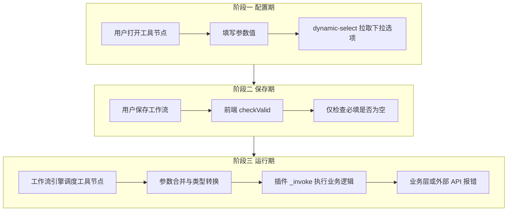
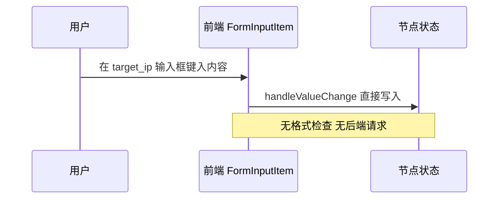
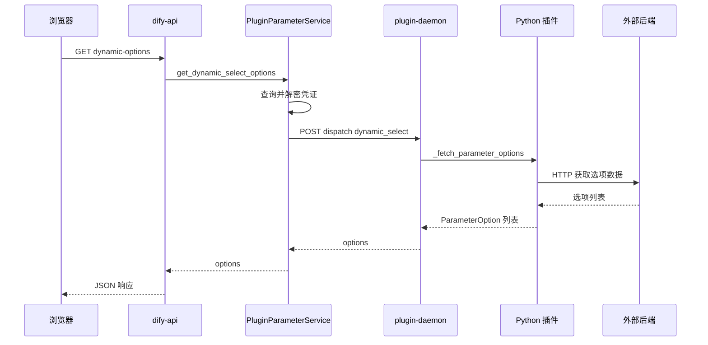
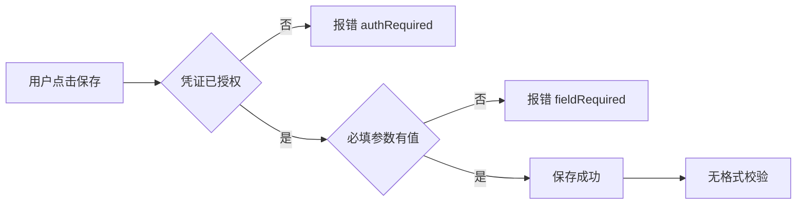
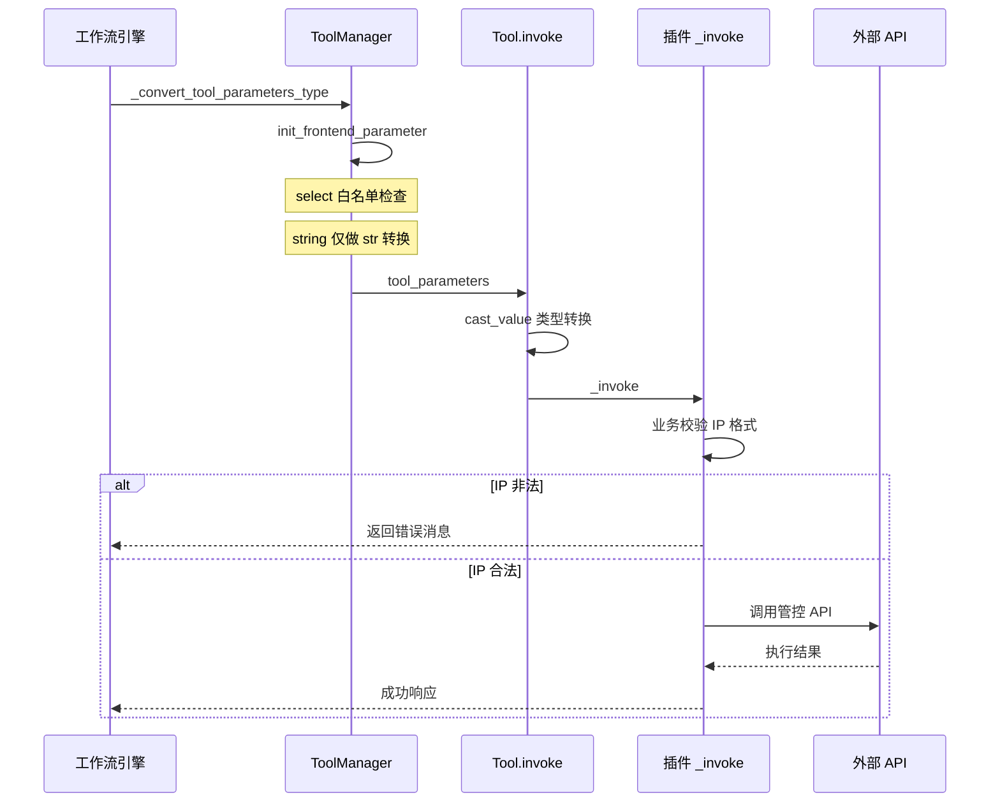
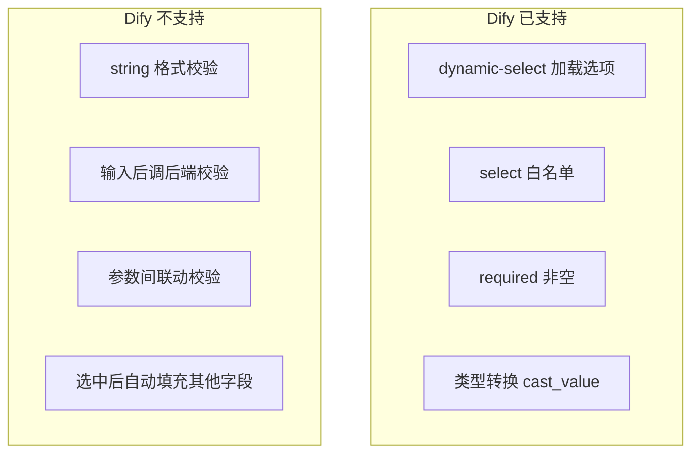
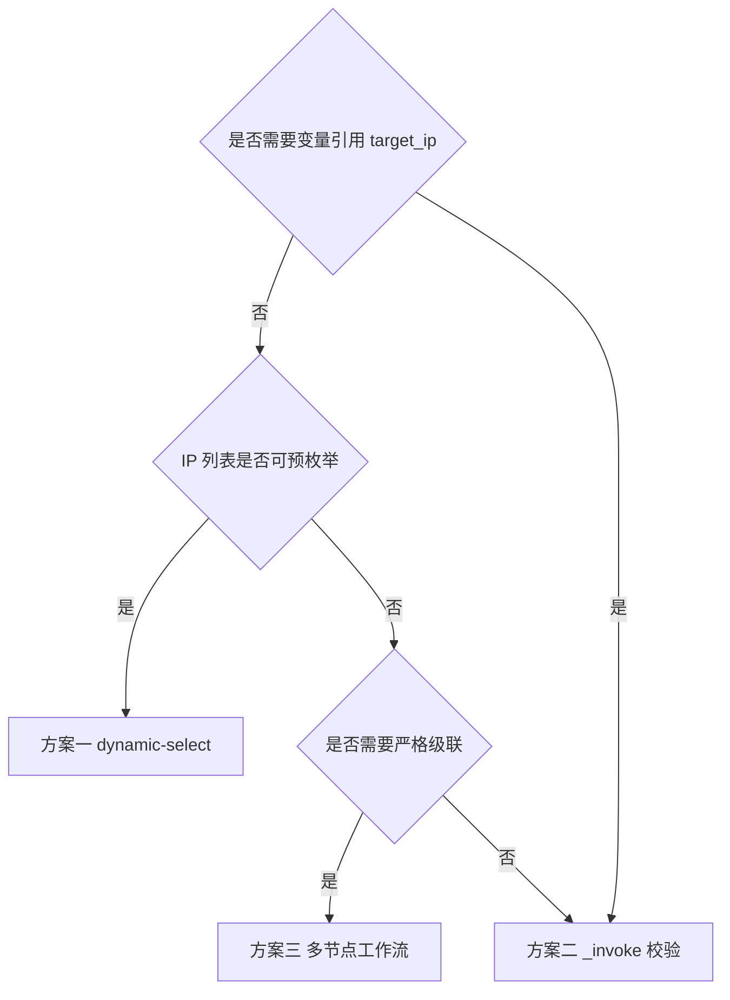
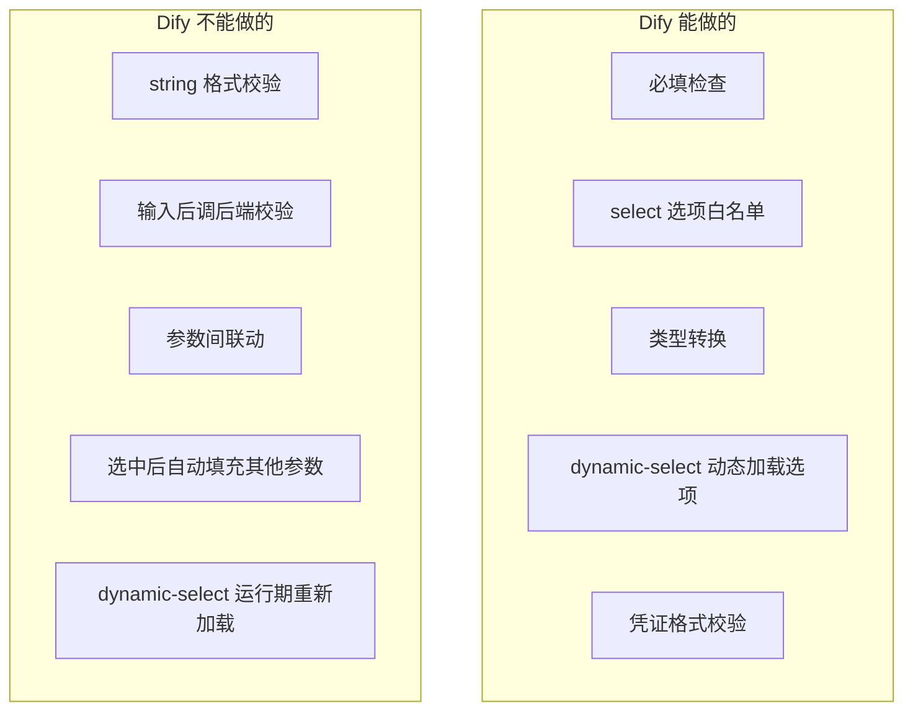

# Dify 工具参数校验机制深度解析：内置能力、流程边界与实战方案

> **版本锚点**：Dify 源码 main 分支，`api/` 后端 + `web/` 前端，`dify_plugin` SDK 0.9.x 及以上。
>
> **核心结论**：Dify 对插件工具参数的内置校验非常克制——仅覆盖「必填检查」「静态 select 白名单」「基础类型转换」三类。`string` 类型**不支持** IP 格式、正则、JSON Schema 等语义校验，也**不存在**「输入完成后调用后端接口校验」的官方机制。配置期唯一的动态后端交互是 `dynamic-select` 的下拉选项加载，与参数值校验无关。
>
> **本文目标**：基于源码逐层梳理校验发生的时机与位置，给出完整 API 文档，并以「级联设备管控工具中 `target_ip` 无法输入时校验」为案例，说明可行变通方案。

---

## 目录

1. [问题背景：为什么随意输入不报错，运行才失败](#1-问题背景为什么随意输入不报错运行才失败)
2. [校验发生的三个阶段](#2-校验发生的三个阶段)
3. [Dify 内置校验能力总览](#3-dify-内置校验能力总览)
4. [阶段一：配置期校验](#4-阶段一配置期校验)
5. [阶段二：工作流保存期校验](#5-阶段二工作流保存期校验)
6. [阶段三：运行期校验](#6-阶段三运行期校验)
7. [dynamic-select 接口完整文档](#7-dynamic-select-接口完整文档)
8. [实战案例：target_ip 的 IP 格式校验需求](#8-实战案例target_ip-的-ip-格式校验需求)
9. [变通方案对比与选型](#9-变通方案对比与选型)
10. [注意事项与常见误区](#10-注意事项与常见误区)
11. [FAQ](#11-faq)
12. [总结](#12-总结)

---

## 1. 问题背景：为什么随意输入不报错，运行才失败

在开发「级联设备管控」插件时，YAML 中定义了如下参数：

```yaml
parameters:
  - name: device_info
    type: dynamic-select
    required: true
    form: llm
  - name: target_ip
    type: string
    required: true
    form: form
  - name: action_type
    type: select
    required: true
    form: form
    options:
      - value: ip_block
        label: { zh_Hans: IP封禁 }
```

开发者的期望是：`target_ip` 必须是合法 IP 地址，且最好是所选设备关联 IP 之一。但在 Dify 工作流画布上，`target_ip` 作为 `string` 类型呈现为普通文本框，用户可以输入任意字符串，保存工作流时也不会报错。只有当工作流**真正运行**、插件 `_invoke` 被调用后，后端业务逻辑或外部 API 才会拒绝非法值。

这不是配置写错，而是 **Dify 平台对 `string` 参数没有语义层校验设计**。理解这一点，是正确设计工具参数交互的前提。

---

## 2. 校验发生的三个阶段

Dify 工具参数从用户填写到最终执行，经历三个彼此独立的阶段。每个阶段的校验职责不同，不能互相替代。



**关键认知**：三个阶段之间没有「输入完成后实时校验」的贯通链路。配置期的 `dynamic-select` 只负责**加载下拉选项**，不负责校验用户已输入的 `string` 值。

---

## 3. Dify 内置校验能力总览

下表汇总 Dify 源码中**实际存在**的参数校验能力。凡未列出的校验类型，均需要开发者在插件 `_invoke` 中自行实现，或改造 Dify 源码。

| 校验类型 | 是否内置 | 发生阶段 | 源码位置 | 说明 |
|---------|---------|---------|---------|------|
| `required` 必填 | 是 | 保存期 + 运行期 | `web/.../tool/default.ts` `init_frontend_parameter` | 保存时检查非空；运行期缺省值抛 `ValueError` |
| `select` 选项白名单 | 是 | 运行期 | `api/core/plugin/entities/parameters.py` | 值必须在 YAML `options` 列表中 |
| 基础类型转换 | 是 | 运行期 | `cast_parameter_value` | string 转 str、number 转 int/float、boolean 解析等 |
| `number` 的 min/max | 部分 | 配置期 UI | 前端 `ParameterItem` 组件 | 仅模型参数页，工具参数 number 输入框有前端限制 |
| `string` 格式校验 | **否** | — | — | 无 pattern、format、IP 校验 |
| 输入后调后端校验 | **否** | — | — | 无 validate_parameter 钩子 |
| 参数间联动校验 | **否** | — | — | dynamic-select 不携带其他参数状态 |
| 凭证格式校验 | 是 | 安装/配置凭证时 | 插件 `_validate_credentials` | 仅校验凭证，不校验工具参数值 |
| dynamic-select 选项加载 | 是 | 配置期 | `_fetch_parameter_options` | 加载下拉，非值校验 |

---

## 4. 阶段一：配置期校验

### 4.1 string 类型：零校验

`string` 类型在前端映射为 `text-input`，由 `MixedVariableTextInput` 组件渲染，支持常量输入和变量引用。组件的 `onChange` 直接更新值，**没有** `onBlur` 校验逻辑，也**没有**调用任何后端校验接口。



对应源码：`web/app/components/workflow/nodes/_base/components/form-input-item.tsx` 中 `handleValueChange` 仅做值更新，不做任何格式判断。

### 4.2 select 类型：仅 UI 层限制

静态 `select` 的下拉选项来自 YAML 中写死的 `options`，用户只能从已有选项中选择，**无法在 UI 层输入列表外的值**。但这属于 UI 控件约束，不是运行期的显式校验；若通过变量引用传入，`select` 的白名单校验会在运行期由 `init_frontend_parameter` 执行。

### 4.3 dynamic-select：唯一的配置期后端调用

`dynamic-select` 是配置期**唯一**会触发后端调用的参数类型。当用户打开工具节点面板时，前端 `useEffect` 检测参数类型为 `dynamic-select`，通过 `useFetchDynamicOptions` 发起 HTTP 请求，最终调用插件 Python 代码中的 `_fetch_parameter_options(parameter)` 方法，从外部服务拉取选项列表。

**重要区分**：

- 它解决的是「下拉选项从哪来」
- 它**不是**「用户输入值是否合法」的校验接口
- 它**不会**因为其他参数变化而重新触发（无联动）
- 保存后选项值变为静态常量，运行期不再调用



### 4.4 PluginParameter 模型：无格式字段

后端参数模型 `PluginParameter`（`api/core/plugin/entities/parameters.py`）定义了工具参数的全部元数据字段：

```python
class PluginParameter(BaseModel):
    name: str
    label: I18nObject
    placeholder: I18nObject | None = None
    required: bool = False
    default: Union[float, int, str, bool, list, dict] | None = None
    min: Union[float, int] | None = None
    max: Union[float, int] | None = None
    precision: int | None = None
    options: list[PluginParameterOption] = Field(default_factory=list)
```

注意：**没有** `pattern`、`format`、`regex`、`validate_url` 等字段。因此 YAML 中无法声明「target_ip 必须是 IPv4 格式」这类约束。

---

## 5. 阶段二：工作流保存期校验

用户点击保存工作流时，前端对每个工具节点调用 `checkValid` 方法（`web/app/components/workflow/nodes/tool/default.ts`）。该校验逻辑**极其简单**：

1. 检查工具凭证是否已授权（`notAuthed`）
2. 对 `toolInputsSchema` 中 `required: true` 的字段，检查 `tool_parameters` 是否有值
3. 对 `toolSettingSchema` 中 `required: true` 的字段，检查 `tool_configurations` 是否有值

核心代码逻辑如下：

```typescript
// web/app/components/workflow/nodes/tool/default.ts
checkValid(payload, t, moreDataForCheckValid) {
  // 1. 凭证检查
  if (notAuthed)
    errorMessages = t('errorMsg.authRequired')

  // 2. 输入变量区必填检查
  toolInputsSchema.filter(field => field.required).forEach(field => {
    const targetVar = payload.tool_parameters[field.variable]
    if (!targetVar) {
      errorMessages = t('errorMsg.fieldRequired', { field: field.label })
    }
    // constant 模式：检查 value 是否为空字符串
    // variable 模式：检查变量选择器是否为空数组
  })

  // 3. 设置区必填检查（form: form 的参数）
  toolSettingSchema.filter(field => field.required).forEach(field => {
    const value = payload.tool_configurations[field.variable]
    if (value === undefined || value === null || value === '')
      errorMessages = t('errorMsg.fieldRequired', { field: field.label })
  })

  return { isValid: !errorMessages, errorMessage: errorMessages }
}
```

**保存期不做的事**：

- 不校验 IP 格式、邮箱格式、URL 格式
- 不校验 `string` 参数的业务语义
- 不调用插件后端做任何远程校验
- 不校验参数间的逻辑关系（如 target_ip 是否属于 device_info 中的 IP 列表）

因此，`target_ip` 填入 `abc123` 可以正常保存工作流，这是预期行为。



---

## 6. 阶段三：运行期校验

运行期是参数校验最完整的阶段，但仍以**类型转换**和**选项白名单**为主，不含语义校验。

### 6.1 参数合并流程

工作流引擎执行工具节点时，需要将两类参数合并为统一的 `tool_parameters` 字典传给插件 `_invoke`：

| 来源 | YAML `form` | 存储位置 | 说明 |
|------|------------|---------|------|
| 输入变量区 | `form: llm` | `tool_parameters` | 可由 LLM 填充或用户手动指定 |
| 设置区 | `form: form` | `tool_configurations` | 用户在节点面板固定配置 |

合并逻辑在 `ToolManager._convert_tool_parameters_type`（`api/core/tools/tool_manager.py`）中完成。对于 `form: form` 的参数，支持三种输入模式：

- `constant`：直接使用常量值
- `variable`：从变量池读取上游节点输出
- `mixed`：模板语法，运行时拼接变量

### 6.2 init_frontend_parameter：核心校验函数

参数值在传入插件前，会经过 `init_frontend_parameter`（`api/core/plugin/entities/parameters.py`）处理：

```python
def init_frontend_parameter(rule: PluginParameter, type: StrEnum, value: Any):
    parameter_value = value
    # 1. 缺省值处理
    if not parameter_value and parameter_value != 0:
        parameter_value = rule.default
        if not parameter_value and rule.required:
            raise ValueError(f"tool parameter {rule.name} not found in tool config")

    # 2. select 白名单校验（唯一的值域校验）
    if type == PluginParameterType.SELECT:
        options = [x.value for x in rule.options]
        if parameter_value is not None and parameter_value not in options:
            raise ValueError(
                f"tool parameter {rule.name} value {parameter_value} not in options {options}"
            )

    # 3. 类型转换
    return cast_parameter_value(type, parameter_value)
```

**仅有的值域校验**是 `select` 类型的白名单检查。`string`、`dynamic-select`、`number` 等类型在此函数中**不做格式或范围校验**。

### 6.3 cast_parameter_value：类型转换而非格式校验

```python
def cast_parameter_value(typ: StrEnum, value: Any, /):
    match typ.value:
        case PluginParameterType.STRING | PluginParameterType.SELECT | ...:
            return value if isinstance(value, str) else str(value)
        case PluginParameterType.NUMBER:
            # 字符串 "3.14" 转 float，"42" 转 int
            ...
        case PluginParameterType.BOOLEAN:
            # 支持 true/yes/1 等 YAML 布尔字符串
            ...
        case PluginParameterType.FILE:
            # 确保单文件
            ...
```

对于 `string` 类型，`"not-an-ip"` 和 `"192.168.1.1"` 都会被原样保留为字符串，不会触发任何格式异常。

### 6.4 Tool._transform_tool_parameters_type

插件工具最终调用前，`Tool.invoke`（`api/core/tools/__base/tool.py`）会对每个参数执行 `cast_value`：

```python
def _transform_tool_parameters_type(self, tool_parameters):
    result = deepcopy(tool_parameters)
    for parameter in self.entity.parameters or []:
        if parameter.name in tool_parameters:
            result[parameter.name] = parameter.type.cast_value(tool_parameters[parameter.name])
    return result
```

### 6.5 运行期错误传播

若 `init_frontend_parameter` 或 `cast_parameter_value` 抛出异常，工作流引擎会捕获并转化为用户可见的错误信息：

```python
# api/core/tools/tool_engine.py
except ToolParameterValidationError as e:
    error_response = f"tool parameters validation error: {e}, please check your tool parameters"
```

但如前所述，对于非法 IP 格式的 `string` 值，**不会走到这个异常分支**，而是直接进入 `_invoke`，由业务代码或外部 API 报错。这也是用户感知到「运行时才失败」的根本原因。



---

## 7. dynamic-select 接口完整文档

`dynamic-select` 是 Dify 当前唯一的配置期动态参数接口。以下基于源码整理完整契约。

### 7.1 接口一：获取动态下拉选项

**请求**

| 属性 | 值 |
|------|-----|
| 方法 | `GET` |
| 路径 | `/console/api/workspaces/current/plugin/parameters/dynamic-options` |
| 认证 | 需要登录，且为管理员或所有者 |
| Content-Type | 无请求体，参数通过 Query String 传递 |

**Query 参数**

| 参数名 | 类型 | 必填 | 说明 |
|--------|------|------|------|
| `plugin_id` | string | 是 | 插件 ID，如 `your-name/iot_device_http` |
| `provider` | string | 是 | Provider 全名 |
| `action` | string | 是 | 工具名称，如 `cascading_device_action` |
| `parameter` | string | 是 | 参数名，如 `device_info` |
| `provider_type` | string | 是 | 固定值 `tool` 或 `trigger` |
| `credential_id` | string | 否 | 指定凭证 ID，不传则使用默认凭证 |

**请求示例**

```http
GET /console/api/workspaces/current/plugin/parameters/dynamic-options?plugin_id=your-name%2Fiot_device_http&provider=your-name%2Fiot_device_http%2Fiot_device_http&action=cascading_device_action&parameter=device_info&provider_type=tool
```

**成功响应** `200 OK`

```json
{
  "options": [
    {
      "value": "eyJkZXZpY2VJZCI6ICIxMjM0In0=",
      "label": {
        "en_US": "Device-A 192.168.1.10",
        "zh_Hans": "设备A 192.168.1.10"
      },
      "icon": null
    }
  ]
}
```

**响应字段说明**

| 字段 | 类型 | 说明 |
|------|------|------|
| `options` | array | 选项列表 |
| `options[].value` | string | 选项值，运行期直接使用此字符串 |
| `options[].label` | object | 国际化显示文本，含 `en_US` `zh_Hans` 等 |
| `options[].icon` | string 或 null | 可选图标 URL 或 base64 |

**错误响应** `400 Bad Request`

```json
{
  "code": "plugin_error",
  "message": "具体错误描述"
}
```

**后端处理链路**

1. `PluginFetchDynamicSelectOptionsApi.get`（`api/controllers/console/workspace/plugin.py`）
2. `ParserDynamicOptions.model_validate` 解析 Query 参数
3. `PluginParameterService.get_dynamic_select_options` 查询并解密凭证
4. `DynamicSelectClient.fetch_dynamic_select_options` POST 到 plugin-daemon
5. daemon 调度插件进程，调用 `_fetch_parameter_options(parameter)`
6. 插件从外部后端拉取数据，封装为 `ParameterOption` 列表返回

**daemon 侧请求体结构**

```json
{
  "user_id": "用户ID",
  "data": {
    "provider": "provider_name",
    "credentials": { "service_url": "http://..." },
    "credential_type": "api-key",
    "provider_action": "cascading_device_action",
    "parameter": "device_info"
  }
}
```

注意：请求体中**不包含**其他参数的当前值，无法实现参数联动。

### 7.2 接口二：使用临时凭证获取动态选项

用于触发器编辑模式下，凭证已修改但尚未保存的场景。

**请求**

| 属性 | 值 |
|------|-----|
| 方法 | `POST` |
| 路径 | `/console/api/workspaces/current/plugin/parameters/dynamic-options-with-credentials` |
| 认证 | 需要登录，且为管理员或所有者 |
| Content-Type | `application/json` |

**请求体**

| 字段 | 类型 | 必填 | 说明 |
|------|------|------|------|
| `plugin_id` | string | 是 | 插件 ID |
| `provider` | string | 是 | Provider 全名 |
| `action` | string | 是 | 工具或触发器动作名 |
| `parameter` | string | 是 | 参数名 |
| `credential_id` | string | 是 | 凭证 ID，用于安全校验 |
| `credentials` | object | 是 | 当前表单中的凭证字段值 |

**请求示例**

```json
{
  "plugin_id": "your-name/iot_device_http",
  "provider": "your-name/iot_device_http/iot_device_http",
  "action": "cascading_device_action",
  "parameter": "device_info",
  "credential_id": "cred-uuid-xxx",
  "credentials": {
    "service_url": "http://192.168.1.100:8080",
    "api_key": "[__HIDDEN__]"
  }
}
```

**成功响应**：与接口一相同，返回 `{ "options": [...] }`。

**安全说明**：`credential_id` 会与 `tenant_id` 联合校验，防止跨租户访问凭证。`[__HIDDEN__]` 占位符会被替换为数据库中的原始值。

### 7.3 插件侧钩子：_fetch_parameter_options

插件 Python 代码需实现：

```python
from dify_plugin.entities import I18nObject, ParameterOption

def _fetch_parameter_options(self, parameter: str) -> list[ParameterOption]:
    if parameter == "device_info":
        devices = self._call_backend_api("/api/devices")
        return [
            ParameterOption(
                value=base64.b64encode(json.dumps(d).encode()).decode(),
                label=I18nObject(zh_Hans=d["name"], en_US=d["name"]),
            )
            for d in devices
        ]
    return []
```

**限制清单**：

| 限制 | 说明 |
|------|------|
| 只接收 parameter 名 | 无法获取其他参数当前值 |
| 返回格式固定 | 只能是 value + label + icon |
| 无分页 | 所有选项必须一次返回 |
| 配置期专用 | 保存后值变静态常量，运行期不再调用 |
| 不支持变量引用模式 | dynamic-select 只能选常量 |

---

## 8. 实战案例：target_ip 的 IP 格式校验需求

### 8.1 业务场景复述

「级联设备管控」工具的核心参数：

| 参数 | 类型 | form | 作用 |
|------|------|------|------|
| `device_info` | dynamic-select | llm | 选择设备，值为 base64 JSON |
| `target_ip` | string | form | 目标 IP，期望合法 IP 且属于设备 |
| `action_type` | select | form | 操作类型，有白名单保护 |
| `user_input` | string | form | 可选备注 |
| `custom_params` | string | form | 可选 JSON 字符串 |

其中 `action_type` 作为 `select` 类型，用户无法输入列表外值，且运行期有白名单校验。而 `target_ip` 作为 `string` 类型，**三层校验均不覆盖 IP 格式**。

### 8.2 为什么不能用 dynamic-select 做输入校验

开发者可能想到：能否仿照 `dynamic-select` 的机制，在用户输入 `target_ip` 后调后端校验？答案是**当前架构不支持**，原因如下：

1. 前端 `FormInputItem` 对 `text-input` 没有 `onBlur` 校验钩子
2. 后端没有 `/plugin/parameters/validate` 类接口
3. 插件 SDK 没有 `_validate_parameter` 方法
4. `dynamic-select` 的 `_fetch_parameter_options` 只在加载下拉时触发，与文本输入无关



### 8.3 参数 form 分区对校验的影响

`target_ip` 的 `form: form` 意味着它出现在节点「设置区」，保存为 `tool_configurations` 中的常量或变量引用。即使用户在设置区手动输入了非法 IP，保存期和运行期的内置校验都不会拦截。

若改为 `form: llm`，参数会出现在「输入变量区」，支持 LLM 自动填充或上游变量引用，但同样**没有格式校验**，且 LLM 可能生成更不规范的值。

---

## 9. 变通方案对比与选型

既然平台不提供输入时校验，开发者需要在插件层或工作流层选择变通方案。

### 9.1 方案一：target_ip 改为 dynamic-select

**思路**：不提供自由输入，只让用户从后端返回的合法 IP 列表中选择。

```yaml
  - name: target_ip
    type: dynamic-select
    required: true
    form: form
```

```python
def _fetch_parameter_options(self, parameter: str) -> list[ParameterOption]:
    if parameter == "target_ip":
        ips = self._fetch_all_device_ips()  # 调用 Spring 后端
        return [
            ParameterOption(value=ip, label=I18nObject(zh_Hans=ip, en_US=ip))
            for ip in ips
        ]
```

| 优点 | 缺点 |
|------|------|
| 用户无法输入非法 IP | 无法根据已选 device_info 过滤 IP |
| 无需改 Dify 源码 | 不支持上游变量引用 |
| 与平台机制完全兼容 | 设备很多时选项列表过长 |

**适用**：IP 集合可预先枚举、不需要严格级联的场景。

### 9.2 方案二：保留 string，在 _invoke 开头校验

**思路**：接受「运行时才报错」，但将错误信息提前到 `_invoke` 入口，避免调用外部 API 后才失败。

```python
import base64, json, ipaddress

def _invoke(self, tool_parameters: dict[str, Any]):
    target_ip = str(tool_parameters.get("target_ip", "")).strip()

    # IP 格式校验
    try:
        ipaddress.ip_address(target_ip)
    except ValueError:
        yield self.create_text_message(f"错误：target_ip [{target_ip}] 不是合法 IP 地址")
        return

    # 设备关联 IP 校验
    try:
        device = json.loads(base64.b64decode(tool_parameters["device_info"]))
        if target_ip not in device.get("ips", []):
            yield self.create_text_message(
                f"错误：IP [{target_ip}] 不在设备 {device.get('deviceId')} 的关联 IP 列表中"
            )
            return
    except Exception as e:
        yield self.create_text_message(f"错误：device_info 解析失败 - {e}")
        return

    # 校验通过，继续业务逻辑
    ...
```

| 优点 | 缺点 |
|------|------|
| 支持手动输入和变量引用 | 配置期无法感知错误 |
| 错误信息友好可控 | 浪费一次工作流运行 |
| 改动最小 | 用户体验不如输入时拦截 |

**适用**：必须支持变量引用或自由输入的场景。

### 9.3 方案三：多节点工作流拆分

**思路**：将「选设备」「解析 IP 列表」「执行管控」拆成多个节点。


| 优点 | 缺点 |
|------|------|
| 可在代码节点做复杂校验 | 工作流结构变复杂 |
| 支持级联逻辑 | 维护成本较高 |
| 不依赖 Dify 新特性 | 多节点间传参需仔细设计 |

**适用**：需要严格级联、逻辑复杂的生产环境。

### 9.4 方案四：合并参数，减少 target_ip

**思路**：若设备通常只有一个主 IP，可在 `_invoke` 中从 `device_info` 自动提取默认 IP，`target_ip` 改为可选覆盖项。

| 优点 | 缺点 |
|------|------|
| 减少用户操作步骤 | 多 IP 设备需额外处理 |
| 降低填错概率 | 灵活性下降 |

### 9.5 方案选型决策



---

## 10. 注意事项与常见误区

### 10.1 配置期与运行期是两条独立链路

很多开发者误以为 `dynamic-select` 在每次运行工作流时都会重新拉取选项。实际上：

- **配置期**：打开节点 → 调用 `_fetch_parameter_options` → 用户选择 → 值存入节点配置
- **运行期**：直接读取已保存的常量值 → 传给 `_invoke`，**不再调用下拉接口**

若设备在配置后下线，已保存的工作流仍会使用旧值执行。

### 10.2 凭证校验不等于参数校验

插件的 `_validate_credentials` 仅在安装或配置凭证时调用，用于验证凭证格式或连通性。它**不会**校验工具参数值。凭证校验通过，不代表 `target_ip` 合法。

### 10.3 select 与 dynamic-select 的校验差异

| 类型 | 配置期约束 | 运行期校验 |
|------|-----------|-----------|
| `select` | UI 下拉限制选项 | `init_frontend_parameter` 白名单检查 |
| `dynamic-select` | UI 下拉限制选项 | 仅 `cast_value` 转字符串，**无白名单** |
| `string` | 无 | 仅 `cast_value` 转字符串 |

注意：`dynamic-select` 运行期**不做**选项白名单校验。若有人通过 API 直接传入不在选项列表中的值，不会被 `init_frontend_parameter` 拦截。

### 10.4 form llm 与 form form 的校验无差异

无论参数在输入变量区还是设置区，内置校验逻辑完全相同。`form` 只影响 UI 分区和参数来源，不影响校验规则。

### 10.5 不要尝试自定义参数类型

Dify 后端 `CommonParameterType` 是枚举白名单，前端 `FormTypeEnum` 也有固定映射。在 YAML 中写 `type: ip-address` 会导致插件打包或加载失败。格式校验应在 `_invoke` 中实现，或通过 `dynamic-select` 限制可选值。

### 10.6 改造 Dify 源码的成本评估

若业务强需求「输入完成后实时校验」，需要同时修改：

| 层 | 改动内容 |
|----|---------|
| 插件 SDK | 新增 `_validate_parameter` 钩子 |
| plugin-daemon | 新增 dispatch 路由 |
| dify-api | 新增 `/plugin/parameters/validate` 接口 |
| dify-web | `FormInputItem` 增加 onBlur 校验调用 |

这是平台级功能，不建议在业务项目中自行 fork 维护，除非有长期投入计划。

---

## 11. FAQ

**Q1：能否在 YAML 中给 string 参数加 pattern 正则？**

不能。`PluginParameter` 模型无此字段，YAML schema 也不支持。

**Q2：dynamic-select 选中后能否自动填充 target_ip？**

不能。`handleValueChange` 只更新当前参数值，不会触发其他参数更新。可选变通：将 IP 编码进 `device_info` 的 value，在 `_invoke` 中解码使用。

**Q3：多个 dynamic-select 能否联动？**

不能。`_fetch_parameter_options` 只接收 `parameter` 名，API 请求体不携带其他参数状态，前端 `extraParams` 对工具参数始终未传递。

**Q4：工作流保存时能否增加 IP 格式检查？**

可以改 `checkValid`，但这是前端局部改动，且只能校验常量值，无法校验变量引用模式下的运行时值。官方未提供此能力。

**Q5：number 类型的 min max 能用于工具参数吗？**

`PluginParameter` 有 `min`/`max` 字段，但工具参数表单的前端组件对 number 输入框支持有限，主要校验仍在 `cast_parameter_value` 做类型转换，不做范围强制拒绝。

**Q6：object 和 array 类型有 schema 校验吗？**

`object`/`array` 类型参数带有 `input_schema` 字段（JSON Schema），前端提供 Schema 查看按钮，但**不做**输入时的 schema 校验，主要用于 LLM 侧参数描述。

---

## 12. 总结

### 12.1 三条核心结论

**结论一**：Dify 工具参数的内置校验仅覆盖「必填」「select 白名单」「基础类型转换」三类，不含任何语义格式校验。`string` 参数可输入任意文本，这是架构设计而非 bug。

**结论二**：配置期唯一的动态后端交互是 `dynamic-select` 的选项加载接口，它解决「下拉选项从哪来」，不解决「输入值是否合法」。不存在输入完成后调后端校验的官方机制。

**结论三**：对于 `target_ip` 这类需要 IP 格式和业务规则校验的参数，推荐优先改为 `dynamic-select` 限制可选值；若必须支持自由输入或变量引用，则在 `_invoke` 入口尽早校验并返回友好错误；若需严格级联，采用多节点工作流拆分。

### 12.2 能力与边界速查



### 12.3 关键源码索引

| 模块 | 文件路径 | 职责 |
|------|---------|------|
| 参数模型 | `api/core/plugin/entities/parameters.py` | PluginParameter 定义、init_frontend_parameter、cast_parameter_value |
| 参数枚举 | `api/core/entities/parameter_entities.py` | CommonParameterType 枚举 |
| 保存期校验 | `web/app/components/workflow/nodes/tool/default.ts` | checkValid 必填检查 |
| 参数表单 | `web/app/components/workflow/nodes/_base/components/form-input-item.tsx` | 各类型 UI 渲染 |
| 动态选项 API | `api/controllers/console/workspace/plugin.py` | dynamic-options 路由 |
| 动态选项服务 | `api/services/plugin/plugin_parameter_service.py` | 凭证查询与 daemon 调用 |
| daemon 客户端 | `api/core/plugin/impl/dynamic_select.py` | 与 plugin-daemon 通信 |
| 运行期引擎 | `api/core/tools/tool_engine.py` | 工具调用与错误传播 |
| 参数合并 | `api/core/tools/tool_manager.py` | _convert_tool_parameters_type |
| 类型转换入口 | `api/core/tools/__base/tool.py` | _transform_tool_parameters_type |

---

> 本文基于 Dify 开源仓库源码分析撰写，若后续版本新增参数校验能力，请以最新源码为准。

