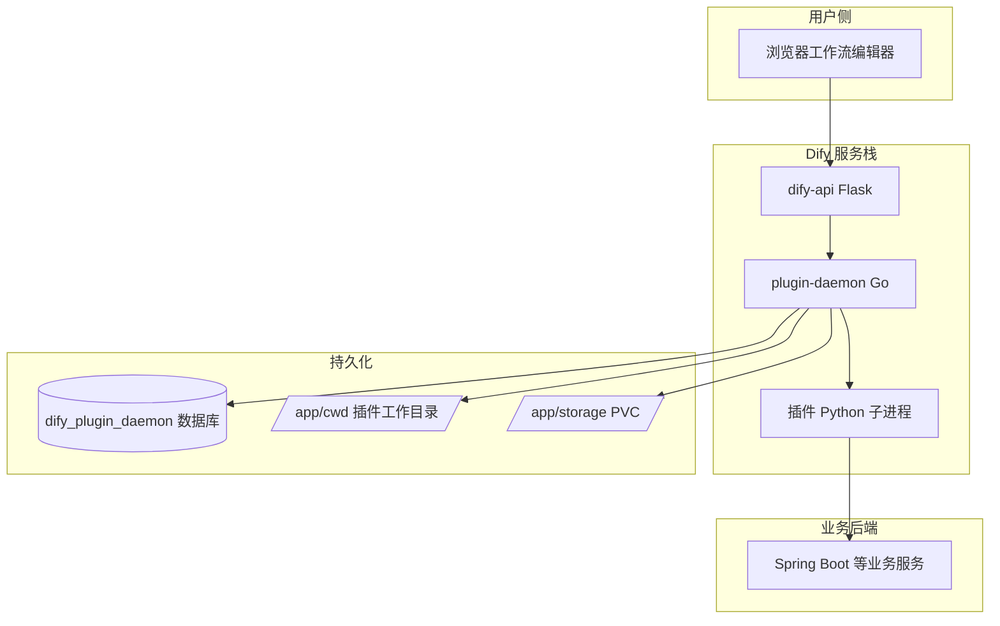
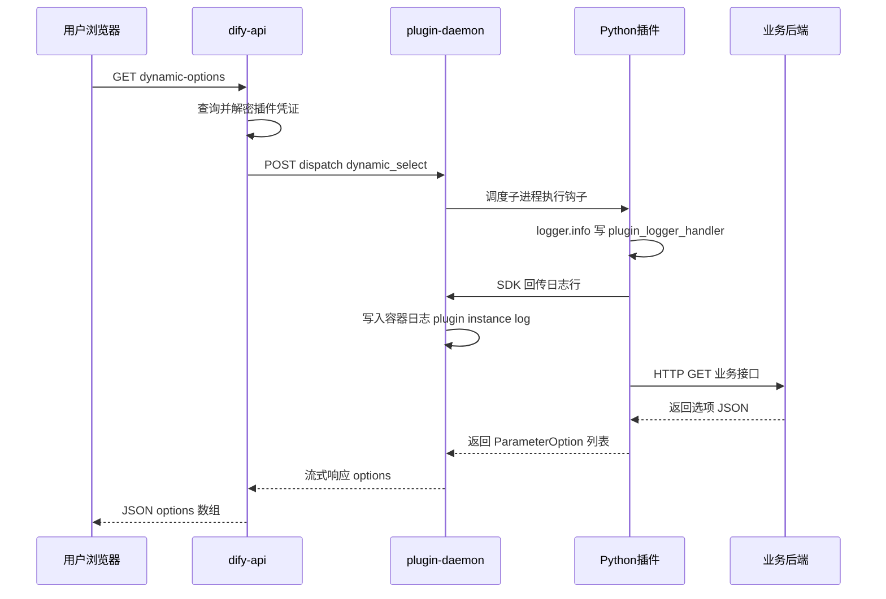
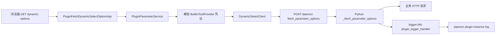
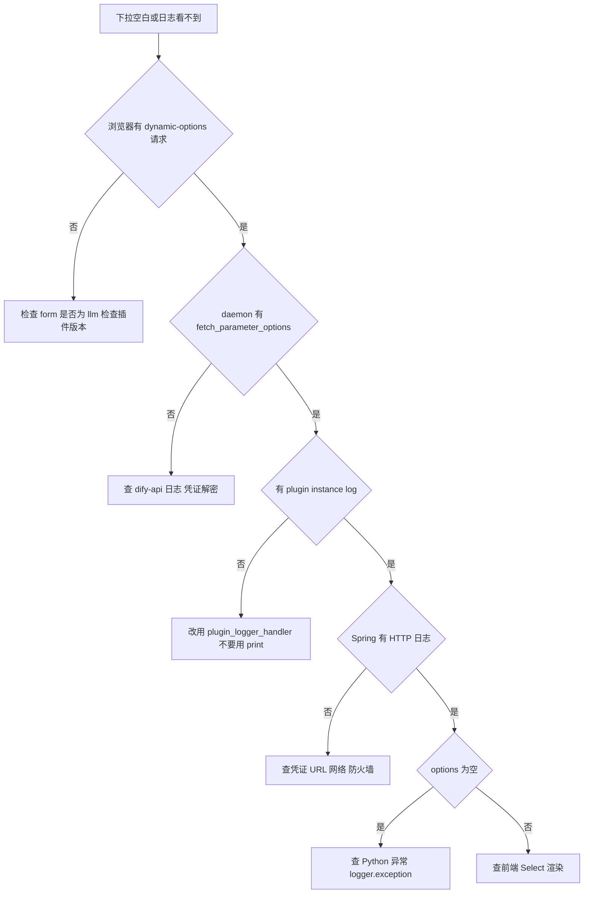

# Dify 插件日志打印与查看完整指南

> 基于 Dify 源码、官方文档与 `iot_device_http` 插件实战验证整理  
> 验证环境：K8s 自托管 Dify、plugin-daemon 0.6.x、dify_plugin SDK 0.9.x  
> 文档日期：2026-06-11

---

## 一、为什么要写这篇文档

在开发 Dify 自定义插件时，最常见的困惑是：

- 插件里写了 `print`，为什么 `kubectl logs` 里看不到？
- Spring Boot 后端已经有请求日志，说明 Python 确实执行了，但 daemon 日志里为什么没有 `[my_tool]` 前缀？
- 配置期 dynamic-select 和运行期 tool invoke 的日志分别在什么时候产生？

本文从 **源码调用链** 出发，说明插件日志的 **打印方式**、**传输路径**、**查看命令**，并附上相关 **HTTP 接口文档** 与 **实战案例**。

---

## 二、核心结论速览

| 问题 | 结论 |
|------|------|
| 服务器安装模式下 `print(stderr)` 能否在 kubectl 看到 | **通常不能**，stdout/stderr 用于 daemon 与插件子进程通信 |
| 正确的日志打印方式 | 使用 SDK 官方 `plugin_logger_handler` + `logging` |
| 日志最终出现在哪里 | `plugin-daemon` 容器日志，格式为 `plugin instance log` |
| 配置期日志触发时机 | 工作流编辑器打开工具节点、拉取 dynamic-select 下拉时 |
| 运行期日志触发时机 | 工作流点击「运行」、执行工具节点时 |
| Dify 控制台能否看插件详细日志 | **不能**，社区版无内置插件日志 UI |

---

## 三、整体架构

### 3.1 组件关系



### 3.2 plugin-daemon 容器目录结构

```
/app/
├── main                    # daemon 主进程 Go 二进制
├── entrypoint.sh           # 启动脚本
├── cwd/                    # 插件运行实体 含 venv 和源码
│   └── {author}/
│       └── {name}-{version}@{hash}/
│           ├── main.py
│           ├── manifest.yaml
│           ├── tools/
│           └── .venv/
└── storage/                # 通常挂载 PVC
    ├── plugin/             # 已安装插件注册信息
    ├── plugin_packages/    # 历史上传的 difypkg 包
    └── assets/             # 插件图标等媒体
```

**注意**：部分 K8s 环境中 `cwd` 位于 `/app/cwd/` 而非 `/app/storage/cwd/`，以实际 `PLUGIN_WORKING_PATH` 环境变量为准。

---

## 四、插件日志打印与传输流程

### 4.1 两种运行模式对比

| 模式 | 启动方式 | 日志去向 |
|------|----------|----------|
| **服务器安装模式** | daemon 拉起 Python 子进程 | `plugin_logger_handler` 经 daemon 写入容器日志 |
| **本地 Debug 模式** | 开发者本机 `python -m main` 连远程 5003 端口 | 本地终端 + 远程 daemon 均可 |

plugin-daemon 对 **local runtime** 的设计（来自官方 README）：

- daemon 以 **子进程** 方式启动插件
- 通过 **STDIN 和 STDOUT** 进行 JSON-RPC 通信
- **STDERR 默认不会可靠转发到容器日志**

因此 `print(..., file=sys.stderr)` 在服务器安装模式下 **不可见**，这不是配置错误，而是架构限制。

### 4.2 正确打印方式 官方推荐

来源：[Dify 官方文档 Plugin Logging](https://docs.dify.ai/en/develop-plugin/features-and-specs/plugin-types/plugin-logging)

```python
import logging
from dify_plugin.config.logger_format import plugin_logger_handler

logger = logging.getLogger(__name__)
logger.setLevel(logging.INFO)
if not logger.handlers:
    logger.addHandler(plugin_logger_handler)


def _log(msg: str) -> None:
    logger.info(f"[my_tool] {msg}")
```

异常栈使用 `logger.exception` 而非 `traceback.print_exc`：

```python
try:
    spring_url = self._spring_url()
except Exception as e:
    _log(f"读取凭证异常 {e}")
    logger.exception("读取凭证异常")
    return []
```

### 4.3 错误方式对比

| 写法 | 服务器安装模式 | 风险 |
|------|---------------|------|
| `print(msg)` 到 stdout | 不可见 | 可能干扰 JSON-RPC 协议 |
| `print(msg, file=sys.stderr)` | 不可见 | 社区常见误区 |
| `logging` 默认 StreamHandler | 不可见 | 未走 SDK 通道 |
| `plugin_logger_handler` + `logger.info` | **可见** | 官方推荐 |

### 4.4 日志传输时序图

以 **配置期 dynamic-select** 为例：



### 4.5 daemon 日志成功样例

改造 `cascading_device_action.py` 使用 `plugin_logger_handler` 后，实际输出如下：

```
INFO dify-plugin-daemon logger.go:61 plugin instance log
  plugin=your-name/iot_device_http:0.0.21@00bee14e...
  instance=019eb4b0
  message="[cascading_device_action] 准备请求 GET http://10.11.34.37:8080/api/cascading-device/select-options params=..."

INFO dify-plugin-daemon logger.go:61 plugin instance log
  message="[cascading_device_action] 响应状态码 200"

INFO dify-plugin-daemon middleware.go:83
  method=POST path=/plugin/.../dispatch/dynamic_select/fetch_parameter_options
  status=200 latency_ms=12203
```

关键识别字段：

- `plugin instance log` — 表示来自插件 Python 进程
- `message=` — 你的 `logger.info` 内容
- `plugin=` — 插件唯一标识符
- `instance=` — 插件运行时实例 ID

---

## 五、日志查看方式

### 5.1 查看 plugin-daemon 日志 推荐

```bash
# 实时跟踪 先开日志再操作界面
kubectl logs -n dify -l app=dify-plugin-daemon -f --tail=50

# 指定 Pod
kubectl logs -n dify dify-plugin-daemon-645c465b57-k9bgv -f --tail=50

# 过滤插件实例日志
kubectl logs -n dify -l app=dify-plugin-daemon -f | grep "plugin instance log"

# 按工具名过滤
kubectl logs -n dify -l app=dify-plugin-daemon -f | grep cascading_device_action
```

Docker Compose 环境：

```bash
docker compose logs plugin_daemon -f --tail=50
```

### 5.2 查看 dify-api 日志 辅助

api 日志 **不包含** 插件 Python 的 `message`，但可确认请求是否到达 API 层：

```bash
kubectl logs -n dify -l app=dify-api -f --tail=50 | grep -i "plugin\|dynamic"
```

### 5.3 三源日志联查策略

| 日志源 | 命令 | 适用场景 |
|--------|------|----------|
| plugin-daemon | `kubectl logs ... plugin-daemon` | 插件 Python 日志、daemon 调度 |
| dify-api | `kubectl logs ... dify-api` | dynamic-options 是否到达 API |
| 业务后端 | Spring 应用日志 | Python 是否成功发起 HTTP |

排查顺序建议：

1. 浏览器 Network 是否有 `dynamic-options` 请求
2. daemon 是否有 `dispatch/dynamic_select/fetch_parameter_options`
3. daemon 是否有 `plugin instance log`
4. 业务后端是否收到 HTTP 请求

### 5.4 配置期与运行期日志区别

| 阶段 | 触发操作 | Python 入口方法 | daemon dispatch 路径 |
|------|----------|----------------|---------------------|
| **配置期** | 编辑器打开节点、点下拉框 | `_fetch_parameter_options` | `dynamic_select/fetch_parameter_options` |
| **运行期** | 工作流运行 | `_invoke` | `tool/invoke` |

**常见误区**：只在「运行工作流」时查日志，却期望看到 `_fetch_parameter_options` 里的日志 — 配置期和运行期是两条独立链路。

---

## 六、相关 HTTP 接口文档

### 6.1 控制台 API 拉取 dynamic-select 选项

面向浏览器工作流编辑器，需登录态。

#### 接口一 使用已保存凭证

| 项 | 内容 |
|----|------|
| **方法** | `GET` |
| **路径** | `/console/api/workspaces/current/plugin/parameters/dynamic-options` |
| **鉴权** | 登录 Cookie / Bearer Token，需 admin 或 owner |
| **源码** | `dify/api/controllers/console/workspace/plugin.py` → `PluginFetchDynamicSelectOptionsApi` |

**Query 参数**

| 参数名 | 类型 | 必填 | 说明 | 示例 |
|--------|------|------|------|------|
| `plugin_id` | string | 是 | 插件 ID | `your-name/iot_device_http` |
| `provider` | string | 是 | Provider 全名 | `your-name/iot_device_http/iot_device_http` |
| `action` | string | 是 | 工具 identity.name | `cascading_device_action` |
| `parameter` | string | 是 | YAML 中 dynamic-select 参数名 | `device_info` |
| `provider_type` | string | 是 | 枚举 `tool` 或 `trigger` | `tool` |
| `credential_id` | string | 否 | 指定凭证 ID，不传则用默认凭证 | UUID |

**请求示例**

```http
GET /console/api/workspaces/current/plugin/parameters/dynamic-options?plugin_id=your-name%2Fiot_device_http&provider=your-name%2Fiot_device_http%2Fiot_device_http&action=cascading_device_action&parameter=device_info&provider_type=tool HTTP/1.1
Host: your-dify-host
Cookie: ...
```

**成功响应 200**

```json
{
  "options": [
    {
      "value": "eyJkZXZpY2VJZCI6ImRldmljZV8wMDIiLC4uLn0=",
      "label": {
        "en_US": "Firewall-02",
        "zh_Hans": "防火墙-02"
      },
      "icon": null
    }
  ]
}
```

**options 数组元素结构**

| 字段 | 类型 | 说明 |
|------|------|------|
| `value` | string | 选项值，写入工作流节点参数 |
| `label` | object | 多语言显示文本，含 `en_US` `zh_Hans` 等 |
| `icon` | string \| null | 可选图标 URL 或 base64 |

**错误响应 400**

```json
{
  "code": "plugin_error",
  "message": "具体错误描述"
}
```

#### 接口二 编辑模式使用临时凭证

| 项 | 内容 |
|----|------|
| **方法** | `POST` |
| **路径** | `/console/api/workspaces/current/plugin/parameters/dynamic-options-with-credentials` |
| **用途** | 凭证修改未保存时预览下拉选项 |

**Body JSON 参数**

| 参数名 | 类型 | 必填 | 说明 |
|--------|------|------|------|
| `plugin_id` | string | 是 | 插件 ID |
| `provider` | string | 是 | Provider 全名 |
| `action` | string | 是 | 工具名 |
| `parameter` | string | 是 | 参数名 |
| `credential_id` | string | 是 | 凭证 ID |
| `credentials` | object | 是 | 临时凭证键值对 |

**成功响应**：与接口一相同，`{"options": [...]}`

---

### 6.2 plugin-daemon 内部 API dynamic-select 调度

dify-api 调用 plugin-daemon，**不对外暴露**，仅供内网通信。

| 项 | 内容 |
|----|------|
| **方法** | `POST` |
| **路径** | `/plugin/{tenant_id}/dispatch/dynamic_select/fetch_parameter_options` |
| **鉴权** | Header `X-Api-Key` = `PLUGIN_DAEMON_KEY` |
| **源码** | `dify/api/core/plugin/impl/dynamic_select.py` → `DynamicSelectClient` |

**请求 Header**

| Header | 说明 |
|--------|------|
| `X-Api-Key` | daemon 通信密钥 |
| `X-Plugin-ID` | 插件 ID，如 `your-name/iot_device_http` |
| `Content-Type` | `application/json` |

**请求 Body**

```json
{
  "user_id": "用户UUID",
  "data": {
    "provider": "iot_device_http",
    "credentials": {
      "spring_service_url": "http://10.11.34.37:8080",
      "api_token": "",
      "app_id": "1234567"
    },
    "credential_type": "api-key",
    "provider_action": "cascading_device_action",
    "parameter": "device_info"
  }
}
```

**Body 字段说明**

| 字段路径 | 类型 | 说明 |
|----------|------|------|
| `user_id` | string | 当前操作用户 ID |
| `data.provider` | string | Provider 短名 不含 author 前缀 |
| `data.credentials` | object | 解密后的插件凭证 |
| `data.credential_type` | string | `api-key` `oauth2` `unauthorized` |
| `data.provider_action` | string | 工具 YAML 的 identity.name |
| `data.parameter` | string | dynamic-select 参数名 |

**响应结构 流式 JSON 行**

daemon 以流式返回，dify-api 解析为：

```json
{
  "options": [
    {
      "value": "选项值字符串",
      "label": { "en_US": "Label", "zh_Hans": "标签" }
    }
  ]
}
```

对应 Python 模型 `PluginDynamicSelectOptionsResponse`（`dify/api/core/plugin/entities/plugin_daemon.py`）。

**daemon 访问日志样例**

```
INFO dify-plugin-daemon middleware.go:83
  method=POST
  path=/plugin/6aa18048-84ec-41f5-b062-a39c975b8841/dispatch/dynamic_select/fetch_parameter_options
  status=200
  latency_ms=12203
```

---

### 6.3 plugin-daemon 内部 API 工具运行期调用

| 项 | 内容 |
|----|------|
| **方法** | `POST` |
| **路径** | `/plugin/{tenant_id}/dispatch/tool/invoke` |
| **源码** | `dify/api/core/plugin/impl/tool.py` → `ToolClient.invoke` |

**请求 Body 核心字段**

```json
{
  "user_id": "用户UUID",
  "conversation_id": "会话ID或null",
  "app_id": "应用ID或null",
  "message_id": "消息ID或null",
  "data": {
    "provider": "iot_device_http",
    "tool": "cascading_device_action",
    "credentials": { },
    "credential_type": "api-key",
    "tool_parameters": {
      "device_info": "base64编码值",
      "target_ip": "192.168.1.201",
      "action_type": "ip_block"
    }
  }
}
```

**响应**：流式 `ToolInvokeMessage`，包含 `text` `json` 等类型消息。

运行期 `_invoke` 中的 `logger.info` 同样以 `plugin instance log` 形式出现在 daemon 日志中。

---

### 6.4 业务后端接口示例 cascading_device_action

插件配置期调用的 Spring 接口（项目实战）：

| 项 | 内容 |
|----|------|
| **方法** | `GET` |
| **路径** | `/api/cascading-device/select-options` |
| **调用方** | 插件 `_fetch_parameter_options` |

**Query 参数 插件透传**

| 参数 | 说明 |
|------|------|
| `plugin_id` | Dify 插件 ID |
| `provider` | Provider 全名 |
| `action` | 工具名 |
| `parameter` | 参数名 |
| `provider_type` | 固定 `tool` |
| `app_id` | 来自插件凭证 |

**成功响应 200**

```json
[
  {
    "value": "base64编码的JSON",
    "label": "防火墙-02"
  }
]
```

---

## 七、配置期完整调用链源码追踪



**关键源码文件**

| 层级 | 文件路径 |
|------|----------|
| 控制台 API | `dify/api/controllers/console/workspace/plugin.py` |
| 参数服务 | `dify/api/services/plugin/plugin_parameter_service.py` |
| daemon 客户端 | `dify/api/core/plugin/impl/dynamic_select.py` |
| 插件钩子 | `tools/xxx.py` 中 `_fetch_parameter_options` |
| SDK 日志 | `dify_plugin.config.logger_format.plugin_logger_handler` |

---

## 八、实战案例 iot_device_http

### 8.1 插件日志初始化代码

文件：`test-dify/plugin-iot-device-plugin/tools/cascading_device_action.py`

```python
import logging
from dify_plugin.config.logger_format import plugin_logger_handler

logger = logging.getLogger(__name__)
logger.setLevel(logging.INFO)
if not logger.handlers:
    logger.addHandler(plugin_logger_handler)


def _log(msg: str) -> None:
    logger.info(f"[cascading_device_action] {msg}")
```

### 8.2 验证步骤

```bash
# 1. 打包上传新版本插件后 先开日志
kubectl logs -n dify -l app=dify-plugin-daemon -f --tail=20

# 2. 在工作流编辑器中打开级联设备管控节点 点击 device_info 下拉

# 3. 应看到 plugin instance log 且 message 含 cascading_device_action
```

### 8.3 实测日志时间线

| 时间 UTC | 事件 |
|----------|------|
| 03:18:55 | 插件日志 准备请求 GET Spring |
| 03:19:07 | 插件日志 响应 200 返回 3 条选项 |
| 03:19:07 | daemon HTTP fetch_parameter_options 完成 latency 约 12 秒 |

说明：Spring 有日志 + daemon 有 `plugin instance log` 才可确认 Python 层完整执行。

---

## 九、排查决策树



---

## 十、注意事项与最佳实践

### 10.1 日志打印

1. **必须使用 `plugin_logger_handler`**，不要用 `print` 或默认 `logging` Handler
2. **stdout 留给 JSON-RPC**，禁止向 stdout 打调试信息
3. 日志前缀加工具名如 `[cascading_device_action]` 便于 grep
4. 异常用 `logger.exception` 保留堆栈
5. 每个模块用 `logging.getLogger(__name__)` 并检查 `if not logger.handlers` 避免重复 Handler

### 10.2 日志查看

1. **先开 `kubectl logs -f` 再操作界面**，否则短日志可能被冲掉
2. 过滤关键词用 `plugin instance log` 或工具名，不要只 grep 某一行中间字段
3. 多副本时确认日志来自正确的 Pod：`kubectl get pods -n dify -l app=dify-plugin-daemon`
4. daemon 时间戳多为 **UTC**，业务日志可能是 **本地时区**，对照时注意时差
5. Dify 控制台 **没有** 插件日志页面，不要在工作流 UI 里找

### 10.3 部署与环境

| 环境变量 | 默认值 | 说明 |
|----------|--------|------|
| `PLUGIN_WORKING_PATH` | `/app/storage/cwd` 或 `/app/cwd` | 插件工作目录 |
| `PLUGIN_STORAGE_LOCAL_ROOT` | `/app/storage` | 持久化根目录 |
| `PLUGIN_STDIO_BUFFER_SIZE` | `1024` | stdio 缓冲区大小 |
| `PLUGIN_MAX_EXECUTION_TIMEOUT` | `600` | 插件执行超时秒数 |
| `PLUGIN_DAEMON_URL` | `http://plugin_daemon:5002` | api 连接 daemon 地址 |

### 10.4 版本与补丁

1. 修改日志代码后必须 **递增 manifest version 并重新上传** difypkg
2. `dify_plugin` SDK 需 `>=0.9.0` 才支持 dynamic-select
3. 纯 Tool 插件需 `plugin_bootstrap.py` 补丁 SDK issue 280，否则 `_fetch_parameter_options` 可能不被调用
4. GitHub Issue [#31016](https://github.com/langgenius/dify/issues/31016) 记录了 print 日志不可见的已知限制

### 10.5 性能

- 配置期每次打开下拉都会触发完整链路，日志中的 `latency_ms` 可关注
- 业务接口慢会导致下拉卡顿，优先优化后端响应时间
- 避免在 `_fetch_parameter_options` 中做重计算或同步长耗时操作

### 10.6 安全

- 日志中不要打印 `api_token` 等敏感凭证完整值
- `credential keys` 可以打印，值应脱敏
- daemon 内部 API 仅内网可达，勿将 `PLUGIN_DAEMON_KEY` 暴露到公网

---

## 十一、本地 Debug 模式补充

本地开发时可通过 `.env` 连接远程 daemon 调试端口：

```env
REMOTE_INSTALL_HOST=your-dify-host
REMOTE_INSTALL_PORT=5003
INSTALL_METHOD=remote
```

```bash
python -m main
```

此时 `plugin_logger_handler` 日志同时出现在 **本地终端** 和 **远程 daemon 日志**。

服务器安装模式则无需也不应手动 `python -m main`，由 daemon 管理子进程。

---

## 十二、常见问题 FAQ

### Q1 为什么 Spring 有日志但 kubectl 没有插件日志

Python 确实执行并发起了 HTTP 请求，但使用了 `print(stderr)` 而非 `plugin_logger_handler`。改用官方 Handler 即可。

### Q2 grep 为什么一直空

可能原因：用了 print、grep 在请求之后才开、过滤词不对、看错 Pod、线上插件版本未更新。

### Q3 运行工作流为什么看不到 _fetch_parameter_options 日志

运行期走 `_invoke` 和 `tool/invoke`，不会再次调用 `_fetch_parameter_options`。配置期与运行期分开查。

### Q4 日志能否在 Dify 界面查看

社区版目前不支持。只能通过 `kubectl logs` 或 Docker logs 查看 daemon 容器日志。

### Q5 能否写文件到 storage 目录

可以，但不推荐作为常规方案。`/app/storage` 通常有 PVC，可写调试文件，但生产环境应使用标准 logging。

---

## 十三、参考链接

| 资源 | URL |
|------|-----|
| Dify 官方 Plugin Logging 文档 | https://docs.dify.ai/en/develop-plugin/features-and-specs/plugin-types/plugin-logging |
| plugin-daemon README | https://github.com/langgenius/dify-plugin-daemon |
| 插件日志不可见 Issue | https://github.com/langgenius/dify/issues/31016 |
| dynamic-select 配置期参数限制 | 本项目 `20260604-1080-dify动态参数dynamic-select接口的配置期能否拿到同节点其他参数.md` |

---

## 十四、附录 常用命令速查

```bash
# 进入 daemon Pod
kubectl exec -it -n dify deploy/dify-plugin-daemon -- bash

# 查看已安装插件工作目录
ls /app/cwd/your-name/

# 确认线上代码是否含 plugin_logger_handler
grep -r plugin_logger_handler /app/cwd/your-name/iot_device_http-*/

# 实时插件日志
kubectl logs -n dify -l app=dify-plugin-daemon -f | grep "plugin instance log"

# 查 dynamic_select 调度
kubectl logs -n dify -l app=dify-plugin-daemon -f | grep fetch_parameter_options

# 查工具运行
kubectl logs -n dify -l app=dify-plugin-daemon -f | grep "tool/invoke"
```

---

*本文基于 Dify 开源仓库 api 层源码与 iot_device_http 0.0.21 实测编写。plugin-daemon Go 侧 `logger.go` 为闭源镜像内实现，行为以容器日志实测为准。*
