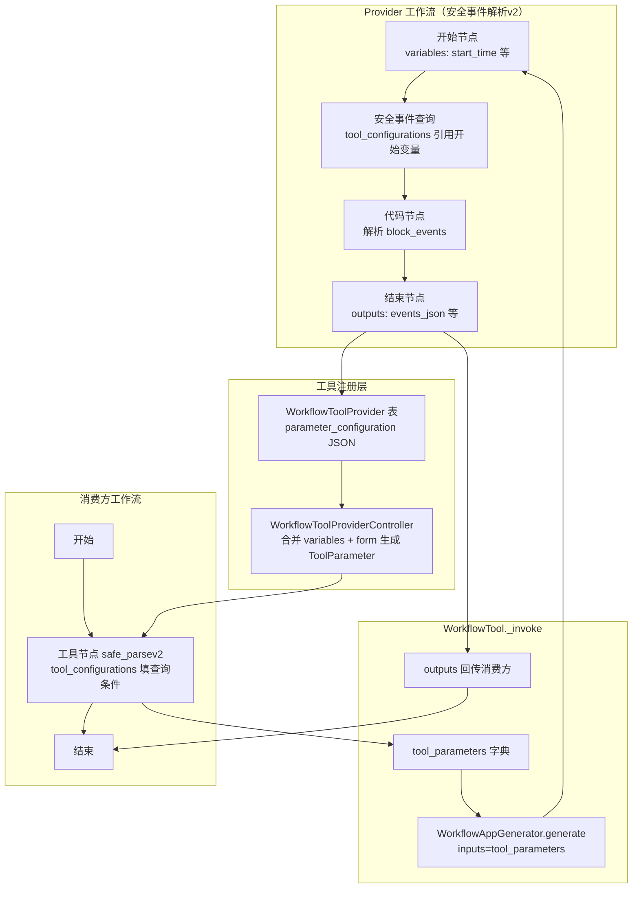

# Dify「发布为工具」使用案例与源码解析 —— 以「安全事件查询 + 解析」封装为例

> **核心结论**：Dify 的「工作流发布为工具」（Workflow as Tool）**不会**自动把画布内部某个插件工具节点的参数暴露给外部。对外可见的**输入**只来自**开始节点的输入变量**；对外可见的**输出**只来自**结束节点的输出变量**。发布工作流只是第一步，还必须完成「发布为工具」配置，并正确设置参数的 `form` 类型。消费方画布在工具节点的**设置区**填写参数时，`select` 类型若使用 `variable` 模式，`value` 必须是 `[节点ID, 变量名]` 数组，不能是空字符串。
>
> **版本锚点**：Dify 1.12.x（对照 `api/core/tools/workflow_as_tool/`、`api/core/tools/utils/workflow_configuration_sync.py`、`web/app/components/tools/workflow-tool/`）。
>
> **本文案例**：将 XDR 插件「安全事件查询」+ 代码节点「解析待阻断事件」封装为工作流工具 `安全事件解析v2`，供其他画布一键调用。

---

## 目录

1. [这篇博客要回答什么](#1-这篇博客要回答什么)
2. [业务背景与目标](#2-业务背景与目标)
3. [能力边界：发布为工具到底暴露什么](#3-能力边界发布为工具到底暴露什么)
4. [整体架构与数据流](#4-整体架构与数据流)
5. [案例一：从零搭建 Provider 工作流（可复现）](#5-案例一从零搭建-provider-工作流可复现)
6. [案例二：发布为工具并配置参数](#6-案例二发布为工具并配置参数)
7. [案例三：在消费方画布中使用](#7-案例三在消费方画布中使用)
8. [API 手工复现全流程（curl）](#8-api-手工复现全流程curl)
9. [源码解析：参数从哪里来](#9-源码解析参数从哪里来)
10. [源码解析：工具如何被调用](#10-源码解析工具如何被调用)
11. [源码解析：消费方工具节点参数校验](#11-源码解析消费方工具节点参数校验)
12. [常见误区与踩坑（本次案例真实踩坑）](#12-常见误区与踩坑本次案例真实踩坑)
13. [验收清单](#13-验收清单)
14. [常见问题 FAQ](#14-常见问题-faq)
15. [总结](#15-总结)
16. [相关文件索引](#16-相关文件索引)

---

## 1. 这篇博客要回答什么

在 Dify 工作流中，我们有一个常见需求：

> 某个插件工具（如 XDR「安全事件查询」）返回结构复杂，每次使用前都要加一段代码做解析。希望把「查询 + 解析」封装成一个工具，其他画布拖进来就能直接用。

实践中连续遇到三类问题：

| # | 现象 | 根因 |
|---|------|------|
| 1 | 发布为工具时提示必须有输入 | 开始节点 `variables` 为空 |
| 2 | 其他画布使用该工具时 `paramSchemas: []`，无法填参 | 开始节点无变量 / 未配置「发布为工具」 |
| 3 | 测试运行报 `value must be a list` | `select` 参数错误使用 `type: variable` 且 `value: ""` |

本文用完整可复现案例 + 源码链路，把上述问题一次讲透。

---

## 2. 业务背景与目标

### 2.1 原始画布结构（错误示范）

最初画布只有三节点，**没有结束节点**，开始节点**无输入变量**：

```
[开始] ──→ [安全事件查询（XDR 插件）] ──→ [代码：解析安全事件列表]
```

- 「安全事件查询」的 `start_time`、`end_time` 等参数写死在 `tool_configurations` 里
- 代码节点从查询结果的 `json` 字段提取 `focusObjectEN == "attacker"` 且带 `focusIp` 的事件

### 2.2 目标结构（正确示范）

```
[开始：9 个输入变量]
    │
    ▼
[安全事件查询：参数引用开始变量]
    │
    ▼
[代码：解析安全事件列表]
    │
    ▼
[结束：输出 events_json / indices / total / all_total]
         │
         ▼
   发布为工具「安全事件解析v2」
         │
         ▼
[消费方画布：拖入工具节点，在设置区填查询条件]
```

### 2.3 案例环境信息

| 项 | 值 |
|----|-----|
| Dify 地址 | `http://10.20.183.170:30080` |
| Provider 应用 ID | `3a3e5761-16f4-438f-b7a2-bd2a007a95b9` |
| 工作流工具 ID | `b4f81102-98b6-4256-9e88-fb0f5636f12c` |
| 工具调用名 | `safe_parsev2` |
| 消费方应用 ID | `e780b9da-10f2-48c7-979d-697e704a01a7` |
| XDR 插件 | `dbapp/xdr_plugin` → `query_security_events` |

> 若你在自己的环境复现，替换为自己的 `app_id`、Cookie、`csrf_token` 即可，步骤相同。

---

## 3. 能力边界：发布为工具到底暴露什么

### 3.1 输入：只看开始节点

后端 `WorkflowToolConfigurationUtils.get_workflow_graph_variables` 明确只读取**开始节点**的 `variables`：

```python
# api/core/tools/utils/workflow_configuration_sync.py
@classmethod
def get_workflow_graph_variables(cls, graph: Mapping[str, Any]) -> Sequence[VariableEntity]:
    nodes = graph.get("nodes", [])
    start_node = next(filter(lambda x: x.get("data", {}).get("type") == "start", nodes), None)
    if not start_node:
        return []
    return [VariableEntity.model_validate(variable) for variable in start_node.get("data", {}).get("variables", [])]
```

**不会**自动扫描内部「安全事件查询」插件节点的 `paramSchemas`。  
若开始节点 `variables: []`，则工作流工具对外参数为空数组。

### 3.2 输出：只看结束节点

```python
# api/core/tools/utils/workflow_configuration_sync.py
@classmethod
def get_workflow_graph_output(cls, graph: Mapping[str, Any]) -> Sequence[OutputVariableEntity]:
    # 遍历所有 type == "end" 的节点，收集 outputs
    ...
```

没有结束节点 → `output_schema.properties` 为空。

### 3.3 参数的 form 类型决定消费方 UI 分区

工作流工具每个参数有 `form` 字段：

| form 值 | 含义 | 在消费方画布出现位置 | 适用场景 |
|---------|------|---------------------|----------|
| `form` | 设置区参数 | 工具节点「设置」区域，可填固定值或 `{x}` 引用变量 | **工作流画布手动配参（推荐）** |
| `llm` | 输入变量区参数 | 工具节点「输入变量」区域 | Agent / LLM 自动填参 |
| `schema` | Schema 参数 | 特殊场景 | 结构化输入 |

新建工作流工具时，前端默认 `form: 'llm'`（见 `use-configure-button.ts` 的 `buildNewParameters`）。  
**若要在其他工作流画布手动填写查询条件，必须改为 `form: 'form'`。**

### 3.4 发布工作流 ≠ 发布为工具

| 操作 | API | 作用 |
|------|-----|------|
| 发布工作流 | `POST /apps/{app_id}/workflows/publish` | 固化画布版本，供运行 |
| 发布为工具 | `POST /workspaces/current/tool-provider/workflow/create` | 在工具市场注册为 `provider_type: workflow` 的工具 |
| 更新工具配置 | `POST /workspaces/current/tool-provider/workflow/update` | 同步参数 form、描述等与开始/结束节点对齐 |

只点「发布」而不做「发布为工具」配置，其他画布看不到该能力。

---

## 4. 整体架构与数据流



**运行时关键一行**（`api/core/tools/workflow_as_tool/tool.py`）：

```python
generator_args: dict[str, Any] = {"inputs": tool_parameters, "files": files}
result = generator.generate(
    app_model=app,
    workflow=workflow,
    user=user,
    args=generator_args,
    ...
)
```

消费方传入的工具参数 → 直接作为 Provider 工作流开始节点的 `inputs`。

---

## 5. 案例一：从零搭建 Provider 工作流（可复现）

### 5.1 步骤 1：创建空白工作流应用

1. Dify 控制台 → 创建应用 → 选择「工作流」
2. 命名：**安全事件解析v2**（或任意名称）

### 5.2 步骤 2：配置开始节点输入变量

点击「开始」节点 → 添加以下 **9 个输入变量**（名称必须与后续透传一致）：

| 变量名 | 类型 | 必填 | 说明 |
|--------|------|------|------|
| `start_time` | 文本 | 是 | 格式 `yyyy-MM-dd HH:mm:ss` |
| `end_time` | 文本 | 是 | 格式 `yyyy-MM-dd HH:mm:ss` |
| `event_name` | 文本 | 否 | 事件名称模糊搜索 |
| `sub_category` | 文本 | 否 | 事件子类型 |
| `threat_severity` | 下拉 | 否 | 选项：高 / 中 / 低 |
| `alarm_status` | 下拉 | 否 | 选项：未处置 / 处置中 / 已处置 |
| `alarm_results` | 下拉 | 否 | 选项：成功 / 失败 |
| `focus_ip` | 文本 | 否 | 关注 IP，逗号分隔 |
| `size` | 数字 | 否 | 每页条数，默认 1000 |

> **注意**：变量名 `variable` 字段即为工具对外参数名，创建后不宜随意改名，否则需重新「发布为工具」同步。

### 5.3 步骤 3：添加「安全事件查询」工具节点

1. 从工具面板拖入 **dbapp/xdr_plugin → 安全事件查询**（`query_security_events`）
2. 连线：开始 → 安全事件查询

### 5.4 步骤 4：将查询参数改为引用开始变量

在「安全事件查询」节点的**设置区**，每个参数从固定值改为**引用开始节点变量**：

| 参数 | 正确配置（JSON 形态） |
|------|----------------------|
| `start_time` | `{"type": "variable", "value": ["<开始节点ID>", "start_time"]}` |
| `end_time` | `{"type": "variable", "value": ["<开始节点ID>", "end_time"]}` |
| `event_name` | `{"type": "variable", "value": ["<开始节点ID>", "event_name"]}` |
| `sub_category` | `{"type": "variable", "value": ["<开始节点ID>", "sub_category"]}` |
| `threat_severity` | `{"type": "variable", "value": ["<开始节点ID>", "threat_severity"]}` |
| `alarm_status` | `{"type": "variable", "value": ["<开始节点ID>", "alarm_status"]}` |
| `alarm_results` | `{"type": "variable", "value": ["<开始节点ID>", "alarm_results"]}` |
| `focus_ip` | `{"type": "variable", "value": ["<开始节点ID>", "focus_ip"]}` |
| `size` | `{"type": "variable", "value": ["<开始节点ID>", "size"]}` |

UI 操作：点击参数右侧 `{x}` → 选择「开始 / start_time」等。

本案例开始节点 ID 为 `1781093649261`，示例：

```json
"start_time": {
  "type": "variable",
  "value": ["1781093649261", "start_time"]
}
```

### 5.5 步骤 5：添加代码节点

连线：安全事件查询 → 代码节点

**代码**（Python3）：

```python
import json

def main(tool_json: list) -> dict:
    """从安全事件查询结果提取待阻断事件，输出索引与 JSON 字符串。"""
    events = []
    if tool_json:
        for page in tool_json:
            if isinstance(page, dict) and isinstance(page.get("data"), list):
                events.extend(page["data"])

    block_events = [
        e for e in events
        if e.get("focusObjectEN") == "attacker" and e.get("focusIp")
    ]

    return {
        "events_json": json.dumps(block_events, ensure_ascii=False),
        "indices": list(range(len(block_events))),
        "total": len(block_events),
        "all_total": len(events),
    }
```

**输入变量**：

| 变量名 | 引用 |
|--------|------|
| `tool_json` | `安全事件查询 / json`，类型 `array[object]` |

### 5.6 步骤 6：添加结束节点

连线：代码节点 → 结束

在结束节点配置输出：

| 输出变量 | 引用 | 类型 |
|----------|------|------|
| `events_json` | 代码节点 / `events_json` | `string` |
| `indices` | 代码节点 / `indices` | `array[number]` |
| `total` | 代码节点 / `total` | `number` |
| `all_total` | 代码节点 / `all_total` | `number` |

### 5.7 步骤 7：本地测试 Provider 工作流

点击「测试运行」，填写：

```json
{
  "start_time": "2026-06-11 00:00:00",
  "end_time": "2026-06-11 23:59:59",
  "threat_severity": "高",
  "size": 26
}
```

**期望**：安全事件查询节点 inputs 中出现上述参数；代码节点输出 `total`、`all_total` 等；工作流成功结束。

---

## 6. 案例二：发布为工具并配置参数

### 6.1 UI 操作流程

1. 点击右上角 **发布** → 先发布工作流
2. 发布面板底部出现 **「发布为工具」**（若开始节点无变量，会显示「需要配置」且不可发布）
3. 点击「发布为工具」，填写：
   - **名称**：安全事件解析v2
   - **工具调用名称**：`safe_parsev2`（仅字母数字下划线）
   - **描述**：查询安全事件并解析待阻断事件列表
4. 在参数列表中，将每个参数的传递方式从默认「**参数**」（`llm`）改为「**设置**」（`form`）
5. 保存

### 6.2 验证工具注册成功

浏览器 Network 或 curl 查看：

```http
GET /console/api/workspaces/current/tool-provider/workflow/get?workflow_app_id=3a3e5761-16f4-438f-b7a2-bd2a007a95b9
```

**期望响应片段**：

```json
{
  "name": "safe_parsev2",
  "label": "安全事件解析v2",
  "parameters": [
    {"name": "start_time", "description": "开始时间", "form": "form"},
    {"name": "end_time", "description": "结束时间", "form": "form"}
  ],
  "tool": {
    "parameters": [
      {"name": "start_time", "type": "string", "required": true, "form": "form"}
    ],
    "output_schema": {
      "type": "object",
      "properties": {
        "events_json": {"type": "string"},
        "indices": {"type": "array[number]"},
        "total": {"type": "number"},
        "all_total": {"type": "number"}
      }
    }
  },
  "synced": true
}
```

若 `parameters` 为空 → 回去检查开始节点变量。  
若 `output_schema.properties` 为空 → 回去检查结束节点输出。  
若 `synced: false` → 发布后未更新工具，需重新「配置」并保存。

### 6.3 更新工具 API 请求体示例

```json
POST /console/api/workspaces/current/tool-provider/workflow/update

{
  "workflow_tool_id": "b4f81102-98b6-4256-9e88-fb0f5636f12c",
  "name": "safe_parsev2",
  "label": "安全事件解析v2",
  "icon": {"background": "#FFEAD5", "content": "🤖"},
  "description": "查询安全事件并解析待阻断事件列表",
  "parameters": [
    {"name": "start_time", "description": "开始时间", "form": "form"},
    {"name": "end_time", "description": "结束时间", "form": "form"},
    {"name": "event_name", "description": "事件名称", "form": "form"},
    {"name": "sub_category", "description": "事件类型", "form": "form"},
    {"name": "threat_severity", "description": "威胁等级", "form": "form"},
    {"name": "alarm_status", "description": "处置状态", "form": "form"},
    {"name": "alarm_results", "description": "事件结果", "form": "form"},
    {"name": "focus_ip", "description": "关注IP", "form": "form"},
    {"name": "size", "description": "每页条数", "form": "form"}
  ],
  "labels": [],
  "privacy_policy": ""
}
```

---

## 7. 案例三：在消费方画布中使用

### 7.1 搭建消费方工作流

```
[开始] ──→ [安全事件解析v2] ──→ [结束：输出 json]
```

### 7.2 配置工具节点参数（设置区）

在「安全事件解析v2」工具节点**设置区**填写（本案例无上游变量，用固定值）：

| 参数 | 推荐配置 | 说明 |
|------|----------|------|
| `start_time` | Mixed → `2026-06-01 00:00:00` | 字符串可用 mixed |
| `end_time` | Mixed → `2026-06-11 23:59:59` | |
| `event_name` | Mixed → 空 | |
| `sub_category` | Mixed → 空 | |
| `threat_severity` | **Constant → `高`** | select 类型不要用 variable+空串 |
| `alarm_status` | **Constant → 留空/null** | 表示不过滤 |
| `alarm_results` | Constant → null | |
| `focus_ip` | Mixed → 空 | |
| `size` | Constant → `30` | 数字用 constant |

对应 JSON（存在 `tool_configurations` 中）：

```json
{
  "start_time": {"type": "mixed", "value": "2026-06-01 00:00:00"},
  "end_time": {"type": "mixed", "value": "2026-06-11 23:59:59"},
  "event_name": {"type": "mixed", "value": ""},
  "sub_category": {"type": "mixed", "value": ""},
  "threat_severity": {"type": "constant", "value": "高"},
  "alarm_status": {"type": "constant", "value": null},
  "alarm_results": {"type": "constant", "value": null},
  "focus_ip": {"type": "mixed", "value": ""},
  "size": {"type": "constant", "value": 30}
}
```

### 7.3 若参数面板空白

1. **刷新页面**
2. 删除工具节点，从工具列表重新拖入「安全事件解析v2」（拉取最新 `paramSchemas`）
3. 确认 Provider 侧 `workflow/get` 返回 9 个 parameters

### 7.4 测试运行期望

消费方 `draft/run` 返回 SSE 流，关键片段：

```json
{
  "event": "node_finished",
  "data": {
    "node_type": "tool",
    "title": "安全事件解析v2",
    "inputs": {
      "start_time": "2026-06-01 00:00:00",
      "end_time": "2026-06-11 23:59:59",
      "threat_severity": "高",
      "size": "30"
    },
    "outputs": {
      "events_json": "[]",
      "indices": [],
      "total": 0,
      "all_total": 0,
      "json": [{"events_json": "[]", "indices": [], "total": 0, "all_total": 0}]
    },
    "status": "succeeded"
  }
}
```

最终 `workflow_finished.status` 应为 `succeeded`。

---

## 8. API 手工复现全流程（curl）

以下命令替换你自己的 `access_token`、`csrf_token`、`app_id` 即可复现。

### 8.1 公共 Header

```bash
BASE="http://10.20.183.170:30080/console/api"
COOKIE='access_token=<你的access_token>; csrf_token=<你的csrf_token>'
CSRF='<你的csrf_token>'
```

### 8.2 获取 Provider 草稿

```bash
curl -s "$BASE/apps/3a3e5761-16f4-438f-b7a2-bd2a007a95b9/workflows/draft" \
  -H "X-CSRF-Token: $CSRF" -b "$COOKIE" \
  -o draft.json
```

### 8.3 修改并保存草稿

用脚本或手工编辑 `draft.json` 中 `graph`：

1. 开始节点 `data.variables` ← 填入 9 个变量（见 §5.2）
2. 安全事件查询节点 `data.tool_configurations` ← 全部改为 `type: variable` 引用开始节点
3. 新增结束节点 + 边（见 §5.6）
4. 保存：

```bash
curl -s -X POST "$BASE/apps/3a3e5761-16f4-438f-b7a2-bd2a007a95b9/workflows/draft" \
  -H "Content-Type: application/json" \
  -H "X-CSRF-Token: $CSRF" -b "$COOKIE" \
  --data-binary @draft_save_payload.json
```

`draft_save_payload.json` 结构：

```json
{
  "graph": { "...": "修改后的 graph" },
  "features": { "...": "原 features" },
  "environment_variables": [],
  "conversation_variables": [],
  "hash": "<GET draft 返回的 hash>"
}
```

### 8.4 发布工作流

```bash
curl -s -X POST "$BASE/apps/3a3e5761-16f4-438f-b7a2-bd2a007a95b9/workflows/publish" \
  -H "Content-Type: application/json" \
  -H "X-CSRF-Token: $CSRF" -b "$COOKIE" \
  -d '{"marked_name":"","marked_comment":""}'
```

### 8.5 创建 / 更新工作流工具

**首次创建**：

```bash
curl -s -X POST "$BASE/workspaces/current/tool-provider/workflow/create" \
  -H "Content-Type: application/json" \
  -H "X-CSRF-Token: $CSRF" -b "$COOKIE" \
  -d '{
    "workflow_app_id": "3a3e5761-16f4-438f-b7a2-bd2a007a95b9",
    "name": "safe_parsev2",
    "label": "安全事件解析v2",
    "icon": {"background": "#FFEAD5", "content": "🤖"},
    "description": "查询安全事件并解析待阻断事件列表",
    "parameters": [
      {"name": "start_time", "description": "开始时间", "form": "form"}
    ],
    "labels": [],
    "privacy_policy": ""
  }'
```

**已存在则 update**（完整 9 个参数见 §6.3）。

### 8.6 验证工具

```bash
curl -s "$BASE/workspaces/current/tool-provider/workflow/get?workflow_app_id=3a3e5761-16f4-438f-b7a2-bd2a007a95b9" \
  -H "X-CSRF-Token: $CSRF" -b "$COOKIE" | jq '.tool.parameters | length'
# 期望输出: 9
```

### 8.7 测试 Provider 工作流

```bash
curl -s -X POST "$BASE/apps/3a3e5761-16f4-438f-b7a2-bd2a007a95b9/workflows/draft/run" \
  -H "Content-Type: application/json" \
  -H "X-CSRF-Token: $CSRF" -b "$COOKIE" \
  --data-binary @run_source.json
```

`run_source.json`：

```json
{
  "inputs": {
    "start_time": "2026-06-11 00:00:00",
    "end_time": "2026-06-11 23:59:59",
    "threat_severity": "高",
    "size": 26
  },
  "files": []
}
```

返回为 **SSE 流**（`event: ping` + `data: {...}`），不是单个 JSON。

### 8.8 测试消费方工作流

```bash
curl -s -X POST "$BASE/apps/e780b9da-10f2-48c7-979d-697e704a01a7/workflows/draft/run" \
  -H "Content-Type: application/json" \
  -H "X-CSRF-Token: $CSRF" -b "$COOKIE" \
  -d '{"inputs":{},"files":[]}'
```

### 8.9 参考自动化脚本

仓库根目录可放置辅助脚本（按需修改 Cookie）：

- `fix_workflow_tool.py` — Provider 侧：补开始变量、连线、结束节点、发布、更新工具
- `fix_consumer_select.py` — 消费方侧：修正 select 参数配置并测试运行

---

## 9. 源码解析：参数从哪里来

### 9.1 数据库：`WorkflowToolProvider.parameter_configuration`

创建工具时，`WorkflowToolManageService.create_workflow_tool` 将前端传来的 `parameters` 序列化存入 DB：

```python
# api/services/tools/workflow_tools_manage_service.py
workflow_tool_provider = WorkflowToolProvider(
    ...
    parameter_configuration=json.dumps([p.model_dump() for p in parameters]),
    version=workflow.version,
)
```

同时校验：

```python
WorkflowToolConfigurationUtils.ensure_no_human_input_nodes(workflow.graph_dict)
```

**Human Input 节点不支持**封装为工作流工具。

### 9.2 控制器：合并开始变量 + form 配置

`WorkflowToolProviderController._get_db_provider_tool` 核心逻辑：

```python
# api/core/tools/workflow_as_tool/provider.py
parameters = db_provider.parameter_configurations          # DB 中的 form/description
variables = WorkflowToolConfigurationUtils.get_workflow_graph_variables(graph)  # 开始节点变量

for parameter in parameters:
    variable = fetch_workflow_variable(parameter.name)
    if variable:
        workflow_tool_parameters.append(
            ToolParameter(
                name=parameter.name,
                label=I18nObject(en_US=variable.label, zh_Hans=variable.label),
                type=VARIABLE_TO_PARAMETER_TYPE_MAPPING[variable.type],
                form=parameter.form,           # ← 决定消费方 UI 分区
                required=variable.required,
                default=variable.default,
                options=...,                   # select 类型从开始变量 options 来
            )
        )
```

类型映射表：

| 开始变量类型 | ToolParameter 类型 |
|-------------|-------------------|
| `text-input` / `paragraph` | `string` |
| `select` | `select` |
| `number` | `number` |
| `checkbox` | `boolean` |
| `file` / `file-list` | `file` / `files` |

### 9.3 前端：参数过期检测

`isParametersOutdated` 比较开始节点变量与已发布工具参数是否一致：

```typescript
// web/app/components/tools/workflow-tool/hooks/use-configure-button.ts
if (detail.tool.parameters.length !== (inputs?.length ?? 0)) return true
for (const item of inputs || []) {
  const param = detail.tool.parameters.find(p => p.name === item.variable)
  if (!param) return true
  if (param.required !== item.required) return true
}
```

不一致时发布面板显示橙色警告，提示重新配置工具。

### 9.4 同步校验

```python
# api/core/tools/utils/workflow_configuration_sync.py
def check_is_synced(cls, variables, tool_configurations):
    if len(tool_configurations) != len(variables):
        raise ValueError("parameter configuration mismatch, please republish the tool to update")
    for parameter in tool_configurations:
        if parameter.name not in variable_names:
            raise ValueError("parameter configuration mismatch, please republish the tool to update")
```

---

## 10. 源码解析：工具如何被调用

### 10.1 消费方工具节点 → WorkflowTool

消费方画布工具节点 `provider_type: "workflow"`，`provider_id` 为 `workflow_tool_id`（如 `b4f81102-...`）。

运行时 `ToolManager.get_workflow_tool_runtime` 加载 `WorkflowTool` 实例。

### 10.2 WorkflowTool._invoke

```python
# api/core/tools/workflow_as_tool/tool.py
def _invoke(self, user_id, tool_parameters, ...):
    app = self._get_app(app_id=self.workflow_app_id)
    workflow = self._get_workflow(app_id=self.workflow_app_id, version=self.version)
    tool_parameters, files = self._transform_args(tool_parameters=tool_parameters)

    generator_args = {"inputs": tool_parameters, "files": files}
    result = generator.generate(
        app_model=app,
        workflow=workflow,
        user=user,
        args=generator_args,
        invoke_from=self.runtime.invoke_from,
        streaming=False,
        call_depth=self.workflow_call_depth + 1,
        pause_state_config=None,  # 工作流工具内不支持 Human Input 暂停
    )
```

### 10.3 输出回传

```python
outputs = data.get("outputs") or {}
for key, value in outputs.items():
    if key not in {"text", "json", "files"}:
        yield self.create_variable_message(variable_name=key, variable_value=value)

yield self.create_text_message(json.dumps(outputs, ensure_ascii=False))
yield self.create_json_message(outputs, suppress_output=True)
```

结束节点定义的 `events_json` 等会作为**具名输出**出现在工具节点的输出变量列表中。

---

## 11. 源码解析：消费方工具节点参数校验

### 11.1 tool_configurations vs tool_parameters

前端注释（`use-config.ts`）：

```typescript
/*
 * tool_configurations: tool setting, not dynamic setting (form type = form)
 * tool_parameters: tool dynamic setting (form type = llm)
 */
```

工作流工具的 9 个参数因 `form: "form"`，全部走 **`tool_configurations`**。

### 11.2 运行前适配：挪入 tool_parameters

`human_input_adapter._adapt_tool_node_data_for_graph` 在运行前把 `tool_configurations` 中带 `mixed/variable/constant` 的项复制到 `tool_parameters` 做 Pydantic 校验：

```python
# api/core/workflow/human_input_adapter.py
for name, value in raw_tool_configurations.items():
    input_type = value.get("type")
    if input_type not in {"mixed", "variable", "constant"}:
        normalized_tool_configurations[name] = value
        continue

    normalized_tool_parameters.setdefault(name, dict(value))  # ← 复制到 tool_parameters

    flattened_value = _flatten_legacy_tool_configuration_value(...)
    if flattened_value is not None:
        normalized_tool_configurations[name] = flattened_value
```

### 11.3 variable 类型校验规则

```python
def _flatten_legacy_tool_configuration_value(*, input_type, input_value):
    if input_type == "variable" and isinstance(input_value, list) and all(isinstance(item, str) for item in input_value):
        return "{{#" + ".".join(input_value) + "#}}"
    return None
```

`ToolNodeData` 对 `tool_parameters` 中 `type: variable` 的项要求 **`value` 必须是 `list[str]`**（变量选择器）。

### 11.4 本次报错复现

错误配置：

```json
"threat_severity": {"type": "variable", "value": ""}
```

运行时报错：

```json
{
  "event": "error",
  "code": "invalid_param",
  "message": "2 validation errors for ToolNodeData\ntool_parameters.threat_severity.type\n Value error, value must be a list ..."
}
```

**修复**：

```json
"threat_severity": {"type": "constant", "value": "高"}
```

或正确引用变量：

```json
"threat_severity": {"type": "variable", "value": ["1781229006523", "threat_severity"]}
```

---

## 12. 常见误区与踩坑（本次案例真实踩坑）

### 踩坑 1：以为内部插件参数会自动暴露

**现象**：发布为工具后，消费方 `paramSchemas: []`  
**原因**：开始节点 `variables: []`  
**修复**：在开始节点定义变量 → 内部工具节点引用这些变量 → 重新发布并更新工具配置

### 踩坑 2：只发布工作流，未「发布为工具」

**现象**：工具列表找不到；或 `tool_published: false`  
**修复**：发布面板 → 发布为工具 → 填写名称与参数 form

### 踩坑 3：参数 form 默认为 llm

**现象**：消费方工具节点看不到设置区表单  
**修复**：发布为工具时改为「设置」（`form: "form"`）

### 踩坑 4：没有结束节点

**现象**：`output_schema.properties: {}`  
**修复**：添加结束节点，映射代码节点输出

### 踩坑 5：select 参数 variable + 空字符串

**现象**：`value must be a list`  
**修复**：用 `constant` 填固定值，或 `variable` + 合法选择器数组

### 踩坑 6：修改开始变量后未同步工具

**现象**：`synced: false`，参数不一致  
**修复**：发布工作流 → 工具管理 → 重新配置并保存

### 踩坑 7：消费方 UI 不刷新

**现象**：已更新工具但画布仍无参数  
**修复**：刷新页面；删除节点重新拖入

---

## 13. 验收清单

按顺序勾选，全部通过即复现成功：

- [ ] Provider 开始节点有 9 个输入变量
- [ ] 安全事件查询节点 9 个参数均引用开始变量（非写死）
- [ ] 有结束节点，输出 4 个字段
- [ ] Provider 测试运行成功，查询节点 inputs 含传入参数
- [ ] `workflow/get` 返回 `tool.parameters.length === 9`
- [ ] 每个参数 `form === "form"`
- [ ] `output_schema.properties` 含 `events_json`、`total` 等
- [ ] `synced === true`
- [ ] 消费方拖入工具后设置区可见 9 个参数
- [ ] 消费方测试运行 `workflow_finished.status === succeeded`
- [ ] 工具节点 outputs 含 `events_json`、`indices`、`total`、`all_total`

---

## 14. 常见问题 FAQ

### Q1：能否不把参数放在开始节点，直接暴露插件工具参数？

**不能**。平台设计如此，见 §9.1 源码。变通方案：开始节点定义同名变量，内部工具节点引用之。

### Q2：开始节点变量名必须和 XDR 插件参数名一致吗？

**Provider 内部**：开始变量名与 `tool_configurations` 引用一致即可，与 XDR 参数名无强制关系（但建议一致以降低心智负担）。  
**对外工具参数名**：等于开始节点的 `variable` 字段名。

### Q3：消费方能否从开始节点传参给工作流工具？

可以。消费方开始节点定义变量 → 工具节点对应参数用 `type: variable` 引用消费方开始变量。

### Q4：`mixed` 和 `constant` 有什么区别？

- `mixed`：字符串，可手写也可插入 `{{#节点.变量#}}` 模板
- `constant`：固定值，用于 select 选中项、数字、null 等

### Q5：工作流工具内能用 Human Input 吗？

不能。`WorkflowTool._invoke` 显式 `pause_state_config=None`；创建工具时也会 `ensure_no_human_input_nodes`。

### Q6：如何在工作流工具里再调用其他工作流工具？

支持嵌套，有 `workflow_call_depth` 限制。本次案例消费方调用 `safe_parsev2` 即为嵌套执行。

---

## 15. 总结

### 15.1 三条铁律

1. **对外输入 = 开始节点 variables**；**对外输出 = 结束节点 outputs**
2. **内部业务参数**必须通过开始变量**透传**，不会自动提升为工具参数
3. **消费方填参**用 `form: "form"`；`select` 类型慎用 `variable`，`value` 必须是 `[nodeId, varName]`

### 15.2 推荐封装流程

```
定义开始变量 → 内部节点引用 → 结束节点输出 → 发布工作流
    → 发布为工具（form=设置）→ 消费方拖入配置 → 测试验收
```

### 15.3 本案例价值

将「XDR 安全事件查询 + 复杂 JSON 解析」封装为 `safe_parsev2` 后，其他安全编排画布只需一个工具节点即可拿到 `events_json` 和 `indices`，避免重复维护解析代码。

---

## 16. 相关文件索引

| 文件 | 说明 |
|------|------|
| `api/core/tools/utils/workflow_configuration_sync.py` | 从开始/结束节点提取变量 |
| `api/core/tools/workflow_as_tool/provider.py` | 生成 ToolParameter 列表 |
| `api/core/tools/workflow_as_tool/tool.py` | WorkflowTool 运行时 invoke |
| `api/services/tools/workflow_tools_manage_service.py` | 创建/更新/查询工作流工具 |
| `api/controllers/console/workspace/tool_providers.py` | REST API：`workflow/create`、`update`、`get` |
| `api/core/workflow/human_input_adapter.py` | tool_configurations → tool_parameters 适配 |
| `web/app/components/tools/workflow-tool/hooks/use-configure-button.ts` | 发布为工具 UI 逻辑 |
| `web/app/components/tools/workflow-tool/method-selector.tsx` | form / llm 切换 UI |
| `web/app/components/workflow/nodes/tool/hooks/use-config.ts` | 工具节点 parameters vs configurations |
| `web/service/tools.ts` | 前端 API 封装 |

---

*文档版本：2026-06-12 | 基于 Dify 1.12.x 与 XDR 安全事件查询实战整理*
