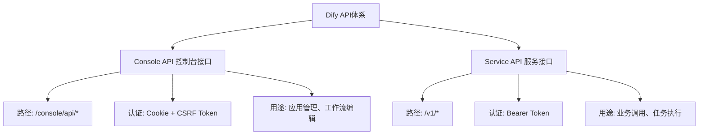
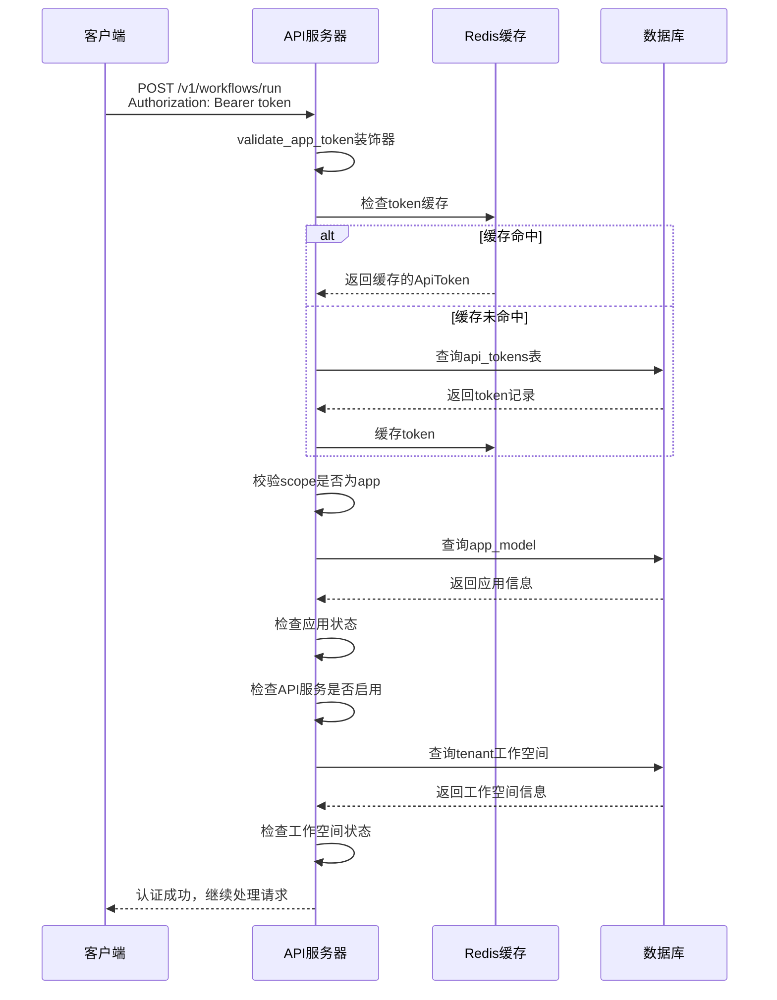
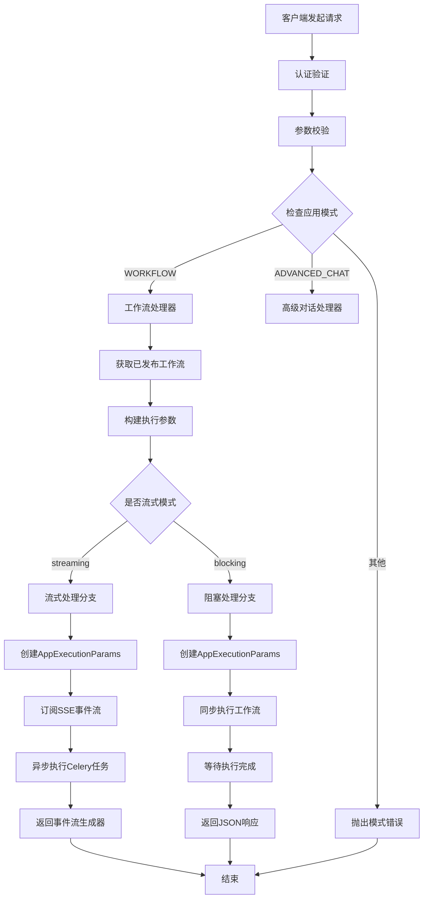
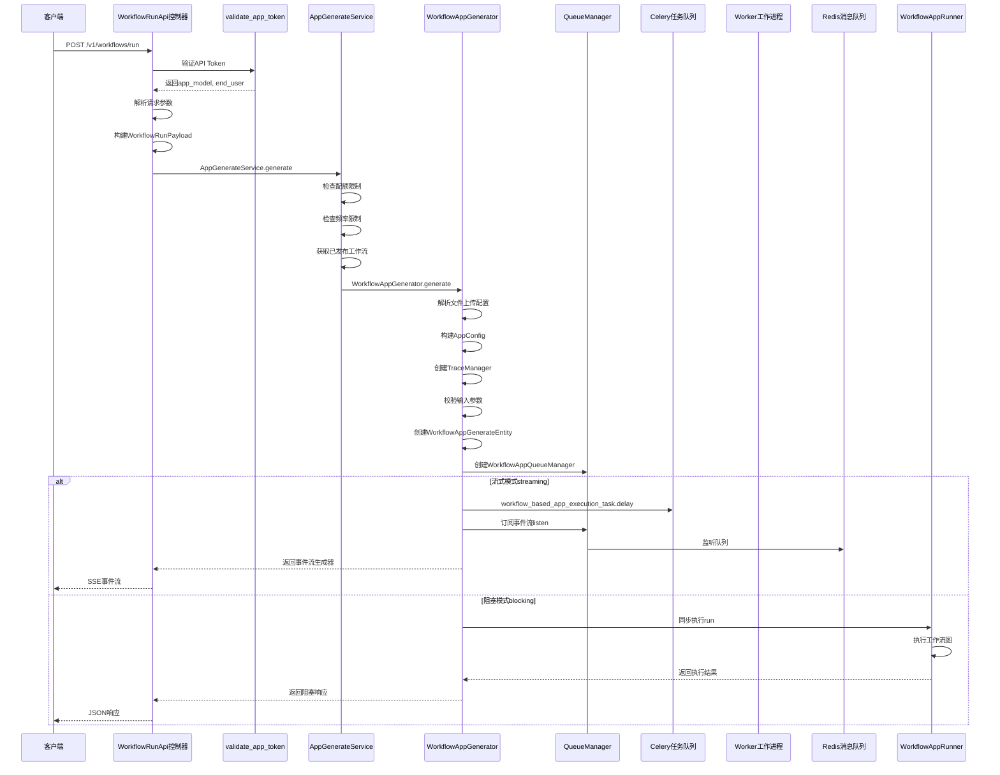
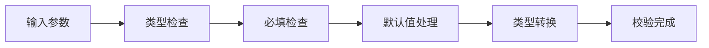
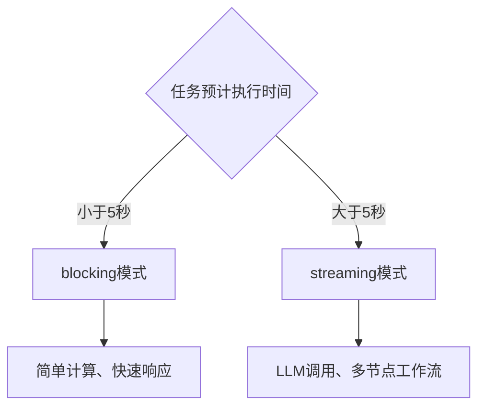
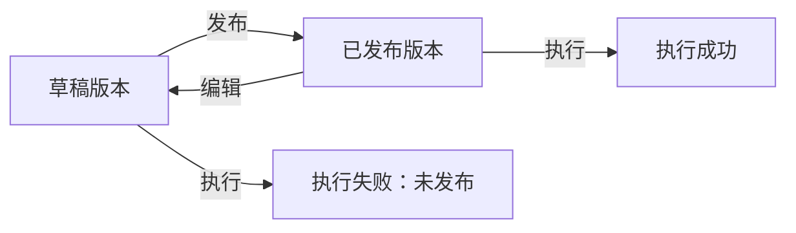
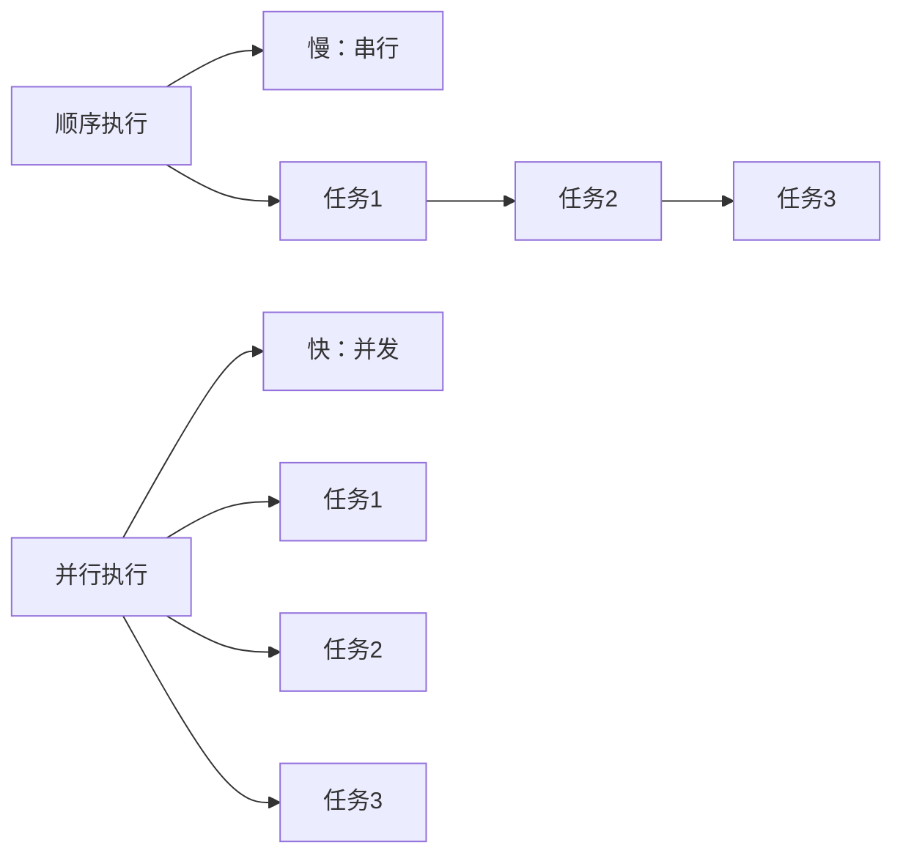
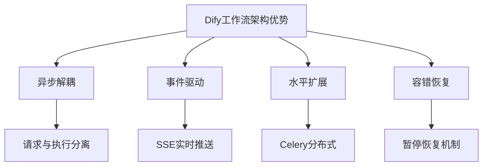

# Dify 工作流任务启动完整流程深度解析

> **作者**: 技术团队  
> **创建时间**: 2026-05-13  
> **适用范围**: Dify Workflow 服务 API 集成与二次开发  

---

## 目录

- [一、概述](#一概述)
- [二、Dify API 体系架构](#二dify-api-体系架构)
- [三、工作流运行接口文档](#三工作流运行接口文档)
- [四、认证机制详解](#四认证机制详解)
- [五、任务启动核心流程](#五任务启动核心流程)
- [六、关键参数说明](#六关键参数说明)
- [七、注意事项与最佳实践](#七注意事项与最佳实践)
- [八、常见问题排查](#八常见问题排查)
- [九、总结](#九总结)

---

## 一、概述

Dify 是一个开源的 LLM 应用开发平台，支持工作流 Workflow、对话 Chat、Agent 等多种应用模式。在实际业务集成中，**通过 Service API 启动已发布的工作流任务**是最核心的功能之一。

本文将从源码级别深入剖析 Dify 工作流任务启动的完整流程，包括：

- API 接口规范与认证机制
- 请求参数校验与处理
- 任务队列管理与异步执行
- 事件流式推送 SSE
- 错误处理与异常恢复

### 1.1 核心概念

在深入之前，先明确几个关键概念：

- **App 应用**: Dify 中的顶层实体，有 WORKFLOW、ADVANCED_CHAT、CHAT、COMPLETION 等模式
- **Workflow 工作流**: 由多个节点组成的有向无环图 DAG，定义任务执行逻辑
- **WorkflowRun 工作流运行实例**: 一次工作流执行的生命周期记录
- **Task 任务**: 异步执行单元，通过 Celery 任务队列调度
- **QueueManager 队列管理器**: 管理事件发布与订阅的中间件
- **SSE Server-Sent Events**: 服务端推送技术，用于实时返回工作流执行事件

### 1.2 两类运行接口

Dify 提供两种工作流运行接口：

1. **运行已发布工作流**: `POST /v1/workflows/run`
   - 执行已发布的正式版本
   - 适用于生产环境调用

2. **运行指定版本工作流**: `POST /v1/workflows/{workflow_id}/run`
   - 执行特定版本的工作流
   - 适用于版本管理与回滚场景

---

## 二、Dify API 体系架构

### 2.1 API 分类

Dify 提供两套独立的 API 体系：



### 2.2 Service API 路由注册

工作流相关的路由在 `api/controllers/service_api/app/workflow.py` 中定义：

| 路由路径 | HTTP方法 | 功能说明 | 认证方式 |
|---------|---------|---------|---------|
| /v1/workflows/run | POST | 运行已发布工作流 | validate_app_token |
| /v1/workflows/{workflow_id}/run | POST | 运行指定版本工作流 | validate_app_token |
| /v1/workflows/run/{workflow_run_id} | GET | 获取工作流运行详情 | validate_app_token |
| /v1/workflows/tasks/{task_id}/stop | POST | 停止运行中的任务 | validate_app_token |
| /v1/workflows/logs | GET | 获取工作流执行日志 | validate_app_token |

### 2.3 核心源码文件结构

```
api/
├── controllers/
│   └── service_api/
│       ├── app/
│       │   └── workflow.py              # API 控制器层
│       └── wraps.py                     # 认证装饰器
├── services/
│   └── app_generate_service.py          # 应用生成服务
├── core/
│   └── app/
│       └── apps/
│           ├── base_app_generator.py    # 基础生成器
│           └── workflow/
│               ├── app_generator.py     # 工作流生成器
│               ├── app_queue_manager.py # 队列管理器
│               └── app_runner.py        # 工作流执行器
└── tasks/
    └── app_generate/
        └── workflow_execute_task.py     # Celery 异步任务
```

---

## 三、工作流运行接口文档

### 3.1 接口一：运行已发布工作流

#### 基本信息

- **接口路径**: `POST /v1/workflows/run`
- **接口描述**: 执行已发布的工作流，支持阻塞和流式两种响应模式
- **Content-Type**: `application/json`

#### 请求头

| 参数名 | 类型 | 必填 | 说明 | 示例 |
|-------|------|------|------|------|
| Authorization | string | 是 | Bearer Token 认证 | Bearer dify-api-xxx |
| Content-Type | string | 是 | 请求体格式 | application/json |

#### 请求体参数

```json
{
  "inputs": {
    "param1": "value1",
    "param2": 123,
    "param3": true
  },
  "files": [
    {
      "type": "image",
      "transfer_method": "remote_url",
      "url": "https://example.com/image.png"
    }
  ],
  "user": "user-123",
  "response_mode": "streaming"
}
```

**参数详解**:

| 参数名 | 类型 | 必填 | 说明 | 默认值 |
|-------|------|------|------|--------|
| inputs | object | 是 | 工作流输入变量，需与工作流定义的变量匹配 | 无 |
| files | array | 否 | 上传文件列表，支持 image、document、audio、video 类型 | [] |
| user | string | 是 | 终端用户标识符，用于追踪执行者 | 无 |
| response_mode | string | 否 | 响应模式：streaming 流式、blocking 阻塞 | streaming |

**files 参数结构**:

```json
{
  "type": "image",
  "transfer_method": "remote_url",
  "url": "https://example.com/file.png",
  "upload_file_id": "file-uuid"
}
```

- **type**: 文件类型，可选值：image、document、audio、video
- **transfer_method**: 传输方式，remote_url 远程链接、local_file 本地文件
- **url**: 远程文件 URL（当 transfer_method=remote_url 时必填）
- **upload_file_id**: 已上传文件 ID（当 transfer_method=local_file 时必填）

#### 响应格式

**流式响应 response_mode=streaming**:

响应采用 SSE Server-Sent Events 格式，每个事件类型如下：

| 事件类型 | 说明 | 数据结构 |
|---------|------|---------|
| workflow_started | 工作流开始执行 | workflow_run_id、task_id |
| node_started | 节点开始执行 | node_id、node_type、title |
| node_finished | 节点执行完成 | node_id、status、outputs、elapsed_time |
| workflow_finished | 工作流执行完成 | workflow_run_id、status、outputs、total_steps、total_tokens |
| workflow_failed | 工作流执行失败 | workflow_run_id、error、status |

**SSE 事件示例**:

```
event: workflow_started
data: {"workflow_run_id":"run-uuid","task_id":"task-uuid","inputs":{"param1":"value1"}}

event: node_started
data: {"node_id":"node-uuid","node_type":"llm","title":"生成摘要","index":1}

event: node_finished
data: {"node_id":"node-uuid","status":"succeeded","outputs":{"result":"..."},"elapsed_time":2.5}

event: workflow_finished
data: {"workflow_run_id":"run-uuid","status":"succeeded","outputs":{"final":"..."},"total_steps":5,"total_tokens":1200}
```

**阻塞响应 response_mode=blocking**:

```json
{
  "code": 0,
  "msg": "success",
  "data": {
    "workflow_run_id": "run-uuid",
    "task_id": "task-uuid",
    "status": "succeeded",
    "outputs": {
      "result": "执行结果",
      "summary": "摘要信息"
    },
    "inputs": {
      "param1": "value1"
    },
    "total_steps": 5,
    "total_tokens": 1200,
    "created_at": 1684000000,
    "finished_at": 1684000010,
    "elapsed_time": 10.5
  }
}
```

#### 错误响应

| HTTP状态码 | 错误码 | 说明 | 解决方案 |
|-----------|--------|------|---------|
| 400 | bad_request | 请求参数错误 | 检查 inputs 格式、user 是否提供 |
| 401 | unauthorized | API Token 无效 | 检查 Authorization 请求头 |
| 404 | not_found | 工作流未找到 | 确认应用存在且有已发布工作流 |
| 429 | rate_limit | 请求频率超限 | 降低请求频率 |
| 500 | internal_error | 服务器内部错误 | 联系管理员查看日志 |

**错误响应示例**:

```json
{
  "code": "unauthorized",
  "message": "App token is missing.",
  "status": 401
}
```

---

### 3.2 接口二：运行指定版本工作流

#### 基本信息

- **接口路径**: `POST /v1/workflows/{workflow_id}/run`
- **接口描述**: 执行特定版本的工作流，适用于版本管理场景

#### 路径参数

| 参数名 | 类型 | 必填 | 说明 |
|-------|------|------|------|
| workflow_id | string | 是 | 工作流版本 ID，UUID 格式 |

#### 请求体

与接口一相同，参考 3.1 节

#### 特殊说明

1. **workflow_id 格式校验**: 必须是合法的 UUID 格式，否则返回 400 错误
2. **版本限制**: 只能执行已发布的版本，草稿版本会返回 400 错误
3. **应用场景**: 版本回滚、A/B 测试、历史版本执行

---

### 3.3 接口三：获取工作流运行详情

#### 基本信息

- **接口路径**: `GET /v1/workflows/run/{workflow_run_id}`
- **接口描述**: 查询特定工作流运行实例的详细信息

#### 路径参数

| 参数名 | 类型 | 必填 | 说明 |
|-------|------|------|------|
| workflow_run_id | string | 是 | 工作流运行实例 ID |

#### 响应示例

```json
{
  "code": 0,
  "msg": "success",
  "data": {
    "id": "workflow_run_id",
    "workflow_id": "workflow_id",
    "status": "succeeded",
    "inputs": {"param1": "value1"},
    "outputs": {"result": "..."},
    "error": null,
    "total_steps": 5,
    "total_tokens": 1200,
    "created_at": 1684000000,
    "finished_at": 1684000010,
    "elapsed_time": 10.5
  }
}
```

**状态枚举**:

- running: 执行中
- succeeded: 执行成功
- failed: 执行失败
- stopped: 手动停止
- paused: 已暂停

---

### 3.4 接口四：停止工作流任务

#### 基本信息

- **接口路径**: `POST /v1/workflows/tasks/{task_id}/stop`
- **接口描述**: 停止正在执行的工作流任务

#### 路径参数

| 参数名 | 类型 | 必填 | 说明 |
|-------|------|------|------|
| task_id | string | 是 | 任务 ID，从 workflow_started 事件中获取 |

#### 响应示例

```json
{
  "result": "success"
}
```

**停止机制**:

Dify 使用双重停止机制：

1. **停止标志位**: Redis 中设置 stopped 标记
2. **图引擎命令**: 通过 Redis 发送停止命令到图引擎

---

## 四、认证机制详解

### 4.1 Service API 认证流程

Service API 使用 `validate_app_token` 装饰器进行认证，核心流程如下：



### 4.2 API Token 结构

API Token 存储在数据库 `api_tokens` 表中：

| 字段 | 类型 | 说明 |
|-----|------|------|
| id | UUID | 主键 |
| app_id | UUID | 关联应用 ID |
| tenant_id | UUID | 关联工作空间 ID |
| token | string | Token 值，格式：dify-api-xxx |
| type | string | 类型：app 或 dataset |
| created_at | datetime | 创建时间 |
| last_used_at | datetime | 最后使用时间 |

### 4.3 Token 验证步骤

`validate_app_token` 装饰器执行以下验证：

1. **解析 Authorization 请求头**
   - 格式必须为：`Bearer <token>`
   - 区分大小写，scheme 必须是小写的 `bearer`

2. **Redis 缓存查询**
   - 优先从 Redis 缓存获取 token 信息
   - 缓存未命中时查询数据库
   - 使用单例模式避免并发重复查询

3. **应用状态检查**
   - 应用是否存在
   - 应用状态是否为 normal
   - API 服务是否启用 enable_api=true

4. **工作空间状态检查**
   - 工作空间是否存在
   - 工作空间状态是否为 archived

5. **注入上下文**
   - 将 app_model 注入到请求上下文
   - 如果 fetch_user_arg 配置了，解析并创建 end_user
   - 设置登录用户上下文

### 4.4 认证相关源码

**装饰器实现核心代码**:

```python
def validate_app_token(view=None, *, fetch_user_arg: FetchUserArg | None = None):
    def decorator(view_func):
        @wraps(view_func)
        def decorated_view(*args, **kwargs):
            # 1. 验证并获取 API Token
            api_token = validate_and_get_api_token("app")
            
            # 2. 获取应用模型
            app_model = db.session.get(App, api_token.app_id)
            if not app_model:
                raise Forbidden("The app no longer exists.")
            
            # 3. 检查应用状态
            if app_model.status != "normal":
                raise Forbidden("The app's status is abnormal.")
            
            if not app_model.enable_api:
                raise Forbidden("The app's API service has been disabled.")
            
            # 4. 检查工作空间状态
            tenant = db.session.get(Tenant, app_model.tenant_id)
            if tenant.status == TenantStatus.ARCHIVE:
                raise Forbidden("The workspace's status is archived.")
            
            # 5. 注入 app_model 到上下文
            kwargs["app_model"] = app_model
            
            # 6. 如果需要 end_user 上下文
            if fetch_user_arg:
                user_id = request.get_json().get("user")
                end_user = EndUserService.get_or_create_end_user(app_model, user_id)
                kwargs["end_user"] = end_user
            
            return view_func(*args, **kwargs)
        return decorated_view
    return decorator
```

---

## 五、任务启动核心流程

### 5.1 整体流程图



### 5.2 时序图详解



### 5.3 核心步骤详解

#### 步骤一：请求接收与认证

**入口**: `WorkflowRunApi.post` 方法

```python
@service_api_ns.route("/workflows/run")
class WorkflowRunApi(Resource):
    @validate_app_token(fetch_user_arg=FetchUserArg(
        fetch_from=WhereisUserArg.JSON, 
        required=True
    ))
    def post(self, app_model: App, end_user: EndUser):
        # 1. 验证应用模式
        app_mode = AppMode.value_of(app_model.mode)
        if app_mode != AppMode.WORKFLOW:
            raise NotWorkflowAppError()
        
        # 2. 解析请求体
        payload = WorkflowRunPayload.model_validate(
            service_api_ns.payload or {}
        )
        args = payload.model_dump(exclude_none=True)
        
        # 3. 确定响应模式
        streaming = payload.response_mode == "streaming"
```

**关键点**:

- `@validate_app_token` 装饰器自动注入 `app_model` 和 `end_user` 参数
- `fetch_user_arg` 配置从 JSON 请求体中提取 `user` 字段
- 强制要求 `user` 参数必须提供

#### 步骤二：配额与频率限制

**服务**: `AppGenerateService.generate`

```python
@classmethod
def generate(cls, app_model, user, args, invoke_from, streaming):
    # 1. 配额检查与预留
    quota_charge = QuotaService.reserve(QuotaType.WORKFLOW, app_model.tenant_id)
    
    # 2. 获取最大活跃请求数
    max_active_requests = cls._get_max_active_requests(app_model)
    
    # 3. 创建频率限制器
    rate_limit = RateLimit(app_model.id, max_active_requests)
    request_id = RateLimit.gen_request_key()
    
    try:
        # 4. 进入频率限制
        request_id = rate_limit.enter(request_id)
        
        # 5. 提交配额
        quota_charge.commit()
        
        # 6. 根据应用模式路由到不同生成器
        match app_model.mode:
            case AppMode.WORKFLOW:
                return cls._handle_workflow(...)
    except Exception:
        quota_charge.refund()
        rate_limit.exit(request_id)
        raise
```

**限流策略**:

- **应用级限流**: 每个应用独立计数器
- **最大活跃请求**: 控制并发执行的任务数
- **配额管理**: 工作空间级别的执行配额

#### 步骤三：工作流获取

```python
def _get_workflow(cls, app_model, invoke_from, workflow_id=None):
    workflow_service = WorkflowService()
    
    # 场景一：指定workflow_id
    if workflow_id:
        # 格式校验
        _ = uuid.UUID(workflow_id)
        # 获取已发布版本
        workflow = workflow_service.get_published_workflow_by_id(
            app_model=app_model, 
            workflow_id=workflow_id
        )
        if not workflow:
            raise WorkflowNotFoundError(f"Workflow not found with id: {workflow_id}")
        return workflow
    
    # 场景二：获取最新已发布版本
    if invoke_from == InvokeFrom.DEBUGGER:
        # 调试模式获取草稿
        workflow = workflow_service.get_draft_workflow(app_model=app_model)
    else:
        # 生产模式获取已发布
        workflow = workflow_service.get_published_workflow(app_model=app_model)
    
    if not workflow:
        raise ValueError("Workflow not published")
    
    return workflow
```

**关键点**:

- Service API 调用（InvokeFrom.SERVICE_API）只能执行已发布版本
- 调试模式（InvokeFrom.DEBUGGER）可以执行草稿版本
- workflow_id 必须是合法 UUID 格式

#### 步骤四：构建执行实体

```python
# 创建应用生成实体
application_generate_entity = WorkflowAppGenerateEntity(
    task_id=str(uuid.uuid4()),              # 唯一任务ID
    app_config=app_config,                  # 应用配置
    file_upload_config=file_extra_config,   # 文件上传配置
    inputs=inputs,                          # 输入参数
    files=list(system_files),               # 文件列表
    user_id=user.id,                        # 用户ID
    stream=streaming,                       # 是否流式
    invoke_from=invoke_from,                # 调用来源
    call_depth=0,                           # 调用深度
    workflow_execution_id=workflow_run_id,  # 工作流执行ID
    extras=extras,                          # 额外信息
)
```

**重要字段说明**:

- **task_id**: 用于追踪任务执行状态，停止任务时需要此 ID
- **workflow_execution_id**: 即 workflow_run_id，关联数据库中的 WorkflowRun 记录
- **call_depth**: 工作流嵌套调用深度，防止无限递归

#### 步骤五：流式模式处理

```python
if streaming:
    # 1. 创建执行参数
    payload = AppExecutionParams.new(
        app_model=app_model,
        workflow=workflow,
        user=user,
        args=args,
        invoke_from=InvokeFrom.SERVICE_API,
        streaming=True,
        call_depth=0,
        root_node_id=root_node_id,
        workflow_run_id=str(uuid.uuid4()),
    )
    payload_json = payload.model_dump_json()
    
    # 2. 定义订阅回调
    def on_subscribe():
        # 延迟执行Celery异步任务
        workflow_based_app_execution_task.delay(payload_json)
    
    # 3. 构建流式任务启动策略
    on_subscribe = cls._build_streaming_task_on_subscribe(on_subscribe)
    
    # 4. 创建生成器
    generator = WorkflowAppGenerator()
    
    # 5. 订阅事件流
    return rate_limit.generate(
        WorkflowAppGenerator.convert_to_event_stream(
            MessageBasedAppGenerator.retrieve_events(
                AppMode.WORKFLOW,
                payload.workflow_run_id,
                on_subscribe=on_subscribe,
            ),
        ),
        request_id=request_id,
    )
```

**流式处理关键机制**:

1. **延迟启动**: 客户端订阅 SSE 后才启动异步任务
2. **事件持久化**: 使用 Redis Streams 存储事件，支持重播
3. **单例模式**: 避免并发请求重复启动任务

#### 步骤六：异步任务执行

**Celery 任务**: `workflow_based_app_execution_task`

```python
@shared_task(queue=WORKFLOW_BASED_APP_EXECUTION_QUEUE)
def workflow_based_app_execution_task(payload: str):
    # 1. 解析执行参数
    exec_params = AppExecutionParams.model_validate_json(payload)
    
    # 2. 创建运行器
    runner = _AppRunner(db.engine, exec_params=exec_params)
    
    # 3. 执行工作流
    return runner.run()
```

**运行器执行流程**:

```python
class _AppRunner:
    def run(self):
        # 1. 从数据库获取工作流和应用
        with self._session() as session:
            workflow = session.get(Workflow, exec_params.workflow_id)
            app = session.get(App, workflow.app_id)
        
        # 2. 解析用户上下文
        user = self._resolve_user()
        
        # 3. 设置Flask上下文
        with self._setup_flask_context(user):
            # 4. 调用应用生成器
            response = self._run_app(app, workflow, user, pause_state_config)
            
            # 5. 流式模式：发布事件到Redis
            if exec_params.streaming:
                _publish_streaming_response(
                    response, 
                    exec_params.workflow_run_id,
                    exec_params.app_mode
                )
```

#### 步骤七：事件发布与订阅

**事件发布**:

```python
def _publish_streaming_response(response_stream, workflow_run_id, app_mode):
    # 获取消息主题
    topic = MessageBasedAppGenerator.get_response_topic(app_mode, workflow_run_id)
    
    # 遍历事件流
    for event in response_stream:
        # 序列化为JSON
        if isinstance(event, BaseModel):
            payload = json.dumps(event.model_dump(mode="json"), ensure_ascii=False)
        else:
            payload = json.dumps(event, ensure_ascii=False, default=str)
        
        # 发布到Redis
        topic.publish(payload.encode())
```

**事件订阅**:

```python
def retrieve_events(app_mode, workflow_run_id, on_subscribe=None):
    # 获取Redis PubSub频道
    topic = MessageBasedAppGenerator.get_response_topic(app_mode, workflow_run_id)
    
    # 触发订阅回调（启动异步任务）
    if on_subscribe:
        on_subscribe()
    
    # 监听事件流
    for message in topic.listen():
        if message["type"] == "message":
            yield json.loads(message["data"])
```

---

## 六、关键参数说明

### 6.1 输入参数 inputs

inputs 是工作流执行的入口参数，必须与工作流定义的变量严格匹配。

**参数校验规则**:



**支持的变量类型**:

| 类型 | 说明 | 示例 |
|-----|------|------|
| string | 字符串 | "Hello World" |
| number | 数字（整数或浮点数） | 123, 3.14 |
| bool | 布尔值 | true, false |
| object | JSON 对象 | {"key": "value"} |
| array[string] | 字符串数组 | ["a", "b", "c"] |
| array[number] | 数字数组 | [1, 2, 3] |
| file | 文件对象 | 见文件参数说明 |
| array[file] | 文件数组 | [file1, file2] |

**校验源码**:

```python
def _prepare_user_inputs(self, user_inputs, variables, tenant_id, strict_type_validation=False):
    """校验并转换用户输入"""
    validated_inputs = {}
    
    for variable in variables:
        var_name = variable.name
        var_type = variable.type
        required = variable.required
        
        # 1. 检查必填参数
        if required and var_name not in user_inputs:
            raise ValueError(f"Variable {var_name} is required")
        
        # 2. 获取值或使用默认值
        value = user_inputs.get(var_name, variable.default)
        
        # 3. 类型校验
        if strict_type_validation:
            value = self._strict_type_check(value, var_type, var_name)
        else:
            value = self._loose_type_check(value, var_type, var_name)
        
        validated_inputs[var_name] = value
    
    return validated_inputs
```

### 6.2 文件参数 files

文件上传支持两种方式：

**方式一：远程 URL**

```json
{
  "files": [
    {
      "type": "image",
      "transfer_method": "remote_url",
      "url": "https://example.com/image.png"
    }
  ]
}
```

**方式二：本地文件 ID**

```json
{
  "files": [
    {
      "type": "document",
      "transfer_method": "local_file",
      "upload_file_id": "file-uuid-xxx"
    }
  ]
}
```

**文件处理流程**:

```python
# 1. 获取文件上传配置
file_extra_config = FileUploadConfigManager.convert(
    workflow.features_dict, 
    is_vision=False
)

# 2. 构建文件对象
system_files = file_factory.build_from_mappings(
    mappings=files,
    tenant_id=app_model.tenant_id,
    config=file_extra_config,
    strict_type_validation=invoke_from == InvokeFrom.SERVICE_API,
    access_controller=self._file_access_controller,
)
```

**文件类型限制**:

- image: JPG, PNG, GIF, WEBP 等，最大 10MB
- document: PDF, DOCX, TXT, MD 等，最大 50MB
- audio: MP3, WAV, OGG 等，最大 50MB
- video: MP4, AVI, MOV 等，最大 100MB

### 6.3 响应模式 response_mode

**流式模式 streaming**:

- 适用场景：长时间任务、需要实时反馈
- 优点：客户端可以实时看到执行进度
- 缺点：需要客户端支持 SSE

**阻塞模式 blocking**:

- 适用场景：简单任务、同步调用
- 优点：实现简单，一次请求获取完整结果
- 缺点：长时间任务可能超时

**选择建议**:



---

## 七、注意事项与最佳实践

### 7.1 认证相关

#### 注意事项 1：API Token 安全

- **不要在前端代码中硬编码 Token**
- **使用环境变量或密钥管理服务存储 Token**
- **定期轮换 Token**
- **限制 Token 权限范围**

#### 注意事项 2：Token 格式

```python
# 正确方式
headers = {
    "Authorization": "Bearer dify-api-xxx"
}

# 错误方式：缺少 Bearer 前缀
headers = {
    "Authorization": "dify-api-xxx"  # 错误！
}

# 错误方式：大小写错误
headers = {
    "Authorization": "bearer dify-api-xxx"  # scheme必须小写
}
```

### 7.2 参数相关

#### 注意事项 3：inputs 参数校验

**必须在调用前校验**:

1. **字段完整性**: 所有 required=true 的变量必须提供
2. **类型匹配**: 参数类型必须与工作流定义一致
3. **值范围**: 枚举类型必须在允许的值范围内

**常见错误**:

```json
// 错误示例1：缺少必填参数
{
  "inputs": {
    "param1": "value1"
    // 缺少必填的 param2
  }
}

// 错误示例2：类型不匹配
{
  "inputs": {
    "count": "not_a_number"  // 应该是数字
  }
}

// 正确示例
{
  "inputs": {
    "param1": "value1",
    "param2": 123,
    "count": 10
  }
}
```

#### 注意事项 4：user 参数

- **必须提供**: Service API 调用时 user 参数是必填的
- **用途**: 用于追踪执行者、权限控制、日志记录
- **建议**: 使用业务系统中的用户 ID

### 7.3 执行相关

#### 注意事项 5：工作流版本



**Service API 只能执行已发布版本**，尝试执行草稿版本会返回错误。

#### 注意事项 6：超时处理

Dify 配置了最大执行时间限制：

```python
# 配置项
APP_MAX_EXECUTION_TIME = 1200  # 默认 1200 秒 = 20 分钟
```

**超时处理建议**:

1. **客户端超时**: 设置合理的 HTTP 超时时间（建议 30 分钟）
2. **异步任务**: 长时间任务建议使用异步模式
3. **分片执行**: 复杂任务拆分为多个子工作流

#### 注意事项 7：并发控制

```python
def _get_max_active_requests(app: App) -> int:
    """获取应用最大并发请求数"""
    app_limit = app.max_active_requests or dify_config.APP_DEFAULT_ACTIVE_REQUESTS
    config_limit = dify_config.APP_MAX_ACTIVE_REQUESTS
    
    # 取两者中较小值
    limits = [limit for limit in [app_limit, config_limit] if limit > 0]
    return min(limits) if limits else 0
```

**并发限制**:

- 超过限制会返回 429 错误
- 0 表示无限制（不推荐）
- 建议根据服务器资源合理设置

### 7.4 错误处理

#### 注意事项 8：异常捕获

```python
try:
    response = requests.post(url, json=payload, headers=headers)
    response.raise_for_status()
    
    if response_mode == "streaming":
        # 处理SSE流
        for line in response.iter_lines():
            if line:
                process_event(line)
    else:
        # 处理JSON响应
        result = response.json()
        return result["data"]
        
except requests.exceptions.HTTPError as e:
    error = response.json()
    if error["code"] == "unauthorized":
        # Token无效
        refresh_token()
    elif error["code"] == "not_found":
        # 工作流未找到
        check_workflow_published()
    elif error["code"] == "bad_request":
        # 参数错误
        validate_inputs()
    raise
```

### 7.5 性能优化

#### 注意事项 9：连接池

```python
# 使用 Session 复用连接
session = requests.Session()
session.headers.update({
    "Authorization": "Bearer token",
    "Content-Type": "application/json"
})

# 发起多次请求
response1 = session.post(url1, json=payload1)
response2 = session.post(url2, json=payload2)
```

#### 注意事项 10：批量执行



**并发执行示例**:

```python
from concurrent.futures import ThreadPoolExecutor

def run_workflow(inputs):
    return requests.post(url, json={"inputs": inputs, "user": "user1"})

inputs_list = [
    {"param": "value1"},
    {"param": "value2"},
    {"param": "value3"},
]

# 并发执行
with ThreadPoolExecutor(max_workers=5) as executor:
    futures = [executor.submit(run_workflow, inp) for inp in inputs_list]
    results = [f.result() for f in futures]
```

---

## 八、常见问题排查

### 8.1 认证问题

#### 问题 1：401 Unauthorized

**错误信息**:

```json
{
  "code": "unauthorized",
  "message": "App token is missing.",
  "status": 401
}
```

**排查步骤**:

1. 检查 Authorization 请求头是否存在
2. 确认 Bearer 格式正确
3. 验证 Token 是否有效
4. 检查 Token scope 是否为 app

**解决方案**:

```bash
# 查看数据库中的token
SELECT * FROM api_tokens WHERE token = 'dify-api-xxx';

# 检查token是否过期
SELECT last_used_at FROM api_tokens WHERE token = 'dify-api-xxx';
```

#### 问题 2：应用状态异常

**错误信息**:

```json
{
  "code": "forbidden",
  "message": "The app's status is abnormal.",
  "status": 403
}
```

**排查步骤**:

1. 检查应用状态是否为 normal
2. 确认 API 服务已启用
3. 检查工作空间状态

**解决方案**:

```sql
-- 检查应用状态
SELECT status, enable_api FROM apps WHERE id = 'app-id';

-- 启用API服务
UPDATE apps SET enable_api = true WHERE id = 'app-id';
```

### 8.2 参数问题

#### 问题 3：参数校验失败

**错误信息**:

```json
{
  "code": "bad_request",
  "message": "Variable 'param1' is required",
  "status": 400
}
```

**排查步骤**:

1. 检查工作流定义的变量列表
2. 确认所有必填参数已提供
3. 验证参数类型是否匹配

**解决方案**:

```python
# 获取工作流定义
workflow = requests.get(
    f"{base_url}/console/api/apps/{app_id}/workflows/draft",
    headers=headers
)

# 查看变量定义
variables = workflow.json()["data"]["workflow"]["variables"]
for var in variables:
    print(f"{var['name']}: {var['type']} (required={var['required']})")
```

#### 问题 4：文件上传失败

**常见错误**:

- 文件类型不支持
- 文件大小超限
- upload_file_id 无效

**解决方案**:

```python
# 先上传文件获取ID
upload_resp = requests.post(
    f"{base_url}/v1/files/upload",
    headers=headers,
    files={"file": open("test.png", "rb")}
)
upload_file_id = upload_resp.json()["data"]["id"]

# 使用upload_file_id
payload = {
    "inputs": {},
    "files": [{
        "type": "image",
        "transfer_method": "local_file",
        "upload_file_id": upload_file_id
    }],
    "user": "user1"
}
```

### 8.3 执行问题

#### 问题 5：工作流未找到

**错误信息**:

```json
{
  "code": "not_found",
  "message": "Workflow not found",
  "status": 404
}
```

**排查步骤**:

1. 确认应用是否存在
2. 检查工作流是否已发布
3. workflow_id 格式是否正确

**解决方案**:

```sql
-- 检查应用
SELECT * FROM apps WHERE id = 'app-id';

-- 检查工作流版本
SELECT * FROM workflows 
WHERE app_id = 'app-id' 
  AND version = 'published';
```

#### 问题 6：任务停止失败

**问题描述**: 调用 stop 接口后任务仍在执行

**排查步骤**:

1. 检查 task_id 是否正确
2. 验证 Redis 连接
3. 确认图引擎命令通道

**解决方案**:

```bash
# 查看Redis中的停止标志
redis-cli GET "generate_task_stopped:{task_id}"

# 手动设置停止标志
redis-cli SETEX "generate_task_stopped:{task_id}" 600 1
```

### 8.4 性能问题

#### 问题 7：响应缓慢

**可能原因**:

- 服务器资源不足
- 数据库查询慢
- Redis 队列阻塞

**排查方法**:

```python
# 监控执行时间
import time

start = time.time()
response = requests.post(url, json=payload)
elapsed = time.time() - start

print(f"响应时间: {elapsed:.2f}秒")

# 查看慢查询日志
tail -f logs/api.log | grep "slow query"
```

#### 问题 8：并发限制

**错误信息**:

```json
{
  "code": "rate_limit",
  "message": "Too many requests",
  "status": 429
}
```

**解决方案**:

```sql
-- 调整应用并发限制
UPDATE apps 
SET max_active_requests = 20 
WHERE id = 'app-id';

-- 调整全局配置
-- 修改 .env 文件
APP_MAX_ACTIVE_REQUESTS=100
```

---

## 九、总结

### 9.1 核心要点回顾

1. **认证机制**: Service API 使用 Bearer Token 认证，通过 validate_app_token 装饰器实现
2. **参数校验**: inputs 必须与工作流定义严格匹配，user 参数必填
3. **执行模式**: 支持 streaming 流式和 blocking 阻塞两种模式
4. **异步架构**: 使用 Celery 任务队列 + Redis PubSub 实现异步事件推送
5. **限流策略**: 应用级频率限制 + 工作空间配额管理

### 9.2 最佳实践清单

- [ ] 使用环境变量存储 API Token，不要硬编码
- [ ] 调用前校验 inputs 参数完整性和类型
- [ ] 长时间任务使用 streaming 模式避免超时
- [ ] 合理设置并发限制，避免资源耗尽
- [ ] 实现完善的错误处理和重试机制
- [ ] 监控任务执行状态和性能指标
- [ ] 定期清理已完成的工作流运行记录

### 9.3 架构优势



### 9.4 适用场景

**适合使用 Dify 工作流的场景**:

- LLM 应用编排
- 多步骤数据处理
- 自动化业务流程
- 智能客服系统
- 内容生成与审核

**不适合的场景**:

- 超低延迟要求（毫秒级）
- 复杂事务一致性要求
- 高频交易场景

### 9.5 扩展阅读

- **Dify 官方文档**: https://docs.dify.ai
- **Celery 文档**: https://docs.celeryq.dev
- **Redis Streams**: https://redis.io/docs/data-types/streams
- **SSE 规范**: https://html.spec.whatwg.org/multipage/server-sent-events.html

---

## 附录

### A. 完整调用示例

#### Python 示例

```python
import requests
import json

# 配置
BASE_URL = "https://your-dify-instance.com"
API_TOKEN = "dify-api-xxx"
APP_ID = "your-app-id"

# 请求头
headers = {
    "Authorization": f"Bearer {API_TOKEN}",
    "Content-Type": "application/json"
}

# 请求体
payload = {
    "inputs": {
        "query": "请总结这篇文章",
        "content": "https://example.com/article"
    },
    "files": [],
    "user": "user-123",
    "response_mode": "streaming"
}

# 发起请求
url = f"{BASE_URL}/v1/workflows/run"
response = requests.post(url, headers=headers, json=payload, stream=True)

# 处理SSE事件
for line in response.iter_lines():
    if line:
        # 解析事件
        if line.startswith(b"event:"):
            event_type = line.decode().split(":")[1].strip()
        elif line.startswith(b"data:"):
            data = json.loads(line.decode().split(":")[1].strip())
            print(f"事件: {event_type}")
            print(f"数据: {json.dumps(data, indent=2, ensure_ascii=False)}")
```

#### Java 示例

```java
import cn.hutool.http.HttpRequest;
import cn.hutool.http.HttpResponse;

public class WorkflowRunner {
    
    private static final String BASE_URL = "https://your-dify-instance.com";
    private static final String API_TOKEN = "dify-api-xxx";
    
    public static void runWorkflow() {
        String url = BASE_URL + "/v1/workflows/run";
        
        // 构建请求体
        String payload = "{"
            + "\"inputs\": {"
            + "  \"query\": \"请总结这篇文章\","
            + "  \"content\": \"https://example.com/article\""
            + "},"
            + "\"files\": [],"
            + "\"user\": \"user-123\","
            + "\"response_mode\": \"blocking\""
            + "}";
        
        // 发起请求
        HttpResponse response = HttpRequest.post(url)
            .header("Authorization", "Bearer " + API_TOKEN)
            .header("Content-Type", "application/json")
            .body(payload)
            .execute();
        
        // 处理响应
        if (response.isOk()) {
            String result = response.body();
            System.out.println("执行结果: " + result);
        } else {
            System.err.println("请求失败: " + response.getStatus());
            System.err.println("错误信息: " + response.body());
        }
    }
}
```

### B. 数据库表结构

**api_tokens 表**:

```sql
CREATE TABLE api_tokens (
    id UUID PRIMARY KEY,
    app_id UUID NOT NULL,
    tenant_id UUID NOT NULL,
    token VARCHAR(255) NOT NULL,
    type VARCHAR(255) NOT NULL,  -- 'app' or 'dataset'
    created_at TIMESTAMP NOT NULL DEFAULT NOW(),
    last_used_at TIMESTAMP,
    UNIQUE(token)
);
```

**workflows 表**:

```sql
CREATE TABLE workflows (
    id UUID PRIMARY KEY,
    tenant_id UUID NOT NULL,
    app_id UUID NOT NULL,
    type VARCHAR(255) NOT NULL,  -- 'draft' or 'published'
    version VARCHAR(255),
    graph JSONB NOT NULL,
    features JSONB NOT NULL,
    created_by UUID NOT NULL,
    created_at TIMESTAMP NOT NULL DEFAULT NOW(),
    updated_at TIMESTAMP NOT NULL DEFAULT NOW()
);
```

**workflow_runs 表**:

```sql
CREATE TABLE workflow_runs (
    id UUID PRIMARY KEY,
    tenant_id UUID NOT NULL,
    app_id UUID NOT NULL,
    workflow_id UUID NOT NULL,
    type VARCHAR(255) NOT NULL,
    triggered_from VARCHAR(255) NOT NULL,
    status VARCHAR(255) NOT NULL,
    inputs JSONB,
    outputs JSONB,
    error TEXT,
    total_steps INTEGER,
    total_tokens INTEGER,
    created_by UUID NOT NULL,
    created_at TIMESTAMP NOT NULL DEFAULT NOW(),
    finished_at TIMESTAMP
);
```

### C. Redis 键空间

| 键模式 | 类型 | 说明 | TTL |
|-------|------|------|-----|
| api_token:{token} | Hash | API Token 缓存 | 3600s |
| generate_task_belong:{task_id} | String | 任务归属用户 | 1800s |
| generate_task_stopped:{task_id} | String | 任务停止标志 | 600s |
| rate_limit:{app_id} | ZSet | 请求频率限制 | 60s |
| workflow_events:{workflow_run_id} | Stream | 工作流事件流 | 3600s |

---

**文档版本**: v1.0  
**最后更新**: 2026-05-13  
**维护团队**: 技术开发部
