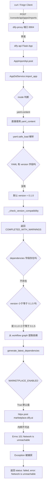
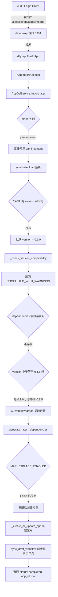
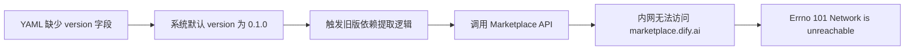

# Dify 离线部署踩坑记：导入 Workflow 报 Network is unreachable 深度排查与解决

## 一、背景与环境说明

### 1.1 部署环境

本次排查基于以下部署环境：

- **部署平台**：KubeSphere（Kubernetes 容器管理平台）
- **部署方式**：Dify 官方 Docker 镜像，以 Deployment 方式部署在 K8s 集群中
- **网络环境**：企业内网，**无外网访问权限**
- **Dify 版本**：DSL 版本 0.6.0（当前最新）
- **服务组件**：

| 工作负载名称 | 状态 | 说明 |
|-------------|------|------|
| dify-api | 运行中 (1/1) | 后端 API 服务 |
| dify-plugin-daemon | 运行中 (1/1) | 插件守护进程 |
| dify-proxy | 运行中 (1/1) | 代理服务 |
| dify-web | 运行中 (1/1) | 前端 Web 服务 |
| dify-worker | 运行中 (1/1) | 异步任务 Worker |
| dify-sandbox | 运行中 (1/1) | 代码沙箱服务 |

### 1.2 业务场景

我们需要通过调用 Dify 的 **Console API** 接口 `/console/api/apps/imports` 来批量导入 Workflow 应用。导入方式为将 DSL YAML 内容直接作为请求体传入（`mode: yaml-content`），不涉及从 URL 拉取 YAML 文件。

这是一个典型的**程序化集成场景**：通过 Java Spring 微服务（使用 Feign Client）调用 Dify Console API，实现应用的自动化导入。

---

## 二、问题现象

### 2.1 请求内容

调用接口 `POST /console/api/apps/imports`，请求体如下（简化展示）：

```json
{
  "mode": "yaml-content",
  "yaml_content": "app:\n  icon: \"\uD83E\uDD16\"\n  icon_background: \"#FFEAD5\"\n  mode: advanced-chat\n  name: \"Workflow Planning Assistant\"\nworkflow:\n  features:\n    file_upload:\n      image:\n        enabled: false\n      number_limits: 3\n    opening_statement: \"\"\n    enabled: false\n    retriever_resource:\n      enabled: false\n    sensitive_word_avoidance:\n      enabled: false\n    speech_to_text:\n      enabled: false\n    suggested_questions: []\n    text_to_speech:\n      enabled: false\n    suggested_questions_after_answer:\n      enabled: false\n  graph:\n    edges:\n      - data:\n          sourceType: start\n          targetType: llm\n        id: \"1711527768326-1711527784865\"\n        source: \"1711527768326\"\n        sourceHandle: source\n        target: \"1711527784865\"\n        targetHandle: target\n        type: custom\n      - data:\n          sourceType: llm\n          targetType: template-transform\n        id: \"1711527784865-1711527861837\"\n        source: \"1711527784865\"\n        sourceHandle: source\n        target: \"1711527861837\"\n        targetHandle: target\n        type: custom\n    nodes:\n      - data:\n          desc: \"\"\n          selected: false\n          title: Start\n          variables: []\n        height: 53\n        id: \"1711527768326\"\n        position:\n          x: 80\n          y: 282\n        type: start\n        width: 243\n      - data:\n          context:\n            enabled: false\n            variable_selector: []\n          model:\n            completion_params:\n              temperature: 0.7\n            mode: chat\n            name: gpt-4\n            provider: openai\n          desc: \"\"\n          memory:\n            role_prefix:\n              assistant: \"\"\n              user: \"\"\n            window:\n              enabled: false\n              size: 50\n        id: \"1711527784865\"\n        type: llm"
}
```

**关键观察点**：注意这段 YAML 内容中**没有 `version` 字段**，这是一个非常重要的细节，后文会详细分析。

### 2.2 错误响应

接口返回 HTTP 400，响应体如下：

```json
{
  "id": "e1626740-2e80-48be-8142-cab558ce5971",
  "status": "failed",
  "app_id": null,
  "app_mode": null,
  "current_dsl_version": "0.6.0",
  "imported_dsl_version": "",
  "error": "[Errno 101] Network is unreachable"
}
```

### 2.3 错误特征分析

从错误响应中可以提取以下关键信息：

| 字段 | 值 | 分析 |
|------|-----|------|
| status | failed | 导入失败 |
| app_id | null | 应用未创建，说明失败发生在创建之前 |
| app_mode | null | 同上 |
| current_dsl_version | 0.6.0 | 当前 Dify 系统的 DSL 版本 |
| imported_dsl_version | "" (空字符串) | 导入的 DSL 版本未被设置，说明解析过程被中断 |
| error | [Errno 101] Network is unreachable | **系统级 socket 错误**，非 HTTP 层错误 |

**核心疑问**：

1. 我们用的是 `yaml-content` 模式，YAML 内容直接放在请求体里，**理论上不需要任何网络请求**，为什么会报网络不可达？
2. `[Errno 101]` 是 Python socket 层的错误码，意味着底层 TCP 连接就失败了，不是 HTTP 超时或 4xx/5xx。
3. `imported_dsl_version` 为空字符串，但代码中 `Import` 模型的默认值就是 `""`，说明异常发生在 `imported_dsl_version` 被赋值到返回对象之前。

---

## 三、排查过程

### 3.1 第一步：确认服务状态

首先检查 KubeSphere 上所有 Dify 服务的运行状态，确认没有 Pod 异常重启或 CrashLoopBackOff：

```
工作负载          状态              更新时间
dify-api          运行中 (1/1)      2026-06-02 14:55:16
dify-plugin-daemon 运行中 (1/1)    2026-06-02 14:55:16
dify-proxy        运行中 (1/1)      2026-06-02 14:55:16
dify-web          运行中 (1/1)      2026-06-02 14:55:16
dify-worker       运行中 (1/1)      2026-06-02 14:55:16
dify-sandbox      运行中 (1/1)      2026-06-02 14:55:06
```

所有服务均为 **运行中** 状态，没有异常。

### 3.2 第二步：查看服务日志

分别查看 `dify-api`、`dify-worker`、`dify-proxy` 的日志，搜索与本次请求相关的错误记录。

**发现**：日志中**没有明显的错误堆栈信息**。这是因为 Dify 的 `import_app` 方法在捕获异常时使用了 `logger.exception()` 记录日志，但具体是否输出取决于日志级别配置。而且，错误信息已经被捕获并作为 JSON 响应返回给调用方，所以服务本身不会崩溃。

### 3.3 第三步：分析请求头与认证方式

从抓包获取的完整 curl 命令中提取请求头：

```bash
curl 'http://localhost:8904/console/api/apps/imports' \
  -H 'Accept: */*' \
  -H 'Accept-Language: zh-CN,zh;q=0.9' \
  -H 'Connection: keep-alive' \
  -H 'Origin: http://localhost:3100' \
  -H 'Referer: http://localhost:3100/workflow/' \
  -H 'Sec-Fetch-Dest: empty' \
  -H 'Sec-Fetch-Mode: cors' \
  -H 'Sec-Fetch-Site: same-origin' \
  -H 'User-Agent: Mozilla/5.0 (Windows NT 10.0; Win64; x64) ...' \
  -H 'content-type: application/json' \
  -H 'x-csrf-token: ' \
  --data-raw '{"mode":"yaml-content","yaml_content":"..."}'
```

**注意点**：

- `x-csrf-token` 为空值。在 Console API 中，CSRF Token 是必需的认证保护机制。
- 请求经过 `dify-proxy`（端口 8904）转发到 `dify-api`。
- `Origin` 和 `Referer` 指向 `localhost:3100`（前端 Web 服务）。

**关于 CSRF 与认证的补充说明**：

在之前的排查中我们已经了解到，Dify 的 API 认证存在以下机制：

1. **普通应用 API Key**（格式 `app-xxxxx`）：仅适用于 Service API（`/v1/*` 路径），不可用于 Console API。
2. **管理员 API Key**（`ADMIN_API_KEY`）：当环境变量 `ADMIN_API_KEY_ENABLE=true` 且正确配置时，可用于 Console API（`/console/api/*` 路径），并通过 `Authorization: Bearer <admin-key>` 方式调用，**完全绕过 CSRF Token 验证**。
3. **Session + CSRF Token**：标准 Web 用户认证方式，需要有效的登录 Session 和 CSRF Token。

本次请求虽然 `x-csrf-token` 为空，但认证阶段并没有报错（否则会返回 401 或 403），说明认证已通过。问题发生在业务逻辑处理阶段。

### 3.4 第四步：源码追踪 - 定位网络调用

这是排查的核心步骤。我们需要从代码层面搞清楚：一个 `yaml-content` 模式的导入请求，到底在哪个环节发起了外部网络调用？

#### 3.4.1 入口层：AppImportApi

文件路径：`api/controllers/console/app/app_import.py`

```python
@console_ns.route("/apps/imports")
class AppImportApi(Resource):
    @setup_required
    @login_required
    @account_initialization_required
    @cloud_edition_billing_resource_check("apps")
    @edit_permission_required
    def post(self):
        current_user, _ = current_account_with_tenant()
        args = AppImportPayload.model_validate(console_ns.payload)

        with Session(db.engine, expire_on_commit=False) as session:
            import_service = AppDslService(session)
            account = current_user
            result = import_service.import_app(
                account=account,
                import_mode=args.mode,          # "yaml-content"
                yaml_content=args.yaml_content, # YAML 字符串
                yaml_url=args.yaml_url,         # None
                name=args.name,
                description=args.description,
                icon_type=args.icon_type,
                icon=args.icon,
                icon_background=args.icon_background,
                app_id=args.app_id,
            )
            if result.status == ImportStatus.FAILED:
                session.rollback()
            else:
                session.commit()
        # ...返回结果
```

Controller 层只是参数校验和调用 Service，没有网络调用。

#### 3.4.2 核心层：AppDslService.import_app

文件路径：`api/services/app_dsl_service.py`

这是导入的核心逻辑，我们逐段分析：

**第一阶段 - 获取 YAML 内容（无网络调用）**：

```python
elif mode == ImportMode.YAML_CONTENT:
    if not yaml_content:
        return Import(
            id=import_id,
            status=ImportStatus.FAILED,
            error="yaml_content is required when import_mode is yaml-content",
        )
    content = yaml_content  # 直接使用传入的 YAML 内容
```

`yaml-content` 模式下，直接使用请求体中的 YAML 内容，**无网络调用**。

**第二阶段 - 解析 YAML 与版本处理（无网络调用）**：

```python
# 解析 YAML
data = yaml.safe_load(content)

# 关键！如果 YAML 中没有 version 字段，默认设为 "0.1.0"
if not data.get("version"):
    data["version"] = "0.1.0"

if not data.get("kind") or data.get("kind") != "app":
    data["kind"] = "app"

imported_version = data.get("version", "0.1.0")
status = _check_version_compatibility(imported_version)
```

**这里是问题的伏笔**：我们的 YAML 中没有 `version` 字段，所以系统自动将其设为 `"0.1.0"`。

版本兼容性检查函数 `_check_version_compatibility` 的逻辑如下：

```python
def _check_version_compatibility(imported_version: str) -> ImportStatus:
    current_ver = version.parse(CURRENT_DSL_VERSION)  # 0.6.0
    imported_ver = version.parse(imported_version)     # 0.1.0

    # 0.1.0 的 major(0) < 当前 major(0) ? 不满足
    # 0.1.0 的 minor(1) < 当前 minor(6) ? 满足！
    if imported_ver.minor < current_ver.minor:
        return ImportStatus.COMPLETED_WITH_WARNINGS

    return ImportStatus.COMPLETED
```

对于 `0.1.0` vs `0.6.0`，`minor` 版本不同（1 < 6），返回 `COMPLETED_WITH_WARNINGS`。**不是 PENDING**，所以不会走 Redis 暂存逻辑，而是继续往下执行创建 App 的流程。

**第三阶段 - 依赖提取（有网络调用！这是问题所在）**：

```python
# 提取依赖
dependencies = data.get("dependencies", [])
check_dependencies_pending_data = None

if dependencies:
    # 如果 YAML 中有显式声明的依赖，直接解析
    check_dependencies_pending_data = [PluginDependency.model_validate(d) for d in dependencies]

elif parse_version(imported_version) <= parse_version("0.1.5"):
    # 关键分支！当版本 <= 0.1.5 时，进入旧版依赖提取逻辑
    if "workflow" in data:
        graph = data.get("workflow", {}).get("graph", {})
        dependencies_list = self._extract_dependencies_from_workflow_graph(graph)
    else:
        dependencies_list = self._extract_dependencies_from_model_config(data.get("model_config", {}))

    # 这里会发起网络调用！
    check_dependencies_pending_data = DependenciesAnalysisService.generate_latest_dependencies(
        dependencies_list
    )
```

**找到关键路径了！** 由于：

1. YAML 中没有 `dependencies` 字段 → `dependencies` 为空列表 `[]`
2. `imported_version = "0.1.0"`，满足 `parse_version("0.1.0") <= parse_version("0.1.5")` 条件
3. YAML 中有 `workflow` 字段 → 进入 workflow graph 解析分支
4. 从 workflow graph 中提取出插件依赖列表（如 LLM 节点的 provider `openai`）
5. 调用 `DependenciesAnalysisService.generate_latest_dependencies(dependencies_list)`

#### 3.4.3 依赖分析层：generate_latest_dependencies

文件路径：`api/services/plugin/dependencies_analysis.py`

```python
@classmethod
def generate_latest_dependencies(cls, dependencies: list[str]) -> list[PluginDependency]:
    """
    Generate the latest version of dependencies
    """
    dependencies = list(set(dependencies))
    if not dify_config.MARKETPLACE_ENABLED:
        return []
    # 这里发起网络调用！
    deps = marketplace.batch_fetch_plugin_manifests(dependencies)
    return [
        PluginDependency(
            type=PluginDependency.Type.Marketplace,
            value=PluginDependency.Marketplace(
                marketplace_plugin_unique_identifier=dep.latest_package_identifier
            ),
        )
        for dep in deps
    ]
```

**关键判断**：`if not dify_config.MARKETPLACE_ENABLED` —— 如果 `MARKETPLACE_ENABLED` 为 `False`，直接返回空列表，不会发起网络调用。但如果为 `True`（默认值），就会继续调用 marketplace API。

#### 3.4.4 网络调用层：batch_fetch_plugin_manifests

文件路径：`api/core/helper/marketplace.py`

```python
marketplace_api_url = URL(str(dify_config.MARKETPLACE_API_URL))
# 默认值: https://marketplace.dify.ai

def batch_fetch_plugin_manifests(plugin_ids: list[str]) -> Sequence[MarketplacePluginDeclaration]:
    if len(plugin_ids) == 0:
        return []

    url = str(marketplace_api_url / "api/v1/plugins/batch")
    # 实际请求: POST https://marketplace.dify.ai/api/v1/plugins/batch
    response = httpx.post(
        url,
        json={"plugin_ids": plugin_ids},
        headers={"X-Dify-Version": dify_config.project.version}
    )
    response.raise_for_status()

    return [
        MarketplacePluginDeclaration.model_validate(plugin)
        for plugin in response.json()["data"]["plugins"]
    ]
```

**这就是报错的精确位置！** `httpx.post()` 尝试向 `https://marketplace.dify.ai/api/v1/plugins/batch` 发起 HTTP POST 请求。由于我们的 Dify 部署在企业内网，无法访问外网的 `marketplace.dify.ai`，TCP socket 连接直接失败，抛出 `[Errno 101] Network is unreachable`。

#### 3.4.5 异常捕获与返回

这个异常会一路向上传播，最终被 `import_app` 方法的通用异常捕获拦截：

```python
except Exception as e:
    logger.exception("Failed to import app")
    return Import(
        id=import_id,
        status=ImportStatus.FAILED,
        error=str(e),  # "[Errno 101] Network is unreachable"
    )
```

返回给调用方的 JSON 中 `error` 字段就是这个 socket 错误的字符串表示。

### 3.5 第五步：配置确认

查看 `MARKETPLACE_ENABLED` 的默认配置：

文件路径：`api/configs/feature/__init__.py`

```python
MARKETPLACE_ENABLED: bool = Field(
    description="Enable or disable marketplace",
    default=True,  # 默认开启！
)

MARKETPLACE_API_URL: HttpUrl = Field(
    description="Marketplace API URL",
    default=HttpUrl("https://marketplace.dify.ai"),  # 默认指向外网
)
```

**确认了**：`MARKETPLACE_ENABLED` 默认为 `True`，`MARKETPLACE_API_URL` 默认为 `https://marketplace.dify.ai`。在内网环境中，如果不显式关闭，任何涉及 Marketplace 的调用都会失败。

---

## 四、完整调用链路图

### 4.1 失败时的调用链路



### 4.2 修复后的调用链路



---

## 五、解决方案

### 5.1 方案选择

针对内网部署场景，有以下三种方案：

| 方案 | 操作 | 优点 | 缺点 | 适用场景 |
|------|------|------|------|---------|
| 方案一 | 设置 `MARKETPLACE_ENABLED=false` | 根治性解决，一次配置永久生效 | 无法使用插件市场功能 | 内网/离线部署 |
| 方案二 | 在 YAML 中添加 `version: "0.6.0"` | 不改配置，单次有效 | 每次导入都需要手动加 version，容易遗漏 | 临时应急 |
| 方案三 | 配置 HTTP 代理让 dify-api 能访问外网 | 保留全部功能 | 需要网络策略调整，安全审核复杂 | 有代理条件的环境 |

**我们选择方案一**，因为内网部署环境下本身就无法使用 Dify 插件市场（`https://marketplace.dify.ai` 是公网地址），关闭 Marketplace 是最合理的做法。

### 5.2 在 KubeSphere 中修改环境变量

#### 步骤一：找到配置字典

登录 KubeSphere 控制台，进入 `dify` 项目/命名空间，找到 **配置字典（ConfigMap）** 或 **保密字典（Secret）** 中 dify-api 使用的环境变量配置。

#### 步骤二：编辑配置

选择 `dify-api` 相关的配置字典，点击右侧的 **编辑设置**。

搜索关键字 `MARKETPLACE_ENABLED`：

```
修改前：
MARKETPLACE_ENABLED = true

修改后：
MARKETPLACE_ENABLED = false
```

#### 步骤三：重启 dify-api 服务

由于环境变量是通过 ConfigMap 挂载的，修改 ConfigMap **不会**自动触发 Pod 重建。需要手动重启 dify-api 的 Deployment：

1. 进入 **工作负载** 页面
2. 找到 `dify-api`
3. 点击 **更多操作** → **重新部署**（或编辑 Deployment 的环境变量触发滚动更新）

如果选择**直接编辑 Deployment 的环境变量**（而非 ConfigMap），则保存后会自动触发**滚动更新（Rolling Update）**，无需手动重启。

#### 步骤四：验证服务恢复

等待 Pod 状态变回 `Running`（通常 30-60 秒），然后重新发起导入请求。

### 5.3 验证结果

修改 `MARKETPLACE_ENABLED=false` 并重启 dify-api 后，重新调用相同的导入接口：

**预期响应**（成功）：

```json
{
  "id": "xxxxxxxx-xxxx-xxxx-xxxx-xxxxxxxxxxxx",
  "status": "completed_with_warnings",
  "app_id": "xxxxxxxx-xxxx-xxxx-xxxx-xxxxxxxxxxxx",
  "app_mode": "advanced-chat",
  "current_dsl_version": "0.6.0",
  "imported_dsl_version": "0.1.0",
  "error": ""
}
```

HTTP 状态码应为 `200`（成功）。`status` 为 `completed_with_warnings` 是因为导入的 DSL 版本（0.1.0）与当前系统版本（0.6.0）存在 minor 版本差异，这是正常的兼容性提示。

---

## 六、关键源码逐行解析

为了让读者完全理解问题的来龙去脉，下面对关键代码路径进行逐行解析。

### 6.1 版本兼容性检查

```python
# 文件: api/services/app_dsl_service.py

CURRENT_DSL_VERSION = "0.6.0"  # 当前系统的 DSL 版本

def _check_version_compatibility(imported_version: str) -> ImportStatus:
    """根据版本比较决定导入状态"""
    current_ver = version.parse(CURRENT_DSL_VERSION)    # 解析: 0.6.0
    imported_ver = version.parse(imported_version)       # 解析: 0.1.0

    # 判断1: 导入版本 > 当前版本? 0.1.0 > 0.6.0? 否
    if imported_ver > current_ver:
        return ImportStatus.PENDING

    # 判断2: 导入版本的 major < 当前版本的 major? 0 < 0? 否
    if imported_ver.major < current_ver.major:
        return ImportStatus.PENDING

    # 判断3: 导入版本的 minor < 当前版本的 minor? 1 < 6? 是！
    if imported_ver.minor < current_ver.minor:
        return ImportStatus.COMPLETED_WITH_WARNINGS  # ← 走这个分支

    # 完全匹配
    return ImportStatus.COMPLETED
```

**分析**：`0.1.0` 对比 `0.6.0`，major 相同（都是 0），minor 不同（1 < 6），返回 `COMPLETED_WITH_WARNINGS`。这意味着导入可以继续，但会有兼容性警告。

### 6.2 旧版依赖提取触发条件

```python
# 文件: api/services/app_dsl_service.py

dependencies = data.get("dependencies", [])   # 我们的 YAML 没有 dependencies 字段，得到 []
check_dependencies_pending_data = None

if dependencies:                               # [] 为 falsy，不进入
    check_dependencies_pending_data = [...]

elif parse_version(imported_version) <= parse_version("0.1.5"):
    # "0.1.0" <= "0.1.5" ? 是！进入此分支
    if "workflow" in data:                     # 我们的 YAML 有 workflow 字段，进入
        graph = data.get("workflow", {}).get("graph", {})
        # 从 graph 的 nodes 中提取所有插件依赖
        dependencies_list = self._extract_dependencies_from_workflow_graph(graph)
        # 例如提取到: ["langgenius/openai"]（LLM 节点的 provider）

    # 关键调用：为旧版 DSL 生成最新依赖信息
    check_dependencies_pending_data = DependenciesAnalysisService.generate_latest_dependencies(
        dependencies_list   # ["langgenius/openai"]
    )
```

**分析**：`elif` 分支的设计意图是：对于旧版 DSL（<=0.1.5），由于当时没有 `dependencies` 字段的概念，系统需要从 workflow graph 中逆向分析出使用了哪些插件，然后去 Marketplace 查询这些插件的最新版本信息。这个设计在在线环境下是合理的，但在离线环境下就成了"定时炸弹"。

### 6.3 Marketplace 网络调用

```python
# 文件: api/services/plugin/dependencies_analysis.py

@classmethod
def generate_latest_dependencies(cls, dependencies: list[str]) -> list[PluginDependency]:
    dependencies = list(set(dependencies))       # 去重: ["langgenius/openai"]

    if not dify_config.MARKETPLACE_ENABLED:       # 如果关闭了 Marketplace，直接返回
        return []                                 # ← 修复后走这里

    # 如果开启 Marketplace（默认），发起 HTTP 请求
    deps = marketplace.batch_fetch_plugin_manifests(dependencies)
    # ...

# 文件: api/core/helper/marketplace.py

marketplace_api_url = URL(str(dify_config.MARKETPLACE_API_URL))
# 默认: https://marketplace.dify.ai

def batch_fetch_plugin_manifests(plugin_ids):
    if len(plugin_ids) == 0:
        return []

    url = str(marketplace_api_url / "api/v1/plugins/batch")
    # 完整 URL: https://marketplace.dify.ai/api/v1/plugins/batch

    response = httpx.post(                     # ← 这里发起网络请求
        url,
        json={"plugin_ids": plugin_ids},       # {"plugin_ids": ["langgenius/openai"]}
        headers={"X-Dify-Version": "0.6.0"}
    )
    response.raise_for_status()
    # ...
```

**分析**：`httpx.post()` 尝试建立到 `marketplace.dify.ai:443` 的 TCP 连接。在离线内网环境中，DNS 解析可能失败，或者 IP 不可路由，socket 层直接抛出 `OSError: [Errno 101] Network is unreachable`。这个错误不是 HTTP 层面的（如 404、500），而是 TCP/IP 层面的，说明网络本身就不可达。

---

## 七、问题总结与经验教训

### 7.1 问题根因总结



**一句话总结**：Dify 应用导入时，若 YAML 未声明 `version` 字段，系统默认设为 `"0.1.0"`，触发旧版 DSL 解析路径（`<= 0.1.5`），该路径强制调用 Marketplace API 校验插件依赖，在内网/离线部署环境中因无法访问 `https://marketplace.dify.ai` 而报 `[Errno 101] Network is unreachable`。

### 7.2 踩坑经验

| 编号 | 经验 | 说明 |
|------|------|------|
| 1 | 内网部署必须关闭 Marketplace | 设置 `MARKETPLACE_ENABLED=false`，避免所有涉及插件市场的网络调用 |
| 2 | YAML 导入务必声明 version 字段 | 即使是旧版 DSL，加上 `version` 字段可以避免走逆向依赖分析路径 |
| 3 | Errno 101 不是 HTTP 错误 | 是 socket 层错误，说明 TCP 连接都建立不了，排查方向应聚焦在网络连通性 |
| 4 | 日志可能不够详细 | Dify 的异常捕获会返回给前端，但日志级别配置可能影响详细程度 |
| 5 | ConfigMap 修改不会自动重启 Pod | 需要手动重新部署 Deployment，或直接编辑 Deployment 的环境变量 |

### 7.3 其他可能触发相同错误的场景

除了 `apps/imports` 接口，以下场景在内网环境中也可能触发 `Network is unreachable`：

1. **插件市场页面浏览**：前端尝试加载推荐插件列表
2. **插件安装**：从 Marketplace 下载插件包
3. **应用导出**：`DependenciesAnalysisService.generate_dependencies()` 也会查询已安装插件的源信息
4. **Creators Platform 功能**：`CREATORS_PLATFORM_API_URL` 默认指向 `https://creators.dify.ai`

建议在内网部署时，一并关闭相关外网依赖功能。

---

## 八、附录：关键配置参数参考

| 环境变量 | 默认值 | 说明 | 内网建议值 |
|---------|--------|------|-----------|
| MARKETPLACE_ENABLED | true | 是否启用插件市场 | **false** |
| MARKETPLACE_API_URL | https://marketplace.dify.ai | 插件市场 API 地址 | 保持默认即可 |
| CREATORS_PLATFORM_FEATURES_ENABLED | true | 是否启用创作者平台 | false |
| BILLING_ENABLED | false | 是否启用计费系统 | false |
| ENTERPRISE_ENABLED | false | 是否启用企业版功能 | 视情况而定 |
| ADMIN_API_KEY_ENABLE | false | 是否启用管理员 API Key | true（程序化集成时需要） |

---

## 九、参考源码文件清单

| 文件路径 | 作用 |
|---------|------|
| api/controllers/console/app/app_import.py | 导入 API 入口 |
| api/services/app_dsl_service.py | 导入核心逻辑、版本兼容检查、依赖提取 |
| api/services/plugin/dependencies_analysis.py | 依赖分析服务，调用 Marketplace |
| api/core/helper/marketplace.py | Marketplace HTTP 请求层 |
| api/configs/feature/__init__.py | 功能开关配置定义 |
| api/constants/dsl_version.py | 当前 DSL 版本常量 (0.6.0) |
| api/services/feature_service.py | 系统特性服务 |
