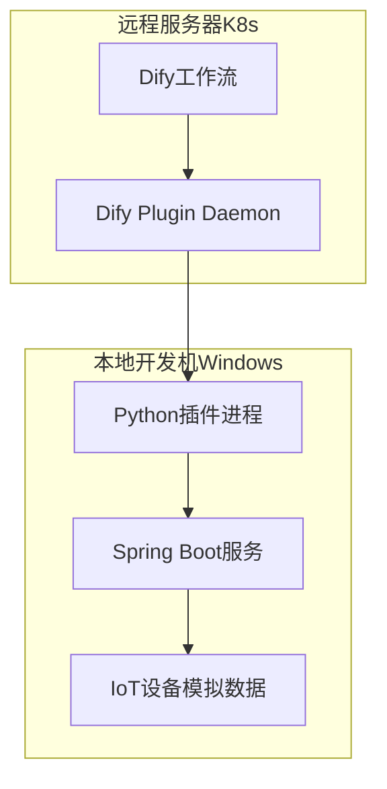
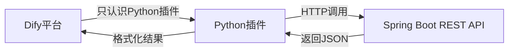
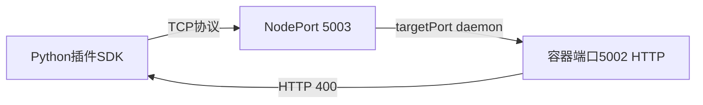
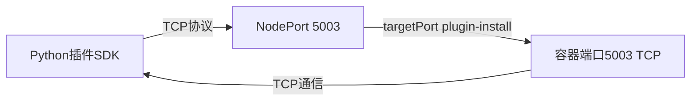
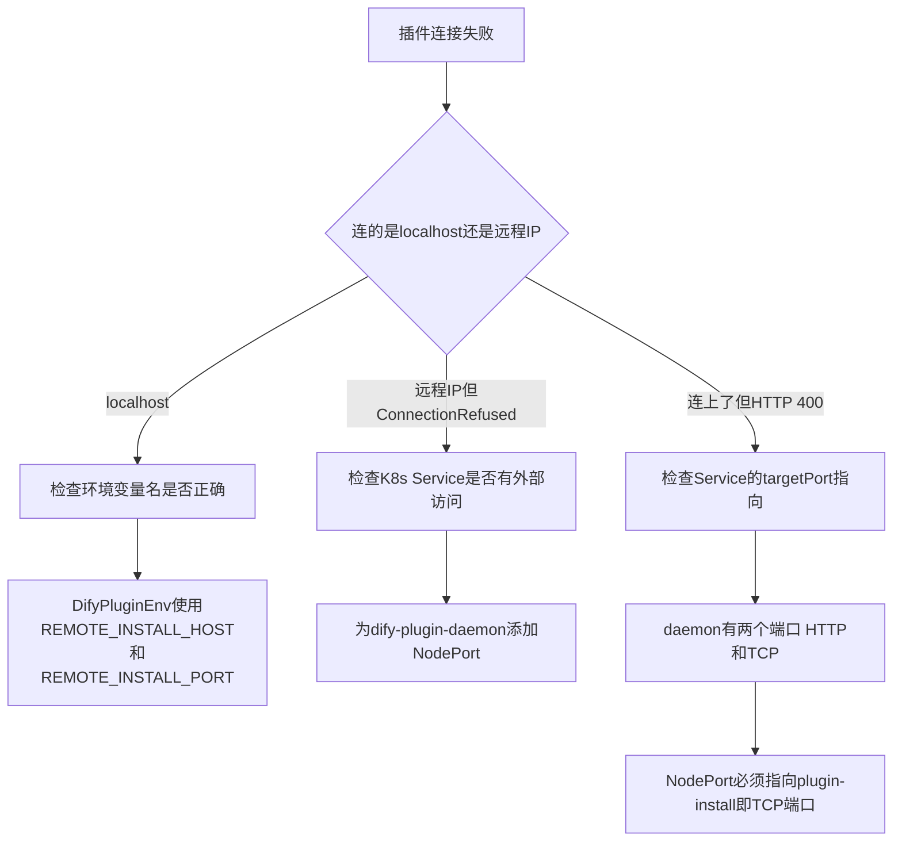
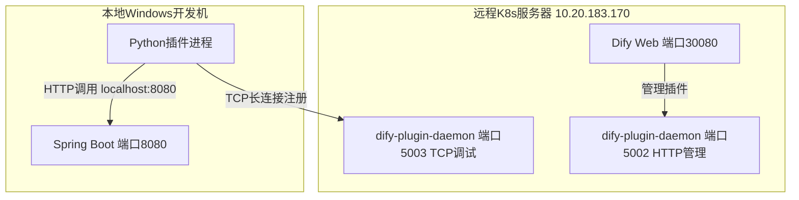

# 本地开发机连接远程Dify插件服务 - 完整实战记录

> 本文完整记录了从零开始创建Dify IoT设备插件，到本地开发机连接远程K8s集群上Dify插件Daemon的全过程。包含项目创建、环境配置、网络排查、端口映射修复等全部踩坑过程。

---

## 目录

1. [背景与目标](#1-背景与目标)
2. [整体架构设计](#2-整体架构设计)
3. [第一部分 - 创建Spring Boot后端服务](#3-第一部分---创建spring-boot后端服务)
4. [第二部分 - 创建Dify Python插件](#4-第二部分---创建dify-python插件)
5. [第三部分 - 本地验证Spring Boot服务](#5-第三部分---本地验证spring-boot服务)
6. [第四部分 - 连接远程Dify插件Daemon](#6-第四部分---连接远程dify插件daemon)
7. [问题排查全过程](#7-问题排查全过程)
8. [最终验证 - 在Dify工作流中使用插件](#8-最终验证---在dify工作流中使用插件)
9. [经验总结与踩坑清单](#9-经验总结与踩坑清单)

---

## 1. 背景与目标

### 1.1 业务场景

我们有一个Spring Boot服务，提供IoT联动设备的REST API（设备列表、状态查询、控制命令、历史数据）。希望将这些设备接入Dify，让AI工作流能够调用这些设备接口。

### 1.2 环境拓扑

```
远程服务器 (10.20.183.170)
    |
    +-- K8s集群
    |     +-- Dify Web (端口30080)
    |     +-- Dify API
    |     +-- dify-plugin-daemon (内部端口5002/5003)
    |
本地开发机 (Windows)
    |
    +-- Spring Boot 服务 (端口8080)
    +-- Python 插件进程 (连接远程Daemon)
```

**关键约束**：Dify部署在远程K8s集群，Spring Boot和Python插件在本地Windows开发机上运行。

### 1.3 技术选型

| 组件 | 技术 | 版本 |
|------|------|------|
| 后端服务 | Spring Boot | 3.2.5 |
| JDK | OpenJDK | 17 |
| Dify插件 | Python + Dify Plugin SDK | Python 3.12 |
| Dify | Community Edition (K8s Helm) | 1.12.1 |

---

## 2. 整体架构设计

### 2.1 数据流向



### 2.2 为什么需要Python插件

Dify的插件系统**只支持Python运行时**。即使用户的核心业务是Spring Boot Java服务，也必须编写一个Python插件作为桥接层：



### 2.3 两个项目的职责

| 项目 | 语言 | 职责 |
|------|------|------|
| plugin-dify-iot-device | Java/Spring Boot | 提供设备REST API，模拟3个IoT设备 |
| plugin-iot-device-plugin | Python/Dify SDK | Dify插件，定义4个工具，转发调用给Spring Boot |

---

## 3. 第一部分 - 创建Spring Boot后端服务

### 3.1 项目结构

```
plugin-dify-iot-device/
├── pom.xml
└── src/main/
    ├── java/com/example/iot/
    │   ├── DifyIotDeviceApplication.java
    │   ├── controller/
    │   │   └── DeviceController.java
    │   ├── model/
    │   │   ├── Device.java
    │   │   ├── DeviceStatus.java
    │   │   ├── ControlCommand.java
    │   │   └── DeviceData.java
    │   └── service/
    │       └── DeviceService.java
    └── resources/
        └── application.yml
```

### 3.2 pom.xml

```xml
<?xml version="1.0" encoding="UTF-8"?>
<project xmlns="http://maven.apache.org/POM/4.0.0"
         xmlns:xsi="http://www.w3.org/2001/XMLSchema-instance"
         xsi:schemaLocation="http://maven.apache.org/POM/4.0.0
         https://maven.apache.org/xsd/maven-4.0.0.xsd">
    <modelVersion>4.0.0</modelVersion>

    <parent>
        <groupId>org.springframework.boot</groupId>
        <artifactId>spring-boot-starter-parent</artifactId>
        <version>3.2.5</version>
        <relativePath/>
    </parent>

    <groupId>com.example</groupId>
    <artifactId>plugin-dify-iot-device</artifactId>
    <version>1.0.0</version>
    <name>plugin-dify-iot-device</name>
    <description>IoT Device Service for Dify Plugin Integration</description>

    <properties>
        <java.version>17</java.version>
    </properties>

    <dependencies>
        <dependency>
            <groupId>org.springframework.boot</groupId>
            <artifactId>spring-boot-starter-web</artifactId>
        </dependency>
        <dependency>
            <groupId>org.springframework.boot</groupId>
            <artifactId>spring-boot-starter-test</artifactId>
            <scope>test</scope>
        </dependency>
    </dependencies>

    <build>
        <plugins>
            <plugin>
                <groupId>org.springframework.boot</groupId>
                <artifactId>spring-boot-maven-plugin</artifactId>
            </plugin>
        </plugins>
    </build>
</project>
```

### 3.3 application.yml

```yaml
server:
  port: 8080

spring:
  application:
    name: dify-iot-device

iot:
  auth:
    enabled: false
    token: your-secret-token-here
```

### 3.4 主启动类

```java
package com.example.iot;

import org.springframework.boot.SpringApplication;
import org.springframework.boot.autoconfigure.SpringBootApplication;

@SpringBootApplication
public class DifyIotDeviceApplication {
    public static void main(String[] args) {
        SpringApplication.run(DifyIotDeviceApplication.class, args);
    }
}
```

### 3.5 数据模型

**Device.java** - 设备基础信息

```java
package com.example.iot.model;

import java.util.List;

public class Device {
    private String deviceId;
    private String deviceName;
    private String deviceType;
    private String location;
    private String status;
    private List<String> capabilities;

    public Device() {}

    public Device(String deviceId, String deviceName, String deviceType,
                  String location, String status, List<String> capabilities) {
        this.deviceId = deviceId;
        this.deviceName = deviceName;
        this.deviceType = deviceType;
        this.location = location;
        this.status = status;
        this.capabilities = capabilities;
    }

    // Getters and Setters省略，完整代码见项目仓库
    public String getDeviceId() { return deviceId; }
    public void setDeviceId(String deviceId) { this.deviceId = deviceId; }
    public String getDeviceName() { return deviceName; }
    public void setDeviceName(String deviceName) { this.deviceName = deviceName; }
    public String getDeviceType() { return deviceType; }
    public void setDeviceType(String deviceType) { this.deviceType = deviceType; }
    public String getLocation() { return location; }
    public void setLocation(String location) { this.location = location; }
    public String getStatus() { return status; }
    public void setStatus(String status) { this.status = status; }
    public List<String> getCapabilities() { return capabilities; }
    public void setCapabilities(List<String> capabilities) { this.capabilities = capabilities; }
}
```

**DeviceStatus.java** - 设备实时状态

```java
package com.example.iot.model;

import java.util.Map;

public class DeviceStatus {
    private String deviceId;
    private String status;
    private long lastSeenTimestamp;
    private Map<String, Object> metrics;

    public DeviceStatus() {}
    public DeviceStatus(String deviceId, String status, long lastSeenTimestamp,
                        Map<String, Object> metrics) {
        this.deviceId = deviceId;
        this.status = status;
        this.lastSeenTimestamp = lastSeenTimestamp;
        this.metrics = metrics;
    }
    // Getters and Setters省略
    public String getDeviceId() { return deviceId; }
    public void setDeviceId(String deviceId) { this.deviceId = deviceId; }
    public String getStatus() { return status; }
    public void setStatus(String status) { this.status = status; }
    public long getLastSeenTimestamp() { return lastSeenTimestamp; }
    public void setLastSeenTimestamp(long lastSeenTimestamp) { this.lastSeenTimestamp = lastSeenTimestamp; }
    public Map<String, Object> getMetrics() { return metrics; }
    public void setMetrics(Map<String, Object> metrics) { this.metrics = metrics; }
}
```

**ControlCommand.java** - 控制命令

```java
package com.example.iot.model;

public class ControlCommand {
    private String deviceId;
    private String action;
    private String value;

    public ControlCommand() {}
    public String getDeviceId() { return deviceId; }
    public void setDeviceId(String deviceId) { this.deviceId = deviceId; }
    public String getAction() { return action; }
    public void setAction(String action) { this.action = action; }
    public String getValue() { return value; }
    public void setValue(String value) { this.value = value; }
}
```

**DeviceData.java** - 历史数据

```java
package com.example.iot.model;

import java.util.List;
import java.util.Map;

public class DeviceData {
    private String deviceId;
    private List<Map<String, Object>> records;

    public DeviceData() {}
    public DeviceData(String deviceId, List<Map<String, Object>> records) {
        this.deviceId = deviceId;
        this.records = records;
    }
    public String getDeviceId() { return deviceId; }
    public void setDeviceId(String deviceId) { this.deviceId = deviceId; }
    public List<Map<String, Object>> getRecords() { return records; }
    public void setRecords(List<Map<String, Object>> records) { this.records = records; }
}
```

### 3.6 业务服务 DeviceService.java

使用内存ConcurrentHashMap模拟3个IoT设备，无需数据库：

```java
package com.example.iot.service;

import com.example.iot.model.Device;
import com.example.iot.model.DeviceData;
import com.example.iot.model.DeviceStatus;
import org.springframework.stereotype.Service;
import jakarta.annotation.PostConstruct;
import java.util.*;
import java.util.concurrent.ConcurrentHashMap;

@Service
public class DeviceService {

    private final Map<String, Device> deviceStore = new ConcurrentHashMap<>();

    @PostConstruct
    public void initMockData() {
        deviceStore.put("device_001", new Device(
            "device_001", "客厅温度传感器", "temperature_sensor",
            "客厅", "online",
            List.of("read_temperature", "read_humidity", "set_threshold")
        ));
        deviceStore.put("device_002", new Device(
            "device_002", "卧室智能灯泡", "smart_light",
            "卧室", "online",
            List.of("turn_on", "turn_off", "set_brightness", "set_color")
        ));
        deviceStore.put("device_003", new Device(
            "device_003", "厨房智能开关", "smart_switch",
            "厨房", "offline",
            List.of("turn_on", "turn_off", "get_power_usage")
        ));
    }

    public List<Device> listDevices() {
        return new ArrayList<>(deviceStore.values());
    }

    public Optional<Device> getDevice(String deviceId) {
        return Optional.ofNullable(deviceStore.get(deviceId));
    }

    public DeviceStatus getDeviceStatus(String deviceId) {
        Device device = deviceStore.get(deviceId);
        if (device == null) {
            throw new NoSuchElementException("Device not found: " + deviceId);
        }
        Map<String, Object> metrics = new HashMap<>();
        switch (device.getDeviceType()) {
            case "temperature_sensor" -> {
                metrics.put("temperature", 22.5);
                metrics.put("humidity", 55.0);
                metrics.put("threshold", 30.0);
            }
            case "smart_light" -> {
                metrics.put("brightness", 80);
                metrics.put("color", "#FFFFFF");
                metrics.put("power", "on");
            }
            case "smart_switch" -> {
                metrics.put("power", "off");
                metrics.put("power_usage_kwh", 12.5);
            }
        }
        return new DeviceStatus(deviceId, device.getStatus(),
            System.currentTimeMillis(), metrics);
    }

    public Map<String, Object> controlDevice(String deviceId, String action, String value) {
        Device device = deviceStore.get(deviceId);
        if (device == null) {
            throw new NoSuchElementException("Device not found: " + deviceId);
        }
        if (!device.getCapabilities().contains(action)) {
            throw new IllegalArgumentException(
                "Device " + deviceId + " does not support action: " + action);
        }
        Map<String, Object> result = new HashMap<>();
        result.put("deviceId", deviceId);
        result.put("action", action);
        result.put("value", value);
        result.put("success", true);
        result.put("message", "Command executed successfully");
        result.put("timestamp", System.currentTimeMillis());
        return result;
    }

    public DeviceData queryDeviceData(String deviceId, String metric, int limit) {
        Device device = deviceStore.get(deviceId);
        if (device == null) {
            throw new NoSuchElementException("Device not found: " + deviceId);
        }
        List<Map<String, Object>> records = new ArrayList<>();
        long now = System.currentTimeMillis();
        Random random = new Random(deviceId.hashCode());
        for (int i = 0; i < limit; i++) {
            Map<String, Object> record = new HashMap<>();
            record.put("timestamp", now - (i * 60_000L));
            if ("temperature".equals(metric)) {
                record.put("value", 20 + random.nextDouble() * 10);
                record.put("unit", "°C");
            } else if ("humidity".equals(metric)) {
                record.put("value", 40 + random.nextDouble() * 30);
                record.put("unit", "%");
            } else if ("brightness".equals(metric)) {
                record.put("value", random.nextInt(101));
                record.put("unit", "%");
            } else if ("power_usage_kwh".equals(metric)) {
                record.put("value", random.nextDouble() * 5);
                record.put("unit", "kWh");
            } else {
                record.put("value", random.nextDouble() * 100);
                record.put("unit", "unknown");
            }
            records.add(record);
        }
        return new DeviceData(deviceId, records);
    }
}
```

### 3.7 REST控制器 DeviceController.java

提供5个API端点：

```java
package com.example.iot.controller;

import com.example.iot.model.*;
import com.example.iot.service.DeviceService;
import org.springframework.http.ResponseEntity;
import org.springframework.web.bind.annotation.*;
import java.util.*;

@RestController
@RequestMapping("/api/devices")
public class DeviceController {

    private final DeviceService deviceService;

    public DeviceController(DeviceService deviceService) {
        this.deviceService = deviceService;
    }

    @GetMapping
    public ResponseEntity<List<Device>> listDevices() {
        return ResponseEntity.ok(deviceService.listDevices());
    }

    @GetMapping("/{deviceId}")
    public ResponseEntity<?> getDevice(@PathVariable String deviceId) {
        return deviceService.getDevice(deviceId)
            .map(ResponseEntity::ok)
            .orElse(ResponseEntity.notFound().build());
    }

    @GetMapping("/{deviceId}/status")
    public ResponseEntity<?> getDeviceStatus(@PathVariable String deviceId) {
        try {
            return ResponseEntity.ok(deviceService.getDeviceStatus(deviceId));
        } catch (NoSuchElementException e) {
            return ResponseEntity.notFound().build();
        }
    }

    @PostMapping("/{deviceId}/control")
    public ResponseEntity<?> controlDevice(
            @PathVariable String deviceId,
            @RequestBody ControlCommand command) {
        try {
            Map<String, Object> result = deviceService.controlDevice(
                deviceId, command.getAction(), command.getValue());
            return ResponseEntity.ok(result);
        } catch (NoSuchElementException e) {
            return ResponseEntity.notFound().build();
        } catch (IllegalArgumentException e) {
            return ResponseEntity.badRequest().body(Map.of("error", e.getMessage()));
        }
    }

    @GetMapping("/{deviceId}/data")
    public ResponseEntity<?> queryDeviceData(
            @PathVariable String deviceId,
            @RequestParam(defaultValue = "temperature") String metric,
            @RequestParam(defaultValue = "10") int limit) {
        try {
            return ResponseEntity.ok(deviceService.queryDeviceData(deviceId, metric, limit));
        } catch (NoSuchElementException e) {
            return ResponseEntity.notFound().build();
        }
    }

    @ExceptionHandler(Exception.class)
    public ResponseEntity<Map<String, String>> handleException(Exception e) {
        return ResponseEntity.internalServerError().body(Map.of("error", e.getMessage()));
    }
}
```

### 3.8 API接口清单

| 方法 | 路径 | 功能 |
|------|------|------|
| GET | /api/devices | 获取所有设备列表 |
| GET | /api/devices/{id} | 获取单个设备详情 |
| GET | /api/devices/{id}/status | 获取设备实时状态和指标 |
| POST | /api/devices/{id}/control | 发送控制命令 |
| GET | /api/devices/{id}/data | 查询设备历史数据 |

---

## 4. 第二部分 - 创建Dify Python插件

### 4.1 项目结构

```
plugin-iot-device-plugin/
├── manifest.yaml              # 插件主清单
├── main.py                    # 入口文件
├── requirements.txt           # Python依赖
├── .env                       # 环境变量配置
├── .env.example               # 环境变量模板
├── _assets/
│   └── icon.svg               # 插件图标
├── provider/
│   ├── iot_device_plugin.yaml # Provider配置
│   └── iot_device_plugin.py   # Provider凭证验证
└── tools/
    ├── list_devices.yaml      # 工具1定义
    ├── list_devices.py        # 工具1实现
    ├── get_device_status.yaml # 工具2定义
    ├── get_device_status.py   # 工具2实现
    ├── control_device.yaml    # 工具3定义
    ├── control_device.py      # 工具3实现
    ├── query_device_data.yaml # 工具4定义
    └── query_device_data.py   # 工具4实现
```

### 4.2 manifest.yaml 插件主清单

```yaml
version: 0.0.1
type: plugin
author: your-name
name: iot_device_plugin
label:
  en_US: IoT Device Connector
  zh_Hans: IoT设备连接器
description:
  en_US: Connect to IoT device management service, support device listing, status query, control and data analysis
  zh_Hans: 连接IoT设备管理服务，支持设备列表、状态查询、设备控制和数据分析
icon: icon.svg
created_at: 2025-01-01T00:00:00.000Z
resource:
  memory: 268435456
  permission:
    tool:
      enabled: true
    storage:
      enabled: true
      size: 1048576
    endpoint:
      enabled: true
plugins:
  tools:
    - provider/iot_device_plugin.yaml
meta:
  version: 0.0.1
  arch:
    - amd64
    - arm64
  runner:
    language: python
    version: "3.12"
    entrypoint: main
```

### 4.3 provider/iot_device_plugin.yaml Provider配置

定义了安装插件时用户需要填写的凭证（Spring服务地址和API Token）：

```yaml
identity:
  author: your-name
  name: iot_device_plugin
  label:
    en_US: IoT Device Connector
    zh_Hans: IoT设备连接器
  description:
    en_US: Connect to IoT device management Spring service
    zh_Hans: 连接IoT设备管理Spring服务
  icon: icon.svg
  tags:
    - utilities
    - productivity

credentials_for_provider:
  spring_service_url:
    type: text-input
    required: true
    label:
      en_US: Spring Service URL
      zh_Hans: Spring服务地址
    placeholder:
      en_US: "e.g. http://localhost:8080"
      zh_Hans: "例如 http://localhost:8080"
    help:
      en_US: The base URL of your Spring Boot IoT device service
      zh_Hans: Spring Boot IoT设备服务的基础地址
    url: ""

  api_token:
    type: secret-input
    required: false
    label:
      en_US: API Token (Optional)
      zh_Hans: API Token (可选)
    placeholder:
      en_US: "Leave empty if no authentication required"
      zh_Hans: "如无需认证则留空"
    help:
      en_US: Bearer token for authenticating with the Spring service
      zh_Hans: 用于Spring服务认证的Bearer Token

tools:
  - tools/list_devices.yaml
  - tools/get_device_status.yaml
  - tools/control_device.yaml
  - tools/query_device_data.yaml

extra:
  python:
    source: provider/iot_device_plugin.py
```

### 4.4 provider/iot_device_plugin.py 凭证验证

安装插件时自动调用，验证Spring服务是否可达：

```python
from typing import Any
from dify_plugin import ToolProvider
from dify_plugin.errors.tool import ToolProviderCredentialValidationError
import requests


class IotDevicePluginProvider(ToolProvider):
    def _validate_credentials(self, credentials: dict[str, Any]) -> None:
        spring_url = credentials.get("spring_service_url", "").rstrip("/")
        api_token = credentials.get("api_token", "")

        if not spring_url:
            raise ToolProviderCredentialValidationError("Spring服务地址不能为空")

        headers = {}
        if api_token:
            headers["Authorization"] = f"Bearer {api_token}"

        try:
            response = requests.get(
                f"{spring_url}/api/devices", headers=headers, timeout=10
            )
            response.raise_for_status()
        except requests.exceptions.ConnectionError:
            raise ToolProviderCredentialValidationError(
                f"无法连接到Spring服务: {spring_url}，请确认服务已启动")
        except requests.exceptions.HTTPError as e:
            raise ToolProviderCredentialValidationError(
                f"Spring服务返回错误: {e.response.status_code}")
        except Exception as e:
            raise ToolProviderCredentialValidationError(f"验证失败: {str(e)}")
```

### 4.5 工具YAML定义（4个工具）

**tools/list_devices.yaml**

```yaml
identity:
  name: list_devices
  author: your-name
  label:
    en_US: List Devices
    zh_Hans: 获取设备列表
description:
  human:
    en_US: "Get all available IoT devices with their basic information"
    zh_Hans: "获取所有可用IoT设备的基本信息，包括设备ID、名称、类型、位置、状态等"
  llm: "Retrieve a list of all IoT devices. Returns device ID, name, type, location, status and supported capabilities."
parameters: []
extra:
  python:
    source: tools/list_devices.py
```

**tools/get_device_status.yaml**

```yaml
identity:
  name: get_device_status
  author: your-name
  label:
    en_US: Get Device Status
    zh_Hans: 获取设备状态
description:
  human:
    en_US: "Query real-time status and metrics of a specific device"
    zh_Hans: "查询指定设备的实时状态和指标数据，如温度、湿度、亮度等"
  llm: "Query the current status and real-time metrics of a device by its device_id. Returns online/offline status and device-specific metrics."
parameters:
  - name: device_id
    type: string
    required: true
    label:
      en_US: Device ID
      zh_Hans: 设备ID
    human_description:
      en_US: "The unique identifier of the device"
      zh_Hans: "设备的唯一标识符，可通过 list_devices 工具获取"
    llm_description: "The device_id to query status for, e.g. device_001"
    form: llm
extra:
  python:
    source: tools/get_device_status.py
```

**tools/control_device.yaml**

```yaml
identity:
  name: control_device
  author: your-name
  label:
    en_US: Control Device
    zh_Hans: 控制设备
description:
  human:
    en_US: "Send a control command to a specific device"
    zh_Hans: "向指定设备发送控制命令，如开关灯、调节温度、设置亮度等"
  llm: "Send a control command to a device. Requires device_id, action (such as turn_on, turn_off, set_brightness, set_temperature), and an optional value parameter."
parameters:
  - name: device_id
    type: string
    required: true
    label:
      en_US: Device ID
      zh_Hans: 设备ID
    human_description:
      en_US: "The unique identifier of the device to control"
      zh_Hans: "要控制的设备唯一标识符"
    llm_description: "The device_id to send command to, e.g. device_002"
    form: llm
  - name: action
    type: string
    required: true
    label:
      en_US: Action
      zh_Hans: 操作动作
    human_description:
      en_US: "The action to perform, e.g. turn_on, turn_off, set_brightness, set_color, set_threshold"
      zh_Hans: "要执行的动作，如 turn_on(开启)、turn_off(关闭)、set_brightness(设置亮度)、set_color(设置颜色)、set_threshold(设置阈值)"
    llm_description: "The action name to execute on the device"
    form: llm
  - name: value
    type: string
    required: false
    label:
      en_US: Value
      zh_Hans: 参数值
    human_description:
      en_US: "The value for the action, e.g. 100 for brightness, #FF0000 for color"
      zh_Hans: "动作的参数值，如亮度值100、颜色值#FF0000等"
    llm_description: "The value parameter for the action, e.g. 80 for brightness or #FF0000 for color"
    form: llm
extra:
  python:
    source: tools/control_device.py
```

**tools/query_device_data.yaml**

```yaml
identity:
  name: query_device_data
  author: your-name
  label:
    en_US: Query Device Data
    zh_Hans: 查询设备历史数据
description:
  human:
    en_US: "Query historical data records of a specific device"
    zh_Hans: "查询指定设备的历史数据记录，支持指定指标类型和记录条数"
  llm: "Query historical metric data from a device. Supports metrics like temperature, humidity, brightness, power_usage_kwh. Returns a list of timestamped data records."
parameters:
  - name: device_id
    type: string
    required: true
    label:
      en_US: Device ID
      zh_Hans: 设备ID
    human_description:
      en_US: "The unique identifier of the device"
      zh_Hans: "设备的唯一标识符"
    llm_description: "The device_id to query historical data for"
    form: llm
  - name: metric
    type: string
    required: false
    label:
      en_US: Metric Name
      zh_Hans: 指标名称
    human_description:
      en_US: "The metric to query, e.g. temperature, humidity, brightness, power_usage_kwh"
      zh_Hans: "要查询的指标名称，如 temperature(温度)、humidity(湿度)、brightness(亮度)、power_usage_kwh(用电量)"
    llm_description: "The metric name to query, default is temperature"
    form: llm
    default: "temperature"
  - name: limit
    type: number
    required: false
    label:
      en_US: Record Limit
      zh_Hans: 记录条数
    human_description:
      en_US: "Maximum number of records to return, default 10"
      zh_Hans: "最多返回多少条记录，默认10条"
    llm_description: "Max number of records to return, default 10"
    form: form
    default: 10
extra:
  python:
    source: tools/query_device_data.py
```

### 4.6 工具Python实现（4个工具）

**tools/list_devices.py** - 获取设备列表

```python
import json
from typing import Any, Generator
from dify_plugin import Tool
from dify_plugin.entities.tool import ToolInvokeMessage
import requests


class ListDevicesTool(Tool):
    def _invoke(
        self, tool_parameters: dict[str, Any]
    ) -> Generator[ToolInvokeMessage, None, None]:
        spring_url = self.runtime.credentials.get("spring_service_url", "").rstrip("/")
        api_token = self.runtime.credentials.get("api_token", "")

        headers = {"Content-Type": "application/json"}
        if api_token:
            headers["Authorization"] = f"Bearer {api_token}"

        try:
            response = requests.get(
                f"{spring_url}/api/devices", headers=headers, timeout=15
            )
            response.raise_for_status()
            devices = response.json()
        except Exception as e:
            yield self.create_text_message(f"请求失败: {str(e)}")
            return

        if not devices:
            yield self.create_text_message("当前没有可用的设备。")
            return

        lines = [f"共发现 {len(devices)} 个设备：\n"]
        for d in devices:
            caps = ", ".join(d.get("capabilities", []))
            lines.append(
                f"• [{d['deviceId']}] {d['deviceName']}\n"
                f"  类型: {d['deviceType']} | 位置: {d.get('location', '-')} | "
                f"状态: {d.get('status', '-')}\n"
                f"  支持操作: {caps}"
            )

        yield self.create_text_message("\n".join(lines))
        yield self.create_json_message({"devices": devices, "total": len(devices)})
```

**tools/get_device_status.py** - 获取设备状态

```python
import json
from typing import Any, Generator
from dify_plugin import Tool
from dify_plugin.entities.tool import ToolInvokeMessage
import requests


class GetDeviceStatusTool(Tool):
    def _invoke(
        self, tool_parameters: dict[str, Any]
    ) -> Generator[ToolInvokeMessage, None, None]:
        spring_url = self.runtime.credentials.get("spring_service_url", "").rstrip("/")
        api_token = self.runtime.credentials.get("api_token", "")
        device_id = tool_parameters.get("device_id", "")

        if not device_id:
            yield self.create_text_message("错误：请提供设备ID（device_id）")
            return

        headers = {"Content-Type": "application/json"}
        if api_token:
            headers["Authorization"] = f"Bearer {api_token}"

        try:
            response = requests.get(
                f"{spring_url}/api/devices/{device_id}/status",
                headers=headers, timeout=15
            )
            response.raise_for_status()
            status_data = response.json()
        except requests.exceptions.HTTPError as e:
            if e.response.status_code == 404:
                yield self.create_text_message(f"设备 {device_id} 不存在")
            else:
                yield self.create_text_message(f"请求失败: HTTP {e.response.status_code}")
            return
        except Exception as e:
            yield self.create_text_message(f"请求失败: {str(e)}")
            return

        metrics = status_data.get("metrics", {})
        metrics_str = "\n".join(f"  - {k}: {v}" for k, v in metrics.items())
        text = (
            f"设备 {device_id} 状态：\n"
            f"  在线状态: {status_data.get('status', '-')}\n"
            f"  最后在线时间: {status_data.get('lastSeenTimestamp', '-')}\n"
            f"  实时指标:\n{metrics_str}"
        )
        yield self.create_text_message(text)
        yield self.create_json_message(status_data)
```

**tools/control_device.py** - 控制设备

```python
import json
from typing import Any, Generator
from dify_plugin import Tool
from dify_plugin.entities.tool import ToolInvokeMessage
import requests


class ControlDeviceTool(Tool):
    def _invoke(
        self, tool_parameters: dict[str, Any]
    ) -> Generator[ToolInvokeMessage, None, None]:
        spring_url = self.runtime.credentials.get("spring_service_url", "").rstrip("/")
        api_token = self.runtime.credentials.get("api_token", "")
        device_id = tool_parameters.get("device_id", "")
        action = tool_parameters.get("action", "")
        value = tool_parameters.get("value", "")

        if not device_id:
            yield self.create_text_message("错误：请提供设备ID（device_id）")
            return
        if not action:
            yield self.create_text_message("错误：请提供操作动作（action）")
            return

        headers = {"Content-Type": "application/json"}
        if api_token:
            headers["Authorization"] = f"Bearer {api_token}"

        payload = {"action": action, "value": value}

        try:
            response = requests.post(
                f"{spring_url}/api/devices/{device_id}/control",
                headers=headers, json=payload, timeout=15
            )
            response.raise_for_status()
            result = response.json()
        except requests.exceptions.HTTPError as e:
            if e.response.status_code == 404:
                yield self.create_text_message(f"设备 {device_id} 不存在")
            elif e.response.status_code == 400:
                error_msg = e.response.json().get("error", "未知错误")
                yield self.create_text_message(f"命令无效: {error_msg}")
            else:
                yield self.create_text_message(f"请求失败: HTTP {e.response.status_code}")
            return
        except Exception as e:
            yield self.create_text_message(f"请求失败: {str(e)}")
            return

        success = result.get("success", False)
        status_emoji = "✅" if success else "❌"
        text = (
            f"{status_emoji} 控制命令执行结果：\n"
            f"  设备: {device_id}\n"
            f"  动作: {action}\n"
            f"  参数值: {value}\n"
            f"  结果: {'成功' if success else '失败'}\n"
            f"  说明: {result.get('message', '-')}"
        )
        yield self.create_text_message(text)
        yield self.create_json_message(result)
```

**tools/query_device_data.py** - 查询历史数据

```python
import json
from datetime import datetime
from typing import Any, Generator
from dify_plugin import Tool
from dify_plugin.entities.tool import ToolInvokeMessage
import requests


class QueryDeviceDataTool(Tool):
    def _invoke(
        self, tool_parameters: dict[str, Any]
    ) -> Generator[ToolInvokeMessage, None, None]:
        spring_url = self.runtime.credentials.get("spring_service_url", "").rstrip("/")
        api_token = self.runtime.credentials.get("api_token", "")
        device_id = tool_parameters.get("device_id", "")
        metric = tool_parameters.get("metric", "temperature")
        limit = int(tool_parameters.get("limit", 10))

        if not device_id:
            yield self.create_text_message("错误：请提供设备ID（device_id）")
            return

        headers = {"Content-Type": "application/json"}
        if api_token:
            headers["Authorization"] = f"Bearer {api_token}"

        try:
            response = requests.get(
                f"{spring_url}/api/devices/{device_id}/data",
                headers=headers,
                params={"metric": metric, "limit": limit},
                timeout=15
            )
            response.raise_for_status()
            data = response.json()
        except requests.exceptions.HTTPError as e:
            if e.response.status_code == 404:
                yield self.create_text_message(f"设备 {device_id} 不存在")
            else:
                yield self.create_text_message(f"请求失败: HTTP {e.response.status_code}")
            return
        except Exception as e:
            yield self.create_text_message(f"请求失败: {str(e)}")
            return

        records = data.get("records", [])
        if not records:
            yield self.create_text_message(f"设备 {device_id} 没有 {metric} 历史数据")
            return

        lines = [f"设备 {device_id} 的 {metric} 历史数据（共 {len(records)} 条）：\n"]
        for r in records[:10]:
            ts = r.get("timestamp", 0)
            time_str = datetime.fromtimestamp(ts / 1000).strftime("%Y-%m-%d %H:%M:%S")
            value = r.get("value", "-")
            unit = r.get("unit", "")
            lines.append(f"  {time_str}  →  {value} {unit}")

        yield self.create_text_message("\n".join(lines))
        yield self.create_json_message(data)
```

### 4.7 入口文件和依赖

**main.py** - 插件入口（含显式加载.env）

```python
import os
from pathlib import Path
from dotenv import load_dotenv

# 显式加载 .env 文件
load_dotenv(Path(__file__).parent / ".env")

print(f"[DEBUG] REMOTE_INSTALL_HOST={os.getenv('REMOTE_INSTALL_HOST')}")
print(f"[DEBUG] REMOTE_INSTALL_PORT={os.getenv('REMOTE_INSTALL_PORT')}")
print(f"[DEBUG] INSTALL_METHOD={os.getenv('INSTALL_METHOD')}")

from dify_plugin import Plugin, DifyPluginEnv

plugin = Plugin(DifyPluginEnv())
plugin.run()
```

> **重要**：我们发现 `DifyPluginEnv` 并不总是自动加载 `.env` 文件，因此在 `main.py` 中显式调用 `load_dotenv()` 确保环境变量正确加载。

**requirements.txt**

```
dify_plugin~=0.0.1b72
requests>=2.31.0
python-dotenv>=1.0.0
```

---

## 5. 第三部分 - 本地验证Spring Boot服务

### 5.1 编译验证

在PowerShell中执行：

```powershell
cd E:\Ideaproject\test-dify\plugin-dify-iot-device
mvn compile -q
```

输出为空表示编译成功，无错误。

### 5.2 启动服务

```powershell
mvn spring-boot:run
```

看到类似日志表示启动成功：

```
Started DifyIotDeviceApplication in X seconds
```

### 5.3 验证API接口

另开一个PowerShell终端，逐一验证：

```powershell
# 1. 获取设备列表
Invoke-RestMethod http://localhost:8080/api/devices

# 2. 获取设备状态
Invoke-RestMethod http://localhost:8080/api/devices/device_001/status

# 3. 发送控制命令
Invoke-RestMethod -Method Post -Uri "http://localhost:8080/api/devices/device_002/control" `
  -ContentType "application/json" -Body '{"action":"turn_on","value":"100"}'

# 4. 查询历史数据
Invoke-RestMethod "http://localhost:8080/api/devices/device_001/data?metric=temperature&limit=3"
```

每个命令都应返回JSON数据，说明Spring Boot服务正常。

---

## 6. 第四部分 - 连接远程Dify插件Daemon

### 6.1 获取调试地址和密钥

1. 浏览器打开远程Dify界面 `http://10.20.183.170:30080`
2. 登录后，点击左侧菜单 **插件**
3. 在插件页面右上角找到**调试图标**（虫子图标）
4. 点击后弹窗显示：
   - **URL**: `localhost:5003`
   - **Key**: `3969172e-****-****-****-58350c00e0c7`

> **注意**：Dify界面显示的 `localhost:5003` 是指远程服务器的localhost，不是本地电脑。需要替换为服务器真实IP。

### 6.2 配置 .env 文件

根据弹窗信息配置 `.env`：

```ini
INSTALL_METHOD=remote
# 远程Dify插件Daemon地址（分开配置host和port）
REMOTE_INSTALL_HOST=10.20.183.170
REMOTE_INSTALL_PORT=5003
# 调试API Key
REMOTE_INSTALL_KEY=3969172e-bcaf-4c75-939d-58350c00e0c7
```

### 6.3 安装Python依赖

```powershell
pip install -r requirements.txt
```

输出：

```
Requirement already satisfied: python-dotenv in d:\python312\install\lib\site-packages (1.2.2)
```

---

## 7. 问题排查全过程

这是本文最核心的部分，记录了从本地Windows连接远程K8s集群上Dify插件Daemon时遇到的所有问题及其排查过程。

### 7.1 问题一 - 环境变量名写错导致连接localhost

**现象**：

```powershell
python -m main
```

```
Failed to connect to localhost:5003
ConnectionRefusedError: [Errno 10061] 由于目标计算机积极拒绝，无法连接。
```

插件在连 `localhost:5003`，但我们期望连 `10.20.183.170:5003`。

**排查过程**：

首先确认 `.env` 文件内容是否正确：

```ini
INSTALL_METHOD=remote
REMOTE_INSTALL_URL=10.20.183.170:5003
REMOTE_INSTALL_KEY=3969172e-bcaf-4c75-939d-58350c00e0c7
```

文件里写的是 `REMOTE_INSTALL_URL`，但插件仍然连localhost。怀疑 `.env` 没有被加载，于是在 `main.py` 中添加显式加载：

```python
import os
from pathlib import Path
from dotenv import load_dotenv

load_dotenv(Path(__file__).parent / ".env")
print(f"[DEBUG] REMOTE_INSTALL_URL={os.getenv('REMOTE_INSTALL_URL')}")
```

重新运行后DEBUG输出：

```
[DEBUG] REMOTE_INSTALL_URL=10.20.183.170:5003
[DEBUG] INSTALL_METHOD=remote
```

环境变量确实加载了，但插件**仍然连 localhost:5003**。说明 `DifyPluginEnv` 根本不使用 `REMOTE_INSTALL_URL` 这个变量名。

**根因定位**：

通过查看SDK源码，找到了 `DifyPluginEnv` 类的真实字段定义：

```python
class DifyPluginEnv(BaseSettings):
    INSTALL_METHOD: InstallMethod = Field(default=InstallMethod.Local)
    REMOTE_INSTALL_HOST: str = Field(default="localhost")
    REMOTE_INSTALL_PORT: int = Field(default=5003)
    REMOTE_INSTALL_KEY: Optional[str] = Field(default=None)
    # ...
```

**SDK使用的是 `REMOTE_INSTALL_HOST` + `REMOTE_INSTALL_PORT` 两个独立变量**，而不是 `REMOTE_INSTALL_URL`。

**修复**：

修改 `.env`：

```ini
REMOTE_INSTALL_HOST=10.20.183.170
REMOTE_INSTALL_PORT=5003
```

### 7.2 问题二 - K8s端口未对外暴露导致ConnectionRefused

**现象**：修改.env后运行：

```
ConnectionRefusedError: [Errno 10061] 由于目标计算机积极拒绝，无法连接。
```

**排查过程**：

在PowerShell中测试端口可达性：

```powershell
Test-NetConnection -ComputerName 10.20.183.170 -Port 5003
```

结果 `TcpTestSucceeded: False`，端口不通。

登录远程服务器查看K8s服务列表，发现 `dify-plugin-daemon` 只有内部ClusterIP（`10.246.254.152`），没有配置外部访问。

**修复**：在K8s管理平台为 `dify-plugin-daemon` 服务添加外部访问配置。

### 7.3 问题三 - NodePort指向错误的容器端口导致HTTP 400

**现象**：端口可达后运行插件：

```
{"event": "log", "data": {"level": "INFO", "message": "Installed tool: iot_device_plugin"}}
An error occurred while parsing the data: b'400 Bad RequestHTTP/1.1 400 Bad Request\r'
json.decoder.JSONDecodeError: Extra data: line 1 column 5 (char 4)
Failed to read data from 10.20.183.170:5003
ConnectionAbortedError: [WinError 10053] 你的主机中的软件中止了一个已建立的连接。
```

插件注册成功了（`Installed tool: iot_device_plugin`），但随后TCP长连接通信时收到了HTTP 400响应。

**排查过程**：

**第一步**：检查Ingress是否拦截

```bash
kubectl get ingress -n dify
# 输出: No resources found in dify namespace.
```

不是Ingress的问题。

**第二步**：查看daemon的Pod日志

```bash
kubectl logs -l component=plugin-daemon -n dify --tail=50
```

日志全是HTTP请求记录（GET/POST），没有看到TCP连接的痕迹。daemon收到的都是来自Dify Web界面的管理API请求。

**第三步**：查看daemon容器的端口定义

```bash
kubectl get pod dify-plugin-daemon-547bcc476-nxk62 -n dify \
  -o jsonpath='{.spec.containers[*].ports}' | python3 -m json.tool
```

**关键发现**：

```json
[
    {
        "containerPort": 5002,
        "name": "daemon",
        "protocol": "TCP"
    },
    {
        "containerPort": 5003,
        "name": "plugin-install",
        "protocol": "TCP"
    }
]
```

daemon容器有**两个端口**：
- **5002** (daemon) - HTTP管理端口，Dify Web界面调用
- **5003** (plugin-install) - TCP调试端口，Python插件注册用

**第四步**：查看环境变量确认

```bash
kubectl exec -n dify dify-plugin-daemon-547bcc476-nxk62 -- env | grep -i port
```

关键输出：

```
SERVER_PORT=5002
PLUGIN_REMOTE_INSTALLING_PORT=5003
```

确认 `PLUGIN_REMOTE_INSTALLING_PORT=5003` 就是TCP调试端口。

**第五步**：查看K8s Service配置

```bash
kubectl get svc dify-plugin-daemon -n dify -o yaml
```

发现问题：

```yaml
spec:
  ports:
    - name: http-daemon
      port: 5002
      targetPort: daemon    # 指向容器端口5002(HTTP)
      nodePort: 5003
```

Service的 `targetPort: daemon` 指向了容器的5002端口（HTTP管理端口），而不是5003端口（TCP调试端口）。所以NodePort 5003实际上转发到了HTTP服务，插件SDK用TCP协议去连HTTP服务，自然收到400 Bad Request。

**根因**：



正确的指向应该是：



**修复**：

```bash
kubectl patch svc dify-plugin-daemon -n dify --type='json' \
  -p='[{"op":"replace","path":"/spec/ports","value":[
    {"name":"http-daemon","port":5002,"targetPort":"daemon","nodePort":5002,"protocol":"TCP"},
    {"name":"plugin-debug","port":5003,"targetPort":"plugin-install","nodePort":5003,"protocol":"TCP"}
  ]}]'
```

验证修复结果：

```bash
kubectl get svc dify-plugin-daemon -n dify
```

```
NAME                 TYPE       CLUSTER-IP       EXTERNAL-IP   PORT(S)                       AGE
dify-plugin-daemon   NodePort   10.246.254.152   <none>        5002:5002/TCP,5003:5003/TCP   23d
```

现在两个端口都正确映射了。

### 7.4 最终连接成功

```powershell
python -m main
```

```
[DEBUG] REMOTE_INSTALL_HOST=10.20.183.170
[DEBUG] REMOTE_INSTALL_PORT=5003
[DEBUG] INSTALL_METHOD=remote
{"event": "log", "data": {"level": "INFO", "message": "Installed tool: iot_device_plugin", "timestamp": 1780465601.22771}}
```

插件稳定连接，没有报错，注册成功。

---

## 8. 最终验证 - 在Dify工作流中使用插件

### 8.1 Dify界面确认

登录远程Dify `http://10.20.183.170:30080`，进入 **插件** 页面，可以看到：

```
IoT设备连接器 0.0.1
连接IoT设备管理服务，支持设备列表、状态查询、设备控制和数据分析
```

### 8.2 配置插件凭证

点击插件设置，填写：
- **Spring Service URL**: `http://localhost:8080`
- **API Token**: 留空

> **为什么填localhost**：Python插件在本地运行，它调用Spring Boot时走的是本机网络，所以 `localhost:8080` 是正确的。

### 8.3 启动顺序

需要同时保持两个终端运行：

| 终端 | 目录 | 命令 | 作用 |
|------|------|------|------|
| 终端1 | plugin-dify-iot-device | `mvn spring-boot:run` | 本地设备API服务 |
| 终端2 | plugin-iot-device-plugin | `python -m main` | 插件进程连接远程Dify |

### 8.4 创建工作流测试

在Dify工作室创建工作流，添加工具节点，选择 **IoT设备连接器**，展开后看到4个工具：
- 获取设备列表
- 获取设备状态
- 控制设备
- 查询设备历史数据

---

## 9. 经验总结与踩坑清单

### 9.1 排查流程图



### 9.2 踩坑清单

| 序号 | 问题 | 现象 | 根因 | 解决方案 |
|------|------|------|------|---------|
| 1 | 环境变量名错误 | 插件连localhost:5003 | SDK用 `REMOTE_INSTALL_HOST` 而非 `REMOTE_INSTALL_URL` | 改为两个独立变量 |
| 2 | .env未自动加载 | 环境变量为空 | DifyPluginEnv的env_file机制不稳定 | main.py中显式 `load_dotenv()` |
| 3 | K8s端口未暴露 | ConnectionRefused | dify-plugin-daemon只有ClusterIP | 添加NodePort外部访问 |
| 4 | targetPort指向错误 | TCP连接收到HTTP 400 | Service指向daemon(5002)而非plugin-install(5003) | 修改targetPort为plugin-install |

### 9.3 关键命令速查

```bash
# 查看daemon容器端口定义
kubectl get pod <pod-name> -n dify -o jsonpath='{.spec.containers[*].ports}'

# 查看daemon环境变量
kubectl exec -n dify <pod-name> -- env | grep -i port

# 查看容器内监听端口
kubectl exec -n dify <pod-name> -- cat /proc/net/tcp

# 修改Service端口映射
kubectl patch svc dify-plugin-daemon -n dify --type='json' -p='...'

# 本地测试端口可达性
Test-NetConnection -ComputerName <IP> -Port <PORT>
```

### 9.4 DifyPluginEnv完整字段参考

通过查看SDK源码获取的完整配置项：

| 字段 | 类型 | 默认值 | 说明 |
|------|------|--------|------|
| INSTALL_METHOD | str | Local | 安装方式 local或remote |
| REMOTE_INSTALL_HOST | str | localhost | 远程Daemon主机 |
| REMOTE_INSTALL_PORT | int | 5003 | 远程Daemon TCP调试端口 |
| REMOTE_INSTALL_KEY | str | None | 调试API Key |
| MAX_REQUEST_TIMEOUT | int | 300 | 最大请求超时秒数 |
| MAX_WORKER | int | 1000 | 最大worker数 |
| HEARTBEAT_INTERVAL | float | 10 | 心跳间隔秒数 |
| DIFY_PLUGIN_DAEMON_URL | str | http://localhost:5002 | Daemon HTTP管理地址 |

### 9.5 整体架构最终验证



整个流程跑通的关键在于确保K8s NodePort正确映射到daemon容器的TCP调试端口（plugin-install / 5003），而非HTTP管理端口（daemon / 5002）。
