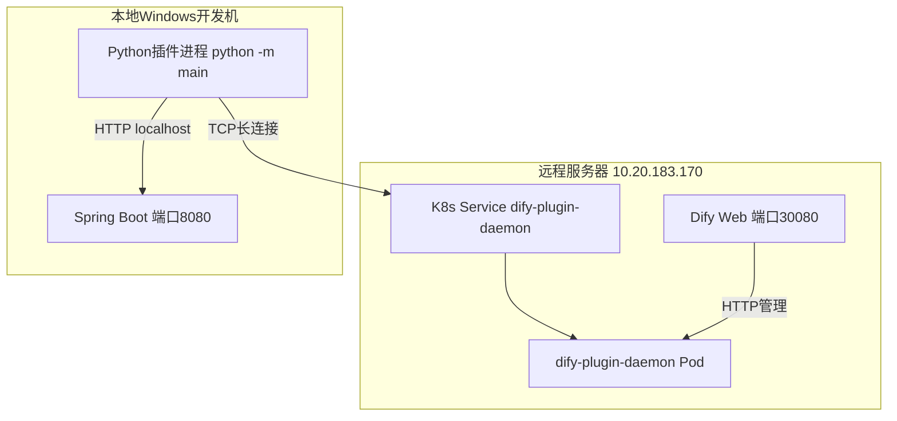
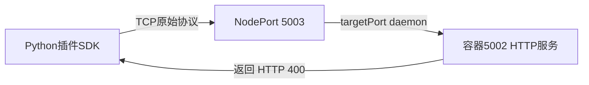
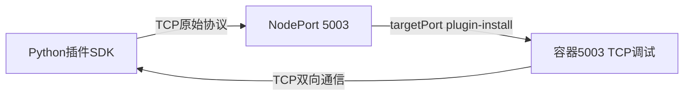
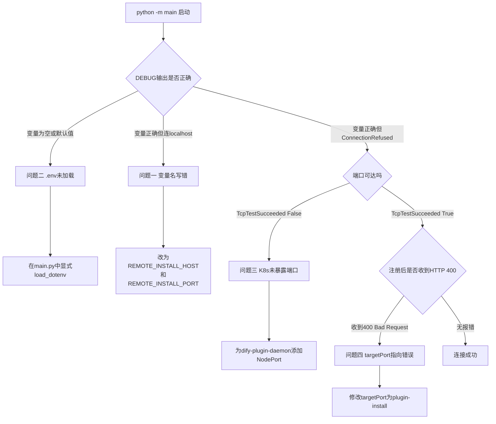

# 本地Windows连接远程K8s上的Dify插件Daemon - 踩坑全记录

> 本文记录了从本地Windows开发机连接远程K8s集群上Dify插件Daemon时，遇到的4个典型问题及其完整排查过程。每个问题都包含：现象、排查命令、命令输出、根因分析、修复方案。

---

## 目录

1. [环境背景](#1-环境背景)
2. [连接目标](#2-连接目标)
3. [获取调试地址和密钥](#3-获取调试地址和密钥)
4. [问题一 - 环境变量名写错导致连接localhost](#4-问题一---环境变量名写错导致连接localhost)
5. [问题二 - .env文件未被SDK自动加载](#5-问题二---env文件未被sdk自动加载)
6. [问题三 - K8s端口未对外暴露导致ConnectionRefused](#6-问题三---k8s端口未对外暴露导致connectionrefused)
7. [问题四 - NodePort指向错误容器端口导致HTTP 400](#7-问题四---nodeport指向错误容器端口导致http-400)
8. [最终连接成功](#8-最终连接成功)
9. [排查流程图](#9-排查流程图)
10. [踩坑清单总表](#10-踩坑清单总表)
11. [关键命令速查](#11-关键命令速查)
12. [DifyPluginEnv完整字段参考](#12-difypluginenv完整字段参考)

---

## 1. 环境背景

### 1.1 部署拓扑



### 1.2 各组件角色

| 组件 | 位置 | 作用 |
|------|------|------|
| Dify Web | 远程K8s | 用户操作的Web界面 |
| dify-plugin-daemon | 远程K8s | 管理插件生命周期，接收插件注册 |
| Python插件进程 | 本地Windows | 运行插件代码，连接Daemon注册工具 |
| Spring Boot | 本地Windows | 提供IoT设备REST API |

### 1.3 连接方式

Dify插件采用**出站连接**模式：本地Python插件**主动连接**远程Daemon，不需要远程服务器反向访问本地。这对开发调试非常友好，只要本地能访问远程的TCP端口即可。

### 1.4 .env配置文件

插件通过 `.env` 文件配置远程连接信息：

```ini
INSTALL_METHOD=remote
REMOTE_INSTALL_HOST=10.20.183.170
REMOTE_INSTALL_PORT=5003
REMOTE_INSTALL_KEY=3969172e-bcaf-4c75-939d-58350c00e0c7
```

### 1.5 启动命令

```powershell
cd E:\Ideaproject\test-dify\plugin-iot-device-plugin
python -m main
```

---

## 2. 连接目标

期望的成功标志：

```
{"event": "log", "data": {"level": "INFO", "message": "Installed tool: iot_device_plugin"}}
```

看到 `Installed tool` 表示插件已成功注册到远程Dify，且TCP长连接保持稳定。

---

## 3. 获取调试地址和密钥

### 3.1 操作步骤

1. 浏览器打开远程Dify界面 `http://10.20.183.170:30080`
2. 登录后，点击左侧菜单 **插件**
3. 在插件页面右上角找到 **调试图标**（虫子图标）
4. 点击后弹窗显示两个值：

```
URL:  localhost:5003
Key:  3969172e-bcaf-4c75-939d-58350c00e0c7
```

### 3.2 关键注意点

Dify界面显示的 `localhost:5003` 是指**远程服务器自身的localhost**，不是你本地电脑。在 `.env` 中必须替换为服务器的真实IP地址：

```
localhost:5003  →  10.20.183.170:5003
```

---

## 4. 问题一 - 环境变量名写错导致连接localhost

### 4.1 现象

首次配置 `.env` 后运行 `python -m main`：

```
Failed to connect to localhost:5003
Traceback (most recent call last):
  File "D:\python312\install\Lib\site-packages\dify_plugin\core\server\tcp\request_reader.py", line 130, in _connect
    self.sock = gevent_socket.create_connection((self.host, self.port))
  File "D:\python312\install\Lib\site-packages\gevent\_socketcommon.py", line 630, in _internal_connect
    raise _SocketError(err, strerror(err))
ConnectionRefusedError: [Errno 10061] [WinError 10061] 由于目标计算机积极拒绝，无法连接。
```

错误信息明确显示：插件在连 `localhost:5003`，而不是期望的 `10.20.183.170:5003`。

### 4.2 排查过程

**第一步：检查.env文件内容**

```ini
INSTALL_METHOD=remote
REMOTE_INSTALL_URL=10.20.183.170:5003
REMOTE_INSTALL_KEY=3969172e-bcaf-4c75-939d-58350c00e0c7
```

文件里写的是 `REMOTE_INSTALL_URL=10.20.183.170:5003`，值是正确的。为什么插件还是连localhost？

**第二步：怀疑.env没有被自动加载**

在 `main.py` 中添加显式加载和DEBUG输出：

```python
import os
from pathlib import Path
from dotenv import load_dotenv

# 显式加载 .env 文件
load_dotenv(Path(__file__).parent / ".env")

print(f"[DEBUG] REMOTE_INSTALL_URL={os.getenv('REMOTE_INSTALL_URL')}")
print(f"[DEBUG] INSTALL_METHOD={os.getenv('INSTALL_METHOD')}")

from dify_plugin import Plugin, DifyPluginEnv

plugin = Plugin(DifyPluginEnv())
plugin.run()
```

重新运行后：

```
[DEBUG] REMOTE_INSTALL_URL=10.20.183.170:5003
[DEBUG] INSTALL_METHOD=remote
Failed to connect to localhost:5003
ConnectionRefusedError: [Errno 10061] ...
```

环境变量**确实加载成功了**（`REMOTE_INSTALL_URL=10.20.183.170:5003`），但插件仍然连 `localhost:5003`。这说明 `DifyPluginEnv` **根本不使用** `REMOTE_INSTALL_URL` 这个变量名。

**第三步：查看SDK源码定位真实字段名**

```powershell
python -c "from dify_plugin import DifyPluginEnv; import inspect; print(inspect.getsource(DifyPluginEnv))"
```

输出 `DifyPluginEnv` 类的完整源码：

```python
class DifyPluginEnv(BaseSettings):
    MAX_REQUEST_TIMEOUT: int = Field(default=300, description="Maximum request timeout in seconds")
    MAX_WORKER: int = Field(default=1000, description="Maximum worker count...")
    HEARTBEAT_INTERVAL: float = Field(default=10, description="Heartbeat interval in seconds")
    INSTALL_METHOD: InstallMethod = Field(default=InstallMethod.Local, description="Installation method...")

    REMOTE_INSTALL_HOST: str = Field(default="localhost", description="Remote installation host")
    REMOTE_INSTALL_PORT: int = Field(default=5003, description="Remote installation port")
    REMOTE_INSTALL_KEY: Optional[str] = Field(default=None, description="Remote installation key")

    SERVERLESS_HOST: str = Field(default="0.0.0.0", description="Serverless host")
    SERVERLESS_PORT: int = Field(default=8080, description="Serverless port")
    # ... 省略其他字段

    model_config = SettingsConfigDict(
        env_file=".env",
        env_file_encoding="utf-8",
        frozen=True,
        extra="ignore",
    )
```

### 4.3 根因

SDK使用的是 **`REMOTE_INSTALL_HOST`** 和 **`REMOTE_INSTALL_PORT`** 两个独立变量，而不是 `REMOTE_INSTALL_URL`。

| 我们写的 | SDK实际字段 | 结果 |
|---------|------------|------|
| REMOTE_INSTALL_URL=10.20.183.170:5003 | 不存在该字段 | 被 `extra="ignore"` 忽略 |
| - | REMOTE_INSTALL_HOST (默认localhost) | 使用了默认值 localhost |
| - | REMOTE_INSTALL_PORT (默认5003) | 使用了默认值 5003 |

所以插件连接了 `localhost:5003`。

### 4.4 修复

修改 `.env`，将 `REMOTE_INSTALL_URL` 拆分为两个独立变量：

```ini
INSTALL_METHOD=remote
REMOTE_INSTALL_HOST=10.20.183.170
REMOTE_INSTALL_PORT=5003
REMOTE_INSTALL_KEY=3969172e-bcaf-4c75-939d-58350c00e0c7
```

同时更新 `main.py` 的DEBUG输出：

```python
print(f"[DEBUG] REMOTE_INSTALL_HOST={os.getenv('REMOTE_INSTALL_HOST')}")
print(f"[DEBUG] REMOTE_INSTALL_PORT={os.getenv('REMOTE_INSTALL_PORT')}")
print(f"[DEBUG] INSTALL_METHOD={os.getenv('INSTALL_METHOD')}")
```

---

## 5. 问题二 - .env文件未被SDK自动加载

### 5.1 现象

虽然 `DifyPluginEnv` 的 `model_config` 中配置了 `env_file=".env"`，但在实际运行中发现这个自动加载机制并不总是可靠。特别是在不同工作目录或通过不同方式启动脚本时，`.env` 文件可能找不到。

### 5.2 排查过程

当 `.env` 没有被加载时，所有字段都使用默认值：

```
INSTALL_METHOD=Local（默认值）
REMOTE_INSTALL_HOST=localhost（默认值）
REMOTE_INSTALL_PORT=5003（默认值）
```

插件会以 local 模式运行，尝试连接本地Daemon，必然失败。

### 5.3 修复方案

在 `main.py` 的最前面，**在import dify_plugin之前**，显式加载 `.env`：

```python
import os
from pathlib import Path
from dotenv import load_dotenv

# 必须在 import dify_plugin 之前执行
load_dotenv(Path(__file__).parent / ".env")

# DEBUG验证
print(f"[DEBUG] REMOTE_INSTALL_HOST={os.getenv('REMOTE_INSTALL_HOST')}")
print(f"[DEBUG] REMOTE_INSTALL_PORT={os.getenv('REMOTE_INSTALL_PORT')}")
print(f"[DEBUG] INSTALL_METHOD={os.getenv('INSTALL_METHOD')}")

from dify_plugin import Plugin, DifyPluginEnv

plugin = Plugin(DifyPluginEnv())
plugin.run()
```

需要在 `requirements.txt` 中添加依赖：

```
python-dotenv>=1.0.0
```

### 5.4 验证方法

运行后先看DEBUG输出，确认三个值都正确再往下走：

```
[DEBUG] REMOTE_INSTALL_HOST=10.20.183.170
[DEBUG] REMOTE_INSTALL_PORT=5003
[DEBUG] INSTALL_METHOD=remote
```

如果任一值为空或是默认值，说明 `.env` 加载有问题。

---

## 6. 问题三 - K8s端口未对外暴露导致ConnectionRefused

### 6.1 现象

修正环境变量后运行 `python -m main`：

```
ConnectionRefusedError: [Errno 10061] [WinError 10061] 由于目标计算机积极拒绝，无法连接。
```

DEBUG输出显示变量正确，但仍然连不上。

### 6.2 排查过程

**第一步：测试端口可达性**

```powershell
Test-NetConnection -ComputerName 10.20.183.170 -Port 5003
```

输出：

```
ComputerName     : 10.20.183.170
RemoteAddress    : 10.20.183.170
RemotePort       : 5003
InterfaceAlias   : WLAN 2
SourceAddress    : 10.11.34.37
TcpTestSucceeded : False
```

`TcpTestSucceeded: False` 确认端口不通。

**第二步：登录远程服务器查看K8s服务**

```bash
kubectl get svc -n dify
```

在输出的服务列表中查看 `dify-plugin-daemon`：

```
NAME                 TYPE        CLUSTER-IP       EXTERNAL-IP   PORT(S)
dify-plugin-daemon   ClusterIP   10.246.254.152   <none>        5002/TCP
```

**关键发现**：`dify-plugin-daemon` 的TYPE是 `ClusterIP`，`EXTERNAL-IP` 是 `<none>`，说明这个服务**只能在K8s集群内部访问**，外部完全无法连接。

### 6.3 根因

K8s Service 类型为 `ClusterIP` 时，只有集群内的Pod可以访问。本地开发机在集群外部，无法连接。

### 6.4 修复

需要将Service类型改为 `NodePort`，并配置端口映射。

在远程K8s管理平台中，为 `dify-plugin-daemon` 服务添加外部访问（或直接patch）：

```bash
# 先查看Pod的容器端口定义
kubectl get pod dify-plugin-daemon-547bcc476-nxk62 -n dify \
  -o jsonpath='{.spec.containers[*].ports}' | python3 -m json.tool
```

输出：

```json
[
    {
        "containerPort": 5002,
        "name": "daemon",
        "protocol": "TCP"
    },
    {
        "containerPort": 5003,
        "name": "plugin-install",
        "protocol": "TCP"
    }
]
```

容器有两个端口，需要将它们都通过NodePort暴露出来：

```bash
kubectl patch svc dify-plugin-daemon -n dify --type='json' \
  -p='[{"op":"replace","path":"/spec/ports","value":[
    {"name":"http-daemon","port":5002,"targetPort":"daemon","nodePort":5002,"protocol":"TCP"},
    {"name":"plugin-debug","port":5003,"targetPort":"plugin-install","nodePort":5003,"protocol":"TCP"}
  ]}]'
```

> **注意**：K8s默认NodePort范围是30000-32767，使用5002/5003需要集群配置 `--service-node-port-range` 包含这些端口。如果patch报错，可以使用30082/30083等端口。

验证修改结果：

```bash
kubectl get svc dify-plugin-daemon -n dify
```

```
NAME                 TYPE       CLUSTER-IP       EXTERNAL-IP   PORT(S)                       AGE
dify-plugin-daemon   NodePort   10.246.254.152   <none>        5002:5002/TCP,5003:5003/TCP   23d
```

TYPE变为 `NodePort`，两个端口都已映射。

**第三步：再次测试端口可达性**

```powershell
Test-NetConnection -ComputerName 10.20.183.170 -Port 5003
```

```
TcpTestSucceeded : True
```

端口通了。

---

## 7. 问题四 - NodePort指向错误容器端口导致HTTP 400

### 7.1 现象

端口可达后运行插件：

```
[DEBUG] REMOTE_INSTALL_HOST=10.20.183.170
[DEBUG] REMOTE_INSTALL_PORT=5003
[DEBUG] INSTALL_METHOD=remote
{"event": "log", "data": {"level": "INFO", "message": "Installed tool: iot_device_plugin", "timestamp": 1780465117.8691022}}
An error occurred while parsing the data: b'400 Bad RequestHTTP/1.1 400 Bad Request\r'
Traceback (most recent call last):
  File "D:\python312\install\Lib\site-packages\dify_plugin\core\server\tcp\request_reader.py", line 191, in _read_stream
    data = loads(line)
json.decoder.JSONDecodeError: Extra data: line 1 column 5 (char 4)
An error occurred while parsing the data: b'Content-Type: text/plain; charset=utf-8\r'
json.decoder.JSONDecodeError: Expecting value: line 1 column 1 (char 0)
An error occurred while parsing the data: b'Connection: close\r'
json.decoder.JSONDecodeError: Expecting value: line 1 column 1 (char 0)
Failed to read data from 10.20.183.170:5003
ConnectionAbortedError: [WinError 10053] 你的主机中的软件中止了一个已建立的连接。
```

这段输出有三个关键信息：

1. **注册成功了**：`"Installed tool: iot_device_plugin"`
2. **收到了HTTP响应**：`HTTP/1.1 400 Bad Request`
3. **连接被中断**：`ConnectionAbortedError`

插件注册成功后，daemon回送的数据不是JSON而是HTTP响应头。

### 7.2 排查过程

**第一步：检查Ingress是否拦截**

怀疑有HTTP反向代理（Nginx/Ingress）拦截了TCP流量：

```bash
kubectl get ingress -n dify
```

输出：

```
No resources found in dify namespace.
```

不是Ingress的问题。

**第二步：查看daemon的Pod日志**

```bash
kubectl logs -l component=plugin-daemon -n dify --tail=50
```

输出（截取关键部分）：

```
2026-06-03T05:35:41.48263194Z INFO dify-plugin-daemon middleware.go:83 trace_id=5a13eb... HTTP request method=POST path=/plugin/.../debugging/key status=200 latency_ms=0
2026-06-03T05:35:46.203656002Z INFO dify-plugin-daemon middleware.go:83 trace_id=85c2... HTTP request method=GET path=/plugin/.../management/models status=200
2026-06-03T05:36:46.72295427Z INFO dify-plugin-daemon middleware.go:83 trace_id=ba7c... HTTP request method=GET path=/plugin/.../management/agent_strategies status=200
```

**关键发现**：daemon日志全是 **HTTP请求**（GET/POST），全部来自Dify Web界面的管理调用，**完全没有看到TCP连接的记录**。

这说明我们的插件TCP连接根本没有到达daemon进程，而是被其他HTTP服务接收了。

**第三步：查看daemon容器端口定义**

```bash
kubectl get pod dify-plugin-daemon-547bcc476-nxk62 -n dify \
  -o jsonpath='{.spec.containers[*].ports}' | python3 -m json.tool
```

输出：

```json
[
    {
        "containerPort": 5002,
        "name": "daemon",
        "protocol": "TCP"
    },
    {
        "containerPort": 5003,
        "name": "plugin-install",
        "protocol": "TCP"
    }
]
```

daemon容器有**两个TCP端口**：

| 容器端口 | 名称 | 协议 | 用途 |
|---------|------|------|------|
| 5002 | daemon | HTTP | Dify Web管理API |
| 5003 | plugin-install | TCP原始协议 | Python插件注册调试 |

**第四步：查看环境变量确认端口角色**

```bash
kubectl exec -n dify dify-plugin-daemon-547bcc476-nxk62 -- env | grep -i port
```

关键输出：

```
SERVER_PORT=5002
PLUGIN_REMOTE_INSTALLING_PORT=5003
DIFY_PLUGIN_DAEMON_SERVICE_PORT_HTTP_DAEMON=5002
DIFY_PLUGIN_DAEMON_SERVICE_PORT=5002
```

确认：
- `SERVER_PORT=5002` → HTTP管理服务端口
- `PLUGIN_REMOTE_INSTALLING_PORT=5003` → TCP插件调试端口

**第五步：查看K8s Service配置 - 找到根因**

```bash
kubectl get svc dify-plugin-daemon -n dify -o yaml
```

输出（关键部分）：

```yaml
spec:
  ports:
    - name: http-daemon
      nodePort: 5003
      port: 5002
      protocol: TCP
      targetPort: daemon
  type: NodePort
```

**根因定位**：

Service的 `targetPort: daemon` 指向了容器的 **5002端口（HTTP管理服务）**，而不是 **5003端口（TCP插件调试）**。

整个链路是这样的：



本地插件用TCP原始协议发送数据，但到达的是HTTP服务，HTTP服务无法解析原始TCP数据，返回了 `400 Bad Request`。

正确的指向应该是：



### 7.3 修复

将Service的端口映射修正，确保TCP调试流量到达容器的 `plugin-install` 端口：

```bash
kubectl patch svc dify-plugin-daemon -n dify --type='json' \
  -p='[{"op":"replace","path":"/spec/ports","value":[
    {"name":"http-daemon","port":5002,"targetPort":"daemon","nodePort":5002,"protocol":"TCP"},
    {"name":"plugin-debug","port":5003,"targetPort":"plugin-install","nodePort":5003,"protocol":"TCP"}
  ]}]'
```

修复后的映射关系：

| Service端口 | NodePort | targetPort | 容器端口 | 用途 |
|------------|----------|------------|---------|------|
| 5002 | 5002 | daemon | 5002 | HTTP管理 API |
| 5003 | 5003 | **plugin-install** | **5003** | **TCP插件调试** |

验证：

```bash
kubectl get svc dify-plugin-daemon -n dify
```

```
NAME                 TYPE       CLUSTER-IP       EXTERNAL-IP   PORT(S)                       AGE
dify-plugin-daemon   NodePort   10.246.254.152   <none>        5002:5002/TCP,5003:5003/TCP   23d
```

两个端口都正确映射了。

---

## 8. 最终连接成功

修复所有问题后，运行：

```powershell
python -m main
```

输出：

```
[DEBUG] REMOTE_INSTALL_HOST=10.20.183.170
[DEBUG] REMOTE_INSTALL_PORT=5003
[DEBUG] INSTALL_METHOD=remote
{"event": "log", "data": {"level": "INFO", "message": "Installed tool: iot_device_plugin", "timestamp": 1780465601.22771}}
```

插件稳定运行，没有任何报错。`Installed tool: iot_device_plugin` 表示：

1. TCP连接成功建立
2. Key认证通过
3. 插件的4个工具（list_devices、get_device_status、control_device、query_device_data）全部注册成功
4. TCP长连接保持稳定，等待Dify调度

此时登录远程Dify界面 `http://10.20.183.170:30080`，在 **插件** 页面可以看到：

```
IoT设备连接器 0.0.1
连接IoT设备管理服务，支持设备列表、状态查询、设备控制和数据分析
```

---

## 9. 排查流程图



---

## 10. 踩坑清单总表

| 序号 | 问题 | 错误现象 | 排查命令 | 根因 | 解决方案 |
|------|------|---------|---------|------|---------|
| 1 | 环境变量名写错 | 插件连 localhost:5003 | `python -c "from dify_plugin import DifyPluginEnv..."` 查看源码 | SDK用 `REMOTE_INSTALL_HOST` + `REMOTE_INSTALL_PORT` 两个独立变量 | 修改.env拆分为两个变量 |
| 2 | .env未自动加载 | 环境变量全为默认值 | 在main.py添加DEBUG打印 | DifyPluginEnv的env_file机制不稳定 | main.py显式 `load_dotenv()` |
| 3 | K8s端口未暴露 | ConnectionRefused | `Test-NetConnection` + `kubectl get svc` | Service类型为ClusterIP无外部访问 | patch为NodePort并配置端口映射 |
| 4 | targetPort指向HTTP端口 | 注册成功但收到HTTP 400 | `kubectl get pod -o jsonpath` 查看容器端口 + `kubectl exec env` 查看环境变量 | Service的targetPort指向daemon(5002/HTTP)而非plugin-install(5003/TCP) | 修改targetPort为plugin-install |

---

## 11. 关键命令速查

### 本地Windows端

```powershell
# 测试远程端口可达性
Test-NetConnection -ComputerName 10.20.183.170 -Port 5003

# 查看DifyPluginEnv源码（定位真实环境变量名）
python -c "from dify_plugin import DifyPluginEnv; import inspect; print(inspect.getsource(DifyPluginEnv))"

# 启动插件
cd E:\Ideaproject\test-dify\plugin-iot-device-plugin
python -m main
```

### 远程K8s服务器端

```bash
# 查看Service配置
kubectl get svc dify-plugin-daemon -n dify -o yaml

# 查看Pod容器端口定义
kubectl get pod <pod-name> -n dify -o jsonpath='{.spec.containers[*].ports}' | python3 -m json.tool

# 查看容器环境变量
kubectl exec -n dify <pod-name> -- env | grep -i port

# 查看容器内TCP监听端口（容器无ss命令时用/proc/net/tcp替代）
kubectl exec -n dify <pod-name> -- cat /proc/net/tcp

# 查看daemon Pod日志
kubectl logs -l component=plugin-daemon -n dify --tail=50

# 检查Ingress
kubectl get ingress -n dify

# 修改Service端口映射
kubectl patch svc dify-plugin-daemon -n dify --type='json' \
  -p='[{"op":"replace","path":"/spec/ports","value":[
    {"name":"http-daemon","port":5002,"targetPort":"daemon","nodePort":5002,"protocol":"TCP"},
    {"name":"plugin-debug","port":5003,"targetPort":"plugin-install","nodePort":5003,"protocol":"TCP"}
  ]}]'
```

---

## 12. DifyPluginEnv完整字段参考

通过查看SDK源码（`python -c "from dify_plugin import DifyPluginEnv; import inspect; print(inspect.getsource(DifyPluginEnv))"`）获取的完整配置项：

| 字段 | 类型 | 默认值 | 说明 |
|------|------|--------|------|
| INSTALL_METHOD | InstallMethod | Local | 安装方式，local或remote |
| REMOTE_INSTALL_HOST | str | localhost | 远程Daemon主机地址 |
| REMOTE_INSTALL_PORT | int | 5003 | 远程Daemon TCP调试端口 |
| REMOTE_INSTALL_KEY | str | None | 调试API Key（从Dify界面获取） |
| MAX_REQUEST_TIMEOUT | int | 300 | 最大请求超时（秒） |
| MAX_WORKER | int | 1000 | 最大worker数（gevent异步IO） |
| HEARTBEAT_INTERVAL | float | 10 | 心跳间隔（秒） |
| SERVERLESS_HOST | str | 0.0.0.0 | Serverless模式监听地址 |
| SERVERLESS_PORT | int | 8080 | Serverless模式监听端口 |
| DIFY_PLUGIN_DAEMON_URL | str | http://localhost:5002 | Daemon HTTP管理API地址 |

### .env文件示例

```ini
INSTALL_METHOD=remote
REMOTE_INSTALL_HOST=10.20.183.170
REMOTE_INSTALL_PORT=5003
REMOTE_INSTALL_KEY=3969172e-bcaf-4c75-939d-58350c00e0c7
```

### 核心经验

1. **环境变量名以SDK源码为准**，不要凭文档猜测，用 `inspect.getsource()` 查看
2. **显式加载.env**，不要依赖SDK的自动加载机制
3. **K8s Service的targetPort必须指向正确的容器端口**，daemon的HTTP端口和TCP调试端口是不同的
4. **先用 `Test-NetConnection` 验证端口可达**，再启动插件，分层排查
