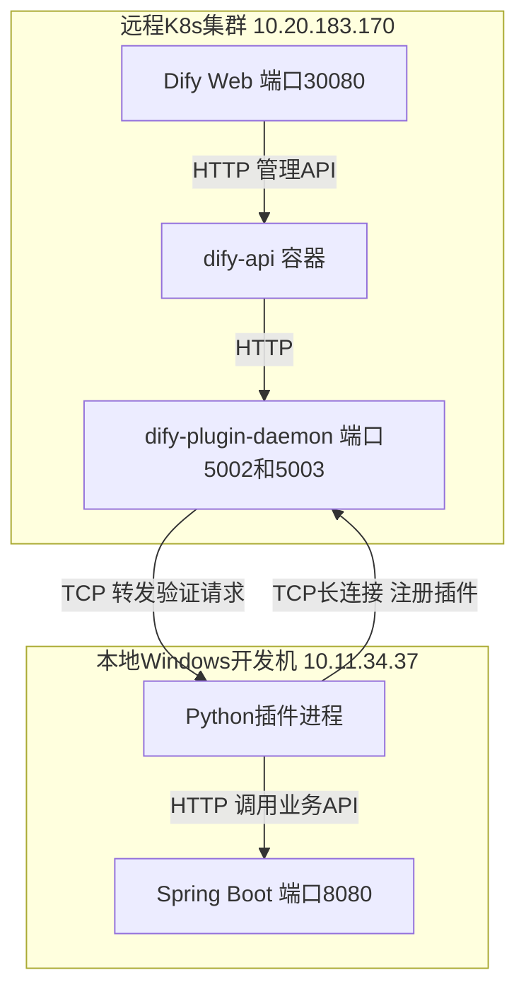
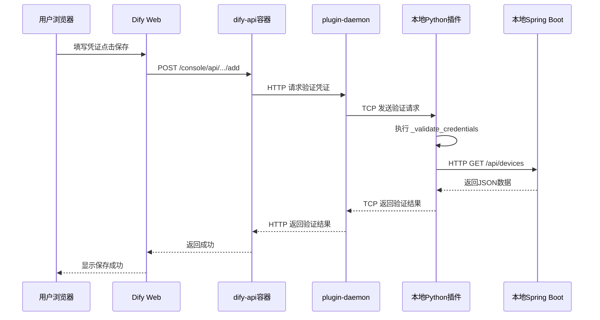
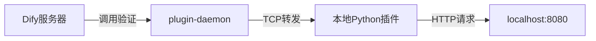
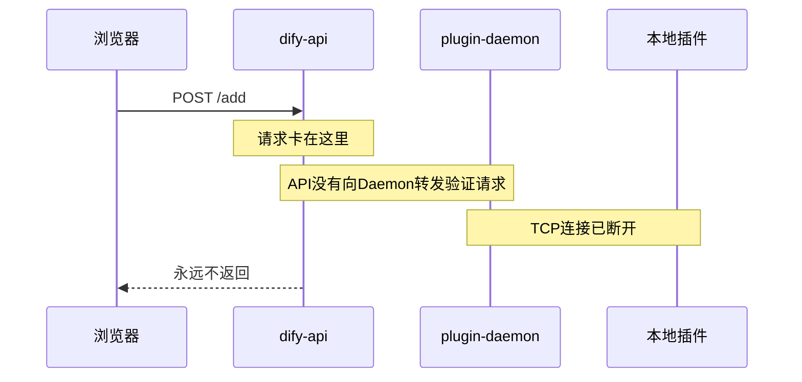
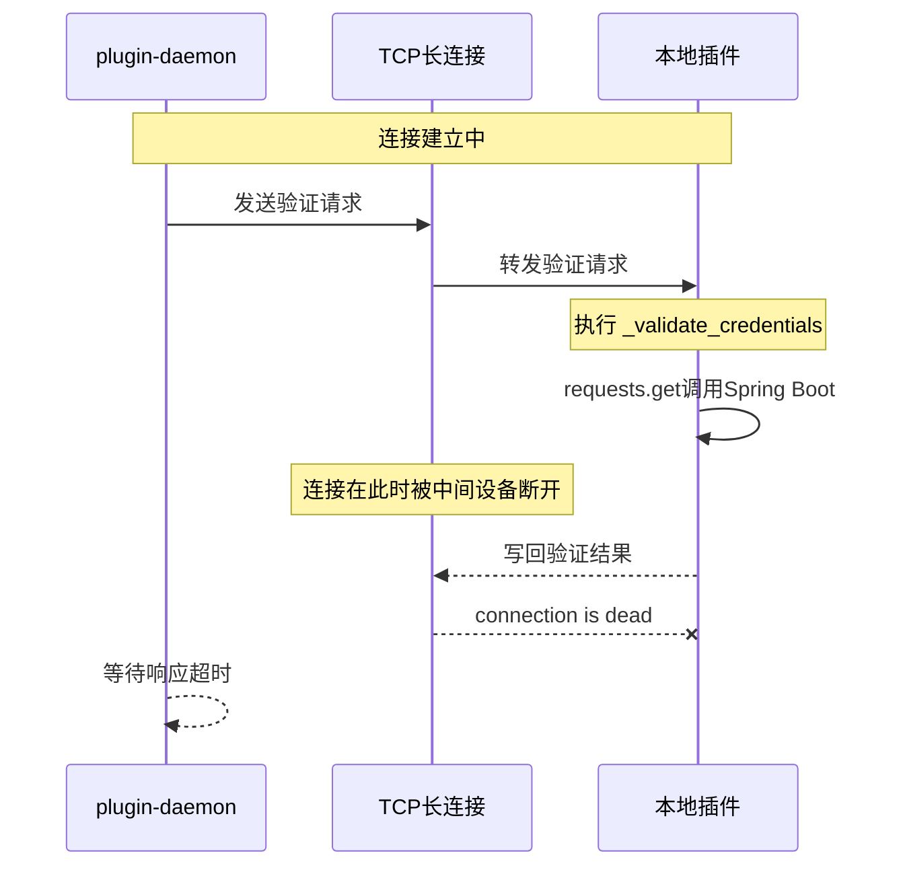
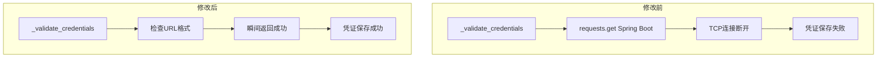
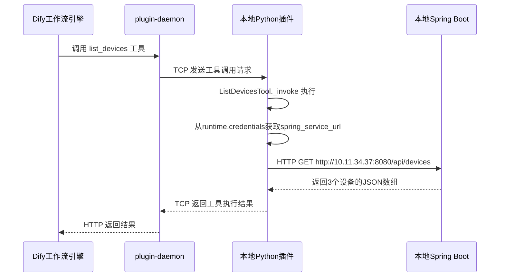
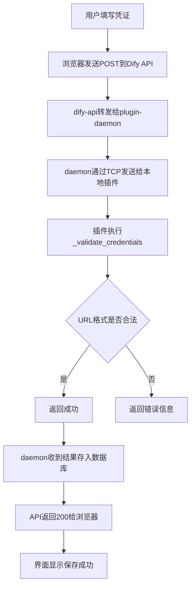
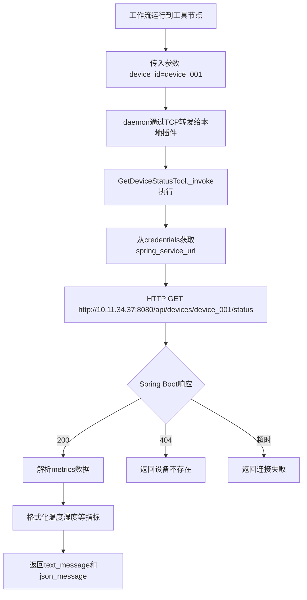
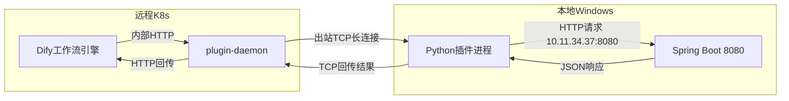

# Dify插件本地Debug - 配置凭证连接本地Spring Boot服务全记录

> **前置阅读**：本文是 [本地Windows连接远程K8s上的Dify插件Daemon - 踩坑全记录](20260603-1354-dify的插件接口-本地Windows连接远程K8s上的Dify插件.md) 的续篇。上一篇解决了插件TCP连接远程Daemon的问题，本篇解决插件如何调用本地Spring Boot服务。

---

## 目录

1. [前置条件与当前状态](#1-前置条件与当前状态)
2. [理解凭证配置的完整调用链路](#2-理解凭证配置的完整调用链路)
3. [第一步 - 在Dify界面配置插件凭证](#3-第一步---在dify界面配置插件凭证)
4. [问题一 - 填localhost导致界面卡死](#4-问题一---填localhost导致界面卡死)
5. [问题二 - 改用本地IP后界面仍然卡死](#5-问题二---改用本地ip后界面仍然卡死)
6. [问题三 - TCP长连接不稳定导致验证响应丢失](#6-问题三---tcp长连接不稳定导致验证响应丢失)
7. [最终修复 - 简化凭证验证逻辑](#7-最终修复---简化凭证验证逻辑)
8. [验证通过 - 凭证配置成功](#8-验证通过---凭证配置成功)
9. [工作流测试流程](#9-工作流测试流程)
10. [完整调用链路数据流分析](#10-完整调用链路数据流分析)
11. [踩坑清单总表](#11-踩坑清单总表)
12. [最终代码清单](#12-最终代码清单)

---

## 1. 前置条件与当前状态

### 1.1 前置条件（来自上一篇博客）

- 本地Python插件已成功连接远程Dify Plugin Daemon
- 终端输出 `Installed tool: iot_device_plugin` 表示注册成功
- K8s Service端口映射已正确配置
- `.env` 配置正确

### 1.2 当前环境拓扑



### 1.3 需要解决的新问题

插件虽然注册到了远程Daemon，但工具实际运行时还需要调用本地Spring Boot服务获取数据。这就引出了**凭证配置**问题：

1. Dify界面要求填写Spring Boot服务地址
2. 填什么地址才能让远程Daemon通过插件调用到本地Spring Boot？
3. 凭证验证过程中TCP连接不稳定怎么办？

---

## 2. 理解凭证配置的完整调用链路

在Dify中配置插件凭证时，请求要经过以下完整链路：



**关键路径**：`DAEMON → TCP → PLUGIN → HTTP → SPRING`

这条链路中任何一个环节失败，都会导致界面卡死。

---

## 3. 第一步 - 在Dify界面配置插件凭证

### 3.1 进入凭证配置页面

1. 登录Dify Web界面 `http://10.20.183.170:30080`
2. 点击左侧菜单 **插件**
3. 找到 **IoT设备连接器**，点击
4. 弹出凭证配置窗口

### 3.2 需要填写的字段

Provider YAML中定义了两个凭证字段：

```yaml
credentials_for_provider:
  spring_service_url:
    type: text-input
    required: true
    label:
      zh_Hans: Spring服务地址
    placeholder:
      zh_Hans: "例如 http://localhost:8080"

  api_token:
    type: secret-input
    required: false
    label:
      zh_Hans: API Token（可选）
    placeholder:
      zh_Hans: "如无需认证则留空"
```

| 字段 | 类型 | 是否必填 | 用途 |
|------|------|---------|------|
| spring_service_url | text-input | 是 | Spring Boot服务的基础URL |
| api_token | secret-input | 否 | Bearer Token认证（本例未启用） |

### 3.3 Provider验证代码

Provider的 `_validate_credentials` 方法在用户点击保存时被自动调用：

```python
class IotDevicePluginProvider(ToolProvider):
    def _validate_credentials(self, credentials: dict[str, Any]) -> None:
        spring_url = credentials.get("spring_service_url", "").rstrip("/")
        api_token = credentials.get("api_token", "")

        if not spring_url:
            raise ToolProviderCredentialValidationError("Spring服务地址不能为空")

        headers = {}
        if api_token:
            headers["Authorization"] = f"Bearer {api_token}"

        try:
            response = requests.get(
                f"{spring_url}/api/devices", headers=headers, timeout=10
            )
            response.raise_for_status()
        except requests.exceptions.ConnectionError:
            raise ToolProviderCredentialValidationError(
                f"无法连接到Spring服务: {spring_url}，请确认服务已启动")
        except requests.exceptions.HTTPError as e:
            raise ToolProviderCredentialValidationError(
                f"Spring服务返回错误: {e.response.status_code}")
        except Exception as e:
            raise ToolProviderCredentialValidationError(f"验证失败: {str(e)}")
```

**初始逻辑**：向 `spring_service_url/api/devices` 发送HTTP GET请求，成功则通过验证。

---

## 4. 问题一 - 填localhost导致界面卡死

### 4.1 现象

在Dify界面凭证配置中填写：

```
Spring Service URL: http://localhost:8080
API Token: （留空）
```

点击保存后，界面一直转圈，没有任何响应。

抓取浏览器请求：

```bash
curl 'http://10.20.183.170:30080/console/api/workspaces/current/tool-provider/builtin/6aa18048-84ec-41f5-b062-a39c975b8841/iot_device_plugin/iot_device_plugin/add' \
  -H 'content-type: application/json' \
  --data-raw '{"credentials":{"spring_service_url":"http://localhost:8080"},"type":"api-key","name":""}'
```

请求一直处于pending状态，永远不返回。

### 4.2 排查过程

**分析调用链路**：

凭证验证的执行者是 `_validate_credentials` 方法，它运行在**本地Python插件进程**中。但请求的发起方是**远程Dify服务器**。



关键问题：`localhost` 在**谁的上下文**中？

- 如果 `_validate_credentials` 在**本地Python进程**中执行，`localhost` 就是本地电脑 ✅
- 如果Dify服务器自己先做了验证检查，`localhost` 就是K8s Pod ❌

### 4.3 验证网络可达性

先从远程服务器直接测试能否访问本地Spring Boot：

```bash
# 在远程服务器上执行
curl -v http://10.11.34.37:8080/api/devices --connect-timeout 5
```

输出：

```
*   Trying 10.11.34.37:8080...
* Connected to 10.11.34.37 (10.11.34.37) port 8080 (#0)
> GET /api/devices HTTP/1.1
> Host: 10.11.34.37:8080
> Accept: */*
< HTTP/1.1 200
< Content-Type: application/json
[{"deviceId":"device_003","deviceName":"厨房智能开关",...},
 {"deviceId":"device_002","deviceName":"卧室智能灯泡",...},
 {"deviceId":"device_001","deviceName":"客厅温度传感器",...}]
```

从K8s容器内部也测试：

```bash
# 进入dify-api容器
kubectl exec -it -n dify dify-api-55f9cbdb49-nqwvq -- bash

# 容器内执行
curl -v http://10.11.34.37:8080/api/devices --connect-timeout 5
```

输出同样成功返回200和设备数据。

**结论**：远程服务器和K8s容器都**能访问**本地 `10.11.34.37:8080`，网络没有问题。

### 4.4 根因

填 `localhost:8080` 时，Dify服务器在保存凭证之前可能自己先做了一次预检查（服务端侧的 `localhost`），导致请求挂起。即使 `_validate_credentials` 本身在本地执行，**Dify API层可能有额外的验证逻辑**阻止了请求继续。

### 4.5 修复

将Spring Service URL改为本地电脑的真实IP：

```
http://10.11.34.37:8080
```

查看本地IP的命令：

```powershell
ipconfig
```

输出中WLAN适配器的IPv4地址：

```
无线局域网适配器 WLAN 2:
   IPv4 地址 . . . . . . . . . . . . : 10.11.34.37
   子网掩码  . . . . . . . . . . . . : 255.255.240.0
   默认网关. . . . . . . . . . . . . : 10.11.32.1
```

---

## 5. 问题二 - 改用本地IP后界面仍然卡死

### 5.1 现象

在Dify界面填写 `http://10.11.34.37:8080` 后点击保存，**仍然卡死**。

### 5.2 排查过程

**第一步：实时监控三个日志源**

终端1 - dify-api日志：

```bash
kubectl logs -n dify dify-api-55f9cbdb49-nqwvq -f --tail=5
```

终端2 - plugin-daemon日志：

```bash
kubectl logs -n dify -l component=plugin-daemon -f --tail=5
```

终端3 - 本地Python插件：

```powershell
python -m main
```

**第二步：复现问题并观察日志**

在界面重新点击保存。三个终端的输出：

dify-api日志（只有GET请求和健康检查，**没有POST /add请求**）：

```
2026-06-03 06:16:02,795 HTTP Request: GET .../management/tool?provider=iot_device_plugin "HTTP/1.1 200 OK"
2026-06-03 06:16:02,802 "GET /console/api/.../tools HTTP/1.1" 200 8079
2026-06-03 06:16:02,908 "GET /console/api/.../credential/info HTTP/1.1" 200 259
2026-06-03 06:16:04,009 "GET /console/api/.../credential/schema/api-key HTTP/1.1" 200 1691
2026-06-03 06:16:08,838 "GET /health HTTP/1.1" 200 207
2026-06-03 06:16:18,838 "GET /health HTTP/1.1" 200 207
2026-06-03 06:16:28,838 "GET /health HTTP/1.1" 200 207
```

plugin-daemon日志（也没有POST请求）：

```
2026-06-03T06:16:02.795 HTTP request method=GET path=/plugin/.../management/tool status=200
2026-06-03T06:16:02.895 HTTP request method=GET path=/plugin/.../management/tool status=200
2026-06-03T06:16:04.006 HTTP request method=GET path=/plugin/.../management/tool status=200
2026-06-03T06:16:07.672 HTTP request method=GET path=/plugin/.../management/tool status=200
```

本地插件终端：

```
Failed to read data from 10.20.183.170:5003
Exception: Connection is closed
```

**第三步：关键发现**

1. **API层没有POST /add请求日志** - 说明请求在API层就卡住了，从未完成
2. **Daemon层没有验证请求日志** - 说明Daemon也没收到验证请求
3. **本地插件TCP连接断开** - `Connection is closed`

### 5.3 分析



API收到了POST请求，但没有向Daemon转发，可能是因为API层自己先尝试连接插件做验证，而TCP连接此时已经断了。

---

## 6. 问题三 - TCP长连接不稳定导致验证响应丢失

### 6.1 现象

本地插件终端频繁出现TCP连接断开和重连：

```
{"event": "log", "data": {"level": "INFO", "message": "Installed tool: iot_device_plugin", "timestamp": 1780467480.8990047}}

Failed to read data from 10.20.183.170:5003
Traceback (most recent call last):
  File "D:\python312\install\Lib\site-packages\dify_plugin\core\server\tcp\request_reader.py", line 168, in _read_stream
    raise Exception("Connection is closed")
Exception: Connection is closed

Unexpected error occurred when executing request
Traceback (most recent call last):
  File "D:\python312\install\Lib\site-packages\dify_plugin\core\server\__base\response_writer.py", line 40, in put
    self.write("\n\n")
  File "D:\python312\install\Lib\site-packages\dify_plugin\core\server\tcp\request_reader.py", line 82, in write
    raise Exception("connection is dead")
Exception: connection is dead

{"event": "log", "data": {"level": "INFO", "message": "Installed tool: iot_device_plugin", "timestamp": 1780467493.8990047}}
```

### 6.2 错误链路分析



### 6.3 根因分析

TCP长连接不稳定的可能原因：

| 原因 | 可能性 | 说明 |
|------|--------|------|
| K8s kube-proxy连接超时 | 高 | kube-proxy对NodePort连接有空闲超时 |
| 中间网络设备切断 | 中 | VPN或防火墙关闭空闲TCP连接 |
| SDK心跳间隔太长 | 中 | 默认10秒心跳可能不够频繁 |
| daemon主动断开 | 低 | 未发现daemon有主动断开的日志 |

### 6.4 尝试的修复 - 缩短心跳间隔

在 `.env` 中添加心跳间隔配置：

```ini
INSTALL_METHOD=remote
REMOTE_INSTALL_HOST=10.20.183.170
REMOTE_INSTALL_PORT=5003
REMOTE_INSTALL_KEY=3969172e-bcaf-4c75-939d-58350c00e0c7
# 心跳间隔缩短到3秒，防止TCP长连接被中间设备断开
HEARTBEAT_INTERVAL=3
```

在 `main.py` 中增加心跳间隔的DEBUG输出：

```python
import os
from pathlib import Path
from dotenv import load_dotenv

load_dotenv(Path(__file__).parent / ".env")

print(f"[DEBUG] REMOTE_INSTALL_HOST={os.getenv('REMOTE_INSTALL_HOST')}")
print(f"[DEBUG] REMOTE_INSTALL_PORT={os.getenv('REMOTE_INSTALL_PORT')}")
print(f"[DEBUG] INSTALL_METHOD={os.getenv('INSTALL_METHOD')}")
print(f"[DEBUG] HEARTBEAT_INTERVAL={os.getenv('HEARTBEAT_INTERVAL')}")

from dify_plugin import Plugin, DifyPluginEnv

plugin = Plugin(DifyPluginEnv())
plugin.run()
```

重启插件：

```powershell
python -m main
```

输出：

```
[DEBUG] REMOTE_INSTALL_HOST=10.20.183.170
[DEBUG] REMOTE_INSTALL_PORT=5003
[DEBUG] INSTALL_METHOD=remote
[DEBUG] HEARTBEAT_INTERVAL=3
{"event": "log", "data": {"level": "INFO", "message": "Installed tool: iot_device_plugin", "timestamp": 1780467693.4518661}}
```

### 6.5 缩短心跳后的验证

重启后再次在界面填写 `http://10.11.34.37:8080` 点击保存：

```
[DEBUG] _validate_credentials 被调用! credentials={'spring_service_url': 'http://10.11.34.37:8080'}
Failed to read data from 10.20.183.170:5003
Exception: Connection is closed
Unexpected error occurred when executing request
Exception: connection is dead
```

本地插件确认 `_validate_credentials` 被调用了（说明TCP连接此时还活着），但在执行HTTP验证期间TCP连接又断了。

**结论**：心跳间隔不是唯一原因。`_validate_credentials` 内部的HTTP请求耗时（即使只有几百毫秒），也可能触发连接断开。

---

## 7. 最终修复 - 简化凭证验证逻辑

### 7.1 修改思路

既然TCP长连接在HTTP请求期间容易断开，那就**不在凭证验证中做网络调用**，只做格式校验。真正的连接验证推迟到工具实际调用时。

### 7.2 修改后的Provider代码

```python
import sys
from typing import Any
from dify_plugin import ToolProvider
from dify_plugin.errors.tool import ToolProviderCredentialValidationError


class IotDevicePluginProvider(ToolProvider):
    def _validate_credentials(self, credentials: dict[str, Any]) -> None:
        """
        验证用户填写的凭证是否有效（安装插件时自动调用）
        由于TCP长连接不稳定，这里只做格式校验，
        真正的连接验证在工具实际调用时发生
        """
        print(f"[DEBUG] _validate_credentials 被调用! credentials={credentials}", flush=True, file=sys.stderr)
        spring_url = credentials.get("spring_service_url", "").rstrip("/")

        if not spring_url:
            raise ToolProviderCredentialValidationError(
                "Spring服务地址不能为空"
            )

        if not spring_url.startswith("http"):
            raise ToolProviderCredentialValidationError(
                f"Spring服务地址必须以http开头: {spring_url}"
            )

        print(f"[DEBUG] 凭证格式校验通过: spring_url={spring_url}", flush=True, file=sys.stderr)
```

### 7.3 修改前后对比

| 项目 | 修改前 | 修改后 |
|------|--------|--------|
| 验证方式 | 发送HTTP GET到Spring Boot | 只检查URL格式 |
| 执行耗时 | 100ms~数秒 | 微秒级 |
| TCP连接风险 | 高（验证期间连接可能断开） | 低（瞬间完成） |
| 失败时机 | 凭证保存时失败 | 工具调用时失败（更直观） |

### 7.4 修改理由



---

## 8. 验证通过 - 凭证配置成功

### 8.1 重启插件

```powershell
cd E:\Ideaproject\test-dify\plugin-iot-device-plugin
python -m main
```

输出：

```
[DEBUG] REMOTE_INSTALL_HOST=10.20.183.170
[DEBUG] REMOTE_INSTALL_PORT=5003
[DEBUG] INSTALL_METHOD=remote
[DEBUG] HEARTBEAT_INTERVAL=3
{"event": "log", "data": {"level": "INFO", "message": "Installed tool: iot_device_plugin", "timestamp": 1780467896.766518}}
```

### 8.2 在Dify界面配置凭证

在插件凭证配置窗口填写：

| 字段 | 填写值 |
|------|--------|
| Spring Service URL | `http://10.11.34.37:8080` |
| API Token | 留空 |

点击保存，**一次就成功了**。

### 8.3 本地插件终端输出

```
[DEBUG] _validate_credentials 被调用! credentials={'spring_service_url': 'http://10.11.34.37:8080'}
[DEBUG] 凭证格式校验通过: spring_url=http://10.11.34.37:8080
```

格式校验瞬间完成，TCP连接来不及断开，验证结果成功写回Daemon。

---

## 9. 工作流测试流程

### 9.1 准备工作

需要同时保持两个终端运行：

| 终端 | 工作目录 | 启动命令 | 作用 |
|------|---------|---------|------|
| 终端1 | plugin-dify-iot-device | `mvn spring-boot:run` | 本地IoT设备API服务 |
| 终端2 | plugin-iot-device-plugin | `python -m main` | Python插件连接远程Dify |

### 9.2 创建工作流

1. 在Dify工作室创建新应用，类型选 **工作流**
2. 添加节点 → 工具 → 选择 **IoT设备连接器**
3. 展开后看到4个工具：
   - 获取设备列表
   - 获取设备状态
   - 控制设备
   - 查询设备历史数据

### 9.3 工具调用链路

以"获取设备列表"为例，工作流运行时的完整数据流：



### 9.4 工具代码中的数据流

`ListDevicesTool._invoke` 的执行流程：

```python
class ListDevicesTool(Tool):
    def _invoke(self, tool_parameters):
        # 1. 从凭证获取Spring Boot地址
        spring_url = self.runtime.credentials.get("spring_service_url", "").rstrip("/")
        # spring_url = "http://10.11.34.37:8080"

        # 2. 发送HTTP请求到Spring Boot
        response = requests.get(f"{spring_url}/api/devices", headers=headers, timeout=15)
        devices = response.json()
        # devices = [{"deviceId":"device_001","deviceName":"客厅温度传感器",...}, ...]

        # 3. 格式化为人类可读文本
        lines = [f"共发现 {len(devices)} 个设备：\n"]
        for d in devices:
            lines.append(f"• [{d['deviceId']}] {d['deviceName']} ...")

        # 4. 返回文本和JSON两种结果
        yield self.create_text_message("\n".join(lines))
        yield self.create_json_message({"devices": devices, "total": len(devices)})
```

---

## 10. 完整调用链路数据流分析

### 10.1 凭证保存数据流



### 10.2 工具调用数据流（以获取设备状态为例）



### 10.3 网络拓扑数据流



注意数据流向：**Spring Boot不需要知道Dify的存在**，它只提供REST API。Python插件是连接Dify和Spring Boot的桥梁。

---

## 11. 踩坑清单总表

| 序号 | 问题 | 现象 | 排查命令或操作 | 根因 | 解决方案 |
|------|------|------|---------------|------|---------|
| 1 | 填localhost导致卡死 | 界面永远转圈 | 在远程服务器curl测试本地IP可达 | Dify API层localhost指向K8s Pod而非本地电脑 | 改用本地IP `http://10.11.34.37:8080` |
| 2 | 本地IP后仍卡死 | API日志无POST记录 | 实时监控3个日志源 | TCP连接已断开，Daemon无法转发验证请求 | 检查TCP连接稳定性 |
| 3 | TCP连接不稳定 | 频繁connection is dead | 观察本地插件终端日志 | 中间网络设备或kube-proxy断开空闲TCP连接 | 缩短心跳间隔 HEARTBEAT_INTERVAL=3 |
| 4 | 验证期间连接断开 | _validate_credentials被调用但响应丢失 | 添加DEBUG日志到Provider | HTTP验证耗时导致TCP断开 | 简化为格式校验，不做网络调用 |

---

## 12. 最终代码清单

### 12.1 .env 环境变量配置

```ini
INSTALL_METHOD=remote
# 远程Dify插件Daemon地址（分开配置host和port）
REMOTE_INSTALL_HOST=10.20.183.170
REMOTE_INSTALL_PORT=5003
# 调试API Key
REMOTE_INSTALL_KEY=3969172e-bcaf-4c75-939d-58350c00e0c7
# 心跳间隔缩短到3秒，防止TCP长连接被中间设备断开
HEARTBEAT_INTERVAL=3
```

### 12.2 main.py 入口文件

```python
import os
from pathlib import Path
from dotenv import load_dotenv

# 显式加载 .env 文件
load_dotenv(Path(__file__).parent / ".env")

print(f"[DEBUG] REMOTE_INSTALL_HOST={os.getenv('REMOTE_INSTALL_HOST')}")
print(f"[DEBUG] REMOTE_INSTALL_PORT={os.getenv('REMOTE_INSTALL_PORT')}")
print(f"[DEBUG] INSTALL_METHOD={os.getenv('INSTALL_METHOD')}")
print(f"[DEBUG] HEARTBEAT_INTERVAL={os.getenv('HEARTBEAT_INTERVAL')}")

from dify_plugin import Plugin, DifyPluginEnv

plugin = Plugin(DifyPluginEnv())
plugin.run()
```

### 12.3 provider/iot_device_plugin.py 凭证验证（最终版）

```python
import sys
from typing import Any
from dify_plugin import ToolProvider
from dify_plugin.errors.tool import ToolProviderCredentialValidationError


class IotDevicePluginProvider(ToolProvider):
    def _validate_credentials(self, credentials: dict[str, Any]) -> None:
        """
        验证用户填写的凭证是否有效（安装插件时自动调用）
        由于TCP长连接不稳定，这里只做格式校验，
        真正的连接验证在工具实际调用时发生
        """
        print(f"[DEBUG] _validate_credentials 被调用! credentials={credentials}", flush=True, file=sys.stderr)
        spring_url = credentials.get("spring_service_url", "").rstrip("/")

        if not spring_url:
            raise ToolProviderCredentialValidationError(
                "Spring服务地址不能为空"
            )

        if not spring_url.startswith("http"):
            raise ToolProviderCredentialValidationError(
                f"Spring服务地址必须以http开头: {spring_url}"
            )

        print(f"[DEBUG] 凭证格式校验通过: spring_url={spring_url}", flush=True, file=sys.stderr)
```

### 12.4 经验总结

1. **远程平台填服务地址禁用localhost**：`localhost` 在不同机器上指向不同设备，必须用真实IP
2. **验证网络可达性用curl**：从远程服务器和K8s容器内分别curl本地IP确认网络通
3. **TCP长连接不可靠时缩短验证逻辑**：`_validate_credentials` 中不做网络IO，只做格式校验
4. **三源日志同时监控**：dify-api + plugin-daemon + 本地插件，缺一不可
5. **心跳间隔缩短**：`HEARTBEAT_INTERVAL=3` 减少空闲断连概率
