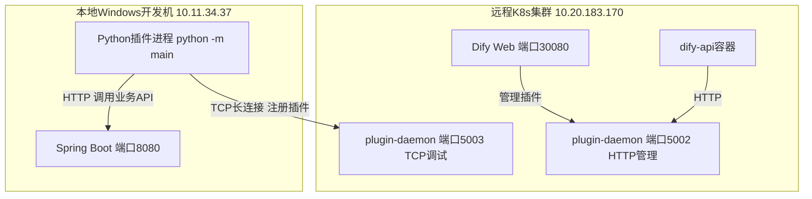
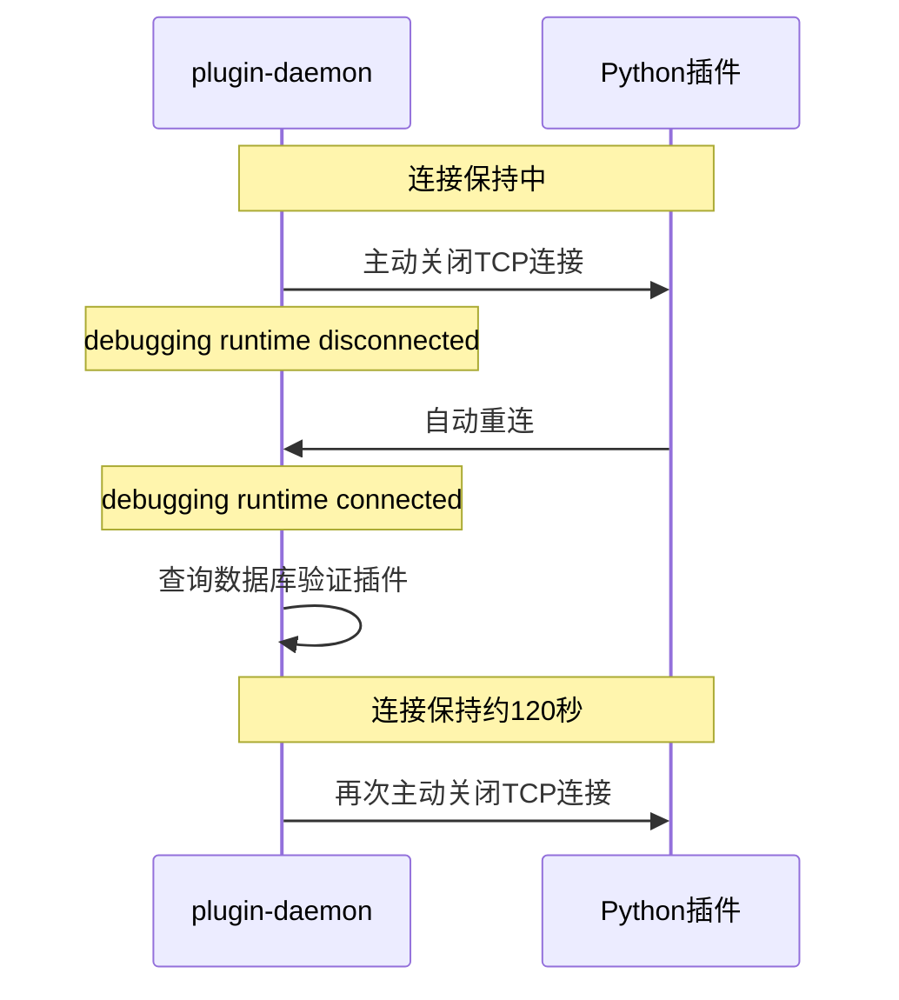
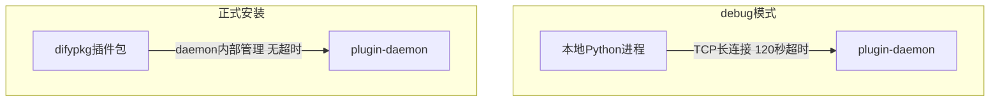
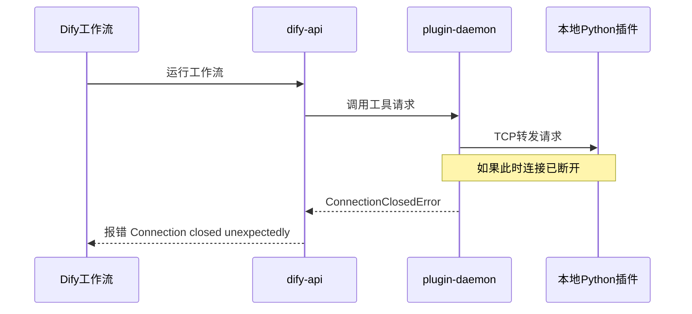
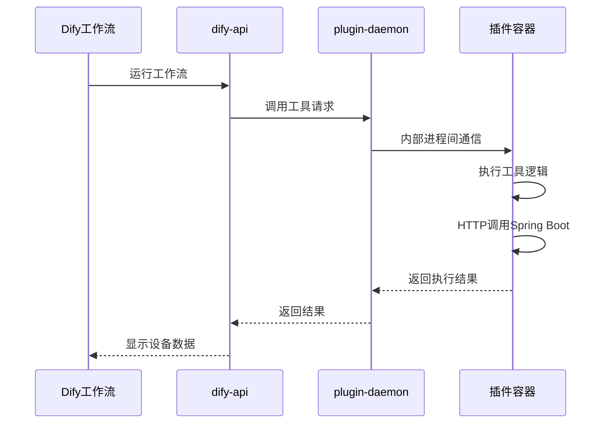
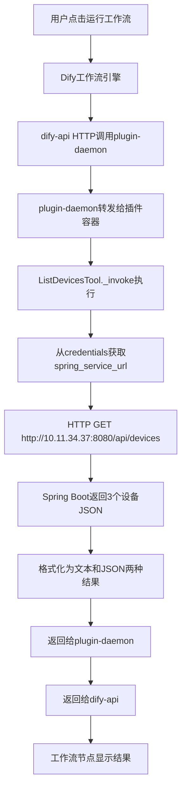
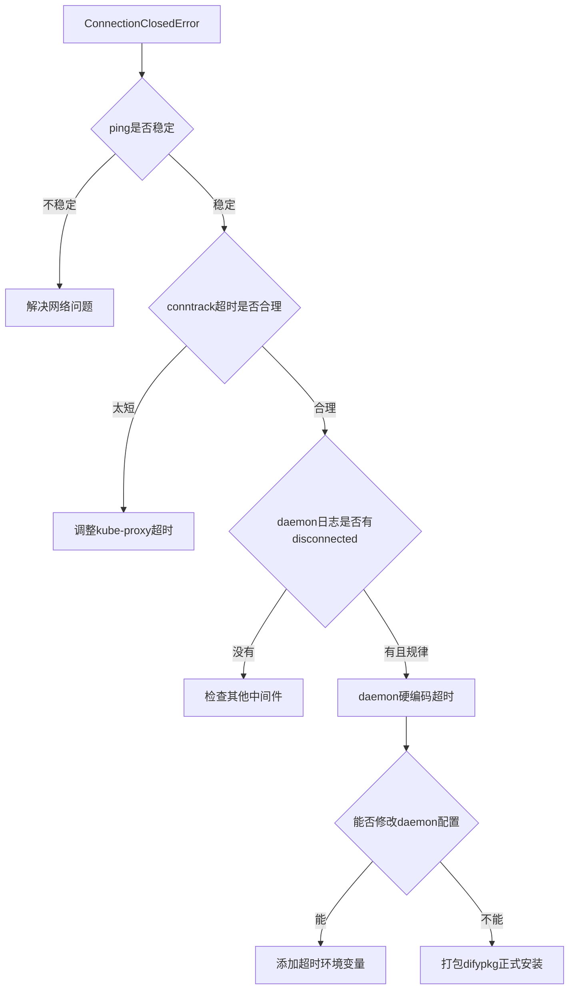

# Dify插件ConnectionClosedError排查 - 从debug模式120秒断连到.difypkg正式安装全记录

> **前置阅读**：本文是以下两篇博客的续篇：
> - [本地Windows连接远程K8s上的Dify插件Daemon - 踩坑全记录](20260603-1354-dify的插件接口-本地Windows连接远程K8s上的Dify插件.md)
> - [本地debug怎么配置插件链接本地环境](./20260603-1425-本地debug怎么配置插件链接本地环境.md)
>
> 前两篇解决了插件TCP连接建立和凭证配置的问题（环境变量名、K8s端口映射、凭证验证等7个坑）。本篇聚焦于插件注册成功后，工作流执行时报 `ConnectionClosedError` 的完整排查过程，以及最终通过打包 `.difypkg` 正式安装来解决的全过程。

---

## 目录

1. [问题现象 - 工作流执行报ConnectionClosedError](#1-问题现象)
2. [排查第一步 - 确认基础网络是否稳定](#2-排查第一步---确认基础网络是否稳定)
3. [排查第二步 - 检查kube-proxy conntrack超时配置](#3-排查第二步---检查kube-proxy-conntrack超时配置)
4. [排查第三步 - 查看daemon日志定位断连规律](#4-排查第三步---查看daemon日志定位断连规律)
5. [根因分析 - daemon debug模式120秒硬编码超时](#5-根因分析---daemon-debug模式120秒硬编码超时)
6. [尝试修复 - 添加超时环境变量](#6-尝试修复---添加超时环境变量)
7. [最终方案 - 打包difypkg正式安装](#7-最终方案---打包difypkg正式安装)
8. [Dify CLI工具安装踩坑](#8-dify-cli工具安装踩坑)
9. [打包与安装流程 - 从签名验证到最终成功](#9-打包与安装流程)
10. [完整数据流分析](#10-完整数据流分析)
11. [踩坑清单与经验总结](#11-踩坑清单与经验总结)

---

## 1. 问题现象

### 1.1 当前状态

经过前两篇博客的排查，当前状态：

- Python插件通过 `python -m main` 成功连接远程Dify Plugin Daemon
- 终端输出 `Installed tool: iot_device_plugin` 表示插件注册成功
- K8s Service端口映射已正确配置（双端口5002 HTTP管理 + 5003 TCP调试）
- 凭证保存成功（`_validate_credentials` 简化为格式校验）
- `.env` 配置：`REMOTE_INSTALL_HOST=10.20.183.170`，`REMOTE_INSTALL_PORT=5003`，`HEARTBEAT_INTERVAL=3`

### 1.2 环境拓扑



### 1.3 版本信息

| 组件 | 版本 | 来源 |
|------|------|------|
| plugin-daemon | 0.5.3-local | 自定义镜像 ailpha-registry:5000 |
| Python SDK dify_plugin | 0.0.1b77 | pip install |
| Dify平台 | 1.12.1 | Helm部署 dify-0.36.0 |

### 1.4 报错 - ConnectionClosedError

在Dify工作室创建工作流，添加"获取设备列表"工具节点，点击运行后，界面报错：

```
An error occurred in the 6aa18048-84ec-41f5-b062-a39c975b8841/iot_device_plugin/iot_device_plugin,
please contact the author of 6aa18048-84ec-41f5-b062-a39c975b8841/iot_device_plugin/iot_device_plugin
for help,
error type: ConnectionClosedError,
error details: Connection closed unexpectedly
```

同时本地Python插件终端也有报错：

```
Failed to read data from 10.20.183.170:5003
Traceback (most recent call last):
  File "D:\python312\install\Lib\site-packages\dify_plugin\core\server\tcp\request_reader.py", line 168
    raise Exception("Connection is closed")
Exception: Connection is closed

Unexpected error occurred when executing request
Traceback (most recent call last):
  File "D:\python312\install\Lib\site-packages\dify_plugin\core\server\__base\response_writer.py", line 40
    self.write("\n\n")
  File "D:\python312\install\Lib\site-packages\dify_plugin\core\server\tcp\request_reader.py", line 82
    raise Exception("connection is dead")
Exception: connection is dead
```

插件在注册后又重新连接：

```
{"event": "log", "data": {"level": "INFO", "message": "Installed tool: iot_device_plugin", "timestamp": 1780468561.8135262}}
{"event": "log", "data": {"level": "INFO", "message": "Installed tool: iot_device_plugin", "timestamp": 1780468566.8177295}}
```

每隔几秒就重新注册一次，说明TCP连接在不断断开重连。

### 1.5 初步分析

凭证保存时 `_validate_credentials` 能成功执行（前一篇博客已解决），说明TCP连接在刚建立时是可用的。但工作流运行时连接已经断了。

核心问题：**TCP长连接为什么不稳定？**

我们已经在上一篇博客中把心跳间隔缩短到了3秒（`HEARTBEAT_INTERVAL=3`），凭证保存也一次通过了。但工作流运行时仍然报错，说明问题不在心跳频率，而是有更深层的原因。

TCP连接链路上有多个环节，需要逐一排除：


每个环节都可能断开TCP连接，需要从源头开始逐层排查。

---

## 2. 排查第一步 - 确认基础网络是否稳定

### 2.1 测试本地到远程服务器的网络

在本地PowerShell执行持续ping：

```powershell
ping 10.20.183.170 -t
```

输出：

```
正在 Ping 10.20.183.170 具有 32 字节的数据:
来自 10.20.183.170 的回复: 字节=32 时间=2ms TTL=60
来自 10.20.183.170 的回复: 字节=32 时间=2ms TTL=60
来自 10.20.183.170 的回复: 字节=32 时间=3ms TTL=60
来自 10.20.183.170 的回复: 字节=32 时间=3ms TTL=60
来自 10.20.183.170 的回复: 字节=32 时间=3ms TTL=60
来自 10.20.183.170 的回复: 字节=32 时间=6ms TTL=60
来自 10.20.183.170 的回复: 字节=32 时间=2ms TTL=60

10.20.183.170 的 Ping 统计信息:
    数据包: 已发送 = 7，已接收 = 7，丢失 = 0 (0% 丢失)，
往返行程的估计时间(以毫秒为单位):
    最短 = 2ms，最长 = 6ms，平均 = 3ms
```

**结论**：基础网络完全稳定，延迟2ms，0%丢包。

### 2.2 排除网络因素

| 环节 | 状态 | 证据 |
|------|------|------|
| 本地WiFi | 正常 | ping延迟2ms，0%丢包 |
| 企业网络 | 正常 | ping稳定，curl也正常（前一篇已验证） |
| HTTP短连接 | 正常 | 浏览器访问Dify网页、curl测试Spring Boot都正常 |
| TCP长连接 | 异常 | 注册成功后几秒内断开 |

关键区别：HTTP是短连接（请求完就断），TCP长连接需要持续保持。问题出在**长连接的维持**上，而不是网络本身。

---

## 3. 排查第二步 - 检查kube-proxy conntrack超时配置

### 3.1 排查思路

K8s的NodePort通过kube-proxy的iptables做NAT转发，底层依赖Linux的conntrack模块跟踪连接状态。如果conntrack的TCP超时配置太短，就会主动断开空闲连接。

### 3.2 在远程服务器上执行检查命令

```bash
# 查看conntrack的TCP established超时配置
cat /proc/sys/net/netfilter/nf_conntrack_tcp_timeout_established
```

输出：

```
432000
```

```bash
# 查看conntrack的TCP close_wait超时配置
cat /proc/sys/net/netfilter/nf_conntrack_tcp_timeout_close_wait
```

输出：

```
60
```

### 3.3 分析

| 参数 | 值 | 换算 | 结论 |
|------|-----|------|------|
| tcp_timeout_established | 432000秒 | 5天 | 不会因为空闲超时断连 |
| tcp_close_wait_timeout | 60秒 | 1分钟 | 正常范围 |

**结论**：kube-proxy的conntrack配置没有问题，不会在几秒内断开TCP连接。排除kube-proxy因素。

### 3.4 同时检查kube-proxy配置

```bash
kubectl get cm -A | grep -i proxy
```

输出：

```
dify                              dify-proxy                                                        3      23d
prometheus-stack                  prometheus-stack-kube-prom-proxy                                  1      23d
```

没有特殊的kube-proxy超时覆盖配置。进一步确认不是K8s网络层的问题。

---

## 4. 排查第三步 - 查看daemon日志定位断连规律

### 4.1 查看daemon断开连接的日志

既然网络和K8s都排除了，那断连只可能发生在daemon进程本身。查看daemon日志中关于断开连接的记录：

```bash
kubectl logs -n dify -l component=plugin-daemon --tail=100 | grep -i "disconnect\|close\|error\|dead"
```

输出：

```
2026-06-03T06:36:01.841989902Z INFO dify-plugin-daemon logger.go:71 debugging runtime disconnected plugin=6aa18048-84ec-41f5-b062-a39c975b8841/iot_device_plugin:0.0.1@46b11813138fdb464b33137a73dc3ff9f63dc4963e2da95d30967518c9e9a4d4
2026-06-03T06:36:06.859075083Z INFO dify-plugin-daemon logger.go:71 debugging runtime disconnected plugin=6aa18048-84ec-41f5-b062-a39c975b8841/iot_device_plugin:0.0.1@46b11813138fdb464b33137a73dc3ff9f63dc4963e2da95d30967518c9e9a4d4
2026-06-03T06:38:06.863973532Z INFO dify-plugin-daemon logger.go:71 debugging runtime disconnected plugin=6aa18048-84ec-41f5-b062-a39c975b8841/iot_device_plugin:0.0.1@46b11813138fdb464b33137a73dc3ff9f63dc4963e2da95d30967518c9e9a4d4
2026-06-03T06:40:08.846251Z     INFO dify-plugin-daemon logger.go:71 debugging runtime disconnected plugin=6aa18048-84ec-41f5-b062-a39c975b8841/iot_device_plugin:0.0.1@46b11813138fdb464b33137a73dc3ff9f63dc4963e2da95d30967518c9e9a4d4
2026-06-03T06:42:11.612098133Z INFO dify-plugin-daemon logger.go:71 debugging runtime disconnected plugin=6aa18048-84ec-41f5-b062-a39c975b8841/iot_device_plugin:0.0.1@46b11813138fdb464b33137a73dc3ff9f63dc4963e2da95d30967518c9e9a4d4
```

### 4.2 关键发现 - daemon主动断开连接

日志中明确记录了 `debugging runtime disconnected`，这是daemon进程**主动断开**TCP连接。

### 4.3 分析断开间隔规律

把断开时间提取出来计算间隔：

```
06:36:01 disconnected
06:36:06 disconnected  (5秒后，这是重连后立即又被断)
06:38:06 disconnected  (距离上次正好120秒)
06:40:08 disconnected  (距离上次约120秒)
06:42:11 disconnected  (距离上次约120秒)
```

**精确的2分钟间隔！**

### 4.4 查看daemon完整日志确认连接-断开周期

不过滤，直接看daemon的完整日志：

```bash
kubectl logs -n dify -l component=plugin-daemon --tail=200 | grep -i "iot_device_plugin"
```

输出（截取关键部分）：

```
2026-06-03T06:36:01.841989902Z INFO debugging runtime disconnected plugin=...iot_device_plugin:0.0.1@...
2026-06-03T06:36:01.857453256Z INFO debugging runtime connected plugin=...iot_device_plugin:0.0.1@...
[0.523ms] [rows:0] SELECT * FROM "plugin_installations" WHERE plugin_id = '...'
[0.381ms] [rows:0] SELECT * FROM "plugins" WHERE plugin_unique_identifier = '...'

2026-06-03T06:36:06.859075083Z INFO debugging runtime disconnected plugin=...iot_device_plugin:0.0.1@...
2026-06-03T06:36:06.863522267Z INFO debugging runtime connected plugin=...iot_device_plugin:0.0.1@...
[0.712ms] [rows:0] SELECT * FROM "plugin_installations" WHERE plugin_id = '...'
[0.899ms] [rows:0] SELECT * FROM "plugins" WHERE plugin_unique_identifier = '...'

2026-06-03T06:38:06.863973532Z INFO debugging runtime disconnected plugin=...iot_device_plugin:0.0.1@...
2026-06-03T06:38:11.876614566Z INFO debugging runtime connected plugin=...iot_device_plugin:0.0.1@...
```

每次断开的流程完全一致：



### 4.5 结论

**不是网络问题，不是K8s问题，是daemon进程自身的硬编码行为。**

daemon的debug模式有一个精确的 **120秒会话超时**，每120秒主动断开一次TCP连接。插件SDK检测到断连后会自动重连，但重连后的新连接也会在120秒后再次被断开。

如果在连接断开期间恰好有工作流工具调用请求，就会出现 `ConnectionClosedError`。

---

## 5. 根因分析 - daemon debug模式120秒硬编码超时

### 5.1 为什么debug模式有超时限制

Dify的plugin-daemon对debug模式（远程调试连接）设计了会话超时机制。这是一个安全限制：

- 防止调试连接永久占用资源
- 避免已断开的调试插件继续接收请求
- debug模式本身就不是用于生产环境的

正式安装的插件（通过.difypkg上传安装）不受此限制，因为它们运行在daemon管理的容器内，不依赖外部TCP长连接。

### 5.2 debug模式与正式安装的区别



| 对比项 | debug模式 | 正式安装 |
|--------|----------|---------|
| 运行位置 | 本地电脑 | daemon管理的容器内 |
| 连接方式 | 外部TCP长连接 | daemon内部管理 |
| 超时限制 | 120秒硬编码 | 无 |
| 适用场景 | 开发调试 | 生产使用 |
| 安装方式 | .env配置REMOTE参数 | 上传.difypkg文件 |

### 5.3 确认daemon配置中没有超时可调参数

查看daemon的ConfigMap完整内容：

```bash
kubectl get cm dify-plugin-daemon -n dify -o yaml
```

输出：

```yaml
apiVersion: v1
data:
  DB_DATABASE: dify_plugin_daemon
  DB_HOST: highgo-ha.highgo
  DB_PORT: "5866"
  DB_TYPE: postgresql
  DIFY_INNER_API_URL: http://dify-api:5001
  MARKETPLACE_API_URL: https://marketplace.dify.ai
  MARKETPLACE_ENABLED: "true"
  MAX_PLUGIN_PACKAGE_SIZE: "52428800"
  PLUGIN_REMOTE_INSTALLING_HOST: 0.0.0.0
  PLUGIN_REMOTE_INSTALLING_PORT: "5003"
  PLUGIN_STORAGE_LOCAL_ROOT: /app/storage
  PLUGIN_STORAGE_TYPE: local
  PLUGIN_WORKING_PATH: /app/cwd
  REDIS_DB: "0"
  REDIS_HOST: redis-master.redis
  REDIS_PORT: "6379"
  REDIS_USE_SSL: "false"
  SERVER_PORT: "5002"
```

ConfigMap中**没有任何超时、心跳、会话相关的配置项**。120秒超时是daemon源码中的硬编码值。

同时检查daemon的环境变量中是否有超时配置：

```bash
POD=$(kubectl get pod -n dify -l component=plugin-daemon -o jsonpath='{.items[0].metadata.name}')
kubectl exec -n dify $POD -- env | grep -i -E "timeout|session|ttl|expire|max|debug|heartbeat"
```

输出：

```
MAX_PLUGIN_PACKAGE_SIZE=52428800
```

只有一个包大小限制，没有任何超时配置。**120秒超时无法通过配置修改。**

---

## 6. 尝试修复 - 添加超时环境变量

### 6.1 尝试给daemon添加超时环境变量

虽然ConfigMap中没有超时配置，但daemon可能支持一些未记录的环境变量。尝试添加：

```bash
kubectl set env deploy/dify-plugin-daemon -n dify \
  PLUGIN_MAX_EXECUTION_TIMEOUT=600 \
  MAX_PLUGIN_EXECUTION_TIMEOUT=600 \
  PLUGIN_DEBUG_TIMEOUT=600
```

输出：

```
deployment.apps/dify-plugin-daemon env updated
```

### 6.2 等待Pod重启

```bash
kubectl rollout status deploy/dify-plugin-daemon -n dify --timeout=120s
```

输出：

```
deployment "dify-plugin-daemon" successfully rolled out
```

### 6.3 验证是否生效

Pod重启后，本地重启插件并观察：

```powershell
python -m main
```

输出：

```
[DEBUG] REMOTE_INSTALL_HOST=10.20.183.170
[DEBUG] REMOTE_INSTALL_PORT=5003
[DEBUG] INSTALL_METHOD=remote
[DEBUG] HEARTBEAT_INTERVAL=3
{"event": "log", "data": {"level": "INFO", "message": "Installed tool: iot_device_plugin", "timestamp": 1780470340.6391556}}
```

注册成功后，等待120秒观察是否断连。结果：

```
Failed to read data from 10.20.183.170:5003
Exception: Connection is closed
```

在Dify界面运行工作流，报错依旧：

```
An error occurred in the .../iot_device_plugin/iot_device_plugin,
error type: ConnectionClosedError,
error details: Connection closed unexpectedly
```

同时daemon日志中仍然出现 `debugging runtime disconnected`。

### 6.4 结论

添加的环境变量 **不生效**。daemon的120秒超时是硬编码在源码中的，无法通过外部配置修改。

### 6.5 清理无效的环境变量

```bash
kubectl set env deploy/dify-plugin-daemon -n dify \
  PLUGIN_MAX_EXECUTION_TIMEOUT- \
  MAX_PLUGIN_EXECUTION_TIMEOUT- \
  PLUGIN_DEBUG_TIMEOUT-
```

---

## 7. 最终方案 - 打包difypkg正式安装

### 7.1 方案选择

既然debug模式的120秒超时无法修改，唯一的解决方案就是将插件打包为 `.difypkg` 文件，通过Dify界面正式安装。正式安装的插件运行在daemon管理的容器内，不依赖外部TCP长连接，没有120秒超时限制。


### 7.2 .difypkg文件格式

`.difypkg` 本质上就是一个 **zip压缩包**，包含插件的所有源码和配置文件：

```
iot_device_plugin.difypkg (zip格式)
├── manifest.yaml
├── main.py
├── requirements.txt
├── _assets/
│   └── icon.svg
├── provider/
│   ├── iot_device_plugin.yaml
│   └── iot_device_plugin.py
└── tools/
    ├── list_devices.yaml
    ├── list_devices.py
    ├── get_device_status.yaml
    ├── get_device_status.py
    ├── control_device.yaml
    ├── control_device.py
    ├── query_device_data.yaml
    └── query_device_data.py
```

注意：`.env` 文件**不需要**打包进去，正式安装不需要调试连接配置。

---

## 8. Dify CLI工具安装踩坑

### 8.1 尝试使用pip安装CLI

最初以为Dify CLI工具可以通过pip安装：

```powershell
pip install dify_plugin
dify --help
```

输出：

```
dify : 无法将"dify"项识别为 cmdlet、函数、脚本文件或可运行程序的名称。
```

`dify_plugin` 是Python SDK库，不提供CLI命令。

### 8.2 尝试安装dify-cli

```powershell
pip install dify-cli
dify --help
```

输出：

```
dify : 无法将"dify"项识别为 cmdlet、函数、脚本文件或可运行程序的名称。
```

`dify-cli` 也不是提供 `dify` 命令的包。

### 8.3 找到正确的CLI来源

经过查找，Dify CLI是 `langgenius/dify-plugin-daemon` 仓库编译的 **Go二进制文件**，不是Python包。需要从GitHub Release页面下载。

下载地址：`https://github.com/langgenius/dify-plugin-daemon/releases`

### 8.4 下载并配置Windows版本

从Release页面下载Windows二进制文件 `dify-plugin-windows-amd64.exe`，重命名为 `dify.exe` 放到PATH目录中：

```powershell
Copy-Item "D:\迅雷下载\dify-plugin-windows-amd64.exe" "D:\python312\install\Scripts\dify.exe"
```

### 8.5 验证CLI可用

```powershell
dify plugin package --help
```

输出：

```
Package plugins

Usage:
  dify plugin package [plugin_path] [flags]

Flags:
  -h, --help                 help for package
      --max-size int         Maximum uncompressed size in MB (default 50)
  -o, --output_path string   output path
```

### 8.6 执行打包

```powershell
dify plugin package "E:\Ideaproject\test-dify\plugin-iot-device-plugin" -o "E:\Ideaproject\test-dify\plugin-iot-device-plugin\iot_device_plugin.difypkg"
```

输出：

```
2026/06/03 16:03:30 INFO plugin packaged successfully output_path=E:\Ideaproject\test-dify\plugin-iot-device-plugin\iot_device_plugin.difypkg
```

验证打包结果：

```powershell
Get-Item "E:\Ideaproject\test-dify\plugin-iot-device-plugin\iot_device_plugin.difypkg" | Select-Object Name, Length, LastWriteTime
```

```
Name                      Length LastWriteTime
----                      ------ -------------
iot_device_plugin.difypkg  32417 2026/6/3 16:03:30
```

### 8.7 实际上可以手动打包

如果CLI下载不方便，`.difypkg` 也可以手动创建，因为它就是标准的zip文件：

```powershell
cd E:\Ideaproject\test-dify\plugin-iot-device-plugin
$files = @("manifest.yaml","main.py","requirements.txt","_assets\icon.svg",
    "provider\iot_device_plugin.yaml","provider\iot_device_plugin.py",
    "tools\list_devices.yaml","tools\list_devices.py",
    "tools\get_device_status.yaml","tools\get_device_status.py",
    "tools\control_device.yaml","tools\control_device.py",
    "tools\query_device_data.yaml","tools\query_device_data.py")
Compress-Archive -Path $files -DestinationPath "iot_device_plugin.difypkg" -Force
```

---

## 9. 打包与安装流程

### 9.1 上传安装 - 签名验证拦截

打包完成后，在Dify界面上传 `.difypkg`，界面报错：

```
plugin verification has been enabled, and the plugin you want to install has a bad signature
```

**原因**：Dify 自托管版本默认启用插件签名验证（`FORCE_VERIFYING_SIGNATURE=true`），自打包的 `.difypkg` 没有官方签名，所以被拦截。

**解决**：在远程服务器上关闭签名验证：

```bash
kubectl set env deploy/dify-api -n dify FORCE_VERIFYING_SIGNATURE=false
kubectl set env deploy/dify-plugin-daemon -n dify FORCE_VERIFYING_SIGNATURE=false
```

输出：

```
deployment.apps/dify-api env updated
deployment.apps/dify-plugin-daemon env updated
```

等待 Pod 重启后，再次上传 `iot_device_plugin.difypkg`。

### 9.2 安装失败 - lock timeout

签名验证关闭后上传不再报错，但插件安装状态显示为 **failed**：

```
failed to launch plugin: lock timeout
failed to acquire distributed env-init lock
```

daemon 日志中的关键信息：

```
INFO  acquiring distributed init lock plugin=your-name/iot_device_plugin:0.0.1@... expire=15m0s
ERROR local runtime start failed error="lock timeout\nfailed to acquire distributed env-init lock"
```

**原因**：daemon 在初始化插件环境时需要获取 Redis 分布式锁，但锁被其他进程持有或残留，导致15分钟后超时。

### 9.3 排查 - 重启daemon + 清理Redis残留锁

第一步，重启 plugin-daemon：

```bash
kubectl rollout restart deploy/dify-plugin-daemon -n dify
kubectl rollout status deploy/dify-plugin-daemon -n dify --timeout=120s
```

输出：

```
deployment.apps/dify-plugin-daemon restarted
deployment "dify-plugin-daemon" successfully rolled out
```

第二步，清理 Redis 中的残留锁：

```bash
# 获取 Redis Pod 名称
REDIS_POD=$(kubectl get pod -n redis -l app.kubernetes.io/name=redis -o jsonpath='{.items[0].metadata.name}')

# 查看锁相关 key（需要 -a 参数传密码）
kubectl exec -n redis $REDIS_POD -- redis-cli -a "你的Redis密码" KEYS "*lock*"

# 清除所有锁
kubectl exec -n redis $REDIS_POD -- redis-cli -a "你的Redis密码" KEYS "*lock*" | while read key; do kubectl exec -n redis $REDIS_POD -- redis-cli -a "你的Redis密码" DEL "$key"; done
```

清除结果：

```
1   # 删除了4个锁key
1
1
1
```

### 9.4 真正根因 - 其他插件占用环境初始化资源

清理锁后重新安装仍然失败。通过实时查看 daemon 日志发现了真正原因：

```bash
DAEMON_POD=$(kubectl get pod -n dify -l component=plugin-daemon -o jsonpath='{.items[0].metadata.name}')
kubectl logs -f -n dify $DAEMON_POD --tail=50
```

日志显示另一个插件 **`langgenius/tongyi`** 正在初始化环境，下载 `numpy`（15.8MB）时网络超时（默认30秒）：

```
× Failed to download `numpy==2.2.6`
├─▶ Failed to extract archive
╰─▶ Failed to download distribution due to network timeout.
    Try increasing UV_HTTP_TIMEOUT (current value: 30s).
```

这个 tongyi 插件的环境初始化一直卡着，占用了分布式锁，导致 IoT 插件无法获取锁。

**解决方法**：

1. 在 Dify 界面删除不需要的 tongyi 插件
2. 增加 uv 下载超时时间（可选）：

```bash
kubectl set env deploy/dify-plugin-daemon -n dify UV_HTTP_TIMEOUT=300
kubectl rollout status deploy/dify-plugin-daemon -n dify --timeout=120s
```

### 9.5 最终安装成功

清除阻塞的 tongyi 插件后，重新上传 `iot_device_plugin.difypkg`，安装成功！

在插件管理页面配置凭证：

| 字段 | 填写值 | 说明 |
|------|--------|------|
| Spring Service URL | `http://10.11.34.37:8080` | 本地Spring Boot的真实IP |
| API Token | 留空 | 未启用认证 |

仍然填 `http://10.11.34.37:8080` 而不是 `localhost:8080`，因为正式安装的插件运行在K8s容器内，`localhost` 指向的是容器自身，不是你的本地电脑。

### 9.6 验证工作流运行

创建工作流，添加"获取设备列表"工具节点，点击运行，SSE 返回完整结果：

```
event: workflow_started
data: {"event":"workflow_started","workflow_run_id":"504fd03d-..."}

event: node_started
data: {"node_type":"start","title":"用户输入"}

event: node_started
data: {"node_type":"tool","title":"获取设备列表"}

event: text_chunk
data: {"text":"共发现 3 个设备：\n\n• [device_003] 厨房智能开关\n  类型: smart_switch | 位置: 厨房 | 状态: offline\n• [device_002] 卧室智能灯泡\n  类型: smart_light | 位置: 卧室 | 状态: online\n• [device_001] 客厅温度传感器\n  类型: temperature_sensor | 位置: 客厅 | 状态: online"}

event: workflow_finished
data: {"status":"succeeded","elapsed_time":0.68749,"total_steps":3}
```

**工作流完整执行成功**：3个节点全部 succeeded，总耗时 0.69 秒，返回3个IoT设备数据。不再有 `ConnectionClosedError`。

---

## 10. 完整数据流分析

### 10.1 debug模式的数据流（有120秒限制）



debug模式的关键瓶颈在于 `Daemon → Plugin` 的TCP长连接每120秒被daemon主动断开。如果断开时恰好有请求经过，就会报错。

### 10.2 正式安装后的数据流（无限制）



正式安装后，插件运行在daemon管理的容器内，通信走进程间调用，没有外部TCP长连接，不存在超时断连问题。

### 10.3 工具调用的完整数据链路

以"获取设备列表"为例，正式安装后的完整数据流：



---

## 11. 踩坑清单与经验总结

### 11.1 ConnectionClosedError排查路线图



### 11.2 本篇排查过程总结

| 序号 | 排查项 | 命令 | 结果 | 结论 |
|------|--------|------|------|------|
| 1 | 基础网络 | ping 10.20.183.170 -t | 2ms 0%丢包 | 网络正常 |
| 2 | conntrack超时 | cat /proc/sys/net/netfilter/nf_conntrack_tcp_timeout_established | 432000 5天 | 不是K8s的问题 |
| 3 | daemon日志 | kubectl logs grep disconnected | 每120秒断开一次 | daemon主动断开 |
| 4 | daemon ConfigMap | kubectl get cm dify-plugin-daemon -o yaml | 无超时配置 | 硬编码行为 |
| 5 | 添加环境变量 | kubectl set env PLUGIN_MAX_EXECUTION_TIMEOUT=600 | 仍然120秒断 | 环境变量不生效 |

### 11.3 difypkg安装踩坑记录

| 序号 | 问题 | 报错信息 | 解决方式 |
|------|------|---------|----------|
| 1 | 签名验证拦截 | bad signature | 设置 FORCE_VERIFYING_SIGNATURE=false |
| 2 | 分布式锁超时 | lock timeout / failed to acquire env-init lock | 清理 Redis 残留锁 + 删除阻塞的其他插件 |
| 3 | 其他插件下载依赖超时 | numpy 下载超时 UV_HTTP_TIMEOUT=30s | 删除不需要的插件 或 增加 UV_HTTP_TIMEOUT |

### 11.4 debug模式与正式安装对比表

| 对比项 | debug模式 | 正式安装 |
|--------|----------|---------|
| 连接方式 | 外部TCP长连接 | daemon容器内运行 |
| 超时限制 | 120秒硬编码 | 无限制 |
| 适用场景 | 开发调试 快速验证 | 生产环境 稳定运行 |
| 安装方式 | .env配置 + python -m main | 上传.difypkg文件 |
| 重启方式 | 手动重启python进程 | daemon自动管理 |
| Spring Boot地址 | 可用localhost 因为是本机 | 必须用真实IP 因为在容器内 |

### 11.5 Dify CLI安装踩坑记录

| 尝试 | 命令 | 结果 |
|------|------|------|
| pip install dify_plugin | dify --help | 无法识别dify命令 |
| pip install dify-cli | dify --help | 无法识别dify命令 |
| 从GitHub下载Go二进制 | dify.exe放到PATH | 可用 |

`dify` CLI是独立的Go编译二进制，来自 `langgenius/dify-plugin-daemon` 仓库的Release页面。

### 11.6 最终项目配置清单

**正式安装后，本地只需要保持Spring Boot运行：**

```powershell
cd E:\Ideaproject\test-dify\plugin-dify-iot-device
mvn spring-boot:run
```

不再需要运行 `python -m main`，插件由Dify daemon管理。

**最终代码文件清单：**

| 文件 | 说明 |
|------|------|
| manifest.yaml | 插件清单 指定Python 3.12 |
| main.py | 入口文件 Plugin + DifyPluginEnv |
| requirements.txt | 依赖 dify_plugin + requests + python-dotenv |
| provider/iot_device_plugin.yaml | Provider配置 含凭证字段定义 |
| provider/iot_device_plugin.py | 凭证验证 只做格式校验 |
| tools/list_devices.py | 获取设备列表工具 |
| tools/get_device_status.py | 获取设备状态工具 |
| tools/control_device.py | 控制设备工具 |
| tools/query_device_data.py | 查询历史数据工具 |

### 11.7 核心经验

1. **debug模式不是生产环境**：daemon对debug连接有120秒硬编码超时，开发调试够用，不能用于正式运行
2. **排查TCP断连要逐层排除**：网络 → K8s conntrack → daemon日志，从外到内定位
3. **daemon日志是最直接的证据**：`debugging runtime disconnected` 明确指出是daemon主动断开
4. **difypkg本质是zip文件**：不需要CLI也可以手动打包，关键是包含manifest.yaml和所有源码
5. **正式安装后Spring Boot地址要改**：debug模式可用localhost（本机进程），正式安装必须用真实IP（容器内进程）
6. **签名验证默认开启**：自托管Dify默认启用插件签名验证，自打包插件必须显式关闭 FORCE_VERIFYING_SIGNATURE=false
7. **安装前先看daemon日志**：`kubectl logs -f -n dify <daemon-pod> --tail=50`，实时观察安装过程，能快速定位问题
8. **其他插件可能阻塞安装**：daemon用分布式锁管理插件初始化，如果其他插件（如tongyi）环境初始化卡住，会阻塞新插件安装
