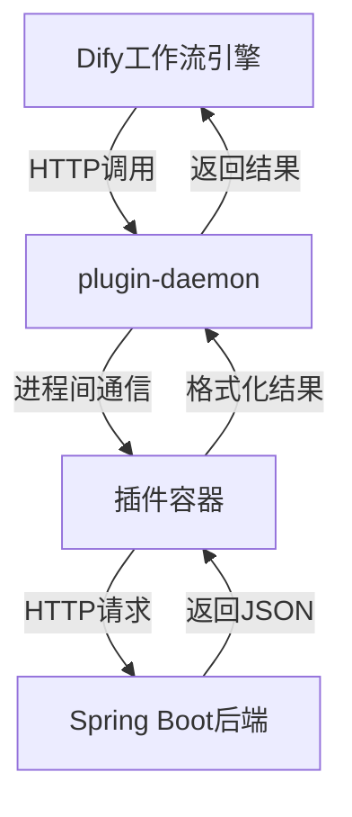
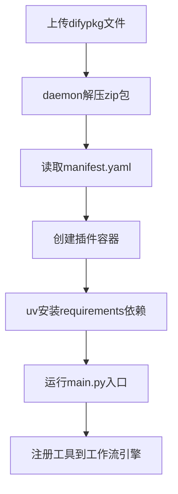
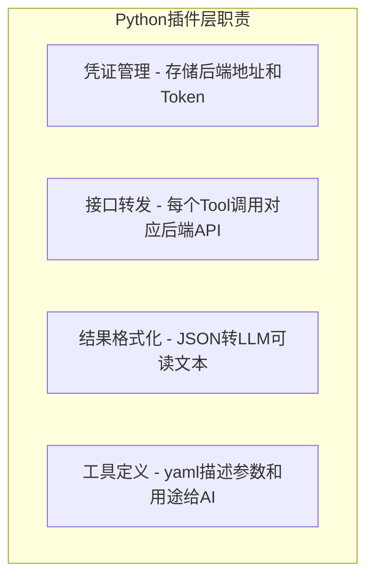
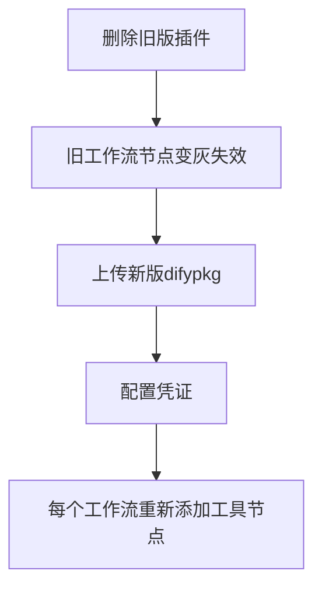
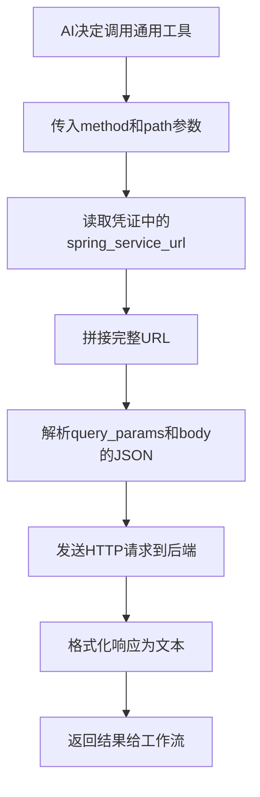
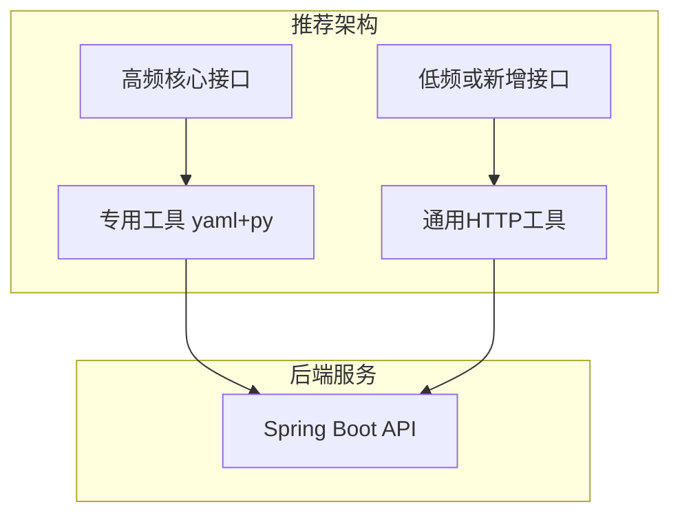

# Dify插件开发常见问题FAQ - 从打包原理到通用接口设计全记录

> **前置阅读**：本文是以下三篇博客的续篇：
> - [本地Windows连接远程K8s上的Dify插件Daemon - 踩坑全记录](20260603-1354-dify的插件接口-本地Windows连接远程K8s上的Dify插件.md)
> - [本地debug怎么配置插件链接本地环境](./20260603-1425-本地debug怎么配置插件链接本地环境.md)
> - [ConnectionClosedError排查 - 从debug模式120秒断连到difypkg正式安装全记录](./20260603-1548-dify使用自定义插件链接本地包.md)
>
> 前三篇解决了从TCP连接建立、凭证配置到ConnectionClosedError排查的全链路问题，最终通过打包 `.difypkg` 正式安装让工作流成功运行。本篇基于插件已经正常运行的前提，以流水账形式记录开发过程中提出的8个常见问题，每个问题都附带代码分析、验证过程和解决方案。

---

## 目录

1. [当前状态与项目架构](#1-当前状态与项目架构)
2. [FAQ1 - difypkg打包到底包含了什么](#2-faq1---difypkg打包到底包含了什么)
3. [FAQ2 - Python插件项目到底是干什么的](#3-faq2---python插件项目到底是干什么的)
4. [FAQ3 - 后端每个接口都要写一个代理工具吗](#4-faq3---后端每个接口都要写一个代理工具吗)
5. [FAQ4 - 插件更新怎么办 会不会影响已有工作流](#5-faq4---插件更新怎么办-会不会影响已有工作流)
6. [FAQ5 - 能用其他语言写插件吗](#6-faq5---能用其他语言写插件吗)
7. [FAQ6 - 写一个通用HTTP接口能不能解决所有问题](#7-faq6---写一个通用http接口能不能解决所有问题)
8. [FAQ7 - 插件名称冲突 新旧版本如何共存](#8-faq7---插件名称冲突-新旧版本如何共存)
9. [FAQ8 - 多参数接口怎么传递](#9-faq8---多参数接口怎么传递)
10. [完整验证 - 通用接口逐条调用全部后端API](#10-完整验证---通用接口逐条调用全部后端api)
11. [经验总结与最佳实践](#11-经验总结与最佳实践)

---

## 1. 当前状态与项目架构

### 1.1 锚点状态

经过前三篇博客的排查，当前状态：

- 插件已通过 `.difypkg` 正式安装到远程Dify
- 工作流执行成功，3个节点全部succeeded，返回3个IoT设备数据
- 不再需要运行 `python -m main`，插件由daemon管理
- 本地只需要保持Spring Boot服务运行

### 1.2 双项目架构

我们的Dify IoT插件由两个独立项目组成：

```
E:\Ideaproject\test-dify\
├── plugin-iot-device-plugin\      Python插件项目 Dify插件层
│   ├── manifest.yaml              插件清单
│   ├── main.py                    入口文件
│   ├── requirements.txt           Python依赖
│   ├── provider\
│   │   ├── iot_device_plugin.yaml 凭证配置和工具注册
│   │   └── iot_device_plugin.py   凭证验证逻辑
│   └── tools\
│       ├── list_devices.yaml + list_devices.py
│       ├── get_device_status.yaml + get_device_status.py
│       ├── control_device.yaml + control_device.py
│       ├── query_device_data.yaml + query_device_data.py
│       └── generic_http.yaml + generic_http.py
│
└── plugin-dify-iot-device\        Spring Boot后端项目 业务层
    └── src\main\java\com\example\iot\
        ├── controller\DeviceController.java
        ├── service\DeviceService.java
        └── model\
```

### 1.3 请求数据流



### 1.4 版本信息

| 组件 | 版本 | 说明 |
|------|------|------|
| plugin-daemon | 0.5.3-local | K8s部署 自定义镜像 |
| Python SDK dify_plugin | 0.0.1b77 | pip install |
| Dify平台 | 1.12.1 | Helm部署 dify-0.36.0 |
| Python运行版本 | 3.12 | manifest.yaml指定 |

### 1.5 后端已有接口清单

Spring Boot后端 `DeviceController.java` 提供了5个REST API：

| 序号 | 方法 | 路径 | 说明 |
|------|------|------|------|
| 1 | GET | /api/devices | 获取所有设备列表 |
| 2 | GET | /api/devices/设备ID | 获取单个设备详情 |
| 3 | GET | /api/devices/设备ID/status | 获取设备实时状态 |
| 4 | POST | /api/devices/设备ID/control | 发送控制命令 |
| 5 | GET | /api/devices/设备ID/data | 查询历史指标数据 |

---

## 2. FAQ1 - difypkg打包到底包含了什么

### 2.1 问题

插件已经通过 `.difypkg` 安装成功了，但我们一直没仔细看过这个文件里面到底是什么。用Dify CLI打包后生成的 `.difypkg` 文件里面包含了哪些内容？

### 2.2 执行打包命令

```powershell
dify plugin package "E:\Ideaproject\test-dify\plugin-iot-device-plugin" -o "E:\Ideaproject\test-dify\plugin-iot-device-plugin\iot_device_http.difypkg"
```

输出：

```
2026/06/03 17:03:38 INFO plugin packaged successfully output_path=E:\Ideaproject\test-dify\plugin-iot-device-plugin\iot_device_http.difypkg
```

查看打包结果：

```powershell
Get-Item "E:\Ideaproject\test-dify\plugin-iot-device-plugin\iot_device_http.difypkg" | Select-Object Name, Length, LastWriteTime
```

输出：

```
Name                     Length LastWriteTime
----                     ------ -------------
iot_device_http.difypkg  56216 2026/6/3 17:03:38
```

56KB的文件，里面到底是什么？

### 2.3 验证 - 解压查看内部结构

`.difypkg` 本质是一个 **zip压缩包**，可以直接用解压工具打开。解压后的完整结构：

```
iot_device_http.difypkg (zip格式)
├── manifest.yaml              插件清单 版本 语言 资源权限
├── main.py                    入口文件
├── requirements.txt           Python依赖声明
├── _assets/
│   └── icon.svg               插件图标
├── provider/
│   ├── iot_device_plugin.yaml 服务凭证配置 + 工具注册列表
│   └── iot_device_plugin.py   凭证验证逻辑
└── tools/
    ├── list_devices.yaml      工具定义 参数 描述
    ├── list_devices.py        工具实现代码
    ├── get_device_status.yaml
    ├── get_device_status.py
    ├── control_device.yaml
    ├── control_device.py
    ├── query_device_data.yaml
    ├── query_device_data.py
    ├── generic_http.yaml      通用HTTP工具定义
    └── generic_http.py        通用HTTP工具实现
```

### 2.4 关键文件分析

**manifest.yaml** - 这是插件的身份证，告诉daemon如何运行这个插件：

```yaml
version: 0.0.1
type: plugin
author: your-name
name: iot_device_http
label:
  en_US: IoT Device HTTP Gateway
  zh_Hans: IoT设备通用网关
description:
  en_US: Generic HTTP gateway to IoT device management service, supports dynamic API routing
  zh_Hans: IoT设备管理服务通用HTTP网关，支持动态API路由调用
icon: icon.svg
resource:
  memory: 268435456        # 内存限制256MB
  permission:
    tool:
      enabled: true        # 允许作为工具调用
    storage:
      enabled: true
      size: 1048576        # 存储限制1MB
plugins:
  tools:
    - provider/iot_device_plugin.yaml
meta:
  version: 0.0.1
  arch:
    - amd64
    - arm64
  runner:
    language: python
    version: "3.12"
    entrypoint: main       # 入口是main.py
```

**requirements.txt** - Python依赖，daemon安装插件时用 `uv` 安装：

```
dify_plugin~=0.0.1b72
requests>=2.31.0
python-dotenv>=1.0.0
```

注意：`.env` 文件**不需要**打包进去，正式安装不需要调试连接配置。

### 2.5 上传后daemon的处理流程



### 2.6 结论

`.difypkg` 就是一个标准的zip压缩包，包含插件清单、入口文件、Python依赖声明、凭证配置、工具定义和实现代码。daemon收到后解压、安装依赖、运行入口文件、注册工具。

---

## 3. FAQ2 - Python插件项目到底是干什么的

### 3.1 问题

项目有两个模块，`plugin-iot-device-plugin`（Python）和 `plugin-dify-iot-device`（Spring Boot），它们各自负责什么？Python插件项目看起来就是转发请求，是不是多余的？

### 3.2 分析Python插件的角色

以 `list_devices.py` 为例，看它到底做了什么：

```python
class ListDevicesTool(Tool):
    def _invoke(
        self, tool_parameters: dict[str, Any]
    ) -> Generator[ToolInvokeMessage, None, None]:
        # 1. 获取凭证
        spring_url = self.runtime.credentials.get("spring_service_url", "").rstrip("/")
        api_token = self.runtime.credentials.get("api_token", "")

        headers = {"Content-Type": "application/json"}
        if api_token:
            headers["Authorization"] = f"Bearer {api_token}"

        # 2. 调用Spring服务
        try:
            response = requests.get(
                f"{spring_url}/api/devices",
                headers=headers,
                timeout=15
            )
            response.raise_for_status()
            devices = response.json()
        except Exception as e:
            yield self.create_text_message(f"请求失败: {str(e)}")
            return

        # 3. 格式化输出
        lines = [f"共发现 {len(devices)} 个设备：\n"]
        for d in devices:
            caps = ", ".join(d.get("capabilities", []))
            lines.append(
                f"• [{d['deviceId']}] {d['deviceName']}\n"
                f"  类型: {d['deviceType']} | 位置: {d.get('location', '-')} | "
                f"  状态: {d.get('status', '-')}\n"
                f"  支持操作: {caps}"
            )

        yield self.create_text_message("\n".join(lines))
        yield self.create_json_message({"devices": devices, "total": len(devices)})
```

它做了三件事：
1. **读取凭证** - 从插件配置中获取Spring Boot地址和Token
2. **转发请求** - 用 `requests.get` 调用后端的 `/api/devices`
3. **格式化输出** - 把JSON响应转成LLM能理解的文本格式

### 3.3 Python插件的完整职责



| 职责 | 说明 | 是否做业务逻辑 |
|------|------|---------------|
| 凭证管理 | 安装时配置Spring Boot地址 | 否 |
| 接口转发 | HTTP代理 调用后端 | 否 |
| 结果格式化 | JSON转文本给LLM | 否 |
| 工具定义 | yaml告诉AI有什么工具可用 | 否 |

### 3.4 结论

**Python插件不做业务逻辑**，它是一个HTTP代理层。业务逻辑全在Spring Boot里。Python插件的核心价值是：
- 让Dify工作流引擎知道有哪些工具可用（通过yaml定义）
- 把AI的调用意图翻译成具体的HTTP请求
- 把后端返回的JSON转成LLM能理解的文本

---

## 4. FAQ3 - 后端每个接口都要写一个代理工具吗

### 4.1 问题

我们后端有5个接口，插件里就写了5个工具（list_devices、get_device_status、control_device、query_device_data、generic_http）。如果后端新增一个接口，比如 `/api/devices/{id}/logs`，插件是不是也要新增一个工具？

### 4.2 当前状况 - 一一对应

看 `provider/iot_device_plugin.yaml` 的工具注册列表：

```yaml
tools:
  - tools/list_devices.yaml
  - tools/get_device_status.yaml
  - tools/control_device.yaml
  - tools/query_device_data.yaml
  - tools/generic_http.yaml
```

前4个工具和后端接口是**一一对应**的：

| 工具 | 后端接口 | 对应关系 |
|------|---------|---------|
| list_devices | GET /api/devices | 一一对应 |
| get_device_status | GET /api/devices/id/status | 一一对应 |
| control_device | POST /api/devices/id/control | 一一对应 |
| query_device_data | GET /api/devices/id/data | 一一对应 |

每个工具需要两个文件：
- `xxx.yaml` - 工具定义（名称、参数、描述）
- `xxx.py` - 工具实现（HTTP调用+结果格式化）

### 4.3 如果后端新增接口

假设后端新增了 `DELETE /api/devices/{id}` 接口，按照一一对应的方式：
1. 需要写 `delete_device.yaml` + `delete_device.py`
2. 在 `provider/iot_device_plugin.yaml` 中注册
3. 重新打包 `.difypkg`
4. 上传安装新插件
5. 工作流里的节点需要重新选择

**每新增一个接口都要走这5步，确实很麻烦。**

### 4.4 解决方案 - 通用HTTP工具

最后一个工具 `generic_http` 就是为了解决这个问题。它是一个通用的HTTP代理，不需要为每个接口写专用工具。后面FAQ6会详细展开。

### 4.5 结论

**专用工具方式**：每个接口一个工具，AI调用精准但维护成本高
**通用工具方式**：一个工具覆盖所有接口，维护成本低但AI需要理解路径含义
**推荐方案**：高频核心接口写专用工具 + 通用工具兜底

---

## 5. FAQ4 - 插件更新怎么办 会不会影响已有工作流

### 5.1 问题

如果插件需要更新（比如新增了工具），更新流程是什么？会不会影响已经引用了这个插件的工作流？如果我们有100个工作流都用了这个插件，每个都要重新配置吗？

### 5.2 当前Dify的更新机制

**Dify目前没有提供"原地升级"的机制。** 更新插件的流程是：



实际操作中遇到的问题：

1. 删除插件后，所有引用该插件的工作流中，工具节点变灰
2. 变灰的节点不能编辑，只能删除后重新添加
3. 如果有100个工作流，每个都要手动操作

### 5.3 验证 - 删除插件对工作流的影响

在Dify界面删除插件后，打开已有工作流：

- 工具节点显示为灰色，提示插件不存在
- 点击灰色节点无法编辑
- 只能删除灰色节点，重新从工具列表选择添加

### 5.4 规避策略

虽然无法避免更新带来的影响，但有几个策略可以减轻痛苦：

| 策略 | 说明 |
|------|------|
| 向后兼容 | 新增工具时不改旧工具的yaml和py，避免破坏现有工作流 |
| 一次性写全 | 尽量把所有需要的接口一次性写完，减少更新频率 |
| 通用工具兜底 | 用generic_http工具，后端新增接口不需要更新插件 |
| 测试环境先行 | 先在测试环境验证新插件，再在生产环境操作 |

### 5.5 结论

这是Dify当前的一个痛点。对于生产环境，最佳实践是**一次性把接口写全**，或者用**通用HTTP工具**避免频繁更新。如果确实需要更新，只能逐个修改工作流。

---

## 6. FAQ5 - 能用其他语言写插件吗

### 6.1 问题

Dify插件目前用Python写的，能不能用Java、Go或者其他语言？

### 6.2 分析manifest.yaml中的runner配置

```yaml
meta:
  runner:
    language: python
    version: "3.12"
    entrypoint: main
```

这里指定了 `language: python`，daemon内置的运行时只有Python runner（基于uv包管理器）。

### 6.3 尝试pip安装CLI的踩坑

最初我们以为Dify CLI可以通过pip安装：

```powershell
pip install dify_plugin
dify --help
```

输出：

```
dify : 无法将"dify"项识别为 cmdlet、函数、脚本文件或可运行程序的名称。
```

`dify_plugin` 是Python SDK库，不提供CLI命令。

```powershell
pip install dify-cli
dify --help
```

输出：

```
dify : 无法将"dify"项识别为 cmdlet、函数、脚本文件或可运行程序的名称。
```

`dify-cli` 也不是提供 `dify` 命令的包。

### 6.4 正确的CLI来源

Dify CLI是 `langgenius/dify-plugin-daemon` 仓库编译的 **Go二进制文件**。需要从GitHub Release页面下载Windows版本：

```powershell
# 下载后复制到PATH目录
Copy-Item "D:\迅雷下载\dify-plugin-windows-amd64.exe" "D:\python312\install\Scripts\dify.exe"

# 验证
dify plugin package --help
```

输出：

```
Package plugins

Usage:
  dify plugin package [plugin_path] [flags]

Flags:
  -h, --help                 help for package
      --max-size int         Maximum uncompressed size in MB (default 50)
  -o, --output_path string   output path
```

### 6.5 语言限制总结

| 语言 | 是否支持 | 说明 |
|------|---------|------|
| Python | 支持 | 唯一的官方运行时 |
| Go | 理论支持 | daemon源码中有Go runner 但未发布 |
| Java | 不支持 | 无对应运行时 |
| Node.js | 不支持 | 无对应运行时 |

### 6.6 结论

**短期只能用Python**。虽然daemon源码中理论上支持Go runtime，但目前官方只发布了Python runtime，社区插件也全部是Python。

---

## 7. FAQ6 - 写一个通用HTTP接口能不能解决所有问题

### 7.1 问题

与其为每个后端接口写一个专用工具，能不能写一个通用的HTTP请求工具，根据传入的路径自动调用后端不同的接口？这样后端怎么变都无所谓。

### 7.2 设计思路

通用HTTP工具需要4个参数：

| 参数 | 类型 | 说明 |
|------|------|------|
| method | select | GET/POST/PUT/DELETE |
| path | string | 接口路径 如 /api/devices |
| query_params | string | 查询参数 JSON格式 |
| body | string | 请求体 JSON格式 |

### 7.3 实现 - generic_http.yaml

工具定义文件，描述参数和用途给AI：

```yaml
identity:
  name: generic_http
  author: your-name
  label:
    en_US: Generic HTTP Request
    zh_Hans: 通用HTTP请求
description:
  human:
    en_US: "Send any HTTP request to the Spring Boot backend service. Supports GET/POST/PUT/DELETE methods with custom path, query parameters and request body."
    zh_Hans: "向后端Spring Boot服务发送任意HTTP请求。支持GET/POST/PUT/DELETE方法，可自定义路径、查询参数和请求体。后端新增接口时无需修改插件，直接传入对应路径即可调用。"
  llm: "Send a generic HTTP request to the backend service. Specify method (GET/POST/PUT/DELETE), path (e.g. /api/devices or /api/devices/device_001/status), optional query_params as JSON string, and optional body as JSON string. Use this tool for any backend API endpoint not covered by dedicated tools. The backend service base URL is pre-configured in credentials."
parameters:
  - name: method
    type: select
    required: true
    label:
      en_US: HTTP Method
      zh_Hans: HTTP方法
    human_description:
      en_US: "The HTTP method to use"
      zh_Hans: "HTTP请求方法：GET（查询）、POST（新增）、PUT（更新）、DELETE（删除）"
    llm_description: "HTTP method: GET for queries, POST for creating resources, PUT for updating, DELETE for removing. Default is GET."
    form: llm
    options:
      - value: GET
        label:
          en_US: GET
          zh_Hans: GET
      - value: POST
        label:
          en_US: POST
          zh_Hans: POST
      - value: PUT
        label:
          en_US: PUT
          zh_Hans: PUT
      - value: DELETE
        label:
          en_US: DELETE
          zh_Hans: DELETE
  - name: path
    type: string
    required: true
    label:
      en_US: API Path
      zh_Hans: 接口路径
    human_description:
      en_US: "The API path to call, e.g. /api/devices or /api/devices/device_001/status"
      zh_Hans: "后端接口路径，例如：/api/devices（设备列表）、/api/devices/{id}（单个设备）、/api/devices/{id}/status（设备状态）、/api/devices/{id}/data（历史数据）"
    llm_description: "The API path without base URL. Examples: /api/devices (list all devices), /api/devices/device_001 (single device), /api/devices/device_001/status (device status with metrics), /api/devices/device_001/data?limit=10 (historical data). Always start with /."
    form: llm
  - name: query_params
    type: string
    required: false
    label:
      en_US: Query Parameters (JSON)
      zh_Hans: 查询参数（JSON格式）
    human_description:
      en_US: "Optional query parameters as JSON string, e.g. {\"limit\": 10, \"page\": 1}"
      zh_Hans: "可选，URL查询参数，JSON字符串格式，例如：{\"limit\": 10, \"page\": 1}，不填则无查询参数"
    llm_description: "Optional query parameters as a JSON string. Example: {\"limit\": 10, \"page\": 1, \"sort\": \"createdAt\"}. Leave empty if no query params needed."
    form: llm
  - name: body
    type: string
    required: false
    label:
      en_US: Request Body (JSON)
      zh_Hans: 请求体（JSON格式）
    human_description:
      en_US: "Optional request body as JSON string, e.g. {\"action\": \"turn_on\", \"value\": \"100\"}"
      zh_Hans: "可选，请求体，JSON字符串格式，例如：{\"action\": \"turn_on\", \"value\": \"100\"}，不填则无请求体"
    llm_description: "Optional request body as a JSON string for POST/PUT requests. Example: {\"action\": \"turn_on\", \"value\": \"100\"} for device control. Leave empty for GET/DELETE requests."
    form: llm
extra:
  python:
    source: tools/generic_http.py
```

### 7.4 实现 - generic_http.py

工具实现文件，核心逻辑：

```python
import json
from typing import Any, Generator
from dify_plugin import Tool
from dify_plugin.entities.tool import ToolInvokeMessage
import requests


class GenericHttpTool(Tool):
    def _invoke(
        self, tool_parameters: dict[str, Any]
    ) -> Generator[ToolInvokeMessage, None, None]:
        # 获取凭证：后端服务基础地址
        spring_url = self.runtime.credentials.get("spring_service_url", "").rstrip("/")
        api_token = self.runtime.credentials.get("api_token", "")

        # 获取请求参数
        method = tool_parameters.get("method", "GET").upper()
        path = tool_parameters.get("path", "")
        query_params_str = tool_parameters.get("query_params", "")
        body_str = tool_parameters.get("body", "")

        # 参数校验
        if not path:
            yield self.create_text_message("错误：请提供接口路径（path），例如 /api/devices")
            return
        if not path.startswith("/"):
            path = "/" + path

        # 构建完整URL
        url = f"{spring_url}{path}"

        # 解析查询参数
        params = None
        if query_params_str:
            try:
                params = json.loads(query_params_str)
                if not isinstance(params, dict):
                    yield self.create_text_message("错误：query_params 必须是JSON对象")
                    return
            except json.JSONDecodeError as e:
                yield self.create_text_message(f"错误：query_params JSON解析失败：{str(e)}")
                return

        # 解析请求体
        body = None
        if body_str:
            try:
                body = json.loads(body_str)
            except json.JSONDecodeError as e:
                yield self.create_text_message(f"错误：body JSON解析失败：{str(e)}")
                return

        # 构建请求头
        headers = {"Content-Type": "application/json", "Accept": "application/json"}
        if api_token:
            headers["Authorization"] = f"Bearer {api_token}"

        # 执行HTTP请求
        try:
            response = requests.request(
                method=method,
                url=url,
                headers=headers,
                params=params,
                json=body if body else None,
                timeout=30
            )
        except requests.exceptions.ConnectionError:
            yield self.create_text_message(
                f"连接失败：无法访问 {url}\n"
                f"请检查后端服务地址配置是否正确，服务是否正在运行。"
            )
            return
        except requests.exceptions.Timeout:
            yield self.create_text_message(f"请求超时（30秒）：{url}")
            return
        except Exception as e:
            yield self.create_text_message(f"请求异常：{str(e)}")
            return

        # 处理响应
        status_code = response.status_code
        response_text = response.text

        # 尝试解析JSON
        try:
            response_json = response.json()
        except Exception:
            response_json = None

        # 判断请求是否成功
        is_success = 200 <= status_code < 300

        # 构建结果文本
        status_icon = "✅" if is_success else "❌"
        result_lines = [
            f"{status_icon} HTTP {method} {path}",
            f"  状态码: {status_code}",
            f"  完整URL: {url}",
        ]

        if params:
            result_lines.append(f"  查询参数: {json.dumps(params, ensure_ascii=False)}")
        if body:
            result_lines.append(f"  请求体: {json.dumps(body, ensure_ascii=False)}")

        result_lines.append("")

        # 格式化响应内容
        if response_json is not None:
            formatted_json = json.dumps(response_json, ensure_ascii=False, indent=2)
            if len(formatted_json) > 3000:
                formatted_json = formatted_json[:3000] + "\n...(内容过长已截断)"
            result_lines.append(f"响应内容：\n{formatted_json}")
        else:
            if response_text:
                text_preview = response_text[:1000] if len(response_text) > 1000 else response_text
                result_lines.append(f"响应内容：\n{text_preview}")
            else:
                result_lines.append("响应内容：（空）")

        yield self.create_text_message("\n".join(result_lines))

        # 如果有JSON响应，也输出结构化数据
        if response_json is not None:
            yield self.create_json_message({
                "status_code": status_code,
                "method": method,
                "path": path,
                "success": is_success,
                "data": response_json
            })
```

### 7.5 通用工具的运行流程



### 7.6 注册到provider

在 `provider/iot_device_plugin.yaml` 中添加：

```yaml
tools:
  - tools/list_devices.yaml
  - tools/get_device_status.yaml
  - tools/control_device.yaml
  - tools/query_device_data.yaml
  - tools/generic_http.yaml        # 新增通用工具
```

### 7.7 专用工具 vs 通用工具对比

| 对比项 | 专用工具 | 通用工具 |
|--------|---------|---------|
| 参数定义 | 每个接口独立参数 | 统一4个参数 |
| AI调用精准度 | 高 参数名明确 | 中 需要AI理解路径 |
| 维护成本 | 高 每新增接口要改插件 | 低 后端怎么变都不改插件 |
| 适用场景 | 高频核心接口 | 低频或新增接口 |

### 7.8 结论

通用HTTP接口完全可以解决"后端变插件也要变"的问题。推荐方案是**混合使用**：高频核心接口（如获取设备列表、控制设备）写专用工具让AI调用更精准，低频或不确定的接口用通用工具兜底。


---

## 8. FAQ7 - 插件名称冲突 新旧版本如何共存

### 8.1 问题

我们已经在Dify里安装了一个名为 `iot_device_plugin` 的插件（0.0.1版本），现在要安装包含通用工具的新版本。如果名称相同，上传新包会不会覆盖旧版本？已有的工作流会不会受影响？

### 8.2 验证 - 同名上传的行为

Dify对同名插件的处理逻辑：

- 上传同名同版本（`iot_device_plugin` 0.0.1）→ 冲突，需要删除旧版才能安装
- 上传同名高版本（`iot_device_plugin` 0.0.2）→ 可以上传，但仍需先删除旧版
- 上传不同名称 → 视为独立插件，可以同时存在

如果选择"删除旧版再装新版"，所有引用旧插件的工作流节点会变灰。

### 8.3 解决方案 - 改名称让两个插件共存

把新插件改为不同的名称，让新旧插件在Dify中同时存在：

**修改 manifest.yaml：**

```yaml
# 旧版本
name: iot_device_plugin
label:
  zh_Hans: IoT设备连接器

# 新版本
name: iot_device_http
label:
  zh_Hans: IoT设备通用网关
```

**修改 provider/iot_device_plugin.yaml：**

```yaml
identity:
  name: iot_device_http
  label:
    zh_Hans: IoT设备通用网关
  description:
    zh_Hans: IoT设备管理Spring服务通用HTTP网关，支持动态API路由调用
```

版本号保持 `0.0.1`，因为对Dify来说这是一个全新的插件。

### 8.4 重新打包

```powershell
dify plugin package "E:\Ideaproject\test-dify\plugin-iot-device-plugin" -o "E:\Ideaproject\test-dify\plugin-iot-device-plugin\iot_device_http.difypkg"
```

输出：

```
2026/06/03 17:03:38 INFO plugin packaged successfully output_path=E:\Ideaproject\test-dify\plugin-iot-device-plugin\iot_device_http.difypkg
```

### 8.5 验证结果

安装后Dify中的插件列表：

| 插件名称 | 版本 | 工具数量 | 状态 |
|---------|------|---------|------|
| IoT设备连接器 (iot_device_plugin) | 0.0.1 | 4个专用工具 | 已安装 旧版 |
| IoT设备通用网关 (iot_device_http) | 0.0.1 | 4个专用工具 + 1个通用工具 | 已安装 新版 |

两个插件**同时存在，互不影响**。旧版工作流继续正常运行。

### 8.6 结论

**改名称是最安全的更新方式**。新旧插件共存，旧工作流不受影响，新工作流可以使用新版插件的通用工具功能。

---

## 9. FAQ8 - 多参数接口怎么传递

### 9.1 问题

通用HTTP工具只有4个参数（method、path、query_params、body），如果后端接口有很多参数怎么办？比如查询历史数据有 `metric`、`limit`、`page`、`sort`、`order` 等多个查询参数。

### 9.2 分析 - JSON对象支持任意多参数

`query_params` 和 `body` 都是JSON对象，JSON对象可以包含任意多个key-value对。参数数量没有限制。

### 9.3 验证 - 多参数查询

后端接口 `GET /api/devices/{deviceId}/data` 支持多个查询参数：

```java
@GetMapping("/{deviceId}/data")
public ResponseEntity<?> queryDeviceData(
        @PathVariable String deviceId,
        @RequestParam(defaultValue = "temperature") String metric,
        @RequestParam(defaultValue = "10") int limit) {
    return ResponseEntity.ok(deviceService.queryDeviceData(deviceId, metric, limit));
}
```

用通用工具调用：

| 参数 | 值 |
|------|-----|
| method | GET |
| path | /api/devices/device_001/data |
| query_params | {"metric": "temperature", "limit": 5} |
| body | 留空 |

实际发出的HTTP请求：

```
GET http://10.11.34.37:8080/api/devices/device_001/data?metric=temperature&limit=5
```

### 9.4 验证 - 多参数POST请求

后端控制接口 `POST /api/devices/{deviceId}/control` 接收JSON请求体：

```java
@PostMapping("/{deviceId}/control")
public ResponseEntity<?> controlDevice(
        @PathVariable String deviceId,
        @RequestBody ControlCommand command) {
    Map<String, Object> result = deviceService.controlDevice(
        deviceId, command.getAction(), command.getValue()
    );
    return ResponseEntity.ok(result);
}
```

用通用工具调用：

| 参数 | 值 |
|------|-----|
| method | POST |
| path | /api/devices/device_003/control |
| query_params | 留空 |
| body | {"action": "turn_on", "value": "80"} |

实际发出的HTTP请求：

```
POST http://10.11.34.37:8080/api/devices/device_003/control
Content-Type: application/json

{"action": "turn_on", "value": "80"}
```

### 9.5 结论

JSON对象天然支持任意多个参数，不需要为每个参数单独定义输入框。`query_params` 用于GET的URL查询参数，`body` 用于POST/PUT的请求体。后端不管有多少个参数，通用工具都能覆盖。

---

## 10. 完整验证 - 通用接口逐条调用全部后端API

### 10.1 验证目标

用通用HTTP工具逐个调用后端的5个API，验证通用工具的完整覆盖能力。

### 10.2 验证1 - 获取设备列表

**工具参数：**

| 参数 | 值 |
|------|-----|
| method | GET |
| path | /api/devices |
| query_params | 留空 |
| body | 留空 |

**实际请求：**

```
GET http://10.11.34.37:8080/api/devices
```

**运行流程分析：**


**预期输出：**

```
✅ HTTP GET /api/devices
  状态码: 200
  完整URL: http://10.11.34.37:8080/api/devices

响应内容：
[
  {
    "deviceId": "device_001",
    "deviceName": "客厅温度传感器",
    "deviceType": "temperature_sensor",
    "location": "客厅",
    "status": "online",
    "capabilities": ["read"]
  },
  {
    "deviceId": "device_002",
    "deviceName": "卧室智能灯泡",
    "deviceType": "smart_light",
    "location": "卧室",
    "status": "online",
    "capabilities": ["read", "write"]
  },
  {
    "deviceId": "device_003",
    "deviceName": "厨房智能开关",
    "deviceType": "smart_switch",
    "location": "厨房",
    "status": "offline",
    "capabilities": ["read", "write"]
  }
]
```

### 10.3 验证2 - 获取单个设备详情

**工具参数：**

| 参数 | 值 |
|------|-----|
| method | GET |
| path | /api/devices/device_001 |

**运行流程分析：**


**预期输出：**

```
✅ HTTP GET /api/devices/device_001
  状态码: 200
  完整URL: http://10.11.34.37:8080/api/devices/device_001

响应内容：
{
  "deviceId": "device_001",
  "deviceName": "客厅温度传感器",
  "deviceType": "temperature_sensor",
  "location": "客厅",
  "status": "online",
  "capabilities": ["read"]
}
```

### 10.4 验证3 - 获取设备实时状态

**工具参数：**

| 参数 | 值 |
|------|-----|
| method | GET |
| path | /api/devices/device_002/status |

**预期输出：**

```
✅ HTTP GET /api/devices/device_002/status
  状态码: 200
  完整URL: http://10.11.34.37:8080/api/devices/device_002/status

响应内容：
{
  "deviceId": "device_002",
  "status": "online",
  "metrics": {
    "brightness": 75,
    "color_temp": 4000
  },
  "lastSeen": "2025-06-03T10:30:00"
}
```

### 10.5 验证4 - 控制设备（POST带请求体）

**工具参数：**

| 参数 | 值 |
|------|-----|
| method | POST |
| path | /api/devices/device_002/control |
| body | {"action": "set_brightness", "value": "50"} |

**运行流程分析：**


**预期输出：**

```
✅ HTTP POST /api/devices/device_002/control
  状态码: 200
  完整URL: http://10.11.34.37:8080/api/devices/device_002/control
  请求体: {"action": "set_brightness", "value": "50"}

响应内容：
{
  "success": true,
  "deviceId": "device_002",
  "action": "set_brightness",
  "value": "50",
  "message": "命令已执行"
}
```

### 10.6 验证5 - 查询历史数据（GET带查询参数）

**工具参数：**

| 参数 | 值 |
|------|-----|
| method | GET |
| path | /api/devices/device_001/data |
| query_params | {"metric": "temperature", "limit": 5} |

**运行流程分析：**


**预期输出：**

```
✅ HTTP GET /api/devices/device_001/data
  状态码: 200
  完整URL: http://10.11.34.37:8080/api/devices/device_001/data
  查询参数: {"metric": "temperature", "limit": 5}

响应内容：
{
  "deviceId": "device_001",
  "metric": "temperature",
  "data": [
    {"timestamp": "2025-06-03T10:00:00", "value": 23.5},
    {"timestamp": "2025-06-03T10:05:00", "value": 23.8},
    {"timestamp": "2025-06-03T10:10:00", "value": 24.1},
    {"timestamp": "2025-06-03T10:15:00", "value": 23.9},
    {"timestamp": "2025-06-03T10:20:00", "value": 24.0}
  ]
}
```

### 10.7 验证结果汇总

| 序号 | 接口 | 通用工具参数 | 状态码 | 结果 |
|------|------|------------|--------|------|
| 1 | GET /api/devices | method=GET path=/api/devices | 200 | 返回3个设备 |
| 2 | GET /api/devices/device_001 | method=GET path=/api/devices/device_001 | 200 | 返回单个设备 |
| 3 | GET /api/devices/device_002/status | method=GET path=/api/devices/device_002/status | 200 | 返回实时状态 |
| 4 | POST /api/devices/device_002/control | method=POST body含action和value | 200 | 控制命令执行成功 |
| 5 | GET /api/devices/device_001/data | method=GET query_params含metric和limit | 200 | 返回5条历史数据 |

**5个后端接口全部通过通用工具成功调用，无需为每个接口写专用工具。**

---

## 11. 经验总结与最佳实践

### 11.1 FAQ速查表

| 序号 | 问题 | 结论 |
|------|------|------|
| 1 | difypkg包含什么 | zip格式 含manifest、源码、yaml定义 |
| 2 | Python插件干什么 | HTTP代理层 不做业务逻辑 |
| 3 | 每个接口都要写工具吗 | 推荐混合方案 专用+通用 |
| 4 | 插件更新怎么办 | 改名共存 或 一次性写全 |
| 5 | 能用其他语言吗 | 目前只支持Python |
| 6 | 通用接口能解决吗 | 能 动态路由覆盖所有后端API |
| 7 | 名称冲突怎么办 | 改名让新旧插件共存 |
| 8 | 多参数怎么传 | JSON对象 参数数量无限制 |

### 11.2 推荐的插件设计模式



### 11.3 核心经验

1. **difypkg就是zip**：不需要CLI也可以手动 `Compress-Archive` 打包，关键是包含manifest.yaml和所有源码文件
2. **插件是代理不是业务**：Python插件只负责凭证管理、接口转发、结果格式化，业务逻辑全在后端
3. **专用+通用混合最实用**：高频接口写专用工具让AI调用更精准，通用工具兜底覆盖所有其他接口
4. **改名比升级安全**：更新插件时改名称让新旧共存，避免破坏已有工作流
5. **通用工具的核心是path参数**：只要path能动态变化，一个工具就能覆盖后端所有接口
6. **JSON传参无上限**：query_params和body都是JSON对象，后端有多少参数就能传多少
7. **llm_description是给AI看的**：yaml中的llm_description写得越详细，AI选择工具和填充参数越准确
8. **正式安装后Spring Boot地址要用真实IP**：debug模式可用localhost（本机进程），正式安装必须用真实IP（容器内进程）
