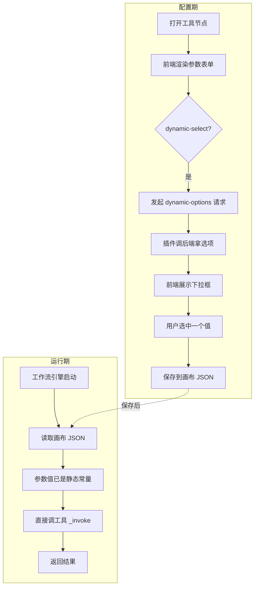
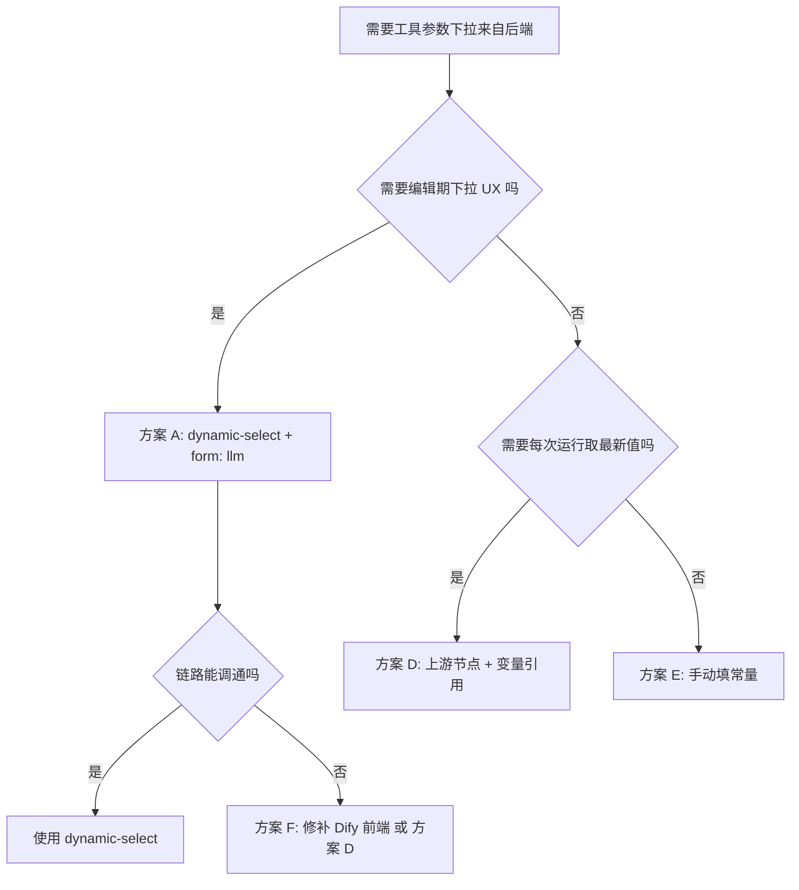

# Dify 参数 dynamic-select 深度分析：两条技术路线的可行性与运行机制全解

> **主题**：Dify 工作流工具插件的参数下拉选型——原生 `dynamic-select` 与自定义参数类型两条路线的可行性分析，以及配置期/运行期的完整运行机制。  
> **前置阅读**：  
> - [Dify 是否支持动态参数——从「设备下拉调后端」到源码级排查全记录](./20260603-2023-dify是否支持动态参数.md)  
> - [Dify 插件开发常见问题 FAQ](./20260603-1848-dify常见问题.md)  

**环境与版本锚点**

| 组件 | 版本 | 说明 |
|------|------|------|
| Dify 平台 | 1.12.1 | Helm 部署 |
| plugin-daemon | 0.5.3-local | K8s 自定义镜像 |
| Python SDK | dify_plugin 0.9.0 | 支持 dynamic-select |
| 插件包 | iot_device_http 0.0.2 | manifest minimum_dify_version 1.5.1 |
| Spring Boot | 3.2.5 端口 8080 | 本地模拟 3 台 IoT 设备 |

---

## 目录

1. [本文要回答的核心问题](#1-本文要回答的核心问题)
2. [两条技术路线概述](#2-两条技术路线概述)
3. [路线一：原生 dynamic-select 的完整分析](#3-路线一原生-dynamic-select-的完整分析)
4. [路线二：自定义参数类型的可行性分析](#4-路线二自定义参数类型的可行性分析)
5. [配置期与运行期的运行机制详解](#5-配置期与运行期的运行机制详解)
6. [方案对比与最终推荐](#6-方案对比与最终推荐)
7. [dynamic-select 的能力边界与变通方案](#7-dynamic-select-的能力边界与变通方案)
8. [实战排查手册](#8-实战排查手册)
9. [常见误解与纠正](#9-常见误解与纠正)
10. [总结](#10-总结)

---

## 1. 本文要回答的核心问题

在前一篇博客中，我们完整验证了 `dynamic-select` 在 Dify 工作流工具中的实现路径，定位了前端 `panel.tsx` 第二个 ToolForm 未传 provider 上下文的缺陷，并给出了 `form: llm` 规避方案。

本文在此基础上，进一步回答三个更深层次的问题：

**问题一**：`form: llm` 方案在我们的实际环境中是否一定能触发后端调用？

**问题二**：如果原生 `dynamic-select` 受限，能否自定义一种新的参数类型（如 `dynamic-select-api`），让前端识别并主动调用我们的接口？

**问题三**：下拉选择与运行流程的关系是什么？选择参数后保存画布，运行期是否会再次调用下拉接口？

这三个问题的答案，决定了我们在 Dify 平台上做动态参数时的技术选型与预期管理。

---

## 2. 两条技术路线概述

面对「工具参数下拉选项来自后端接口」这一需求，存在两条直觉上的技术路线：

| 路线 | 思路 | 改动范围 |
|------|------|----------|
| **路线一**：原生 `dynamic-select` | 使用 Dify SDK 已有的 `dynamic-select` 参数类型，Python 插件实现 `_fetch_parameter_options` 钩子 | 仅改插件（YAML + Python） |
| **路线二**：自定义参数类型 | 新定义一种类型如 `dynamic-select-api`，前端发现此类型后主动调用我们指定的接口，支持自定义参数与解析格式 | 需改 Dify 前端 + 后端 + 插件 |

下面逐条分析可行性。

---

## 3. 路线一：原生 dynamic-select 的完整分析

### 3.1 理论机制

Dify SDK `dify_plugin >= 0.9.0` 的 `ToolParameter.ToolParameterType` 枚举中包含 `DYNAMIC_SELECT`（YAML 里写作 `dynamic-select`）。

完整调用链为：

```
浏览器画布 → dify-web（useFetchDynamicOptions）
  → dify-api（PluginParameterService.get_dynamic_select_options）
    → plugin-daemon（dispatch dynamic_select/fetch_parameter_options）
      → Python 插件（_fetch_parameter_options）
        → Spring Boot（/api/dify-plugin/device-select-options）
```

### 3.2 form 字段的关键影响

Dify 工具参数有两类 form 分区：

- **`form: llm`**：出现在节点面板的「输入变量」区域，走第一个 ToolForm
- **`form: form`**：出现在节点面板的「设置」区域，走第二个 ToolForm

前一篇博客已定位：在 Dify 1.12.x 中，**第二个 ToolForm 未传 `currentProvider` 和 `currentTool` props**，导致 `form-input-item.tsx` 中的 `useEffect` 判断条件不满足，`useFetchDynamicOptions` 根本不会被调用。

因此理论上的规避方案是：**将 `dynamic-select` 参数设为 `form: llm`，让它出现在「输入变量」区域，走第一个 ToolForm。**

### 3.3 实际验证：form: llm 仍可能不调用后端

**然而在实际测试中，即使将参数设为 `form: llm`，仍存在不触发后端调用的情况。** 可能的原因包括：

| 可能原因 | 排查方式 |
|----------|----------|
| 插件版本未更新，daemon 缓存旧包 | 卸载后重新安装新版 `.difypkg` |
| SDK 补丁 `plugin_bootstrap.py` 未生效 | 检查 `main.py` 是否在 `Plugin` 初始化前调用 `apply_sdk_patches()` |
| 凭证中 `spring_service_url` 为 localhost | 插件容器内 localhost 指向 pod 自身，必须用局域网 IP |
| daemon 版本与 SDK 版本不匹配 | 确认 daemon 容器内 `dify_plugin` 版本 >= 0.9.0 |
| dify-api 未正确解密凭证传给 daemon | 查看 api 日志是否有凭证解密错误 |
| 前端组件挂载时序问题 | 某些版本需要切换 tab 或重新打开节点才能触发 `useEffect` |

**排查第一现场仍然是浏览器 Network**：过滤 `dynamic-options` 关键字。

- **无请求**：前端未触发，问题在 UI 层或参数 form 配置
- **有请求但 400**：api 或 daemon 层错误，看响应 body 中的 message
- **有请求且 200 但 options 空**：插件到 Spring 链路不通，看 daemon 日志和插件 stderr

### 3.4 原生 dynamic-select 的固有限制

即使配置正确、链路全通，原生 `dynamic-select` 也有以下**架构级限制**：

| 限制 | 原因 | 影响 |
|------|------|------|
| **无参数传递** | `_fetch_parameter_options` 签名只接收 `parameter: str`，无法从 UI 传入过滤条件 | 不能做搜索型下拉 |
| **无分页** | 返回类型为 `list[ParameterOption]`，一次性全量返回 | 数据量大时性能差 |
| **格式固定** | 必须返回 `[{value: str, label: I18nObject}]` | 后端接口必须适配此格式，不能直接用业务接口 |
| **触发时机不可控** | 由前端 `useEffect` 在组件挂载时触发，无法手动刷新 | 新增设备后需重新打开节点才能看到 |

### 3.5 小结

原生 `dynamic-select` 在**理论上可行**，但在 Dify 1.12.x 工作流 Tool 场景下，存在前端 bug 与多层链路依赖。即使 `form: llm` 也不是「一定能调后端」的银弹。更重要的是，它的无参数、无分页、固定格式的限制，使得在复杂业务场景下灵活性不足。

---

## 4. 路线二：自定义参数类型的可行性分析

### 4.1 思路

既然原生 `dynamic-select` 有诸多限制，一个自然的想法是：

> 能不能自定义一种新参数类型，比如叫 `dynamic-select-api`，前端发现这个类型后主动调用我们指定的接口，支持传参数、自定义解析格式、分页等？

### 4.2 结论：不可行，Dify 无法识别

**自定义参数类型在 Dify 当前架构下不可行**，原因涉及后端校验、前端渲染、以及扩展机制三个层面：

#### 4.2.1 后端校验：枚举白名单

Dify 后端的 `ToolParameter.ToolParameterType` 是一个**封闭枚举**，只包含以下值：

```
string, number, boolean, select, multi-select, secret-input, 
text, file, files, app-selector, dynamic-select
```

当插件 YAML 中出现未定义的类型（如 `dynamic-select-api`），在以下环节会失败：

1. **插件打包时**：`dify plugin package` 可能校验 YAML schema 并拒绝
2. **插件安装时**：dify-api 解析 manifest 中的参数 schema，未知类型会导致反序列化错误或安装失败
3. **即使绕过**：api 层 `PluginParameterService` 根据类型路由到不同处理逻辑，未知类型无对应 handler

#### 4.2.2 前端渲染：类型分发

Dify 前端 `form-input-item.tsx` 根据参数 `type` 决定渲染哪个组件：

```typescript
// 简化逻辑
switch (type) {
  case 'string': return <TextInput />
  case 'select': return <Select />
  case 'dynamic-select': return <DynamicSelect />
  // ...
  default: return null  // 或报错
}
```

自定义类型 `dynamic-select-api` 会命中 `default` 分支：
- 最好情况：该参数不渲染，节点面板上该字段空白
- 最坏情况：触发 JS 运行时错误，导致整个节点面板崩溃

#### 4.2.3 扩展机制：Dify 没有插件级 UI 扩展点

与 VS Code 的 `contributes.configuration` 或 Kubernetes 的 CRD 不同，Dify **没有**提供「自定义参数类型 + 自定义渲染器」的扩展机制。

- 参数类型集合由 Dify 源码硬编码
- 前端组件集合由 Dify 源码硬编码
- 没有任何 hook 或 plugin point 允许第三方注入新的参数类型

要支持自定义类型，**必须 fork 并修改 Dify 前端和后端源码**，代价极大且难以跟随官方升级。

### 4.3 即使 fork 了 Dify，还需解决什么

假设团队有能力 fork Dify 并自维护前端，实现 `dynamic-select-api` 需要改动：

| 层 | 改动 | 工作量 |
|----|------|--------|
| dify-web | 新增 `DynamicSelectApi` 组件，支持自定义 URL、参数模板、响应解析 | 中 |
| dify-web | 在 `form-input-item.tsx` 的 switch 中注册新类型 | 小 |
| dify-web | `use-config.ts` 参数分区逻辑适配新类型 | 小 |
| dify-api | `ToolParameterType` 枚举新增 `DYNAMIC_SELECT_API` | 小 |
| dify-api | `PluginParameterService` 新增路由处理 | 中 |
| 插件 SDK | Python 侧新增钩子签名，如 `_fetch_api_parameter_options` | 中 |
| 升级兼容 | 每次 Dify 发版需 merge 上游改动 | **持续成本** |

**总工作量不小，且持续维护成本高，不推荐。**

### 4.4 小结

自定义参数类型在当前 Dify 架构下**完全不可行**，除非 fork Dify 并持续维护。这不是技术能力问题，而是 Dify 的插件扩展模型决定的——参数类型是平台侧的封闭集合，不是插件侧的开放扩展点。

---

## 5. 配置期与运行期的运行机制详解

### 5.1 核心认知：两条完全独立的链路

**这是理解 dynamic-select 最关键的一点：配置期下拉和运行期执行是两条完全独立的数据链路。**



### 5.2 配置期数据流（编辑画布时）

用户在 Dify 画布上**打开**一个工具节点、**看到**下拉框、**选择**一个值的完整过程：

| 步骤 | 发生在哪里 | 做了什么 |
|------|-----------|----------|
| 1 | 浏览器 | 用户点击工具节点，前端渲染参数表单 |
| 2 | 浏览器 | `form-input-item.tsx` 的 `useEffect` 检测到 `dynamic-select` 类型 |
| 3 | 浏览器 | 发起 GET `/console/api/workspaces/current/plugin/parameters/dynamic-options` |
| 4 | dify-api | 解密租户凭证，获取 `spring_service_url` |
| 5 | dify-api | 通过 plugin-daemon 转发请求到插件进程 |
| 6 | plugin-daemon | 调用插件的 `fetch_parameter_options` dispatch |
| 7 | Python 插件 | 执行 `_fetch_parameter_options("device_id")` |
| 8 | Python 插件 | GET `http://{spring_url}/api/dify-plugin/device-select-options` |
| 9 | Spring Boot | 返回 `[{value, label}]` JSON 数组 |
| 10 | Python 插件 | 转换为 `ParameterOption` 列表返回 |
| 11 | 浏览器 | 收到 options，渲染下拉框 |
| 12 | 浏览器 | 用户选中 `device_001`，值保存在节点状态中 |
| 13 | 浏览器 | 用户点击保存画布，`device_001` 作为常量写入画布 JSON |

### 5.3 运行期数据流（执行工作流时）

用户点击「运行」后的过程：

| 步骤 | 发生在哪里 | 做了什么 |
|------|-----------|----------|
| 1 | 工作流引擎 | 解析画布 JSON，读取各节点参数 |
| 2 | 工作流引擎 | 工具节点的 `device_id` 值为 `"device_001"`（已保存的常量） |
| 3 | plugin-daemon | 调用插件的 `_invoke({"device_id": "device_001", ...})` |
| 4 | Python 插件 | 根据参数构造请求，GET `/api/devices/device_001/status` |
| 5 | Spring Boot | 返回设备状态 JSON |
| 6 | Python 插件 | 返回 `text_message` 和 `json_message` |

**关键：运行期完全不触发下拉接口。** 步骤 2 中的值是用户在配置期选择并保存的静态字符串，不是实时从后端拉取的。

### 5.4 这意味着什么

| 场景 | 行为 |
|------|------|
| 编辑时选了 `device_001` 并保存 | 运行期固定使用 `device_001`，**不会**再调下拉接口 |
| 保存后 Spring 新增了 `device_004` | 已保存的工作流仍用 `device_001`，**不受影响** |
| 重新打开节点编辑 | 前端**重新**调下拉接口，可以看到 `device_004` |
| 选了新值并重新保存 | 下次运行使用新值 |
| 不打开节点直接运行 | 永远用上次保存的值 |

**一句话总结**：下拉选择只是帮助用户在编辑期填写参数值，保存后值就固定了，不影响 Dify 的运行流程。运行期只认画布 JSON 里的静态值，完全不知道也不关心这个值当初是怎么来的。

### 5.5 与「变量引用」模式的对比

除了 `dynamic-select` 下拉，Dify 工作流还支持**变量引用**方式传递参数：

| 维度 | dynamic-select 下拉 | 变量引用 |
|------|---------------------|----------|
| 值来源 | 用户在编辑期从下拉框选择 | 上游节点的运行输出 |
| 保存时 | 值为常量字符串 | 值为变量引用表达式如 `["node_id", "field"]` |
| 运行期 | 直接使用常量 | 运行时动态解析上游输出 |
| 是否每次运行都最新 | **否**，用保存时的值 | **是**，每次运行取上游实时输出 |
| 需要下拉接口 | 是 | 否 |

**变量引用在运行期是真正动态的**——每次运行都会取上游节点的最新输出。如果你的需求是「每次运行都用最新的设备列表」，应该用变量引用而不是 `dynamic-select`。

---

## 6. 方案对比与最终推荐

### 6.1 全方案对比表

| 方案 | 可行性 | 改动范围 | 配置期下拉 | 运行期动态 | 推荐场景 |
|------|--------|----------|-----------|-----------|----------|
| A. 原生 `dynamic-select` + `form: llm` | 可行但受限 | 仅插件 | 是（需链路全通） | 否（保存即固定） | 设备数量少、不需搜索分页 |
| B. 原生 `dynamic-select` + `form: form` | 1.12 不推荐 | 仅插件 | **否**（前端 bug） | 否 | 不推荐 |
| C. 自定义参数类型 `dynamic-select-api` | **不可行** | 需 fork Dify | — | — | 不推荐 |
| D. 变量引用（上游输出传参） | 完全可行 | 仅工作流画布 | 否（无下拉 UI） | **是**（每次运行取最新） | 需要运行时动态值 |
| E. `form: llm` + 手动填常量 | 完全可行 | 无 | 否 | 否 | 参数值固定、不需要下拉 |
| F. 修补 Dify 前端 panel.tsx | 可行 | Dify 前端 | 是（form: form 也可用） | 否 | 自托管且能 build 前端 |

### 6.2 推荐策略

**生产环境推荐组合使用 A + D**：

1. **需要编辑期 UX 好的场景** → 方案 A：`dynamic-select` + `form: llm`，用户在画布上看到设备下拉
2. **需要每次运行都取最新值的场景** → 方案 D：用上游节点（如 `list_devices` 或 `generic_http`）调用接口，下游用变量引用
3. **兜底** → 方案 E：直接在参数框手填常量值

**不推荐方案 C**（自定义类型），因为需要 fork Dify 全栈，维护成本远超收益。

---

## 7. dynamic-select 的能力边界与变通方案

### 7.1 能力边界总结

| 能力 | 是否支持 | 说明 |
|------|----------|------|
| 无参数全量拉取 | 是 | `_fetch_parameter_options(parameter)` 只知参数名 |
| 带过滤条件拉取 | **否** | 无法从 UI 传入搜索关键字 |
| 分页拉取 | **否** | 一次性返回全量列表 |
| 自定义响应解析 | **否** | 必须返回 `[{value, label}]` |
| 手动刷新 | **否** | 由前端 `useEffect` 自动触发 |
| 多级联动 | **否** | 参数间无依赖关系传递 |
| 运行期动态 | **否** | 保存后值固定，运行期不调下拉接口 |

### 7.2 变通方案详解

#### 变通 1：后端做截断与排序

既然不能分页，就让后端返回「最有意义的 Top N」：

```java
@GetMapping("/api/dify-plugin/device-select-options")
public ResponseEntity<List<SelectOption>> listDeviceSelectOptions(
        @RequestParam(defaultValue = "50") int limit) {
    // 返回在线设备优先、最近活跃的排前面
    return ResponseEntity.ok(difyPluginSelectService.listTopDevices(limit));
}
```

#### 变通 2：环境变量做过滤

`_fetch_parameter_options` 虽然不能从 UI 拿参数，但可以读凭证和环境变量：

```python
def _fetch_parameter_options(self, parameter: str) -> list[ParameterOption]:
    # 从凭证读取过滤条件
    location_filter = self.runtime.credentials.get("location_filter", "")
    # 用过滤条件请求后端
    url = f"{spring_url}/api/dify-plugin/device-select-options?location={location_filter}"
    ...
```

适用于「按工作区过滤设备」等粗粒度场景。

#### 变通 3：上游节点 + 变量引用（最灵活）

```
[开始] → [generic_http: GET /api/devices] → [工具节点: device_id 引用上游输出] → [结束]
```

- 上游 `generic_http` 调用设备列表接口，返回 JSON
- 下游工具的 `device_id` 参数设为变量引用，指向上游输出的某个字段
- **每次运行都取最新列表**，无需 `dynamic-select` 机制
- 缺点：没有下拉 UX，用户需要在表达式编辑器中配置引用

#### 变通 4：代码节点做中间转换

```
[开始] → [generic_http: GET /api/devices] → [代码节点: 解析出设备ID列表] → [工具节点] → [结束]
```

代码节点可以从上游 JSON 中提取特定字段，转换为下游需要的格式，比纯变量引用更灵活。

---

## 8. 实战排查手册

### 8.1 第一步：确认问题属于哪条链路

| 用户描述 | 属于哪条链路 | 优先排查 |
|----------|-------------|----------|
| 「下拉框是空的」 | 配置期 | 浏览器 Network |
| 「选了设备但运行报错」 | 运行期 | 插件 stderr + Spring 日志 |
| 「保存后重新打开，下拉变了」 | 配置期（正常行为） | 无需排查 |
| 「运行结果和编辑时看到的不一样」 | 正常——运行用的是保存时的值 | 非 bug |

### 8.2 配置期排查流程

```
1. 浏览器 F12 → Network → 过滤 dynamic-options
   ├── 无请求 → 检查 form 字段（必须 llm）→ 检查插件版本 → 检查前端版本
   ├── 400 → 看 response body → 凭证问题 / daemon 问题
   └── 200 但 options 空 → 继续步骤 2

2. daemon 日志 → 搜索 fetch_parameter_options
   ├── 无日志 → api 未转发 → 检查 api 日志
   ├── Trigger provider not found → SDK 280 未补丁 → 检查 plugin_bootstrap
   └── 有日志 → 继续步骤 3

3. 插件 stderr → 搜索 _fetch_parameter_options
   ├── 无 called → 插件类未实例化 → 检查 provider yaml 注册
   ├── 有 called + 拉取失败 → Spring 地址不对 → 检查凭证
   └── 有 called + 0 options → Spring 返回空 → 检查 Spring 数据
```

### 8.3 运行期排查流程

```
1. 工作流运行日志 → 检查节点状态
   ├── 节点 succeeded 但输出不对 → 检查 Spring 接口返回
   ├── 节点 failed → 看错误信息
   └── 连接超时 → 凭证地址不可达

2. 插件 stderr → 搜索 _invoke
   ├── 参数值为空 → 画布保存时未填值
   └── 参数值正确 → Spring 请求详情
```

### 8.4 常用命令

```powershell
# 验证 Spring 下拉接口
curl.exe -s "http://127.0.0.1:8080/api/dify-plugin/device-select-options"

# 验证 Spring 设备列表接口
curl.exe -s "http://127.0.0.1:8080/api/devices"

# 检查 SDK 版本
pip show dify_plugin

# 打包插件
cd E:\Ideaproject\test-dify\plugin-iot-device-plugin
dify plugin package . -o iot_device_http.difypkg

# 检查 SDK 是否支持 dynamic-select
python -c "from dify_plugin.entities.tool import ToolParameter; print([x.name for x in ToolParameter.ToolParameterType])"
```

---

## 9. 常见误解与纠正

### 误解 1：「form: llm 就一定能触发后端调用」

**事实**：`form: llm` 只是让参数出现在「输入变量」区域、走第一个 ToolForm（有 provider 上下文的那个）。但如果插件版本过旧、SDK 补丁未生效、daemon 缓存旧包等原因存在，仍然不会调用后端。**Network 是唯一判据。**

### 误解 2：「自定义参数类型 Dify 能识别」

**事实**：Dify 的参数类型是封闭枚举，`dynamic-select-api` 这种自定义类型会导致 YAML 解析失败或前端渲染异常。没有插件级 UI 扩展点。

### 误解 3：「运行时会再次调用下拉接口获取最新值」

**事实**：运行时**完全不调用**下拉接口。画布保存后参数值是静态常量，运行期直接读取。如需每次运行取最新值，应使用变量引用模式。

### 误解 4：「Spring 接口返回了数据，Dify 就能自动显示下拉」

**事实**：Spring 与 Dify 之间隔着 Python 插件。必须经过 `_fetch_parameter_options` 钩子将 Spring 响应转换为 `ParameterOption` 格式。浏览器永远不会直接请求 Spring。

### 误解 5：「升级 Dify 版本就能解决所有 dynamic-select 问题」

**事实**：版本满足最低要求（1.5.1）只是前提。在 1.12.x 上仍存在前端 panel 缺陷。版本新不等于所有 UI 路径都已接好 `dynamic-select`。

### 误解 6：「安装插件时凭证校验通过，下拉就一定能用」

**事实**：凭证校验 `_validate_credentials` 只检查 URL 格式（是否以 http 开头），不会实际请求 Spring。安装成功与下拉可用之间没有因果关系。

### 误解 7：「Trigger 插件能用 dynamic-select，Tool 插件也一定能用」

**事实**：Trigger 和 Tool 在前端走不同的挂载组件。Trigger 使用 `useTriggerPluginDynamicOptions`，Tool 使用 `useFetchDynamicOptions`，后者在 1.12 的 panel 中有已知缺陷（Issue 36518）。

---

## 10. 总结

### 10.1 三条核心结论

**结论一**：原生 `dynamic-select` 是 Dify 目前唯一官方支持的动态参数机制，但它能力有限——无参数、无分页、固定格式、运行期不刷新。在 Dify 1.12.x 工作流 Tool 场景下，还需要 `form: llm` 和 SDK 补丁配合才能工作，且不保证所有版本都稳定。

**结论二**：自定义参数类型（如 `dynamic-select-api`）在 Dify 当前架构下**完全不可行**。参数类型是平台侧的封闭枚举，前端和后端都没有扩展点。除非 fork Dify 全栈并持续维护，否则不要走这条路。

**结论三**：下拉选择与运行流程完全解耦。下拉接口只在**编辑画布时**被调用，用户选中值并保存后，该值成为画布 JSON 中的静态常量。运行期只读取这个常量，**不会**再次调用下拉接口。如需运行期动态取值，应使用变量引用模式。

### 10.2 决策流程图



### 10.3 一句话总结

**Dify 的动态参数能力存在但受限：原生 `dynamic-select` 能做简单的编辑期下拉，自定义类型不可行，运行期永远是静态值。在灵活性不足时，变量引用是更可靠的替代方案。**

---

## 附录 A：关键文件清单

| 文件 | 路径 | 作用 |
|------|------|------|
| dynamic_device_query.yaml | `plugin-iot-device-plugin/tools/` | 动态参数工具定义 |
| dynamic_device_query.py | `plugin-iot-device-plugin/tools/` | `_fetch_parameter_options` 钩子实现 |
| plugin_bootstrap.py | `plugin-iot-device-plugin/` | SDK 280 补丁 |
| main.py | `plugin-iot-device-plugin/` | 插件入口，先 apply patches 再 Plugin.run |
| DifyPluginSelectController.java | `plugin-dify-iot-device/.../controller/` | Spring 下拉选项接口 |
| DifyPluginSelectService.java | `plugin-dify-iot-device/.../service/` | 从 DeviceService 生成 SelectOption |
| panel.tsx | `dify/web/app/components/workflow/nodes/tool/` | Dify 前端工具节点面板（已知缺陷） |
| form-input-item.tsx | `dify/web/app/components/workflow/nodes/tool/` | 参数渲染组件（dynamic-select 入口） |

## 附录 B：官方 Issue 与 PR 索引

| 编号 | 内容 | 对我们的意义 |
|------|------|--------------|
| dify PR 21425 | 引入 DYNAMIC_SELECT | 平台能力基础 |
| dify-plugin-sdks issue 280 | Tool 插件误查 Trigger | 必须 bootstrap 补丁 |
| dify issue 36518 | Tool form: form 下拉不触发 | 与 panel 分析一致 |
| dify PR 36743 | panel 第二个 ToolForm 传 provider | 自托管可跟进合并 |

## 附录 C：文档修订记录

| 日期 | 版本 | 说明 |
|------|------|------|
| 2026-06-04 | 1.0 | 首版：两条技术路线分析、运行机制详解、能力边界与变通方案 |

---

*文档版本：2026-06-04，对应插件 iot_device_http 0.0.2，Dify 1.12.1，dify_plugin SDK 0.9.0。*
