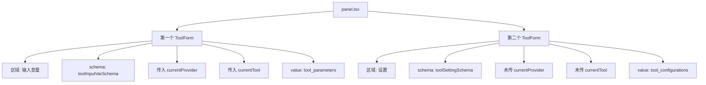
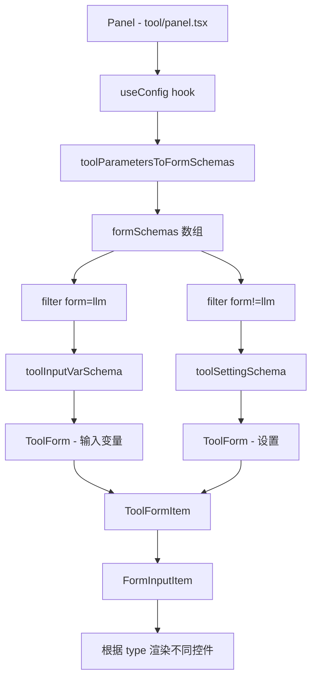
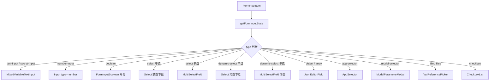
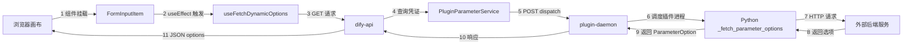
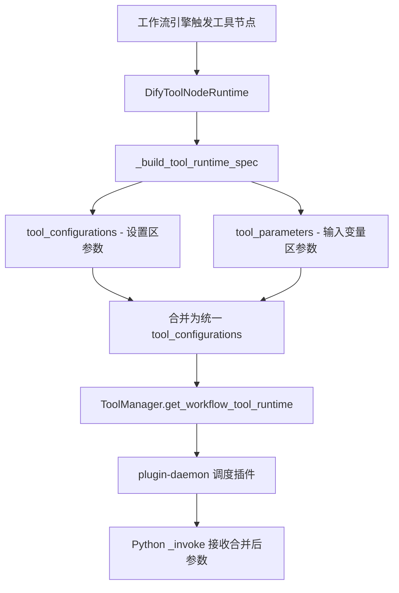
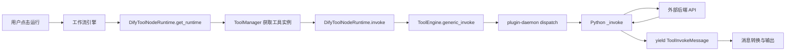
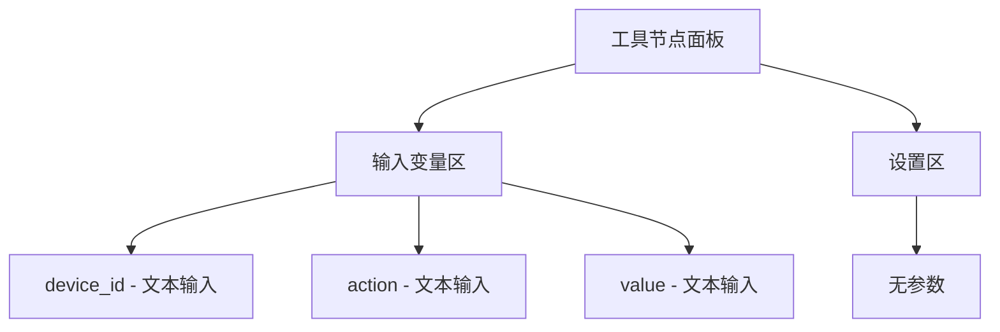
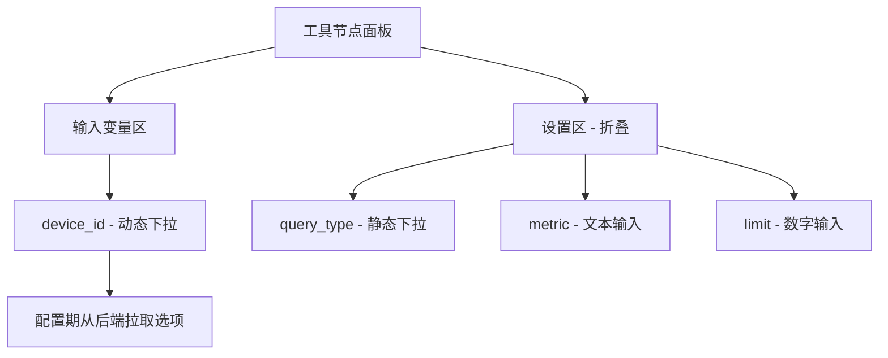
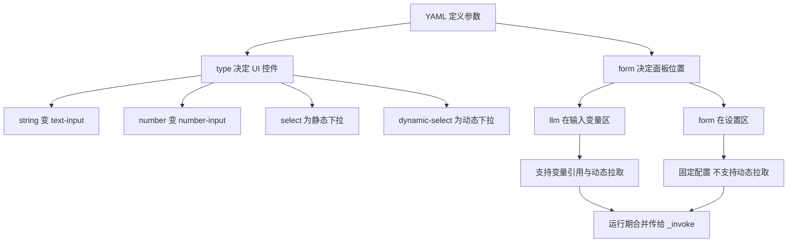

# Dify 选择工具时界面参数定义全解析 —— 类型、YAML、源码与运行流程

> **核心结论**：Dify 工作流工具节点的参数由 YAML 的 `type` 决定 UI 控件形态，由 `form` 决定参数出现在「输入变量」还是「设置」区域。后端在运行期将 `tool_parameters`（form llm）和 `tool_configurations`（form form）合并后统一传给插件的 `_invoke`。配置期的 `dynamic-select` 则走一条独立的拉取链路。
>
> **环境与版本锚点**：Dify 1.12.x，dify_plugin SDK 0.9.x，源码基于工作区 `dify/web` 和 `dify/api` 当前 main 分支。

---

## 目录

1. [参数类型总览](#1-参数类型总览)
2. [form 字段的作用与分区规则](#2-form-字段的作用与分区规则)
3. [前端渲染流程源码解析](#3-前端渲染流程源码解析)
4. [各类型参数的 YAML 写法与 UI 效果对照](#4-各类型参数的-yaml-写法与-ui-效果对照)
5. [配置期 dynamic-select 完整调用链](#5-配置期-dynamic-select-完整调用链)
6. [运行期参数合并与调用流程](#6-运行期参数合并与调用流程)
7. [后端参数类型校验源码](#7-后端参数类型校验源码)
8. [实战案例对照](#8-实战案例对照)
9. [排查速查表](#9-排查速查表)
10. [总结](#10-总结)

---

## 1. 参数类型总览

Dify 工具参数的 `type` 字段在后端 `CommonParameterType` 枚举中定义（`api/core/entities/parameter_entities.py`），前端通过 `toType()` 函数转换为 `FormTypeEnum`（`web/app/components/tools/utils/to-form-schema.ts`）。

### 1.1 后端枚举定义

```python
# api/core/entities/parameter_entities.py
class CommonParameterType(StrEnum):
    SECRET_INPUT = "secret-input"
    TEXT_INPUT = "text-input"
    SELECT = auto()          # 值为 "select"
    STRING = auto()          # 值为 "string"
    NUMBER = auto()          # 值为 "number"
    FILE = auto()
    FILES = auto()
    SYSTEM_FILES = "system-files"
    BOOLEAN = auto()
    APP_SELECTOR = "app-selector"
    MODEL_SELECTOR = "model-selector"
    TOOLS_SELECTOR = "array[tools]"
    CHECKBOX = "checkbox"
    ANY = auto()
    DYNAMIC_SELECT = "dynamic-select"
    ARRAY = auto()
    OBJECT = auto()
```

### 1.2 前端 FormTypeEnum 定义

```typescript
// web/app/components/header/account-setting/model-provider-page/declarations.ts
export enum FormTypeEnum {
  textInput     = 'text-input',
  textNumber    = 'number-input',
  secretInput   = 'secret-input',
  select        = 'select',
  radio         = 'radio',
  checkbox      = 'checkbox',
  boolean       = 'boolean',
  files         = 'files',
  file          = 'file',
  modelSelector = 'model-selector',
  toolSelector  = 'tool-selector',
  multiToolSelector = 'array[tools]',
  appSelector   = 'app-selector',
  any           = 'any',
  object        = 'object',
  array         = 'array',
  dynamicSelect = 'dynamic-select',
}
```

### 1.3 YAML type 到前端 FormTypeEnum 的映射

前端 `toType()` 函数（`web/app/components/tools/utils/to-form-schema.ts`）做如下转换：

```typescript
export const toType = (type: string) => {
  switch (type) {
    case 'string':  return 'text-input'
    case 'number':  return 'number-input'
    case 'boolean': return 'checkbox'
    default:        return type  // 其余类型保持原名
  }
}
```

**映射总表：**

| YAML `type` | 前端 `FormTypeEnum` | UI 控件 | 说明 |
|-------------|---------------------|---------|------|
| `string` | `text-input` | 文本输入框（支持变量插入与模板语法） | 最常用 |
| `number` | `number-input` | 数字输入框 | 支持 min/max |
| `boolean` | `checkbox` | 开关切换 | True/False |
| `select` | `select` | 静态下拉框 | 必须在 YAML 中定义 `options` |
| `dynamic-select` | `dynamic-select` | 动态下拉框 | 需 Python 实现 `_fetch_parameter_options` |
| `secret-input` | `secret-input` | 密码输入框 | 值被遮掩 |
| `file` | `file` | 单文件上传 | 变量引用模式 |
| `files` | `files` | 多文件上传 | 变量引用模式 |
| `app-selector` | `app-selector` | 应用选择器 | 选择 Dify 应用 |
| `model-selector` | `model-selector` | 模型选择器 | 选择 LLM 模型 |
| `object` | `object` | JSON 编辑器 | 结构化对象 |
| `array` | `array` | JSON 编辑器 | 数组类型 |
| `checkbox` | `checkbox` | 复选框列表 | 多选，需要 `options` |

---

## 2. form 字段的作用与分区规则

### 2.1 两种 form 值

每个参数还有一个关键字段 `form`，它决定参数在工具节点面板上的**位置**和**行为**：

| `form` 值 | 面板区域 | 存储字段 | 典型用途 |
|-----------|---------|---------|---------|
| `llm` | **输入变量**区（上方） | `tool_parameters` | 运行期可变参数，支持变量引用、LLM 推断 |
| `form` | **设置**区（下方折叠） | `tool_configurations` | 固定配置值，每次运行复用 |

### 2.2 前端分区逻辑

```typescript
// web/app/components/workflow/nodes/tool/hooks/use-config.ts
const formSchemas = toolParametersToFormSchemas(currTool.parameters)

// 输入变量区：form === 'llm'
const toolInputVarSchema = formSchemas.filter(item => item.form === 'llm')

// 设置区：form !== 'llm'
const toolSettingSchema = formSchemas.filter(item => item.form !== 'llm')
```

### 2.3 两个 ToolForm 的差异

`panel.tsx` 中渲染了两个 `ToolForm` 组件：



**关键差异**：第二个 ToolForm（设置区）**没有**传入 `currentProvider` 和 `currentTool`。这意味着设置区的 `dynamic-select` 参数**无法触发动态拉取**，因为 `form-input-item.tsx` 中需要这两个 props 才会发起请求。

### 2.4 经验规则

- 需要**动态下拉**的参数 → 必须 `form: llm`
- 需要**变量引用**的参数 → 必须 `form: llm`
- **静态配置**、固定选项 → 可以 `form: form`
- Agent 场景下 `form: llm` 的参数可由模型自动推断

---

## 3. 前端渲染流程源码解析

### 3.1 组件层级关系



### 3.2 从插件参数到表单 Schema 的转换

`toolParametersToFormSchemas()` 函数（`web/app/components/tools/utils/to-form-schema.ts`）将后端返回的 `ToolParameter[]` 转换为前端可用的 `ToolFormSchema[]`：

```typescript
export const toolParametersToFormSchemas = (parameters: ToolParameter[]) => {
  return parameters.map((parameter) => ({
    ...parameter,
    variable: parameter.name,           // name → variable
    type: toType(parameter.type),       // string → text-input
    _type: parameter.type,              // 保留原始类型
    show_on: [],
    options: parameter.options?.map(option => ({
      ...option,
      show_on: [],
    })),
    tooltip: parameter.human_description,
  }))
}
```

### 3.3 FormInputItem 的渲染决策树

`form-input-item.tsx` 中的 `getFormInputState()` 函数根据 `type` 决定渲染哪个控件：



### 3.4 dynamic-select 的触发条件

在 `form-input-item.tsx` 中，动态选项的拉取需要**三个条件同时满足**：

```typescript
useEffect(() => {
  const fetchPanelDynamicOptions = async () => {
    if (
      isDynamicSelect &&       // type === 'dynamic-select'
      currentTool &&           // ToolForm 必须传入 currentTool
      currentProvider &&       // ToolForm 必须传入 currentProvider
      (providerType === 'tool' || providerType === 'trigger')
    ) {
      const data = await fetchDynamicOptions()
      setToolsOptions(data?.options || [])
    }
  }
  fetchPanelDynamicOptions()
}, [isDynamicSelect, currentTool?.name, currentProvider?.name, ...])
```

- 如果参数在**设置区**（第二个 ToolForm），由于 `currentTool` 和 `currentProvider` 为 `undefined`，**不会触发拉取**。
- 这就是为什么 `dynamic-select` 必须搭配 `form: llm` 使用。

---

## 4. 各类型参数的 YAML 写法与 UI 效果对照

### 4.1 string — 文本输入

```yaml
- name: query_text
  type: string
  required: true
  form: llm
  label:
    zh_Hans: 查询文本
    en_US: Query Text
  human_description:
    zh_Hans: 请输入要查询的内容
    en_US: Enter the query text
  llm_description: "The text to query"
```

**UI**：带变量插入能力的文本输入框（MixedVariableTextInput），支持 `{{variable}}` 模板语法。

### 4.2 number — 数字输入

```yaml
- name: limit
  type: number
  required: false
  form: form
  default: 5
  min: 1
  max: 100
  label:
    zh_Hans: 记录条数
    en_US: Record Limit
```

**UI**：数字输入框，设置区展示。支持 min/max 范围约束。前端支持常量/变量切换。

### 4.3 boolean — 布尔开关

```yaml
- name: enable_cache
  type: boolean
  required: false
  form: form
  default: true
  label:
    zh_Hans: 启用缓存
    en_US: Enable Cache
```

**UI**：True/False 开关组件。

### 4.4 select — 静态下拉

```yaml
- name: query_type
  type: select
  required: true
  form: form
  default: status
  label:
    zh_Hans: 查询类型
    en_US: Query Type
  options:
    - value: detail
      label:
        zh_Hans: 设备详情
        en_US: Device Detail
    - value: status
      label:
        zh_Hans: 实时状态
        en_US: Real-time Status
    - value: data
      label:
        zh_Hans: 历史数据
        en_US: Historical Data
```

**UI**：下拉选择框，选项在 YAML 中写死。前端通过 `filterVisibleOptions` 支持 `show_on` 条件过滤。

### 4.5 dynamic-select — 动态下拉

```yaml
- name: device_id
  type: dynamic-select
  required: true
  form: llm
  label:
    zh_Hans: 设备
    en_US: Device
  human_description:
    zh_Hans: 从后端接口动态加载设备列表
    en_US: Device list loaded dynamically from backend API
  llm_description: "The device_id to query, selected from dynamic dropdown"
```

**UI**：下拉选择框，但选项**在配置期从后端动态拉取**。

**必须配套**：
1. `form: llm`（确保在输入变量区，否则前端不发起请求）
2. Python 中实现 `_fetch_parameter_options` 方法
3. 插件凭证正确且可达后端服务

### 4.6 secret-input — 密钥输入

```yaml
- name: api_key
  type: secret-input
  required: true
  form: form
  label:
    zh_Hans: API 密钥
    en_US: API Key
```

**UI**：密码遮掩输入框，值在界面不可见。

### 4.7 file / files — 文件上传

```yaml
- name: document
  type: file
  required: false
  form: llm
  label:
    zh_Hans: 上传文档
    en_US: Upload Document
```

**UI**：变量引用选择器（VarReferencePicker），引用上游节点输出的文件变量。

### 4.8 object / array — JSON 编辑

```yaml
- name: filter_config
  type: object
  required: false
  form: form
  label:
    zh_Hans: 过滤配置
    en_US: Filter Config
```

**UI**：JSON 编辑器，附带「JSON Schema」按钮可查看结构定义。

### 4.9 app-selector / model-selector

```yaml
- name: target_app
  type: app-selector
  required: false
  form: form
  scope: chat
  label:
    zh_Hans: 目标应用
    en_US: Target App
```

**UI**：弹出式应用/模型选择器。`scope` 可限制选择范围。

---

## 5. 配置期 dynamic-select 完整调用链

当用户在画布上打开工具节点、展开 `dynamic-select` 参数时，触发的完整链路如下：

### 5.1 全链路流程图



### 5.2 每一跳的源码对应

**第 1-2 跳：浏览器 → useFetchDynamicOptions**

```typescript
// web/service/use-plugins.ts
export const useFetchDynamicOptions = (
  plugin_id, provider, action, parameter, provider_type, extra
) => {
  return useMutation({
    mutationFn: () => get('/workspaces/current/plugin/parameters/dynamic-options', {
      params: { plugin_id, provider, action, parameter, provider_type, ...extra },
    }),
  })
}
```

**第 3-4 跳：dify-api 路由 → PluginParameterService**

```python
# api/controllers/console/workspace/plugin.py
@console_ns.route("/workspaces/current/plugin/parameters/dynamic-options")
class PluginFetchDynamicSelectOptionsApi(Resource):
    def get(self):
        args = ParserDynamicOptions.model_validate(request.args.to_dict())
        options = PluginParameterService.get_dynamic_select_options(
            tenant_id, user_id, args.plugin_id, args.provider,
            args.action, args.parameter, args.credential_id, args.provider_type,
        )
        return {"options": options}
```

**第 4-5 跳：PluginParameterService 查凭证 → DynamicSelectClient**

```python
# api/services/plugin/plugin_parameter_service.py
class PluginParameterService:
    @staticmethod
    def get_dynamic_select_options(tenant_id, user_id, plugin_id,
                                    provider, action, parameter, ...):
        # 1. 从数据库查询并解密凭证
        encrypter, _ = create_tool_provider_encrypter(tenant_id, controller)
        credentials = encrypter.decrypt(db_record.credentials)

        # 2. 通过 DynamicSelectClient 请求 daemon
        return DynamicSelectClient().fetch_dynamic_select_options(
            tenant_id, user_id, plugin_id, provider, action,
            credentials, credential_type, parameter,
        ).options
```

**第 5-6 跳：DynamicSelectClient → plugin-daemon**

```python
# api/core/plugin/impl/dynamic_select.py
class DynamicSelectClient(BasePluginClient):
    def fetch_dynamic_select_options(self, tenant_id, ...):
        response = self._request_with_plugin_daemon_response_stream(
            "POST",
            f"plugin/{tenant_id}/dispatch/dynamic_select/fetch_parameter_options",
            PluginDynamicSelectOptionsResponse,
            data={
                "user_id": user_id,
                "data": {
                    "provider": provider,
                    "credentials": credentials,
                    "provider_action": action,
                    "parameter": parameter,
                },
            },
        )
```

**第 6-8 跳：plugin-daemon → 插件 Python → 外部后端**

```python
# 插件 Python 代码中实现
class DynamicDeviceQueryTool(Tool):
    def _fetch_parameter_options(self, parameter: str) -> list[ParameterOption]:
        if parameter != "device_id":
            return []
        url = f"{spring_url}/api/dify-plugin/device-select-options"
        response = requests.get(url, headers=self._request_headers(), timeout=15)
        items = response.json()
        return [
            ParameterOption(
                value=item["value"],
                label=I18nObject(en_US=item["label"], zh_Hans=item["label"]),
            )
            for item in items
        ]
```

### 5.3 浏览器 Network 中看到的请求

```
GET /console/api/workspaces/current/plugin/parameters/dynamic-options
  ?plugin_id=xxx
  &provider=author/plugin_name
  &action=tool_name
  &parameter=device_id
  &provider_type=tool
```

**响应格式**：

```json
{
  "options": [
    {
      "value": "device_001",
      "label": { "en_US": "Living Room Sensor", "zh_Hans": "客厅传感器" }
    },
    {
      "value": "device_002",
      "label": { "en_US": "Bedroom Light", "zh_Hans": "卧室灯" }
    }
  ]
}
```

---

## 6. 运行期参数合并与调用流程

### 6.1 参数合并逻辑

运行期执行工作流时，`tool_parameters`（form llm）和 `tool_configurations`（form form）会被**合并**为统一的配置字典传给插件：

```python
# api/core/workflow/node_runtime.py - DifyToolNodeRuntime._build_tool_runtime_spec
tool_configurations = dict(node_data.tool_configurations)
tool_configurations.update(
    {name: tool_input.model_dump(mode="python")
     for name, tool_input in node_data.tool_parameters.items()}
)
```



### 6.2 运行期完整流程



### 6.3 插件 _invoke 接收的参数

无论参数来自 `form: llm` 还是 `form: form`，在 `_invoke` 中都通过 `tool_parameters` 字典统一获取：

```python
def _invoke(self, tool_parameters: dict[str, Any]):
    device_id = tool_parameters.get("device_id", "")     # 来自 form: llm
    query_type = tool_parameters.get("query_type", "")   # 来自 form: form
    limit = tool_parameters.get("limit", 5)              # 来自 form: form
```

### 6.4 后端参数值类型转换

在传给插件前，后端通过 `cast_parameter_value()` 函数对参数值做类型校正：

```python
# api/core/plugin/entities/parameters.py
def cast_parameter_value(typ, value):
    match typ.value:
        case PluginParameterType.STRING | PluginParameterType.SELECT | PluginParameterType.DYNAMIC_SELECT:
            return value if isinstance(value, str) else str(value)
        case PluginParameterType.BOOLEAN:
            # 支持 "true"/"yes"/"1" 等 YAML 布尔字符串
            ...
        case PluginParameterType.NUMBER:
            # 字符串自动转 int/float
            ...
        case PluginParameterType.FILE:
            # 确保单文件
            ...
        case PluginParameterType.FILES:
            # 确保为列表
            ...
```

---

## 7. 后端参数类型校验源码

### 7.1 静态 select 的选项校验

```python
# api/core/plugin/entities/parameters.py
def init_frontend_parameter(rule, type, value):
    parameter_value = value
    if not parameter_value and parameter_value != 0:
        parameter_value = rule.default
        if not parameter_value and rule.required:
            raise ValueError(f"tool parameter {rule.name} not found")

    if type == PluginParameterType.SELECT:
        options = [x.value for x in rule.options]
        if parameter_value is not None and parameter_value not in options:
            raise ValueError(f"tool parameter {rule.name} value not in options")

    return cast_parameter_value(type, parameter_value)
```

### 7.2 PluginParameter 模型

```python
# api/core/plugin/entities/parameters.py
class PluginParameter(BaseModel):
    name: str
    label: I18nObject
    placeholder: I18nObject | None = None
    scope: str | None = None
    required: bool = False
    default: Union[float, int, str, bool, list, dict] | None = None
    min: Union[float, int] | None = None
    max: Union[float, int] | None = None
    options: list[PluginParameterOption] = []
```

### 7.3 dynamic-select 选项实体

```python
class PluginParameterOption(BaseModel):
    value: str                          # 选项值
    label: I18nObject                   # 国际化标签
    icon: str | None = None             # 可选图标
```

---

## 8. 实战案例对照

### 8.1 案例一：control_device（纯 form llm）

所有参数都放在输入变量区，运行期可灵活传入：

```yaml
parameters:
  - name: device_id
    type: string
    required: true
    form: llm
  - name: action
    type: string
    required: true
    form: llm
  - name: value
    type: string
    required: false
    form: llm
```



**特点**：所有参数支持变量引用，可由上游节点输出填充。

### 8.2 案例二：dynamic_device_query（混合 form）

`device_id` 为 dynamic-select（输入变量区），其余为静态配置（设置区）：

```yaml
parameters:
  - name: device_id
    type: dynamic-select
    required: true
    form: llm
  - name: query_type
    type: select
    required: true
    form: form
    default: status
    options:
      - value: detail
        label:
          zh_Hans: 设备详情
      - value: status
        label:
          zh_Hans: 实时状态
      - value: data
        label:
          zh_Hans: 历史数据
  - name: metric
    type: string
    required: false
    form: form
    default: temperature
  - name: limit
    type: number
    required: false
    form: form
    default: 5
```



**Python 配套实现**：

```python
class DynamicDeviceQueryTool(Tool):
    def _fetch_parameter_options(self, parameter: str):
        if parameter != "device_id":
            return []
        # 请求外部后端获取设备列表
        response = requests.get(f"{spring_url}/api/dify-plugin/device-select-options")
        return [
            ParameterOption(
                value=item["value"],
                label=I18nObject(en_US=item["label"], zh_Hans=item["label"]),
            )
            for item in response.json()
        ]

    def _invoke(self, tool_parameters):
        device_id = tool_parameters.get("device_id")    # 来自输入变量
        query_type = tool_parameters.get("query_type")  # 来自设置
        # ...执行业务逻辑
```

### 8.3 案例三：纯 form form（全设置）

```yaml
parameters:
  - name: api_endpoint
    type: string
    required: true
    form: form
    default: /api/data
  - name: timeout
    type: number
    required: false
    form: form
    default: 30
```

所有参数在设置区，运行期值固定。适用于工具配置不变的场景。

---

## 9. 排查速查表

### 9.1 参数不显示或显示异常

| 现象 | 可能原因 | 解决方案 |
|------|---------|---------|
| dynamic-select 下拉为空 | form 设为 form 而非 llm | 改为 `form: llm` |
| dynamic-select 在设置区 | 第二个 ToolForm 无 provider | 改为 `form: llm` 或修补 panel.tsx |
| Network 无 dynamic-options | currentTool/currentProvider 为空 | 确认参数在输入变量区 |
| dynamic-options 返回 400 | 凭证缺失或 daemon 异常 | 检查凭证配置与 daemon 日志 |
| dynamic-options 返回空数组 | 插件连外部后端失败 | 检查凭证 URL 是否为局域网 IP |
| select 选项报错 | 值不在 options 列表中 | 检查 YAML options 与实际值 |

### 9.2 运行期参数问题

| 现象 | 可能原因 | 解决方案 |
|------|---------|---------|
| _invoke 收不到参数 | 前端未保存或参数名不匹配 | 检查 YAML name 与 Python get 键 |
| 参数类型错误 | 未做类型转换 | 后端 `cast_parameter_value` 自动处理 |
| 变量引用无效 | 引用了不存在的上游变量 | 检查变量选择器配置 |

### 9.3 各层级日志查看点

| 层级 | 关注内容 |
|------|---------|
| 浏览器 Network | 是否有 `dynamic-options` 请求及状态码 |
| dify-api 日志 | 400 plugin_error 或凭证解密失败 |
| plugin-daemon 日志 | `dispatch dynamic_select` 或 `Trigger provider not found` |
| 插件 stderr | `_fetch_parameter_options called` 与 HTTP 请求结果 |
| 外部后端日志 | 是否收到选项请求 |

---

## 10. 总结

### 10.1 核心要点速记



### 10.2 速查对照表

| 需求 | YAML type | form | 需要 Python 钩子 | 备注 |
|------|-----------|------|-----------------|------|
| 文本输入 | `string` | `llm` 或 `form` | 否 | 最通用 |
| 数字输入 | `number` | `llm` 或 `form` | 否 | 支持 min/max |
| 布尔开关 | `boolean` | `form` | 否 | True/False |
| 固定选项 | `select` | `llm` 或 `form` | 否 | YAML 写死 options |
| 动态选项 | `dynamic-select` | **必须 llm** | **是** | 需 `_fetch_parameter_options` |
| 密钥 | `secret-input` | `form` | 否 | 值遮掩 |
| 文件 | `file` / `files` | `llm` | 否 | 变量引用 |
| JSON | `object` / `array` | `form` | 否 | JSON 编辑器 |
| 应用选择 | `app-selector` | `form` | 否 | 弹出选择器 |
| 模型选择 | `model-selector` | `form` | 否 | 弹出选择器 |

### 10.3 三条铁律

1. **`type` 管形态，`form` 管位置**：type 决定渲染什么控件，form 决定参数放在哪个区域。
2. **dynamic-select 必须 form llm**：在 Dify 1.12 工作流 Tool 节点中，只有输入变量区的 ToolForm 才传入了 provider 上下文，设置区的第二个 ToolForm 未传。
3. **运行期参数会合并**：不管参数在哪个区域，运行期 `tool_parameters` 和 `tool_configurations` 会合并为统一字典传给插件 `_invoke`。

---

## 附录 A：关键源码文件索引

| 文件路径 | 作用 |
|---------|------|
| `api/core/entities/parameter_entities.py` | 后端参数类型枚举 `CommonParameterType` |
| `api/core/plugin/entities/parameters.py` | 参数模型 `PluginParameter`、值转换 `cast_parameter_value` |
| `api/services/plugin/plugin_parameter_service.py` | dynamic-select 服务层，查凭证调 daemon |
| `api/core/plugin/impl/dynamic_select.py` | `DynamicSelectClient` 与 daemon 通信 |
| `api/controllers/console/workspace/plugin.py` | dynamic-options API 路由 |
| `web/app/components/tools/utils/to-form-schema.ts` | `toolParametersToFormSchemas` 转换函数 |
| `web/app/components/tools/types.ts` | 前端 `ToolParameter` 类型定义 |
| `web/app/components/workflow/nodes/tool/panel.tsx` | 工具节点面板，双 ToolForm 渲染 |
| `web/app/components/workflow/nodes/tool/hooks/use-config.ts` | 参数分区逻辑 |
| `web/app/components/workflow/nodes/_base/components/form-input-item.tsx` | 表单项渲染，dynamic-select 触发 |
| `web/app/components/workflow/nodes/_base/components/form-input-item.helpers.ts` | `getFormInputState` 类型判断 |
| `web/service/use-plugins.ts` | `useFetchDynamicOptions` API 调用 |
| `api/core/workflow/node_runtime.py` | `DifyToolNodeRuntime` 运行期参数合并 |

## 附录 B：Mermaid 全链路总图

```mermaid
graph TB
    subgraph 配置期
        A1[打开工具节点] --> A2[useConfig 解析参数]
        A2 --> A3[form=llm 进输入变量区]
        A2 --> A4[form!=llm 进设置区]
        A3 --> A5[ToolForm 带 provider 上下文]
        A4 --> A6[ToolForm 无 provider 上下文]
        A5 --> A7[dynamic-select 触发拉取]
        A7 --> A8[GET dynamic-options API]
        A8 --> A9[PluginParameterService 查凭证]
        A9 --> A10[DynamicSelectClient POST daemon]
        A10 --> A11[插件 _fetch_parameter_options]
        A11 --> A12[外部后端返回选项]
        A12 --> A13[前端渲染下拉列表]
    end
    subgraph 运行期
        B1[点击运行] --> B2[工作流引擎]
        B2 --> B3[DifyToolNodeRuntime]
        B3 --> B4[合并 tool_parameters + tool_configurations]
        B4 --> B5[ToolManager 获取工具实例]
        B5 --> B6[plugin-daemon dispatch invoke]
        B6 --> B7[Python _invoke 执行]
        B7 --> B8[调用外部 API]
        B8 --> B9[yield 结果消息]
    end
```



---

*文档版本：2026-06-04，基于 Dify main 分支源码分析。*
