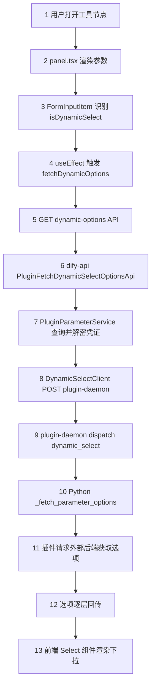
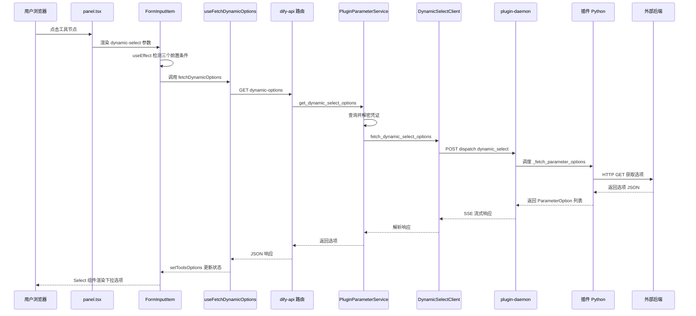
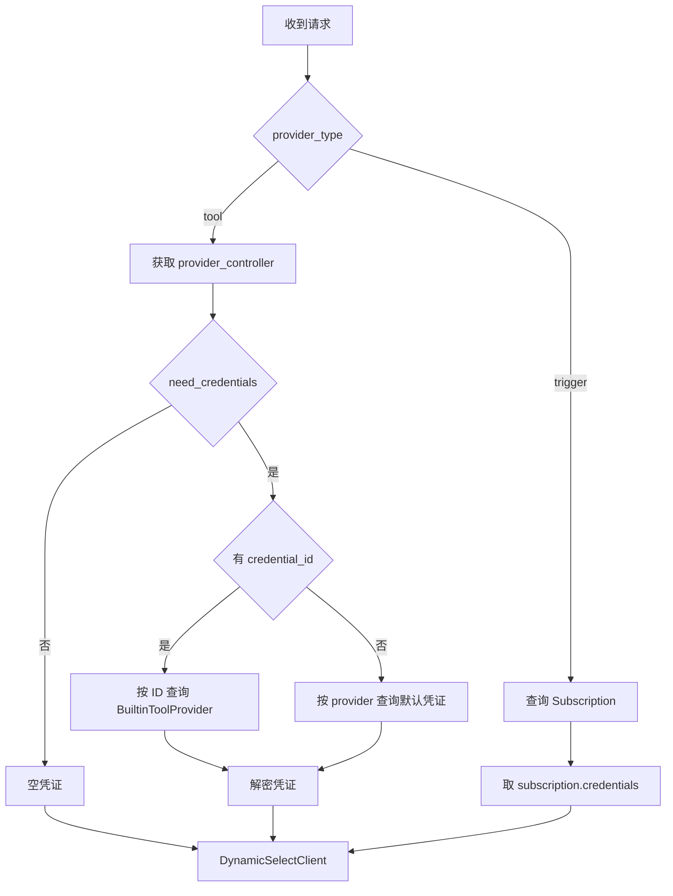
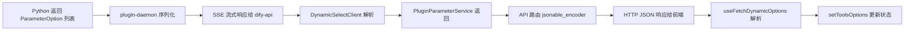
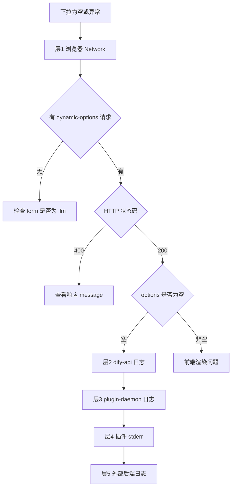

# Dify 工具节点 dynamic-select 参数源码深度分析

> **核心主题**：当用户在 Dify 工作流画布上选择一个工具节点时，`dynamic-select` 类型的参数如何从「前端触发下拉」到「插件 Python 拉取选项」再到「选项渲染回前端」，完整走过每一跳。
>
> **阅读前提**：本文假设你已了解 Dify 插件的基本概念（manifest、provider、tool YAML）以及工作流画布的基本使用。
>
> **版本锚点**：Dify 1.12.x / dify_plugin SDK 0.9.x / 源码基于 `dify/web` 与 `dify/api` 当前 main 分支。

---

## 目录

1. [dynamic-select 是什么](#1-dynamic-select-是什么)
2. [全链路总览图](#2-全链路总览图)
3. [第一跳：YAML 定义与插件声明](#3-第一跳yaml-定义与插件声明)
4. [第二跳：前端参数分区与 Schema 转换](#4-第二跳前端参数分区与-schema-转换)
5. [第三跳：FormInputItem 识别 dynamic-select](#5-第三跳forminputitem-识别-dynamic-select)
6. [第四跳：useEffect 触发动态拉取](#6-第四跳useeffect-触发动态拉取)
7. [第五跳：useFetchDynamicOptions 发出 HTTP 请求](#7-第五跳usefetcdynamicoptions-发出-http-请求)
8. [第六跳：dify-api 路由接收请求](#8-第六跳dify-api-路由接收请求)
9. [第七跳：PluginParameterService 查询凭证](#9-第七跳pluginparameterservice-查询凭证)
10. [第八跳：DynamicSelectClient 请求 plugin-daemon](#10-第八跳dynamicselectclient-请求-plugin-daemon)
11. [第九跳：plugin-daemon 调度插件进程](#11-第九跳plugin-daemon-调度插件进程)
12. [第十跳：Python _fetch_parameter_options 执行](#12-第十跳python-_fetch_parameter_options-执行)
13. [第十一下跳：选项逐层回传到前端](#13-第十一下跳选项逐层回传到前端)
14. [前端渲染动态选项](#14-前端渲染动态选项)
15. [Trigger 与 Tool 的差异路径](#15-trigger-与-tool-的差异路径)
16. [panel.tsx 双 ToolForm 缺陷分析](#16-paneltsx-双-toolform-缺陷分析)
17. [运行期 dynamic-select 参数的处理](#17-运行期-dynamic-select-参数的处理)
18. [错误处理与各层异常码](#18-错误处理与各层异常码)
19. [完整排查手册](#19-完整排查手册)
20. [实战案例：dynamic_device_query 全代码](#20-实战案例dynamic_device_query-全代码)
21. [总结与铁律](#21-总结与铁律)

---

## 1. dynamic-select 是什么

`dynamic-select` 是 Dify 插件 SDK 提供的一种参数类型，其下拉选项**不是**在 YAML 中写死，而是在**配置期**（用户打开工具节点时）由插件 Python 代码动态拉取。

**典型场景**：

- 从你的 Spring Boot 后端获取设备列表，作为下拉选项
- 从 Slack API 获取频道列表
- 从数据库获取租户下的项目列表

**与静态 select 的核心区别**：

| 维度 | `select` | `dynamic-select` |
|------|----------|------------------|
| 选项来源 | YAML 中写死的 `options` | Python `_fetch_parameter_options` 运行期返回 |
| 何时获取 | 加载 YAML 即确定 | 用户打开节点时前端发起请求 |
| 是否需要 Python 钩子 | 否 | 是 |
| 是否依赖凭证 | 否 | 是（需要凭证访问外部服务） |
| 后端枚举 | `CommonParameterType.SELECT` | `CommonParameterType.DYNAMIC_SELECT` |
| 前端枚举 | `FormTypeEnum.select` | `FormTypeEnum.dynamicSelect` |

**后端枚举定义**（`api/core/entities/parameter_entities.py`）：

```python
class CommonParameterType(StrEnum):
    # ...
    DYNAMIC_SELECT = "dynamic-select"
    # Dynamic select parameter
    # Once you are not sure about the available options until authorization is done
    # eg: Select a Slack channel from a Slack workspace
```

---

## 2. 全链路总览图

用户打开工具节点、展开 `dynamic-select` 参数时，完整的 11 跳数据流如下：



每一跳都有独立的源码文件、独立的日志观测点、独立的失败模式。下面逐跳展开。

### 2.1 时序图

以下时序图展示了配置期用户打开工具节点时 dynamic-select 的完整交互流程：



---

## 3. 第一跳：YAML 定义与插件声明

### 3.1 工具 YAML 中的 dynamic-select 参数

```yaml
parameters:
  - name: device_id
    type: dynamic-select
    required: true
    form: llm
    label:
      zh_Hans: 设备
      en_US: Device
    human_description:
      zh_Hans: 从后端接口动态加载设备列表
      en_US: Device list loaded dynamically from backend API
    llm_description: "The device_id to query"
```

**关键字段说明**：

| 字段 | 必须 | 说明 |
|------|------|------|
| `type` | 是 | 必须为 `dynamic-select` |
| `form` | 是 | **必须为 `llm`**（详见第 16 节 panel 缺陷分析） |
| `required` | 是 | 是否必填 |
| `label` | 是 | 国际化标签 |
| `human_description` | 推荐 | 用户可见的描述 |
| `llm_description` | 推荐 | LLM 推断时的描述 |
| `options` | **否** | dynamic-select **不需要**在 YAML 中定义 options |

### 3.2 Python 工具类声明

```python
from dify_plugin import Tool
from dify_plugin.entities import I18nObject, ParameterOption

class MyTool(Tool):
    def _fetch_parameter_options(self, parameter: str) -> list[ParameterOption]:
        """配置期被调用，返回动态选项列表"""
        ...

    def _invoke(self, tool_parameters: dict[str, Any]):
        """运行期被调用，执行实际业务"""
        ...
```

**`ParameterOption` 的数据模型**（`api/core/plugin/entities/parameters.py`）：

```python
class PluginParameterOption(BaseModel):
    value: str              # 选项的实际值
    label: I18nObject       # 国际化标签（含 en_US、zh_Hans 等）
    icon: str | None = None # 可选图标（URL 或 base64）
```

---

## 4. 第二跳：前端参数分区与 Schema 转换

### 4.1 toolParametersToFormSchemas 转换

当用户点击工具节点时，`useConfig` hook 从 `currTool.parameters` 获取参数定义并转换：

```typescript
// web/app/components/tools/utils/to-form-schema.ts
export const toolParametersToFormSchemas = (parameters: ToolParameter[]) => {
  return parameters.map((parameter) => ({
    ...parameter,
    variable: parameter.name,           // name 映射为 variable
    type: toType(parameter.type),       // "dynamic-select" 保持不变
    _type: parameter.type,              // 保留原始类型
    show_on: [],
    options: parameter.options?.map(option => ({ ...option, show_on: [] })),
    tooltip: parameter.human_description,
  }))
}
```

`toType()` 函数对 `dynamic-select` 不做转换（直接 return），因为 `dynamic-select` 在前后端的字符串表示一致。

### 4.2 form 字段分区

```typescript
// web/app/components/workflow/nodes/tool/hooks/use-config.ts
const formSchemas = toolParametersToFormSchemas(currTool.parameters)

// form === 'llm' 的参数进入「输入变量区」
const toolInputVarSchema = formSchemas.filter(item => item.form === 'llm')

// form !== 'llm' 的参数进入「设置区」
const toolSettingSchema = formSchemas.filter(item => item.form !== 'llm')
```

**dynamic-select 必须进入 `toolInputVarSchema`**，否则后续无法触发动态拉取。这就是为什么 YAML 中 `form: llm` 是必须的。

---

## 5. 第三跳：FormInputItem 识别 dynamic-select

### 5.1 panel.tsx 中的双 ToolForm

```tsx
// web/app/components/workflow/nodes/tool/panel.tsx

// 第一个 ToolForm — 输入变量区
<ToolForm
  schema={toolInputVarSchema}
  value={inputs.tool_parameters}
  onChange={setInputVar}
  currentProvider={currCollection}   // 关键：传入 provider
  currentTool={currTool}             // 关键：传入 tool
/>

// 第二个 ToolForm — 设置区
<ToolForm
  schema={toolSettingSchema}
  value={toolSettingValue}
  onChange={setToolSettingValue}
  // 注意：没有 currentProvider 和 currentTool
/>
```

### 5.2 ToolForm 遍历 Schema

```tsx
// web/app/components/workflow/nodes/tool/components/tool-form/index.tsx
const ToolForm = ({ schema, currentTool, currentProvider, ... }) => (
  <div className="space-y-1">
    {schema.map((schema, index) => (
      <ToolFormItem
        key={index}
        schema={schema}
        currentTool={currentTool}
        currentProvider={currentProvider}
        providerType="tool"
        ...
      />
    ))}
  </div>
)
```

### 5.3 ToolFormItem 委托给 FormInputItem

```tsx
// web/app/components/workflow/nodes/tool/components/tool-form/item.tsx
const ToolFormItem = ({ schema, currentTool, currentProvider, ... }) => {
  return (
    <div>
      <div>{/* 标签、必填星号、tooltip */}</div>
      <FormInputItem
        schema={schema}
        currentTool={currentTool}
        currentProvider={currentProvider}
        providerType={providerType}
        ...
      />
    </div>
  )
}
```

---

## 6. 第四跳：useEffect 触发动态拉取

### 6.1 getFormInputState 判断 isDynamicSelect

```typescript
// web/app/components/workflow/nodes/_base/components/form-input-item.helpers.ts
export const getFormInputState = (schema, varInput) => {
  const { type, variable, multiple = false, options = [] } = schema

  const isDynamicSelect = type === FormTypeEnum.dynamicSelect  // "dynamic-select"
  const isMultipleSelect = multiple && (isSelect || isDynamicSelect)

  // dynamic-select 强制为 constant 模式（不支持变量引用切换）
  const showTypeSwitch = isNumber || isBoolean || isObject || isArray || isSelect
  // 注意：isDynamicSelect 不在 showTypeSwitch 中

  return { isDynamicSelect, isMultipleSelect, ... }
}
```

### 6.2 useEffect 的三个前置条件

```typescript
// web/app/components/workflow/nodes/_base/components/form-input-item.tsx
useEffect(() => {
  const fetchPanelDynamicOptions = async () => {
    if (
      isDynamicSelect &&       // 条件1：type 是 dynamic-select
      currentTool &&           // 条件2：ToolForm 传入了 currentTool
      currentProvider &&       // 条件3：ToolForm 传入了 currentProvider
      (providerType === PluginCategoryEnum.tool || providerType === PluginCategoryEnum.trigger)
    ) {
      setIsLoadingToolsOptions(true)
      try {
        const data = await fetchDynamicOptions()
        setToolsOptions(data?.options || [])
      } catch (error) {
        console.error('Failed to fetch dynamic options:', error)
        setToolsOptions([])
      } finally {
        setIsLoadingToolsOptions(false)
      }
    }
  }
  fetchPanelDynamicOptions()
}, [
  isDynamicSelect,
  currentTool?.name,
  currentProvider?.name,
  variable,
  extraParams,
  providerType,
  fetchDynamicOptions,
])
```

**三个条件缺一不可**：

| 条件 | 来源 | 缺失时的现象 |
|------|------|------------|
| `isDynamicSelect` | schema.type === 'dynamic-select' | 不触发，参数按其他类型渲染 |
| `currentTool` | ToolForm 的 `currentTool` prop | 不触发，设置区缺失此 prop |
| `currentProvider` | ToolForm 的 `currentProvider` prop | 不触发，设置区缺失此 prop |

**这就是 `dynamic-select` 必须 `form: llm` 的根因**：只有第一个 ToolForm（输入变量区）才传入了 `currentTool` 和 `currentProvider`。

---

## 7. 第五跳：useFetchDynamicOptions 发出 HTTP 请求

### 7.1 Hook 定义

```typescript
// web/service/use-plugins.ts
export const useFetchDynamicOptions = (
  plugin_id: string,
  provider: string,
  action: string,
  parameter: string,
  provider_type?: string,
  extra?: Record<string, any>
) => {
  return useMutation({
    mutationFn: () => get<{ options: FormOption[] }>(
      '/workspaces/current/plugin/parameters/dynamic-options',
      {
        params: {
          plugin_id,
          provider,
          action,
          parameter,
          provider_type,
          ...extra,
        },
      }
    ),
  })
}
```

### 7.2 实际发出的 HTTP 请求

```
GET /console/api/workspaces/current/plugin/parameters/dynamic-options
  ?plugin_id=xxxxxxxx
  &provider=author/plugin_name
  &action=dynamic_device_query
  &parameter=device_id
  &provider_type=tool
```

**参数来源对应表**：

| 请求参数 | 来源 |
|---------|------|
| `plugin_id` | `currentProvider.plugin_id` |
| `provider` | `currentProvider.name` |
| `action` | `currentTool.name`（工具名称） |
| `parameter` | `variable`（参数名，如 `device_id`） |
| `provider_type` | `"tool"`（由 ToolForm 硬编码） |

### 7.3 Hook 初始化参数

```typescript
// form-input-item.tsx 中
const { mutateAsync: fetchDynamicOptions } = useFetchDynamicOptions(
  currentProvider?.plugin_id || '',    // plugin_id
  currentProvider?.name || '',         // provider
  currentTool?.name || '',             // action（工具名）
  variable || '',                      // parameter（参数名）
  providerType,                        // provider_type
  extraParams,                         // 额外参数
)
```

---

## 8. 第六跳：dify-api 路由接收请求

### 8.1 路由定义

```python
# api/controllers/console/workspace/plugin.py

@console_ns.route("/workspaces/current/plugin/parameters/dynamic-options")
class PluginFetchDynamicSelectOptionsApi(Resource):
    @setup_required
    @login_required
    @is_admin_or_owner_required
    @account_initialization_required
    def get(self):
        current_user, tenant_id = current_account_with_tenant()
        user_id = current_user.id

        args = ParserDynamicOptions.model_validate(request.args.to_dict(flat=True))

        try:
            options = PluginParameterService.get_dynamic_select_options(
                tenant_id=tenant_id,
                user_id=user_id,
                plugin_id=args.plugin_id,
                provider=args.provider,
                action=args.action,
                parameter=args.parameter,
                credential_id=args.credential_id,
                provider_type=args.provider_type,
            )
        except PluginDaemonClientSideError as e:
            return {"code": "plugin_error", "message": e.description}, 400

        return jsonable_encoder({"options": options})
```

### 8.2 请求参数校验模型

```python
# api/controllers/console/workspace/plugin.py
class ParserDynamicOptions(BaseModel):
    plugin_id: str
    provider: str
    action: str
    parameter: str
    credential_id: str | None = None
    provider_type: Literal["tool", "trigger"]
```

### 8.3 安全守卫

路由上挂载了四个装饰器：

| 装饰器 | 作用 |
|--------|------|
| `@setup_required` | Dify 必须完成初始化 |
| `@login_required` | 用户必须登录 |
| `@is_admin_or_owner_required` | 必须是管理员或 Owner |
| `@account_initialization_required` | 账户必须完成初始化 |

---

## 9. 第七跳：PluginParameterService 查询凭证

### 9.1 完整源码

```python
# api/services/plugin/plugin_parameter_service.py
class PluginParameterService:
    @staticmethod
    def get_dynamic_select_options(
        tenant_id, user_id, plugin_id, provider, action,
        parameter, credential_id, provider_type,
    ) -> Sequence[PluginParameterOption]:

        credentials = {}
        credential_type = CredentialType.UNAUTHORIZED.value

        match provider_type:
            case "tool":
                # 1. 获取 provider controller
                provider_controller = ToolManager.get_builtin_provider(provider, tenant_id)

                # 2. 创建加密器
                encrypter, _ = create_tool_provider_encrypter(
                    tenant_id=tenant_id,
                    controller=provider_controller,
                )

                # 3. 检查是否需要凭证
                if not provider_controller.need_credentials:
                    credentials = {}
                else:
                    # 4. 从数据库查询凭证记录
                    with Session(db.engine) as session:
                        if credential_id:
                            db_record = session.scalar(
                                select(BuiltinToolProvider)
                                .where(
                                    BuiltinToolProvider.tenant_id == tenant_id,
                                    BuiltinToolProvider.provider == provider,
                                    BuiltinToolProvider.id == credential_id,
                                ).limit(1)
                            )
                        else:
                            db_record = session.scalar(
                                select(BuiltinToolProvider)
                                .where(
                                    BuiltinToolProvider.tenant_id == tenant_id,
                                    BuiltinToolProvider.provider == provider,
                                )
                                .order_by(
                                    BuiltinToolProvider.is_default.desc(),
                                    BuiltinToolProvider.created_at.asc(),
                                ).limit(1)
                            )

                    if db_record is None:
                        raise ValueError(
                            f"Builtin provider {provider} not found"
                        )

                    # 5. 解密凭证
                    credentials = encrypter.decrypt(db_record.credentials)
                    credential_type = db_record.credential_type

        # 6. 调用 DynamicSelectClient
        return (
            DynamicSelectClient()
            .fetch_dynamic_select_options(
                tenant_id, user_id, plugin_id, provider,
                action, credentials, credential_type, parameter,
            )
            .options
        )
```

### 9.2 凭证查询策略



**关键点**：

- 如果传了 `credential_id`，精确查询该凭证记录
- 如果没传 `credential_id`，查询该 provider 下的默认凭证（按 `is_default` 降序、`created_at` 升序取第一条）
- 凭证在数据库中是加密存储的，必须通过 `encrypter.decrypt()` 解密后才能传给插件

---

## 10. 第八跳：DynamicSelectClient 请求 plugin-daemon

### 10.1 完整源码

```python
# api/core/plugin/impl/dynamic_select.py
class DynamicSelectClient(BasePluginClient):
    def fetch_dynamic_select_options(
        self,
        tenant_id: str,
        user_id: str,
        plugin_id: str,
        provider: str,
        action: str,
        credentials: Mapping[str, Any],
        credential_type: str,
        parameter: str,
    ) -> PluginDynamicSelectOptionsResponse:

        response = self._request_with_plugin_daemon_response_stream(
            "POST",
            f"plugin/{tenant_id}/dispatch/dynamic_select/fetch_parameter_options",
            PluginDynamicSelectOptionsResponse,
            data={
                "user_id": user_id,
                "data": {
                    "provider": GenericProviderID(provider).provider_name,
                    "credentials": credentials,
                    "credential_type": credential_type,
                    "provider_action": action,
                    "parameter": parameter,
                },
            },
            headers={
                "X-Plugin-ID": plugin_id,
                "Content-Type": "application/json",
            },
        )

        for options in response:
            return options

        raise ValueError(
            f"Plugin service returned no options for parameter '{parameter}'"
        )
```

### 10.2 请求细节

| 项 | 值 |
|----|-----|
| HTTP 方法 | POST |
| 目标 URL | `PLUGIN_DAEMON_URL/plugin/{tenant_id}/dispatch/dynamic_select/fetch_parameter_options` |
| Content-Type | application/json |
| 认证 Header | `X-Api-Key`（由 BasePluginClient 自动注入） |
| 插件标识 | `X-Plugin-ID` header |
| 请求体 | `{user_id, data: {provider, credentials, credential_type, provider_action, parameter}}` |

### 10.3 响应模型

```python
# api/core/plugin/entities/plugin_daemon.py
class PluginDynamicSelectOptionsResponse(BaseModel):
    options: Sequence[PluginParameterOption]
```

### 10.4 BasePluginClient 的流式请求机制

```python
# api/core/plugin/impl/base.py
def _request_with_plugin_daemon_response_stream(self, method, path, type_, ...):
    for line in self._stream_request(method, path, params, headers, data, files):
        rep = PluginDaemonBasicResponse[type_].model_validate_json(line)

        if rep.code != 0:
            if rep.code == -500:
                error = PluginDaemonError.model_validate(json.loads(rep.message))
                self._handle_plugin_daemon_error(error.error_type, error.message)
            raise ValueError(f"plugin daemon: {rep.message}, code: {rep.code}")

        yield rep.data
```

**特点**：使用 SSE 流式请求，逐行解析响应。对于 `fetch_parameter_options`，通常只有一行响应。

---

## 11. 第九跳：plugin-daemon 调度插件进程

plugin-daemon 是一个 Go 语言编写的中间层服务。收到 `dispatch/dynamic_select/fetch_parameter_options` 请求后：

1. **查找插件进程**：根据 `X-Plugin-ID` 和 `tenant_id` 找到对应的插件运行实例
2. **注入凭证**：将解密后的 `credentials` 注入到插件运行时上下文
3. **dispatch 调用**：向插件进程发送 `fetch_parameter_options` 指令，附带 `provider_action`（工具名）和 `parameter`（参数名）
4. **等待响应**：收集插件返回的 `PluginParameterOption[]` 并通过 SSE 流回传给 dify-api

**daemon 侧的日志关键字**：

```
dispatch dynamic_select
fetch_parameter_options
Trigger provider not found   # 如果出现此行，说明 SDK 280 bug 未修补
```

---

## 12. 第十跳：Python _fetch_parameter_options 执行

### 12.1 插件 SDK 的调度

plugin-daemon 通过 SDK 框架调用工具类的 `_fetch_parameter_options` 方法。

**插件侧实现示例**：

```python
import sys
import requests
from dify_plugin import Tool
from dify_plugin.entities import I18nObject, ParameterOption

class DynamicDeviceQueryTool(Tool):
    def _fetch_parameter_options(self, parameter: str) -> list[ParameterOption]:
        print(
            f"[dynamic_device_query] _fetch_parameter_options called: parameter={parameter}",
            flush=True, file=sys.stderr,
        )

        if parameter != "device_id":
            return []

        spring_url = self.runtime.credentials.get("spring_service_url", "").rstrip("/")
        if not spring_url:
            return []

        url = f"{spring_url}/api/dify-plugin/device-select-options"
        try:
            response = requests.get(url, timeout=15)
            response.raise_for_status()
            items = response.json()
        except Exception as e:
            print(f"[dynamic_device_query] 拉取失败: {e}", flush=True, file=sys.stderr)
            return []

        return [
            ParameterOption(
                value=str(item["value"]),
                label=I18nObject(en_US=item["label"], zh_Hans=item["label"]),
            )
            for item in items
            if item.get("value")
        ]
```

### 12.2 关键约束

| 约束 | 说明 |
|------|------|
| 方法名 | 必须是 `_fetch_parameter_options` |
| 参数 | 接收 `parameter: str`，即参数名 |
| 返回值 | `list[ParameterOption]` |
| 凭证访问 | 通过 `self.runtime.credentials` 获取 |
| 超时 | 建议不超过 15 秒（前端有超时控制） |
| 异常处理 | 应捕获异常并返回空列表，避免整个链路崩溃 |

### 12.3 SDK 280 Bug 与补丁

dify_plugin SDK 0.9.x 存在一个已知 bug（[Issue 280](https://github.com/langgenius/dify-plugin-sdks/issues/280)）：纯 Tool 插件在拉取 dynamic-select 时，SDK 会先尝试查找 Trigger provider，找不到就抛 `ValueError`，导致永远不会执行 `_fetch_parameter_options`。

**补丁方案**（`plugin_bootstrap.py`）：

```python
from dify_plugin.core.trigger_factory import TriggerFactory

_original = TriggerFactory.get_trigger_event_handler_safely

def _safe_get(self, provider_name, event, runtime):
    try:
        return _original(self, provider_name, event, runtime)
    except ValueError:
        return None

def apply_sdk_patches():
    TriggerFactory.get_trigger_event_handler_safely = _safe_get
```

**必须在 `main.py` 最前面调用**：

```python
from plugin_bootstrap import apply_sdk_patches
apply_sdk_patches()

from dify_plugin import Plugin, DifyPluginEnv
plugin = Plugin(DifyPluginEnv())
plugin.run()
```

---

## 13. 第十一下跳：选项逐层回传到前端

### 13.1 回传路径



### 13.2 API 返回给前端的 JSON 格式

```json
{
  "options": [
    {
      "value": "device_001",
      "label": {
        "en_US": "Living Room Sensor (device_001)",
        "zh_Hans": "客厅传感器 (device_001)"
      },
      "icon": null
    },
    {
      "value": "device_002",
      "label": {
        "en_US": "Bedroom Light (device_002)",
        "zh_Hans": "卧室灯 (device_002)"
      },
      "icon": null
    }
  ]
}
```

---

## 14. 前端渲染动态选项

### 14.1 选项数据处理链

```typescript
// form-input-item.tsx 中

// 1. 合并动态选项（优先使用远程拉取的选项）
const visibleDynamicOptions = useMemo(
  () => filterVisibleOptions(dynamicOptions || options || [], value),
  [dynamicOptions, options, value],
)

// 2. 映射为 Select 组件需要的格式
const dynamicSelectItems = useMemo(
  () => mapSelectItems(visibleDynamicOptions, language),
  [language, visibleDynamicOptions],
)

// 3. 查找当前选中项
const selectedDynamicOption = dynamicSelectItems.find(
  item => item.value === (varInput?.value as string | undefined)
) ?? null
```

### 14.2 Select 组件渲染

```tsx
// form-input-item.tsx 中 — 单选模式
{isDynamicSelect && !isMultipleSelect && (
  <Select
    value={selectedDynamicOption?.value ?? null}
    disabled={readOnly || isLoadingOptions}
    onValueChange={value => value && handleValueChange(value)}
  >
    <SelectTrigger className="h-8 grow">
      {selectedDynamicOption?.name
        ?? (isLoadingOptions ? 'Loading...' : (placeholder?.[language] ?? placeholder?.en_US))}
    </SelectTrigger>
    <SelectContent>
      {dynamicSelectItems.map(item => (
        <SelectItem key={item.value} value={item.value}>
          {item.icon && (
            
          )}
          <SelectItemText>{item.name}</SelectItemText>
          <SelectItemIndicator />
        </SelectItem>
      ))}
    </SelectContent>
  </Select>
)}
```

### 14.3 多选模式

如果 YAML 中设置了 `multiple: true`，则渲染 `MultiSelectField`：

```tsx
{isDynamicSelect && isMultipleSelect && (
  <MultiSelectField
    disabled={readOnly || isLoadingOptions}
    isLoading={isLoadingOptions}
    value={(varInput?.value as string[] | undefined) || []}
    items={dynamicSelectItems}
    onChange={handleValueChange}
    placeholder={placeholder?.[language] || placeholder?.en_US}
    selectedLabel={selectedLabels}
  />
)}
```

### 14.4 值变更处理

```typescript
const handleValueChange = (newValue: FormInputValue) => {
  const nextType = getVarKindType(formState) ?? varInput?.type ?? VarKindType.constant
  onChange({
    ...value,
    [variable]: {
      ...varInput,
      type: nextType,      // dynamic-select 始终为 constant
      value: newValue,     // 选中项的 value
    },
  })
}
```

注意：`getVarKindType` 对 `isDynamicSelect` 返回 `VarKindType.constant`，这意味着 dynamic-select 的值**始终作为常量**存储，不支持变量引用模式。

---

## 15. Trigger 与 Tool 的差异路径

dynamic-select 同时支持 Tool 插件和 Trigger 插件，但两者的前端拉取机制不同：

### 15.1 Tool 插件路径

```typescript
// 使用 useMutation，手动触发
const { mutateAsync: fetchDynamicOptions } = useFetchDynamicOptions(...)

useEffect(() => {
  if (isDynamicSelect && currentTool && currentProvider) {
    fetchDynamicOptions().then(data => setToolsOptions(data?.options || []))
  }
}, [...])
```

- 使用 `useMutation`（`mutateAsync`）
- 在 `useEffect` 中主动调用
- API：`GET /workspaces/current/plugin/parameters/dynamic-options`

### 15.2 Trigger 插件路径

```typescript
// 使用 useQuery，自动触发
const { data: triggerDynamicOptions, isLoading } = useTriggerPluginDynamicOptions(
  { plugin_id, provider, action, parameter, credential_id, ... },
  isDynamicSelect && providerType === 'trigger' && !!currentTool && !!currentProvider
)
```

- 使用 `useQuery`，`enabled` 条件满足时自动触发
- 支持 `credentials` 直传模式（编辑凭证时未保存也能预览）
- API：`GET .../dynamic-options` 或 `POST .../dynamic-options-with-credentials`

### 15.3 useTriggerPluginDynamicOptions 完整源码

```typescript
// web/service/use-triggers.ts
export const useTriggerPluginDynamicOptions = (payload, enabled = true) => {
  return useQuery<{ options: FormOption[] }>({
    queryKey: [NAME_SPACE, 'dynamic-options', payload.plugin_id,
               payload.provider, payload.action, payload.parameter,
               payload.credential_id, payload.credentials, payload.extra],
    queryFn: () => {
      if (payload.credentials) {
        // 编辑模式：凭证未保存时直传
        return post('/workspaces/current/plugin/parameters/dynamic-options-with-credentials', {
          body: { ...payload },
        }, { silent: true })
      }
      // 正常模式
      return get('/workspaces/current/plugin/parameters/dynamic-options', {
        params: {
          plugin_id: payload.plugin_id,
          provider: payload.provider,
          action: payload.action,
          parameter: payload.parameter,
          credential_id: payload.credential_id,
          provider_type: 'trigger',
        },
      }, { silent: true })
    },
    enabled: enabled && !!payload.plugin_id && !!payload.provider
             && !!payload.action && !!payload.parameter && !!payload.credential_id,
    retry: 0,
    staleTime: 0,  // 每次都重新拉取
  })
}
```

### 15.4 两条路径的统一

```typescript
// form-input-item.tsx 中的统一逻辑
const dynamicOptions = providerType === PluginCategoryEnum.trigger
  ? triggerOptions ?? toolsOptions
  : toolsOptions
```

---

## 16. panel.tsx 双 ToolForm 缺陷分析

### 16.1 问题本质

`panel.tsx` 渲染了两个 `ToolForm`，但第二个（设置区）**没有传入** `currentProvider` 和 `currentTool`：

```tsx
// 第一个 ToolForm（输入变量区）— 正确
<ToolForm
  currentProvider={currCollection}
  currentTool={currTool}
  ...
/>

// 第二个 ToolForm（设置区）— 缺失 provider/tool
<ToolForm
  readOnly={readOnly}
  nodeId={id}
  schema={toolSettingSchema}
  value={toolSettingValue}
  onChange={setToolSettingValue}
  // 没有 currentProvider
  // 没有 currentTool
/>
```

### 16.2 影响

如果 `dynamic-select` 参数被放在 `form: form`（设置区），在 `FormInputItem` 的 `useEffect` 中：

```
isDynamicSelect = true   ✅
currentTool = undefined  ❌  — 第二个 ToolForm 没有传
currentProvider = undefined ❌ — 第二个 ToolForm 没有传
```

结果：`useEffect` 中的 `if` 条件不满足，**永远不会触发 `fetchDynamicOptions`**。

### 16.3 相关 GitHub Issue

- [dify#36518](https://github.com/langgenius/dify/issues/36518)：Tool 插件 `form: form` 的 dynamic-select 在 1.6.0 之后失效
- [dify#36743](https://github.com/langgenius/dify/pull/36743)：修复 PR，给第二个 ToolForm 补传 provider

### 16.4 规避方案

| 方案 | 改动 | 适用场景 |
|------|------|---------|
| YAML 改为 `form: llm` | 仅改插件 | 不能修改 Dify 平台代码 |
| 修补 panel.tsx | 改 Dify web 源码 | 自托管可编译 web |
| 升级 Dify 合并 PR 36743 | 升级平台 | 长期方案 |

---

## 17. 运行期 dynamic-select 参数的处理

配置期选定的 dynamic-select 值在运行期与 `form: form` 的参数合并后传给 `_invoke`。

### 17.1 参数合并

```python
# api/core/workflow/node_runtime.py
@staticmethod
def _build_tool_runtime_spec(node_data: ToolNodeData):
    tool_configurations = dict(node_data.tool_configurations)  # form: form 参数
    tool_configurations.update(
        {name: tool_input.model_dump(mode="python")
         for name, tool_input in node_data.tool_parameters.items()}  # form: llm 参数
    )
    return _WorkflowToolRuntimeSpec(
        tool_configurations=tool_configurations,  # 合并后的统一字典
        ...
    )
```

### 17.2 类型转换

`dynamic-select` 在运行期被当作字符串处理：

```python
# api/core/plugin/entities/parameters.py
def cast_parameter_value(typ, value):
    match typ.value:
        case (PluginParameterType.STRING
              | PluginParameterType.SECRET_INPUT
              | PluginParameterType.SELECT
              | PluginParameterType.CHECKBOX
              | PluginParameterType.DYNAMIC_SELECT):   # 与 string 同处理
            if value is None:
                return ""
            return value if isinstance(value, str) else str(value)
```

### 17.3 插件 _invoke 中获取值

```python
def _invoke(self, tool_parameters: dict[str, Any]):
    device_id = tool_parameters.get("device_id", "")  # dynamic-select 选中的值
    # device_id 即为配置期用户在下拉框中选择的字符串值
```

---

## 18. 错误处理与各层异常码

### 18.1 各层错误表现

| 层级 | 错误现象 | 常见原因 |
|------|---------|---------|
| 前端 useEffect | `console.error('Failed to fetch dynamic options')` | API 返回非 200 |
| API 路由 | `{code: "plugin_error", message: ...}` HTTP 400 | daemon 返回错误 |
| PluginParameterService | `ValueError: Builtin provider xxx not found` | 凭证未配置 |
| DynamicSelectClient | `ValueError: Plugin service returned no options` | daemon 空响应 |
| BasePluginClient | 各种 `PluginDaemon*Error` | daemon 内部错误 |
| 插件 Python | `_fetch_parameter_options` 抛异常 | 外部服务不可达 |

### 18.2 API 层异常处理

```python
# plugin.py 路由中
try:
    options = PluginParameterService.get_dynamic_select_options(...)
except PluginDaemonClientSideError as e:
    return {"code": "plugin_error", "message": e.description}, 400
```

只有 `PluginDaemonClientSideError` 被捕获并返回 400。其他异常（如 `ValueError`）会以 500 返回。

### 18.3 BasePluginClient 的错误映射

```python
def _handle_plugin_daemon_error(self, error_type, message):
    match error_type:
        case "PluginInvokeError":
            # 解析内部 invoke error 类型
            error_object = json.loads(message)
            match error_object.get("error_type"):
                case "InvokeAuthorizationError": raise ...
                case "InvokeConnectionError": raise ...
                case "CredentialsValidateFailedError": raise ...
        case "PluginDaemonBadRequestError": raise ...
        case "PluginNotFoundError": raise ...
```

### 18.4 前端错误处理

```typescript
useEffect(() => {
  const fetchPanelDynamicOptions = async () => {
    if (isDynamicSelect && currentTool && currentProvider && ...) {
      setIsLoadingToolsOptions(true)
      try {
        const data = await fetchDynamicOptions()
        setToolsOptions(data?.options || [])
      } catch (error) {
        console.error('Failed to fetch dynamic options:', error)
        setToolsOptions([])   // 错误时显示空列表
      } finally {
        setIsLoadingToolsOptions(false)
      }
    }
  }
  fetchPanelDynamicOptions()
}, [...])
```

前端在错误时**静默降级**为空列表，不会弹出全局错误提示。

---

## 19. 完整排查手册

### 19.1 按层级逐层排查



### 19.2 各层排查命令

**层1：浏览器 Network**

- 打开 F12 → Network → 过滤 `dynamic-options`
- 检查是否有请求、状态码、响应体

**层2：dify-api 日志**

```bash
kubectl logs -f <api-pod> | grep -i "dynamic\|plugin_error"
```

**层3：plugin-daemon 日志**

```bash
kubectl logs -f <daemon-pod> | grep -i "dynamic_select\|fetch_parameter_options\|Trigger provider"
```

**层4：插件 stderr**

```bash
kubectl logs -f <daemon-pod> | grep "_fetch_parameter_options"
```

**层5：外部后端**

查看你的 Spring Boot / 其他服务的访问日志。

### 19.3 常见故障速查

| 现象 | 根因 | 修复 |
|------|------|------|
| Network 无请求 | form 不是 llm 或参数在设置区 | 改 YAML `form: llm` |
| Network 无请求 | panel 双 ToolForm 缺陷 | 改 form llm 或修补 panel |
| 请求 400 plugin_error | daemon 返回错误 | 查 daemon 日志 |
| 请求 400 plugin_error | 凭证未配置 | 在控制台配置凭证 |
| 200 但 options 空 | 插件连外部后端失败 | 检查凭证 URL 是否为局域网 IP |
| 200 但 options 空 | SDK 280 bug | 确认 plugin_bootstrap 补丁 |
| daemon 日志有 Trigger not found | SDK 280 bug | 确认 apply_sdk_patches |
| daemon 日志无 fetch_parameter_options | 前端未 dispatch | 回查层1 |
| stderr 有 called 但拉取失败 | URL 不可达 | 改用局域网 IP |
| stderr 无 called | daemon 未调度到插件 | 查 daemon 版本与插件安装 |

---

## 20. 实战案例：dynamic_device_query 全代码

### 20.1 工具 YAML

```yaml
identity:
  name: dynamic_device_query
  author: your-name
  label:
    en_US: Dynamic Device Query
    zh_Hans: 动态设备查询
description:
  human:
    en_US: "Query device data with dynamic-select device_id"
    zh_Hans: "设备ID从后端接口动态下拉加载"
  llm: "Query IoT device. Select device_id from dynamic dropdown."
parameters:
  - name: device_id
    type: dynamic-select
    required: true
    form: llm
    label:
      zh_Hans: 设备
      en_US: Device
    human_description:
      zh_Hans: 从 Spring 接口动态加载设备列表
      en_US: Device list from Spring API
    llm_description: "The device_id to query"
  - name: query_type
    type: select
    required: true
    form: form
    default: status
    label:
      zh_Hans: 查询类型
      en_US: Query Type
    options:
      - value: detail
        label:
          zh_Hans: 设备详情
          en_US: Device Detail
      - value: status
        label:
          zh_Hans: 实时状态
          en_US: Real-time Status
      - value: data
        label:
          zh_Hans: 历史数据
          en_US: Historical Data
  - name: limit
    type: number
    required: false
    form: form
    default: 5
    label:
      zh_Hans: 记录条数
      en_US: Record Limit
extra:
  python:
    source: tools/dynamic_device_query.py
```

### 20.2 工具 Python

```python
import json
import sys
from typing import Any, Generator
import requests
from dify_plugin import Tool
from dify_plugin.entities import I18nObject, ParameterOption
from dify_plugin.entities.tool import ToolInvokeMessage

class DynamicDeviceQueryTool(Tool):
    def _spring_url(self):
        return self.runtime.credentials.get("spring_service_url", "").rstrip("/")

    def _fetch_parameter_options(self, parameter: str) -> list[ParameterOption]:
        print(f"[_fetch] called: parameter={parameter}", flush=True, file=sys.stderr)
        if parameter != "device_id":
            return []

        url = f"{self._spring_url()}/api/dify-plugin/device-select-options"
        try:
            resp = requests.get(url, timeout=15)
            resp.raise_for_status()
            items = resp.json()
        except Exception as e:
            print(f"[_fetch] failed: {e}", flush=True, file=sys.stderr)
            return []

        return [
            ParameterOption(
                value=str(item["value"]),
                label=I18nObject(en_US=item["label"], zh_Hans=item["label"]),
            )
            for item in items if item.get("value")
        ]

    def _invoke(self, tool_parameters: dict[str, Any]) -> Generator[ToolInvokeMessage, None, None]:
        device_id = (tool_parameters.get("device_id") or "").strip()
        query_type = (tool_parameters.get("query_type") or "status").strip()
        limit = int(tool_parameters.get("limit", 5) or 5)

        if not device_id:
            yield self.create_text_message("请选择设备")
            return

        base = self._spring_url()
        url = {
            "detail": f"{base}/api/devices/{device_id}",
            "status": f"{base}/api/devices/{device_id}/status",
            "data":   f"{base}/api/devices/{device_id}/data",
        }.get(query_type)

        if not url:
            yield self.create_text_message(f"不支持的查询类型: {query_type}")
            return

        params = {"limit": limit} if query_type == "data" else None
        resp = requests.get(url, params=params, timeout=15)
        data = resp.json()

        yield self.create_text_message(json.dumps(data, ensure_ascii=False, indent=2))
        yield self.create_json_message(data)
```

### 20.3 SDK 补丁

```python
# plugin_bootstrap.py
from dify_plugin.core.trigger_factory import TriggerFactory

_original = TriggerFactory.get_trigger_event_handler_safely

def _safe(self, provider_name, event, runtime):
    try:
        return _original(self, provider_name, event, runtime)
    except ValueError:
        return None

def apply_sdk_patches():
    TriggerFactory.get_trigger_event_handler_safely = _safe
```

### 20.4 入口

```python
# main.py
from plugin_bootstrap import apply_sdk_patches
apply_sdk_patches()

from dify_plugin import Plugin, DifyPluginEnv
plugin = Plugin(DifyPluginEnv())
plugin.run()
```

---

## 21. 总结与铁律

### 21.1 dynamic-select 全链路速查

| 跳数 | 组件 | 源文件 | 关键函数/方法 |
|------|------|--------|-------------|
| 1 | YAML | `tools/xxx.yaml` | `type: dynamic-select` |
| 2 | 前端分区 | `use-config.ts` | `formSchemas.filter(form === 'llm')` |
| 3 | 前端识别 | `form-input-item.helpers.ts` | `getFormInputState` → `isDynamicSelect` |
| 4 | 前端触发 | `form-input-item.tsx` | `useEffect` + 三个条件 |
| 5 | 前端请求 | `use-plugins.ts` | `useFetchDynamicOptions` |
| 6 | API 路由 | `plugin.py` | `PluginFetchDynamicSelectOptionsApi.get` |
| 7 | 凭证查询 | `plugin_parameter_service.py` | `get_dynamic_select_options` |
| 8 | daemon 请求 | `dynamic_select.py` | `DynamicSelectClient.fetch_dynamic_select_options` |
| 9 | daemon 调度 | plugin-daemon (Go) | `dispatch/dynamic_select/fetch_parameter_options` |
| 10 | 插件执行 | `xxx.py` | `_fetch_parameter_options` |
| 11 | 外部后端 | 你的服务 | 返回选项 JSON |

### 21.2 五条铁律

1. **YAML `form: llm` 是必须的**：dynamic-select 在 Dify 1.12 工作流 Tool 节点中，只有放在输入变量区才能触发拉取。

2. **三个前端条件缺一不可**：`isDynamicSelect`、`currentTool`、`currentProvider` 必须同时为真。

3. **凭证必须是局域网 IP**：插件运行在 K8s Pod 或容器内，`localhost` 指向容器自身而非宿主机。

4. **SDK 280 补丁不能忘**：`apply_sdk_patches()` 必须在 `main.py` 最前面调用，且包含在 `.difypkg` 中。

5. **配置期与运行期是两条链**：dynamic-select 的成功（配置期下拉正常）不代表运行期 invoke 也会成功，反之亦然。

---

## 附录 A：FormTypeEnum 完整定义

`dynamic-select` 在 `FormTypeEnum` 中的完整上下文：

```typescript
// web/app/components/header/account-setting/model-provider-page/declarations.ts
export enum FormTypeEnum {
  textInput = 'text-input',
  textNumber = 'number-input',
  secretInput = 'secret-input',
  select = 'select',
  radio = 'radio',
  checkbox = 'checkbox',
  boolean = 'boolean',
  files = 'files',
  file = 'file',
  modelSelector = 'model-selector',
  toolSelector = 'tool-selector',
  multiToolSelector = 'array[tools]',
  appSelector = 'app-selector',
  any = 'any',
  object = 'object',
  array = 'array',
  dynamicSelect = 'dynamic-select',  // dynamic-select 对应此枚举值
}
```

**前后端类型映射关系**：

| 后端 CommonParameterType | 前端 FormTypeEnum | 字符串值 |
|------------------------|-------------------|----------|
| STRING | textInput | text-input |
| NUMBER | textNumber | number-input |
| BOOLEAN | boolean | boolean |
| SELECT | select | select |
| SECRET_INPUT | secretInput | secret-input |
| FILE | file | file |
| FILES | files | files |
| APP_SELECTOR | appSelector | app-selector |
| MODEL_SELECTOR | modelSelector | model-selector |
| CHECKBOX | checkbox | checkbox |
| DYNAMIC_SELECT | dynamicSelect | dynamic-select |
| OBJECT | object | object |
| ARRAY | array | array |

`toType()` 转换函数仅对 `string`、`number`、`boolean` 做转换，其余类型（包括 `dynamic-select`）保持原字符串不变：

```typescript
// web/app/components/tools/utils/to-form-schema.ts
export const toType = (type: string) => {
  switch (type) {
    case 'string': return 'text-input'
    case 'number': return 'number-input'
    case 'boolean': return 'checkbox'
    default: return type   // dynamic-select 走这里，保持不变
  }
}
```

---

## 附录 B：关键源码文件索引

| 文件路径 | 作用 |
|---------|------|
| `api/core/entities/parameter_entities.py` | `CommonParameterType` 枚举，含 `DYNAMIC_SELECT` |
| `api/core/plugin/entities/parameters.py` | `PluginParameterOption` 模型、`cast_parameter_value` 类型转换 |
| `api/core/plugin/entities/plugin_daemon.py` | `PluginDynamicSelectOptionsResponse` 响应模型 |
| `api/controllers/console/workspace/plugin.py` | API 路由 `dynamic-options` 和 `dynamic-options-with-credentials` |
| `api/services/plugin/plugin_parameter_service.py` | 凭证查询与解密、调用 DynamicSelectClient |
| `api/core/plugin/impl/dynamic_select.py` | `DynamicSelectClient` 与 daemon 通信 |
| `api/core/plugin/impl/base.py` | `BasePluginClient` 流式请求与错误处理 |
| `web/app/components/tools/utils/to-form-schema.ts` | `toolParametersToFormSchemas` 转换函数 |
| `web/app/components/workflow/nodes/tool/panel.tsx` | 双 ToolForm 渲染 |
| `web/app/components/workflow/nodes/tool/hooks/use-config.ts` | 参数分区逻辑 |
| `web/app/components/workflow/nodes/tool/components/tool-form/index.tsx` | ToolForm 遍历 schema |
| `web/app/components/workflow/nodes/tool/components/tool-form/item.tsx` | ToolFormItem 委托 FormInputItem |
| `web/app/components/workflow/nodes/_base/components/form-input-item.tsx` | 核心渲染与 dynamic-select 触发 |
| `web/app/components/workflow/nodes/_base/components/form-input-item.helpers.ts` | `getFormInputState` 类型判断 |
| `web/service/use-plugins.ts` | `useFetchDynamicOptions` hook |
| `web/service/use-triggers.ts` | `useTriggerPluginDynamicOptions` hook |

---

## 附录 C：_stream_request SSE 流式请求底层实现

`DynamicSelectClient` 最终通过 `BasePluginClient._stream_request` 发起 SSE 流式请求。以下是完整源码：

```python
# api/core/plugin/impl/base.py
def _stream_request(
    self, method, path, params=None, headers=None, data=None, files=None,
) -> Generator[str, None, None]:
    url, headers, prepared_data, params, files = self._prepare_request(
        path, headers, data, params, files
    )
    stream_kwargs = {
        "method": method,
        "url": url,
        "headers": headers,
        "params": params,
        "files": files,
        "timeout": plugin_daemon_request_timeout,
    }
    if isinstance(prepared_data, dict):
        stream_kwargs["data"] = prepared_data
    elif prepared_data is not None:
        stream_kwargs["content"] = prepared_data

    with _httpx_client.stream(**stream_kwargs) as response:
        for raw_line in response.iter_lines():
            if not raw_line:
                continue
            line = raw_line.decode("utf-8") if isinstance(raw_line, bytes) else raw_line
            line = line.strip()
            if line.startswith("data:"):
                line = line[5:].strip()
            if line:
                yield line
```

**关键细节**：

1. 使用 `httpx.Client.stream()` 发起流式请求，逐行读取响应
2. 每行先去除 `data:` 前缀（SSE 协议标准格式）
3. 解析后的 JSON 字符串被 `yield` 给上层 `_request_with_plugin_daemon_response_stream`
4. 上层再用 `PluginDaemonBasicResponse[type_].model_validate_json(line)` 反序列化为 Pydantic 模型
5. 对于 `fetch_parameter_options`，通常只有一行 SSE 数据

**`_prepare_request` 自动注入的 Header**：

```python
# api/core/plugin/impl/base.py
def _prepare_request(self, path, headers, data, params, files):
    url = plugin_daemon_inner_api_baseurl / path
    prepared_headers = dict(headers or {})
    prepared_headers["X-Api-Key"] = dify_config.PLUGIN_DAEMON_KEY  # 自动注入认证
    prepared_headers.setdefault("Accept-Encoding", "gzip, deflate, br")
    self._inject_trace_headers(prepared_headers)  # 注入 W3C traceparent（如果启用 OTEL）
    # ...
```

---

*文档版本：2026-06-04，基于 Dify main 分支源码分析。*
