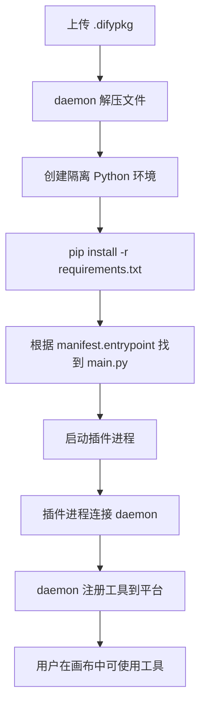

# .difypkg 打包命令规范 —— 从目录结构到安装部署全流程

> **核心结论**：`.difypkg` 是 Dify 插件的分发包格式（本质是 zip 压缩包），由 `dify plugin package` 命令生成。打包时只包含插件源码、YAML 配置和依赖声明，**不包含** Spring Boot 等外部服务。安装后 plugin-daemon 在容器内自动 `pip install` 依赖并启动插件进程。
>
> **前置阅读**：
> - [Dify 插件开发常见问题 FAQ](./20260603-1848-dify常见问题.md)
> - [Dify 插件连接与安装](./20260603-1548-dify使用自定义插件链接本地包.md)

**环境与版本锚点**

| 组件 | 版本 | 说明 |
|------|------|------|
| Dify CLI | 最新版 | `dify plugin package` 命令来源 |
| 插件包 | iot_device_http 0.0.3 | 本文实例项目 |
| Python | 3.12 | manifest 指定版本 |
| dify_plugin SDK | >= 0.9.0 | 支持 dynamic-select |

---

## 目录

1. [.difypkg 是什么](#1-difypkg-是什么)
2. [打包前的项目结构要求](#2-打包前的项目结构要求)
3. [打包命令详解](#3-打包命令详解)
4. [打包产物内容分析](#4-打包产物内容分析)
5. [不会被打包的文件](#5-不会被打包的文件)
6. [版本号管理规范](#6-版本号管理规范)
7. [安装到 Dify 平台](#7-安装到-dify-平台)
8. [安装后 daemon 做了什么](#8-安装后-daemon-做了什么)
9. [常见打包与安装错误排查](#9-常见打包与安装错误排查)
10. [完整操作流程](#10-完整操作流程)
11. [我们的项目实战记录](#11-我们的项目实战记录)
12. [总结](#12-总结)

---

## 1. .difypkg 是什么

`.difypkg` 是 Dify 插件的标准分发包格式：

| 属性 | 说明 |
|------|------|
| 文件扩展名 | `.difypkg` |
| 实际格式 | **zip 压缩包**（可手动改名为 `.zip` 解压查看） |
| 内容 | 插件源码、YAML 定义、manifest、requirements、assets |
| 不包含 | 外部服务（如 Spring Boot）、Python 运行时、系统依赖 |
| 安装方式 | Dify 控制台上传 → plugin-daemon 解压并创建隔离环境 |

**类比**：`.difypkg` 之于 Dify 插件，相当于 `.jar` 之于 Java 应用、`.whl` 之于 Python 包——都是打包后的可分发单元。

---

## 2. 打包前的项目结构要求

`dify plugin package` 命令要求插件项目遵循固定的目录结构。以我们的 `plugin-iot-device-plugin` 为例：

```
plugin-iot-device-plugin/
├── manifest.yaml              # 插件元数据（名称、版本、权限、运行环境）
├── main.py                    # 插件入口（entrypoint）
├── requirements.txt           # Python 依赖声明
├── plugin_bootstrap.py        # SDK 兼容补丁（可选但推荐）
├── .env                       # 本地调试环境变量（不会被打包）
├── .env.example               # 环境变量示例
├── _assets/                   # 静态资源
│   └── icon.svg               # 插件图标
├── provider/                  # Provider 定义
│   ├── iot_device_plugin.yaml # Provider 元数据、凭证定义、工具注册
│   └── iot_device_plugin.py   # Provider 凭证校验逻辑
└── tools/                     # 工具实现
    ├── list_devices.yaml      # 工具定义（参数 schema）
    ├── list_devices.py        # 工具 Python 实现
    ├── generic_http.yaml
    ├── generic_http.py
    ├── dynamic_device_query.yaml
    ├── dynamic_device_query.py
    └── ...                    # 其他工具
```

### 2.1 必须文件清单

| 文件 | 必须 | 说明 |
|------|------|------|
| `manifest.yaml` | **是** | 插件元数据：名称、版本、权限、Python 版本、入口 |
| `main.py` | **是** | 插件入口，`entrypoint` 指向此文件（不含 `.py`） |
| `requirements.txt` | **是** | Python 依赖，daemon 用 `pip install -r` 安装 |
| `_assets/icon.svg` | **是** | 插件图标，manifest 中 `icon` 字段引用 |
| `provider/*.yaml` | **是** | Provider 定义，manifest 中 `plugins.tools` 引用 |
| `provider/*.py` | **是** | Provider Python 实现（凭证校验） |
| `tools/*.yaml` | **是** | 每个工具的定义（参数 schema、描述） |
| `tools/*.py` | **是** | 每个工具的 Python 实现 |

### 2.2 manifest.yaml 关键字段

```yaml
# 顶层版本号和 meta.version 必须一致
version: 0.0.3

# 插件唯一标识
author: your-name
name: iot_device_http

# 资源与权限
resource:
  memory: 268435456           # 256MB 内存限制
  permission:
    tool:
      enabled: true           # 启用工具能力
    storage:
      enabled: true
      size: 1048576           # 1MB 存储
    endpoint:
      enabled: true           # 启用 endpoint 能力

# 插件类型注册
plugins:
  tools:
    - provider/iot_device_plugin.yaml   # 指向 Provider YAML

# 运行环境
meta:
  version: 0.0.3              # 与顶层 version 保持一致
  minimum_dify_version: "1.5.1"
  arch:
    - amd64
    - arm64
  runner:
    language: python
    version: "3.12"           # Python 版本，推荐 3.12
    entrypoint: main          # 入口文件名（不含 .py）
```

### 2.3 文件引用链

manifest → provider yaml → tool yaml → tool py 的完整引用关系：

```
manifest.yaml
  └── plugins.tools: provider/iot_device_plugin.yaml
        ├── identity → author + name（必须与 manifest 一致）
        ├── credentials_for_provider → 安装时用户填写的凭证
        ├── tools:
        │     ├── tools/list_devices.yaml → tools/list_devices.py
        │     ├── tools/generic_http.yaml → tools/generic_http.py
        │     └── tools/dynamic_device_query.yaml → tools/dynamic_device_query.py
        └── extra.python.source: provider/iot_device_plugin.py
```

**一致性要求**：
- `manifest.author` + `manifest.name` 必须与 `provider.yaml` 的 `identity.author` + `identity.name` 一致
- 每个 tool yaml 的 `identity.author` 也必须一致
- 每个 tool yaml 的 `extra.python.source` 必须指向对应的 `.py` 文件

---

## 3. 打包命令详解

### 3.1 基本语法

```powershell
dify plugin package <插件项目路径> -o <输出文件路径>.difypkg
```

### 3.2 参数说明

| 参数 | 必须 | 说明 |
|------|------|------|
| `<插件项目路径>` | 是 | 插件项目根目录（包含 manifest.yaml 的目录） |
| `-o <输出路径>` | 否 | 输出文件路径，默认在当前目录生成 |

### 3.3 实际命令

```powershell
cd E:\Ideaproject\test-dify\plugin-iot-device-plugin
dify plugin package . -o iot_device_http.difypkg
```

### 3.4 成功输出

```
2026/06/04 10:30:00 INFO plugin packaged successfully output_path=iot_device_http.difypkg
```

### 3.5 失败场景

| 错误 | 原因 | 修复 |
|------|------|------|
| `manifest.yaml not found` | 在项目外执行命令 | cd 到插件根目录 |
| `icon not found` | `_assets/` 下缺少图标文件 | 添加 `_assets/icon.svg` |
| `tool yaml not found` | provider yaml 中引用的 tool 路径不存在 | 检查 tools 列表路径 |
| `invalid manifest` | manifest 字段缺失或格式错误 | 对照官方模板补全字段 |

### 3.6 Dify CLI 安装

`dify` 命令来自 Dify 官方 CLI 工具：

```powershell
# Go 安装（需要 Go 1.21+）
go install github.com/langgenius/dify-plugin/cli@latest

# 或下载预编译二进制
# https://github.com/langgenius/dify-plugin/releases
```

安装后确认：

```powershell
dify --version
```

---

## 4. 打包产物内容分析

`.difypkg` 解压后的结构与源码项目几乎一致，但有以下差异：

### 4.1 包含的文件

```
iot_device_http.difypkg (zip)
├── manifest.yaml
├── main.py
├── requirements.txt
├── plugin_bootstrap.py
├── _assets/
│   └── icon.svg
├── provider/
│   ├── iot_device_plugin.yaml
│   └── iot_device_plugin.py
└── tools/
    ├── list_devices.yaml
    ├── list_devices.py
    ├── generic_http.yaml
    ├── generic_http.py
    ├── dynamic_device_query.yaml
    ├── dynamic_device_query.py
    ├── control_device.yaml
    ├── control_device.py
    ├── get_device_status.yaml
    ├── get_device_status.py
    ├── query_device_data.yaml
    └── query_device_data.py
```

### 4.2 文件大小参考

| 文件类型 | 典型大小 |
|----------|----------|
| manifest.yaml | ~1KB |
| 每个 tool py | 1-8KB |
| 每个 tool yaml | 0.5-4KB |
| 图标 | ~1KB |
| **整个 .difypkg** | **数十 KB 到数百 KB** |

我们的 `iot_device_http.difypkg`（6 个工具）约 **145KB**。

---

## 5. 不会被打包的文件

以下文件/目录会被 CLI 自动排除：

| 排除项 | 说明 |
|--------|------|
| `.env` | 本地环境变量（含敏感信息） |
| `.env.example` | 环境变量示例 |
| `__pycache__/` | Python 缓存 |
| `.mvn/` | Maven 配置（如果是混合项目） |
| `pom.xml` | Maven 构建文件（不属于插件） |
| `src/` | Java 源码目录（不属于插件） |
| `target/` | 编译输出 |
| `.git/` | Git 仓库 |
| `.gitignore` | Git 忽略规则 |
| `*.difypkg` | 已有的打包产物（避免嵌套） |
| `node_modules/` | 前端依赖 |
| `.idea/` | IDE 配置 |

**重要**：`.env` 文件不会被打包，这意味着：
- 本地调试用的 `REMOTE_INSTALL_HOST` 等变量**不会**进入远程容器
- 插件在远程运行时，凭证完全由 Dify 控制台配置，不依赖 `.env`

---

## 6. 版本号管理规范

### 6.1 版本号位置

manifest.yaml 中有**两处**版本号，必须保持一致：

```yaml
version: 0.0.3           # 顶层 version

meta:
  version: 0.0.3         # meta.version
```

### 6.2 何时递增版本号

| 场景 | 是否需要递增 |
|------|-------------|
| 新增工具 | **是** |
| 修改已有工具的参数 | **是** |
| 修改 Python 实现逻辑 | **是** |
| 修改 requirements.txt | **是** |
| 修改 provider 凭证定义 | **是** |
| 仅修改 .env 或本地配置 | 否（不会被打包） |

### 6.3 为什么必须递增

Dify 平台通过版本号判断是否需要更新插件：

1. **不递增直接上传**：平台可能认为版本相同，拒绝安装或沿用缓存
2. **daemon 缓存**：plugin-daemon 可能缓存旧版依赖，新版本号触发重新安装
3. **回滚需要**：版本号递增便于追溯哪个版本引入了问题

### 6.4 我们的版本历史

| 版本 | 变更内容 |
|------|----------|
| 0.0.1 | 初始版本，4 个基础工具 |
| 0.0.2 | 新增 generic_http + dynamic_device_query，SDK 升级到 0.9.0 |
| 0.0.3 | 增强 dynamic_device_query 诊断日志，新增 Spring health 接口 |

---

## 7. 安装到 Dify 平台

### 7.1 前置条件

| 条件 | 说明 |
|------|------|
| Dify 平台运行正常 | 控制台可访问 |
| 签名验证已关闭 | `FORCE_VERIFYING_SIGNATURE=false`（自打包插件无有效签名） |
| `.difypkg` 文件已生成 | 通过 `dify plugin package` 命令 |

### 7.2 签名验证问题

Dify 自托管版本**默认启用**插件签名验证。自打包的 `.difypkg` 没有官方签名，上传会失败。

**解决方案**：在 K8s 中为 `dify-api` 和 `dify-plugin-daemon` 两个 Deployment 添加环境变量：

```yaml
env:
  - name: FORCE_VERIFYING_SIGNATURE
    value: "false"
```

```bash
# kubectl 命令示例
kubectl set env deployment/dify-api FORCE_VERIFYING_SIGNATURE=false -n dify
kubectl set env deployment/dify-plugin-daemon FORCE_VERIFYING_SIGNATURE=false -n dify
```

### 7.3 安装步骤

1. **登录 Dify 控制台** → 插件管理页面
2. **卸载旧版本**（如有）：点击已安装的插件 → 卸载
3. **上传新包**：点击「上传插件」→ 选择 `.difypkg` 文件
4. **配置凭证**：
   - `spring_service_url`：填**局域网 IP**（如 `http://10.x.x.x:8080`），**不要填 localhost**
   - `api_token`：可选，如果 Spring 需要认证
5. **授权工作区**：将插件授权给需要使用的工作区

### 7.4 为什么不能填 localhost

插件进程运行在 **K8s Pod 容器内**，`localhost` 指向容器自身而非宿主机。Spring Boot 运行在宿主机或其他 Pod 中，必须用：

- 宿主机局域网 IP（如 `http://192.168.1.100:8080`）
- K8s Service 的 ClusterIP 或 DNS 名称
- NodePort 地址

---

## 8. 安装后 daemon 做了什么

上传 `.difypkg` 后，plugin-daemon 自动执行以下流程：



### 8.1 详细步骤

| 步骤 | 动作 | 耗时 |
|------|------|------|
| 1 | 解压 `.difypkg` 到 daemon 工作目录 | 秒级 |
| 2 | 创建 Python 虚拟环境（venv 或 uv） | 秒级 |
| 3 | `pip install -r requirements.txt` | **30 秒到数分钟**（取决于依赖大小和网络） |
| 4 | 启动 `main.py` 进程 | 秒级 |
| 5 | 插件通过 TCP 连接 daemon | 秒级 |
| 6 | daemon 向 dify-api 注册工具 | 秒级 |

### 8.2 pip install 超时问题

daemon 使用 `uv` 或 `pip` 安装依赖。如果 `requirements.txt` 中包含大包（如 `numpy`），默认 30 秒超时可能不够：

```yaml
# 在 plugin-daemon Deployment 中添加环境变量
env:
  - name: UV_HTTP_TIMEOUT
    value: "300"    # 5 分钟
```

### 8.3 Python 版本要求

manifest 中 `runner.version: "3.12"` 指定了 Python 版本。daemon 会使用该版本的 Python 创建环境。

**注意**：不要使用 Python 3.14 等过新版本，主流包可能没有预编译 wheel，导致 pip install 需要编译 C/Rust 扩展而失败。

---

## 9. 常见打包与安装错误排查

### 9.1 打包阶段

| 错误 | 现象 | 解决 |
|------|------|------|
| `dify: command not found` | CLI 未安装或不在 PATH | 安装 Dify CLI |
| `manifest.yaml not found` | 在非插件目录执行 | cd 到插件根目录 |
| `icon not found` | 缺少 `_assets/icon.svg` | 添加图标文件 |
| `tool not found: tools/xxx.yaml` | provider yaml 引用了不存在的工具 | 检查 tools 列表 |
| 打包成功但文件为空 | 目录结构不符合要求 | 检查 manifest 和 provider 引用链 |

### 9.2 安装阶段

| 错误 | 现象 | 解决 |
|------|------|------|
| 上传失败：签名验证不通过 | `plugin verification failed` | 设置 `FORCE_VERIFYING_SIGNATURE=false` |
| 安装卡住 | pip install 超时 | 设置 `UV_HTTP_TIMEOUT=300` |
| 安装失败：pip 编译错误 | `error: Microsoft Visual C++ 14.0 is required` | 使用 Python 3.12，避免 3.14 |
| 插件名称冲突 | `plugin already exists` | 先卸载旧版再安装，或修改 author/name |
| 凭证验证通过但工具不可用 | daemon 未成功启动插件 | 查 daemon 日志 |

### 9.3 运行阶段

| 错误 | 现象 | 解决 |
|------|------|------|
| 工具节点无法选择 | 插件未授权给工作区 | 控制台授权 |
| 运行报连接失败 | 凭证地址为 localhost | 改为局域网 IP |
| 运行报凭证为空 | daemon 未注入凭证 | 重新保存凭证 |
| dynamic-select 下拉为空 | 参见动态参数专题博客 | 检查 form: llm + SDK 补丁 |

### 9.4 日志查看

```bash
# 查看 daemon Pod 名
kubectl get pods -n dify -l component=plugin-daemon

# 实时查看安装日志
kubectl logs -f <daemon-pod-name> -n dify --tail=100

# 过滤插件相关日志
kubectl logs -f <daemon-pod-name> -n dify | grep "dynamic_device_query\|_fetch_parameter_options\|pip install"
```

---

## 10. 完整操作流程

以下是从零到工具可用的完整步骤：

### 步骤 1：确认项目结构

```powershell
# 检查关键文件是否存在
cd E:\Ideaproject\test-dify\plugin-iot-device-plugin
dir manifest.yaml, main.py, requirements.txt, _assets\icon.svg
dir provider\iot_device_plugin.yaml, provider\iot_device_plugin.py
dir tools\*.yaml, tools\*.py
```

### 步骤 2：检查版本号

```powershell
# 确认 manifest.yaml 中两处版本号一致
Select-String "version:" manifest.yaml
```

### 步骤 3：打包

```powershell
cd E:\Ideaproject\test-dify\plugin-iot-device-plugin
dify plugin package . -o iot_device_http.difypkg
```

期望输出：`INFO plugin packaged successfully`

### 步骤 4：验证产物

```powershell
# 检查文件大小（应大于 10KB）
dir iot_device_http.difypkg

# 可选：解压查看内容
# 改名为 .zip 后用解压工具打开
```

### 步骤 5：启动 Spring Boot

```powershell
cd E:\Ideaproject\test-dify\plugin-dify-iot-device
mvn spring-boot:run
```

### 步骤 6：上传安装

1. 打开 Dify 控制台（如 `http://10.20.183.170:30080`）
2. 进入插件管理
3. 如有旧版，先**卸载**
4. 上传 `iot_device_http.difypkg`
5. 配置凭证：
   - `spring_service_url` = `http://<局域网IP>:8080`
   - `api_token` = 留空（如果 Spring 无认证）
6. 授权工作区

### 步骤 7：验证安装

```bash
# 查看 daemon 日志确认安装成功
kubectl logs -f <daemon-pod-name> -n dify | grep "iot_device_http"
```

期望看到：插件启动、连接 daemon、工具注册成功。

### 步骤 8：在画布中测试

1. 新建或打开工作流
2. 添加「获取设备列表」工具节点
3. 运行工作流
4. 检查输出是否包含 3 台设备

---

## 11. 我们的项目实战记录

### 11.1 双项目架构

```
E:\Ideaproject\test-dify\
├── plugin-iot-device-plugin/     ← Dify Python 插件（打包对象）
│   ├── manifest.yaml
│   ├── main.py
│   ├── plugin_bootstrap.py
│   ├── requirements.txt
│   ├── _assets/icon.svg
│   ├── provider/
│   └── tools/
│
└── plugin-dify-iot-device/       ← Spring Boot 后端（不打包，独立部署）
    ├── pom.xml
    └── src/main/java/com/example/iot/
        ├── controller/DeviceController.java
        ├── controller/DifyPluginSelectController.java
        ├── model/
        └── service/
```

### 11.2 打包只涉及插件项目

```powershell
# 打包命令只在插件项目中执行
cd E:\Ideaproject\test-dify\plugin-iot-device-plugin
dify plugin package . -o iot_device_http.difypkg
```

Spring Boot 项目完全不参与打包流程——它作为独立服务运行在宿主机上，插件通过 HTTP 访问它。

### 11.3 版本迭代记录

| 版本 | 日期 | 变更 | 打包命令 |
|------|------|------|----------|
| 0.0.1 | 初始 | 4 个基础工具 | `dify plugin package . -o iot_device_http.difypkg` |
| 0.0.2 | 迭代 | +generic_http +dynamic_device_query，SDK 升级 0.9.0 | 同上（先卸载旧版） |
| 0.0.3 | 迭代 | 增强诊断日志，+Spring health 接口 | 同上（先卸载旧版） |

### 11.4 踩过的坑

| 坑 | 现象 | 教训 |
|----|------|------|
| 不卸载直接覆盖安装 | daemon 缓存旧版依赖，新功能不生效 | **必须先卸载再安装** |
| 版本号未递增 | 平台拒绝安装或沿用旧版 | 每次改代码都递增版本 |
| `.env` 被误以为会打包 | 远程运行时凭证为空 | 凭证由控制台配置，不依赖 .env |
| 凭证填 localhost | 插件容器内无法访问 Spring | 改为局域网 IP |
| 签名验证未关闭 | 上传直接被拒 | `FORCE_VERIFYING_SIGNATURE=false` |
| pip install 超时 | 安装卡在依赖下载 | `UV_HTTP_TIMEOUT=300` |
| `__pycache__` 占空间 | 打包产物偏大 | CLI 自动排除，无需手动清理 |

---

## 12. 总结

### 12.1 三条核心要点

1. **打包命令极简**：`dify plugin package . -o xxx.difypkg`，一行搞定
2. **准备工作是关键**：manifest、provider、tools 的引用链必须完整且一致
3. **安装后验证不能省**：daemon 日志是第一现场，确认 pip install 成功 + 插件进程启动

### 12.2 速查清单

```
打包前：
  ☐ manifest.yaml 两处版本号一致
  ☐ provider yaml 中 tools 列表完整
  ☐ 每个 tool yaml 的 extra.python.source 指向正确的 .py
  ☐ _assets/icon.svg 存在
  ☐ requirements.txt 依赖版本正确

打包后：
  ☐ .difypkg 文件大小合理（> 10KB）
  ☐ 版本号比已安装版本更高

安装时：
  ☐ 先卸载旧版
  ☐ 签名验证已关闭
  ☐ 凭证填局域网 IP（非 localhost）
  ☐ 授权给目标工作区

安装后：
  ☐ daemon 日志无报错
  ☐ 画布中能看到工具
  ☐ 运行一次基础工具验证连通性
```

### 12.3 一图总结


---

## 附录 A：manifest.yaml 完整字段参考

```yaml
# 插件版本号（必须与 meta.version 一致）
version: 0.0.3

# 插件类型
type: plugin

# 作者（唯一标识的一部分）
author: your-name

# 插件名称（唯一标识的一部分）
name: iot_device_http

# 显示名称
label:
  en_US: IoT Device HTTP Gateway
  zh_Hans: IoT设备通用网关

# 描述
description:
  en_US: Generic HTTP gateway to IoT device management service
  zh_Hans: IoT设备管理服务通用HTTP网关

# 图标（必须在 _assets/ 目录下）
icon: icon.svg

# 创建时间
created_at: 2025-01-01T00:00:00.000Z

# 资源限制
resource:
  memory: 268435456          # 内存限制（字节）= 256MB
  permission:
    tool:
      enabled: true          # 工具能力
    storage:
      enabled: true
      size: 1048576          # 存储限制 = 1MB
    endpoint:
      enabled: true          # Endpoint 能力

# 插件注册
plugins:
  tools:
    - provider/iot_device_plugin.yaml

# 元数据
meta:
  version: 0.0.3             # 必须与顶层 version 一致
  minimum_dify_version: "1.5.1"  # 最低 Dify 版本要求
  arch:
    - amd64
    - arm64
  runner:
    language: python
    version: "3.12"          # Python 版本
    entrypoint: main         # 入口文件（不含 .py）
```

## 附录 B：requirements.txt 编写规范

```
# 核心依赖：Dify 插件 SDK
# 版本范围写法：>= 最低版本, < 下一大版本
dify_plugin>=0.9.0,<1.0.0

# HTTP 客户端
requests>=2.31.0

# 环境变量（仅本地调试需要，远程运行时 daemon 注入凭证）
python-dotenv>=1.0.0
```

**注意事项**：
- 不要添加 `numpy`、`pandas` 等大包，除非确实需要（会显著增加安装时间）
- 不要 pin 死精确版本（如 `==0.9.0`），使用范围约束更灵活
- `dify_plugin` 是必须的，版本决定了可用的 SDK 能力

## 附录 C：文档修订记录

| 日期 | 版本 | 说明 |
|------|------|------|
| 2026-06-04 | 1.0 | 首版：打包命令、产物分析、安装流程、常见问题 |

---

*文档版本：2026-06-04，对应插件 iot_device_http 0.0.3，Dify CLI 最新版。*
