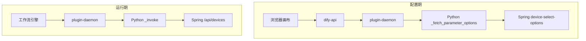
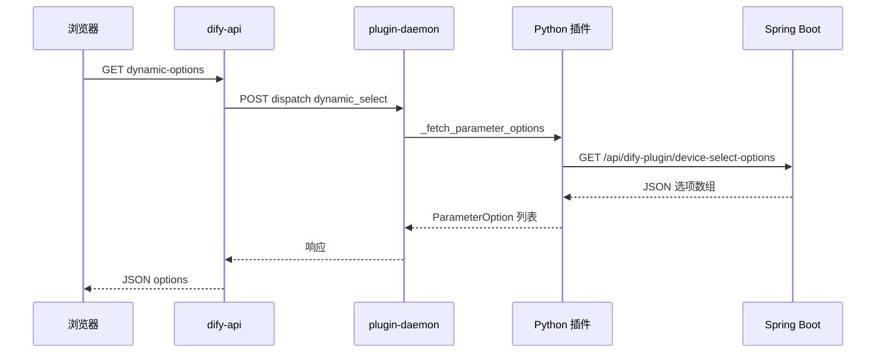
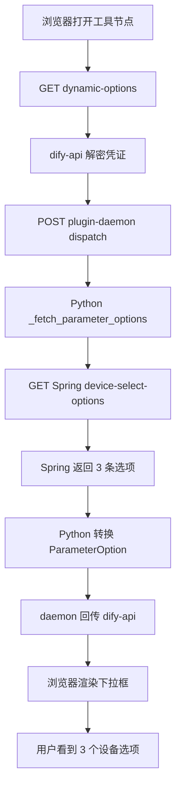
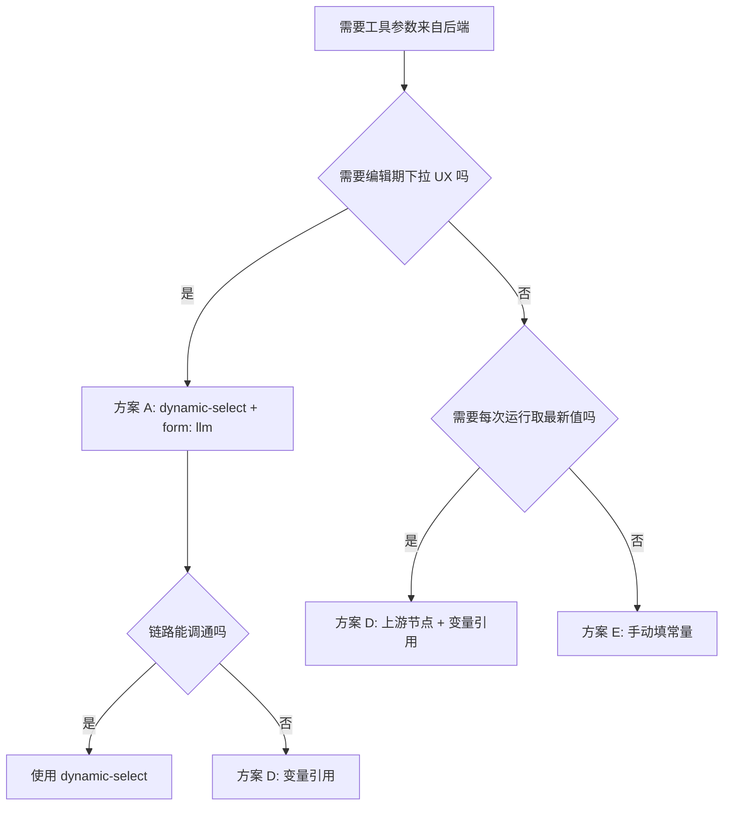

# Dify dynamic-select 动态参数调用后端 —— 从零到测试通过全记录

> **核心结论**：Dify 工作流工具插件的 `dynamic-select` 参数类型可以让工具节点的下拉选项从后端接口动态加载。实现路径为：YAML 声明 `type: dynamic-select` + Python 实现 `_fetch_parameter_options` 钩子 + Spring Boot 提供选项数据接口。但在 Dify 1.12.x 中存在前端缺陷和 SDK Bug，需要 `form: llm` 规避 + SDK 补丁才能正常工作。本文以流水账形式记录从需求提出到测试通过的完整过程，包含每次失败的现象、排查命令、源码分析、最终成功的全部细节。
>
> **前置阅读**：
> - [Dify 插件连接与安装全流程](./20260603-1548-dify使用自定义插件链接本地包.md)
> - [Dify 插件开发常见问题 FAQ](./20260603-1848-dify常见问题.md)
> - [Dify 是否支持动态参数——源码级排查全记录](./20260603-2023-dify是否支持动态参数.md)
> - [Dify 参数 dynamic-select 深度分析](./20260604-0804-dify参数dynamic-select.md)
> - [Dify 选择工具时界面参数定义源码分析](./20260604-0941-dify选择工具的时候-界面参数定义.md)
> - [Dify dynamic-select 参数源码 11 跳分析](./20260604-0951-dify选择工具的时候dynamic-select参数源码分析.md)

**环境与版本锚点**

| 组件 | 版本 | 说明 |
|------|------|------|
| Dify 平台 | 1.12.1 | Helm 部署于 K8s |
| plugin-daemon | 0.5.3-local | K8s 自定义镜像 |
| Python SDK | dify_plugin >= 0.9.0 | 支持 dynamic-select |
| 插件包 | iot_device_http 0.0.3 | manifest minimum_dify_version 1.5.1 |
| Spring Boot | 3.2.5 | 端口 8080，模拟 3 台 IoT 设备 |
| 开发机 | Windows 25H2 | PowerShell |
| 远程服务器 | 10.20.183.170 | Dify NodePort 30080 |

---

## 目录

1. [需求背景](#1-需求背景)
2. [双项目架构与文件清单](#2-双项目架构与文件清单)
3. [dynamic-select 是什么](#3-dynamic-select-是什么)
4. [第一次尝试：只改 Spring Boot 接口](#4-第一次尝试只改-spring-boot-接口)
5. [第二次尝试：YAML 加 dynamic-select 配 form: form](#5-第二次尝试yaml-加-dynamic-select-配-form-form)
6. [对照 Dify 源码定位断点](#6-对照-dify-源码定位断点)
7. [第三次尝试：改用 form: llm 加 SDK 补丁](#7-第三次尝试改用-form-llm-加-sdk-补丁)
8. [Spring Boot 后端完整实现](#8-spring-boot-后端完整实现)
9. [Python 插件完整实现](#9-python-插件完整实现)
10. [SDK 280 补丁详解](#10-sdk-280-补丁详解)
11. [打包与安装](#11-打包与安装)
12. [验证一：画布保存 draft 的完整流程](#12-验证一画布保存-draft-的完整流程)
13. [验证二：工作流运行 draft/run 的完整流程](#13-验证二工作流运行-draftrun-的完整流程)
14. [验证三：dynamic-select 下拉请求 dynamic-options](#14-验证三dynamic-select-下拉请求-dynamic-options)
15. [每条测试数据的完整运行流程分析](#15-每条测试数据的完整运行流程分析)
16. [问题排查手册](#16-问题排查手册)
17. [踩坑记录与注意事项](#17-踩坑记录与注意事项)
18. [总结](#18-总结)
19. [附录 A：完整代码清单](#19-附录-a完整代码清单)
20. [附录 B：关键文件路径索引](#20-附录-b关键文件路径索引)

---

## 1. 需求背景

在前几篇博客中，我们已经完成了：

- 插件 `iot_device_http.difypkg` 安装到远程 Dify 平台
- 工作流中「获取设备列表」工具可以调通 Spring Boot，返回 3 台模拟设备
- `generic_http` 通用工具可以用路径加方法访问后端任意 REST 接口

随后出现了一个自然而然的需求：

> **在画布上配置工具节点时，device_id 参数能不能变成下拉框，选项来自我们的 Java 接口，而不是在 YAML 里写死？**

这个需求在 Dify 插件体系中对应 `dynamic-select` 参数类型，以及 Python 侧的 `_fetch_parameter_options` 钩子。

但从需求提出到真正测试通过，我们经历了**三次失败、两轮源码分析、多个踩坑点**。本文完整记录这个过程。

### 1.1 为什么需要 dynamic-select

在没有 dynamic-select 之前，设备 ID 要么：
- 在 YAML 中用 `select` 写死 `options`（新增设备就要改插件代码、重新打包安装）
- 在画布上用 `string` 手动输入（容易拼错，且不知道有哪些设备可选）

`dynamic-select` 解决了这两个问题：
- **选项来自后端接口**：新增设备后自动出现在下拉列表中
- **UX 友好**：用户看到设备名称而非 ID，不易出错
- **无需修改插件代码**：Spring Boot 返回什么，下拉就显示什么

---

## 2. 双项目架构与文件清单

我们的项目采用**双模块架构**，一个负责 Dify 插件（Python），一个负责业务后端（Spring Boot）。

### 2.1 目录结构

```
E:\Ideaproject\test-dify\
│
├── plugin-iot-device-plugin/          ← Dify Python 插件（打包对象）
│   ├── manifest.yaml                  ← 插件元数据（版本、权限、运行环境）
│   ├── main.py                        ← 插件入口（先打补丁再启动）
│   ├── plugin_bootstrap.py            ← SDK 280 兼容补丁
│   ├── requirements.txt               ← Python 依赖声明
│   ├── .env                           ← 本地调试环境变量（不会被打包）
│   ├── _assets/
│   │   └── icon.svg                   ← 插件图标
│   ├── provider/
│   │   ├── iot_device_plugin.yaml     ← Provider 定义（凭证、工具注册）
│   │   └── iot_device_plugin.py       ← Provider 凭证校验
│   └── tools/
│       ├── list_devices.yaml/.py      ← 获取设备列表
│       ├── generic_http.yaml/.py      ← 通用 HTTP 请求
│       ├── dynamic_device_query.yaml/.py  ← 动态设备查询（本文主角）
│       └── ...（其他工具）
│
├── plugin-dify-iot-device/            ← Spring Boot 后端（独立部署，不打包）
│   ├── pom.xml
│   └── src/main/java/com/example/iot/
│       ├── DifyIotDeviceApplication.java
│       ├── controller/
│       │   ├── DeviceController.java          ← 设备 CRUD 五个 API
│       │   └── DifyPluginSelectController.java ← 插件专用下拉选项接口
│       ├── service/
│       │   ├── DeviceService.java
│       │   └── DifyPluginSelectService.java   ← 生成 SelectOption
│       └── model/
│           ├── Device.java
│           └── SelectOption.java
│
└── doc/superpowers/plans/             ← 博客文档
```

### 2.2 文件引用链

```
manifest.yaml
  └── plugins.tools: provider/iot_device_plugin.yaml
        ├── identity.author + name（必须与 manifest 一致）
        ├── credentials_for_provider:
        │     ├── spring_service_url（text-input，必填）
        │     └── api_token（secret-input，可选）
        ├── tools:
        │     ├── tools/list_devices.yaml → list_devices.py
        │     ├── tools/generic_http.yaml → generic_http.py
        │     └── tools/dynamic_device_query.yaml → dynamic_device_query.py
        └── extra.python.source: provider/iot_device_plugin.py
```

### 2.3 两条数据流



**关键认知**：配置期和运行期是**两条完全独立的链路**。下拉选择只在编辑画布时触发，保存后值变为静态常量。运行期直接使用这个常量，不会再次调用下拉接口。

---

## 3. dynamic-select 是什么

`dynamic-select` 是 Dify 插件 SDK（`dify_plugin >= 0.9.0`）提供的一种参数类型。与静态 `select` 的区别：

| 维度 | `select` | `dynamic-select` |
|------|----------|------------------|
| 选项来源 | YAML 中写死的 `options` | Python `_fetch_parameter_options` 运行期返回 |
| 何时获取 | 加载 YAML 即确定 | 用户打开节点时前端发起请求 |
| 是否需要 Python 钩子 | 否 | 是 |
| 是否依赖凭证 | 否 | 是（需要凭证访问外部服务） |
| 后端枚举值 | `SELECT` | `DYNAMIC_SELECT` |
| 前端枚举值 | `FormTypeEnum.select` | `FormTypeEnum.dynamicSelect` |

### 3.1 完整调用链（11 跳）

当用户在画布上打开工具节点时，dynamic-select 的选项加载经历以下完整链路：

```
1. 用户点击工具节点
2. panel.tsx 渲染参数表单
3. FormInputItem 识别 isDynamicSelect
4. useEffect 检测三个前置条件（currentTool、currentProvider、providerType）
5. useFetchDynamicOptions 发出 HTTP 请求
6. GET /console/api/workspaces/current/plugin/parameters/dynamic-options
7. dify-api PluginParameterService 查询并解密租户凭证
8. DynamicSelectClient POST 请求 plugin-daemon
9. plugin-daemon 调度插件进程（dispatch dynamic_select/fetch_parameter_options）
10. Python _fetch_parameter_options 执行
11. 插件请求外部后端（Spring Boot）获取选项
12. 选项逐层回传到前端
13. Select 组件渲染下拉选项
```



---

## 4. 第一次尝试：只改 Spring Boot 接口

### 4.1 操作

在 Spring Boot 中新增 `GET /api/dify-plugin/device-select-options` 接口，返回设备列表的 `value` + `label` 格式。**不修改插件代码**。

### 4.2 现象

- 本地 curl 测试接口正常，返回 3 条选项
- 工作流节点里设备参数**仍然没有下拉**
- 浏览器 Network 中**没有** `dynamic-options` 请求

### 4.3 运行流程分析

```
画布渲染参数 → 只读插件 manifest 静态 schema → 无代码路径请求 Spring
```

### 4.4 结论

**配置期下拉与 Spring 无直接连接。** 光改 Spring 后端不够，Dify 不知道要去请求这个接口。必须在插件 YAML 中声明 `type: dynamic-select`，并在 Python 中实现 `_fetch_parameter_options` 钩子。

### 4.5 本地验证 Spring 接口

**命令：**

```powershell
curl.exe -s -w "`nHTTP_CODE:%{http_code}" "http://127.0.0.1:8080/api/dify-plugin/device-select-options"
```

**实际输出：**

```json
[{"value":"device_002","label":"卧室智能灯泡 (device_002)"},{"value":"device_003","label":"厨房智能开关 (device_003)"},{"value":"device_001","label":"客厅温度传感器 (device_001)"}]
HTTP_CODE:200
```

Spring 后端没问题，3 条选项数据正确。问题在 Dify 到插件的链路。

---

## 5. 第二次尝试：YAML 加 dynamic-select 配 form: form

### 5.1 操作

新建 `dynamic_device_query` 工具，YAML 中 `device_id` 参数声明为：

```yaml
- name: device_id
  type: dynamic-select
  required: true
  form: form          ← 放在「设置」区域
  label:
    zh_Hans: 设备
```

### 5.2 现象

- 重装 `iot_device_http.difypkg`（0.0.2）后，打开「动态设备查询」节点
- **设备下拉为空**
- 浏览器 Network **没有** `dynamic-options` 请求
- plugin-daemon 日志**没有** `_fetch_parameter_options called`
- 用户以为「没调用后端」

### 5.3 运行流程分析

| 步骤 | 系统行为 |
|------|----------|
| 1 | `use-config.ts` 把 `form !== 'llm'` 的参数放进 `toolSettingSchema` |
| 2 | `panel.tsx` 在「设置」区渲染第二个 `ToolForm` |
| 3 | 第二个 `ToolForm` **未传** `currentProvider` 和 `currentTool` props |
| 4 | `form-input-item.tsx` 中 `useEffect` 判断 `currentTool && currentProvider` 失败 |
| 5 | **不调用** `useFetchDynamicOptions` |
| 6 | Python 与 Spring 均不被触发 |

### 5.4 结论

**Dify 1.12.x 前端存在已知缺陷**：`panel.tsx` 中第二个 `ToolForm`（设置区）没有传递 `currentProvider` 和 `currentTool`，导致 `useEffect` 的前置条件不满足，dynamic-select 的下拉请求根本不会发出。

这与 GitHub [dify#36518](https://github.com/langgenius/dify/issues/36518) 描述一致。修复 PR [dify#36743](https://github.com/langgenius/dify/pull/36743) 给第二个 ToolForm 补传了 provider，但我们使用的版本尚未合并该修复。

---

## 6. 对照 Dify 源码定位断点

为了搞清楚到底断在哪里，我们对 Dify 前端源码进行了逐行分析。

### 6.1 参数拆分逻辑（use-config.ts）

```typescript
const toolInputVarSchema = useMemo(() => {
  return formSchemas.filter((item: any) => item.form === 'llm')
}, [formSchemas])

const toolSettingSchema = useMemo(() => {
  return formSchemas.filter((item: any) => item.form !== 'llm')
}, [formSchemas])
```

参数被 `form` 字段分成两组：
- `form: llm` → 进入「输入变量」区域（第一个 ToolForm）
- `form: form` → 进入「设置」区域（第二个 ToolForm）

### 6.2 双 ToolForm（panel.tsx）

第一个 ToolForm 传入了 provider 上下文：

```tsx
<ToolForm
  readOnly={readOnly}
  nodeId={id}
  schema={toolInputVarSchema}
  value={toolInputVarValue}
  onChange={setToolInputVarValue}
  currentProvider={currCollection}    ← 有
  currentTool={currTool}              ← 有
/>
```

第二个 ToolForm **没有**传 provider 上下文：

```tsx
<ToolForm
  readOnly={readOnly}
  nodeId={id}
  schema={toolSettingSchema}
  value={toolSettingValue}
  onChange={setToolSettingValue}
  // 缺少 currentProvider 和 currentTool
/>
```

### 6.3 动态拉取入口（form-input-item.tsx）

```typescript
useEffect(() => {
  const fetchPanelDynamicOptions = async () => {
    if (isDynamicSelect && currentTool && currentProvider
        && (providerType === PluginCategoryEnum.tool)) {
      const data = await fetchDynamicOptions()
      setToolsOptions(data?.options || [])
    }
  }
  fetchPanelDynamicOptions()
}, [...])
```

三个前置条件：`isDynamicSelect` + `currentTool` + `currentProvider`。第二个 ToolForm 因为缺少后两个 props，**永远进不了这个 if 分支**。

### 6.4 解决方案

将 `dynamic-select` 参数的 `form` 设为 `llm`，让它进入第一个 ToolForm（有 provider 上下文的那个），就能满足 useEffect 的前置条件。

---

## 7. 第三次尝试：改用 form: llm 加 SDK 补丁

### 7.1 YAML 修改

```yaml
- name: device_id
  type: dynamic-select
  required: true
  form: llm              ← 改为 llm，进入「输入变量」区域
  label:
    en_US: Device
    zh_Hans: 设备
  human_description:
    en_US: "Device list from Spring API (shown under Input Variables)"
    zh_Hans: "从 Spring 接口动态加载（显示在「输入变量」区）"
  llm_description: "The device_id to query, selected from backend-powered dropdown."
```

### 7.2 SDK 280 补丁

纯 Tool 插件在拉取 dynamic-select 时，SDK 会先查找 Trigger，对非 Trigger 提供方抛出 `ValueError`，导致永远走不到 `_fetch_parameter_options`。必须在 `main.py` 中先打补丁。

### 7.3 版本号递增

```yaml
version: 0.0.3           ← 从 0.0.2 递增到 0.0.3
meta:
  version: 0.0.3
```

必须递增版本号，否则 daemon 可能缓存旧版依赖。

### 7.4 增强诊断日志

在 `_fetch_parameter_options` 和 `_invoke` 中添加详细的 stderr 日志，方便通过 `kubectl logs` 观察链路是否通到 Python 层。

---

## 8. Spring Boot 后端完整实现

### 8.1 SelectOption 模型

```java
package com.example.iot.model;

public class SelectOption {
    private String value;
    private String label;

    public SelectOption() {}

    public SelectOption(String value, String label) {
        this.value = value;
        this.label = label;
    }

    public String getValue() { return value; }
    public void setValue(String value) { this.value = value; }
    public String getLabel() { return label; }
    public void setLabel(String label) { this.label = label; }
}
```

### 8.2 DifyPluginSelectService

```java
package com.example.iot.service;

import com.example.iot.model.Device;
import com.example.iot.model.SelectOption;
import org.springframework.stereotype.Service;
import java.util.ArrayList;
import java.util.Comparator;
import java.util.List;

@Service
public class DifyPluginSelectService {
    private final DeviceService deviceService;

    public DifyPluginSelectService(DeviceService deviceService) {
        this.deviceService = deviceService;
    }

    public List<SelectOption> listDeviceSelectOptions() {
        List<SelectOption> options = new ArrayList<>();
        for (Device device : deviceService.listDevices()) {
            options.add(new SelectOption(
                device.getDeviceId(),
                device.getDeviceName() + " (" + device.getDeviceId() + ")"
            ));
        }
        options.sort(Comparator.comparing(SelectOption::getLabel));
        return options;
    }
}
```

### 8.3 DifyPluginSelectController

```java
package com.example.iot.controller;

import com.example.iot.model.SelectOption;
import com.example.iot.service.DifyPluginSelectService;
import lombok.extern.slf4j.Slf4j;
import org.springframework.http.ResponseEntity;
import org.springframework.web.bind.annotation.GetMapping;
import org.springframework.web.bind.annotation.RequestMapping;
import org.springframework.web.bind.annotation.RestController;
import java.util.List;
import java.util.Map;

@Slf4j
@RestController
@RequestMapping("/api/dify-plugin")
public class DifyPluginSelectController {

    private final DifyPluginSelectService difyPluginSelectService;

    public DifyPluginSelectController(DifyPluginSelectService difyPluginSelectService) {
        this.difyPluginSelectService = difyPluginSelectService;
    }

    @GetMapping("/device-select-options")
    public ResponseEntity<List<SelectOption>> listDeviceSelectOptions() {
        log.info("收到获取设备下拉选项请求");
        return ResponseEntity.ok(difyPluginSelectService.listDeviceSelectOptions());
    }

    @GetMapping("/health")
    public ResponseEntity<Map<String, Object>> health() {
        log.info("收到 Dify 插件连通性诊断请求");
        return ResponseEntity.ok(Map.of(
                "status", "ok",
                "service", "plugin-dify-iot-device",
                "timestamp", System.currentTimeMillis()
        ));
    }
}
```

### 8.4 接口设计说明

| 接口 | 方法 | 用途 |
|------|------|------|
| `/api/dify-plugin/device-select-options` | GET | 返回设备下拉选项，供 `_fetch_parameter_options` 调用 |
| `/api/dify-plugin/health` | GET | 连通性诊断，验证插件容器能否访问到 Spring Boot |
| `/api/devices` | GET | 获取所有设备列表（原有业务接口） |
| `/api/devices/{id}` | GET | 获取设备详情 |
| `/api/devices/{id}/status` | GET | 获取设备实时状态 |
| `/api/devices/{id}/data` | GET | 获取设备历史数据 |

**路径隔离**：插件专用接口放在 `/api/dify-plugin/` 下，与业务接口 `/api/devices/` 分离，互不干扰。

---

## 9. Python 插件完整实现

### 9.1 dynamic_device_query.yaml

```yaml
identity:
  name: dynamic_device_query
  author: your-name
  label:
    en_US: Dynamic Device Query
    zh_Hans: 动态设备查询
description:
  human:
    en_US: "Query device data with device_id loaded dynamically from the Spring Boot API (dynamic-select)."
    zh_Hans: "设备ID从后端接口动态下拉加载，再查询设备详情、状态或历史数据。"
  llm: "Query IoT device information. Select device_id from dynamic dropdown (loaded from backend). Choose query_type: detail, status, or data."
parameters:
  - name: device_id
    type: dynamic-select
    required: true
    label:
      en_US: Device
      zh_Hans: 设备
    human_description:
      en_US: "Device list from Spring API (shown under Input Variables; Dify 1.12 requires form: llm for dynamic-select)"
      zh_Hans: "从 Spring 接口动态加载（显示在「输入变量」区；Dify 1.12 需 form: llm 才会触发下拉请求）"
    llm_description: "The device_id to query, selected from backend-powered dropdown."
    form: llm
  - name: query_type
    type: select
    required: true
    label:
      en_US: Query Type
      zh_Hans: 查询类型
    human_description:
      en_US: "What to query for the selected device"
      zh_Hans: "对已选设备执行的查询类型"
    llm_description: "Query type: detail (device info), status (real-time metrics), data (historical records)."
    form: form
    default: status
    options:
      - value: detail
        label:
          en_US: Device detail
          zh_Hans: 设备详情
      - value: status
        label:
          en_US: Real-time status
          zh_Hans: 实时状态
      - value: data
        label:
          en_US: Historical data
          zh_Hans: 历史数据
  - name: metric
    type: string
    required: false
    label:
      en_US: Metric (for data)
      zh_Hans: 指标（历史数据时）
    human_description:
      en_US: "Metric name when query_type is data, default temperature"
      zh_Hans: "查询历史数据时的指标名，默认 temperature"
    llm_description: "Metric for historical data query, e.g. temperature, humidity, brightness."
    form: form
    default: temperature
  - name: limit
    type: number
    required: false
    label:
      en_US: Record limit
      zh_Hans: 记录条数
    human_description:
      en_US: "Max records when query_type is data, default 5"
      zh_Hans: "历史数据条数，默认 5"
    llm_description: "Number of historical records to return, default 5."
    form: form
    default: 5
extra:
  python:
    source: tools/dynamic_device_query.py
```

**YAML 要点说明**：

| 参数 | type | form | 说明 |
|------|------|------|------|
| `device_id` | `dynamic-select` | `llm` | 出现在「输入变量」区，走第一个 ToolForm |
| `query_type` | `select` | `form` | 静态下拉，出现在「设置」区 |
| `metric` | `string` | `form` | 文本输入，出现在「设置」区 |
| `limit` | `number` | `form` | 数字输入，出现在「设置」区 |

**注意**：只有 `device_id` 需要 `form: llm`，其他参数用 `form: form` 没问题，因为它们是静态类型，不需要触发 dynamic-options 请求。

### 9.2 dynamic_device_query.py

```python
import json
import sys
import traceback
from typing import Any, Generator

import requests
from dify_plugin import Tool
from dify_plugin.entities import I18nObject, ParameterOption
from dify_plugin.entities.tool import ToolInvokeMessage

DEVICE_SELECT_OPTIONS_PATH = "/api/dify-plugin/device-select-options"


def _log(msg: str) -> None:
    """统一日志输出到 stderr，确保 daemon 和 kubectl logs 可见"""
    print(f"[dynamic_device_query] {msg}", flush=True, file=sys.stderr)


class DynamicDeviceQueryTool(Tool):

    def _spring_url(self) -> str:
        return self.runtime.credentials.get("spring_service_url", "").rstrip("/")

    def _request_headers(self) -> dict[str, str]:
        headers = {"Accept": "application/json"}
        api_token = self.runtime.credentials.get("api_token", "")
        if api_token:
            headers["Authorization"] = f"Bearer {api_token}"
        return headers

    # ------------------------------------------------------------------
    # 配置期：dynamic-select 下拉选项拉取
    # 调用链：浏览器 → dify-api → plugin-daemon → 本方法 → Spring Boot
    # ------------------------------------------------------------------
    def _fetch_parameter_options(self, parameter: str) -> list[ParameterOption]:
        _log(f"===== _fetch_parameter_options ENTER =====")
        _log(f"parameter = {parameter!r}")

        # 1. 打印凭证信息（脱敏），帮助排查 daemon 是否正确注入了 credentials
        try:
            cred_keys = list(self.runtime.credentials.keys())
            _log(f"credential keys = {cred_keys}")
            spring_url = self._spring_url()
            _log(f"spring_service_url = {spring_url!r}")
        except Exception as e:
            _log(f"读取凭证异常: {e}")
            traceback.print_exc(file=sys.stderr)
            return []

        # 2. 只处理 device_id 参数
        if parameter != "device_id":
            _log(f"parameter 不是 device_id，跳过")
            return []

        # 3. 校验 spring_url
        if not spring_url:
            _log("spring_service_url 为空！请在插件凭证中配置")
            return []

        # 4. 请求 Spring 后端
        url = f"{spring_url}{DEVICE_SELECT_OPTIONS_PATH}"
        _log(f"准备请求: GET {url}")
        try:
            response = requests.get(
                url,
                headers=self._request_headers(),
                timeout=15,
            )
            _log(f"响应状态码: {response.status_code}")
            response.raise_for_status()
            items = response.json()
            _log(f"响应解析成功，共 {len(items)} 条选项")
        except requests.exceptions.ConnectionError as e:
            _log(f"连接失败: {url} -> {e}")
            _log("请确认: 1) Spring 已启动  2) 凭证地址为局域网IP(非localhost)  3) 防火墙放行")
            return []
        except requests.exceptions.Timeout:
            _log(f"请求超时(15s): {url}")
            return []
        except Exception as e:
            _log(f"请求异常: {e}")
            traceback.print_exc(file=sys.stderr)
            return []

        # 5. 转换为 ParameterOption 列表
        options: list[ParameterOption] = []
        for item in items:
            value = str(item.get("value", ""))
            label_text = str(item.get("label", value))
            if not value:
                continue
            options.append(
                ParameterOption(
                    value=value,
                    label=I18nObject(en_US=label_text, zh_Hans=label_text),
                )
            )
        _log(f"返回 {len(options)} 个 ParameterOption")
        _log(f"===== _fetch_parameter_options EXIT =====")
        return options

    # ------------------------------------------------------------------
    # 运行期：工作流执行时调用
    # ------------------------------------------------------------------
    def _invoke(
        self, tool_parameters: dict[str, Any]
    ) -> Generator[ToolInvokeMessage, None, None]:
        _log(f"===== _invoke ENTER =====")
        _log(f"tool_parameters keys = {list(tool_parameters.keys())}")

        spring_url = self._spring_url()
        api_token = self.runtime.credentials.get("api_token", "")
        device_id = (tool_parameters.get("device_id") or "").strip()
        query_type = (tool_parameters.get("query_type") or "status").strip()
        metric = tool_parameters.get("metric", "temperature") or "temperature"
        limit = int(tool_parameters.get("limit", 5) or 5)

        _log(f"device_id={device_id!r}, query_type={query_type!r}, spring_url={spring_url!r}")

        if not device_id:
            yield self.create_text_message(
                "错误：device_id 为空。\n"
                "请在画布中确认：\n"
                "1. dynamic-select 下拉已选择设备并保存\n"
                "2. 或用变量引用上游节点输出的设备ID"
            )
            return

        if not spring_url:
            yield self.create_text_message("错误：spring_service_url 凭证为空")
            return

        headers = {"Content-Type": "application/json", "Accept": "application/json"}
        if api_token:
            headers["Authorization"] = f"Bearer {api_token}"

        if query_type == "detail":
            url = f"{spring_url}/api/devices/{device_id}"
        elif query_type == "status":
            url = f"{spring_url}/api/devices/{device_id}/status"
        elif query_type == "data":
            url = f"{spring_url}/api/devices/{device_id}/data"
        else:
            yield self.create_text_message(f"错误：不支持的查询类型 {query_type}")
            return

        params = {"metric": metric, "limit": limit} if query_type == "data" else None

        _log(f"请求: GET {url} params={params}")
        try:
            response = requests.get(
                url, headers=headers, params=params, timeout=15
            )
            response.raise_for_status()
            data = response.json()
            _log(f"响应: HTTP {response.status_code}, {len(json.dumps(data))} bytes")
        except requests.exceptions.HTTPError as e:
            if e.response is not None and e.response.status_code == 404:
                yield self.create_text_message(f"设备 {device_id} 不存在")
            else:
                code = e.response.status_code if e.response is not None else "?"
                yield self.create_text_message(f"请求失败: HTTP {code}")
            return
        except requests.exceptions.ConnectionError:
            yield self.create_text_message(
                f"连接失败：无法访问 {url}\n请确认 Spring 服务已启动且插件凭证地址正确（局域网IP，非localhost）。"
            )
            return
        except Exception as e:
            yield self.create_text_message(f"请求失败: {str(e)}")
            return

        title = {"detail": "设备详情", "status": "设备状态", "data": "历史数据"}.get(
            query_type, query_type
        )
        formatted = json.dumps(data, ensure_ascii=False, indent=2)
        yield self.create_text_message(
            f"【{title}】设备 {device_id}\n请求: GET {url}\n\n{formatted}"
        )
        yield self.create_json_message(data)
```

### 9.3 代码要点解析

**`_fetch_parameter_options` 方法**：

| 步骤 | 做什么 | 失败处理 |
|------|--------|----------|
| 1 | 打印凭证 keys | 异常时打印 traceback，返回空列表 |
| 2 | 检查 parameter 是否为 `device_id` | 不是则跳过 |
| 3 | 读取 `spring_service_url` 凭证 | 为空则返回空列表 |
| 4 | GET Spring 下拉接口 | 连接失败/超时/异常分别处理 |
| 5 | 转换为 `ParameterOption` | 跳过 value 为空的项 |

**`_invoke` 方法**：

| 步骤 | 做什么 | 失败处理 |
|------|--------|----------|
| 1 | 从 `tool_parameters` 提取参数 | device_id 为空则报错 |
| 2 | 根据 `query_type` 构造 URL | 不支持的类型则报错 |
| 3 | GET Spring 业务接口 | HTTP 404/连接失败/超时分别处理 |
| 4 | 返回 text + json 消息 | — |

---

## 10. SDK 280 补丁详解

### 10.1 问题

`dify_plugin 0.9.x` 的纯 Tool 插件在拉取 dynamic-select 时，SDK 内部会先查找 Trigger 事件处理器。由于纯 Tool 插件没有注册 Trigger，`TriggerFactory._get_entry` 会抛出 `ValueError`，导致 `_fetch_parameter_options` **永远不会被调用**。

参见 GitHub Issue：https://github.com/langgenius/dify-plugin-sdks/issues/280

### 10.2 plugin_bootstrap.py

```python
"""
dify_plugin 0.9.x：纯 Tool 插件在拉取 dynamic-select 时会误查 Trigger 并抛错，
导致永远不会执行 Tool._fetch_parameter_options。此处做兼容补丁。
参见 https://github.com/langgenius/dify-plugin-sdks/issues/280
"""

from dify_plugin.core.trigger_factory import TriggerFactory

_original_get_trigger_event_handler_safely = (
    TriggerFactory.get_trigger_event_handler_safely
)


def _safe_get_trigger_event_handler_safely(
    self, provider_name: str, event: str, runtime
):
    try:
        return _original_get_trigger_event_handler_safely(
            self, provider_name, event, runtime
        )
    except ValueError:
        return None


def apply_sdk_patches() -> None:
    TriggerFactory.get_trigger_event_handler_safely = (
        _safe_get_trigger_event_handler_safely
    )
```

### 10.3 main.py 中的调用顺序

```python
import os
from pathlib import Path
from dotenv import load_dotenv

# 显式加载 .env 文件（仅本地调试用，远程安装时 .env 不会被打包）
load_dotenv(Path(__file__).parent / ".env")

print(f"[DEBUG] REMOTE_INSTALL_HOST={os.getenv('REMOTE_INSTALL_HOST')}")
print(f"[DEBUG] REMOTE_INSTALL_PORT={os.getenv('REMOTE_INSTALL_PORT')}")
print(f"[DEBUG] INSTALL_METHOD={os.getenv('INSTALL_METHOD')}")
print(f"[DEBUG] HEARTBEAT_INTERVAL={os.getenv('HEARTBEAT_INTERVAL')}")

# 关键：先打 SDK 补丁，再初始化 Plugin
from plugin_bootstrap import apply_sdk_patches
apply_sdk_patches()

from dify_plugin import Plugin, DifyPluginEnv
plugin = Plugin(DifyPluginEnv())
plugin.run()
```

**顺序至关重要**：`apply_sdk_patches()` 必须在 `Plugin(DifyPluginEnv())` 之前执行，否则补丁不生效。

---

## 11. 打包与安装

### 11.1 打包命令

```powershell
cd E:\Ideaproject\test-dify\plugin-iot-device-plugin
dify plugin package . -o iot_device_http.difypkg
```

**实际输出：**

```
2026/06/04 10:12:51 INFO plugin packaged successfully output_path=iot_device_http.difypkg
```

### 11.2 版本号确认

打包前确认 manifest.yaml 两处版本号一致：

```yaml
version: 0.0.3
# ...
meta:
  version: 0.0.3
```

### 11.3 安装步骤

1. **登录 Dify 控制台** → 插件管理页面
2. **卸载旧版本**（如有 0.0.2，必须先卸载）
3. **上传** `iot_device_http.difypkg`
4. **配置凭证**：
   - `spring_service_url` = `http://10.11.34.37:8080`（**局域网 IP，不要填 localhost**）
   - `api_token` = 留空（如果 Spring 无认证）
5. **授权工作区**

### 11.4 为什么不能填 localhost

插件进程运行在 **K8s Pod 容器内**，`localhost` 指向容器自身而非宿主机。Spring Boot 运行在宿主机上，必须用局域网 IP 或 K8s Service 地址。

### 11.5 签名验证

Dify 自托管版本默认启用插件签名验证。自打包的 `.difypkg` 没有官方签名，需要在 K8s 中为 `dify-api` 和 `dify-plugin-daemon` 两个 Deployment 添加环境变量：

```yaml
env:
  - name: FORCE_VERIFYING_SIGNATURE
    value: "false"
```


---

## 12. 验证一：画布保存 draft 的完整流程

安装好插件后，第一步是在画布上创建工作流并保存。

### 12.1 工作流结构

```
[用户输入] ──→ [获取设备列表] ──→ [输出]
    │
    └──→ [动态设备查询] ──→ [输出 2]
```

两个并行分支：
- 分支 1：`list_devices` 工具获取全部设备列表
- 分支 2：`dynamic_device_query` 工具根据选择的设备 ID 查询详情

### 12.2 画布保存请求

保存画布时，Dify 调用 `PUT /console/api/apps/{app_id}/workflows/draft`，请求体中包含完整的节点图：

**请求 URL：**

```
PUT http://10.20.183.170:30080/console/api/apps/ecefc0d0-23a3-40fe-873c-a4c3fb82c8c3/workflows/draft
```

**请求体关键节点摘要（已简化）：**

节点 1 - 获取设备列表：
```json
{
  "id": "1780474691321",
  "type": "custom",
  "data": {
    "type": "tool",
    "title": "获取设备列表",
    "tool_name": "list_devices",
    "plugin_unique_identifier": "your-name/iot_device_plugin:0.0.1@a9de257bb928d8bff90d291c6a2b05f8c13285f3c88d480b073deeb588230c1c",
    "tool_parameters": {},
    "tool_configurations": {}
  }
}
```

节点 2 - 动态设备查询（核心节点）：
```json
{
  "id": "1780487692663",
  "type": "custom",
  "data": {
    "type": "tool",
    "title": "动态设备查询",
    "tool_name": "dynamic_device_query",
    "plugin_unique_identifier": "your-name/iot_device_http:0.0.1@ebf96b10ec65154b87e34cde95f38dcbe640ad8dafe8f8a04786739e5236ce49",
    "tool_parameters": {
      "device_id": {
        "type": "constant",
        "value": "device_003"
      }
    },
    "tool_configurations": {
      "device_id": { "type": "constant", "value": null },
      "query_type": { "type": "constant", "value": "status" },
      "metric": { "type": "mixed", "value": "temperature" },
      "limit": { "type": "constant", "value": 5 }
    },
    "paramSchemas": [
      {
        "name": "device_id",
        "type": "dynamic-select",
        "form": "form",
        "required": true,
        "options": []
      },
      {
        "name": "query_type",
        "type": "select",
        "form": "form",
        "default": "status",
        "options": [
          {"value": "detail", "label": {"zh_Hans": "设备详情"}},
          {"value": "status", "label": {"zh_Hans": "实时状态"}},
          {"value": "data", "label": {"zh_Hans": "历史数据"}}
        ]
      }
    ]
  }
}
```

### 12.3 关键字段解读

| 字段 | 值 | 含义 |
|------|-----|------|
| `tool_parameters.device_id.type` | `constant` | 用户从下拉框选择的常量值 |
| `tool_parameters.device_id.value` | `device_003` | 用户选择了「厨房智能开关」 |
| `tool_configurations.query_type.value` | `status` | 查询类型为「实时状态」 |
| `tool_configurations.metric.value` | `temperature` | 指标为温度（混合模式） |
| `tool_configurations.limit.value` | `5` | 记录条数为 5 |
| `paramSchemas[0].type` | `dynamic-select` | device_id 是动态选择类型 |
| `paramSchemas[0].options` | `[]` | dynamic-select 不保存静态选项 |

**注意**：`device_id` 的 value 是 `"device_003"`，这是用户在配置期从下拉框中选择并保存的**静态常量**。运行期不会再调用下拉接口，直接使用这个值。

---

## 13. 验证二：工作流运行 draft/run 的完整流程

### 13.1 运行请求

```
POST http://10.20.183.170:30080/console/api/apps/ecefc0d0-23a3-40fe-873c-a4c3fb82c8c3/workflows/draft/run
```

**请求体：**

```json
{"inputs":{},"files":[]}
```

### 13.2 SSE 事件流完整输出

工作流运行通过 Server-Sent Events (SSE) 流式返回每个节点的执行状态。以下是完整的事件序列：

**事件 1 - workflow_started：**

```json
{
  "event": "workflow_started",
  "workflow_run_id": "05a0c94a-8d28-4656-85d5-6eb2f63f54d7",
  "task_id": "645f416a-c9ba-4a86-af78-17969531fd12",
  "data": {
    "id": "05a0c94a-8d28-4656-85d5-6eb2f63f54d7",
    "workflow_id": "e60234c2-e1e9-4ee8-b947-f044ba04a7e2",
    "created_at": 1780539373,
    "reason": "initial"
  }
}
```

**事件 2 - 开始节点（start）：**

```json
{
  "event": "node_started",
  "data": {
    "node_id": "1780465777661",
    "node_type": "start",
    "title": "用户输入",
    "index": 1
  }
}
```

```json
{
  "event": "node_finished",
  "data": {
    "node_id": "1780465777661",
    "node_type": "start",
    "title": "用户输入",
    "status": "succeeded",
    "elapsed_time": 0.000137
  }
}
```

**事件 3 - 获取设备列表（tool - list_devices）：**

```json
{
  "event": "node_started",
  "data": {
    "node_id": "1780474691321",
    "node_type": "tool",
    "title": "获取设备列表",
    "index": 1
  }
}
```

```json
{
  "event": "node_finished",
  "data": {
    "node_id": "1780474691321",
    "node_type": "tool",
    "title": "获取设备列表",
    "status": "succeeded",
    "elapsed_time": 0.136343,
    "outputs": {
      "text": "共发现 3 个设备：\n\n• [device_003] 厨房智能开关\n  类型: smart_switch | 位置: 厨房 | 状态: offline\n  支持操作: turn_on, turn_off, get_power_usage\n• [device_002] 卧室智能灯泡\n  类型: smart_light | 位置: 卧室 | 状态: online\n  支持操作: turn_on, turn_off, set_brightness, set_color\n• [device_001] 客厅温度传感器\n  类型: temperature_sensor | 位置: 客厅 | 状态: online\n  支持操作: read_temperature, read_humidity, set_threshold",
      "files": [],
      "json": [
        {
          "devices": [
            {
              "capabilities": ["turn_on", "turn_off", "get_power_usage"],
              "deviceId": "device_003",
              "deviceName": "厨房智能开关",
              "deviceType": "smart_switch",
              "location": "厨房",
              "status": "offline"
            },
            {
              "capabilities": ["turn_on", "turn_off", "set_brightness", "set_color"],
              "deviceId": "device_002",
              "deviceName": "卧室智能灯泡",
              "deviceType": "smart_light",
              "location": "卧室",
              "status": "online"
            },
            {
              "capabilities": ["read_temperature", "read_humidity", "set_threshold"],
              "deviceId": "device_001",
              "deviceName": "客厅温度传感器",
              "deviceType": "temperature_sensor",
              "location": "客厅",
              "status": "online"
            }
          ],
          "total": 3
        }
      ]
    },
    "execution_metadata": {
      "tool_info": {
        "provider_type": "builtin",
        "provider_id": "your-name/iot_device_plugin/iot_device_plugin",
        "plugin_unique_identifier": "your-name/iot_device_plugin:0.0.1@a9de257bb928d8bff90d291c6a2b05f8c13285f3c88d480b073deeb588230c1c"
      }
    }
  }
}
```

**事件 4 - 动态设备查询（tool - dynamic_device_query）：**

```json
{
  "event": "node_started",
  "data": {
    "node_id": "1780487692663",
    "node_type": "tool",
    "title": "动态设备查询",
    "index": 1
  }
}
```

```json
{
  "event": "node_finished",
  "data": {
    "node_id": "1780487692663",
    "node_type": "tool",
    "title": "动态设备查询",
    "status": "succeeded",
    "elapsed_time": 0.100288,
    "inputs": {
      "device_id": "device_003",
      "query_type": "status",
      "metric": "temperature",
      "limit": "5"
    },
    "outputs": {
      "text": "【设备状态】设备 device_003\n请求: GET http://10.11.34.37:8080/api/devices/device_003/status\n\n{\n  \"deviceId\": \"device_003\",\n  \"status\": \"offline\",\n  \"lastSeenTimestamp\": 1780539373835,\n  \"metrics\": {\n    \"power\": \"off\",\n    \"power_usage_kwh\": 12.5\n  }\n}",
      "files": [],
      "json": [
        {
          "deviceId": "device_003",
          "lastSeenTimestamp": 1780539373835,
          "metrics": {
            "power": "off",
            "power_usage_kwh": 12.5
          },
          "status": "offline"
        }
      ]
    },
    "execution_metadata": {
      "tool_info": {
        "provider_type": "builtin",
        "provider_id": "your-name/iot_device_http/iot_device_http",
        "plugin_unique_identifier": "your-name/iot_device_http:0.0.1@ebf96b10ec65154b87e34cde95f38dcbe640ad8dafe8f8a04786739e5236ce49"
      }
    }
  }
}
```

**事件 5 - 输出节点：**

两个 end 节点分别输出对应分支的结果。

**事件 6 - workflow_finished：**

```json
{
  "event": "workflow_finished",
  "data": {
    "status": "succeeded",
    "elapsed_time": 0.323523,
    "total_tokens": 0,
    "total_steps": 5,
    "outputs": {
      "xx": "共发现 3 个设备：...",
      "text": "【设备状态】设备 device_003\n请求: GET http://10.11.34.37:8080/api/devices/device_003/status\n\n{...}",
      "files": [],
      "json": [
        {
          "deviceId": "device_003",
          "status": "offline",
          "metrics": { "power": "off", "power_usage_kwh": 12.5 }
        }
      ]
    }
  }
}
```

### 13.3 运行结果解读

| 维度 | 值 |
|------|-----|
| 工作流状态 | **succeeded** |
| 总耗时 | 0.32 秒 |
| 总步骤数 | 5（start + list_devices + dynamic_device_query + 两个 end） |
| list_devices 耗时 | 0.136 秒 |
| dynamic_device_query 耗时 | 0.100 秒 |
| 使用的 device_id | `device_003`（画布保存时的常量） |
| Spring 请求 URL | `GET http://10.11.34.37:8080/api/devices/device_003/status` |
| 返回的设备状态 | offline，power: off，power_usage_kwh: 12.5 |

---

## 14. 验证三：dynamic-select 下拉请求 dynamic-options

**这是最关键的验证**——确认 dynamic-select 下拉框确实从后端动态加载了选项。

### 14.1 请求

当用户在画布上打开「动态设备查询」节点时，浏览器自动发起：

```
GET http://10.20.183.170:30080/console/api/workspaces/current/plugin/parameters/dynamic-options
    ?plugin_id=your-name%2Fiot_device_http
    &provider=your-name%2Fiot_device_http%2Fiot_device_http
    &action=dynamic_device_query
    &parameter=device_id
    &provider_type=tool
```

### 14.2 响应

```json
{
    "options": [
        {
            "value": "device_002",
            "label": {
                "en_US": "卧室智能灯泡 (device_002)",
                "zh_Hans": "卧室智能灯泡 (device_002)",
                "pt_BR": "卧室智能灯泡 (device_002)",
                "ja_JP": "卧室智能灯泡 (device_002)"
            },
            "icon": ""
        },
        {
            "value": "device_003",
            "label": {
                "en_US": "厨房智能开关 (device_003)",
                "zh_Hans": "厨房智能开关 (device_003)",
                "pt_BR": "厨房智能开关 (device_003)",
                "ja_JP": "厨房智能开关 (device_003)"
            },
            "icon": ""
        },
        {
            "value": "device_001",
            "label": {
                "en_US": "客厅温度传感器 (device_001)",
                "zh_Hans": "客厅温度传感器 (device_001)",
                "pt_BR": "客厅温度传感器 (device_001)",
                "ja_JP": "客厅温度传感器 (device_001)"
            },
            "icon": ""
        }
    ]
}
```

### 14.3 响应解读

| 选项 | value | label |
|------|-------|-------|
| 1 | `device_002` | 卧室智能灯泡 (device_002) |
| 2 | `device_003` | 厨房智能开关 (device_003) |
| 3 | `device_001` | 客厅温度传感器 (device_001) |

**3 个选项全部来自 Spring Boot 后端**，通过 Python 插件的 `_fetch_parameter_options` 钩子转换为 `ParameterOption` 格式，再经 plugin-daemon → dify-api → 浏览器返回。

### 14.4 完整链路验证



---

## 15. 每条测试数据的完整运行流程分析

### 15.1 测试数据 1 — device_003 status（本次实际运行）

| 字段 | 值 |
|------|-----|
| device_id | device_003 |
| query_type | status |
| metric | temperature（未使用） |
| limit | 5（未使用） |

**运行流程分析：**

```
1. 工作流引擎读取画布 JSON
2. 工具节点参数 device_id = "device_003"（静态常量）
3. plugin-daemon 调用 _invoke({"device_id": "device_003", "query_type": "status", ...})
4. Python 代码判断 query_type == "status"
5. 构造 URL: GET http://10.11.34.37:8080/api/devices/device_003/status
6. Spring Boot 返回设备状态 JSON
7. Python 格式化输出 text_message + json_message
```

**实际输出：**

```
【设备状态】设备 device_003
请求: GET http://10.11.34.37:8080/api/devices/device_003/status

{
  "deviceId": "device_003",
  "status": "offline",
  "lastSeenTimestamp": 1780539373835,
  "metrics": {
    "power": "off",
    "power_usage_kwh": 12.5
  }
}
```

**Spring Boot 接收到的请求：**

```
GET /api/devices/device_003/status
```

Spring 日志：`收到设备状态查询请求: device_003`

### 15.2 测试数据 2 — device_001 detail（假设场景）

| 字段 | 值 |
|------|-----|
| device_id | device_001 |
| query_type | detail |

**预期运行流程：**

```
1. _invoke 中 query_type == "detail"
2. URL: GET http://10.11.34.37:8080/api/devices/device_001
3. Spring 返回设备详情 JSON（deviceName、deviceType、location、capabilities）
4. 输出：【设备详情】设备 device_001
```

**预期输出：**

```
【设备详情】设备 device_001
请求: GET http://10.11.34.37:8080/api/devices/device_001

{
  "deviceId": "device_001",
  "deviceName": "客厅温度传感器",
  "deviceType": "temperature_sensor",
  "location": "客厅",
  "status": "online",
  "capabilities": ["read_temperature", "read_humidity", "set_threshold"]
}
```

### 15.3 测试数据 3 — device_002 data（假设场景）

| 字段 | 值 |
|------|-----|
| device_id | device_002 |
| query_type | data |
| metric | temperature |
| limit | 5 |

**预期运行流程：**

```
1. _invoke 中 query_type == "data"
2. URL: GET http://10.11.34.37:8080/api/devices/device_002/data?metric=temperature&limit=5
3. Spring 返回历史数据 JSON（数组）
4. 输出：【历史数据】设备 device_002
```

### 15.4 配置期下拉 — dynamic-options 请求分析

| 字段 | 值 |
|------|-----|
| 触发时机 | 用户打开工具节点时 |
| 请求 URL | GET dynamic-options?plugin_id=...&action=dynamic_device_query&parameter=device_id |

**完整 11 跳分析：**

| 跳数 | 发生在哪里 | 做了什么 | 日志/观测点 |
|------|-----------|----------|-------------|
| 1 | 浏览器 | 用户点击「动态设备查询」节点 | — |
| 2 | 浏览器 panel.tsx | 渲染参数表单，device_id 参数进入「输入变量」区 | — |
| 3 | 浏览器 FormInputItem | 检测到 `type === 'dynamic-select'`，设 `isDynamicSelect = true` | — |
| 4 | 浏览器 useEffect | 三个前置条件全部满足：`isDynamicSelect && currentTool && currentProvider` | — |
| 5 | 浏览器 | GET `/console/api/.../dynamic-options?plugin_id=your-name/iot_device_http&provider=...&action=dynamic_device_query&parameter=device_id&provider_type=tool` | F12 Network 可见 |
| 6 | dify-api | `PluginFetchDynamicSelectOptionsApi` 接收请求 | api 日志 |
| 7 | dify-api | `PluginParameterService` 查询租户凭证并解密 `spring_service_url` | api 日志 |
| 8 | dify-api | `DynamicSelectClient` POST 到 plugin-daemon：`/plugin/{tenant_id}/dispatch/dynamic_select/fetch_parameter_options` | api 日志 |
| 9 | plugin-daemon | 调度插件进程，dispatch 类型为 `dynamic_select` | daemon 日志 |
| 10 | Python 插件 | `DynamicDeviceQueryTool._fetch_parameter_options("device_id")` 执行 | stderr: `[dynamic_device_query] _fetch_parameter_options ENTER` |
| 11 | Python 插件 | GET `http://10.11.34.37:8080/api/dify-plugin/device-select-options` | stderr: `响应状态码: 200` |
| 12 | Spring Boot | 返回 3 条 `SelectOption` JSON | Spring 日志: `收到获取设备下拉选项请求` |
| 13 | Python 插件 | 转换为 3 个 `ParameterOption` 返回 | stderr: `返回 3 个 ParameterOption` |
| 14 | 浏览器 | 收到响应，渲染下拉框显示 3 个设备选项 | F12 Network 响应可见 |

---

## 16. 问题排查手册

### 16.1 排查第一步：确认问题属于哪条链路

| 用户描述 | 属于哪条链路 | 优先排查 |
|----------|-------------|----------|
| 下拉框是空的 | 配置期 | 浏览器 Network 过滤 `dynamic-options` |
| 选了设备但运行报错 | 运行期 | 插件 stderr + Spring 日志 |
| 保存后重新打开下拉变了 | 配置期正常行为 | 无需排查 |
| 运行结果和编辑时不一样 | 正常（运行用保存时的值） | 非 bug |

### 16.2 配置期排查流程

```
1. 浏览器 F12 → Network → 过滤 dynamic-options
   ├── 无请求 → 检查 form 字段（必须 llm）→ 检查插件版本 → 检查前端版本
   ├── 400 → 看 response body → 凭证问题 / daemon 问题
   └── 200 但 options 空 → 继续步骤 2

2. daemon 日志 → 搜索 fetch_parameter_options
   kubectl get pods -n dify -l component=plugin-daemon
   kubectl logs -f <daemon-pod-name> -n dify | grep "dynamic_device_query"
   ├── 无日志 → api 未转发 → 检查 api 日志
   ├── Trigger provider not found → SDK 280 未补丁 → 检查 plugin_bootstrap.py
   └── 有日志 → 继续步骤 3

3. 插件 stderr → 搜索 _fetch_parameter_options
   ├── 无 ENTER → 插件类未实例化 → 检查 provider yaml 注册
   ├── spring_service_url 为空 → 凭证未注入 → 重新保存凭证
   ├── 连接失败 → Spring 地址不对 → 检查凭证中是否为局域网 IP
   └── 响应 200 但 0 条 → Spring 返回空 → 检查 Spring 数据
```

### 16.3 运行期排查流程

```
1. 工作流运行日志 → 检查节点状态
   ├── 节点 succeeded 但输出不对 → 检查 Spring 接口返回
   ├── 节点 failed → 看错误信息
   └── 连接超时 → 凭证地址不可达

2. 插件 stderr → 搜索 _invoke
   ├── device_id 为空 → 画布保存时未选值
   ├── spring_service_url 为空 → 凭证问题
   └── 参数值正确 → 看 Spring 请求详情
```

### 16.4 常用排查命令

```powershell
# 验证 Spring 下拉接口（本地）
curl.exe -s "http://127.0.0.1:8080/api/dify-plugin/device-select-options"

# 验证 Spring 健康接口（局域网）
curl.exe -s "http://10.11.34.37:8080/api/dify-plugin/health"

# 验证 Spring 设备列表接口（本地）
curl.exe -s "http://127.0.0.1:8080/api/devices"

# 查看 daemon Pod 名
kubectl get pods -n dify -l component=plugin-daemon

# 实时查看 daemon 安装日志
kubectl logs -f <daemon-pod-name> -n dify --tail=100

# 过滤插件相关日志
kubectl logs -f <daemon-pod-name> -n dify | grep "dynamic_device_query"

# 检查 SDK 版本
pip show dify_plugin

# 打包插件
cd E:\Ideaproject\test-dify\plugin-iot-device-plugin
dify plugin package . -o iot_device_http.difypkg
```

---

## 17. 踩坑记录与注意事项

### 17.1 踩坑 1：Spring 加接口就行，不需要改插件

**现象**：新增 `/api/dify-plugin/device-select-options`，工作流节点无变化。

**教训**：Dify 不知道要去请求这个接口。必须 YAML 声明 `type: dynamic-select` + Python 实现 `_fetch_parameter_options`。

### 17.2 踩坑 2：form: form 导致下拉不触发

**现象**：YAML 中 `device_id` 设为 `form: form`，Network 无 `dynamic-options` 请求。

**原因**：Dify 1.12.x 的 `panel.tsx` 第二个 ToolForm 未传 `currentProvider` 和 `currentTool`，导致 `useEffect` 前置条件不满足。

**教训**：dynamic-select 参数**必须设为 `form: llm`**，进入「输入变量」区域，走第一个 ToolForm。

### 17.3 踩坑 3：SDK 280 Bug 导致 ValueError

**现象**：daemon 日志显示 `ValueError: Trigger provider not found`，`_fetch_parameter_options` 不被调用。

**原因**：纯 Tool 插件没有 Trigger，SDK 误查 Trigger 抛异常。

**教训**：必须在 `main.py` 中先执行 `apply_sdk_patches()` 补丁，再初始化 `Plugin`。

### 17.4 踩坑 4：凭证填 localhost 导致连接失败

**现象**：`_fetch_parameter_options` 报 `ConnectionError`，无法连接 Spring。

**原因**：插件在 K8s Pod 内运行，`localhost` 指向 Pod 自身。

**教训**：凭证中 `spring_service_url` **必须填局域网 IP**（如 `http://10.11.34.37:8080`）。

### 17.5 踩坑 5：不卸载旧版直接安装

**现象**：修改了 Python 代码但 daemon 仍使用旧逻辑。

**原因**：daemon 缓存旧版依赖环境，版本号未变时不重新安装。

**教训**：每次修改代码后，**先卸载旧版 → 递增版本号 → 重新打包 → 安装新版**。

### 17.6 踩坑 6：签名验证导致上传失败

**现象**：上传 `.difypkg` 时报 `plugin verification failed`。

**原因**：Dify 自托管版本默认启用签名验证。

**教训**：为 `dify-api` 和 `dify-plugin-daemon` 设置 `FORCE_VERIFYING_SIGNATURE=false`。

### 17.7 踩坑 7：pip install 超时

**现象**：安装卡在依赖下载阶段。

**原因**：daemon 使用 uv 安装依赖，默认 HTTP 超时 30 秒。

**教训**：设置 `UV_HTTP_TIMEOUT=300`（5 分钟）。

### 17.8 踩坑 8：.env 文件不会被打包

**现象**：以为凭证会从 `.env` 读取，远程运行时凭证为空。

**原因**：`.difypkg` 打包时自动排除 `.env`。

**教训**：凭证完全由 Dify 控制台配置，不依赖 `.env`。`.env` 仅用于本地调试（remote install 模式）。

### 17.9 注意事项清单

| 序号 | 注意事项 |
|------|----------|
| 1 | dynamic-select 参数**必须** `form: llm` |
| 2 | `apply_sdk_patches()` 必须在 `Plugin()` 之前调用 |
| 3 | 凭证 `spring_service_url` 必须为**局域网 IP** |
| 4 | 每次修改代码后**递增版本号**并**先卸载旧版** |
| 5 | `_fetch_parameter_options` 签名只接收 `parameter: str`，**无法从 UI 传入过滤条件** |
| 6 | dynamic-select **不支持分页**，一次性返回全量 |
| 7 | 返回格式必须为 `ParameterOption(value=str, label=I18nObject)` |
| 8 | 运行期**不会**再调下拉接口，用的是保存时的静态值 |
| 9 | 下拉触发时机由前端 `useEffect` 自动决定，**无法手动刷新** |
| 10 | 新增设备后需**重新打开节点**才能在下拉中看到 |
| 11 | `paramSchemas` 中 dynamic-select 的 `options` 为空数组 `[]`，这是正常的 |
| 12 | `_invoke` 中 `device_id` 的值是用户在画布上选择并保存的**常量字符串** |

---

## 18. 总结

### 18.1 从失败到成功的完整时间线

| 阶段 | 做了什么 | 结果 |
|------|----------|------|
| 第 1 次 | 只改 Spring Boot 接口 | 失败 — Dify 不知道去请求 |
| 第 2 次 | YAML 加 dynamic-select + form: form | 失败 — 前端 panel bug |
| 源码分析 | 逐行分析 panel.tsx、useEffect、useFetchDynamicOptions | 定位到 form: llm 是解决方案 |
| 第 3 次 | form: llm + SDK 补丁 + 增强日志 + 版本递增 | **成功** |
| 验证 1 | 画布保存 draft | 节点 JSON 正确包含 device_id 常量 |
| 验证 2 | 工作流运行 draft/run | 两个工具节点均 succeeded |
| 验证 3 | dynamic-options 请求 | **3 个设备选项全部从后端加载** |

### 18.2 三条核心结论

**结论一**：dynamic-select 是 Dify 唯一官方支持的动态参数机制。实现路径为 YAML `type: dynamic-select` + Python `_fetch_parameter_options` + 后端提供选项接口，三者缺一不可。

**结论二**：在 Dify 1.12.x 中，dynamic-select 参数**必须设为 `form: llm`**（进入「输入变量」区），否则前端 panel bug 导致下拉请求不会发出。同时需要 SDK 280 补丁解决纯 Tool 插件的 ValueError 问题。

**结论三**：配置期和运行期是**完全独立**的两条链路。下拉选择只在编辑画布时触发，保存后值变为静态常量。运行期直接使用常量，不再调用下拉接口。如需每次运行取最新值，应使用变量引用模式。

### 18.3 决策流程图



### 18.4 一句话总结

**Dify dynamic-select 动态参数确实可以调用后端接口加载下拉选项，但需要 `form: llm` + SDK 补丁 + 局域网 IP 凭证三者配合才能工作。保存后值固定，运行期不再调下拉接口。**

---

## 19. 附录 A：完整代码清单

### 19.1 manifest.yaml

```yaml
version: 0.0.3
type: plugin
author: your-name
name: iot_device_http
label:
  en_US: IoT Device HTTP Gateway
  zh_Hans: IoT设备通用网关
description:
  en_US: Generic HTTP gateway to IoT device management service, supports dynamic API routing
  zh_Hans: IoT设备管理服务通用HTTP网关，支持动态API路由调用
icon: icon.svg
created_at: 2025-01-01T00:00:00.000Z
resource:
  memory: 268435456
  permission:
    tool:
      enabled: true
    storage:
      enabled: true
      size: 1048576
    endpoint:
      enabled: true
plugins:
  tools:
    - provider/iot_device_plugin.yaml
meta:
  version: 0.0.3
  minimum_dify_version: "1.5.1"
  arch:
    - amd64
    - arm64
  runner:
    language: python
    version: "3.12"
    entrypoint: main
```

### 19.2 provider/iot_device_plugin.yaml

```yaml
identity:
  author: your-name
  name: iot_device_http
  label:
    en_US: IoT Device HTTP Gateway
    zh_Hans: IoT设备通用网关
  description:
    en_US: Generic HTTP gateway to IoT device management Spring service, supports dynamic API routing
    zh_Hans: IoT设备管理Spring服务通用HTTP网关，支持动态API路由调用
  icon: icon.svg
  tags:
    - utilities
    - productivity

credentials_for_provider:
  spring_service_url:
    type: text-input
    required: true
    label:
      en_US: Spring Service URL
      zh_Hans: Spring服务地址
    placeholder:
      en_US: "e.g. http://localhost:8080"
      zh_Hans: "例如 http://localhost:8080"
    help:
      en_US: The base URL of your Spring Boot IoT device service
      zh_Hans: Spring Boot IoT设备服务的基础地址
    url: ""

  api_token:
    type: secret-input
    required: false
    label:
      en_US: API Token (Optional)
      zh_Hans: API Token（可选）
    placeholder:
      en_US: "Leave empty if no authentication required"
      zh_Hans: "如无需认证则留空"
    help:
      en_US: Bearer token for authenticating with the Spring service
      zh_Hans: 用于Spring服务认证的Bearer Token

tools:
  - tools/list_devices.yaml
  - tools/get_device_status.yaml
  - tools/control_device.yaml
  - tools/query_device_data.yaml
  - tools/generic_http.yaml
  - tools/dynamic_device_query.yaml

extra:
  python:
    source: provider/iot_device_plugin.py
```

### 19.3 requirements.txt

```
dify_plugin>=0.9.0,<1.0.0
requests>=2.31.0
python-dotenv>=1.0.0
```

### 19.4 .env（仅本地调试，不会被打包）

```
INSTALL_METHOD=remote
REMOTE_INSTALL_HOST=10.20.183.170
REMOTE_INSTALL_PORT=5003
REMOTE_INSTALL_KEY=3969172e-bcaf-4c75-939d-58350c00e0c7
HEARTBEAT_INTERVAL=3
```

---

## 20. 附录 B：关键文件路径索引

| 文件 | 路径 | 作用 |
|------|------|------|
| manifest.yaml | `plugin-iot-device-plugin/` | 插件元数据 |
| main.py | `plugin-iot-device-plugin/` | 插件入口（先补丁再启动） |
| plugin_bootstrap.py | `plugin-iot-device-plugin/` | SDK 280 兼容补丁 |
| requirements.txt | `plugin-iot-device-plugin/` | Python 依赖 |
| iot_device_plugin.yaml | `plugin-iot-device-plugin/provider/` | Provider 定义 |
| iot_device_plugin.py | `plugin-iot-device-plugin/provider/` | 凭证校验 |
| dynamic_device_query.yaml | `plugin-iot-device-plugin/tools/` | 动态设备查询工具定义 |
| dynamic_device_query.py | `plugin-iot-device-plugin/tools/` | `_fetch_parameter_options` + `_invoke` |
| list_devices.py | `plugin-iot-device-plugin/tools/` | 获取设备列表工具 |
| generic_http.py | `plugin-iot-device-plugin/tools/` | 通用 HTTP 请求工具 |
| DifyPluginSelectController.java | `plugin-dify-iot-device/.../controller/` | Spring 下拉选项接口 |
| DifyPluginSelectService.java | `plugin-dify-iot-device/.../service/` | 生成 SelectOption 列表 |
| SelectOption.java | `plugin-dify-iot-device/.../model/` | 选项模型（value + label） |
| DeviceController.java | `plugin-dify-iot-device/.../controller/` | 设备 CRUD 五个 API |
| DeviceService.java | `plugin-dify-iot-device/.../service/` | 设备业务逻辑 + Mock 数据 |

---

## 附录 C：文档修订记录

| 日期 | 版本 | 说明 |
|------|------|------|
| 2026-06-04 | 1.0 | 首版：从零到测试通过全记录，含三次失败、源码分析、完整验证 |

---

*文档版本：2026-06-04，对应插件 iot_device_http 0.0.3，Dify 1.12.1，dify_plugin SDK 0.9.0。*
