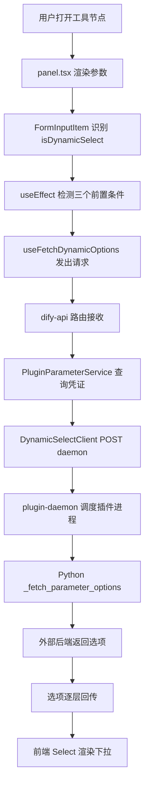
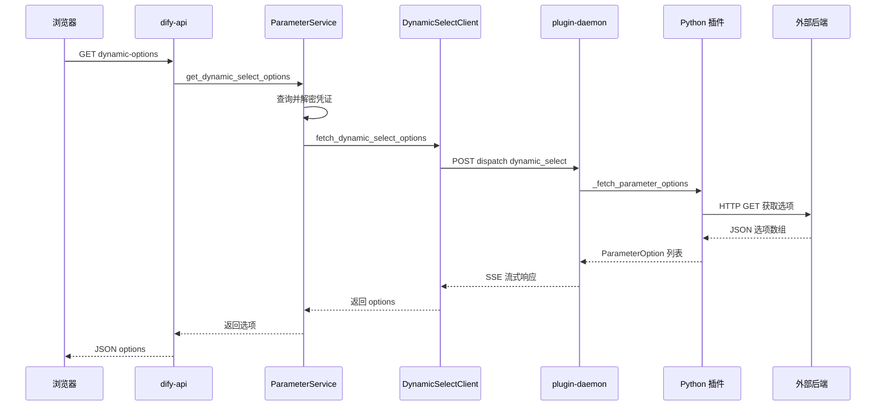
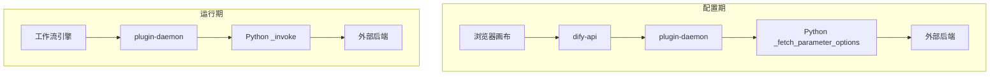
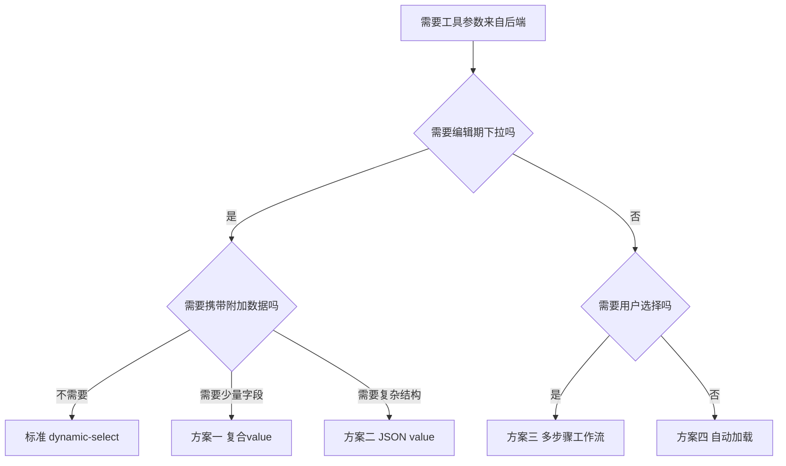
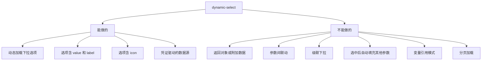
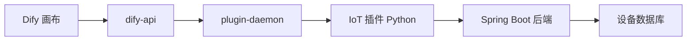

# Dify dynamic-select 能力边界源码级深度分析

> **核心结论**：Dify 的 `dynamic-select` 参数类型是**当前唯一官方支持的动态参数加载机制**，它可以让工具节点的下拉选项从后端接口实时获取。但从源码层面严格分析，它存在**五项硬性限制**，无法实现对象返回、参数联动、级联下拉等高级功能。本文逐行分析每一项限制的源码根因，并提供四种变通方案及完整代码示例。
>
> **版本锚点**：Dify 1.12.x / dify_plugin SDK 0.9.x / 源码基于 `dify/web` 与 `dify/api` 当前 main 分支。
>
> **前置阅读**：
> - [Dify dynamic-select 参数源码 11 跳分析](./20260604-0951-dify选择工具的时候dynamic-select参数源码分析.md)
> - [Dify 选择工具时界面参数定义源码分析](./20260604-0941-dify选择工具的时候-界面参数定义.md)
> - [Dify 动态参数调用后端测试通过全记录](./20260604-1016-dify动态参数调用后端测试通过.md)

---

## 目录

1. [dynamic-select 是什么](#1-dynamic-select-是什么)
2. [全链路总览与时序图](#2-全链路总览与时序图)
3. [API 接口完整文档](#3-api-接口完整文档)
4. [五项硬限制源码逐行分析](#4-五项硬限制源码逐行分析)
5. [限制一 返回格式只能是 value 加 label](#5-限制一-返回格式只能是-value-加-label)
6. [限制二 钩子方法只接收参数名](#6-限制二-钩子方法只接收参数名)
7. [限制三 API 请求体不携带其他参数状态](#7-限制三-api-请求体不携带其他参数状态)
8. [限制四 前端 extraParams 未传递](#8-限制四-前端-extraparams-未传递)
9. [限制五 运行期值被强制转为字符串](#9-限制五-运行期值被强制转为字符串)
10. [能力边界总结表](#10-能力边界总结表)
11. [四种变通方案与完整代码](#11-四种变通方案与完整代码)
12. [方案一 复合 value 拼接法](#12-方案一-复合-value-拼接法)
13. [方案二 JSON value 编码法](#13-方案二-json-value-编码法)
14. [方案三 多步骤工作流法](#14-方案三-多步骤工作流法)
15. [方案四 单参数动态加载法](#15-方案四-单参数动态加载法)
16. [方案对比与选型决策](#16-方案对比与选型决策)
17. [注意事项与最佳实践](#17-注意事项与最佳实践)
18. [常见问题 FAQ](#18-常见问题-faq)
19. [总结](#19-总结)

---

## 1. dynamic-select 是什么

`dynamic-select` 是 Dify 插件 SDK（`dify_plugin >= 0.9.0`）提供的一种工具参数类型。与静态 `select` 的核心区别在于：**下拉选项不是写死在 YAML 中的，而是在用户打开工具节点时由 Python 代码动态从外部接口拉取**。

### 1.1 典型使用场景

| 场景 | 说明 |
|------|------|
| IoT 设备选择 | 从设备管理服务获取当前租户下的设备列表 |
| Slack 频道选择 | 从 Slack API 获取工作空间下的频道列表 |
| 数据库选择 | 从数据库管理接口获取可用数据库列表 |
| 项目选择 | 从项目管理工具获取当前用户的项目列表 |

### 1.2 与静态 select 的本质区别

| 维度 | select | dynamic-select |
|------|--------|----------------|
| 选项来源 | YAML 中写死的 options | Python 运行期返回 |
| 获取时机 | 加载 YAML 即确定 | 用户打开节点时前端发起请求 |
| Python 钩子 | 不需要 | 必须实现 `_fetch_parameter_options` |
| 凭证依赖 | 不需要 | 需要凭证访问外部服务 |
| 后端枚举 | `CommonParameterType.SELECT` | `CommonParameterType.DYNAMIC_SELECT` |
| 前端枚举 | `FormTypeEnum.select` | `FormTypeEnum.dynamicSelect` |
| 选项能否包含附加数据 | 否 | 否 |
| 参数间联动 | 不支持 | 不支持 |

### 1.3 一个关键认知

**dynamic-select 的设计目标很纯粹**：为单个参数提供一个动态下拉列表。它**不是**一个通用的表单联动框架。理解了这一点，才能正确评估哪些需求它能满足、哪些不能。

很多开发者在初次使用时会产生一个误解：认为 dynamic-select 是一个「动态参数引擎」，可以实现类似 Ant Design ProForm 中 `dependencies` 那样的级联效果。实际上，Dify 的设计哲学是**最小可用集**——只解决「下拉选项来自后端」这一个核心需求，其他一切（联动、填充、搜索、分页）都不在当前架构范围内。

### 1.4 谁应该读这篇文章

- **插件开发者**：了解 dynamic-select 能做什么、不能做什么，避免在不可能的方向上浪费时间
- **Dify 前端开发者**：理解当前表单架构的限制，为未来扩展做准备
- **架构师**：评估 Dify 工具参数系统是否满足业务需求
- **产品经理**：理解技术边界，制定合理的功能规格

---

## 2. 全链路总览与时序图

### 2.1 配置期完整调用链

当用户在画布上打开工具节点时，dynamic-select 经历以下完整链路：



### 2.2 时序图



### 2.3 配置期与运行期是两条独立链路



**重要**：下拉选择只在编辑画布时触发。保存后值变为静态常量，运行期直接使用这个常量，**不会再次调用下拉接口**。

这条规则对插件开发者意味着：如果你的后端设备状态发生了变化（比如某台设备下线了），已经在画布上配置的工作流不会自动更新。它仍然使用保存时的设备 ID。如果你需要每次运行时都获取最新状态，应该使用方案三或方案四。

---

## 3. API 接口完整文档

### 3.1 前端发起的请求

**接口路径**：

```
GET /console/api/workspaces/current/plugin/parameters/dynamic-options
```

**请求参数**（Query String）：

| 参数名 | 类型 | 必填 | 说明 |
|--------|------|------|------|
| `plugin_id` | string | 是 | 插件 ID，来源 `currentProvider.plugin_id` |
| `provider` | string | 是 | Provider 全名，来源 `currentProvider.name` |
| `action` | string | 是 | 工具名称，来源 `currentTool.name` |
| `parameter` | string | 是 | 参数名，如 `device_id` |
| `provider_type` | string | 是 | 固定值 `tool` 或 `trigger` |
| `credential_id` | string | 否 | 指定凭证 ID，不传则使用默认凭证 |

**前端 Hook 定义**（`web/service/use-plugins.ts`）：

```typescript
export const useFetchDynamicOptions = (
  plugin_id: string,
  provider: string,
  action: string,
  parameter: string,
  provider_type?: string,
  extra?: Record<string, any>
) => {
  return useMutation({
    mutationFn: () => get<{ options: FormOption[] }>(
      '/workspaces/current/plugin/parameters/dynamic-options',
      {
        params: { plugin_id, provider, action, parameter, provider_type, ...extra },
      }
    ),
  })
}
```

**实际发出的 HTTP 请求示例**：

```
GET /console/api/workspaces/current/plugin/parameters/dynamic-options
    ?plugin_id=your-name%2Fiot_device_http
    &provider=your-name%2Fiot_device_http%2Fiot_device_http
    &action=dynamic_device_query
    &parameter=device_id
    &provider_type=tool
```

### 3.2 后端路由定义

**API 路由**（`api/controllers/console/workspace/plugin.py`）：

```python
@console_ns.route("/workspaces/current/plugin/parameters/dynamic-options")
class PluginFetchDynamicSelectOptionsApi(Resource):
    @setup_required
    @login_required
    @is_admin_or_owner_required
    @account_initialization_required
    def get(self):
        current_user, tenant_id = current_account_with_tenant()
        user_id = current_user.id
        args = ParserDynamicOptions.model_validate(request.args.to_dict(flat=True))

        try:
            options = PluginParameterService.get_dynamic_select_options(
                tenant_id=tenant_id,
                user_id=user_id,
                plugin_id=args.plugin_id,
                provider=args.provider,
                action=args.action,
                parameter=args.parameter,
                credential_id=args.credential_id,
                provider_type=args.provider_type,
            )
        except PluginDaemonClientSideError as e:
            return {"code": "plugin_error", "message": e.description}, 400

        return jsonable_encoder({"options": options})
```

**请求参数校验模型**（`ParserDynamicOptions`）：

```python
class ParserDynamicOptions(BaseModel):
    plugin_id: str
    provider: str
    action: str
    parameter: str
    credential_id: str | None = None
    provider_type: Literal["tool", "trigger"]
```

**安全守卫**：路由挂载了四个装饰器，要求 Dify 已初始化、用户已登录、用户为管理员或 Owner、账户已初始化。这意味着普通用户无法访问 dynamic-select 的下拉数据，只有管理员才能看到。

这四个装饰器的检查顺序是：

1. `setup_required` —— 检查 Dify 是否已完成初始化配置
2. `login_required` —— 检查用户是否已登录
3. `is_admin_or_owner_required` —— 检查用户是否为管理员或 Owner
4. `account_initialization_required` —— 检查用户账户是否已初始化

### 3.3 API 响应格式

**HTTP 200 成功响应**：

```json
{
    "options": [
        {
            "value": "device_001",
            "label": {
                "en_US": "客厅温度传感器 (device_001)",
                "zh_Hans": "客厅温度传感器 (device_001)"
            },
            "icon": null
        },
        {
            "value": "device_002",
            "label": {
                "en_US": "卧室智能灯泡 (device_002)",
                "zh_Hans": "卧室智能灯泡 (device_002)"
            },
            "icon": null
        }
    ]
}
```

**响应字段说明**：

| 字段 | 类型 | 必填 | 说明 |
|------|------|------|------|
| `options` | array | 是 | 选项列表 |
| `options[].value` | string | 是 | 选项值，**必须是字符串** |
| `options[].label` | I18nObject | 是 | 国际化标签，含 `en_US`、`zh_Hans` 等 |
| `options[].icon` | string 或 null | 否 | 图标 URL 或 base64 |

**HTTP 400 错误响应**：

```json
{
    "code": "plugin_error",
    "message": "具体错误描述"
}
```

### 3.4 Trigger 专用接口（编辑模式）

Trigger 插件在编辑凭证时，支持凭证未保存也能预览下拉选项：

```
POST /console/api/workspaces/current/plugin/parameters/dynamic-options-with-credentials
```

**请求体**（JSON Body）：

```python
class ParserDynamicOptionsWithCredentials(BaseModel):
    plugin_id: str
    provider: str
    action: str
    parameter: str
    credential_id: str
    credentials: Mapping[str, Any]   # 编辑中但未保存的凭证
```

此接口仅限 Trigger 插件使用，Tool 插件不走此路径。它的存在是为了解决 Trigger 编辑凭证时的一个特殊场景：用户修改了凭证但还没保存，此时需要预览下拉选项是否正常工作。如果用标准接口，由于凭证还未保存，后端无法访问外部服务，下拉会加载失败。

### 3.6 DynamicSelectClient 到 plugin-daemon 的请求

**请求方式**：

```python
# api/core/plugin/impl/dynamic_select.py
response = self._request_with_plugin_daemon_response_stream(
    "POST",
    f"plugin/{tenant_id}/dispatch/dynamic_select/fetch_parameter_options",
    PluginDynamicSelectOptionsResponse,
    data={
        "user_id": user_id,
        "data": {
            "provider": GenericProviderID(provider).provider_name,
            "credentials": credentials,
            "credential_type": credential_type,
            "provider_action": action,
            "parameter": parameter,
        },
    },
    headers={
        "X-Plugin-ID": plugin_id,
        "Content-Type": "application/json",
    },
)
```

**发送到 daemon 的 data 字段**：

| 字段 | 说明 | 能否携带其他参数值 |
|------|------|------------------|
| `user_id` | 当前用户 ID | - |
| `data.provider` | Provider 名称 | - |
| `data.credentials` | 解密后的凭证 | - |
| `data.credential_type` | 凭证类型 | - |
| `data.provider_action` | 工具名称 | - |
| `data.parameter` | 参数名 | - |

**关键发现**：`data` 中**只有 `parameter`（参数名）**，没有任何字段可以传递其他参数的当前值。

---

## 4. 五项硬限制源码逐行分析

通过对 Dify 前端、后端、SDK 三层源码的逐行分析，dynamic-select 存在以下五项硬性限制，每一项都源自代码架构层面的设计决策，而非临时 bug。

---

## 5. 限制一：返回格式只能是 value 加 label

这是 dynamic-select 最根本的限制。从数据模型的定义开始，就锁定了每个选项只能包含三个字段：值、标签、图标。这意味着你无法在一次请求中返回一个包含丰富信息的复杂对象。

### 5.1 后端数据模型

```python
# api/core/plugin/entities/parameters.py
class PluginParameterOption(BaseModel):
    value: str = Field(..., description="The value of the option")
    label: I18nObject = Field(..., description="The label of the option")
    icon: str | None = Field(default=None, description="The icon of the option")
```

**分析**：

1. `value` 字段类型标注为 `str`，并且有 `field_validator` 强制将非字符串转为字符串
2. `label` 是 `I18nObject`（只含 `en_US`、`zh_Hans` 等语言键）
3. `icon` 是可选的字符串
4. **没有任何 `extra`、`metadata`、`payload` 之类的附加数据字段**

### 5.2 daemon 响应模型

```python
# api/core/plugin/entities/plugin_daemon.py
class PluginDynamicSelectOptionsResponse(BaseModel):
    options: Sequence[PluginParameterOption] = Field(
        description="The options of the dynamic select."
    )
```

响应体只能包含 `PluginParameterOption` 列表，**无法携带任何额外数据**。

### 5.3 前端接收格式

```typescript
// web/service/use-plugins.ts
mutationFn: () => get<{ options: FormOption[] }>(...)
```

前端期望的 `FormOption` 类型：

```typescript
// web/app/components/header/account-setting/model-provider-page/declarations.ts
export type FormOption = {
  label: TypeWithI18N
  value: string
  show_on: FormShowOnObject[]
  icon?: string
}
```

同样只有 `value`（string）+ `label`（i18n）+ `icon`。**前端也不期望接收附加数据**。

### 5.4 影响

- 无法在一个选项中同时返回设备 ID + IP 地址 + 设备类型
- 选中一个选项后，无法自动填充其他参数的值
- 所有附加信息只能在运行期 `_invoke` 中通过再次请求后端获取
- 如果你的业务场景是「选择设备后，在画布上看到该设备的详细信息以便后续配置」，dynamic-select 原生无法满足

### 5.5 为什么设计成这样

`PluginParameterOption` 的设计继承自 `dify_plugin` SDK 的 `ParameterOption`，SDK 团队将下拉选项定义为最简结构：一个标识符加一个展示文本。这种设计在简单场景下完全够用，但面对复杂业务时显得力不从心。要扩展它，需要同时修改 SDK、API、前端三层的类型定义。

---

## 6. 限制二：钩子方法只接收参数名

这是 dynamic-select 实现联动的最大障碍。即使你能修改前端传递更多数据，后端的钩子方法签名也只接收一个参数名，无法感知其他参数的当前状态。

### 6.1 SDK 方法签名

```python
# 插件 SDK 定义的钩子方法
class Tool:
    def _fetch_parameter_options(self, parameter: str) -> list[ParameterOption]:
        """配置期被调用，返回动态选项列表"""
        ...
```

**只有一个参数** `parameter: str`，即当前需要加载选项的参数名（如 `"device_id"`）。

### 6.2 plugin-daemon 调度时传入的数据

plugin-daemon 从 `DynamicSelectClient` 收到的请求体中，传给插件的也只有：

```json
{
    "provider": "iot_device_http",
    "credentials": {"spring_service_url": "http://10.11.34.37:8080"},
    "credential_type": "api-key",
    "provider_action": "dynamic_device_query",
    "parameter": "device_id"
}
```

**没有 `other_params`、`form_values`、`context` 等字段**。

### 6.3 影响

- `_fetch_parameter_options` **完全不知道**用户在同一个工具节点的其他参数中填了什么
- 无法根据用户在「区域」下拉中选择的区域来过滤「设备」下拉的选项
- 每个 dynamic-select 参数的选项加载是**完全独立**的，互不感知

举一个具体的例子：假设你的工具有两个参数——「区域」和「设备」，都是 dynamic-select。理想情况下，用户选了「华东区」后，「设备」下拉应该只显示华东区的设备。但在当前架构下，当「设备」的 `_fetch_parameter_options` 被调用时，它收到的参数只是 `"device_id"` 这个字符串，完全不知道用户选了哪个区域。因此，你只能返回所有设备，无法按区域过滤。

---

## 7. 限制三：API 请求体不携带其他参数状态

即使你想绕过 SDK 钩子签名的限制，后端 API 层也不传递表单上下文。这意味着即使你在前端做了很多工作，后端也无法接收。

### 7.1 后端校验模型

```python
# api/controllers/console/workspace/plugin.py
class ParserDynamicOptions(BaseModel):
    plugin_id: str
    provider: str
    action: str
    parameter: str
    credential_id: str | None = None
    provider_type: Literal["tool", "trigger"]
```

**六个字段，全部是标识性信息**，没有任何一个字段用于传递其他参数的当前值。

### 7.2 服务层方法签名

```python
# api/services/plugin/plugin_parameter_service.py
class PluginParameterService:
    @staticmethod
    def get_dynamic_select_options(
        tenant_id: str,
        user_id: str,
        plugin_id: str,
        provider: str,
        action: str,
        parameter: str,
        credential_id: str | None,
        provider_type: Literal["tool", "trigger"],
    ) -> Sequence[PluginParameterOption]:
```

服务层同样**只接收标识参数**，不接收表单状态。

### 7.3 影响

即使你想通过修改前端来传递其他参数值，后端 API 的 Pydantic 校验模型也会**拒绝未声明的字段**（Pydantic 默认 `extra='forbid'` 或在 `model_validate` 时忽略额外字段）。要实现参数联动，需要**同时修改前端 Hook、后端模型、服务层、daemon 请求体、SDK 方法签名**五处代码。

这是一个典型的「全栈改动」场景。任何一层不配合，整个联动机制就无法工作。这也是 dynamic-select 联动功能至今未被实现的主要原因——改动面太广，风险太高，收益不够明显。

---

## 8. 限制四：前端 extraParams 未传递

这是最容易让人困惑的限制，因为从表面上看，前端代码似乎已经预留了 `extraParams` 的传递接口。但实际上，整条传递链上存在多个断点，导致 `extraParams` 始终为 `undefined`。

### 8.1 extraParams 传递链分析

`FormInputItem` 组件接收 `extraParams` 属性，并将其传给 `useFetchDynamicOptions`：

```typescript
// web/app/components/workflow/nodes/_base/components/form-input-item.tsx
const { mutateAsync: fetchDynamicOptions } = useFetchDynamicOptions(
  currentProvider?.plugin_id || '',
  currentProvider?.name || '',
  currentTool?.name || '',
  variable || '',
  providerType,
  extraParams,   // 传给了 Hook
)
```

但是 `ToolForm` 在调用时**没有传 extraParams**：

```tsx
// web/app/components/workflow/nodes/tool/panel.tsx
<ToolForm
  schema={toolInputVarSchema}
  value={inputs.tool_parameters}
  onChange={setInputVar}
  currentProvider={currCollection}
  currentTool={currTool}
  // 没有 extraParams prop
/>
```

`ToolForm` 的类型定义中虽然有 `extraParams`，但 `panel.tsx` 不传，所以它始终是 `undefined`。

### 8.2 useEffect 的依赖项

```typescript
useEffect(() => {
  // ...fetch logic
}, [
  isDynamicSelect,
  currentTool?.name,
  currentProvider?.name,
  variable,
  extraParams,       // 始终是 undefined
  providerType,
  fetchDynamicOptions,
])
```

`extraParams` 在依赖数组中但始终为 `undefined`，**不会因为其他参数值变化而重新触发拉取**。即使你修改了「区域」下拉的值，「设备」下拉也不会重新加载。

### 8.3 handleValueChange 不触发联动

```typescript
const handleValueChange = (newValue: FormInputValue) => {
  const nextType = getVarKindType(formState) ?? varInput?.type ?? VarKindType.constant
  onChange({
    ...value,
    [variable]: {
      ...varInput,
      type: nextType,
      value: newValue,   // 只更新当前参数的值
    },
  })
}
```

选中一个 dynamic-select 选项后，`handleValueChange` 只更新**当前参数**的值。没有机制通知其他 dynamic-select 参数「我变了，你该重新加载了」。

### 8.4 getVarKindType 锁定为 constant

```typescript
// form-input-item.helpers.ts
export const getVarKindType = (state: FormInputState) => {
  if (state.isSelect || state.isDynamicSelect || state.isBoolean || ...)
    return VarKindType.constant   // dynamic-select 强制为常量
  if (state.isString)
    return VarKindType.mixed
  return undefined
}
```

dynamic-select 的值**始终作为常量存储**，不支持变量引用模式。这意味着你不能用上游节点的输出作为 dynamic-select 的输入。

### 8.5 extraParams 传递链断点分析

让我们完整跟踪 `extraParams` 的传递链，看看在哪些地方断开了：

1. **`FormInputItem` 组件**：接收 `extraParams` 属性 ✅
2. **传给 `useFetchDynamicOptions`**：`extraParams` 作为最后一个参数传入 ✅
3. **`ToolForm` 组件**：渲染 `FormInputItem` 时**未传** `extraParams` ❌
4. **`panel.tsx`**：渲染 `ToolForm` 时**未传** `extraParams` ❌
5. **`useEffect` 依赖项**：`extraParams` 在数组中但始终为 `undefined` ❌

传递链在第三步和第四步断裂。即使 `FormInputItem` 的接口定义了 `extraParams`，但上游组件从未传值，导致整个机制失效。这是前端架构的一个设计疏忽——预留了扩展点，但忘记接线。

---

## 9. 限制五：运行期值被强制转为字符串

这是很多开发者容易忽略的一个陷阱。当你在 dynamic-select 中存储了 JSON 字符串时，运行期引擎不会帮你解析它——它就是一个普通的字符串。你需要在 `_invoke` 中手动处理。

### 9.1 cast_parameter_value 源码

```python
# api/core/plugin/entities/parameters.py
def cast_parameter_value(typ: StrEnum, value: Any, /):
    match typ.value:
        case (
            PluginParameterType.STRING
            | PluginParameterType.SECRET_INPUT
            | PluginParameterType.SELECT
            | PluginParameterType.CHECKBOX
            | PluginParameterType.DYNAMIC_SELECT    # 与 string 同处理
        ):
            if value is None:
                return ""
            else:
                return value if isinstance(value, str) else str(value)
```

`DYNAMIC_SELECT` 与 `STRING`、`SELECT` 走同一个分支：**强制转为字符串**。

### 9.2 运行期参数合并

```python
# api/core/workflow/node_runtime.py
@staticmethod
def _build_tool_runtime_spec(node_data: ToolNodeData):
    tool_configurations = dict(node_data.tool_configurations)
    tool_configurations.update(
        {name: tool_input.model_dump(mode="python")
         for name, tool_input in node_data.tool_parameters.items()}
    )
```

`tool_parameters`（含 dynamic-select 值）和 `tool_configurations` 合并为一个扁平字典传给 `_invoke`。dynamic-select 的值在这个字典中就是一个**普通字符串**。

### 9.3 影响

- 即使你在 `value` 中存了 JSON 字符串，运行期它也是一个字符串
- 需要在 `_invoke` 中手动 `json.loads()` 解析
- 不会对 JSON 格式做任何校验
- 如果你用了方案二（JSON value），必须在 `_invoke` 中加入 `try/except` 来防止解析失败
- LLM 在生成工具参数时，可能会尝试「修正」你的 JSON，导致格式损坏

这一点在设计 JSON value 方案时尤为重要。你需要在 `_invoke` 的入口处就对 `device_id` 参数进行解析验证，并提供友好的错误信息，而不是让异常向上传播导致工作流失败。

---

## 10. 能力边界总结表

| 能力 | 是否支持 | 源码根因 |
|------|---------|---------|
| 动态加载下拉选项 | 支持 | `_fetch_parameter_options` + 11 跳链路 |
| 选项包含 value + label | 支持 | `PluginParameterOption` 模型 |
| 选项包含 icon | 支持 | `icon: str \| None` 字段 |
| 选项包含附加数据 | **不支持** | `PluginParameterOption` 只有三个字段 |
| 根据其他参数值过滤选项 | **不支持** | 钩子只接收 `parameter: str` |
| 多个下拉互相联动 | **不支持** | API 不传表单状态 + useEffect 不监听其他值 |
| 选中后自动填充其他参数 | **不支持** | `handleValueChange` 只更新当前参数 |
| 使用变量引用作为值 | **不支持** | `getVarKindType` 返回 `constant` |
| 运行期值为对象 | **不支持** | `cast_parameter_value` 强制转 `str` |
| 分页加载选项 | **不支持** | 无分页参数，一次性返回全量 |
| 搜索过滤选项 | **不支持** | 前端无搜索逻辑 |
| 手动刷新选项 | **不支持** | 无刷新按钮，由 useEffect 自动触发 |
| 自定义选项渲染 | 部分支持 | 只支持 icon + label 文本 |

---

## 11. 四种变通方案与完整代码

虽然 dynamic-select 原生能力有限，但通过巧妙的工程设计，可以在现有框架内实现近似效果。以下提供四种变通方案，按复杂度递增排列。

---

## 12. 方案一：复合 value 拼接法

### 12.1 思路

将多个字段用分隔符拼接到 `value` 中，运行期在 `_invoke` 中解析。

### 12.2 适用场景

需要选中后在运行期获取 2-3 个附加字段，且字段值不含分隔符。

### 12.3 Python 插件代码

```python
import json
import sys
from typing import Any, Generator
import requests
from dify_plugin import Tool
from dify_plugin.entities import I18nObject, ParameterOption
from dify_plugin.entities.tool import ToolInvokeMessage


def _log(msg: str) -> None:
    print(f"[composite_value] {msg}", flush=True, file=sys.stderr)


class CompositeValueTool(Tool):

    def _fetch_parameter_options(self, parameter: str) -> list[ParameterOption]:
        if parameter != "device_id":
            return []

        url = self.runtime.credentials.get("spring_service_url", "").rstrip("/")
        if not url:
            return []

        try:
            resp = requests.get(f"{url}/api/devices", timeout=15)
            resp.raise_for_status()
            devices = resp.json()
        except Exception as e:
            _log(f"fetch failed: {e}")
            return []

        options = []
        for d in devices:
            # 复合 value: device_id|ip|device_type|location
            composite = "|".join([
                d["deviceId"],
                d.get("ip", "unknown"),
                d.get("deviceType", "unknown"),
                d.get("location", "unknown"),
            ])
            options.append(ParameterOption(
                value=composite,
                label=I18nObject(
                    en_US=f"{d['deviceName']} ({d['deviceId']})",
                    zh_Hans=f"{d['deviceName']} ({d['deviceId']})",
                ),
            ))
        return options

    def _invoke(self, tool_parameters: dict[str, Any]) -> Generator[ToolInvokeMessage, None, None]:
        raw = tool_parameters.get("device_id", "")
        parts = raw.split("|")

        if len(parts) < 4:
            yield self.create_text_message(f"device_id 格式错误: {raw}")
            return

        device_id, device_ip, device_type, location = parts[0], parts[1], parts[2], parts[3]
        _log(f"parsed: id={device_id}, ip={device_ip}, type={device_type}, loc={location}")

        # 现在可以在运行期使用所有字段
        yield self.create_text_message(
            f"设备ID: {device_id}\n"
            f"设备IP: {device_ip}\n"
            f"设备类型: {device_type}\n"
            f"设备位置: {location}"
        )
```

### 12.4 优缺点

| 优点 | 缺点 |
|------|------|
| 实现简单，无需修改 Dify 源码 | value 字符串可读性差 |
| 运行期可直接使用附加字段 | 字段值不能包含分隔符 |
| 前端显示正常（label 不受影响） | LLM prompt 中看到拼接字符串 |

---

## 13. 方案二：JSON value 编码法

### 13.1 思路

将 value 设为 JSON 字符串，运行期在 `_invoke` 中用 `json.loads()` 解析。这是方案一的升级版，能承载任意复杂结构。这也是实际项目中最常用的方案，因为它既保持了 dynamic-select 的下拉交互体验，又能携带丰富的附加数据。

JSON value 方案的核心思想是：**value 字段虽然是字符串，但字符串的内容可以是 JSON**。运行期的 `cast_parameter_value` 虽然会把值强制转为字符串，但 JSON 本身就是字符串，所以不受影响。

### 13.2 适用场景

需要传递嵌套对象或多个附加字段，且字段值可能包含特殊字符。特别适合以下场景：

- 设备信息包含嵌套的能力列表（数组）
- 字段值可能包含管道符、逗号等分隔符
- 需要在运行期进行结构化查询（如按类型分组）
- 附加字段数量不固定，需要灵活扩展

### 13.3 Python 插件代码

```python
import json
import sys
from typing import Any, Generator
import requests
from dify_plugin import Tool
from dify_plugin.entities import I18nObject, ParameterOption
from dify_plugin.entities.tool import ToolInvokeMessage


def _log(msg: str) -> None:
    print(f"[json_value] {msg}", flush=True, file=sys.stderr)


class JsonValueTool(Tool):

    def _fetch_parameter_options(self, parameter: str) -> list[ParameterOption]:
        if parameter != "device_id":
            return []

        url = self.runtime.credentials.get("spring_service_url", "").rstrip("/")
        if not url:
            return []

        try:
            resp = requests.get(f"{url}/api/devices", timeout=15)
            resp.raise_for_status()
            devices = resp.json()
        except Exception as e:
            _log(f"fetch failed: {e}")
            return []

        options = []
        for d in devices:
            # JSON value: 包含完整设备信息
            json_value = json.dumps({
                "id": d["deviceId"],
                "ip": d.get("ip", ""),
                "type": d.get("deviceType", ""),
                "location": d.get("location", ""),
                "capabilities": d.get("capabilities", []),
            }, ensure_ascii=False)

            options.append(ParameterOption(
                value=json_value,
                label=I18nObject(
                    en_US=f"{d['deviceName']} ({d['deviceId']})",
                    zh_Hans=f"{d['deviceName']} ({d['deviceId']})",
                ),
            ))
        return options

    def _invoke(self, tool_parameters: dict[str, Any]) -> Generator[ToolInvokeMessage, None, None]:
        raw = tool_parameters.get("device_id", "")

        try:
            device_info = json.loads(raw)
        except (json.JSONDecodeError, TypeError):
            yield self.create_text_message(f"device_id JSON 解析失败: {raw[:100]}")
            return

        device_id = device_info.get("id", "")
        device_ip = device_info.get("ip", "")
        device_type = device_info.get("type", "")
        location = device_info.get("location", "")
        capabilities = device_info.get("capabilities", [])

        _log(f"parsed: {json.dumps(device_info, ensure_ascii=False)}")

        # 所有字段都可在运行期使用
        yield self.create_text_message(
            f"设备ID: {device_id}\n"
            f"设备IP: {device_ip}\n"
            f"设备类型: {device_type}\n"
            f"设备位置: {location}\n"
            f"支持操作: {', '.join(capabilities)}"
        )
        yield self.create_json_message(device_info)
```

### 13.4 画布上保存后的 JSON 结构

当用户选择了「厨房智能开关」后，画布保存的 `tool_parameters` 中：

```json
{
  "device_id": {
    "type": "constant",
    "value": "{\"id\": \"device_003\", \"ip\": \"10.11.34.37\", \"type\": \"smart_switch\", \"location\": \"厨房\", \"capabilities\": [\"turn_on\", \"turn_off\"]}"
  }
}
```

### 13.5 优缺点

| 优点 | 缺点 |
|------|------|
| 支持任意复杂结构 | value 字符串很长，可读性差 |
| 支持特殊字符 | LLM prompt 中看到 JSON 字符串 |
| 字段数量不受限 | 画布 JSON 体积增大 |
| 运行期解析方便 | 调试时需要先 json.loads |

---

## 14. 方案三：多步骤工作流法

### 14.1 思路

不依赖 dynamic-select 携带附加数据，而是将工作流拆成多个节点：第一个节点负责选择 ID，后续节点拿着 ID 去查询完整信息。这是**最符合 Dify 工作流设计理念**的方案，因为它完全遵循了「每个节点做一件事」的哲学。

Dify 的工作流本质上是一个有向无环图（DAG），节点之间通过变量引用传递数据。利用这个机制，dynamic-select 只需要完成「选择 ID」这一步，后续的「查详情」和「生成报告」由其他节点负责。

### 14.2 工作流结构


**节点职责**：

| 节点 | 类型 | 做什么 |
|------|------|--------|
| 动态设备查询 | Tool + dynamic-select | 选择设备 ID 并返回基本信息 |
| HTTP 查设备详情 | HTTP 请求 | 用设备 ID 查询完整信息 |
| LLM 生成报告 | LLM | 根据完整信息生成报告 |

### 14.3 实现方式

**第一步**：dynamic-select 正常返回简单 value

```python
def _fetch_parameter_options(self, parameter: str) -> list[ParameterOption]:
    # 返回简单的 value，不携带附加数据
    return [
        ParameterOption(
            value=d["deviceId"],
            label=I18nObject(en_US=d["deviceName"]),
        )
        for d in devices
    ]
```

**第二步**：下游 HTTP 节点用变量引用获取详情

在 HTTP 节点的 URL 中使用变量引用：

```
http://10.11.34.37:8080/api/devices/{{#1780487692663.text#}}
```

其中 `{{#1780487692663.text#}}` 引用上游工具节点输出的设备 ID。

### 14.4 优缺点

| 优点 | 缺点 |
|------|------|
| 最灵活，不受 dynamic-select 限制 | 工作流节点数增加 |
| 每个节点职责清晰 | 需要用户理解变量引用 |
| 附加数据可以是任意复杂 | 需要额外配置 HTTP 节点 |
| 不修改任何插件代码 | 画布复杂度增加 |

### 14.5 变量引用语法

Dify 工作流中节点间传递变量使用 `{{#node_id.variable_name#}}` 语法。例如：

- `{{#1780487692663.text#}}` —— 引用节点 ID 为 1780487692663 的节点的 `text` 输出
- `{{#1780487692663.json#}}` —— 引用 JSON 输出
- `{{#sys.query#}}` —— 系统变量

在 HTTP 节点的 URL 中使用变量引用时，Dify 会在运行期自动替换为实际值。这是 Dify 工作流最核心的数据流转机制。

---

## 15. 方案四：单参数动态加载法

### 15.1 思路

不使用 dynamic-select，而是在运行期通过工具代码自行从后端加载数据。适用于不需要编辑期下拉 UX 的场景。

### 15.2 适用场景

不需要用户在画布上选择具体设备，而是每次运行时自动获取最新数据。

### 15.3 Python 插件代码

```python
class AutoLoadTool(Tool):
    def _invoke(self, tool_parameters: dict[str, Any]) -> Generator[ToolInvokeMessage, None, None]:
        url = self.runtime.credentials.get("spring_service_url", "").rstrip("/")

        # 运行期自动获取所有设备
        resp = requests.get(f"{url}/api/devices", timeout=15)
        devices = resp.json()

        # 自动选择第一个在线设备
        online_device = next(
            (d for d in devices if d.get("status") == "online"),
            None
        )

        if not online_device:
            yield self.create_text_message("没有在线设备")
            return

        # 查询该设备状态
        device_id = online_device["deviceId"]
        status_resp = requests.get(f"{url}/api/devices/{device_id}/status", timeout=15)
        yield self.create_text_message(
            f"自动选择设备: {device_id}\n{status_resp.text}"
        )
```

### 15.4 优缺点

| 优点 | 缺点 |
|------|------|
| 每次运行获取最新数据 | 没有编辑期下拉 UX |
| 实现最简单 | 用户无法选择特定设备 |
| 不需要 dynamic-select | 不适合需要人工选择的场景 |

方案四的本质是放弃了 dynamic-select 的所有优势（编辑期下拉、用户选择、凭证驱动），换来「每次运行自动取最新」的能力。如果你的业务场景不需要用户选择，而是系统自动决策，这是一个很好的选择。但如果用户必须在编辑时看到并选择具体设备，那么方案四就不适用了。

---

## 16. 方案对比与选型决策

### 16.1 四种方案综合对比

| 维度 | 方案一 复合value | 方案二 JSON value | 方案三 多步骤 | 方案四 自动加载 |
|------|----------------|------------------|-------------|----------------|
| 编辑期下拉 UX | 有 | 有 | 有 | 无 |
| 运行期附加数据 | 有限字段 | 任意结构 | 任意结构 | 任意结构 |
| 实现复杂度 | 低 | 中 | 中 | 低 |
| 修改插件代码 | 是 | 是 | 否 | 是 |
| 修改 Dify 源码 | 否 | 否 | 否 | 否 |
| LLM 友好度 | 中 | 差 | 好 | 好 |
| 用户可选择 | 是 | 是 | 是 | 否 |
| 推荐指数 | 三星 | 四星 | 五星 | 三星 |

**推荐指数解释**：方案三获得五星是因为它完全符合 Dify 的设计理念，且不需要任何特殊处理。方案二获得四星是因为它在保持下拉交互的同时能携带丰富数据，是实际项目中最常用的方案。方案一和方案四各三星，分别适用于简单场景和不需要用户选择的场景。

### 16.2 决策流程图



### 16.3 最佳实践建议

**首选方案三（多步骤工作流）**：这是最符合 Dify 工作流设计理念的方案。每个节点做一件事，通过变量引用串联数据流。既保持了 dynamic-select 的下拉 UX，又不受 value 格式限制。

**次选方案二（JSON value）**：如果不想增加工作流节点，且附加数据不超过 3-4 个字段，JSON value 是最实用的方案。运行期 `json.loads` 一行代码即可解析。这也是大多数实际项目中采用的方案，因为它的改动最小，且能覆盖绝大多数场景。

**简单场景用方案一（复合 value）**：如果只需要携带一两个简单的字符串字段，用分隔符拼接比 JSON 更轻量。但要注意字段值不能包含分隔符。

**不需要用户选择时用方案四（自动加载）**：如果你的业务不需要用户在画布上选择特定设备，而是每次运行时自动获取最新数据，那么根本不需要 dynamic-select，直接在 `_invoke` 中查询后端即可。

---

## 17. 注意事项与最佳实践

### 17.0 核心原则

在使用 dynamic-select 之前，必须牢记以下核心原则：

1. **一次一个值**：每个 dynamic-select 参数只能有一个字符串值，不能返回对象或数组
2. **配置期与运行期分离**：下拉选择发生在编辑画布时，运行期直接使用保存的常量值
3. **参数独立性**：每个 dynamic-select 参数的加载是完全独立的，互不感知
4. **凭证驱动**：dynamic-select 的数据源访问通常需要凭证，凭证从数据库查询并解密
5. **异常安全**：`_fetch_parameter_options` 中捕获所有异常，返回空列表而非抛异常，避免整条链路崩溃

这些原则源自 Dify 的架构设计，短期内不会改变。理解它们能帮你快速判断一个需求是否可行。

### 17.1 dynamic-select 开发清单

| 序号 | 检查项 | 说明 |
|------|--------|------|
| 1 | YAML 中 `form: llm` | Dify 1.12.x 必须，否则下拉不触发 |
| 2 | `apply_sdk_patches()` 在 `Plugin()` 之前 | 解决 SDK 280 Bug |
| 3 | 凭证填局域网 IP | 插件在 K8s Pod 中，localhost 指向容器自身 |
| 4 | 每次修改递增版本号 | daemon 缓存旧版依赖 |
| 5 | 先卸载旧版再安装新版 | 确保 daemon 加载新代码 |
| 6 | `_fetch_parameter_options` 返回空列表而非抛异常 | 避免整条链路崩溃 |
| 7 | value 必须是字符串 | `PluginParameterOption.value` 类型为 `str` |
| 8 | label 使用 I18nObject | 至少包含 `en_US` |
| 9 | 超时设置不超过 15 秒 | 前端有超时控制 |
| 10 | 运行期不会再调下拉接口 | 保存后值为静态常量 |

### 17.2 YAML 模板

```yaml
parameters:
  - name: device_id
    type: dynamic-select
    required: true
    form: llm              # 必须为 llm
    label:
      en_US: Device
      zh_Hans: 设备
    human_description:
      en_US: "Select device from dynamic dropdown"
      zh_Hans: "从动态下拉框选择设备"
    llm_description: "The device_id selected from backend-powered dropdown"
    # 注意：不要写 options，dynamic-select 不需要
```

### 17.3 Python 模板

```python
import sys
from typing import Any, Generator
import requests
from dify_plugin import Tool
from dify_plugin.entities import I18nObject, ParameterOption
from dify_plugin.entities.tool import ToolInvokeMessage


def _log(msg: str) -> None:
    print(f"[your_tool] {msg}", flush=True, file=sys.stderr)


class YourTool(Tool):

    def _fetch_parameter_options(self, parameter: str) -> list[ParameterOption]:
        _log(f"_fetch_parameter_options called: parameter={parameter}")

        # 只处理目标参数
        if parameter != "your_param":
            return []

        url = self.runtime.credentials.get("service_url", "").rstrip("/")
        if not url:
            _log("service_url is empty")
            return []

        try:
            resp = requests.get(f"{url}/api/options", timeout=15)
            resp.raise_for_status()
            items = resp.json()
        except Exception as e:
            _log(f"fetch failed: {e}")
            return []   # 异常时返回空列表，不要抛异常

        return [
            ParameterOption(
                value=str(item["id"]),
                label=I18nObject(en_US=item["name"], zh_Hans=item["name"]),
            )
            for item in items
            if item.get("id")
        ]

    def _invoke(self, tool_parameters: dict[str, Any]) -> Generator[ToolInvokeMessage, None, None]:
        selected_value = tool_parameters.get("your_param", "")
        _log(f"selected value: {selected_value}")
        # ... 业务逻辑
        yield self.create_text_message(f"Result for {selected_value}")
```

### 17.4 main.py 模板

```python
# main.py
from plugin_bootstrap import apply_sdk_patches
apply_sdk_patches()   # 必须在 Plugin() 之前

from dify_plugin import Plugin, DifyPluginEnv
plugin = Plugin(DifyPluginEnv())
plugin.run()
```

---

## 18. 常见问题 FAQ

### Q1: 能否让 dynamic-select 返回对象，选中后自动填充其他输入框？

**不能。** `PluginParameterOption` 只有 `value`（str）、`label`（I18nObject）、`icon`（str 或 None）三个字段。`handleValueChange` 只更新当前参数的值，不会触发其他参数的更新。如果需要在运行期获取附加数据，请使用方案一（复合 value）或方案二（JSON value）。

### Q2: 多个 dynamic-select 能否互相联动？比如选了区域后设备下拉自动过滤？

**不能。** 原因有三：（1）`_fetch_parameter_options` 只接收 `parameter: str`，不知道其他参数的值；（2）`ParserDynamicOptions` API 模型不携带其他参数状态；（3）前端 `useEffect` 的依赖项中 `extraParams` 始终为 `undefined`，不会因为其他参数变化而重新触发。每个 dynamic-select 的加载是完全独立的。

具体来说，联动需要满足三个条件：

1. **数据层**：后端知道其他参数的当前值，能据此过滤选项
2. **触发层**：当依赖参数变化时，自动重新拉取选项
3. **传递层**：前端将当前表单状态传给后端

这三个条件在 Dify 当前架构中均不满足。要实现联动，需要同时修改前后端多处代码。推荐的变通方案是方案三（多步骤工作流），用不同的节点分别处理选择和数据加载。

### Q3: 每个下拉都需要写一个新接口吗？

**不一定。** 如果你的后端有一个统一接口可以根据参数名返回不同选项，可以复用。但每个 dynamic-select 参数确实对应一次独立的 `_fetch_parameter_options` 调用，且格式固定为 `[{value, label}]`。后端需要自行根据 `parameter` 参数区分是哪个下拉。

推荐的做法是在后端设计一个统一的选项接口，根据 `parameter` 参数路由到不同的数据源。例如：

```python
def _fetch_parameter_options(self, parameter: str) -> list[ParameterOption]:
    url = self.runtime.credentials.get("service_url")
    # 用一个接口根据参数名获取不同选项
    resp = requests.get(f"{url}/api/options/{parameter}")
    return [ParameterOption(value=item["id"], label=I18nObject(en_US=item["name"]))
            for item in resp.json()]
```

这样只需要后端一个接口，根据路径中的 `parameter` 参数返回不同的选项数据。

### Q4: 下拉选项很多时能否分页？

**不能。** `_fetch_parameter_options` 没有分页参数，API 也不传 `page`/`page_size`。所有选项必须一次性返回。如果选项超过数百条，建议在前端做客户端搜索（浏览器原生 Select 支持键盘过滤）。

### Q5: 配置期选的值在运行期会变吗？

**不会。** 画布保存后，dynamic-select 的值变为静态常量存储在 `tool_parameters` 中。运行期直接使用这个常量，不会再次调用下拉接口。如果需要每次运行取最新值，应使用方案四（自动加载）或多步骤工作流。

这是很多开发者的一个常见误解。他们以为 dynamic-select 的值在每次运行时会实时从后端获取，但实际上：

- **配置期**：用户打开节点 → 前端调用 API → 后端调用 `_fetch_parameter_options` → 返回选项
- **保存时**：前端将选中的 `value` 存入 `tool_parameters`，类型为 `constant`
- **运行期**：工作流引擎从 `tool_parameters` 读取值，直接作为常量使用

这意味着如果你在周一选了一个设备，周三运行工作流，用的是周一时的设备 ID，即使该设备已下线。这是 dynamic-select 的固有行为，不是 bug。如果你的业务需要实时数据，应该使用方案四（自动加载）或方案三（多步骤工作流）替代。

### Q6: 能否在 Dify 前端加搜索框来过滤 dynamic-select 选项？

**当前不支持。** 前端渲染 dynamic-select 时使用的是标准 `Select` 组件，没有内置搜索功能。如果选项很多，可以考虑修改 Dify 前端源码，将 `Select` 替换为带搜索功能的组件。

值得注意的是，如果你使用了 JSON value 方案，下拉显示的 `label` 仍然是正常文本，不受 JSON 影响。用户在下拉框中看到的是 `label` 字段的值，而不是 `value` 字段的 JSON 字符串。因此 JSON value 方案不影响用户体验。

### Q7: 如果 Dify 未来支持联动，需要改哪些代码？

需要同时修改五处：

| 层 | 文件 | 改动 |
|----|------|------|
| 前端 Hook | `use-plugins.ts` | `useFetchDynamicOptions` 增加 `form_values` 参数 |
| 前端组件 | `form-input-item.tsx` | `extraParams` 传入其他参数的值，`useEffect` 监听变化 |
| 前端面板 | `panel.tsx` | 给 `ToolForm` 传入 `extraParams` |
| 后端模型 | `plugin.py` | `ParserDynamicOptions` 增加 `form_values` 字段 |
| 后端服务 | `plugin_parameter_service.py` | 将 `form_values` 传递给 `DynamicSelectClient` |
| daemon 请求 | `dynamic_select.py` | `data` 中增加 `form_values` |
| SDK 签名 | `dify_plugin` 包 | `_fetch_parameter_options` 增加 `form_values` 参数 |

---

## 19. 总结

### 19.1 一句话概括

**dynamic-select 是 Dify 当前唯一的动态参数加载机制，设计目标是「一个参数、一个下拉、一个值」，不支持对象返回、参数联动和级联下拉。但通过复合 value、JSON value、多步骤工作流等变通方案，可以在不修改 Dify 源码的前提下满足大多数业务需求。**

### 19.2 三条核心结论

**结论一**：dynamic-select 的五项限制（固定返回格式、单参数钩子、API 无表单状态、extraParams 未传递、运行期强制字符串）全部源自代码架构层面的设计决策，不是 bug，短期内不会改变。这些限制涉及前端、后端、SDK、daemon 四个层面，任何一项的突破都需要同时修改多个组件。

**结论二**：对于「选中一个设备后自动带出 IP 和类型」这类需求，最佳方案是**多步骤工作流**（方案三），其次是 **JSON value 编码法**（方案二）。复合 value 拼接法（方案一）适用于简单场景。选择方案时应综合考虑业务复杂度、开发成本、维护难度。

**结论三**：配置期和运行期是**完全独立**的两条链路。dynamic-select 只在配置期工作，运行期使用保存时的静态值。理解这一点对正确设计方案至关重要，也是很多开发者第一次使用时最容易误解的地方。

### 19.3 能力与限制速查图



---

## 附录 A：完整端到端示例——IoT 设备管理插件

为了让读者更好地理解 dynamic-select 在实际项目中的应用，这里提供一个完整的 IoT 设备管理插件示例。

### A.1 业务背景

某公司有数百台 IoT 设备，运维人员需要在 Dify 工作流中选择设备并查询状态。后端是 Spring Boot 服务，提供 REST API。

### A.2 整体架构



### A.3 YAML 配置

```yaml
identity:
  name: dynamic_device_query
  author: your-name
  label:
    en_US: IoT Device Query
    zh_Hans: IoT 设备查询
description:
  human:
    en_US: Query IoT device status dynamically
    zh_Hans: 动态查询 IoT 设备状态
parameters:
  - name: device_id
    type: dynamic-select
    required: true
    form: llm
    label:
      en_US: Target Device
      zh_Hans: 目标设备
    human_description:
      en_US: Select device from dynamic dropdown
      zh_Hans: 从动态下拉框选择设备
    llm_description: "The device_id selected from backend-powered dropdown"
extra:
  python:
    source: main.py
```

### A.4 采用 JSON value 方案的完整插件代码

```python
import json
import sys
from typing import Any, Generator
import requests
from dify_plugin import Tool
from dify_plugin.entities import I18nObject, ParameterOption
from dify_plugin.entities.tool import ToolInvokeMessage


def _log(msg: str) -> None:
    print(f"[iot_device] {msg}", flush=True, file=sys.stderr)


class IoTDeviceQueryTool(Tool):

    def _fetch_parameter_options(self, parameter: str) -> list[ParameterOption]:
        if parameter != "device_id":
            return []

        url = self.runtime.credentials.get("spring_service_url", "").rstrip("/")
        if not url:
            _log("spring_service_url is empty")
            return []

        try:
            resp = requests.get(f"{url}/api/devices", timeout=15)
            resp.raise_for_status()
            devices = resp.json()
        except Exception as e:
            _log(f"fetch devices failed: {e}")
            return []

        options = []
        for d in devices:
            json_value = json.dumps({
                "id": d["deviceId"],
                "ip": d.get("ip", ""),
                "type": d.get("deviceType", ""),
                "location": d.get("location", ""),
            }, ensure_ascii=False)

            options.append(ParameterOption(
                value=json_value,
                label=I18nObject(
                    en_US=f"{d['deviceName']} [{d.get('location', 'Unknown')}]",
                    zh_Hans=f"{d['deviceName']} [{d.get('location', '未知位置')}]",
                ),
            ))

        _log(f"returned {len(options)} options")
        return options

    def _invoke(self, tool_parameters: dict[str, Any]) -> Generator[ToolInvokeMessage, None, None]:
        raw = tool_parameters.get("device_id", "")
        try:
            device = json.loads(raw)
        except (json.JSONDecodeError, TypeError):
            yield self.create_text_message(f"JSON 解析失败: {raw[:100]}")
            return

        device_id = device.get("id", "")
        url = self.runtime.credentials.get("spring_service_url", "").rstrip("/")

        try:
            resp = requests.get(f"{url}/api/devices/{device_id}/status", timeout=15)
            resp.raise_for_status()
            status = resp.json()
        except Exception as e:
            yield self.create_text_message(f"查询设备状态失败: {e}")
            return

        yield self.create_text_message(
            f"设备: {device.get('ip', 'N/A')}\n"
            f"类型: {device.get('type', 'N/A')}\n"
            f"位置: {device.get('location', 'N/A')}\n"
            f"状态: {json.dumps(status, ensure_ascii=False, indent=2)}"
        )
        yield self.create_json_message(status)
```

---

## 附录 B：关键源码文件索引

| 文件路径 | 作用 |
|---------|------|
| `api/core/entities/parameter_entities.py` | `CommonParameterType` 枚举，含 `DYNAMIC_SELECT` |
| `api/core/plugin/entities/parameters.py` | `PluginParameterOption` 模型 + `cast_parameter_value` |
| `api/core/plugin/entities/plugin_daemon.py` | `PluginDynamicSelectOptionsResponse` 响应模型 |
| `api/controllers/console/workspace/plugin.py` | API 路由 + `ParserDynamicOptions` 校验模型 |
| `api/services/plugin/plugin_parameter_service.py` | 凭证查询与解密 + 调用 DynamicSelectClient |
| `api/core/plugin/impl/dynamic_select.py` | `DynamicSelectClient` 与 daemon 通信 |
| `api/core/plugin/impl/base.py` | `BasePluginClient` SSE 流式请求 |
| `api/core/workflow/node_runtime.py` | 运行期参数合并 `_build_tool_runtime_spec` |
| `web/service/use-plugins.ts` | `useFetchDynamicOptions` Hook |
| `web/service/use-triggers.ts` | `useTriggerPluginDynamicOptions` Hook |
| `web/app/components/workflow/nodes/tool/panel.tsx` | 双 ToolForm 渲染 |
| `web/app/components/workflow/nodes/tool/hooks/use-config.ts` | 参数分区逻辑 |
| `web/app/components/workflow/nodes/_base/components/form-input-item.tsx` | 核心渲染与 useEffect 触发 |
| `web/app/components/workflow/nodes/_base/components/form-input-item.helpers.ts` | `getFormInputState` + `getVarKindType` |
| `web/app/components/tools/utils/to-form-schema.ts` | `toType()` 转换函数 |

---

## 附录 C：文档修订记录

| 日期 | 版本 | 说明 |
|------|------|------|
| 2026-06-04 | 1.0 | 首版：五项硬限制源码分析 + 四种变通方案 + 完整代码示例 |

---

*文档版本：2026-06-04，基于 Dify main 分支源码分析。*
