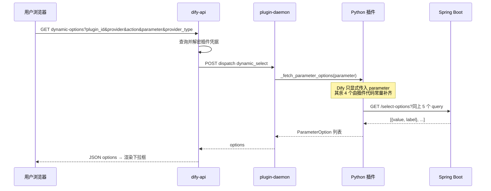
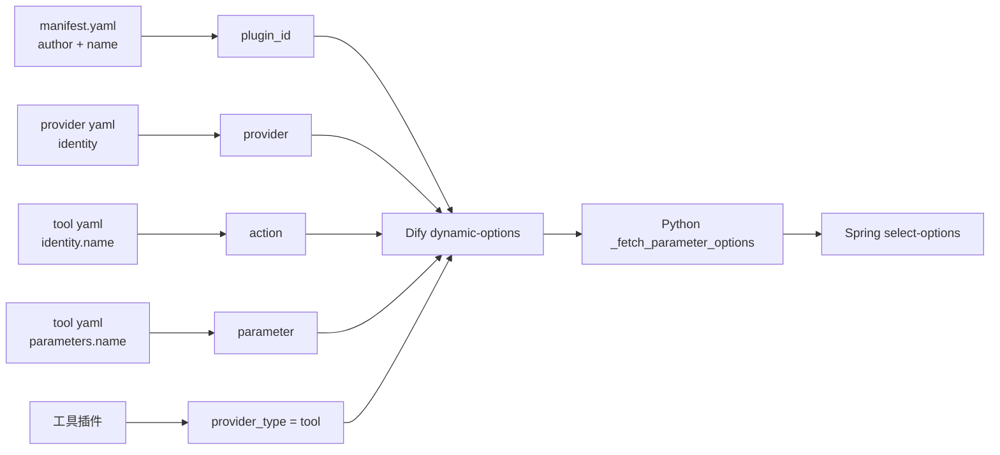

# Dify dynamic-select 接口的几个参数含义 —— 从浏览器到 Spring 的完整寻址坐标

> **核心结论**：当用户在画布上打开带有 `dynamic-select` 参数的工具节点时，浏览器会向 Dify 发起 `GET .../plugin/parameters/dynamic-options` 请求，携带 5 个 query 参数。这 5 个参数本质上是**插件寻址坐标**，逐级定位到「哪个插件 → 哪个 Provider → 哪个工具 → 哪个参数需要拉下拉」。它们**不是业务参数**（如 appId、deviceId），不能替代凭据里的实例信息。
>
> **实战背景**：我们在 `cascading_device_action` 工具中，将 Dify 的 5 个参数透传到 Spring Boot 的 `/api/cascading-device/select-options`，日志成功打印：
>
> ```
> 收到级联设备下拉选项请求: plugin_id=your-name/iot_device_http,
>   provider=your-name/iot_device_http/iot_device_http,
>   action=cascading_device_action, parameter=device_info, provider_type=tool
> 返回级联设备下拉选项 3 条
> ```
>
> **版本锚点**：Dify 1.12.x / dify_plugin SDK 0.9.x / 插件 `iot_device_http` 0.0.15。
>
> **前置阅读**：
> - [Dify dynamic-select 能力边界源码分析](./20260604-1037-dify动态参数dynamic-select能力边界.md)
> - [Dify dynamic-select 参数源码 11 跳分析](./20260604-0951-dify选择工具的时候dynamic-select参数源码分析.md)
> - [Dify 动态参数调用后端测试通过全记录](./20260604-1016-dify动态参数调用后端测试通过.md)

---

## 目录

1. [问题从哪来](#1-问题从哪来)
2. [五个参数一览表](#2-五个参数一览表)
3. [全链路：参数从浏览器到 Spring](#3-全链路参数从浏览器到-spring)
4. [逐级定位：像目录一样缩小范围](#4-逐级定位像目录一样缩小范围)
5. [plugin_id — 插件包唯一 ID](#5-plugin_id--插件包唯一-id)
6. [provider — 工具提供者全名](#6-provider--工具提供者全名)
7. [action — 具体工具名](#7-action--具体工具名)
8. [parameter — 哪个参数要拉下拉](#8-parameter--哪个参数要拉下拉)
9. [provider_type — 提供者类型](#9-provider_type--提供者类型)
10. [your-name 是什么？在哪设置？](#10-your-name-是什么在哪设置)
11. [与我们项目 YAML 的对照表](#11-与我们项目-yaml-的对照表)
12. [透传到 Spring 的实现方式](#12-透传到-spring-的实现方式)
13. [这些参数与业务参数（appId）的区别](#13-这些参数与业务参数appid的区别)
14. [常见问题 FAQ](#14-常见问题-faq)
15. [总结](#15-总结)

---

## 1. 问题从哪来

在实现「级联设备管控」工具的 `device_info` 动态下拉时，我们在浏览器 Network 里看到 Dify 发起了如下请求：

```
GET /console/api/workspaces/current/plugin/parameters/dynamic-options
    ?plugin_id=your-name%2Fiot_device_http
    &provider=your-name%2Fiot_device_http%2Fiot_device_http
    &action=cascading_device_action
    &parameter=device_info
    &provider_type=tool
```

随后我们把这 5 个参数透传到自己的 Spring Boot 后端，日志也能正确打印。于是自然产生几个问题：

- 这 5 个参数分别代表什么？
- 它们是从哪里来的？
- `your-name` 是什么？能在哪里改？
- 能不能用这些参数做业务过滤（比如按 appId 筛设备）？

本文逐一回答。

---

## 2. 五个参数一览表

| 参数 | 示例值 | 一句话含义 | 主要来源文件 |
|------|--------|-----------|-------------|
| `plugin_id` | `your-name/iot_device_http` | 哪个插件包 | `manifest.yaml` 的 `author` + `name` |
| `provider` | `your-name/iot_device_http/iot_device_http` | 插件里的哪个 Provider | `provider/*.yaml` 的 `identity` |
| `action` | `cascading_device_action` | Provider 下的哪个工具 | `tools/*.yaml` 的 `identity.name` |
| `parameter` | `device_info` | 工具里哪个 `dynamic-select` 参数 | `tools/*.yaml` 的 `parameters[].name` |
| `provider_type` | `tool` | 提供者类型（工具 or 触发器） | 固定值，工具插件为 `tool` |

**心智模型**：这是一套**定位器**，不是业务数据。可以理解为：

```
plugin_id → provider → action → parameter
```

每往右走一步，范围缩小一级，最终精确到「某个工具的某个 dynamic-select 字段需要加载选项」。

---

## 3. 全链路：参数从浏览器到 Spring

### 3.1 时序图



### 3.2 三个关键认知

1. **浏览器只跟 Dify 说话**，不会直接请求你的 Spring Boot。
2. **Dify 调 Python 时**，daemon 请求体里包含 `provider`、`provider_action`（即 action）、`parameter` 和 `credentials`，但 Python SDK 的 `_fetch_parameter_options(self, parameter: str)` **方法签名只暴露 `parameter`**。
3. **你的 Spring 能看到 5 个参数**，是因为我们在 Python 插件里**主动透传**的；这不是 Dify 平台自动打到 Spring 的行为。

### 3.3 实际 HTTP 请求示例

**Dify 控制台（浏览器 → dify-api）**：

```
GET http://10.20.183.170:30080/console/api/workspaces/current/plugin/parameters/dynamic-options
    ?plugin_id=your-name/iot_device_http
    &provider=your-name/iot_device_http/iot_device_http
    &action=cascading_device_action
    &parameter=device_info
    &provider_type=tool
```

**我们的 Spring Boot（Python 插件 → Java）**：

```
GET http://<spring_service_url>/api/cascading-device/select-options
    ?plugin_id=your-name/iot_device_http
    &provider=your-name/iot_device_http/iot_device_http
    &action=cascading_device_action
    &parameter=device_info
    &provider_type=tool
```

---

## 4. 逐级定位：像目录一样缩小范围

可以把 5 个参数想象成文件路径：

```
your-name/iot_device_http                          ← plugin_id（插件包）
└── your-name/iot_device_http/iot_device_http      ← provider（工具提供者）
    └── cascading_device_action                    ← action（具体工具）
        └── device_info                            ← parameter（dynamic-select 字段）
```

Dify 拿到这串坐标后，就知道：

1. 启动/调度哪个插件进程（`plugin_id`）
2. 用哪套凭据（`provider` 关联的 `credentials_for_provider`）
3. 调用哪个 Python Tool 类（`action` 对应 `tools/cascading_device_action.py`）
4. 执行该类的 `_fetch_parameter_options` 时关注哪个参数名（`parameter`）
5. 走工具链路还是触发器链路（`provider_type`）

---

## 5. plugin_id — 插件包唯一 ID

### 5.1 格式

```
plugin_id = {author}/{plugin_name}
```

### 5.2 来源

`manifest.yaml`（插件包根目录）：

```yaml
author: your-name
name: iot_device_http
```

→ `plugin_id` = **`your-name/iot_device_http`**

### 5.3 作用

- 标识已安装到 Dify 的**插件包**
- plugin-daemon 根据它加载对应版本的 Python 代码
- 工作流画布 draft 里也会保存，例如：

```json
"plugin_id": "your-name/iot_device_http",
"plugin_unique_identifier": "your-name/iot_device_http:0.0.15@41e658a8..."
```

其中 `plugin_unique_identifier` 还包含版本号和内容哈希，用于精确匹配已安装实例；`plugin_id` 则是逻辑上的插件名。

---

## 6. provider — 工具提供者全名

### 6.1 格式

对工具类插件，Dify 惯例为三段式：

```
provider = {author}/{provider_name}/{provider_name}
```

### 6.2 来源

`provider/iot_device_plugin.yaml`：

```yaml
identity:
  author: your-name
  name: iot_device_http
```

→ `provider` = **`your-name/iot_device_http/iot_device_http`**

### 6.3 作用

Provider 是「工具组 + 凭证」的载体，负责：

- 定义 `credentials_for_provider`（如 `spring_service_url`、`api_token`）
- 注册该组下所有 tools 的 YAML 列表
- 配置期拉取下拉时，dify-api 根据 provider 查询并解密对应凭据

一个插件包通常只有一个 Provider（我们就是这样），但 Dify 架构上允许一个包内有多个 Provider。

---

## 7. action — 具体工具名

### 7.1 含义

`action` 就是**工具标识符**，对应插件里某一个「能力接口」—— 一个 YAML 定义 + 一个 Python Tool 类。

**注意**：它不是 HTTP path，也不是 Spring 的 `@GetMapping` 路径。

### 7.2 来源

`tools/cascading_device_action.yaml`：

```yaml
identity:
  name: cascading_device_action
  author: your-name
```

→ `action` = **`cascading_device_action`**

### 7.3 同一 Provider 下的其他 action 示例

| action | 对应文件 | 用途 |
|--------|---------|------|
| `list_devices` | `tools/list_devices.yaml` | 获取设备列表 |
| `dynamic_device_query` | `tools/dynamic_device_query.yaml` | 动态设备查询 |
| `cascading_device_action` | `tools/cascading_device_action.yaml` | 级联设备管控（本文主角） |
| `generic_http` | `tools/generic_http.yaml` | 通用 HTTP 代理 |

当 `action` 不同时，即使 `parameter` 同名，Dify 也会调度**不同的 Python 类**去执行 `_fetch_parameter_options`。

---

## 8. parameter — 哪个参数要拉下拉

### 8.1 含义

表示当前工具定义中，**哪一个 `type: dynamic-select` 的参数字段**需要加载下拉选项。

### 8.2 来源

`tools/cascading_device_action.yaml`：

```yaml
parameters:
  - name: device_info
    type: dynamic-select
    form: llm
    ...
```

→ `parameter` = **`device_info`**

### 8.3 为什么需要单独传

一个工具可以有多个 `dynamic-select` 参数。例如假设某工具有 `region` 和 `device_info` 两个动态下拉，Dify 会分别发起两次 `dynamic-options` 请求：

```
...&action=my_tool&parameter=region
...&action=my_tool&parameter=device_info
```

Python 的 `_fetch_parameter_options(self, parameter: str)` 根据 `parameter` 决定返回哪类选项：

```python
def _fetch_parameter_options(self, parameter: str) -> list[ParameterOption]:
    if parameter != "device_info":
        return []
    # 只为 device_info 拉取级联设备列表
    ...
```

---

## 9. provider_type — 提供者类型

### 9.1 取值

| 值 | 含义 |
|----|------|
| `tool` | 工具类插件（我们使用的） |
| `trigger` | 触发器类插件 |

### 9.2 特点

- 对于工具插件，**固定为 `tool`**
- 告诉 dify-api 走 `BuiltinToolProvider` 凭据查询路径，而不是 Trigger 订阅路径
- 不是业务概念，不需要在 YAML 里配置

---

## 10. your-name 是什么？在哪设置？

### 10.1 它是什么

`your-name` **不是 Dify 平台自动生成的**，而是插件开发者在 YAML 里填写的 **`author`（作者/命名空间）**。

开发模板常用 `your-name` 作占位符；上线前应换成公司或团队标识（如 `dbappsecurity`、`anheng`），避免与其他开发者的插件冲突。

### 10.2 在哪设置

以下三处 `author` 必须保持一致：

| 文件 | 字段 | 当前值 |
|------|------|--------|
| `manifest.yaml` | `author` | `your-name` |
| `provider/iot_device_plugin.yaml` | `identity.author` | `your-name` |
| `tools/cascading_device_action.yaml` | `identity.author` | `your-name` |

**每个工具的 YAML** 里都有 `identity.author`，打包前建议全局统一。

### 10.3 修改后的影响

若将 `author` 改为 `acme`：

| 参数 | 修改前 | 修改后 |
|------|--------|--------|
| `plugin_id` | `your-name/iot_device_http` | `acme/iot_device_http` |
| `provider` | `your-name/iot_device_http/iot_device_http` | `acme/iot_device_http/iot_device_http` |

修改后需要：

1. 同步更新 Python 里的透传常量（若硬编码了）
2. 重新 `dify plugin package` 打包
3. 在 Dify 控制台重新安装插件
4. 已有工作流中的工具节点可能需要重新选择插件

### 10.4 与业务 appId 的区别

| 字段 | 层级 | 用途 |
|------|------|------|
| `author`（如 `your-name`） | 插件开发命名空间 | 区分不同开发者/组织的插件包 |
| `appId`（如 `dasca-dbappsecurity-tgfw`） | 业务平台实例 ID | 区分防火墙/网关等具体设备实例 |

**二者完全不同**。`your-name` 回答「这是谁的插件」；`appId` 回答「要操作哪个业务实例」。

---

## 11. 与我们项目 YAML 的对照表

```
manifest.yaml
├── author: your-name
├── name: iot_device_http
│   └──→ plugin_id = your-name/iot_device_http
│
provider/iot_device_plugin.yaml
├── identity.author: your-name
├── identity.name: iot_device_http
├── credentials_for_provider:        ← 凭据（spring_service_url 等），非 dynamic-options 参数
│   ├── spring_service_url
│   └── api_token
├── tools:
│   └── tools/cascading_device_action.yaml
│       └──→ provider = your-name/iot_device_http/iot_device_http
│
tools/cascading_device_action.yaml
├── identity.name: cascading_device_action
│   └──→ action = cascading_device_action
├── parameters:
│   └── name: device_info, type: dynamic-select
│       └──→ parameter = device_info
│
（工具类插件）
└──→ provider_type = tool
```

---

## 12. 透传到 Spring 的实现方式

### 12.1 Python 插件侧

`tools/cascading_device_action.py` 中定义与 Dify 对齐的常量，并在请求 Spring 时作为 query 参数传出：

```python
DIFY_PLUGIN_ID = "your-name/iot_device_http"
DIFY_PROVIDER = "your-name/iot_device_http/iot_device_http"
DIFY_ACTION = "cascading_device_action"
DIFY_PROVIDER_TYPE = "tool"

query_params = {
    "plugin_id": DIFY_PLUGIN_ID,
    "provider": DIFY_PROVIDER,
    "action": DIFY_ACTION,
    "parameter": parameter,          # 唯一来自 Dify 运行时的动态值
    "provider_type": DIFY_PROVIDER_TYPE,
}
response = requests.get(url, params=query_params, ...)
```

### 12.2 Spring Boot 侧

`CascadingDeviceController.java`：

```java
@GetMapping("/select-options")
public ResponseEntity<List<SelectOption>> listCascadingDeviceOptions(
        @RequestParam(required = false) String plugin_id,
        @RequestParam(required = false) String provider,
        @RequestParam(required = false) String action,
        @RequestParam(required = false) String parameter,
        @RequestParam(required = false) String provider_type) {
    log.info(
            "收到级联设备下拉选项请求: plugin_id={}, provider={}, action={}, parameter={}, provider_type={}",
            plugin_id, provider, action, parameter, provider_type);
    return ResponseEntity.ok(cascadingDeviceService.listCascadingDeviceOptions());
}
```

### 12.3 验证成功的日志

```
2026-06-10T16:26:26.850+08:00  INFO ... CascadingDeviceController :
  收到级联设备下拉选项请求: plugin_id=your-name/iot_device_http,
  provider=your-name/iot_device_http/iot_device_http,
  action=cascading_device_action, parameter=device_info, provider_type=tool
2026-06-10T16:26:29.268+08:00  INFO ... CascadingDeviceService :
  返回级联设备下拉选项 3 条
```

说明透传链路已打通。返回 3 条是因为 `CascadingDeviceService` 当前返回全量 Mock 设备，与这 5 个定位参数无关。

---

## 13. 这些参数与业务参数（appId）的区别

很多开发者会把「定位参数」和「业务参数」混在一起。对比如下：

| 维度 | dynamic-options 的 5 个参数 | 业务参数（如 appId） |
|------|---------------------------|---------------------|
| 目的 | 告诉 Dify/插件「拉哪个下拉」 | 告诉后端「操作哪个实例/设备」 |
| 传递方式 | 浏览器 query → dify-api →（Python 透传）→ Spring | 插件凭据 `credentials_for_provider` |
| 能否从前端表单动态传入 | 不能（无 extraParams 联动） | 应写在安装插件时的凭据里 |
| 能否用于过滤设备列表 | 间接可以（后端按 action 路由） | **应该用这个** |
| 运行期会再传吗 | 不会（配置期选一次，保存为常量） | `_invoke` 时通过凭据或工具参数使用 |

**正确做法**：若需「某实例下只显示 2 台设备」，应在 `credentials_for_provider` 增加 `appId`，Python 在 `_fetch_parameter_options` 中读取 `self.runtime.credentials.get("appId")` 再传给 Spring 过滤。详见 [dynamic-select 能力边界](./20260604-1037-dify动态参数dynamic-select能力边界.md)。

---

## 14. 常见问题 FAQ

### Q1: 这 5 个参数能从前端 URL 直接传到我的 Spring 吗？

**不能自动。** Dify 只把请求发给自己的 dify-api，再由 plugin-daemon 调 Python。Spring 要看到这 5 个参数，必须在 Python `_fetch_parameter_options` 里主动转发。

### Q2: `action` 是 HTTP 接口路径吗？

**不是。** 它是 Dify 插件体系里的工具名，对应 `tools/xxx.yaml` 的 `identity.name`。真正的 HTTP 路径由 Python 代码决定（如 `/api/cascading-device/select-options`）。

### Q3: 为什么 `provider` 里 `iot_device_http` 出现了两次？

这是 Dify 对工具类插件的命名惯例：`{author}/{provider_name}/{provider_name}`。第一段是命名空间，后两段是 Provider 身份标识。不要试图把它改成两段式，否则与平台内部 ID 不一致。

### Q4: `parameter=device_info` 和其他参数 `target_ip`、`action_type` 有什么关系？

- `device_info`：`dynamic-select`，配置期拉下拉，保存为常量
- `target_ip`、`action_type`：普通表单参数，用户在画布上填写或引用上游变量

它们在同一工具 YAML 的 `parameters` 列表里，但只有 `type: dynamic-select` 的字段会触发 `dynamic-options` 请求。

### Q5: 改了 `author` 后旧工作流还能用吗？

已保存的工作流节点里记录了当时的 `provider_id`、`plugin_id` 等。若 author 变更导致 ID 变化，可能需要重新拖拽工具节点或重新授权。建议在项目早期确定 author，后期少改。

### Q6: 可选参数 `credential_id` 为什么我们的 URL 里没有？

`credential_id` 是 dynamic-options API 支持的第 6 个参数，用于指定使用哪套凭据。工作流工具节点当前前端**默认不传**（与 Trigger 不同），后端会取该 provider 的默认凭据。多实例场景需注意这一点。

---

## 15. 总结

### 15.1 一句话

**dynamic-options 的 5 个 query 参数是 Dify 的插件寻址坐标，不是业务数据。**

### 15.2 三条核心结论

**结论一**：五个参数构成逐级定位链 —— `plugin_id` → `provider` → `action` → `parameter`，外加固定的 `provider_type=tool`。

**结论二**：`your-name` 来自插件 YAML 的 `author` 字段，在 `manifest.yaml`、provider YAML、各 tool YAML 中配置，打包前可改，与业务 `appId` 无关。

**结论三**：Spring 能看到这些参数是因为 Python 插件透传；业务过滤（如按 appId 筛设备）应走**凭据链路**，不能指望这 5 个定位参数替代 `appId`。

### 15.3 速查图



---

**相关文件索引**

| 文件 | 说明 |
|------|------|
| `test-dify/plugin-iot-device-plugin/manifest.yaml` | plugin_id 来源 |
| `test-dify/plugin-iot-device-plugin/provider/iot_device_plugin.yaml` | provider、凭据定义 |
| `test-dify/plugin-iot-device-plugin/tools/cascading_device_action.yaml` | action、parameter 定义 |
| `test-dify/plugin-iot-device-plugin/tools/cascading_device_action.py` | 透传 query 到 Spring |
| `test-dify/plugin-dify-iot-device/.../CascadingDeviceController.java` | 接收并打印参数 |
| `dify/api/controllers/console/workspace/plugin.py` | dynamic-options API 路由 |
| `dify/web/service/use-plugins.ts` | 前端 `useFetchDynamicOptions` |
