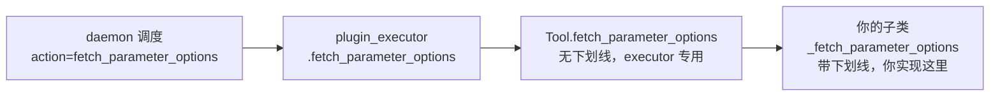
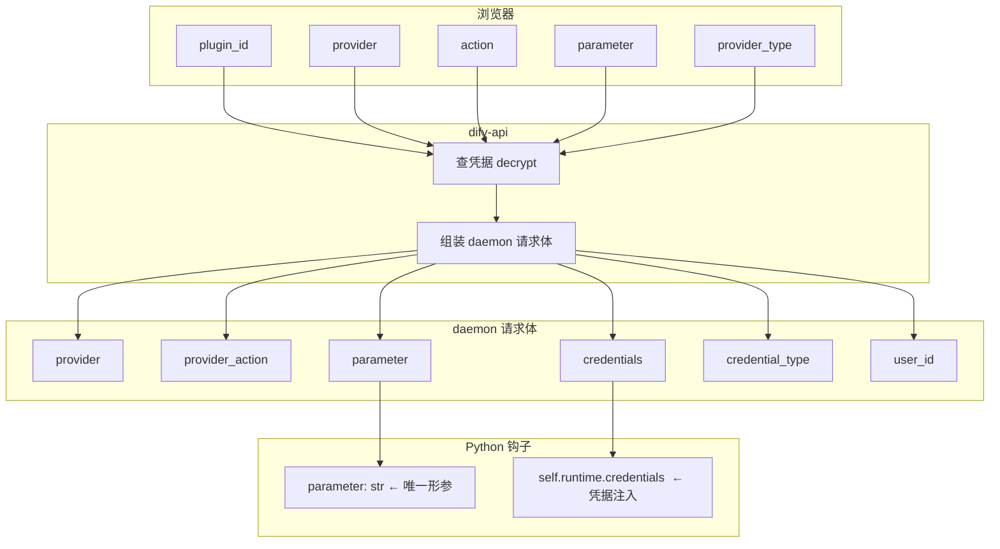
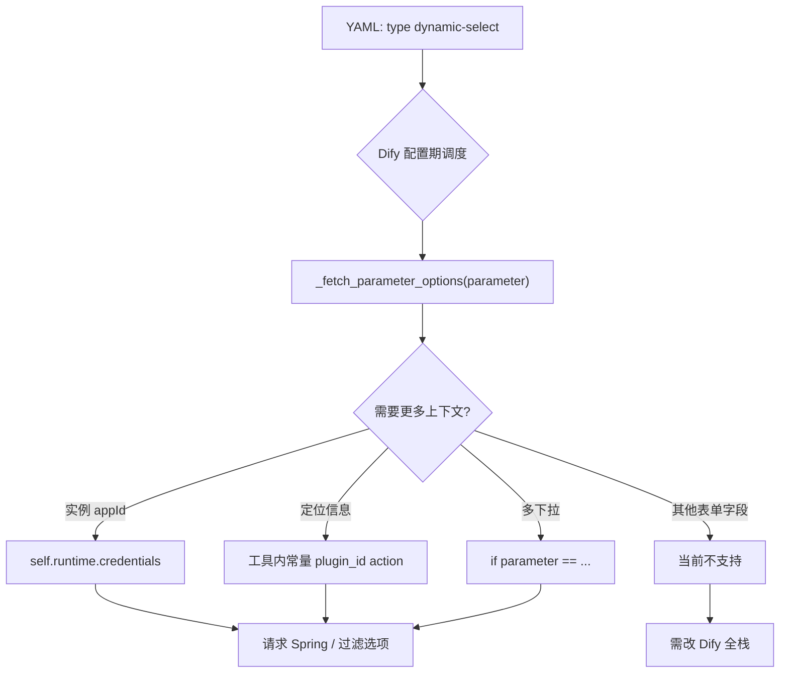

# Dify dynamic-select 的 `_fetch_parameter_options` 函数名必须固定吗？—— 钩子约定与参数扩展边界

> **核心结论**：`_fetch_parameter_options` 的**函数名、方法签名、返回值类型**均由 `dify_plugin` SDK 固定，插件开发者不能改名，也不能在方法参数列表里自行增加 `app_id`、`plugin_id` 等额外形参。若需要更多业务上下文，应通过 **`self.runtime.credentials`（凭据）**、**方法内常量**、或**请求后端时自行拼接 query** 等方式间接获取——我们在 `cascading_device_action` 中透传 `app_id` 的实验已验证凭据链路可行。
>
> **版本锚点**：Dify 1.12.x / dify_plugin SDK 0.9.x（本文字符串级对照基于 SDK 0.9.0 已安装包 `dify_plugin/interfaces/tool/tool.py`）。
>
> **前置阅读**：
> - [dynamic-select 接口的几个参数含义](./20260604-1040-dify动态参数dynamic-select接口的几个参数含义.md)
> - [dynamic-select 能力边界源码分析](./20260604-1037-dify动态参数dynamic-select能力边界.md)
> - [dynamic-select 参数源码 11 跳分析](./20260604-0951-dify选择工具的时候dynamic-select参数源码分析.md)

---

## 目录

1. [这篇博客要回答什么](#1-这篇博客要回答什么)
2. [三层命名：别搞混](#2-三层命名别搞混)
3. [函数名是否固定](#3-函数名是否固定)
4. [方法签名是否固定](#4-方法签名是否固定)
5. [能否增加参数](#5-能否增加参数)
6. [daemon 实际传了什么](#6-daemon-实际传了什么)
7. [那业务参数从哪来](#7-那业务参数从哪来)
8. [实战：app_id 凭据透传实验](#8-实战app_id-凭据透传实验)
9. [与 _invoke 的对比](#9-与-_invoke-的对比)
10. [若想突破限制需要改哪里](#10-若想突破限制需要改哪里)
11. [常见问题 FAQ](#11-常见问题-faq)
12. [总结](#12-总结)

---

## 1. 这篇博客要回答什么

在实现 `cascading_device_action` 的 `device_info` 动态下拉时，我们在 Python 里写了：

```python
def _fetch_parameter_options(self, parameter: str) -> list[ParameterOption]:
    ...
```

随后产生三个连环问题：

1. **`_fetch_parameter_options` 这个名字是固定的吗？** 能改成 `get_device_options` 吗？
2. **参数 `parameter` 是固定的吗？** 类型、含义能改吗？
3. **能增加参数吗？** 比如 `def _fetch_parameter_options(self, parameter, app_id)`？

本文结合 SDK 源码与我们的实战，给出明确答案。

---

## 2. 三层命名：别搞混

很多人把三处「fetch_parameter_options」混在一起。它们职责不同：

| 层级 | 名称 | 位置 | 谁能改 |
|------|------|------|--------|
| **协议动作名** | `fetch_parameter_options` | daemon HTTP：`.../dispatch/dynamic_select/fetch_parameter_options` | 不能改 |
| **SDK 入口方法** | `fetch_parameter_options()` | `Tool.fetch_parameter_options`（无下划线） | 不能改 |
| **插件开发者钩子** | `_fetch_parameter_options()` | 你在 `Tool` 子类里 **override** | **必须用这个名** |

关系如下：



**记忆口诀**：

- 带下划线 `_` → **你写实现**
- 不带下划线 → **SDK / daemon 调用，别动**

---

## 3. 函数名是否固定

### 3.1 结论：**固定，不能改名**

若写成：

```python
def get_device_options(self, parameter: str):  # 错误示例
    ...
```

SDK **永远不会调用**它。`plugin_executor` 写死调用的是 `action_instance.fetch_parameter_options(parameter=...)`，而该方法内部只转发到 `_fetch_parameter_options`。

### 3.2 SDK 源码依据

`dify_plugin/interfaces/tool/tool.py` 基类定义：

```python
def _fetch_parameter_options(self, parameter: str) -> list[ParameterOption]:
    """
    Fetch the parameter options of the tool.
    To be implemented by subclasses.
    Also, it's optional to implement, that's why it's not an abstract method.
    """
    msg = (
        "This plugin should implement `_fetch_parameter_options` method "
        "to enable dynamic select parameter"
    )
    raise NotImplementedError(msg)

def fetch_parameter_options(self, parameter: str) -> list[ParameterOption]:
    return self._fetch_parameter_options(parameter)
```

`plugin_executor.py` 调度逻辑：

```python
def fetch_parameter_options(self, session, data):
    action_instance = self._get_dynamic_parameter_action(session=session, data=data)
    return {
        "options": action_instance.fetch_parameter_options(
            parameter=data.parameter,
        ),
    }
```

daemon 侧动作枚举（`request.py`）：

```python
class DynamicParameterActions(StrEnum):
    FetchParameterOptions = "fetch_parameter_options"
```

四处名称锁死，形成完整协议链。**改名即断链。**

### 3.3 与 `_invoke` 同类

| 运行阶段 | 插件开发者实现的方法 | 能否改名 |
|---------|-------------------|---------|
| 配置期（拉下拉） | `_fetch_parameter_options` | 不能 |
| 运行期（执行业务） | `_invoke` | 不能 |

二者都是 Dify 插件 SDK 的**协议钩子（hook）**，类似 Spring 里 `@GetMapping("/path")` 的路径——框架按名字反射调用，不是普通业务函数。

### 3.4 是否必须实现

`_fetch_parameter_options` **不是 abstractmethod**（与 `_invoke` 不同）：

- 工具 YAML **没有** `dynamic-select` → 可以不实现
- 工具 YAML **有** `dynamic-select` → 必须实现，否则被调用时抛 `NotImplementedError`

---

## 4. 方法签名是否固定

### 4.1 结论：**签名固定**

官方约定签名：

```python
def _fetch_parameter_options(self, parameter: str) -> list[ParameterOption]:
```

| 部分 | 是否固定 | 说明 |
|------|---------|------|
| 方法名 `_fetch_parameter_options` | 固定 | 见上一节 |
| 参数 `parameter: str` | 固定 | 只有一个，表示当前要拉选项的 YAML 参数名 |
| 返回值 `list[ParameterOption]` | 固定 | 每项仅含 `value` + `label`（+ 可选 `icon`） |

### 4.2 `parameter` 的含义

`parameter` 的值来自工具 YAML 里 `parameters[].name`，例如：

```yaml
parameters:
  - name: device_info      # ← parameter 传入 "device_info"
    type: dynamic-select
```

若同一工具有多个 `dynamic-select`，daemon 会**分别调用**多次，每次 `parameter` 不同：

```
_fetch_parameter_options("device_info")
_fetch_parameter_options("region")      # 假设还有第二个 dynamic-select
```

因此在方法内通常要分支处理：

```python
def _fetch_parameter_options(self, parameter: str) -> list[ParameterOption]:
    if parameter != "device_info":
        return []
    ...
```

### 4.3 返回值能否改成别的

**不能。** 必须返回 `list[ParameterOption]`。不能把整个对象、dict 或分页结构作为返回值类型——附加数据只能编码进 `ParameterOption.value` 字符串（如 base64 JSON），详见 [能力边界文档](./20260604-1037-dify动态参数dynamic-select能力边界.md)。

---

## 5. 能否增加参数

### 5.1 结论：**不能在方法签名里增加形参**

以下写法**无效**（Python 虽能定义，但 SDK 调用时只传 `parameter`，多出来的形参要么报错，要么永远拿不到值）：

```python
# 错误：SDK 不会传 app_id
def _fetch_parameter_options(self, parameter: str, app_id: str) -> list[ParameterOption]:
    ...

# 错误：SDK 不会传 form_values
def _fetch_parameter_options(self, parameter: str, **kwargs) -> list[ParameterOption]:
    ...
```

`plugin_executor` 调用处写死了：

```python
action_instance.fetch_parameter_options(parameter=data.parameter)
```

**只传一个 `parameter`，没有扩展点。**

### 5.2 为何不能加 `plugin_id`、`action` 等

虽然 daemon 请求体 `DynamicParameterFetchParameterOptionsRequest` 里实际包含：

```python
class DynamicParameterFetchParameterOptionsRequest(BaseModel):
    credentials: dict[str, Any]
    credential_type: CredentialType
    provider: str
    provider_action: str   # 即 action
    user_id: str
    parameter: str
```

但 SDK 在调用你的钩子之前，**只把 `parameter` 暴露给 `_fetch_parameter_options`**。`provider`、`provider_action`、`credentials` 等用于构建 `self.runtime`，不会作为方法参数传入。

这也是 [能力边界](./20260604-1037-dify动态参数dynamic-select能力边界.md) 中「限制二：钩子方法只接收参数名」的根因。

### 5.3 扩展信息的正确姿势

| 需求 | 推荐做法 | 是否改 SDK |
|------|---------|-----------|
| 实例 ID（appId） | `self.runtime.credentials.get("app_id")` | 否 |
| 后端地址 | `self.runtime.credentials.get("spring_service_url")` | 否 |
| plugin_id / action | 工具内写常量，或从 YAML `identity` 对齐 | 否 |
| 其他表单字段当前值 | **当前不支持**（无 form_values） | 需改全栈 |
| 上游节点变量 | **当前不支持**（dynamic-select 强制 constant） | 需改全栈 |

---

## 6. daemon 实际传了什么

### 6.1 全链路参数衰减图



**关键现象**：从浏览器 5 个 query 到 Python 方法形参，信息大幅「衰减」为 1 个 `parameter` + `runtime.credentials`。

### 6.2 谁调用 `_fetch_parameter_options`

完整调用栈：

```
用户打开工具节点
  → 前端 FormInputItem 发 GET dynamic-options
  → dify-api PluginParameterService.get_dynamic_select_options
  → plugin-daemon POST .../dynamic_select/fetch_parameter_options
  → dify_plugin plugin_executor.fetch_parameter_options
  → Tool.fetch_parameter_options(parameter)
  → 你的 CascadingDeviceActionTool._fetch_parameter_options(parameter)
```

**直接调用者**：`dify_plugin` SDK（由 plugin-daemon 调度）。  
**你不需要、也不应该在 `main.py` 里手动调用。**

---

## 7. 那业务参数从哪来

### 7.1 凭据 `self.runtime.credentials`（官方正道）

配置期拉取下拉时，dify-api 会查询并解密插件凭据，daemon 将其注入 `self.runtime.credentials`。

```python
def _fetch_parameter_options(self, parameter: str) -> list[ParameterOption]:
    spring_url = self.runtime.credentials.get("spring_service_url", "")
    app_id = self.runtime.credentials.get("app_id", "")
    api_token = self.runtime.credentials.get("api_token", "")
```

在 `provider/iot_device_plugin.yaml` 的 `credentials_for_provider` 中声明字段，用户安装/授权插件时填写。

**特点**：

- 不需改 SDK
- 配置期、运行期 `_invoke` 均可读取
- 适合实例级参数：appId、host、token 等

### 7.2 方法内常量（定位参数补齐）

`plugin_id`、`action`、`provider_type` 等不会传入方法形参，可在工具文件顶部定义常量，与 YAML `identity` 保持一致：

```python
DIFY_PLUGIN_ID = "your-name/iot_device_http"
DIFY_ACTION = "cascading_device_action"
```

请求自有后端时作为 query 透传，便于日志与路由。详见 [参数含义文档](./20260604-1040-dify动态参数dynamic-select接口的几个参数含义.md)。

### 7.3 根据 `parameter` 分支（同一工具多下拉）

```python
def _fetch_parameter_options(self, parameter: str) -> list[ParameterOption]:
    if parameter == "device_info":
        return self._fetch_device_options()
    if parameter == "region":
        return self._fetch_region_options()
    return []
```

这是**唯一**由平台动态传入、且可在方法内区分的「变量」。

### 7.4 不能用的方式

| 方式 | 为何不行 |
|------|---------|
| 给 `_fetch_parameter_options` 加形参 | SDK 只传 `parameter` |
| 指望前端 extraParams 传其他表单值 | 工作流 `panel.tsx` 未接线，始终 `undefined` |
| 在 dynamic-options URL 加 `app_id` | API 模型不声明该字段，后端忽略 |
| 用上游变量驱动下拉 | `getVarKindType` 强制 dynamic-select 为 `constant` |

---

## 8. 实战：app_id 凭据透传实验

我们在 `cascading_device_action.py` 中验证：虽不能在方法签名里加 `app_id`，但可从凭据读取并传给 Spring。

### 8.1 Python 侧

```python
def _fetch_parameter_options(self, parameter: str) -> list[ParameterOption]:
    app_id = (self.runtime.credentials.get("app_id") or "1234567").strip()
    query_params = {
        "plugin_id": DIFY_PLUGIN_ID,
        "provider": DIFY_PROVIDER,
        "action": DIFY_ACTION,
        "parameter": parameter,
        "provider_type": DIFY_PROVIDER_TYPE,
        "app_id": app_id,          # 从凭据来，不是方法形参
    }
    response = requests.get(url, params=query_params, ...)
```

### 8.2 Spring 侧日志

```
收到级联设备下拉选项请求: plugin_id=..., action=cascading_device_action, ...
appId:1234567
返回级联设备下拉选项 3 条
```

### 8.3 实验结论

| 问题 | 答案 |
|------|------|
| 能拿到 appId 吗？ | **能**，走凭据 |
| 能在 `_fetch_parameter_options(self, app_id)` 里拿吗？ | **不能**，签名不能改 |
| 能按 appId 过滤设备吗？ | **能**，在 Spring `CascadingDeviceService` 里按 query 过滤 |

上线前建议：在 `credentials_for_provider` 正式声明 `app_id`，去掉硬编码默认值 `"1234567"`。

---

## 9. 与 _invoke 的对比

| 维度 | `_fetch_parameter_options` | `_invoke` |
|------|---------------------------|-----------|
| **调用时机** | 配置期：打开节点、拉下拉 | 运行期：执行工作流 |
| **方法名** | 固定 | 固定 |
| **参数** | 仅 `parameter: str` | `tool_parameters: dict`（工具全部参数） |
| **能否加形参** | 不能 | 不能 |
| **业务上下文** | 主要靠 `self.runtime.credentials` | `tool_parameters` + `credentials` |
| **返回值** | `list[ParameterOption]` | `Generator[ToolInvokeMessage, ...]` |
| **会重复调用吗** | 打开节点时；保存后一般不再调 | 每次运行都调 |

`_invoke` 的参数更丰富（整个 `tool_parameters` 字典），但那是**运行期**；配置期下拉加载走的是另一条独立链路，不能套用 `_invoke` 的参数模型。

---

## 10. 若想突破限制需要改哪里

若未来需要 `_fetch_parameter_options(self, parameter, form_values)` 这类扩展，需**同时**修改（摘自能力边界文档 Q7）：

| 层 | 文件 | 改动 |
|----|------|------|
| daemon 请求体 | `DynamicParameterFetchParameterOptionsRequest` | 增加 `form_values` |
| SDK 基类 | `Tool._fetch_parameter_options` | 扩展签名 |
| SDK 调度 | `plugin_executor.fetch_parameter_options` | 传递新字段 |
| dify-api 模型 | `ParserDynamicOptions` | 增加 query/body 字段 |
| dify-api 服务 | `PluginParameterService` | 向下传递 |
| 前端 Hook | `useFetchDynamicOptions` | 接收表单状态 |
| 前端组件 | `form-input-item.tsx` / `panel.tsx` | 传入 `extraParams` |

**在未改 Dify 源码的前提下，插件侧只能走凭据、常量、`parameter` 分支三条路。**

---

## 11. 常见问题 FAQ

### Q1: 能把逻辑写在 `fetch_parameter_options`（无下划线）里吗？

**不要。** 无下划线版本是 SDK `executor` 专用入口，基类实现为转发到 `_fetch_parameter_options`。你应 override 带下划线的版本。

### Q2: Trigger 插件也一样吗？

是。Trigger 同样实现 `_fetch_parameter_options(self, parameter: str)`，调度动作名也是 `fetch_parameter_options`。Trigger 前端会传 `credential_id`，但方法签名不变。

### Q3: `parameter` 的值我能控制吗？

**间接控制。** 它等于 YAML 里 `parameters[].name`。你把字段叫 `device_info`，传入就是 `"device_info"`；改成 `device`，传入就是 `"device"`。但**不能**在一次调用里传多个 parameter。

### Q4: 多个 dynamic-select 要写多个 `_fetch_parameter_options` 吗？

**不用。** 一个 Tool 类只有一个 `_fetch_parameter_options`，内部按 `parameter` 字符串分支即可。

### Q5: 为什么 SDK 设计得这么「吝啬」？

设计目标是：**一个参数、一个下拉、一个值**。配置期钩子只做最小职责；实例上下文通过授权时的凭据注入，避免把表单联动复杂度塞进插件协议。代价是灵活性受限，变通方案见 [能力边界](./20260604-1037-dify动态参数dynamic-select能力边界.md)。

### Q6: 和 dynamic-options 的 5 个 query 参数是什么关系？

那 5 个是 **Dify 平台寻址坐标**（plugin_id → parameter），停在 dify-api / daemon 层；**不会**自动变成 `_fetch_parameter_options` 的方法参数。需要时由插件代码从凭据/常量读取后自行转发。见 [参数含义文档](./20260604-1040-dify动态参数dynamic-select接口的几个参数含义.md)。

---

## 12. 总结

### 12.1 三个问题的直接答案

| 问题 | 答案 |
|------|------|
| 函数名固定吗？ | **固定**，必须叫 `_fetch_parameter_options` |
| 参数固定吗？ | **固定**，只有 `(self, parameter: str)`，返回 `list[ParameterOption]` |
| 能增加参数吗？ | **不能在签名里加**；用 `self.runtime.credentials`、常量、`parameter` 分支间接扩展 |

### 12.2 一张速查图



### 12.3 一句话

**`_fetch_parameter_options` 是 Dify 插件协议钩子：名字、签名、返回值均固定；业务扩展靠凭据，不靠加参数。**

---

**相关文件索引**

| 文件 | 说明 |
|------|------|
| `dify_plugin/interfaces/tool/tool.py` | `_fetch_parameter_options` 基类定义 |
| `dify_plugin/core/plugin_executor.py` | daemon 调度入口 |
| `dify_plugin/core/entities/plugin/request.py` | `DynamicParameterFetchParameterOptionsRequest` |
| `dify/api/core/plugin/impl/dynamic_select.py` | dify-api → daemon |
| `test-dify/.../cascading_device_action.py` | 我们的实现与 app_id 透传实验 |
| `test-dify/.../cascading_device_action.yaml` | `device_info` dynamic-select 声明 |
