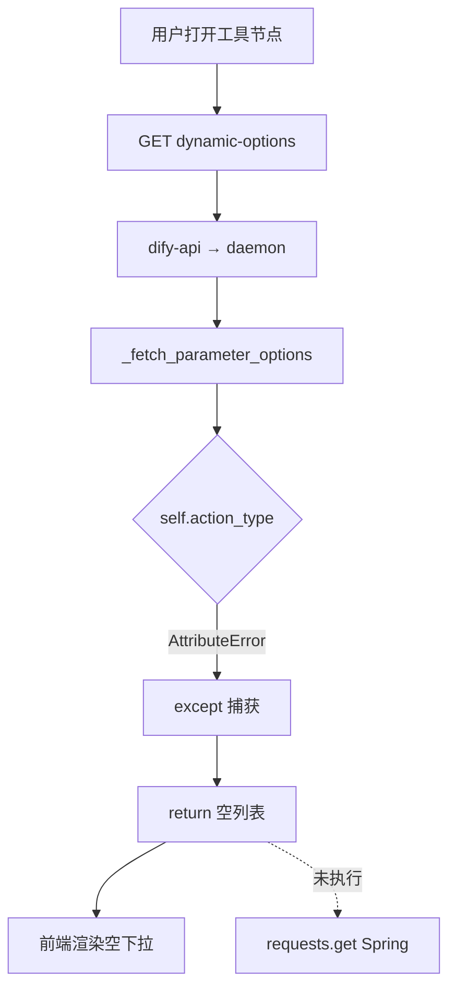
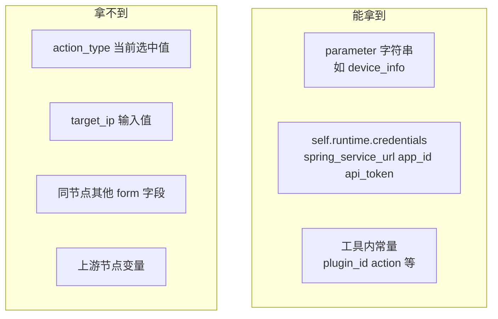
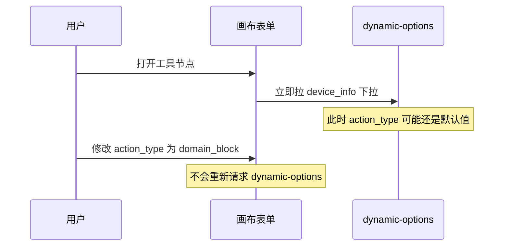
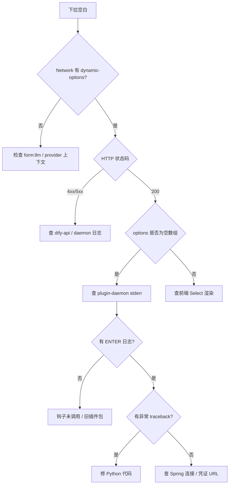

# Dify dynamic-select 配置期能否拿到同节点其他参数？—— action_type 实验失败复盘

> **核心结论**：**不能。** 在配置期（用户打开工具节点、拉取 `dynamic-select` 下拉时），`_fetch_parameter_options` **无法读取同工具节点内其他参数的当前值**（如 `action_type`、`target_ip`）。平台只传入 `parameter` 字符串，并将**插件凭据**注入 `self.runtime.credentials`。若误用 `self.action_type` 等不存在的属性，会触发异常；被 `except` 捕获后 `return []`，表现为**下拉空白且无界面报错**、Spring 后端**根本未被调用**。
>
> **实战背景**：我们在 `cascading_device_action` 中已成功通过 `self.runtime.credentials.get("app_id")` 透传实例 ID；随后尝试在拉 `device_info` 下拉时读取同节点的 `action_type`，写下 `self.action_type`，导致下拉突然变空。本文记录现象、根因、排查方法与可行替代方案。
>
> **版本锚点**：Dify 1.12.x / dify_plugin SDK 0.9.x / 插件 `iot_device_http` 0.0.15。
>
> **前置阅读**：
> - [dynamic-select 能力边界源码分析](./20260604-1037-dify动态参数dynamic-select能力边界.md)
> - [_fetch_parameter_options 函数名必须固定吗](./20260604-1060-dify动态参数dynamic-select接口的_fetch_parameter_options函数名称必须固定吗.md)
> - [凭据 app_id 透传与参数含义](./20260604-1040-dify动态参数dynamic-select接口的几个参数含义.md)

---

## 目录

1. [需求与实验](#1-需求与实验)
2. [现象：下拉空白、无报错、后端无请求](#2-现象下拉空白无报错后端无请求)
3. [直接原因：self.action_type 不存在](#3-直接原因selfaction_type-不存在)
4. [架构结论：配置期拿不到同节点其他参数](#4-架构结论配置期拿不到同节点其他参数)
5. [为什么界面不报错](#5-为什么界面不报错)
6. [配置期究竟能拿到什么](#6-配置期究竟能拿到什么)
7. [app_id 能拿、action_type 不能拿的原因](#7-app_id-能拿action_type-不能拿的原因)
8. [参数分区与触发时机](#8-参数分区与触发时机)
9. [排查手册：去哪里看日志](#9-排查手册去哪里看日志)
10. [可行替代方案](#10-可行替代方案)
11. [调试代码建议](#11-调试代码建议)
12. [常见问题 FAQ](#12-常见问题-faq)
13. [总结](#13-总结)

---

## 1. 需求与实验

### 1.1 业务设想

工具 `cascading_device_action`（级联设备管控）有如下参数：

| 参数 | 类型 | form 分区 |
|------|------|----------|
| `device_info` | `dynamic-select` | `llm` |
| `target_ip` | `string` | `form` |
| `action_type` | `select` | `form` |

YAML 片段：

```yaml
parameters:
  - name: device_info
    type: dynamic-select
    form: llm
  - name: action_type
    type: select
    form: form
    default: ip_block
    options:
      - value: ip_block
        label: { zh_Hans: IP封禁 }
      # ...
```

**设想**：用户先选 `action_type`（如 IP封禁），再拉 `device_info` 下拉时，只展示支持该操作的设备。

### 1.2 错误实验代码

在 `_fetch_parameter_options` 中尝试读取 `action_type`：

```python
def _fetch_parameter_options(self, parameter: str) -> list[ParameterOption]:
    try:
        app_id = (self.runtime.credentials.get("app_id") or "1234567").strip()
        action_type = (self.action_type or "ip_block1").strip()   # ← 错误写法
    except Exception as e:
        _log(f"读取凭证异常: {e}")
        return []

    query_params = {
        # ...
        "app_id": app_id,
        "action_type": action_type,
    }
    response = requests.get(url, params=query_params, ...)
```

### 1.3 实验结果

| 观察项 | 结果 |
|--------|------|
| 浏览器 `dynamic-options` 请求 | 正常发出，HTTP 200 |
| 响应 body | `{ "options": [] }` |
| 界面 | 设备下拉**空白**，**无错误提示** |
| Spring Boot 日志 | **无** `/select-options` 请求 |
| `app_id` 透传（改代码前） | 曾成功 |

---

## 2. 现象：下拉空白、无报错、后端无请求

这三件事同时出现，说明失败发生在 **Python 插件内部、请求 Spring 之前**，且异常被**静默处理**为「空选项列表」。



**关键判断**：若 Spring 没日志，先查插件 stderr，不要先怀疑网络或凭证。

---

## 3. 直接原因：self.action_type 不存在

### 3.1 异常类型

```python
action_type = (self.action_type or "ip_block1").strip()
```

`CascadingDeviceActionTool` 继承 `Tool`，实例上**没有** `action_type` 属性，运行时报：

```
AttributeError: 'CascadingDeviceActionTool' object has no attribute 'action_type'
```

### 3.2 为何被吞掉

异常落在 `try/except` 里，捕获后：

```python
except Exception as e:
    _log(f"读取凭证异常: {e}")
    traceback.print_exc(file=sys.stderr)
    return []    # ← 返回空列表，Dify 认为「没有选项」
```

- 对 Dify 平台：合法响应，`options: []`
- 对前端：渲染空下拉，不弹错误框
- 对 Spring：代码走不到 `requests.get`

### 3.3 修复方式

删除 `self.action_type` 相关代码即可恢复下拉（`app_id` 从凭据读取的写法保留）：

```python
app_id = (self.runtime.credentials.get("app_id") or "1234567").strip()
# 不要写 self.action_type
```

重新打包安装插件后，设备列表应恢复。

---

## 4. 架构结论：配置期拿不到同节点其他参数

即便不写错 `self.action_type`，**平台也不会把 `action_type` 的当前值传给 `_fetch_parameter_options`**。这是设计限制，不是 bug。

### 4.1 三层都不传递表单状态

| 层级 | 是否携带 action_type 等表单值 |
|------|------------------------------|
| 浏览器 `dynamic-options` query | 否，只有 plugin_id / provider / action / parameter / provider_type |
| dify-api `ParserDynamicOptions` | 否，Pydantic 模型无 form_values 字段 |
| daemon → Python 钩子 | 否，只调 `_fetch_parameter_options(parameter)` |

### 4.2 SDK 方法签名

```python
def _fetch_parameter_options(self, parameter: str) -> list[ParameterOption]:
```

只有一个 `parameter`（如 `"device_info"`），**没有** `tool_parameters` 字典。

### 4.3 self.runtime 里有什么

`ToolRuntime` 定义（`dify_plugin/entities/tool.py`）：

```python
class ToolRuntime(BaseModel):
    credentials: dict[str, Any]
    credential_type: CredentialType
    user_id: str | None
    session_id: str | None
```

**没有** `action_type`、`target_ip`，也没有整个表单的 snapshot。

### 4.4 前端 extraParams 未接线

`FormInputItem` 虽支持 `extraParams` 传给 `useFetchDynamicOptions`，但工作流 `panel.tsx` → `ToolForm` **未传递**该属性，始终为 `undefined`。因此即使用户已在界面上选了 `action_type`，也不会进入 `dynamic-options` 请求。

详见 [能力边界 · 限制四](./20260604-1037-dify动态参数dynamic-select能力边界.md#8-限制四-前端-extraparams-未传递)。

### 4.5 一句话

> **配置期 dynamic-select 与运行期 _invoke 是两条独立链路；前者只有 `parameter` + 凭据，后者才有完整 `tool_parameters`。**

---

## 5. 为什么界面不报错

### 5.1 前端 catch 后静默置空

`web/app/components/workflow/nodes/_base/components/form-input-item.tsx`：

```typescript
try {
  const data = await fetchDynamicOptions()
  setToolsOptions(data?.options || [])
}
catch (error) {
  console.error('Failed to fetch dynamic options:', error)
  setToolsOptions([])    // 不 toast，不标红
}
```

只有 **HTTP 请求本身失败** 才会进 `catch`；插件正常返回 `[]` 时属于「成功但无数据」。

### 5.2 用户感知 vs 实际状态

| 用户看到 | 实际发生 |
|---------|---------|
| 下拉是空的 | 插件返回 `options: []` |
| 没有红字报错 | 前端不校验空列表 |
| 以为后端没配置 | 可能是 Python 异常被吞 |
| Network 里 200 | dify-api 链路正常，问题在插件逻辑 |

---

## 6. 配置期究竟能拿到什么



| 来源 | 示例 | 用途 |
|------|------|------|
| 方法参数 `parameter` | `"device_info"` | 区分同一工具内多个 dynamic-select |
| `self.runtime.credentials` | `app_id`、`spring_service_url` | 实例级、连接级上下文 |
| 类/模块常量 | `DIFY_ACTION = "cascading_device_action"` | 定位信息透传后端 |
| 同节点表单字段 | `action_type` | **不可用** |
| 上游节点输出 | `{{#节点.xxx#}}` | **配置期不可用**（运行期 `_invoke` 才行） |

---

## 7. app_id 能拿、action_type 不能拿的原因

这是同一次实验中两个参数表现不同的关键。

| 参数 | 读取方式 | 是否可行 | 原因 |
|------|---------|---------|------|
| `app_id` | `self.runtime.credentials.get("app_id")` | **可行** | 安装/授权插件时写入凭据，配置期解密注入 runtime |
| `action_type` | `self.action_type` | **不可行** | Tool 实例无此属性 → AttributeError |
| `action_type` | `self.runtime.credentials.get("action_type")` | 仅当写入凭据时可行 | 属于「装插件时写死」，不是用户画布上动态选的值 |
| `action_type` | 从表单当前值读取 | **不可行** | 平台不传 form_values |

**app_id 实验成功**，证明**凭据链路**是扩展配置期上下文的正道。  
**action_type 实验失败**，证明**同节点表单联动**不是凭据能解决的，而是平台能力边界问题。

---

## 8. 参数分区与触发时机

`cascading_device_action` 的参数分区加剧了「联动不可能」：

```
form: llm 区（输入变量）
  └── device_info (dynamic-select)  ← 打开节点即可能触发拉取

form: form 区（设置）
  ├── target_ip
  └── action_type (select)         ← 用户稍后才会改
```

### 8.1 触发时机

`FormInputItem` 的 `useEffect` 在**打开节点、渲染 dynamic-select 时**即调用 `fetchDynamicOptions`，依赖项为：

```typescript
[isDynamicSelect, currentTool?.name, currentProvider?.name, variable, extraParams, ...]
```

**不包含** `action_type` 的值。用户之后修改 `action_type`，下拉**不会自动刷新**。

### 8.2 时序矛盾



因此「先选 action_type，再按它过滤 device」在**当前 Dify 1.12.x** 下无法实现。

---

## 9. 排查手册：去哪里看日志

当出现「下拉空白、无报错、后端无请求」时，按以下顺序排查。

### 9.1 浏览器 F12 → Network

过滤 `dynamic-options`：

| 响应 | 含义 |
|------|------|
| `200` + `"options":[]` | 插件返回空（优先查插件 stderr） |
| `200` + 有 options | 正常，若仍空白查前端渲染 |
| `400` / `500` | dify-api 或 daemon 层错误，看响应 body |
| 无请求 | 参数可能不在 `form: llm` 区，或 provider 上下文缺失 |

示例请求（与实验一致）：

```
GET /console/api/workspaces/current/plugin/parameters/dynamic-options
    ?plugin_id=your-name/iot_device_http
    &provider=your-name/iot_device_http/iot_device_http
    &action=cascading_device_action
    &parameter=device_info
    &provider_type=tool
```

注意：此 URL **不含** `action_type`。

### 9.2 plugin-daemon 日志（最关键）

```bash
# 实时跟踪
kubectl logs -n dify -l app=dify-plugin-daemon --tail=200 -f

# 指定 pod
kubectl logs -n dify dify-plugin-daemon-645c465b57-k9bgv --tail=200 -f
```

插件内 `_log(...)` 使用 `print(..., file=sys.stderr)`，应能看到：

```
[cascading_device_action] ===== _fetch_parameter_options ENTER =====
[cascading_device_action] parameter = 'device_info'
[cascading_device_action] 读取凭证异常: 'CascadingDeviceActionTool' object has no attribute 'action_type'
Traceback (most recent call last):
  ...
AttributeError: ...
```

若连 `ENTER` 都没有，说明钩子未被调用（检查 `form: llm`、插件版本、SDK 补丁）。

### 9.3 进入 daemon pod

```bash
kubectl exec -it -n dify dify-plugin-daemon-645c465b57-k9bgv -- bash
ps aux | grep python
# 插件工作目录因镜像而异，常见在 storage/plugin 下
```

### 9.4 dify-api 日志

```bash
kubectl logs -n dify -l app=dify-api --tail=100 | grep -i "dynamic\|plugin"
```

### 9.5 Spring Boot 日志

若 daemon 有 `准备请求: GET http://...` 但 Spring 无日志，查网络（凭证里是否为 `localhost`、K8s 能否访问开发机 IP）。

若 daemon **没有** `准备请求` 日志，问题在插件 Python，不在 Spring。

### 9.6 排查决策树



---

## 10. 可行替代方案

既然配置期拿不到 `action_type` 当前值，业务上可这样设计：

### 方案 A：设备 value 携带 availableActions（推荐，已实现）

`device_info` 的 value 为 base64(JSON)，内含 `availableActions` 列表。运行期 `_invoke` 再校验：

```python
action_type = tool_parameters.get("action_type")
device_actions = device_info.get("availableActions", [])
if action_type not in device_actions:
  # 警告或拒绝
```

配置期下拉展示**全部设备**；运行期按 `action_type` 拦截非法组合。

### 方案 B：多节点工作流

```
节点1：设置 action_type（常量或上游传入）
节点2：list_devices / query_device_list 按 action 过滤
节点3：cascading_device_action（device 用上游变量，不用联动下拉）
```

### 方案 C：action_type 写入凭据

若每个实例只有一种固定操作类型，在 `credentials_for_provider` 增加 `default_action_type`，与 `app_id` 同样从凭据读取。**注意**：这是安装时写死，不是画布上动态选择。

### 方案 D：调整参数顺序（仍无法联动）

把 `action_type` 放在 `device_info` 前面只能改善 UX 填写顺序，**不能**让 `device_info` 下拉随 `action_type` 变化而刷新。

### 方案 E：修改 Dify 全栈（成本高）

需同时改前端 `extraParams`、API 模型、daemon 请求体、SDK 签名，见 [能力边界 Q7](./20260604-1037-dify动态参数dynamic-select能力边界.md)。

### 方案对比

| 方案 | 配置期按 action 过滤下拉 | 改动量 | 推荐度 |
|------|------------------------|--------|--------|
| A：value 带 actions，运行期校验 | 否 | 小 | ⭐⭐⭐⭐⭐ |
| B：多节点 | 否（不用联动下拉） | 中 | ⭐⭐⭐⭐ |
| C：凭据写死 action | 是（但非动态） | 小 | ⭐⭐⭐ |
| E：改 Dify | 是 | 极大 | ⭐ |

---

## 11. 调试代码建议

### 11.1 区分「凭据异常」与「业务异常」

```python
# 不推荐：把所有错误都标成「读取凭证异常」
try:
    app_id = self.runtime.credentials.get("app_id", "")
    action_type = self.action_type   # 会误导日志
except Exception as e:
    _log(f"读取凭证异常: {e}")
    return []
```

```python
# 推荐：凭据读取与业务逻辑分开
cred_keys = list(self.runtime.credentials.keys())
_log(f"credential keys = {cred_keys}")
spring_url = self._spring_url()
if not spring_url:
    _log("spring_service_url 为空")
    return []
```

### 11.2 空列表时打出明确原因

```python
_log(f"返回 {len(options)} 个 ParameterOption")
if not options:
    _log("警告：选项为空，请检查上方是否有异常或 Spring 返回空数组")
```

### 11.3 不要假设 self 上有 YAML 参数名

YAML 里的 `action_type`、`device_info` **不会**自动变成 `self.action_type`。  
配置期只有 `parameter` 入参；运行期只有 `tool_parameters` 字典（在 `_invoke` 里）。

---

## 12. 常见问题 FAQ

### Q1: 能否用 self.runtime.credentials 存 action_type？

只有用户**安装插件时**在凭据表单里填写才行，读的是授权配置，不是画布上当前选的 `select` 值。

### Q2: 用户改 action_type 后能否刷新 device 下拉？

**当前不能。** `useEffect` 不监听其他字段；`extraParams` 未传递。需改 Dify 前端或接受「打开节点时拉一次、不再刷新」。

### Q3: _invoke 里能同时拿到 action_type 和 device_info 吗？

**能。** 运行期 `tool_parameters` 是完整字典：

```python
def _invoke(self, tool_parameters: dict[str, Any]):
    action_type = tool_parameters.get("action_type")
    device_info = tool_parameters.get("device_info")
```

联动逻辑应放在运行期，或接受配置期无法联动。

### Q4: 为什么 curl dynamic-options 不带 action_type？

该 API 设计如此，只传寻址参数。业务参数不走这条 URL。参见 [参数含义文档](./20260604-1040-dify动态参数dynamic-select接口的几个参数含义.md)。

### Q5: 下拉空白一定是 Python 错吗？

不一定。也可能是：凭证 URL 错误、Spring 返回 `[]`、parameter 名不匹配提前 `return []`、旧版插件未更新。用第九章决策树逐项排除。

---

## 13. 总结

### 13.1 三个问题的直接答案

| 问题 | 答案 |
|------|------|
| 配置期能否拿到同节点 `action_type`？ | **不能**（平台不传表单状态） |
| 为何本次下拉空白且无报错？ | `self.action_type` → AttributeError → `return []` → 前端静默渲染空列表 |
| 为何 Spring 没收到请求？ | 异常发生在 `requests.get` 之前 |

### 13.2 实验对照

| 尝试 | 结果 | 启示 |
|------|------|------|
| `credentials.get("app_id")` | ✅ 成功 | 配置期扩展靠**凭据** |
| `self.action_type` | ❌ 空下拉 | 表单字段**不会**挂在 self 上 |
| 透传 action_type 到 Spring query | ❌ 未到达 | 先修 Python 异常；且即使到达也是写死的默认值，不是用户选择 |

### 13.3 一句话

**dynamic-select 的配置期钩子只知道「哪个参数要拉选项」和「插件凭据」；同节点其他参数（action_type、target_ip）属于运行期 `tool_parameters` 的世界，两条链路不要混用。**

---

**相关文件索引**

| 文件 | 说明 |
|------|------|
| `test-dify/.../cascading_device_action.py` | 实验代码与 _log 输出 |
| `test-dify/.../cascading_device_action.yaml` | device_info / action_type 定义 |
| `dify/web/.../form-input-item.tsx` | 空 options 静默处理 |
| `dify/api/.../plugin_parameter_service.py` | 凭据查询与 daemon 调度 |
| `dify_plugin/entities/tool.py` | `ToolRuntime` 字段定义 |
