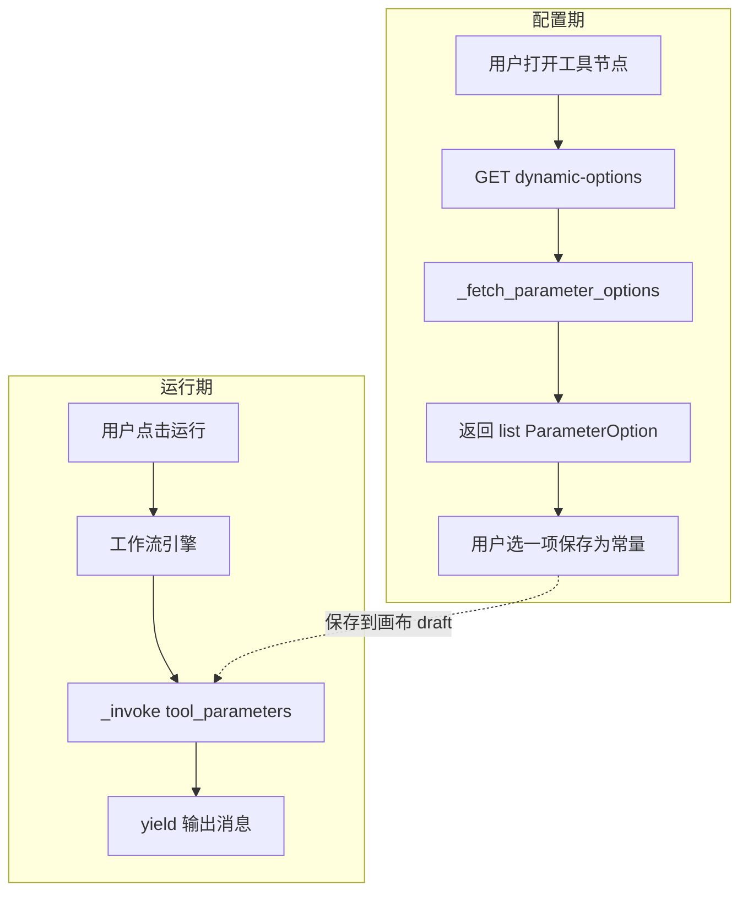
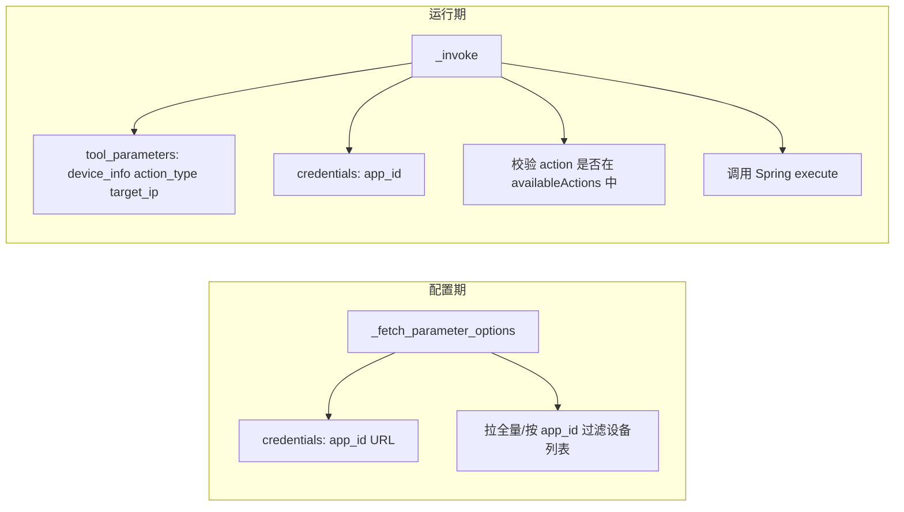

# Dify dynamic-select 配置期与运行期能用什么参数？—— self / runtime / tool_parameters 全解

> **核心结论**：Dify 插件 `Tool` 在 **配置期**（`_fetch_parameter_options` 拉下拉）与 **运行期**（`_invoke` 执行业务）使用两套完全不同的参数来源。IDE 里 `self.` 能点出很多成员，但**不等于都能用**；YAML 里的 `action_type`、`device_info` 等**不会**变成 `self.xxx`。配置期稳用的只有 **入参 `parameter`** 和 **`self.runtime.credentials`**；同节点其他表单值只在运行期通过 **`tool_parameters` 字典** 获取。
>
> **版本锚点**：Dify 1.12.x / dify_plugin SDK 0.9.x（对照 `dify_plugin/interfaces/tool/tool.py`、`entities/tool.py`、`core/plugin_executor.py`）。
>
> **前置阅读**：
> - [配置期能否拿到同节点其他参数](./20260604-1080-dify动态参数dynamic-select接口的配置期能否拿到同节点其他参数.md)
> - [_fetch_parameter_options 函数名必须固定吗](./20260604-1060-dify动态参数dynamic-select接口的_fetch_parameter_options函数名称必须固定吗.md)
> - [dynamic-select 能力边界](./20260604-1037-dify动态参数dynamic-select能力边界.md)

---

## 目录

1. [这篇博客要回答什么](#1-这篇博客要回答什么)
2. [配置期与运行期是两条链路](#2-配置期与运行期是两条链路)
3. [self 上到底有什么](#3-self-上到底有什么)
4. [self.runtime 四个字段详解](#4-selfruntime-四个字段详解)
5. [self.session 是什么、何时用](#5-selfsession-是什么何时用)
6. [YAML 参数名为何不是 self.xxx](#6-yaml-参数名为何不是-selfxxx)
7. [配置期 _fetch_parameter_options 可用清单](#7-配置期-_fetch_parameter_options-可用清单)
8. [运行期 _invoke 可用清单](#8-运行期-_invoke-可用清单)
9. [对照总表](#9-对照总表)
10. [我们项目的正确写法](#10-我们项目的正确写法)
11. [常见误区与踩坑](#11-常见误区与踩坑)
12. [常见问题 FAQ](#12-常见问题-faq)
13. [总结](#13-总结)

---

## 1. 这篇博客要回答什么

在开发 `cascading_device_action` 时，连续遇到两类问题：

**问题一**：IDE 里输入 `self.` 能自动补全很多属性，哪些在配置期/运行期**真正可用**？

**问题二**：`self.runtime` 里有哪些字段？能否通过它拿到同节点其他参数（如 `action_type`）？

本文基于 SDK 源码与实战（`app_id` 凭据透传成功、`self.action_type` 导致下拉空白）给出明确答案。

---

## 2. 配置期与运行期是两条链路



| 维度 | 配置期 | 运行期 |
|------|--------|--------|
| 钩子方法 | `_fetch_parameter_options(parameter)` | `_invoke(tool_parameters)` |
| 触发时机 | 打开节点、拉 dynamic-select | 每次执行工作流 |
| 业务参数来源 | **无** `tool_parameters` | **有** 完整 `tool_parameters` dict |
| 凭据 | `self.runtime.credentials` | `self.runtime.credentials` |
| 返回值 | `list[ParameterOption]` | `Generator[ToolInvokeMessage]` |

**关键认知**：配置期选的 `device_info` 保存后变成静态常量；运行期 `_invoke` 才收到用户填写的 `action_type`、`target_ip` 等全部参数。

---

## 3. self 上到底有什么

`Tool` 基类在 `__init__` 中只注入两个核心对象：

```python
class Tool(ToolLike[ToolInvokeMessage]):
    runtime: ToolRuntime
    session: Session
    response_type = ToolInvokeMessage

    def __init__(self, runtime: ToolRuntime, session: Session) -> None:
        self.runtime = runtime
        self.session = session
        self.response_type = ToolInvokeMessage
```

结构示意：

```
self
├── runtime              ← 凭据 + 用户/会话 ID（配置期、运行期都有）
├── session              ← 与 daemon 会话，可调 Dify 平台能力（运行期更常用）
├── response_type        ← 框架内部，插件开发者一般不用
│
├── create_text_message()       ← 输出方法，主要在 _invoke 中使用
├── create_json_message()
├── create_variable_message()
├── create_log_message()
├── ...（其他 create_*）
│
├── _invoke()                    ← 你必须实现（运行期）
├── _fetch_parameter_options()   ← 有 dynamic-select 时实现（配置期）
├── invoke()                     ← SDK 调用，勿 override
└── fetch_parameter_options()    ← SDK 调用，勿 override
```

### 3.1 IDE 补全 vs 实际可用

IDE 根据 `Tool` **类定义**列出所有方法和属性，**不区分**当前在配置期还是运行期，也**不会**把 YAML 的 `parameters` 映射为 `self` 上的字段。

| IDE 显示 | 是否等于 YAML 参数 |
|---------|-------------------|
| `self.runtime` | 否，是运行时上下文对象 |
| `self.create_json_message` | 否，是输出方法 |
| `self.action_type` | **不存在**，写了会 AttributeError |

---

## 4. self.runtime 四个字段详解

`ToolRuntime` 完整定义（`dify_plugin/entities/tool.py`）：

```python
class ToolRuntime(BaseModel):
    credentials: dict[str, Any]
    credential_type: CredentialType = CredentialType.API_KEY
    user_id: str | None
    session_id: str | None
```

**就这 4 个字段。** 没有 `tool_parameters`，没有 `action_type`，没有 `device_info`。

### 4.1 credentials — 最重要

| 属性 | 说明 |
|------|------|
| 类型 | `dict[str, Any]` |
| 来源 | 用户安装/授权插件时在「凭据」表单填写；dify-api 解密后由 daemon 注入 |
| 声明位置 | `provider/*.yaml` 的 `credentials_for_provider` |

我们项目示例：

```yaml
credentials_for_provider:
  spring_service_url:
    type: text-input
    required: true
  api_token:
    type: secret-input
    required: false
  app_id:                    # 若声明则有
    type: text-input
```

Python 读取：

```python
self.runtime.credentials.get("spring_service_url")
self.runtime.credentials.get("api_token")
self.runtime.credentials.get("app_id")
```

**配置期扩展业务上下文的正道**（`app_id` 透传实验已验证）。

### 4.2 credential_type

凭据类型枚举，如 `api-key`。一般业务逻辑很少直接使用，日志排查时可能用到。

### 4.3 user_id

触发本次调用的 Dify 用户 ID。配置期拉下拉时通常有值。

### 4.4 session_id

daemon 分配的会话 ID，多用于框架内部，业务代码很少依赖。

### 4.5 daemon 如何构造 runtime

配置期 `fetch_parameter_options` 时（`plugin_executor.py`）：

```python
tool_cls(
    runtime=ToolRuntime(
        credentials=data.credentials,
        user_id=data.user_id,
        session_id=session.session_id,
    ),
    session=session,
)
```

可见注入的只有**凭据 + 用户/会话 ID**，**没有**画布表单状态。

### 4.6 runtime 能拿到节点其他参数吗？

**不能。**

| 想找的内容 | 在 runtime 里？ |
|-----------|--------------|
| 凭据里的 `app_id` | ✅ `credentials` |
| 用户选的 `action_type` | ❌ |
| 下拉选的 `device_info` | ❌ |
| 输入的 `target_ip` | ❌ |

---

## 5. self.session 是什么、何时用

`Session` 是插件与 plugin-daemon 的会话，提供**反向调用 Dify 平台能力**的入口：

| 成员 | 用途 |
|------|------|
| `session.model` | 调 LLM、Embedding、TTS 等 |
| `session.tool` | 调其他工具 |
| `session.app` | 调 Dify 应用 |
| `session.storage` | 插件存储 |
| `session.file` | 文件操作 |
| `session.workflow_node` | 工作流节点能力 |
| `session.app_id` | **Dify 工作流应用 UUID**（易与业务 appId 混淆） |
| `session.conversation_id` | 对话 ID（工作流多为 None） |
| `session.session_id` | 会话 ID |

### 5.1 与 runtime 的分工

| 对象 | 装什么 | 拉 dynamic-select 时 |
|------|--------|---------------------|
| `self.runtime` | 凭据、user_id | **常用** |
| `self.session` | 调 Dify 能力、平台会话信息 | **一般不用于拉选项** |

### 5.2 注意 session.app_id 的歧义

```python
self.session.app_id          # Dify 画布应用 UUID，如 6a1802ea-e5a5-...
self.runtime.credentials.get("app_id")  # 业务实例 ID，如 1234567 或 dasca-dbappsecurity-tgfw
```

二者**完全不同**，不要混用。

---

## 6. YAML 参数名为何不是 self.xxx

工具 YAML 定义：

```yaml
parameters:
  - name: device_info
    type: dynamic-select
  - name: action_type
    type: select
  - name: target_ip
    type: string
```

这些 `name` **不会**在 Python 里自动生成：

```python
self.device_info   # ❌ 不存在
self.action_type   # ❌ 不存在 → AttributeError
self.target_ip     # ❌ 不存在
```

### 6.1 参数值何时、以何种形式出现

| 参数 | 配置期 | 运行期 |
|------|--------|--------|
| `device_info` | 仅知参数名 `parameter=="device_info"`，不知用户已选值 | `tool_parameters["device_info"]` |
| `action_type` | **不可知** | `tool_parameters["action_type"]` |
| `target_ip` | **不可知** | `tool_parameters["target_ip"]` |

### 6.2 错误实验复盘

```python
action_type = (self.action_type or "ip_block1").strip()  # AttributeError
```

异常被 `except` 捕获后 `return []` → 下拉空白、无界面报错、Spring 未被调用。详见 [1080 文档](./20260604-1080-dify动态参数dynamic-select接口的配置期能否拿到同节点其他参数.md)。

---

## 7. 配置期 _fetch_parameter_options 可用清单

### 7.1 ✅ 推荐使用

| 来源 | 写法 | 说明 |
|------|------|------|
| 方法入参 | `parameter` | 如 `"device_info"`，区分多个 dynamic-select |
| 凭据 | `self.runtime.credentials.get("key")` | app_id、URL、token 等 |
| 用户 ID | `self.runtime.user_id` | 可选 |
| 模块常量 | `DIFY_ACTION = "cascading_device_action"` | 透传定位参数到自有后端 |

示例：

```python
def _fetch_parameter_options(self, parameter: str) -> list[ParameterOption]:
    if parameter != "device_info":
        return []

    app_id = (self.runtime.credentials.get("app_id") or "").strip()
    spring_url = self.runtime.credentials.get("spring_service_url", "").rstrip("/")
    if not spring_url:
        return []

    resp = requests.get(
        f"{spring_url}/api/cascading-device/select-options",
        params={"app_id": app_id, "parameter": parameter},
        timeout=15,
    )
    ...
```

### 7.2 ❌ 不要使用

| 写法 | 原因 |
|------|------|
| `self.action_type` | 属性不存在 |
| `self.device_info` | 属性不存在 |
| `tool_parameters.get(...)` | 配置期无此变量 |
| `self.create_text_message(...)` | 拉下拉应 `return list[ParameterOption]` |
| 指望 `self.session` 带表单值 | session 不含节点参数 |

---

## 8. 运行期 _invoke 可用清单

### 8.1 ✅ 推荐使用

| 来源 | 写法 | 说明 |
|------|------|------|
| 全部工具参数 | `tool_parameters.get("action_type")` | 用户画布配置的值 |
| 全部工具参数 | `tool_parameters.get("device_info")` | dynamic-select 保存的常量 |
| 凭据 | `self.runtime.credentials.get("app_id")` | 与配置期相同 |
| 输出 | `yield self.create_text_message(...)` | 文本输出 |
| 输出 | `yield self.create_json_message(...)` | JSON 输出 |
| 输出 | `yield self.create_variable_message(...)` | 扁平变量输出 |
| Dify 能力 | `self.session.model` 等 | 需调 LLM 等时 |

示例：

```python
def _invoke(self, tool_parameters: dict[str, Any]):
    device_info = (tool_parameters.get("device_info") or "").strip()
    action_type = (tool_parameters.get("action_type") or "ip_block").strip()
    target_ip = (tool_parameters.get("target_ip") or "").strip()
    app_id = self.runtime.credentials.get("app_id", "")

    # 运行期才能做 action_type 与 device 的联合校验
    info = _decode_device_info(device_info)
    if info and action_type not in info.get("availableActions", []):
        yield self.create_text_message(f"警告：设备不支持 {action_type}")
    ...
```

### 8.2 运行期独有、配置期没有的能力

- 读取同节点**任意** YAML 参数当前值
- 引用上游节点变量解析后的值（若用户配置了变量引用）
- `yield` 各类输出消息
- 通过 `self.session` 反向调用 Dify

---

## 9. 对照总表

### 9.1 按「想拿什么」查表

| 想获取的内容 | 配置期 | 运行期 |
|-------------|--------|--------|
| 凭据 `app_id` | `self.runtime.credentials` | `self.runtime.credentials` |
| 凭据 `spring_service_url` | `self.runtime.credentials` | `self.runtime.credentials` |
| `action_type` 用户选择 | ❌ | `tool_parameters["action_type"]` |
| `device_info` 下拉值 | ❌（只知参数名） | `tool_parameters["device_info"]` |
| `target_ip` | ❌ | `tool_parameters["target_ip"]` |
| 当前是哪个 dynamic-select | `parameter` 入参 | — |
| Dify 工作流应用 UUID | `self.session.app_id`（慎用） | `self.session.app_id` |
| 调 LLM | 一般不用的 `self.session.model` | `self.session.model` |

### 9.2 按「self 成员」查表

| self 成员 | 配置期拉下拉 | 运行期执行 |
|-----------|-------------|-----------|
| `self.runtime.credentials` | ✅ 主力 | ✅ |
| `self.runtime.user_id` | ✅ | ✅ |
| `self.runtime.session_id` | 少用 | 少用 |
| `self.runtime.credential_type` | 少用 | 少用 |
| `self.session.*` | 一般不用于拉选项 | ✅ 按需 |
| `self.create_*` | ❌ | ✅ |
| `self.action_type` 等 | ❌ 不存在 | ❌ 不存在 |

---

## 10. 我们项目的正确写法

### 10.1 cascading_device_action 参数分区

```yaml
parameters:
  - name: device_info
    type: dynamic-select
    form: llm          # 配置期触发下拉
  - name: target_ip
    type: string
    form: form
  - name: action_type
    type: select
    form: form         # 配置期 _fetch_parameter_options 拿不到
```

### 10.2 职责划分建议



- **配置期**：凭据 `app_id` 决定展示哪些设备
- **运行期**：`tool_parameters` 做操作类型、目标 IP 校验与执行

---

## 11. 常见误区与踩坑

### 误区 1：IDE 能补全 = 能用

IDE 列出 `self` 上所有 `Tool` 方法，不区分阶段。配置期应只关心 `runtime` + `parameter`。

### 误区 2：YAML name 会变成 self 属性

`name: action_type` 只在运行期出现在 `tool_parameters` 字典的 key 里。

### 误区 3：runtime 是「运行时参数」

`runtime` 是「本次调用的运行时**上下文**」，不是 `tool_parameters`。名字容易误导。

### 误区 4：session.app_id = 凭据 app_id

前者是 Dify 应用 UUID，后者是业务实例标识。

### 误区 5：凭据里写 action_type 等于用户动态选择

凭据是**安装时写死**的；画布上 `select` 的当前值只在 `tool_parameters` 里。

---

## 12. 常见问题 FAQ

### Q1: 配置期能否用 tool_parameters？

**不能。** 方法签名无此参数，`self` 上亦无此属性。

### Q2: 能否在 credentials 里放 action_type 并在配置期读取？

**能读**，但那是授权时配置的固定值，不是用户后来在画布上改的值。

### Q3: _invoke 里还能用 self.runtime 吗？

**能。** 运行期同样注入 `ToolRuntime`，凭据与配置期一致。

### Q4: 多个 dynamic-select 怎么区分？

靠入参 `parameter`：`"device_info"` vs `"region"` 等，在方法内 `if parameter == ...` 分支。

### Q5: 想按 action_type 过滤 device 下拉怎么办？

当前 Dify **不支持**配置期联动。替代：运行期校验（方案 A）、多节点工作流（方案 B）、凭据写死 action（方案 C）。见 [1080 文档 · 可行替代方案](./20260604-1080-dify动态参数dynamic-select接口的配置期能否拿到同节点其他参数.md#10-可行替代方案)。

---

## 13. 总结

### 13.1 两个问题的一句话答案

| 问题 | 答案 |
|------|------|
| `self.` 里哪些能用？ | 配置期：`runtime.credentials` + 入参 `parameter`；运行期：再加 `tool_parameters`（通过 `_invoke` 入参）、`create_*`、`session.*` |
| `self.runtime` 有什么？能否拿节点其他参数？ | 仅 `credentials`、`credential_type`、`user_id`、`session_id`；**不能**拿 `action_type` 等同节点表单值 |

### 13.2 记忆图

```mermaid
graph TB
    subgraph 配置期 _fetch_parameter_options
        P[parameter 入参]
        R[self.runtime.credentials]
    end

    subgraph 运行期 _invoke
        T[tool_parameters 字典]
        R2[self.runtime.credentials]
        S[self.session / create_*]
    end

  YAML参数 action_type device_info --> T
  凭据 app_id URL --> R
  凭据 app_id URL --> R2
```

### 13.3 三条铁律

1. **YAML 参数名 ≠ `self` 属性**；运行期用 `tool_parameters.get("name")`。
2. **`self.runtime` = 凭据 + 用户/会话 ID**；不是表单快照。
3. **配置期与运行期参数不互通**；联动需求放运行期 `_invoke` 或改 Dify 全栈。

---

**相关文件索引**

| 文件 | 说明 |
|------|------|
| `dify_plugin/entities/tool.py` | `ToolRuntime` 定义 |
| `dify_plugin/interfaces/tool/tool.py` | `Tool` 基类与 `create_*` |
| `dify_plugin/core/plugin_executor.py` | 配置期如何构造 `ToolRuntime` |
| `test-dify/.../cascading_device_action.py` | 项目实战代码 |
| `test-dify/.../provider/iot_device_plugin.yaml` | `credentials_for_provider` 声明 |
