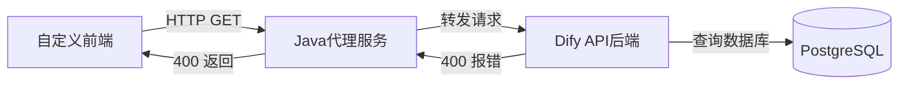
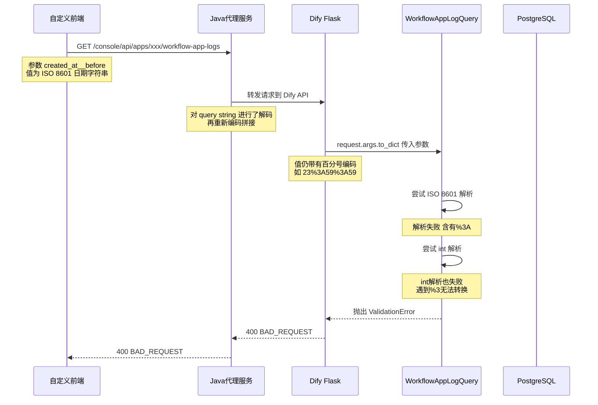
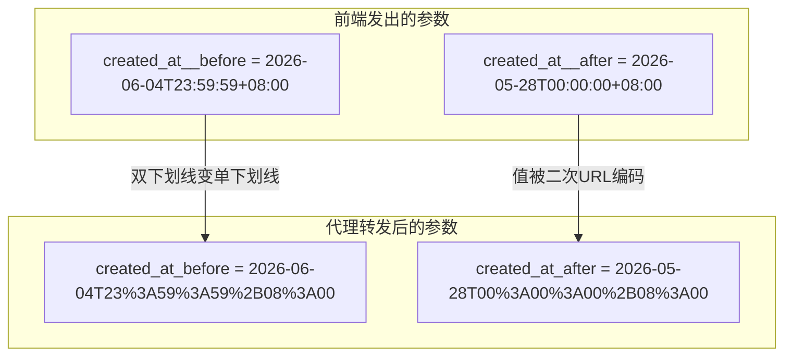
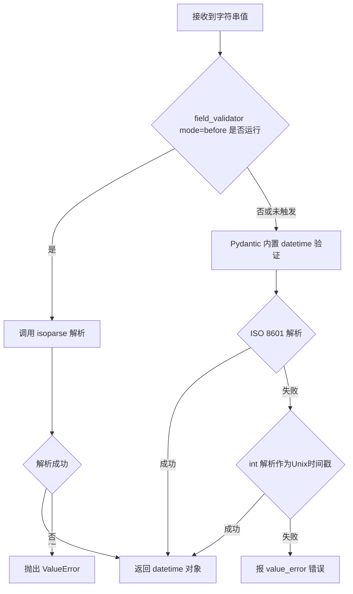
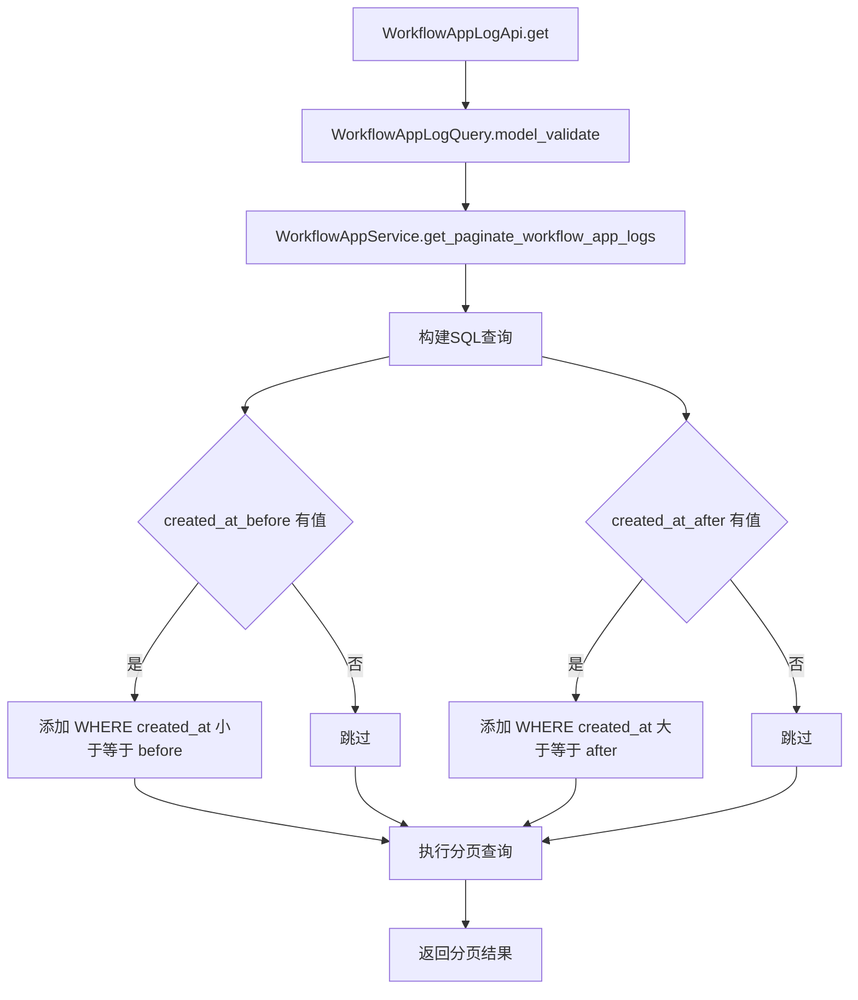
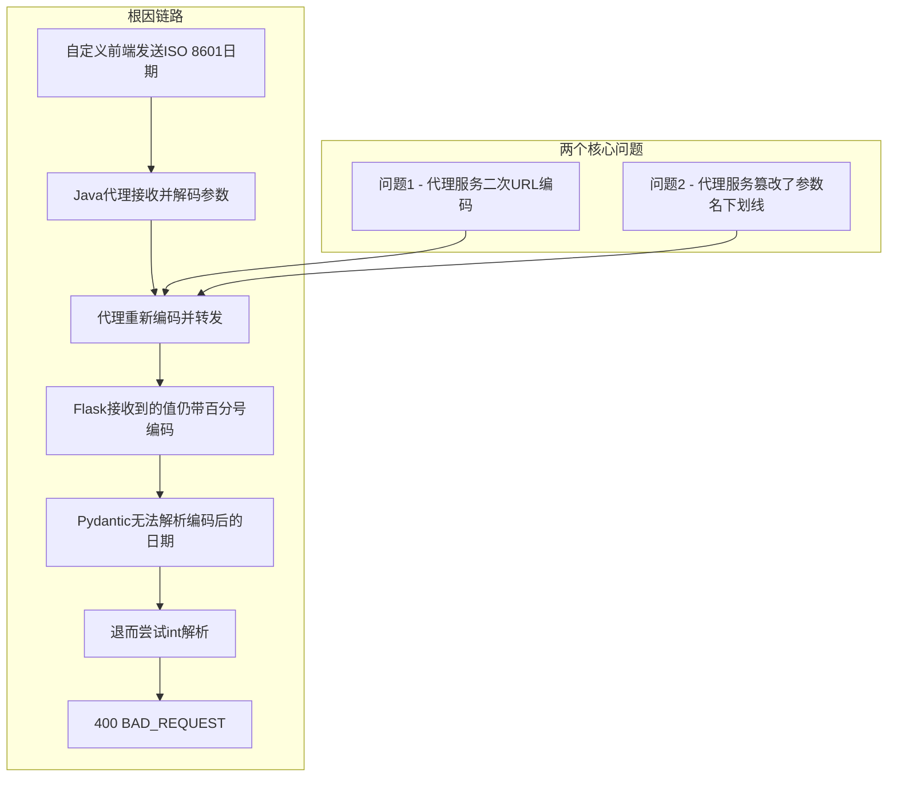

# Dify 内网部署 - 任务日志页面报错深度分析与排查

## 一、问题背景

将 Dify 部署到内网（离线）环境后，基于 Dify 前端源码开发了自定义前端页面，并通过自研的 Java 代理服务转发请求到 Dify API。在访问**工作流任务日志**页面时，接口返回 `400 BAD_REQUEST` 错误：

```json
{
  "code": "invalid_param",
  "message": "2 validation errors for WorkflowAppLogQuery\ncreated_at_before\n  Value error, invalid literal for int() with base 10: b'%3' [type=value_error, input_value='2026-06-04T23%3A59%3A59%2B08%3A00', input_type=str]\ncreated_at_after\n  Value error, invalid literal for int() with base 10: b'%3' [type=value_error, input_value='2026-05-28T00%3A00%3A00%2B08%3A00', input_type=str]",
  "status": 400
}
```

> 疑问：内网环境下，Dify 是否在调用外网？错误中的 `https://errors.pydantic.dev/...` 链接是什么？

**结论：Dify 没有调用任何外网。** 错误信息中的 `https://errors.pydantic.dev/2.12/v/value_error` 仅仅是 Pydantic 框架在抛出验证异常时**自动附加的文档链接文本**，并不是实际的网络请求。这个报错完全是后端参数校验失败导致的。

---

## 二、系统架构与请求链路

### 2.1 整体架构



### 2.2 请求完整链路



---

## 三、前端源码分析 - 参数构造过程

### 3.1 页面组件

文件路径：`web/app/components/app/workflow-log/index.tsx`

前端在构造查询参数时，使用 `dayjs` 库生成 ISO 8601 格式的日期字符串：

```typescript
// 默认选择"最近7天"，period 默认为 '2'
const [queryParams, setQueryParams] = useState<QueryParam>({
  status: 'all',
  period: '2'
})

// 构造请求参数
const query = {
  page: currPage + 1,
  detail: true,
  limit,
  // 当 period 不是 '9'(全部时间) 时，添加时间范围过滤
  ...((debouncedQueryParams.period !== '9')
    ? {
        created_at__after: dayjs()
          .subtract(TIME_PERIOD_MAPPING[debouncedQueryParams.period]!.value, 'day')
          .startOf('day')
          .tz(timezone)
          .format('YYYY-MM-DDTHH:mm:ssZ'),
        created_at__before: dayjs()
          .endOf('day')
          .tz(timezone)
          .format('YYYY-MM-DDTHH:mm:ssZ'),
      }
    : {}),
}
```

### 3.2 时间参数格式

| 参数名 | 示例值 | 说明 |
|--------|--------|------|
| `created_at__after` | `2026-05-28T00:00:00+08:00` | 7天前的零点 |
| `created_at__before` | `2026-06-04T23:59:59+08:00` | 今天的最后一秒 |

> 注意：参数名使用**双下划线** `__`，这是为了避免与 Python 关键字 `before` 冲突。

### 3.3 时间范围选项

文件路径：`web/app/components/app/workflow-log/filter.tsx`

```typescript
export const TIME_PERIOD_MAPPING = {
  1: { value: 0,   name: 'today' },          // 今天
  2: { value: 7,   name: 'last7days' },      // 最近7天 (默认)
  3: { value: 28,  name: 'last4weeks' },     // 最近4周
  4: { value: ..., name: 'last3months' },    // 最近3个月
  5: { value: ..., name: 'last12months' },   // 最近12个月
  6: { value: ..., name: 'monthToDate' },    // 本月至今
  7: { value: ..., name: 'quarterToDate' },  // 本季度至今
  8: { value: ..., name: 'yearToDate' },     // 今年至今
  9: { value: -1,  name: 'allTime' },        // 全部时间 (不传时间参数)
}
```

### 3.4 HTTP 请求发送

文件路径：`web/service/use-log.ts`

```typescript
export const useWorkflowLogs = ({ appId, params }: WorkflowLogsParams) => {
  return useQuery<WorkflowLogsResponse>({
    queryKey: [NAME_SPACE, 'workflow-logs', appId, params],
    queryFn: () => get<WorkflowLogsResponse>(
      `/apps/${appId}/workflow-app-logs`,
      { params }
    ),
    enabled: !!appId,
  })
}
```

文件路径：`web/service/fetch.ts`

底层使用 `ky` HTTP 客户端库，通过 `searchParams` 选项将参数附加到 URL：

```typescript
res = await client(request || fetchPathname, {
  ...init,
  headers,
  searchParams: !fetchCompat ? params : undefined,
})
```

`ky` 会自动对参数值进行 URL 编码：
- `:` 编码为 `%3A`
- `+` 编码为 `%2B`

所以最终发出的 URL 类似：

```
/console/api/apps/xxx/workflow-app-logs
  ?page=1&detail=true&limit=20
  &created_at__after=2026-05-28T00%3A00%3A00%2B08%3A00
  &created_at__before=2026-06-04T23%3A59%3A59%2B08%3A00
```

---

## 四、代理服务问题分析

### 4.1 代理日志中发现的异常

从 Java 代理服务（`DifyProxyServiceImpl.java`）的日志中发现两个关键问题：

| 问题 | 具体表现 |
|------|----------|
| **URL 值二次编码** | `created_at_after` 到达 Dify 时仍带有 `%3A`、`%2B`，说明代理对参数值进行了解码后又重新编码 |
| **参数名被篡改** | 前端发送的是双下划线 `created_at__before`，到达 Dify 时变成了单下划线 `created_at_before` |

### 4.2 参数在代理层的变化对比



### 4.3 代理服务常见的错误转发方式

以 Java Spring Boot 代理为例，常见的错误做法：

```java
// 错误方式1 - 手动解析再拼接导致二次编码
String after = request.getParameter("created_at__after");
// after = "2026-05-28T00:00:00+08:00" (已解码)
String url = targetUrl + "?created_at__after=" + URLEncoder.encode(after);
// URL中变成了 created_at__after=2026-05-28T00%3A00%3A00%2B08%3A00

// 错误方式2 - 某些HTTP框架自动处理下划线
// Spring的request.getParameter可能把 __ 解析为 _
```

### 4.4 正确的代理转发方式

```java
// 正确方式 - 原样透传 query string
String rawQuery = request.getQueryString();
// rawQuery = "created_at__after=2026-05-28T00%3A00%3A00%2B08%3A00&..."
String url = targetUrl + "?" + rawQuery;
// 原样转发，不做任何解码或重新编码
```

---

## 五、后端源码分析 - Pydantic 验证流程

### 5.1 路由入口

文件路径：`api/controllers/console/app/workflow_app_log.py`

```python
@console_ns.route("/apps/<uuid:app_id>/workflow-app-logs")
class WorkflowAppLogApi(Resource):
    @setup_required
    @login_required
    @account_initialization_required
    @get_app_model(mode=[AppMode.WORKFLOW])
    def get(self, app_model: App):
        # 从 query string 中提取参数并进行 Pydantic 校验
        args = WorkflowAppLogQuery.model_validate(
            request.args.to_dict(flat=True)
        )
```

Flask 的 `request.args.to_dict(flat=True)` 会返回一个扁平字典，正常情况下会自动解码 URL 参数。

### 5.2 Pydantic 校验模型

```python
from pydantic import BaseModel, Field, field_validator
from dateutil.parser import isoparse
from datetime import datetime

class WorkflowAppLogQuery(BaseModel):
    keyword: str | None = Field(default=None)
    status: WorkflowExecutionStatus | None = Field(default=None)
    # 注意：字段名使用双下划线 __
    created_at__before: datetime | None = Field(default=None)
    created_at__after: datetime | None = Field(default=None)
    detail: bool = Field(default=False)
    page: int = Field(default=1, ge=1, le=99999)
    limit: int = Field(default=20, ge=1, le=100)

    @field_validator("created_at__before", "created_at__after", mode="before")
    @classmethod
    def parse_datetime(cls, value: str | None) -> datetime | None:
        if value in (None, ""):
            return None
        return isoparse(value)
```

### 5.3 Pydantic v2 验证链

当 `datetime` 类型字段接收到 `str` 值时，Pydantic v2 会按以下顺序尝试解析：



### 5.4 本次报错的具体过程

```
输入值: '2026-06-04T23%3A59%3A59%2B08%3A00'

第1步 - ISO 8601 解析:
  isoparse('2026-06-04T23%3A59%3A59%2B08%3A00')
  -> 失败: '%3A' 不是合法的时间分隔符

第2步 - Pydantic 内置 datetime 验证:
  尝试 ISO 格式 -> 失败 (含百分号编码)
  尝试 int() 转换 -> 失败
  int('2026-06-04T23%3A59%3A59%2B08%3A00')
  -> ValueError: invalid literal for int() with base 10: b'%3'

最终结果: 抛出 ValidationError -> 400 BAD_REQUEST
```

---

## 六、Service API 对比

Dify 提供了两套 API 来查询工作流日志，参数处理方式有所不同：

| 对比项 | Console API | Service API |
|--------|-------------|-------------|
| 路径 | `/console/api/apps/<id>/workflow-app-logs` | `/v1/workflows/logs` |
| 认证方式 | 用户登录 Token | App API Token |
| 模型类名 | `WorkflowAppLogQuery` | `WorkflowLogQuery` |
| 时间字段类型 | `datetime or None` | `str or None` |
| 解析方式 | `field_validator` + `isoparse` | 手动调用 `isoparse` |

Service API 的实现（`api/controllers/service_api/app/workflow.py`）：

```python
class WorkflowLogQuery(BaseModel):
    # 字段类型为 str，不做自动转换
    created_at__before: str | None = None
    created_at__after: str | None = None
    page: int = Field(default=1, ge=1, le=99999)
    limit: int = Field(default=20, ge=1, le=100)

# 在接口实现中手动解析
args = WorkflowLogQuery.model_validate(request.args.to_dict())
created_at_before = isoparse(args.created_at__before) if args.created_at__before else None
created_at_after = isoparse(args.created_at__after) if args.created_at__after else None
```

---

## 七、服务层处理流程

文件路径：`api/services/workflow_app_service.py`

参数通过验证后，进入 `WorkflowAppService` 处理：



核心 SQL 过滤逻辑：

```python
if created_at_before:
    stmt = stmt.where(WorkflowAppLog.created_at <= created_at_before)

if created_at_after:
    stmt = stmt.where(WorkflowAppLog.created_at >= created_at_after)
```

---

## 八、错误根因总结



---

## 九、解决方案

### 方案一：代理服务原样透传 query string（推荐）

**核心原则**：代理层不要解析、解码、重新编码查询参数，直接把原始 query string 透传给 Dify。

```java
// 正确做法：原样透传
String rawQuery = request.getQueryString();
String targetUrl = difyBaseUrl + request.getRequestURI();
if (rawQuery != null) {
    targetUrl += "?" + rawQuery;
}
// 发送请求时不再对 URL 做任何编码处理
```

同时确保参数名不被篡改，特别是双下划线 `__` 要保持原样。

### 方案二：升级 Dify 到最新版本

当前源码中的 `WorkflowAppLogQuery` 已做优化：

- 字段类型为 `datetime | None`，支持 ISO 8601 字符串
- 添加了 `field_validator(mode="before")`，通过 `isoparse` 解析日期
- 比旧版 `int` 类型更具容错性

如果部署的是旧版本（字段类型为 `int`，只接受 Unix 时间戳），升级到最新版可以自动兼容 ISO 8601 格式。

### 方案三：代理服务层转换参数格式

如果不方便升级 Dify，可以在代理服务中将 ISO 日期转为 Unix 时间戳：

```java
// 将 ISO 8601 日期转为 Unix 时间戳
String isoDate = request.getParameter("created_at__before");
if (isoDate != null) {
    long timestamp = Instant.parse(isoDate).getEpochSecond();
    // 用 timestamp 替换原始参数值
}
```

### 方案四：自定义前端发送 Unix 时间戳

如果前端可控，可以在发送前将日期转为 Unix 时间戳：

```typescript
// 将 ISO 8601 日期转为 Unix 时间戳 (秒)
const beforeTimestamp = dayjs().endOf('day').unix()
const afterTimestamp = dayjs().subtract(7, 'day').startOf('day').unix()

const query = {
  page: 1,
  detail: true,
  limit: 20,
  created_at__before: beforeTimestamp,  // 如 1749082559
  created_at__after: afterTimestamp,    // 如 1748448000
}
```

---

## 十、排查检查清单

当内网部署的 Dify 出现接口报错时，按以下步骤排查：

| 步骤 | 检查项 | 检查方法 |
|------|--------|----------|
| 1 | 确认是否真的调了外网 | 检查错误中的 URL 是否只是文本而非实际请求 |
| 2 | 对比代理前后的参数 | 在代理层打印转发前后的完整 URL 和参数 |
| 3 | 检查 URL 编码状态 | 查看参数值是否包含未解码的 `%3A`、`%2B` 等 |
| 4 | 检查参数名是否一致 | 特别是下划线数量、大小写等细节 |
| 5 | 检查 Dify 版本 | 确认部署版本与源码是否一致 |
| 6 | 检查 Content-Type | 代理转发时是否正确设置了请求头 |

---

## 十一、关键源码文件索引

| 文件 | 作用 |
|------|------|
| `web/app/components/app/workflow-log/index.tsx` | 前端页面组件，构造查询参数 |
| `web/app/components/app/workflow-log/filter.tsx` | 时间范围过滤器配置 |
| `web/service/use-log.ts` | React Query Hook，调用 API |
| `web/service/fetch.ts` | 底层 HTTP 客户端（ky），处理 URL 编码 |
| `api/controllers/console/app/workflow_app_log.py` | Console API 控制器，Pydantic 校验模型 |
| `api/controllers/service_api/app/workflow.py` | Service API 控制器，手动解析日期 |
| `api/services/workflow_app_service.py` | 服务层，SQL 查询构建与分页 |

---

## 十二、总结

1. **报错原因**：代理服务在转发请求时对查询参数进行了二次 URL 编码，导致日期参数值仍带有 `%3A`、`%2B` 等编码字符，Dify 后端的 Pydantic 无法解析
2. **不是外网调用**：错误信息中的 Pydantic 文档链接只是文本，Dify 没有发起任何外网请求
3. **解决核心**：代理服务应原样透传 query string，不做任何解码或重新编码操作
4. **版本注意**：旧版 Dify 的时间字段类型为 `int`（只接受 Unix 时间戳），新版已改为 `datetime`（支持 ISO 8601），建议升级到最新版以提高兼容性

