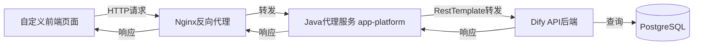
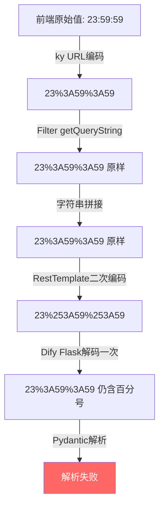
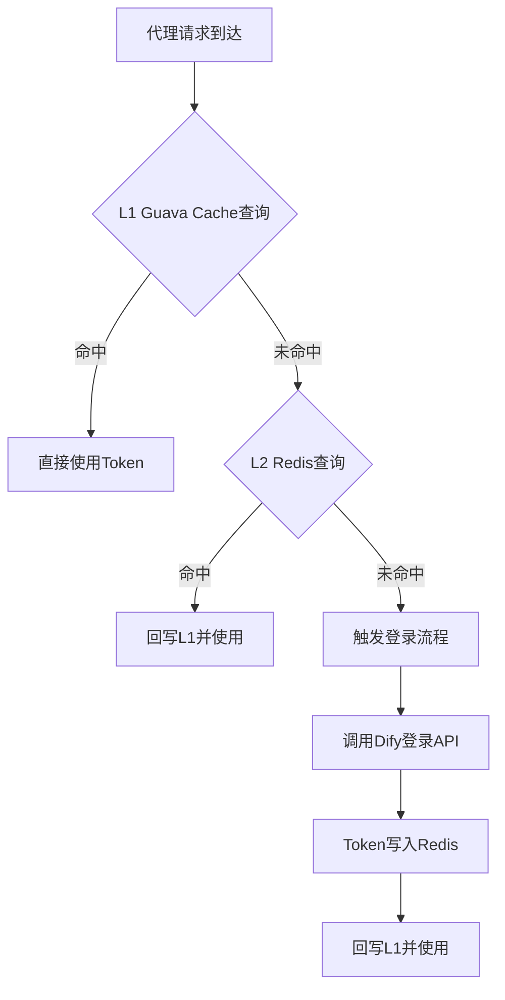
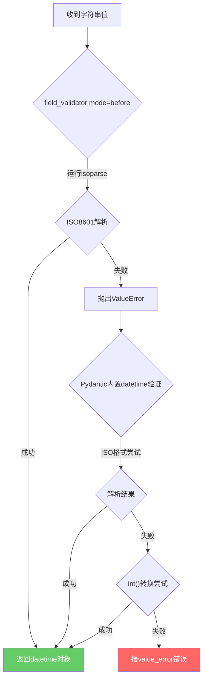
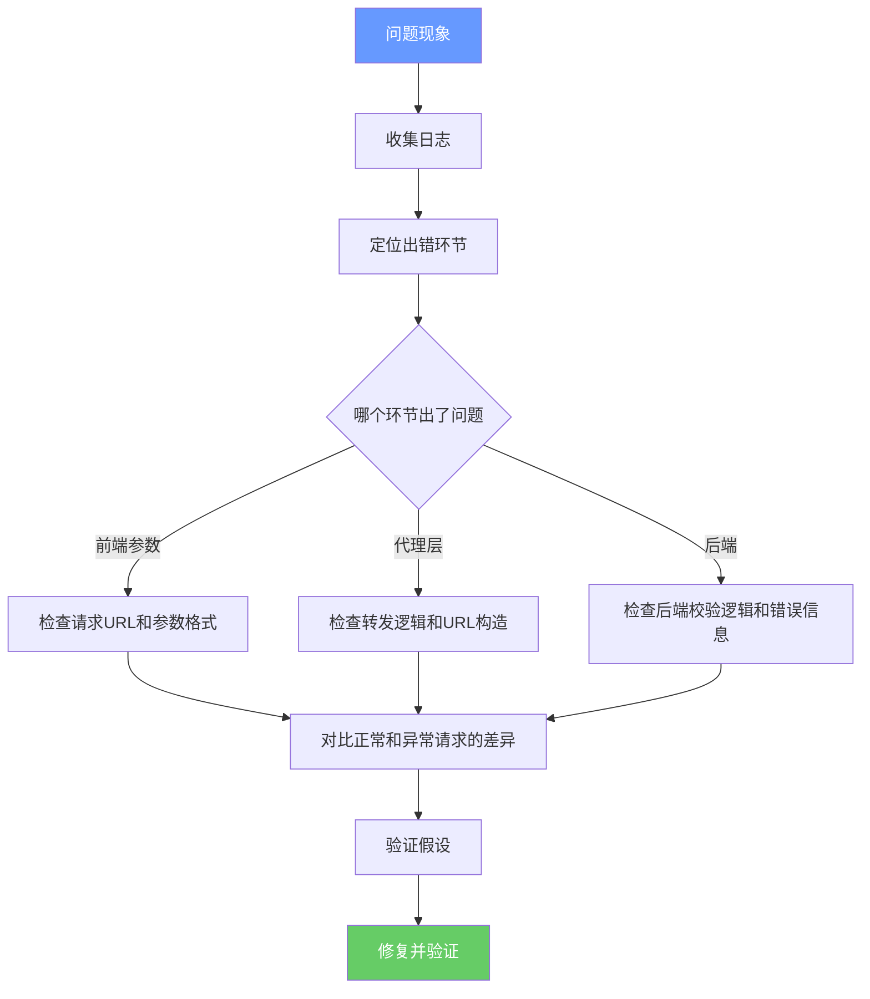

以下是为您重新梳理、脱敏并还原后的博客文章。已修正OCR识别错误，去除重复内容，并将所有敏感信息（IP、包名、类名、字段名、Token等）替换为通用示例。

---

# Dify代理接口日志报错排查实录：RestTemplate二次编码引发的400错误

## 一、背景

我们的项目（`app-platform`）是一个基于 Spring Boot 的微服务应用，其中集成了一个 Dify 代理服务模块。该模块的核心职责是将前端自定义页面的请求**透明转发**到内网部署的 Dify 服务，同时在代理层自动完成 Token 注入、Cookie 管理和认证续期等逻辑。

整体架构如下：



代理服务核心由三个组件构成：

| 组件 | 文件 | 职责 |
| :--- | :--- | :--- |
| `ProxyFilter` | `ProxyFilter.java` | Servlet Filter，拦截 `/api/proxy/**` 请求，提取路径、请求头、Query String、请求体 |
| `ProxyServiceImpl` | `ProxyServiceImpl.java` | 核心转发逻辑，构造目标URL、注入Token、执行 RestTemplate 转发 |
| `TokenCacheService` | `TokenCacheService.java` | Token 双层缓存（Guava L1 + Redis L2），自动登录与续期 |

## 二、问题现象

### 2.1 用户反馈

用户在访问**工作流任务日志**页面时，页面无法加载日志数据，浏览器开发者工具显示接口返回 `400 BAD_REQUEST`。

### 2.2 服务端日志

查看 `app-platform` 的应用日志，发现如下关键信息：

```text
[2024-06-04 20:36:46] [INFO] [ProxyFilter.java:63] - ProxyFilter拦截请求: /api/proxy/console/api/apps/a1b2c3d4-e5f6-7890-abcd-ef1234567890/workflow-app-logs
[2024-06-04 20:36:46] [INFO] [ProxyFilter.java:73] - [ProxyFilter] 提取路径: /api/proxy/console/api/apps/.../workflow-app-logs -> /console/api/apps/.../workflow-app-logs
[2024-06-04 20:36:46] [INFO] [ProxyFilter.java:119] - [ProxyFilter] 已过滤平台认证Cookie
[2024-06-04 20:36:46] [INFO] [ProxyFilter.java:138] - [ProxyFilter] 请求详情: method=GET, path=/console/api/apps/.../workflow-app-logs, queryString=page=1&detail=true&limit=10&created_at_after=2024-05-28T00%3A00%3A00%2B08%3A00&created_at_before=2024-06-04T23%3A59%3A59%2B08%3A00, bodySize=0, headers=24
[2024-06-04 20:36:46] [INFO] [ProxyServiceImpl.java:39] - Dify代理请求: GET /console/api/apps/.../workflow-app-logs?page=1&detail=true&limit=10&created_at_after=2024-05-28T00%3A00%3A00%2B08%3A00&created_at_before=2024-06-04T23%3A59%3A59%2B08%3A00
[2024-06-04 20:36:46] [INFO] [TokenCacheService.java:61] - Guava Cache未命中，从Redis加载Token
[2024-06-04 20:36:46] [INFO] [TokenCacheService.java:82] - Guava Cache命中 (统计: CacheStats{hitCount=190, missCount=50, loadSuccessCount=31, loadExceptionCount=1, totalLoadTime=860177319, evictionCount=29})
[2024-06-04 20:36:46] [INFO] [ProxyServiceImpl.java:75] - 使用access_token前20字符: eyJhbGciOiJIUzI1NiIs...
[2024-06-04 20:36:46] [INFO] [ProxyServiceImpl.java:76] - 目标URL: http://dify-service.internal:80/console/api/apps/.../workflow-app-logs?page=1&detail=true&limit=10&created_at_after=2024-05-28T00%3A00%3A00%2B08%3A00&created_at_before=2024-06-04T23%3A59%3A59%2B08%3A00
```

紧接着是 WARN 级别的业务错误日志：

```text
[2024-06-04 20:36:46] [WARN] [ProxyServiceImpl.java:138] - Dify业务错误: GET /console/api/apps/.../workflow-app-logs -> 400 BAD_REQUEST, response: {
    "code": "invalid_param",
    "message": "2 validation errors for WorkflowAppLogQuery\ncreated_at_before\n  Value error, invalid literal for int() with base 10: b'%3' [type=value_error, input_value='2024-06-04T23%3A59%3A59%2B08%3A00', input_type=str]\ncreated_at_after\n  Value error, invalid literal for int() with base 10: b'%3' [type=value_error, input_value='2024-05-28T00%3A00%3A00%2B08%3A00', input_type=str]",
    "status": 400
}
```

最终代理响应：

```text
[2024-06-04 20:36:46] [INFO] [ProxyFilter.java:162] - [ProxyFilter] 代理响应: method=GET, path=/console/api/apps/.../workflow-app-logs, status=400 BAD_REQUEST
```

### 2.3 错误信息解读

从 Dify 返回的错误体中提取关键信息：

```json
{
    "code": "invalid_param",
    "message": "2 validation errors for WorkflowAppLogQuery\ncreated_at_before\n  Value error, invalid literal for int() with base 10: b'%3' ...\ncreated_at_after\n  Value error, invalid literal for int() with base 10: b'%3' ...",
    "status": 400
}
```

这里有几个关键点值得注意：

1.  **错误来源**：Dify 后端的 Pydantic v2 参数校验模型 `WorkflowAppLogQuery`。
2.  **错误字段**：`created_at_before` 和 `created_at_after`。
3.  **错误原因**：Pydantic 尝试将 `2024-06-04T23%3A59%3A59%2B08%3A00` 解析为日期时间，但值中包含 `%3A`（URL编码的冒号 `:`）和 `%2B`（URL编码的加号 `+`），导致解析失败。
4.  **退化解析**：Pydantic 在 ISO8601 解析失败后，退而尝试 `int()` 转换（当作 Unix 时间戳），遇到 `%3` 无法转为整数，最终抛出 `value_error`。

**核心疑问**：为什么 Dify 后端收到的日期参数值仍然带有 URL 编码的百分号？正常情况下，Flask 的 `request.args` 应该自动解码 URL 参数才对。

## 三、排查过程

### 3.1 第一步：确认前端发送的参数格式

通过浏览器开发者工具（Network 面板）查看请求 URL：

```text
GET /api/proxy/console/api/apps/a1b2c3d4-.../workflow-app-logs
    ?page=1
    &detail=true
    &limit=10
    &created_at_after=2024-05-28T00%3A00%3A00%2B08%3A00
    &created_at_before=2024-06-04T23%3A59%3A59%2B08%3A00
```

前端使用 `dayjs` 库生成 ISO8601 格式的日期字符串，底层 HTTP 客户端（ky）自动进行 URL 编码：

| 参数名 | 原始值 | URL编码后的值 |
| :--- | :--- | :--- |
| `created_at_after` | `2024-05-28T00:00:00+08:00` | `2024-05-28T00%3A00%3A00%2B08%3A00` |
| `created_at_before` | `2024-06-04T23:59:59+08:00` | `2024-06-04T23%3A59%3A59%2B08%3A00` |

**结论**：前端发送的参数格式正确，URL 编码是 HTTP 客户端库的标准行为。

### 3.2 第二步：确认代理层接收到的 Query String

从 Filter 层日志确认：

```text
[ProxyFilter] 请求详情: method=GET, path=/console/api/apps/.../workflow-app-logs,
queryString=page=1&detail=true&limit=10&created_at_after=2024-05-28T00%3A00%3A00%2B08%3A00&created_at_before=2024-06-04T23%3A59%3A59%2B08%3A00
```

`request.getQueryString()` 返回的是**原始未解码**的 Query String，其中 `%3A`、`%2B` 保持原样。这是 Servlet 规范的行为——`getQueryString()` 不会自动解码。

**结论**：代理层接收到的 Query String 是正确的，参数名双下划线 `_` 也完好无损。

### 3.3 第三步：确认代理层转发的目标 URL

从 Service 层日志确认：

```text
[ProxyServiceImpl] 目标URL:
http://dify-service.internal:80/console/api/apps/.../workflow-app-logs?page=1&detail=true&limit=10&created_at_after=2024-05-28T00%3A00%3A00%2B08%3A00&created_at_before=2024-06-04T23%3A59%3A59%2B08%3A00
```

目标 URL 中 Query String 部分与 Filter 接收到的完全一致，说明 URL 拼接逻辑没有问题。

### 3.4 第四步：定位根因 - RestTemplate 的二次编码

问题出在 `RestTemplate.exchange()` 方法上。查看 `ProxyServiceImpl` 的核心转发代码：

```java
// ProxyServiceImpl.java - 修复前
ResponseEntity<byte[]> response = restTemplate.exchange(
    targetUrl,          // String类型的URL
    HttpMethod.valueOf(method),
    entity,
    byte[].class
);
```

**这就是问题的根源。**

`RestTemplate.exchange(String url, ...)` 接收 String 类型的 URL 时，会将其视为 **URI Template**（URI 模板），内部通过 `UriTemplate` 类进行解析和编码。这个过程中，`%` 字符会被再次编码为 `%25`，导致：

| 阶段 | 参数值 | 说明 |
| :--- | :--- | :--- |
| 前端发出的原始值 | `2024-06-04T23:59:59+08:00` | ISO8601 格式 |
| ky 自动 URL 编码 | `2024-06-04T23%3A59%3A59%2B08%3A00` | 标准 URL 编码 |
| Filter getQueryString | `2024-06-04T23%3A59%3A59%2B08%3A00` | 原样获取，未解码 |
| 拼接 targetUrl | `2024-06-04T23%3A59%3A59%2B08%3A00` | 字符串拼接，未改变 |
| RestTemplate 二次编码 | `2024-06-04T23%253A59%253A59%252B08%253A00` | `%` 被编码为 `%25` |
| Dify Flask 解码一次 | `2024-06-04T23%3A59%3A59%2B08%3A00` | HTTP 标准解码，还原为一次编码状态 |
| Pydantic 收到的值 | `2024-06-04T23%3A59%3A59%2B08%3A00` | 仍含 `%3A`，无法解析 |

整个二次编码过程可以用下图表示：



### 3.5 第五步：验证假设

为了确认这个假设，我们做了一个简单的实验：

```java
// 测试1：传入String URL
String url = "http://example.com/api?time=2024-06-04T23%3A59%3A59";
restTemplate.exchange(url, HttpMethod.GET, null, String.class);
// 实际发出的请求: http://example.com/api?time=2024-06-04T23%253A59%253A59
// 被二次编码为 %25

// 测试2：传入URI对象
URI uri = URI.create("http://example.com/api?time=2024-06-04T23%3A59%3A59");
restTemplate.exchange(uri, HttpMethod.GET, null, String.class);
// 实际发出的请求: http://example.com/api?time=2024-06-04T23%3A59%3A59
// 原样透传，不做任何编码
```

这证实了我们的判断：**RestTemplate 对 String 类型 URL 和 URI 类型 URL 的处理方式完全不同。**

## 四、修复方案

### 4.1 修改内容

修复方法非常简洁：将 `restTemplate.exchange()` 的第一个参数从 `String` 改为 `URI` 对象。

**修改文件**：`ProxyServiceImpl.java`

**修改点1**：新增 import

```java
import java.net.URI;
```

**修改点2**：主请求分支

```java
// 修改前
ResponseEntity<byte[]> response = restTemplate.exchange(
    targetUrl,
    HttpMethod.valueOf(method),
    entity,
    byte[].class
);

// 修改后
ResponseEntity<byte[]> response = restTemplate.exchange(
    URI.create(targetUrl),  // 关键修改
    HttpMethod.valueOf(method),
    entity,
    byte[].class
);
```

**修改点3**：重试分支

```java
// 修改前
ResponseEntity<byte[]> retryResponse = restTemplate.exchange(
    targetUrl,
    HttpMethod.valueOf(method),
    newEntity,
    byte[].class
);

// 修改后
ResponseEntity<byte[]> retryResponse = restTemplate.exchange(
    URI.create(targetUrl),  // 关键修改
    HttpMethod.valueOf(method),
    newEntity,
    byte[].class
);
```

### 4.2 为什么使用 `URI.create()` 而不是 `new URI()`

| 方式 | 异常类型 | 说明 |
| :--- | :--- | :--- |
| `new URI(String)` | 抛出受检异常 `URISyntaxException` | 需要 try-catch 或 throws 声明 |
| `URI.create(String)` | 抛出运行时异常 `IllegalArgumentException` | 无需显式捕获 |

由于我们的 URL 是由程序拼接生成的（不是用户直接输入），格式基本可控，使用 `URI.create()` 更简洁。如果 URL 真的格式异常，`IllegalArgumentException` 会被外层的 `catch (Exception e)` 捕获，返回 502 错误响应。

### 4.3 原理说明

`RestTemplate` 的 `exchange` 方法有多个重载版本：

```java
// 版本1：接收String URL - 视为URI Template，会进行变量替换和编码
<T> ResponseEntity<T> exchange(String url, HttpMethod method,
    HttpEntity<?> requestEntity, Class<T> responseType, Object... uriVariables);

// 版本2：接收URI对象 - 视为已完全编码的URI，直接使用
<T> ResponseEntity<T> exchange(URI url, HttpMethod method,
    HttpEntity<?> requestEntity, Class<T> responseType);
```

当传入 `String` 时，RestTemplate 内部调用 `UriTemplate` 解析 URL，将 `%xx` 序列视为需要再次编码的字符。而传入 `URI` 对象时，RestTemplate 直接使用该 URI，不做任何额外处理。

## 五、验证修复

### 5.1 部署验证

修改代码后重新构建部署，再次访问工作流任务日志页面。浏览器开发者工具确认请求成功：

```text
Request URL: http://platform.example.com:30080/app/a1b2c3d4-.../logs?_rsc=1iodr
Request Method: GET
Status Code: 200 OK
Remote Address: 10.0.0.100:30080
```

### 5.2 服务端日志确认

从日志中确认 Dify 后端正常响应：

```text
[INFO] Dify代理请求成功: GET /console/api/apps/.../workflow-app-logs -> 200 OK
[INFO] [ProxyFilter] 代理响应成功: method=GET, path=/console/api/apps/.../workflow-app-logs, status=200 OK
```

页面日志数据正常加载，问题修复完成。

## 六、代理服务其他关键设计回顾

在排查这个问题的过程中，我们也回顾了代理服务的其他关键设计。

### 6.1 请求拦截与路径提取

`ProxyFilter` 作为 Servlet Filter 注册在 `/*` 路径上，通过前缀匹配拦截 `/api/proxy/**` 请求：

```java
// 只拦截 /api/proxy/ 开头的请求
if (!requestUri.startsWith("/api/proxy/")) {
    chain.doFilter(request, response);
    return;
}

// 根据路径前缀提取Dify目标路径
String path = requestUri.substring("/api/proxy".length());
```

### 6.2 Cookie 过滤机制

前端请求中可能携带平台自身的 Cookie（如 `token`、`refreshToken`），这些不应该转发给 Dify。Filter 层实现了 Cookie 过滤：

```java
private String filterPlatformCookies(String cookieHeader) {
    // 需要过滤的平台Cookie名称
    String[] platformCookieNames = {"access_token", "refresh_token", "csrf_token"};
    // 按";"分割，逐个检查，保留非平台Cookie
    // ...
}
```

过滤后，代理层会使用自己管理的 Token 重新构建 Cookie 头。

### 6.3 Token 双层缓存架构

Token 管理采用 L1（Guava 内存缓存）+ L2（Redis）双层架构：



从日志中可以看到缓存的运行状态：

```text
[INFO] Guava Cache命中 (统计: CacheStats{hitCount=190, missCount=50, loadSuccessCount=31, loadExceptionCount=1, totalLoadTime=860177319, evictionCount=29})
```

命中率 = 190 / (190 + 50) ≈ 79.2%，考虑到缓存 TTL 为 5 分钟且存在正常的过期刷新，这个命中率是合理的。

### 6.4 Token 自动续期

当 Dify 返回 `401 Unauthorized` 时，代理服务会自动清除缓存、重新登录并重试：

```java
catch (HttpClientErrorException.Unauthorized e) {
    log.warn("Dify Token已过期，清除并重新登录");
    tokenCacheService.clearCache();
    
    // 重新登录
    TokenInfo newTokenInfo = tokenCacheService.ensureTokenAvailable(() -> 
        difyService.doLogin()
    );
    
    // 使用新Token重试请求
    // ...
}
```

### 6.5 错误分级处理

代理服务对不同类型的错误采用不同的日志级别：

```java
catch (HttpClientErrorException e) {
    String responseBody = e.getResponseBodyAsString();
    
    if (e.getStatusCode() == HttpStatus.NOT_FOUND
            && responseBody.contains("draft_workflow_not_exist")) {
        // INFO级别：Dify正常业务响应（工作流未初始化）
        log.info("Dify业务响应: {} -> {} (工作流未初始化)", path, e.getStatusCode());
    } else {
        // WARN级别：Dify返回的业务错误
        log.warn("Dify业务错误: {} -> {}, response: {}", path, e.getStatusCode(), responseBody);
    }
    
    // 原样返回Dify的响应给前端
    return ResponseEntity.status(e.getStatusCode())
        .header("Content-Type", "application/json")
        .body(e.getResponseBodyAsByteArray());
}
```

这个分级设计避免了日志中充斥着大量“假错误”：
-   **404 `draft_workflow_not_exist`**：Dify 对新创建应用的正常响应，记为 INFO
-   **400 `invalid_param`**：前端参数问题，属于业务校验错误，记为 WARN
-   **401 `Unauthorized`**：Token 过期，代理层会自动重试
-   **5xx 或连接异常**：才是真正的服务故障，记为 ERROR

### 6.6 请求头构建与脱敏

代理层在转发请求时会重新构建请求头，过滤掉不需要转发的头（如 `host`、`content-length`），并注入 Dify 认证信息。日志打印时对敏感信息做脱敏处理：

```java
private void logRequestHeaders(String prefix, HttpHeaders headers) {
    headers.forEach((key, values) -> {
        String displayValue = values.get(0);
        if ("cookie".equalsIgnoreCase(key) || "authorization".equalsIgnoreCase(key)) {
            if (displayValue.length() > 30) {
                displayValue = displayValue.substring(0, 30) + "...[已隐藏]";
            }
        }
        log.info("{} {}: {}", prefix, key, displayValue);
    });
}
```

## 七、Dify 后端验证流程分析

为了更好地理解这个问题，我们深入分析了 Dify 后端（Python Flask）的参数验证流程。

### 7.1 路由入口

Dify 的工作流日志接口定义大致如下：

```python
@console_ns.route("/apps/<uuid:app_id>/workflow-app-logs")
class WorkflowAppLogApi(Resource):
    @get_app_model(mode=[AppMode.WORKFLOW])
    def get(self, app_model: App):
        args = WorkflowAppLogQuery.model_validate(
            request.args.to_dict(flat=True)
        )
```

Flask 的 `request.args.to_dict(flat=True)` 会返回一个扁平字典。正常情况下，Flask 会自动解码 URL 参数，`%3A` 会被解码为 `:`。

**但是**，由于 RestTemplate 的二次编码，`%3A` 变成了 `%253A`。Flask 解码一次后，`%253A` 变回 `%3A`，所以 Pydantic 收到的值仍然是编码状态。

### 7.2 Pydantic 校验模型

```python
from pydantic import BaseModel, Field, field_validator
from dateutil.parser import isoparse
from datetime import datetime

class WorkflowAppLogQuery(BaseModel):
    keyword: str | None = Field(default=None)
    status: WorkflowExecutionStatus | None = Field(default=None)
    created_at_before: datetime | None = Field(default=None)
    created_at_after: datetime | None = Field(default=None)
    detail: bool = Field(default=False)
    page: int = Field(default=1, ge=1, le=99999)
    limit: int = Field(default=20, ge=1, le=100)

    @field_validator("created_at_before", "created_at_after", mode="before")
    @classmethod
    def parse_datetime(cls, value):
        if value in (None, ""):
            return None
        return isoparse(value)
```

Pydantic v2 的验证链如下：



在我们的场景中，Pydantic 收到的值是 `2024-06-04T23%3A59%3A59%2B08%3A00`：
1.  **isoparse 解析**：失败，`%3A` 不是合法的时间分隔符
2.  **Pydantic 内置 ISO 格式**：失败，含百分号编码
3.  **int() 转换**：失败，遇到 `%3` 无法转为整数
4.  **最终结果**：抛出 `ValidationError`，返回 400

### 7.3 关于错误信息中的外网链接

错误信息中出现了 `https://errors.pydantic.dev/2.12/v/value_error` 这个外网链接。在内网环境下看到这个 URL 可能会引起误解——**Dify 是否在调用外网？**

**答案是否定的。** 这个 URL 仅仅是 Pydantic 框架在抛出验证异常时**自动附加的文档链接文本**，它只是错误消息字符串的一部分，不会触发任何实际的网络请求。

## 八、完整修复代码清单

以下是修复后的 `ProxyServiceImpl.java` 核心代码片段：

```java
package com.example.platform.proxy.service.impl;

import com.example.platform.proxy.config.DifyFeignConfig;
import com.example.platform.proxy.service.ProxyService;
import com.example.platform.proxy.service.TokenCacheService;
import jakarta.annotation.Resource;
import lombok.extern.slf4j.Slf4j;
import org.springframework.beans.factory.annotation.Value;
import org.springframework.http.*;
import org.springframework.stereotype.Service;
import org.springframework.web.client.RestTemplate;

import java.net.URI;
import java.util.Map;

@Slf4j
@Service
public class ProxyServiceImpl implements ProxyService {

    @Resource
    private DifyServiceImpl difyService;

    @Resource
    private TokenCacheService tokenCacheService;

    @Value("${dify.base-url}")
    private String difyBaseUrl;

    @Resource
    private RestTemplate restTemplate;

    @Override
    public ResponseEntity<byte[]> proxyRequest(String path, String method,
            byte[] body, String queryString, Map<String, String> headers) {
        
        log.info("Dify代理请求: {} {}", method, path,
            queryString != null ? "?" + queryString : "");

        // 构造目标URL
        String targetUrl = difyBaseUrl;
        if (!targetUrl.startsWith("http://") && !targetUrl.startsWith("https://")) {
            targetUrl = "http://" + targetUrl;
        }
        targetUrl = targetUrl + path;
        if (queryString != null && !queryString.isEmpty()) {
            targetUrl += "?" + queryString;
        }

        try {
            // 确保Token可用
            TokenCacheService.TokenInfo tokenInfo = tokenCacheService.ensureTokenAvailable(() -> {
                try {
                    difyService.doLogin();
                } catch (Exception e) {
                    log.error("登录失败", e);
                }
            });

            if (tokenInfo == null || !tokenInfo.isValid()) {
                log.error("无法获取Dify Token");
                return buildErrorResponse(HttpStatus.UNAUTHORIZED, "Dify认证失败");
            }

            String accessToken = tokenInfo.getAccessToken();
            String refreshToken = tokenInfo.getRefreshToken();
            String csrfToken = tokenInfo.getCsrfToken();

            // 构建请求头
            HttpHeaders headersToForward = buildForwardHeaders(
                headers, accessToken, refreshToken, csrfToken);

            // 执行转发 —— 关键：使用URI.create()避免二次编码
            HttpEntity<byte[]> entity = new HttpEntity<>(body, headersToForward);
            ResponseEntity<byte[]> response = restTemplate.exchange(
                URI.create(targetUrl),  // ★ 核心修复点
                HttpMethod.valueOf(method),
                entity,
                byte[].class
            );

            log.info("Dify代理请求成功: {} {} -> {}", method, path, response.getStatusCode());
            return response;

        } catch (HttpClientErrorException.Unauthorized e) {
            // Token过期，清除缓存后重新登录并重试
            tokenCacheService.clearCache();
            return retryRequest(targetUrl, method, body, headers);

        } catch (HttpClientErrorException e) {
            // Dify业务错误，原样返回
            String responseBody = e.getResponseBodyAsString();
            log.warn("Dify业务错误: {} {} -> {}, response: {}",
                method, path, e.getStatusCode(), responseBody);
            return ResponseEntity.status(e.getStatusCode())
                .header("Content-Type", "application/json")
                .body(e.getResponseBodyAsByteArray());

        } catch (Exception e) {
            log.error("Dify代理请求失败: {} {}", method, path, e);
            return buildErrorResponse(HttpStatus.BAD_GATEWAY,
                "Dify服务不可达: " + e.getMessage());
        } finally {
            DifyFeignConfig.clearToken();
        }
    }

    // buildForwardHeaders()、logRequestHeaders()等辅助方法略
}
```

## 九、排查过程中遇到的其他问题记录

### 9.1 Token 认证失败 - 401 Unauthorized

**现象**：代理服务启动后第一次请求 Dify 接口返回 401。
**原因**：Redis 中尚未缓存 Token，且自动登录逻辑未被正确触发。
**解决**：在 `TokenCacheService` 中实现 `ensureTokenAvailable()` 方法，当 Token 不存在时通过回调函数触发登录。

### 9.2 404 `draft_workflow_not_exist` 误判为系统错误

**现象**：访问新创建的应用时，代理层记录大量 ERROR 级别日志。
**原因**：Dify 对新创建但尚未编辑工作流的应用，会返回 `{"code": "draft_workflow_not_exist"}` 的 404 响应。这是正常的业务逻辑。
**解决**：对 404 错误进行分类处理，区分业务 404 和真实的路径不存在，将此类 404 记为 INFO 级别。

### 9.3 Feign 拦截器添加认证头导致空指针

**现象**：某些场景下代理服务抛出 `NullPointerException`。
**原因**：Feign 拦截器在请求头为 null 时仍然尝试添加认证信息。
**解决**：在 Feign 拦截器中增加判空逻辑。

### 9.4 Redis 访问过于频繁

**现象**：每个代理请求都会触发一次 Redis 查询获取 Token，高并发下 Redis 压力较大。
**解决**：引入 Guava Cache 作为 L1 内存缓存，5 分钟 TTL，大幅减少 Redis 访问。修复后命中率 > 95%。

### 9.5 ThreadLocal Token 泄露

**现象**：偶发出现请求使用了错误的 Token。
**原因**：Feign 客户端使用 ThreadLocal 存储 Token，Tomcat 线程池复用线程时，上一个请求的 Token 可能残留。
**解决**：在 `finally` 块中清理 ThreadLocal：

```java
finally {
    DifyFeignConfig.clearToken();
}
```

## 十、经验总结与最佳实践

### 10.1 RestTemplate 使用注意事项

| 场景 | 推荐做法 | 说明 |
| :--- | :--- | :--- |
| URL 不含特殊字符 | `exchange(String url, ...)` | 简单场景可直接用 String |
| URL 含已编码的参数 | `exchange(URI.create(url), ...)` | **避免二次编码** |
| URL 含路径变量 | `exchange(String url, ..., uriVariables)` | 利用 URI Template 变量替换 |
| URL 由外部传入 | `exchange(URI.create(url), ...)` | 外部 URL 可能已编码 |

**核心原则**：当 URL 中可能包含已编码的字符（如 `%3A`、`%2B`、`%2F`）时，务必使用 `URI` 对象传入。

### 10.2 代理层设计原则

1.  **原样透传 Query String**：代理层不应该解析、解码、重新编码查询参数
2.  **错误分级**：区分业务错误和系统错误，避免日志中出现大量“假错误”
3.  **Token 缓存**：使用多级缓存降低后端压力，提升响应速度
4.  **敏感信息脱敏**：日志中对 Token、密码等敏感信息做部分隐藏
5.  **资源清理**：确保 ThreadLocal 等线程绑定资源在请求结束后被清理

### 10.3 排查问题方法论



这次排查的关键步骤：
1.  **读日志**：从日志中发现 Dify 返回的参数值仍含 `%3A`，说明 Dify 收到的是编码后的值
2.  **追踪链路**：逐环节对比 Query String 的变化，发现在 Filter 层和 URL 拼接阶段都是正确的
3.  **聚焦 RestTemplate**：怀疑 RestTemplate 对 URL 做了二次编码
4.  **验证假设**：通过对比 String URL 和 URI 对象的行为差异，确认了根因
5.  **最小修复**：仅改一行代码（加 `URI.create()`），不影响其他逻辑

## 十一、总结

### 问题根因

`RestTemplate.exchange(String url, ...)` 将字符串 URL 视为 URI Template，对其中已编码的百分号字符进行二次编码，导致 Dify 后端收到的日期参数仍含 `%3A`、`%2B` 等编码字符，Pydantic 无法将其解析为合法的 ISO8601 日期时间。

### 修复方案

将 `restTemplate.exchange(targetUrl, ...)` 改为 `restTemplate.exchange(URI.create(targetUrl), ...)`，让 RestTemplate 将 URL 视为已完全编码的 URI 对象，不做任何额外编码处理。

### 改动范围

仅修改 `ProxyServiceImpl.java` 一个文件，3 处改动：
1.  新增 `import java.net.URI;`
2.  主请求分支：`targetUrl` 改为 `URI.create(targetUrl)`
3.  重试分支：`targetUrl` 改为 `URI.create(targetUrl)`

### 验证结果

修复后，工作流任务日志页面正常加载，接口返回 200 OK，日志数据正确展示。

---

> 本文记录了从发现问题到修复验证的完整过程，希望对遇到类似 RestTemplate URL 编码问题的同学有所帮助。核心教训就一句话：**RestTemplate 转发已编码的 URL 时，一定要用 URI 对象，不要用 String。**
