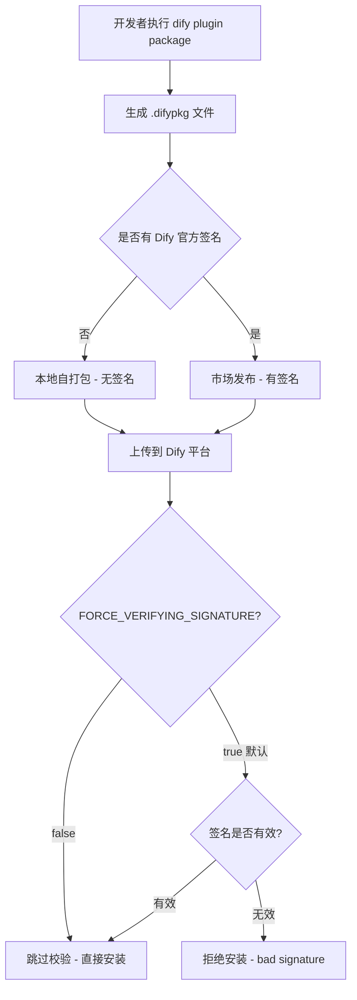

# Dify 插件签名校验踩坑实录：上传失败 "bad signature" 问题排查与解决

> **前置阅读**：本文是 Dify IoT 插件系列博客的续篇：
> - [本地Windows连接远程K8s上的Dify插件Daemon - 踩坑全记录](20260603-1354-dify的插件接口-本地Windows连接远程K8s上的Dify插件.md)
> - [本地debug怎么配置插件链接本地环境](./20260603-1425-本地debug怎么配置插件链接本地环境.md)
> - [ConnectionClosedError排查 - 从debug模式120秒断连到difypkg正式安装全记录](./20260603-1548-dify使用自定义插件链接本地包.md)
> - [Dify插件开发常见问题FAQ](./20260603-1848-dify常见问题.md)
> - [Dify IoT插件复杂案例实战](20260605-1050-Dify复杂案例实战.md)
>
> 文档版本：2026-06-06  
> 插件版本：0.0.8  
> Dify 版本：v1.13+（K8s Helm 部署）  

---

## 目录

1. [问题现象](#1-问题现象)
2. [原因分析](#2-原因分析)
3. [解决方案](#3-解决方案)
4. [验证过程](#4-验证过程)
5. [原理深挖 - Dify 插件签名验证机制](#5-原理深挖---dify-插件签名验证机制)
6. [常见误区与避坑指南](#6-常见误区与避坑指南)
7. [快速复现 Checklist](#7-快速复现-checklist)
8. [参考命令速查](#8-参考命令速查)

---

## 1. 问题现象

### 1.1 操作步骤

在 Dify Web 管理界面中，进入 **插件管理 → 上传插件**，选择本地打包好的 `.difypkg` 文件上传。

### 1.2 报错信息

上传后页面弹出红色错误提示：

```
Plugin verification has been enabled, and the plugin you want to install has a bad signature.
```

翻译过来就是：**插件校验已启用，你要安装的插件签名无效。**

### 1.3 截图场景

```
┌─────────────────────────────────────────────┐
│  ✕  上传失败                                  │
│                                              │
│  Plugin verification has been enabled,       │
│  and the plugin you want to install          │
│  has a bad signature.                        │
│                                              │
│                              [ 关闭 ]         │
└─────────────────────────────────────────────┘
```

### 1.4 影响范围

- 所有通过 `dify plugin package` 命令本地打包的 `.difypkg` 文件都无法安装
- 只有 Dify 官方市场签名的插件才能正常安装
- 该问题在 Dify **自托管版本**（self-hosted）中默认存在

---

## 2. 原因分析

### 2.1 Dify 的插件签名验证机制

Dify 从安全角度出发，引入了**插件签名验证（Plugin Signature Verification）**机制。其核心逻辑：

```
┌──────────────┐     ┌──────────────────┐     ┌──────────────────┐
│ 用户上传插件  │ ──▶ │   dify-api       │ ──▶ │ dify-plugin-     │
│ (.difypkg)   │     │ (校验签名)        │     │ daemon (二次校验) │
└──────────────┘     └──────────────────┘     └──────────────────┘
                              │                        │
                              ▼                        ▼
                     签名有效 → 允许安装         签名有效 → 允许运行
                     签名无效 → 拒绝安装         签名无效 → 拒绝运行
```

### 2.2 环境变量 FORCE_VERIFYING_SIGNATURE

Dify 通过环境变量 `FORCE_VERIFYING_SIGNATURE` 控制是否启用签名验证：

| 值 | 行为 | 说明 |
|----|------|------|
| `true`（**默认值**） | 启用签名验证 | 只允许安装经过 Dify 官方签名的插件 |
| `false` | 关闭签名验证 | 允许安装任意 `.difypkg` 插件，包括本地自打包的 |

### 2.3 为什么本地打包的插件没有签名

`dify plugin package` 命令只是将插件代码、配置文件、资源打包为 `.difypkg`（本质是 zip），但**不会附加 Dify 官方的数字签名**。只有通过 Dify 官方市场发布的插件才拥有有效签名。

### 2.4 关键陷阱：必须同时配置两个 Deployment

Dify 的插件签名验证涉及**两个独立的服务组件**：

| 组件 | 角色 | 校验时机 |
|------|------|----------|
| `dify-api` | API 网关，处理上传请求 | 上传时校验 |
| `dify-plugin-daemon` | 插件运行时守护进程 | 安装/运行时校验 |

**只配置其中一个是不够的！** 必须两个 Deployment 都设置 `FORCE_VERIFYING_SIGNATURE=false`，否则：

- 只关了 `dify-api`：上传可能通过，但 daemon 安装时再次校验失败
- 只关了 `dify-plugin-daemon`：上传阶段就被 api 拒绝，根本到不了 daemon

---

## 3. 解决方案

### 3.1 核心命令（K8s 环境）

```bash
# 关闭 dify-api 的插件签名验证
kubectl set env deploy/dify-api -n dify FORCE_VERIFYING_SIGNATURE=false

# 关闭 dify-plugin-daemon 的插件签名验证
kubectl set env deploy/dify-plugin-daemon -n dify FORCE_VERIFYING_SIGNATURE=false
```

### 3.2 命令执行效果

每条命令执行后会输出：

```
deployment.apps/dify-api env updated
deployment.apps/dify-plugin-daemon env updated
```

`kubectl set env` 会触发 Deployment 的**滚动更新（Rolling Update）**，Pod 会自动重启。

### 3.3 等待 Pod 重启完成

```bash
# 观察 Pod 状态，等待全部变为 Running
kubectl get pods -n dify -w
```

正常输出：

```
NAME                                READY   STATUS    RESTARTS   AGE
dify-api-5d8f7b6c9-x2k4m           1/1     Running   0          30s
dify-plugin-daemon-7c9f8d4b-m3n5p  1/1     Running   0          28s
```

---

## 4. 验证过程

### 4.1 验证环境变量已生效

```bash
# 检查 dify-api 的环境变量
kubectl get deploy/dify-api -n dify -o jsonpath='{range .spec.template.spec.containers[0].env[*]}{.name}={.value}{"\n"}{end}' | grep FORCE_VERIFYING

# 检查 dify-plugin-daemon 的环境变量
kubectl get deploy/dify-plugin-daemon -n dify -o jsonpath='{range .spec.template.spec.containers[0].env[*]}{.name}={.value}{"\n"}{end}' | grep FORCE_VERIFYING
```

期望输出：

```
FORCE_VERIFYING_SIGNATURE=false
FORCE_VERIFYING_SIGNATURE=false
```

### 4.2 重新打包插件

```powershell
# Windows PowerShell
dify plugin package "E:\Ideaproject\test-dify\plugin-iot-device-plugin" -o "E:\Ideaproject\test-dify\plugin-iot-device-plugin\iot_device_http.difypkg"
```

输出：

```
2026/06/06 11:20:00 INFO plugin packaged successfully output_path=E:\Ideaproject\test-dify\plugin-iot-device-plugin\iot_device_http.difypkg
```

### 4.3 重新上传安装

1. 打开 Dify Web 管理界面
2. 进入 **插件管理 → 上传插件**
3. 选择 `iot_device_http.difypkg`
4. 点击上传

**预期结果**：上传成功，插件出现在已安装列表中，不再报 "bad signature" 错误。

### 4.4 验证插件正常运行

上传成功后，配置凭证（`spring_service_url`），然后在工作流中使用插件工具，确认执行结果正常。

---

## 5. 原理深挖 - Dify 插件签名验证机制

### 5.1 签名验证的完整流程



### 5.2 为什么 Dify 要默认开启签名验证

| 考量 | 说明 |
|------|------|
| 安全性 | 防止恶意插件注入，保护用户数据安全 |
| 完整性 | 确保插件代码未被篡改 |
| 信任链 | 只有通过 Dify 官方审核的插件才能安装 |
| 生态管控 | 引导用户使用 Dify 官方插件市场 |

### 5.3 自托管场景下的权衡

对于**自托管（self-hosted）**环境，尤其是企业内网部署：

- 插件通常是内部开发的，不会发布到 Dify 官方市场
- 安全风险由企业内部管控，不需要 Dify 官方签名背书
- **关闭签名验证是合理的**，因为信任边界在企业内部

---

## 6. 常见误区与避坑指南

### 6.1 误区一：只改一个 Deployment

**错误做法**：只给 `dify-api` 或只给 `dify-plugin-daemon` 设置环境变量。

**后果**：签名验证是两道关卡，只关一道，另一道仍会拦截。

**正确做法**：两个都要设置：

```bash
kubectl set env deploy/dify-api -n dify FORCE_VERIFYING_SIGNATURE=false
kubectl set env deploy/dify-plugin-daemon -n dify FORCE_VERIFYING_SIGNATURE=false
```

### 6.2 误区二：Helm upgrade 后配置被覆盖

**场景**：通过 Helm 升级 Dify 版本后，之前用 `kubectl set env` 设置的环境变量可能被覆盖。

**原因**：`kubectl set env` 是直接修改 Deployment 对象，不持久化到 Helm values。Helm upgrade 会用模板重新生成 Deployment，覆盖手动添加的环境变量。

**解决方案**：将环境变量写入 Helm values 文件：

```yaml
# values.yaml 中添加
api:
  extraEnv:
    - name: FORCE_VERIFYING_SIGNATURE
      value: "false"

pluginDaemon:
  extraEnv:
    - name: FORCE_VERIFYING_SIGNATURE
      value: "false"
```

或者每次 Helm upgrade 后重新执行 `kubectl set env` 命令。

### 6.3 误区三：设置后不等待 Pod 重启就上传

**场景**：执行 `kubectl set env` 后立刻去上传插件，仍然失败。

**原因**：`kubectl set env` 触发滚动更新，新 Pod 需要时间启动。在旧 Pod 还在服务时上传，旧 Pod 仍在执行校验。

**正确做法**：等待 Pod 完全重启后再操作：

```bash
# 等待 rollout 完成
kubectl rollout status deploy/dify-api -n dify
kubectl rollout status deploy/dify-plugin-daemon -n dify
```

### 6.4 误区四：namespace 写错

**场景**：Dify 没有部署在 `dify` namespace 下，命令执行报错或无效。

**排查**：先确认 Dify 部署在哪个 namespace：

```bash
kubectl get deploy -A | grep dify
```

根据实际 namespace 替换命令中的 `-n dify`。

### 6.5 误区五：ConfigMap/Secret 方式配置的环境变量

**场景**：部分 Helm chart 将环境变量通过 ConfigMap 或 Secret 注入，此时 `kubectl set env` 可能不生效或行为异常。

**排查**：检查 Deployment 的 envFrom 配置：

```bash
kubectl get deploy/dify-api -n dify -o jsonpath='{.spec.template.spec.containers[0].envFrom}'
```

如果使用了 `configMapRef` 或 `secretRef`，需要在对应的 ConfigMap/Secret 中添加 `FORCE_VERIFYING_SIGNATURE: "false"`。

---

## 7. 快速复现 Checklist

- [ ] 1. 确认报错信息为 `Plugin verification has been enabled, and the plugin you want to install has a bad signature`
- [ ] 2. 执行 `kubectl set env deploy/dify-api -n dify FORCE_VERIFYING_SIGNATURE=false`
- [ ] 3. 执行 `kubectl set env deploy/dify-plugin-daemon -n dify FORCE_VERIFYING_SIGNATURE=false`
- [ ] 4. 等待 Pod 滚动重启完成（`kubectl rollout status`）
- [ ] 5. 验证环境变量已生效（`kubectl get deploy ... -o jsonpath ... | grep FORCE_VERIFYING`）
- [ ] 6. 重新打包插件（`dify plugin package`）
- [ ] 7. 在 Dify Web 界面重新上传 `.difypkg` 文件
- [ ] 8. 确认上传成功，插件出现在已安装列表
- [ ] 9. 配置凭证，在工作流中测试插件功能正常

---

## 8. 参考命令速查

### 8.1 关闭签名验证（一次性操作）

```bash
kubectl set env deploy/dify-api -n dify FORCE_VERIFYING_SIGNATURE=false
kubectl set env deploy/dify-plugin-daemon -n dify FORCE_VERIFYING_SIGNATURE=false
```

### 8.2 验证配置

```bash
# 查看 dify-api 环境变量
kubectl get deploy/dify-api -n dify -o jsonpath='{range .spec.template.spec.containers[0].env[*]}{.name}={.value}{"\n"}{end}' | grep FORCE_VERIFYING

# 查看 dify-plugin-daemon 环境变量
kubectl get deploy/dify-plugin-daemon -n dify -o jsonpath='{range .spec.template.spec.containers[0].env[*]}{.name}={.value}{"\n"}{end}' | grep FORCE_VERIFYING
```

### 8.3 等待重启

```bash
kubectl rollout status deploy/dify-api -n dify
kubectl rollout status deploy/dify-plugin-daemon -n dify
```

### 8.4 查看 Pod 状态

```bash
kubectl get pods -n dify
```

### 8.5 插件打包

```powershell
# Windows PowerShell
dify plugin package "E:\Ideaproject\test-dify\plugin-iot-device-plugin" -o "E:\Ideaproject\test-dify\plugin-iot-device-plugin\iot_device_http.difypkg"
```

### 8.6 恢复签名验证（如需）

```bash
kubectl set env deploy/dify-api -n dify FORCE_VERIFYING_SIGNATURE=true
kubectl set env deploy/dify-plugin-daemon -n dify FORCE_VERIFYING_SIGNATURE=true
```

---

> **总结**：Dify 自托管版本默认启用插件签名验证，本地自打包的 `.difypkg` 插件因无官方签名会被拒绝安装。解决方式是在 `dify-api` 和 `dify-plugin-daemon` **两个 Deployment** 上同时设置 `FORCE_VERIFYING_SIGNATURE=false`，缺一不可。如果环境经过 Helm upgrade，需重新执行命令或在 Helm values 中持久化该配置。
