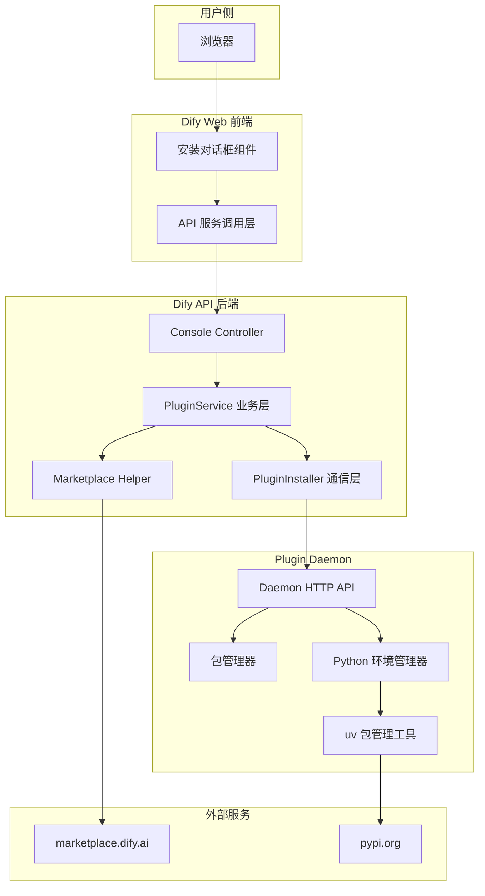
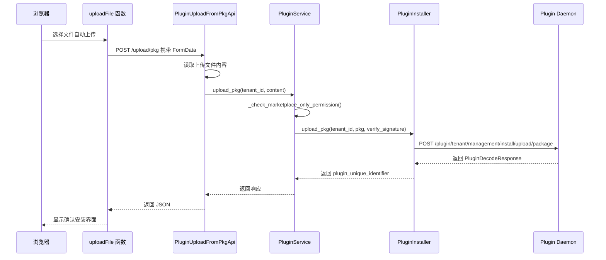
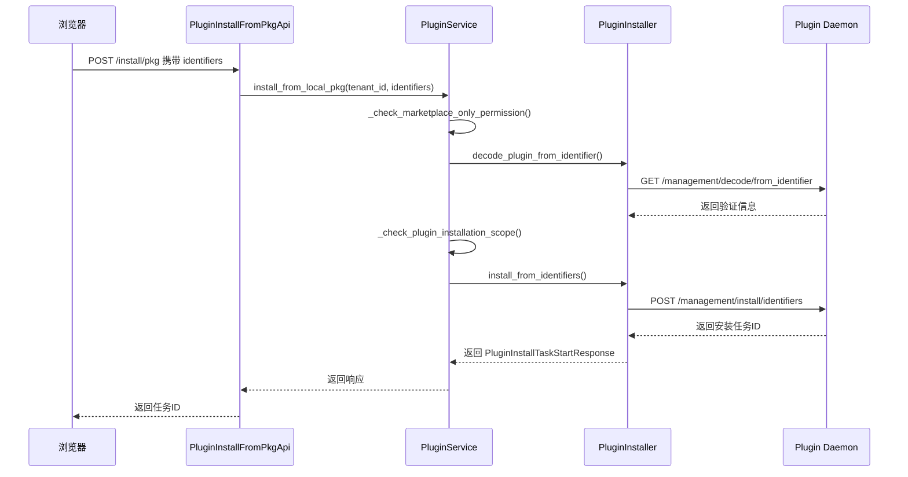
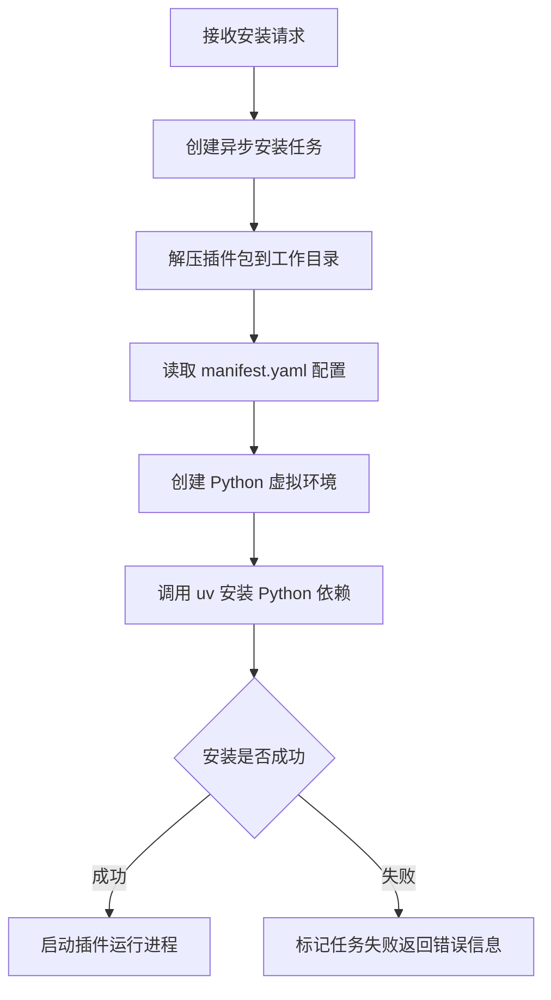
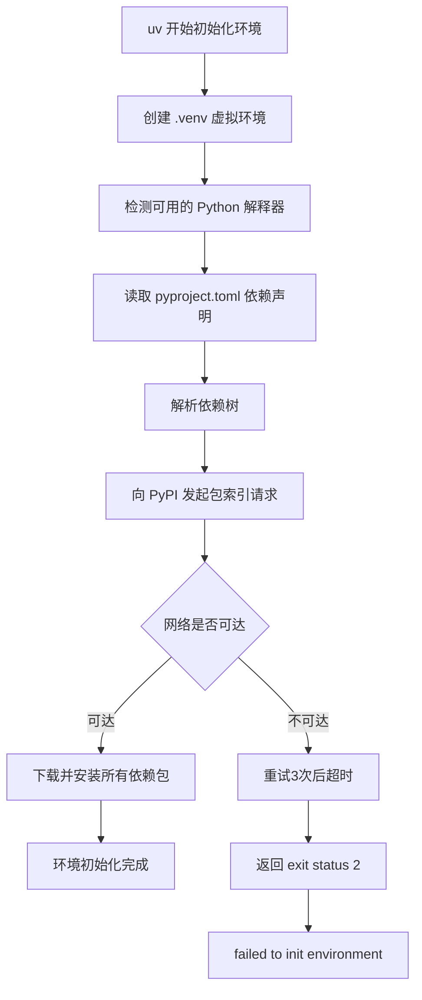
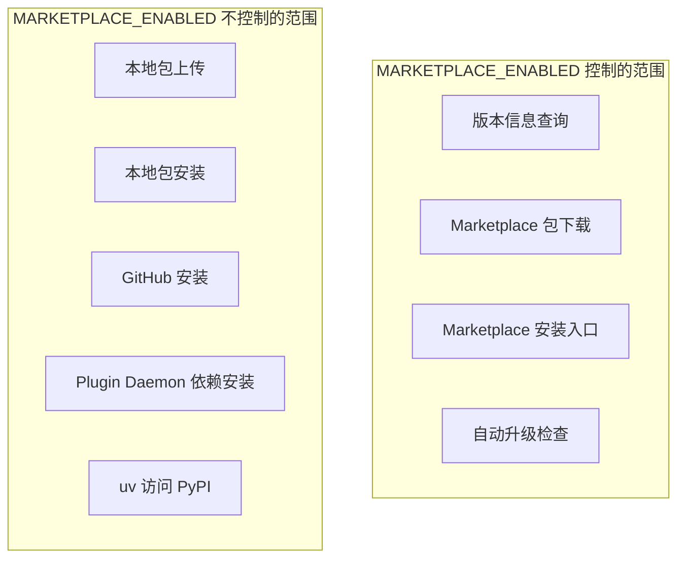
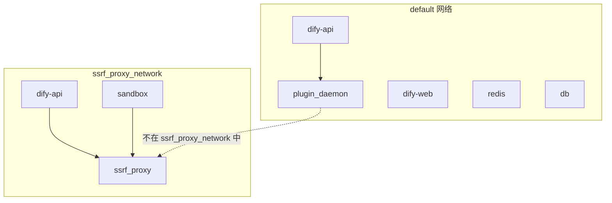
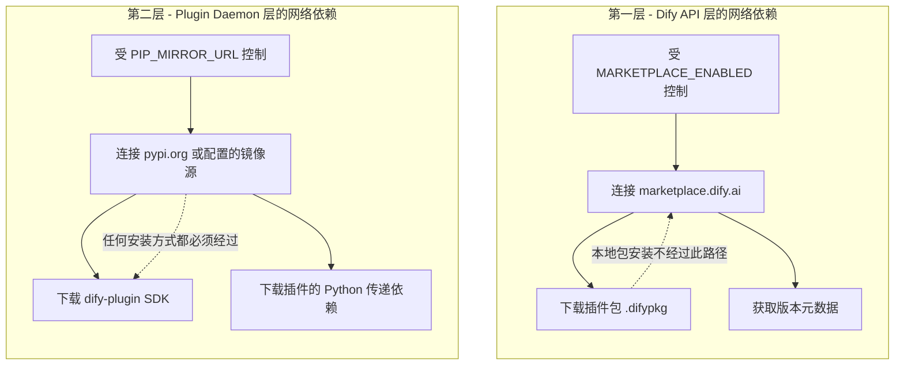
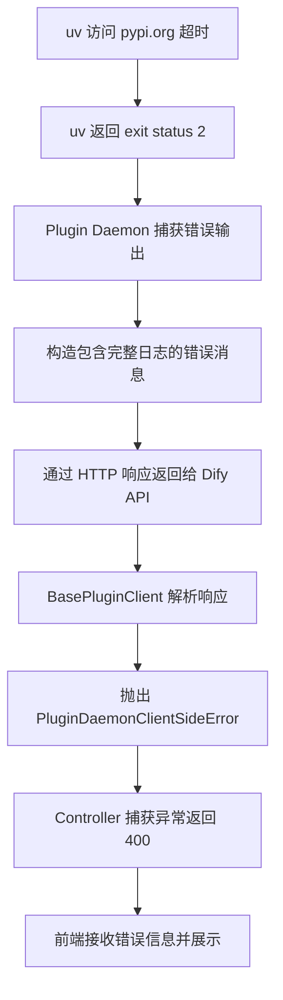
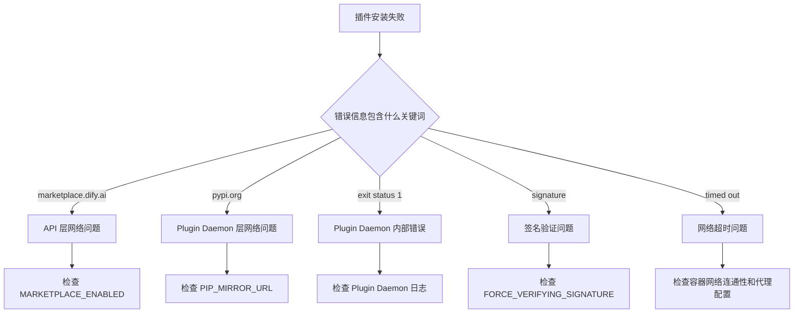

# Dify 离线环境安装插件失败 - 源码级运行流程深度剖析

> 本文基于 Dify 源码，深入分析离线环境下安装插件时，因 Plugin Daemon 无法访问 PyPI 导致安装失败的完整运行流程。文章从前端到后端到 Plugin Daemon 全链路追踪，包含关键源码、配置分析、三种安装方式对比、错误传播链路以及多种解决方案。

---

## 一、问题背景与现象

### 1.1 问题描述

在 Dify 离线环境中，通过"本地插件"方式上传 `.difypkg` 文件安装插件时，上传阶段成功但安装阶段失败。界面显示如下错误信息：

```
1个插件安装失败
IoT设备通用网关
failed to launch plugin: failed to install dependencies: failed to install dependencies: exit status 2
```

### 1.2 完整错误日志

从 Plugin Daemon 返回的完整错误输出如下，这段日志对后续根因定位至关重要：

```
failed to launch plugin: failed to install dependencies: failed to install dependencies: exit status 2, output:
DEBUG uv 0.9.26
TRACE Checking lock for /root/.cache/uv at /root/.cache/uv/.lock
DEBUG Acquired shared lock for /root/.cache/uv
DEBUG Searching for default Python interpreter in virtual environments
TRACE Querying interpreter executable at /app/cwd/your-name/iot_device_http-0.0.8@421ed98c267c2de09148aba2dde876efa589f9cd4f1aec508f3d61cf1334f839/.venv/bin/python3
DEBUG Found cpython-3.12.3-linux-x86_64-gnu

TRACE Error trace:
Request failed after 3 retries
Caused by:
  0: Failed to fetch: https://pypi.org/simple/dify-plugin/
  1: error sending request for url (https://pypi.org/simple/dify-plugin/)
  2: operation timed out

error: Request failed after 3 retries
Caused by: Failed to fetch: https://pypi.org/simple/dify-plugin/
Caused by: error sending request for url (https://pypi.org/simple/dify-plugin/)
Caused by: operation timed out

failed to init environment
```

### 1.3 环境对比与核心疑问

在排查过程中发现了三组关键对比实验结果：

| 环境 | MARKETPLACE_ENABLED | 外网连通性 | 安装结果 |
|------|---------------------|-----------|---------|
| 外网服务器 | true | 通 | 成功 |
| 内网服务器 | false | 不通 | 失败 |
| 外网服务器 | false | 通 | 成功 |

核心疑问：为什么在外网环境设置 `MARKETPLACE_ENABLED=false` 也能安装成功，但在内网环境设置同样的值就安装失败？这个配置到底控制了什么？难道不是控制网络访问的吗？

这个问题的背后，涉及到 Dify 插件系统中多层服务协作的复杂架构。要理解根因，必须从源码层面完整追踪插件安装的全链路执行过程，搞清楚每个服务各自做了什么、依赖了什么网络资源、受哪些配置变量控制。接下来的章节将逐步揭开这个谜底。

### 1.4 排查思路

在正式进入源码分析之前，先梳理一下排查的基本思路。面对这类"同一个操作在不同环境下结果不同"的问题，最有效的方法是沿着请求链路逐层排查。首先确认前端发了什么请求，然后确认后端接口做了什么处理，再确认后端向哪个外部服务发起了调用，最后确认那个外部服务在离线环境下的行为。每一层都有可能引入新的网络依赖，而我们需要找到那个在离线环境下断掉的网络链路。

---

## 二、Dify 插件系统整体架构

在分析具体源码之前，有必要先理解 Dify 插件系统的整体架构。整个插件安装流程涉及三个独立的服务进程，它们各自承担不同的职责，通过网络相互协作。

## 2.1 三层架构总览

理解这个架构的关键在于认识到：Dify 的插件系统并不是一个单体服务，而是由多个独立部署的容器协作完成的。前端负责用户交互和界面展示，后端 API 负责业务逻辑和权限管控，Plugin Daemon 负责插件的实际安装和运行。这三者之间通过 HTTP 接口通信，各自有自己的环境变量和网络栈。这意味着，一个容器能访问外网，并不代表另一个容器也能访问外网。



### 2.2 各服务角色说明

**Dify Web 前端**是基于 Next.js 的 React 应用，负责提供插件安装的交互界面。用户在界面上选择本地包文件、GitHub 仓库或 Marketplace 插件，前端根据来源不同调用不同的后端接口。前端还负责轮询安装任务状态，展示安装进度和结果。

**Dify API 后端**是 Python Flask 应用，承担业务逻辑、权限校验和请求转发。它接收前端的安装请求后，进行权限检查、参数校验，然后将实际的安装操作转发给 Plugin Daemon。API 层本身不执行任何依赖安装操作。

**Plugin Daemon** 是一个用 Go 语言编写的独立服务，负责插件的整个生命周期管理。包括接收插件包、解压存储、创建 Python 虚拟环境、安装依赖、启动和管理插件运行进程。这是整个安装链路中唯一直接执行依赖安装的服务。

### 2.3 关键源码文件清单

在分析过程中涉及的核心源码文件如下：

| 文件路径 | 层级 | 职责 |
|---------|------|------|
| web/service/plugins.ts | 前端 | API 调用封装 |
| web/service/use-plugins.ts | 前端 | React Query hooks |
| web/app/components/plugins/install-plugin/ | 前端 | 安装 UI 组件 |
| api/controllers/console/workspace/plugin.py | 后端接口层 | HTTP 路由注册 |
| api/core/plugin/plugin_service.py | 后端业务层 | 插件业务逻辑核心 |
| api/core/plugin/impl/plugin.py | 后端通信层 | 与 Daemon 通信 |
| api/core/plugin/impl/base.py | 后端基础层 | Daemon HTTP 客户端 |
| api/core/helper/marketplace.py | 后端工具层 | Marketplace API 工具 |
| api/configs/feature/__init__.py | 后端配置层 | 配置定义 |
| api/services/plugin/dependencies_analysis.py | 后端服务层 | 依赖分析 |
| docker/docker-compose.yaml | 部署层 | 容器编排 |
| docker/envs/core-services/plugin-daemon.env.example | 部署层 | Daemon 配置示例 |

---

## 三、三种安装方式的源码级对比

在深入分析本地包安装的具体源码之前，有必要先了解 Dify 支持的三种安装方式之间的差异。这个对比分析有助于理解为什么无论采用哪种安装方式，最终都无法避开 Plugin Daemon 层的 PyPI 依赖。

Dify 支持三种插件安装方式：从 Marketplace 安装、从 GitHub 安装、从本地包安装。理解它们的差异是定位问题的前提。

### 3.1 前端安装流程对比

在前端代码 `web/service/use-plugins.ts` 中，三种安装方式对应三个不同的 mutation hook：

**从 Marketplace 安装**调用的是 `useInstallPackageFromMarketPlace`，对应后端接口 `POST /workspaces/current/plugin/install/marketplace`：

```typescript
export const useInstallPackageFromMarketPlace = () => {
  return useMutation({
    mutationFn: (uniqueIdentifier: string) => {
      return post<InstallPackageResponse>(
        '/workspaces/current/plugin/install/marketplace',
        { body: { plugin_unique_identifiers: [uniqueIdentifier] } }
      )
    },
  })
}
```

**从本地包安装**调用的是 `useInstallPackageFromLocal`，对应后端接口 `POST /workspaces/current/plugin/install/pkg`：

```typescript
export const useInstallPackageFromLocal = () => {
  return useMutation({
    mutationFn: (uniqueIdentifier: string) => {
      return post<InstallPackageResponse>(
        '/workspaces/current/plugin/install/pkg',
        { body: { plugin_unique_identifiers: [uniqueIdentifier] } }
      )
    },
  })
}
```

**从 GitHub 安装**调用的是 `useInstallPackageFromGitHub`，对应后端接口 `POST /workspaces/current/plugin/install/github`：

```typescript
export const useInstallPackageFromGitHub = () => {
  return useMutation({
    mutationFn: ({ repoUrl, selectedVersion, selectedPackage, uniqueIdentifier }) => {
      return post<InstallPackageResponse>(
        '/workspaces/current/plugin/install/github',
        {
          body: {
            repo: repoUrl,
            version: selectedVersion,
            package: selectedPackage,
            plugin_unique_identifier: uniqueIdentifier,
          },
        }
      )
    },
  })
}
```

### 3.2 本地包安装的前端完整流程

前端本地包安装分为两个步骤。第一步是上传文件，第二步是触发安装。

**上传阶段**由 `web/service/plugins.ts` 中的 `uploadFile` 函数完成：

```typescript
export const uploadFile = async (file: File, isBundle: boolean) => {
  const formData = new FormData()
  formData.append(isBundle ? 'bundle' : 'pkg', file)
  return upload({
    xhr: new XMLHttpRequest(),
    data: formData,
  }, false, `/workspaces/current/plugin/upload/${isBundle ? 'bundle' : 'pkg'}`)
}
```

前端上传组件 `uploading.tsx` 在挂载时自动触发上传，上传成功后将返回的 `uniqueIdentifier` 和 `manifest` 传递给安装确认组件。

**安装阶段**由 `install.tsx` 组件中的 `handleInstall` 函数触发。用户点击"安装"按钮后，前端调用 `installPackageFromLocal` 发起安装请求，然后通过 `checkTaskStatus` 轮询任务状态，最终展示安装成功或失败的结果。

### 3.3 后端三种安装方法的权限检查差异

在后端源码 `plugin_service.py` 中，三种安装方式对应三个不同的方法。通过对比这三个方法的实现，可以清楚地看到它们对 `MARKETPLACE_ENABLED` 的依赖程度完全不同。这也是理解离线安装问题的关键线索之一。

| 方法 | 是否检查 MARKETPLACE_ENABLED | 网络依赖 |
|------|----------------------------|---------|
| install_from_marketplace_pkg | 是，为 false 时直接抛出异常 | 需要访问 marketplace.dify.ai 下载包 |
| install_from_github_pkg | 否 | 需要访问 github.com 下载包 |
| install_from_local_pkg | 否 | 不需要额外网络下载包 |

但无论哪种安装方式，最终都会调用同一个方法 `install_from_identifiers`，将安装指令发送给 Plugin Daemon。而 Plugin Daemon 在执行安装时，都必须通过 `uv` 从 PyPI 安装 Python 依赖。这是理解问题的关键所在。

换句话说，三种安装方式的区别只在于"插件包从哪里来"，而不在于"插件依赖怎么装"。无论插件包来自 Marketplace、GitHub 还是本地上传，Plugin Daemon 拿到包之后的处理流程是完全相同的：解压、读取依赖声明、创建虚拟环境、从包索引安装依赖、启动插件。这就像一个漏斗，三种入口最终汇聚到同一个出口。

---

## 四、本地包安装全链路源码追踪

以下是最常见的本地包安装方式的完整运行流程，从前端到后端到 Plugin Daemon 逐层追踪。

### 4.1 第一阶段：上传插件包



**接口入口**位于 `api/controllers/console/workspace/plugin.py`：

```python
@console_ns.route("/workspaces/current/plugin/upload/pkg")
class PluginUploadFromPkgApi(Resource):
    @setup_required
    @login_required
    @account_initialization_required
    @plugin_permission_required(install_required=True)
    def post(self):
        _, tenant_id = current_account_with_tenant()
        file = request.files["pkg"]
        content = _read_upload_content(file, dify_config.PLUGIN_MAX_PACKAGE_SIZE)
        try:
            response = PluginService.upload_pkg(tenant_id, content)
        except PluginDaemonClientSideError as e:
            return {"code": "plugin_error", "message": e.description}, 400
        return jsonable_encoder(response)
```

这段代码首先读取上传的文件内容，然后调用 `PluginService.upload_pkg()`。注意这里的 `_read_upload_content` 会检查文件大小是否超过 `PLUGIN_MAX_PACKAGE_SIZE` 限制。

**服务层**位于 `api/core/plugin/plugin_service.py`：

```python
@staticmethod
def upload_pkg(tenant_id: str, pkg: bytes, verify_signature: bool = False):
    PluginService._check_marketplace_only_permission()
    manager = PluginInstaller()
    features = FeatureService.get_system_features()
    response = manager.upload_pkg(
        tenant_id, pkg,
        verify_signature=features.plugin_installation_permission.restrict_to_marketplace_only,
    )
    PluginService._check_plugin_installation_scope(response.verification)
    return response
```

这里的 `_check_marketplace_only_permission()` 方法名容易引起误解。实际上它检查的是"是否只允许从 Marketplace 安装插件"的企业级权限控制，与 `MARKETPLACE_ENABLED` 环境变量无直接关系。

**通信层**位于 `api/core/plugin/impl/plugin.py`，通过 HTTP multipart 将插件包发送给 Plugin Daemon：

```python
def upload_pkg(self, tenant_id, pkg, verify_signature=False):
    body = {"dify_pkg": ("dify_pkg", pkg, "application/octet-stream")}
    data = {"verify_signature": "true" if verify_signature else "false"}
    return self._request_with_plugin_daemon_response(
        "POST",
        f"plugin/{tenant_id}/management/install/upload/package",
        PluginDecodeResponse,
        files=body,
        data=data,
    )
```

上传阶段只是将 `.difypkg` 文件通过 HTTP 发送给 Plugin Daemon 存储，Plugin Daemon 会解析包内容、验证签名（如果启用），返回插件的元信息。**这一步不涉及任何外部网络依赖**，在离线环境下完全正常。

这里有一个值得注意的细节：上传接口返回的 `PluginDecodeResponse` 包含了插件的完整元信息，包括插件名称、版本、作者、分类、图标等。这些信息是从 `.difypkg` 包内的 `manifest.yaml` 文件中解析出来的，不需要任何网络请求。前端拿到这些信息后，会在安装确认界面上展示给用户，让用户确认是否继续安装。

### 4.2 第二阶段：触发安装



**接口入口**位于 `api/controllers/console/workspace/plugin.py`：

```python
@console_ns.route("/workspaces/current/plugin/install/pkg")
class PluginInstallFromPkgApi(Resource):
    @setup_required
    @login_required
    @account_initialization_required
    @plugin_permission_required(install_required=True)
    def post(self):
        _, tenant_id = current_account_with_tenant()
        args = ParserPluginIdentifiers.model_validate(console_ns.payload)
        try:
            response = PluginService.install_from_local_pkg(
                tenant_id, args.plugin_unique_identifiers
            )
        except PluginDaemonClientSideError as e:
            return {"code": "plugin_error", "message": e.description}, 400
        return jsonable_encoder(response)
```

**核心安装逻辑**位于 `api/core/plugin/plugin_service.py`：

```python
@staticmethod
def install_from_local_pkg(tenant_id, plugin_unique_identifiers):
    PluginService._check_marketplace_only_permission()
    manager = PluginInstaller()
    for plugin_unique_identifier in plugin_unique_identifiers:
        resp = manager.decode_plugin_from_identifier(
            tenant_id, plugin_unique_identifier
        )
        PluginService._check_plugin_installation_scope(resp.verification)
    result = manager.install_from_identifiers(
        tenant_id,
        plugin_unique_identifiers,
        PluginInstallationSource.Package,
        [{}],
    )
    PluginService.invalidate_plugin_model_providers_cache(tenant_id)
    return result
```

这段代码的执行流程如下：首先进行权限检查，然后逐个解码插件标识符并检查安装范围权限，最后调用 `install_from_identifiers` 向 Plugin Daemon 发送统一的安装指令。

**install_from_identifiers** 是三种安装方式最终汇聚的同一个方法：

```python
def install_from_identifiers(self, tenant_id, identifiers, source, metas):
    return self._request_with_plugin_daemon_response(
        "POST",
        f"plugin/{tenant_id}/management/install/identifiers",
        PluginInstallTaskStartResponse,
        data={
            "plugin_unique_identifiers": identifiers,
            "source": source,
            "metas": metas,
        },
        headers={"Content-Type": "application/json"},
    )
```

这个方法向 Plugin Daemon 发送了一个 JSON 请求，包含插件标识符列表、安装来源和元数据。**Dify API 层的职责到此完全结束**。后续所有操作都在 Plugin Daemon 内部完成。

这里需要特别强调一个设计特点：Dify API 层在整个安装过程中只扮演"中间人"的角色。它负责接收前端请求、做权限校验、转换参数格式，然后把实际操作委托给 Plugin Daemon。API 层本身不执行任何依赖安装、文件解压、环境创建等操作。这意味着，如果安装过程中出现网络相关的错误，问题一定出在 Plugin Daemon 那一侧，而不是 API 层。

### 4.3 第三阶段：Plugin Daemon 内部处理

Plugin Daemon 收到安装请求后，在内部执行以下步骤：



Plugin Daemon 将插件解压到工作目录，路径格式为：

```
/app/storage/cwd/{author}/{plugin_name}-{version}@{hash}/
```

以本次报错为例，实际路径为：

```
/app/storage/cwd/your-name/iot_device_http-0.0.8@421ed98c267c2de09148aba2dde876efa589f9cd4f1aec508f3d61cf1334f839/
```

这个路径中的 `storage` 部分通过 Docker 卷挂载到宿主机的 `./volumes/plugin_daemon` 目录，因此插件数据在容器重启后仍然保留。

### 4.4 第四阶段：Python 环境初始化与依赖安装（失败点）

这是整个流程中唯一需要访问外部网络的步骤。Plugin Daemon 使用 `uv` 工具为每个插件创建独立的 Python 虚拟环境并安装依赖。



每个 Dify 插件的 `pyproject.toml` 文件都声明了对 `dify-plugin` SDK 的依赖。以本次出问题的插件为例：

```toml
[project]
name = "iot-device-http"
version = "0.0.8"
dependencies = [
    "dify_plugin>=0.0.1b72",
]
```

当 `uv` 执行依赖安装时，它会向 PyPI 索引发起 HTTP 请求获取 `dify-plugin` 包的信息。这个请求的目标地址默认是 `https://pypi.org/simple/dify-plugin/`。如果 `PIP_MIRROR_URL` 环境变量配置了镜像地址，则会使用镜像地址替代。

uv 执行的等价命令如下：

```bash
cd /app/storage/cwd/your-name/iot_device_http-0.0.8@hash/
python3 -m venv .venv
uv pip install -e . --python .venv/bin/python3
```

离线环境中，由于 `pypi.org` 不可达，uv 会重试3次后超时，最终返回 `exit status 2`，Plugin Daemon 将此错误包装为 `failed to init environment` 返回给 Dify API。

这里有一个关键的技术细节需要说明：`dify-plugin` SDK 是每个 Dify 插件的运行基础。这个 SDK 提供了插件与 Dify 主程序通信的能力，包括消息传递、工具调用、模型访问等核心功能。因此无论插件本身的功能是什么，它都必须依赖这个 SDK。而 SDK 本身又依赖了一系列其他的 Python 包（如 HTTP 客户端库、数据序列化工具等），这些传递依赖也必须从包索引下载。这就解释了为什么即使插件包的代码已经存在于本地，安装过程仍然需要访问 PyPI。

从另一个角度理解：`.difypkg` 包只包含插件自身的代码和 `pyproject.toml` 依赖声明文件，并不包含依赖的实际代码。这与 Python 的标准分发方式一致，源代码和依赖是分开管理的。uv 的职责就是根据依赖声明，从包索引下载并安装所有需要的库到虚拟环境中。

---

## 五、配置深度剖析

### 5.1 MARKETPLACE_ENABLED 的定义与作用域

配置定义位于 `api/configs/feature/__init__.py` 中的 `MarketplaceConfig` 类：

```python
class MarketplaceConfig(BaseSettings):
    MARKETPLACE_ENABLED: bool = Field(
        description="Enable or disable marketplace",
        default=True,
    )
    MARKETPLACE_API_URL: HttpUrl = Field(
        description="Marketplace API URL",
        default=HttpUrl("https://marketplace.dify.ai"),
    )
```

默认值为 `True`，即默认启用 Marketplace 功能。

通过全局代码搜索，`MARKETPLACE_ENABLED` 在 Dify API 源码中共有7处使用，全部位于 API 层，具体使用场景如下：

| 文件 | 行号 | 功能描述 |
|------|------|---------|
| plugin_service.py | 186 | 获取插件最新版本信息时跳过 Marketplace 查询 |
| plugin_service.py | 407 | 禁止通过 Marketplace 升级插件 |
| plugin_service.py | 579 | 禁止从 Marketplace 获取包 |
| plugin_service.py | 606 | 禁止从 Marketplace 安装插件 |
| dependencies_analysis.py | 128 | 跳过生成最新版本依赖分析 |
| ext_celery.py | 204 | 跳过定时可升级插件检查任务 |
| feature_service.py | 259 | 控制系统特性报告中的 Marketplace 状态 |

下面逐一分析几个关键使用点的源码。

**获取最新版本信息**（`plugin_service.py`）：当 `MARKETPLACE_ENABLED=false` 时，跳过从 `marketplace.dify.ai` 批量获取插件元数据的操作，直接将所有插件的最新版本信息设为 `None`。这个逻辑只在插件列表页面展示版本更新提示时使用，与安装流程无关。

```python
if cache_not_exists:
    if not dify_config.MARKETPLACE_ENABLED:
        logger.info("Marketplace disabled; skipping latest-plugins metadata fetch...")
        for plugin_id in cache_not_exists:
            result[plugin_id] = None
    else:
        manifests = {
            manifest.plugin_id: manifest
            for manifest in marketplace.batch_fetch_plugin_manifests(cache_not_exists)
        }
```

**Marketplace 安装入口**（`plugin_service.py`）：当 `MARKETPLACE_ENABLED=false` 时，`install_from_marketplace_pkg` 方法会直接抛出异常，阻止从 Marketplace 安装插件。但 `install_from_local_pkg` 方法完全不经过此检查。

```python
def install_from_marketplace_pkg(tenant_id, plugin_unique_identifiers):
    if not dify_config.MARKETPLACE_ENABLED:
        raise ValueError("marketplace is not enabled")
```

### 5.2 MARKETPLACE_ENABLED 的控制范围总结



MARKETPLACE_ENABLED 的本质作用是控制 Dify API 层与 `marketplace.dify.ai` 的交互。它决定了用户是否可以通过 Marketplace 浏览、搜索、下载和安装插件包，以及系统是否自动检查插件更新。它完全不影响 Plugin Daemon 层的行为，也不影响本地包和 GitHub 包的安装流程。

### 5.3 PIP_MIRROR_URL 的作用域

`PIP_MIRROR_URL` 是 Plugin Daemon 容器的环境变量，在 `docker-compose.yaml` 中定义：

```yaml
plugin_daemon:
    environment:
      PIP_MIRROR_URL: ${PIP_MIRROR_URL:-}
```

当此变量为空（默认值）时，uv 使用默认的 PyPI 源 `https://pypi.org/simple/`。设置为镜像地址后，uv 会使用指定的镜像源下载依赖包。这是解决离线安装问题的最关键配置，后面的解决方案章节会详细说明如何正确配置它。

值得注意的是，`PIP_MIRROR_URL` 这个变量是在 Dify API 的 `docker-compose.yaml` 中定义的，但它实际传递给 Plugin Daemon 容器。这种"在一个服务的配置文件中定义另一个服务的环境变量"的设计，容易让人忽视这个配置的真正作用对象。

在 Dify 的 `docker/.env.example` 中，此变量默认为空：

```bash
PIP_MIRROR_URL=
```

在 `docker/envs/middleware.env.example` 中有注释示例供参考：

```bash
# PIP_MIRROR_URL=https://pypi.tuna.tsinghua.edu.cn/simple
PIP_MIRROR_URL=
```

### 5.4 Plugin Daemon 的其他关键配置

Plugin Daemon 还支持多个与网络和安装行为相关的环境变量，这些变量在 `docker/envs/core-services/plugin-daemon.env.example` 以及 Plugin Daemon GitHub 仓库的 `.env.example` 中可以找到：

| 环境变量 | 默认值 | 作用说明 |
|---------|--------|---------|
| FORCE_VERIFYING_SIGNATURE | true | 是否强制验证插件包的数字签名 |
| PYTHON_ENV_INIT_TIMEOUT | 120 | Python 环境初始化超时时间，单位秒 |
| PLUGIN_MAX_EXECUTION_TIMEOUT | 600 | 插件最大执行超时时间，单位秒 |
| PLUGIN_IGNORE_UV_LOCK | false | 是否忽略插件包中的 uv.lock 文件 |
| HTTP_PROXY | 空 | Plugin Daemon 的 HTTP 代理地址 |
| HTTPS_PROXY | 空 | Plugin Daemon 的 HTTPS 代理地址 |
| PLUGIN_WORKING_PATH | /app/storage/cwd | 插件工作目录 |
| PLUGIN_STORAGE_LOCAL_ROOT | /app/storage | 本地存储根目录 |
| PLUGIN_INSTALL_TIMEOUT | 15 | 插件安装超时时间，单位分钟 |

其中 `PLUGIN_IGNORE_UV_LOCK` 在离线场景中尤为重要。当插件包中包含 `uv.lock` 锁文件时，uv 会严格按照锁文件中记录的源地址下载依赖。如果锁文件中记录的是 `pypi.org`，即使设置了 `PIP_MIRROR_URL`，uv 也可能仍然尝试访问 `pypi.org`。设置 `PLUGIN_IGNORE_UV_LOCK=true` 可以让 uv 忽略锁文件，完全使用配置的镜像源解析依赖。

### 5.5 Dify API 与 Plugin Daemon 的通信配置

`BasePluginClient` 是所有 Plugin Daemon 通信客户端的基类，定义在 `api/core/plugin/impl/base.py` 中。它通过 `PLUGIN_DAEMON_URL` 配置获取 Plugin Daemon 的地址：

```python
plugin_daemon_inner_api_baseurl = URL(str(dify_config.PLUGIN_DAEMON_URL))
```

在 `docker-compose.yaml` 中，此地址指向 Docker 内部网络：

```yaml
PLUGIN_DAEMON_URL: http://plugin_daemon:5002
```

这意味着 Dify API 和 Plugin Daemon 之间的通信走的是 Docker 内部网络，不依赖外部网络。API 层向 Daemon 发送的所有请求都是通过 `_request_with_plugin_daemon_response` 方法统一处理的，该方法负责发送 HTTP 请求、解析响应状态码、处理错误异常。

### 5.6 Docker 网络拓扑分析

在 `docker-compose.yaml` 中，Dify 定义了多个容器和多个网络。与插件相关的网络拓扑如下：



一个关键发现是：`plugin_daemon` 容器默认只加入了 `default` 网络和 `ssrf_proxy_network` 网络。但在默认配置中，Plugin Daemon 并没有被放入 `ssrf_proxy_network`，这意味着它无法通过 `ssrf_proxy` 容器的 Squid 代理访问外网。

`plugin_daemon` 的网络配置如下：

```yaml
plugin_daemon:
    networks:
      - ssrf_proxy_network
      - default
```

虽然配置了 `ssrf_proxy_network`，但 Plugin Daemon 自身并未使用代理环境变量，因此这个网络配置实际上并没有为 Plugin Daemon 提供外网代理能力。Plugin Daemon 访问 PyPI 时，仍然是从容器自身直接发起网络请求。

### 5.7 两层网络依赖的关系总结



这是整个问题的核心：两层网络依赖完全独立，由不同的配置变量控制，服务于不同的目的。任何插件安装方式（Marketplace、GitHub、本地包）都无法绕过第二层的 PyPI 依赖安装。

---

## 六、错误传播链路分析

### 6.1 错误从底层到顶层的传播过程

当 uv 安装依赖失败后，错误信息经过以下链路逐层传播到前端界面：



### 6.2 BasePluginClient 的错误处理

`BasePluginClient._request_with_plugin_daemon_response()` 方法统一处理来自 Plugin Daemon 的响应。当 Daemon 返回非零的 `code` 时，该方法会解析错误信息并抛出相应异常：

```python
def _request_with_plugin_daemon_response(self, method, path, type_, ...):
    try:
        response = self._request(method, path, headers, data, params, files)
        response.raise_for_status()
    except httpx.HTTPStatusError as e:
        if e.response.status_code < 500:
            raise PluginDaemonClientSideError(code=-500, message=e.response.text)
        else:
            raise PluginDaemonInternalServerError(description=str(e))

    json_response = response.json()
    rep = PluginDaemonBasicResponse[type_].model_validate(json_response)

    if rep.code != 0:
        error = PluginDaemonError.model_validate(json.loads(rep.message))
        self._handle_plugins_daemon_error(error.error_type, error.message)
```

Plugin Daemon 返回的 JSON 响应中包含非零的 `code` 和包含完整 uv 日志的 `message` 字段。

### 6.3 Controller 层的异常捕获

Controller 层在 `PluginInstallFromPkgApi.post()` 方法中捕获 `PluginDaemonClientSideError`，将错误信息包装为标准响应格式返回给前端：

```python
except PluginDaemonClientSideError as e:
    return {"code": "plugin_error", "message": e.description}, 400
```

### 6.4 前端的错误展示

前端在 `install.tsx` 组件的 `handleInstall` 方法中，通过 `checkTaskStatus` 轮询安装任务状态。当检测到任务状态为 `failed` 时，调用 `onFailed(error)` 将错误信息传递给父组件展示：

```typescript
const { status, error } = await check({
    taskId,
    pluginUniqueIdentifier: uniqueIdentifier,
})
if (status === TaskStatus.failed) {
    onFailed(error)
    return
}
```

最终用户在界面上看到的就是那段包含 uv 调试日志的完整错误信息。

### 6.5 报错信息逐行解读

| 日志行 | 含义 |
|--------|------|
| DEBUG uv 0.9.26 | uv 工具版本为 0.9.26 |
| Checking lock for /root/.cache/uv | 获取 uv 缓存目录的文件锁 |
| Acquired shared lock | 成功获取共享锁 |
| Searching for default Python interpreter | 在虚拟环境中搜索 Python 解释器 |
| Found cpython-3.12.3-linux-x86_64-gnu | 找到 Python 3.12.3 解释器 |
| Request failed after 3 retries | 向 PyPI 发起请求失败，已重试3次 |
| Failed to fetch: https://pypi.org/simple/dify-plugin/ | 无法获取 dify-plugin 包的索引页面 |
| error sending request for url | 底层 HTTP 客户端发送请求失败 |
| operation timed out | 网络请求超时 |
| exit status 2 | uv 进程退出码为 2，表示网络或索引错误 |
| failed to init environment | Plugin Daemon 报告环境初始化失败 |

---

## 七、根因定位与验证

### 7.1 根因总结

经过全链路源码追踪，问题根因可以总结为一句话：离线环境中 Plugin Daemon 容器内的 uv 工具无法访问 `pypi.org` 下载 `dify-plugin` SDK 包，导致插件 Python 环境初始化失败。

三个环境对比实验的结果也完全符合这一结论：

**外网 + MARKETPLACE_ENABLED=true**：API 层可访问 Marketplace，Daemon 层可访问 PyPI，安装成功。

**外网 + MARKETPLACE_ENABLED=false**：API 层不访问 Marketplace（本地包安装本就不需要），Daemon 层仍然可访问 PyPI，安装成功。

**内网 + MARKETPLACE_ENABLED=false**：API 层不访问 Marketplace，Daemon 层也无法访问 PyPI，安装失败。

### 7.2 验证方法

确认根因之后，可以通过以下几种方式在服务器上进行实际验证。这些验证步骤对于确认问题原因和评估解决方案效果都非常有用。

**验证一：测试 Plugin Daemon 容器的网络连通性**

```bash
docker exec -it plugin_daemon sh -c "curl -v https://pypi.org/simple/dify-plugin/ --connect-timeout 5"
```

如果返回超时或连接失败，说明 Plugin Daemon 确实无法访问 PyPI。

**验证二：检查 uv 缓存目录**

```bash
docker exec -it plugin_daemon ls -la /root/.cache/uv/
```

在离线环境中，缓存目录通常为空或者不包含需要的包。

**验证三：查看 Plugin Daemon 容器日志**

```bash
docker logs plugin_daemon --tail 100
```

日志中会包含 `failed to install dependencies` 的详细错误信息，可以进一步确认网络超时问题。

**验证四：检查 PIP_MIRROR_URL 环境变量**

```bash
docker exec -it plugin_daemon sh -c "echo $PIP_MIRROR_URL"
```

如果输出为空，说明 uv 使用的是默认的 `pypi.org` 源。

---

## 八、解决方案汇总

### 8.1 方案对比

在选择解决方案之前，先对五种可行方案进行全方位对比。每种方案都有其适用场景，需要根据实际的部署环境条件、维护能力和业务需求来选择。

| 方案 | 实施难度 | 完全离线 | 支持新插件 | 维护成本 | 推荐场景 |
|------|---------|---------|-----------|---------|---------|
| 一次性联网安装 | 最低 | 否 | 每次需联网 | 低 | 开发测试环境 |
| 利用 ssrf_proxy 代理 | 低 | 否 | 支持 | 低 | 有外网但需管控 |
| 内网 PyPI 镜像 | 中 | 是 | 支持 | 中 | 生产离线环境 |
| 预填充 uv 缓存 | 中 | 是 | 需重新填充 | 中 | 临时应急 |
| 自定义 Docker 镜像 | 高 | 是 | 需重建 | 高 | 标准化部署 |

### 8.2 方案一：一次性联网安装

Plugin Daemon 的依赖安装只在首次安装插件和首次启动时执行。一旦虚拟环境创建完成，后续启动不再重新安装依赖。

操作步骤如下：首先在有外网环境的同版本 Dify 服务器上安装并启动一次目标插件。Plugin Daemon 会在 `/app/storage/cwd/` 目录下创建包含完整依赖的 `.venv` 虚拟环境。由于此目录已通过 Docker 卷挂载到宿主机的 `./volumes/plugin_daemon` 路径，虚拟环境数据会持久化保存。之后将此数据拷贝到离线环境的对应目录即可。

此方案适用于插件不频繁变更、不需要频繁安装新插件的场景。

### 8.3 方案二：利用现有 ssrf_proxy 代理

Plugin Daemon 支持 `HTTP_PROXY` 和 `HTTPS_PROXY` 环境变量。Dify 部署中已有 `ssrf_proxy` 服务（基于 Squid），但 Plugin Daemon 默认未使用此代理。

修改 `docker-compose.yaml`，为 `plugin_daemon` 添加代理配置：

```yaml
plugin_daemon:
    environment:
      HTTP_PROXY: http://ssrf_proxy:3128
      HTTPS_PROXY: http://ssrf_proxy:3128
```

同时需要确保 `plugin_daemon` 容器在 `ssrf_proxy_network` 网络中（默认配置中已经加入），并配置 Squid 允许访问 PyPI 相关域名。

### 8.4 方案三：搭建内网 PyPI 镜像

在内网部署一个轻量级 PyPI 镜像服务，然后将 `PIP_MIRROR_URL` 指向该镜像。可选的工具包括：

**pypiserver** 是最轻量的选择，适合少量包的场景。使用 `pip install pypiserver` 即可安装，然后用 `pypi-server -p 8080 /packages/` 启动服务。

**devpi** 功能更强大，支持缓存代理模式，可以自动从上游 PyPI 缓存包到本地。适合需要频繁安装不同插件的场景。

**bandersnatch** 是 PyPI 官方的全量镜像工具，适合需要完整 PyPI 镜像的大型组织。

具体操作步骤：首先在有网络的机器上预下载所需包，命令为 `pip download dify-plugin -d /packages/`，注意要递归下载所有传递依赖。然后将包目录拷贝到内网的 PyPI 服务器。最后在内网 Dify 的 `.env` 文件中设置 `PIP_MIRROR_URL=http://内网IP:端口/simple/`。建议同时设置 `PLUGIN_IGNORE_UV_LOCK=true`，避免 uv.lock 文件中记录的原始源地址干扰镜像使用。

### 8.5 方案四：预填充 uv 缓存

在有网络的同版本环境中安装一次插件，然后将 uv 缓存和插件工作目录拷贝到离线环境：

```bash
# 有网环境安装插件后，拷贝缓存
docker cp plugin_daemon:/root/.cache/uv/ ./volumes/plugin_daemon/uv-cache/

# 离线环境 docker-compose.yaml 添加卷挂载
# volumes:
#   - ./volumes/plugin_daemon:/app/storage
#   - ./volumes/plugin_daemon/uv-cache:/root/.cache/uv
```

此方案的缺点是每安装一个新插件都需要在有网环境预先安装一次并同步缓存。

### 8.6 方案五：自定义 Docker 镜像

基于官方 Plugin Daemon 镜像构建包含预装依赖的自定义镜像：

```dockerfile
FROM langgenius/dify-plugin-daemon:0.6.1-local
COPY uv-cache/ /root/.cache/uv/
```

此方案适合需要标准化部署的多个离线环境，但每次更新依赖都需要重新构建镜像。

---

## 九、排查经验与踩坑记录

### 9.1 踩坑一：对 MARKETPLACE_ENABLED 的认知误区

最初以为设置 `MARKETPLACE_ENABLED=false` 就能完全关闭所有网络依赖，实现纯离线安装。实际上这个配置只控制 Dify API 层与 Marketplace 的交互，对 Plugin Daemon 层的 uv 依赖安装毫无影响。

这个误区的根源在于对"插件安装"这个概念的模糊理解。在用户视角，"安装插件"是一个统一的操作。但在系统视角，它包含"获取插件包"和"初始化运行环境"两个完全独立的子过程。`MARKETPLACE_ENABLED` 只影响前者，不影响后者。

### 9.2 踩坑二：错误信息的误导性

错误信息中出现的 `pypi.org/simple/dify-plugin/` 容易让人误以为是 Marketplace 相关的 URL，特别是对于不熟悉 Python 生态的运维人员。实际上 `pypi.org` 是 Python 官方的包分发服务，与 Dify 的 `marketplace.dify.ai` 完全不同。

两者的对比如下：

| URL | 所属服务 | 用途 | 控制变量 |
|-----|---------|------|---------|
| marketplace.dify.ai | Dify Marketplace | Dify 插件包分发 | MARKETPLACE_ENABLED |
| pypi.org/simple/ | Python Package Index | Python 包分发 | PIP_MIRROR_URL |

### 9.3 踩坑三：忽略 Plugin Daemon 是独立服务

Plugin Daemon 是一个独立的 Go 语言服务，有自己的环境变量体系和网络栈。它的 `PIP_MIRROR_URL`、`HTTP_PROXY` 等网络配置与 Dify API 层的配置完全隔离。排查网络问题时，不能只看 API 层的配置和网络状态，还需要逐个检查每个容器的网络连通性。

### 9.4 踩坑四：uv.lock 文件的干扰

某些插件包中包含 `uv.lock` 锁文件，该文件记录了精确的包版本和下载源地址。即使设置了 `PIP_MIRROR_URL`，uv 在某些版本中可能仍然会优先使用锁文件中记录的源地址。如果遇到设置了镜像源但仍然访问 `pypi.org` 的情况，需要设置 `PLUGIN_IGNORE_UV_LOCK=true`。

### 9.5 排查方法论总结

基于本次问题的排查经验，总结出一套适用于 Dify 插件安装问题的通用排查方法论。当遇到插件安装失败时，可以按照以下决策树快速定位问题方向。



---

## 十、总结

### 10.1 核心发现

通过对 Dify 源码的全链路追踪，得出以下核心结论：

第一，Dify 插件安装涉及两层完全独立的网络依赖。API 层连接 Marketplace 下载插件包，Plugin Daemon 层连接 PyPI 安装 Python 依赖。

第二，`MARKETPLACE_ENABLED` 仅控制 API 层与 Marketplace 的交互，对 Plugin Daemon 的依赖安装无任何影响。这就是为什么外网环境设为 false 也能安装成功的原因。

第三，`PIP_MIRROR_URL` 是控制 Plugin Daemon 层 PyPI 源的关键配置。离线环境必须配置此变量指向可达的内网镜像。

第四，无论通过哪种方式获取插件包（Marketplace、GitHub、本地上传），Plugin Daemon 都必须通过 uv 安装 Python 依赖，这一步始终需要 PyPI 网络可达。

### 10.2 离线部署配置检查清单

在离线环境部署 Dify 插件功能时，需要确认以下配置项：

```bash
# API 层配置 - 关闭 Marketplace 避免无用的外网请求
MARKETPLACE_ENABLED=false

# Plugin Daemon 层配置 - 指向内网 PyPI 镜像
PIP_MIRROR_URL=http://your-internal-pypi-mirror/simple/

# Plugin Daemon 层配置 - 忽略锁文件以使用镜像源
PLUGIN_IGNORE_UV_LOCK=true

# Plugin Daemon 层配置 - 自编译插件场景关闭签名验证
FORCE_VERIFYING_SIGNATURE=false

# Plugin Daemon 层配置 - 离线网络延迟较大时增加超时
PLUGIN_PYTHON_ENV_INIT_TIMEOUT=300
```

### 10.3 架构启示

Dify 的插件架构将"插件分发"和"插件运行时"设计为两个解耦的层面。分发层（Marketplace）解决的是"插件包从哪里来"的问题，运行时层（Plugin Daemon + uv）解决的是"插件如何运行"的问题。

这种解耦设计使得用户可以通过多种方式获取插件包，但无论哪种方式，插件的 Python 运行时依赖都必须通过 uv 从包索引安装。这是由 Python 插件的运行机制决定的，也是理解离线安装问题的关键切入点。

对于运维人员来说，理解这个架构特点非常重要。在规划离线部署方案时，不能只关注 API 层的网络配置，还必须同时考虑 Plugin Daemon 层的网络需求。两层网络依赖的配置是独立的，需要分别处理。

### 10.4 展望

从架构演进的角度来看，Dify 团队可以考虑以下优化方向来改善离线场景的体验。第一，支持插件包内嵌依赖的模式，允许将 Python 依赖打包进 `.difypkg` 文件中，这样就不需要在安装时访问 PyPI。第二，提供官方的离线部署指南，明确说明两层网络依赖的关系和配置方法。第三，在 Plugin Daemon 中增加离线模式开关，当检测到网络不可达时给出更清晰的错误提示和解决建议。这些改进将大大降低离线部署的难度和运维成本。
