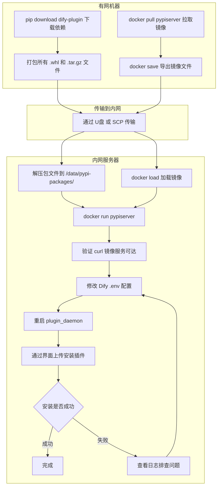

# Dify 离线环境搭建内网 PyPI 镜像仓库完整指南

> 本文详细介绍如何在完全离线（无外网）的内网环境中搭建 PyPI 镜像仓库，解决 Dify 插件安装时因 Plugin Daemon 无法访问 pypi.org 而导致的依赖安装失败问题。文章涵盖问题背景、原理分析、三种镜像方案的对比与实操、Dify 侧配置对接、常见问题排查等内容。

---

## 一、问题背景

### 1.1 为什么需要内网 PyPI 镜像

在 Dify 的插件系统中，无论通过哪种方式获取插件包（Marketplace 下载、GitHub 拉取、本地上传），Plugin Daemon 在安装插件时都必须使用 `uv` 工具为插件创建独立的 Python 虚拟环境，并从 PyPI 包索引下载运行时依赖。

在完全离线（无外网）的内网环境中，Plugin Daemon 容器内的 `uv` 无法访问默认的 `pypi.org`，导致依赖安装超时失败，界面报出类似以下错误：

```
failed to launch plugin: failed to install dependencies: failed to install dependencies: exit status 2, output:
DEBUG uv 0.9.26
TRACE Checking lock for /root/.cache/uv at /root/.cache/uv/.lock
DEBUG Acquired shared lock for /root/.cache/uv

TRACE Error trace:
Request failed after 3 retries
Caused by:
  0: Failed to fetch: https://pypi.org/simple/dify-plugin/
  1: error sending request for url (https://pypi.org/simple/dify-plugin/)
  2: operation timed out

error: Request failed after 3 retries
Caused by: Failed to fetch: https://pypi.org/simple/dify-plugin/
Caused by: operation timed out

failed to init environment
```

解决这个问题的根本思路是在内网搭建一个 PyPI 镜像服务，然后通过 `PIP_MIRROR_URL` 环境变量告诉 Plugin Daemon 使用这个内网地址替代默认的 `pypi.org`。

### 1.2 前置知识：Dify 插件的两层网络依赖

理解这个问题需要先明白 Dify 插件系统中存在两层完全独立的网络依赖：

**第一层是 Dify API 层与 Marketplace 的通信**。这一层受 `MARKETPLACE_ENABLED` 环境变量控制，当设为 `false` 时，Dify API 不再向 `marketplace.dify.ai` 发起任何请求。这个配置只影响 API 层的行为，比如禁止从 Marketplace 浏览和安装插件、跳过版本更新检查等。

**第二层是 Plugin Daemon 层与 PyPI 的通信**。这一层受 `PIP_MIRROR_URL` 环境变量控制。当此变量为空时，Plugin Daemon 内部的 `uv` 工具默认访问 `https://pypi.org/simple/` 下载 Python 依赖包。这一层与 `MARKETPLACE_ENABLED` 完全无关，即使关闭了 Marketplace，Plugin Daemon 仍然需要访问 PyPI。

在离线环境中，第一层的问题通过设置 `MARKETPLACE_ENABLED=false` 已经解决。本文要解决的是第二层的问题：搭建内网 PyPI 镜像并配置 `PIP_MIRROR_URL` 指向它。

### 1.3 dify-plugin SDK 的依赖清单

每个 Dify 插件的 `pyproject.toml` 都声明了对 `dify-plugin` SDK 的依赖。以当前最新的 `dify-plugin` 0.9.0 版本为例，它自身又依赖了以下 Python 包：

```
Flask>=3.1.3
Werkzeug>=3.1.8
dpkt>=1.9.8
gevent>=26.4.0
httpx>=0.28.1
pydantic_settings>=2.14.1
pydantic>=2.13.4
pyyaml>=6.0.3
requests>=2.33.1
socksio>=1.0.0
tiktoken>=0.12.0
yarl>=1.23.0
packaging>=26.2
```

这些依赖包各自还有传递依赖（例如 `httpx` 依赖 `httpcore`、`certifi`、`anyio` 等），完整的依赖树可能包含数十个包。所有这些包都需要预先下载到内网镜像中，否则 `uv` 安装时仍然会因为缺少某个传递依赖而失败。

---

## 二、方案选型：三种内网 PyPI 镜像方案对比

在正式动手之前，先对比三种主流的内网 PyPI 镜像方案，根据实际环境条件选择最适合的方案。

### 2.1 方案对比总览

| 特性 | pypiserver | devpi | 静态文件目录 |
|------|-----------|-------|-------------|
| 实施难度 | 低 | 中 | 最低 |
| 资源占用 | 极低 | 中 | 极低 |
| 是否支持上传 | 支持 | 支持 | 不支持 |
| 是否支持缓存代理 | 不支持 | 支持 | 不支持 |
| 是否支持搜索 | 不支持 | 支持 | 不支持 |
| 离线适用性 | 非常适合 | 适合 | 适合 |
| Docker 部署 | 支持 | 支持 | 支持 |
| 维护成本 | 低 | 中 | 最低 |

### 2.2 方案一：pypiserver（推荐）

pypiserver 是一个轻量级的 PyPI 兼容服务器，基于 Python 的 bottle 框架构建。它实现了与 PyPI 相同的 Simple Repository API，使得 `pip`、`uv`、`twine` 等标准工具可以像访问官方 PyPI 一样与它交互。

pypiserver 的最大优势是极度轻量。它不需要数据库，不需要复杂的配置，只需要一个存放包文件的目录就能运行。对于 Dify 离线场景，我们只需要把有限的几十个依赖包放进去即可，不需要全量镜像整个 PyPI。

适用场景：内网离线环境，只需要为 Dify 插件安装提供有限的 Python 包。

### 2.3 方案二：devpi

devpi 是一个功能更强大的包管理系统，支持缓存代理模式。在有网的开发环境中部署 devpi 后，它会自动缓存从 PyPI 下载的包。之后即使断网，缓存中的包仍然可以被安装。

devpi 的优势在于它的缓存代理能力。在开发阶段，每当安装一个新包，devpi 会自动从上游 PyPI 拉取并缓存。积累一段时间后，缓存中就自然覆盖了所有需要的包。

适用场景：先在有网环境使用一段时间积累缓存，再迁移到离线环境。或者需要频繁安装不同插件的大型组织。

### 2.4 方案三：静态文件目录

Python 的包索引协议本质上就是一个简单的 HTTP 目录结构。只要按照规定的目录格式组织文件，用任何 HTTP 服务器（Nginx、Python http.server 等）都能充当 PyPI 源。

这种方式最简单但最原始，适合临时应急。需要手动创建目录结构、生成索引页面。

适用场景：临时验证，只需要安装一两个特定插件。

---

## 三、实操步骤：在有网机器上预下载依赖包

无论选择哪种方案，第一步都是在有网络的机器上把需要的 Python 包下载下来。这是整个流程中最关键的一步，因为下载不完整会导致后续安装失败。

### 3.1 下载 dify-plugin SDK 及全部传递依赖

在一台能访问外网的机器上执行以下命令：

```bash
# 创建一个目录用于存放下载的包
mkdir -p ~/dify-pypi-packages

# 下载 dify-plugin 及其所有传递依赖
pip download dify-plugin -d ~/dify-pypi-packages/

# 下载构建工具（某些包的安装过程需要）
pip download setuptools wheel -d ~/dify-pypi-packages/
```

`pip download` 命令会递归解析依赖树，下载所有需要的包文件（包括 `.whl` 和 `.tar.gz` 格式）。下载完成后检查目录内容：

```bash
ls ~/dify-pypi-packages/ | wc -l
```

正常情况下应该下载几十个包文件。如果数量明显偏少（比如只有几个），可能是下载不完整。

### 3.2 针对特定插件额外下载依赖

不同的 Dify 插件除了依赖 `dify-plugin` SDK 之外，还可能在 `pyproject.toml` 中声明了额外的依赖。以用户实际要安装的插件为例，需要额外下载这些依赖。

方法是先查看插件的 `pyproject.toml` 文件中的 `dependencies` 列表，然后逐个下载。或者更简单的方式：在有网环境中先安装一次该插件，然后查看 Plugin Daemon 日志中 uv 实际下载了哪些包。

```bash
# 假设插件额外依赖了 numpy 和 pandas
pip download numpy pandas -d ~/dify-pypi-packages/
```

### 3.3 指定平台参数下载

如果内网服务器的操作系统和 CPU 架构与下载机器不同，需要指定目标平台参数，确保下载的二进制包兼容目标环境：

```bash
# 针对 Linux x86_64 平台下载
pip download dify-plugin -d ~/dify-pypi-packages/ \
    --platform manylinux2014_x86_64 \
    --python-version 3.12 \
    --only-binary=:all:

# 如果某些包没有预编译的 wheel，需要同时允许源码包
pip download dify-plugin -d ~/dify-pypi-packages/ \
    --platform manylinux2014_x86_64 \
    --python-version 3.12
```

Plugin Daemon 容器通常使用 Linux x86_64 架构和 Python 3.12 版本（从错误日志中的 `cpython-3.12.3-linux-x86_64-gnu` 可以确认）。确保下载的包与此环境兼容非常重要。

### 3.4 将包文件传输到内网服务器

将下载好的包目录通过 U 盘、SCP、内网文件共享等方式传输到内网服务器上：

```bash
# 打包传输（在有网机器上执行）
tar czf dify-pypi-packages.tar.gz ~/dify-pypi-packages/

# 在内网服务器上解压
mkdir -p /data/pypi-packages
tar xzf dify-pypi-packages.tar.gz -C /data/
```

---

## 四、方案一详细步骤：使用 pypiserver 搭建内网 PyPI 镜像

### 4.1 方式 A：直接使用 pip 安装运行

这是最简单的方式，适合内网服务器上已有 Python 环境的情况。

**安装 pypiserver**：

首先需要在有网机器上下载 pypiserver 本身及其依赖：

```bash
pip download pypiserver -d ~/pypiserver-installer/
```

将下载的文件传输到内网服务器后，离线安装：

```bash
pip install --no-index --find-links=/data/pypiserver-installer/ pypiserver
```

**启动 pypiserver**：

```bash
# 确保包目录中有文件
ls /data/pypi-packages/

# 启动服务，监听 8080 端口
pypi-server run -p 8080 /data/pypi-packages/ &
```

启动后 pypiserver 会监听在 `0.0.0.0:8080`，对所有网络接口提供服务。可以通过浏览器访问 `http://<内网服务器IP>:8080/simple/` 验证服务是否正常，应该能看到一个列出所有可用包的 HTML 页面。

**验证服务可用性**：

```bash
# 在内网服务器上测试
curl http://localhost:8080/simple/
curl http://localhost:8080/simple/dify-plugin/
```

如果返回了包含包文件链接的 HTML 内容，说明服务正常。

### 4.2 方式 B：使用 Docker 容器运行（推荐）

如果内网服务器上没有 Python 环境，或者为了隔离性更好，推荐使用 Docker 运行 pypiserver。

**在有网机器上拉取镜像并导出**：

```bash
docker pull pypiserver/pypiserver:latest
docker save pypiserver/pypiserver:latest -o pypiserver.tar
```

将镜像文件和包目录一起传输到内网服务器。

**在内网服务器上加载镜像并启动**：

```bash
# 加载镜像
docker load -i pypiserver.tar

# 启动容器
docker run -d \
    --name pypiserver \
    --restart always \
    -p 8080:8080 \
    -v /data/pypi-packages:/packages \
    pypiserver/pypiserver:latest \
    run -p 8080 /packages
```

参数说明：`-p 8080:8080` 将容器的 8080 端口映射到宿主机的 8080 端口。`-v /data/pypi-packages:/packages` 将内网服务器上的包目录挂载到容器内的 `/packages` 目录。最后的 `run -p 8080 /packages` 是传递给 pypiserver 的启动参数。

**验证容器运行状态**：

```bash
docker ps | grep pypiserver
curl http://localhost:8080/simple/
```

### 4.3 方式 C：将 pypiserver 集成到 Dify 的 docker-compose 中

如果希望统一管理，可以将 pypiserver 作为一个服务加入到 Dify 的 `docker-compose.yaml` 中。

在 `docker-compose.yaml` 文件的 `services` 部分末尾（在 `networks` 定义之前）添加以下内容：

```yaml
  # 内网 PyPI 镜像服务
  pypi_mirror:
    image: pypiserver/pypiserver:latest
    restart: always
    command: run -p 8080 /packages
    volumes:
      - ./volumes/pypi_packages:/packages
    networks:
      - default
```

然后将之前准备好的包文件放入宿主机的 `./volumes/pypi_packages/` 目录：

```bash
mkdir -p ./volumes/pypi_packages
cp /data/pypi-packages/* ./volumes/pypi_packages/
```

这种方式的好处是 pypiserver 与 Dify 的其他服务在同一个 Docker 网络中，Plugin Daemon 可以通过 Docker 内部域名 `pypi_mirror` 直接访问它，地址为 `http://pypi_mirror:8080/simple/`。

### 4.4 配置 pypiserver 开机自启

如果使用方式 A（直接运行），建议配置 systemd 服务实现开机自启。创建 `/etc/systemd/system/pypiserver.service` 文件：

```ini
[Unit]
Description=PyPI Server
After=network.target

[Service]
Type=simple
ExecStart=/usr/local/bin/pypi-server run -p 8080 /data/pypi-packages
Restart=always
RestartSec=5

[Install]
WantedBy=multi-user.target
```

然后启用并启动服务：

```bash
systemctl daemon-reload
systemctl enable pypiserver
systemctl start pypiserver
systemctl status pypiserver
```

---

## 五、方案二详细步骤：使用 devpi 搭建带缓存的 PyPI 镜像

### 5.1 devpi 的工作原理

devpi 的工作方式与 pypiserver 不同。它不仅是一个静态的包服务器，还是一个缓存代理。当客户端向 devpi 请求一个包时，如果本地缓存中没有，devpi 会自动从上游 PyPI 下载并缓存。之后再次请求同一个包时，直接从本地缓存返回。

在离线场景中，devpi 的使用策略是：先在有网环境下使用一段时间积累缓存，然后将缓存数据迁移到离线环境。在离线环境下，devpi 无法从上游拉取新包，但缓存中已有的包可以正常使用。

### 5.2 在有网环境中部署 devpi 并积累缓存

在有网机器上使用 Docker 部署 devpi：

```bash
docker run -d \
    --name devpi \
    --restart always \
    -p 3141:3141 \
    -v ~/devpi-data:/devpi \
    devpi/server:latest
```

然后配置 pip 使用 devpi 作为包源，安装几次常用的包来积累缓存：

```bash
pip install --index-url http://localhost:3141/root/pypi/+simple/ \
    --trusted-host localhost \
    dify-plugin
```

每安装一个包，devpi 就会自动将相关的包文件缓存到 `/devpi` 目录中。

### 5.3 迁移到离线环境

将 devpi 的缓存数据目录传输到内网服务器：

```bash
# 在有网机器上打包
tar czf devpi-data.tar.gz ~/devpi-data/

# 在内网服务器上解压
mkdir -p /data/devpi-data
tar xzf devpi-data.tar.gz -C /data/
```

在内网服务器上启动 devpi，使用 `--offline-mode` 参数：

```bash
docker run -d \
    --name devpi \
    --restart always \
    -p 3141:3141 \
    -v /data/devpi-data:/devpi \
    devpi/server:latest \
    --host 0.0.0.0 \
    --port 3141
```

devpi 的 Simple API 地址为 `http://<内网服务器IP>:3141/root/pypi/+simple/`。

### 5.4 devpi 方案的注意事项

devpi 方案的局限性在于缓存的完整性。如果在有网环境中没有安装过某个包，那么离线环境中这个包也不可用。因此建议在有网环境中尽量多安装几个不同的 Dify 插件，让缓存尽可能完整。

如果后续需要安装新插件而缓存中没有对应的包，需要再次在有网环境中安装一次来补充缓存。

---

## 六、方案三详细步骤：使用静态文件目录搭建最简 PyPI 源

### 6.1 目录结构要求

Python 的 Simple Repository API 规定了一个非常简单的目录结构。对于每个包，需要创建一个以包名命名的小写目录，目录内放置所有版本的包文件，以及一个 `index.html` 文件列出所有文件链接。

以 `dify-plugin` 为例，目录结构应该是：

```
/data/pypi-static/
  simple/
    dify-plugin/
      index.html
      dify_plugin-0.9.0-py3-none-any.whl
    flask/
      index.html
      flask-3.1.3-py3-none-any.whl
    httpx/
      index.html
      httpx-0.28.1-py3-none-any.whl
    ...
```

### 6.2 自动生成目录结构

手动创建目录结构和索引文件非常繁琐。可以编写一个简单的脚本来自动完成：

```bash
#!/bin/bash
# create_pypi_index.sh - 为包目录生成 Simple API 索引

PACKAGES_DIR="/data/pypi-static/packages"
SIMPLE_DIR="/data/pypi-static/simple"

mkdir -p "$SIMPLE_DIR"

# 遍历所有包文件，按包名分组
for pkg_file in "$PACKAGES_DIR"/*; do
    filename=$(basename "$pkg_file")
    # 从文件名中提取包名（简化处理）
    pkg_name=$(echo "$filename" | sed -E 's/[-_][0-9].*//; s/_/-/g' | tr '[:upper:]' '[:lower:]')

    # 创建包目录
    pkg_dir="$SIMPLE_DIR/$pkg_name"
    mkdir -p "$pkg_dir"

    # 复制包文件
    cp "$pkg_file" "$pkg_dir/"
done

# 为每个包目录生成 index.html
for pkg_dir in "$SIMPLE_DIR"/*/; do
    pkg_name=$(basename "$pkg_dir")
    echo "<html><body>" > "$pkg_dir/index.html"
    for file in "$pkg_dir"/*; do
        filename=$(basename "$file")
        if [ "$filename" != "index.html" ]; then
            echo "<a href=\"$filename\">$filename</a><br>" >> "$pkg_dir/index.html"
        fi
    done
    echo "</body></html>" >> "$pkg_dir/index.html"
done

# 生成根索引
echo "<html><body>" > "$SIMPLE_DIR/index.html"
for pkg_dir in "$SIMPLE_DIR"/*/; do
    pkg_name=$(basename "$pkg_dir")
    echo "<a href=\"$pkg_name/\">$pkg_name</a><br>" >> "$SIMPLE_DIR/index.html"
done
echo "</body></html>" >> "$SIMPLE_DIR/index.html"

echo "Index generation complete."
```

### 6.3 使用 HTTP 服务器提供访问

生成目录结构后，使用任意 HTTP 服务器提供服务。最简单的方式是用 Python 内置的 HTTP 服务器：

```bash
cd /data/pypi-static
python3 -m http.server 8080
```

或者使用 Nginx：

```nginx
server {
    listen 8080;
    location /simple/ {
        alias /data/pypi-static/simple/;
        autoindex on;
    }
}
```

静态文件方案的 Simple API 地址为 `http://<内网服务器IP>:8080/simple/`。

---

## 七、配置 Dify 使用内网 PyPI 镜像

搭建好镜像服务后，下一步是配置 Dify 的 Plugin Daemon 使用这个内网地址。

### 7.1 核心配置项

需要修改的配置位于 Dify 的 `.env` 文件中（或 docker-compose 部署时的环境变量）：

| 配置项 | 值 | 说明 |
|--------|-----|------|
| PIP_MIRROR_URL | http://内网IP:8080/simple/ | 指向内网 PyPI 镜像的地址 |
| PLUGIN_IGNORE_UV_LOCK | true | 忽略插件包中的 uv.lock 文件 |
| FORCE_VERIFYING_SIGNATURE | false | 可选，自编译插件时关闭签名验证 |
| MARKETPLACE_ENABLED | false | 离线环境关闭 Marketplace |
| PLUGIN_PYTHON_ENV_INIT_TIMEOUT | 300 | 可选，内网延迟较大时增加超时 |

### 7.2 修改 .env 文件

编辑 Dify docker 目录下的 `.env` 文件，添加或修改以下配置：

```bash
# 关闭 Marketplace（离线环境必须）
MARKETPLACE_ENABLED=false

# 指向内网 PyPI 镜像（根据实际部署方式填写地址）
# 如果 pypiserver 部署在同一台机器的独立容器中：
PIP_MIRROR_URL=http://<内网服务器IP>:8080/simple/

# 如果 pypiserver 集成在 docker-compose 中：
# PIP_MIRROR_URL=http://pypi_mirror:8080/simple/

# 忽略 uv.lock 中的原始源地址（重要）
PLUGIN_IGNORE_UV_LOCK=true
```

### 7.3 PIP_MIRROR_URL 的传递路径

了解这个配置变量是如何从 `.env` 文件最终传递到 Plugin Daemon 内部的 `uv` 工具，有助于排查配置不生效的问题。

在 `docker-compose.yaml` 中，`plugin_daemon` 服务的环境变量部分引用了 `.env` 文件：

```yaml
plugin_daemon:
    env_file:
      - ./.env
    environment:
      PIP_MIRROR_URL: ${PIP_MIRROR_URL:-}
```

`env_file` 指令会先加载 `.env` 文件中的所有变量，然后 `environment` 部分使用 `${PIP_MIRROR_URL:-}` 语法将 `.env` 中的值注入到容器中。`:-` 表示如果变量未定义则使用空字符串作为默认值。

Plugin Daemon 启动后读取 `PIP_MIRROR_URL` 环境变量，在调用 `uv` 安装依赖时通过 `--index-url` 参数传递给 `uv`。当此变量为空时，`uv` 使用默认的 `https://pypi.org/simple/`。

### 7.4 PLUGIN_IGNORE_UV_LOCK 的重要性

这个配置容易被忽略但非常重要。某些 Dify 插件的 `.difypkg` 包中包含 `uv.lock` 锁文件。这个锁文件记录了精确的依赖版本和下载源地址。如果锁文件中记录的源地址是 `pypi.org`，即使设置了 `PIP_MIRROR_URL`，`uv` 在某些版本中可能仍然会优先使用锁文件中的源地址去下载。

设置 `PLUGIN_IGNORE_UV_LOCK=true` 后，Plugin Daemon 会让 `uv` 忽略锁文件，完全按照 `PIP_MIRROR_URL` 指定的镜像源来解析和下载依赖。

需要注意的是，`PLUGIN_IGNORE_UV_LOCK` 这个变量不在 `docker-compose.yaml` 的 `environment` 部分显式定义，但 Plugin Daemon 容器会通过 `env_file` 加载 `.env` 文件中的所有变量。因此直接在 `.env` 中添加即可。

### 7.5 重启 Plugin Daemon

修改配置后需要重启 Plugin Daemon 容器使配置生效：

```bash
cd /path/to/dify/docker
docker compose restart plugin_daemon
```

如果使用 Docker Compose 完整重建：

```bash
docker compose down
docker compose up -d
```

---

## 八、验证安装是否成功

### 8.1 验证 PyPI 镜像服务可达性

在 Plugin Daemon 容器内部测试是否能访问到内网 PyPI 镜像：

```bash
# 进入 plugin_daemon 容器
docker exec -it plugin_daemon sh

# 测试镜像服务是否可达
curl -v http://<内网服务器IP>:8080/simple/dify-plugin/ --connect-timeout 5

# 如果 pypiserver 在 docker-compose 中
curl -v http://pypi_mirror:8080/simple/dify-plugin/ --connect-timeout 5
```

如果返回了包含包文件链接的 HTML 内容，说明网络连通且服务正常。如果超时或连接被拒绝，需要检查防火墙、网络路由、容器网络配置等。

### 8.2 验证环境变量是否生效

检查 Plugin Daemon 容器是否正确加载了 `PIP_MIRROR_URL`：

```bash
docker exec -it plugin_daemon sh -c "echo \$PIP_MIRROR_URL"
```

应该输出配置的内网镜像地址。如果输出为空，说明 `.env` 文件没有被正确加载。

同样检查 `PLUGIN_IGNORE_UV_LOCK`：

```bash
docker exec -it plugin_daemon sh -c "echo \$PLUGIN_IGNORE_UV_LOCK"
```

### 8.3 尝试安装插件

通过 Dify 界面上传一个 `.difypkg` 文件并安装。观察安装过程是否成功。

如果安装仍然失败，查看 Plugin Daemon 日志获取详细错误信息：

```bash
docker logs plugin_daemon --tail 200
```

在日志中搜索 `uv` 相关的输出，确认 `uv` 是否在访问内网镜像地址而非 `pypi.org`。

### 8.4 检查 uv 缓存

安装成功后，可以检查 uv 的缓存目录确认依赖已经被正确下载和安装：

```bash
docker exec -it plugin_daemon ls -la /root/.cache/uv/
docker exec -it plugin_daemon ls -la /app/storage/cwd/
```

`/app/storage/cwd/` 目录下应该能看到已安装插件的工作目录，其中包含 `.venv` 虚拟环境。

---

## 九、常见问题排查

### 9.1 问题一：uv 仍然访问 pypi.org 而不使用镜像

**现象**：日志中仍然出现 `Failed to fetch: https://pypi.org/simple/...`。

**原因**：通常是 `uv.lock` 文件干扰或 `PIP_MIRROR_URL` 未生效。

**排查步骤**：

第一步，确认环境变量已设置：

```bash
docker exec -it plugin_daemon sh -c "echo \$PIP_MIRROR_URL"
```

第二步，确认已设置 `PLUGIN_IGNORE_UV_LOCK=true`。

第三步，如果问题仍然存在，检查插件包中是否包含 `uv.lock` 文件：

```bash
docker exec -it plugin_daemon find /app/storage -name "uv.lock" -type f
```

如果找到了 `uv.lock` 文件，可以手动删除后重试安装：

```bash
docker exec -it plugin_daemon rm /app/storage/cwd/<插件路径>/uv.lock
```

### 9.2 问题二：镜像服务返回包找不到

**现象**：uv 报错 `Package not found` 或 `No matching distribution found`。

**原因**：预下载的包不完整，缺少某些传递依赖。

**解决方法**：在有网环境中重新下载，使用 `--verbose` 参数查看完整的依赖解析过程，确认所有传递依赖都被下载：

```bash
pip download dify-plugin -d ~/dify-pypi-packages/ --verbose
```

特别注意一些需要编译的包（如 `tiktoken`、`gevent`），它们可能需要源码包（`.tar.gz`）和对应的构建工具（`setuptools`、`wheel`、`cython` 等）。

### 9.3 问题三：包的平台不兼容

**现象**：uv 报错 `No matching distribution found for xxx` 但包文件明明存在于镜像中。

**原因**：下载的包是 Windows 或 macOS 平台的 wheel 文件，而 Plugin Daemon 运行在 Linux 上。

**解决方法**：重新下载时指定正确的平台参数（参见第三章 3.3 节）。或者使用 `--no-binary=:all:` 强制下载源码包，让 `uv` 在目标环境中编译。

### 9.4 问题四：Docker 网络不通

**现象**：Plugin Daemon 容器无法访问内网 PyPI 镜像的 IP 地址。

**原因**：Docker 网络与宿主机网络之间的路由问题。

**排查步骤**：

首先确认 pypiserver 监听在所有接口（`0.0.0.0`）而非仅 `127.0.0.1`。

然后确认防火墙允许 Plugin Daemon 容器所在网段访问 8080 端口。

如果 pypiserver 部署在同一台机器上但不在 Docker 网络中，Plugin Daemon 容器可以通过 `host.docker.internal` 或宿主机的局域网 IP 来访问。在某些 Linux Docker 版本中，也可以使用 `--add-host=host.docker.internal:host-gateway` 参数。

如果 pypiserver 集成在 docker-compose 中（方案 4.2 方式 C），Plugin Daemon 可以直接使用服务名 `pypi_mirror` 作为主机名，因为它们在同一个 `default` 网络中。

### 9.5 问题五：安装超时

**现象**：安装过程长时间无响应，最终报超时错误。

**原因**：内网镜像服务器性能不足或网络延迟较高。

**解决方法**：增加 `PLUGIN_PYTHON_ENV_INIT_TIMEOUT` 的值。默认值为 120 秒，可以增加到 300 或 600 秒：

```bash
PLUGIN_PYTHON_ENV_INIT_TIMEOUT=600
```

---

## 十、完整操作流程总结

以下是一次完整的从零开始在离线环境搭建 PyPI 镜像并安装 Dify 插件的操作流程。

### 10.1 操作流程图



### 10.2 配置检查清单

在尝试安装插件之前，逐项确认以下配置：

```bash
# 1. 确认 PIP_MIRROR_URL 已正确配置
grep PIP_MIRROR_URL /path/to/dify/docker/.env

# 2. 确认 PLUGIN_IGNORE_UV_LOCK 已设置为 true
grep PLUGIN_IGNORE_UV_LOCK /path/to/dify/docker/.env

# 3. 确认 MARKETPLACE_ENABLED 已关闭
grep MARKETPLACE_ENABLED /path/to/dify/docker/.env

# 4. 确认 Plugin Daemon 容器中的环境变量已生效
docker exec plugin_daemon sh -c "echo PIP_MIRROR_URL=\$PIP_MIRROR_URL"
docker exec plugin_daemon sh -c "echo PLUGIN_IGNORE_UV_LOCK=\$PLUGIN_IGNORE_UV_LOCK"

# 5. 确认内网 PyPI 镜像服务正在运行
docker ps | grep pypiserver

# 6. 确认从 Plugin Daemon 容器可以访问镜像服务
docker exec plugin_daemon curl -s http://<镜像地址>:8080/simple/ | head -5
```

### 10.3 推荐的 .env 完整配置

```bash
# ===== API 层配置 =====
MARKETPLACE_ENABLED=false
MARKETPLACE_API_URL=https://marketplace.dify.ai

# ===== Plugin Daemon 层配置 =====
PIP_MIRROR_URL=http://<内网服务器IP>:8080/simple/
PLUGIN_IGNORE_UV_LOCK=true
FORCE_VERIFYING_SIGNATURE=false
PLUGIN_PYTHON_ENV_INIT_TIMEOUT=300
PLUGIN_MAX_EXECUTION_TIMEOUT=600
```

---

## 十一、运维建议与最佳实践

### 11.1 包管理策略

建议为内网 PyPI 镜像维护一个清单文件，记录当前已下载的包和版本。当需要安装新的 Dify 插件时，先查看插件的 `pyproject.toml` 了解其额外依赖，提前在有网环境中下载好对应的包并补充到镜像中。

可以编写一个简单的检查脚本，验证镜像中是否包含 `dify-plugin` 所需的全部依赖：

```bash
#!/bin/bash
# check_packages.sh - 检查镜像中是否包含所有必要的包

MIRROR_URL="http://localhost:8080/simple"
PACKAGES=("dify-plugin" "flask" "httpx" "pydantic" "pyyaml" "requests" "tiktoken" "gevent" "pydantic-settings")

for pkg in "${PACKAGES[@]}"; do
    status=$(curl -s -o /dev/null -w "%{http_code}" "$MIRROR_URL/$pkg/")
    if [ "$status" = "200" ]; then
        echo "[OK] $pkg found"
    else
        echo "[MISSING] $pkg not found (HTTP $status)"
    fi
done
```

### 11.2 定期同步

如果离线环境允许偶尔联网，建议定期在有网环境中更新依赖包，保持镜像中的包版本与 PyPI 上的最新版本同步。这样可以确保安装新版插件时不会因为缺少某个依赖的新版本而失败。

### 11.3 监控与日志

为 pypiserver 或 devpi 配置访问日志，可以方便地排查包请求情况。当 Plugin Daemon 请求某个包但镜像中不存在时，日志中会返回 404 状态码。通过监控这些 404 请求，可以快速发现缺失的包并补充到镜像中。

### 11.4 安全性考虑

内网 PyPI 镜像仅在内网中提供服务，不需要配置 HTTPS 或认证。但需要注意以下几点：不要将镜像服务暴露到公网，不要将不明来源的包放入镜像目录，定期检查镜像中的包文件是否被篡改。

---

## 十二、总结

本文完整介绍了在 Dify 离线环境中搭建内网 PyPI 镜像仓库的方法。核心要点如下：

**问题本质**是 Dify 插件系统的两层独立网络依赖。API 层连接 Marketplace 的问题通过 `MARKETPLACE_ENABLED=false` 解决。Plugin Daemon 层连接 PyPI 的问题需要通过搭建内网镜像解决。

**推荐方案**是使用 pypiserver，它极度轻量、部署简单、完全满足离线场景需求。在有网机器上用 `pip download` 预下载所有依赖包，传输到内网后启动 pypiserver 即可。

**关键配置**是 `.env` 文件中的 `PIP_MIRROR_URL` 和 `PLUGIN_IGNORE_UV_LOCK`。前者告诉 Plugin Daemon 去哪里找包，后者确保 uv 不会因为锁文件中记录的原始源地址而绕过镜像。

**验证方法**是在 Plugin Daemon 容器内用 curl 测试镜像可达性，然后尝试安装一个插件观察结果。

掌握了这套方法后，在纯离线环境中安装和管理 Dify 插件将不再受限于网络条件。
