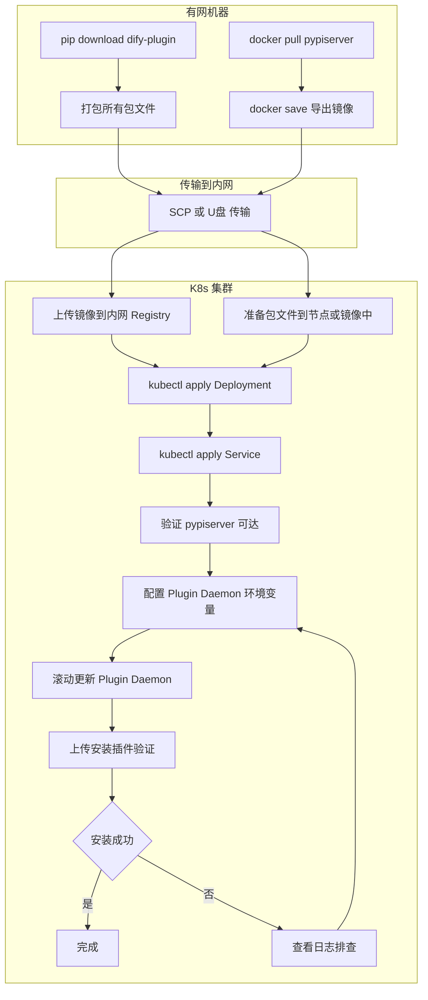

# Dify 离线环境搭建内网 PyPI 镜像仓库完整指南（K8s + Linux）

> 本文详细介绍如何在 Kubernetes（K8s）离线环境中搭建内网 PyPI 镜像仓库，解决 Dify 插件安装时因 Plugin Daemon 无法访问 pypi.org 而导致的依赖安装失败问题。全文基于 K8s + Linux 环境，涵盖问题根因、方案选型、K8s 部署实操、Dify 配置对接、常见问题排查等内容。

---

## 一、问题背景

### 1.1 问题现象

在 K8s 集群中部署的 Dify 离线环境（无外网），通过本地上传 `.difypkg` 文件安装插件时，上传成功但安装失败，界面显示如下错误：

```
1个插件安装失败
IoT设备通用网关
failed to launch plugin: failed to install dependencies: failed to install dependencies: exit status 2
```

Plugin Daemon Pod 日志中可以看到完整的错误堆栈：

```
failed to launch plugin: failed to install dependencies: failed to install dependencies: exit status 2, output:
DEBUG uv 0.9.26
TRACE Checking lock for /root/.cache/uv at /root/.cache/uv/.lock
DEBUG Acquired shared lock for /root/.cache/uv
DEBUG Searching for default Python interpreter in virtual environments
TRACE Querying interpreter executable at /app/cwd/your-name/iot_device_http-0.0.8@421ed98c.../.venv/bin/python3
DEBUG Found cpython-3.12.3-linux-x86_64-gnu

TRACE Error trace:
Request failed after 3 retries
Caused by:
  0: Failed to fetch: https://pypi.org/simple/dify-plugin/
  1: error sending request for url (https://pypi.org/simple/dify-plugin/)
  2: operation timed out

error: Request failed after 3 retries
Caused by: Failed to fetch: https://pypi.org/simple/dify-plugin/
Caused by: operation timed out

failed to init environment
```

### 1.2 根因简述

Dify 插件系统中存在**两层完全独立的网络依赖**，理解这一点是解决问题的前提：

| 层级 | 网络目标 | 控制变量 | 本地包安装是否需要 |
|------|---------|---------|-------------------|
| Dify API 层 | marketplace.dify.ai | MARKETPLACE_ENABLED | 不需要 |
| Plugin Daemon 层 | pypi.org | PIP_MIRROR_URL | **必须需要** |

`MARKETPLACE_ENABLED=false` 只能关闭 API 层对 Marketplace 的访问，对 Plugin Daemon 层毫无影响。Plugin Daemon 内部的 `uv` 工具始终需要从 PyPI 下载 `dify-plugin` SDK 及其传递依赖。在离线环境中，`pypi.org` 不可达，因此必须在集群内部署一个 PyPI 镜像服务，并通过 `PIP_MIRROR_URL` 环境变量告知 Plugin Daemon。

### 1.3 dify-plugin SDK 依赖清单

每个 Dify 插件都依赖 `dify-plugin` SDK。当前 0.9.0 版本的直接依赖如下：

```
Flask>=3.1.3          Werkzeug>=3.1.8       dpkt>=1.9.8
gevent>=26.4.0        httpx>=0.28.1         pydantic_settings>=2.14.1
pydantic>=2.13.4      pyyaml>=6.0.3         requests>=2.33.1
socksio>=1.0.0        tiktoken>=0.12.0      yarl>=1.23.0
packaging>=26.2
```

这些包各自还有传递依赖（如 `httpx` 依赖 `httpcore`、`certifi`、`anyio`），完整依赖树包含数十个包，全部需要预先放入内网镜像中。

---

## 二、方案选型

### 2.1 三种方案对比

| 特性 | pypiserver | devpi | 静态文件目录 |
|------|-----------|-------|-------------|
| 实施难度 | 低 | 中 | 最低 |
| 资源占用 | 极低 | 中 | 极低 |
| 支持上传 | 支持 | 支持 | 不支持 |
| 缓存代理 | 不支持 | 支持 | 不支持 |
| K8s 部署 | 适合 | 适合 | 适合 |
| 离线适用性 | 非常适合 | 适合 | 适合 |
| 维护成本 | 低 | 中 | 最低 |

### 2.2 推荐方案：pypiserver

pypiserver 是轻量级 PyPI 兼容服务器，不需要数据库，不需要复杂配置，只需一个存放包文件的目录即可运行。在 K8s 中部署为一个 Deployment + Service 即可，资源占用极小。

适用场景：内网离线 K8s 集群，只需要为 Dify 插件安装提供有限的 Python 包。

---

## 三、准备工作：在有网机器上预下载依赖包

无论选择哪种方案，第一步都是在有网络的机器上把需要的 Python 包下载下来。

### 3.1 下载 dify-plugin 及全部传递依赖

在一台能访问外网的 Linux 机器上执行：

```bash
# 创建包存储目录
mkdir -p ~/dify-pypi-packages

# 递归下载 dify-plugin 及其所有传递依赖
pip download dify-plugin -d ~/dify-pypi-packages/

# 下载构建工具（某些包安装过程需要）
pip download setuptools wheel -d ~/dify-pypi-packages/
```

下载完成后检查文件数量，正常应该有几十个 `.whl` 和 `.tar.gz` 文件：

```bash
ls ~/dify-pypi-packages/ | wc -l
```

### 3.2 针对特定插件额外下载依赖

不同的 Dify 插件除了依赖 SDK 之外，还可能在 `pyproject.toml` 中声明了额外依赖。先查看插件的依赖列表，然后逐个下载：

```bash
# 假设插件额外依赖了 numpy 和 pandas
pip download numpy pandas -d ~/dify-pypi-packages/
```

### 3.3 指定目标平台参数

Plugin Daemon 容器通常使用 Linux x86_64 架构和 Python 3.12（从错误日志中的 `cpython-3.12.3-linux-x86_64-gnu` 可以确认）。如果下载机器的平台不同，需要指定目标平台：

```bash
pip download dify-plugin -d ~/dify-pypi-packages/ \
    --platform manylinux2014_x86_64 \
    --python-version 3.12
```

注意不要加 `--only-binary=:all:`，因为部分包（如 `tiktoken`、`gevent`）可能没有预编译 wheel，需要保留源码包（`.tar.gz`）以便在目标环境中编译。

### 3.4 传输到 K8s 集群节点

将下载好的包目录通过 SCP、U 盘或内网文件共享传输到 K8s 集群中可用的节点上：

```bash
# 在有网机器上打包
tar czf dify-pypi-packages.tar.gz ~/dify-pypi-packages/

# 传输到 K8s 节点
scp dify-pypi-packages.tar.gz user@k8s-node:/data/

# 在 K8s 节点上解压
mkdir -p /data/pypi-packages
tar xzf dify-pypi-packages.tar.gz -C /data/
```

---

## 四、在 K8s 中部署 pypiserver

### 4.1 创建命名空间（可选）

建议将 pypiserver 部署在与 Dify 相同的命名空间中，便于网络互通和服务发现：

```bash
kubectl create namespace dify  # 如果已有则跳过
```

### 4.2 准备包文件

由于 K8s Pod 无法直接访问宿主机文件系统，需要通过以下方式之一将包文件提供给 Pod：

**方式一：使用 PVC + hostPath（适合单节点或固定节点调度）**

先将包文件放到 K8s 节点的特定目录下（假设节点 IP 为 `192.168.1.100`）：

```bash
# 在目标节点上操作
mkdir -p /data/pypi-packages
# 将之前解压的包文件复制到此目录
cp -r /data/dify-pypi-packages/* /data/pypi-packages/
```

**方式二：构建自定义镜像（推荐，更适合生产环境）**

在有网的机器上构建包含包文件的自定义 pypiserver 镜像：

```bash
# 创建 Dockerfile
cat > Dockerfile << 'EOF'
FROM pypiserver/pypiserver:latest
COPY packages/ /packages/
CMD ["run", "-p", "8080", "/packages"]
EOF

# 将包文件放到 Dockerfile 同级的 packages/ 目录下
mkdir -p packages
cp ~/dify-pypi-packages/* packages/

# 构建并推送到内网镜像仓库
docker build -t registry.internal.com/dify/pypiserver:v1 .
docker push registry.internal.com/dify/pypiserver:v1
```

### 4.3 创建 K8s Deployment

根据包文件提供方式选择对应的 Deployment 配置。

**方式一 Deployment（使用 hostPath PVC）**：

```yaml
# pypiserver-deployment.yaml
apiVersion: apps/v1
kind: Deployment
metadata:
  name: pypiserver
  namespace: dify
  labels:
    app: pypiserver
spec:
  replicas: 1
  selector:
    matchLabels:
      app: pypiserver
  template:
    metadata:
      labels:
        app: pypiserver
    spec:
      # 如果使用 hostPath，需要调度到特定节点
      nodeSelector:
        kubernetes.io/hostname: k8s-node-01  # 替换为实际节点名
      containers:
      - name: pypiserver
        image: pypiserver/pypiserver:latest
        command: ["pypi-server", "run", "-p", "8080", "/packages"]
        ports:
        - containerPort: 8080
          name: http
        volumeMounts:
        - name: packages
          mountPath: /packages
        resources:
          requests:
            cpu: 50m
            memory: 64Mi
          limits:
            cpu: 200m
            memory: 128Mi
        livenessProbe:
          httpGet:
            path: /simple/
            port: 8080
          initialDelaySeconds: 5
          periodSeconds: 30
        readinessProbe:
          httpGet:
            path: /simple/
            port: 8080
          initialDelaySeconds: 3
          periodSeconds: 10
      volumes:
      - name: packages
        hostPath:
          path: /data/pypi-packages
          type: Directory
```

**方式二 Deployment（使用自定义镜像）**：

```yaml
# pypiserver-deployment.yaml
apiVersion: apps/v1
kind: Deployment
metadata:
  name: pypiserver
  namespace: dify
  labels:
    app: pypiserver
spec:
  replicas: 1
  selector:
    matchLabels:
      app: pypiserver
  template:
    metadata:
      labels:
        app: pypiserver
    spec:
      containers:
      - name: pypiserver
        image: registry.internal.com/dify/pypiserver:v1
        ports:
        - containerPort: 8080
          name: http
        resources:
          requests:
            cpu: 50m
            memory: 64Mi
          limits:
            cpu: 200m
            memory: 128Mi
        livenessProbe:
          httpGet:
            path: /simple/
            port: 8080
          initialDelaySeconds: 5
          periodSeconds: 30
        readinessProbe:
          httpGet:
            path: /simple/
            port: 8080
          initialDelaySeconds: 3
          periodSeconds: 10
```

应用 Deployment：

```bash
kubectl apply -f pypiserver-deployment.yaml
```

### 4.4 创建 K8s Service

创建 ClusterIP 类型的 Service，使同一集群内的 Dify Plugin Daemon Pod 能够通过 DNS 名称访问 pypiserver：

```yaml
# pypiserver-service.yaml
apiVersion: v1
kind: Service
metadata:
  name: pypiserver
  namespace: dify
  labels:
    app: pypiserver
spec:
  type: ClusterIP
  selector:
    app: pypiserver
  ports:
  - port: 8080
    targetPort: 8080
    protocol: TCP
    name: http
```

应用 Service：

```bash
kubectl apply -f pypiserver-service.yaml
```

创建完成后，同一命名空间下的其他 Pod 可以通过 `http://pypiserver:8080/simple/` 访问镜像服务。如果 Dify 部署在不同的命名空间，需要使用完整域名 `http://pypiserver.dify.svc.cluster.local:8080/simple/`。

### 4.5 验证 pypiserver 部署

```bash
# 检查 Pod 状态
kubectl get pods -n dify -l app=pypiserver

# 查看 Pod 日志
kubectl logs -n dify -l app=pypiserver

# 从集群内任意 Pod 测试连通性
kubectl run curl-test --image=curlimages/curl --rm -it --restart=Never -- \
    curl -s http://pypiserver.dify:8080/simple/

# 测试 dify-plugin 包是否可用
kubectl run curl-test --image=curlimages/curl --rm -it --restart=Never -- \
    curl -s http://pypiserver.dify:8080/simple/dify-plugin/
```

如果返回包含包文件链接的 HTML 内容，说明部署成功。

---

## 五、备选方案：使用 devpi 搭建带缓存的 PyPI 镜像

### 5.1 devpi 工作原理

devpi 支持缓存代理模式：在有网环境中使用时自动缓存从 PyPI 下载的包，迁移到离线环境后缓存中的包仍然可用。适合先在有网环境使用一段时间再迁移到离线的场景。

### 5.2 K8s 部署 devpi

```yaml
# devpi-deployment.yaml
apiVersion: apps/v1
kind: Deployment
metadata:
  name: devpi
  namespace: dify
spec:
  replicas: 1
  selector:
    matchLabels:
      app: devpi
  template:
    metadata:
      labels:
        app: devpi
    spec:
      containers:
      - name: devpi
        image: devpi/server:latest
        args:
        - --host
        - 0.0.0.0
        - --port
        - "3141"
        ports:
        - containerPort: 3141
          name: http
        volumeMounts:
        - name: devpi-data
          mountPath: /devpi
        resources:
          requests:
            cpu: 100m
            memory: 256Mi
          limits:
            cpu: 500m
            memory: 512Mi
      volumes:
      - name: devpi-data
        persistentVolumeClaim:
          claimName: devpi-pvc
---
apiVersion: v1
kind: PersistentVolumeClaim
metadata:
  name: devpi-pvc
  namespace: dify
spec:
  accessModes:
  - ReadWriteOnce
  resources:
    requests:
      storage: 5Gi
```

devpi 的 Simple API 地址为 `http://devpi.dify:3141/root/pypi/+simple/`。

### 5.3 注意事项

devpi 方案的局限性在于缓存完整性。在有网环境中未安装过的包，离线后也无法获取。建议在有网环境中尽量多安装不同 Dify 插件以充实缓存。

---

## 六、配置 Dify Plugin Daemon 使用内网镜像

### 6.1 核心配置项

| 配置项 | 推荐值 | 说明 |
|--------|--------|------|
| PIP_MIRROR_URL | http://pypiserver.dify:8080/simple/ | K8s 内部 DNS 地址 |
| PLUGIN_IGNORE_UV_LOCK | true | 忽略 uv.lock 中的 pypi.org 源地址 |
| FORCE_VERIFYING_SIGNATURE | false | 可选，自编译插件时关闭签名验证 |
| MARKETPLACE_ENABLED | false | 离线环境关闭 Marketplace |
| PLUGIN_PYTHON_ENV_INIT_TIMEOUT | 300 | 可选，增加超时时间 |

### 6.2 通过 KubeSphere 控制台配置

如果使用 KubeSphere 管理 K8s 集群，配置环境变量的步骤如下：

1. 登录 KubeSphere 控制台，进入 Dify 所在的项目/命名空间
2. 找到 Plugin Daemon 对应的 Deployment（通常名称为 `plugin-daemon` 或 `dify-plugin-daemon`）
3. 点击"编辑"进入 Deployment 配置界面
4. 在容器配置区域，找到环境变量部分，添加以下变量：

| 环境变量名 | 值 |
|-----------|-----|
| PIP_MIRROR_URL | http://pypiserver.dify:8080/simple/ |
| PLUGIN_IGNORE_UV_LOCK | true |

5. 保存后 KubeSphere 会自动触发滚动更新，无需手动重启 Pod

如果 Dify 的环境变量是通过 ConfigMap 管理的，则需要修改 ConfigMap 后重新部署 Deployment：

```bash
# 编辑 ConfigMap
kubectl edit configmap dify-plugin-daemon-config -n dify

# 重新部署触发更新
kubectl rollout restart deployment/dify-plugin-daemon -n dify
```

### 6.3 通过 kubectl 直接配置

如果不使用 KubeSphere，可以直接编辑 Deployment：

```bash
kubectl edit deployment dify-plugin-daemon -n dify
```

在 `spec.template.spec.containers[0].env` 部分添加：

```yaml
env:
- name: PIP_MIRROR_URL
  value: "http://pypiserver.dify:8080/simple/"
- name: PLUGIN_IGNORE_UV_LOCK
  value: "true"
```

保存后 K8s 自动滚动更新。

### 6.4 PIP_MIRROR_URL 地址的确定

`PIP_MIRROR_URL` 的值取决于 pypiserver Service 和 Dify Plugin Daemon 的部署位置关系：

| 部署关系 | PIP_MIRROR_URL 值 |
|---------|-------------------|
| 同一命名空间 | http://pypiserver:8080/simple/ |
| 不同命名空间 | http://pypiserver.dify.svc.cluster.local:8080/simple/ |
| pypiserver 使用 NodePort | http://<节点IP>:<NodePort>/simple/ |

### 6.5 PLUGIN_IGNORE_UV_LOCK 的重要性

某些 Dify 插件的 `.difypkg` 包中包含 `uv.lock` 锁文件，其中记录了精确的依赖版本和下载源地址。如果锁文件中记录的是 `pypi.org`，即使设置了 `PIP_MIRROR_URL`，`uv` 在某些版本中仍可能优先使用锁文件中的源地址。

设置 `PLUGIN_IGNORE_UV_LOCK=true` 后，Plugin Daemon 会让 `uv` 忽略锁文件，完全按照镜像源来解析和下载依赖。

### 6.6 验证配置生效

```bash
# 检查 Plugin Daemon Pod 的环境变量
kubectl exec -n dify $(kubectl get pods -n dify -l app=dify-plugin-daemon -o jsonpath='{.items[0].metadata.name}') \
    -- sh -c "echo PIP_MIRROR_URL=\$PIP_MIRROR_URL"

# 检查 PLUGIN_IGNORE_UV_LOCK
kubectl exec -n dify $(kubectl get pods -n dify -l app=dify-plugin-daemon -o jsonpath='{.items[0].metadata.name}') \
    -- sh -c "echo PLUGIN_IGNORE_UV_LOCK=\$PLUGIN_IGNORE_UV_LOCK"
```

### 6.7 测试从 Plugin Daemon Pod 到镜像服务的连通性

```bash
# 进入 Plugin Daemon Pod 测试
POD_NAME=$(kubectl get pods -n dify -l app=dify-plugin-daemon -o jsonpath='{.items[0].metadata.name}')
kubectl exec -n dify $POD_NAME -- curl -s http://pypiserver.dify:8080/simple/dify-plugin/ --connect-timeout 5
```

如果返回包含包文件链接的 HTML，说明网络连通且服务正常。

---

## 七、完整操作流程



### 配置检查清单

在安装插件之前逐项确认：

```bash
# 1. 确认 pypiserver Pod 运行正常
kubectl get pods -n dify -l app=pypiserver

# 2. 确认 pypiserver Service 存在
kubectl get svc -n dify -l app=pypiserver

# 3. 确认 Plugin Daemon 环境变量已配置
kubectl get deployment dify-plugin-daemon -n dify \
    -o jsonpath='{.spec.template.spec.containers[0].env}' | grep PIP_MIRROR_URL

# 4. 确认从 Plugin Daemon 可达镜像服务
POD=$(kubectl get pods -n dify -l app=dify-plugin-daemon -o jsonpath='{.items[0].metadata.name}')
kubectl exec -n dify $POD -- curl -s http://pypiserver.dify:8080/simple/ | head -3

# 5. 确认 MARKETPLACE_ENABLED 已关闭
kubectl get deployment dify-api -n dify \
    -o jsonpath='{.spec.template.spec.containers[0].env}' | grep MARKETPLACE_ENABLED
```

---

## 八、常见问题排查

### 8.1 uv 仍然访问 pypi.org 而不使用镜像

**现象**：Plugin Daemon 日志中仍然出现 `Failed to fetch: https://pypi.org/simple/...`

**排查步骤**：

```bash
# 第一步：确认环境变量已生效
kubectl exec -n dify $POD -- sh -c "echo \$PIP_MIRROR_URL"

# 第二步：确认 PLUGIN_IGNORE_UV_LOCK 已设置
kubectl exec -n dify $POD -- sh -c "echo \$PLUGIN_IGNORE_UV_LOCK"

# 第三步：检查是否有残留的 uv.lock 文件
kubectl exec -n dify $POD -- find /app/storage -name "uv.lock" -type f

# 第四步：如果找到了 uv.lock，手动删除后重试
kubectl exec -n dify $POD -- rm /app/storage/cwd/<插件路径>/uv.lock
```

### 8.2 镜像服务返回包找不到

**现象**：uv 报错 `No matching distribution found for xxx`

**原因**：预下载的包不完整，缺少某些传递依赖。

**解决方法**：在有网环境中补充下载缺失的包。使用 `--verbose` 查看完整依赖解析：

```bash
pip download dify-plugin -d ~/dify-pypi-packages/ --verbose
```

特别注意 `tiktoken`、`gevent` 等需要编译的包，可能需要源码包和构建工具（`setuptools`、`wheel`、`cython`）。补充后更新 pypiserver 的包目录（hostPath 直接复制，自定义镜像需要重新构建推送）。

### 8.3 包的平台不兼容

**现象**：包文件存在于镜像中但 uv 报 `No matching distribution found`

**原因**：下载的 wheel 是 Windows 或 macOS 平台的，而 Plugin Daemon 运行在 Linux 上。

**解决方法**：在有网环境中重新下载时指定正确的平台参数：

```bash
pip download dify-plugin -d ~/dify-pypi-packages/ \
    --platform manylinux2014_x86_64 \
    --python-version 3.12
```

### 8.4 K8s 网络不通

**现象**：Plugin Daemon Pod 无法连接 pypiserver Service

**排查步骤**：

```bash
# 检查 pypiserver Service 的 Endpoints 是否有 Pod IP
kubectl get endpoints -n dify pypiserver

# 检查 NetworkPolicy 是否阻止了流量
kubectl get networkpolicy -n dify

# 检查 pypiserver Pod 是否监听在 0.0.0.0 而非 127.0.0.1
kubectl logs -n dify -l app=pypiserver

# 从 Plugin Daemon Pod 直接 curl pypiserver Pod IP 测试
PYPISERVER_POD_IP=$(kubectl get pods -n dify -l app=pypiserver -o jsonpath='{.items[0].status.podIP}')
kubectl exec -n dify $POD -- curl -s http://$PYPISERVER_POD_IP:8080/simple/
```

如果直接 Pod IP 能通但 Service DNS 不通，说明是 CoreDNS 或 Service 配置问题。

### 8.5 安装超时

**现象**：安装过程长时间无响应后报超时。

**解决方法**：增加 `PLUGIN_PYTHON_ENV_INIT_TIMEOUT` 的值，默认 120 秒，建议设为 300 或 600：

```bash
# 通过 KubeSphere 或 kubectl 添加环境变量
kubectl patch deployment dify-plugin-daemon -n dify --type='json' \
    -p='[{"op":"add","path":"/spec/template/spec/containers/0/env/-","value":{"name":"PLUGIN_PYTHON_ENV_INIT_TIMEOUT","value":"600"}}]'
```

### 8.6 Pod 因缺少镜像无法启动

**现象**：pypiserver Pod 处于 `ImagePullBackOff` 状态。

**原因**：离线环境无法从 Docker Hub 拉取 `pypiserver/pypiserver:latest` 镜像。

**解决方法**：在有网机器上拉取镜像后导入到内网 K8s 集群：

```bash
# 有网机器上
docker pull pypiserver/pypiserver:latest
docker save pypiserver/pypiserver:latest -o pypiserver.tar

# 传输到 K8s 节点后加载（每个需要调度 pypiserver 的节点都要执行）
# containerd 环境
ctr -n k8s.io images import pypiserver.tar

# docker 环境
docker load -i pypiserver.tar

# 或者推送到内网私有镜像仓库
docker tag pypiserver/pypiserver:latest registry.internal.com/dify/pypiserver:latest
docker push registry.internal.com/dify/pypiserver:latest
```

如果使用私有镜像仓库，Deployment 中的 `image` 字段需要改为 `registry.internal.com/dify/pypiserver:latest`。

---

## 九、运维建议与最佳实践

### 9.1 包管理策略

建议维护一个清单文件记录当前镜像中已有的包和版本。安装新插件前先查看其 `pyproject.toml` 了解额外依赖，在有网环境中补充下载后更新镜像。

编写检查脚本验证镜像中是否包含所有必要依赖：

```bash
#!/bin/bash
# check_packages.sh - 检查 PyPI 镜像中的包可用性

MIRROR_URL="http://pypiserver.dify:8080/simple"
PACKAGES=("dify-plugin" "flask" "httpx" "pydantic" "pyyaml" \
          "requests" "tiktoken" "gevent" "pydantic-settings" \
          "werkzeug" "dpkt" "socksio" "yarl" "packaging")

for pkg in "${PACKAGES[@]}"; do
    status=$(curl -s -o /dev/null -w "%{http_code}" "$MIRROR_URL/$pkg/")
    if [ "$status" = "200" ]; then
        echo "[OK] $pkg found"
    else
        echo "[MISSING] $pkg not found (HTTP $status)"
    fi
done
```

在 K8s 中可以创建一个临时 Pod 来执行此脚本：

```bash
kubectl run pkg-check --image=curlimages/curl --rm -it --restart=Never -- \
    sh -c 'for pkg in dify-plugin flask httpx pydantic pyyaml requests tiktoken gevent; do
        status=$(curl -s -o /dev/null -w "%{http_code}" http://pypiserver.dify:8080/simple/$pkg/)
        echo "$pkg: HTTP $status"
    done'
```

### 9.2 更新包文件

当需要为新插件补充依赖时：

1. 在有网机器上用 `pip download` 下载缺失的包
2. 将新包文件传输到 K8s 节点（hostPath 方式）或重新构建自定义镜像
3. 如果使用了自定义镜像，重新构建后更新 Deployment 的镜像 tag 触发滚动更新
4. 如果使用 hostPath，直接将文件复制到节点的 `/data/pypi-packages/` 目录即可，pypiserver 会自动扫描新文件

### 9.3 监控与日志

pypiserver 的访问日志可以通过 Pod 日志查看：

```bash
kubectl logs -n dify -l app=pypiserver -f
```

当日志中出现 `404` 响应时，说明 Plugin Daemon 请求了镜像中不存在的包，需要及时补充。

### 9.4 高可用部署

对于生产环境，建议将 pypiserver 部署多个副本并使用共享存储：

```yaml
spec:
  replicas: 2
  template:
    spec:
      containers:
      - name: pypiserver
        volumeMounts:
        - name: packages
          mountPath: /packages
      volumes:
      - name: packages
        persistentVolumeClaim:
          claimName: pypiserver-packages-pvc
```

配合 NFS 或 Ceph 等共享存储的 PVC，多个 pypiserver 副本共享同一份包文件，实现高可用。

### 9.5 安全性考虑

内网 PyPI 镜像通常不需要配置 HTTPS 或认证，但需要注意：

- 不要将 pypiserver Service 暴露为 LoadBalancer 或 NodePort 到集群外部
- 不要将不明来源的包放入镜像目录
- 可以通过 K8s NetworkPolicy 限制只有 Dify 相关的 Pod 才能访问 pypiserver

---

## 十、总结

### 核心要点

**问题本质**：Dify 插件系统存在两层独立网络依赖。API 层连接 Marketplace 的问题通过 `MARKETPLACE_ENABLED=false` 解决。Plugin Daemon 层连接 PyPI 的问题需要在 K8s 集群内部署内网镜像解决。

**推荐方案**：在 K8s 中部署 pypiserver 作为 Deployment + Service，资源占用极小，部署简单。在有网机器上用 `pip download` 预下载所有依赖包，通过自定义镜像或 hostPath 提供给 pypiserver Pod。

**关键配置**：通过 KubeSphere 或 kubectl 为 Plugin Daemon Deployment 设置两个环境变量：
- `PIP_MIRROR_URL` 指向 K8s 内部 DNS 地址（如 `http://pypiserver.dify:8080/simple/`）
- `PLUGIN_IGNORE_UV_LOCK=true` 确保 uv 不会因锁文件中的原始源地址绕过镜像

**验证方法**：从 Plugin Daemon Pod 内 curl 测试镜像可达性，然后尝试安装一个插件观察结果。

掌握了这套方法后，在纯离线 K8s 环境中安装和管理 Dify 插件将不再受限于外部网络条件。
