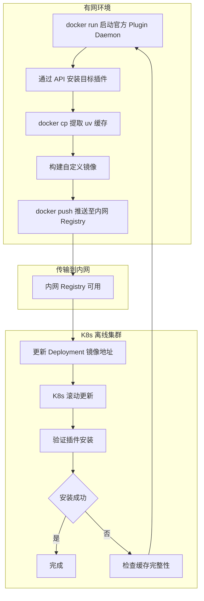
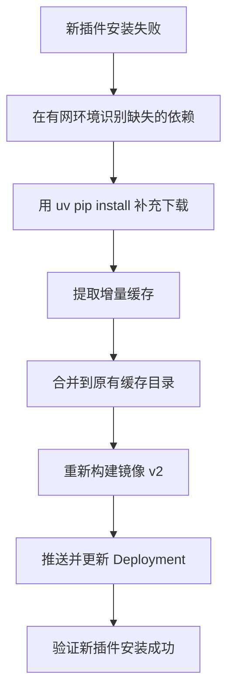

# Dify 离线安装插件：自定义镜像方案（K8s 环境）

> 本文介绍在 Kubernetes 离线环境中，通过构建自定义 Plugin Daemon 镜像预置 uv 缓存的方式，彻底解决 Dify 插件安装时无法访问 pypi.org 导致依赖安装失败的问题。此方案不需要额外部署 PyPI 镜像服务，不需要 PVC 挂载，是 K8s 离线环境中最简洁的解决方式。

---

## 一、问题背景

### 1.1 核心问题

Dify 的 Plugin Daemon 在安装插件时，内部使用 `uv` 工具为每个插件创建独立的 Python 虚拟环境，并从 PyPI（默认 `pypi.org`）下载运行时依赖。在完全离线（无外网）的 K8s 集群中，Plugin Daemon Pod 无法访问 `pypi.org`，导致安装失败：

```
failed to launch plugin: failed to install dependencies: exit status 2
DEBUG uv 0.9.26
TRACE Checking lock for /root/.cache/uv at /root/.cache/uv/.lock

error: Request failed after 3 retries
Caused by: Failed to fetch: https://pypi.org/simple/dify-plugin/
Caused by: operation timed out

failed to init environment
```

### 1.2 两层独立的网络依赖

Dify 插件系统存在两层完全独立的网络依赖，理解这一点是解决问题的前提：

| 层级 | 网络目标 | 控制变量 | 离线处理方式 |
|------|---------|---------|-------------|
| Dify API 层 | marketplace.dify.ai | MARKETPLACE_ENABLED | 设为 false 关闭 |
| Plugin Daemon 层 | pypi.org | PIP_MIRROR_URL | **本文解决的焦点** |

`MARKETPLACE_ENABLED=false` 只关闭 API 层对 Marketplace 的访问，对 Plugin Daemon 的依赖安装毫无影响。

### 1.3 解决思路

本文的核心思路是：在有网络的环境中让 `uv` 完成一次完整的依赖下载，将生成的缓存数据"烘焙"进自定义镜像，然后在离线 K8s 集群中使用这个自定义镜像。由于 `uv` 在安装依赖时会优先检查本地缓存，如果缓存中已有所有需要的包，就不会再向网络发起请求。

---

## 二、方案原理

### 2.1 uv 缓存机制

`uv` 工具使用 `/root/.cache/uv/` 目录存储下载的 Python 包缓存。当 `uv` 安装依赖时，执行流程如下：

1. 先检查本地缓存目录 `/root/.cache/uv/` 中是否已有需要的包
2. 如果缓存中存在匹配版本的包，直接使用，不发起网络请求
3. 如果缓存中没有，才向 `PIP_MIRROR_URL`（默认为 `https://pypi.org/simple/`）发起下载请求

利用这个机制，只要预先将所需的包缓存放入 `/root/.cache/uv/` 目录，Plugin Daemon 在离线环境中安装插件时就能直接使用缓存，完全不需要网络访问。

### 2.2 Plugin Daemon 容器内部结构

基于官方镜像 `langgenius/dify-plugin-daemon:0.6.1-local`，关键路径如下：

```
/root/.cache/uv/          ← uv 包缓存目录（本文的重点）
/app/storage/             ← 插件存储根目录
/app/storage/cwd/         ← 插件工作目录（每个插件一个子目录）
/app/storage/plugin/      ← 已安装插件目录
/app/storage/plugin_packages/  ← 插件包缓存
```

### 2.3 方案优势与适用场景

| 特性 | 说明 |
|------|------|
| 无需额外服务 | 不需要部署 pypiserver、devpi 等镜像服务 |
| 无需网络配置 | 不依赖 PIP_MIRROR_URL，不需要配置内网 DNS 或网络策略 |
| 无需 PVC 挂载 | 所有依赖内置在镜像中，Pod 无需额外存储卷 |
| K8s 原生友好 | 标准的镜像拉取方式，完全符合 K8s 部署范式 |
| 可版本控制 | 每次更新可以打不同的镜像 tag，便于回滚和审计 |

**适用场景**：
- K8s 集群中部署的 Dify，纯离线环境
- 需要安装的插件数量固定、种类明确
- 追求最简洁的部署方案，不想引入额外的基础设施
- 多套环境标准化部署（如交付给多个客户）

**不适用场景**：
- 需要频繁安装新插件或不确定要安装哪些插件
- 插件依赖经常变化、需要实时获取最新版本

---

## 三、完整操作流程

### 3.1 流程总览



### 3.2 环境准备

需要准备以下环境：

**有网机器**（可以是任意能访问外网的 Linux 机器，用于构建缓存和镜像）：
- Docker 已安装
- 能拉取 `langgenius/dify-plugin-daemon:0.6.1-local` 镜像

**内网 K8s 集群**：
- 已部署 Dify 各组件
- 有内网私有镜像仓库（Harbor、Registry 等）
- 能 `kubectl` 操作集群

---

## 四、第一步：在有网环境中生成 uv 缓存

### 4.1 方式一：通过运行官方镜像安装插件（推荐）

这是最可靠的方式，因为生成的缓存与 Plugin Daemon 实际运行环境完全一致。

**启动临时的 Plugin Daemon 容器**：

```bash
docker run -d \
    --name plugin-daemon-temp \
    -p 5002:5002 \
    -p 5003:5003 \
    langgenius/dify-plugin-daemon:0.6.1-local
```

此时容器内的 Plugin Daemon 服务已启动，但由于没有数据库等依赖，可能不会完全正常工作。不过这不影响我们使用 `uv` 工具来预下载依赖。

**更简单的方式：直接在容器内使用 uv 安装依赖**：

```bash
# 进入容器
docker exec -it plugin-daemon-temp bash

# 模拟安装 dify-plugin SDK 及所有依赖
# 使用与 Plugin Daemon 相同的 uv 工具
uv pip install --system dify-plugin

# 或者创建一个临时虚拟环境来触发下载
mkdir -p /tmp/test-env
uv venv /tmp/test-env/.venv
source /tmp/test-env/.venv/bin/activate
uv pip install dify-plugin

# 退出容器
exit
```

**提取缓存**：

```bash
# 将 uv 缓存从容器中拷贝出来
mkdir -p ~/custom-image-build/uv-cache
docker cp plugin-daemon-temp:/root/.cache/uv/ ~/custom-image-build/uv-cache/
```

### 4.2 方式二：使用 pip download + uv cache 构建

如果方式一不方便，可以在有网机器上直接用 `pip` 下载所有依赖包，然后转换为 uv 缓存格式。

**下载依赖包**：

```bash
# 创建下载目录
mkdir -p ~/dify-packages

# 下载 dify-plugin SDK 及所有传递依赖
pip download dify-plugin -d ~/dify-packages/

# 下载构建工具
pip download setuptools wheel -d ~/dify-packages/

# 检查下载结果
ls ~/dify-packages/ | wc -l
# 正常应该有几十个文件
```

**通过临时容器生成 uv 缓存**：

```bash
# 启动临时容器并挂载下载目录
docker run -d \
    --name plugin-daemon-temp \
    -v ~/dify-packages:/packages \
    langgenius/dify-plugin-daemon:0.6.1-local \
    sleep infinity

# 进入容器，使用 uv 从本地包目录安装
docker exec -it plugin-daemon-temp bash

# 创建临时环境并从本地包安装（这样 uv 会生成缓存）
mkdir -p /tmp/test-env
uv venv /tmp/test-env/.venv
source /tmp/test-env/.venv/bin/activate
uv pip install --no-index --find-links=/packages dify-plugin

exit

# 提取缓存
docker cp plugin-daemon-temp:/root/.cache/uv/ ~/custom-image-build/uv-cache/
```

### 4.3 方式三：直接针对特定插件生成缓存

如果明确知道要安装哪些插件，可以针对每个插件分别生成缓存。这种方式最精确，缓存中只包含实际需要的包。

```bash
# 在有网机器上启动临时容器
docker run -d \
    --name plugin-daemon-temp \
    langgenius/dify-plugin-daemon:0.6.1-local \
    sleep infinity

# 进入容器
docker exec -it plugin-daemon-temp bash

# 为每个目标插件创建虚拟环境并安装依赖
# 以 IoT 设备网关插件为例
mkdir -p /app/storage/cwd/your-name/iot_device_http-0.0.8
cd /app/storage/cwd/your-name/iot_device_http-0.0.8

# 创建虚拟环境
uv venv .venv
source .venv/bin/activate

# 安装 dify-plugin SDK（这一步会下载所有依赖并缓存）
uv pip install dify-plugin

# 如果插件有额外依赖，也一并安装
# uv pip install numpy pandas  # 根据插件实际需要

deactivate

# 重复上述步骤为其他插件生成缓存...

exit

# 提取完整的 uv 缓存
docker cp plugin-daemon-temp:/root/.cache/uv/ ~/custom-image-build/uv-cache/

# 清理临时容器
docker rm -f plugin-daemon-temp
```

### 4.4 验证缓存完整性

提取缓存后，建议验证关键依赖是否都在缓存中：

```bash
# 查看缓存目录结构
ls ~/custom-image-build/uv-cache/

# 搜索关键包是否在缓存中
find ~/custom-image-build/uv-cache/ -name "*dify*"
find ~/custom-image-build/uv-cache/ -name "*flask*"
find ~/custom-image-build/uv-cache/ -name "*httpx*"
find ~/custom-image-build/uv-cache/ -name "*pydantic*"
find ~/custom-image-build/uv-cache/ -name "*tiktoken*"
find ~/custom-image-build/uv-cache/ -name "*gevent*"

# 统计缓存中的包数量
find ~/custom-image-build/uv-cache/ -type f | wc -l
```

正常情况下，缓存中应该包含几十个包文件。如果关键包缺失，需要返回上一步重新生成缓存。

---

## 五、第二步：构建自定义镜像

### 5.1 编写 Dockerfile

在 `~/custom-image-build/` 目录下创建 Dockerfile：

```bash
cat > ~/custom-image-build/Dockerfile << 'EOF'
FROM langgenius/dify-plugin-daemon:0.6.1-local

# 将预生成的 uv 缓存复制到镜像中
COPY uv-cache/ /root/.cache/uv/

# 确保缓存目录权限正确
RUN chmod -R 755 /root/.cache/uv/

# 可选：标记自定义版本
LABEL maintainer="your-team"
LABEL description="Dify Plugin Daemon with pre-cached Python dependencies"
LABEL version="0.6.1-offline-v1"
EOF
```

### 5.2 构建镜像

```bash
cd ~/custom-image-build/

# 确认目录结构
# ~/custom-image-build/
#   ├── Dockerfile
#   └── uv-cache/
#       └── ... (缓存文件)

# 构建镜像
docker build -t dify-plugin-daemon-offline:v1 .

# 查看构建结果
docker images | grep dify-plugin-daemon-offline
```

### 5.3 本地验证（可选）

在构建机器上快速验证镜像是否可用：

```bash
# 启动验证容器
docker run -d --name verify-test dify-plugin-daemon-offline:v1 sleep 60

# 检查缓存是否存在
docker exec verify-test ls /root/.cache/uv/
docker exec verify-test find /root/.cache/uv/ -name "*dify*"

# 清理验证容器
docker rm -f verify-test
```

---

## 六、第三步：推送到内网私有镜像仓库

### 6.1 标记镜像

将镜像标记为内网私有 Registry 的地址：

```bash
# 格式：<registry地址>/<项目名>/<镜像名>:<标签>
# 以 Harbor 为例
docker tag dify-plugin-daemon-offline:v1 harbor.internal.com/dify/plugin-daemon:0.6.1-offline-v1

# 以通用 Registry 为例
docker tag dify-plugin-daemon-offline:v1 registry.internal.com/dify/plugin-daemon:0.6.1-offline-v1
```

### 6.2 推送镜像

```bash
# 先登录内网 Registry
docker login harbor.internal.com

# 推送
docker push harbor.internal.com/dify/plugin-daemon:0.6.1-offline-v1
```

### 6.3 离线环境镜像传输（无 Registry 场景）

如果内网没有私有 Registry，可以将镜像导出为文件后手动传输：

```bash
# 在有网机器上导出
docker save dify-plugin-daemon-offline:v1 -o dify-plugin-daemon-offline-v1.tar

# 传输到 K8s 节点（SCP 或 U 盘）
scp dify-plugin-daemon-offline-v1.tar user@k8s-node:/data/

# 在 K8s 节点上加载镜像
# containerd 环境（K8s 1.24+ 默认）
ctr -n k8s.io images import /data/dify-plugin-daemon-offline-v1.tar

# docker 环境
docker load -i /data/dify-plugin-daemon-offline-v1.tar
```

使用本地加载方式时，Deployment 中的 `image` 字段直接使用镜像名称（如 `dify-plugin-daemon-offline:v1`），并设置 `imagePullPolicy: Never` 或 `imagePullPolicy: IfNotPresent`。

---

## 七、第四步：更新 K8s Deployment

### 7.1 通过 KubeSphere 控制台修改

如果使用 KubeSphere 管理集群，操作步骤如下：

1. 登录 KubeSphere 控制台，进入 Dify 所在的项目/命名空间
2. 找到 Plugin Daemon 的 Deployment（名称通常为 `dify-plugin-daemon` 或 `plugin-daemon`）
3. 点击「编辑」进入配置界面
4. 修改容器镜像地址为自定义镜像：
   - 有 Registry：`harbor.internal.com/dify/plugin-daemon:0.6.1-offline-v1`
   - 本地加载：`dify-plugin-daemon-offline:v1`
5. 设置 `imagePullPolicy` 为 `IfNotPresent`
6. 保存后 KubeSphere 自动触发滚动更新

### 7.2 通过 kubectl 直接修改

```bash
# 方式一：直接编辑 Deployment
kubectl edit deployment dify-plugin-daemon -n dify
```

修改 `spec.template.spec.containers` 部分：

```yaml
spec:
  template:
    spec:
      containers:
      - name: dify-plugin-daemon
        image: harbor.internal.com/dify/plugin-daemon:0.6.1-offline-v1
        imagePullPolicy: IfNotPresent
```

```bash
# 方式二：使用 patch 命令（无需手动编辑）
kubectl patch deployment dify-plugin-daemon -n dify --type='json' \
    -p='[
        {"op":"replace","path":"/spec/template/spec/containers/0/image","value":"harbor.internal.com/dify/plugin-daemon:0.6.1-offline-v1"},
        {"op":"replace","path":"/spec/template/spec/containers/0/imagePullPolicy","value":"IfNotPresent"}
    ]'

# 方式三：如果镜像是本地加载的（无 Registry），需要设置 imagePullPolicy
kubectl patch deployment dify-plugin-daemon -n dify --type='json' \
    -p='[
        {"op":"replace","path":"/spec/template/spec/containers/0/image","value":"dify-plugin-daemon-offline:v1"},
        {"op":"replace","path":"/spec/template/spec/containers/0/imagePullPolicy","value":"IfNotPresent"}
    ]'
```

### 7.3 环境变量配置

虽然自定义镜像中已内置缓存，但仍建议配置以下环境变量确保万无一失：

```yaml
env:
# 离线环境关闭 Marketplace
- name: MARKETPLACE_ENABLED
  value: "false"

# 即使使用自定义镜像，也建议设置 PLUGIN_IGNORE_UV_LOCK
# 防止 uv.lock 中的源地址干扰
- name: PLUGIN_IGNORE_UV_LOCK
  value: "true"

# 可选：关闭签名验证（自编译插件场景）
- name: FORCE_VERIFYING_SIGNATURE
  value: "false"

# 可选：增加超时时间
- name: PLUGIN_PYTHON_ENV_INIT_TIMEOUT
  value: "300"
```

注意：使用自定义镜像方案时，`PIP_MIRROR_URL` **可以不设置**（留空即可），因为 uv 会优先使用本地缓存而不发起网络请求。但如果同时搭建了内网 PyPI 镜像作为兜底，也可以同时配置。

### 7.4 配置 imagePullSecrets（如需要）

如果内网 Registry 需要认证，确保 K8s 中已创建 imagePullSecret：

```bash
# 创建 Secret
kubectl create secret docker-registry harbor-secret \
    --namespace=dify \
    --docker-server=harbor.internal.com \
    --docker-username=admin \
    --docker-password=your-password
```

在 Deployment 中添加引用：

```yaml
spec:
  template:
    spec:
      imagePullSecrets:
      - name: harbor-secret
      containers:
      - name: dify-plugin-daemon
        image: harbor.internal.com/dify/plugin-daemon:0.6.1-offline-v1
```

### 7.5 验证滚动更新

```bash
# 查看更新状态
kubectl rollout status deployment/dify-plugin-daemon -n dify

# 确认新 Pod 已启动
kubectl get pods -n dify -l app=dify-plugin-daemon

# 查看 Pod 使用的镜像
kubectl get pods -n dify -l app=dify-plugin-daemon -o jsonpath='{.items[0].spec.containers[0].image}'
```

---

## 八、第五步：验证插件安装

### 8.1 确认 uv 缓存已就位

```bash
# 进入 Plugin Daemon Pod 检查缓存
POD=$(kubectl get pods -n dify -l app=dify-plugin-daemon -o jsonpath='{.items[0].metadata.name}')

# 检查 uv 缓存目录
kubectl exec -n dify $POD -- ls /root/.cache/uv/

# 检查关键包是否存在
kubectl exec -n dify $POD -- find /root/.cache/uv/ -name "*dify*"
kubectl exec -n dify $POD -- find /root/.cache/uv/ -name "*flask*"
```

### 8.2 确认环境变量

```bash
kubectl exec -n dify $POD -- sh -c "echo MARKETPLACE_ENABLED=\$MARKETPLACE_ENABLED"
kubectl exec -n dify $POD -- sh -c "echo PLUGIN_IGNORE_UV_LOCK=\$PLUGIN_IGNORE_UV_LOCK"
kubectl exec -n dify $POD -- sh -c "echo PIP_MIRROR_URL=\$PIP_MIRROR_URL"
```

### 8.3 尝试安装插件

通过 Dify 界面上传 `.difypkg` 文件进行安装。安装过程中实时观察 Plugin Daemon 日志：

```bash
kubectl logs -n dify $POD -f
```

成功的安装日志中应该不会出现 `Failed to fetch: https://pypi.org/simple/` 的错误，而是能看到 uv 使用本地缓存完成依赖安装。

### 8.4 检查插件运行状态

```bash
# 查看已安装插件的工作目录
kubectl exec -n dify $POD -- ls /app/storage/cwd/

# 查看插件的虚拟环境是否创建成功
kubectl exec -n dify $POD -- ls /app/storage/cwd/<插件路径>/.venv/
```

---

## 九、更新流程：新增插件依赖时

当需要安装新的 Dify 插件而缓存中缺少其依赖时，需要更新自定义镜像。

### 9.1 增量更新流程



### 9.2 具体操作步骤

**在有网机器上补充缺失依赖**：

```bash
# 启动临时容器（使用已有的自定义镜像作为基础）
docker run -d \
    --name plugin-daemon-update \
    dify-plugin-daemon-offline:v1 \
    sleep infinity

# 进入容器
docker exec -it plugin-daemon-update bash

# 为新插件安装依赖
mkdir -p /tmp/new-plugin-env
uv venv /tmp/new-plugin-env/.venv
source /tmp/new-plugin-env/.venv/bin/activate

# 安装新插件需要的额外依赖
uv pip install <新插件的额外依赖>

deactivate
exit

# 提取增量缓存（会与已有缓存合并）
docker cp plugin-daemon-update:/root/.cache/uv/ ~/custom-image-build/uv-cache/

# 清理
docker rm -f plugin-daemon-update
```

**重新构建并推送镜像**：

```bash
cd ~/custom-image-build/

# 重新构建（使用新的 tag）
docker build -t dify-plugin-daemon-offline:v2 .
docker tag dify-plugin-daemon-offline:v2 harbor.internal.com/dify/plugin-daemon:0.6.1-offline-v2
docker push harbor.internal.com/dify/plugin-daemon:0.6.1-offline-v2

# 更新 K8s Deployment
kubectl patch deployment dify-plugin-daemon -n dify --type='json' \
    -p='[{"op":"replace","path":"/spec/template/spec/containers/0/image","value":"harbor.internal.com/dify/plugin-daemon:0.6.1-offline-v2"}]'
```

### 9.3 版本管理建议

建议采用语义化的镜像标签，记录每次更新的内容：

```
0.6.1-offline-v1    # 初始版本，包含基础 SDK 依赖
0.6.1-offline-v2    # 新增 IoT 设备网关插件依赖
0.6.1-offline-v3    # 新增数据处理插件依赖
```

同时维护一个变更记录文件，记录每个版本新增了哪些插件的依赖：

```
v1: dify-plugin SDK 0.9.0 基础依赖
v2: + IoT 设备网关 (numpy, paho-mqtt)
v3: + 数据清洗插件 (pandas, openpyxl)
```

---

## 十、常见问题排查

### 10.1 uv 仍然尝试访问 pypi.org

**现象**：日志中仍出现 `Failed to fetch: https://pypi.org/simple/...`

**排查步骤**：

```bash
# 确认使用的是自定义镜像
kubectl get pods -n dify -l app=dify-plugin-daemon \
    -o jsonpath='{.items[0].spec.containers[0].image}'

# 确认缓存目录存在且不为空
kubectl exec -n dify $POD -- du -sh /root/.cache/uv/

# 确认关键包在缓存中
kubectl exec -n dify $POD -- find /root/.cache/uv/ -name "*dify-plugin*"
```

**可能原因**：
- 镜像构建时 COPY 路径不正确，缓存没有正确复制进去
- 缓存不完整，缺少某个传递依赖
- 缓存中的包版本与插件要求不匹配

### 10.2 缓存中的包版本不匹配

**现象**：uv 报错 `No matching distribution found for xxx==y.y.y`，但缓存中明明有 `xxx` 包。

**原因**：缓存中的包版本与插件 `pyproject.toml` 中声明的版本要求不一致。例如缓存中是 `pydantic-2.10.0`，但插件要求 `pydantic>=2.13.4`。

**解决方法**：在有网环境中明确安装指定版本范围的依赖：

```bash
# 查看插件要求的版本
# 在插件的 pyproject.toml 中查看 dependencies

# 重新安装指定版本
uv pip install "pydantic>=2.13.4" "Flask>=3.1.3" ...
```

### 10.3 镜像拉取失败（ImagePullBackOff）

**现象**：Pod 状态为 `ImagePullBackOff` 或 `ErrImagePull`

```bash
# 查看 Pod 事件
kubectl describe pod -n dify -l app=dify-plugin-daemon
```

**常见原因及解决方法**：

| 原因 | 解决方法 |
|------|---------|
| Registry 地址错误 | 检查 image 字段的 Registry 地址是否正确 |
| 认证失败 | 创建并配置 imagePullSecrets |
| 镜像不存在 | 确认镜像已成功推送到 Registry |
| 本地加载模式未设置 imagePullPolicy | 设为 `IfNotPresent` 或 `Never` |

### 10.4 缓存目录权限问题

**现象**：uv 报权限错误 `Permission denied`

**原因**：构建镜像时 COPY 的文件权限不正确。

**解决方法**：在 Dockerfile 中添加 `chmod` 命令：

```dockerfile
FROM langgenius/dify-plugin-daemon:0.6.1-local
COPY uv-cache/ /root/.cache/uv/
RUN chmod -R 755 /root/.cache/uv/
```

### 10.5 插件安装后无法正常运行

**现象**：安装成功但插件启动时报 `ModuleNotFoundError`

**原因**：缓存中可能缺少插件运行时的某个依赖（uv 安装依赖和运行时加载的模块可能不同）。

**解决方法**：在有网环境中完整运行一次插件，确保所有运行时依赖都被缓存：

```bash
docker exec -it plugin-daemon-update bash

# 完整模拟插件运行
cd /app/storage/cwd/<插件路径>
source .venv/bin/activate
python main.py  # 运行插件主程序，触发所有 import

deactivate
exit
```

---

## 十一、与其他方案的对比

| 对比项 | 自定义镜像（本文） | PyPI 镜像服务 | 预填充 uv 缓存（PVC） |
|--------|------------------|--------------|---------------------|
| 额外基础设施 | 无 | 需要部署 pypiserver | 需要 PVC 存储 |
| K8s 配置复杂度 | 低 | 中（需 Service + DNS） | 中（需 PVC + 节点调度） |
| 网络依赖 | 无 | 需内网 DNS 或 IP 可达 | 无 |
| 更新便捷性 | 需重建镜像 | 直接添加包文件 | 需更新 PVC 内容 |
| 适合多环境部署 | 非常适合 | 适合 | 一般 |
| 适合频繁更新 | 不适合 | 适合 | 一般 |
| 镜像大小 | 较大（含缓存） | 小 | 标准 |

**选择建议**：
- 安装少量固定插件、追求最简部署 → **自定义镜像**（本文方案）
- 需要频繁安装不同插件 → **PyPI 镜像服务**（pypiserver 方案）
- 两者结合使用效果最佳：自定义镜像提供基础缓存，PyPI 镜像服务兜底

---

## 十二、完整操作示例

以下是一次从构建到部署的完整操作记录：

### 12.1 在有网机器上操作

```bash
# 1. 启动临时容器
docker run -d --name pd-temp langgenius/dify-plugin-daemon:0.6.1-local sleep infinity

# 2. 进入容器安装依赖
docker exec -it pd-temp bash
uv venv /tmp/env
source /tmp/env/bin/activate
uv pip install dify-plugin
uv pip install numpy pandas  # 插件额外依赖
deactivate
exit

# 3. 提取缓存
mkdir -p ~/build/uv-cache
docker cp pd-temp:/root/.cache/uv/ ~/build/uv-cache/

# 4. 构建镜像
cat > ~/build/Dockerfile << 'EOF'
FROM langgenius/dify-plugin-daemon:0.6.1-local
COPY uv-cache/ /root/.cache/uv/
RUN chmod -R 755 /root/.cache/uv/
LABEL version="0.6.1-offline-v1"
EOF

cd ~/build
docker build -t dify-plugin-daemon-offline:v1 .

# 5. 推送到内网 Registry
docker tag dify-plugin-daemon-offline:v1 harbor.internal.com/dify/plugin-daemon:0.6.1-offline-v1
docker login harbor.internal.com
docker push harbor.internal.com/dify/plugin-daemon:0.6.1-offline-v1

# 6. 清理
docker rm -f pd-temp
```

### 12.2 在 K8s 集群中操作

```bash
# 1. 更新 Deployment
kubectl patch deployment dify-plugin-daemon -n dify --type='json' \
    -p='[
        {"op":"replace","path":"/spec/template/spec/containers/0/image","value":"harbor.internal.com/dify/plugin-daemon:0.6.1-offline-v1"},
        {"op":"replace","path":"/spec/template/spec/containers/0/imagePullPolicy","value":"IfNotPresent"}
    ]'

# 2. 等待滚动更新完成
kubectl rollout status deployment/dify-plugin-daemon -n dify

# 3. 验证
POD=$(kubectl get pods -n dify -l app=dify-plugin-daemon -o jsonpath='{.items[0].metadata.name}')
kubectl exec -n dify $POD -- find /root/.cache/uv/ -name "*dify*" | head -5
```

### 12.3 验证安装

通过 Dify 界面上传 `.difypkg` 文件安装插件，同时观察日志：

```bash
kubectl logs -n dify $POD -f | grep -E "(install|cache|uv|success|fail)"
```

---

## 十三、总结

### 核心要点

**方案本质**：在有网环境中让 `uv` 完成依赖下载生成缓存，将缓存烘焙进自定义 Plugin Daemon 镜像，离线 K8s 环境中 `uv` 直接使用缓存，无需网络访问。

**操作步骤**：有网环境生成缓存 → 构建自定义镜像 → 推送至内网 Registry → 更新 K8s Deployment → 验证安装。

**关键路径**：uv 缓存位于容器内的 `/root/.cache/uv/`，Dockerfile 中通过 `COPY uv-cache/ /root/.cache/uv/` 将缓存注入镜像。

**优势**：无需额外部署 PyPI 服务、无需 PVC 挂载、无需配置内网 DNS 和网络策略，是 K8s 离线环境中最简洁的方案。

**局限**：新增插件依赖时需要重新构建镜像。建议结合内网 PyPI 镜像服务使用：自定义镜像提供基础缓存，PyPI 镜像作为兜底，两者互补达到最佳效果。
