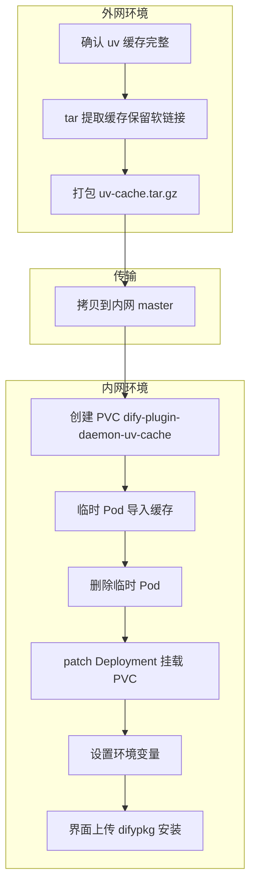
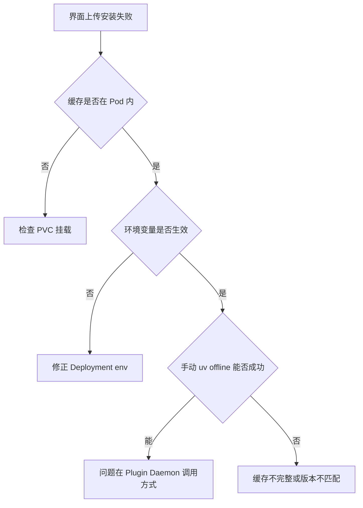
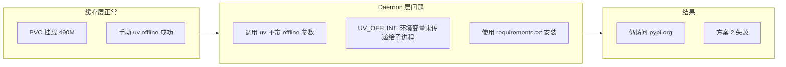

# Dify 离线安装插件：使用 uv 缓存挂载方案（K8s 环境）实践案例

> **文档性质**：本文是一次真实离线插件安装实践的完整流水账，记录从方案选型、操作步骤、验证过程到失败排查的全过程。  
> **实践结论**：在 Plugin Daemon `0.5.3-local` 环境下，仅通过 PVC 挂载 uv 缓存 + 上传 `.difypkg` 的方式**未能成功**完成离线安装；但手动 `uv pip install --offline` 可以成功，说明问题出在 Plugin Daemon 调用 uv 的方式，而非缓存本身。  
> **实践日期**：2026-06-05  
> **目标插件**：`iot_device_http.difypkg`（版本 0.0.8）  
> **环境**：外网 K8s 集群（源环境） + 内网离线 K8s 集群（目标环境）

---

## 一、实践背景与目标

### 1.1 我们要解决什么问题

在完全离线的内网 K8s 环境中部署了 Dify 之后，需要通过「本地插件」方式上传 `.difypkg` 文件安装自定义插件。安装过程中，Plugin Daemon 会使用 `uv` 为插件创建 Python 虚拟环境并下载依赖。离线环境下无法访问 `pypi.org`，典型报错如下：

```
failed to launch plugin: failed to install dependencies: exit status 2
DEBUG uv 0.9.26
TRACE Checking lock for /root/.cache/uv at /root/.cache/uv/.lock

error: Request failed after 3 retries
Caused by: Failed to fetch: https://pypi.org/simple/dify-plugin/
Caused by: operation timed out

failed to init environment
```

### 1.2 我们的初始设想

一开始，我们以为只需要：

1. 在外网 Dify 上安装好 `iot_device_http` 插件
2. 把 `iot_device_http.difypkg` 拷贝到内网
3. 在内网界面上传安装即可

**这个设想是错的。** `.difypkg` 只包含插件代码和依赖声明（`pyproject.toml`、`requirements.txt` 等），**不包含** Python 依赖包的实际 wheel 文件。内网安装时 Plugin Daemon 仍然要执行 `uv pip install`，仍然需要访问 PyPI 或本地缓存。

### 1.3 实践目标

本次实践的主题是：**方案 2 —— 将外网提取的 uv 缓存通过 PVC 挂载到内网 Plugin Daemon 的 `/root/.cache/uv/`，再配合环境变量，尝试在不重建镜像、不搭建 PyPI 镜像服务的前提下完成离线安装。**

参考的理论文档：`20260605-1430-dify离线安装插件-使用离线镜像-k8s环境.md`（自定义镜像烘焙缓存方案）。

---

## 二、环境信息

### 2.1 集群与组件

| 项目 | 外网环境 | 内网环境 |
|------|---------|---------|
| 访问方式 | 命令行直接操作 | 截图 OCR 识别（命令输出可能有乱码） |
| Plugin Daemon 镜像 | `ailpha-registry:5000/k8s/langgenius/dify-plugin-daemon:0.5.3-local` | 相同 |
| 存储类 | `local-path-provisioner` | 相同 |
| Plugin Daemon PVC | `dify-plugin-daemon`（5Gi，挂载 `/app/storage`） | 相同 |
| 插件数据库 | `dify_plugin_daemon`（HighGo/PostgreSQL） | 相同 |

### 2.2 Plugin Daemon 容器目录结构（实践中的发现）

进入 Pod 后，实际目录结构与文档描述略有差异：

```
/app/
├── cwd/                    ← 插件工作目录（含 .venv），不在 storage 下
├── storage/
│   ├── assets/
│   ├── plugin/             ← 已安装插件元数据
│   └── plugin_packages/    ← .difypkg 包缓存
├── entrypoint.sh
└── main
```

**重要发现**：`cwd` 在 `/app/cwd/`，而不是 `/app/storage/cwd/`。排查目录时一定要分开看。

### 2.3 目标插件信息

- 插件 ID：`your-name/iot_device_http`
- 版本：`0.0.8`
- 唯一标识符：`your-name/iot_device_http:0.0.8@421ed98c267c2de09148aba2dde876efa589f9cd4f1aec508f3d61cf1334f839`
- 外网已成功安装，`.venv` 完整

---

## 三、方案选型过程（含疑问与讨论）

在动手之前，我们经历了以下方案讨论：

### 3.1 方案对比

| 方案 | 做法 | 是否需要改镜像 | 是否需要数据库 | 我们的评价 |
|------|------|--------------|--------------|-----------|
| 方案 1 | 内网搭建 PyPI 镜像 + `PIP_MIRROR_URL` | 否 | 否 | 可行，但要额外基础设施 |
| 方案 2 | PVC 挂载 uv 缓存 + 上传 `.difypkg` | 否 | 否 | **本次实践主题** |
| 方案 3 | 迁移外网已装好的插件目录 + 数据库记录 | 否 | 是（`dify_plugin_daemon`） | 复杂但可跳过 uv 安装 |
| 自定义镜像 | 将 uv 缓存烘焙进 Plugin Daemon 镜像 | 是 | 否 | 本质与方案 2 相同，仍可能失败 |

### 3.2 我们的疑问：为什么要导出数据库？

在讨论方案 3 时，我们问：**「直接迁移已装好的插件，还需要数据库吗？」**

结论：

- **Plugin Daemon 文件**（`cwd`、`.venv`、`plugin`、`plugin_packages`）是插件运行的实体
- **`dify_plugin_daemon` 数据库**记录「哪个 tenant 安装了哪个插件」
- Dify 界面的「已安装插件列表」是 API 查询 Plugin Daemon 数据库得到的，**不是扫目录**

因此：

| 场景 | 是否需要迁数据库 |
|------|----------------|
| 场景 A：内网全新环境，只想装上插件能用 | 需要 `dify_plugin_daemon` 记录 |
| 场景 B：外网工作流整体迁移 | 还需要 Dify 主库 |
| 只拷 `.difypkg` 或只拷文件 | 界面看不到或状态异常 |

最终我们选择了**方案 2**，原因是：不想改 Plugin Daemon 镜像，不想动数据库，希望走正常的「界面上传安装」流程。

### 3.3 关于自定义镜像的疑问

在提取缓存并编写 Dockerfile 时，我们提出疑问：

> 「我原计划以为是只打包插件即可，现在看起来是把整个插件服务打包成镜像了，这不是我想要的。」

解答：自定义镜像方案改变的是 **Plugin Daemon 服务镜像**（在镜像里预置 `/root/.cache/uv/`），不是只打包 `.difypkg`。`.difypkg` 无论哪种方案都需要上传，它解决不了 PyPI 依赖问题。

我们后来放弃了自定义镜像路线，改为 PVC 挂载缓存（方案 2），已提取的缓存可以复用。

---

## 四、实践流水账：第一阶段 —— 外网环境探查

### 4.1 早期的错误探查（踩坑记录）

在确认 `cwd` 位置之前，我们走过一些弯路，值得记录。

**弯路一：在 `storage` 下找 `cwd`**

```bash
kubectl exec -n dify dify-plugin-daemon-78586549bc-k5kzn -- ls /app/storage
```

**输出**：

```
assets
plugin
plugin_packages
```

没有 `cwd` 目录，当时以为插件工作目录不存在。

**弯路二：在 `plugin_packages` 下找 `.venv`**

```bash
kubectl exec -n dify dify-plugin-daemon-78586549bc-k5kzn -- \
  ls /app/storage/plugin_packages/your-name/iot_device_http:0.0.8@421ed98c.../.venv/ | head -5
```

**输出**：

```
ls: cannot access '/app/storage/plugin_packages/your-name/iot_device_http:0.0.8@.../.venv/': Not a directory
command terminated with exit code 2
```

**原因**：`plugin_packages` 存的是 `.difypkg` 二进制文件本身（文件名即包标识符），不是目录，更没有 `.venv`。

**弯路三：未设置 `$POD` 变量**

```bash
kubectl exec -n dify $POD -- ls /app/cwd/your-name/iot_device_http-0.0.8@.../.venv/ | head -5
```

**输出**：

```
error: pod, type/name or --filename must be specified
```

**原因**：Shell 中 `$POD` 未赋值。应直接使用完整 Pod 名。

### 4.2 进入 Plugin Daemon Pod 查看目录

**操作**：在外网 master1 的 Pod 中查看。

```bash
kubectl exec -it -n dify dify-plugin-daemon-78586549bc-k5kzn -- bash
```

```bash
root@dify-plugin-daemon-78586549bc-k5kzn:/app# ls
cwd  entrypoint.sh  main  storage
```

```bash
root@dify-plugin-daemon-78586549bc-k5kzn:/app# ls storage/
assets  plugin  plugin_packages
```

```bash
root@dify-plugin-daemon-78586549bc-k5kzn:/app# ls storage/plugin/your-name/
iot_device_http:0.0.8@421ed98c267c2de09148aba2dde876efa589f9cd4f1aec508f3d61cf1334f839
iot_device_plugin:0.0.1@a9de257bb928d8bff90d291c6a2b05f8c13285f3c88d480b073deeb588230c1c
```

```bash
root@dify-plugin-daemon-78586549bc-k5kzn:/app# ls storage/plugin_packages/your-name/
iot_device_http:0.0.1@04bd25ef68fad7a51618e3b6faa47eb1e0cfd78260e503b1b017c1e98446a97e
iot_device_http:0.0.1@e3efdce5ad3a3a0bcc1cea5ac577f5270c043783b65287f9b4dac6dddf78db6e
iot_device_http:0.0.1@ebf96b10ec65154b87e34cde95f38dcbe640ad8dafe8f8a04786739e5236ce49
iot_device_http:0.0.3@a79fb4ffe193f646330cb43b4c554961fa90ea9ab81505f277aaed16c9badd56
iot_device_http:0.0.4@a1a63229d06b6f9ca4f81b29f005ede865d32513548778bf33ed263b216bd9f9
iot_device_http:0.0.7@e931cda1ffc4ccac00e29e8309ad8f0c6a2d613599ce298865157a14946c023f
iot_device_http:0.0.8@421ed98c267c2de09148aba2dde876efa589f9cd4f1aec508f3d61cf1334f839
iot_device_plugin:0.0.1@a9de257bb928d8bff90d291c6a2b05f8c13285f3c88d480b073deeb588230c1c
```

**分析**：`plugin_packages` 里存的是历史上传过的各版本 `.difypkg` 文件；`plugin` 里是已安装记录；真正运行依赖在 `cwd` 里。

### 4.3 查看 uv 缓存是否完整

```bash
kubectl exec -n dify dify-plugin-daemon-78586549bc-k5kzn -- sh -c \
  'find /root/.cache/uv/ -type f | wc -l; du -sh /root/.cache/uv/; find /root/.cache/uv/ -name "*dify*" | head -3'
```

**输出**：

```
28732
490M    /root/.cache/uv/
/root/.cache/uv/archive-v0/fd6sIWaKGFwrp-8NE1cvl/dify_plugin
/root/.cache/uv/archive-v0/fd6sIWaKGFwrp-8NE1cvl/dify_plugin-0.7.1.dist-info
/root/.cache/uv/archive-v0/esOwOn7WMCe4OIb_NxSRa/dify_plugin-0.7.4.dist-info
```

**结论**：外网 Pod 的 uv 缓存非常完整（28732 个文件，490M），包含多个版本的 `dify_plugin`，可以直接提取用于内网。

### 4.4 确认插件 .venv 已完整安装

```bash
kubectl exec -n dify dify-plugin-daemon-78586549bc-k5kzn -- ls /app/cwd/your-name/
```

**输出**：

```
iot_device_http-0.0.1@04bd25ef68fad7a51618e3b6faa47eb1e0cfd78260e503b1b017c1e98446a97e
iot_device_http-0.0.1@e3efdce5ad3a3a0bcc1cea5ac577f5270c043783b65287f9b4dac6dddf78db6e
iot_device_http-0.0.1@ebf96b10ec65154b87e34cde95f38dcbe640ad8dafe8f8a04786739e5236ce49
iot_device_http-0.0.3@a79fb4ffe193f646330cb43b4c554961fa90ea9ab81505f277aaed16c9badd56
iot_device_http-0.0.4@a1a63229d06b6f9ca4f81b29f005ede865d32513548778bf33ed263b216bd9f9
iot_device_http-0.0.7@e931cda1ffc4ccac00e29e8309ad8f0c6a2d613599ce298865157a14946c023f
iot_device_http-0.0.8@421ed98c267c2de09148aba2dde876efa589f9cd4f1aec508f3d61cf1334f839
iot_device_plugin-0.0.1@a9de257bb928d8bff90d291c6a2b05f8c13285f3c88d480b073deeb588230c1c
```

```bash
kubectl exec -n dify dify-plugin-daemon-78586549bc-k5kzn -- \
  ls /app/cwd/your-name/iot_device_http-0.0.8@421ed98c267c2de09148aba2dde876efa589f9cd4f1aec508f3d61cf1334f839/.venv/ | head -5
```

**输出**：

```
CACHEDIR.TAG
bin
dify
include
lib
```

**结论**：外网插件已完整安装，`.venv` 存在。若方案 2 失败，方案 3（迁移已装插件）具备条件。

---

## 五、实践流水账：第二阶段 —— 提取 uv 缓存

### 5.1 第一次提取：kubectl cp（失败 —— 软链接丢失）

```bash
mkdir -p ~/custom-image-build/uv-cache

kubectl cp dify/dify-plugin-daemon-78586549bc-k5kzn:/root/.cache/uv/ ~/custom-image-build/uv-cache/
```

**输出（节选）**：

```
tar: Removing leading `/' from member names
tar: Removing leading `/' from hard link targets
warning: skipping symlink: "/root/custom-image-build/uv-cache/wheels-v5/pypi/annotated-types/0.7.0-py3-none-any" -> "/root/.cache/uv/archive-v0/EGG_qPCeZXK5sQTfT5qtT" (consider using "kubectl exec -n "dify" "dify-plugin-daemon-78586549bc-k5kzn" -- tar cf - "/root/.cache/uv" | tar xf -")
warning: skipping symlink: "/root/custom-image-build/uv-cache/wheels-v5/pypi/anyio/4.12.1-py3-none-any" -> "/root/.cache/uv/archive-v0/c2AXvRlqK7YL4bStSrMny"
...（大量 skipping symlink 警告）
```

```bash
du -sh ~/custom-image-build/uv-cache/
find ~/custom-image-build/uv-cache/ -type f | wc -l
```

**输出**：

```
495M    /root/custom-image-build/uv-cache/
28732
```

**问题现象**：文件数量和大小看起来正常，但 `wheels-v5` 下的软链接全部被跳过。uv 缓存结构中 `wheels-v5` 通过软链接指向 `archive-v0`，**缺少软链接会导致离线安装时 uv 无法正确定位 wheel 包**。

### 5.2 第二次提取：tar 管道（成功 —— 保留软链接）

```bash
rm -rf ~/custom-image-build/uv-cache

mkdir -p ~/custom-image-build

kubectl exec -n dify dify-plugin-daemon-78586549bc-k5kzn -- tar cf - -C /root/.cache uv | tar xf - -C ~/custom-image-build/
```

**验证**：

```bash
find ~/custom-image-build/uv -type l | wc -l
du -sh ~/custom-image-build/uv/
```

**输出**：

```
109
495M    /root/custom-image-build/uv/
```

**结论**：109 个软链接已保留，缓存可安全传输。

### 5.3 打包传输

```bash
cd ~/custom-image-build
tar czf uv-cache.tar.gz uv/
ls -lh uv-cache.tar.gz
```

**输出**：

```
-rw-r--r-- 1 root root 92M  6月  5 15:59 uv-cache.tar.gz
```

压缩后 92M，通过 U 盘/SCP 等方式传输到内网 `~/custom-image-build/uv-cache.tar.gz`。

---

## 六、实践流水账：第三阶段 —— 曾尝试自定义镜像（后放弃）

在切换到方案 2 之前，我们曾按自定义镜像方案编写 Dockerfile。

### 6.1 确认基础镜像版本

```bash
kubectl get pod -n dify dify-plugin-daemon-78586549bc-k5kzn \
  -o jsonpath='{.spec.containers[0].image}{"\n"}'
```

**输出**：

```
ailpha-registry:5000/k8s/langgenius/dify-plugin-daemon:0.5.3-local
```

### 6.2 第一次 Dockerfile（错误 —— 版本不匹配）

```bash
cat > ~/custom-image-build/Dockerfile << 'EOF'
FROM langgenius/dify-plugin-daemon:0.6.1-local
COPY uv/ /root/.cache/uv/
RUN chmod -R 755 /root/.cache/uv/
LABEL version="0.6.1-offline-iot-v1"
EOF
```

**问题**：`FROM` 写成了 `0.6.1-local`，与实际运行的 `0.5.3-local` 不一致，构建出的镜像可能与集群不兼容。

### 6.3 修正后的 Dockerfile（未实际 build）

```bash
cat > ~/custom-image-build/Dockerfile << 'EOF'
FROM ailpha-registry:5000/k8s/langgenius/dify-plugin-daemon:0.5.3-local
COPY uv/ /root/.cache/uv/
RUN chmod -R 755 /root/.cache/uv/
LABEL version="0.5.3-offline-iot-v1"
EOF
```

由于用户不希望替换整个 Plugin Daemon 服务镜像，此路线在 `docker build` 之前即放弃，已提取的缓存转而用于方案 2 的 PVC 挂载。

---

## 七、实践流水账：第四阶段 —— 方案 3 预研（导出插件文件与数据库）

在最终选择方案 2 之前，我们对方案 3 做了部分预研，这部分操作虽未完成迁移，但对理解系统很有帮助。

### 7.1 导出插件三个关键目录

```bash
mkdir -p ~/plugin-migrate

kubectl exec -n dify dify-plugin-daemon-78586549bc-k5kzn -- tar cf - \
  -C /app \
  cwd/your-name/iot_device_http-0.0.8@421ed98c267c2de09148aba2dde876efa589f9cd4f1aec508f3d61cf1334f839 \
  storage/plugin/your-name/iot_device_http:0.0.8@421ed98c267c2de09148aba2dde876efa589f9cd4f1aec508f3d61cf1334f839 \
  storage/plugin_packages/your-name/iot_device_http:0.0.8@421ed98c267c2de09148aba2dde876efa589f9cd4f1aec508f3d61cf1334f839 \
  | tar xf - -C ~/plugin-migrate/
```

**验证**：

```bash
du -sh ~/plugin-migrate/cwd/your-name/iot_device_http-0.0.8@421ed98c267c2de09148aba2dde876efa589f9cd4f1aec508f3d61cf1334f839/
ls ~/plugin-migrate/cwd/your-name/iot_device_http-0.0.8@421ed98c267c2de09148aba2dde876efa589f9cd4f1aec508f3d61cf1334f839/.venv/ | head -3
ls ~/plugin-migrate/storage/plugin/your-name/
ls ~/plugin-migrate/storage/plugin_packages/your-name/
```

**输出**：

```
55M     /root/plugin-migrate/cwd/your-name/iot_device_http-0.0.8@421ed98c267c2de09148aba2dde876efa589f9cd4f1aec508f3d61cf1334f839/
bin
CACHEDIR.TAG
dify
iot_device_http:0.0.8@421ed98c267c2de09148aba2dde876efa589f9cd4f1aec508f3d61cf1334f839
iot_device_http:0.0.8@421ed98c267c2de09148aba2dde876efa589f9cd4f1aec508f3d61cf1334f839
```

### 7.2 探查 dify_plugin_daemon 数据库

数据库不在 `dify` 命名空间，而在 `highgo` 命名空间：

```bash
kubectl get pods -n dify | grep -E 'postgres|mysql|db'
# 无数据库 Pod

kubectl get pods -n highgo
```

HighGo Pod：`highgo-highgo-hs4q-0`

**第一次连接数据库（命令写错）**：

```bash
kubectl exec -n highgo highgo-highgo-hs4q-0 -- psql -U dbapp -d dify_plugin -P X1PnlIKmNYXeOcNi -c "\dt"
```

**输出**：

```
psql: error: \pset: unknown option: X1PnlIKmNYXeOcNi
psql: fatal: could not set printing parameter "X1PnlIKmNYXeOcNi"
```

**原因**：`-P` 不是密码参数，密码应通过 `PGPASSWORD` 环境变量传入。另外数据库名实际是 `dify_plugin_daemon`，不是 `dify_plugin`。

**正确命令**：

```bash
kubectl exec -n highgo highgo-highgo-hs4q-0 -c database -- bash -c \
  'PGPASSWORD="X1PnlIKmNYXeOcNi" psql -U dbapp -d dify_plugin_daemon -c "\dt"'
```

**输出**：

```
                   List of relations
 Schema |             Name             | Type  | Owner
--------+------------------------------+-------+--------
 public | agent_strategy_installations | table | dbapp
 public | ai_model_installations       | table | dbapp
 public | datasource_installations     | table | dbapp
 public | endpoints                    | table | dbapp
 public | install_tasks                | table | dbapp
 public | plugin_declarations          | table | dbapp
 public | plugin_installations         | table | dbapp
 public | plugin_readme_records        | table | dbapp
 public | plugins                      | table | dbapp
 public | serverless_runtimes          | table | dbapp
 public | tenant_storages              | table | dbapp
 public | tool_installations           | table | dbapp
 public | trigger_installations        | table | dbapp
```

### 7.3 查询插件安装记录

```bash
kubectl exec -n highgo highgo-highgo-hs4q-0 -c database -- bash -c \
  'PGPASSWORD="X1PnlIKmNYXeOcNi" psql -U dbapp -d dify_plugin_daemon -c \
  "SELECT id, tenant_id, plugin_id, plugin_unique_identifier, source, created_at \
   FROM plugin_installations \
   WHERE plugin_id LIKE '\''%iot_device_http%'\'' \
      OR plugin_unique_identifier LIKE '\''%iot_device_http%'\'';"'
```

**输出**：

```
                  id                  |              tenant_id               |         plugin_id         |                                     plugin_unique_identifier                                     | source  |          created_at
--------------------------------------+--------------------------------------+---------------------------+--------------------------------------------------------------------------------------------------+---------+-------------------------------
 019e9648-e6a2-7d03-be7e-82cf3bcc6b3e | 6aa18048-84ec-41f5-b062-a39c975b8841 | your-name/iot_device_http | your-name/iot_device_http:0.0.8@421ed98c267c2de09148aba2dde876efa589f9cd4f1aec508f3d61cf1334f839 | package | 2026-06-05 05:37:00.578856+00
(1 row)
```

外网 `tenant_id`：`6aa18048-84ec-41f5-b062-a39c975b8841`。内网是新环境，`tenant_id` 不同，若走方案 3 需要替换。

### 7.4 关联表探查（部分失败）

尝试统计关联表记录数时，`install_tasks` 表没有 `plugin_unique_identifier` 字段导致整段 SQL 失败：

```
ERROR:  column "plugin_unique_identifier" does not exist
LINE 6: ..._tasks' AS tbl, count(*) FROM install_tasks WHERE plugin_uni...
```

`install_tasks` 表结构：

```
                         Table "public.install_tasks"
      Column       |           Type           | Collation | Nullable | Default
-------------------+--------------------------+-----------+----------+---------
 id                | uuid                     |           | not null |
 created_at        | timestamp with time zone |           |          |
 updated_at        | timestamp with time zone |           |          |
 status            | text                     |           | not null |
 tenant_id         | uuid                     |           | not null |
 total_plugins     | bigint                   |           | not null |
 completed_plugins | bigint                   |           | not null |
 plugins           | text                     |           |          |
```

**结论**：方案 3 至少需要迁移 `plugin_installations` 记录，以及 `plugins`、`plugin_declarations`、`tool_installations` 等关联表（若存在对应记录）。本次实践未继续方案 3，转向方案 2。

---

## 八、内外网协作说明

本次实践涉及两套 K8s 集群：

| 角色 | 操作方式 | 说明 |
|------|---------|------|
| 外网 master1 | 命令行直接复制粘贴 | 提取缓存、导出插件文件、查数据库 |
| 内网 master | 截图 OCR 识别后发回 | 命令输出可能有乱码，但安装方式与外网基本相同 |

内网 Deployment 初始配置与外网一致：

```yaml
volumeMounts:
- mountPath: /app/storage
  name: app-data
volumes:
- name: app-data
  persistentVolumeClaim:
    claimName: dify-plugin-daemon
```

内网 Plugin Daemon 初始状态**没有**挂载 `/root/.cache/uv`，这是方案 2 需要新增的配置。

---

## 九、实践流水账：第五阶段 —— 内网挂载 uv 缓存（方案 2 实施）

### 8.1 整体流程



### 8.2 内网确认文件与存储类

```bash
ls -lh ~/custom-image-build/uv-cache.tar.gz
```

```
-rw-r--r-- 1 root root 92M  6月  5 16:03 uv-cache.tar.gz
```

```bash
kubectl get pvc -n dify dify-plugin-daemon
```

```
NAME                 STATUS   VOLUME                                     CAPACITY   ACCESS MODES   STORAGECLASS             AGE
dify-plugin-daemon   Bound    pvc-dc75cee4-e2f7-40bd-84db-bcf0f204ecd3   5Gi        RWO            local-path-provisioner   14d
```

```bash
kubectl get pvc -n dify dify-plugin-daemon \
  -o jsonpath='{.spec.storageClassName}{"\n"}{.spec.accessModes}{"\n"}{.status.capacity.storage}{"\n"}'
```

```
local-path-provisioner
["ReadWriteOnce"]
5Gi
```

### 8.3 创建 uv 缓存专用 PVC

```bash
cat > /tmp/dify-plugin-daemon-uv-cache-pvc.yaml << 'EOF'
apiVersion: v1
kind: PersistentVolumeClaim
metadata:
  name: dify-plugin-daemon-uv-cache
  namespace: dify
spec:
  accessModes:
    - ReadWriteOnce
  storageClassName: local-path-provisioner
  resources:
    requests:
      storage: 1Gi
EOF

kubectl apply -f /tmp/dify-plugin-daemon-uv-cache-pvc.yaml
```

**初次状态**：

```
NAME                          STATUS    STORAGECLASS             AGE
dify-plugin-daemon-uv-cache   Pending   local-path-provisioner   6s
```

**说明**：`local-path-provisioner` 采用 WaitForFirstConsumer 策略，PVC 在有 Pod 挂载前保持 Pending 是正常现象。

### 8.4 创建临时导入 Pod

```bash
cat > /tmp/uv-cache-loader.yaml << 'EOF'
apiVersion: v1
kind: Pod
metadata:
  name: uv-cache-loader
  namespace: dify
spec:
  containers:
  - name: loader
    image: ailpha-registry:5000/k8s/langgenius/dify-plugin-daemon:0.5.3-local
    command: ["sleep", "3600"]
    volumeMounts:
    - name: uv-cache
      mountPath: /cache
  volumes:
  - name: uv-cache
    persistentVolumeClaim:
      claimName: dify-plugin-daemon-uv-cache
  restartPolicy: Never
EOF

kubectl apply -f /tmp/uv-cache-loader.yaml
```

**Pod 和 PVC 状态**：

```
uv-cache-loader               0/1     Pending   ...   # 短暂 Pending
dify-plugin-daemon-uv-cache   Pending               # 随后变为 Bound
```

`kubectl describe pod` 显示 Pod 调度到 `master1` 节点，镜像已存在本地，容器启动成功。PVC 事件：

```
WaitForFirstConsumer  -->  Provisioning  -->  ProvisioningSucceeded
volume pvc-01625a95-8260-485a-a0f7-25c10c2cb1ce successfully provisioned
```

### 8.5 导入缓存到 PVC

```bash
kubectl cp ~/custom-image-build/uv-cache.tar.gz dify/uv-cache-loader:/tmp/uv-cache.tar.gz

kubectl exec -n dify uv-cache-loader -- tar xzf /tmp/uv-cache.tar.gz -C /cache --strip-components=1
```

> 注意 `--strip-components=1`：压缩包内顶层目录是 `uv/`，解压后需要让 `archive-v0`、`wheels-v5` 等直接位于 PVC 根目录（对应 Plugin Daemon 的 `/root/.cache/uv/`）。

**验证**：

```bash
kubectl exec -n dify uv-cache-loader -- sh -c \
  'ls /cache | head -5; find /cache -type l | wc -l; du -sh /cache'
```

**输出**：

```
CACHEDIR.TAG
archive-v0
interpreter-v4
sdists-v9
simple-v18
109
490M    /cache
```

缓存导入成功。

### 8.6 挂载 PVC 到 Plugin Daemon

**先删除临时 Pod**（RWO 卷同一时刻只能被一个 Pod 挂载）：

```bash
kubectl delete pod -n dify uv-cache-loader
```

**patch Deployment**：

```bash
kubectl patch deployment dify-plugin-daemon -n dify --type='json' -p='[
  {"op":"add","path":"/spec/template/spec/volumes/-","value":{"name":"uv-cache","persistentVolumeClaim":{"claimName":"dify-plugin-daemon-uv-cache"}}},
  {"op":"add","path":"/spec/template/spec/containers/0/volumeMounts/-","value":{"name":"uv-cache","mountPath":"/root/.cache/uv"}}
]'
```

**输出**：

```
deployment.apps/dify-plugin-daemon patched
```

```bash
kubectl rollout status deployment/dify-plugin-daemon -n dify
```

```
deployment "dify-plugin-daemon" successfully rolled out
```

**验证缓存挂载**（注意：本集群 Pod 没有 `app=dify-plugin-daemon` 标签，不能用该 selector）：

```bash
kubectl get pods -n dify | grep plugin
# dify-plugin-daemon-5bcdc66957-km7d4   1/1   Running

kubectl exec -n dify dify-plugin-daemon-5bcdc66957-km7d4 -- sh -c \
  'ls /root/.cache/uv | head -5; find /root/.cache/uv -type l | wc -l; du -sh /root/.cache/uv'
```

**输出**：

```
CACHEDIR.TAG
archive-v0
interpreter-v4
sdists-v9
simple-v18
109
490M    /root/.cache/uv
```

**结论**：PVC 挂载方案 2 的基础设施搭建完成，缓存已就位。

---

## 十、实践流水账：第六阶段 —— 第一次安装尝试与失败

### 9.1 设置 PLUGIN_IGNORE_UV_LOCK 环境变量

```bash
kubectl set env deployment/dify-plugin-daemon -n dify PLUGIN_IGNORE_UV_LOCK=true
kubectl rollout status deployment/dify-plugin-daemon -n dify
```

### 9.2 验证环境变量（踩坑：查了旧 Pod）

```bash
kubectl exec -n dify dify-plugin-daemon-78586549bc-k5kzn -- sh -c \
  'echo PLUGIN_IGNORE_UV_LOCK=$PLUGIN_IGNORE_UV_LOCK'
```

**输出**：

```
PLUGIN_IGNORE_UV_LOCK=
```

**问题现象**：值为空。原因是设置环境变量后 Pod 已重建，但我们 exec 进了**旧 Pod 名称**。

新 Pod 确认后（`dify-plugin-daemon-58895fd568-5tmpc`）：

```bash
kubectl get deployment dify-plugin-daemon -n dify -o yaml | grep -A2 PLUGIN_IGNORE_UV_LOCK
```

```
    - name: PLUGIN_IGNORE_UV_LOCK
      value: "true"
```

```bash
kubectl exec -n dify dify-plugin-daemon-58895fd568-5tmpc -- env | grep PLUGIN_IGNORE_UV_LOCK
```

```
PLUGIN_IGNORE_UV_LOCK=true
```

```bash
kubectl exec -n dify dify-plugin-daemon-58895fd568-5tmpc -- \
  find /root/.cache/uv -name "*dify-plugin*" | head -5
```

```
/root/.cache/uv/wheels-v5/pypi/dify-plugin
/root/.cache/uv/simple-v18/pypi/dify-plugin.rkyv
```

环境变量和缓存均已就位。

### 9.3 界面上传安装 —— 第一次失败

在 Dify 界面通过「本地插件」上传 `iot_device_http.difypkg` 并安装。

**界面报错**：

```
1个插件安装失败
IoT设备通用网关
failed to launch plugin: failed to install dependencies: failed to install dependencies: exit status 2
```

**Plugin Daemon 日志关键片段**：

```
DEBUG uv 0.9.26
TRACE Checking lock for /root/.cache/uv at /root/.cache/uv/.lock
DEBUG Acquired shared lock for /root/.cache/uv
DEBUG Searching for default Python interpreter in virtual environments
TRACE Querying interpreter executable at /app/cwd/your-name/iot_device_http-0.0.8@421ed98c.../.venv/bin/python3
DEBUG Found cpython-3.12.3-linux-x86_64-gnu

TRACE Error trace:
Request failed after 3 retries
Caused by:
  0: Failed to fetch: https://pypi.org/simple/dify-plugin/
  1: error sending request for url (https://pypi.org/simple/dify-plugin/)
  2: operation timed out

error: Request failed after 3 retries
Caused by: Failed to fetch: https://pypi.org/simple/dify-plugin/
Caused by: operation timed out

failed to init environment
```

**问题现象**：尽管 `/root/.cache/uv/` 已有 490M 缓存且包含 `dify-plugin` 的 wheel 和 simple 索引缓存，Plugin Daemon 安装时 uv 仍然访问 `pypi.org`。

---

## 十一、排查过程：手动验证 uv 离线能力

### 10.1 排查思路



### 10.2 手动离线安装测试（关键转折点）

在 Plugin Daemon Pod 内手动执行：

```bash
kubectl exec -n dify dify-plugin-daemon-58895fd568-5tmpc -- bash -c '
rm -rf /tmp/uv-offline-test
mkdir -p /tmp/uv-offline-test
cd /tmp/uv-offline-test
uv venv .venv
source .venv/bin/activate
uv pip install dify-plugin --offline
'
```

**完整输出**：

```
Using CPython 3.12.3 interpreter at: /usr/bin/python3
Creating virtual environment at: .venv
Activate with: source .venv/bin/activate
Resolved 37 packages in 147ms
warning: Failed to hardlink files; falling back to full copy. This may lead to degraded performance.
         If the cache and target directories are on different filesystems, hardlinking may not be supported.
         If this is intentional, set `export UV_LINK_MODE=copy` or use `--link-mode=copy` to suppress this warning.
Installed 37 packages in 122ms
 + annotated-types==0.7.0
 + anyio==4.13.0
 + blinker==1.9.0
 + certifi==2026.5.20
 + charset-normalizer==3.4.7
 + click==8.4.1
 + dify-plugin==0.9.0
 + dpkt==1.9.8
 + flask==3.1.3
 + gevent==26.5.0
 + greenlet==3.5.1
 + h11==0.16.0
 + httpcore==1.0.9
 + httpx==0.28.1
 + idna==3.18
 + itsdangerous==2.2.0
 + jinja2==3.1.6
 + markupsafe==3.0.3
 + multidict==6.7.1
 + packaging==26.2
 + propcache==0.5.2
 + pydantic==2.13.4
 + pydantic-core==2.46.4
 + pydantic-settings==2.14.1
 + python-dotenv==1.2.2
 + pyyaml==6.0.3
 + regex==2026.5.9
 + requests==2.34.2
 + socksio==1.0.0
 + tiktoken==0.13.0
 + typing-extensions==4.15.0
 + typing-inspection==0.4.2
 + urllib3==2.7.0
 + werkzeug==3.1.8
 + yarl==1.24.2
 + zope-event==6.2
 + zope-interface==8.5
```

**关键结论**：

| 测试项 | 结果 | 含义 |
|--------|------|------|
| `uv pip install dify-plugin --offline` | 成功，37 个包 | **uv 缓存完全可用** |
| Plugin Daemon 界面上传安装 | 失败，访问 pypi.org | **Daemon 调用 uv 时未使用离线模式** |

这证明问题不在缓存，而在 **Plugin Daemon 0.5.3-local 调用 uv 的方式**。

### 10.3 尝试 UV_OFFLINE 环境变量

理论：`UV_OFFLINE=1` 是 uv 官方支持的全局离线开关，可能让 Plugin Daemon 发起的 uv 子进程也进入离线模式。

```bash
kubectl patch deployment dify-plugin-daemon -n dify --type='json' -p='[
  {"op":"add","path":"/spec/template/spec/containers/0/env/-","value":{"name":"UV_OFFLINE","value":"1"}}
]'
```

```
deployment.apps/dify-plugin-daemon patched
```

```bash
kubectl rollout status deployment/dify-plugin-daemon -n dify
```

新 Pod：`dify-plugin-daemon-5f674f5f77-zdhxc`

```bash
kubectl exec -n dify dify-plugin-daemon-5f674f5f77-zdhxc -- env | grep -E 'UV_OFFLINE|PLUGIN_IGNORE_UV_LOCK'
```

```
PLUGIN_IGNORE_UV_LOCK=true
UV_OFFLINE=1
```

清理上次失败残留：

```bash
kubectl exec -n dify dify-plugin-daemon-5f674f5f77-zdhxc -- rm -rf \
  /app/cwd/your-name/iot_device_http-0.0.8@421ed98c267c2de09148aba2dde876efa589f9cd4f1aec508f3d61cf1334f839
```

再次在界面上传 `iot_device_http.difypkg` 安装。

---

## 十二、实践流水账：第七阶段 —— 第二次安装尝试与最终失败

### 11.1 安装过程日志（关键片段）

安装任务启动：

```
record not found
SELECT * FROM "plugins" WHERE plugin_unique_identifier = 'your-name/iot_device_http:0.0.8@421ed98c...' ORDER BY "plugins"."id" LIMIT 1

start new install task task_id=019e96f1-6a1d-7afb-8a26-1bb12d220360
local runtime starting plugin=your-name/iot_device_http:0.0.8@421ed98c...
acquiring distributed init lock plugin=your-name/iot_device_http:0.0.8@421ed98c...

detected dependency file plugin=your-name/iot_device_http:0.0.8 file=requirements.txt
installing plugin dependencies plugin=your-name/iot_device_http:0.0.8 method=uv pip install -r requirements.txt
```

**重要发现**：本次安装不是通过 `pyproject.toml` 安装 `dify-plugin`，而是检测到了 `requirements.txt`，执行的是：

```
uv pip install -r requirements.txt
```

### 11.2 失败日志

```
TRACE checkout waiting for idle connection: ("https", pypi.org)
DEBUG starting connection: ("https", pypi.org)
...
ConnectError("tcp connect error: Network is unreachable")
...
Failed to fetch: https://pypi.org/simple/requests/
error sending request for url (https://pypi.org/simple/requests/)
operation timed out

failed to init environment
```

**界面最终报错**：

```
failed to launch plugin: failed to install dependencies: failed to install dependencies: exit status 2, output:
DEBUG uv 0.9.26
TRACE Checking lock for /root/.cache/uv at /root/.cache/uv/.lock
DEBUG Acquired shared lock for /root/.cache/uv
DEBUG Searching for default Python interpreter in virtual environments
TRACE Found cached interpreter info for Python 3.12.3, skipping query of: .venv/bin/python3
DEBUG Found cpython-3.12.3-linux-x86_64-gnu at /app/cwd/your-name/iot_device_http-0.0.8@421ed98c...
DEBUG Released lock at /root/.cache/uv/.lock

TRACE Error trace: Request failed after 3 retries
Caused by:
  0: Failed to fetch: https://pypi.org/simple/requests/
  1: error sending request for url (https://pypi.org/simple/requests/)
  2: operation timed out

error: Request failed after 3 retries
Caused by: Failed to fetch: https://pypi.org/simple/requests/
Caused by: error sending request for url (https://pypi.org/simple/requests/)
Caused by: operation timed out
```

### 11.3 两次失败对比

| 次数 | 环境变量 | 失败包 | 安装命令 | 分析 |
|------|---------|--------|---------|------|
| 第一次 | `PLUGIN_IGNORE_UV_LOCK=true` | `dify-plugin` | 未明确显示 requirements.txt | uv 访问 pypi.org 拉取 simple 索引 |
| 第二次 | `PLUGIN_IGNORE_UV_LOCK=true` + `UV_OFFLINE=1` | `requests` | `uv pip install -r requirements.txt` | 环境变量未传递给 uv 子进程 |

### 11.4 根因分析



**核心结论**：

1. **uv 缓存本身没有问题**。手动 `uv pip install dify-plugin --offline` 可在 Pod 内成功安装 37 个包（含 `requests==2.34.2`）。
2. **Plugin Daemon 0.5.3-local 调用 uv 时不带 `--offline` 参数**，且容器级 `UV_OFFLINE=1` 环境变量**未阻止** uv 子进程访问网络。
3. **`iot_device_http` 插件使用 `requirements.txt` 声明依赖**，Daemon 执行 `uv pip install -r requirements.txt`，与手动测试的 `uv pip install dify-plugin --offline` 命令不同。
4. 即使缓存中已有 `requests` 的 wheel 和 simple 索引，不带 `--offline` 的 uv 仍会先尝试联网获取 simple 索引，离线网络下超时失败。

**方案 2（PVC 挂载 uv 缓存 + 上传 .difypkg）在本环境下不可行。**

---

## 十三、我们尝试过的所有环境变量与配置

| 配置项 | 设置值 | 是否生效 | 安装结果 |
|--------|--------|---------|---------|
| PVC 挂载 `/root/.cache/uv` | `dify-plugin-daemon-uv-cache` | 是，490M | 仍失败 |
| `PLUGIN_IGNORE_UV_LOCK` | `true` | 是（新 Pod 验证） | 仍失败 |
| `UV_OFFLINE` | `1` | 是（env 可见） | 仍失败 |
| `PIP_MIRROR_URL` | 未设置 | — | 默认 pypi.org |
| `MARKETPLACE_ENABLED` | 未专门测试 | — | 与 Plugin Daemon 无关 |

---

## 十四、完整操作命令清单（便于复现）

以下为本次实践涉及的全部关键命令，按时间顺序排列，无省略。

### 13.1 外网：探查与提取

```bash
# 进入 Pod
kubectl exec -it -n dify dify-plugin-daemon-78586549bc-k5kzn -- bash

# 查看目录
ls /app/
ls /app/storage/
ls /app/storage/plugin/your-name/
ls /app/storage/plugin_packages/your-name/
ls /app/cwd/your-name/

# 验证 uv 缓存
kubectl exec -n dify dify-plugin-daemon-78586549bc-k5kzn -- sh -c \
  'find /root/.cache/uv/ -type f | wc -l; du -sh /root/.cache/uv/; find /root/.cache/uv/ -name "*dify*" | head -3'

# 验证 .venv
kubectl exec -n dify dify-plugin-daemon-78586549bc-k5kzn -- \
  ls /app/cwd/your-name/iot_device_http-0.0.8@421ed98c267c2de09148aba2dde876efa589f9cd4f1aec508f3d61cf1334f839/.venv/ | head -5

# 提取缓存（正确方式）
mkdir -p ~/custom-image-build
kubectl exec -n dify dify-plugin-daemon-78586549bc-k5kzn -- tar cf - -C /root/.cache uv | tar xf - -C ~/custom-image-build/
find ~/custom-image-build/uv -type l | wc -l
du -sh ~/custom-image-build/uv/

# 打包
cd ~/custom-image-build
tar czf uv-cache.tar.gz uv/
ls -lh uv-cache.tar.gz
```

### 13.2 外网：方案 3 预研

```bash
mkdir -p ~/plugin-migrate
kubectl exec -n dify dify-plugin-daemon-78586549bc-k5kzn -- tar cf - \
  -C /app \
  cwd/your-name/iot_device_http-0.0.8@421ed98c267c2de09148aba2dde876efa589f9cd4f1aec508f3d61cf1334f839 \
  storage/plugin/your-name/iot_device_http:0.0.8@421ed98c267c2de09148aba2dde876efa589f9cd4f1aec508f3d61cf1334f839 \
  storage/plugin_packages/your-name/iot_device_http:0.0.8@421ed98c267c2de09148aba2dde876efa589f9cd4f1aec508f3d61cf1334f839 \
  | tar xf - -C ~/plugin-migrate/

# 数据库探查
kubectl exec -n highgo highgo-highgo-hs4q-0 -c database -- bash -c \
  'PGPASSWORD="密码" psql -U dbapp -d dify_plugin_daemon -c "\dt"'
```

### 13.3 内网：PVC 挂载方案

```bash
# 创建 PVC
kubectl apply -f /tmp/dify-plugin-daemon-uv-cache-pvc.yaml

# 创建临时 Pod 导入
kubectl apply -f /tmp/uv-cache-loader.yaml
kubectl cp ~/custom-image-build/uv-cache.tar.gz dify/uv-cache-loader:/tmp/uv-cache.tar.gz
kubectl exec -n dify uv-cache-loader -- tar xzf /tmp/uv-cache.tar.gz -C /cache --strip-components=1

# 挂载到 Plugin Daemon
kubectl delete pod -n dify uv-cache-loader
kubectl patch deployment dify-plugin-daemon -n dify --type='json' -p='[
  {"op":"add","path":"/spec/template/spec/volumes/-","value":{"name":"uv-cache","persistentVolumeClaim":{"claimName":"dify-plugin-daemon-uv-cache"}}},
  {"op":"add","path":"/spec/template/spec/containers/0/volumeMounts/-","value":{"name":"uv-cache","mountPath":"/root/.cache/uv"}}
]'

# 环境变量
kubectl set env deployment/dify-plugin-daemon -n dify PLUGIN_IGNORE_UV_LOCK=true
kubectl patch deployment dify-plugin-daemon -n dify --type='json' -p='[
  {"op":"add","path":"/spec/template/spec/containers/0/env/-","value":{"name":"UV_OFFLINE","value":"1"}}
]'

# 手动离线验证
kubectl exec -n dify <pod名> -- bash -c '
rm -rf /tmp/uv-offline-test && mkdir -p /tmp/uv-offline-test && cd /tmp/uv-offline-test
uv venv .venv && source .venv/bin/activate && uv pip install dify-plugin --offline
'

# 清理失败残留
kubectl exec -n dify <pod名> -- rm -rf \
  /app/cwd/your-name/iot_device_http-0.0.8@421ed98c267c2de09148aba2dde876efa589f9cd4f1aec508f3d61cf1334f839
```

---

## 十五、踩坑总结

### 14.1 kubectl cp 会丢失软链接

**现象**：`kubectl cp` 拷贝 uv 缓存时出现大量 `warning: skipping symlink`。

**影响**：`wheels-v5` 目录下的软链接丢失，uv 无法通过链接找到 `archive-v0` 中的实际包文件。

**解决**：使用 tar 管道保留软链接：

```bash
kubectl exec -n dify <pod> -- tar cf - -C /root/.cache uv | tar xf - -C ~/目标目录/
```

### 14.2 cwd 不在 storage 下

**现象**：`ls /app/storage/` 只有 `assets`、`plugin`、`plugin_packages`，没有 `cwd`。

**实际路径**：`/app/cwd/`。查 `.venv` 要去 `/app/cwd/your-name/...`，不是 `/app/storage/cwd/`。

### 14.3 Pod label 与文档不一致

**现象**：`kubectl get pods -l app=dify-plugin-daemon` 返回空列表。

**解决**：直接用 `kubectl get pods -n dify | grep plugin` 获取 Pod 名。

### 14.4 环境变量验证要查新 Pod

**现象**：`kubectl set env` 后 exec 旧 Pod，环境变量为空。

**解决**：`kubectl rollout status` 等待重建完成后，用 `kubectl get pods` 获取新 Pod 名再验证。

### 14.5 local-path-provisioner PVC 初始 Pending

**现象**：新建 PVC 长时间 Pending。

**原因**：WaitForFirstConsumer 策略，需要 Pod 挂载后才绑定。

**解决**：创建临时 Pod 挂载 PVC，属正常流程。

### 14.6 RWO 卷不能同时挂载两个 Pod

**现象**：临时 loader Pod 和 Plugin Daemon 不能同时使用同一 PVC。

**解决**：导入完成后删除 loader Pod，再 patch Deployment 挂载。

### 14.7 数据库连接命令易错

| 错误写法 | 正确写法 |
|---------|---------|
| `psql -P 密码` | `PGPASSWORD="密码" psql ...` |
| 数据库名 `dify_plugin` | 实际为 `dify_plugin_daemon` |
| 不指定 container | `-c database`（HighGo 多容器 Pod） |

---

## 十六、最终结论与后续建议

### 15.1 方案 2 实践结论

**在 Plugin Daemon `0.5.3-local` + uv `0.9.26` 环境下，通过 PVC 挂载外网提取的 uv 缓存，配合 `PLUGIN_IGNORE_UV_LOCK=true` 和 `UV_OFFLINE=1`，无法完成 `iot_device_http` 插件的离线安装。**

原因不是缓存不完整，而是 Plugin Daemon 调用 `uv pip install -r requirements.txt` 时不使用离线模式，uv 子进程仍会访问 `pypi.org` 获取 simple 包索引。

### 15.2 可行的替代方案

| 方案 | 推荐度 | 说明 |
|------|--------|------|
| 内网 PyPI 镜像 + `PIP_MIRROR_URL` | 高 | 需部署 pypiserver 等，但可走正常安装流程 |
| 迁移已装插件（方案 3） | 高 | 外网已有完整 `.venv`，跳过 uv 安装；需同步 `dify_plugin_daemon` 数据库并替换 `tenant_id` |
| 升级 Plugin Daemon 版本 | 待验证 | 新版本可能支持离线安装或传递 `UV_OFFLINE` 给子进程 |
| 自定义镜像烘焙缓存 | 低 | 与方案 2 面临相同的 Daemon 调用问题 |

### 15.3 若继续方案 3 的下一步

外网已具备条件：

- `~/plugin-migrate/` 已导出插件文件（55M，含完整 `.venv`）
- `plugin_installations` 表有对应记录（`tenant_id=6aa18048-84ec-41f5-b062-a39c975b8841`）

内网需要：

1. 将文件复制到 Plugin Daemon 的 `/app/cwd/` 和 `/app/storage/` 对应路径
2. 导出外网 `dify_plugin_daemon` 相关表记录
3. 将 `tenant_id` 替换为内网 tenant（内网为 `421d402b-d866-4707-97ba-6daaffe0cf84`）
4. 导入内网数据库
5. 重启 Plugin Daemon，界面验证

### 15.4 对理论文档的修正建议

`20260605-1430-dify离线安装插件-使用离线镜像-k8s环境.md` 中「uv 优先使用本地缓存、无需网络」的结论，在 **手动 `--offline` 模式下成立**，但 **Plugin Daemon 自动安装流程中不成立**（至少对 0.5.3-local 版本）。建议在理论文档中补充：

1. 必须验证 Plugin Daemon 是否传递 `--offline` 或 `UV_OFFLINE` 给 uv 子进程
2. `kubectl cp` 提取缓存会丢失软链接，应使用 tar 管道
3. 插件若使用 `requirements.txt`，依赖范围可能超出 `dify-plugin` SDK 传递依赖
4. PVC 挂载方案与自定义镜像方案面临相同的 Daemon 行为限制

---

## 十七、附录：关键路径与数据对照

### 17.1 容器内关键路径

| 路径 | 用途 |
|------|------|
| `/root/.cache/uv/` | uv 包缓存（本次 PVC 挂载点） |
| `/app/cwd/{author}/{plugin}-{version}@{hash}/` | 插件工作目录，含 `.venv` |
| `/app/storage/plugin/` | 已安装插件注册信息 |
| `/app/storage/plugin_packages/` | 历史上传的 `.difypkg` 文件 |

### 17.2 插件唯一标识符

```
your-name/iot_device_http:0.0.8@421ed98c267c2de09148aba2dde876efa589f9cd4f1aec508f3d61cf1334f839
```

### 17.3 外网与内网 tenant_id

| 环境 | tenant_id |
|------|-----------|
| 外网 | `6aa18048-84ec-41f5-b062-a39c975b8841` |
| 内网 | `421d402b-d866-4707-97ba-6daaffe0cf84` |

### 17.4 缓存规模参考

| 指标 | 数值 |
|------|------|
| 文件数 | 28732 |
| 解压后大小 | 490M - 495M |
| 软链接数 | 109 |
| 压缩包大小 | 92M |
| PVC 申请容量 | 1Gi |

---

> **文档版本**：2026-06-05  
> **实践状态**：方案 2 未成功，方案 3 预研完成但未实施  
> **Plugin Daemon 版本**：`0.5.3-local`  
> **uv 版本**：`0.9.26`  
> **目标插件**：`iot_device_http 0.0.8`

---
