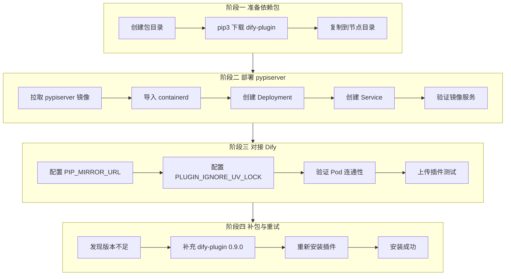
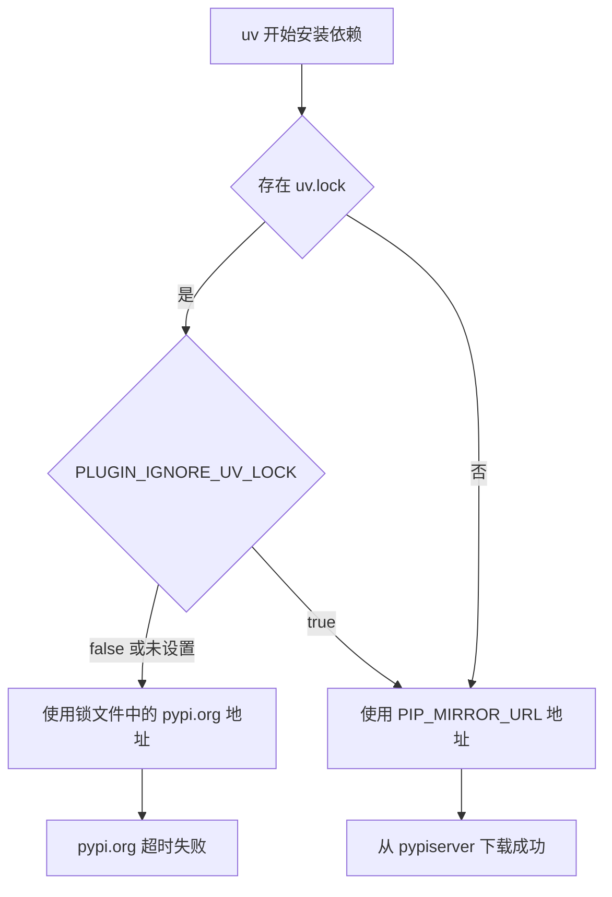
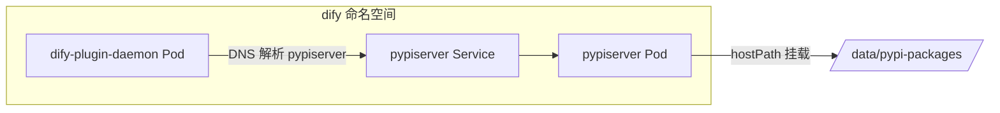
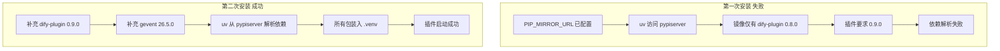
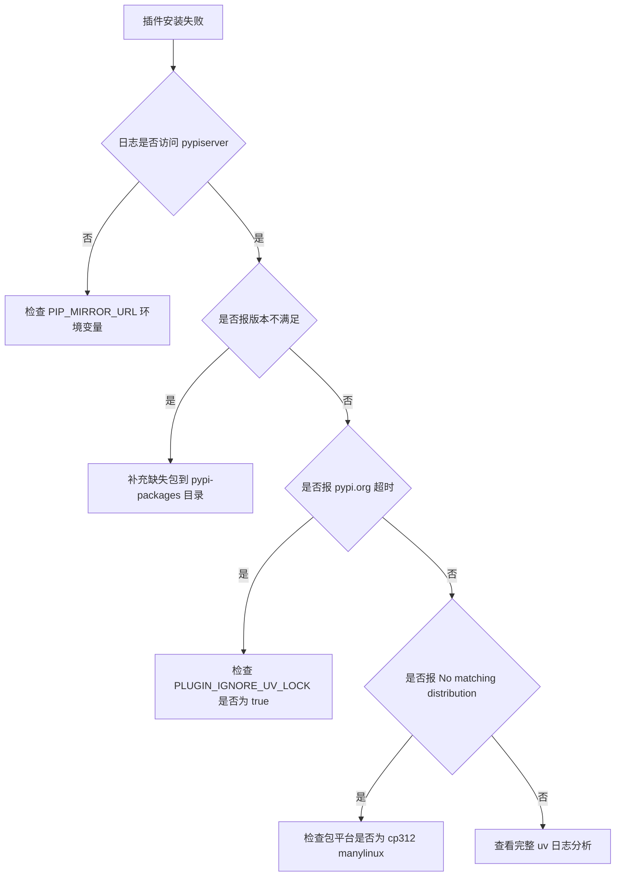
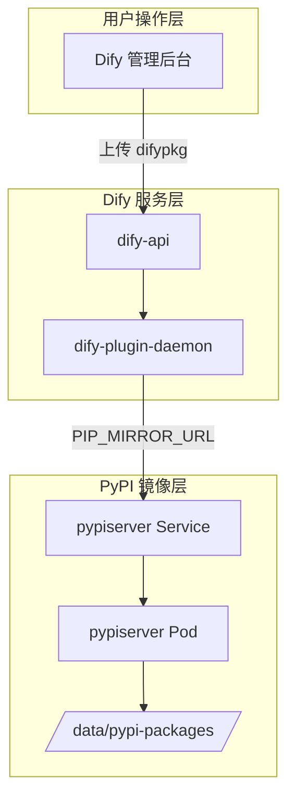
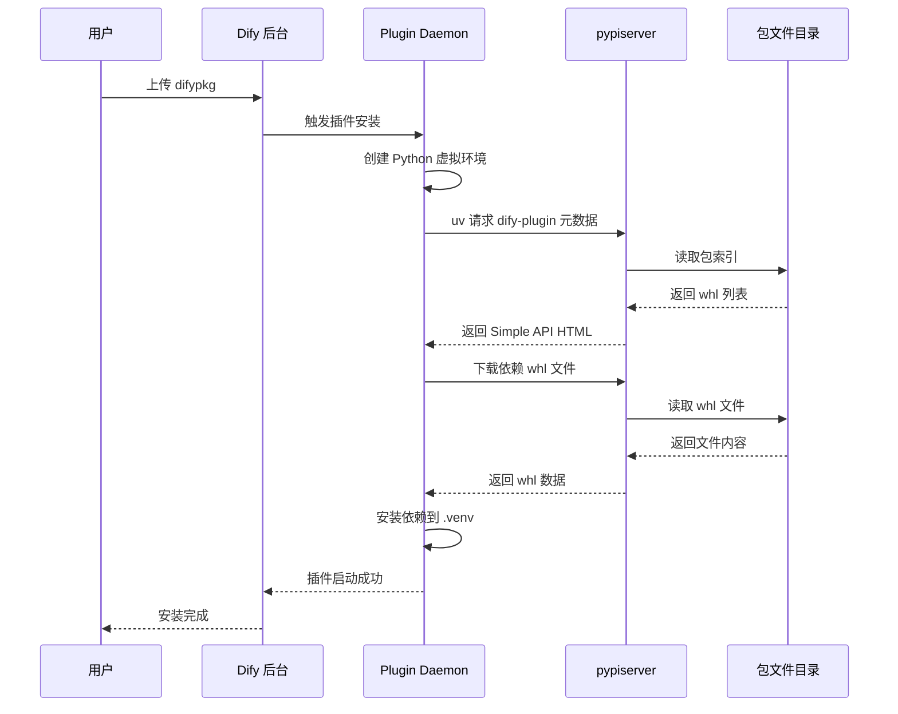

# Dify 替换 PIP_MIRROR_URL 自建 PyPI 镜像仓库实战（K8s 在线环境）

> **文档说明**：本文记录在外网 K8s 环境中，为 Dify Plugin Daemon 搭建内网 PyPI 镜像服务（pypiserver），并通过 `PIP_MIRROR_URL` 替换默认 PyPI 源的完整实操过程。  
> **环境定位**：当前为**在线验证环境**（外网先跑通，内网离线部署另文详述）。  
> **编写日期**：2026-06-05  
> **集群信息**：单节点 K8s v1.28.12，节点名 `master1`，命名空间 `dify`  
> **测试插件**：IoT设备通用网关（your-name/iot_device_http:0.0.8）  
> **最终结果**：插件安装成功

---

## 零、写在前面

如果你正在阅读这篇文章，很可能你遇到了和我相同的问题：Dify 部署好了，插件也上传了，就是装不上。界面上的红色报错让人沮丧，Plugin Daemon 的日志里满屏的 `pypi.org timeout` 更让人摸不着头脑。

你可能已经尝试过：

- 设置 `MARKETPLACE_ENABLED=false` — 没用，Plugin Daemon 照样访问 pypi.org
- 给 Pod 配置 HTTP 代理 — 不稳定，且不是所有 Pod 都能走代理
- 直接在 Plugin Daemon 容器里 pip install — 临时方案，每次安装新插件都要重复

最终你会发现：**必须在集群内部署一个 PyPI 镜像服务**，让 Plugin Daemon 从集群内网下载 Python 包。这就是 `PIP_MIRROR_URL` 的意义。

本文不是理论指南，而是**完整的操作流水账**。我会把每一步命令、每一次报错、每一次排查都原样记录下来。你可以对照着自己的环境逐步操作，也可以直接跳到"问题汇总"章节查找你遇到的特定错误。

文章分为以下几个部分：

1. **背景与目标** — 理解问题的本质
2. **环境确认** — 摸清现有环境
3. **阶段一至七** — 按时间顺序的完整操作流程
4. **操作日志** — 流水账式的逐步记录
5. **问题汇总与 FAQ** — 踩坑索引
6. **架构与最佳实践** — 生产环境建议

预计完整操作时间约 30-60 分钟（含排查）。如果你已经熟悉 K8s 和 Docker，且一切顺利，20 分钟内可以完成。

---

## 一、背景与目标

### 1.1 问题现象

在 K8s 集群中部署 Dify 后，通过本地上传 `.difypkg` 文件安装插件时，上传成功但安装失败。界面报错类似：

```
1个插件安装失败
IoT设备通用网关
failed to launch plugin: failed to install dependencies: failed to install dependencies: exit status 2
```

Plugin Daemon Pod 日志中可见完整堆栈，核心错误为访问 `pypi.org` 超时：

```
failed to launch plugin: failed to install dependencies: failed to install dependencies: exit status 2, output:
DEBUG uv 0.9.26
...
Caused by:
  0: Failed to fetch: https://pypi.org/simple/dify-plugin/
  1: error sending request for url (https://pypi.org/simple/dify-plugin/)
  2: operation timed out

error: Request failed after 3 retries
Caused by: Failed to fetch: https://pypi.org/simple/dify-plugin/
Caused by: operation timed out

failed to init environment
```

### 1.2 根因分析

Dify 插件系统存在**两层独立的网络依赖**：

| 层级 | 网络目标 | 控制变量 | 本地包安装是否需要 |
|------|---------|---------|-------------------|
| Dify API 层 | marketplace.dify.ai | MARKETPLACE_ENABLED | 不需要 |
| Plugin Daemon 层 | pypi.org | PIP_MIRROR_URL | **必须需要** |

`MARKETPLACE_ENABLED=false` 只能关闭 API 层对 Marketplace 的访问，**对 Plugin Daemon 层毫无影响**。Plugin Daemon 内部的 `uv` 工具始终需要从 PyPI 下载 `dify-plugin` SDK 及其传递依赖。

即使环境"能上网"，若集群内 Pod 无法稳定访问 `pypi.org`（网络策略、防火墙、DNS、跨境链路等原因），同样会安装失败。解决方案是在 K8s 集群内部署 PyPI 兼容镜像服务，并通过 `PIP_MIRROR_URL` 指向该服务。

### 1.2.1 为什么必须替换 PIP_MIRROR_URL

很多用户在遇到插件安装失败时，第一反应是关闭 Marketplace（设置 `MARKETPLACE_ENABLED=false`）。这只能解决"从 Dify 应用市场下载插件"的问题，**无法解决"插件安装时需要从 PyPI 拉 Python 依赖"的问题**。

Plugin Daemon 安装插件的完整流程如下：

1. 用户上传 `.difypkg` 文件到 Dify 后台
2. Dify API 将包转交给 Plugin Daemon
3. Plugin Daemon 解压插件包，读取 `requirements.txt` 或 `pyproject.toml`
4. Plugin Daemon 调用 `uv pip install` 创建 Python 虚拟环境并安装依赖
5. 依赖中必定包含 `dify-plugin` SDK 及其传递依赖（Flask、gevent、httpx 等）
6. 第 4 步的下载源由 `PIP_MIRROR_URL` 控制，**默认为 pypi.org**

因此，只要 Plugin Daemon 无法访问 PyPI（无论是完全离线还是网络不稳定），就必须自建镜像并通过 `PIP_MIRROR_URL` 替换。

### 1.2.2 dify-plugin SDK 依赖清单

每个 Dify 插件都依赖 `dify-plugin` SDK。0.9.0 版本的直接依赖如下：

```
Flask>=3.1.3          Werkzeug>=3.1.8       dpkt>=1.9.8
gevent>=26.4.0        httpx>=0.28.1         pydantic_settings>=2.14.1
pydantic>=2.13.4      pyyaml>=6.0.3         requests>=2.33.1
socksio>=1.0.0        tiktoken>=0.12.0      yarl>=1.23.0
packaging>=26.2
```

这些包各自还有传递依赖（如 `httpx` 依赖 `httpcore`、`certifi`、`anyio`），完整依赖树包含数十个包。这意味着：**镜像仓库中缺失任何一个传递依赖，插件安装都会失败**。

### 1.2.3 方案选型：为什么选 pypiserver

| 特性 | pypiserver | devpi | 静态文件目录 |
|------|-----------|-------|-------------|
| 实施难度 | 低 | 中 | 最低 |
| 资源占用 | 极低 | 中 | 极低 |
| 支持上传 | 支持 | 支持 | 不支持 |
| 缓存代理 | 不支持 | 支持 | 不支持 |
| K8s 部署 | 适合 | 适合 | 适合 |
| 维护成本 | 低 | 中 | 最低 |

pypiserver 是轻量级 PyPI 兼容服务器，不需要数据库，不需要复杂配置，只需一个存放包文件的目录即可运行。在 K8s 中部署为一个 Deployment 加 Service 即可，资源占用极小（本次配置仅 64Mi 内存、50m CPU）。

### 1.3 本次实战目标

1. 在有网络的 K8s 节点上预下载 Python 依赖包
2. 部署 pypiserver 作为集群内 PyPI 镜像
3. 配置 `dify-plugin-daemon` 的 `PIP_MIRROR_URL` 和 `PLUGIN_IGNORE_UV_LOCK`
4. 验证插件安装成功
5. 记录过程中所有报错与排查过程，供内网离线环境复用

### 1.3.1 预期成果

完成本文所有步骤后，你应该达到以下状态：

| 检查项 | 预期状态 |
|--------|---------|
| pypiserver Pod | Running 1/1 |
| pypiserver Service | ClusterIP 8080/TCP |
| PIP_MIRROR_URL | http://pypiserver:8080/simple/ |
| PLUGIN_IGNORE_UV_LOCK | true |
| Plugin Daemon 到 pypiserver 连通 | 正常 |
| dify-plugin 0.9.0 在镜像中 | 存在 |
| 测试插件安装 | 成功 |

### 1.3.2 前置条件

开始操作前，请确认以下条件已满足：

- 有一个可访问 PyPI 的网络环境（本文是外网验证，内网离线需提前下载）
- K8s 集群正常运行，kubectl 可用
- 节点上有 Docker 和 containerd（ctr 命令可用）
- 节点上有 Python 3（pip3 可用）
- Dify 已部署在 `dify` 命名空间，dify-plugin-daemon 正常运行
- 有一个测试用的 `.difypkg` 插件文件

### 1.4 整体流程概览



---

## 二、环境信息确认

在开始操作之前，需要先摸清当前环境的"家底"。这一步看似简单，但直接决定了后续命令能不能跑通。我们的策略是：**外网 K8s 环境先完整跑通一遍**，确认流程无误后，再迁移到内网离线环境。因此以下所有操作均在外网 K8s 节点 `master1` 上执行。

### 2.0 为什么要先在外网验证

很多人可能会问：既然最终目标是在内网离线环境部署，为什么不直接在内网操作？原因有三：

1. **内网无法试错**：内网没有 PyPI 和 Docker Hub 访问能力，一旦某步出错，排查和修正的成本极高
2. **外网可以在线补包**：本次实战中插件安装失败就是因为缺少 dify-plugin 0.9.0，在外网可以用 Docker 容器快速补充；内网则必须提前预判
3. **流程可复用**：外网验证通过后的 Deployment YAML、Service YAML、环境变量配置，内网部署时可以原样使用，仅"下载"和"传输"步骤不同

### 2.1 节点与 K8s 信息

操作节点为 `master1`，既是 K8s 控制面，也是工作节点（单节点集群）。

```bash
hostname
kubectl get nodes
kubectl create namespace dify 2>/dev/null || echo "namespace dify already exists"
```

**执行结果：**

```
[root@master1 dify-pypi-packages]# hostname
master1

[root@master1 dify-pypi-packages]# kubectl get nodes
NAME      STATUS   ROLES                  AGE   VERSION
master1   Ready    control-plane,master   25d   v1.28.12

[root@master1 dify-pypi-packages]# kubectl create namespace dify 2>/dev/null || echo "namespace dify already exists"
namespace dify already exists
```

**命令说明：**

- `hostname`：获取当前节点主机名，后续 Deployment 的 `nodeSelector` 需要用到
- `kubectl get nodes`：确认 K8s 集群节点状态
- `kubectl create namespace dify`：创建 Dify 专用命名空间（已存在则跳过）

### 2.2 Python 环境确认

节点上同时存在 Python 2.7 和 Python 3.7，**必须使用 pip3**。

```bash
python3 --version
pip3 --version
```

**执行结果：**

```
[root@master1 dify-pypi-packages]# python3 --version
Python 3.7.9

[root@master1 dify-pypi-packages]# pip3 --version
pip 20.2.2 from /usr/lib/python3.7/site-packages/pip (python 3.7)
```

> **踩坑记录**：最初使用 `pip download`（默认绑定 Python 2.7）导致下载失败，详见下文第三节。

### 2.3 Dify Plugin Daemon 确认

```bash
kubectl get deployment -n dify | grep -i plugin
```

**执行结果：**

```
[root@master1 dify-pypi-packages]# kubectl get deployment -n dify | grep -i plugin
dify-plugin-daemon   1/1     1            1           25d
```

确认 Deployment 名称为 `dify-plugin-daemon`，后续配置环境变量时使用此名称。

### 2.4 Plugin Daemon 容器环境分析

从 Plugin Daemon 的错误日志中，可以提取出容器的关键环境信息：

```
Found `cpython-3.12.3-linux-x86_64-gnu` at `.venv/bin/python3`
DEBUG Using Python 3.12.3 environment at: .venv
DEBUG uv 0.9.26
```

| 属性 | 值 | 对下载的影响 |
|------|-----|-------------|
| Python 版本 | 3.12.3 | wheel 标签必须是 cp312 |
| 操作系统 | Linux x86_64 | wheel 标签必须是 manylinux |
| 包管理器 | uv 0.9.26 | 支持 PEP 503 Simple API |
| 虚拟环境路径 | /app/cwd/.../.venv | 每次安装插件都会创建新的 venv |

这意味着：我们在有网机器上下载 Python 包时，**必须确保 wheel 文件能在 Python 3.12 + Linux x86_64 上安装**。如果下载了 cp37 或 macOS 平台的 wheel，即使文件名看起来正确，uv 也会报 `No matching distribution found`。

### 2.5 Python wheel 文件命名规则

理解 wheel 文件名有助于排查"包存在但无法安装"的问题。一个典型的 wheel 文件名如下：

```
gevent-26.5.0-cp312-cp312-manylinux_2_28_x86_64.whl
│       │      │     │      │                  │
│       │      │     │      │                  └── 架构：x86_64
│       │      │     │      └── 平台标签：manylinux_2_28
│       │      │     └── ABI 标签：cp312（必须匹配 Python 3.12）
│       │      └── Python 标签：cp312
│       └── 版本号：26.5.0
└── 包名：gevent
```

而 `dify_plugin-0.9.0-py3-none-any.whl` 中的 `py3-none-any` 表示纯 Python 包，不依赖特定 Python 版本和平台，兼容性最好。

**本次实战中遇到的平台匹配问题**：gevent 26.5.0 使用的是 `manylinux_2_28` 标签，而 pip3 加 `--platform manylinux2014_x86_64` 只能找到最高 25.9.1 的 manylinux2014 版本。这就是为什么必须用 Python 3.12 容器下载的原因——容器内 pip 会自动选择正确的 wheel 标签。

---

## 三、阶段一：预下载 Python 依赖包

这是整个流程的第一步，也是最容易出问题的环节。我们需要在一台能访问 PyPI 的机器上，把 Dify 插件安装所需的全部 Python 包下载到本地目录。这些包稍后会被 pypiserver 托管，供 Plugin Daemon 在内网环境中下载。

**本阶段目标**：在 `/data/pypi-packages/` 目录中准备好 dify-plugin SDK 及其全部传递依赖的 wheel 文件。

**本阶段实际结果**：初次下载 50 个包，但缺少 dify-plugin 0.9.0（后续补包阶段解决）。

### 3.1 创建包存储目录

```bash
mkdir -p ~/dify-pypi-packages
cd ~/dify-pypi-packages
```

**命令说明：** 创建本地临时目录，用于存放从 PyPI 下载的 `.whl` 和 `.tar.gz` 文件。

### 3.2 第一次尝试：使用 pip 下载（失败）

```bash
pip download dify-plugin -d ~/dify-pypi-packages/
```

**执行结果（报错）：**

```
[root@master1 dify-pypi-packages]# pip download dify-plugin -d ~/dify-pypi-packages/
DEPRECATION: Python 2.7 reached the end of its life on January 1st, 2020. Please upgrade your Python as Python 2.7 is no longer maintained. pip 21.0 will drop support for Python 2.7 in January 2021. More details about Python 2 support in pip can be found at https://pip.pypa.io/en/latest/development/release-process/#python-2-support
ERROR: Could not find a version that satisfies the requirement dify-plugin (from versions: none)
ERROR: No matching distribution found for dify-plugin
WARNING: You are using pip version 20.2.2; however, version 20.3.4 is available.
You should consider upgrading via the '/usr/bin/python2 -m pip install --upgrade pip' command.
```

**问题分析：**

| 现象 | 原因 |
|------|------|
| 提示 Python 2.7 DEPRECATION | 系统默认 `pip` 绑定 Python 2.7 |
| No matching distribution found | `dify-plugin` 仅支持 Python 3，Python 2.7 下无可用版本 |

**排查命令：**

```bash
python
```

**输出确认：**

```
Python 2.7.18 (default, Dec 31 2021, 19:58:09)
[GCC 7.3.0] on linux2
```

**结论：** 必须使用 `pip3` 而非 `pip`。

### 3.3 第二次尝试：使用 pip3 但不带平台参数（未记录完整输出，按标准流程继续）

改用 pip3 后基本下载成功，但后续为匹配 Plugin Daemon 容器环境（Python 3.12 + Linux x86_64），需要加平台参数。

### 3.4 第三次尝试：pip3 带平台参数但不带 only-binary（失败）

```bash
pip3 download dify-plugin -d ~/dify-pypi-packages/ \
    --platform manylinux2014_x86_64 \
    --python-version 3.12
```

**执行结果（报错）：**

```
ERROR: When restricting platform and interpreter constraints using --python-version, --platform, --abi, or --implementation, either --no-deps must be set, or --only-binary=:all: must be set and --no-binary must not be set (or must be set to :none:).
```

**问题分析：**

pip 在跨平台下载时有强制约束：指定 `--platform` 和 `--python-version` 时，必须二选一：

- 加 `--no-deps`（只下载指定包，不递归依赖）
- 加 `--only-binary=:all:`（只下载 wheel 包）

**解决方案：** 加上 `--only-binary=:all:` 参数。

### 3.5 第四次尝试：pip3 带完整参数（成功）

```bash
pip3 download dify-plugin -d ~/dify-pypi-packages/ \
    --platform manylinux2014_x86_64 \
    --python-version 3.12 \
    --only-binary=:all:

pip3 download setuptools wheel -d ~/dify-pypi-packages/ \
    --platform manylinux2014_x86_64 \
    --python-version 3.12 \
    --only-binary=:all:
```

**命令说明：**

| 参数 | 作用 |
|------|------|
| `--platform manylinux2014_x86_64` | 指定目标平台为 Linux x86_64 |
| `--python-version 3.12` | 指定目标 Python 版本为 3.12 |
| `--only-binary=:all:` | 只下载预编译 wheel，配合跨平台下载约束 |
| `setuptools wheel` | 构建工具，部分包装过程需要 |

**验证下载数量：**

```bash
ls ~/dify-pypi-packages/ | wc -l
```

**执行结果：**

```
[root@master1 dify-pypi-packages]# ls ~/dify-pypi-packages/ | wc -l
50
```

共 50 个包文件，数量正常。

### 3.6 复制包文件到 K8s 节点部署目录

pypiserver 将通过 hostPath 挂载此目录。

```bash
mkdir -p /data/pypi-packages
cp ~/dify-pypi-packages/* /data/pypi-packages/
ls /data/pypi-packages/ | wc -l
```

**执行结果：**

```
[root@master1 dify-pypi-packages]# mkdir -p /data/pypi-packages
[root@master1 dify-pypi-packages]# cp ~/dify-pypi-packages/* /data/pypi-packages/
[root@master1 dify-pypi-packages]# ls /data/pypi-packages/ | wc -l
50
```

复制成功，50 个文件全部到位。

---

## 四、阶段二：准备并部署 pypiserver

依赖包准备完毕后，接下来需要在 K8s 集群中部署 pypiserver 服务。pypiserver 是一个轻量级的 PyPI 兼容服务器，它读取本地目录中的 wheel 文件，并通过 PEP 503 Simple API 对外提供包索引和下载服务。

**本阶段目标**：在 `dify` 命名空间中运行一个 pypiserver Pod，并通过 Service 暴露给集群内其他 Pod 访问。

**本阶段关键挑战**：Docker Hub 不可达（需国内镜像代理）、containerd 镜像导入（Docker 镜像 K8s 不可见）。

### 4.0 pypiserver 工作原理

pypiserver 的工作方式非常简单：

1. 指定一个本地目录（如 `/packages`），目录中存放 `.whl` 和 `.tar.gz` 文件
2. 启动 HTTP 服务，监听指定端口（默认 8080）
3. 对外提供 PEP 503 Simple API：
   - `GET /simple/` — 列出所有可用包
   - `GET /simple/<包名>/` — 列出指定包的所有版本
   - `GET /packages/<文件名>` — 下载具体的包文件

Plugin Daemon 中的 uv 工具就是通过这些 API 来查找和下载 Python 包的。因此 `PIP_MIRROR_URL` 的值必须是 Simple API 的根地址，即 `http://pypiserver:8080/simple/`（注意末尾的 `/simple/`）。

### 4.1 拉取 pypiserver Docker 镜像

#### 第一次尝试：直接从 Docker Hub 拉取（失败）

```bash
docker pull pypiserver/pypiserver:latest
```

**执行结果（报错）：**

```
Error response from daemon: Get "https://registry-1.docker.io/v2/": net/http: request canceled while waiting for connection (Client.Timeout exceeded while awaiting headers)
```

**问题分析：** 节点无法访问 Docker Hub（registry-1.docker.io），连接超时。这是国内环境常见问题。

**错误后续操作（必然失败）：**

```bash
docker save pypiserver/pypiserver:latest -o pypiserver.tar
ls -lh pypiserver.tar
```

**执行结果：**

```
Error response from daemon: reference does not exist
ls: 无法访问 'pypiserver.tar': 没有那个文件或目录
```

镜像未拉取成功，`docker save` 自然找不到镜像引用。

#### 第二次尝试：使用国内镜像代理（成功）

```bash
docker pull docker.1ms.run/pypiserver/pypiserver:latest
docker tag docker.1ms.run/pypiserver/pypiserver:latest pypiserver/pypiserver:latest
docker images | grep pypiserver
```

**执行结果：**

```
[root@master1 dify-pypi-packages]# docker pull docker.1ms.run/pypiserver/pypiserver:latest
latest: Pulling from pypiserver/pypiserver
0a9a5dfd008f: Pull complete
645dc30e2c53: Pull complete
460b78d5e9c6: Pull complete
8534c94cd38e: Pull complete
37caef7e07d2: Pull complete
565676dbefc8: Pull complete
1bc0a3b67869: Pull complete
164f618af234: Pull complete
06eb11657449: Pull complete
5ac62d803264: Pull complete
Digest: sha256:e935e19433ef7a21801a8f11929b0c07cc5717f9a9e38d8581dc51e92a98abc0
Status: Downloaded newer image for docker.1ms.run/pypiserver/pypiserver:latest

[root@master1 dify-pypi-packages]# docker tag docker.1ms.run/pypiserver/pypiserver:latest pypiserver/pypiserver:latest

[root@master1 dify-pypi-packages]# docker images | grep pypiserver
docker.1ms.run/pypiserver/pypiserver                latest              4a218c4fa0a9        3 months ago        93.8MB
pypiserver/pypiserver                               latest              4a218c4fa0a9        3 months ago        93.8MB
```

**经验总结：** 国内环境拉 Docker 镜像时，可使用 `docker.1ms.run` 或 `docker.m.daocloud.io` 等代理前缀。拉取后 `docker tag` 为官方名称，便于后续 K8s Deployment 引用。

### 4.2 导入镜像到 K8s 容器运行时（containerd）

K8s v1.28 默认使用 containerd 作为容器运行时，Docker 中的镜像不会自动被 K8s 识别，需要手动导入。

```bash
docker save pypiserver/pypiserver:latest -o /data/pypiserver.tar
ctr -n k8s.io images import /data/pypiserver.tar
ctr -n k8s.io images ls | grep pypiserver
```

**执行结果：**

```
[root@master1 dify-pypi-packages]# docker save pypiserver/pypiserver:latest -o /data/pypiserver.tar

[root@master1 dify-pypi-packages]# ctr -n k8s.io images import /data/pypiserver.tar
WARN[0000] DEPRECATION: The `tracing` property of `[plugins."io.containerd.internal.v1".tracing]` is deprecated since containerd v1.6 and will be removed in containerd v2.0.Use OTEL environment variables instead: https://opentelemetry.io/docs/specs/otel/configuration/sdk-environment-variables/
WARN[0000] DEPRECATION: The `configs` property of `[plugins."io.containerd.grpc.v1.cri".registry]` is deprecated since containerd v1.5 and will be removed in containerd v2.1. Use `config_path` instead.
unpacking docker.io/pypiserver/pypiserver:latest (sha256:fbef28490b456064e61bceb501c36e06e863867d787c0451009137d0f2aeea8a)...
done

[root@master1 dify-pypi-packages]# ctr -n k8s.io images ls | grep pypiserver
docker.io/pypiserver/pypiserver:latest    application/vnd.docker.distribution.manifest.v2+json sha256:fbef28490b456064e61bceb501c36e06e863867d787c0451009137d0f2aeea8a 93.1 MiB  linux/amd64 io.cri-containerd.image=managed
```

**命令说明：**

| 命令 | 作用 |
|------|------|
| `docker save` | 将 Docker 镜像导出为 tar 文件 |
| `ctr -n k8s.io images import` | 将 tar 导入 containerd 的 k8s.io 命名空间 |
| `ctr -n k8s.io images ls` | 列出 containerd 中的镜像，确认导入成功 |

> containerd 的 DEPRECATION 警告可忽略，不影响功能。

### 4.3 创建 pypiserver Deployment

使用 hostPath 方式挂载节点上的 `/data/pypi-packages` 目录，并通过 `nodeSelector` 固定调度到 `master1` 节点。

```bash
cat > /data/pypiserver-deployment.yaml << 'EOF'
apiVersion: apps/v1
kind: Deployment
metadata:
  name: pypiserver
  namespace: dify
  labels:
    app: pypiserver
spec:
  replicas: 1
  selector:
    matchLabels:
      app: pypiserver
  template:
    metadata:
      labels:
        app: pypiserver
    spec:
      nodeSelector:
        kubernetes.io/hostname: master1
      containers:
      - name: pypiserver
        image: pypiserver/pypiserver:latest
        imagePullPolicy: IfNotPresent
        command: ["pypi-server", "run", "-p", "8080", "/packages"]
        ports:
        - containerPort: 8080
          name: http
        volumeMounts:
        - name: packages
          mountPath: /packages
        resources:
          requests:
            cpu: 50m
            memory: 64Mi
          limits:
            cpu: 200m
            memory: 128Mi
        livenessProbe:
          httpGet:
            path: /simple/
            port: 8080
          initialDelaySeconds: 5
          periodSeconds: 30
        readinessProbe:
          httpGet:
            path: /simple/
            port: 8080
          initialDelaySeconds: 3
          periodSeconds: 10
      volumes:
      - name: packages
        hostPath:
          path: /data/pypi-packages
          type: Directory
EOF

kubectl apply -f /data/pypiserver-deployment.yaml
kubectl get pods -n dify -l app=pypiserver
```

**首次检查（Pod 创建中）：**

```
[root@master1 dify-pypi-packages]# kubectl apply -f /data/pypiserver-deployment.yaml
deployment.apps/pypiserver created

[root@master1 dify-pypi-packages]# kubectl get pods -n dify -l app=pypiserver
NAME                          READY   STATUS              RESTARTS   AGE
pypiserver-7cc649b9f9-rzdvr   0/1     ContainerCreating   0          1s
```

**等待 15 秒后再次检查：**

```bash
sleep 15
kubectl get pods -n dify -l app=pypiserver
```

**执行结果：**

```
[root@master1 dify-pypi-packages]# sleep 15
[root@master1 dify-pypi-packages]# kubectl get pods -n dify -l app=pypiserver
NAME                          READY   STATUS    RESTARTS   AGE
pypiserver-7cc649b9f9-rzdvr   1/1     Running   0          59s
```

Pod 状态 `Running`，`READY 1/1`，部署成功。

**Deployment 关键配置说明：**

| 配置项 | 值 | 说明 |
|--------|-----|------|
| `nodeSelector` | `master1` | hostPath 要求 Pod 调度到包文件所在节点 |
| `imagePullPolicy` | `IfNotPresent` | 优先使用本地已导入的镜像 |
| `command` | `pypi-server run -p 8080 /packages` | 启动 pypiserver 监听 8080 端口 |
| `hostPath` | `/data/pypi-packages` | 挂载节点上的 Python 包目录 |

### 4.4 创建 pypiserver Service

```bash
cat > /data/pypiserver-service.yaml << 'EOF'
apiVersion: v1
kind: Service
metadata:
  name: pypiserver
  namespace: dify
  labels:
    app: pypiserver
spec:
  type: ClusterIP
  selector:
    app: pypiserver
  ports:
  - port: 8080
    targetPort: 8080
    protocol: TCP
    name: http
EOF

kubectl apply -f /data/pypiserver-service.yaml
kubectl get svc -n dify -l app=pypiserver
```

**执行结果：**

```
[root@master1 dify-pypi-packages]# kubectl apply -f /data/pypiserver-service.yaml
service/pypiserver created

[root@master1 dify-pypi-packages]# kubectl get svc -n dify -l app=pypiserver
NAME         TYPE        CLUSTER-IP      EXTERNAL-IP   PORT(S)    AGE
pypiserver   ClusterIP   10.246.254.86   <none>        8080/TCP   0s
```

Service 创建成功，集群内可通过 `http://pypiserver:8080/simple/` 访问（同命名空间下）。

---

## 五、阶段三：验证 pypiserver 服务

pypiserver 部署完成后，**不要急于配置 Plugin Daemon**。先验证 pypiserver 本身是否正常工作，可以节省大量后续排查时间。如果 pypiserver 本身有问题（包目录为空、服务未启动、端口未监听），配置 PIP_MIRROR_URL 后插件安装必然失败，且错误信息可能误导你以为是网络或配置问题。

**本阶段目标**：确认 pypiserver 能返回正确的包索引页面，且 `dify-plugin` 包在索引中可见。

**本阶段经历**：三种验证方式，两种失败一种成功。最终确认 pypiserver 服务正常，但仅包含 dify-plugin 0.7.4 和 0.8.0 版本。

### 5.0 验证策略选择

在 K8s 环境中验证服务连通性，常见有以下几种方式：

| 方式 | 命令 | 优点 | 缺点 | 本次结果 |
|------|------|------|------|---------|
| 临时 curl Pod | kubectl run curl-test | 标准做法 | 需拉取新镜像 | 失败 |
| exec 进目标 Pod | kubectl exec + wget/curl | 无需新镜像 | 工具可能缺失 | wget 失败 |
| exec 进目标 Pod | kubectl exec + python3 | 无需新镜像 | 需 Python 环境 | **成功** |
| port-forward | kubectl port-forward + curl | 从宿主机访问 | 多一步操作 | 未尝试 |
| 从关联 Pod 测试 | exec 进 plugin-daemon | 测试真实链路 | 需已部署 | 下一阶段 |

**经验**：在国内网络环境下，优先使用已有 Pod 内的 python3 验证，避免依赖 Docker Hub 上的调试镜像。

### 5.1 第一次验证尝试：curl 临时 Pod（失败）

```bash
kubectl run curl-test --image=curlimages/curl --rm -it --restart=Never -n dify -- \
    curl -s http://pypiserver:8080/simple/dify-plugin/ | head -20
```

**执行结果（报错）：**

```
pod "curl-test" deleted
error: timed out waiting for the condition
```

**问题分析：** 与拉取 pypiserver 镜像类似，`curlimages/curl` 镜像也需要从 Docker Hub 拉取，在当前环境同样超时失败。临时 Pod 无法启动，导致 kubectl 等待超时。

**排查思路：**

1. 不在集群外拉新镜像，改用已有 Pod 内部验证
2. 或使用 `kubectl port-forward` 从宿主机访问
3. 或 `kubectl exec` 进入 pypiserver Pod 自身测试

### 5.2 第二次验证尝试：wget（失败）

```bash
kubectl exec -n dify deploy/pypiserver -- wget -qO- http://localhost:8080/simple/dify-plugin/ | head -20
```

**执行结果（报错）：**

```
wget: can't connect to remote host: Connection refused
command terminated with exit code 1
```

**问题分析：** pypiserver 容器内 wget 连接 localhost 被拒绝，可能是 Alpine 环境下 wget 的 IPv4/IPv6 解析问题，或服务绑定地址差异。**但这不代表服务不可用**，需换方式验证。

### 5.3 第三次验证尝试：Python3（成功）

```bash
kubectl exec -n dify deploy/pypiserver -- python3 -c "import urllib.request; print(urllib.request.urlopen('http://localhost:8080/simple/dify-plugin/').read().decode()[:500])"
```

**执行结果：**

```
<!DOCTYPE html>
<html lang="en">
    <head>
        <meta charset="utf-8">
        <meta name="viewport" content="width=device-width, initial-scale=1">
        <title>Links for dify-plugin</title>
    </head>
    <body>
        <h1>Links for dify-plugin</h1>
            <a href="/packages/dify_plugin-0.7.4-py3-none-any.whl#sha256=55855320a4093bbcad6f19014fe0f13277b9c2d8b3331fec27bc3498467a81be">dify_plugin-0.7.4-py3-none-any.whl</a><br>
            <a href="/packages/dify_plugin-0.8.0-py3-none-a
```

**验证结论：** pypiserver 服务正常运行，能返回 `dify-plugin` 包的 HTML 索引页面。  
**注意：** 此时镜像中只有 `0.7.4` 和 `0.8.0` 版本，尚未包含 `0.9.0`（此问题在后续插件安装阶段暴露）。

---

## 六、阶段四：配置 Dify Plugin Daemon

pypiserver 验证通过后，接下来是整个方案的核心步骤：**告诉 Dify Plugin Daemon 从 pypiserver 下载 Python 包，而不是从 pypi.org**。这一步只需要设置两个环境变量，但每个变量的含义和取值都有讲究。

**本阶段目标**：为 `dify-plugin-daemon` Deployment 添加 `PIP_MIRROR_URL` 和 `PLUGIN_IGNORE_UV_LOCK` 环境变量，并验证新 Pod 中的变量已生效。

**本阶段结果**：环境变量配置成功，Plugin Daemon 到 pypiserver 的网络连通性验证通过。

### 6.0 PLUGIN_IGNORE_UV_LOCK 深度说明

在深入配置之前，有必要理解为什么需要 `PLUGIN_IGNORE_UV_LOCK=true`。

Dify 插件的 `.difypkg` 文件本质是一个 zip 压缩包，解压后可能包含 `uv.lock` 文件。这个锁文件记录了：

- 精确的依赖版本号
- 每个包的下载源 URL（通常是 `https://pypi.org/simple/...`）
- 包的哈希校验值

当 Plugin Daemon 安装插件时，uv 的行为逻辑是：

1. 如果存在 `uv.lock` 且未设置忽略 → **优先使用锁文件中的源地址和版本**
2. 如果不存在 `uv.lock` 或设置了 `PLUGIN_IGNORE_UV_LOCK=true` → 使用 `PIP_MIRROR_URL` 指定的源

在离线/内网场景中，锁文件中的 pypi.org 地址不可达，如果不忽略锁文件，即使设置了 `PIP_MIRROR_URL`，uv 仍然会去访问 pypi.org。**这就是为什么 `PLUGIN_IGNORE_UV_LOCK=true` 是必须的**。



### 6.1 核心环境变量说明

| 环境变量 | 推荐值 | 说明 |
|--------|--------|------|
| `PIP_MIRROR_URL` | `http://pypiserver:8080/simple/` | 指向集群内 pypiserver 的 Simple API 地址 |
| `PLUGIN_IGNORE_UV_LOCK` | `true` | 忽略插件包内 uv.lock 中的 pypi.org 源地址 |

**PIP_MIRROR_URL 地址规则：**

| 部署关系 | PIP_MIRROR_URL 值 |
|---------|-------------------|
| 同一命名空间 | `http://pypiserver:8080/simple/` |
| 不同命名空间 | `http://pypiserver.dify.svc.cluster.local:8080/simple/` |
| pypiserver 使用 NodePort | `http://<节点IP>:<NodePort>/simple/` |

本次 pypiserver 与 dify-plugin-daemon 同在 `dify` 命名空间，使用短域名即可。

### 6.2 设置环境变量

```bash
kubectl set env deployment/dify-plugin-daemon -n dify \
  PIP_MIRROR_URL=http://pypiserver:8080/simple/ \
  PLUGIN_IGNORE_UV_LOCK=true
```

**执行结果：**

```
deployment.apps/dify-plugin-daemon env updated
```

### 6.3 等待滚动更新并验证

```bash
kubectl rollout status deployment/dify-plugin-daemon -n dify
kubectl exec -n dify deploy/dify-plugin-daemon -- sh -c 'echo PIP_MIRROR_URL=$PIP_MIRROR_URL; echo PLUGIN_IGNORE_UV_LOCK=$PLUGIN_IGNORE_UV_LOCK'
```

**执行结果：**

```
[root@master1 dify-pypi-packages]# kubectl rollout status deployment/dify-plugin-daemon -n dify
deployment "dify-plugin-daemon" successfully rolled out

[root@master1 dify-pypi-packages]# kubectl exec -n dify deploy/dify-plugin-daemon -- sh -c 'echo PIP_MIRROR_URL=$PIP_MIRROR_URL; echo PLUGIN_IGNORE_UV_LOCK=$PLUGIN_IGNORE_UV_LOCK'
PIP_MIRROR_URL=http://pypiserver:8080/simple/
PLUGIN_IGNORE_UV_LOCK=true
```

环境变量已正确注入到新 Pod 中。

### 6.4 验证 Plugin Daemon 到 pypiserver 的网络连通性

```bash
kubectl exec -n dify deploy/dify-plugin-daemon -- python3 -c "
import urllib.request
resp = urllib.request.urlopen('http://pypiserver:8080/simple/dify-plugin/', timeout=5)
print(resp.read().decode()[:300])
"
```

**执行结果：**

```
<!DOCTYPE html>
<html lang="en">
    <head>
        <meta charset="utf-8">
        <meta name="viewport" content="width=device-width, initial-scale=1">
        <title>Links for dify-plugin</title>
    </head>
    <body>
        <h1>Links for dify-plugin</h1>
            <a href="/packages/dify_plugi
```

**验证结论：** Plugin Daemon Pod 可通过 K8s Service DNS 正常访问 pypiserver，网络链路打通。



---

## 七、阶段五：插件安装测试与失败排查

环境变量配置完成、网络连通性验证通过后，终于来到了最终的验证环节：**在 Dify 界面上传插件，看能否安装成功**。

我们选用的测试插件是 **IoT设备通用网关**（包名 `your-name/iot_device_http:0.0.8`）。选择这个插件是因为它在之前的部署中已经复现过安装失败的问题，适合用来验证修复效果。

**本阶段目标**：上传 `.difypkg` 文件，验证 Plugin Daemon 能从 pypiserver 下载依赖并完成安装。

**本阶段结果**：第一次安装失败（dify-plugin 版本不足），补充包后第二次安装成功。

### 7.0 插件安装失败的两种典型模式

在配置 PIP_MIRROR_URL 之后，插件安装仍可能失败。根据错误信息的不同，可以分为两种典型模式：

**模式 A：网络问题（PIP_MIRROR_URL 未生效）**

错误特征：日志中出现 `Failed to fetch: https://pypi.org/simple/...` 或 `operation timed out`

排查方向：检查 PIP_MIRROR_URL 是否注入、PLUGIN_IGNORE_UV_LOCK 是否设置、Pod 是否已滚动更新

**模式 B：包缺失/版本不足（PIP_MIRROR_URL 已生效）**

错误特征：日志中出现 `Fetching metadata from http://pypiserver:8080/simple/...` 但报 `No matching distribution found` 或 `No solution found when resolving dependencies`

排查方向：检查 pypiserver 中是否包含所需包和版本、wheel 平台标签是否匹配

**本次遇到的是模式 B**，说明 PIP_MIRROR_URL 配置完全正确，问题出在镜像仓库的内容不完整。

### 7.1 第一次插件安装（失败）

在 Dify 管理后台进入**插件**页面，选择**本地安装**，上传 `.difypkg` 文件（本次测试插件：**IoT设备通用网关**，包名 `iot_device_http-0.0.8`）。

**界面报错：**

```
failed to launch plugin: failed to install dependencies: failed to install dependencies: exit status 1, output: DEBUG uv 0.9.26 TRACE Checking lock for `/root/.cache/uv` at `/root/.cache/uv/.lock` DEBUG Acquired shared lock for `/root/.cache/uv` DEBUG Searching for default Python interpreter in virtual environments TRACE Found cached interpreter info for Python 3.12.3, skipping query of: .venv/bin/python3 DEBUG Found `cpython-3.12.3-linux-x86_64-gnu` at `/app/cwd/your-name/iot_device_http-0.0.8@421ed98c267c...n dify-plugin>=0.9.0, <1.0.0 no versions of dify-plugin>=0.9.0, <1.0.0 × No solution found when resolving dependencies: ╰─▶ Because only dify-plugin<=0.8.0 is available and you require dify-plugin>=0.9.0,<1.0.0, we can conclude that your requirements are unsatisfiable. DEBUG Released lock at `/app/cwd/your-name/iot_device_http-0.0.8@421ed98c267c2de09148aba2dde876efa589f9cd4f1aec508f3d61cf1334f839/.venv/.lock` DEBUG Released lock at `/root/.cache/uv/.lock` failed to init environment
```

**问题现象提炼：**

| 项目 | 内容 |
|------|------|
| 错误类型 | 依赖版本不满足 |
| 插件要求 | `dify-plugin>=0.9.0, <1.0.0` |
| 镜像提供 | 最高仅 `dify-plugin<=0.8.0` |
| 网络状态 | 已成功访问 pypiserver，非网络问题 |

**关键结论：** `PIP_MIRROR_URL` 配置正确且生效，uv 已从 `http://pypiserver:8080/simple/dify-plugin/` 拉取元数据，但**镜像仓库中缺少 0.9.0 版本**。

### 7.2 查看 Plugin Daemon 详细日志

```bash
kubectl logs -n dify deploy/dify-plugin-daemon --tail=80
```

**日志关键片段（节选）：**

```
2026-06-06T01:23:34.735796148Z INFO dify-plugin-daemon setup_python_environment.go:108 installing plugin dependencies plugin=your-name/iot_device_http:0.0.8 method="uv pip install" file=requirements.txt

TRACE Fetching metadata for dify-plugin from http://pypiserver:8080/simple/dify-plugin/
TRACE Fetching metadata for requests from http://pypiserver:8080/simple/requests/
TRACE Fetching metadata for python-dotenv from http://pypiserver:8080/simple/python-dotenv/

DEBUG connecting to 10.246.254.86:8080
DEBUG connected to 10.246.254.86:8080

DEBUG Searching for a compatible version of dify-plugin (>=0.9.0, <1.0.0)
TRACE Selecting candidate for dify-plugin with range >=0.9.0, <1.0.0 with 2 remote versions
TRACE Exhausted all candidates for package dify-plugin with range >=0.9.0, <1.0.0 after 0 steps
DEBUG No compatible version found for: dify-plugin

  × No solution found when resolving dependencies:
  ╰─▶ Because only dify-plugin<=0.8.0 is available and you require
      dify-plugin>=0.9.0,<1.0.0, we can conclude that your requirements are
      unsatisfiable.
```

**排查分析过程：**

1. **确认 PIP_MIRROR_URL 是否生效** — 日志显示 `Fetching metadata from http://pypiserver:8080/simple/dify-plugin/`，已走内网镜像，排除配置未生效问题
2. **确认网络是否连通** — 日志显示 `connected to 10.246.254.86:8080`（pypiserver Service ClusterIP），网络正常
3. **确认 PLUGIN_IGNORE_UV_LOCK 是否生效** — uv 未尝试访问 pypi.org，锁文件已被忽略
4. **定位真正原因** — `with 2 remote versions` 表示镜像中只有 2 个版本（0.7.4 和 0.8.0），不满足 `>=0.9.0` 要求

**排查命令链总结：**

```bash
# 第一步：看 Pod 环境变量是否注入
kubectl exec -n dify deploy/dify-plugin-daemon -- sh -c 'echo $PIP_MIRROR_URL'

# 第二步：看 pypiserver 实际提供了哪些版本
kubectl exec -n dify deploy/pypiserver -- python3 -c "
import urllib.request
print(urllib.request.urlopen('http://localhost:8080/simple/dify-plugin/').read().decode())
"

# 第三步：看 Plugin Daemon 安装日志
kubectl logs -n dify deploy/dify-plugin-daemon --tail=80
```

---

## 八、阶段六：补充缺失依赖包

第一次插件安装失败后，我们已经确认问题出在镜像仓库内容不完整。本阶段的目标是在 pypiserver 的包目录中补充 `dify-plugin 0.9.0` 及其新增的传递依赖（特别是 `gevent>=26.4.0`）。

**本阶段经历了三次尝试**：pip3 跨平台下载失败、Docker 默认网络失败、Docker host 网络成功。

**关键经验**：在 Python 3.7 宿主机上用 pip3 跨平台下载 dify-plugin 0.9.0 的完整依赖树是走不通的，必须使用 Python 3.12 容器下载。

### 8.0 如何提前知道需要哪些包

为了避免"安装失败后才发现缺包"的情况，建议在部署前做以下检查：

**方法一：查看插件的 requirements.txt**

`.difypkg` 文件本质是 zip 压缩包，可以解压查看：

```bash
# 解压插件包
unzip iot_device_http.difypkg -d /tmp/plugin-inspect/
cat /tmp/plugin-inspect/requirements.txt
```

可能的输出：

```
dify-plugin>=0.9.0,<1.0.0
requests>=2.31.0
python-dotenv>=1.0.0
```

**方法二：查看 dify-plugin SDK 版本的依赖差异**

不同版本的 dify-plugin 有不同的依赖要求。0.9.0 相比 0.8.0 主要变化：

| 依赖 | 0.8.0 要求 | 0.9.0 要求 | 影响 |
|------|-----------|-----------|------|
| gevent | 较低版本 | >=26.4.0 | 需要 manylinux_2_28 wheel |
| pydantic | 较低版本 | >=2.13.4 | 可能需要更新 |
| packaging | 较低版本 | >=26.2 | 可能需要更新 |
| httpx | 较低版本 | >=0.28.1 | 可能已满足 |

**方法三：使用 pip download 预检**

```bash
docker run --rm --network host docker.1ms.run/library/python:3.12 \
  pip download "dify-plugin>=0.9.0,<1.0.0" --dry-run 2>&1 | head -30
```

### 8.1 问题根因

初次下载时使用 `pip3 download dify-plugin`（未指定版本），当时 PyPI 上最新版可能为 0.8.0，或 `--only-binary=:all:` 限制了某些新版本的获取。而测试插件 `iot_device_http-0.0.8` 的 `requirements.txt` 要求 `dify-plugin>=0.9.0,<1.0.0`。

`dify-plugin 0.9.0` 的直接依赖（相比 0.8.0 有版本提升）：

```
Flask>=3.1.3          Werkzeug>=3.1.8       dpkt>=1.9.8
gevent>=26.4.0        httpx>=0.28.1         pydantic_settings>=2.14.1
pydantic>=2.13.4      pyyaml>=6.0.3         requests>=2.33.1
socksio>=1.0.0        tiktoken>=0.12.0      yarl>=1.23.0
packaging>=26.2
```

其中 `gevent>=26.4.0` 是后续下载过程中的另一个难点。

### 8.2 第一次补包尝试：pip3 指定版本加平台参数（失败）

```bash
pip3 download "dify-plugin>=0.9.0,<1.0.0" -d /data/pypi-packages/ \
    --platform manylinux2014_x86_64 \
    --python-version 3.12 \
    --only-binary=:all:
```

**执行结果（报错）：**

```
Collecting dify-plugin<1.0.0,>=0.9.0
  Using cached dify_plugin-0.9.0-py3-none-any.whl.metadata (5.7 kB)
Collecting flask>=3.1.3 (from dify-plugin<1.0.0,>=0.9.0)
  File was already downloaded /data/pypi-packages/flask-3.1.3-py3-none-any.whl
Collecting werkzeug>=3.1.8 (from dify-plugin<1.0.0,>=0.9.0)
  File was already downloaded /data/pypi-packages/werkzeug-3.1.8-py3-none-any.whl
Collecting dpkt>=1.9.8 (from dify-plugin<1.0.0,>=0.9.0)
  File was already downloaded /data/pypi-packages/dpkt-1.9.8-py3-none-any.whl
INFO: pip is looking at multiple versions of dify-plugin to determine which version is compatible with other requirements. This could take a while.
ERROR: Could not find a version that satisfies the requirement gevent>=26.4.0 (from dify-plugin) (from versions: 23.7.0, 23.9.1, 24.2.1, 24.10.3, 24.11.1, 25.4.1, 25.4.2, 25.5.1, 25.8.1, 25.8.2, 25.9.1)
ERROR: No matching distribution found for gevent>=26.4.0
```

**问题分析：**

| 现象 | 原因 |
|------|------|
| 能找到 dify_plugin-0.9.0 元数据 | 0.9.0 的 py3-none-any.whl 存在 |
| gevent>=26.4.0 找不到 | `--only-binary=:all:` 加 `--platform manylinux2014_x86_64` 组合下，gevent 26.x 没有匹配的 manylinux2014 wheel |
| 可用 gevent 最高 25.9.1 | 旧版 wheel 标签与 26.x 不兼容 |

**结论：** 在 Python 3.7 宿主机上用 pip3 跨平台下载 0.9.0 的完整依赖树走不通，需要换用 **Python 3.12 容器**下载，与 Plugin Daemon 环境一致。

### 8.3 第二次补包尝试：Docker 容器下载（DNS 失败）

先拉取 Python 3.12 镜像（使用国内代理）：

```bash
docker pull docker.1ms.run/library/python:3.12
```

**执行结果：**

```
3.12: Pulling from library/python
f32f49ce655a: Pull complete
8a7504cd2818: Pull complete
b53089dca505: Pull complete
8d6d44b254da: Pull complete
b6fc5908f1d6: Pull complete
8564ac392585: Pull complete
e27d97337704: Pull complete
Digest: sha256:bd55e06128e2743d526738dd5cf5db924e49ead66d4fe2ad15f2aac8ad86aae9
Status: Downloaded newer image for docker.1ms.run/library/python:3.12
```

在容器内执行 pip download：

```bash
docker run --rm -v /data/pypi-packages:/packages docker.1ms.run/library/python:3.12 \
  pip download "dify-plugin>=0.9.0,<1.0.0" python-dotenv setuptools wheel -d /packages
```

**执行结果（报错）：**

```
WARNING: Retrying (Retry(total=4, connect=None, read=None, redirect=None, status=None)) after connection broken by 'NewConnectionError('<pip._vendor.urllib3.connection.HTTPSConnection object at 0x7faee3228ef0>: Failed to establish a new connection: [Errno -3] Temporary failure in name resolution')': /simple/dify-plugin/
WARNING: Retrying (Retry(total=3, connect=None, read=None, redirect=None, status=None)) after connection broken by 'NewConnectionError('<pip._vendor.urllib3.connection.HTTPSConnection object at 0x7faee3ba0050>: Failed to establish a new connection: [Errno -3] Temporary failure in name resolution')': /simple/dify-plugin/
```

**问题分析：**

| 现象 | 原因 |
|------|------|
| `[Errno -3] Temporary failure in name resolution` | Docker 默认 bridge 网络 DNS 解析失败 |
| 宿主机 pip3 可以下载 | 宿主机网络正常，容器网络隔离导致 |

**排查对比：**

```bash
# 宿主机可以解析
pip3 download dify-plugin -d /tmp/test/ --no-deps   # 成功

# 容器内默认网络不行
docker run --rm docker.1ms.run/library/python:3.12 pip download dify-plugin -d /tmp  # DNS 失败
```

### 8.4 第三次补包尝试：host 网络加清华镜像源（成功）

```bash
docker run --rm --network host -v /data/pypi-packages:/packages docker.1ms.run/library/python:3.12 \
  pip download "dify-plugin>=0.9.0,<1.0.0" python-dotenv setuptools wheel -d /packages \
  -i https://pypi.tuna.tsinghua.edu.cn/simple/
```

**命令说明：**

| 参数 | 作用 |
|------|------|
| `--network host` | 容器共享宿主机网络栈，解决 DNS 解析问题 |
| `-v /data/pypi-packages:/packages` | 直接写入 pypiserver 挂载目录 |
| `-i https://pypi.tuna.tsinghua.edu.cn/simple/` | 使用清华 PyPI 镜像源加速 |
| `python-dotenv` | 插件额外依赖，一并下载 |

**执行结果（成功，输出末尾）：**

```
Successfully downloaded dify-plugin flask werkzeug dpkt gevent httpx httpcore pydantic pydantic-settings pyyaml requests tiktoken yarl packaging ... python-dotenv setuptools wheel greenlet certifi charset-normalizer idna urllib3 anyio regex zope.event zope.interface h11

[notice] A new release of pip is available: 25.0.1 -> 26.1.2
[notice] To update, run: pip install --upgrade pip
```

**验证新增包：**

```bash
ls /data/pypi-packages/ | grep -E "dify_plugin|gevent"
```

**执行结果：**

```
dify_plugin-0.7.4-py3-none-any.whl
dify_plugin-0.8.0-py3-none-any.whl
dify_plugin-0.9.0-py3-none-any.whl
gevent-25.5.1-cp312-cp312-manylinux_2_17_x86_64.manylinux2014_x86_64.whl
gevent-26.5.0-cp312-cp312-manylinux_2_28_x86_64.whl
```

**补包结果确认：**

| 包名 | 版本 | 是否满足要求 |
|------|------|-------------|
| dify-plugin | 0.9.0 | 满足 `>=0.9.0, <1.0.0` |
| gevent | 26.5.0 | 满足 `>=26.4.0` |
| python-dotenv | 已下载 | 满足插件 `>=1.0.0` 要求 |

> pypiserver 使用 hostPath 挂载，新文件放入 `/data/pypi-packages/` 后**无需重启 Pod**，pypiserver 会自动扫描新文件。

### 8.5 补包后验证 pypiserver 索引

```bash
kubectl exec -n dify deploy/pypiserver -- python3 -c "
import urllib.request
html = urllib.request.urlopen('http://localhost:8080/simple/dify-plugin/').read().decode()
for line in html.split('\n'):
    if '0.9.0' in line:
        print(line.strip())
"
```

**预期输出应包含：**

```
<a href="/packages/dify_plugin-0.9.0-py3-none-any.whl#sha256=...">dify_plugin-0.9.0-py3-none-any.whl</a>
```

---

## 九、阶段七：第二次插件安装（成功）

### 9.1 重新安装插件

回到 Dify 管理后台，再次上传 `.difypkg` 文件安装 **IoT设备通用网关** 插件。

**安装结果：成功。**

### 9.2 成功 vs 失败对比



| 对比项 | 第一次 | 第二次 |
|--------|--------|--------|
| PIP_MIRROR_URL | 已配置 | 已配置 |
| pypiserver 可达 | 是 | 是 |
| dify-plugin 版本 | 最高 0.8.0 | 含 0.9.0 |
| gevent 版本 | 最高 25.x | 含 26.5.0 |
| 安装结果 | 失败 | **成功** |

### 9.3 安装成功后建议验证项

```bash
# 1. 确认 pypiserver Pod 正常
kubectl get pods -n dify -l app=pypiserver

# 2. 确认 Plugin Daemon 环境变量
kubectl exec -n dify deploy/dify-plugin-daemon -- sh -c 'echo PIP_MIRROR_URL=$PIP_MIRROR_URL'

# 3. 确认插件已安装
kubectl logs -n dify deploy/dify-plugin-daemon --tail=20 | grep -i "iot_device_http"

# 4. 在 Dify 界面确认插件状态为已安装且可用
```

---

## 十、完整操作命令清单（可复制执行）

以下按时间顺序整理全部关键命令，便于复现。

### 10.1 准备依赖包

```bash
# 创建目录
mkdir -p ~/dify-pypi-packages
cd ~/dify-pypi-packages

# 下载 dify-plugin 及依赖（Python 3.12 目标平台）
pip3 download dify-plugin -d ~/dify-pypi-packages/ \
    --platform manylinux2014_x86_64 \
    --python-version 3.12 \
    --only-binary=:all:

pip3 download setuptools wheel -d ~/dify-pypi-packages/ \
    --platform manylinux2014_x86_64 \
    --python-version 3.12 \
    --only-binary=:all:

# 复制到部署目录
mkdir -p /data/pypi-packages
cp ~/dify-pypi-packages/* /data/pypi-packages/
ls /data/pypi-packages/ | wc -l
```

### 10.2 准备 pypiserver 镜像

```bash
# 国内镜像代理拉取
docker pull docker.1ms.run/pypiserver/pypiserver:latest
docker tag docker.1ms.run/pypiserver/pypiserver:latest pypiserver/pypiserver:latest

# 导入 containerd
docker save pypiserver/pypiserver:latest -o /data/pypiserver.tar
ctr -n k8s.io images import /data/pypiserver.tar
```

### 10.3 部署 pypiserver

```bash
# Deployment
kubectl apply -f /data/pypiserver-deployment.yaml

# Service
kubectl apply -f /data/pypiserver-service.yaml

# 验证 Pod
kubectl get pods -n dify -l app=pypiserver
```

### 10.4 配置 Plugin Daemon

```bash
kubectl set env deployment/dify-plugin-daemon -n dify \
  PIP_MIRROR_URL=http://pypiserver:8080/simple/ \
  PLUGIN_IGNORE_UV_LOCK=true

kubectl rollout status deployment/dify-plugin-daemon -n dify
```

### 10.5 补充缺失包（按需）

```bash
docker run --rm --network host -v /data/pypi-packages:/packages docker.1ms.run/library/python:3.12 \
  pip download "dify-plugin>=0.9.0,<1.0.0" python-dotenv setuptools wheel -d /packages \
  -i https://pypi.tuna.tsinghua.edu.cn/simple/
```

---

## 十一、问题汇总与排查手册

### 11.1 问题一：pip 下载报 No matching distribution

| 项目 | 内容 |
|------|------|
| **现象** | `ERROR: No matching distribution found for dify-plugin` |
| **原因** | 使用了 Python 2.7 的 pip |
| **解决** | 改用 `pip3` |

### 11.2 问题二：pip3 跨平台下载报 only-binary 约束

| 项目 | 内容 |
|------|------|
| **现象** | `either --no-deps must be set, or --only-binary=:all: must be set` |
| **原因** | 指定 `--platform` 和 `--python-version` 时的 pip 强制约束 |
| **解决** | 加 `--only-binary=:all:` |

### 11.3 问题三：Docker Hub 拉镜像超时

| 项目 | 内容 |
|------|------|
| **现象** | `Client.Timeout exceeded while awaiting headers` |
| **原因** | 无法访问 registry-1.docker.io |
| **解决** | 使用 `docker.1ms.run` 等国内代理 |

### 11.4 问题四：curl 验证 Pod 超时

| 项目 | 内容 |
|------|------|
| **现象** | `error: timed out waiting for the condition` |
| **原因** | curlimages/curl 镜像无法拉取 |
| **解决** | 在已有 Pod 内用 python3 验证 |

### 11.5 问题五：插件安装 dify-plugin 版本不满足

| 项目 | 内容 |
|------|------|
| **现象** | `only dify-plugin<=0.8.0 is available` |
| **原因** | 镜像仓库未包含 0.9.0 版本 |
| **解决** | 用 Python 3.12 容器补充下载 |

### 11.6 问题六：gevent 26.x 跨平台下载失败

| 项目 | 内容 |
|------|------|
| **现象** | `No matching distribution found for gevent>=26.4.0` |
| **原因** | pip3 加 only-binary 跨平台时无 26.x wheel |
| **解决** | Docker Python 3.12 容器加 host 网络下载 |

### 11.7 问题七：Docker 容器内 pip DNS 失败

| 项目 | 内容 |
|------|------|
| **现象** | `Temporary failure in name resolution` |
| **原因** | Docker bridge 网络 DNS 不可用 |
| **解决** | `--network host` 加国内 PyPI 源 |

### 11.8 排查决策树



---

## 十二、部署架构与数据流

### 12.1 最终架构



### 12.2 插件安装数据流



---

## 十三、配置检查清单

安装插件前逐项确认：

```bash
# 1. pypiserver Pod 运行正常
kubectl get pods -n dify -l app=pypiserver
# 期望：Running 1/1

# 2. pypiserver Service 存在
kubectl get svc -n dify -l app=pypiserver
# 期望：ClusterIP 8080/TCP

# 3. Plugin Daemon 环境变量已配置
kubectl get deployment dify-plugin-daemon -n dify \
    -o jsonpath='{.spec.template.spec.containers[0].env}' | grep PIP_MIRROR_URL

# 4. 从 Plugin Daemon 可达镜像服务
kubectl exec -n dify deploy/dify-plugin-daemon -- python3 -c "
import urllib.request
print(urllib.request.urlopen('http://pypiserver:8080/simple/').read().decode()[:200])
"

# 5. dify-plugin 目标版本存在于镜像中
ls /data/pypi-packages/ | grep dify_plugin
# 期望：包含 dify_plugin-0.9.0-py3-none-any.whl
```

---

## 十四、经验总结与最佳实践

### 14.1 核心要点

1. **问题本质**：Dify 插件安装依赖 PyPI，Plugin Daemon 通过 `PIP_MIRROR_URL` 控制下载源。必须在集群内部署 PyPI 兼容镜像服务。

2. **推荐方案**：pypiserver 加 hostPath 挂载，资源占用极小，部署简单，适合 K8s 环境。

3. **关键配置**：
   - `PIP_MIRROR_URL=http://pypiserver:8080/simple/`（同命名空间短域名）
   - `PLUGIN_IGNORE_UV_LOCK=true`（防止 uv.lock 中的 pypi.org 地址绕过镜像）

4. **版本匹配**：预下载时必须确认插件要求的 SDK 版本。不同插件可能依赖不同版本的 `dify-plugin`，安装前查看插件 `requirements.txt` 或 `pyproject.toml`。

5. **平台匹配**：Plugin Daemon 容器为 Python 3.12 + Linux x86_64，下载时应使用 Python 3.12 环境，确保 wheel 标签为 `cp312-manylinux`。

### 14.2 下载依赖的推荐方式

| 方式 | 适用场景 | 优缺点 |
|------|---------|--------|
| 宿主机 pip3 加平台参数 | 宿主机有 Python 3 且能访问 PyPI | 简单，但跨版本下载可能缺包 |
| Docker Python 3.12 加 host 网络 | **推荐**，与容器环境一致 | 依赖完整，需 Docker 环境 |
| 自定义 pypiserver 镜像 | 生产环境 | 不依赖 hostPath，便于迁移 |

### 14.3 运维建议

1. **安装新插件前先查依赖**：查看 `.difypkg` 解压后的 `requirements.txt`，在有网环境补充下载缺失包到 `/data/pypi-packages/`
2. **监控 pypiserver 日志**：出现 404 说明请求了镜像中不存在的包，需及时补充
3. **不要将 pypiserver 暴露到集群外部**：ClusterIP 即可，仅集群内访问
4. **记录镜像中已有包清单**：维护版本列表，避免重复下载和遗漏

### 14.4 与外网验证和内网部署的关系

本文在**外网 K8s 环境**完成了全流程验证。验证通过后的内网离线部署，主要差异在于：

| 步骤 | 外网环境（本文） | 内网环境（另文） |
|------|----------------|----------------|
| pip 下载 | 直接 pip3 或 Docker 容器 | 需在有网机器预下载后传输 |
| Docker 镜像 | 国内代理拉取 | docker save 传输后 ctr import |
| pypiserver 部署 | 相同 | 相同 |
| PIP_MIRROR_URL 配置 | 相同 | 相同 |
| 补包 | Docker 容器在线下载 | 有网机器下载后复制到节点 |

---

## 十五、附录

### 15.1 涉及文件与路径

| 路径 | 说明 |
|------|------|
| `~/dify-pypi-packages/` | 本地下载临时目录 |
| `/data/pypi-packages/` | pypiserver hostPath 挂载目录 |
| `/data/pypiserver.tar` | pypiserver 镜像导出文件 |
| `/data/pypiserver-deployment.yaml` | pypiserver Deployment 配置 |
| `/data/pypiserver-service.yaml` | pypiserver Service 配置 |

### 15.2 涉及 K8s 资源

| 资源类型 | 名称 | 命名空间 |
|---------|------|---------|
| Deployment | pypiserver | dify |
| Service | pypiserver | dify |
| Deployment | dify-plugin-daemon | dify |

### 15.3 关键环境变量

| 变量名 | 值 | 作用对象 |
|--------|-----|---------|
| PIP_MIRROR_URL | http://pypiserver:8080/simple/ | dify-plugin-daemon |
| PLUGIN_IGNORE_UV_LOCK | true | dify-plugin-daemon |

### 15.4 参考文档

- Dify 官方插件开发文档
- pypiserver 官方文档：https://pypi.org/project/pypiserver/
- uv 包管理器文档：https://docs.astral.sh/uv/

---

## 十六、完整操作日志（流水账记录）

本节按时间顺序，以流水账形式完整记录本次实战的每一步操作、每一次报错、每一次排查和每一次验证。目的是让读者可以对照自己的环境，逐步复现整个流程。

### 16.1 操作日志总览

| 序号 | 阶段 | 操作 | 结果 | 备注 |
|------|------|------|------|------|
| 1 | 准备 | mkdir 创建包目录 | 成功 | 无 |
| 2 | 准备 | pip download dify-plugin | **失败** | Python 2.7 问题 |
| 3 | 准备 | 确认 python3 版本 | 成功 | Python 3.7.9 |
| 4 | 准备 | pip3 download 不带平台参数 | 部分成功 | 后续需加平台参数 |
| 5 | 准备 | pip3 download 带平台不带 only-binary | **失败** | pip 强制约束 |
| 6 | 准备 | pip3 download 完整参数 | 成功 | 50 个包 |
| 7 | 准备 | 复制到 /data/pypi-packages | 成功 | 50 个文件 |
| 8 | 镜像 | docker pull 官方源 | **失败** | Docker Hub 超时 |
| 9 | 镜像 | docker pull 国内代理 | 成功 | docker.1ms.run |
| 10 | 镜像 | ctr import containerd | 成功 | 93.1 MiB |
| 11 | 部署 | kubectl apply Deployment | 成功 | Pod Running |
| 12 | 部署 | kubectl apply Service | 成功 | ClusterIP 8080 |
| 13 | 验证 | curl-test 临时 Pod | **失败** | curl 镜像拉不下 |
| 14 | 验证 | wget 在 pypiserver Pod 内 | **失败** | Connection refused |
| 15 | 验证 | python3 在 pypiserver Pod 内 | 成功 | 返回 HTML |
| 16 | 配置 | kubectl set env | 成功 | 两个环境变量 |
| 17 | 验证 | Plugin Daemon 连通性测试 | 成功 | DNS 解析正常 |
| 18 | 测试 | 第一次插件安装 | **失败** | dify-plugin 版本不足 |
| 19 | 补包 | pip3 下载 0.9.0 带 only-binary | **失败** | gevent 26.x 无 wheel |
| 20 | 补包 | Docker 容器默认网络 pip | **失败** | DNS 解析失败 |
| 21 | 补包 | Docker host 网络加清华源 | 成功 | 含 0.9.0 和 gevent 26.5.0 |
| 22 | 测试 | 第二次插件安装 | **成功** | IoT设备通用网关 |

### 16.2 逐步操作详解

#### 第 1 步：创建包存储目录

**时间**：操作开始  
**执行命令**：

```bash
mkdir -p ~/dify-pypi-packages
cd ~/dify-pypi-packages
```

**命令作用**：在用户家目录下创建用于存放 Python 包的目录。选择家目录是因为操作方便，后续会复制到 `/data/pypi-packages/` 供 pypiserver 使用。

**结果**：成功，无输出。

---

#### 第 2 步：第一次 pip 下载（踩坑）

**执行命令**：

```bash
pip download dify-plugin -d ~/dify-pypi-packages/
```

**命令作用**：从 PyPI 下载 `dify-plugin` 及其所有传递依赖到指定目录。注意这里用的是 `pip` 而非 `pip3`。

**完整报错输出**：

```
DEPRECATION: Python 2.7 reached the end of its life on January 1st, 2020.
ERROR: Could not find a version that satisfies the requirement dify-plugin (from versions: none)
ERROR: No matching distribution found for dify-plugin
WARNING: You are using pip version 20.2.2; however, version 20.3.4 is available.
You should consider upgrading via the '/usr/bin/python2 -m pip install --upgrade pip' command.
```

**排查过程**：

1. 看到 `Python 2.7` 字样，怀疑 pip 绑定到了 Python 2.7
2. 执行 `python` 确认：

```
Python 2.7.18 (default, Dec 31 2021, 19:58:09)
[GCC 7.3.0] on linux2
```

3. 执行 `python3 --version` 确认系统有 Python 3：

```
Python 3.7.9
```

**结论**：CentOS/RHEL 类系统默认 `pip` 指向 Python 2.7，而 `dify-plugin` 只支持 Python 3。**必须使用 `pip3`**。

**经验教训**：在任何涉及 Python 包下载的操作中，先确认 `python3 --version` 和 `pip3 --version`，避免在 Python 2.7 上浪费时间。

---

#### 第 3 步：pip3 跨平台下载（第二个坑）

**执行命令**：

```bash
pip3 download dify-plugin -d ~/dify-pypi-packages/ \
    --platform manylinux2014_x86_64 \
    --python-version 3.12
```

**命令作用**：

- `--platform manylinux2014_x86_64`：指定下载 Linux x86_64 平台的 wheel 包
- `--python-version 3.12`：指定目标 Python 版本为 3.12（与 Plugin Daemon 容器一致）

**为什么需要指定平台**：下载机器是 Python 3.7，而 Plugin Daemon 容器是 Python 3.12。如果不指定平台，pip 会下载适配 Python 3.7 的包，在 3.12 环境中无法使用。

**完整报错输出**：

```
ERROR: When restricting platform and interpreter constraints using --python-version, --platform, --abi, or --implementation, either --no-deps must be set, or --only-binary=:all: must be set and --no-binary must not be set (or must be set to :none:).
```

**排查过程**：

1. 阅读 pip 文档和报错信息
2. 理解 pip 的跨平台下载规则：指定平台和 Python 版本时，pip 无法自动判断依赖兼容性，因此强制要求：
   - 要么 `--no-deps`（只下载指定包本身）
   - 要么 `--only-binary=:all:`（只下载预编译 wheel，不下载源码包）

**解决方案**：加上 `--only-binary=:all:`

**经验教训**：跨平台下载是一个"高级"操作，pip 的安全约束较多。如果后续遇到某些包（如 gevent、tiktoken）没有预编译 wheel，需要换用 Docker 容器下载。

---

#### 第 4 步：pip3 完整参数下载（成功）

**执行命令**：

```bash
pip3 download dify-plugin -d ~/dify-pypi-packages/ \
    --platform manylinux2014_x86_64 \
    --python-version 3.12 \
    --only-binary=:all:

pip3 download setuptools wheel -d ~/dify-pypi-packages/ \
    --platform manylinux2014_x86_64 \
    --python-version 3.12 \
    --only-binary=:all:
```

**结果验证**：

```bash
ls ~/dify-pypi-packages/ | wc -l
# 输出：50
```

**分析**：50 个包文件是合理的数量。`dify-plugin` 的直接依赖约 14 个，加上传递依赖（如 httpx 依赖 httpcore、certifi、anyio 等），总数在 40-60 之间属于正常范围。

**此时镜像中包含的关键包**（事后确认）：

- dify_plugin-0.7.4-py3-none-any.whl
- dify_plugin-0.8.0-py3-none-any.whl
- flask、werkzeug、httpx、pydantic、requests 等

**隐患（当时未察觉）**：没有 dify_plugin-0.9.0，此问题在插件安装阶段才暴露。

---

#### 第 5 步：复制包文件到部署目录

**执行命令**：

```bash
mkdir -p /data/pypi-packages
cp ~/dify-pypi-packages/* /data/pypi-packages/
ls /data/pypi-packages/ | wc -l
# 输出：50
```

**命令作用**：pypiserver 将通过 K8s hostPath 挂载 `/data/pypi-packages/` 目录。hostPath 是 K8s 将节点本地目录挂载到 Pod 内的机制，适合单节点或固定节点调度的场景。

**为什么选 /data/**：这是 K8s 节点上常用的数据目录，与系统目录分离，便于管理和备份。

---

#### 第 6 步：拉取 pypiserver Docker 镜像（第三个坑）

**第一次尝试**：

```bash
docker pull pypiserver/pypiserver:latest
```

**报错**：

```
Error response from daemon: Get "https://registry-1.docker.io/v2/": net/http: request canceled while waiting for connection (Client.Timeout exceeded while awaiting headers)
```

**排查过程**：

1. 确认节点网络：pip3 可以访问 PyPI，说明节点有基本网络
2. 确认 Docker Hub 不可达：这是国内环境常见问题，registry-1.docker.io 经常被墙或限速
3. 尝试 docker save（错误操作，因为镜像根本没拉下来）：

```
Error response from daemon: reference does not exist
ls: 无法访问 'pypiserver.tar': 没有那个文件或目录
```

**第二次尝试（成功）**：

```bash
docker pull docker.1ms.run/pypiserver/pypiserver:latest
docker tag docker.1ms.run/pypiserver/pypiserver:latest pypiserver/pypiserver:latest
```

**经验**：国内环境拉 Docker 镜像的标准做法是使用镜像代理前缀。常用的有：

| 代理前缀 | 示例 |
|---------|------|
| docker.1ms.run | docker.1ms.run/pypiserver/pypiserver:latest |
| docker.m.daocloud.io | docker.m.daocloud.io/pypiserver/pypiserver:latest |

拉取后务必 `docker tag` 为原始名称，这样 K8s Deployment 中的 `image: pypiserver/pypiserver:latest` 才能匹配。

---

#### 第 7 步：导入镜像到 containerd

**背景知识**：K8s v1.24 之后默认使用 containerd 作为容器运行时，不再直接调用 Docker。在节点上用 `docker pull` 拉取的镜像，K8s 的 kubelet **看不到**，必须通过 `ctr` 或 `crictl` 导入。

**执行命令**：

```bash
docker save pypiserver/pypiserver:latest -o /data/pypiserver.tar
ctr -n k8s.io images import /data/pypiserver.tar
ctr -n k8s.io images ls | grep pypiserver
```

**验证输出**：

```
docker.io/pypiserver/pypiserver:latest    ... 93.1 MiB  linux/amd64
```

**命令作用**：

| 命令 | 作用 |
|------|------|
| docker save | 将 Docker 镜像导出为 tar 归档 |
| ctr -n k8s.io images import | 导入到 containerd 的 k8s.io 命名空间 |
| ctr images ls | 确认 kubelet 能看到的镜像列表 |

**常见错误**：如果跳过此步直接部署，Pod 会处于 `ImagePullBackOff` 状态，因为 kubelet 尝试从远程仓库拉取但失败。

---

#### 第 8 步：部署 pypiserver Deployment 和 Service

**Deployment 创建**：见第四节完整 YAML。

**关键点解释**：

1. **nodeSelector: master1** — 因为 hostPath 挂载的是 master1 节点上的 `/data/pypi-packages/`，Pod 必须调度到此节点
2. **imagePullPolicy: IfNotPresent** — 告诉 kubelet 优先使用本地已有镜像，不要尝试远程拉取
3. **command: pypi-server run -p 8080 /packages** — pypiserver 启动命令，监听 8080 端口，服务 /packages 目录
4. **livenessProbe/readinessProbe** — 健康检查，访问 /simple/ 路径

**Pod 状态变化**：

```
# 刚创建
pypiserver-7cc649b9f9-rzdvr   0/1     ContainerCreating   0          1s

# 15 秒后
pypiserver-7cc649b9f9-rzdvr   1/1     Running   0          59s
```

**Service 创建**：

```
pypiserver   ClusterIP   10.246.254.86   <none>        8080/TCP
```

ClusterIP `10.246.254.86` 是集群内虚拟 IP，同命名空间 Pod 可通过 DNS 名称 `pypiserver` 访问。

---

#### 第 9 步：验证 pypiserver（三个验证方式）

**方式一：curl 临时 Pod — 失败**

```bash
kubectl run curl-test --image=curlimages/curl --rm -it --restart=Never -n dify -- \
    curl -s http://pypiserver:8080/simple/dify-plugin/ | head -20
```

```
pod "curl-test" deleted
error: timed out waiting for the condition
```

**原因**：curlimages/curl 镜像也需要从 Docker Hub 拉取，同样超时。这是 K8s 文档中常见的验证方式，但在国内离线/半离线环境不适用。

**方式二：wget 在 pypiserver Pod 内 — 失败**

```bash
kubectl exec -n dify deploy/pypiserver -- wget -qO- http://localhost:8080/simple/dify-plugin/
```

```
wget: can't connect to remote host: Connection refused
```

**原因**：Alpine 环境下 wget 的 localhost 解析问题，或服务绑定在特定接口。**不代表服务不可用**。

**方式三：python3 在 pypiserver Pod 内 — 成功**

```bash
kubectl exec -n dify deploy/pypiserver -- python3 -c "import urllib.request; print(urllib.request.urlopen('http://localhost:8080/simple/dify-plugin/').read().decode()[:500])"
```

返回了包含 dify_plugin whl 链接的 HTML 页面。

**经验**：在无法拉取临时调试镜像的环境中，**优先使用已有 Pod 内的工具验证**（python3、wget、curl 等），或使用 `kubectl port-forward` 从宿主机访问。

---

#### 第 10 步：配置 Plugin Daemon 环境变量

**执行命令**：

```bash
kubectl set env deployment/dify-plugin-daemon -n dify \
  PIP_MIRROR_URL=http://pypiserver:8080/simple/ \
  PLUGIN_IGNORE_UV_LOCK=true
```

**两个环境变量的详细说明**：

**PIP_MIRROR_URL**

- 作用：告诉 Plugin Daemon 内的 uv 工具从哪个地址下载 Python 包
- 值必须是 PyPI Simple API 格式，即以 `/simple/` 结尾
- 本次 pypiserver 与 dify-plugin-daemon 同在 `dify` 命名空间，使用短域名 `pypiserver` 即可
- 如果跨命名空间，需用完整 FQDN：`pypiserver.dify.svc.cluster.local`

**PLUGIN_IGNORE_UV_LOCK**

- 作用：某些 `.difypkg` 包内含 `uv.lock` 锁文件，其中记录了 pypi.org 的源地址
- 如果不忽略，uv 可能优先使用锁文件中的源地址，绕过 PIP_MIRROR_URL
- 在自建镜像场景下，**必须设为 true**

**验证**：

```
PIP_MIRROR_URL=http://pypiserver:8080/simple/
PLUGIN_IGNORE_UV_LOCK=true
```

**从 Plugin Daemon 测试连通性**：

```bash
kubectl exec -n dify deploy/dify-plugin-daemon -- python3 -c "
import urllib.request
resp = urllib.request.urlopen('http://pypiserver:8080/simple/dify-plugin/', timeout=5)
print(resp.read().decode()[:300])
"
```

返回 HTML，确认 Plugin Daemon 到 pypiserver 的网络链路完全打通。

---

#### 第 11 步：第一次插件安装（失败 — 第四个坑）

**操作**：Dify 后台上传 IoT设备通用网关 `.difypkg`

**界面报错核心信息**：

```
Because only dify-plugin<=0.8.0 is available and you require dify-plugin>=0.9.0,<1.0.0,
we can conclude that your requirements are unsatisfiable.
```

**排查过程（详细）**：

**第一步：确认 PIP_MIRROR_URL 是否生效**

查看 Plugin Daemon 日志：

```
TRACE Fetching metadata for dify-plugin from http://pypiserver:8080/simple/dify-plugin/
```

结论：uv 确实从 pypiserver 拉取元数据，**PIP_MIRROR_URL 配置正确**。

**第二步：确认网络是否连通**

```
DEBUG connecting to 10.246.254.86:8080
DEBUG connected to 10.246.254.86:8080
```

结论：网络正常，ClusterIP 可达。

**第三步：确认是否是 uv.lock 绕过镜像**

日志中没有出现 `pypi.org` 字样，说明 `PLUGIN_IGNORE_UV_LOCK=true` 生效。

**第四步：分析版本不匹配**

```
TRACE Selecting candidate for dify-plugin with range >=0.9.0, <1.0.0 with 2 remote versions
TRACE Exhausted all candidates for package dify-plugin with range >=0.9.0, <1.0.0 after 0 steps
```

关键信息：`with 2 remote versions` — pypiserver 只提供了 2 个版本（0.7.4 和 0.8.0），而插件要求 `>=0.9.0`。

**第五步：确认 pypiserver 实际提供的版本**

```bash
ls /data/pypi-packages/ | grep dify_plugin
```

```
dify_plugin-0.7.4-py3-none-any.whl
dify_plugin-0.8.0-py3-none-any.whl
```

**最终结论**：不是网络问题，不是配置问题，而是**镜像仓库中缺少 dify-plugin 0.9.0 版本**。初次下载时 pip3 只拉到了 0.8.0 及以下版本。

**重要认知**：配置 PIP_MIRROR_URL 只是让 uv 从镜像下载，**镜像里有什么包、什么版本，决定了能不能安装成功**。这和 npm registry、Maven 私服是同一个道理。

---

#### 第 12 步：补充 dify-plugin 0.9.0（第五个和第六个坑）

**第一次补包尝试 — pip3 跨平台（失败）**：

```bash
pip3 download "dify-plugin>=0.9.0,<1.0.0" -d /data/pypi-packages/ \
    --platform manylinux2014_x86_64 \
    --python-version 3.12 \
    --only-binary=:all:
```

```
ERROR: Could not find a version that satisfies the requirement gevent>=26.4.0 (from dify-plugin) (from versions: 23.7.0, ..., 25.9.1)
ERROR: No matching distribution found for gevent>=26.4.0
```

**分析**：dify-plugin 0.9.0 要求 gevent>=26.4.0，但在 `--only-binary=:all:` 加 `--platform manylinux2014_x86_64` 约束下，PyPI 上 gevent 26.x 没有匹配的 manylinux2014 wheel（26.x 使用的是 manylinux_2_28 标签）。这是 pip 跨平台下载的固有限制。

**第二次补包尝试 — Docker 默认网络（失败）**：

```bash
docker run --rm -v /data/pypi-packages:/packages docker.1ms.run/library/python:3.12 \
  pip download "dify-plugin>=0.9.0,<1.0.0" python-dotenv setuptools wheel -d /packages
```

```
WARNING: Retrying ... Failed to establish a new connection: [Errno -3] Temporary failure in name resolution
```

**分析**：Docker 默认 bridge 网络的 DNS 配置与宿主机不同，容器内无法解析 pypi.org 域名。宿主机 pip3 能下载是因为宿主机 DNS 正常。

**第三次补包尝试 — host 网络加清华源（成功）**：

```bash
docker run --rm --network host -v /data/pypi-packages:/packages docker.1ms.run/library/python:3.12 \
  pip download "dify-plugin>=0.9.0,<1.0.0" python-dotenv setuptools wheel -d /packages \
  -i https://pypi.tuna.tsinghua.edu.cn/simple/
```

**两个关键参数**：

1. `--network host`：容器共享宿主机网络栈，解决 DNS 问题
2. `-i https://pypi.tuna.tsinghua.edu.cn/simple/`：使用清华 PyPI 镜像加速

**为什么用 Python 3.12 容器**：容器内的 Python 版本与 Plugin Daemon 一致（3.12.3），pip 会自动下载 cp312 标签的 wheel，无需手动指定 `--platform` 和 `--python-version`。

**验证结果**：

```bash
ls /data/pypi-packages/ | grep -E "dify_plugin|gevent"
```

```
dify_plugin-0.7.4-py3-none-any.whl
dify_plugin-0.8.0-py3-none-any.whl
dify_plugin-0.9.0-py3-none-any.whl        ← 新增
gevent-25.5.1-cp312-cp312-manylinux_2_17_x86_64.manylinux2014_x86_64.whl
gevent-26.5.0-cp312-cp312-manylinux_2_28_x86_64.whl    ← 新增，满足 >=26.4.0
```

---

#### 第 13 步：第二次插件安装（成功）

**操作**：回到 Dify 后台，重新上传同一 `.difypkg` 文件。

**结果**：插件安装成功，IoT设备通用网关 正常可用。

**成功原因分析**：

1. PIP_MIRROR_URL 指向 pypiserver — 已配置
2. PLUGIN_IGNORE_UV_LOCK 忽略锁文件 — 已配置
3. pypiserver 提供 dify-plugin 0.9.0 — 已补充
4. pypiserver 提供 gevent 26.5.0 — 已补充
5. python-dotenv 等插件额外依赖 — 已补充

**整个过程中 uv 的依赖解析日志变化**：

| 阶段 | uv 行为 | 结果 |
|------|---------|------|
| 配置前 | 访问 pypi.org | 超时失败 |
| 配置后第一次 | 访问 pypiserver，找到 0.7.4/0.8.0 | 版本不满足 |
| 补包后第二次 | 访问 pypiserver，找到 0.9.0 + gevent 26.5.0 | 安装成功 |

**成功时刻的反思**：

回顾整个流程，从第一个报错到最终成功，总共经历了约 9 次失败尝试。每一次失败都提供了有价值的信息：

- Python 2.7 报错 → 确认了 Python 版本要求
- only-binary 报错 → 理解了 pip 跨平台约束
- Docker Hub 超时 → 找到了国内镜像代理方案
- curl Pod 超时 → 学会了在已有 Pod 内验证
- dify-plugin 版本不足 → 理解了镜像内容的重要性
- gevent 26.x 下载失败 → 掌握了 Docker 容器下载的正确姿势
- Docker DNS 失败 → 学会了 --network host 参数

如果跳过外网验证直接在内网操作，每遇到一个问题都需要把文件拷出来、在有网环境排查、再拷回去，效率会低很多。**这就是"外网先跑通"策略的价值**。

**安装成功后的 Dify 界面表现**：

- 插件列表中 IoT设备通用网关 状态变为"已安装"
- 可以在 Agent 或 Workflow 中添加该插件提供的工具
- Plugin Daemon 日志中出现 plugin started successfully

**安装成功后建议做的后续验证**：

```bash
# 1. 确认插件进程在运行
kubectl logs -n dify deploy/dify-plugin-daemon --tail=30 | grep -i "iot_device"

# 2. 确认 pypiserver 有被请求的记录
kubectl logs -n dify -l app=pypiserver --tail=20

# 3. 在 Dify 界面中实际调用插件功能，确认不只是"安装成功"还能"运行正常"
```

---

## 十七、常见问题 FAQ

### Q1：配置了 PIP_MIRROR_URL 后，日志仍然出现 pypi.org 怎么办？

**排查步骤**：

```bash
# 1. 确认环境变量已注入到新 Pod
kubectl exec -n dify deploy/dify-plugin-daemon -- sh -c 'echo $PIP_MIRROR_URL'

# 2. 确认 PLUGIN_IGNORE_UV_LOCK 已设置
kubectl exec -n dify deploy/dify-plugin-daemon -- sh -c 'echo $PLUGIN_IGNORE_UV_LOCK'

# 3. 检查是否有残留的 uv.lock
kubectl exec -n dify deploy/dify-plugin-daemon -- find /app/storage -name "uv.lock" -type f

# 4. 如果找到 uv.lock，删除后重试
kubectl exec -n dify deploy/dify-plugin-daemon -- rm /app/storage/cwd/<插件路径>/uv.lock
```

### Q2：镜像服务返回 No matching distribution found for xxx

**原因**：预下载的包不完整，缺少某个传递依赖。

**解决**：在有网环境补充下载：

```bash
docker run --rm --network host -v /data/pypi-packages:/packages docker.1ms.run/library/python:3.12 \
  pip download <缺失的包名> -d /packages \
  -i https://pypi.tuna.tsinghua.edu.cn/simple/
```

### Q3：包文件存在但 uv 报 No matching distribution found

**原因**：wheel 平台标签不匹配。例如下载了 cp37 的 wheel，但容器是 cp312。

**解决**：使用 Python 3.12 容器重新下载，或指定正确的平台参数。

### Q4：pypiserver Pod 处于 ImagePullBackOff

**原因**：kubelet 无法拉取镜像。

**解决**：

```bash
docker pull docker.1ms.run/pypiserver/pypiserver:latest
docker tag docker.1ms.run/pypiserver/pypiserver:latest pypiserver/pypiserver:latest
docker save pypiserver/pypiserver:latest -o /data/pypiserver.tar
ctr -n k8s.io images import /data/pypiserver.tar
```

并确保 Deployment 中 `imagePullPolicy: IfNotPresent`。

### Q5：安装过程长时间无响应后超时

**解决**：增加超时环境变量：

```bash
kubectl set env deployment/dify-plugin-daemon -n dify \
  PLUGIN_PYTHON_ENV_INIT_TIMEOUT=600
```

### Q6：如何为新插件补充依赖？

1. 解压 `.difypkg`（本质是 zip 文件），查看 `requirements.txt`
2. 在有网环境用 Docker Python 3.12 容器下载缺失包
3. 复制到 `/data/pypi-packages/`（hostPath 方式无需重启 pypiserver）
4. 重新安装插件

### Q7：pypiserver 和 devpi 怎么选？

- **pypiserver**：轻量、无数据库、适合固定依赖集的离线场景（推荐）
- **devpi**：支持缓存代理，适合先在有网环境使用后迁移到离线的场景

### Q8：生产环境如何替代 hostPath？

构建包含包文件的自定义 pypiserver 镜像：

```bash
cat > Dockerfile << 'EOF'
FROM pypiserver/pypiserver:latest
COPY packages/ /packages/
CMD ["run", "-p", "8080", "/packages"]
EOF

mkdir -p packages
cp /data/pypi-packages/* packages/
docker build -t registry.internal.com/dify/pypiserver:v1 .
docker push registry.internal.com/dify/pypiserver:v1
```

Deployment 中改用 `image: registry.internal.com/dify/pypiserver:v1`，无需 hostPath 和 nodeSelector。

---

## 十八、时间线与耗时参考

| 阶段 | 预计耗时 | 主要耗时点 |
|------|---------|-----------|
| 下载 Python 包 | 5-15 分钟 | 网络速度 |
| 拉取 pypiserver 镜像 | 2-5 分钟 | Docker Hub 可达性 |
| 导入 containerd | 1 分钟 | 无 |
| 部署 Deployment + Service | 2 分钟 | Pod 启动 |
| 配置环境变量 | 1 分钟 | 滚动更新 |
| 验证 + 插件安装测试 | 5-10 分钟 | 首次可能因缺包失败 |
| 补充缺失包 | 5-10 分钟 | 取决于排查速度 |
| **总计** | **约 30-60 分钟** | 首次含排查 |

---

## 十九、内网离线部署预告

本文在外网环境完成了全流程验证。内网离线部署时，以下步骤需要调整：

1. **Python 包下载**：必须在一台能访问 PyPI 的有网机器上完成，通过 SCP/U 盘传输到 K8s 节点
2. **Docker 镜像**：在有网机器 `docker pull` + `docker save`，传输后在每个节点 `ctr import`
3. **补包**：无法在线补充，必须提前分析所有插件的依赖并一次性下载完整
4. **pypiserver 部署和 PIP_MIRROR_URL 配置**：与外网完全相同

内网离线部署的完整实战将在另文详述。

---

## 二十、Plugin Daemon 日志深度解读

为了帮助读者在遇到类似问题时能快速定位，本节对 Plugin Daemon 日志中的关键字段做详细解读。

### 20.1 成功安装的日志特征

当插件安装成功时，日志中会出现以下关键信息：

```
INFO dify-plugin-daemon setup_python_environment.go:108 installing plugin dependencies
INFO dify-plugin-daemon setup_python_environment.go:318 detected dependency file file=requirements.txt
```

随后 uv 会输出依赖解析过程，最终：

```
INFO dify-plugin-daemon launcher_local.go:89 plugin started successfully
```

### 20.2 失败模式 A 的日志特征（pypi.org 超时）

```
TRACE Fetching metadata for dify-plugin from https://pypi.org/simple/dify-plugin/
Caused by: Failed to fetch: https://pypi.org/simple/dify-plugin/
Caused by: operation timed out
```

**解读**：uv 仍在访问 pypi.org，说明 PIP_MIRROR_URL 未生效或 PLUGIN_IGNORE_UV_LOCK 未设置。检查环境变量是否正确注入到新 Pod。

### 20.3 失败模式 B 的日志特征（版本不满足）

```
TRACE Fetching metadata for dify-plugin from http://pypiserver:8080/simple/dify-plugin/
DEBUG Searching for a compatible version of dify-plugin (>=0.9.0, <1.0.0)
TRACE Selecting candidate for dify-plugin with range >=0.9.0, <1.0.0 with 2 remote versions
TRACE Exhausted all candidates for package dify-plugin with range >=0.9.0, <1.0.0 after 0 steps
DEBUG No compatible version found for: dify-plugin
```

**解读**：

| 日志字段 | 含义 | 本次值 |
|---------|------|--------|
| Fetching metadata from | 下载源地址 | pypiserver（正确） |
| compatible version | 插件要求的版本范围 | >=0.9.0, <1.0.0 |
| remote versions | 镜像中可用的版本数 | 2（仅 0.7.4 和 0.8.0） |
| Exhausted all candidates | 无满足条件的版本 | 需要补充 0.9.0 |

### 20.4 失败模式 C 的日志特征（包平台不匹配）

```
TRACE Fetching metadata for gevent from http://pypiserver:8080/simple/gevent/
DEBUG No matching distribution found for gevent>=26.4.0
```

**解读**：pypiserver 中有 gevent 包，但没有满足版本要求或平台标签的 wheel。可能是下载了 cp37 的 wheel 而容器需要 cp312。

### 20.5 失败模式 D 的日志特征（网络不通）

```
DEBUG starting new connection: http://pypiserver:8080/
Caused by: Connection refused
```

或

```
Caused by: failed to lookup address information: Name or service not known
```

**解读**：Plugin Daemon 无法连接到 pypiserver。检查 Service 是否存在、DNS 是否正常、NetworkPolicy 是否阻止。

### 20.6 日志级别说明

Plugin Daemon 使用 uv 作为包管理器，uv 的日志级别较高（DEBUG/TRACE），输出非常详细。关键搜索词：

| 搜索词 | 含义 |
|--------|------|
| Fetching metadata for | uv 正在查询哪个包的元数据 |
| from http:// | 从哪个源查询（判断 PIP_MIRROR_URL 是否生效） |
| No matching distribution | 包不存在或平台不匹配 |
| No solution found | 依赖版本冲突，无法满足所有约束 |
| connected to | 网络连接成功，后跟 IP 地址 |
| operation timed out | 网络超时 |

---

## 二十一、KubeSphere 控制台配置方式（备选）

如果不习惯使用 kubectl 命令行，也可以通过 KubeSphere 控制台配置环境变量。步骤如下：

### 21.1 操作步骤

1. 登录 KubeSphere 控制台
2. 进入 Dify 所在的项目或命名空间（`dify`）
3. 在左侧导航栏选择 **工作负载 → 部署**
4. 找到 `dify-plugin-daemon`，点击右侧 **更多操作 → 编辑设置**
5. 展开 **容器组设置**，找到 `dify-plugin-daemon` 容器
6. 切换到 **环境变量** 标签页
7. 点击 **添加环境变量**，添加以下两个变量：

| 键 | 值 |
|----|-----|
| PIP_MIRROR_URL | http://pypiserver:8080/simple/ |
| PLUGIN_IGNORE_UV_LOCK | true |

8. 点击 **确定** 保存
9. KubeSphere 会自动触发滚动更新

### 21.2 通过 ConfigMap 配置（高级）

如果 Dify 的环境变量是通过 ConfigMap 统一管理的，需要修改 ConfigMap 后重新部署：

```bash
# 查看是否存在 plugin daemon 相关的 ConfigMap
kubectl get configmap -n dify | grep -i plugin

# 编辑 ConfigMap（如果存在）
kubectl edit configmap dify-plugin-daemon-config -n dify

# 重新部署触发更新
kubectl rollout restart deployment/dify-plugin-daemon -n dify
```

### 21.3 两种方式对比

| 方式 | 优点 | 缺点 |
|------|------|------|
| kubectl set env | 快速、可脚本化 | 需要命令行操作 |
| KubeSphere 控制台 | 可视化、直观 | 需要登录控制台 |
| ConfigMap | 统一管理、可版本控制 | 需要了解 Dify 的配置结构 |

---

## 二十二、hostPath 与自定义镜像方案对比

本次实战使用的是 hostPath 方式挂载包目录。在生产环境中，可能需要考虑其他方案。

### 22.1 hostPath 方式（本次使用）

**原理**：将 K8s 节点上的本地目录直接挂载到 Pod 内。

**优点**：
- 部署简单，无需构建镜像
- 更新包文件只需复制到节点目录，无需重启 Pod
- 适合快速验证和单节点集群

**缺点**：
- Pod 必须调度到特定节点（需要 nodeSelector）
- 多节点集群中，包文件只存在于一个节点
- 节点故障会导致包文件不可用

**适用场景**：单节点集群、开发测试环境、快速验证。

### 22.2 自定义镜像方式（生产推荐）

**原理**：将 Python 包文件打包到 pypiserver Docker 镜像中。

**Dockerfile**：

```dockerfile
FROM pypiserver/pypiserver:latest
COPY packages/ /packages/
CMD ["run", "-p", "8080", "/packages"]
```

**构建和推送**：

```bash
mkdir -p packages
cp /data/pypi-packages/* packages/

docker build -t registry.internal.com/dify/pypiserver:v1 .
docker push registry.internal.com/dify/pypiserver:v1
```

**Deployment 变化**：

- 去掉 hostPath volume 和 nodeSelector
- 改用 `image: registry.internal.com/dify/pypiserver:v1`
- 更新包时需要重新构建镜像并更新 Deployment 的 tag

**优点**：
- 不依赖特定节点，Pod 可调度到任意节点
- 包文件与镜像绑定，部署一致性更好
- 适合多节点生产集群

**缺点**：
- 更新包需要重新构建和推送镜像
- 镜像体积随包文件增大

### 22.3 PVC 加共享存储方式（高可用）

**原理**：使用 NFS 或 Ceph 等共享存储的 PVC，多个 pypiserver 副本共享同一份包文件。

**适用场景**：生产环境需要 pypiserver 高可用。

```yaml
spec:
  replicas: 2
  template:
    spec:
      containers:
      - name: pypiserver
        volumeMounts:
        - name: packages
          mountPath: /packages
      volumes:
      - name: packages
        persistentVolumeClaim:
          claimName: pypiserver-packages-pvc
```

---

## 二十三、本次实战涉及的全部踩坑汇总

| 序号 | 坑 | 现象 | 根因 | 解法 | 阶段 |
|------|-----|------|------|------|------|
| 1 | Python 2.7 pip | No matching distribution | 默认 pip 绑定 Python 2.7 | 改用 pip3 | 下载 |
| 2 | 跨平台 only-binary | pip 强制约束报错 | 指定 platform 时必须加 only-binary | 加 --only-binary=:all: | 下载 |
| 3 | Docker Hub 超时 | Client.Timeout exceeded | registry-1.docker.io 不可达 | 国内镜像代理 | 镜像 |
| 4 | docker save 失败 | reference does not exist | 镜像未拉取成功就 save | 先 pull 再 save | 镜像 |
| 5 | curl 验证超时 | timed out waiting | curlimages/curl 镜像拉不下 | 用已有 Pod 内 python3 | 验证 |
| 6 | wget localhost 拒绝 | Connection refused | Alpine wget 解析问题 | 换 python3 验证 | 验证 |
| 7 | dify-plugin 版本不足 | only <=0.8.0 available | 初次下载未含 0.9.0 | 补充下载 0.9.0 | 安装 |
| 8 | gevent 26.x 跨平台 | No matching distribution | only-binary 找不到 26.x wheel | Python 3.12 容器下载 | 补包 |
| 9 | Docker DNS 失败 | name resolution 错误 | bridge 网络 DNS 不可用 | --network host | 补包 |

**核心规律**：

1. **永远先确认 Python 版本**：pip vs pip3，Python 2.7 vs 3.x
2. **Docker 镜像和 K8s 镜像是两套体系**：docker pull 后必须 ctr import
3. **国内环境拉镜像用代理**：docker.1ms.run 或 daocloud
4. **验证服务不要用临时 Pod**：在已有 Pod 内 exec 更可靠
5. **PIP_MIRROR_URL 只管源地址，不管包内容**：镜像里缺什么版本就补什么版本
6. **跨版本下载用 Docker 容器**：比 pip3 加平台参数更可靠

---

## 二十四、完整 YAML 配置文件参考

### 24.1 pypiserver Deployment 完整配置

```yaml
apiVersion: apps/v1
kind: Deployment
metadata:
  name: pypiserver
  namespace: dify
  labels:
    app: pypiserver
spec:
  replicas: 1
  selector:
    matchLabels:
      app: pypiserver
  template:
    metadata:
      labels:
        app: pypiserver
    spec:
      nodeSelector:
        kubernetes.io/hostname: master1
      containers:
      - name: pypiserver
        image: pypiserver/pypiserver:latest
        imagePullPolicy: IfNotPresent
        command: ["pypi-server", "run", "-p", "8080", "/packages"]
        ports:
        - containerPort: 8080
          name: http
        volumeMounts:
        - name: packages
          mountPath: /packages
        resources:
          requests:
            cpu: 50m
            memory: 64Mi
          limits:
            cpu: 200m
            memory: 128Mi
        livenessProbe:
          httpGet:
            path: /simple/
            port: 8080
          initialDelaySeconds: 5
          periodSeconds: 30
        readinessProbe:
          httpGet:
            path: /simple/
            port: 8080
          initialDelaySeconds: 3
          periodSeconds: 10
      volumes:
      - name: packages
        hostPath:
          path: /data/pypi-packages
          type: Directory
```

### 24.2 pypiserver Service 完整配置

```yaml
apiVersion: v1
kind: Service
metadata:
  name: pypiserver
  namespace: dify
  labels:
    app: pypiserver
spec:
  type: ClusterIP
  selector:
    app: pypiserver
  ports:
  - port: 8080
    targetPort: 8080
    protocol: TCP
    name: http
```

### 24.3 Plugin Daemon 环境变量配置参考

以下环境变量应添加到 `dify-plugin-daemon` Deployment 的容器 env 中：

```yaml
env:
- name: PIP_MIRROR_URL
  value: "http://pypiserver:8080/simple/"
- name: PLUGIN_IGNORE_UV_LOCK
  value: "true"
# 可选：增加超时时间
- name: PLUGIN_PYTHON_ENV_INIT_TIMEOUT
  value: "300"
# 可选：关闭签名验证（自编译插件时）
- name: FORCE_VERIFYING_SIGNATURE
  value: "false"
```

---

## 二十五、镜像仓库包清单与维护

### 25.1 最终包目录关键清单

补包完成后，`/data/pypi-packages/` 目录中的关键包如下：

**dify-plugin SDK 三个版本**：

| 文件名 | 版本 | 说明 |
|--------|------|------|
| dify_plugin-0.7.4-py3-none-any.whl | 0.7.4 | 旧版 SDK |
| dify_plugin-0.8.0-py3-none-any.whl | 0.8.0 | 中间版本 |
| dify_plugin-0.9.0-py3-none-any.whl | 0.9.0 | 当前所需版本 |

**Web 框架与异步**：

| 文件名 | 版本 |
|--------|------|
| flask-3.1.3-py3-none-any.whl | 3.1.3 |
| werkzeug-3.1.8-py3-none-any.whl | 3.1.8 |
| gevent-26.5.0-cp312-cp312-manylinux_2_28_x86_64.whl | 26.5.0 |

**HTTP 客户端**：

| 文件名 | 版本 |
|--------|------|
| httpx-0.28.1-py3-none-any.whl | 0.28.1 |
| requests-2.32.5-py3-none-any.whl | 2.32.5 |

**数据验证与配置**：

| 文件名 | 版本 |
|--------|------|
| pydantic-2.13.4-py3-none-any.whl | 2.13.4 |
| pydantic_settings-2.14.1-py3-none-any.whl | 2.14.1 |
| python_dotenv-1.2.2-py3-none-any.whl | 1.2.2 |

### 25.2 包清单检查脚本

```bash
#!/bin/bash
MIRROR_URL="http://pypiserver.dify:8080/simple"
PACKAGES=("dify-plugin" "flask" "httpx" "pydantic" "requests" \
          "gevent" "python-dotenv" "tiktoken" "packaging")

echo "=== PyPI 镜像包可用性检查 ==="
for pkg in "${PACKAGES[@]}"; do
    status=$(curl -s -o /dev/null -w "%{http_code}" "$MIRROR_URL/$pkg/")
    if [ "$status" = "200" ]; then
        echo "[OK] $pkg"
    else
        echo "[MISSING] $pkg (HTTP $status)"
    fi
done
```

### 25.3 新增插件时的包管理流程

每次需要安装新插件时，建议按以下流程操作：

1. 将 `.difypkg` 文件复制到有网机器
2. 解压查看依赖：`unzip plugin.difypkg -d /tmp/inspect && cat /tmp/inspect/requirements.txt`
3. 对比现有包清单，找出缺失的包
4. 用 Docker Python 3.12 容器下载缺失包到 `/data/pypi-packages/`
5. 在 Dify 界面上传安装
6. 如果失败，查看 Plugin Daemon 日志定位缺失包，回到第 4 步

---

## 二十六、配置前后对比

### 26.1 Plugin Daemon 行为对比

| 行为 | 配置前 | 配置后 |
|------|--------|--------|
| 依赖下载源 | pypi.org | pypiserver 集群内 Service |
| 网络路径 | Pod 到外网 | Pod 到集群内 Service |
| 下载速度 | 取决于外网链路 | 毫秒级局域网 |
| 离线可用性 | 不可用 | 可用 |
| uv.lock 处理 | 使用锁文件中 pypi.org | 忽略锁文件使用镜像源 |
| 典型失败报错 | operation timed out | No matching distribution 或成功 |

### 26.2 插件安装流程对比

**配置前（失败）**：

```
用户上传 difypkg → Plugin Daemon 解压 → uv 访问 pypi.org → 超时 → 安装失败
```

**配置后（成功）**：

```
用户上传 difypkg → Plugin Daemon 解压 → uv 访问 pypiserver → 下载 whl → 创建 venv → 插件启动
```

### 26.3 资源占用

pypiserver 是整个方案中资源开销最小的组件：CPU 50m、内存 64Mi、磁盘约 200MB，几乎不会给集群带来额外负担。

---

## 二十七、给内网离线部署者的建议

### 27.1 内网部署前准备清单

| 序号 | 准备项 | 在外网完成 | 传输方式 |
|------|--------|-----------|---------|
| 1 | Python 包目录 | pip download 或 Docker 容器 | tar.gz 加 SCP 或 U盘 |
| 2 | pypiserver 镜像 | docker pull 加 docker save | pypiserver.tar |
| 3 | Deployment 和 Service YAML | 本文配置 | 文件复制 |
| 4 | 所有插件依赖分析 | 解压 difypkg 查看 | 文档记录 |

### 27.2 内网与外网的关键差异

**无法在线补包**：内网必须提前分析所有插件依赖，一次性下载完整。建议外网验证阶段把所有计划使用的插件都测试一遍。

**Docker 镜像传输**：内网需 docker save 传输后 ctr import，或推送到内网私有镜像仓库。

**DNS 配置**：内网 K8s DNS 可能不同，若短域名不通，使用完整 FQDN `pypiserver.dify.svc.cluster.local`。

**节点名和路径**：Deployment 中 nodeSelector 和 hostPath 需根据内网实际环境调整。

### 27.3 建议在外网完成的测试

1. 安装所有计划使用的插件，记录 requirements.txt
2. 汇总所有依赖，确保包目录完整
3. 导出 pypi-packages 目录和 pypiserver 镜像
4. 记录所有 YAML 配置和环境变量
5. 基于本文编写内网部署操作手册

---

## 二十八、原始报错日志完整记录

本节完整保留实战过程中出现的所有原始报错，便于读者对照搜索。

### 28.1 报错一：Python 2.7 pip 下载失败

**命令**：`pip download dify-plugin -d ~/dify-pypi-packages/`

**完整输出**：

```
DEPRECATION: Python 2.7 reached the end of its life on January 1st, 2020. Please upgrade your Python as Python 2.7 is no longer maintained. pip 21.0 will drop support for Python 2.7 in January 2021. More details about Python 2 support in pip can be found at https://pip.pypa.io/en/latest/development/release-process/#python-2-support
ERROR: Could not find a version that satisfies the requirement dify-plugin (from versions: none)
ERROR: No matching distribution found for dify-plugin
WARNING: You are using pip version 20.2.2; however, version 20.3.4 is available.
You should consider upgrading via the '/usr/bin/python2 -m pip install --upgrade pip' command.
```

### 28.2 报错二：pip3 跨平台约束

**命令**：`pip3 download dify-plugin -d ~/dify-pypi-packages/ --platform manylinux2014_x86_64 --python-version 3.12`

**完整输出**：

```
ERROR: When restricting platform and interpreter constraints using --python-version, --platform, --abi, or --implementation, either --no-deps must be set, or --only-binary=:all: must be set and --no-binary must not be set (or must be set to :none:).
```

### 28.3 报错三：Docker Hub 拉镜像超时

**命令**：`docker pull pypiserver/pypiserver:latest`

**完整输出**：

```
Error response from daemon: Get "https://registry-1.docker.io/v2/": net/http: request canceled while waiting for connection (Client.Timeout exceeded while awaiting headers)
```

### 28.4 报错四：docker save 镜像不存在

**命令**：`docker save pypiserver/pypiserver:latest -o pypiserver.tar`

**完整输出**：

```
Error response from daemon: reference does not exist
```

### 28.5 报错五：curl 临时 Pod 超时

**命令**：`kubectl run curl-test --image=curlimages/curl --rm -it --restart=Never -n dify -- curl -s http://pypiserver:8080/simple/dify-plugin/`

**完整输出**：

```
pod "curl-test" deleted
error: timed out waiting for the condition
```

### 28.6 报错六：wget Connection refused

**命令**：`kubectl exec -n dify deploy/pypiserver -- wget -qO- http://localhost:8080/simple/dify-plugin/`

**完整输出**：

```
wget: can't connect to remote host: Connection refused
command terminated with exit code 1
```

### 28.7 报错七：插件安装 dify-plugin 版本不满足

**来源**：Dify 界面 + Plugin Daemon 日志

**界面报错**：

```
failed to launch plugin: failed to install dependencies: failed to install dependencies: exit status 1, output: DEBUG uv 0.9.26 ... Because only dify-plugin<=0.8.0 is available and you require dify-plugin>=0.9.0,<1.0.0, we can conclude that your requirements are unsatisfiable. ... failed to init environment
```

**日志关键段**：

```
TRACE Fetching metadata for dify-plugin from http://pypiserver:8080/simple/dify-plugin/
DEBUG Searching for a compatible version of dify-plugin (>=0.9.0, <1.0.0)
TRACE Selecting candidate for dify-plugin with range >=0.9.0, <1.0.0 with 2 remote versions
TRACE Exhausted all candidates for package dify-plugin with range >=0.9.0, <1.0.0 after 0 steps
DEBUG No compatible version found for: dify-plugin
  × No solution found when resolving dependencies:
  ╰─▶ Because only dify-plugin<=0.8.0 is available and you require
      dify-plugin>=0.9.0,<1.0.0, we can conclude that your requirements are
      unsatisfiable.
```

### 28.8 报错八：gevent 26.x 跨平台下载失败

**命令**：`pip3 download "dify-plugin>=0.9.0,<1.0.0" -d /data/pypi-packages/ --platform manylinux2014_x86_64 --python-version 3.12 --only-binary=:all:`

**完整输出**：

```
Collecting dify-plugin<1.0.0,>=0.9.0
  Using cached dify_plugin-0.9.0-py3-none-any.whl.metadata (5.7 kB)
Collecting flask>=3.1.3 (from dify-plugin<1.0.0,>=0.9.0)
  File was already downloaded /data/pypi-packages/flask-3.1.3-py3-none-any.whl
INFO: pip is looking at multiple versions of dify-plugin to determine which version is compatible with other requirements. This could take a while.
ERROR: Could not find a version that satisfies the requirement gevent>=26.4.0 (from dify-plugin) (from versions: 23.7.0, 23.9.1, 24.2.1, 24.10.3, 24.11.1, 25.4.1, 25.4.2, 25.5.1, 25.8.1, 25.8.2, 25.9.1)
ERROR: No matching distribution found for gevent>=26.4.0
```

### 28.9 报错九：Docker 容器 DNS 解析失败

**命令**：`docker run --rm -v /data/pypi-packages:/packages docker.1ms.run/library/python:3.12 pip download "dify-plugin>=0.9.0,<1.0.0" -d /packages`

**完整输出**：

```
WARNING: Retrying (Retry(total=4, connect=None, read=None, redirect=None, status=None)) after connection broken by 'NewConnectionError('<pip._vendor.urllib3.connection.HTTPSConnection object at 0x7faee3228ef0>: Failed to establish a new connection: [Errno -3] Temporary failure in name resolution')': /simple/dify-plugin/
WARNING: Retrying (Retry(total=3, connect=None, read=None, redirect=None, status=None)) after connection broken by 'NewConnectionError('<pip._vendor.urllib3.connection.HTTPSConnection object at 0x7faee3ba0050>: Failed to establish a new connection: [Errno -3] Temporary failure in name resolution')': /simple/dify-plugin/
```

### 28.10 成功输出：Docker host 网络补包

**命令**：`docker run --rm --network host -v /data/pypi-packages:/packages docker.1ms.run/library/python:3.12 pip download "dify-plugin>=0.9.0,<1.0.0" python-dotenv setuptools wheel -d /packages -i https://pypi.tuna.tsinghua.edu.cn/simple/`

**输出末尾**：

```
Successfully downloaded dify-plugin flask werkzeug dpkt gevent httpx httpcore pydantic pydantic-settings pyyaml requests tiktoken yarl packaging python-dotenv setuptools wheel greenlet certifi charset-normalizer idna urllib3 anyio regex zope.event zope.interface h11

[notice] A new release of pip is available: 25.0.1 -> 26.1.2
[notice] To update, run: pip install --upgrade pip
```

**验证**：

```
[root@master1 dify-pypi-packages]# ls /data/pypi-packages/ | grep -E "dify_plugin|gevent"
dify_plugin-0.7.4-py3-none-any.whl
dify_plugin-0.8.0-py3-none-any.whl
dify_plugin-0.9.0-py3-none-any.whl
gevent-25.5.1-cp312-cp312-manylinux_2_17_x86_64.manylinux2014_x86_64.whl
gevent-26.5.0-cp312-cp312-manylinux_2_28_x86_64.whl
```

---

## 二十九、术语表

| 术语 | 解释 |
|------|------|
| PIP_MIRROR_URL | Dify Plugin Daemon 的环境变量，指定 Python 包下载源地址 |
| PLUGIN_IGNORE_UV_LOCK | 环境变量，设为 true 时 uv 忽略插件包内的锁文件 |
| pypiserver | 轻量级 PyPI 兼容服务器，读取本地目录提供包索引 |
| PEP 503 | Python 包索引 Simple API 规范，URL 以 /simple/ 结尾 |
| uv | 新一代 Python 包管理器，Dify Plugin Daemon 用它安装依赖 |
| wheel (.whl) | Python 预编译包格式，安装速度比源码包快 |
| hostPath | K8s 卷类型，将节点本地目录挂载到 Pod 内 |
| nodeSelector | K8s Pod 调度约束，指定 Pod 必须运行在特定节点 |
| containerd | K8s 默认容器运行时，与 Docker 独立的镜像存储 |
| ctr | containerd 命令行工具，用于镜像导入导出 |
| Simple API | PyPI 简易接口，返回 HTML 格式的包链接列表 |
| dify-plugin | Dify 插件 SDK，每个插件都必须依赖此包 |
| .difypkg | Dify 插件包格式，本质是 zip 压缩包 |
| uv.lock | uv 锁文件，记录精确依赖版本和下载源 |
| manylinux | Linux wheel 平台标签，表示兼容大多数 Linux 发行版 |
| cp312 | wheel Python 标签，表示仅适用于 Python 3.12 |
| ClusterIP | K8s Service 类型，仅集群内部可访问的虚拟 IP |
| 滚动更新 | K8s Deployment 更新策略，逐步替换旧 Pod 为新 Pod |

---

> **实战结论**：通过部署 pypiserver 并配置 `PIP_MIRROR_URL`，成功将 Dify Plugin Daemon 的 PyPI 下载源从不可达的 `pypi.org` 切换到集群内镜像服务。整个过程经历了 9 个坑，最终插件安装成功。核心经验是：**PIP_MIRROR_URL 解决的是"从哪里下载"的问题，镜像仓库的内容解决的是"能不能下载到"的问题，两者缺一不可**。外网环境验证通过后，可按相同步骤迁移到内网离线环境，主要差异在于包的下载和镜像的传输方式。

---

<a id="series-anchor"></a>

## 系列锚点：后续博客从此处继续

> **锚点状态**：外网在线环境验证 **已完成** ✅  
> **锚点日期**：2026-06-05  
> **锚点用途**：Dify 插件 PyPI 镜像系列文章的起点与分界线。后续所有相关博客均从此锚点出发，引用本文已验证的结论与配置。

### 已完成（本文范围）

| 项目 | 状态 | 关键结论 |
|------|------|---------|
| Python 依赖包预下载 | ✅ | 50+ 包，含 dify-plugin 0.9.0 + gevent 26.5.0 |
| pypiserver 部署 | ✅ | Deployment + Service，hostPath 挂载 |
| containerd 镜像导入 | ✅ | docker.1ms.run 代理 + ctr import |
| PIP_MIRROR_URL 配置 | ✅ | `http://pypiserver:8080/simple/` |
| PLUGIN_IGNORE_UV_LOCK | ✅ | `true` |
| 插件安装验证 | ✅ | IoT设备通用网关 安装成功 |

### 待续（后续博客）

| 序号 | 主题 | 预计文档 | 与本文差异 |
|------|------|---------|-----------|
| 1 | 内网离线环境 PyPI 镜像部署 | `20260605-xxxx-dify离线安装 PyPI镜像仓库-k8s环境-实战案例.md` | 包和镜像需提前传输，无法在线补包 |
| 2 | 使用缓存方式离线安装插件 | 已有草稿 `20260605-1440-dify离线安装插件-使用缓存-k8s环境-实践案例.md` | 侧重插件缓存而非 PyPI 镜像 |
| 3 | 使用离线镜像方式安装插件 | 已有草稿 `20260605-1430-dify离线安装插件-使用离线镜像-k8s环境.md` | 侧重插件镜像而非 PyPI 镜像 |

### 系列文档索引

```
temp_data/
├── 20260605-1420-dify离线安装 PyPI镜像仓库-k8s环境.md          # 理论指南（方案选型与原理）
├── 20260605-1650-dify离线安装 PyPI镜像仓库-在线环境-k8s环境-实战案例.md  # ← 当前锚点（外网实战）
├── 20260605-1430-dify离线安装插件-使用离线镜像-k8s环境.md        # 待完善
└── 20260605-1440-dify离线安装插件-使用缓存-k8s环境-实践案例.md   # 待完善
```

### 后续写作指引

续写博客时，可直接引用本文以下已验证内容，无需重复踩坑：

1. **Deployment / Service YAML** — 见第二十四章，内网环境仅需调整 nodeSelector 和镜像地址
2. **环境变量配置** — `PIP_MIRROR_URL` + `PLUGIN_IGNORE_UV_LOCK`，内网完全相同
3. **补包命令模板** — Docker Python 3.12 + `--network host` + 清华源，内网改为有网机器预下载后传输
4. **9 个踩坑记录** — 见第二十三章和第二十八章，内网部署前逐一核对
5. **验证检查清单** — 见第十三章，内网部署后按清单逐项确认

### 锚点标记

```
╔══════════════════════════════════════════════════════════╗
║  SERIES ANCHOR — 20260605-1650                          ║
║  外网在线环境 PyPI 镜像实战 ✅ 已完成                      ║
║  下一步：内网离线环境部署                                  ║
╚══════════════════════════════════════════════════════════╝
```

