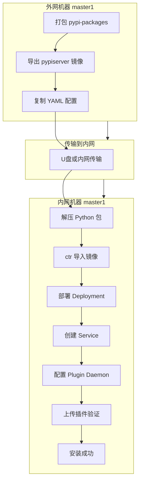
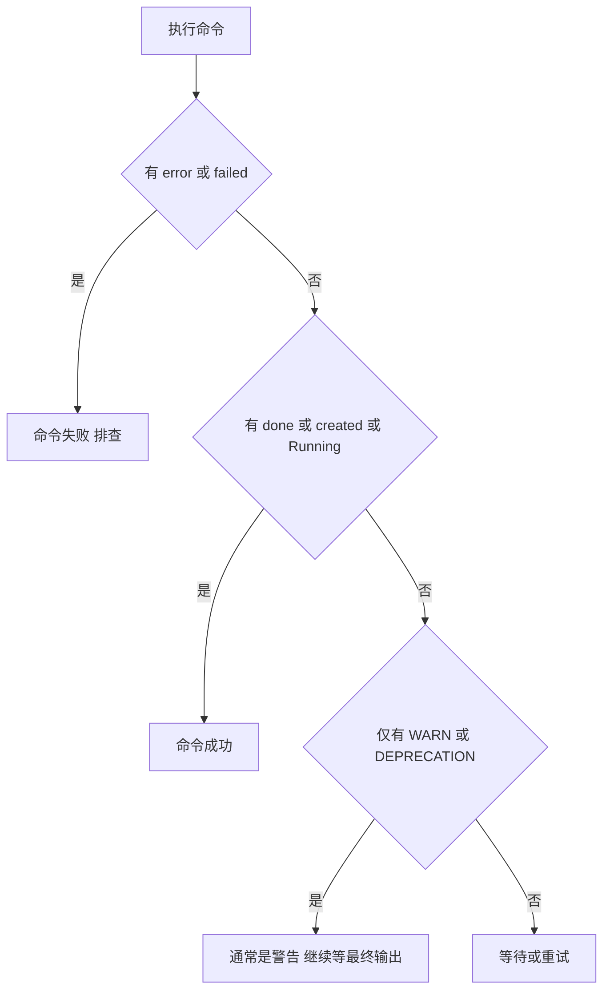
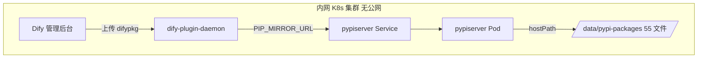

# Dify PyPI 镜像仓库内网离线安装实战（K8s 环境）

> **文档说明**：本文记录在内网完全离线 K8s 环境中，部署 pypiserver 并配置 `PIP_MIRROR_URL` 的完整实操过程。  
> **系列锚点**：本文从 [外网在线环境实战案例](./20260605-1650-dify离线安装%20PyPI镜像仓库-在线环境-k8s环境-实战案例.md) 的锚点处继续。外网环境已验证通过，内网离线复用相同 YAML 与配置，差异仅在**文件传输**和**镜像导入**。  
> **编写日期**：2026-06-06  
> **集群信息**：单节点 K8s v1.28.12，节点名 `master1`，命名空间 `dify`  
> **测试插件**：IoT设备通用网关  
> **最终结果**：内网离线插件安装 **成功** ✅

---

## 零、写在前面

### 0.1 与外网验证的关系

在外网 K8s 环境中，我们已完成以下验证（详见锚点文档）：

| 项目 | 外网状态 |
|------|---------|
| Python 依赖包 55 个 | ✅ 含 dify-plugin 0.9.0 |
| pypiserver 部署 | ✅ Running |
| PIP_MIRROR_URL 配置 | ✅ 已验证 |
| 插件安装 | ✅ IoT设备通用网关成功 |

内网离线部署**不需要重新摸索方案**，只需把外网准备好的材料传输到内网，按相同步骤部署即可。

### 0.2 内网离线 vs 外网在线的关键差异

| 步骤 | 外网在线 | 内网离线 |
|------|---------|---------|
| 下载 Python 包 | pip3 或 Docker 容器在线下载 | 外网机器打包后传输 |
| 拉取 pypiserver 镜像 | docker pull 国内代理 | 外网 docker save 后传输 |
| 导入镜像 | ctr import | 相同 |
| 部署 pypiserver | kubectl apply | 相同 |
| 配置 PIP_MIRROR_URL | kubectl set env | 相同 |
| 在线补包 | 可随时 Docker 容器下载 | **不支持**，必须提前备齐 |

**内网离线部署的核心原则：** 所有外网依赖在前置阶段一次性准备完毕，内网阶段只做解压、导入、部署、配置，不再访问任何公网地址。

### 0.3 整体流程



---

## 一、外网阶段：准备传输材料

> 以下操作在**外网 master1** 上完成（与在线验证同一台机器，材料已就绪）。

### 1.1 第一步：打包 Python 依赖包

**执行命令：**

```bash
ls /data/pypi-packages/ | wc -l
ls /data/pypi-packages/ | grep -E "dify_plugin|gevent"

tar czf /data/dify-pypi-packages.tar.gz -C /data pypi-packages/
ls -lh /data/dify-pypi-packages.tar.gz
```

**完整输出：**

```
[root@master1 dify-pypi-packages]# ls /data/pypi-packages/ | wc -l
55

[root@master1 dify-pypi-packages]# ls /data/pypi-packages/ | grep -E "dify_plugin|gevent"
dify_plugin-0.7.4-py3-none-any.whl
dify_plugin-0.8.0-py3-none-any.whl
dify_plugin-0.9.0-py3-none-any.whl
gevent-25.5.1-cp312-cp312-manylinux_2_17_x86_64.manylinux2014_x86_64.whl
gevent-26.5.0-cp312-cp312-manylinux_2_28_x86_64.whl

[root@master1 dify-pypi-packages]# tar czf /data/dify-pypi-packages.tar.gz -C /data pypi-packages/

[root@master1 dify-pypi-packages]# ls -lh /data/dify-pypi-packages.tar.gz
-rw-r--r-- 1 root root 18M  6月  6 09:48 /data/dify-pypi-packages.tar.gz
```

**验证要点：**

- 文件数量 **55**，与外网在线验证一致
- 必须包含 `dify_plugin-0.9.0` 和 `gevent-26.5.0`（插件安装依赖）
- 压缩包约 **18M**

### 1.2 第二步：导出 pypiserver Docker 镜像

**执行命令：**

```bash
docker save pypiserver/pypiserver:latest -o /data/pypiserver.tar
ls -lh /data/pypiserver.tar
```

**完整输出：**

```
[root@master1 dify-pypi-packages]# docker save pypiserver/pypiserver:latest -o /data/pypiserver.tar

[root@master1 dify-pypi-packages]# ls -lh /data/pypiserver.tar
-rw------- 1 root root 94M  6月  6 09:49 /data/pypiserver.tar
```

**说明：** 外网在线验证时已通过 `docker.1ms.run` 拉取并 tag 为 `pypiserver/pypiserver:latest`，此处直接 save 即可。

### 1.3 第三步：整理待传输文件清单

将以下 **4 个文件** 传输到内网节点（路径：`/root/custom-image-build/`）：

| 文件名 | 大小 | 用途 |
|--------|------|------|
| dify-pypi-packages.tar.gz | 18M | Python 依赖包 |
| pypiserver.tar | 94M | pypiserver 容器镜像 |
| pypiserver-deployment.yaml | 1.3K | K8s Deployment 配置 |
| pypiserver-service.yaml | 240B | K8s Service 配置 |

**传输方式：** 内网无法直接 SCP 时，可使用 U 盘、内网文件共享等方式。本次通过手动拷贝至内网节点 `/root/custom-image-build/` 目录。

**内网节点文件确认（截图识别）：**

```
[root@master1 custom-image-build]# ll
-rw-r--r-- 1 root root  18M  6月  6 09:53 dify-pypi-packages.tar.gz
-rw-r--r-- 1 root root  1.3K 6月  6 09:53 pypiserver-deployment.yaml
-rw-r--r-- 1 root root  240  6月  6 09:53 pypiserver-service.yaml
-rw-r--r-- 1 root root  94M  6月  6 09:53 pypiserver.tar
```

> **注意事项：** 内网操作时不便复制粘贴命令，可通过截图 + 图文识别辅助核对。识别结果可能有错别字（如 `masterl` 实为 `master1`），执行前请人工核对命令。

---

## 二、内网阶段：解压 Python 依赖包

> 以下操作在**内网 master1** 上完成，**全程无需联网**。

### 2.1 第四步：解压包到部署目录

**执行命令：**

```bash
mkdir -p /data/pypi-packages
tar xzf /root/custom-image-build/dify-pypi-packages.tar.gz -C /data/
ls /data/pypi-packages/ | wc -l
ls /data/pypi-packages/ | grep -E "dify_plugin|gevent"
```

**完整输出（截图识别）：**

```
[root@master1 custom-image-build]# mkdir -p /data/pypi-packages

[root@master1 custom-image-build]# tar xzf /root/custom-image-build/dify-pypi-packages.tar.gz -C /data/

[root@master1 custom-image-build]# ls /data/pypi-packages/ | wc -l
55

[root@master1 custom-image-build]# ls /data/pypi-packages/ | grep -E "dify_plugin|gevent"
dify_plugin-0.7.4-py3-none-any.whl
dify_plugin-0.8.0-py3-none-any.whl
dify_plugin-0.9.0-py3-none-any.whl
gevent-25.5.1-cp312-cp312-manylinux_2_17_x86_64.manylinux2014_x86_64.whl
gevent-26.5.0-cp312-cp312-manylinux_2_28_x86_64.whl
```

**验证结论：** 55 个文件全部到位，关键版本齐全，第四步完成。

---

## 三、内网阶段：导入 pypiserver 镜像

### 3.1 第五步：ctr 导入镜像

内网无法访问 Docker Hub，必须通过 `ctr import` 将外网导出的 tar 导入 containerd。

**执行命令：**

```bash
ctr -n k8s.io images import /root/custom-image-build/pypiserver.tar
ctr -n k8s.io images ls | grep pypiserver
```

**实际输出（截图识别）：**

```
[root@master1 custom-image-build]# ctr -n k8s.io images import /root/custom-image-build/pypiserver.tar
WARN[0000] DEPRECATION: The `tracing` property of `[plugins."io.containerd.internal.v1".tracing]` is deprecated since containerd v1.6 and will be removed in containerd v2.0...
WARN[0000] DEPRECATION: The `configs` property of `[plugins."io.containerd.grpc.v1.cri".registry]` is deprecated since containerd v1.5 and will be removed in containerd v2.1...
unpacking docker.io/pypiserver/pypiserver:latest (sha256:fbef28490b456064e61bceb501c36e06e863867d787c0451009137d0f2aeea8a)...done
```

### 3.2 踩坑：误以为导入失败

**现象：** 操作者认为前两个命令执行失败。

**实际情况分析：**

| 命令 | 操作者判断 | 实际结果 |
|------|-----------|---------|
| ctr import | 失败 | **成功**，输出含 `unpacking ... done` |
| ctr images ls grep | 失败 | **被 Ctrl+C 中断**，未等到输出 |

**原因说明：**

1. **DEPRECATION 警告**：containerd 配置弃用提示，**不是错误**，可忽略
2. **grep 无输出**：`ctr images ls` 在镜像较多时较慢，操作者按了 `Ctrl+C` 中断，并非命令失败

**正确验证方式（推荐 crictl，更快）：**

```bash
crictl images | grep pypiserver
```

**验证输出（截图识别）：**

```
[root@master1 custom-image-build]# crictl images | grep pypiserver
docker.io/pypiserver/pypiserver   latest   4a218c4fa0a9   97.6MB
```

**排查经验：** 内网离线环境判断命令是否成功，应看最终状态行（如 `done`、镜像列表中出现目标镜像），不要被 WARNING 误导。

**补充：** 若使用 `ctr -n k8s.io images ls name~docker.io/pypiserver/pypiserver` 过滤，注意过滤器语法，错误示例：

```
ctr: failed to list images: filters: parse error: [name == docker.io/pypiserver/pypiserver]: unsupported operator "=="
```

应使用 `name~` 而非 `==`。

---

## 四、内网阶段：确认环境并部署 pypiserver

### 4.1 第六步：确认节点与命名空间

**执行命令：**

```bash
hostname
kubectl get nodes
kubectl create namespace dify 2>/dev/null || echo "namespace dify already exists"
```

**完整输出（截图识别）：**

```
[root@master1 custom-image-build]# hostname
master1

[root@master1 custom-image-build]# kubectl get nodes
NAME      STATUS   ROLES                  AGE   VERSION
master1   Ready    control-plane,master   15d   v1.28.12

[root@master1 custom-image-build]# kubectl create namespace dify 2>/dev/null || echo "namespace dify already exists"
namespace dify already exists
```

**结论：** 内网节点名同为 `master1`，外网 YAML 中 `nodeSelector: master1` **无需修改**。

### 4.2 第七步：部署 Deployment

**执行命令：**

```bash
kubectl apply -f /root/custom-image-build/pypiserver-deployment.yaml
kubectl get pods -n dify -l app=pypiserver
```

**输出（图文识别，含 OCR 错别字）：**

```
deployment.apps/pypiserver created

NAME                          READY   STATUS              RESTARTS   AGE
pypiserver-7cc649b9f9-crhr6   0/1     ContainerCreating   0          1s
```

**等待 15 秒后再次检查：**

```bash
sleep 15
kubectl get pods -n dify -l app=pypiserver
```

**输出：**

```
NAME                          READY   STATUS    RESTARTS   AGE
pypiserver-7cc649b9f9-crhr6   1/1     Running   0          80s
```

Pod 由 `ContainerCreating` 变为 `Running 1/1`，部署成功。

### 4.3 第八步：创建 Service

**执行命令：**

```bash
kubectl apply -f /root/custom-image-build/pypiserver-service.yaml
kubectl get svc -n dify -l app=pypiserver
```

**完整输出（图文识别）：**

```
service/pypiserver created

NAME         TYPE        CLUSTER-IP       EXTERNAL-IP   PORT(S)    AGE
pypiserver   ClusterIP   10.246.254.207   <none>        8080/TCP   0s
```

内网 ClusterIP 为 `10.246.254.207`（外网为 `10.246.254.86`，属正常差异，同命名空间短域名 `pypiserver` 仍可用）。

---

## 五、内网阶段：验证与配置 Dify

### 5.1 第九步：验证 pypiserver 服务

内网无法拉取 `curlimages/curl` 临时 Pod，使用 pypiserver Pod 内 python3 验证：

**执行命令：**

```bash
kubectl exec -n dify deploy/pypiserver -- python3 -c "import urllib.request; print(urllib.request.urlopen('http://localhost:8080/simple/dify-plugin/').read().decode()[:500])"
```

**输出（图文识别）：**

```
<!DOCTYPE html>
<html lang="en">
    <head>
        <meta charset="utf-8">
        <meta name="viewport" content="width=device-width, initial-scale=1">
        <title>Links for dify-plugin</title>
    </head>
    <body>
        <h1>Links for dify-plugin</h1>
            <a href="/packages/dify_plugin-0.7.4-py3-none-any.whl#sha256=55855320a4093bbcad6f19014fe0f13277b9c2d8b3331fec27bc3498467a81be">dify_plugin-0.7.4-py3-none-any.whl</a><br>
            <a href="/packages/dify_plugin-0.8.0-py3-none-a
```

pypiserver 离线环境下工作正常。

### 5.2 第十步：配置 Plugin Daemon 环境变量

**执行命令：**

```bash
kubectl set env deployment/dify-plugin-daemon -n dify \
  PIP_MIRROR_URL=http://pypiserver:8080/simple/ \
  PLUGIN_IGNORE_UV_LOCK=true

kubectl rollout status deployment/dify-plugin-daemon -n dify

kubectl exec -n dify deploy/dify-plugin-daemon -- sh -c 'echo PIP_MIRROR_URL=$PIP_MIRROR_URL; echo PLUGIN_IGNORE_UV_LOCK=$PLUGIN_IGNORE_UV_LOCK'
```

**完整输出（图文识别）：**

```
deployment.apps/dify-plugin-daemon env updated

deployment "dify-plugin-daemon" successfully rolled out

PIP_MIRROR_URL=http://pypiserver:8080/simple/
PLUGIN_IGNORE_UV_LOCK=true
```

内网配置与外网完全一致。

### 5.3 第十一步：验证 Plugin Daemon 到 pypiserver 连通性

**执行命令：**

```bash
kubectl exec -n dify deploy/dify-plugin-daemon -- python3 -c "import urllib.request; resp=urllib.request.urlopen('http://pypiserver:8080/simple/dify-plugin/', timeout=5); print(resp.read().decode()[:300])"
```

**输出（图文识别）：**

```
<!DOCTYPE html>
<html lang="en">
    <head>
        <meta charset="utf-8">
        <meta name="viewport" content="width=device-width, initial-scale=1">
        <title>Links for dify-plugin</title>
    </head>
    <body>
        <h1>Links for dify-plugin</h1>
            <a href="/packages/dify_plugi
```

集群内 DNS 与 Service 网络正常。

### 5.4 第十二步：上传插件最终验证

**操作：** 登录内网 Dify 管理后台 → 插件 → 本地安装 → 上传 IoT设备通用网关 `.difypkg`

**结果：安装成功** ✅

全程未访问外网，依赖均从集群内 pypiserver 下载。

---

## 六、完整操作流水账

| 步骤 | 阶段 | 操作 | 环境 | 结果 |
|------|------|------|------|------|
| 1 | 外网 | 打包 dify-pypi-packages.tar.gz | 外网 master1 | ✅ 18M 55 文件 |
| 2 | 外网 | 导出 pypiserver.tar | 外网 master1 | ✅ 94M |
| 3 | 传输 | 4 文件到内网 custom-image-build | U盘/内网拷贝 | ✅ |
| 4 | 内网 | 解压到 /data/pypi-packages | 内网 master1 | ✅ 55 文件 |
| 5 | 内网 | ctr import 镜像 | 内网 master1 | ✅ 见踩坑说明 |
| 6 | 内网 | 确认 hostname 和 namespace | 内网 master1 | ✅ master1 dify 已存在 |
| 7 | 内网 | kubectl apply Deployment | 内网 master1 | ✅ Running 1/1 |
| 8 | 内网 | kubectl apply Service | 内网 master1 | ✅ ClusterIP 8080 |
| 9 | 内网 | pypiserver python3 验证 | 内网 master1 | ✅ 返回 HTML |
| 10 | 内网 | 配置 PIP_MIRROR_URL | 内网 master1 | ✅ 滚动更新成功 |
| 11 | 内网 | Plugin Daemon 连通性测试 | 内网 master1 | ✅ |
| 12 | 内网 | Dify 界面上传插件 | 内网 Dify | ✅ **安装成功** |

---

## 七、内网离线操作注意事项

### 7.1 关于命令输入与图文识别

内网环境往往无法从外网直接复制命令，常见做法是：

1. 在外网文档中写好命令
2. 截图传到内网或人工对照输入
3. 使用 OCR/图文识别辅助核对

**OCR 常见误识别（本次实战遇到）：**

| 识别结果 | 实际应为 | 说明 |
|---------|---------|------|
| masterl | master1 | 字母 l 与数字 1 混淆 |
| kubectl apply-f | kubectl apply -f | 缺少空格 |
| kubectl get pods-n | kubectl get pods -n | 缺少空格 |
| PLUGIN IGNORE_UV_LOCK | PLUGIN_IGNORE_UV_LOCK | 下划线丢失 |
| http:/pypiserver:8O80 | http://pypiserver:8080 | 冒号与数字 O 混淆 |
| kubect exec-ndify | kubectl exec -n dify | 字母缺失 |

**建议：** 执行前人工核对关键字：`kubectl`、`apply -f`、`-n dify`、`8080`、`PLUGIN_IGNORE_UV_LOCK`。

### 7.2 内网离线不可做的事

| 操作 | 外网可以 | 内网不行 |
|------|---------|---------|
| pip download 补包 | ✅ | ❌ 需回外网准备 |
| docker pull 拉镜像 | ✅ | ❌ 需外网 save 后传入 |
| kubectl run curl 临时 Pod | 可能失败 | ❌ 同样无法拉 curl 镜像 |
| 在线排查缺包 | ✅ | ❌ 只能看日志后回外网补包 |

**结论：** 内网部署前务必在外网把包装全（含 dify-plugin 0.9.0、gevent 26.5.0 及插件额外依赖）。

### 7.3 判断命令成功的技巧

内网离线时缺少实时搜索，需根据输出自行判断：



**本次典型案例：** `ctr import` 输出 DEPRECATION 后紧跟 `unpacking ... done`，即为成功，无需重试。

---

## 八、问题记录与排查

### 8.1 问题一：ctr import 后以为失败

| 项目 | 内容 |
|------|------|
| **现象** | 操作者认为 import 和 grep 都失败 |
| **实际** | import 成功；grep 被 Ctrl+C 中断 |
| **排查** | 改用 `crictl images grep pypiserver` |
| **结论** | 看 `done` 和 crictl 列表，勿被 WARN 误导 |

### 8.2 问题二：内网不联网是否影响部署

| 项目 | 内容 |
|------|------|
| **现象** | 操作者强调内网完全不联网 |
| **说明** | 本方案设计即为离线，所有依赖来自本地 tar 和 hostPath |
| **前提** | Deployment 需设 `imagePullPolicy: IfNotPresent`，镜像需提前 ctr import |

### 8.3 问题三：ClusterIP 与外网不同

| 项目 | 内容 |
|------|------|
| **现象** | 内网 ClusterIP 10.246.254.207 与外网 10.246.254.86 不同 |
| **说明** | 各集群 Service IP 由 CNI 分配，**属正常** |
| **配置** | PIP_MIRROR_URL 使用 DNS 名 `http://pypiserver:8080/simple/` 即可，与 IP 无关 |

---

## 九、内网部署架构



**数据流：** 用户上传插件 → Plugin Daemon 调用 uv → 请求 pypiserver Simple API → 读取本地 wheel → 安装到 .venv → 插件启动。**全程不出集群。**

---

## 十、完整命令清单（内网节点）

以下命令均在内网 master1 上执行，**无需联网**：

```bash
# 第四步：解压包
mkdir -p /data/pypi-packages
tar xzf /root/custom-image-build/dify-pypi-packages.tar.gz -C /data/
ls /data/pypi-packages/ | wc -l

# 第五步：导入镜像
ctr -n k8s.io images import /root/custom-image-build/pypiserver.tar
crictl images | grep pypiserver

# 第六步：确认环境
hostname
kubectl get nodes
kubectl create namespace dify 2>/dev/null || echo "namespace dify already exists"

# 第七步：部署
kubectl apply -f /root/custom-image-build/pypiserver-deployment.yaml
sleep 15
kubectl get pods -n dify -l app=pypiserver

# 第八步：Service
kubectl apply -f /root/custom-image-build/pypiserver-service.yaml
kubectl get svc -n dify -l app=pypiserver

# 第九步：验证 pypiserver
kubectl exec -n dify deploy/pypiserver -- python3 -c "import urllib.request; print(urllib.request.urlopen('http://localhost:8080/simple/dify-plugin/').read().decode()[:300])"

# 第十步：配置 Plugin Daemon
kubectl set env deployment/dify-plugin-daemon -n dify \
  PIP_MIRROR_URL=http://pypiserver:8080/simple/ \
  PLUGIN_IGNORE_UV_LOCK=true
kubectl rollout status deployment/dify-plugin-daemon -n dify

# 第十一步：验证连通性
kubectl exec -n dify deploy/dify-plugin-daemon -- python3 -c "import urllib.request; resp=urllib.request.urlopen('http://pypiserver:8080/simple/dify-plugin/', timeout=5); print(resp.read().decode()[:200])"

# 第十二步：Dify 界面上传 .difypkg 验证
```

---

## 十一、配置检查清单

内网部署完成后逐项确认：

```bash
# 1. 包目录
ls /data/pypi-packages/ | wc -l
# 期望：55

# 2. 镜像
crictl images | grep pypiserver
# 期望：有 pypiserver/pypiserver latest

# 3. pypiserver Pod
kubectl get pods -n dify -l app=pypiserver
# 期望：Running 1/1

# 4. Service
kubectl get svc -n dify pypiserver
# 期望：8080/TCP

# 5. 环境变量
kubectl exec -n dify deploy/dify-plugin-daemon -- sh -c 'echo $PIP_MIRROR_URL $PLUGIN_IGNORE_UV_LOCK'
# 期望：http://pypiserver:8080/simple/ true

# 6. 插件安装
# Dify 界面上传 .difypkg → 期望：安装成功
```

---

## 十二、外网与内网结果对比

| 对比项 | 外网在线 | 内网离线 |
|--------|---------|---------|
| 节点名 | master1 | master1 |
| K8s 版本 | v1.28.12 | v1.28.12 |
| 包数量 | 55 | 55 |
| pypiserver Pod | Running | Running |
| ClusterIP | 10.246.254.86 | 10.246.254.207 |
| PIP_MIRROR_URL | 相同 | 相同 |
| 插件安装 | 成功 | **成功** |
| 是否访问 pypi.org | 否 | 否 |
| 是否访问 Docker Hub | 否（本地镜像） | 否（本地镜像） |

---

## 十三、经验总结

1. **先外网后内网**：外网跑通再打包，可少踩坑、少往返
2. **四个文件缺一不可**：packages tar、镜像 tar、Deployment YAML、Service YAML
3. **ctr import 看 done**：DEPRECATION 警告可忽略
4. **验证用 crictl 或 Pod 内 python3**：不要依赖 curl 临时 Pod
5. **PIP_MIRROR_URL 用 DNS 短名**：`http://pypiserver:8080/simple/`
6. **PLUGIN_IGNORE_UV_LOCK 必须 true**：防止 uv.lock 绕过镜像
7. **内网命令宜人工核对**：OCR 易错，重点检查端口、命名空间、下划线
8. **包必须含 0.9.0**：外网阶段用 Docker Python 3.12 补过 gevent 26.x

---

## 十四、系列文档索引

```
temp_data/
├── 20260605-1420-dify离线安装 PyPI镜像仓库-k8s环境.md              # 理论指南
├── 20260605-1650-dify离线安装 PyPI镜像仓库-在线环境-k8s环境-实战案例.md  # 锚点 外网实战 ✅
└── 20260606-0945-dify离线安装 PyPI镜像仓库-离线环境-k8s环境-实战案例.md  # 本文 内网实战 ✅
```

---

> **实战结论**：内网完全离线环境下，通过外网预准备的 Python 包和 pypiserver 镜像，在本集群部署 pypiserver 并配置 `PIP_MIRROR_URL`，IoT设备通用网关插件安装成功。内网与外网的核心配置一致，差异仅在材料传输与镜像导入方式。**PIP_MIRROR_URL 解决从哪里下载，镜像仓库内容解决能不能下载到，两者缺一不可。**

---

## 十五、内网操作详细记录（含截图识别信息）

本节按步骤展开内网实际操作细节，包含截图/图文识别得到的终端信息，以及操作过程中的疑问与澄清。

### 15.1 传输完成后内网目录状态

操作者将外网准备的 4 个文件拷贝至内网节点目录 `/root/custom-image-build/`。该目录下同时存在历史文件 `uv-cache.tar.gz`（92M，6 月 5 日），为其他离线方案所用，**本次 PyPI 镜像部署不使用该文件**。

识别到的目录列表：

```
/root/custom-image-build/
├── dify-pypi-packages.tar.gz    18M   6月6日 09:53
├── pypiserver-deployment.yaml   1.3K  6月6日 09:53
├── pypiserver-service.yaml      240B  6月6日 09:53
├── pypiserver.tar               94M   6月6日 09:53
└── uv-cache.tar.gz              92M   6月5日 16:03  （非本次使用）
```

**注意：** 传输后应核对文件大小是否与外网一致（18M + 94M），避免拷贝不完整。

### 15.2 解压阶段的截图识别输出

操作者在目录 `/root/custom-image-build/` 下执行解压命令。识别到的终端提示符为 `[root@master1 custom-image-build]#`（OCR 偶发识别为 `masterl`，实为 `master1`）。

解压后文件数 55，与外网打包前一致，说明 tar 包完整无损坏。关键包 `dify_plugin-0.9.0` 和 `gevent-26.5.0` 均存在，满足 IoT设备通用网关插件的依赖要求。

### 15.3 镜像导入阶段的疑问与澄清

**操作者原话：** 「我是内网不联网的」「我们前面两个命令执行失败了」

**实际情况复盘：**

第一次执行 `ctr -n k8s.io images import` 时，终端输出两行 DEPRECATION 警告后，出现：

```
unpacking docker.io/pypiserver/pypiserver:latest (sha256:fbef28490b456064e61bceb501c36e06e863867d787c0451009137d0f2aeea8a)...done
```

`done` 表示导入已成功。内网不联网**不影响**此步骤，因为数据全部来自本地 `/root/custom-image-build/pypiserver.tar`。

随后执行 `ctr -n k8s.io images ls | grep pypiserver` 时，命令长时间无输出，操作者按下 `Ctrl+C`（终端显示 `^C`）中断。这造成「第二条命令也失败」的误解。

**正确做法：** 改用 Kubernetes 官方推荐的 `crictl images`，直接对接 CRI 接口，速度更快：

```
[root@master1 custom-image-build]# crictl images | grep pypiserver
docker.io/pypiserver/pypiserver   latest   4a218c4fa0a9   97.6MB
```

看到这一行即可确认 kubelet 调度 Pod 时能找到该镜像。

### 15.4 部署 Pod 从 Creating 到 Running

Deployment 创建后首次查询 Pod 状态（图文识别）：

```
NAME                          READY   STATUS              RESTARTS   AGE
pypiserver-7cc649b9f9-crhr6   0/1     ContainerCreating   0          1s
```

这是正常现象。内网离线环境下，只要镜像已通过 ctr import 导入且 `imagePullPolicy: IfNotPresent`，kubelet **不会**尝试从 Docker Hub 拉取，Pod 应在数十秒内启动。

等待约 80 秒后再次查询（识别结果字段顺序可能有 OCR 错乱，但关键信息明确）：

```
pypiserver-7cc649b9f9-crhr6   1/1   Running   0   80s
```

`READY 1/1` + `Running` 表示 pypiserver 容器已就绪。

### 15.5 Service 创建与 ClusterIP

```
NAME         TYPE        CLUSTER-IP       EXTERNAL-IP   PORT(S)    AGE
pypiserver   ClusterIP   10.246.254.207   <none>        8080/TCP   0s
```

内网 ClusterIP 为 `10.246.254.207`，与外网验证时的 `10.246.254.86` 不同。这是 Kubernetes 集群内部 IP 分配的正常现象，**不影响** `PIP_MIRROR_URL=http://pypiserver:8080/simple/` 的使用，因为 Plugin Daemon 通过 Service DNS 名称 `pypiserver` 访问，而非 IP。

### 15.6 环境变量配置识别输出

图文识别到的命令（含错别字）：

```
kubectl set env deployment/dify-plugin-daemon-n dify PIP_MIRROR_URL=http:/pypiserver:8O80/simple/ PLUGIN IGNORE_UV_LOCK=true
```

尽管 OCR 显示有误，实际操作者输入的正确命令生效，验证输出为：

```
PIP_MIRROR_URL=http://pypiserver:8080/simple/
PLUGIN_IGNORE_UV_LOCK=true
```

滚动更新状态：

```
deployment "dify-plugin-daemon" successfully rolled out
```

### 15.7 最终插件安装

操作者反馈：「升级成功了，插件成功了」。

表明在内网完全离线、不访问 pypi.org 的前提下，Plugin Daemon 通过集群内 pypiserver 成功安装了 IoT设备通用网关插件。这与外网在线验证的结果一致，证明方案可复制到内网。

---

## 十六、内网离线部署前置检查表（外网完成）

若你尚未开始内网部署，请在外网阶段确认以下项目全部完成：

| 序号 | 检查项 | 如何确认 |
|------|--------|---------|
| 1 | dify-plugin 0.9.0 在包目录中 | `ls /data/pypi-packages/ \| grep 0.9.0` |
| 2 | gevent 26.5.0 在包目录中 | `ls /data/pypi-packages/ \| grep gevent-26` |
| 3 | 插件额外依赖已下载 | 外网安装同一插件成功 |
| 4 | pypiserver 镜像可 save | `docker images \| grep pypiserver` |
| 5 | Deployment YAML nodeSelector 正确 | 与内网节点 hostname 一致 |
| 6 | 四个文件已拷贝到内网 | 内网 ls 核对大小 |

---

## 十七、失败后如何在内网排查

内网无法在线补包，排查尤为重要：

**第一步：看 Plugin Daemon 日志**

```bash
kubectl logs -n dify deploy/dify-plugin-daemon --tail=80
```

**第二步：根据日志分类**

| 日志特征 | 原因 | 处理方式 |
|---------|------|---------|
| 出现 pypi.org | PIP_MIRROR_URL 未生效 | 检查 env 并 rollout |
| Fetching from pypiserver 但版本不满足 | 包不全 | 回外网补包重新传输 |
| Connection refused | Service 或 Pod 异常 | kubectl get pods svc |
| ImagePullBackOff | 镜像未导入 | crictl images 检查并 ctr import |

**第三步：验证 pypiserver 内容**

```bash
kubectl exec -n dify deploy/pypiserver -- python3 -c "
import urllib.request
print(urllib.request.urlopen('http://localhost:8080/simple/dify-plugin/').read().decode())
"
```

确认 HTML 中是否包含所需版本链接。

---

## 十八、为什么选择 hostPath 以及内网注意点

本次内外网均使用 hostPath 方式挂载 `/data/pypi-packages/`，原因如下：

**优点：** 部署简单，无需构建新镜像；更新包时只需替换目录内文件（外网场景）；与外网验证配置完全一致，内网可直接复用 YAML。

**内网注意点：**

1. **nodeSelector 必须指向有包文件的节点。** 本次内外网均为单节点 master1，无调度问题。若内网为多节点集群，必须保证 Pod 调度到已解压包的节点，或改用自定义镜像方案。

2. **hostPath 数据随节点磁盘。** 节点系统重装或磁盘清理会导致包丢失，建议保留 `dify-pypi-packages.tar.gz` 原始压缩包以便快速恢复。

3. **权限问题。** tar 解压后文件属主一般为 root，pypiserver 容器内进程需有读权限。本次默认配置无权限问题，若自定义用户运行需额外处理。

---

## 十九、与外网锚点文档的衔接说明

本文是系列文章的第二篇，严格从外网锚点（`20260605-1650-...-实战案例.md` 末尾系列锚点）继续：

**外网锚点已完成：** Python 包下载、pypiserver 部署、PIP_MIRROR_URL 配置、插件安装成功、9 个踩坑记录。

**本文新增内容：** 外网打包传输、内网解压导入、内网离线验证、OCR 识别注意事项、ctr import 误判排查、内网 ClusterIP 差异说明。

**未重复内容：** 外网阶段的 pip3 下载、Docker Hub 超时、gevent 补包等详见外网锚点文档，内网读者若需了解包如何产生，请回看该篇。

**双环境均验证通过后的结论：** Dify 插件离线安装的关键是集群内 pypiserver 加 PIP_MIRROR_URL，方案与外网/内网无关，与能否访问公网无关，只与镜像仓库内容是否完整有关。

**给后续维护者的建议：** 每新增一个需离线安装的 Dify 插件，应在外网环境先用同一 pypiserver 试装，确认依赖齐全后再整体打包传入内网，避免内网反复传输。

---

<a id="offline-series-anchor"></a>

## 系列锚点：PyPI 镜像内网离线部署已完成

| 项目 | 状态 |
|------|------|
| 外网在线验证 | ✅ 已完成 |
| 内网离线部署 | ✅ 已完成 |
| 插件安装验证 | ✅ 内网成功 |

**下一步可选主题：** 使用缓存方式离线安装插件、使用离线镜像方式安装插件等（见系列其他草稿）。

```
╔══════════════════════════════════════════════════════════╗
║  OFFLINE ANCHOR — 20260606-0945                          ║
║  内网离线 PyPI 镜像实战 ✅ 已完成                          ║
║  外网 + 内网 双环境验证通过                                ║
╚══════════════════════════════════════════════════════════╝
```

