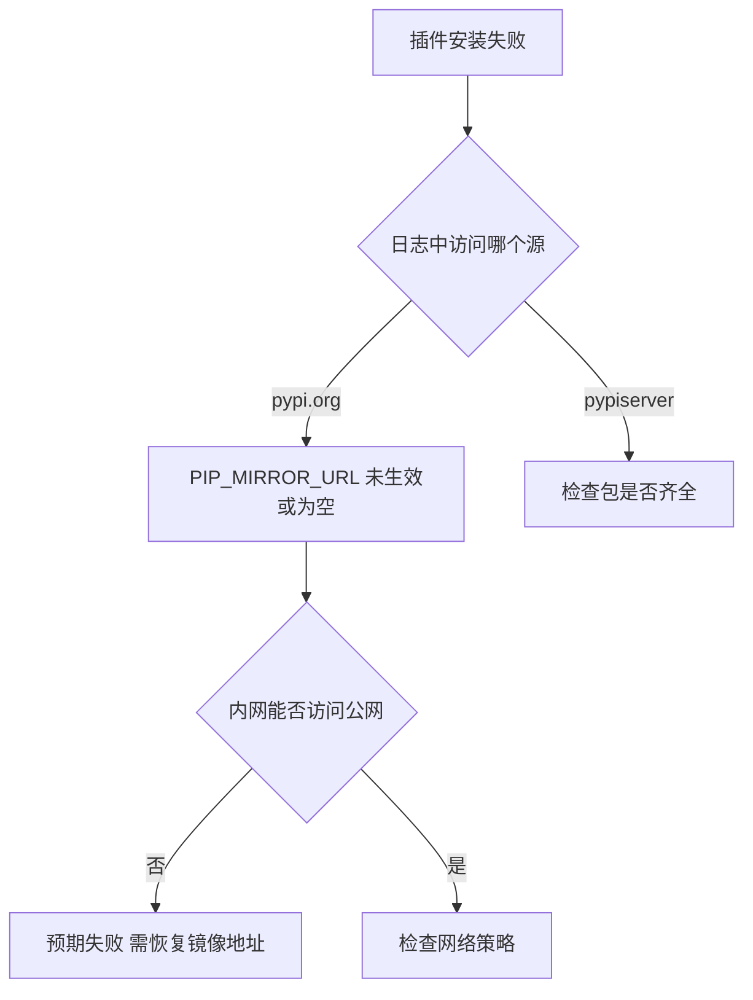
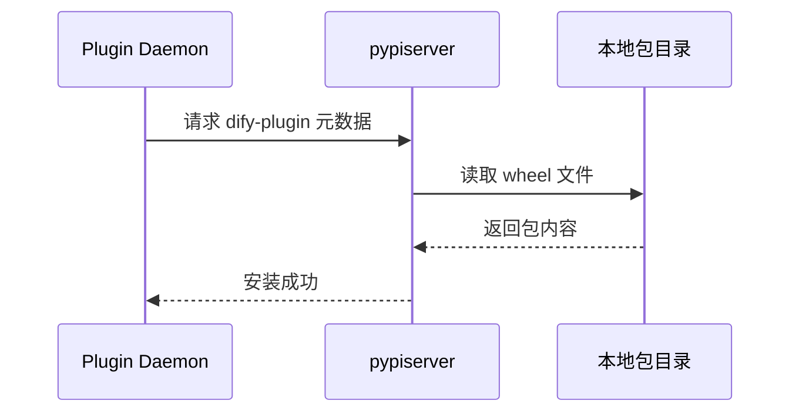
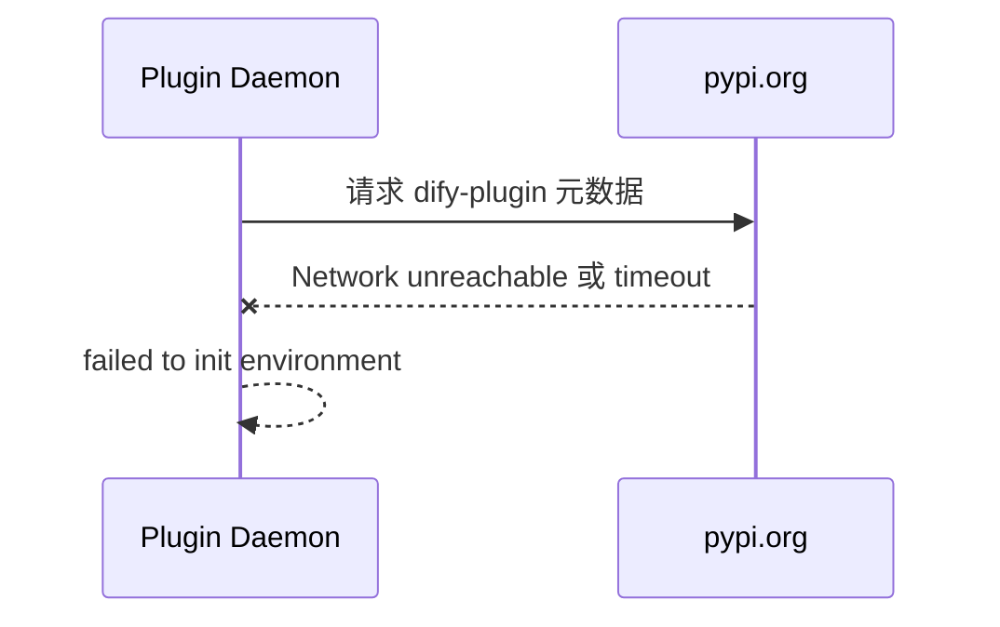

# Dify 实验：内网离线环境下 PIP_MIRROR_URL 置空会发生什么

> **文档说明**：本文记录在内网离线 K8s 环境中，将 `PIP_MIRROR_URL` 设置为空字符串的对照实验，验证该环境变量对插件安装的实际影响。  
> **前置条件**：内网 pypiserver 已部署完成，插件安装已成功（详见 [内网离线实战案例](./20260606-0945-dify离线安装%20PyPI镜像仓库-离线环境-k8s环境-实战案例.md)）。  
> **编写日期**：2026-06-06  
> **实验环境**：内网 master1，K8s v1.28.12，命名空间 dify，完全离线  
> **测试插件**：IoT设备通用网关（your-name/iot_device_http:0.0.8）

---

## 一、实验背景与目的

### 1.1 为什么要做这个实验

在内网离线环境中，我们已通过以下配置成功安装插件：

| 环境变量 | 值 |
|---------|-----|
| PIP_MIRROR_URL | http://pypiserver:8080/simple/ |
| PLUGIN_IGNORE_UV_LOCK | true |

一个自然的问题是：**如果把 `PIP_MIRROR_URL` 改成空字符串，Plugin Daemon 会怎么做？**

本实验目的：

1. 验证 `PIP_MIRROR_URL` 为空时，uv 实际访问哪个下载源
2. 观察内网离线环境下的报错现象
3. 与配置镜像地址时的成功结果形成对照
4. 加深对 `PIP_MIRROR_URL` 必要性的理解

### 1.2 实验假设

| 假设 | 预期 |
|------|------|
| PIP_MIRROR_URL 为空 | Plugin Daemon 回退到默认 PyPI 源 pypi.org |
| 内网无法访问 pypi.org | 插件安装失败，报网络超时 |
| PLUGIN_IGNORE_UV_LOCK 仍为 true | 仅影响 uv.lock，不能替代镜像地址 |

### 1.3 实验流程概览


---

## 二、实验前基线状态

实验开始前，内网环境处于**正常工作状态**：

```bash
# 环境变量
PIP_MIRROR_URL=http://pypiserver:8080/simple/
PLUGIN_IGNORE_UV_LOCK=true

# pypiserver Pod
Running 1/1

# 插件安装
IoT设备通用网关 安装成功
```

---

## 三、实验第一步：将 PIP_MIRROR_URL 置空

### 3.1 执行命令

在内网 master1 上执行：

```bash
kubectl set env deployment/dify-plugin-daemon -n dify PIP_MIRROR_URL=""
```

### 3.2 完整输出（图文识别）

```
[root@master1 custom-image-build]# kubectl set env deployment/dify-plugin-daemon -n dify PIP_MIRROR_URL=
deployment.apps/dify-plugin-daemon env updated
```

K8s 自动触发 `dify-plugin-daemon` 滚动更新。

### 3.3 等待更新并验证环境变量

**执行命令：**

```bash
kubectl rollout status deployment/dify-plugin-daemon -n dify

kubectl exec -n dify deploy/dify-plugin-daemon -- sh -c 'echo "PIP_MIRROR_URL=[$PIP_MIRROR_URL]"; echo "PLUGIN_IGNORE_UV_LOCK=$PLUGIN_IGNORE_UV_LOCK"'
```

**完整输出（图文识别）：**

```
deployment "dify-plugin-daemon" successfully rolled out

PIP_MIRROR_URL=[]
PLUGIN_IGNORE_UV_LOCK=true
```

**验证结论：**

| 变量 | 实验前值 | 实验值 | 状态 |
|------|---------|--------|------|
| PIP_MIRROR_URL | http://pypiserver:8080/simple/ | **空** | ✅ 已置空 |
| PLUGIN_IGNORE_UV_LOCK | true | true | 未改动 |

方括号 `[]` 内为空，确认 `PIP_MIRROR_URL` 已成功清空。

---

## 四、实验第二步：重新上传插件观察结果

### 4.1 操作步骤

1. 登录内网 Dify 管理后台
2. 进入插件管理页面
3. 重新上传 IoT设备通用网关 `.difypkg` 文件
4. 等待安装完成

### 4.2 界面报错现象

**安装失败。** 界面报错核心信息：

```
failed to launch plugin: failed to install dependencies: failed to install dependencies: exit status 2, output: DEBUG uv 0.9.26
...
Request failed after
...
failed to init environment
```

与最初未配置镜像地址时的报错类型一致。

---

## 五、实验第三步：日志分析与排查

### 5.1 查看 Plugin Daemon 日志

**建议命令：**

```bash
kubectl logs -n dify deploy/dify-plugin-daemon --tail=80
```

### 5.2 日志关键发现：访问 pypi.org 而非 pypiserver

**核心证据（从操作者提供的日志中提取）：**

```
TRACE Fetching metadata for dify-plugin from https://pypi.org/simple/dify-plugin/
TRACE Fetching metadata for requests from https://pypi.org/simple/requests/
TRACE Fetching metadata for python-dotenv from https://pypi.org/simple/python-dotenv/
```

**排查结论一：** `PIP_MIRROR_URL` 置空后，uv **不再访问** `http://pypiserver:8080/simple/`，而是回退到默认公网地址 `https://pypi.org/simple/`。

对比正常配置时的日志：

```
# 正常配置时
TRACE Fetching metadata for dify-plugin from http://pypiserver:8080/simple/dify-plugin/

# 置空后
TRACE Fetching metadata for dify-plugin from https://pypi.org/simple/dify-plugin/
```

### 5.3 日志关键发现：内网网络不可达

**网络连接尝试（日志摘录）：**

```
DEBUG starting new connection: https://pypi.org/
TRACE Http::connect; scheme=Some("https"), host=Some("pypi.org"), port=None
DEBUG connecting to 151.101.128.223:443
DEBUG connecting to 151.101.0.223:443
DEBUG connecting to [2a04:4e42:223]:443
TRACE connect error: ConnectError("tcp connect error", code: 101, kind: NetworkUnreachable, message: "Network is unreachable")
```

**排查结论二：** 内网环境尝试连接 pypi.org 的 IP（151.101.x.x 为 Fastly CDN），IPv4 超时，IPv6 直接报 `Network is unreachable`。

### 5.4 日志关键发现：三次重试后失败

**最终错误（日志末尾）：**

```
TRACE Considering retry of error: operation timed out
DEBUG Transient request failure for https://pypi.org/simple/dify-plugin/, retrying
...
0: Failed to fetch: https://pypi.org/simple/dify-plugin/
1: error sending request for url (https://pypi.org/simple/dify-plugin/)
2: operation timed out

error: Request failed after 3 retries
Caused by: Failed to fetch: https://pypi.org/simple/dify-plugin/
Caused by: operation timed out

failed to init environment
```

**排查结论三：** uv 对 pypi.org 重试 3 次均超时，插件虚拟环境初始化失败。

### 5.5 排查决策过程



**本次实验路径：** 安装失败 → 日志显示 pypi.org → 内网不可达 → 超时 → 确认是 PIP_MIRROR_URL 置空导致。

---

## 六、实验结果对照

### 6.1 配置对比

| 对比项 | 正常配置 | 实验配置 PIP_MIRROR_URL 空 |
|--------|---------|---------------------------|
| PIP_MIRROR_URL | http://pypiserver:8080/simple/ | 空字符串 |
| PLUGIN_IGNORE_UV_LOCK | true | true |
| uv 下载源 | pypiserver 集群内 | pypi.org 公网 |
| 内网网络要求 | 无，仅集群内通信 | 需访问公网 443 端口 |
| 插件安装结果 | 成功 | **失败** |
| 典型报错 | 无 | operation timed out |

### 6.2 数据流对比

**正常配置：**



**PIP_MIRROR_URL 置空：**



---

## 七、实验第四步：恢复配置

### 7.1 执行命令

实验完成后，操作者已恢复正确配置：

```bash
kubectl set env deployment/dify-plugin-daemon -n dify \
  PIP_MIRROR_URL=http://pypiserver:8080/simple/

kubectl rollout status deployment/dify-plugin-daemon -n dify
kubectl exec -n dify deploy/dify-plugin-daemon -- sh -c 'echo PIP_MIRROR_URL=$PIP_MIRROR_URL'
```

**预期输出：**

```
PIP_MIRROR_URL=http://pypiserver:8080/simple/
```

恢复后插件安装应回到实验前的成功状态。

---

## 八、实验结论

### 8.1 三个核心结论

1. **`PIP_MIRROR_URL` 为空等于使用 pypi.org**  
   Plugin Daemon 不会因为没有镜像地址就「跳过下载」，而是回退到 Python 官方 PyPI 默认源。

2. **`PLUGIN_IGNORE_UV_LOCK=true` 不能替代 PIP_MIRROR_URL**  
   该变量只控制是否忽略插件包内的 `uv.lock` 锁文件，与下载源地址无关。即使锁文件被忽略，uv 仍需要从某个源拉包，空镜像地址时就是 pypi.org。

3. **内网离线环境必须显式配置 PIP_MIRROR_URL**  
   没有「不配置也能用」的捷径。不配置或置空，在内网必然失败。

### 8.2 实验价值

| 价值 | 说明 |
|------|------|
| 验证假设 | 证实 PIP_MIRROR_URL 是插件离线安装的开关 |
| 对照参考 | 与成功配置形成清晰对比，便于排查 |
| 排查训练 | 学会从日志中识别 pypi.org 与 pypiserver 的差异 |
| 文档补充 | 为系列博客提供实验章节素材 |

### 8.3 如何从报错快速判断是否为镜像配置问题

| 日志特征 | 含义 | 处理 |
|---------|------|------|
| Fetching from https://pypi.org | PIP_MIRROR_URL 未配置或为空 | 设置镜像地址 |
| Fetching from http://pypiserver | 镜像配置正确 | 检查包是否齐全 |
| operation timed out + pypi.org | 内网无法访问公网 | 恢复 PIP_MIRROR_URL |
| No matching distribution + pypiserver | 镜像中缺包或版本不对 | 补充 Python 包 |

---

## 九、完整实验命令清单

```bash
# ========== 实验：置空 PIP_MIRROR_URL ==========

# 1. 置空环境变量
kubectl set env deployment/dify-plugin-daemon -n dify PIP_MIRROR_URL=""

# 2. 等待滚动更新
kubectl rollout status deployment/dify-plugin-daemon -n dify

# 3. 验证环境变量
kubectl exec -n dify deploy/dify-plugin-daemon -- sh -c \
  'echo "PIP_MIRROR_URL=[$PIP_MIRROR_URL]"; echo "PLUGIN_IGNORE_UV_LOCK=$PLUGIN_IGNORE_UV_LOCK"'

# 4. Dify 界面上传 .difypkg → 预期失败

# 5. 查看日志确认访问 pypi.org
kubectl logs -n dify deploy/dify-plugin-daemon --tail=80

# ========== 恢复：还原 PIP_MIRROR_URL ==========

# 6. 恢复正确配置
kubectl set env deployment/dify-plugin-daemon -n dify \
  PIP_MIRROR_URL=http://pypiserver:8080/simple/

# 7. 验证恢复
kubectl rollout status deployment/dify-plugin-daemon -n dify
kubectl exec -n dify deploy/dify-plugin-daemon -- sh -c 'echo PIP_MIRROR_URL=$PIP_MIRROR_URL'

# 8. Dify 界面上传 .difypkg → 预期成功
```

---

## 十、系列文档关联

```
temp_data/
├── 20260605-1650-...-在线环境-k8s环境-实战案例.md     # 外网验证 ✅
├── 20260606-0945-...-离线环境-k8s环境-实战案例.md     # 内网部署 ✅
└── 20260606-1021-...-空字符串实战案例.md             # 本文 对照实验 ✅
```

---

> **实验结论**：在内网离线环境中将 `PIP_MIRROR_URL` 置空后，Plugin Daemon 回退访问 `https://pypi.org`，因网络不可达导致插件安装失败。恢复为 `http://pypiserver:8080/simple/` 后安装恢复正常。**PIP_MIRROR_URL 是内网离线插件安装的必要条件，不可省略，不可置空。**

---

<a id="experiment-anchor"></a>

## 系列锚点：PIP_MIRROR_URL 空字符串实验已完成

| 项目 | 状态 |
|------|------|
| 置空 PIP_MIRROR_URL | ✅ 已验证失败 |
| 日志分析 pypi.org | ✅ 已确认 |
| 恢复正确配置 | ✅ 已完成 |

**下一步可选：** 实验 PLUGIN_IGNORE_UV_LOCK 置 false 的对照，或其他离线插件安装方案。
