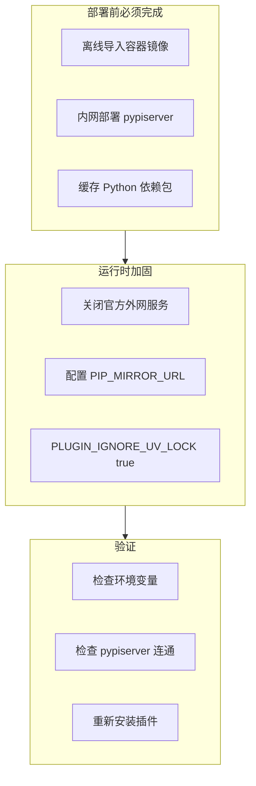
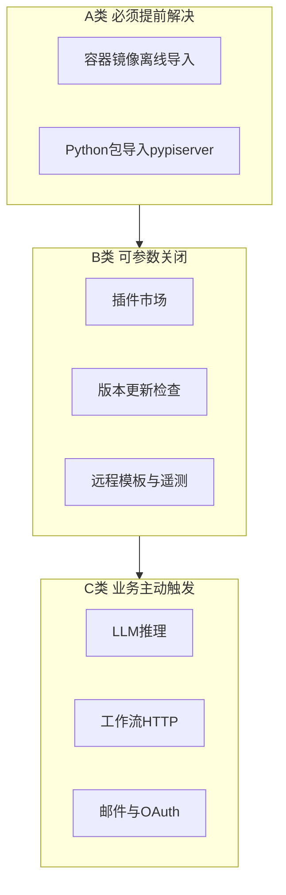

# Dify 离线环境禁止外网访问功能合集与验证实录

> **文档说明**：本文以流水账形式记录在内网完全离线 K8s 环境中，扫描 Dify 源码外网依赖、编写一键加固脚本、执行验证、排查滚动更新卡住的完整过程。  
> **编写日期**：2026-06-06  
> **实验环境**：内网 master1，K8s v1.28.12，命名空间 `dify`，完全离线  
> **前置条件**：内网 pypiserver 已部署且插件安装曾验证成功（详见同目录 PyPI 镜像仓库系列文档）  
> **本文目标**：在 PyPI 镜像已就绪的基础上，**关闭 Dify 运行时所有可配置的官方外网访问**，并逐项验证。

---

## 一、背景与动机

### 1.1 为什么要做这件事

在前序实验中，我们已通过内网 pypiserver 和 `PIP_MIRROR_URL` 解决了**插件安装**问题。但 Dify 在运行期间仍会访问多处公网地址，例如：

- 插件市场 `marketplace.dify.ai`
- 版本更新 `updates.dify.ai`
- 应用模板 `tmpl.dify.ai`
- 默认 PyPI `pypi.org`（`PIP_MIRROR_URL` 为空时）

内网断网部署的要求是：**服务启动后不应主动访问公网**。因此需要：

1. 扫描 Dify 源码，梳理所有外网依赖；
2. 区分「可参数关闭」与「必须内网替代」；
3. 编写一键脚本批量写入 K8s 环境变量；
4. 用命令输出验证配置已生效；
5. 最终用**重新安装插件**做业务级验收。

### 1.2 关键认知（来自源码与实验）

| 误区 | 事实 |
|------|------|
| `MARKETPLACE_ENABLED=false` 能离线装插件 | **不能**。市场开关只管市场 API，Plugin Daemon 仍要通过 `uv` 装 Python 依赖 |
| `PIP_MIRROR_URL` 可以为空 | **不能**。为空时 `uv` 回退 `pypi.org`，内网必失败 |
| 本地上传插件不需要网络 | 插件包不需下载，但 **Python SDK 依赖仍要走 PyPI 镜像** |



---

## 二、源码扫描：外网依赖、影响功能与关闭后影响全览

本节基于 Dify 主仓库源码、`docker/.env.example` 及内网实测整理。**不仅限于插件 PyPI**，涵盖部署阶段与运行阶段所有主要外网触点，并说明每项关闭后**用户能感知到的功能变化**。

### 2.1 先分清两类「联网」

| 阶段 | 含义 | 能否用环境变量关闭 |
|------|------|-------------------|
| **部署阶段** | 拉取容器镜像、导入 Python 包 | 否，只能离线提前准备 |
| **运行阶段** | 服务启动后主动或被动访问外网 | 大部分可关或改指向内网 |

内网断网部署原则：**运行阶段关掉 Dify 官方外网；业务需要的 LLM 等改指向内网网关；部署阶段提前备齐镜像与依赖包。**



---

### 2.2 部署阶段外网依赖（无法用参数关闭）

| 联网对象 | 影响的功能 / 环节 | 关闭或处理方式 | 不处理的后果 |
|----------|-------------------|----------------|--------------|
| Docker Hub 上 langgenius 镜像 | 整体部署启动 | 外网 `docker pull` 后 `docker save` 内网 `load` | api web plugin-daemon sandbox 无法启动 |
| postgres redis nginx weaviate 等镜像 | 数据库与中间件 | 同上离线导入 | 依赖服务无法拉起 |
| ghcr.io quay.io 等第三方镜像 | 可选向量库等 | 按选型提前导入 | 对应 profile 无法启用 |
| PyPI 官方源 pypi.org | 插件 Python 依赖安装 | 内网 pypiserver 缓存全部依赖包 | 任何插件安装均在 init environment 失败 |
| 插件 difypkg 文件 | 插件本体 | 外网下载或自有构建后内网分发 | 无包可装 |

---

### 2.3 运行时 — Dify 官方外网服务（建议关闭，脚本已覆盖）

| 联网对象 | 影响的功能 | 关闭方式 | 关闭后的功能影响 | 绕过 / 替代方案 |
|----------|------------|----------|------------------|-----------------|
| marketplace.dify.ai | 插件市场浏览与安装、插件图标加载、市场模板、插件版本查询、安装统计上报 | `MARKETPLACE_ENABLED=false` | 控制台**插件市场入口隐藏**；不能从市场一键安装或更新；工作流选工具时**看不到市场推荐插件**；已装插件若图标来自市场 URL 可能**显示裂图** | 本地上传 `.difypkg` 安装；提前缓存插件包 |
| marketplace.dify.ai | Celery 定时检查可升级插件 | `ENABLE_CHECK_UPGRADABLE_PLUGIN_TASK=false` | **不再自动检测插件新版本**；无后台升级提醒 | 手动上传新版插件包 |
| updates.dify.ai | 关于页版本检查、新版本提示 | `CHECK_UPDATE_URL=` 置空 | About 页**不再提示有新版本**；`can_auto_update` 恒为 false | 人工查阅 GitHub Release |
| tmpl.dify.ai | Explore 探索页推荐应用与分类 | `HOSTED_FETCH_APP_TEMPLATES_MODE=builtin` | 不再拉取官方最新模板列表；**仅展示内置模板**；模板数量少于在线版 | 使用 builtin 或 db 模式；自行导入 DSL |
| tmpl.dify.ai | 知识库流水线远程模板 | `HOSTED_FETCH_PIPELINE_TEMPLATES_MODE=builtin` | 流水线创建时**无远程最新模板**；用内置模板 | 内置模板或手工配置流水线 |
| creators.dify.ai | 将 DSL 发布到创作者平台 | `CREATORS_PLATFORM_FEATURES_ENABLED=false` | **发布到创作者平台**按钮与跳转不可用 | 仅本地使用 DSL 不涉及发布 |
| pypi.org | 插件安装时 uv 拉取 dify-plugin 等依赖 | **不能只关** 必须 `PIP_MIRROR_URL` 指向内网 | 若未配镜像：安装报错 `Failed to fetch pypi.org` | 内网 pypiserver |
| pypi.org 写在 uv.lock | 同上，锁文件强制走官方源 | `PLUGIN_IGNORE_UV_LOCK=true` | 不配此项时即使设了镜像仍可能访问 pypi.org 导致失败 | 与 PIP_MIRROR_URL 配合使用 |
| Sentry / Amplitude / Scarf / Next 遥测 | 崩溃上报与使用统计 | 对应 DSN 留空、`NEXT_TELEMETRY_DISABLED=1`、`SCARF_NO_ANALYTICS=true` | **无任何功能影响**；仅失去官方统计 | 无需替代 |
| Weaviate 遥测 | 向量库使用情况上报 | `WEAVIATE_DISABLE_TELEMETRY=true` | 不影响检索与写入 | 无需替代 |
| 云版 Billing / HOSTED 试用模型 | 配额计费与试用 LLM | 自托管默认 `BILLING_ENABLED=false` 且不配 HOSTED Key | CE 自托管**默认无影响** | 使用自建模型供应商 |
| TiDB Cloud 定时任务 | 自动创建 Serverless 集群 | 保持 `ENABLE_CREATE_TIDB_SERVERLESS_TASK=false` | 不使用 TiDB Cloud 时无影响 | 使用自建向量库 |

---

### 2.4 运行时 — 可选收紧功能（脚本已关闭）

| 联网对象 | 影响的功能 | 环境变量 | 关闭后功能影响 | 绕过方案 |
|----------|------------|----------|----------------|----------|
| r.jina.ai | 知识库「从网站导入」Jina Reader | `ENABLE_WEBSITE_JINAREADER=false` | 创建知识库时**看不到 Jina 网站爬取选项** | 本地文件上传 |
| api.firecrawl.dev | 知识库 Firecrawl 爬虫 | `ENABLE_WEBSITE_FIRECRAWL=false` | **Firecrawl 网站导入不可用** | 本地文件或自建 Firecrawl |
| app.watercrawl.dev | 知识库 Watercrawl 爬虫 | `ENABLE_WEBSITE_WATERCRAWL=false` | **Watercrawl 网站导入不可用** | 本地文件上传 |
| 沙箱出站网络 | 工作流「代码」节点内 requests 等访问外网 | dify-sandbox `ENABLE_NETWORK=false` | 代码节点**无法在沙箱内发起网络请求** | 改用 HTTP 请求节点或关闭代码网络逻辑 |
| SSRF 代理 Squid 默认策略 | 工作流 HTTP 请求节点、工具 API、MCP 出站 | 默认 deny 除 marketplace 与 localhost 外全部 | 未改白名单时**工作流访问外网 URL 失败**；内网 API 也需改 squid 白名单 | 修改 `docker/ssrf_proxy/squid.conf.template` 加入内网域名 |

---

### 2.5 业务侧外网（脚本不处理，按业务决定）

| 联网对象 | 影响的功能 | 能否一键关闭 | 关闭或内网化后的影响 |
|----------|------------|--------------|----------------------|
| OpenAI Anthropic 通义等 API | 全平台对话、Agent、工作流 LLM 节点 | 否，用户配置 | 不配置或指向内网网关则**无法推理**；指向内网则正常 |
| github.com | 从 GitHub Release 安装插件、DSL 导入 GitHub YAML | 禁用入口即可 | **GitHub 装插件不可用**；改本地上传 difypkg |
| api.notion.com | Notion 数据源同步 | 不使用 Notion | 知识库 **Notion 导入不可用** |
| UNSTRUCTURED_API_URL | 部分文档格式解析 | 不配置或内网自建 | 复杂格式解析能力下降或走本地库 |
| Resend SendGrid SMTP | 邀请邮件、密码重置、注册验证 | 不配 MAIL_TYPE | **邮件通知全部不可用**；账号密码登录仍可用 |
| GitHub Google OAuth | 社交登录 | 不配 Client ID | **第三方登录不可用**；本地账号不受影响 |
| 云 S3 OSS COS 等 | 文件存储 | 改 opendal 本地盘 | 需保证存储卷容量与备份 |
| 云向量库 Upstash 等 | 向量检索 | 改内网 weaviate qdrant | 按选型部署对应中间件 |

---

### 2.6 前端硬编码外网链接（可忽略，不影响核心）

| 链接 | 关联功能 | 断网后影响 |
|------|----------|------------|
| docs.dify.ai | 文档帮助链接 | 点击链接打不开 |
| forum.dify.ai | 社区论坛 | 同上 |
| github.com/langgenius/dify | 开源协议与 changelog | 同上 |
| assets.dify.ai | 个别内置数据源图标 | 图标可能裂图 |
| dify.ai/pricing | 云版计费说明 | 仅云版相关 |

**不影响 API、插件安装、工作流执行等核心能力。**

---

### 2.7 优先级总览表（内网断网该怎么处理）

| 优先级 | 联网对象 | 类型 | 必须处理 | 关闭或处理方式 | 不处理的影响 |
|--------|----------|------|----------|----------------|--------------|
| **P0** | Docker 镜像 | 部署 | 是 | 离线导入 | 服务无法启动 |
| **P0** | pypi.org | 运行 | 是 | PIP_MIRROR_URL 加 PLUGIN_IGNORE_UV_LOCK | 插件装不上 |
| **P1** | marketplace.dify.ai | 运行 | 建议 | MARKETPLACE_ENABLED false | 仍可能误访问市场；UI 残留 |
| **P1** | updates.dify.ai | 运行 | 建议 | CHECK_UPDATE_URL 空 | 后台访问更新服务 |
| **P1** | tmpl.dify.ai | 运行 | 建议 | HOSTED_FETCH 改 builtin | Explore 拉远程模板失败卡顿 |
| **P1** | creators.dify.ai | 运行 | 建议 | CREATORS false | 无功能必要但会尝试出站 |
| **P2** | 网站爬虫三件套 | 运行 | 按需 | ENABLE_WEBSITE 全 false | 网站导入仍显示但失败 |
| **P2** | Sandbox 网络 | 运行 | 建议 | ENABLE_NETWORK false | 代码节点可访问外网 |
| **P3** | LLM API | 业务 | 按需 | base_url 指内网 | 无模型无法对话 |
| **P3** | 邮件 OAuth HTTP | 业务 | 按需 | 不配或内网 | 对应子功能不可用 |
| **P4** | 文档论坛链接 | 前端 | 可忽略 | 无需处理 | 仅链接失效 |

---

### 2.8 本次脚本加固 — 逐项功能影响对照

下表对应 `dify-offline-hardening.sh` **实际写入**的变量，以及我们在 master1 验证后确认的用户侧变化。

| 组件 | 环境变量 | 关闭的外网能力 | 关闭后用户可感知的变化 | 本次验证结论 |
|------|----------|----------------|------------------------|--------------|
| dify-api / dify-worker | MARKETPLACE_ENABLED=false | 市场 API 调用 | 插件页无市场；不能在线安装 | 已写入 false |
| dify-api / dify-worker | CHECK_UPDATE_URL= | 版本更新检查 | About 无新版本提示 | 已写入空值 |
| dify-api / dify-worker | ENABLE_CHECK_UPGRADABLE_PLUGIN_TASK=false | 定时升级扫描 | 无插件升级后台任务 | 已写入 false |
| dify-api / dify-worker | HOSTED_FETCH_APP_TEMPLATES_MODE=builtin | 远程应用模板 | Explore 仅内置应用 | 已写入 builtin |
| dify-api / dify-worker | HOSTED_FETCH_PIPELINE_TEMPLATES_MODE=builtin | 远程流水线模板 | 流水线用内置模板 | 已写入 builtin |
| dify-api / dify-worker | ENABLE_WEBSITE_JINAREADER=false | Jina 爬虫 | 知识库网站导入无 Jina | 已写入 false |
| dify-api / dify-worker | ENABLE_WEBSITE_FIRECRAWL=false | Firecrawl | 无 Firecrawl 选项 | 已写入 false |
| dify-api / dify-worker | ENABLE_WEBSITE_WATERCRAWL=false | Watercrawl | 无 Watercrawl 选项 | 已写入 false |
| dify-api / dify-worker | SCARF_NO_ANALYTICS=true | 包下载统计 | 无感知 | 已写入 true |
| dify-web | EDITION=SELF_HOSTED | 云版特性开关 | 前端按自托管版渲染 | 已写入 SELF_HOSTED |
| dify-web | NEXT_TELEMETRY_DISABLED=1 | Next 遥测 | 无感知 | 已写入 1 |
| dify-web | MARKETPLACE_ENABLED=false | 市场前端 API | 市场相关 UI 隐藏 | 已写入 false |
| dify-plugin-daemon | PIP_MIRROR_URL | 默认 pypi.org | uv 改走内网 pypiserver | 已验证可达 |
| dify-plugin-daemon | PLUGIN_IGNORE_UV_LOCK=true | uv.lock 内官方源 | 避免绕过镜像 | 已写入 true |
| dify-sandbox | ENABLE_NETWORK=false | 沙箱出站 | 代码节点无法联网 | 已写入 false |

**不受本次脚本影响、仍正常的核心功能：**

- 控制台登录与 workspace 管理
- 应用对话与工作流执行（依赖已配置的内网 LLM）
- **本地上传插件安装**（已重新验证成功）
- 知识库本地文件上传与检索
- 内网 pypiserver 供插件依赖下载

---

### 2.9 易混淆概念对照（排查插件失败时必看）

| 名称 | 是什么 | 影响的功能 | 对应配置 |
|------|--------|------------|----------|
| marketplace.dify.ai | Dify 插件市场 | 在线浏览安装插件 | MARKETPLACE_ENABLED |
| pypi.org | Python 官方包索引 | 插件 Python 依赖安装 | PIP_MIRROR_URL |
| updates.dify.ai | 版本更新服务 | About 页新版本 | CHECK_UPDATE_URL |
| tmpl.dify.ai | 应用与流水线模板 CDN | Explore 与流水线模板 | HOSTED_FETCH 模式 |

**实测结论：`MARKETPLACE_ENABLED=false` 后插件仍可能因 pypi.org 失败，两者必须分别处理。**

---

## 三、编写一键加固脚本

### 3.1 脚本设计思路

手动对每个 Deployment 执行 `kubectl set env` 繁琐且易漏。我们编写 `dify-offline-hardening.sh`，实现：

1. 自动探测集群中存在的 Deployment 名称；
2. 批量写入 API Worker Web Plugin Daemon Sandbox 的环境变量；
3. 默认**不等待** Pod 滚动，避免长时间阻塞；
4. 输出 Deployment 模板中的关键变量供核对。

脚本与配套 env 文件保存在：

- `temp_data/dify-offline-hardening.sh`
- `temp_data/dify-offline-hardening.env`

### 3.2 脚本完整代码

```bash
#!/usr/bin/env bash
# Dify 内网断网部署：一键关闭/设置所有官方外网依赖
#
# 用法：
#   chmod +x dify-offline-hardening.sh
#   ./dify-offline-hardening.sh
#
# 自定义：
#   NAMESPACE=dify PIP_MIRROR_URL=http://pypiserver:8080/simple/ ./dify-offline-hardening.sh
#   WAIT_ROLLOUT=1 ROLLOUT_WAIT_ONLY=dify-plugin-daemon ./dify-offline-hardening.sh
#   DRY_RUN=1 ./dify-offline-hardening.sh

set -euo pipefail

NAMESPACE="${NAMESPACE:-dify}"
PIP_MIRROR_URL="${PIP_MIRROR_URL:-http://pypiserver:8080/simple/}"
DRY_RUN="${DRY_RUN:-0}"
WAIT_ROLLOUT="${WAIT_ROLLOUT:-0}"
ROLLOUT_TIMEOUT="${ROLLOUT_TIMEOUT:-120}"
ROLLOUT_WAIT_ONLY="${ROLLOUT_WAIT_ONLY:-dify-plugin-daemon}"

API_ENVS=(
  "MARKETPLACE_ENABLED=false"
  "CHECK_UPDATE_URL="
  "CREATORS_PLATFORM_FEATURES_ENABLED=false"
  "ENABLE_CHECK_UPGRADABLE_PLUGIN_TASK=false"
  "HOSTED_FETCH_APP_TEMPLATES_MODE=builtin"
  "HOSTED_FETCH_PIPELINE_TEMPLATES_MODE=builtin"
  "ENABLE_WEBSITE_JINAREADER=false"
  "ENABLE_WEBSITE_FIRECRAWL=false"
  "ENABLE_WEBSITE_WATERCRAWL=false"
  "SCARF_NO_ANALYTICS=true"
)

WEB_ENVS=(
  "MARKETPLACE_ENABLED=false"
  "NEXT_TELEMETRY_DISABLED=1"
  "EDITION=SELF_HOSTED"
  "ENABLE_WEBSITE_JINAREADER=false"
  "ENABLE_WEBSITE_FIRECRAWL=false"
  "ENABLE_WEBSITE_WATERCRAWL=false"
  "CREATORS_PLATFORM_FEATURES_ENABLED=false"
)

PLUGIN_ENVS=(
  "PIP_MIRROR_URL=${PIP_MIRROR_URL}"
  "PLUGIN_IGNORE_UV_LOCK=true"
)

SANDBOX_ENVS=(
  "ENABLE_NETWORK=false"
)

API_DEPLOYS=(dify-api dify-worker dify-worker-beat dify-celery-worker dify-celery-beat)
WEB_DEPLOYS=(dify-web dify-webapp)
PLUGIN_DEPLOYS=(dify-plugin-daemon dify-plugin_daemon plugin-daemon)
SANDBOX_DEPLOYS=(dify-sandbox sandbox)

UPDATED_DEPLOYS=()

log() { printf '[%s] %s\n' "$(date '+%H:%M:%S')" "$*"; }

# ... 其余函数与 main 逻辑见 temp_data/dify-offline-hardening.sh 完整文件
```

> 完整可执行版本请以仓库 `temp_data/dify-offline-hardening.sh` 为准，共 224 行。

### 3.3 配套 env 补丁文件

Docker Compose 用户可将 `dify-offline-hardening.env` 合并到 `docker/.env`：

```bash
# P0 插件 PyPI 镜像
PIP_MIRROR_URL=http://pypiserver:8080/simple/

# P1 关闭官方外网
MARKETPLACE_ENABLED=false
CHECK_UPDATE_URL=
CREATORS_PLATFORM_FEATURES_ENABLED=false
ENABLE_CHECK_UPGRADABLE_PLUGIN_TASK=false
HOSTED_FETCH_APP_TEMPLATES_MODE=builtin
HOSTED_FETCH_PIPELINE_TEMPLATES_MODE=builtin

# P2 收紧出站
ENABLE_WEBSITE_JINAREADER=false
ENABLE_WEBSITE_FIRECRAWL=false
ENABLE_WEBSITE_WATERCRAWL=false
SANDBOX_ENABLE_NETWORK=false

# 遥测
NEXT_TELEMETRY_DISABLED=1
WEAVIATE_DISABLE_TELEMETRY=true
SCARF_NO_ANALYTICS=true
EDITION=SELF_HOSTED
```

---

## 四、第一次执行脚本：滚动更新卡住

### 4.1 操作过程

在 master1 的 `custom-image-build` 目录：

```bash
vi dify-offline-hardening.sh
chmod +x dify-offline-hardening.sh
./dify-offline-hardening.sh
```

### 4.2 现象：脚本看似卡死

初版脚本默认 `WAIT_ROLLOUT=1`，会对每个已更新的 Deployment 执行 `kubectl rollout status --timeout=300s`。

**完整输出片段：**

```
[10:47:52] Dify 内网断网加固 | namespace=dify | PIP_MIRROR_URL=http://pypiserver:8080/simple/
deployment.apps/dify-api env updated
[10:48:17] ✓ API/Worker: dify-api
deployment.apps/dify-worker env updated
[10:48:19] ✓ API/Worker: dify-worker
[10:48:22] 等待滚动更新: dify-api
Waiting for deployment "dify-api" rollout to finish: 0 out of 1 new replicas have been updated..
Waiting for deployment "dify-api" rollout to finish: 1 old replicas are pending termination..
```

### 4.3 排查过程

**判断**：这不是脚本逻辑错误，而是 K8s 滚动更新尚未完成。`1 old replicas are pending termination` 表示新 Pod 已创建，旧 Pod 尚未退出。

**排查命令：**

```bash
# 另开终端查看 Pod
kubectl get pods -n dify -o wide

# 查看 dify-api 事件
kubectl describe pod -n dify -l app=dify-api | tail -30

# 确认环境变量其实已写入 Deployment 模板
kubectl get deploy dify-api -n dify -o jsonpath='{range .spec.template.spec.containers[0].env[*]}{.name}={.value}{"\n"}{end}' | grep MARKETPLACE
```

**结论**：

- `kubectl set env` 在卡住**之前**已成功；
- 可直接 `Ctrl+C` 中断等待，不影响配置；
- 初版脚本问题：**不应默认阻塞等待所有 Deployment 的 rollout**。

### 4.4 脚本修复

对 `dify-offline-hardening.sh` 做如下调整：

| 改动 | 说明 |
|------|------|
| 默认 `WAIT_ROLLOUT=0` | 写完环境变量立即退出 |
| 默认 `ROLLOUT_WAIT_ONLY=dify-plugin-daemon` | 需要等待时只等关键服务 |
| 超时改为 120s 且不中断脚本 | 超时只告警 |
| 先批量写 env 再统一等待 | 减少阻塞感 |

---

## 五、第二次执行脚本：顺利完成

### 5.1 操作

将更新后的脚本重新拷到 master1 后执行：

```bash
sh dify-offline-hardening.sh
```

### 5.2 完整输出

```
[10:52:41] Dify 内网断网加固 | namespace=dify | PIP_MIRROR_URL=http://pypiserver:8080/simple/
deployment.apps/dify-api env updated
[10:52:41] ✓ API/Worker: dify-api 环境变量已写入
deployment.apps/dify-worker env updated
[10:52:41] ✓ API/Worker: dify-worker 环境变量已写入
deployment.apps/dify-web env updated
[10:52:42] ✓ Web: dify-web 环境变量已写入
deployment.apps/dify-plugin-daemon env updated
[10:52:42] ✓ Plugin Daemon: dify-plugin-daemon 环境变量已写入
deployment.apps/dify-sandbox env updated
[10:52:42] ✓ Sandbox: dify-sandbox 环境变量已写入
[10:52:43] 跳过滚动等待（WAIT_ROLLOUT=0）。Pod 会在后台陆续重启。
[10:52:43] 手动查看：kubectl get pods -n dify -w
[10:52:43] ========== 验证关键环境变量（Deployment 模板）==========
[10:52:43] --- 验证 Deployment 模板中的 dify-api ---
  MARKETPLACE_ENABLED=[false]
  CHECK_UPDATE_URL=[]
  ENABLE_CHECK_UPGRADABLE_PLUGIN_TASK=[false]
[10:52:43] --- 验证 Deployment 模板中的 dify-worker ---
  MARKETPLACE_ENABLED=[false]
  CHECK_UPDATE_URL=[]
[10:52:43] --- 验证 Deployment 模板中的 dify-plugin-daemon ---
  PIP_MIRROR_URL=[http://pypiserver:8080/simple/]
  PLUGIN_IGNORE_UV_LOCK=[true]
[10:52:44] --- 验证 Deployment 模板中的 dify-web ---
  MARKETPLACE_ENABLED=[false]
  NEXT_TELEMETRY_DISABLED=[1]
  EDITION=[SELF_HOSTED]
[10:52:44] 完成。
```

**结果**：5 个 Deployment 全部 env updated，脚本秒级完成，无卡死。

---

## 六、滚动更新与运行中 Pod 验证

### 6.1 观察 Pod 状态

```bash
kubectl get pods -n dify -w
```

**输出：**

```
NAME                                  READY   STATUS        RESTARTS   AGE
dify-api-68f8cfbcf6-s9j4n             1/1     Running       0          5m13s
dify-plugin-daemon-864c7fabf4-lxc7f   1/1     Running       0          22m
dify-proxy-55c778d95-p9h8m            1/1     Running       0          15d
dify-sandbox-655886d889-2bvgp         1/1     Running       0          51s
dify-sandbox-765d68cc69-7c99c         1/1     Terminating   0          15d
dify-web-67684db565-9gk8v             1/1     Running       0          52s
dify-worker-6cdc6765b9-gq41           1/1     Running       0          5m13s
pypiserver-7cc649b9f9-crhr6           1/1     Running       0          54m
weaviate-0                            1/1     Running       0          15d
```

**说明**：

- 新的 `dify-sandbox` Pod 已 Running，旧 Pod 处于 Terminating，属正常滚动；
- 若 Terminating 超过数分钟，可强制删除：

```bash
kubectl delete pod dify-sandbox-765d68cc69-7c99c -n dify --grace-period=0 --force
```

### 6.2 验证运行中容器的环境变量

Deployment 模板验证通过后，还需确认**当前 Running Pod** 内变量已生效。

**Plugin Daemon：**

```bash
kubectl exec -n dify deploy/dify-plugin-daemon -- sh -c \
  'echo PIP_MIRROR_URL=$PIP_MIRROR_URL; echo PLUGIN_IGNORE_UV_LOCK=$PLUGIN_IGNORE_UV_LOCK'
```

**输出：**

```
PIP_MIRROR_URL=http://pypiserver:8080/simple/
PLUGIN_IGNORE_UV_LOCK=true
```

**API：**

```bash
kubectl exec -n dify deploy/dify-api -- sh -c \
  'echo MARKETPLACE_ENABLED=$MARKETPLACE_ENABLED; echo CHECK_UPDATE_URL=[$CHECK_UPDATE_URL]'
```

**输出：**

```
MARKETPLACE_ENABLED=false
CHECK_UPDATE_URL=[]
```

### 6.3 验证 pypiserver 从 Plugin Daemon 可达

```bash
kubectl exec -n dify deploy/dify-plugin-daemon -- python3 -c \
  "import urllib.request; r=urllib.request.urlopen('http://pypiserver:8080/simple/dify-plugin/', timeout=5); print(r.read()[:200])"
```

**输出：**

```
b'<!DOCTYPE html>\n<html lang="en">\n  <head>\n    <meta name="viewport" content="width=device-width, initial-scale=1">\n    <title>Links for dify-plugin</title>\n    <meta charset="utf-8">\n
```

说明 Plugin Daemon 能解析 `pypiserver` 服务名并获取 `dify-plugin` 索引页，PyPI 镜像链路正常。

---

## 七、业务级验收：重新安装插件

### 7.1 操作

在 Dify 控制台重新上传并安装测试插件（IoT 设备通用网关 your-name/iot_device_http 0.0.8）。

### 7.2 结果

**插件重新安装成功。**

这表明在以下条件下离线安装链路完整可用：

1. 内网 pypiserver 已部署且包齐全；
2. `PIP_MIRROR_URL` 指向内网镜像；
3. `PLUGIN_IGNORE_UV_LOCK=true`；
4. 官方外网服务已通过脚本关闭；
5. 各 Pod 已完成滚动重启。


---

## 八、加固项与环境变量对照总表（含关闭后影响）

> 功能影响详解见 **第二章 2.3～2.8**，本节为脚本执行后的快速查阅表。

| 组件 | 写入的环境变量 | 关闭的外网能力 | 关闭后功能影响 |
|------|----------------|----------------|----------------|
| dify-api / dify-worker | MARKETPLACE_ENABLED=false | marketplace.dify.ai | 插件市场不可用，改本地上传 |
| dify-api / dify-worker | CHECK_UPDATE_URL= 空 | updates.dify.ai | 不再提示新版本 |
| dify-api / dify-worker | ENABLE_CHECK_UPGRADABLE_PLUGIN_TASK=false | 市场升级 API | 无自动插件升级检查 |
| dify-api / dify-worker | HOSTED_FETCH_APP_TEMPLATES_MODE=builtin | tmpl.dify.ai 应用模板 | Explore 仅内置模板 |
| dify-api / dify-worker | HOSTED_FETCH_PIPELINE_TEMPLATES_MODE=builtin | tmpl.dify.ai 流水线模板 | 流水线仅内置模板 |
| dify-api / dify-worker | ENABLE_WEBSITE_JINAREADER=false | r.jina.ai | 知识库无 Jina 网站导入 |
| dify-api / dify-worker | ENABLE_WEBSITE_FIRECRAWL=false | api.firecrawl.dev | 知识库无 Firecrawl |
| dify-api / dify-worker | ENABLE_WEBSITE_WATERCRAWL=false | app.watercrawl.dev | 知识库无 Watercrawl |
| dify-api / dify-worker | SCARF_NO_ANALYTICS=true | Scarf 统计 | 用户无感知 |
| dify-web | EDITION=SELF_HOSTED | 云版前端特性 | 按自托管版展示 |
| dify-web | NEXT_TELEMETRY_DISABLED=1 | Next.js 遥测 | 用户无感知 |
| dify-web | MARKETPLACE_ENABLED=false | 市场前端请求 | 市场 UI 隐藏 |
| dify-plugin-daemon | PIP_MIRROR_URL | 默认 pypi.org | 插件依赖走内网镜像 |
| dify-plugin-daemon | PLUGIN_IGNORE_UV_LOCK=true | uv.lock 内官方源 | 避免锁文件绕过镜像 |
| dify-sandbox | ENABLE_NETWORK=false | 沙箱出站 | 代码节点无法访问网络 |

---

## 九、常见问题与排查手册

### 9.1 脚本执行后长时间无响应

**现象**：停在 `Waiting for deployment rollout to finish`。

**原因**：旧版脚本默认等待 rollout。

**处理**：

```bash
# 使用新版脚本 默认 WAIT_ROLLOUT=0
./dify-offline-hardening.sh

# 或显式跳过等待
WAIT_ROLLOUT=0 ./dify-offline-hardening.sh
```

已写入的环境变量不受 `Ctrl+C` 影响。

### 9.2 Pod 长时间 Terminating

```bash
kubectl get pods -n dify | grep Terminating
kubectl delete pod <pod名> -n dify --grace-period=0 --force
```

### 9.3 环境变量写入但 Pod 内仍是旧值

**原因**：Pod 尚未滚动重启完成。

**排查**：

```bash
kubectl rollout status deployment/dify-api -n dify
kubectl get pods -n dify -l app=dify-api
```

等待新 Pod Running 后再 `kubectl exec` 验证。

### 9.4 Helm upgrade 后配置丢失

`kubectl set env` 不写入 Helm values，upgrade 会被覆盖。

**建议**：将本文环境变量写入 Helm `values.yaml` 持久化，或每次 upgrade 后重新执行脚本。

### 9.5 插件安装仍失败

```bash
kubectl logs -n dify deploy/dify-plugin-daemon --tail=80
kubectl exec -n dify deploy/dify-plugin-daemon -- sh -c 'echo $PIP_MIRROR_URL $PLUGIN_IGNORE_UV_LOCK'
```

若日志仍出现 `pypi.org`，检查 `PIP_MIRROR_URL` 是否为空或 `PLUGIN_IGNORE_UV_LOCK` 未设置。

---

## 十、一键命令速查

### 10.1 执行加固脚本

```bash
chmod +x dify-offline-hardening.sh
./dify-offline-hardening.sh
```

### 10.2 等待 plugin-daemon 滚动完成后再退出

```bash
WAIT_ROLLOUT=1 ROLLOUT_WAIT_ONLY=dify-plugin-daemon ./dify-offline-hardening.sh
```

### 10.3 验证三板斧

```bash
# 1 Pod 状态
kubectl get pods -n dify

# 2 环境变量
kubectl exec -n dify deploy/dify-plugin-daemon -- sh -c \
  'echo PIP_MIRROR_URL=$PIP_MIRROR_URL PLUGIN_IGNORE_UV_LOCK=$PLUGIN_IGNORE_UV_LOCK'
kubectl exec -n dify deploy/dify-api -- sh -c \
  'echo MARKETPLACE_ENABLED=$MARKETPLACE_ENABLED CHECK_UPDATE_URL=[$CHECK_UPDATE_URL]'

# 3 pypiserver 连通
kubectl exec -n dify deploy/dify-plugin-daemon -- python3 -c \
  "import urllib.request; r=urllib.request.urlopen('http://pypiserver:8080/simple/dify-plugin/', timeout=5); print('OK', len(r.read()))"
```

---

## 十一、总结

本次在内网 master1 上完成了 Dify 离线环境的外网访问加固全流程：

1. **源码层面**梳理了 Marketplace、更新检查、远程模板、PyPI、爬虫、沙箱等多类外网依赖，并按 **P0～P4 优先级** 与 **功能影响** 分类（见第二章）；
2. **明确关闭后影响**：市场与在线装插件不可用，Explore 改内置模板，网站爬虫入口隐藏，沙箱代码无法出站，**本地上传插件与核心对话能力不受影响**；
3. **编写并迭代** `dify-offline-hardening.sh`，解决首版 rollout 等待卡死问题；
4. **批量关闭** dify-api、dify-worker、dify-web、dify-plugin-daemon、dify-sandbox 的官方外网配置；
5. **保留并确认** `PIP_MIRROR_URL` 与 `PLUGIN_IGNORE_UV_LOCK` 指向内网 pypiserver；
6. **命令级验证** Deployment 模板、运行中 Pod 环境变量、pypiserver 连通性均通过；
7. **业务验收** 重新安装插件成功。

内网断网部署的核心原则不变：**镜像和 Python 包提前备齐，运行时关闭官方外网，插件依赖走内网 PyPI 镜像**。配置前建议通读 **第二章各表**，评估业务是否依赖市场、网站导入、代码节点出站等能力，再执行一键脚本。

---

## 附录 A：相关文档索引

| 文档 | 内容 |
|------|------|
| 20260606-0945 内网 PyPI 实战 | pypiserver 部署与 PIP_MIRROR_URL 配置 |
| 20260606-1021 空字符串实验 | 验证 PIP_MIRROR_URL 置空的失败现象 |
| dify-offline-hardening.sh | 一键加固脚本完整源码 |
| dify-offline-hardening.env | Docker Compose 环境变量补丁 |

---

## 附录 B：脚本涉及的 Deployment 探测列表

脚本会按顺序探测以下名称，**存在则更新，不存在则跳过**：

- API Worker：`dify-api` `dify-worker` `dify-worker-beat` `dify-celery-worker` `dify-celery-beat`
- Web：`dify-web` `dify-webapp`
- Plugin Daemon：`dify-plugin-daemon` `dify-plugin_daemon` `plugin-daemon`
- Sandbox：`dify-sandbox` `sandbox`
- Weaviate：`weaviate` `dify-weaviate`

本次 master1 集群实际命中：`dify-api`、`dify-worker`、`dify-web`、`dify-plugin-daemon`、`dify-sandbox`。

---

## 附录 C：`dify-offline-hardening.sh` 完整源码

```bash
#!/usr/bin/env bash
# Dify 内网断网部署：一键关闭/设置所有官方外网依赖
#
# 用法（在能执行 kubectl 的机器上，如 master1）：
#   chmod +x dify-offline-hardening.sh
#   ./dify-offline-hardening.sh
#
# 自定义命名空间 / PyPI 镜像地址：
#   NAMESPACE=dify PIP_MIRROR_URL=http://pypiserver:8080/simple/ ./dify-offline-hardening.sh
#
# 不等待 Pod 滚动（环境变量已写入，更新在后台进行，推荐卡住时使用）：
#   WAIT_ROLLOUT=0 ./dify-offline-hardening.sh
#
# 仅预览不执行：
#   DRY_RUN=1 ./dify-offline-hardening.sh

set -euo pipefail

NAMESPACE="${NAMESPACE:-dify}"
PIP_MIRROR_URL="${PIP_MIRROR_URL:-http://pypiserver:8080/simple/}"
DRY_RUN="${DRY_RUN:-0}"
WAIT_ROLLOUT="${WAIT_ROLLOUT:-0}"
ROLLOUT_TIMEOUT="${ROLLOUT_TIMEOUT:-120}"
ROLLOUT_WAIT_ONLY="${ROLLOUT_WAIT_ONLY:-dify-plugin-daemon}"

API_ENVS=(
  "MARKETPLACE_ENABLED=false"
  "CHECK_UPDATE_URL="
  "CREATORS_PLATFORM_FEATURES_ENABLED=false"
  "ENABLE_CHECK_UPGRADABLE_PLUGIN_TASK=false"
  "HOSTED_FETCH_APP_TEMPLATES_MODE=builtin"
  "HOSTED_FETCH_PIPELINE_TEMPLATES_MODE=builtin"
  "ENABLE_WEBSITE_JINAREADER=false"
  "ENABLE_WEBSITE_FIRECRAWL=false"
  "ENABLE_WEBSITE_WATERCRAWL=false"
  "SCARF_NO_ANALYTICS=true"
)

WEB_ENVS=(
  "MARKETPLACE_ENABLED=false"
  "NEXT_TELEMETRY_DISABLED=1"
  "EDITION=SELF_HOSTED"
  "ENABLE_WEBSITE_JINAREADER=false"
  "ENABLE_WEBSITE_FIRECRAWL=false"
  "ENABLE_WEBSITE_WATERCRAWL=false"
  "CREATORS_PLATFORM_FEATURES_ENABLED=false"
)

PLUGIN_ENVS=(
  "PIP_MIRROR_URL=${PIP_MIRROR_URL}"
  "PLUGIN_IGNORE_UV_LOCK=true"
)

SANDBOX_ENVS=(
  "ENABLE_NETWORK=false"
)

API_DEPLOYS=(dify-api dify-worker dify-worker-beat dify-celery-worker dify-celery-beat)
WEB_DEPLOYS=(dify-web dify-webapp)
PLUGIN_DEPLOYS=(dify-plugin-daemon dify-plugin_daemon plugin-daemon)
SANDBOX_DEPLOYS=(dify-sandbox sandbox)
WEAVIATE_DEPLOYS=(weaviate dify-weaviate)

UPDATED_DEPLOYS=()

log() { printf '[%s] %s\n' "$(date '+%H:%M:%S')" "$*"; }

run() {
  if [[ "$DRY_RUN" == "1" ]]; then
    log "[DRY-RUN] $*"
  else
    log "$*"
    eval "$@"
  fi
}

deployment_exists() {
  kubectl get deployment "$1" -n "$NAMESPACE" &>/dev/null
}

track_updated() {
  local dep="$1"
  local existing
  for existing in "${UPDATED_DEPLOYS[@]:-}"; do
    [[ "$existing" == "$dep" ]] && return 0
  done
  UPDATED_DEPLOYS+=("$dep")
}

set_deploy_env() {
  local deploy="$1"
  shift
  local -a envs=("$@")
  if ! deployment_exists "$deploy"; then
    return 1
  fi
  run kubectl set env "deployment/${deploy}" -n "$NAMESPACE" ${envs[@]}
  track_updated "$deploy"
  return 0
}

apply_to_list() {
  local -n dep_list=$1
  local -n env_list=$2
  local label="$3"
  local found=0
  for dep in "${dep_list[@]}"; do
    if set_deploy_env "$dep" "${env_list[@]}"; then
      log "✓ ${label}: ${dep} 环境变量已写入"
      found=1
    fi
  done
  if [[ "$found" -eq 0 ]]; then
    log "⚠ 未找到 ${label} Deployment（已跳过）"
  fi
}

should_wait_deploy() {
  local dep="$1"
  if [[ -z "$ROLLOUT_WAIT_ONLY" ]]; then
    return 0
  fi
  local item
  IFS=',' read -ra items <<< "$ROLLOUT_WAIT_ONLY"
  for item in "${items[@]}"; do
    item="${item// /}"
    [[ "$item" == "$dep" ]] && return 0
  done
  return 1
}

wait_rollouts() {
  if [[ "$WAIT_ROLLOUT" != "1" ]] || [[ "$DRY_RUN" == "1" ]]; then
    log "跳过滚动等待（WAIT_ROLLOUT=${WAIT_ROLLOUT}）。Pod 会在后台陆续重启。"
    log "手动查看：kubectl get pods -n ${NAMESPACE} -w"
    return 0
  fi
  local dep
  for dep in "${UPDATED_DEPLOYS[@]:-}"; do
    if ! should_wait_deploy "$dep"; then
      log "跳过等待: ${dep}（不在 ROLLOUT_WAIT_ONLY 列表）"
      continue
    fi
    log "等待滚动更新: ${dep}（超时 ${ROLLOUT_TIMEOUT}s，可 Ctrl+C 中断，环境变量已生效）"
    if kubectl rollout status "deployment/${dep}" -n "$NAMESPACE" --timeout="${ROLLOUT_TIMEOUT}s"; then
      log "✓ ${dep} 滚动完成"
    else
      log "⚠ ${dep} 滚动超时或失败，请另开终端排查"
    fi
  done
}

verify_env() {
  local deploy="$1"
  shift
  local -a keys=("$@")
  if ! deployment_exists "$deploy"; then
    return 0
  fi
  log "--- 验证 Deployment 模板中的 ${deploy} ---"
  for key in "${keys[@]}"; do
    local val
    val=$(kubectl get deployment "$deploy" -n "$NAMESPACE" \
      -o "jsonpath={.spec.template.spec.containers[0].env[?(@.name=='${key}')].value}" 2>/dev/null || true)
    printf '  %s=[%s]\n' "$key" "$val"
  done
}

main() {
  log "Dify 内网断网加固 | namespace=${NAMESPACE} | PIP_MIRROR_URL=${PIP_MIRROR_URL}"
  if ! kubectl get namespace "$NAMESPACE" &>/dev/null; then
    log "错误: 命名空间 ${NAMESPACE} 不存在"
    exit 1
  fi
  apply_to_list API_DEPLOYS API_ENVS "API/Worker"
  apply_to_list WEB_DEPLOYS WEB_ENVS "Web"
  apply_to_list PLUGIN_DEPLOYS PLUGIN_ENVS "Plugin Daemon"
  apply_to_list SANDBOX_DEPLOYS SANDBOX_ENVS "Sandbox"
  for dep in "${WEAVIATE_DEPLOYS[@]}"; do
    if set_deploy_env "$dep" "DISABLE_TELEMETRY=true"; then
      log "✓ Weaviate: ${dep} 环境变量已写入"
    fi
  done
  wait_rollouts
  log "========== 验证关键环境变量（Deployment 模板）=========="
  verify_env dify-api MARKETPLACE_ENABLED CHECK_UPDATE_URL ENABLE_CHECK_UPGRADABLE_PLUGIN_TASK
  verify_env dify-worker MARKETPLACE_ENABLED CHECK_UPDATE_URL
  verify_env dify-plugin-daemon PIP_MIRROR_URL PLUGIN_IGNORE_UV_LOCK
  verify_env dify-web MARKETPLACE_ENABLED NEXT_TELEMETRY_DISABLED EDITION
  log "完成。"
}

main "$@"
```

---

## 附录 D：`dify-offline-hardening.env` 完整内容

```bash
PIP_MIRROR_URL=http://pypiserver:8080/simple/
MARKETPLACE_ENABLED=false
MARKETPLACE_API_URL=
MARKETPLACE_URL=
CHECK_UPDATE_URL=
CREATORS_PLATFORM_FEATURES_ENABLED=false
CREATORS_PLATFORM_API_URL=
ENABLE_CHECK_UPGRADABLE_PLUGIN_TASK=false
HOSTED_FETCH_APP_TEMPLATES_MODE=builtin
HOSTED_FETCH_PIPELINE_TEMPLATES_MODE=builtin
ENABLE_WEBSITE_JINAREADER=false
ENABLE_WEBSITE_FIRECRAWL=false
ENABLE_WEBSITE_WATERCRAWL=false
SANDBOX_ENABLE_NETWORK=false
NEXT_TELEMETRY_DISABLED=1
WEAVIATE_DISABLE_TELEMETRY=true
SCARF_NO_ANALYTICS=true
API_SENTRY_DSN=
WEB_SENTRY_DSN=
PLUGIN_SENTRY_ENABLED=false
AMPLITUDE_API_KEY=
EDITION=SELF_HOSTED
PLUGIN_IGNORE_UV_LOCK=true
```
