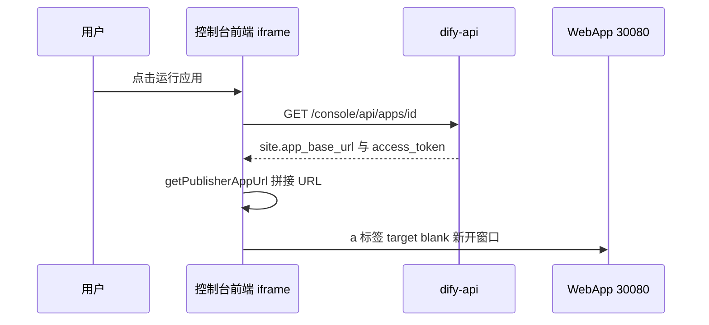
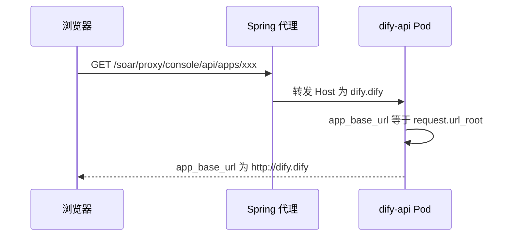
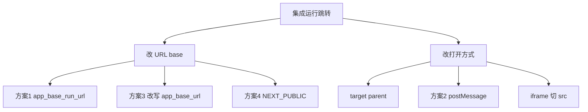
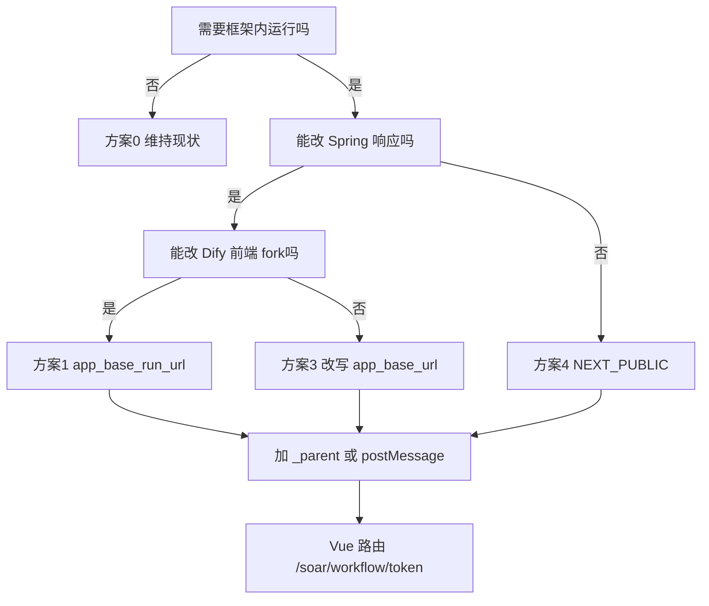

# Dify 运行按钮跳转问题排查与集成改造指南（完整版）

> **文档编号**：20260606-1340  
> **版本**：第四版（第一版全部内容 + 后续 app_base_run_url / 目标 URL / 第八章详案）
> **说明**：第十三～三十五章及附录 H/I 含第一版完整流水账；第八章为最新方案决策。  
> **主题**：跳转地址来源、排查过程、源码分析、全部改造方案与实施指南  
> **适用读者**：前端、Spring 代理、测试、运维  
> **编写日期**：2026-06-06  

---

## 目录

1. [背景与集成架构](#一背景与集成架构)
2. [问题现象、目标 URL 与核心疑问](#二问题现象目标-url-与核心疑问)
3. [跳转地址从哪里来](#三跳转地址从哪里来核心链路)
4. [排查过程（完整流水账）](#四排查过程完整流水账)
5. [源码深度分析（后端）](#五源码深度分析后端)
6. [源码深度分析（前端）](#六源码深度分析前端)
7. [问题根因总结](#七问题根因总结)
8. [全部改造方案对比](#八全部改造方案对比)
9. [推荐方案一：app_base_run_url](#九推荐方案一app_base_run_url-代理注入spring--前端)
10. [推荐方案二：postMessage](#十推荐方案二postmessage--openwebapp原第一版推荐)
11. [备选方案](#十一备选方案改写-app_base_url--next_public--其他)
12. [打开方式改造与 Vue 路由](#十二打开方式改造与-vue-路由)
13. [现场排查详细记录（第一版全文）](#十三现场排查详细记录与团队讨论纪要第一版全文)
14. [Dify 双前端架构（第一版扩展）](#十四dify-双前端架构说明第一版扩展)
15. [前端改造风险点（第一版扩展）](#十五前端改造注意事项与风险点第一版扩展)
16. [Spring 代理说明（第一版扩展）](#十六spring-boot-代理相关说明第一版扩展)
17. [交付物清单（第一版）](#十七交付物与后续行动项第一版postmessage-方案)
18. [验证清单与排查命令](#十八验证清单与排查命令)
19. [FAQ 与术语表](#十九faq-与术语表)
20. [实施 Checklist（第四版）](#二十实施-checklist第四版app_base_run_url-方案)
21. [前端/后端源码摘要（第四版）](#二十一前端源码逐行解读第四版摘要)
22. [附录：完整源码示例](#附录完整源码与代码示例)
23. [第一版补充：二十五～三十五章](#第一版完整补充章节与上文第四版方案并存)
24. [总结](#总结)

## 一、背景与集成架构

### 1.1 业务背景

我们希望在自研安全平台「**高级威胁检测与分析系统**」中集成 Dify 的剧本编排能力。整体思路：

1. 将 Dify **控制台前端**代码集成到自研项目中；
2. 编写 **Spring Boot 代理服务**：以前端直连 Dify 后端，改为前端访问代理、代理透明转发；
3. 在自研框架内通过 **iframe** 嵌入 Dify 控制台，使用户在统一菜单下完成剧本编排。

### 1.2 当前部署拓扑

```mermaid
flowchart TB
    subgraph user_browser [用户浏览器]
        A[自研框架 index.html#/soar/scriptArrangement]
        B[iframe 内嵌 Dify 控制台 /soar/#/scriptArrangement]
    end
    subgraph spring_proxy [Spring Boot 代理]
        C[/soar/proxy/console/api/**]
    end
    subgraph k8s_dify [K8s Dify 集群]
        D[dify-api 服务]
        E[dify-web NodePort 30080]
    end
    A --> B
    B --> C
    C --> D
    B -.控制台静态资源.-> E
    E --> D
```

### 1.3 关键环境变量（K8s）

| 变量名 | 当前值 | 作用 |
|--------|--------|------|
| `APP_WEB_URL` | `http://10.50.28.140:30080` | WebApp 公开访问基础地址，**必须保持** |
| `SERVICE_API_URL` | `http://10.50.28.140:30080` | API 文档等 `api_base_url`，**与运行跳转无关** |
| `CONSOLE_API_URL` | 指向 API | 控制台 API 前缀 |
| `CONSOLE_WEB_URL` | 控制台 Web | OAuth 回调、邮件链接等 |
| `APP_API_URL` | WebApp 调 API | 构建时注入 `NEXT_PUBLIC_PUBLIC_API_PREFIX` |

Docker Web 容器 `web/docker/entrypoint.sh` 关键注入：

```bash
export NEXT_PUBLIC_API_PREFIX=${CONSOLE_API_URL}/console/api
export NEXT_PUBLIC_PUBLIC_API_PREFIX=${APP_API_URL}/api
export NEXT_PUBLIC_BASE_PATH=${NEXT_PUBLIC_BASE_PATH}
```

### 1.4 页面地址对照

| 场景 | URL | 说明 |
|------|-----|------|
| 自研框架入口 | `https://10.50.28.140/index.html#/soar/scriptArrangement` | 外层 Vue 框架 |
| iframe 内控制台 | `https://10.50.28.140/soar/#/scriptArrangement` | Dify 编排画布 |
| **当前**点击运行后 | `http://10.50.28.140:30080/workflow/Ihxd87VBDaybVmv8` | Dify WebApp 运行页 |
| **期望**点击运行后 | `https://10.50.28.140/index.html#/soar/workflow/Ihxd87VBDaybVmv8` | 框架内 hash 路由 |
| Dify 原生控制台 | `http://10.50.28.140:30080/apps` | 独立使用，不能破坏 |

**重要约束**：`APP_WEB_URL` 必须保持 `http://10.50.28.140:30080`，因为 Dify 原生界面仍在使用，修改会影响 WebApp 链接、嵌入代码、邮件链接等大量功能。

---

## 二、问题现象、目标 URL 与核心疑问

### 2.1 当前行为

用户在 iframe 内编辑工作流，点击发布下拉「**运行应用**」后，浏览器 **新开标签页**，跳转到 Dify WebApp 运行页，脱离自研框架。该页特征：「运行一次」「批量运行」、底部 Powered by Dify（参见 `temp_data/运行地址.html` 快照）。

### 2.2 期望行为

点击运行后在 **自研框架内部** 跳转，保留顶部菜单与左侧导航：

```
https://10.50.28.140/index.html#/soar/workflow/Ihxd87VBDaybVmv8
```

| 对比项 | 当前 | 期望 |
|--------|------|------|
| 协议 | http | https |
| 入口 | Dify WebApp 直连 30080 | 自研 Vue hash 路由 |
| 路径 | `/workflow/{token}` | `#/soar/workflow/{token}` |
| 框架菜单 | 无 | 保留 |

### 2.3 两种「运行」不要混淆

| 对比项 | 画布「调试运行」 | 发布菜单「运行应用」 |
|--------|------------------|---------------------|
| 入口 | 画布右侧/底部调试 panel | 发布下拉 / 概览「启动」 |
| 是否跳转 | **否**，iframe 内 | **是**，打开 WebApp |
| API | `/console/api/.../workflows/draft/...` | 不调运行 API，只打开 URL |
| 页面特征 | 无 Powered by Dify | 有「运行一次/批量运行」 |
| 本次改造 | **否** | **是** |

### 2.4 排查开始前的核心疑问

1. 跳转 URL 是后端直接返回的，还是前端拼接的？
2. `APP_WEB_URL` 能否改成自研框架地址？
3. 清空 `APP_WEB_URL` 走 `request.url_root` 是否可行？
4. 画布「调试运行」和「运行应用」是否是同一个按钮？
5. 在不改 `APP_WEB_URL` 前提下，能否实现框架内跳转？
6. 改 `SERVICE_API_URL` 有没有用？
7. 拦截 `workflows/draft` 接口能否改跳转地址？
8. 代理层新增 `app_base_run_url` 字段是否可行？

**下文逐一解答。**

---

## 三、跳转地址从哪里来（核心链路）

**结论：后端不返回完整跳转 URL，只返回 `site.app_base_url` 和 `site.access_token`，前端 `getPublisherAppUrl` 拼接，再用 `target="_blank"` 打开。**

### 3.1 五步链路



| 步骤 | 环节 | 值示例 |
|------|------|--------|
| 1 | K8s `APP_WEB_URL` | `http://10.50.28.140:30080` |
| 2 | API `site.app_base_url` | 同上 |
| 3 | API `site.access_token` | `Ihxd87VBDaybVmv8`（即 `sites.code`） |
| 4 | 前端拼接 | `.../workflow/Ihxd87VBDaybVmv8` |
| 5 | `target="_blank"` | 新开标签页 |

### 3.2 拼接公式

```typescript
// web/app/components/app/app-publisher/utils.ts
export const getPublisherAppUrl = ({ appBaseUrl, accessToken, mode }) =>
  `${appBaseUrl}${basePath}/${getPublisherAppMode(mode)}/${accessToken}`
```

Workflow 代入：`http://10.50.28.140:30080` + `` + `/workflow/` + `Ihxd87VBDaybVmv8`

### 3.3 如何得到期望 URL

期望：`https://10.50.28.140/index.html#/soar/workflow/Ihxd87VBDaybVmv8`

同一公式，**base 改为**：`https://10.50.28.140/index.html#/soar`

可通过：代理注入 `app_base_run_url`、或 `NEXT_PUBLIC` 覆盖、或改写 `app_base_url` 实现。

### 3.4 哪个 API 提供数据（易错）

| 接口 | 含 site | 与跳转 |
|------|---------|--------|
| `GET /console/api/apps/{id}` | **是** | **数据来源** |
| `GET .../workflows/draft` | 否 | **无关，拦截无用** |
| `GET /console/api/apps` 列表 | 部分 | 视场景 |

---

## 四、排查过程（完整流水账）

### 4.1 第一步：复现并确认 URL 构成

**操作**：iframe 内打开编排页，点击发布 → 运行应用，观察 Network。

**现象**：新开标签 `http://10.50.28.140:30080/workflow/Ihxd87VBDaybVmv8`，与 `site.access_token` 一致。

### 4.2 第二步：抓取应用详情 API

```bash
curl 'https://10.50.28.140/soar/proxy/console/api/apps/e764e825-4485-4c3a-9172-fa52fbb6e300' \
  -H 'accept: */*' \
  -H 'content-type: application/json' \
  -H 'referer: https://10.50.28.140/soar/' \
  -b 'csrf_token=...; access_token=...; token=...' \
  -H 'x-csrf-token: ...' \
  --insecure
```

**输出（APP_WEB_URL 正常时，关键字段）**：

```json
{
  "id": "e764e825-4485-4c3a-9172-fa52fbb6e300",
  "name": "lcc勿删",
  "mode": "workflow",
  "enable_site": true,
  "api_base_url": "http://10.50.28.140:30080/v1",
  "site": {
    "access_token": "Ihxd87VBDaybVmv8",
    "code": "Ihxd87VBDaybVmv8",
    "app_base_url": "http://10.50.28.140:30080",
    "title": "lcc勿删",
    "customize_domain": null
  }
}
```

### 4.3 第三步：抓取 workflows/draft（确认与跳转无关）

```bash
curl 'https://10.50.28.140/soar/proxy/console/api/apps/e764e825-4485-4c3a-9172-fa52fbb6e300/workflows/draft' \
  -H 'referer: https://10.50.28.140/soar/' \
  -b '...' --insecure
```

**输出摘要**：仅含 `graph.nodes`、`graph.edges`、`hash`、`version: draft` 等，**无** `app_base_url`。

**完整 JSON 样例（实测，与跳转无关）**：

```json
{
  "id": "12e97ad0-8fbd-4802-8081-030e0ec6e5c1",
  "graph": {
    "nodes": [
      {
        "id": "1780715105890",
        "type": "custom",
        "data": {
          "variables": [],
          "type": "start",
          "title": "用户输入",
          "selected": false
        },
        "position": { "x": 80, "y": 282 },
        "width": 242,
        "height": 73
      },
      {
        "id": "1780715107246",
        "type": "custom",
        "data": {
          "outputs": [
            {
              "variable": "xx",
              "value_selector": ["sys", "files"],
              "value_type": "array[file]"
            }
          ],
          "type": "end",
          "title": "输出",
          "selected": false
        },
        "position": { "x": 382, "y": 282 },
        "width": 242,
        "height": 88
      }
    ],
    "edges": [
      {
        "id": "1780715105890-source-1780715107246-target",
        "type": "custom",
        "source": "1780715105890",
        "target": "1780715107246",
        "data": { "sourceType": "start", "targetType": "end" }
      }
    ],
    "viewport": { "x": -58, "y": -57, "zoom": 1 }
  },
  "hash": "bbf263ff1f6f25d5896bb30a5d1c7fe66eafd3e2a9d3c822f52cf3b057408e8a",
  "version": "draft"
}
```

**再次强调**：同事若说「拦截 draft 接口改跳转」，属于误解；draft 里没有 `site` 对象。

### 4.2.1 应用详情 API 完整响应样例（集成环境实测）

清空 `APP_WEB_URL` 实验时，同一接口完整响应摘录：

```json
{
  "id": "e764e825-4485-4c3a-9172-fa52fbb6e300",
  "name": "lcc勿删",
  "mode": "workflow",
  "enable_site": true,
  "enable_api": true,
  "api_base_url": "http://10.50.28.140:30080/v1",
  "site": {
    "access_token": "Ihxd87VBDaybVmv8",
    "code": "Ihxd87VBDaybVmv8",
    "app_base_url": "http://dify.dify",
    "title": "lcc勿删",
    "customize_domain": null,
    "default_language": "zh-Hans",
    "show_workflow_steps": true
  }
}
```

可见 `api_base_url` 仍为 30080，而 `app_base_url` 已变为 `dify.dify`，这就是「部分功能正常、运行跳转坏了」的原因。

### 4.4 第四步：源码检索

**后端**：`api/models/model.py`（Site.app_base_url）、`api/fields/app_fields.py`、`api/configs/feature/__init__.py`

**前端**：`app-publisher/utils.ts`、`suggested-action.tsx`（target blank）、`app-card.tsx`（window.open）、`(shareLayout)/workflow/[token]/page.tsx`

### 4.5 第五步：区分两种运行按钮

见 2.3 节表格。测试反馈的问题属于 **运行应用**。

### 4.6 第六步：清空 APP_WEB_URL 实验

**操作**：dify-api 设置 `APP_WEB_URL=""`，重启 pod。

#### 原生界面

- `http://10.50.28.140:30080/apps` **正常**
- 点击运行应用 → **about:blank**

#### 集成环境 API

```json
{
  "api_base_url": "http://10.50.28.140:30080/v1",
  "site": {
    "app_base_url": "http://dify.dify",
    "access_token": "Ihxd87VBDaybVmv8"
  }
}
```

**点击运行** → `http://dify.dify/workflow/...` → DNS 失败。

#### 原因图解



```python
@property
def app_base_url(self):
    return dify_config.APP_WEB_URL or request.url_root.rstrip("/")
```

#### 为何 api_base_url 仍正常

```python
@property
def api_base_url(self) -> str:
    base = dify_config.SERVICE_API_URL or request.host_url.rstrip("/")
    return normalize_api_base_url(base)
```

**结论**：`APP_WEB_URL` **不能清空**，必须恢复 `http://10.50.28.140:30080`。

### 4.7 第七步：确认不能改 APP_WEB_URL 为框架地址

`app_base_url` **全局唯一**，原生 30080 与集成共用同一 API，无法「集成用 /soar、原生用 30080」各一套（除非两套 API 实例）。

---

## 五、源码深度分析（后端）

### 5.1 Site.app_base_url

**文件**：`api/models/model.py`

```python
class Site(Base):
    code = mapped_column(String(255))  # API 中映射为 access_token

    @property
    def app_base_url(self):
        return dify_config.APP_WEB_URL or request.url_root.rstrip("/")
```

- 非数据库持久化字段，每次访问动态计算
- `APP_WEB_URL` 为空字符串时 Python 视为 falsy，走 `request.url_root`
- `customize_domain` **不参与** app_base_url 计算

### 5.2 App.api_base_url（与跳转无关）

```python
@property
def api_base_url(self) -> str:
    base = dify_config.SERVICE_API_URL or request.host_url.rstrip("/")
    return normalize_api_base_url(base)
```

**文件**：`api/libs/url_utils.py`

```python
def normalize_api_base_url(base_url: str) -> str:
    return base_url.rstrip("/").removesuffix("/v1").rstrip("/") + "/v1"
```

### 5.3 site 字段序列化

**文件**：`api/fields/app_fields.py`

```python
site_fields = {
    "access_token": fields.String(attribute="code"),
    "code": fields.String,
    "app_base_url": fields.String,
    "customize_domain": fields.String,
    # ...
}
```

### 5.4 环境变量定义

**文件**：`api/configs/feature/__init__.py`

```python
APP_WEB_URL: str = Field(
    description="Base URL for the web application, used for frontend references",
    default="",
)
SERVICE_API_URL: str = Field(
    description="Base URL for the service API, displayed to users for API access",
    default="",
)
```

### 5.5 代理与 X-Forwarded

**文件**：`api/extensions/ext_proxy_fix.py`

```python
if dify_config.RESPECT_XFORWARD_HEADERS_ENABLED:
    app.wsgi_app = ProxyFix(app.wsgi_app, x_port=1)
```

即使开启，fallback 仍只能产出一个 `request.url_root`，无法同时满足原生与集成两种 base。

---

## 六、源码深度分析（前端）

### 6.1 getPublisherAppUrl 与 getPublisherAppMode

**文件**：`web/app/components/app/app-publisher/utils.ts`

```typescript
export const getPublisherAppMode = (mode?: AppModeEnum) => {
  if (mode !== AppModeEnum.COMPLETION && mode !== AppModeEnum.WORKFLOW)
    return AppModeEnum.CHAT
  return mode
}

export const getPublisherAppUrl = ({
  appBaseUrl,
  accessToken,
  mode,
}: {
  appBaseUrl: string
  accessToken: string
  mode?: AppModeEnum
}) => `${appBaseUrl}${basePath}/${getPublisherAppMode(mode)}/${accessToken}`
```

**文件**：`web/utils/var.ts`

```typescript
export const basePath = env.NEXT_PUBLIC_BASE_PATH
```

### 6.2 AppPublisher 读取 site

**文件**：`web/app/components/app/app-publisher/index.tsx`

```typescript
const { app_base_url: appBaseURL = '', access_token: accessToken = '' } = appDetail?.site ?? {}
const appURL = getPublisherAppUrl({ appBaseUrl: appBaseURL, accessToken, mode: appDetail?.mode })
```

`handleWorkflowLaunchConfirm` 中带隐藏变量时：

```typescript
const targetUrl = await buildWorkflowLaunchUrl({
  accessibleUrl: workflowLaunchTargetUrl,
  variables: supportedWorkflowLaunchVariables,
  values: workflowLaunchValues,
})
window.open(targetUrl, '_blank')  // 改造点
```

### 6.3 PublisherActionsSection 运行应用菜单

**文件**：`web/app/components/app/app-publisher/sections.tsx`

```tsx
<SuggestedAction
  disabled={disabledFunctionButton}
  link={appURL}
  icon={<span className="i-ri-play-circle-line size-4" />}
>
  {t('common.runApp', { ns: 'workflow' })}
</SuggestedAction>

{/* 批量运行 */}
<SuggestedAction
  link={`${appURL}${appURL.includes('?') ? '&' : '?'}mode=batch`}
>
  {t('common.batchRunApp', { ns: 'workflow' })}
</SuggestedAction>
```

### 6.4 SuggestedAction — 跳转行为根源

**文件**：`web/app/components/app/app-publisher/suggested-action.tsx`（当前完整源码）

```tsx
const mainAction = (
  <a
    href={disabled ? undefined : link}
    target="_blank"
    rel="noreferrer"
    className={cn(/* ... */)}
    onClick={handleClick}
  >
    {children}
  </a>
)
```

**关键**：`target="_blank"` 必然新开标签页。

### 6.5 概览页 app-card

**文件**：`web/app/components/app/overview/app-card.tsx`

```typescript
const handleLaunch = useCallback(() => {
  window.open(cardState.accessibleUrl, '_blank')
}, [cardState.accessibleUrl])
```

**文件**：`web/app/components/app/overview/app-card-utils.ts`

```typescript
export const getAppCardDisplayState = ({ appInfo, cardType, ... }) => {
  const appBaseUrl = appInfo.site?.app_base_url ?? ''
  const accessToken = appInfo.site?.access_token ?? ''
  return {
    accessibleUrl: isApp
      ? `${appBaseUrl}${basePath}/${appMode}/${accessToken}`
      : (appInfo.api_base_url ?? ''),
  }
}
```

### 6.6 buildWorkflowLaunchUrl

```typescript
export const buildWorkflowLaunchUrl = async ({ accessibleUrl, variables, values }) => {
  const targetUrl = new URL(accessibleUrl, window.location.origin)
  variables.forEach((variable) => {
    targetUrl.searchParams.set(variable.variable, serializedValue)
  })
  return targetUrl.toString()
}
```

当 `app_base_url` 为空时，相对 URL 会以 iframe 的 origin 解析，导致错误。

### 6.7 WebApp 运行页路由

**文件**：`web/app/(shareLayout)/workflow/[token]/page.tsx`

```tsx
const Workflow = () => (
  <AuthenticatedLayout>
    <Main isWorkflow />
  </AuthenticatedLayout>
)
```

### 6.8 日志空态链接（可选改造）

**文件**：`web/app/components/app/log/empty-element.tsx`

```tsx
<Link
  href={`${appDetail.site.app_base_url}${basePath}/${getWebAppType(appDetail.mode)}/${appDetail.site.access_token}`}
  target="_blank"
/>
```

### 6.9 涉及 window.open / target blank 的文件清单

| 文件 | 说明 |
|------|------|
| `app-publisher/suggested-action.tsx` | 运行应用、批量运行 |
| `app-publisher/index.tsx` | handleWorkflowLaunchConfirm |
| `overview/app-card.tsx` | handleLaunch、handleWorkflowLaunchConfirm |
| `log/empty-element.tsx` | 分享链接 |

检索命令：

```bash
cd web && rg "window\.open|target=\"_blank\"" app/components/app --glob "*.tsx"
```

---

## 七、问题根因总结

| 层级 | 根因 |
|------|------|
| 配置层 | `APP_WEB_URL` 指向 30080 正确且必须保持 |
| 数据层 | 后端返回 `site.app_base_url` + `access_token` |
| 拼接层 | 前端 `getPublisherAppUrl` 拼 `/workflow/{token}` |
| 行为层 | `target="_blank"` / `window.open(..., '_blank')` |
| 架构层 | 只嵌入了控制台，WebApp 在 30080 独立路由 |

**要解决框架内跳转，需同时处理：① base URL ② 打开方式 ③ Vue 路由承接。**

---

## 八、全部改造方案对比

要解决集成「运行应用」跳转，本质上需要处理 **两个独立问题**：

| 问题 | 说明 | 不改的后果 |
|------|------|------------|
| **① URL 的 base 不对** | 当前拼出 `:30080/workflow/...`，期望 `index.html#/soar/workflow/...` | 即使不新开标签，也会跳到错误地址 |
| **② 打开方式不对** | 当前 `target="_blank"` / `window.open` | 即使 URL 正确，仍会新开标签离开框架 |

多数方案只解决其中一项，**推荐组合**是：方案 1 或 4 解决 ①，`_parent` 或 postMessage 解决 ②，Vue 路由承接运行页。



### 8.1 总览对比表

| 编号 | 方案 | 改 URL | 改打开 | Dify前端 | Spring | Vue框架 | 原生30080 | 推荐度 | 适用场景 |
|------|------|--------|--------|----------|--------|---------|-----------|--------|----------|
| 0 | 维持现状 | 否 | 否 | 否 | 否 | 否 | 不变 | ⭐⭐ | 临时上线、可接受新标签 |
| 1 | app_base_run_url 注入 | 是 | 需配合 | 是 | **是** | 需配合 | 无影响 | ⭐⭐⭐⭐⭐ | **团队首选** |
| 2 | postMessage + openWebApp | 可选 | 是 | 是 | 否 | **是** | 无影响 | ⭐⭐⭐⭐ | 不改 API、纯前端+Vue |
| 3 | 改写 app_base_url | 是 | 需配合 | 否/少 | 是 | 需配合 | 无影响 | ⭐⭐⭐ | 不想改 Dify 前端 |
| 4 | NEXT_PUBLIC 环境变量 | 是 | 需配合 | 是 | 否 | 需配合 | 无影响 | ⭐⭐⭐⭐ | 不动 Spring、可 rebuild |
| 5 | 统一域名反向代理 | 大改 | 视情况 | 可能 | 运维 | 可能 | 易冲突 | ⭐ | 不推荐当前阶段 |
| 6 | 仅用画布调试运行 | 否 | 否 | 否 | 否 | 否 | 不变 | ⭐ | 仅内部调试 |

---

### 8.2 方案 0：维持现状（零改动）

#### 改动方式

无需任何代码或配置变更。保持：

- `APP_WEB_URL=http://10.50.28.140:30080`
- 前端 `getPublisherAppUrl` + `target="_blank"` 默认行为

#### 实际效果

用户点击「运行应用」→ 新开标签页 → `http://10.50.28.140:30080/workflow/{token}`

#### 影响范围

| 对象 | 影响 |
|------|------|
| 自研集成页 | 体验差，离开框架 |
| 原生 Dify 30080 | 正常 |
| 运维/后端 | 无 |
| 前端 fork | 无 |

#### 优点

- 零风险、零维护成本
- 不引入新 bug
- 原生与集成行为一致（都是新开 30080）

#### 缺点

- 不符合产品「框架内运行」需求
- 用户上下文切换明显（菜单消失）
- HTTPS 框架与 HTTP 30080 混用，安全观感差

#### 推荐度：⭐⭐（临时方案）

适合：第一期先上线编排能力，运行页后续迭代；或产品接受「运行即跳到 Dify 原生页」。

#### 工作量

0 人日。

---

### 8.3 方案 1：app_base_run_url 代理注入（Spring + Dify 前端）

#### 改动方式

**Spring 侧**（仅 `/soar/proxy/console/api/**` 响应）：

1. 在 `site` 对象 **新增** 字段 `app_base_run_url`，值为 `https://10.50.28.140/index.html#/soar`
2. **不修改** 原有 `app_base_url`（仍为 30080）
3. 拦截 `GET /console/api/apps/{id}` 及所有返回 `site` 的接口
4. **不要** 拦截 `workflows/draft`

**Dify 前端 fork 侧**：

1. 扩展 `site` 类型，增加 `app_base_run_url?: string`
2. 修改 `getPublisherAppUrl`：`const base = appBaseRunUrl || appBaseUrl`
3. 同步改 `getAppCardDisplayState` 的 `accessibleUrl`
4. 改 `app-publisher/index.tsx`、`app-card.tsx` 传入新字段
5. 改打开方式：嵌入场景 `target="_parent"` 或 `postMessage`（见 8.9）

**Vue 框架侧**：

1. 注册路由 `/soar/workflow/:token`
2. 运行页 iframe 加载 `http://10.50.28.140:30080/workflow/{token}`

#### 拼接结果示例

```
https://10.50.28.140/index.html#/soar/workflow/Ihxd87VBDaybVmv8
```

#### 影响范围

| 对象 | 影响 |
|------|------|
| 走 Spring 代理的集成请求 | 多一个 `app_base_run_url` 字段 |
| 直连 30080 的原生 API | **无变化**（无新字段，前端回退 app_base_url） |
| APP_WEB_URL | **不改** |
| SERVICE_API_URL | 不改 |

#### 优点

- 原生 Dify 与集成 **可并存**，互不破坏
- 原 `app_base_url` 保留，排查时可对照
- URL 规则可在 Spring 配置，**改地址不必重新构建 Dify 前端**
- 语义清晰：Run 专用字段
- 与团队「代理层扩展」架构一致

#### 缺点

- 需同时维护 Spring 注入逻辑 + 前端 fork
- 须覆盖所有含 `site` 的 API，漏接口会导致偶发仍跳 30080
- Dify 升级时需 merge 前端改动
- 仍须处理打开方式 + Vue 路由

#### 风险

- JSON 注入若用字符串 replace 可能误伤其他字段 → 应用 Jackson 解析
- 列表接口中嵌套 `site` 需递归处理

#### 推荐度：⭐⭐⭐⭐⭐（URL 层面首选）

适合：**已具备 Spring 代理、可改 Dify 前端 fork、需保持 APP_WEB_URL=30080** 的团队。

#### 工作量（估算）

| 角色 | 工作量 |
|------|--------|
| Spring | 1～1.5 人日 |
| Dify 前端 | 1 人日 |
| Vue 框架 | 0.5 人日 |
| 测试 | 0.5 人日 |
| **合计** | **约 3～3.5 人日** |

---

### 8.4 方案 2：postMessage + openWebApp（Dify 前端 + Vue）

#### 改动方式

**不强制改 API 响应**。新增 `web/utils/open-webapp.ts`：

```typescript
if (isEmbeddedInFrame())
  window.parent.postMessage({ type: 'DIFY_OPEN_WEBAPP', url }, PARENT_ORIGIN)
else
  window.open(url, '_blank')
```

替换所有 `window.open` 及嵌入场景下的 `<a target="_blank">` 调用点：

- `suggested-action.tsx`
- `app-publisher/index.tsx`
- `app-card.tsx`
- 可选 `log/empty-element.tsx`

**Vue 父页面**：

```javascript
window.addEventListener('message', (e) => {
  if (e.data?.type === 'DIFY_OPEN_WEBAPP') {
    // 切换 iframe src 或 router.push
  }
})
```

#### URL 是否修改

| 子模式 | URL | 说明 |
|--------|-----|------|
| 2A 不改 base | 仍 `http://10.50.28.140:30080/workflow/...` | 父 iframe 直接加载 30080 |
| 2B 配合方案1/4 | `index.html#/soar/workflow/...` | postMessage 传 hash URL，父页面 router.push |

#### 影响范围

| 对象 | 影响 |
|------|------|
| 集成 iframe 内点击运行 | 不再 _blank，由父页面接管 |
| 原生 30080 独立访问 | `isEmbeddedInFrame()===false`，仍 _blank |
| Spring / APP_WEB_URL | 无 |

#### 优点

- **不依赖 Spring 改 JSON**，纯前端 + Vue 可闭环
- 原生行为通过 `isEmbeddedInFrame` 隔离
- 可与方案 1、4 任意组合
- 不刷新整页（router.push 时）

#### 缺点

- 必须改 Dify 前端 fork
- 必须实现 Vue message 监听，否则点击无反应
- 2A 模式下地址栏语义仍是 30080，不是 `#/soar/workflow/`
- 需严格校验 `event.origin`

#### 风险

- postMessage 目标 origin 配错导致消息丢失
- 父页面未监听时静默失败

#### 推荐度：⭐⭐⭐⭐（打开方式首选；URL 需配合其他方案）

适合：**打开方式改造**；若同时要 hash URL，与方案 1 或 4 组合。

#### 工作量

| 角色 | 工作量 |
|------|--------|
| Dify 前端 | 0.5～1 人日 |
| Vue 框架 | 0.5～1 人日 |
| **合计** | **约 1～2 人日**（不含 URL base 改造） |

---

### 8.5 方案 3：Spring 代理改写 app_base_url

#### 改动方式

Spring 在代理响应中 **直接替换** 现有字段：

```json
"app_base_url": "http://10.50.28.140:30080"
→
"app_base_url": "https://10.50.28.140/index.html#/soar"
```

Dify ** stock 前端** 无需改 `getPublisherAppUrl`（仍读 `app_base_url`），但 **仍须** 改打开方式（`_parent` 或 postMessage）+ Vue 路由。

#### 影响范围

| 对象 | 影响 |
|------|------|
| 走代理的集成 API | app_base_url 被覆盖 |
| 直连 30080 API | 不变 |
| 前端 fork | 仅打开方式（若用 stock 前端则只改 Vue） |

#### 优点

- Dify 前端拼接逻辑 **零改动**（若用官方未 fork 的控制台且只走代理）
- 实现比新增字段略简单（只改一个 key）

#### 缺点

- **丢失原生 app_base_url**，响应里看不到真实 30080，排查困难
- 与方案 1 比语义不清（一个字段两用途）
- 嵌入代码、二维码等若同一响应被改写，可能连带异常（需确认接口范围）
- 仍不能解决 `_blank`，必须额外改打开方式

#### 与方案 1 对比

| 对比项 | 方案 1 app_base_run_url | 方案 3 改写 app_base_url |
|--------|-------------------------|---------------------------|
| 原字段保留 | 是 | 否 |
| 前端改动 | 要改 getPublisherAppUrl | 可不改拼接 |
| 排查性 | 好 | 差 |
| 推荐 | **首选** | 备选 |

#### 推荐度：⭐⭐⭐

适合：暂时不想动 Dify 前端拼接代码、仅 Spring 能改、可接受覆盖原字段。

#### 工作量

Spring 1 人日 + Vue/打开方式 0.5～1 人日 ≈ **1.5～2 人日**。

---

### 8.6 方案 4：NEXT_PUBLIC 环境变量覆盖 base

#### 改动方式

构建 Dify 前端时注入：

```bash
NEXT_PUBLIC_EMBEDDED_WEBAPP_BASE=https://10.50.28.140/index.html#/soar
NEXT_PUBLIC_PARENT_ORIGIN=https://10.50.28.140
```

新增工具函数，**仅在 iframe 内** 覆盖 base：

```typescript
export function getWebAppLaunchBase(apiAppBaseUrl: string, apiAppBaseRunUrl?: string) {
  if (apiAppBaseRunUrl) return appBaseRunUrl  // 若与方案1并存，优先注入字段
  if (isEmbeddedInFrame() && process.env.NEXT_PUBLIC_EMBEDDED_WEBAPP_BASE)
    return process.env.NEXT_PUBLIC_EMBEDDED_WEBAPP_BASE
  return apiAppBaseUrl
}
```

修改 `getPublisherAppUrl` 使用 `getWebAppLaunchBase`。打开方式同方案 1。

#### 影响范围

| 对象 | 影响 |
|------|------|
| 集成 iframe 部署的 Dify 前端 | 嵌入场景 base 变 hash |
| 原生 30080 部署的 Dify 前端 | 若 **同一构建产物** 则也受影响 → 建议 **集成与原生分构建** 或依赖 isEmbeddedInFrame 分支 |
| Spring | 无 |
| APP_WEB_URL | 不改 |

#### 优点

- **不动 Spring**，适合代理层不便改 JSON 的团队
- 逻辑集中在 fork 前端，易单测
- 与 `isEmbeddedInFrame` 配合可隔离原生

#### 缺点

- 改 URL 需 **重新构建并部署** Dify 前端
- 多环境（测试/生产）需多套构建参数
- 不能与「只改集成、同一套 30080 静态资源」完全解耦，除非构建两次

#### 与方案 1 对比

| 对比项 | 方案 1 代理注入 | 方案 4 NEXT_PUBLIC |
|--------|-----------------|---------------------|
| 改 URL 是否重启/ rebuild | 改 Spring 配置即可 | 需 rebuild 前端 |
| Spring 改动 | 要 | 不要 |
| 运维灵活度 | 高 | 中 |

#### 推荐度：⭐⭐⭐⭐

适合：**Spring 不便改响应体**、前端发布流程成熟、集成与原生可分开构建。

#### 工作量

Dify 前端 1 人日 + Vue 0.5 人日 ≈ **1.5～2 人日**。

---

### 8.7 方案 5：统一域名反向代理

#### 改动方式

在 `https://10.50.28.140` 同一域名下：

- `/soar/` → 集成控制台
- `/dify-web/` 或 `/workflow/` → 反代到 `:30080` WebApp
- 尝试让 `APP_WEB_URL=https://10.50.28.140/dify-web`

#### 影响范围

- **全局** APP_WEB_URL 变更 → **原生 30080 用户全部受影响**
- 与当前约束「APP_WEB_URL 必须保持 30080」**直接冲突**
- 需 Nginx/网关、证书、路径规划大改

#### 优点

- 长期看 URL 统一、Mixed Content 可缓解

#### 缺点

- 改动面极大，与现网原生 Dify 冲突
- 不能单独服务集成场景
- 实施周期长

#### 推荐度：⭐（当前阶段不推荐）

#### 工作量

运维级，**数周**，超出本次集成范围。

---

### 8.8 方案 6：仅用画布「调试运行」

#### 改动方式

无。告知用户不要使用发布菜单「运行应用」，只在画布调试 panel 内运行。

#### 影响

- 无 WebApp「运行一次/批量运行」UI
- 无对外发布体验验证
- 不符合正式「剧本运行」产品场景

#### 推荐度：⭐（仅开发调试）

---

### 8.9 打开方式子方案（与 URL 方案正交）

URL 方案 1/3/4 只解决 href **拼什么**；以下解决 **怎么开**：

| 子方案 | 改动 | 效果 | 推荐 |
|--------|------|------|------|
| **A. target="_parent"** | 改 `suggested-action.tsx` 一行 target | 父窗口导航到 hash URL | 改动最小，与 hash URL 绝配 |
| **B. postMessage** | openWebApp + Vue 监听 | 父页面 router.push，无整页刷新 | 体验最好，代码略多 |
| **C. iframe 切 src** | 父页面改 iframe.src | 仍可能显示 30080 URL | 适合 2A 不改 hash |
| **D. 仍 _blank** | 不改 | 新标签打开（即使 hash URL） | 不推荐 |

---

### 8.10 推荐组合（可直接照抄）

| 组合 | URL | 打开 | 推荐场景 | 总推荐度 |
|------|-----|------|----------|----------|
| **组合 A（团队首选）** | 方案 1 app_base_run_url | A _parent 或 B postMessage | Spring+前端都可改、要 hash URL | ⭐⭐⭐⭐⭐ |
| **组合 B** | 方案 4 NEXT_PUBLIC | A _parent | 不改 Spring | ⭐⭐⭐⭐ |
| **组合 C** | 方案 3 改写 app_base_url | A _parent | 尽量少改 Dify 前端 | ⭐⭐⭐ |
| **组合 D** | 不改 URL | 方案 2 postMessage + iframe 30080 | 快速止血、接受 30080 在 iframe 内 | ⭐⭐⭐ |
| **组合 E** | 方案 0 | - | 临时上线 | ⭐⭐ |

**本团队建议实施路径**：

1. **第一阶段（最小可用）**：组合 D — postMessage + 父 iframe 加载 30080，1～2 人日  
2. **第二阶段（产品完整）**：组合 A — app_base_run_url + _parent + Vue 路由，再 2 人日  

---

### 8.11 方案决策树



---

**团队推荐组合（摘要）**：

- **URL**：方案 1（app_base_run_url）优先；Spring 不可动时用方案 4  
- **打开**：`_parent`（最小）或 postMessage（体验更好）  
- **承接**：Vue 路由 `#/soar/workflow/:token` + iframe 加载 30080 WebApp  

---

## 九、推荐方案一：app_base_run_url 代理注入（Spring + 前端）

### 9.1 思路

Spring 在 **仅集成路径** `/soar/proxy/console/api/**` 响应中，向 `site` **新增字段**，**不修改**原 `app_base_url`：

| 字段 | 来源 | 含义 |
|------|------|------|
| `app_base_url` | Dify 原生 | 保持 30080 |
| `app_base_run_url` | Spring 注入 | 集成「运行」专用 base |

```json
{
  "site": {
    "app_base_url": "http://10.50.28.140:30080",
    "access_token": "Ihxd87VBDaybVmv8",
    "app_base_run_url": "https://10.50.28.140/index.html#/soar"
  }
}
```

前端 camelCase：**`appBaseRunUrl`**；API snake_case：**`app_base_run_url`**（Run 运行，不是 Rule）。

### 9.2 为何优于直接改写 app_base_url

- 原字段保留，排查时可对照 Dify 原生地址
- 语义清晰：Run 专用 vs 原生 WebApp
- 原生直连 API 无新字段 → 自动回退 `app_base_url`

### 9.3 Spring 实施

**要拦截的接口**：

- `GET /console/api/apps/{id}`（必须）
- 其他返回 `site` 的接口（列表等）

**不要拦截**：`GET .../workflows/draft`

**application.yml**：

```yaml
dify:
  integration:
    app-base-run-url: https://10.50.28.140/index.html#/soar
```

**ResponseBodyAdvice 示例**：

```java
@ControllerAdvice
public class DifySiteEnrichAdvice implements ResponseBodyAdvice<Object> {

    @Value("${dify.integration.app-base-run-url}")
    private String appBaseRunUrl;

    @Override
    public boolean supports(MethodParameter returnType, Class converterType) {
        // 仅处理 /soar/proxy/console/api 路径
        return true;
    }

    @Override
    public Object beforeBodyWrite(Object body, MethodParameter returnType,
            MediaType contentType, Class selectedConverterType,
            ServerHttpRequest request, ServerHttpResponse response) {
        if (!(body instanceof Map)) return body;
        enrichSite((Map<String, Object>) body);
        return body;
    }

    @SuppressWarnings("unchecked")
    private void enrichSite(Map<String, Object> json) {
        Object siteObj = json.get("site");
        if (!(siteObj instanceof Map)) return;
        Map<String, Object> site = (Map<String, Object>) siteObj;
        site.put("app_base_run_url", appBaseRunUrl);
    }
}
```

生产环境建议用 Jackson `ObjectNode` 递归处理，并覆盖列表接口中嵌套的 `site`。

### 9.4 前端改造

#### 类型扩展

```typescript
site?: {
  app_base_url?: string
  access_token?: string
  app_base_run_url?: string
}
```

#### getPublisherAppUrl（改造后）

```typescript
export const getPublisherAppUrl = ({
  appBaseUrl,
  appBaseRunUrl,
  accessToken,
  mode,
}: {
  appBaseUrl: string
  appBaseRunUrl?: string
  accessToken: string
  mode?: AppModeEnum
}) => {
  const base = (appBaseRunUrl || appBaseUrl).replace(/\/$/, '')
  return `${base}${basePath}/${getPublisherAppMode(mode)}/${accessToken}`
}
```

#### getAppCardDisplayState 同步改造

```typescript
const appBaseUrl = appInfo.site?.app_base_url ?? ''
const appBaseRunUrl = appInfo.site?.app_base_run_url
const launchBase = appBaseRunUrl || appBaseUrl
accessibleUrl: isApp
  ? `${launchBase}${basePath}/${appMode}/${accessToken}`
  : (appInfo.api_base_url ?? ''),
```

#### 调用处

```typescript
const {
  app_base_url: appBaseURL = '',
  access_token: accessToken = '',
  app_base_run_url: appBaseRunUrl,
} = appDetail?.site ?? {}

const appURL = getPublisherAppUrl({
  appBaseUrl: appBaseURL,
  appBaseRunUrl,
  accessToken,
  mode: appDetail?.mode,
})
```

**集成环境结果**：

```
https://10.50.28.140/index.html#/soar/workflow/Ihxd87VBDaybVmv8
```

**原生 30080**：无 `app_base_run_url` → 回退 → 行为不变。

---

## 十、推荐方案二：postMessage + openWebApp（原第一版推荐）

不改 API 时，仍可用 30080 URL，由 **父页面** 在框架内 iframe 加载运行页。

### 10.1 新增 open-webapp.ts

```typescript
// web/utils/open-webapp.ts
export type OpenWebAppMessage = {
  type: 'DIFY_OPEN_WEBAPP'
  url: string
}

const PARENT_ORIGIN = process.env.NEXT_PUBLIC_PARENT_ORIGIN ?? '*'

export function isEmbeddedInFrame(): boolean {
  try {
    return window.self !== window.top
  } catch {
    return true
  }
}

export function openWebApp(url: string): void {
  if (!url) return
  if (isEmbeddedInFrame()) {
    window.parent.postMessage({ type: 'DIFY_OPEN_WEBAPP', url }, PARENT_ORIGIN)
    return
  }
  window.open(url, '_blank', 'noopener,noreferrer')
}
```

环境变量：

```bash
NEXT_PUBLIC_PARENT_ORIGIN=https://10.50.28.140
```

### 10.2 与 app_base_run_url 组合

| 组合 | URL 来源 | 打开方式 |
|------|----------|----------|
| 仅 postMessage | 仍 30080 | 父 iframe 加载 |
| app_base_run_url + _parent | 框架 hash | 父窗口导航 |
| app_base_run_url + postMessage | 框架 hash | router.push |

### 10.3 Vue 父页面双 iframe 示例

见 [附录 D](#附录-dvue-父页面双-iframe-完整示例)。

---

## 十一、备选方案：改写 app_base_url / NEXT_PUBLIC / 其他

### 11.1 方案：Spring 改写 app_base_url

直接把响应中 `site.app_base_url` 改为 `https://10.50.28.140/index.html#/soar`。

- 优点：Dify 前端可零改动（仅打开方式）
- 缺点：覆盖原字段，不利于排查；与新增字段比语义差

```java
site.put("app_base_url", "https://10.50.28.140/index.html#/soar");
```

### 11.2 方案：NEXT_PUBLIC_EMBEDDED_WEBAPP_BASE

```bash
NEXT_PUBLIC_EMBEDDED_WEBAPP_BASE=https://10.50.28.140/index.html#/soar
```

```typescript
export function getWebAppLaunchBase(apiAppBaseUrl: string): string {
  const embeddedBase = process.env.NEXT_PUBLIC_EMBEDDED_WEBAPP_BASE
  if (isEmbeddedInFrame() && embeddedBase)
    return embeddedBase.replace(/\/$/, '')
  return apiAppBaseUrl
}
```

- 优点：不动 Spring
- 缺点：改 URL 需重新构建前端

**说明**：

- `SERVICE_API_URL` **与跳转无关**
- `APP_WEB_URL` 前端不直接读，只读 API 的 `site.app_base_url`
- 前端 **能** 通过 `NEXT_PUBLIC_*` 拿构建时变量

### 11.3 方案：统一域名反向代理

同域名挂 `/dify-web/` 反代 30080。与「必须保持 APP_WEB_URL=30080」冲突，改动大，不推荐。

### 11.4 方案：仅用画布调试运行

不打开 WebApp，只在 iframe 内调试。无「运行一次/批量运行」正式 UI，仅适合内部调试。

### 11.5 方案：维持现状

接受新开 `:30080/workflow/{token}`，零改动。

---

## 十二、打开方式改造与 Vue 路由

### 12.1 为何 URL 对了还不够

即使 href 已是 `https://10.50.28.140/index.html#/soar/workflow/{token}`，`target="_blank"` 仍会在 **新标签** 打开框架页。

### 12.2 方式 A：target="_parent"（改动最小）

```tsx
<a
  href={link}
  target={isEmbeddedInFrame() ? '_parent' : '_blank'}
  rel="noreferrer"
  onClick={handleClick}
>
```

### 12.3 方式 B：postMessage + router.push

```javascript
window.addEventListener('message', (event) => {
  if (event.origin !== 'https://10.50.28.140') return
  if (event.data?.type !== 'DIFY_OPEN_WEBAPP') return
  const url = event.data.url
  const m = url.match(/\/workflow\/([^/?#]+)/)
  if (m) router.push(`/soar/workflow/${m[1]}`)
})
```

### 12.4 Vue 路由（必做）

```javascript
{ path: '/soar/workflow/:token', component: WorkflowRunPage }
```

```vue
<iframe :src="`http://10.50.28.140:30080/workflow/${$route.params.token}`" />
```

### 12.5 方式 C：单 iframe 切换 src

```javascript
iframe.dataset.editorSrc = iframe.src
iframe.src = runUrl  // 30080 或 hash 对应页
```

---

---

## 十三、现场排查详细记录与团队讨论纪要（第一版全文）

### 13.1 第一天：问题发现

当天测试同学在「处置响应 → 剧本编排 → 剧本编排」菜单下打开集成页面，地址为 `https://10.50.28.140/index.html#/soar/scriptArrangement`。页面外层是我们自研的 Vue 框架，包含顶部威胁场景、监控中心、处置响应等一级菜单，以及左侧「任务调度、剧本编排、执行日志」等二级菜单。内容区域是一个 iframe，加载地址为 `/soar/#/scriptArrangement`，iframe 内展示的是 Dify 工作流编排画布。

测试同学在工作流画布上完成「用户输入 → 输出」的简单流程后，点击右上角发布按钮，在下拉菜单中选择「运行」相关选项。此时浏览器 **新打开了一个标签页**，地址栏显示 `http://10.50.28.140:30080/workflow/Ihxd87VBDaybVmv8`，页面内容为 Dify 工作流 WebApp 运行界面，包含「运行一次」「批量运行」标签页，底部有 Powered by Dify 标识。

测试同学反馈：「编排是在我们系统里做的，但一点运行就跳到了另一个系统界面，顶部的菜单栏和左侧导航都消失了。」这被记录为 **P1 集成体验问题**，指派前端和后端联合排查。

### 13.2 第一天下午：初步假设

前端同事的第一反应是：「这个跳转地址是不是后端写死的？」因为在 Network 面板中可以看到，跳转前的应用详情接口返回了 `app_base_url` 和 `access_token` 字段，跳转 URL 正好等于 `app_base_url + '/workflow/' + access_token`。

后端同事的第一反应是：「我们只做了透明代理，没有改任何响应内容，应该是 Dify 原生逻辑。」

集成负责人提出的假设有三条：

1. **假设一**：修改 K8s 中的 `APP_WEB_URL` 为自研框架地址，让后端返回的 `app_base_url` 指向 `/soar/`，这样跳转就会留在框架内。
2. **假设二**：清空 `APP_WEB_URL`，让后端自动从请求中推断地址（`request.url_root`），因为集成请求走的是 `https://10.50.28.140/soar/proxy/...`，推断结果应该是 `https://10.50.28.140/soar`。
3. **假设三**：这是 Dify 前端写死了跳转逻辑，需要改前端代码，在 iframe 场景下阻止 `window.open` 或 `target="_blank"`。

当天未能定论，决定第二天做源码分析和实验验证。

### 13.3 第二天：源码阅读与职责划分

第二天上午，集成负责人在 Dify 源码仓库中进行全文检索。后端方面，在 `api/models/model.py` 中找到 `Site.app_base_url` 属性，确认其逻辑为 `APP_WEB_URL or request.url_root`。同时在 `api/fields/app_fields.py` 中确认 API 返回的 `access_token` 实际映射自数据库 `sites.code` 字段。

前端方面，在 `web/app/components/app/app-publisher/utils.ts` 中找到 `getPublisherAppUrl` 函数，确认 URL 由前端拼接。在 `web/app/components/app/app-publisher/suggested-action.tsx` 中发现 `<a target="_blank">`，这是新开标签页的直接原因。

**职责划分结论**：

- **后端**：负责告诉前端「WebApp 部署在哪个基础地址」（`app_base_url`）以及「这个应用的公开访问令牌是什么」（`access_token`）。
- **前端**：负责把这两个值拼成完整 URL，并以 `_blank` 方式打开。
- **跳转目标页**：Dify WebApp 前端路由 `/workflow/[token]`，与控制台的 `/app/[appId]/workflow` 是不同路由。

这个结论非常重要，因为它意味着：**即使后端返回的 URL 完全正确，只要前端仍然使用 `_blank` 打开，用户就一定会离开当前页面上下文。** 如果当前页面是 iframe，`_blank` 打开的是顶层新标签，而不是 iframe 内部导航。

### 13.4 第二天下午：关于 APP_WEB_URL 能否修改的讨论

团队就「能否修改 APP_WEB_URL」进行了专门讨论。运维同事指出，当前 K8s 中 `APP_WEB_URL=http://10.50.28.140:30080`，这是 Dify 原生 Web 服务通过 NodePort 暴露的地址。安全平台的同事也在直接使用 `http://10.50.28.140:30080/apps` 管理应用，如果修改 `APP_WEB_URL`，以下功能可能全部受影响：

- 原生控制台中「运行应用」「批量运行」的链接地址
- 应用概览页显示的 WebApp 访问 URL
- 「嵌入网站」功能生成的 iframe 和 script 代码中的 baseUrl
- 应用日志空态页中的分享链接
- 部分邮件通知中的人机交互链接（若启用）
- 二维码分享功能

集成负责人提出：能否给集成环境和原生环境配置不同的 `APP_WEB_URL`？后端开发查阅源码后确认：**`app_base_url` 是全局配置，不是按请求来源动态返回的。** 同一个 dify-api 实例，无论请求来自 `30080` 还是来自 `soar/proxy`，返回的 `site.app_base_url` 都是同一个值。因此不存在「集成用 A 地址、原生用 B 地址」这种配置方式，除非部署两套独立的 Dify API 实例，成本过高。

**会议结论**：`APP_WEB_URL` 必须保持 `http://10.50.28.140:30080`，不能改为自研框架地址。

### 13.5 第三天：APP_WEB_URL 清空实验

尽管会议已结论不宜修改，但为彻底验证 `request.url_root` fallback 机制，后端同事在测试环境将 dify-api deployment 的环境变量 `APP_WEB_URL` 修改为空字符串 `""`，并滚动重启 pod。

#### 实验一：原生 Dify 界面

访问 `http://10.50.28.140:30080/apps`，应用列表 **加载正常**。这说明应用列表接口不依赖 `site.app_base_url` 字段。

进入任意工作流应用，点击发布 → 运行应用。此时浏览器 **新开标签页，但内容为 about:blank**，没有任何 Dify 界面渲染。

团队成员在 Chrome DevTools 中检查发布菜单中「运行应用」对应的 `<a>` 标签，发现 `href` 属性值异常。在某些请求时序下，`app_base_url` 尚未加载或为空，href 退化为相对路径 `/workflow/Ihxd87VBDaybVmv8`，浏览器将其解析为相对于当前页面的 URL，Behavior 因上下文不同而异，最终表现为空白页。

#### 实验二：集成环境 API

通过 Spring 代理调用应用详情接口，返回结果中：

- `api_base_url` 仍为 `"http://10.50.28.140:30080/v1"`（因为 `SERVICE_API_URL` 未修改）
- `site.app_base_url` 变为 `"http://dify.dify"`

团队成员最初对 `dify.dify` 感到困惑，因为在浏览器中从未见过这个域名。Kubernetes 运维同事解释：`dify.dify` 是集群内部 Service 的 DNS 名称。Spring Boot 代理收到浏览器请求后，向 `http://dify-api.dify.svc.cluster.local` 或类似内部地址转发，Flask 应用收到的 HTTP Host 头为 `dify.dify`，因此 `request.url_root` 为 `http://dify.dify/`。

集成环境点击运行后，浏览器尝试打开 `http://dify.dify/workflow/Ihxd87VBDaybVmv8`，DNS 解析失败，Chrome 显示「无法访问此网站，检查 dify.dify 中是否有拼写错误。」

#### 实验三：为什么 api_base_url 看起来「正常」

团队成员注意到一个容易误导的现象：清空 `APP_WEB_URL` 后，API 返回的 `api_base_url` 仍然是 `http://10.50.28.140:30080/v1`，于是认为「清空 APP_WEB_URL 好像没什么影响」。


这是因为 `api_base_url` 和 `app_base_url` 读取的是 **不同的环境变量**：

- `app_base_url` ← `APP_WEB_URL` 或 `request.url_root`
- `api_base_url` ← `SERVICE_API_URL` 或 `request.host_url`

所以「API 地址看起来正常」与「WebApp 跳转地址异常」可以同时成立。排查时务必 **分别检查这两个字段**，不能只看其中一个。

#### 实验结论

实验结束后，后端同事立即将 `APP_WEB_URL` 恢复为 `http://10.50.28.140:30080`，并确认 pod 环境变量已生效。恢复后，集成环境和原生环境的运行跳转均回到「新开 30080 标签页」的行为。

**此实验彻底排除了「清空 APP_WEB_URL 走 request.url_root」作为解决方案的可能性。**

### 13.6 第四天：两种「运行」按钮的混淆与澄清

排查过程中，一名开发同事提出：「我在画布右侧点击运行，并没有跳转啊？」经核实，该同事使用的是 **画布调试面板** 中的「运行」按钮，其文案在中文语言包中可能显示为「开始运行」或类似文字，功能上属于 **Test Run / Debug Run**。

这种运行方式的行为是：

1. 调用 Console API，例如 `/console/api/apps/{id}/advanced-chat/workflows/draft/run` 或工作流 draft 运行相关接口；
2. 在画布右侧或底部 panel 中展示运行结果和 trace；
3. **完全不涉及 WebApp 页面，也不读取 `site.app_base_url`。**

而测试同学反馈的问题来自 **发布下拉菜单中的「运行应用」**（英文为 Run App，中文语言包 key 为 `common.runApp`）。这个按钮的设计意图是：让开发者体验 **最终用户** 将看到的工作流 WebApp 运行页面，因此必须跳转到 `/workflow/{token}` 公开页。

团队在站会上用下表统一了术语，避免后续沟通歧义：

| 内部简称 | 界面位置 | 是否跳转 | 是否本次改造范围 |
|----------|----------|----------|------------------|
| 调试运行 | 画布调试 panel | 否 | 否 |
| 运行应用 | 发布下拉菜单 | 是 | **是** |
| 启动 | 应用概览卡片 | 是 | **是** |
| 批量运行 | 发布下拉菜单 | 是 | **是** |

### 13.7 第五天：方案评审

集成负责人整理了五种候选方案（详见第六章），提交前端、后端、运维三方评审。

**后端意见**：不建议在 Spring 代理层做 JSON 字段替换。原因是 `app_base_url` 可能出现在多种 API 响应结构中（应用详情、站点配置、列表接口等），维护成本高，且仍然无法解决 `_blank` 问题。如果将来 Dify 升级改了响应结构，代理层改写可能静默失效。

**运维意见**：不建议为集成单独部署一套 Dify API。资源浪费，且数据同步困难。

**前端意见**：既然我们已经 fork 了 Dify 控制台前端并自行构建部署，在 fork 代码中增加 `openWebApp` 工具函数、在 iframe 场景使用 `postMessage`，改动面可控，升级 Dify 时只需 merge 少数几个文件。父页面 Vue 框架增加 message 监听即可。

**最终决策**：采用 **方案 B——改 fork 前端 + postMessage + 父页面 iframe 切换**。优先级 P1，预估前端 1 人日，框架 0.5 人日。

### 13.8 排查方法论总结

回顾整个排查过程，以下方法被证明是有效的：

**第一步：复现并记录现象。** 必须精确记录 URL、是否新开标签、页面特征（是否有 Powered by Dify），避免把「调试运行」和「运行应用」混为一谈。

**第二步：Network 抓包。** 找到跳转前最后一次关键 API 请求，通常是 `GET /console/api/apps/{id}`，记录响应中 `site` 对象的全部字段。

**第三步：对照环境变量。** 在 K8s 中 `kubectl describe pod` 或查看 deployment yaml，确认 `APP_WEB_URL`、`SERVICE_API_URL`、`CONSOLE_WEB_URL` 的实际值，不要假设。

**第四步：源码检索验证。** 对关键字段名（`app_base_url`、`getPublisherAppUrl`、`target="_blank"`）做全文检索，建立「后端返回 → 前端拼接 → 前端打开」的完整链路认知。

**第五步：对照实验。** 对「清空 APP_WEB_URL」等假设做可控实验，记录 API 响应变化和对用户界面的实际影响，避免仅凭推测下结论。

**第六步：区分「URL 对不对」和「打开方式对不对」。** 本次问题的本质是打开方式，不是 URL 错误。排查方向不要偏。

> **后续补充（第四版）**：第五天评审结论已演进为 **方案 1（Spring 注入 app_base_run_url + 前端 getPublisherAppUrl 优先）** 为主推荐，postMessage 为打开方式备选。详见第八章。

---

## 十四、Dify 双前端架构说明（第一版扩展）

Dify 的自托管部署中，**控制台**和 **WebApp** 通常由同一个 `dify-web` 容器提供，但它们在 Next.js 应用中是 **两套路由体系**：

| 路由类型 | 示例路径 | 用途 | API 前缀 |
|----------|----------|------|----------|
| 控制台 | `/app/{appId}/workflow` | 工作流编排 | `CONSOLE_API_URL/console/api` |
| WebApp | `/workflow/{token}` | 工作流公开运行 | `APP_API_URL/api` |
| WebApp | `/chat/{token}` | 对话应用公开访问 | `APP_API_URL/api` |
| WebApp | `/completion/{token}` | 文本生成公开访问 | `APP_API_URL/api` |

我们的集成方案目前只将 **控制台** 嵌入 iframe（`/soar/#/scriptArrangement`），并未在同一框架内嵌入 WebApp 路由。因此当控制台前端尝试打开 WebApp 运行页时，只能以完整 URL 指向 `APP_WEB_URL` 所配置的 Web 服务地址，即 `http://10.50.28.140:30080`。

**这意味着**：集成工作分为两个阶段——第一阶段已完成控制台嵌入；第二阶段需要决定 WebApp 运行页是在新标签打开，还是在框架内通过第二个 iframe 或切换 iframe src 打开。本次改造解决的是第二阶段的用户体验问题。

Web 容器启动时，`web/docker/entrypoint.sh` 会注入不同的 API 前缀：

```bash
export NEXT_PUBLIC_API_PREFIX=${CONSOLE_API_URL}/console/api
export NEXT_PUBLIC_PUBLIC_API_PREFIX=${APP_API_URL}/api
```

控制台页面使用 `NEXT_PUBLIC_API_PREFIX` 调用后端；WebApp 运行页使用 `NEXT_PUBLIC_PUBLIC_API_PREFIX`。因此，即使我们在框架内 iframe 加载 `http://10.50.28.140:30080/workflow/{token}`，该 iframe 内的 WebApp 仍然能正确调用 API——前提是 `APP_API_URL` 配置正确且网络可达。我们 **不需要修改 APP_WEB_URL** 就可以在框架内 iframe 加载运行页，因为 URL 本身 `http://10.50.28.140:30080/workflow/...` 是有效且正确的。

---

## 十五、前端改造注意事项与风险点（第一版扩展）

1 postMessage 的 origin 校验

**必须校验 `event.origin`**，只接受可信来源（如 `https://10.50.28.140`），避免恶意页面向父窗口发送伪造的 `DIFY_OPEN_WEBAPP` 消息，导致父页面 iframe 加载任意 URL（XSS/钓鱼风险）。

### 17.2 iframe 嵌套与 Cookie

WebApp 运行页可能需要登录或 access token cookie。若 `30080` 与 `https://10.50.28.140` 是 **不同 origin**（协议、域名、端口任一不同即为不同 origin），iframe 加载 `http://10.50.28.140:30080/workflow/...` 时：

- Cookie 的作用域可能不同；
- 若 WebApp 需要 SSO 或 webapp token，需单独验证在 iframe 中是否正常工作；
- 若出现登录循环或 401，需排查 `APP_API_URL`、CORS、Cookie SameSite 策略。

建议在改造完成后专门测试：**在框架内 iframe 打开运行页，能否成功执行一次工作流。**

### 17.3 混合内容 Mixed Content

若自研框架是 **HTTPS**（`https://10.50.28.140`），而 `APP_WEB_URL` 是 **HTTP**（`http://10.50.28.140:30080`），在 iframe 中加载 HTTP 页面可能被浏览器 **混合内容策略** 阻止。

排查方法：打开 Chrome DevTools → Console，查看是否有 Mixed Content  blocked 相关警告。

若存在此问题，长期方案是将 `30080` 也纳入 HTTPS 反向代理；短期方案需与运维协商。

### 17.4 Dify 版本升级时的 merge 冲突

fork 的前端代码在 Dify 升级时需要 merge 上游变更。本次改造涉及的文件（`suggested-action.tsx`、`app-card.tsx`、`app-publisher/index.tsx`）属于应用发布相关模块，Upstream 变更频率中等。建议：

1. 将 `open-webapp.ts` 作为独立新增文件，不与 upstream 冲突；
2. 在其他文件中用最小 diff（仅替换 `window.open` 为 `openWebApp`）；
3. 升级时在 PR 中专门回归「集成 iframe 运行应用」和「原生 30080 运行应用」两个场景。

### 17.5 批量运行 mode=batch 参数

批量运行 URL 在 `appURL` 后追加 `?mode=batch`。`openWebApp` 函数接收的是完整 URL 字符串，无需对批量运行单独处理，只要 `SuggestedAction` 的 link 属性正确传入即可。

---

## 十六、Spring Boot 代理相关说明（第一版扩展）

当前 Spring Boot 代理对 `/soar/proxy/console/api/**` 做透明转发，不修改请求体和响应体。排查过程中曾讨论是否在代理层替换 `app_base_url`，结论如下：

**优点**：不改 Dify 前端代码。

**缺点**：

1. 需解析 JSON 并递归替换字段，实现复杂；
2. 只能影响走代理的请求，原生 30080 直连 API 的请求不受影响——但这恰说明 **代理层改写无法统一两套入口的行为**；
3. 仍然无法解决 `target="_blank"` 问题；
4. Dify API 升级若调整响应结构，改写逻辑可能失效。

**推荐**：Spring 代理保持透明转发，跳转行为由前端 postMessage 方案解决。若将来需要在代理层增加 `X-Forwarded-Host` 等头（配合 `RESPECT_XFORWARD_HEADERS_ENABLED`），那是另一个独立话题，与本次「框架内打开运行页」无直接关系。

Dify API 中 `RESPECT_XFORWARD_HEADERS_ENABLED` 默认为 `False`。即使开启，也需要 Spring 正确设置 `X-Forwarded-Host`、`X-Forwarded-Proto`、`X-Forwarded-Port`，且 **`request.url_root` fallback 仍然只能返回一个全局地址**，无法同时满足原生和集成两种场景。因此该配置不能作为本次问题的解决方案。

---

## 十七、交付物与后续行动项（第一版·postMessage 方案）

### 17.1 前端交付物

| 序号 | 交付物 | 负责人 | 状态 |
|------|--------|--------|------|
| 1 | 新增 `web/utils/open-webapp.ts` | 前端 | 待开发 |
| 2 | 改造 `suggested-action.tsx` | 前端 | 待开发 |
| 3 | 改造 `app-card.tsx` | 前端 | 待开发 |
| 4 | 改造 `app-publisher/index.tsx` | 前端 | 待开发 |
| 5 | 配置 `NEXT_PUBLIC_PARENT_ORIGIN` | 前端/运维 | 待开发 |
| 6 | Vue 父页面 message 监听与 iframe 切换 | 框架 | 待开发 |
| 7 | Spring 注入 site.app_base_run_url（第四版新增） | 后端 | 待开发 |

### 17.2 测试交付物

| 序号 | 测试项 | 期望 |
|------|--------|------|
| 1 | 集成 iframe 内运行应用 | 不新开标签，框架内展示运行页 |
| 2 | 集成 iframe 内批量运行 | 同上，URL 含 mode=batch |
| 3 | 原生 30080 运行应用 | 仍新开标签，行为不变 |
| 4 | 画布调试运行 | 不跳转，结果在 panel 展示 |
| 5 | 运行页执行工作流 | 执行成功，结果正常展示 |
| 6 | APP_WEB_URL 确认 | 值为 http://10.50.28.140:30080 |

### 17.3 后续可选优化

1. 在框架内运行页增加「返回编排」按钮，调用 `backToEditor` 切回编排 iframe；
2. 运行页与编排页使用双 iframe，避免频繁切换 src 导致编排状态丢失；
3. 评估将 30080 纳入 HTTPS 统一入口，解决潜在的 Mixed Content 问题；
4. 编写自动化 E2E 测试覆盖 postMessage 流程。

---


---

## 十八、验证清单与排查命令

### 17.1 API 验证

```bash
curl -s 'https://10.50.28.140/soar/proxy/console/api/apps/{appId}' \
  -b '...' --insecure \
  | python -c "import sys,json; d=json.load(sys.stdin); s=d['site']; print('app_base_url:', s.get('app_base_url')); print('app_base_run_url:', s.get('app_base_run_url')); print('token:', s.get('access_token'))"
```

期望：

```
app_base_url: http://10.50.28.140:30080
app_base_run_url: https://10.50.28.140/index.html#/soar
token: Ihxd87VBDaybVmv8
```

### 17.2 功能验证

| 步骤 | 期望 |
|------|------|
| 集成 iframe 运行应用 | `#/soar/workflow/{token}` 框架内 |
| 原生 30080 运行应用 | 仍新开 30080 |
| 画布调试运行 | 不跳转 |
| APP_WEB_URL | 保持 30080 |

### 17.3 源码检索

```bash
cd api && rg "APP_WEB_URL|app_base_url" --glob "*.py"
cd web && rg "getPublisherAppUrl|target=\"_blank\"" app/components/app
kubectl get deployment dify-api -o yaml | rg "APP_WEB_URL"
```

---

## 十九、FAQ 与术语表

### FAQ

**Q：跳转地址是后端直接返回的吗？**  
A：否。返回 `app_base_url` + `access_token`，前端拼接。

**Q：改 SERVICE_API_URL 有用吗？**  
A：无用，只影响 `api_base_url`。

**Q：拦截 workflows/draft 行吗？**  
A：不行，无 site 字段。

**Q：appBaseRunUrl 是什么？**  
A：Spring 注入的集成运行专用 base，优先于 app_base_url。

**Q：清空 APP_WEB_URL 行吗？**  
A：不行。

**Q：改前端影响原生 30080 吗？**  
A：不会，用 `isEmbeddedInFrame()` 或 app_base_run_url 回退分支。

### 术语表

| 术语 | 说明 |
|------|------|
| app_base_url | Dify 原生 WebApp base |
| app_base_run_url | 集成运行专用 base |
| access_token | sites.code |
| 运行应用 | Run App，发布菜单 |
| 调试运行 | 画布内 Test Run |

---

## 二十、实施 Checklist（第四版·app_base_run_url 方案）

**Spring**

- [ ] 配置 app-base-run-url
- [ ] ResponseBodyAdvice 注入 site.app_base_run_url
- [ ] 覆盖 GET apps/{id} 等含 site 接口
- [ ] 不改写 app_base_url

**Dify 前端 fork**

- [ ] 扩展 site 类型
- [ ] 改 getPublisherAppUrl、getAppCardDisplayState
- [ ] 改 suggested-action、app-card、app-publisher
- [ ] 可选 open-webapp.ts
- [ ] NEXT_PUBLIC_PARENT_ORIGIN

**Vue 框架**

- [ ] 路由 /soar/workflow/:token
- [ ] WorkflowRunPage iframe
- [ ] message 监听或 _parent

---

---

## 二十一、前端源码逐行解读（第四版摘要）

### 19.1 getPublisherAppMode

Workflow 应用 mode 为 `workflow`，URL 路径段即为字面量 `workflow`，不是 appId。Chat 类应用映射为 `chat`。

### 19.2 appURL 为空的风险

若 `site.app_base_url` 为空，href 变为 `/workflow/{token}` 相对路径，在 iframe `https://10.50.28.140/soar/` 内解析为 `https://10.50.28.140/workflow/...`（错误）。清空 APP_WEB_URL 时出现 about:blank 与此有关。

### 19.3 showRunConfig 与隐藏变量

开始节点 `hide=true` 的变量会弹出 `WorkflowLaunchDialog`，确认后 `buildWorkflowLaunchUrl` 追加 query 参数，再 `openWebApp`/`window.open`。批量运行为 `?mode=batch`。

### 19.4 PublisherActionsSection disabled 条件

未发布、缺开始节点、无权限时 `disabledFunctionButton=true`，链接不可点。

---

## 二十二、后端源码逐行解读（第四版摘要）

### 20.1 app_base_url 的 falsy 陷阱

`APP_WEB_URL=" "`（空格）在 Python 中为 truthy，不会 fallback，可能产生隐蔽错误。应确保为空时使用 unset 而非空格。

### 20.2 access_token 与 code

API 同时返回 `access_token` 与 `code`，值相同，前端使用 `access_token`。

### 20.3 customize_domain

站点设置中的自定义域名 **不** 写入 app_base_url，不能通过 Dify 站点 UI 解决本次跳转。

---

## 二十三、团队常见问题实录（第四版扩展）

**问：能否集成用 /soar、原生用 30080 两套 app_base_url？**  
答：同一 dify-api 实例不行。可用 app_base_run_url 仅代理路径注入，或 NEXT_PUBLIC 仅 iframe 覆盖。

**问：只改 API 不改打开方式行吗？**  
答：URL 可能对，但仍新标签。要框架内体验必须 _parent 或 postMessage。

**问：app_base_run_url 与 NEXT_PUBLIC 同时配置冲突吗？**  
答：建议二选一。优先顺序可定为 app_base_run_url > NEXT_PUBLIC > app_base_url。

**问：postMessage 和 app_base_run_url 必须一起吗？**  
答：不必须。app_base_run_url + _parent 可不用 postMessage；postMessage 也可继续用 30080 URL。

**问：Vue hash 路由变了但页面空白？**  
答：检查是否注册 `/soar/workflow/:token` 及 iframe src 是否指向 30080。

---

## 二十四、排查方法论总结

1. **复现**并区分「调试运行」与「运行应用」  
2. **Network** 抓 `GET /apps/{id}` 的 site 字段  
3. **对照** K8s 环境变量 APP_WEB_URL、SERVICE_API_URL  
4. **源码** 检索 getPublisherAppUrl、target blank  
5. **实验** 验证清空 APP_WEB_URL 等行为  
6. **分离**「URL 对不对」与「打开方式对不对」  

---

## 附录前：备选方案代码摘录

### 附录前补 A：Spring 改写 app_base_url 完整示例（备选）

```java
private void rewriteAppBaseUrl(Map<String, Object> json) {
    Object siteObj = json.get("site");
    if (!(siteObj instanceof Map)) return;
    Map<String, Object> site = (Map<String, Object>) siteObj;
    // 备选：直接覆盖（不推荐，丢失原生值）
    site.put("app_base_url", "https://10.50.28.140/index.html#/soar");
}
```

与注入 app_base_run_url 相比，丢失原始 30080 地址，排查困难。

---

### 附录前补 B：NEXT_PUBLIC 与 getWebAppLaunchBase 完整示例

```typescript
// web/utils/get-webapp-launch-base.ts
import { isEmbeddedInFrame } from './open-webapp'

export function getWebAppLaunchBase(apiAppBaseUrl: string, apiAppBaseRunUrl?: string): string {
  if (apiAppBaseRunUrl)
    return apiAppBaseRunUrl.replace(/\/$/, '')
  const embeddedBase = process.env.NEXT_PUBLIC_EMBEDDED_WEBAPP_BASE
  if (isEmbeddedInFrame() && embeddedBase)
    return embeddedBase.replace(/\/$/, '')
  return apiAppBaseUrl
}

// getPublisherAppUrl 调用
const base = getWebAppLaunchBase(appBaseUrl, appBaseRunUrl)
return `${base}${basePath}/${getPublisherAppMode(mode)}/${accessToken}`
```

优先级：**app_base_run_url > NEXT_PUBLIC > app_base_url**。

---

## 附录：完整源码与代码示例


### 附录 A：相关源码文件索引

**后端**

| 文件 | 说明 |
|------|------|
| `api/models/model.py` | Site.app_base_url、App.api_base_url |
| `api/fields/app_fields.py` | site 序列化 |
| `api/configs/feature/__init__.py` | APP_WEB_URL、SERVICE_API_URL |
| `api/libs/url_utils.py` | normalize_api_base_url |
| `api/extensions/ext_proxy_fix.py` | X-Forwarded |

**前端**

| 文件 | 说明 |
|------|------|
| `web/app/components/app/app-publisher/utils.ts` | getPublisherAppUrl |
| `web/app/components/app/app-publisher/index.tsx` | 发布器 |
| `web/app/components/app/app-publisher/sections.tsx` | 运行应用菜单 |
| `web/app/components/app/app-publisher/suggested-action.tsx` | target blank |
| `web/app/components/app/overview/app-card.tsx` | window.open |
| `web/app/components/app/overview/app-card-utils.ts` | accessibleUrl、buildWorkflowLaunchUrl |
| `web/app/components/app/log/empty-element.tsx` | 日志空态链接 |
| `web/app/(shareLayout)/workflow/[token]/page.tsx` | WebApp 运行页 |
| `web/utils/var.ts` | basePath |
| `web/docker/entrypoint.sh` | 环境变量注入 |

---

### 附录 B：SuggestedAction 完整改造示例

```tsx
'use client'

import type { HTMLProps, PropsWithChildren, MouseEvent as ReactMouseEvent } from 'react'
import { cn } from '@langgenius/dify-ui/cn'
import { RiArrowRightUpLine } from '@remixicon/react'
import { isEmbeddedInFrame, openWebApp } from '@/utils/open-webapp'

type SuggestedActionProps = PropsWithChildren<HTMLProps<HTMLAnchorElement> & {
  icon?: React.ReactNode
  link?: string
  disabled?: boolean
  actionButton?: { ariaLabel: string; icon: React.ReactNode; onClick: (e: ReactMouseEvent<HTMLButtonElement>) => void }
}>

const SuggestedAction = ({ icon, link, disabled, children, className, onClick, actionButton, ...props }: SuggestedActionProps) => {
  const embedded = isEmbeddedInFrame()

  const handleClick = (event: ReactMouseEvent<HTMLAnchorElement>) => {
    if (disabled) { event.preventDefault(); return }
    if (embedded && link) {
      event.preventDefault()
      openWebApp(link)  // 或仅用 _parent 时不 preventDefault
    }
    onClick?.(event)
  }

  const mainAction = (
    <a
      href={disabled ? undefined : link}
      target={embedded ? '_parent' : '_blank'}
      rel="noreferrer"
      className={cn(
        'flex min-w-0 items-center justify-start gap-2 px-2.5 py-2 text-text-secondary transition-colors',
        actionButton ? 'flex-1 rounded-l-lg' : 'rounded-lg bg-background-section-burn not-first:mt-1',
        disabled ? 'cursor-not-allowed opacity-30 shadow-xs' : 'cursor-pointer hover:bg-state-accent-hover hover:text-text-accent',
      )}
      onClick={handleClick}
      {...props}
    >
      <div className="relative size-4 shrink-0">{icon}</div>
      <div className="shrink grow basis-0 system-sm-medium">{children}</div>
      <RiArrowRightUpLine className="size-3.5 shrink-0" />
    </a>
  )

  if (!actionButton) return mainAction

  return (
    <div className={cn('flex items-stretch rounded-lg bg-background-section-burn not-first:mt-1', disabled ? 'opacity-30 shadow-xs' : '', className)}>
      {mainAction}
      <button type="button" aria-label={actionButton.ariaLabel} disabled={disabled} onClick={actionButton.onClick}>
        {actionButton.icon}
      </button>
    </div>
  )
}

export default SuggestedAction
```

---

### 附录 C：open-webapp.ts 完整文件

```typescript
export type OpenWebAppMessage = {
  type: 'DIFY_OPEN_WEBAPP'
  url: string
}

const PARENT_ORIGIN = process.env.NEXT_PUBLIC_PARENT_ORIGIN ?? '*'

export function isEmbeddedInFrame(): boolean {
  try {
    return window.self !== window.top
  } catch {
    return true
  }
}

export function openWebApp(url: string): void {
  if (!url) {
    console.warn('[openWebApp] empty url')
    return
  }
  if (isEmbeddedInFrame()) {
    const message: OpenWebAppMessage = { type: 'DIFY_OPEN_WEBAPP', url }
    window.parent.postMessage(message, PARENT_ORIGIN)
    return
  }
  window.open(url, '_blank', 'noopener,noreferrer')
}
```

---

### 附录 D：Vue 父页面双 iframe 完整示例

```vue
<template>
  <div class="micro-app-container">
    <div v-if="viewMode === 'run'" class="workflow-run-toolbar">
      <Button @click="backToEditor">返回编排</Button>
    </div>
    <iframe
      v-show="viewMode === 'editor'"
      ref="editorIframe"
      src="/soar/#/scriptArrangement"
      frameborder="0"
      allow="clipboard-read; clipboard-write"
      class="native-iframe"
    />
    <iframe
      v-show="viewMode === 'run'"
      ref="runIframe"
      :src="workflowRunUrl"
      frameborder="0"
      class="native-iframe"
    />
  </div>
</template>

<script>
const TRUSTED_ORIGIN = 'https://10.50.28.140'

export default {
  name: 'ScriptArrangement',
  data() {
    return {
      viewMode: 'editor',
      workflowRunUrl: '',
    }
  },
  mounted() {
    window.addEventListener('message', this.handleDifyMessage)
  },
  beforeDestroy() {
    window.removeEventListener('message', this.handleDifyMessage)
  },
  methods: {
    handleDifyMessage(event) {
      if (event.origin !== TRUSTED_ORIGIN) return
      if (!event.data || event.data.type !== 'DIFY_OPEN_WEBAPP') return
      const url = event.data.url
      if (!url || !url.includes('/workflow/')) return
      this.workflowRunUrl = url
      this.viewMode = 'run'
    },
    backToEditor() {
      this.viewMode = 'editor'
      this.workflowRunUrl = ''
    },
  },
}
</script>
```

---

### 附录 E：app-publisher/index.tsx 关键片段

```typescript
const {
  app_base_url: appBaseURL = '',
  access_token: accessToken = '',
  app_base_run_url: appBaseRunUrl,
} = appDetail?.site ?? {}

const appURL = getPublisherAppUrl({
  appBaseUrl: appBaseURL,
  appBaseRunUrl,
  accessToken,
  mode: appDetail?.mode,
})

const handleWorkflowLaunchConfirm = useCallback(async (event: FormEvent<HTMLFormElement>) => {
  event.preventDefault()
  const targetUrl = await buildWorkflowLaunchUrl({
    accessibleUrl: workflowLaunchTargetUrl,
    variables: supportedWorkflowLaunchVariables,
    values: workflowLaunchValues,
  })
  openWebApp(targetUrl)  // 原 window.open(targetUrl, '_blank')
  setWorkflowLaunchDialogOpen(false)
}, [...])
```

---

### 附录 F：app-card.tsx 改造片段

```typescript
import { openWebApp } from '@/utils/open-webapp'

const handleLaunch = useCallback(() => {
  openWebApp(cardState.accessibleUrl)
}, [cardState.accessibleUrl])

const handleWorkflowLaunchConfirm = useCallback(async (event) => {
  event.preventDefault()
  const targetUrl = await buildWorkflowLaunchUrl({ ... })
  openWebApp(targetUrl)
  setShowWorkflowLaunchDialog(false)
}, [...])
```

---

### 附录 G：log/empty-element.tsx 改造参考

```tsx
import { openWebApp, isEmbeddedInFrame } from '@/utils/open-webapp'

const shareUrl = `${appDetail.site.app_base_url}${basePath}/${getWebAppType(appDetail.mode)}/${appDetail.site.access_token}`

{isEmbeddedInFrame() ? (
  <a href="#" className="text-util-colors-blue-blue-600" onClick={(e) => { e.preventDefault(); openWebApp(shareUrl) }}>
    分享链接
  </a>
) : (
  <Link href={shareUrl} target="_blank" rel="noopener noreferrer">分享链接</Link>
)}
```

---

### 附录 H：现场 HTML 快照分析

**内嵌界面.html**：外层 Vue 框架 + `iframe src="/soar/#/scriptArrangement"`，class `native-iframe`。改造时可 `querySelector('.native-iframe')` 切换 src。

**运行地址.html**：WebApp 运行页，含「运行一次」「批量运行」、Powered by Dify。目标是在框架内 iframe 加载此页而非新标签。

---

### 附录 I：手把手复现步骤

1. 打开 `https://10.50.28.140/index.html#/soar/scriptArrangement`
2. F12 → Network → Preserve log
3. 发布 → 运行应用
4. 确认新开 `:30080/workflow/{token}`
5. curl apps 详情确认 site 字段
6. 清空 APP_WEB_URL 实验（仅测试环境）→ dify.dify
7. 改造后重复 1-3，确认框架内 `#/soar/workflow/{token}`

---

### 附录 J：实验记录时间线

| 阶段 | 操作 | 结果 |
|------|------|------|
| 1 | 发现跳转 30080 | 确认问题 |
| 2 | curl apps 详情 | app_base_url 来自 APP_WEB_URL |
| 3 | curl draft | 无 site，确认拦截 draft 无用 |
| 4 | 源码检索 | 前端拼接 + blank |
| 5 | 清空 APP_WEB_URL | dify.dify / about:blank |
| 6 | 确认不能改 APP_WEB_URL | 保持 30080 |
| 7 | 明确目标 URL | index.html#/soar/workflow/token |
| 8 | 方案 app_base_run_url | 团队推荐 |
| 9 | 字段定名 appBaseRunUrl | 非 Rule |
| 10 | 合并 postMessage 方案 | 打开方式备选 |

---

### 附录 K：改造前后行为对比

| 场景 | 改造前 | 改造后 |
|------|--------|--------|
| 集成 iframe 运行应用 | 新开 30080 | 框架内 #/soar/workflow/token |
| 集成批量运行 | 新开 30080?mode=batch | 同上 |
| 原生 30080 运行应用 | 新开 30080 | **不变** |
| 画布调试运行 | iframe 内 | **不变** |
| APP_WEB_URL | 30080 | **不变** |

---

### 附录 L：文档阅读指引

| 角色 | 章节 |
|------|------|
| Spring 开发 | 九、11.1、十六、附录 A |
| Dify 前端 | 六、九、十、十二、附录 B-K |
| Vue 框架 | 十二、附录 D |
| 测试 | 四、十六、附录 I |
| 项目经理 | 一、二、八、十三 |

---


---

# 第一版完整补充章节（与上文第四版方案并存）

> 以下章节保留第一版排查博客的全部细节；**最新推荐方案**以第八章「方案 1 app_base_run_url」为准，第五天平 postMessage 方案仍可作为打开方式参考。

---

---

## 二十五、核心源码逐行解读（前端必读·第一版全文）

本节对前端改造涉及的核心源码进行逐段中文解读，确保改造时不遗漏边界情况。

### 25.1 getPublisherAppUrl 函数

文件路径：`web/app/components/app/app-publisher/utils.ts`

```typescript
export const getPublisherAppMode = (mode?: AppModeEnum) => {
  if (mode !== AppModeEnum.COMPLETION && mode !== AppModeEnum.WORKFLOW)
    return AppModeEnum.CHAT
  return mode
}
```

**解读**：Dify 的应用模式有多种，包括 CHAT、AGENT_CHAT、COMPLETION、WORKFLOW、ADVANCED_CHAT 等。对于 WebApp 公开访问 URL 的路径段，Completion 和 Workflow 保持原模式名，其他模式统一映射为 `chat`。我们的应用 `mode` 为 `workflow`，因此路径段为 `workflow`，最终 URL 第三段不是 `appId` 而是字符串 `workflow` 这个字面量。

```typescript
export const getPublisherAppUrl = ({
  appBaseUrl,
  accessToken,
  mode,
}) => `${appBaseUrl}${basePath}/${getPublisherAppMode(mode)}/${accessToken}`
```

**解读**：这是整个跳转 URL 拼接的核心函数。四个组成部分分别是：

1. `appBaseUrl`：来自 API 响应 `site.app_base_url`，即 `APP_WEB_URL` 的值；
2. `basePath`：Next.js 部署子路径，Docker 环境由 `NEXT_PUBLIC_BASE_PATH` 注入，多数部署为空字符串；
3. `getPublisherAppMode(mode)`：对于 workflow 应用为 `workflow`；
4. `accessToken`：来自 API 响应 `site.access_token`，即数据库 `sites.code`。

**改造时不需要修改此函数**。URL 本身是正确的，我们要改的是拿到 URL 之后如何打开。

> **第四版补充**：若采用 **方案 1（app_base_run_url）**，需扩展此函数：优先使用 `site.app_base_run_url`，无则回退 `app_base_url`。打开方式仍须改 `_blank` / postMessage。详见第九章。

### 25.2 AppPublisher 组件中的 appURL 使用

文件路径：`web/app/components/app/app-publisher/index.tsx`

```typescript
const { app_base_url: appBaseURL = '', access_token: accessToken = '' } = appDetail?.site ?? {}
const appURL = getPublisherAppUrl({ appBaseUrl: appBaseURL, accessToken, mode: appDetail?.mode })
```

**解读**：`appDetail` 来自应用 store，通常在进入工作流编排页时已通过 `GET /console/api/apps/{id}` 加载。如果 `site` 为空或 `app_base_url` 为空字符串，`appURL` 将变为 `/workflow/{token}` 这样的相对路径，在 iframe 中点击会导致解析到错误的 origin。**这就是为什么清空 APP_WEB_URL 后出现 about:blank 或异常跳转的原因之一。**

`appURL` 被传递给 `PublisherActionsSection` 组件的 `appURL` prop，用于「运行应用」和「批量运行」两个菜单项。

### 25.3 PublisherActionsSection 中的 SuggestedAction

文件路径：`web/app/components/app/app-publisher/sections.tsx`

```typescript
<SuggestedAction
  disabled={disabledFunctionButton}
  link={appURL}
  icon={<span className="i-ri-play-circle-line size-4" />}
  actionButton={showRunConfig ? { ... } : undefined}
>
  {t('common.runApp', { ns: 'workflow' })}
</SuggestedAction>
```

**解读**：`disabledFunctionButton` 在以下情况为 true：应用未发布、缺少开始节点、或当前用户无访问权限。disabled 时链接不可点击。

中文语言包中 `common.runApp` 翻译为「运行」，这就是测试同学所说的「点击运行」按钮。注意它与画布调试 panel 中的运行不是同一个控件。

当工作流开始节点存在 **隐藏输入变量**（hide=true）时，`showRunConfig` 为 true，「运行应用」旁边会出现齿轮配置按钮，点击后弹出 `WorkflowLaunchDialog` 收集变量值，确认后再打开 URL。这条路径最终调用 `handleWorkflowLaunchConfirm`，内部也是 `window.open`，**同样需要改为 `openWebApp`。**

### 25.4 SuggestedAction 的 target="_blank"

文件路径：`web/app/components/app/app-publisher/suggested-action.tsx`

```typescript
<a
  href={disabled ? undefined : link}
  target="_blank"
  rel="noreferrer"
  onClick={handleClick}
>
```

**解读**：这是整个问题的 **行为层根因**。`target="_blank"` 告诉浏览器在新的顶级浏览上下文中打开链接，而不是在当前 iframe 内导航。即使 `href` 是相对路径，`_blank` 也会在新的顶级标签页中解析。

`rel="noreferrer"` 用于防止新页面通过 `window.opener` 访问原页面，这是安全最佳实践。我们改造为 postMessage 后，在嵌入场景不再使用 `<a target="_blank">`，而是 preventDefault 后 postMessage，因此不涉及 opener 问题。

**改造要点**：嵌入场景下不应依赖 `<a href>` 的默认导航行为，而应完全由 JavaScript 控制。

### 25.5 app-card.tsx 中的 handleLaunch

文件路径：`web/app/components/app/overview/app-card.tsx`

```typescript
const handleLaunch = useCallback(() => {
  window.open(cardState.accessibleUrl, '_blank')
}, [cardState.accessibleUrl])
```

**解读**：应用概览页（Overview）上的「启动」按钮走这条路径。`accessibleUrl` 由 `getAppCardDisplayState` 计算，公式与 `getPublisherAppUrl` 相同。如果用户从概览页而非发布菜单触发运行，仍然会 `_blank` 打开。

**改造范围提醒**：除了发布菜单，概览页的启动按钮也必须一并改造，否则会出现「发布菜单正常、概览页仍然跳走」的不一致行为。

### 25.6 buildWorkflowLaunchUrl 与隐藏变量

文件路径：`web/app/components/app/overview/app-card-utils.ts`

```typescript
export const buildWorkflowLaunchUrl = async ({ accessibleUrl, variables, values }) => {
  const targetUrl = new URL(accessibleUrl, window.location.origin)
  variables.forEach((variable) => {
    // ...
    targetUrl.searchParams.set(variable.variable, serializedValue)
  })
  return targetUrl.toString()
}
```

**解读**：当工作流开始节点有 hide=true 的输入变量时，运行 URL 会追加 query 参数。例如 `http://10.50.28.140:30080/workflow/token?city=Beijing`。WebApp 运行页会从 URL 参数中读取这些值作为输入默认值。

`new URL(accessibleUrl, window.location.origin)` 中，若 `accessibleUrl` 已是绝对 URL（以 http 开头），则 `window.location.origin` 被忽略。因此只要 `app_base_url` 正确，就不会受 iframe origin 影响。**但在 app_base_url 为空时，相对 URL 会错误地以 iframe 的 origin（https://10.50.28.140）解析，导致生成的 URL 缺少端口 30080，这是另一个潜在 bug 场景。**

### 25.7 WebApp 运行页入口

文件路径：`web/app/(shareLayout)/workflow/[token]/page.tsx`

```typescript
const Workflow = () => {
  return (
    <AuthenticatedLayout>
      <Main isWorkflow />
    </AuthenticatedLayout>
  )
}
```

**解读**：这是用户在新标签页看到的「运行一次 / 批量运行」页面的入口。`(shareLayout)` 路由组使用 WebApp 布局，与 `(commonLayout)` 控制台布局不同。`AuthenticatedLayout` 处理 WebApp 的访问控制（若启用 webapp_auth）。`Main isWorkflow` 加载文本生成/工作流运行组件。

**集成改造后**，这个页面将被加载在父页面的 iframe 中，而不是新标签页。页面本身无需修改，只要 iframe src 指向正确的 `http://10.50.28.140:30080/workflow/{token}` 即可。

---

## 二十六、核心源码逐行解读（后端参考·第一版全文）

### 26.1 Site.app_base_url

```python
@property
def app_base_url(self):
    return dify_config.APP_WEB_URL or request.url_root.rstrip("/")
```

**解读**：这是 Python 的 `@property` 装饰器，意味着每次访问 `site.app_base_url` 时动态计算，不是数据库持久化字段。数据库 `sites` 表中没有 `app_base_url` 列。

逻辑使用 Python 的 `or` 短路：`APP_WEB_URL` 为非空字符串时直接返回；为空字符串 `""` 时，空字符串在 Python 中为 falsy，因此走 `request.url_root`。**注意**：如果 `APP_WEB_URL` 设为空格 `" "` 等非空但无效值，则不会走 fallback，可能产生更隐蔽的问题。

`request.url_root` 是 Flask/Werkzeug 根据当前 HTTP 请求的 Host、Scheme、Port 拼出的根 URL，包含尾部斜杠，因此需要 `rstrip("/")`。

### 18.2 site_fields 序列化

```python
site_fields = {
    "access_token": fields.String(attribute="code"),
    "app_base_url": fields.String,
}
```

**解读**：Flask-RESTful 的 `fields.String(attribute="code")` 表示 JSON 输出字段名 `access_token`，取值来自 Python 对象的 `code` 属性。这是 Dify 对外 API 的命名约定，前端 TypeScript 类型中也使用 `access_token` 而非 `code`。

`app_base_url` 没有 `attribute=` 参数，表示直接读取 `Site` 对象的 `app_base_url` property。

### 18.3 App.api_base_url 与 Site.app_base_url 的区别

| 属性 | 环境变量 | 用途 | 本次问题相关 |
|------|----------|------|--------------|
| Site.app_base_url | APP_WEB_URL | WebApp 公开页链接 | **直接相关** |
| App.api_base_url | SERVICE_API_URL | API 文档、开发页展示 | 间接相关 |

排查时务必向 API 响应中同时要这两个字段，避免被 `api_base_url` 正常所误导。

---

## 二十七、模拟验证脚本与预期输出（第一版全文）

以下脚本可在排查或回归时使用。请将 `{appId}`、`{token}` 等替换为实际值。

### 27.1 验证 app_base_url 与环境变量一致

```bash
# 期望：输出的 app_base_url 等于 K8s 中 APP_WEB_URL 的值
curl -s 'https://10.50.28.140/soar/proxy/console/api/apps/e764e825-4485-4c3a-9172-fa52fbb6e300' \
  -H 'referer: https://10.50.28.140/soar/' \
  -b 'access_token=YOUR_TOKEN; csrf_token=YOUR_CSRF' \
  -H 'x-csrf-token: YOUR_CSRF' \
  --insecure \
  | python -c "import sys,json; d=json.load(sys.stdin); print('app_base_url:', d['site']['app_base_url']); print('access_token:', d['site']['access_token']); print('expected_url:', d['site']['app_base_url']+'/workflow/'+d['site']['access_token'])"
```

**预期输出（APP_WEB_URL 正常时）**：

```
app_base_url: http://10.50.28.140:30080
access_token: Ihxd87VBDaybVmv8
expected_url: http://10.50.28.140:30080/workflow/Ihxd87VBDaybVmv8
```

**异常输出（APP_WEB_URL 清空时）**：

```
app_base_url: http://dify.dify
access_token: Ihxd87VBDaybVmv8
expected_url: http://dify.dify/workflow/Ihxd87VBDaybVmv8
```

### 19.2 验证拼接逻辑与 basePath

在浏览器 iframe 内的 DevTools Console 中执行：

```javascript
// 模拟 getPublisherAppUrl 逻辑
const appBaseUrl = 'http://10.50.28.140:30080'
const basePath = ''  // 当前部署为空
const mode = 'workflow'
const accessToken = 'Ihxd87VBDaybVmv8'
const url = `${appBaseUrl}${basePath}/${mode}/${accessToken}`
console.log('拼接结果:', url)
// 预期: http://10.50.28.140:30080/workflow/Ihxd87VBDaybVmv8
```

### 19.3 验证 postMessage 链路

在 iframe 内 Console 执行：

```javascript
window.parent.postMessage({
  type: 'DIFY_OPEN_WEBAPP',
  url: 'http://10.50.28.140:30080/workflow/Ihxd87VBDaybVmv8'
}, 'https://10.50.28.140')
```

**预期**：父页面 iframe 切换为运行页，或 Vue 路由跳转，**不应新开标签页**。

### 19.4 验证 isEmbeddedInFrame 判断

在 iframe 内 Console 执行：

```javascript
console.log('self !== top:', window.self !== window.top)
// 预期: true（在 iframe 中）

// 在独立 30080 标签页执行同样代码
// 预期: false（不在 iframe 中）
```

---

## 二十八、改造前后行为对比表（含 app_base_run_url 方案）

| 场景 | 改造前 | 改造后 |
|------|--------|--------|
| 集成 iframe 内点击运行应用 | 新开 http://30080/workflow/token | postMessage → 父页面 iframe 加载运行页 |
| 集成 iframe 内点击批量运行 | 新开 http://30080/workflow/token?mode=batch | 同上 |
| 集成 iframe 内概览页启动 | 新开标签 | postMessage |
| 原生 30080 点击运行应用 | 新开标签 | **仍新开标签**（不变） |
| 画布调试运行 | iframe 内 panel 展示 | **不变** |
| APP_WEB_URL 配置 | http://10.50.28.140:30080 | **不变** |
| API 返回 app_base_url | http://10.50.28.140:30080 | **不变** |
| API 返回 app_base_run_url | （无） | Spring 注入 `https://10.50.28.140/index.html#/soar` |
| 集成 iframe 期望 URL | 30080/workflow/token | `index.html#/soar/workflow/token` |
| API 返回 app_base_run_url | （无） | Spring 注入 `https://10.50.28.140/index.html#/soar` |
| 集成 iframe 期望 URL | 30080/workflow/token | `index.html#/soar/workflow/token` |

---

## 二十九、术语表（第一版扩展）

| 术语 | 英文 | 说明 |
|------|------|------|
| 控制台 | Console | Dify 管理端，用于编排、发布、配置 |
| WebApp | Web Application | Dify 对外公开的应用运行页 |
| 运行应用 | Run App | 发布菜单中打开 WebApp 的入口 |
| 调试运行 | Test Run / Debug | 画布内测试运行，不跳转 |
| app_base_url | - | WebApp 基础 URL，来自 APP_WEB_URL |
| access_token | - | 站点访问码，即 sites.code |
| basePath | - | Next.js 部署子路径 |
| postMessage | - | iframe 跨文档通信 API |

---


---

---

## 三十、手把手复现指南（第一版全文）

本节提供从零开始复现问题的详细步骤。任何团队成员按此步骤操作，都应得到与本文记录一致的现象。

### 30.1 复现「集成页点击运行跳转到 30080」

**前置条件**：

- K8s 中 `APP_WEB_URL=http://10.50.28.140:30080` 已配置且 dify-api 已重启；
- Spring Boot 代理服务正常运行；
- 用户已登录自研框架，具备访问「处置响应 → 剧本编排」的权限；
- 已存在至少一个 mode 为 workflow 且已发布的应用。

**步骤**：

1. 打开 Chrome 浏览器，按 F12 打开 DevTools，切换到 Network 面板，勾选 Preserve log；
2. 地址栏输入 `https://10.50.28.140/index.html#/soar/scriptArrangement`，回车；
3. 等待 iframe 内 Dify 工作流编排页加载完成，确认能看到画布和节点；
4. 点击右上角「发布」按钮，在下拉菜单中找到带播放图标的「运行」或「运行应用」项；
5. 点击该菜单项；
6. 观察浏览器是否 **新开标签页**，地址是否为 `http://10.50.28.140:30080/workflow/` 加一串字母数字；
7. 在新标签页中确认是否看到「运行一次」「批量运行」和 Powered by Dify；
8. 切回 Network 面板，找到 `apps/{appId}` 请求，查看 Response 中 `site.app_base_url` 和 `site.access_token`。

**预期现象（改造前）**：步骤 6 新开标签页；步骤 7 看到 WebApp 运行页；步骤 8 中 app_base_url 为 `http://10.50.28.140:30080`。

### 30.2 复现「清空 APP_WEB_URL 导致 dify.dify」

**警告**：此实验仅能在测试环境执行，完成后必须立即恢复 APP_WEB_URL。

**步骤**：

1. 在测试环境修改 dify-api deployment 环境变量 `APP_WEB_URL=""`；
2. 执行 `kubectl rollout restart deployment/dify-api -n dify`（namespace 按实际调整）；
3. 等待 pod ready；
4. 执行附录第十九章中的 curl 脚本；
5. 观察输出的 app_base_url 是否为 `http://dify.dify`；
6. 在集成 iframe 内点击运行应用，观察是否跳转到 `http://dify.dify/workflow/...` 且 DNS 失败；
7. 访问 `http://10.50.28.140:30080/apps`，确认列表正常；
8. 在原生界面点击运行应用，观察是否 about:blank；
9. **立即恢复** `APP_WEB_URL=http://10.50.28.140:30080` 并重启 pod。

### 30.3 复现「画布调试运行不跳转」

**步骤**：

1. 在集成 iframe 内打开工作流编排页；
2. 点击画布工具栏或右侧面板中与调试相关的「运行」按钮（不是发布菜单中的）；
3. 观察是否在 iframe **内部** 出现运行结果 panel，而不是新开标签页。

**预期**：不跳转，结果在 iframe 内展示。这帮助确认「调试运行」不在本次改造范围。

### 30.4 改造后的回归验证步骤

完成第七章前端改造和父页面改造后：

1. 重复 22.1 的步骤 1 至 5；
2. **预期**：不新开标签页，父页面 iframe 或第二个 iframe 加载运行页；
3. 在运行页点击「运行」执行工作流，确认执行成功；
4. 点击「返回编排」（若已实现），确认切回编排页；
5. 直接访问 `http://10.50.28.140:30080/apps`，进入工作流，点击发布 → 运行应用；
6. **预期**：仍新开标签页，行为与改造前一致。

---

## 三十一、团队常见问题实录（第一版全文）

以下是在排查过程中团队成员提出的真实问题及解答，供后续查阅。

**问：跳转 URL 是后端返回的吗？**

答：后端返回 `app_base_url` 和 `access_token` 两个字段，完整 URL 由前端 `getPublisherAppUrl` 函数拼接。不是后端直接返回完整 workflow URL。

**问：我们改了 Spring 代理，为什么后端还能返回 30080 的 api_base_url？**

答：因为 api_base_url 读的是 SERVICE_API_URL 环境变量，与代理无关。只要 SERVICE_API_URL 配的是 30080，就返回 30080。

**问：customize_domain 站点自定义域名能用来改跳转吗？**

答：不能。源码中 app_base_url 只读 APP_WEB_URL 或 request.url_root，不读 customize_domain。

**问：能不能让集成环境返回不同的 app_base_url，原生环境返回 30080？**

答：同一个 dify-api 实例只能有一个 APP_WEB_URL，无法按请求来源区分。除非部署两套 API 或在代理层改写 JSON。

**问：为什么清空 APP_WEB_URL 后 /apps 页面还能用？**

答：/apps 列表接口不需要 site.app_base_url。只有运行、嵌入、分享等 WebApp 相关功能才依赖它。

**问：about:blank 是怎么来的？**

答：app_base_url 为空或异常时，href 可能变为相对路径 `/workflow/token`，在不同浏览上下文解析结果不同，可能导航失败或打开空白页。

**问：改前端会不会影响原生 30080 用户？**

答：不会，只要 openWebApp 中正确判断 `window.self !== window.top`。独立访问时仍走 window.open _blank。

**问：postMessage 的 targetOrigin 设成 * 可以吗？**

答：不建议。应设为父页面精确 origin（https://10.50.28.140），降低被其他页面滥用的风险。

**问：运行页在 iframe 里加载 30080 的 HTTP 页面，HTTPS 框架会阻止吗？**

答：可能会。HTTPS 页面 iframe 嵌入 HTTP 属于 Mixed Content，浏览器可能阻止。需实际测试，若 blocked 需运维将 30080 纳入 HTTPS。

**问：Dify 升级后我们的改造会丢吗？**

答：fork 代码需要 merge upstream。建议改造 diff 尽量小，独立 open-webapp.ts 文件，升级时重点 merge 涉及的那几个文件。

**问：批量运行和单次运行要分别改吗？**

答：不需要。两者都通过 SuggestedAction 的 link 属性传递 URL，改 SuggestedAction 即可同时覆盖。

**问：access_token 会过期吗？**

答：site.code 默认不自动过期，除非管理员在站点设置中重置。URL 中的 token 部分相对稳定。

**问：appBaseRunUrl / app_base_run_url 是什么？**

答：Spring 代理在 `GET /apps/{id}` 等含 site 的响应中 **新增** 的字段，表示集成环境下「运行应用」应使用的 base URL（如 `https://10.50.28.140/index.html#/soar`）。前端 `getPublisherAppUrl` 优先读此字段，原生 30080 场景无此字段则仍用 `app_base_url`。

**问：期望 URL 是 `index.html#/soar/workflow/token`，怎么拼出来？**

答：让 `app_base_run_url` 为 `https://10.50.28.140/index.html#/soar`，前端拼接 `{app_base_run_url}/workflow/{access_token}`，再配合 `_parent` 或 Vue 路由 `/soar/workflow/:token`。

**问：拦截 workflows/draft 能改跳转吗？**

答：不能。draft 只有 graph，无 site 字段。应改 `GET /apps/{id}` 或前端拼接逻辑。

**问：SERVICE_API_URL 能管跳转吗？**

答：不能，只影响 `api_base_url`。

---

## 三十二、Spring Boot 代理与 Host 头传递说明（第一版全文）

虽然最终方案不在 Spring 层解决，但理解代理行为有助于解释 `dify.dify` 现象。

当浏览器请求 `https://10.50.28.140/soar/proxy/console/api/apps/xxx` 时，Spring Boot 使用 RestTemplate 或 WebClient 转发到 K8s 内部 `http://dify-api:5001/console/api/apps/xxx`（地址示意）。转发时：

- 若 Spring **不设置** Host 头，下游 HTTP 客户端可能使用目标 URL 的 host，即 `dify-api` 或 `dify.dify`；
- Flask 收到的 request.host 为内部 hostname；
- `request.url_root` 变为 `http://dify.dify/`；
- 返回的 app_base_url 为 `http://dify.dify`。

若 Spring **设置** Host 为 `10.50.28.140` 但不带端口，或带错误 scheme，fallback 结果仍可能不符合预期。**没有任何 Host 组合能同时满足「集成页要 /soar、原生要 30080」**，因为 fallback 只能产出一个值。

因此 Spring 层 Host 头的调优不能替代 APP_WEB_URL 的正确配置，也不能替代前端 postMessage 方案。

---

## 三十三、文档阅读指引

| 角色 | 建议阅读章节 |
|------|--------------|
| 前端开发 | 第七章（改造指南）、附录 C/D/E/F、第十七章、第二十二章 |
| 框架/Vue 开发 | 第七章 7.7、附录 E、第十九章 19.3 |
| 后端/运维 | 第三至五章、第十二章、第十八章、第二十四章 |
| 测试 | 第八章、第十九章、第二十二章 |
| 项目经理 | 第一、二、六、十二、十六章 |

---


---

---

## 三十四、前端改造实施 Checklist（可打印·postMessage 方案·第一版全文）

以下 checklist 供前端开发实施时逐项勾选，每项完成后打勾并注明日期。

**阶段一：准备工作**

- [ ] 确认当前 fork 的 Dify web 代码版本与线上部署一致
- [ ] 确认 APP_WEB_URL 已恢复为 http://10.50.28.140:30080
- [ ] 与框架同事确认父页面 origin 为 https://10.50.28.140
- [ ] 在本地或测试环境搭建集成页 iframe 复现环境

**阶段二：新增 open-webapp.ts**

- [ ] 创建 web/utils/open-webapp.ts 文件
- [ ] 实现 isEmbeddedInFrame 函数，处理跨域 iframe 访问 top 抛错的情况
- [ ] 实现 openWebApp 函数，嵌入场景 postMessage，独立场景 window.open
- [ ] 配置 NEXT_PUBLIC_PARENT_ORIGIN 环境变量
- [ ] 在本地 iframe 内测试 postMessage 能否被父页面收到

**阶段三：改造 suggested-action.tsx**

- [ ] 引入 openWebApp 和 isEmbeddedInFrame
- [ ] 修改 handleClick，嵌入场景 preventDefault 并调用 openWebApp
- [ ] 修改 target 属性，嵌入场景不设 _blank
- [ ] 验证「运行应用」菜单项
- [ ] 验证「批量运行」菜单项

**阶段四：改造 app-card.tsx 和 app-publisher/index.tsx**

- [ ] handleLaunch 改为 openWebApp
- [ ] handleWorkflowLaunchConfirm 改为 openWebApp
- [ ] app-publisher 内 handleWorkflowLaunchConfirm 改为 openWebApp

**阶段五：父页面 Vue 改造**

- [ ] 注册 message 事件监听
- [ ] 校验 event.origin
- [ ] 校验 message.type 为 DIFY_OPEN_WEBAPP
- [ ] 校验 url 包含 /workflow/
- [ ] 实现 iframe 切换或双 iframe 方案
- [ ] 可选：实现返回编排按钮

**阶段六：联调与回归**

- [ ] 集成 iframe 内运行应用不新开标签
- [ ] 集成 iframe 内运行页能执行工作流
- [ ] 原生 30080 运行应用仍新开标签
- [ ] 画布调试运行不受影响
- [ ] 检查 Mixed Content 是否有浏览器拦截

**阶段七：代码审查与合并**

- [ ] 提交 PR，说明改造背景和测试情况
- [ ] 代码审查通过
- [ ] 合并到集成环境分支并部署
- [ ] 通知测试按第二十二章执行回归

---


---

---

## 三十五、现场页面结构分析（第一版全文）

排查过程中我们保存了两份 HTML 快照，用于确认问题发生在哪一层界面。本节对快照内容进行结构化解读，帮助前端理解 iframe 嵌套关系。

### 35.1 内嵌界面快照（集成框架页）

快照文件：`temp_data/内嵌界面.html`

**外层结构**：Vue 或 iView 框架渲染的完整管理界面，包含：

- 顶部 header：logo「高级威胁检测与分析系统」、一级菜单（威胁场景、监控中心、处置响应等）；
- 左侧 side-menu：「处置响应」下的「剧本编排」「任务调度」「执行日志」；
- 面包屑：处置响应 / 剧本编排 / 剧本编排；
- 内容区 id 为 routerContainer，内部 class 为 micro-app-container。

**iframe 嵌套**：

```html
<iframe
  src="/soar/#/scriptArrangement"
  frameborder="0"
  allow="clipboard-read; clipboard-write"
  class="native-iframe"
></iframe>
```

**解读**：Dify 控制台运行在 `/soar/` 路径下，hash 路由为 `#/scriptArrangement`。这是 **控制台路由**，不是 WebApp 的 `/workflow/{token}` 路由。用户在此 iframe 内进行工作流编排，所有 console API 请求走 `/soar/proxy/console/api/...` 代理。

**改造关联点**：父页面已有 micro-app-container 和 native-iframe 类名，Vue 改造时可复用这些 DOM 结构，在 message 监听中通过 `document.querySelector('.native-iframe')` 获取 iframe 元素并切换 src。

### 35.2 运行地址快照（WebApp 运行页）

快照文件：`temp_data/运行地址.html`

**页面特征**：

- 左侧 panel 宽 600px，含应用 icon 和名称「lcc勿删」；
- Tab 头：「运行一次」（active）、「批量运行」；
- 表单区有「清空」和「运行」按钮，data-testid 为 run-button；
- 底部 footer：「Powered by」加 Dify logo；
- 右侧为结果展示区，空态文案「AI 会在这里给你惊喜。」

**解读**：这是 Dify WebApp 工作流运行页的标准布局，对应路由 `/workflow/{token}`，组件链为 shareLayout → AuthenticatedLayout → Main isWorkflow。 **不是控制台编排页**。

用户点击发布菜单「运行应用」后，浏览器新开标签加载的就是这个页面。我们的改造目标是：在集成场景下，这个页面的 HTML 结构应该出现在 **父页面控制的 iframe 中**，而不是新的顶级标签页。

### 35.3 两个快照的对比

| 对比项 | 内嵌界面.html | 运行地址.html |
|--------|---------------|---------------|
| 所在层级 | 自研框架 iframe 内 | 独立标签页 top level |
| 路由 | /soar/#/scriptArrangement | /workflow/{token} |
| 顶部菜单 | 有自研框架菜单 | 无 |
| 底部 Powered by Dify | 无 | 有 |
| 主要操作 | 编排、发布 | 运行一次、批量运行 |
| API 前缀 | CONSOLE_API | PUBLIC_API |

---


---

## 总结

1. **跳转地址** = `APP_WEB_URL` → `site.app_base_url` + `sites.code` → 前端 `getPublisherAppUrl` → `_blank` 打开。
2. **不能改、不能清空** `APP_WEB_URL`。
3. **不能拦截** `workflows/draft`；应处理 `GET /apps/{id}`。
4. **SERVICE_API_URL** 与跳转无关。
5. **期望 URL** 需 base 为 `https://10.50.28.140/index.html#/soar`。
6. **推荐**：`app_base_run_url` 代理注入 + `_parent` 或 postMessage + Vue 路由。
7. **备选**：NEXT_PUBLIC、改写 app_base_url、纯 postMessage、维持现状。

---

**文档结束。Spring 见第九章，Dify 前端见第六/九/十章，Vue 见第十二章与附录 D。**


