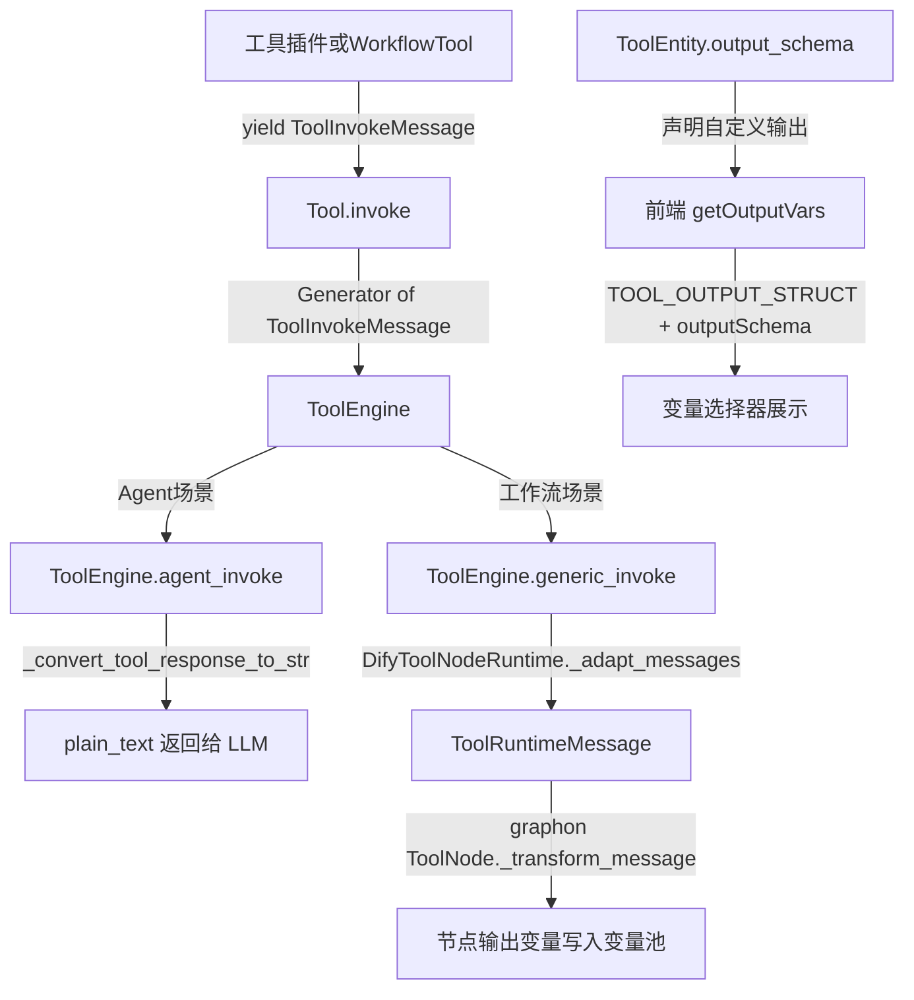
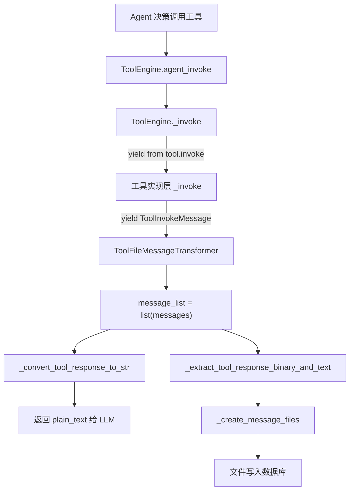
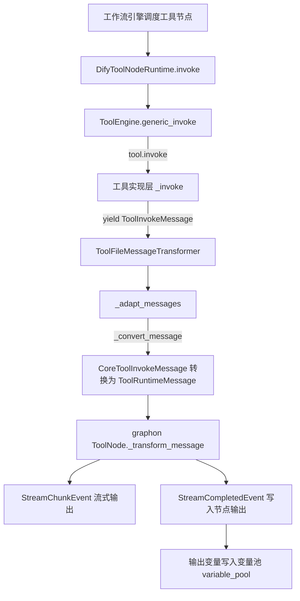
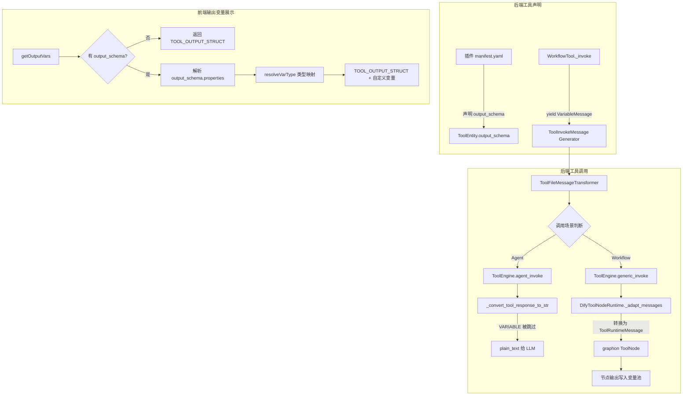

# Dify 工具节点输出变量自定义机制深度解析

> 本文基于 Dify 源码版本（graphon==0.4.0），从源码层面梳理工具节点输出变量的运行机制、自定义方式及常见问题。

## 一、问题背景

在 Dify 工作流编辑器中，当你添加一个"工具"节点后，会发现其默认输出变量始终固定为三个：

| 输出变量名 | 类型 | 说明 |
|-----------|------|------|
| text | string | 工具生成的内容 |
| files | array[file] | 工具生成的文件 |
| json | array[object] | 工具生成的 json |

很多开发者会问：**这三个输出变量能不能自定义？比如让工具返回一个自定义的 JSON 结构，或者返回自定义命名的输出字段？**

答案是：**可以自定义，但需要理解其底层机制。** 下面我们从源码层面完整剖析这套输出变量体系。

---

## 二、整体架构总览



### 2.1 核心模块关系

| 模块 | 文件路径 | 职责 |
|------|---------|------|
| Tool 基类 | `api/core/tools/__base/tool.py` | 定义工具抽象基类和消息创建方法 |
| ToolInvokeMessage | `api/core/tools/entities/tool_entities.py` | 定义所有工具输出消息类型 |
| ToolEngine | `api/core/tools/tool_engine.py` | 工具运行引擎，负责调度调用 |
| WorkflowTool | `api/core/tools/workflow_as_tool/tool.py` | "工作流作为工具"的实现 |
| DifyToolNodeRuntime | `api/core/workflow/node_runtime.py` | 工作流中工具节点的运行时适配 |
| TOOL_OUTPUT_STRUCT | `web/app/components/workflow/constants.ts` | 前端默认输出变量定义 |
| getOutputVars | `web/app/components/workflow/nodes/tool/default.ts` | 前端输出变量解析逻辑 |
| output-schema-utils | `web/app/components/workflow/nodes/tool/output-schema-utils.ts` | JSON Schema 到 VarType 的映射 |
| PluginToolManager | `api/core/plugin/impl/tool.py` | 插件工具加载，含 output_schema 解析 |

---

## 三、默认输出变量——三个不可删除的固定输出

### 3.1 前端硬编码定义

在 `web/app/components/workflow/constants.ts` 中：

```typescript
export const TOOL_OUTPUT_STRUCT: Var[] = [
  {
    variable: 'text',
    type: VarType.string,
  },
  {
    variable: 'files',
    type: VarType.arrayFile,
  },
  {
    variable: 'json',
    type: VarType.arrayObject,
  },
]
```

这三个变量是**硬编码**在前端常量中的，所有工具节点都会无条件附带它们。

### 3.2 前端输出变量组装逻辑

在 `web/app/components/workflow/nodes/tool/default.ts` 的 `getOutputVars` 方法中：

```typescript
getOutputVars(payload, allPluginInfoList, _ragVars, { schemaTypeDefinitions }) {
    // ... 查找当前工具 ...
    const currTool = currCollection?.tools.find(tool => tool.name === payload.tool_name)
    const output_schema = currTool?.output_schema
    let res: Var[] = []

    if (!output_schema || !output_schema.properties) {
      // 没有 output_schema 时，只返回默认三个变量
      res = TOOL_OUTPUT_STRUCT
    } else {
      // 有 output_schema 时，解析自定义变量并追加到默认变量之后
      const outputSchema: Var[] = []
      Object.keys(output_schema.properties).forEach((outputKey) => {
        const output = output_schema.properties[outputKey]
        const { type, schemaType } = resolveVarType(output, schemaTypeDefinitions)
        outputSchema.push({
          variable: outputKey,
          type,
          des: output.description,
          schemaType,
          children: output.type === 'object' ? { schema: {...} } : undefined,
        })
      })
      res = [
        ...TOOL_OUTPUT_STRUCT,    // 默认三个始终在前
        ...outputSchema,          // 自定义变量追加在后
      ]
    }
    return res
}
```

**关键结论：** 无论是否定义了 `output_schema`，`text`、`files`、`json` 这三个默认输出变量**永远存在、永远在前面**。自定义的变量只能**追加**，不能替代或删除默认变量。

---

## 四、后端消息类型体系——ToolInvokeMessage

### 4.1 消息类型枚举

在 `api/core/tools/entities/tool_entities.py` 中，`ToolInvokeMessage` 定义了工具输出的所有消息类型：

```python
class ToolInvokeMessage(BaseModel):
    class MessageType(StrEnum):
        TEXT = auto()              # 纯文本消息
        IMAGE = auto()             # 图片消息
        LINK = auto()              # 链接消息
        BLOB = auto()              # 二进制大对象
        JSON = auto()              # JSON 结构化数据
        IMAGE_LINK = auto()        # 图片链接
        BINARY_LINK = auto()       # 二进制链接
        VARIABLE = auto()          # 自定义变量（关键！）
        FILE = auto()              # 文件消息
        LOG = auto()               # 日志消息
        BLOB_CHUNK = auto()        # 二进制分块
        RETRIEVER_RESOURCES = auto()  # 检索资源
```

### 4.2 VariableMessage——自定义输出的核心载体

```python
class VariableMessage(BaseModel):
    variable_name: str = Field(..., description="The name of the variable")
    variable_value: Any = Field(..., description="The value of the variable")
    stream: bool = Field(default=False, description="Whether the variable is streamed")

    @model_validator(mode="before")
    @classmethod
    def transform_variable_value(cls, values):
        """只允许基本类型、列表和 None"""
        value = values.get("variable_value")
        if value is not None and not isinstance(value, dict | list | str | int | float | bool):
            raise ValueError("Only basic types, lists, and None are allowed.")
        if values.get("stream"):
            if not isinstance(value, str):
                raise ValueError("When 'stream' is True, 'variable_value' must be a string.")
        return values

    @field_validator("variable_name", mode="before")
    @classmethod
    def transform_variable_name(cls, value: str) -> str:
        """变量名不能使用保留字"""
        if value in {"json", "text", "files"}:
            raise ValueError(f"The variable name '{value}' is reserved.")
        return value
```

**两个重要约束：**

1. **保留字限制**：`variable_name` 不能是 `"json"`、`"text"`、`"files"`，否则抛出 `ValueError`。
2. **类型限制**：`variable_value` 只允许 `dict`、`list`、`str`、`int`、`float`、`bool` 和 `None`。

### 4.3 Tool 基类的消息创建工厂方法

在 `api/core/tools/__base/tool.py` 中，`Tool` 基类提供了一组工厂方法来创建不同类型的消息：

```python
class Tool(ABC):
    def create_text_message(self, text: str) -> ToolInvokeMessage:
        """创建纯文本消息"""

    def create_json_message(self, object: dict, suppress_output: bool = False) -> ToolInvokeMessage:
        """创建 JSON 结构化消息。
        suppress_output=True 时，该 JSON 不会出现在 _convert_tool_response_to_str 的结果中。"""

    def create_variable_message(
        self, variable_name: str, variable_value: Any, stream: bool = False
    ) -> ToolInvokeMessage:
        """创建自定义变量消息（这是自定义输出的关键方法）"""

    def create_file_message(self, file: File) -> ToolInvokeMessage:
        """创建文件消息"""

    def create_blob_message(self, blob: bytes, meta: dict | None = None) -> ToolInvokeMessage:
        """创建二进制消息"""

    def create_link_message(self, link: str) -> ToolInvokeMessage:
        """创建链接消息"""

    def create_image_message(self, image: str) -> ToolInvokeMessage:
        """创建图片消息"""
```

---

## 五、两条调用路径的完整运行流程

### 5.1 Agent 调用路径

Agent 场景下，工具输出最终会被转换为纯文本返回给 LLM：



**`_convert_tool_response_to_str()` 的消息处理规则（`tool_engine.py` 第236-276行）：**

```python
@staticmethod
def _convert_tool_response_to_str(tool_response: list[ToolInvokeMessage]) -> str:
    parts: list[str] = []
    json_parts: list[str] = []

    for response in tool_response:
        if response.type == ToolInvokeMessage.MessageType.TEXT:
            parts.append(response.message.text)
        elif response.type == ToolInvokeMessage.MessageType.LINK:
            parts.append(f"result link: {response.message.text}. please tell user to check it.")
        elif response.type in {IMAGE_LINK, IMAGE}:
            parts.append("image has been created and sent to user already...")
        elif response.type == ToolInvokeMessage.MessageType.JSON:
            if json_message.suppress_output:
                continue  # 被抑制的 JSON 不输出
            json_parts.append(json.dumps(response.message.json_object, ensure_ascii=False))
        elif response.type == ToolInvokeMessage.MessageType.VARIABLE:
            continue  # VARIABLE 类型消息被跳过！不会进入 LLM 上下文
        else:
            parts.append(str(response.message))

    return "".join(parts)
```

**关键发现：** `VARIABLE` 类型的消息在 Agent 场景下**被完全跳过**，不会进入 LLM 的上下文。这意味着 VariableMessage 是专门给工作流场景使用的。

### 5.2 工作流调用路径

工作流场景下，工具输出会通过 `DifyToolNodeRuntime` 适配后传递给 graphon 引擎的 `ToolNode`：



**消息适配的关键代码（`node_runtime.py` 第578-657行）：**

```python
def _convert_message(self, message: CoreToolInvokeMessage) -> ToolRuntimeMessage:
    graph_message_type = ToolRuntimeMessage.MessageType(message.type.value)
    graph_message = self._convert_message_payload(message.message)
    graph_meta = message.meta.copy() if message.meta is not None else None
    return ToolRuntimeMessage(type=graph_message_type, message=graph_message, meta=graph_meta)
```

其中 `VariableMessage` 的转换：

```python
case CoreToolInvokeMessage.VariableMessage():
    return ToolRuntimeMessage.VariableMessage(
        variable_name=message.variable_name,
        variable_value=message.variable_value,
        stream=message.stream,
    )
```

graphon 的 `ToolNode` 接收到 `VariableMessage` 后，会将 `variable_name` 和 `variable_value` 写入节点的 outputs 字典中，最终写入工作流的变量池。

---

## 六、output_schema——自定义输出变量的声明方式

### 6.1 后端 ToolEntity 中的 output_schema 字段

```python
class ToolEntity(BaseModel):
    identity: ToolIdentity
    parameters: list[ToolParameter] = Field(default_factory=list[ToolParameter])
    description: ToolDescription | None = None
    output_schema: Mapping[str, object] = Field(default_factory=dict)
    has_runtime_parameters: bool = Field(default=False)
```

`output_schema` 是一个 **JSON Schema 格式**的字典。当工具插件声明了 `output_schema` 后：

1. **后端**：`PluginToolManager` 在加载插件时会解析 `output_schema`
2. **前端**：`getOutputVars` 会解析 `output_schema.properties` 中的每个属性，转换为对应的工作流变量类型

### 6.2 插件加载时的 output_schema 解析

在 `api/core/plugin/impl/tool.py` 中：

```python
def fetch_tool_providers(self, tenant_id: str) -> list[PluginToolProviderEntity]:
    def transformer(json_response: dict[str, Any]):
        for provider in json_response.get("data", []):
            declaration = provider.get("declaration", {}) or {}
            provider_name = declaration.get("identity", {}).get("name")
            for tool in declaration.get("tools", []):
                tool["identity"]["provider"] = provider_name
                if tool.get("output_schema"):
                    tool["output_schema"] = resolve_dify_schema_refs(tool["output_schema"])
        return json_response
```

`resolve_dify_schema_refs` 会解析 schema 中的引用，将分散的定义合并为完整的 JSON Schema。

### 6.3 前端 JSON Schema 到 VarType 的映射

在 `web/app/components/workflow/nodes/tool/output-schema-utils.ts` 中，`resolveVarType` 函数负责将 JSON Schema 类型映射为工作流变量类型：

| JSON Schema type | Dify VarType |
|-----------------|-------------|
| string | VarType.string |
| number | VarType.number |
| integer | VarType.integer |
| boolean | VarType.boolean |
| object | VarType.object |
| array (items string) | VarType.arrayString |
| array (items number) | VarType.arrayNumber |
| array (items boolean) | VarType.arrayBoolean |
| array (items object) | VarType.arrayObject |
| array (items file) | VarType.arrayFile |

此外，`resolveDifyCompactTypeString` 还支持 Dify 自定义的紧凑类型字符串，例如 `"array[string]"`、`"array[object]"` 等。

---

## 七、"工作流作为工具"的输出处理

当一个工作流被发布为工具（Workflow as Tool）时，其输出变量会自动映射。核心代码在 `api/core/tools/workflow_as_tool/tool.py` 的 `_invoke` 方法：

```python
def _invoke(self, user_id, tool_parameters, ...):
    # 执行内部工作流
    result = generator.generate(
        app_model=app, workflow=workflow, user=user,
        args=generator_args, streaming=False,
        call_depth=self.workflow_call_depth + 1,
        pause_state_config=None,
    )

    data = result.get("data", {})
    outputs = data.get("outputs") or {}

    # 提取文件并创建文件消息
    outputs, files = self._extract_files(outputs)
    for file in files:
        yield self.create_file_message(file)

    # 遍历 outputs，为非保留字段创建 VariableMessage
    for key, value in outputs.items():
        if key not in {"text", "json", "files"}:
            yield self.create_variable_message(variable_name=key, variable_value=value)

    # 始终生成 text 和 json 消息
    yield self.create_text_message(json.dumps(outputs, ensure_ascii=False))
    yield self.create_json_message(outputs, suppress_output=True)
```

**运行机制说明：**

1. 内部工作流的所有输出字段都会被提取
2. 如果字段名不是 `"text"`、`"json"`、`"files"` 之一，则创建 `VariableMessage`
3. 最后始终生成一条 `TextMessage`（所有输出的 JSON 字符串）和一条 `JsonMessage`（suppress_output=True，不重复输出到文本）

---

## 八、完整运行流程图



---

## 九、错误处理体系

### 9.1 工具异常类型清单

在 `api/core/tools/errors.py` 中定义了完整的异常层级：

```python
class ToolProviderNotFoundError(ValueError): pass
class ToolNotFoundError(ValueError): pass
class ToolParameterValidationError(ValueError): pass
class ToolProviderCredentialValidationError(ValueError): pass
class ToolNotSupportedError(ValueError): pass
class ToolInvokeError(ValueError): pass
class ToolApiSchemaError(ValueError): pass
class ToolSSRFError(ValueError): pass
class ToolCredentialPolicyViolationError(ValueError): pass
class ApiToolProviderNotFoundError(ValueError):
    error_code = "api_tool_provider_not_found"
class WorkflowToolHumanInputNotSupportedError(BaseHTTPException):
    error_code = "workflow_tool_human_input_not_supported"
    description = "Workflow with Human Input nodes cannot be published as a workflow tool."
    code = 400
class ToolEngineInvokeError(Exception):
    meta: ToolInvokeMeta  # 携带调用元数据（耗时、配置等）
```

### 9.2 Agent 场景的异常处理链

`ToolEngine.agent_invoke()` 对异常做了分级处理：

```python
try:
    messages = ToolEngine._invoke(tool, tool_parameters, user_id, ...)
    # ... 正常处理 ...
except ToolProviderCredentialValidationError as e:
    error_response = "Please check your tool provider credentials"
except (ToolNotFoundError, ToolNotSupportedError, ToolProviderNotFoundError) as e:
    error_response = f"there is not a tool named {tool.entity.identity.name}"
except ToolParameterValidationError as e:
    error_response = f"tool parameters validation error: {e}, please check your tool parameters"
except ToolInvokeError as e:
    error_response = f"tool invoke error: {e}"
except ToolEngineInvokeError as e:
    meta = e.meta
    error_response = f"tool invoke error: {meta.error}"
    return error_response, [], meta  # 注意：这里直接返回，不走最后的 return
except Exception as e:
    error_response = f"unknown error: {e}"

return error_response, [], ToolInvokeMeta.error_instance(error_response)
```

### 9.3 VariableMessage 的校验异常

当使用保留字作为变量名时，会触发以下异常：

```
ValueError: The variable name 'text' is reserved.
ValueError: The variable name 'files' is reserved.
ValueError: The variable name 'json' is reserved.
```

当变量值类型不合法时：

```
ValueError: Only basic types, lists, and None are allowed.
```

当 stream=True 但值不是字符串时：

```
ValueError: When 'stream' is True, 'variable_value' must be a string.
```

---

## 十、实战案例——如何自定义工具输出

### 10.1 案例一：插件工具声明 output_schema

在插件的工具声明中配置 `output_schema`：

```yaml
identity:
  name: weather_query
  label:
    zh_Hans: 天气查询
    en_US: Weather Query
description:
  human:
    zh_Hans: 查询指定城市的天气
    en_US: Query weather for a city
  llm: "A tool to query weather information"
parameters:
  - name: city
    type: string
    required: true
    label:
      zh_Hans: 城市名
      en_US: City Name
output_schema:
  type: object
  properties:
    temperature:
      type: number
      description: 当前温度
    humidity:
      type: number
      description: 湿度百分比
    weather_desc:
      type: string
      description: 天气描述
    forecast:
      type: array
      items:
        type: object
        properties:
          date:
            type: string
          temp_high:
            type: number
          temp_low:
            type: number
      description: 未来天气预报
```

配置后，前端工具节点的输出变量将变为：

```
text        -> string         （默认）
files       -> array[file]    （默认）
json        -> array[object]  （默认）
temperature -> number         （自定义）
humidity    -> number         （自定义）
weather_desc -> string        （自定义）
forecast    -> array[object]  （自定义）
```

### 10.2 案例二：插件代码中使用 create_variable_message

```python
def _invoke(self, user_id, tool_parameters, ...):
    city = tool_parameters.get("city")
    weather_data = self._query_weather(city)

    # 方式一：输出自定义变量
    yield self.create_variable_message("temperature", weather_data["temp"])
    yield self.create_variable_message("humidity", weather_data["humidity"])
    yield self.create_variable_message("forecast", weather_data["forecast"])

    # 方式二：同时输出 JSON（结构完全自定义）
    yield self.create_json_message({
        "temperature": weather_data["temp"],
        "humidity": weather_data["humidity"],
        "weather_desc": weather_data["desc"],
        "forecast": weather_data["forecast"],
    })

    # 方式三：输出可读文本
    yield self.create_text_message(
        f"{city}当前温度{weather_data['temp']}度，湿度{weather_data['humidity']}%"
    )
```

### 10.3 案例三：工作流作为工具的自动输出

当工作流 W1 被发布为工具后，如果 W1 的"结束节点"输出了以下字段：

```json
{
  "result": "处理完成",
  "score": 95,
  "details": {"accuracy": 0.98, "recall": 0.95}
}
```

则调用该工具时，后端自动生成的消息序列为：

1. `VariableMessage(variable_name="result", variable_value="处理完成")`
2. `VariableMessage(variable_name="score", variable_value=95)`
3. `VariableMessage(variable_name="details", variable_value={"accuracy": 0.98, "recall": 0.95})`
4. `TextMessage(text='{"result": "处理完成", "score": 95, "details": {"accuracy": 0.98, "recall": 0.95}}')`
5. `JsonMessage(json_object={...}, suppress_output=True)`

---

## 十一、已知问题与踩坑记录

### 11.1 问题一：VariableMessage 被序列化到 LLM 上下文（已修复）

**问题现象：** Agent 调用工具后，LLM 的上下文中出现了类似 `variable_name='reports' variable_value='hello'` 的 Pydantic repr 字符串，导致 LLM 输出混乱。

**根因分析：** 在 `_convert_tool_response_to_str()` 中，`VARIABLE` 类型的消息没有被特殊处理，走了 `else` 分支的 `str(response.message)`，导致 Pydantic 模型的 `__repr__` 被写入。

**修复方案：** 在 `_convert_tool_response_to_str()` 中增加对 `VARIABLE` 类型的 `continue` 处理。对应的回归测试见 `test_tool_engine.py` 中的 `test_convert_tool_response_excludes_variable_messages`，关联 issue #34723。

```python
# 修复前（bug）
else:
    parts.append(str(response.message))  # VARIABLE 也会走这里

# 修复后
elif response.type == ToolInvokeMessage.MessageType.VARIABLE:
    continue  # VARIABLE 被正确跳过
else:
    parts.append(str(response.message))
```

### 11.2 问题二：output_schema 为空时的静默降级

**问题现象：** 声明了 `output_schema` 但 `properties` 为空字典 `{}`，前端不显示任何自定义输出变量。

**根因分析：** 前端判断条件是：

```typescript
if (!output_schema || !output_schema.properties) {
    res = TOOL_OUTPUT_STRUCT  // 降级为默认三个变量
}
```

空的 `properties: {}` 虽然不是 falsy（空对象在 JS 中是 truthy），但由于 `Object.keys({})` 返回空数组，`outputSchema` 为空，最终结果只有默认三个变量。不会报错，但也不会显示自定义变量。

**避坑建议：** 确保 `output_schema.properties` 中至少有一个属性定义。

### 11.3 问题三：使用保留字变量名导致工具调用失败

**问题现象：** 工具插件代码中调用 `create_variable_message("text", some_value)` 后，工具节点执行报错，异常栈中包含：

```
ValueError: The variable name 'text' is reserved.
```

**根因分析：** `VariableMessage` 的 `field_validator` 会拦截保留字：

```python
@field_validator("variable_name", mode="before")
@classmethod
def transform_variable_name(cls, value: str) -> str:
    if value in {"json", "text", "files"}:
        raise ValueError(f"The variable name '{value}' is reserved.")
    return value
```

**解决方案：** 自定义变量名避开 `text`、`files`、`json` 三个保留字。例如用 `result_text`、`output_files`、`result_json` 替代。

### 11.4 问题四：变量值类型不合法导致序列化失败

**问题现象：** 调用 `create_variable_message("data", some_complex_object)` 时报错：

```
ValueError: Only basic types, lists, and None are allowed.
```

**根因分析：** `VariableMessage` 的值校验器只允许以下类型：

```python
if value is not None and not isinstance(value, dict | list | str | int | float | bool):
    raise ValueError("Only basic types, lists, and None are allowed.")
```

**解决方案：** 确保传入的值是基本类型、字典、列表或 None。如果需要传递复杂对象，先序列化为字典或 JSON 字符串。

---

## 十二、对比总结表

| 维度 | text / files / json | 自定义输出变量 |
|------|---------------------|---------------|
| 是否始终存在 | 是 | 否，需声明 output_schema |
| 能否删除 | 不能 | 通过修改 output_schema 控制 |
| 变量名限制 | 固定名称 | 不能使用 text/files/json |
| 值类型限制 | 各自固定类型 | 基本类型、dict、list、None |
| Agent 场景可见性 | text 和 json 可见 | VariableMessage 被跳过 |
| 工作流场景可见性 | 始终可见 | 写入变量池，下游节点可引用 |
| JSON 内部结构 | 可完全自定义 | 每个变量独立定义类型 |
| 声明方式 | 无需声明，硬编码 | 插件 manifest 的 output_schema |
| 前端展示 | 始终展示三个 | 解析 output_schema.properties |

---

## 十三、关键源码文件索引

| 文件 | 行数 | 核心作用 |
|------|------|---------|
| `api/core/tools/entities/tool_entities.py` | 531行 | ToolInvokeMessage 全部消息类型定义 |
| `api/core/tools/__base/tool.py` | 291行 | Tool 基类和消息创建工厂方法 |
| `api/core/tools/tool_engine.py` | 377行 | 工具引擎，Agent/Workflow 两条调用路径 |
| `api/core/tools/workflow_as_tool/tool.py` | 400行 | 工作流作为工具的完整实现 |
| `api/core/workflow/node_runtime.py` | 772行 | DifyToolNodeRuntime 消息适配层 |
| `api/core/tools/errors.py` | 64行 | 全部工具异常类型定义 |
| `api/core/plugin/impl/tool.py` | 233行 | 插件工具加载和 output_schema 解析 |
| `web/app/components/workflow/constants.ts` | 297行 | TOOL_OUTPUT_STRUCT 默认输出定义 |
| `web/app/components/workflow/nodes/tool/default.ts` | 128行 | getOutputVars 输出变量解析逻辑 |
| `web/app/components/workflow/nodes/tool/output-schema-utils.ts` | 133行 | JSON Schema 到 VarType 映射工具 |
