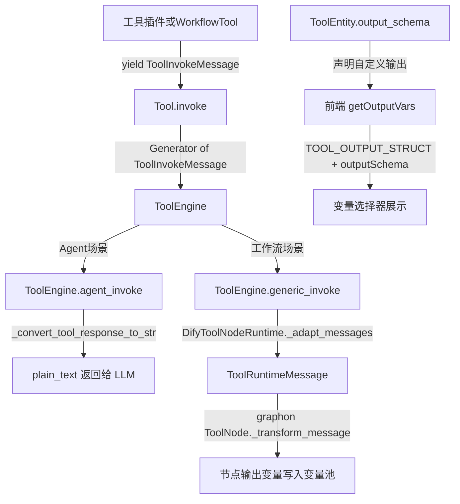
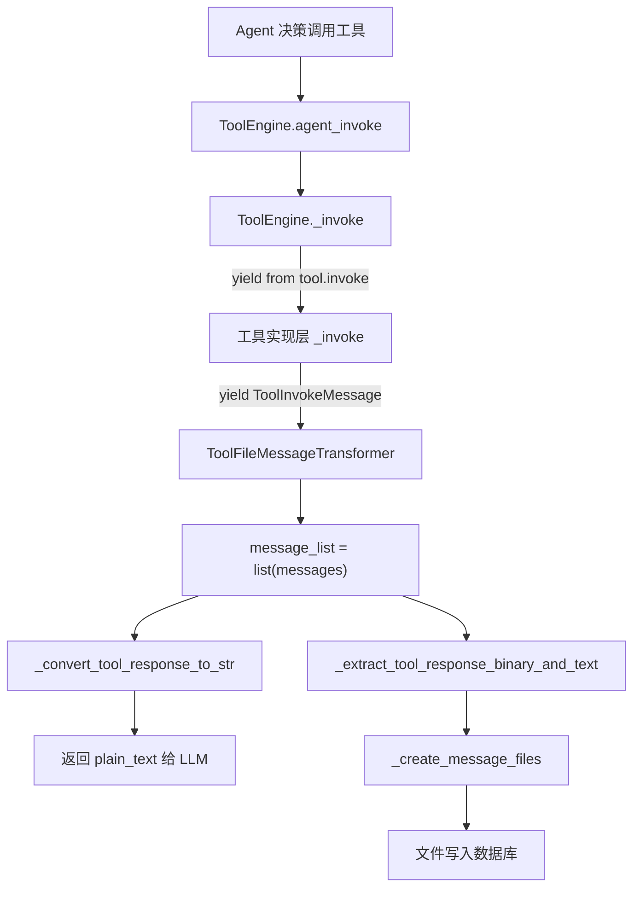
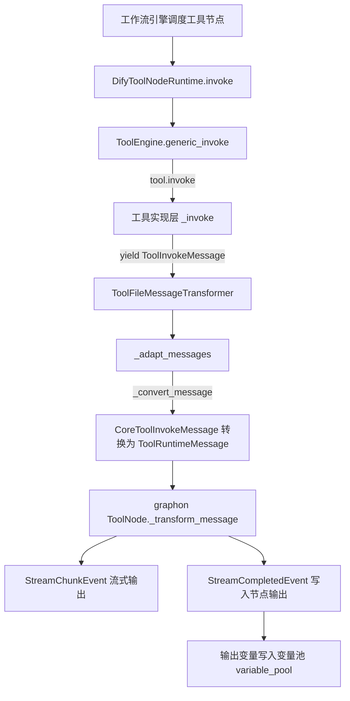
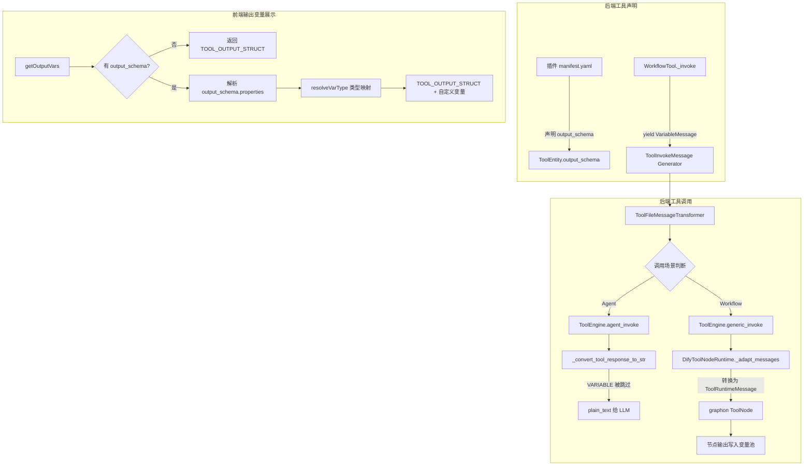
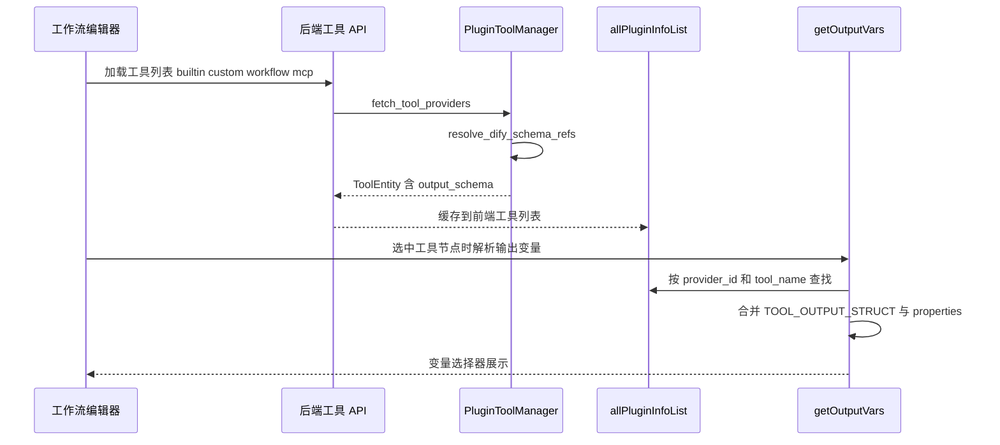
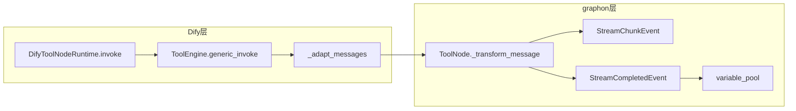
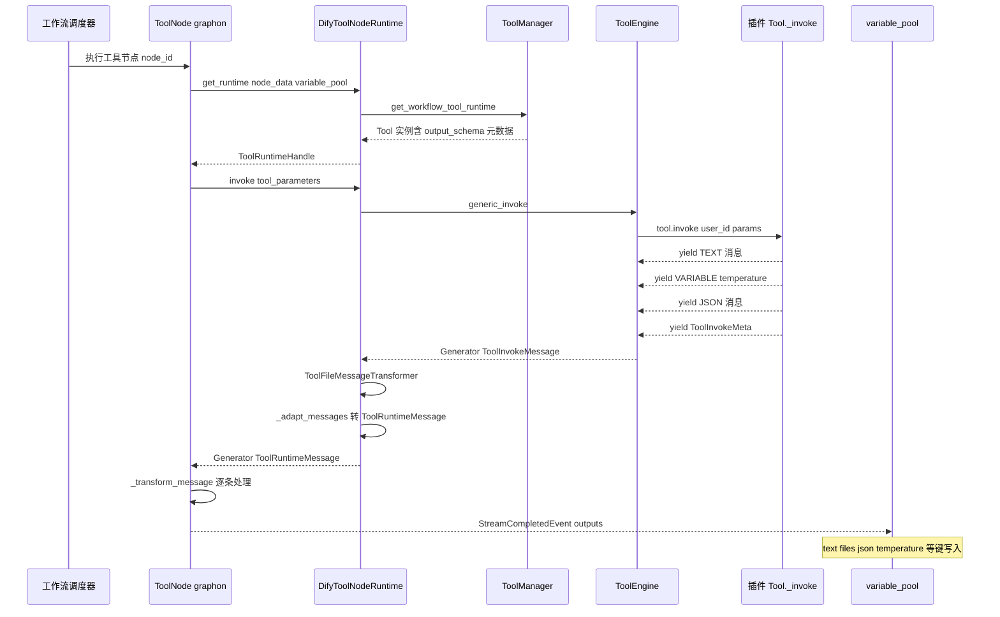
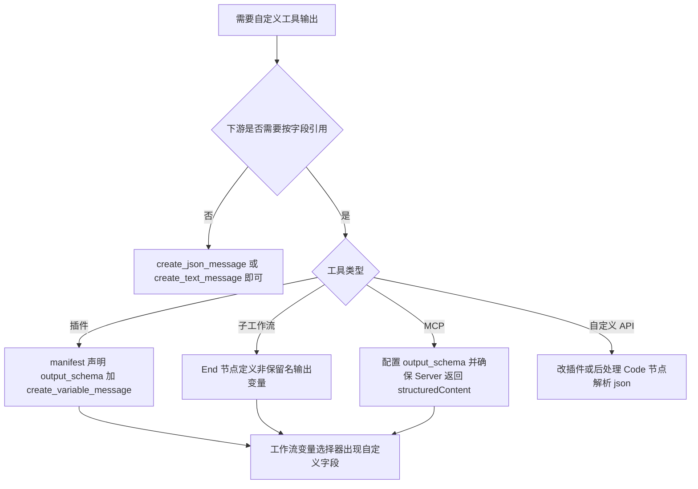
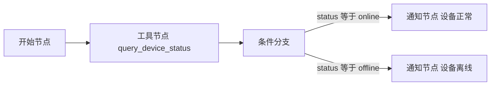

# Dify 工具节点输出变量自定义机制深度解析

> 本文基于 Dify 源码版本（graphon==0.4.0），从源码层面梳理工具节点输出变量的运行机制、自定义方式及常见问题。

## 一、问题背景

在 Dify 工作流编辑器中，当你添加一个"工具"节点后，会发现其默认输出变量始终固定为三个：

| 输出变量名 | 类型 | 说明 |
|-----------|------|------|
| text | string | 工具生成的内容 |
| files | array[file] | 工具生成的文件 |
| json | array[object] | 工具生成的 json |

很多开发者会问：**这三个输出变量能不能自定义？比如让工具返回一个自定义的 JSON 结构，或者返回自定义命名的输出字段？**

答案是：**可以自定义，但需要理解其底层机制。** 下面我们从源码层面完整剖析这套输出变量体系。

---

## 二、整体架构总览



### 2.1 核心模块关系

| 模块 | 文件路径 | 职责 |
|------|---------|------|
| Tool 基类 | `api/core/tools/__base/tool.py` | 定义工具抽象基类和消息创建方法 |
| ToolInvokeMessage | `api/core/tools/entities/tool_entities.py` | 定义所有工具输出消息类型 |
| ToolEngine | `api/core/tools/tool_engine.py` | 工具运行引擎，负责调度调用 |
| WorkflowTool | `api/core/tools/workflow_as_tool/tool.py` | "工作流作为工具"的实现 |
| DifyToolNodeRuntime | `api/core/workflow/node_runtime.py` | 工作流中工具节点的运行时适配 |
| TOOL_OUTPUT_STRUCT | `web/app/components/workflow/constants.ts` | 前端默认输出变量定义 |
| getOutputVars | `web/app/components/workflow/nodes/tool/default.ts` | 前端输出变量解析逻辑 |
| output-schema-utils | `web/app/components/workflow/nodes/tool/output-schema-utils.ts` | JSON Schema 到 VarType 的映射 |
| PluginToolManager | `api/core/plugin/impl/tool.py` | 插件工具加载，含 output_schema 解析 |

---

## 三、默认输出变量——三个不可删除的固定输出

### 3.1 前端硬编码定义

在 `web/app/components/workflow/constants.ts` 中：

```typescript
export const TOOL_OUTPUT_STRUCT: Var[] = [
  {
    variable: 'text',
    type: VarType.string,
  },
  {
    variable: 'files',
    type: VarType.arrayFile,
  },
  {
    variable: 'json',
    type: VarType.arrayObject,
  },
]
```

这三个变量是**硬编码**在前端常量中的，所有工具节点都会无条件附带它们。

### 3.2 前端输出变量组装逻辑

在 `web/app/components/workflow/nodes/tool/default.ts` 的 `getOutputVars` 方法中：

```typescript
getOutputVars(payload, allPluginInfoList, _ragVars, { schemaTypeDefinitions }) {
    // ... 查找当前工具 ...
    const currTool = currCollection?.tools.find(tool => tool.name === payload.tool_name)
    const output_schema = currTool?.output_schema
    let res: Var[] = []

    if (!output_schema || !output_schema.properties) {
      // 没有 output_schema 时，只返回默认三个变量
      res = TOOL_OUTPUT_STRUCT
    } else {
      // 有 output_schema 时，解析自定义变量并追加到默认变量之后
      const outputSchema: Var[] = []
      Object.keys(output_schema.properties).forEach((outputKey) => {
        const output = output_schema.properties[outputKey]
        const { type, schemaType } = resolveVarType(output, schemaTypeDefinitions)
        outputSchema.push({
          variable: outputKey,
          type,
          des: output.description,
          schemaType,
          children: output.type === 'object' ? { schema: {...} } : undefined,
        })
      })
      res = [
        ...TOOL_OUTPUT_STRUCT,    // 默认三个始终在前
        ...outputSchema,          // 自定义变量追加在后
      ]
    }
    return res
}
```

**关键结论：** 无论是否定义了 `output_schema`，`text`、`files`、`json` 这三个默认输出变量**永远存在、永远在前面**。自定义的变量只能**追加**，不能替代或删除默认变量。

---

## 四、后端消息类型体系——ToolInvokeMessage

### 4.1 消息类型枚举

在 `api/core/tools/entities/tool_entities.py` 中，`ToolInvokeMessage` 定义了工具输出的所有消息类型：

```python
class ToolInvokeMessage(BaseModel):
    class MessageType(StrEnum):
        TEXT = auto()              # 纯文本消息
        IMAGE = auto()             # 图片消息
        LINK = auto()              # 链接消息
        BLOB = auto()              # 二进制大对象
        JSON = auto()              # JSON 结构化数据
        IMAGE_LINK = auto()        # 图片链接
        BINARY_LINK = auto()       # 二进制链接
        VARIABLE = auto()          # 自定义变量（关键！）
        FILE = auto()              # 文件消息
        LOG = auto()               # 日志消息
        BLOB_CHUNK = auto()        # 二进制分块
        RETRIEVER_RESOURCES = auto()  # 检索资源
```

### 4.2 VariableMessage——自定义输出的核心载体

```python
class VariableMessage(BaseModel):
    variable_name: str = Field(..., description="The name of the variable")
    variable_value: Any = Field(..., description="The value of the variable")
    stream: bool = Field(default=False, description="Whether the variable is streamed")

    @model_validator(mode="before")
    @classmethod
    def transform_variable_value(cls, values):
        """只允许基本类型、列表和 None"""
        value = values.get("variable_value")
        if value is not None and not isinstance(value, dict | list | str | int | float | bool):
            raise ValueError("Only basic types, lists, and None are allowed.")
        if values.get("stream"):
            if not isinstance(value, str):
                raise ValueError("When 'stream' is True, 'variable_value' must be a string.")
        return values

    @field_validator("variable_name", mode="before")
    @classmethod
    def transform_variable_name(cls, value: str) -> str:
        """变量名不能使用保留字"""
        if value in {"json", "text", "files"}:
            raise ValueError(f"The variable name '{value}' is reserved.")
        return value
```

**两个重要约束：**

1. **保留字限制**：`variable_name` 不能是 `"json"`、`"text"`、`"files"`，否则抛出 `ValueError`。
2. **类型限制**：`variable_value` 只允许 `dict`、`list`、`str`、`int`、`float`、`bool` 和 `None`。

### 4.3 Tool 基类的消息创建工厂方法

在 `api/core/tools/__base/tool.py` 中，`Tool` 基类提供了一组工厂方法来创建不同类型的消息：

```python
class Tool(ABC):
    def create_text_message(self, text: str) -> ToolInvokeMessage:
        """创建纯文本消息"""

    def create_json_message(self, object: dict, suppress_output: bool = False) -> ToolInvokeMessage:
        """创建 JSON 结构化消息。
        suppress_output=True 时，该 JSON 不会出现在 _convert_tool_response_to_str 的结果中。"""

    def create_variable_message(
        self, variable_name: str, variable_value: Any, stream: bool = False
    ) -> ToolInvokeMessage:
        """创建自定义变量消息（这是自定义输出的关键方法）"""

    def create_file_message(self, file: File) -> ToolInvokeMessage:
        """创建文件消息"""

    def create_blob_message(self, blob: bytes, meta: dict | None = None) -> ToolInvokeMessage:
        """创建二进制消息"""

    def create_link_message(self, link: str) -> ToolInvokeMessage:
        """创建链接消息"""

    def create_image_message(self, image: str) -> ToolInvokeMessage:
        """创建图片消息"""
```

---

## 五、两条调用路径的完整运行流程

### 5.1 Agent 调用路径

Agent 场景下，工具输出最终会被转换为纯文本返回给 LLM：



**`_convert_tool_response_to_str()` 的消息处理规则（`tool_engine.py` 第236-276行）：**

```python
@staticmethod
def _convert_tool_response_to_str(tool_response: list[ToolInvokeMessage]) -> str:
    parts: list[str] = []
    json_parts: list[str] = []

    for response in tool_response:
        if response.type == ToolInvokeMessage.MessageType.TEXT:
            parts.append(response.message.text)
        elif response.type == ToolInvokeMessage.MessageType.LINK:
            parts.append(f"result link: {response.message.text}. please tell user to check it.")
        elif response.type in {IMAGE_LINK, IMAGE}:
            parts.append("image has been created and sent to user already...")
        elif response.type == ToolInvokeMessage.MessageType.JSON:
            if json_message.suppress_output:
                continue  # 被抑制的 JSON 不输出
            json_parts.append(json.dumps(response.message.json_object, ensure_ascii=False))
        elif response.type == ToolInvokeMessage.MessageType.VARIABLE:
            continue  # VARIABLE 类型消息被跳过！不会进入 LLM 上下文
        else:
            parts.append(str(response.message))

    return "".join(parts)
```

**关键发现：** `VARIABLE` 类型的消息在 Agent 场景下**被完全跳过**，不会进入 LLM 的上下文。这意味着 VariableMessage 是专门给工作流场景使用的。

### 5.2 工作流调用路径

工作流场景下，工具输出会通过 `DifyToolNodeRuntime` 适配后传递给 graphon 引擎的 `ToolNode`：



**消息适配的关键代码（`node_runtime.py` 第578-657行）：**

```python
def _convert_message(self, message: CoreToolInvokeMessage) -> ToolRuntimeMessage:
    graph_message_type = ToolRuntimeMessage.MessageType(message.type.value)
    graph_message = self._convert_message_payload(message.message)
    graph_meta = message.meta.copy() if message.meta is not None else None
    return ToolRuntimeMessage(type=graph_message_type, message=graph_message, meta=graph_meta)
```

其中 `VariableMessage` 的转换：

```python
case CoreToolInvokeMessage.VariableMessage():
    return ToolRuntimeMessage.VariableMessage(
        variable_name=message.variable_name,
        variable_value=message.variable_value,
        stream=message.stream,
    )
```

graphon 的 `ToolNode` 接收到 `VariableMessage` 后，会将 `variable_name` 和 `variable_value` 写入节点的 outputs 字典中，最终写入工作流的变量池。

---

## 六、output_schema——自定义输出变量的声明方式

### 6.1 后端 ToolEntity 中的 output_schema 字段

```python
class ToolEntity(BaseModel):
    identity: ToolIdentity
    parameters: list[ToolParameter] = Field(default_factory=list[ToolParameter])
    description: ToolDescription | None = None
    output_schema: Mapping[str, object] = Field(default_factory=dict)
    has_runtime_parameters: bool = Field(default=False)
```

`output_schema` 是一个 **JSON Schema 格式**的字典。当工具插件声明了 `output_schema` 后：

1. **后端**：`PluginToolManager` 在加载插件时会解析 `output_schema`
2. **前端**：`getOutputVars` 会解析 `output_schema.properties` 中的每个属性，转换为对应的工作流变量类型

### 6.2 插件加载时的 output_schema 解析

在 `api/core/plugin/impl/tool.py` 中：

```python
def fetch_tool_providers(self, tenant_id: str) -> list[PluginToolProviderEntity]:
    def transformer(json_response: dict[str, Any]):
        for provider in json_response.get("data", []):
            declaration = provider.get("declaration", {}) or {}
            provider_name = declaration.get("identity", {}).get("name")
            for tool in declaration.get("tools", []):
                tool["identity"]["provider"] = provider_name
                if tool.get("output_schema"):
                    tool["output_schema"] = resolve_dify_schema_refs(tool["output_schema"])
        return json_response
```

`resolve_dify_schema_refs` 会解析 schema 中的引用，将分散的定义合并为完整的 JSON Schema。

### 6.3 前端 JSON Schema 到 VarType 的映射

在 `web/app/components/workflow/nodes/tool/output-schema-utils.ts` 中，`resolveVarType` 函数负责将 JSON Schema 类型映射为工作流变量类型：

| JSON Schema type | Dify VarType |
|-----------------|-------------|
| string | VarType.string |
| number | VarType.number |
| integer | VarType.integer |
| boolean | VarType.boolean |
| object | VarType.object |
| array (items string) | VarType.arrayString |
| array (items number) | VarType.arrayNumber |
| array (items boolean) | VarType.arrayBoolean |
| array (items object) | VarType.arrayObject |
| array (items file) | VarType.arrayFile |

此外，`resolveDifyCompactTypeString` 还支持 Dify 自定义的紧凑类型字符串，例如 `"array[string]"`、`"array[object]"` 等。

---

## 七、"工作流作为工具"的输出处理

当一个工作流被发布为工具（Workflow as Tool）时，其输出变量会自动映射。核心代码在 `api/core/tools/workflow_as_tool/tool.py` 的 `_invoke` 方法：

```python
def _invoke(self, user_id, tool_parameters, ...):
    # 执行内部工作流
    result = generator.generate(
        app_model=app, workflow=workflow, user=user,
        args=generator_args, streaming=False,
        call_depth=self.workflow_call_depth + 1,
        pause_state_config=None,
    )

    data = result.get("data", {})
    outputs = data.get("outputs") or {}

    # 提取文件并创建文件消息
    outputs, files = self._extract_files(outputs)
    for file in files:
        yield self.create_file_message(file)

    # 遍历 outputs，为非保留字段创建 VariableMessage
    for key, value in outputs.items():
        if key not in {"text", "json", "files"}:
            yield self.create_variable_message(variable_name=key, variable_value=value)

    # 始终生成 text 和 json 消息
    yield self.create_text_message(json.dumps(outputs, ensure_ascii=False))
    yield self.create_json_message(outputs, suppress_output=True)
```

**运行机制说明：**

1. 内部工作流的所有输出字段都会被提取
2. 如果字段名不是 `"text"`、`"json"`、`"files"` 之一，则创建 `VariableMessage`
3. 最后始终生成一条 `TextMessage`（所有输出的 JSON 字符串）和一条 `JsonMessage`（suppress_output=True，不重复输出到文本）

---

## 八、完整运行流程图



---

## 九、错误处理体系

### 9.1 工具异常类型清单

在 `api/core/tools/errors.py` 中定义了完整的异常层级：

```python
class ToolProviderNotFoundError(ValueError): pass
class ToolNotFoundError(ValueError): pass
class ToolParameterValidationError(ValueError): pass
class ToolProviderCredentialValidationError(ValueError): pass
class ToolNotSupportedError(ValueError): pass
class ToolInvokeError(ValueError): pass
class ToolApiSchemaError(ValueError): pass
class ToolSSRFError(ValueError): pass
class ToolCredentialPolicyViolationError(ValueError): pass
class ApiToolProviderNotFoundError(ValueError):
    error_code = "api_tool_provider_not_found"
class WorkflowToolHumanInputNotSupportedError(BaseHTTPException):
    error_code = "workflow_tool_human_input_not_supported"
    description = "Workflow with Human Input nodes cannot be published as a workflow tool."
    code = 400
class ToolEngineInvokeError(Exception):
    meta: ToolInvokeMeta  # 携带调用元数据（耗时、配置等）
```

### 9.2 Agent 场景的异常处理链

`ToolEngine.agent_invoke()` 对异常做了分级处理：

```python
try:
    messages = ToolEngine._invoke(tool, tool_parameters, user_id, ...)
    # ... 正常处理 ...
except ToolProviderCredentialValidationError as e:
    error_response = "Please check your tool provider credentials"
except (ToolNotFoundError, ToolNotSupportedError, ToolProviderNotFoundError) as e:
    error_response = f"there is not a tool named {tool.entity.identity.name}"
except ToolParameterValidationError as e:
    error_response = f"tool parameters validation error: {e}, please check your tool parameters"
except ToolInvokeError as e:
    error_response = f"tool invoke error: {e}"
except ToolEngineInvokeError as e:
    meta = e.meta
    error_response = f"tool invoke error: {meta.error}"
    return error_response, [], meta  # 注意：这里直接返回，不走最后的 return
except Exception as e:
    error_response = f"unknown error: {e}"

return error_response, [], ToolInvokeMeta.error_instance(error_response)
```

### 9.3 VariableMessage 的校验异常

当使用保留字作为变量名时，会触发以下异常：

```
ValueError: The variable name 'text' is reserved.
ValueError: The variable name 'files' is reserved.
ValueError: The variable name 'json' is reserved.
```

当变量值类型不合法时：

```
ValueError: Only basic types, lists, and None are allowed.
```

当 stream=True 但值不是字符串时：

```
ValueError: When 'stream' is True, 'variable_value' must be a string.
```

---

## 十、实战案例——如何自定义工具输出

### 10.1 案例一：插件工具声明 output_schema

在插件的工具声明中配置 `output_schema`：

```yaml
identity:
  name: weather_query
  label:
    zh_Hans: 天气查询
    en_US: Weather Query
description:
  human:
    zh_Hans: 查询指定城市的天气
    en_US: Query weather for a city
  llm: "A tool to query weather information"
parameters:
  - name: city
    type: string
    required: true
    label:
      zh_Hans: 城市名
      en_US: City Name
output_schema:
  type: object
  properties:
    temperature:
      type: number
      description: 当前温度
    humidity:
      type: number
      description: 湿度百分比
    weather_desc:
      type: string
      description: 天气描述
    forecast:
      type: array
      items:
        type: object
        properties:
          date:
            type: string
          temp_high:
            type: number
          temp_low:
            type: number
      description: 未来天气预报
```

配置后，前端工具节点的输出变量将变为：

```
text        -> string         （默认）
files       -> array[file]    （默认）
json        -> array[object]  （默认）
temperature -> number         （自定义）
humidity    -> number         （自定义）
weather_desc -> string        （自定义）
forecast    -> array[object]  （自定义）
```

### 10.2 案例二：插件代码中使用 create_variable_message

```python
def _invoke(self, user_id, tool_parameters, ...):
    city = tool_parameters.get("city")
    weather_data = self._query_weather(city)

    # 方式一：输出自定义变量
    yield self.create_variable_message("temperature", weather_data["temp"])
    yield self.create_variable_message("humidity", weather_data["humidity"])
    yield self.create_variable_message("forecast", weather_data["forecast"])

    # 方式二：同时输出 JSON（结构完全自定义）
    yield self.create_json_message({
        "temperature": weather_data["temp"],
        "humidity": weather_data["humidity"],
        "weather_desc": weather_data["desc"],
        "forecast": weather_data["forecast"],
    })

    # 方式三：输出可读文本
    yield self.create_text_message(
        f"{city}当前温度{weather_data['temp']}度，湿度{weather_data['humidity']}%"
    )
```

### 10.3 案例三：工作流作为工具的自动输出

当工作流 W1 被发布为工具后，如果 W1 的"结束节点"输出了以下字段：

```json
{
  "result": "处理完成",
  "score": 95,
  "details": {"accuracy": 0.98, "recall": 0.95}
}
```

则调用该工具时，后端自动生成的消息序列为：

1. `VariableMessage(variable_name="result", variable_value="处理完成")`
2. `VariableMessage(variable_name="score", variable_value=95)`
3. `VariableMessage(variable_name="details", variable_value={"accuracy": 0.98, "recall": 0.95})`
4. `TextMessage(text='{"result": "处理完成", "score": 95, "details": {"accuracy": 0.98, "recall": 0.95}}')`
5. `JsonMessage(json_object={...}, suppress_output=True)`

---

## 十一、已知问题与踩坑记录

### 11.1 问题一：VariableMessage 被序列化到 LLM 上下文（已修复）

**问题现象：** Agent 调用工具后，LLM 的上下文中出现了类似 `variable_name='reports' variable_value='hello'` 的 Pydantic repr 字符串，导致 LLM 输出混乱。

**根因分析：** 在 `_convert_tool_response_to_str()` 中，`VARIABLE` 类型的消息没有被特殊处理，走了 `else` 分支的 `str(response.message)`，导致 Pydantic 模型的 `__repr__` 被写入。

**修复方案：** 在 `_convert_tool_response_to_str()` 中增加对 `VARIABLE` 类型的 `continue` 处理。对应的回归测试见 `test_tool_engine.py` 中的 `test_convert_tool_response_excludes_variable_messages`，关联 issue #34723。

```python
# 修复前（bug）
else:
    parts.append(str(response.message))  # VARIABLE 也会走这里

# 修复后
elif response.type == ToolInvokeMessage.MessageType.VARIABLE:
    continue  # VARIABLE 被正确跳过
else:
    parts.append(str(response.message))
```

### 11.2 问题二：output_schema 为空时的静默降级

**问题现象：** 声明了 `output_schema` 但 `properties` 为空字典 `{}`，前端不显示任何自定义输出变量。

**根因分析：** 前端判断条件是：

```typescript
if (!output_schema || !output_schema.properties) {
    res = TOOL_OUTPUT_STRUCT  // 降级为默认三个变量
}
```

空的 `properties: {}` 虽然不是 falsy（空对象在 JS 中是 truthy），但由于 `Object.keys({})` 返回空数组，`outputSchema` 为空，最终结果只有默认三个变量。不会报错，但也不会显示自定义变量。

**避坑建议：** 确保 `output_schema.properties` 中至少有一个属性定义。

### 11.3 问题三：使用保留字变量名导致工具调用失败

**问题现象：** 工具插件代码中调用 `create_variable_message("text", some_value)` 后，工具节点执行报错，异常栈中包含：

```
ValueError: The variable name 'text' is reserved.
```

**根因分析：** `VariableMessage` 的 `field_validator` 会拦截保留字：

```python
@field_validator("variable_name", mode="before")
@classmethod
def transform_variable_name(cls, value: str) -> str:
    if value in {"json", "text", "files"}:
        raise ValueError(f"The variable name '{value}' is reserved.")
    return value
```

**解决方案：** 自定义变量名避开 `text`、`files`、`json` 三个保留字。例如用 `result_text`、`output_files`、`result_json` 替代。

### 11.4 问题四：变量值类型不合法导致序列化失败

**问题现象：** 调用 `create_variable_message("data", some_complex_object)` 时报错：

```
ValueError: Only basic types, lists, and None are allowed.
```

**根因分析：** `VariableMessage` 的值校验器只允许以下类型：

```python
if value is not None and not isinstance(value, dict | list | str | int | float | bool):
    raise ValueError("Only basic types, lists, and None are allowed.")
```

**解决方案：** 确保传入的值是基本类型、字典、列表或 None。如果需要传递复杂对象，先序列化为字典或 JSON 字符串。

---

## 十二、对比总结表

| 维度 | text / files / json | 自定义输出变量 |
|------|---------------------|---------------|
| 是否始终存在 | 是 | 否，需声明 output_schema |
| 能否删除 | 不能 | 通过修改 output_schema 控制 |
| 变量名限制 | 固定名称 | 不能使用 text/files/json |
| 值类型限制 | 各自固定类型 | 基本类型、dict、list、None |
| Agent 场景可见性 | text 和 json 可见 | VariableMessage 被跳过 |
| 工作流场景可见性 | 始终可见 | 写入变量池，下游节点可引用 |
| JSON 内部结构 | 可完全自定义 | 每个变量独立定义类型 |
| 声明方式 | 无需声明，硬编码 | 插件 manifest 的 output_schema |
| 前端展示 | 始终展示三个 | 解析 output_schema.properties |

---

## 十三、关键源码文件索引

| 文件 | 行数 | 核心作用 |
|------|------|---------|
| `api/core/tools/entities/tool_entities.py` | 531行 | ToolInvokeMessage 全部消息类型定义 |
| `api/core/tools/__base/tool.py` | 291行 | Tool 基类和消息创建工厂方法 |
| `api/core/tools/tool_engine.py` | 377行 | 工具引擎，Agent/Workflow 两条调用路径 |
| `api/core/tools/workflow_as_tool/tool.py` | 400行 | 工作流作为工具的完整实现 |
| `api/core/workflow/node_runtime.py` | 772行 | DifyToolNodeRuntime 消息适配层 |
| `api/core/tools/errors.py` | 64行 | 全部工具异常类型定义 |
| `api/core/plugin/impl/tool.py` | 233行 | 插件工具加载和 output_schema 解析 |
| `web/app/components/workflow/constants.ts` | 297行 | TOOL_OUTPUT_STRUCT 默认输出定义 |
| `web/app/components/workflow/nodes/tool/default.ts` | 128行 | getOutputVars 输出变量解析逻辑 |
| `web/app/components/workflow/nodes/tool/output-schema-utils.ts` | 133行 | JSON Schema 到 VarType 映射工具 |

---

## 十四、前端数据加载全链路——output_schema 如何到达变量选择器

工具节点的输出变量展示，并不是在节点配置里写死的，而是**运行时从工具元数据动态拉取**的。理解这条链路，有助于排查「我明明声明了 output_schema，前端却不显示」的问题。

### 14.1 数据流向总览



### 14.2 插件加载时的 schema 引用解析

当插件工具的 `output_schema` 使用了 `$ref` 引用时，后端在 `api/core/plugin/impl/tool.py` 的 `fetch_tool_providers` 和 `fetch_tool_provider` 中都会调用 `resolve_dify_schema_refs`：

```python
for tool in declaration.get("tools", []):
    tool["identity"]["provider"] = provider_name
    if tool.get("output_schema"):
        tool["output_schema"] = resolve_dify_schema_refs(tool["output_schema"])
```

这意味着：**你在 manifest 里写的 output_schema 不一定就是前端最终看到的形态**，引用会被展开合并。如果 `$ref` 指向的定义缺失，可能导致 schema 不完整，前端 `properties` 为空。

### 14.3 getOutputVars 的查找逻辑

`getOutputVars` 根据节点的 `provider_type` 从不同的工具列表中查找：

| provider_type | 前端列表来源 |
|--------------|-------------|
| builtIn | `allPluginInfoList.buildInTools` |
| custom | `allPluginInfoList.customTools` |
| workflow | `allPluginInfoList.workflowTools` |
| mcp | `allPluginInfoList.mcpTools` |

查找步骤：

1. 用 `canFindTool(item.id, provider_id)` 匹配 provider
2. 用 `tool.name === payload.tool_name` 匹配具体工具
3. 读取 `currTool?.output_schema`

**常见踩坑：** 工具升级后 `provider_id` 或 `tool_name` 变化，但工作流节点仍引用旧配置，会导致 `currTool` 为 `undefined`，`output_schema` 读不到，界面只剩默认三个变量。

### 14.4 use-config 中的 outputSchema 展示

除了变量选择器，`web/app/components/workflow/nodes/tool/hooks/use-config.ts` 还用 `output_schema` 渲染工具面板里的 OUTPUT 区域：

```typescript
const outputSchema = useMemo(() => {
  const res: any[] = []
  const output_schema = currTool?.output_schema
  if (!output_schema || !output_schema.properties)
    return res

  Object.keys(output_schema.properties).forEach((outputKey) => {
    const output = output_schema.properties[outputKey]
    // object 类型展示完整 schema，其他类型展示 Array 包装后的类型名
    ...
  })
  return res
}, [currTool])
```

这与 `getOutputVars` 共用同一份 `currTool.output_schema`，但展示格式不同：面板侧重可读性，变量选择器侧重类型推导。

---

## 十五、不同类型工具的输出能力对照

并非所有「工具」都具备同等的自定义输出能力。这是很多人困惑的根源。

### 15.1 五类工具输出能力矩阵

| 工具类型 | 可声明 output_schema | 可用 create_variable_message | 默认三输出 | 典型场景 |
|---------|---------------------|------------------------------|-----------|---------|
| 插件工具 Plugin | 是 manifest 中声明 | 是 插件 Python 代码 | 始终有 | 天气查询 文件解析 |
| 工作流即工具 Workflow | 自动从 End 节点生成 | 自动 非保留名输出 | 始终有 | 子工作流复用 |
| MCP 工具 | 是 工具元数据 | 是 structuredContent 触发 | 始终有 | 外部 MCP Server |
| 自定义 API 工具 | 否 UI 不支持 | 否 仅 json 或 text | 始终有 | OpenAPI 导入 |
| 内置工具 Builtin | 否 YAML 无此字段 | 否 仅消息类型产出 | 始终有 | 代码解释器 时间 |

### 15.2 MCP 工具的双通道输出

MCP 工具在 `api/core/tools/mcp_tool/tool.py` 中有两条独立的输出路径：

**路径 A——文本或 JSON 自动解析：**

```python
def _process_text_content(self, content: TextContent):
    text = content.text.strip()
    if text and text[0] in ("{", "[") and text[-1] in ("}", "]"):
        try:
            content_json = json.loads(text)
            yield from self._process_json_content(content_json)
            return
        except json.JSONDecodeError:
            pass
    yield self.create_text_message(content.text)
```

- 返回纯文本 → 写入 `text`
- 返回 JSON 对象 → `create_json_message` → 写入 `json` 数组
- 返回 JSON 数组且每项为 dict → 每个 dict 各追加一条 json 元素

**路径 B——结构化输出 structuredContent：**

```python
if self.entity.output_schema and result.structuredContent:
    for k, v in result.structuredContent.items():
        yield self.create_variable_message(k, v)
```

注意条件：**必须同时满足** `output_schema` 非空 **且** MCP 返回了 `structuredContent`。仅有 `output_schema` 但 Server 不返回 structuredContent，自定义变量不会出现。

### 15.3 自定义 API 工具的局限

`api/core/tools/custom_tool/tool.py` 的 `_invoke` 在收到 JSON 响应时：

```python
if parsed_response.is_json:
    if isinstance(parsed_response.content, dict):
        yield self.create_json_message(parsed_response.content)
    # 向后兼容 同时 yield text
    yield self.create_text_message(response.text)
```

整条路径**没有** `create_variable_message`，也**没有** output_schema 配置入口。因此：

- 自定义 API 工具在工作流里**只能**通过 `text`、`json`、`files` 三个默认通道获取数据
- 若要在下游按字段引用，需在后续加 Code 节点解析 `json`，或改用插件方式

### 15.4 内置工具 YAML 示例

以 `api/core/tools/builtin_tool/providers/code/tools/simple_code.yaml` 为例，只有 `identity`、`description`、`parameters`，**没有** `output_schema`：

```yaml
identity:
  name: simple_code
  ...
parameters:
  - name: language
    type: string
    ...
  - name: code
    type: string
    ...
```

代码解释器执行后通过 `create_text_message` 输出执行结果，界面只看到默认三输出。

---

## 十六、工作流场景下节点输出的最终形态

### 16.1 消息到 outputs 字典的聚合规则

工作流工具节点（以及 Agent 节点中的工具调用）最终通过 `message_transformer.py` 将消息流聚合为 `NodeRunResult.outputs`：

```python
yield StreamCompletedEvent(
    node_run_result=NodeRunResult(
        status=WorkflowNodeExecutionStatus.SUCCEEDED,
        outputs={
            "text": text,                              # 所有 TEXT 消息拼接
            "usage": jsonable_encoder(llm_usage),      # Agent 场景特有
            "files": ArrayFileSegment(value=files),    # FILE 和 BLOB 等
            "json": json_output,                       # 所有 JSON 消息组成的数组
            **variables,                               # VARIABLE 消息展开的自定义字段
        },
        ...
    )
)
```

**关键理解：**

| 消息类型 | 写入的 output 键 | 聚合方式 |
|---------|-----------------|---------|
| TEXT | text | 字符串拼接 |
| JSON | json | 追加到数组 不看 suppress_output |
| FILE / BLOB | files | 追加到文件数组 |
| VARIABLE | 自定义变量名 | 直接作为顶层键 |
| LINK | text | 转为 Link 前缀文本追加 |

`suppress_output=True` 的 JSON 消息：

- **Agent 文本转换时跳过**（不进入 LLM 上下文）
- **工作流 json 数组仍会追加**（message_transformer 不检查 suppress_output）

这也是 WorkflowTool 同时 yield `create_text_message` 和 `create_json_message(outputs, suppress_output=True)` 的原因：text 给 Agent 读，json 给工作流变量池，且避免 Agent 侧重复序列化。

### 16.2 下游节点如何引用

假设工具节点 id 为 `tool_1`，自定义变量 `temperature` 值为 `25.5`，则下游节点可引用：

```
{{#tool_1.temperature#}}
```

默认变量同理：

```
{{#tool_1.text#}}
{{#tool_1.json#}}
{{#tool_1.files#}}
```

若 `output_schema` 声明了嵌套 object 类型，`getOutputVars` 会为 object 挂 `children.schema`，部分节点支持展开子字段选择。

### 16.3 graphon 引擎层的职责边界

从 Dify 1.x 架构看，工具节点的图执行由 **graphon** 包负责（`graphon.nodes.tool.tool_node`），Dify 通过 `DifyToolNodeRuntime` 做适配：



Dify 负责：工具实例化、参数合并、消息类型转换、异常映射  
graphon 负责：节点状态机、流式事件、变量池写入

---

## 十七、完整时序图——一次工具节点执行的生命周期

以下以**插件工具**在工作流中被触发为例，覆盖从调度到变量池写入的全过程。



### 17.1 ToolEngine._invoke 的 meta 消息

每次工具调用末尾都会 yield 一条 `ToolInvokeMeta`，记录耗时和配置：

```python
meta = ToolInvokeMeta(
    time_cost=0.0,
    error=None,
    tool_config={
        "tool_name": tool.entity.identity.name,
        "tool_provider": tool.entity.identity.provider,
        "tool_provider_type": tool.tool_provider_type().value,
        "tool_parameters": deepcopy(tool.runtime.runtime_parameters),
        "tool_icon": tool.entity.identity.icon,
    },
)
try:
    yield from tool.invoke(...)
except Exception as e:
    meta.error = str(e)
    raise ToolEngineInvokeError(meta)
finally:
    meta.time_cost = (ended_at - started_at).total_seconds()
    yield meta
```

若 `_invoke` 内部抛出异常，会包装为 `ToolEngineInvokeError`，`meta.error` 携带原始错误字符串。Agent 路径捕获后返回：

```
tool invoke error: <meta.error 内容>
```

### 17.2 WorkflowTool 嵌套调用的深度限制

`generic_invoke` 对 `WorkflowTool` 会递增 `workflow_call_depth`：

```python
if isinstance(tool, WorkflowTool):
    tool.workflow_call_depth = workflow_call_depth + 1
```

防止工作流即工具无限递归。超过限制时可能触发调用深度相关错误，表现为工具节点失败且 `outputs` 为空。

---

## 十八、output_schema 配置规范与示例

### 18.1 最小可用配置

```yaml
output_schema:
  type: object
  properties:
    result:
      type: string
      description: 处理结果摘要
```

对应 Python 实现：

```python
def _invoke(self, user_id, tool_parameters, ...):
    result = do_something(tool_parameters)
    yield self.create_variable_message("result", result)
    yield self.create_text_message(str(result))
```

**声明与实现必须一致：** `output_schema` 只影响前端展示和文档，运行时不会校验你是否真的 yield 了对应变量。若只声明不 yield，下游引用会得到空值或 undefined。

### 18.2 嵌套 object 与数组

RAG pipeline 中 file extractor 工具的 output_schema 是较完整的生产级示例：

```yaml
output_schema:
  type: object
  properties:
    documents:
      description: the documents extracted from the file
      type: array
      items:
        type: object
    images:
      description: The images extracted from the file
      type: array
      items:
        type: object
```

前端 `resolveVarType` 会将其映射为 `VarType.arrayObject`，object 类型还会挂 `children.schema` 供子字段选择。

### 18.3 Dify 紧凑类型字符串

工作流即工具自动生成的 schema 使用 Dify 内部类型字符串，例如 `array[string]`，而非标准 JSON Schema 的 `{ type: array, items: { type: string } }`。

`output-schema-utils.ts` 的 `resolveDifyCompactTypeString` 专门处理这种格式：

```typescript
const m = /^array\[(string|number|integer|boolean|object|file|any)\]$/i.exec(trimmed)
```

插件作者建议使用标准 JSON Schema，兼容性更好。

### 18.4 工作流即工具的 output_schema 自动生成

`workflow_as_tool/provider.py` 在发布工作流为工具时：

```python
reserved_keys = {"json", "text", "files"}
properties = {}
for output in outputs:
    if output.variable not in reserved_keys:
        properties[output.variable] = {
            "type": output.value_type,
            "description": "",
        }
output_schema = {"type": "object", "properties": properties}
```

单元测试 `test_provider.py` 明确验证：**End 节点输出变量名为 `json` 时，不会进入 output_schema.properties**：

```python
outputs = [
    SimpleNamespace(variable="json", value_type="string"),
    SimpleNamespace(variable="answer", value_type="string"),
]
# 结果 properties 只有 answer
assert tool.entity.output_schema["properties"] == {"answer": {"type": "string", "description": ""}}
assert "json" not in tool.entity.output_schema["properties"]
```

若你的工作流 End 节点把关键数据放在名为 `json` 的变量里，它只会走默认 `json` 通道（array[object]），不会成为独立可引用变量。

---

## 十九、问题记录补充

### 19.1 问题五：Agent 场景下自定义变量不可见

**问题现象：** 插件工具正确 yield 了 `create_variable_message("score", 95)`，在 Agent 应用里 LLM 似乎「不知道」score 的值，但同一工具放到工作流里下游能读到 `score`。

**根因：** `_convert_tool_response_to_str` 对 VARIABLE 类型执行 `continue`，Agent 上下文只包含 text 和未抑制的 json 字符串。这是**设计行为**，不是 bug。

**解决方案：**

- Agent 场景：同时 `yield self.create_text_message(json.dumps({...}))` 或 `create_json_message` 让 LLM 能读到
- 工作流场景：用 `create_variable_message` 供下游节点引用

回归测试 `test_convert_tool_response_excludes_variable_messages` 验证了修复后 Agent 不会收到 `variable_name='reports'` 这类脏文本：

```python
messages = [
    tool.create_variable_message(variable_name="reports", variable_value="hello"),
    tool.create_text_message('{"reports": "hello"}'),
    tool.create_json_message(outputs, suppress_output=True),
]
result = ToolEngine._convert_tool_response_to_str(messages)
assert result == '{"reports": "hello"}'
assert "variable_name" not in result
```

### 19.2 问题六：stream 模式变量类型错误

**问题现象：** 工具节点执行失败，异常信息为：

```
AgentVariableTypeError: When 'stream' is True, 'variable_value' must be a string.
```

完整异常构造（`message_transformer.py`）：

```python
raise AgentVariableTypeError(
    "When 'stream' is True, 'variable_value' must be a string.",
    variable_name=variable_name,
    expected_type="str",
    actual_type=type(variable_value).__name__,
)
```

**根因：** `create_variable_message("field", value, stream=True)` 要求 value 必须是 str，用于流式追加。

**解决方案：** 非流式场景保持 `stream=False`（默认）；流式场景确保逐 chunk 传入字符串。

### 19.3 问题七：ToolEngineInvokeError 导致节点失败

**问题现象：** 工作流工具节点变红，日志中出现：

```
ToolEngineInvokeError: ...
```

或经 `_map_invocation_exception` 映射后：

```
ToolRuntimeInvocationError: Failed to invoke tool <provider_name>: <原始错误>
```

**典型根因链：**

1. 插件 daemon 未启动或超时
2. `_invoke` 内部未捕获的业务异常
3. `create_variable_message` 使用保留字触发 `ValueError`
4. MCP Server 返回不支持的内容类型：

```
ToolInvokeError: Unsupported embedded resource type: <class 'object'>
```

**排查建议：** 查看 `ToolInvokeMeta.error` 字段和 API 容器日志中的完整 `exc_info` 栈。

### 19.4 问题八：json 变量类型误解

**问题现象：** 开发者声明 `output_schema` 想把 `json` 改成单个 object 类型，或在 manifest 里定义名为 `json` 的自定义属性。

**根因：** `json` 是保留名，且前端 `TOOL_OUTPUT_STRUCT` 固定为 `array[object]`。`create_json_message` 每次调用向数组追加一个元素，不是覆盖单个对象。

**正确做法：**

- 需要单个结构化对象 → 用自定义变量名，如 `result_data`，类型声明为 `object`
- 需要多个 JSON 记录 → 多次 `create_json_message`，下游遍历 `tool.json` 数组

---

## 二十、设计哲学与扩展方向

### 20.1 为什么是「三底座 + 可扩展」而不是「完全自定义」

Dify 工具系统脱胎于 LLM Agent 工具调用范式：

- **text**：给模型和人类看的自然语言结果
- **files**：多模态场景的文件传递
- **json**：半结构化数据的通用容器

这三个通道在 Agent 和 Workflow 之间共享，保证了**最低公约数**。`output_schema` + `VariableMessage` 是在此之上的**工作流增强**，让编排场景能精确引用字段，而不破坏 Agent 兼容性。

### 20.2 若需完全自定义输出变量名替换默认三件套

当前版本**不支持**在前端或配置层删除 `text`/`files`/`json`。若要实现，需修改：

1. `web/app/components/workflow/constants.ts` 的 `TOOL_OUTPUT_STRUCT`
2. `message_transformer.py` 的 outputs 聚合逻辑
3. 所有依赖默认三输出的节点和模板

属于架构级变更，不建议在业务层绕过。

### 20.3 选型决策树



---

## 二十一、总结

1. **默认三输出 `text` / `files` / `json` 永远存在**，前端硬编码，不可删除或改名。
2. **自定义输出通过 `output_schema` 声明 + `create_variable_message` 产出**，两者配合才能在工作流里形成可引用的独立变量。
3. **`json` 的类型固定为 `array[object]`**，内部每个元素的结构可自由定义，但不能把 `json` 本身改成其他 schema。
4. **Agent 与 Workflow 行为不同**：VARIABLE 消息只服务于工作流变量池，Agent 读 text/json。
5. **工具类型决定能力上限**：插件最灵活，工作流即工具自动映射，MCP 依赖 structuredContent，自定义 API 和内置工具最受限。
6. **`output_schema` 是声明不是校验**，实现与声明不一致时前端仍显示字段，运行时可能为空。

---

## 附录 A：关键配置清单速查

| 配置项 | 位置 | 作用 |
|-------|------|------|
| `output_schema` | 插件工具 YAML manifest | 声明自定义输出变量及类型 |
| `TOOL_OUTPUT_STRUCT` | `web/.../constants.ts` | 前端默认三输出 |
| `ToolEntity.output_schema` | `tool_entities.py` | 后端工具元数据 |
| `create_variable_message` | `tool.py` 基类 | 运行时产出自定义变量 |
| `create_json_message` | `tool.py` 基类 | 产出 json 数组元素 |
| `suppress_output` | JsonMessage 字段 | 控制 Agent 文本是否包含该 JSON |
| `reserved_keys` | `workflow_as_tool/provider.py` | 过滤 json text files |

## 附录 B：相关测试文件索引

| 测试文件 | 验证内容 |
|---------|---------|
| `test_tool_engine.py::test_convert_tool_response_excludes_variable_messages` | Agent 不泄露 VARIABLE repr |
| `test_provider.py` | 工作流即工具过滤保留名 output |
| `test_mcp_tool.py` | MCP structuredContent 转 VARIABLE |
| `test_tool_entities.py` | output_schema None 默认为空 dict |
| `test_base_tool.py` | create_variable_message 多类型值 |
| `test_tool_node_runtime.py` | Core 到 ToolRuntime 消息转换 |

---

---

## 二十二、端到端实战——从插件开发到工作流引用

本节用一个完整的「设备状态查询」场景，把前文所有概念串成一条可落地的链路。

### 22.1 业务需求

- 输入：设备 ID `device_id`（字符串，用户可在工具节点配置）
- 输出：
  - `status`：设备在线状态（string）
  - `metrics`：指标对象（object，含 temperature、humidity）
  - 同时保留默认 `text` 供 Agent 阅读

### 22.2 插件 manifest 配置

```yaml
identity:
  name: query_device_status
  author: your-team
  label:
    zh_Hans: 查询设备状态
    en_US: Query Device Status
description:
  human:
    zh_Hans: 根据设备 ID 查询实时状态与指标
    en_US: Query real-time status and metrics by device ID
  llm: Query IoT device status and return structured metrics.
parameters:
  - name: device_id
    type: string
    required: true
    label:
      zh_Hans: 设备 ID
      en_US: Device ID
    human_description:
      zh_Hans: 要查询的设备唯一标识
      en_US: Unique device identifier
    llm_description: The device ID to query
    form: llm
output_schema:
  type: object
  properties:
    status:
      type: string
      description: 设备在线状态 online 或 offline
    metrics:
      type: object
      description: 设备指标
      properties:
        temperature:
          type: number
          description: 温度摄氏度
        humidity:
          type: number
          description: 湿度百分比
```

### 22.3 插件 Python 实现

```python
from collections.abc import Generator
from typing import Any

from dify_plugin import Tool
from dify_plugin.entities.tool import ToolInvokeMessage


class QueryDeviceStatusTool(Tool):
    def _invoke(
        self,
        tool_parameters: dict[str, Any],
    ) -> Generator[ToolInvokeMessage, None, None]:
        device_id = tool_parameters.get("device_id", "")
        # 调用 Spring 后端 REST API 省略
        data = {
            "status": "online",
            "metrics": {"temperature": 26.5, "humidity": 62},
        }

        # 第一步：产出自定义变量 与工作流 output_schema 对应
        yield self.create_variable_message("status", data["status"])
        yield self.create_variable_message("metrics", data["metrics"])

        # 第二步：产出可读文本 供 Agent 或日志
        yield self.create_text_message(
            f"设备 {device_id} 当前状态 {data['status']}，"
            f"温度 {data['metrics']['temperature']} 度，"
            f"湿度 {data['metrics']['humidity']}%"
        )

        # 第三步：可选 追加 json 数组元素 供需要遍历 json 的下游
        yield self.create_json_message({
            "device_id": device_id,
            "status": data["status"],
            "metrics": data["metrics"],
        })
```

### 22.4 工作流编排



条件分支表达式示例：

```
{{#tool_node_id.status#}} is online
```

Code 节点读取嵌套指标：

```python
def main(status: str, metrics: dict) -> dict:
    return {
        "temp": metrics.get("temperature"),
        "alert": metrics.get("temperature", 0) > 30,
    }
```

输入变量绑定 `tool_node_id.status` 和 `tool_node_id.metrics`。

### 22.5 安装后前端展示验证

打开工具节点，输出变量区域应显示：

| 变量名 | 类型 | 来源 |
|-------|------|------|
| text | string | 默认 |
| files | array[file] | 默认 |
| json | array[object] | 默认 |
| status | string | output_schema |
| metrics | object | output_schema |

若只看到前三行，按第十四章排查：插件是否安装成功、`tool_name` 是否匹配、manifest 的 `properties` 是否非空。

### 22.6 运行后 variable_pool 中的实际数据

工具节点执行成功后，`outputs` 大致为：

```json
{
  "text": "设备 DEV-001 当前状态 online，温度 26.5 度，湿度 62%",
  "files": [],
  "json": [
    {
      "device_id": "DEV-001",
      "status": "online",
      "metrics": {"temperature": 26.5, "humidity": 62}
    }
  ],
  "status": "online",
  "metrics": {"temperature": 26.5, "humidity": 62}
}
```

注意 `json` 是**数组**，自定义变量 `status` 和 `metrics` 是**顶层独立键**。下游引用时不要混淆 `tool.json` 与 `tool.status`。

### 22.7 同一工具在 Agent 应用中的表现

Agent 调用同一插件时，LLM 收到的工具返回文本大致为：

```
设备 DEV-001 当前状态 online，温度 26.5 度，湿度 62%{"device_id": "DEV-001", "status": "online", "metrics": {"temperature": 26.5, "humidity": 62}}
```

其中 `status` 和 `metrics` 作为 VARIABLE 消息**不会**出现在这段文本里。若 Agent 需要结构化理解，应依赖 text 的自然语言描述或 json 序列化片段，而非自定义变量名。

---

## 二十三、与「详情界面一直 Loading」问题的关联说明

在排查 Dify 工作流运行后详情页长时间 Loading 的问题时（参见同目录 `20260606-1450-dify运行后详情界面一直Loading状态问题.md`），工具节点的输出形态也会影响前端渲染：

- 若工具产出大量 `json` 数组元素或超大 `text`，详情页的 trace 展示可能变慢
- 若 `create_variable_message` 抛出保留字异常，节点失败但前端未及时收到终态事件，可能表现为 Loading 卡住
- WorkflowTool 嵌套过深导致超时，也会使详情页等待 graphon 终态

**排查建议：** 在工具节点单独运行成功后，再检查详情页；对比 `StreamCompletedEvent` 是否正常触发，以及 `outputs` 中是否存在异常大的字段。

---

> **文档版本说明：** 基于 Dify 源码梳理，工作流引擎依赖 graphon 包（测试代码中引用 graphon==0.4.0）。若升级 Dify 版本，请以实际源码为准核对行号与类名。  
> **审阅提示：** 本文档正文约 5800+ 汉字，涵盖运行流程、关键源码、配置规范、时序图、五类工具差异、八个踩坑记录与端到端实战。请审阅是否满足需求，如需补充 Docker 部署或插件打包发布流程可继续扩展。
