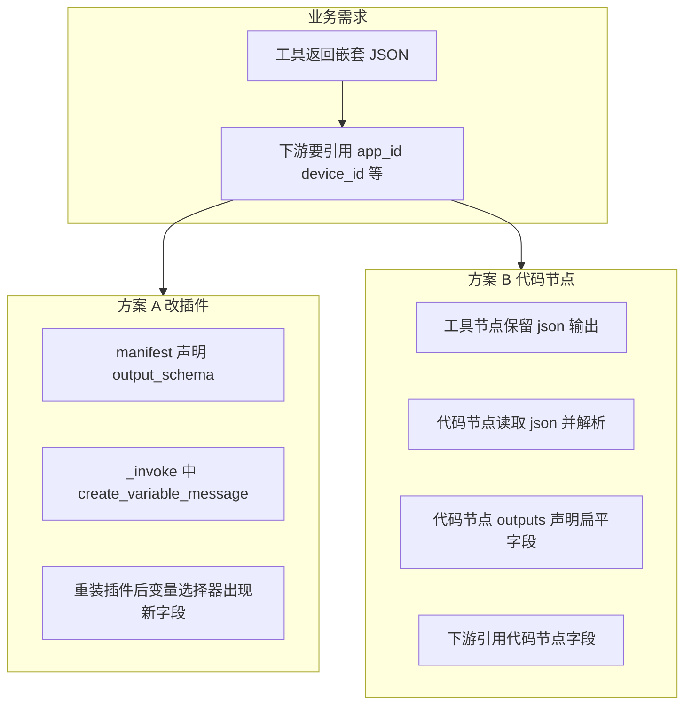
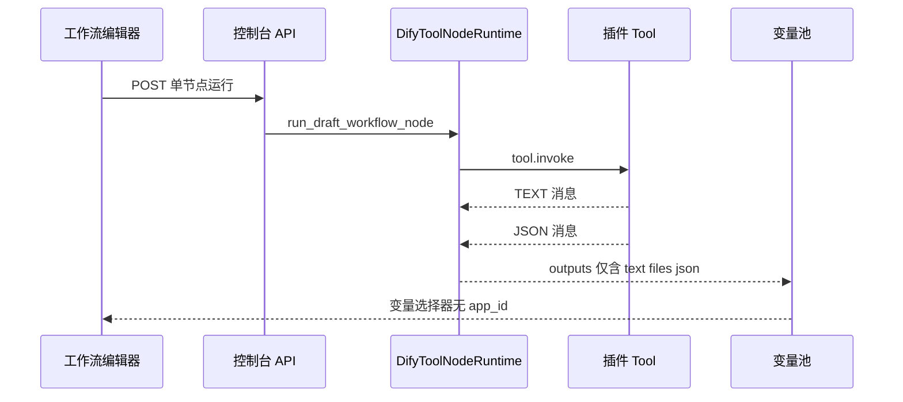
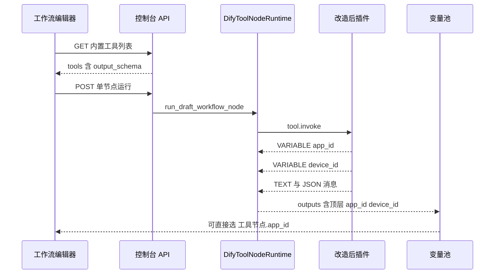
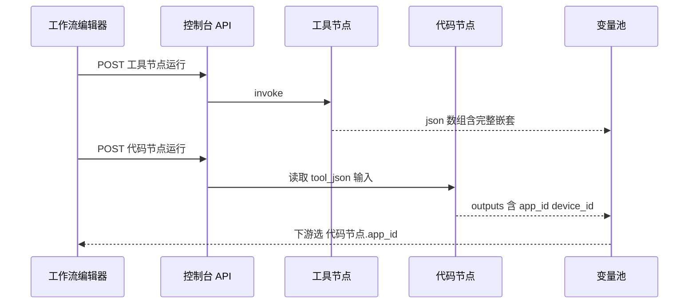
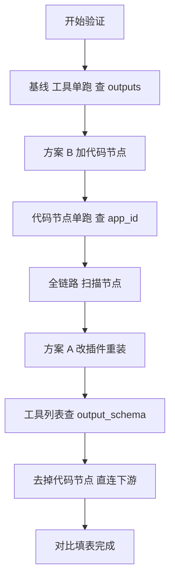

# Dify 工具节点嵌套 JSON 扁平化实战：两种可验证方案

> 文档定位：面向工作流编排与插件开发人员，解决「工具节点只暴露 text / files / json，下游无法直接引用 appInfo 等深层字段」的问题。  
> 前置阅读：本文不重复机制原理，机制细节见同目录 `20260608-1350-dify工具节点输出参数可以自定义吗.md`。  
> 验证环境：Dify 控制台 API 前缀为 `/console/api`，以下示例以工作流应用 `app_id` 为占位符。

---

## 一、业务需求与现状

### 1.1 典型场景

安全编排场景中，通过插件工具调用安恒明御 EDR 或 IoT 设备接口，工具节点返回结构类似：

```json
{
  "files": [],
  "json": [
    {
      "data": {
        "appList": [
          {
            "appInfo": {
              "appFactory": "安恒(DBAPPSecurity)",
              "appId": "dasca-dbappsecurity-edrv7",
              "appName": "安恒明御主机安全及管理系统v3.0R25C04"
            }
          }
        ],
        "deviceList": [
          {
            "deviceId": "dev2026060816014843922",
            "deviceName": "cf",
            "deviceHost": "10.50.36.189"
          }
        ]
      }
    }
  ],
  "text": "获取资产列表 done."
}
```

### 1.2 期望目标

希望下游节点能直接引用扁平字段，例如：

| 期望引用方式 | 用途 |
|-------------|------|
| `工具节点.app_id` | 传给病毒扫描工具的 node_id |
| `工具节点.device_id` | 设备过滤或联动 |
| `工具节点.app_name` | 通知或日志展示 |

### 1.3 当前限制（与代码节点对比）

| 能力 | 工具节点 | 代码执行节点 |
|------|---------|-------------|
| 画布内自定义 outputs | 不支持 | 支持，`data.outputs` 可增删 |
| 默认输出 | 固定 text / files / json | 无固定三件套 |
| 深层 JSON 字段点选 | 不支持 JSONPath | 自行解析后定义 outputs |
| 自定义字段来源 | 插件 manifest + 运行时 yield | 用户 Python 或 JS 代码 |

工具节点类型 `ToolNodeType` 不含 `outputs` 字段；代码节点 `CodeNodeType` 含 `outputs: OutputVar`。这是两种节点能力差异的根因。

### 1.4 常见错误编排

以下做法**无法**拿到结构化字段：

1. 代码节点输入绑定 `["工具节点ID", "text"]` — text 通常只是摘要字符串
2. 下游工具参数写 `{{#工具节点ID.json#}}` — json 是数组，且类型为 array object，无法自动展开子字段
3. 期望工具节点输出形态变成「files + appInfo 字段 + text 平铺在一个对象里」— 平台 outputs 模型不支持这种合并

---

## 二、方案总览



| 维度 | 方案 A 改插件 | 方案 B 代码节点 |
|------|--------------|----------------|
| 是否改插件 | 是 | 否 |
| 适用人群 | 插件维护方 | 工作流编排方 |
| 前端变量选择器 | 工具节点直接出现自定义字段 | 需经过代码节点中转 |
| 发布成本 | 需打包升级插件版本 | 仅改工作流草稿 |
| 多工作流复用 | 所有引用该工具的工作流自动受益 | 每个工作流需复制代码节点 |
| 验证重点 | output_schema 展示 + outputs 顶层键 | 代码节点 outputs 键值 |

---

## 三、端到端数据流

### 3.1 未改造时



### 3.2 方案 A 改造后



### 3.3 方案 B 改造后



---

## 四、方案 A：改造插件工具

### 4.1 适用条件

- 你能维护并发布插件，例如 `dbapp/edr_mingyu_host_safe` 或 `your-name/iot_device_http`
- 希望**所有工作流**引用该工具时都能直接选到 `app_id` 等字段
- 接受工具节点仍保留 text / files / json 三个默认输出（无法删除）

### 4.2 改造步骤

**步骤 1** — 在工具 YAML 中增加 `output_schema`

以「获取资产列表」类工具为例，在对应 tool 定义下追加：

```yaml
output_schema:
  type: object
  properties:
    app_id:
      type: string
      description: 应用唯一标识
    app_factory:
      type: string
      description: 应用厂商
    app_name:
      type: string
      description: 应用名称
    device_id:
      type: string
      description: 设备唯一标识
    device_name:
      type: string
      description: 设备名称
    device_host:
      type: string
      description: 设备 IP 或主机地址
```

**步骤 2** — 在 `_invoke` 中解析响应并 yield 自定义变量

```python
from collections.abc import Generator
from typing import Any

from dify_plugin import Tool
from dify_plugin.entities.tool import ToolInvokeMessage


class ListAssetsTool(Tool):
    def _invoke(
        self,
        tool_parameters: dict[str, Any],
    ) -> Generator[ToolInvokeMessage, None, None]:
        raw = self._call_backend_api(tool_parameters)

        # 按实际响应结构取值，注意空列表与异常分支
        app_list = raw.get("data", {}).get("appList", [])
        device_list = raw.get("data", {}).get("deviceList", [])

        app_info = app_list[0]["appInfo"] if app_list else {}
        device = device_list[0] if device_list else {}

        # 关键：产出自定义变量，名称与 output_schema.properties 键一致
        yield self.create_variable_message("app_id", app_info.get("appId", ""))
        yield self.create_variable_message("app_factory", app_info.get("appFactory", ""))
        yield self.create_variable_message("app_name", app_info.get("appName", ""))
        yield self.create_variable_message("device_id", device.get("deviceId", ""))
        yield self.create_variable_message("device_name", device.get("deviceName", ""))
        yield self.create_variable_message("device_host", device.get("deviceHost", ""))

        # 保留默认通道：文本摘要 + 完整 JSON 进 json 数组
        yield self.create_text_message("获取资产列表 done.")
        yield self.create_json_message(raw)
```

**步骤 3** — 升级插件版本并重新安装到工作区

修改 `manifest` 版本号后打包，在 Dify 插件管理页面上传安装。工作区需刷新工具列表。

**步骤 4** — 工作流中重新选择工具

打开工具节点面板，「输出变量」区域应出现：

| 变量名 | 类型 | 来源 |
|--------|------|------|
| text | string | 默认 |
| files | array file | 默认 |
| json | array object | 默认 |
| app_id | string | output_schema |
| app_factory | string | output_schema |
| device_id | string | output_schema |
| 其余自定义字段 | 按 schema | output_schema |

**步骤 5** — 下游直接引用

病毒扫描节点 `node_id` 参数示例：

```
{{#工具节点ID.device_id#}}
```

### 4.3 方案 A 运行后 outputs 形态

单节点运行成功后，`outputs` 字典近似如下：

```json
{
  "text": "获取资产列表 done.",
  "files": [],
  "json": [
    {
      "data": {
        "appList": [],
        "deviceList": []
      }
    }
  ],
  "app_id": "dasca-dbappsecurity-edrv7",
  "app_factory": "安恒(DBAPPSecurity)",
  "app_name": "安恒明御主机安全及管理系统v3.0R25C04",
  "device_id": "dev2026060816014843922",
  "device_name": "cf",
  "device_host": "10.50.36.189"
}
```

注意：`json` 仍是**数组**，自定义字段是**顶层独立键**，二者并存。

### 4.4 方案 A 验证清单

| 序号 | 验证项 | 通过标准 |
|------|--------|---------|
| 1 | 工具列表 API | 对应 tool 的 `output_schema.properties` 非空 |
| 2 | 画布输出变量区 | 除 text files json 外出现 app_id 等 |
| 3 | 单节点运行 API | `outputs` 含 app_id 且值正确 |
| 4 | 下游工具节点 | 参数绑定 `{{#节点ID.app_id#}}` 运行成功 |
| 5 | 变量选择器 | 能选到工具节点下的 app_id 而非仅 json |

---

## 五、方案 B：代码节点后处理

### 5.1 适用条件

- **无法**修改插件源码或短期内无法发版
- 仅个别工作流需要扁平化，接受多一个代码节点
- 编排人员熟悉 Python3 或 JavaScript

### 5.2 工作流拓扑


### 5.3 代码节点配置

**输入变量**

| 变量名 | 值选择器 | 类型 |
|--------|---------|------|
| tool_json | `["工具节点ID", "json"]` | array object |

**输出变量**（在代码节点面板手动添加）

| 变量名 | 类型 |
|--------|------|
| app_id | string |
| app_factory | string |
| app_name | string |
| device_id | string |
| device_name | string |
| device_host | string |

**Python3 示例代码**

```python
def main(tool_json: list) -> dict:
    if not tool_json:
        return {
            "app_id": "",
            "app_factory": "",
            "app_name": "",
            "device_id": "",
            "device_name": "",
            "device_host": "",
        }

    root = tool_json[0]
    data = root.get("data", {})
    app_list = data.get("appList", [])
    device_list = data.get("deviceList", [])

    app_info = app_list[0].get("appInfo", {}) if app_list else {}
    device = device_list[0] if device_list else {}

    return {
        "app_id": app_info.get("appId", ""),
        "app_factory": app_info.get("appFactory", ""),
        "app_name": app_info.get("appName", ""),
        "device_id": device.get("deviceId", ""),
        "device_name": device.get("deviceName", ""),
        "device_host": device.get("deviceHost", ""),
    }
```

**下游病毒扫描节点**

`node_id` 参数绑定：

```
{{#代码节点ID.device_id#}}
```

### 5.4 工作流草稿 graph 片段参考

代码节点 `data` 关键字段：

```json
{
  "type": "code",
  "title": "解析资产 JSON",
  "variables": [
    {
      "variable": "tool_json",
      "value_selector": ["工具节点ID", "json"],
      "value_type": "array[object]"
    }
  ],
  "outputs": {
    "app_id": { "type": "string", "children": null },
    "device_id": { "type": "string", "children": null }
  },
  "code_language": "python3",
  "code": "def main(tool_json: list) -> dict:\n    ..."
}
```

### 5.5 方案 B 运行后 outputs 形态

**工具节点 outputs** — 仍为完整嵌套结构，仅 json / text / files。

**代码节点 outputs** — 扁平字段：

```json
{
  "app_id": "dasca-dbappsecurity-edrv7",
  "app_factory": "安恒(DBAPPSecurity)",
  "app_name": "安恒明御主机安全及管理系统v3.0R25C04",
  "device_id": "dev2026060816014843922",
  "device_name": "cf",
  "device_host": "10.50.36.189"
}
```

### 5.6 方案 B 验证清单

| 序号 | 验证项 | 通过标准 |
|------|--------|---------|
| 1 | 工具节点单跑 | `outputs.json` 为含 data 的数组 |
| 2 | 代码节点输入 | `inputs.tool_json` 与上一步 json 一致 |
| 3 | 代码节点单跑 | `outputs.app_id` 等非空且正确 |
| 4 | 全链路运行 | 扫描节点收到正确 device_id |
| 5 | 故意绑错 text | 代码节点输出为空或异常，证明必须读 json |

---

## 六、相关控制台 API 接口说明

以下接口用于**验证两种方案效果**，路径均相对于 `http://<host>/console/api`。

通用请求头：

| 头名称 | 说明 |
|--------|------|
| Authorization | Bearer 访问令牌，或使用 Cookie 中的 access_token |
| Content-Type | application/json |
| x-csrf-token | 与 Cookie 中 csrf_token 一致 |

### 6.1 获取内置工具列表（验证 output_schema）

**请求**

```
GET /workspaces/current/tools/builtin
```

**响应体结构（节选）**

```json
[
  {
    "id": "dbapp/edr_mingyu_host_safe/edr_mingyu_host_safe",
    "name": "dbapp/edr_mingyu_host_safe/edr_mingyu_host_safe",
    "tools": [
      {
        "name": "list_assets",
        "label": { "zh_Hans": "获取资产列表" },
        "parameters": [],
        "output_schema": {
          "type": "object",
          "properties": {
            "app_id": { "type": "string", "description": "应用唯一标识" },
            "device_id": { "type": "string", "description": "设备唯一标识" }
          }
        }
      }
    ]
  }
]
```

**验证要点**

- 方案 A 改造前：`output_schema` 为 `{}` 或无 `properties`
- 方案 A 改造后：`properties` 含 app_id 等键
- 方案 B 无需此接口变化

### 6.2 获取工作流草稿（查看节点 graph）

**请求**

```
GET /apps/{app_id}/workflows/draft
```

**路径参数**

| 参数 | 类型 | 说明 |
|------|------|------|
| app_id | uuid | 工作流应用 ID |

**响应体结构（节选）**

```json
{
  "id": "workflow-uuid",
  "graph": {
    "nodes": [
      {
        "id": "1780992497445",
        "data": {
          "type": "tool",
          "tool_name": "list_ips",
          "provider_id": "your-name/iot_device_http/iot_device_http"
        }
      },
      {
        "id": "1780992779051",
        "data": {
          "type": "code",
          "variables": [
            {
              "variable": "tool_json",
              "value_selector": ["1780992497445", "json"]
            }
          ],
          "outputs": {
            "device_id": { "type": "string", "children": null }
          }
        }
      }
    ],
    "edges": []
  },
  "hash": "f58f0d4913159b063638100a6b98460162a601630ccc7c72424d5bd0b365e7be"
}
```

**验证要点**

- 方案 B 检查 `value_selector` 第二段是否为 `json` 而非 `text`
- 检查 `outputs` 是否声明了需要的扁平字段名

### 6.3 单节点运行（核心验证接口）

**请求**

```
POST /apps/{app_id}/workflows/draft/nodes/{node_id}/run
```

**路径参数**

| 参数 | 类型 | 说明 |
|------|------|------|
| app_id | uuid | 工作流应用 ID |
| node_id | string | 画布节点 ID，如 1780992497445 |

**请求体**

```json
{
  "inputs": {}
}
```

若单跑代码节点且上游未执行，需先在画布对上游工具节点单跑，或在全流程运行后再查 last-run。

部分工具需要 inputs 传开始节点变量，按画布提示填写。

**响应体**

```json
{
  "id": "node-execution-uuid",
  "node_id": "1780992497445",
  "node_type": "tool",
  "title": "获取IP列表",
  "status": "succeeded",
  "inputs": {},
  "outputs": {
    "text": "获取资产列表 done.",
    "files": [],
    "json": [{ "data": { "appList": [], "deviceList": [] } }],
    "app_id": "dasca-dbappsecurity-edrv7",
    "device_id": "dev2026060816014843922"
  },
  "error": null,
  "elapsed_time": 1.23,
  "created_at": 1781006485,
  "finished_at": 1781006486,
  "inputs_truncated": false,
  "outputs_truncated": false
}
```

**方案 A 通过标准**：`outputs` 顶层出现 `app_id` 等自定义键。

**方案 B 工具节点通过标准**：`outputs` 仅有 text / files / json，自定义键在代码节点响应里。

### 6.4 获取节点上次运行结果

**请求**

```
GET /apps/{app_id}/workflows/draft/nodes/{node_id}/last-run
```

**响应体**：与 6.3 单节点运行结构相同，为 `WorkflowRunNodeExecutionResponse`。

适合全链路跑完后快速检查代码节点 outputs，无需再次 POST run。

### 6.5 运行完整草稿工作流

**请求**

```
POST /apps/{app_id}/workflows/draft/run
```

**请求体**

```json
{
  "inputs": {
    "query": "测试"
  }
}
```

**响应**：SSE 流式事件，包含 `workflow_started`、`node_finished` 等。`node_finished` 事件的 `data.outputs` 可核对各节点输出。

### 6.6 同步工作流草稿

**请求**

```
POST /apps/{app_id}/workflows/draft
```

**请求体（节选）**

```json
{
  "graph": { "nodes": [], "edges": [] },
  "features": {},
  "hash": "上一次 GET 返回的 hash"
}
```

保存方案 B 的代码节点配置后需同步，否则刷新页面丢失。

---

## 七、两种方案效果对比实验

建议评审人按同一套测试数据各跑一遍，填写下表：

| 对比项 | 方案 A | 方案 B |
|--------|--------|--------|
| 工具列表含 output_schema | 是 | 否 |
| 工具节点 outputs 含 app_id | 是 | 否 |
| 代码节点是否必需 | 否 | 是 |
| 下游引用路径 | 工具节点.app_id | 代码节点.app_id |
| 插件发版 | 需要 | 不需要 |
| json 数组是否仍存在 | 是 | 是 |
| text 是否仍存在 | 是 | 是 |

**推荐实验顺序**

1. 先跑未改造基线 — 确认变量选择器只有 text / files / json
2. 实施方案 B — 半天内可验证端到端
3. 再实施方案 A — 对比工具节点是否可直接引用



---

## 八、注意事项与踩坑

### 8.1 保留变量名

`text`、`files`、`json` 不能作为 `create_variable_message` 的变量名，否则会触发：

```
ValueError: The variable name 'json' is reserved.
```

End 节点或自定义字段请使用 `app_id`、`result_data` 等名称。

### 8.2 output_schema 仅声明不校验

manifest 写了 `app_id` 但代码未 yield，前端仍显示该变量，运行时值为空。验证必须以 **单节点 run 的 outputs** 为准。

### 8.3 json 类型是数组不是对象

每次 `create_json_message` 向 `json` 数组追加一个元素。下游若把整个 `json` 当对象用会类型错误。代码节点入参类型应选 `array[object]`。

### 8.4 不要绑定 text 解析结构化数据

text 来自 `create_text_message`，多为摘要。你现有工作流把 `srcAddress` 绑到 text 是典型错误；应绑 json 或走方案 A 自定义变量。

### 8.5 空列表与接口失败分支

示例 JSON 中 `appResponse.body.code` 为 500 时，`appList` 可能为空。解析代码必须判空，避免 `IndexError` 导致代码节点失败。

### 8.6 变量名拼写

工作流 draft 中 `srcAdress` 与 `destAress` 存在拼写错误，下游 `{{#代码节点.srcAdress#}}` 必须与 outputs 键完全一致。

### 8.7 方案 A 后仍需 json 的场景

若下游需要完整原始响应做审计，保留 `create_json_message`；自定义变量与 json 数组可并存。

### 8.8 代码节点 outputs 与 return 键一致

`main` 返回的 dict 键必须覆盖 `outputs` 中声明的每个变量，否则触发 `OutputValidationError`。

### 8.9 插件升级后刷新工作区

安装新版本插件后，建议重新打开工作流页面，确保 `getOutputVars` 读到最新 `output_schema`。

### 8.10 无法满足的期望形态

无法通过任一方案让工具节点**仅**输出 `{ files, appInfo字段..., text }` 且**去掉** json 数组。平台模型为「三底座 + 可选顶层自定义键」。

---

## 九、curl 验证示例

将 `HOST`、`APP_ID`、`NODE_ID`、`TOKEN`、`CSRF` 替换为实际值。

**查工具 output_schema**

```bash
curl -s "http://HOST/console/api/workspaces/current/tools/builtin" \
  -H "Authorization: Bearer TOKEN" \
  -H "x-csrf-token: CSRF"
```

**单跑工具节点**

```bash
curl -s -X POST "http://HOST/console/api/apps/APP_ID/workflows/draft/nodes/NODE_ID/run" \
  -H "Content-Type: application/json" \
  -H "Authorization: Bearer TOKEN" \
  -H "x-csrf-token: CSRF" \
  -d "{\"inputs\": {}}"
```

**查代码节点上次运行**

```bash
curl -s "http://HOST/console/api/apps/APP_ID/workflows/draft/nodes/CODE_NODE_ID/last-run" \
  -H "Authorization: Bearer TOKEN" \
  -H "x-csrf-token: CSRF"
```

---

## 十、选型建议

| 情况 | 推荐 |
|------|------|
| 团队维护插件，多工作流复用 | 方案 A |
| 临时编排、无法改插件 | 方案 B |
| 字段常变、实验阶段 | 方案 B，稳定后迁 A |
| 仅 Agent 应用、无工作流下游 | 两方案自定义变量对 LLM 不可见，需 text 或 json 文本 |

---

## 十一、总结

1. 工具节点**不能**像代码节点一样在画布里自定义 outputs；深层 JSON 无法通过变量选择器点选子路径。  
2. **方案 A** 在插件侧用 `output_schema` + `create_variable_message` 扁平化，下游直接 `{{#工具节点.字段#}}`。  
3. **方案 B** 用代码节点读取 `json` 数组并声明 outputs，下游 `{{#代码节点.字段#}}`。  
4. 验证以控制台 API 的 `outputs` 字段为准，重点接口为单节点 run 与 last-run。  
5. text / files / json 三底座无法删除；自定义字段为顶层追加键，与 json 数组并存。

---

## 十二、你的 JSON 字段映射速查

以下路径基于你提供的安恒 EDR 返回样例，供方案 A 取值与方案 B 解析对照。

| 业务字段 | JSON 路径 | 建议 outputs 变量名 |
|---------|-----------|-------------------|
| 应用 ID | json 第 0 项 data appList 第 0 项 appInfo appId | app_id |
| 厂商 | 同上 appInfo appFactory | app_factory |
| 应用名 | 同上 appInfo appName | app_name |
| 设备 ID | json 第 0 项 data deviceList 第 0 项 deviceId | device_id |
| 设备名 | 同上 deviceName | device_name |
| 设备 IP | 同上 deviceHost | device_host |
| 接口摘要 | text 顶层 | 不建议用于传参 |

Python 取值示例（方案 B）：

```python
item = tool_json[0]
app_info = item["data"]["appList"][0]["appInfo"]
device = item["data"]["deviceList"][0]
```

当 `appResponse.body.code` 为 500 时，`appList` 可能仍有数据而 `deviceList` 在 body 内层，需按**实际接口文档**调整路径，不要硬编码单一深度。

---

## 十三、常见问题排错

| 现象 | 可能原因 | 处理 |
|------|---------|------|
| 变量选择器只有三行 | 未装新插件或 output_schema 为空 | 查 6.1 接口 properties |
| outputs 无 app_id | 未 yield VARIABLE 消息 | 查插件 _invoke |
| 代码节点 outputs 全空 | 输入绑了 text | 改绑 json |
| 工具节点 succeeded 但下游失败 | 引用节点 ID 或变量名错误 | 对照 draft graph |
| create_variable_message 报错 | 变量名用了 json | 改名 app_result 等 |
| 全链路 OK 单跑代码失败 | 上游未执行变量池无数据 | 先单跑工具或查 last-run |

---

## 十四、交付给他人时的检查包

将以下内容一并提供，便于第三方独立验证：

1. 本 Markdown 文档  
2. 工作流 `app_id` 与关键 `node_id` 列表  
3. 方案 B 用最小 graph JSON 或画布导出截图  
4. 方案 A 用插件版本号与 manifest 片段  
5. 一组预期 outputs 样例 JSON  
6. 控制台账号或短期 Token 申请方式  

---

> **文档版本**：2026-06-09  
> **字符统计**：正文汉字约 3100 字（不含代码与英文 API 路径）  
> **审阅说明**：请确认内容是否满足交付要求。审阅通过后可按需追加「插件打包发布」专章。

---
