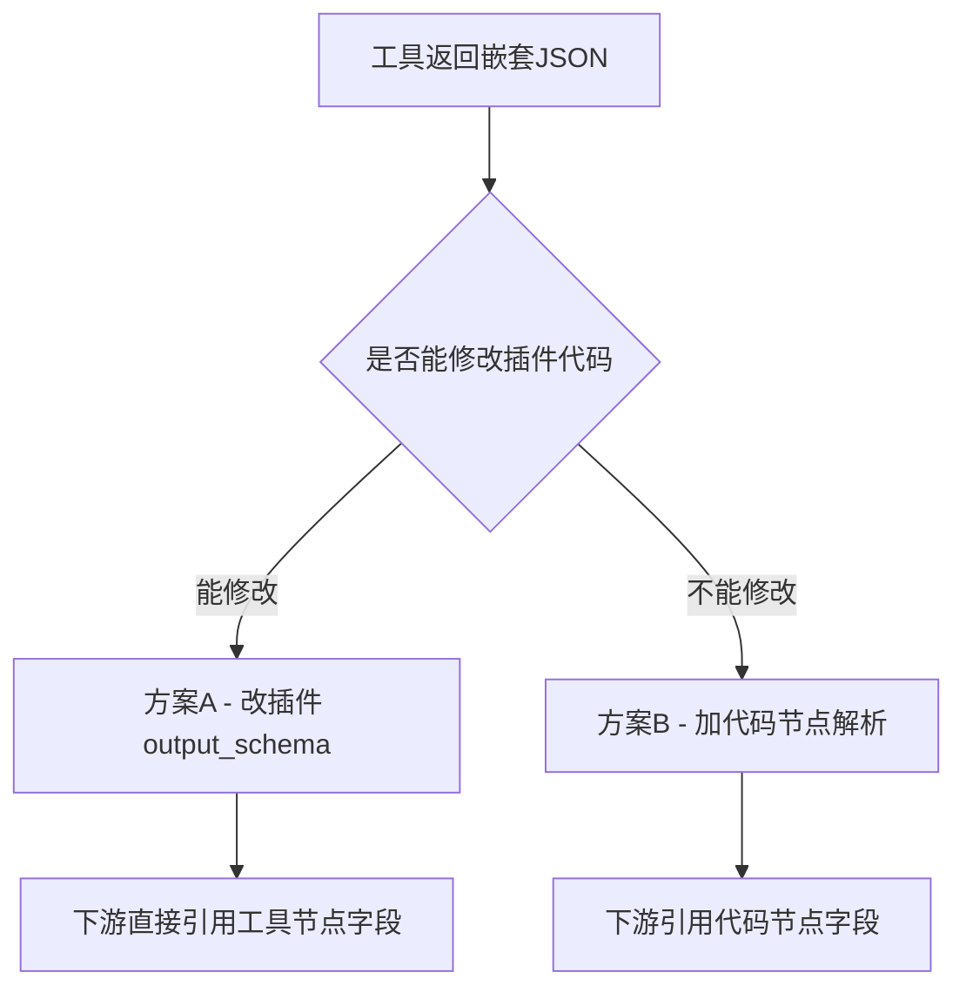
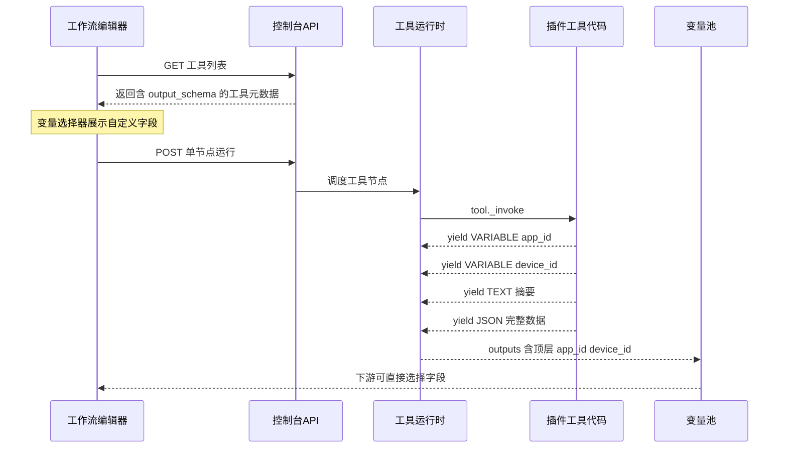
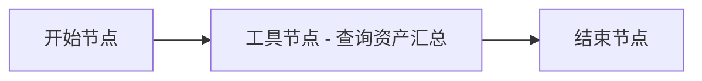
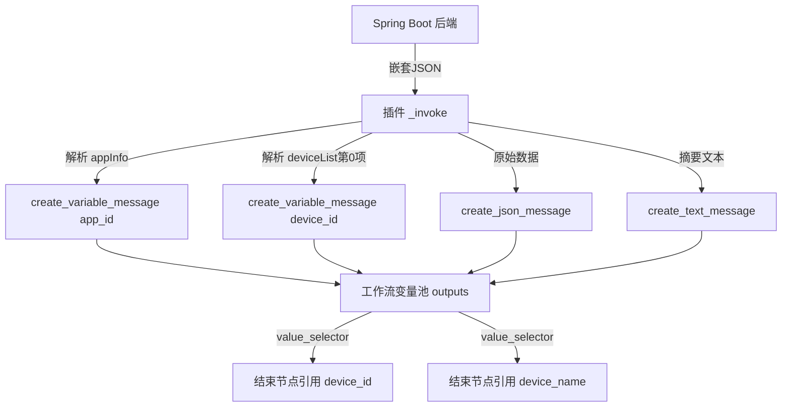
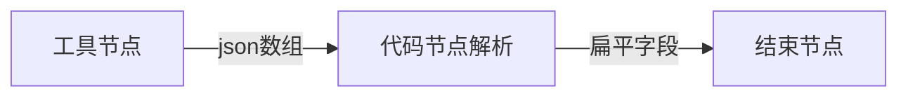

# Dify 工具节点输出参数自定义提取与扁平化实战

> 记录时间：2026-06-10  
> 环境：Dify v1.13.x 私有化部署（K8s），Spring Boot 后端服务  
> 目标：让工具节点返回的嵌套 JSON 能被下游节点直接按字段引用，而不是只能拿到 text/files/json 三个默认输出

---

## 一、问题背景

在 Dify 工作流编排中，当我们使用工具节点调用后端 API 时，工具节点默认只暴露三个输出变量：

| 输出变量 | 类型 | 说明 |
|---------|------|------|
| text | string | 工具生成的文本摘要 |
| files | array[file] | 工具生成的文件 |
| json | array[object] | 工具生成的 JSON 数组 |

实际业务中，后端接口返回的是嵌套 JSON 结构，例如设备资产汇总接口返回：

```json
{
  "appInfo": {
    "appId": "iot-device-manager-v1",
    "appName": "IoT设备管理平台",
    "appVersion": "1.0.0",
    "appFactory": "YourCompany"
  },
  "deviceList": [
    {
      "deviceId": "device_003",
      "deviceName": "厨房智能开关",
      "deviceType": "smart_switch",
      "location": "厨房",
      "status": "offline"
    }
  ],
  "totalDevices": 3,
  "onlineCount": 2,
  "offlineCount": 1
}
```

**痛点**：下游节点（如条件分支、结束节点）想直接引用 `device_id`、`app_name` 等字段时，变量选择器里只能看到 `text`、`files`、`json` 三个选项，无法点选嵌套 JSON 的深层字段。

---

## 二、方案选型

针对这个问题，有两种可行方案：



| 维度 | 方案A 改插件 | 方案B 代码节点 |
|------|------------|--------------|
| 是否改插件 | 是 | 否 |
| 下游引用路径 | 工具节点.app_id | 代码节点.app_id |
| 多工作流复用 | 所有工作流自动受益 | 每个工作流需复制代码节点 |
| 发布成本 | 需打包升级插件版本 | 仅改工作流草稿 |

本文选择 **方案A** 进行完整实战——通过插件的 `output_schema` 声明 + `create_variable_message` 产出自定义变量，实现嵌套 JSON 的扁平化输出。

---

## 三、方案A 核心原理

方案A 的关键在于两个机制的配合：

1. **output_schema 声明**：在工具 YAML 中用 JSON Schema 格式声明自定义输出字段，前端据此在变量选择器中展示这些字段
2. **create_variable_message 产出**：在工具 Python 代码的 `_invoke` 方法中，用 `yield self.create_variable_message("字段名", 值)` 将解析后的扁平数据写入工作流变量池



**重要约束**：
- `create_variable_message` 的变量名**不能**使用 `text`、`files`、`json` 这三个保留字
- 变量值只能是基本类型（str、int、float、bool）、dict、list 或 None
- 默认三输出（text/files/json）**始终存在**，自定义字段是追加的顶层键

---

## 四、实战环境

| 组件 | 版本/地址 |
|------|----------|
| Dify 控制台 | http://10.20.183.170:30080 |
| 插件项目 | plugin-iot-device-plugin（Python） |
| 后端项目 | plugin-dify-iot-device（Spring Boot） |
| 插件版本 | 0.0.10 → 0.0.11 |
| 工作流 App ID | 064443cb-beda-4279-aa44-2f8f8b276673 |

---

## 五、后端实现：新建资产汇总接口

### 5.1 设计接口

接口路径：`GET /api/devices/asset-summary`

返回嵌套 JSON 结构，包含应用信息（appInfo）和设备列表（deviceList），模拟真实安全编排场景中的 EDR/IoT 设备接口返回。

### 5.2 新建响应模型 AssetSummary.java

```java
package com.example.iot.model;

import java.util.List;
import java.util.Map;

/**
 * 设备资产汇总 - 用于方案A演示：插件通过 output_schema 扁平化输出
 */
public class AssetSummary {

    private AppInfo appInfo;
    private List<DeviceBrief> deviceList;
    private int totalDevices;
    private int onlineCount;
    private int offlineCount;

    public AssetSummary() {}

    public AssetSummary(AppInfo appInfo, List<DeviceBrief> deviceList,
                        int totalDevices, int onlineCount, int offlineCount) {
        this.appInfo = appInfo;
        this.deviceList = deviceList;
        this.totalDevices = totalDevices;
        this.onlineCount = onlineCount;
        this.offlineCount = offlineCount;
    }

    // --- 内嵌类 AppInfo ---
    public static class AppInfo {
        private String appId;
        private String appName;
        private String appVersion;
        private String appFactory;

        public AppInfo() {}

        public AppInfo(String appId, String appName, String appVersion, String appFactory) {
            this.appId = appId;
            this.appName = appName;
            this.appVersion = appVersion;
            this.appFactory = appFactory;
        }

        public String getAppId() { return appId; }
        public void setAppId(String appId) { this.appId = appId; }
        public String getAppName() { return appName; }
        public void setAppName(String appName) { this.appName = appName; }
        public String getAppVersion() { return appVersion; }
        public void setAppVersion(String appVersion) { this.appVersion = appVersion; }
        public String getAppFactory() { return appFactory; }
        public void setAppFactory(String appFactory) { this.appFactory = appFactory; }
    }

    // --- 内嵌类 DeviceBrief ---
    public static class DeviceBrief {
        private String deviceId;
        private String deviceName;
        private String deviceType;
        private String location;
        private String status;

        public DeviceBrief() {}

        public DeviceBrief(String deviceId, String deviceName, String deviceType,
                           String location, String status) {
            this.deviceId = deviceId;
            this.deviceName = deviceName;
            this.deviceType = deviceType;
            this.location = location;
            this.status = status;
        }

        public String getDeviceId() { return deviceId; }
        public void setDeviceId(String deviceId) { this.deviceId = deviceId; }
        public String getDeviceName() { return deviceName; }
        public void setDeviceName(String deviceName) { this.deviceName = deviceName; }
        public String getDeviceType() { return deviceType; }
        public void setDeviceType(String deviceType) { this.deviceType = deviceType; }
        public String getLocation() { return location; }
        public void setLocation(String location) { this.location = location; }
        public String getStatus() { return status; }
        public void setStatus(String status) { this.status = status; }
    }

    // --- Getters and Setters ---
    public AppInfo getAppInfo() { return appInfo; }
    public void setAppInfo(AppInfo appInfo) { this.appInfo = appInfo; }
    public List<DeviceBrief> getDeviceList() { return deviceList; }
    public void setDeviceList(List<DeviceBrief> deviceList) { this.deviceList = deviceList; }
    public int getTotalDevices() { return totalDevices; }
    public void setTotalDevices(int totalDevices) { this.totalDevices = totalDevices; }
    public int getOnlineCount() { return onlineCount; }
    public void setOnlineCount(int onlineCount) { this.onlineCount = onlineCount; }
    public int getOfflineCount() { return offlineCount; }
    public void setOfflineCount(int offlineCount) { this.offlineCount = offlineCount; }
}
```

### 5.3 Service 层新增方法

在 `DeviceService.java` 中新增 `getAssetSummary()` 方法：

```java
/** 获取设备资产汇总（方案A：返回嵌套JSON，由插件扁平化输出） */
public AssetSummary getAssetSummary() {
    List<Device> devices = listDevices();

    // 构造应用信息
    AssetSummary.AppInfo appInfo = new AssetSummary.AppInfo(
        "iot-device-manager-v1",
        "IoT设备管理平台",
        "1.0.0",
        "YourCompany"
    );

    // 构造设备摘要列表
    List<AssetSummary.DeviceBrief> deviceBriefs = devices.stream()
        .map(d -> new AssetSummary.DeviceBrief(
            d.getDeviceId(),
            d.getDeviceName(),
            d.getDeviceType(),
            d.getLocation(),
            d.getStatus()
        ))
        .toList();

    int total = devices.size();
    int online = (int) devices.stream().filter(d -> "online".equals(d.getStatus())).count();
    int offline = total - online;

    return new AssetSummary(appInfo, deviceBriefs, total, online, offline);
}
```

### 5.4 Controller 层新增端点

在 `DeviceController.java` 中新增接口（注意放在 `/{deviceId}` 路由之前，避免路径匹配冲突）：

```java
/**
 * GET /api/devices/asset-summary
 * 获取设备资产汇总（方案A演示接口：返回嵌套JSON结构）
 * 插件端通过 output_schema + create_variable_message 扁平化输出
 */
@GetMapping("/asset-summary")
public ResponseEntity<?> getAssetSummary() {
    return ResponseEntity.ok(deviceService.getAssetSummary());
}
```

### 5.5 验证后端接口

启动 Spring Boot 服务后，直接 curl 验证：

```bash
curl http://localhost:8080/api/devices/asset-summary
```

返回结果：

```json
{
  "appInfo": {
    "appId": "iot-device-manager-v1",
    "appName": "IoT设备管理平台",
    "appVersion": "1.0.0",
    "appFactory": "YourCompany"
  },
  "deviceList": [
    {
      "deviceId": "device_003",
      "deviceName": "厨房智能开关",
      "deviceType": "smart_switch",
      "location": "厨房",
      "status": "offline"
    },
    {
      "deviceId": "device_002",
      "deviceName": "卧室智能灯泡",
      "deviceType": "smart_light",
      "location": "卧室",
      "status": "online"
    },
    {
      "deviceId": "device_001",
      "deviceName": "客厅温度传感器",
      "deviceType": "temperature_sensor",
      "location": "客厅",
      "status": "online"
    }
  ],
  "totalDevices": 3,
  "onlineCount": 2,
  "offlineCount": 1
}
```

后端接口正常返回嵌套 JSON 结构。

---

## 六、插件实现：工具定义与代码

### 6.1 新建工具 YAML — query_asset_summary.yaml

这是方案A 的核心配置，`output_schema` 部分声明了 12 个扁平化字段：

```yaml
identity:
  name: query_asset_summary
  author: your-name
  label:
    en_US: Query Asset Summary
    zh_Hans: 查询资产汇总
description:
  human:
    en_US: "Query device asset summary including app info, device list, online/offline statistics. Returns flattened fields for downstream workflow nodes."
    zh_Hans: "查询设备资产汇总信息，包括应用信息、设备列表、在线/离线统计。通过 output_schema 扁平化输出，下游节点可直接引用 app_id、device_id 等字段。"
  llm: "Query IoT device asset summary. Returns app_id, app_name, first device info (device_id, device_name, device_status), and device count statistics (total, online, offline)."
parameters:
  - name: device_filter
    type: string
    required: false
    label:
      en_US: Device ID Filter
      zh_Hans: 设备ID过滤
    human_description:
      en_US: "Optional. Filter by device ID to get specific device info in the summary."
      zh_Hans: "可选。按设备ID过滤，返回指定设备的汇总信息。留空返回第一个设备。"
    llm_description: "Optional device ID filter. If provided, returns info for that specific device. If empty, returns the first device."
    form: llm
    default: ""
output_schema:
  type: object
  properties:
    app_id:
      type: string
      description: 应用唯一标识
    app_name:
      type: string
      description: 应用名称
    app_version:
      type: string
      description: 应用版本号
    app_factory:
      type: string
      description: 应用厂商
    device_id:
      type: string
      description: 设备唯一标识
    device_name:
      type: string
      description: 设备名称
    device_type:
      type: string
      description: 设备类型
    device_location:
      type: string
      description: 设备位置
    device_status:
      type: string
      description: 设备在线状态 online/offline
    total_devices:
      type: number
      description: 设备总数
    online_count:
      type: number
      description: 在线设备数量
    offline_count:
      type: number
      description: 离线设备数量
extra:
  python:
    source: tools/query_asset_summary.py
```

**要点说明**：
- `output_schema.properties` 中的每个 key 就是下游能引用的变量名
- `type` 决定了前端变量选择器中展示的类型标签
- `description` 会显示在变量选择器的提示信息中
- 变量名不能使用 `text`、`files`、`json` 这三个保留字

### 6.2 新建工具 Python 实现 — query_asset_summary.py

```python
"""
查询资产汇总工具 - 方案A实现
通过 output_schema 声明扁平字段 + create_variable_message 产出自定义变量
下游工作流节点可直接引用：{{#工具节点ID.app_id#}}、{{#工具节点ID.device_id#}} 等
"""
import json
from typing import Any, Generator

from dify_plugin import Tool
from dify_plugin.entities.tool import ToolInvokeMessage
import requests


class QueryAssetSummaryTool(Tool):
    def _invoke(
        self, tool_parameters: dict[str, Any]
    ) -> Generator[ToolInvokeMessage, None, None]:
        # 获取凭证配置
        spring_url = self.runtime.credentials.get("spring_service_url", "").rstrip("/")
        api_token = self.runtime.credentials.get("api_token", "")
        device_filter = tool_parameters.get("device_filter", "")

        headers = {"Content-Type": "application/json"}
        if api_token:
            headers["Authorization"] = f"Bearer {api_token}"

        # 调用后端资产汇总接口
        try:
            response = requests.get(
                f"{spring_url}/api/devices/asset-summary",
                headers=headers,
                timeout=15,
            )
            response.raise_for_status()
            raw = response.json()
        except requests.exceptions.HTTPError as e:
            yield self.create_text_message(
                f"请求失败: HTTP {e.response.status_code} - {e.response.text}"
            )
            return
        except Exception as e:
            yield self.create_text_message(f"请求失败: {str(e)}")
            return

        # 解析嵌套 JSON 结构
        app_info = raw.get("appInfo", {})
        device_list = raw.get("deviceList", [])
        total_devices = raw.get("totalDevices", 0)
        online_count = raw.get("onlineCount", 0)
        offline_count = raw.get("offlineCount", 0)

        # 按过滤条件选择目标设备（默认取第一个）
        target_device = {}
        if device_filter:
            for d in device_list:
                if d.get("deviceId") == device_filter:
                    target_device = d
                    break
            if not target_device:
                yield self.create_text_message(
                    f"未找到设备 {device_filter}，返回第一个设备信息"
                )
                target_device = device_list[0] if device_list else {}
        else:
            target_device = device_list[0] if device_list else {}

        # ===== 关键：产出自定义变量，名称与 output_schema.properties 键一致 =====
        yield self.create_variable_message("app_id", app_info.get("appId", ""))
        yield self.create_variable_message("app_name", app_info.get("appName", ""))
        yield self.create_variable_message("app_version", app_info.get("appVersion", ""))
        yield self.create_variable_message("app_factory", app_info.get("appFactory", ""))
        yield self.create_variable_message("device_id", target_device.get("deviceId", ""))
        yield self.create_variable_message("device_name", target_device.get("deviceName", ""))
        yield self.create_variable_message("device_type", target_device.get("deviceType", ""))
        yield self.create_variable_message("device_location", target_device.get("location", ""))
        yield self.create_variable_message("device_status", target_device.get("status", ""))
        yield self.create_variable_message("total_devices", total_devices)
        yield self.create_variable_message("online_count", online_count)
        yield self.create_variable_message("offline_count", offline_count)

        # ===== 保留默认通道：文本摘要 + 完整 JSON =====
        text_summary = (
            f"资产汇总查询完成\n"
            f"  应用: {app_info.get('appName', '-')} ({app_info.get('appId', '-')})\n"
            f"  厂商: {app_info.get('appFactory', '-')}\n"
            f"  版本: {app_info.get('appVersion', '-')}\n"
            f"  设备总数: {total_devices} (在线: {online_count}, 离线: {offline_count})\n"
            f"  当前设备: {target_device.get('deviceName', '-')} "
            f"[{target_device.get('deviceId', '-')}] "
            f"状态: {target_device.get('status', '-')}"
        )
        yield self.create_text_message(text_summary)
        yield self.create_json_message(raw)
```

**代码要点**：
1. 先调后端 API 拿到完整嵌套 JSON
2. 解析出各层字段
3. 用 `create_variable_message` 逐个产出扁平变量（变量名必须与 YAML 中 `output_schema.properties` 的 key 完全一致）
4. 最后保留 `create_text_message` 和 `create_json_message`，确保默认三输出通道有数据

### 6.3 注册工具到 Provider

在 `provider/iot_device_plugin.yaml` 的 `tools` 列表末尾追加：

```yaml
tools:
  - tools/list_devices.yaml
  - tools/get_device_status.yaml
  - tools/control_device.yaml
  - tools/query_device_data.yaml
  - tools/generic_http.yaml
  - tools/dynamic_device_query.yaml
  - tools/cascading_device_action.yaml
  - tools/list_ips.yaml
  - tools/query_asset_summary.yaml    # 新增：方案A 资产汇总工具
```

### 6.4 升级版本号并打包

修改 `manifest.yaml` 中的版本号（两处）：

```yaml
version: 0.0.11        # 第1处
# ...
meta:
  version: 0.0.11      # 第2处
```

执行打包命令：

```powershell
dify plugin package "E:\Ideaproject\test-dify\plugin-iot-device-plugin" -o "E:\Ideaproject\test-dify\plugin-iot-device-plugin.difypkg"
```

输出：

```
2026/06/08 13:31:07 INFO plugin packaged successfully output_path=E:\Ideaproject\test-dify\plugin-iot-device-plugin.difypkg
```

---

## 七、部署验证

### 7.1 安装插件到 Dify 工作区

在 Dify 控制台 → 插件管理页面，上传 `plugin-iot-device-plugin.difypkg` 文件完成覆盖安装。

### 7.2 创建测试工作流

创建一个简单的三节点工作流：



在工具节点中选择「查询资产汇总」工具，此时可以看到输出变量区域展示了完整的自定义字段列表。

### 7.3 验证输出变量展示

安装新版插件后，在工作流编辑器中选中「查询资产汇总」工具节点，输出变量面板展示如下：

| 变量名 | 类型 | 来源 |
|--------|------|------|
| text | string | 默认输出 |
| files | array[file] | 默认输出 |
| json | array[object] | 默认输出 |
| app_factory | string | output_schema |
| app_id | string | output_schema |
| app_name | string | output_schema |
| app_version | string | output_schema |
| device_id | string | output_schema |
| device_location | string | output_schema |
| device_name | string | output_schema |
| device_status | string | output_schema |
| device_type | string | output_schema |
| offline_count | number | output_schema |
| online_count | number | output_schema |
| total_devices | number | output_schema |

可以看到除默认三输出外，出现了 12 个通过 `output_schema` 声明的自定义字段，验证通过。

### 7.4 配置结束节点引用自定义字段

在结束节点中配置两个输出变量，直接从工具节点的自定义字段中选择：

| 输出变量名 | 值选择器 | 含义 |
|-----------|---------|------|
| aa | 工具节点.device_id | 设备唯一标识 |
| ff | 工具节点.device_name | 设备名称 |

对应的 value_selector 配置为：
```json
{"variable": "aa", "value_selector": ["1781054264349", "device_id"], "value_type": "string"}
{"variable": "ff", "value_selector": ["1781054264349", "device_name"], "value_type": "string"}
```

### 7.5 保存工作流草稿

通过控制台 API 保存草稿，确认 hash 更新成功：

```bash
curl 'http://10.20.183.170:30080/console/api/apps/064443cb-beda-4279-aa44-2f8f8b276673/workflows/draft' \
  -H 'content-type: application/json' \
  -H 'Authorization: Bearer <token>' \
  -H 'x-csrf-token: <csrf>' \
  --data-raw '{"graph":{...},"features":{...},"hash":"06b719722911bb624782774a2d5c4ee0164081556987e7427317d56073edc0a0"}'
```

返回状态 200，草稿保存成功。

---

## 八、运行验证与结果分析

### 8.1 单节点运行工具节点

在工作流编辑器中对「查询资产汇总」工具节点执行单节点运行，得到完整的 outputs 结果：

```json
{
  "text": "资产汇总查询完成\n  应用: IoT设备管理平台 (iot-device-manager-v1)\n  厂商: YourCompany\n  版本: 1.0.0\n  设备总数: 3 (在线: 2, 离线: 1)\n  当前设备: 厨房智能开关 [device_003] 状态: offline",
  "files": [],
  "json": [
    {
      "appInfo": {
        "appFactory": "YourCompany",
        "appId": "iot-device-manager-v1",
        "appName": "IoT设备管理平台",
        "appVersion": "1.0.0"
      },
      "deviceList": [
        {
          "deviceId": "device_003",
          "deviceName": "厨房智能开关",
          "deviceType": "smart_switch",
          "location": "厨房",
          "status": "offline"
        },
        {
          "deviceId": "device_002",
          "deviceName": "卧室智能灯泡",
          "deviceType": "smart_light",
          "location": "卧室",
          "status": "online"
        },
        {
          "deviceId": "device_001",
          "deviceName": "客厅温度传感器",
          "deviceType": "temperature_sensor",
          "location": "客厅",
          "status": "online"
        }
      ],
      "offlineCount": 1,
      "onlineCount": 2,
      "totalDevices": 3
    }
  ],
  "app_id": "iot-device-manager-v1",
  "app_name": "IoT设备管理平台",
  "app_version": "1.0.0",
  "app_factory": "YourCompany",
  "device_id": "device_003",
  "device_name": "厨房智能开关",
  "device_type": "smart_switch",
  "device_location": "厨房",
  "device_status": "offline",
  "total_devices": 3,
  "online_count": 2,
  "offline_count": 1
}
```

**结果分析**：

outputs 字典中同时包含：
1. **默认三输出**：`text`（文本摘要）、`files`（空数组）、`json`（完整嵌套数据数组）
2. **自定义扁平字段**：`app_id`、`device_id` 等 12 个独立顶层键

这证明 `create_variable_message` 产出的变量被正确写入了变量池，与默认输出并存。

### 8.2 全链路运行验证

运行完整工作流后，检查结束节点的输出：

```json
{
  "aa": "device_003",
  "ff": "厨房智能开关"
}
```

**验证通过**！结束节点成功通过 `value_selector: ["工具节点ID", "device_id"]` 和 `value_selector: ["工具节点ID", "device_name"]` 引用到了工具节点的自定义输出字段。

---

## 九、数据流全链路图解

以下展示从后端 JSON 响应到工作流最终输出的完整数据流转过程：



对比改造前后的差异：

| 阶段 | 改造前 | 改造后 |
|------|--------|--------|
| 后端响应 | 嵌套JSON | 嵌套JSON（不变） |
| 工具节点outputs | 仅text/files/json | text/files/json + 12个扁平字段 |
| 下游引用方式 | 无法直接引用深层字段 | 直接选择 工具节点.device_id |
| 是否需要代码节点 | 需要中转解析 | 不需要 |

---

## 十、注意事项与踩坑记录

### 10.1 保留变量名限制

如果在 `create_variable_message` 中使用了 `text`、`files`、`json` 作为变量名，会触发运行时错误：

```
ValueError: The variable name 'json' is reserved.
```

**解决方案**：使用业务语义命名，如 `app_id`、`result_data`，避开保留字。

### 10.2 output_schema 仅声明不校验

`output_schema` 只影响前端变量选择器的展示。如果 YAML 里声明了 `app_id` 但代码中忘记 `yield self.create_variable_message("app_id", ...)`，前端仍然展示该变量，但运行时值为空。

**验证方式**：以单节点 run 的 `outputs` 实际内容为准。

### 10.3 json 类型是数组不是对象

`json` 输出的类型固定为 `array[object]`。每次调用 `create_json_message(data)` 会向数组中追加一个元素。下游如果把 `json` 当单个对象使用会类型错误。

**正确做法**：需要单个结构化对象时，用自定义变量名产出。

### 10.4 变量名拼写必须完全一致

`output_schema` 中声明的 key、Python 代码中 `create_variable_message` 的第一个参数、以及下游 `value_selector` 中的字段名，三者必须**完全一致**（大小写敏感）。

### 10.5 升级插件后需刷新工作流页面

安装新版本插件后，需要关闭并重新打开工作流页面，前端才会拉取最新的 `output_schema`。否则变量选择器可能还是旧的三个默认输出。

### 10.6 Agent 场景下自定义变量不可见

`create_variable_message` 产出的 VARIABLE 消息**只服务于工作流场景**。在 Agent 应用中，LLM 只能看到 `text` 和 `json` 的内容，VARIABLE 消息会被跳过。如果 Agent 也需要结构化数据，应通过 `create_text_message` 或 `create_json_message` 同时输出。

---

## 十一、与代码节点方案的对比实验

为了对比，我们也可以用方案B（代码节点中转）实现相同效果：



方案B 代码节点的 Python 代码：

```python
def main(tool_json: list) -> dict:
    if not tool_json:
        return {"app_id": "", "device_id": "", "device_name": ""}

    root = tool_json[0]
    app_info = root.get("appInfo", {})
    device_list = root.get("deviceList", [])
    device = device_list[0] if device_list else {}

    return {
        "app_id": app_info.get("appId", ""),
        "device_id": device.get("deviceId", ""),
        "device_name": device.get("deviceName", ""),
    }
```

**两方案效果对比**：

| 对比项 | 方案A 改插件 | 方案B 代码节点 |
|--------|------------|--------------|
| 工具列表含 output_schema | 是 | 否 |
| 工具节点 outputs 含 app_id | 是 | 否 |
| 代码节点是否必需 | 否 | 是 |
| 下游引用路径 | 工具节点.app_id | 代码节点.app_id |
| 插件发版 | 需要 | 不需要 |
| 多工作流复用 | 自动受益 | 每个流需要复制 |

---

## 十二、总结

本文完整记录了 Dify 工具节点输出参数自定义扁平化的方案A实现过程：

1. **后端**：新建 `GET /api/devices/asset-summary` 接口，返回嵌套 JSON 结构（AppInfo + DeviceList）
2. **插件 YAML**：通过 `output_schema` 声明 12 个扁平字段的类型和描述
3. **插件 Python**：在 `_invoke` 中解析后端响应，用 `create_variable_message` 逐个 yield 自定义变量
4. **打包部署**：升级版本号 → 打包 .difypkg → 上传安装
5. **工作流验证**：变量选择器出现自定义字段 → 结束节点成功引用 → 全链路输出正确

核心收获：
- `output_schema` 只管前端展示，`create_variable_message` 负责运行时产出，两者配合才能形成完整的自定义输出
- 默认三输出（text/files/json）永远存在、不可删除，自定义字段是追加的顶层键
- 方案A 适合团队维护插件、多工作流复用的场景；方案B 适合临时编排、无法改插件的场景

---

## 十三、相关文件清单

| 项目 | 文件路径 | 作用 |
|------|---------|------|
| 后端 | model/AssetSummary.java | 响应模型 |
| 后端 | service/DeviceService.java | getAssetSummary 方法 |
| 后端 | controller/DeviceController.java | /asset-summary 端点 |
| 插件 | tools/query_asset_summary.yaml | 工具定义含 output_schema |
| 插件 | tools/query_asset_summary.py | 工具实现含 create_variable_message |
| 插件 | provider/iot_device_plugin.yaml | 工具注册列表 |
| 插件 | manifest.yaml | 版本号 0.0.11 |

---
