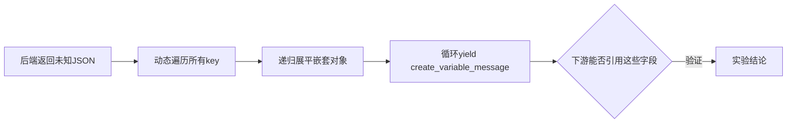
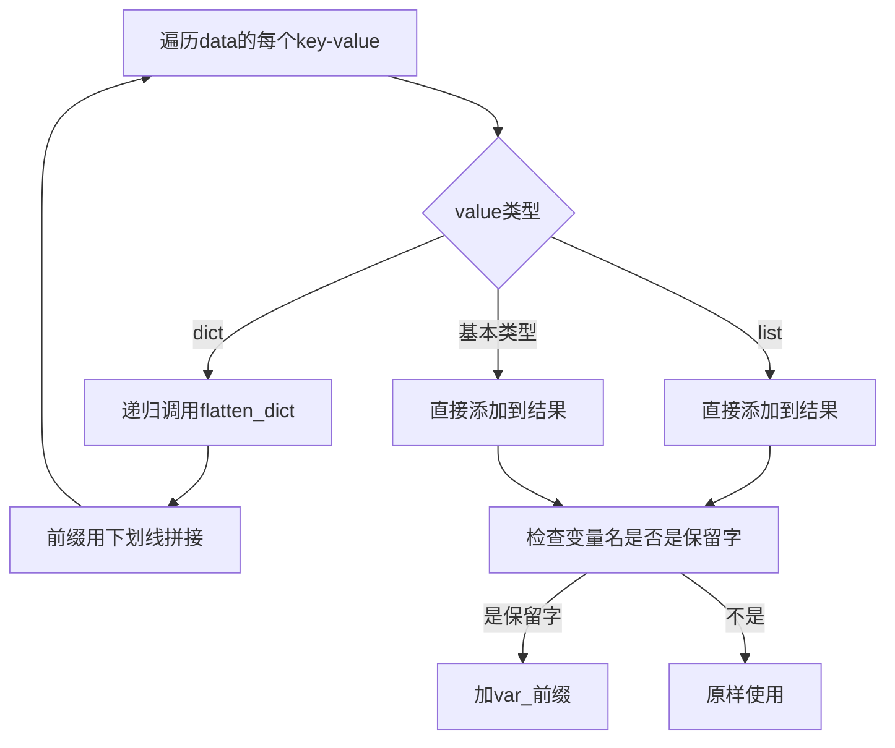
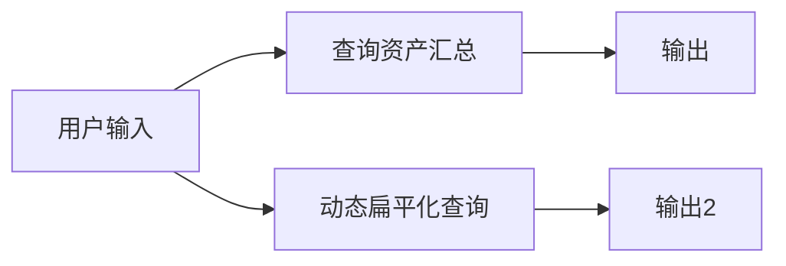
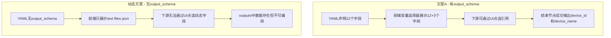
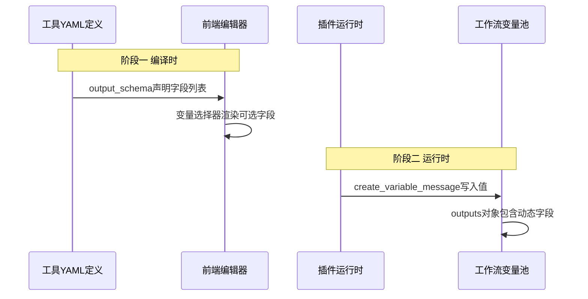
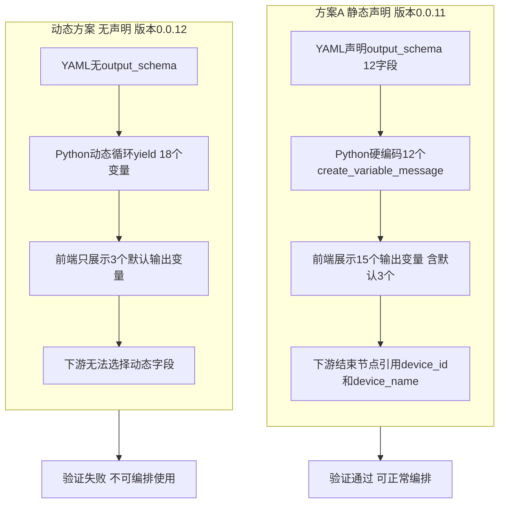

# Dify 工具节点输出参数 - 动态自定义提取扁平化方案实验

> 记录时间：2026-06-10  
> 环境：Dify v1.13.x 私有化部署（K8s），Spring Boot 后端服务  
> 前置文档：`20260608-1380-dify工具节点输出参数-自定义提取扁平化方案.md`（方案A 静态声明实战）  
> 实验目标：验证不预先声明 `output_schema` 时，能否通过动态遍历 JSON key + `create_variable_message` 实现"万能扁平化"

---

## 一、实验动机

在上一篇博客中，我们成功实现了方案A：在工具 YAML 中静态声明 `output_schema` 的 12 个字段，在 Python 代码中逐个 `yield self.create_variable_message("字段名", 值)`。验证通过后下游节点可以直接引用这些扁平化字段。

但实际场景中出现一个新问题：

**如果我们不知道后端返回什么结构怎么办？**

比如接入第三方 API、或者后端接口频繁变更、或者同一个工具需要对接不同的后端——此时无法预先在 YAML 中写死 `output_schema` 的每个字段。

**核心问题**：能否像 Python 字典遍历一样，动态解析 `response.json()` 的所有 key，自动循环调用 `create_variable_message`，让下游工作流节点自动获得所有扁平字段？



---

## 二、实验假设

基于方案A的经验，我们知道 Dify 工具节点输出有两个阶段：

| 阶段 | 机制 | 作用 |
|------|------|------|
| 编译时 | `output_schema` 在 YAML 中声明 | 前端变量选择器据此展示可选字段 |
| 运行时 | `create_variable_message` 在 Python 中 yield | 实际将值写入工作流变量池 |

**假设**：如果只有运行时的 `create_variable_message` 而没有编译时的 `output_schema`，动态产出的变量是否能：
1. 出现在节点的运行时 outputs 中？（数据层面）
2. 被下游节点通过变量选择器引用？（UI 层面）

---

## 三、实验环境

| 组件 | 版本/地址 |
|------|----------|
| Dify 控制台 | http://10.20.183.170:30080 |
| 插件项目 | plugin-iot-device-plugin（Python） |
| 后端项目 | plugin-dify-iot-device（Spring Boot） |
| 插件版本 | 0.0.11 → 0.0.12 |
| 工作流 App ID | 064443cb-beda-4279-aa44-2f8f8b276673 |

---

## 四、后端实现：新建动态信息接口

### 4.1 接口设计

为了模拟"不确定结构"的场景，新建一个接口 `GET /api/devices/dynamic-info`，返回一个**混合嵌套 JSON**，包含：
- 顶层基本类型（字符串、数字、布尔值）
- 嵌套对象（网络信息、事件信息、统计数据）
- 数组类型（活跃模块列表）

这样的结构足够复杂，能验证动态扁平化的递归逻辑。

### 4.2 Controller 新增端点

在 `DeviceController.java` 中新增：

```java
/**
 * GET /api/devices/dynamic-info
 * 动态信息接口（实验：插件端不预知返回结构，动态解析所有字段）
 * 返回混合嵌套JSON，包含字符串、数字、嵌套对象、数组等多种类型
 */
@GetMapping("/dynamic-info")
public ResponseEntity<?> getDynamicInfo() {
    return ResponseEntity.ok(deviceService.getDynamicInfo());
}
```

### 4.3 Service 层实现

在 `DeviceService.java` 中新增方法，故意构造一个包含多种数据类型和嵌套层级的 Map 结构：

```java
/** 获取动态信息（实验：返回不确定结构的混合JSON，由插件动态解析） */
public Map<String, Object> getDynamicInfo() {
    Map<String, Object> result = new LinkedHashMap<>();

    // 顶层基本类型
    result.put("platform_name", "IoT智慧安全管理平台");
    result.put("platform_version", "2.1.0");
    result.put("server_time", System.currentTimeMillis());
    result.put("is_healthy", true);
    result.put("alert_count", 5);

    // 嵌套对象
    Map<String, Object> network = new LinkedHashMap<>();
    network.put("ip_address", "10.50.36.189");
    network.put("port", 8080);
    network.put("protocol", "HTTPS");
    result.put("network", network);

    // 嵌套对象（模拟不确定的业务数据）
    Map<String, Object> latestEvent = new LinkedHashMap<>();
    latestEvent.put("event_id", "EVT-20260610-001");
    latestEvent.put("event_type", "intrusion_detected");
    latestEvent.put("severity", "high");
    latestEvent.put("source_ip", "192.168.1.105");
    latestEvent.put("timestamp", "2026-06-10T08:30:00Z");
    result.put("latest_event", latestEvent);

    // 数组类型
    result.put("active_modules", List.of("firewall", "edr", "ndr", "siem"));

    // 统计数据
    Map<String, Object> stats = new LinkedHashMap<>();
    stats.put("total_devices", 128);
    stats.put("online_devices", 115);
    stats.put("blocked_ips_today", 23);
    stats.put("cpu_usage_percent", 45.7);
    result.put("stats", stats);

    return result;
}
```

### 4.4 接口返回示例

后端接口返回的完整 JSON 结构如下：

```json
{
  "platform_name": "IoT智慧安全管理平台",
  "platform_version": "2.1.0",
  "server_time": 1781055904898,
  "is_healthy": true,
  "alert_count": 5,
  "network": {
    "ip_address": "10.50.36.189",
    "port": 8080,
    "protocol": "HTTPS"
  },
  "latest_event": {
    "event_id": "EVT-20260610-001",
    "event_type": "intrusion_detected",
    "severity": "high",
    "source_ip": "192.168.1.105",
    "timestamp": "2026-06-10T08:30:00Z"
  },
  "active_modules": ["firewall", "edr", "ndr", "siem"],
  "stats": {
    "total_devices": 128,
    "online_devices": 115,
    "blocked_ips_today": 23,
    "cpu_usage_percent": 45.7
  }
}
```

这个 JSON 包含了 5 种不同的数据形态：
- 顶层字符串：`platform_name`、`platform_version`
- 顶层数字：`server_time`、`alert_count`
- 顶层布尔值：`is_healthy`
- 嵌套对象：`network`、`latest_event`、`stats`
- 数组：`active_modules`

---

## 五、插件实现：动态扁平化工具

### 5.1 设计思路

与方案A的区别在于：
- **方案A**：知道返回结构 → 手动写 12 个 `create_variable_message`
- **本实验**：不知道返回结构 → 动态遍历 `response.json()` 的所有 key → 递归展平 → 循环 yield

扁平化规则：

| 数据类型 | 处理方式 | 示例 |
|---------|---------|------|
| 顶层基本类型 | 直接 yield key→value | `platform_name` → `"IoT智慧安全管理平台"` |
| 嵌套对象 | 递归展平用下划线连接 | `network.ip_address` → 变量名 `network_ip_address` |
| 数组 | 直接作为 list 传递 | `active_modules` → `["firewall", "edr", ...]` |
| 保留字冲突 | 加 `var_` 前缀 | `text` → `var_text` |

### 5.2 工具 YAML 定义（故意不声明 output_schema）

文件：`plugin-iot-device-plugin/tools/query_dynamic_flatten.yaml`

```yaml
identity:
  name: query_dynamic_flatten
  author: your-name
  label:
    en_US: Query Dynamic Flatten
    zh_Hans: 动态扁平化查询
description:
  human:
    en_US: "Dynamically flatten any JSON response from backend. Iterates all keys and creates variable messages automatically without hardcoding field names."
    zh_Hans: "动态扁平化后端返回的任意JSON。自动遍历所有key并创建变量消息，无需预先知道返回结构。实验性工具，用于验证 create_variable_message 动态能力。"
  llm: "Query backend dynamic info endpoint and automatically flatten all JSON fields into individual output variables. Nested objects are flattened with underscore separator."
parameters:
  - name: api_path
    type: string
    required: false
    label:
      en_US: API Path
      zh_Hans: 接口路径
    human_description:
      en_US: "Optional. Override the default API path. Default is /api/devices/dynamic-info"
      zh_Hans: "可选。自定义接口路径，默认为 /api/devices/dynamic-info"
    llm_description: "Optional API path override. Default: /api/devices/dynamic-info"
    form: form
    default: "/api/devices/dynamic-info"
# 注意：此处故意不声明 output_schema
# 实验目的：验证不写死 output_schema 时，动态 create_variable_message 的行为
# 预期：运行时 outputs 中会出现动态字段，但前端变量选择器中不会展示这些字段
extra:
  python:
    source: tools/query_dynamic_flatten.py
```

**关键点**：整个 YAML 中没有 `output_schema` 节。这是实验的控制变量——对比方案A（有 `output_schema`）时的行为差异。

### 5.3 工具 Python 实现（核心：动态遍历）

文件：`plugin-iot-device-plugin/tools/query_dynamic_flatten.py`

```python
"""
动态扁平化查询工具 - 实验性实现
核心思路：不预先知道后端返回结构，动态遍历 response.json() 的所有 key，
递归展平嵌套对象，自动 yield create_variable_message。

扁平化规则：
  - 顶层基本类型 (str/int/float/bool): 直接 yield key -> value
  - 顶层 dict: 递归展平，用下划线连接，如 network.ip_address -> network_ip_address
  - 顶层 list: 转为 JSON 字符串 yield（因为 create_variable_message 支持 list 类型）
  - 跳过保留字 text / files / json
"""
import json
from typing import Any, Generator

from dify_plugin import Tool
from dify_plugin.entities.tool import ToolInvokeMessage
import requests

# 不能作为变量名的保留字
RESERVED_NAMES = {"text", "files", "json"}


def flatten_dict(data: dict, prefix: str = "") -> list[tuple[str, Any]]:
    """
    递归展平嵌套字典，返回 [(变量名, 值)] 列表
    例如: {"network": {"ip": "1.2.3.4", "port": 80}}
    展平为: [("network_ip", "1.2.3.4"), ("network_port", 80)]
    """
    items = []
    for key, value in data.items():
        var_name = f"{prefix}{key}" if not prefix else f"{prefix}_{key}"

        # 跳过保留字
        if var_name in RESERVED_NAMES:
            var_name = f"var_{var_name}"

        if isinstance(value, dict):
            # 递归展平嵌套对象
            items.extend(flatten_dict(value, var_name))
        elif isinstance(value, list):
            # 列表类型：直接作为 list 传递（create_variable_message 支持 list）
            items.append((var_name, value))
        else:
            # 基本类型：str, int, float, bool, None
            items.append((var_name, value))
    return items


class QueryDynamicFlattenTool(Tool):
    def _invoke(
        self, tool_parameters: dict[str, Any]
    ) -> Generator[ToolInvokeMessage, None, None]:
        # 获取凭证配置
        spring_url = self.runtime.credentials.get("spring_service_url", "").rstrip("/")
        api_token = self.runtime.credentials.get("api_token", "")
        api_path = tool_parameters.get("api_path", "/api/devices/dynamic-info")

        headers = {"Content-Type": "application/json"}
        if api_token:
            headers["Authorization"] = f"Bearer {api_token}"

        # 调用后端接口
        try:
            url = f"{spring_url}{api_path}"
            response = requests.get(url, headers=headers, timeout=15)
            response.raise_for_status()
            raw = response.json()
        except requests.exceptions.HTTPError as e:
            yield self.create_text_message(
                f"请求失败: HTTP {e.response.status_code} - {e.response.text}"
            )
            return
        except Exception as e:
            yield self.create_text_message(f"请求失败: {str(e)}")
            return

        # ===== 核心：动态扁平化，遍历所有 key 自动 yield =====
        if not isinstance(raw, dict):
            yield self.create_text_message("响应不是JSON对象，无法扁平化")
            yield self.create_json_message({"raw_response": raw})
            return

        # 递归展平所有字段
        flat_fields = flatten_dict(raw)

        # 动态 yield 每个扁平化后的字段
        yielded_vars = []
        for var_name, var_value in flat_fields:
            yield self.create_variable_message(var_name, var_value)
            yielded_vars.append(var_name)

        # ===== 保留默认通道 =====
        # 文本摘要：列出所有动态产出的变量名
        text_lines = [
            f"动态扁平化完成，共提取 {len(yielded_vars)} 个变量：",
            ""
        ]
        for var_name, var_value in flat_fields:
            val_preview = str(var_value)
            if len(val_preview) > 50:
                val_preview = val_preview[:50] + "..."
            text_lines.append(f"  {var_name} = {val_preview}")

        yield self.create_text_message("\n".join(text_lines))
        yield self.create_json_message(raw)
```

### 5.4 代码核心逻辑说明

`flatten_dict` 函数是整个动态方案的核心，它的递归逻辑：



对于后端返回的嵌套结构，展平过程如下：

| 原始路径 | 展平后变量名 | 值 |
|---------|-------------|-----|
| `platform_name` | `platform_name` | "IoT智慧安全管理平台" |
| `network.ip_address` | `network_ip_address` | "10.50.36.189" |
| `network.port` | `network_port` | 8080 |
| `latest_event.event_id` | `latest_event_event_id` | "EVT-20260610-001" |
| `latest_event.severity` | `latest_event_severity` | "high" |
| `stats.total_devices` | `stats_total_devices` | 128 |
| `stats.cpu_usage_percent` | `stats_cpu_usage_percent` | 45.7 |
| `active_modules` | `active_modules` | ["firewall", "edr", "ndr", "siem"] |

共计 18 个扁平化字段。

---

## 六、注册工具与打包

### 6.1 注册到 Provider

在 `provider/iot_device_plugin.yaml` 的 tools 列表中追加新工具：

```yaml
tools:
  - tools/list_devices.yaml
  - tools/get_device_status.yaml
  - tools/control_device.yaml
  - tools/query_device_data.yaml
  - tools/generic_http.yaml
  - tools/dynamic_device_query.yaml
  - tools/cascading_device_action.yaml
  - tools/list_ips.yaml
  - tools/query_asset_summary.yaml
  - tools/query_dynamic_flatten.yaml   # 新增：动态扁平化实验工具
```

### 6.2 升级版本号

修改 `manifest.yaml` 中两处版本号：

```yaml
version: 0.0.12    # 原 0.0.11
# ...
meta:
  version: 0.0.12  # 原 0.0.11
```

### 6.3 执行打包

```
E:\Ideaproject\test-dify\plugin-iot-device-plugin\bin\package.cmd
```

输出：

```
============================================================
  Plugin:  plugin-iot-device-plugin
  Source:  E:\Ideaproject\test-dify\plugin-iot-device-plugin
  Output:  E:\Ideaproject\test-dify\plugin-iot-device-plugin.difypkg
  CLI:     dify
============================================================

2026/06/10 09:43:17 INFO plugin packaged successfully output_path=E:\Ideaproject\test-dify\plugin-iot-device-plugin.difypkg

[SUCCESS] Package created: E:\Ideaproject\test-dify\plugin-iot-device-plugin.difypkg
```

打包成功，版本 0.0.12。

---

## 七、部署与验证

### 7.1 部署流程

1. 将 `plugin-iot-device-plugin.difypkg` 上传到 Dify 插件管理页面，覆盖安装 0.0.12
2. 重新部署后端 Spring Boot 服务（包含新的 `/api/devices/dynamic-info` 接口）
3. 在工作流编辑器中拖入「动态扁平化查询」工具节点

### 7.2 工作流画布配置

配置的工作流结构：



两条并行链路：
- 上方链路：方案A（有 output_schema）的「查询资产汇总」→ 结束节点引用 `device_id`、`device_name`
- 下方链路：本次实验（无 output_schema）的「动态扁平化查询」→ 结束节点

### 7.3 关键观察：前端变量选择器

保存工作流草稿后，查看两个工具节点在前端显示的输出变量：

**「查询资产汇总」节点（有 output_schema）**：

```
输出变量:
  text        string        工具生成的内容
  files       array[file]   工具生成的文件
  json        array[object] 工具生成的 json
  app_id      string        应用唯一标识
  app_name    string        应用名称
  app_version string        应用版本号
  app_factory string        应用厂商
  device_id   string        设备唯一标识
  device_name string        设备名称
  device_type string        设备类型
  ...（共 12 个自定义字段）
```

**「动态扁平化查询」节点（无 output_schema）**：

```
输出变量:
  text        string        工具生成的内容
  files       array[file]   工具生成的文件
  json        array[object] 工具生成的 json
```

**现象**：没有 `output_schema` 的工具节点，前端变量选择器**只展示默认三个字段**。没有 `platform_name`、`network_ip_address` 等动态字段。

这意味着：下游的「输出2」结束节点**无法通过 UI 选择**这些动态字段。

### 7.4 运行工作流并观察 outputs

通过工作流草稿保存接口保存画布，然后运行工作流。

**保存草稿的请求体关键节点配置**：

```json
{
  "id": "1781055882433",
  "type": "custom",
  "data": {
    "tool_parameters": {},
    "tool_configurations": {
      "api_path": {
        "type": "mixed",
        "value": "/api/devices/dynamic-info"
      }
    },
    "tool_node_version": "2",
    "type": "tool",
    "title": "动态扁平化查询",
    "provider_id": "your-name/iot_device_http/iot_device_http",
    "plugin_unique_identifier": "your-name/iot_device_http:0.0.12@b9aaaba...",
    "tool_name": "query_dynamic_flatten",
    "tool_label": "动态扁平化查询"
  }
}
```

### 7.5 运行结果：节点 outputs 完整输出

运行后查看「动态扁平化查询」节点的实际 outputs：

```json
{
  "active_modules": [
    "firewall",
    "edr",
    "ndr",
    "siem"
  ],
  "alert_count": 5,
  "files": [],
  "is_healthy": true,
  "json": [
    {
      "active_modules": ["firewall", "edr", "ndr", "siem"],
      "alert_count": 5,
      "is_healthy": true,
      "latest_event": {
        "event_id": "EVT-20260610-001",
        "event_type": "intrusion_detected",
        "severity": "high",
        "source_ip": "192.168.1.105",
        "timestamp": "2026-06-10T08:30:00Z"
      },
      "network": {
        "ip_address": "10.50.36.189",
        "port": 8080,
        "protocol": "HTTPS"
      },
      "platform_name": "IoT智慧安全管理平台",
      "platform_version": "2.1.0",
      "server_time": 1781055904898,
      "stats": {
        "blocked_ips_today": 23,
        "cpu_usage_percent": 45.7,
        "online_devices": 115,
        "total_devices": 128
      }
    }
  ],
  "latest_event_event_id": "EVT-20260610-001",
  "latest_event_event_type": "intrusion_detected",
  "latest_event_severity": "high",
  "latest_event_source_ip": "192.168.1.105",
  "latest_event_timestamp": "2026-06-10T08:30:00Z",
  "network_ip_address": "10.50.36.189",
  "network_port": 8080,
  "network_protocol": "HTTPS",
  "platform_name": "IoT智慧安全管理平台",
  "platform_version": "2.1.0",
  "server_time": 1781055904898,
  "stats_blocked_ips_today": 23,
  "stats_cpu_usage_percent": 45.7,
  "stats_online_devices": 115,
  "stats_total_devices": 128,
  "text": "动态扁平化完成，共提取 18 个变量：\n\n  platform_name = IoT智慧安全管理平台\n  platform_version = 2.1.0\n  server_time = 1781055904898\n  is_healthy = True\n  alert_count = 5\n  network_ip_address = 10.50.36.189\n  network_port = 8080\n  network_protocol = HTTPS\n  latest_event_event_id = EVT-20260610-001\n  latest_event_event_type = intrusion_detected\n  latest_event_severity = high\n  latest_event_source_ip = 192.168.1.105\n  latest_event_timestamp = 2026-06-10T08:30:00Z\n  active_modules = ['firewall', 'edr', 'ndr', 'siem']\n  stats_total_devices = 128\n  stats_online_devices = 115\n  stats_blocked_ips_today = 23\n  stats_cpu_usage_percent = 45.7"
}
```

---

## 八、实验结果分析

### 8.1 数据层面：动态变量确实写入了 outputs

从运行结果可以清楚看到，outputs 对象中**确实出现了**所有 18 个动态扁平化字段：

| 变量名 | 值 | 来源 |
|--------|-----|------|
| `platform_name` | "IoT智慧安全管理平台" | 顶层字符串 |
| `platform_version` | "2.1.0" | 顶层字符串 |
| `server_time` | 1781055904898 | 顶层数字 |
| `is_healthy` | true | 顶层布尔值 |
| `alert_count` | 5 | 顶层数字 |
| `network_ip_address` | "10.50.36.189" | 嵌套对象展平 |
| `network_port` | 8080 | 嵌套对象展平 |
| `network_protocol` | "HTTPS" | 嵌套对象展平 |
| `latest_event_event_id` | "EVT-20260610-001" | 嵌套对象展平 |
| `latest_event_event_type` | "intrusion_detected" | 嵌套对象展平 |
| `latest_event_severity` | "high" | 嵌套对象展平 |
| `latest_event_source_ip` | "192.168.1.105" | 嵌套对象展平 |
| `latest_event_timestamp` | "2026-06-10T08:30:00Z" | 嵌套对象展平 |
| `active_modules` | ["firewall","edr","ndr","siem"] | 数组 |
| `stats_total_devices` | 128 | 嵌套对象展平 |
| `stats_online_devices` | 115 | 嵌套对象展平 |
| `stats_blocked_ips_today` | 23 | 嵌套对象展平 |
| `stats_cpu_usage_percent` | 45.7 | 嵌套对象展平 |

**结论1**：`create_variable_message` 在运行时确实能动态写入任意变量名到 outputs，不受 `output_schema` 限制。

### 8.2 UI 层面：前端变量选择器无法展示

尽管运行时 outputs 中存在这些动态字段，但在工作流编辑器的变量选择器中：

- 「动态扁平化查询」节点只显示 `text`、`files`、`json` 三个默认字段
- 下游的「输出2」结束节点**无法通过点选的方式**引用 `platform_name`、`network_ip_address` 等字段
- 变量引用路径 `["1781055882433", "platform_name"]` 虽然在数据层面存在，但 UI 不提供入口

**结论2**：`output_schema` 是前端变量选择器的**唯一数据源**。没有它，动态变量对编排人员不可见、不可选。

### 8.3 对比实验总结



| 对比维度 | 方案A 有 output_schema | 动态方案 无 output_schema |
|---------|----------------------|--------------------------|
| 前端变量选择器 | 展示自定义字段 | 只有 text/files/json |
| 下游节点引用 | 可通过UI点选 | 无法点选 |
| 运行时 outputs | 含自定义字段 | 也含动态字段 |
| 数据是否存在 | 存在 | 存在 |
| 是否可编排使用 | 可以 | 不可以 |

---

## 九、根因分析：为什么必须声明 output_schema

通过本次实验，可以明确 Dify 工具节点输出变量的**双阶段模型**：



两个阶段的职责完全独立：

| 阶段 | 触发时机 | 数据源 | 影响范围 |
|------|---------|--------|---------|
| 编译时 | 加载工具元数据时 | YAML 中的 `output_schema` | 前端 UI 展示 |
| 运行时 | 工具节点实际执行时 | Python 中的 `create_variable_message` | 变量池数据 |

**核心结论**：`output_schema` 充当的是「契约声明」角色，告诉前端编辑器"这个工具会产出哪些变量"。没有这个声明，前端就不知道有哪些字段可以引用——即使运行时确实产出了这些字段。

这类似于 TypeScript 中类型声明和运行时值的关系：
- `output_schema` ≈ TypeScript 类型定义（编译期检查）
- `create_variable_message` ≈ 运行时赋值（实际数据）
- 没有类型定义，IDE 不提供自动补全，即使值在运行时存在

---

## 十、实验结论与最佳实践

### 10.1 最终结论

| 问题 | 答案 |
|------|------|
| 不声明 output_schema 能否动态 yield 变量？ | 能，运行时 outputs 中会出现 |
| 不声明 output_schema 下游能否引用？ | 不能，变量选择器不展示 |
| 纯动态方案是否可行？ | 不可行，必须静态声明 |
| output_schema 的作用是什么？ | 前端变量选择器的唯一数据源 |

### 10.2 最佳实践建议

1. **output_schema 必须声明**：无论后端结构多复杂，都需要在 YAML 中预先声明你希望暴露给下游的字段
2. **动态 + 静态结合**：可以在运行时动态解析 JSON，但 output_schema 中要声明你关心的「稳定字段」
3. **按需暴露**：不必把所有字段都声明到 output_schema，只声明下游编排真正需要引用的字段
4. **保留字规避**：变量名不能用 `text`、`files`、`json`

### 10.3 推荐模式

如果后端接口可能变化，推荐的做法是：

```yaml
output_schema:
  type: object
  properties:
    # 只声明稳定的、下游需要引用的核心字段
    platform_name:
      type: string
      description: 平台名称
    alert_count:
      type: number
      description: 告警数量
    # 不必声明所有字段，其余数据通过 json 通道传递
```

Python 代码中可以结合动态遍历和固定输出：

```python
# 动态遍历所有字段写入变量池
flat_fields = flatten_dict(raw)
for var_name, var_value in flat_fields:
    yield self.create_variable_message(var_name, var_value)

# 保留完整 JSON 供代码节点二次解析
yield self.create_json_message(raw)
```

这样既保证了 output_schema 声明的字段能在 UI 中被选择，又通过 `json` 通道保留了完整数据供灵活使用。

---

## 十一、完整文件清单

本次实验涉及的文件变更：

| 文件 | 操作 | 说明 |
|------|------|------|
| `plugin-dify-iot-device/.../DeviceController.java` | 修改 | 新增 `GET /dynamic-info` 端点 |
| `plugin-dify-iot-device/.../DeviceService.java` | 修改 | 新增 `getDynamicInfo()` 方法 |
| `plugin-iot-device-plugin/tools/query_dynamic_flatten.yaml` | 新建 | 工具定义，无 output_schema |
| `plugin-iot-device-plugin/tools/query_dynamic_flatten.py` | 新建 | 动态扁平化核心逻辑 |
| `plugin-iot-device-plugin/provider/iot_device_plugin.yaml` | 修改 | tools 列表追加新工具 |
| `plugin-iot-device-plugin/manifest.yaml` | 修改 | 版本号 0.0.11 → 0.0.12 |

---

## 十二、与方案A的全链路对比

最后用一张完整的对比图收束整个实验系列：



---

## 十三、总结

本次实验通过对比验证，明确了 Dify 工具节点输出参数机制的一个关键约束：

> **`output_schema` 是前端变量选择器的唯一数据源，必须在工具 YAML 中静态声明。`create_variable_message` 只负责运行时填充值，不能替代编译时的字段声明。**

这意味着"万能动态扁平化"在 Dify 当前架构下**无法实现完整的编排闭环**。虽然数据层面确实可以动态写入任意变量，但编排层面（UI 变量选择器）要求预先知道字段列表。

对于实际项目的启示：
- 如果后端接口**稳定**：直接用方案A，在 output_schema 中写死所有需要暴露的字段
- 如果后端接口**不稳定**：在 output_schema 中声明核心稳定字段，其余通过 `json` 通道 + 代码节点二次解析
- **纯动态方案不可行**：不能绕过 output_schema 让前端自动发现运行时变量
