# Dify 工具节点 output_schema 源码深度分析

> 记录时间：2026-06-10  
> 分析版本：Dify v1.13.x 源码（graphon 工作流引擎）  
> 文档定位：**源码分析专篇**，聚焦 `output_schema` 从插件声明到前端变量选择器再到运行时变量池的完整链路。  
> 前置文档（机制与实验结论，本文不重复展开）：  
> - `20260608-1350-dify工具节点输出参数可以自定义吗.md`  
> - `20260608-1360-dify工具节点输出参数自定义方案.md`  
> - `20260608-1380-dify工具节点输出参数-自定义提取扁平化方案.md`  
> - `20260608-1390-dify工具节点输出参数-动态自定义提取扁平化方案实验.md`

---

## 一、本文要回答的源码级问题

在前置实验文档中，我们已经验证了「无 `output_schema` 时 `create_variable_message` 仍能把数据写入 `outputs`，但前端变量选择器无法展示动态字段」。本文从**源码**角度回答以下问题：

1. `output_schema` 在代码里定义在哪里，生命周期是什么？
2. 它通过哪些 HTTP 接口到达前端？
3. 前端哪段代码决定变量选择器展示哪些字段？
4. 运行时后端是否校验 `output_schema`？
5. 五类工具在源码层面的 `output_schema` 能力有何差异？
6. 是否存在不改源码的绕过路径？若改源码应改哪里？

---

## 二、核心结论速览

| 维度 | 源码结论 |
|------|----------|
| 定义位置 | 插件工具 YAML manifest 的 `output_schema` 字段，映射为 `ToolEntity.output_schema` |
| 是否运行时动态生成 | **否**。加载插件元数据时一次性解析，工作流即工具在发布时从结束节点静态生成 |
| 后端执行期是否校验 schema | **否**。`VariableMessage` 只校验保留字与值类型，不比对 `output_schema` |
| 前端编排期数据源 | `getOutputVars` 读取 `currTool.output_schema.properties` |
| 无 schema 时前端行为 | 降级为 `TOOL_OUTPUT_STRUCT` 三个默认字段 text files json |
| 真正的双阶段分界 | **元数据阶段**管 UI，**消息阶段**管运行时数据 |

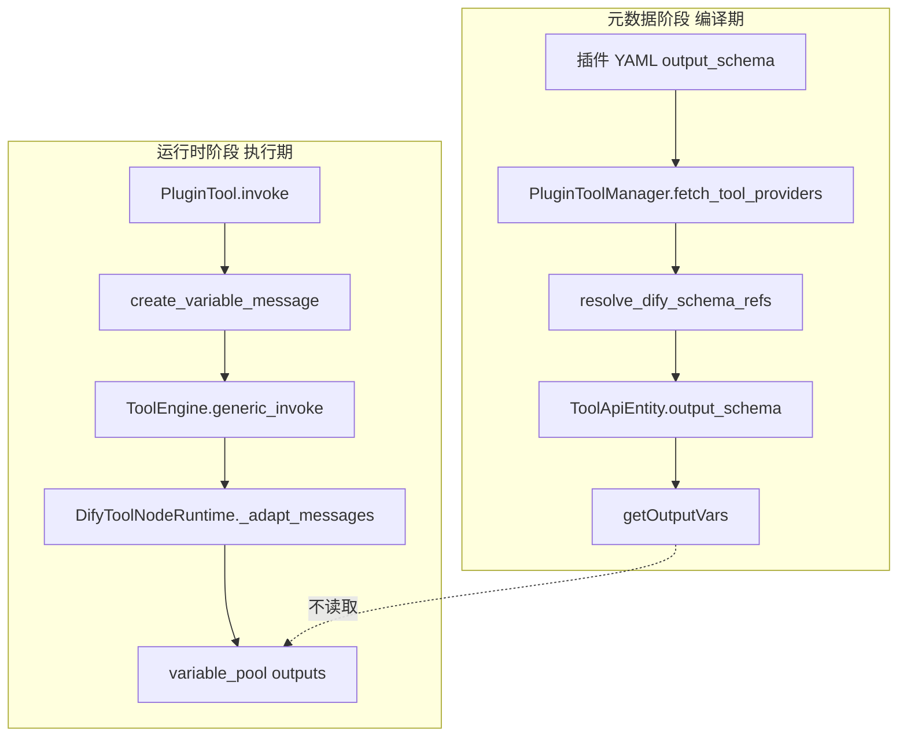

---

## 三、源码模块地图

### 3.1 后端核心文件

| 文件路径 | 核心职责 |
|----------|----------|
| `api/core/tools/entities/tool_entities.py` | `ToolEntity.output_schema` 字段定义；`VariableMessage` 保留字与类型校验 |
| `api/core/tools/entities/api_entities.py` | `ToolApiEntity.output_schema` API 出参模型 |
| `api/core/plugin/impl/tool.py` | 插件守护进程通信；加载工具列表时解析 schema 引用 |
| `api/core/schemas/resolver.py` | `resolve_dify_schema_refs` 展开 JSON Schema 引用 |
| `api/core/tools/tool_manager.py` | `list_plugin_providers` 聚合插件工具 Provider |
| `api/core/tools/plugin_tool/provider.py` | `PluginToolProviderController.get_tool` 按名称取 `ToolEntity` |
| `api/core/tools/__base/tool.py` | `create_variable_message` 工厂方法 |
| `api/core/tools/tool_engine.py` | Agent 与工作流两条调用路径；Agent 路径跳过 VARIABLE |
| `api/core/workflow/node_runtime.py` | `DifyToolNodeRuntime` 消息类型适配 graphon |
| `api/core/tools/workflow_as_tool/provider.py` | 工作流即工具发布时从图输出静态生成 schema |
| `api/core/tools/mcp_tool/tool.py` | MCP structuredContent 映射变量 需 schema 非空 |
| `api/services/tools/tools_transform_service.py` | `ToolEntity` 转 `ToolApiEntity` 时透传 output_schema |
| `api/controllers/console/workspace/tool_providers.py` | 工具 Provider 与工具列表 REST 入口 |

### 3.2 前端核心文件

| 文件路径 | 核心职责 |
|----------|----------|
| `web/app/components/workflow/constants.ts` | `TOOL_OUTPUT_STRUCT` 三个默认输出硬编码 |
| `web/app/components/workflow/nodes/tool/default.ts` | `getOutputVars` 解析 output_schema |
| `web/app/components/workflow/nodes/tool/output-schema-utils.ts` | JSON Schema 到 VarType 映射 |
| `web/app/components/workflow/nodes/tool/hooks/use-config.ts` | 工具面板 OUTPUT 区域渲染 |
| `web/app/components/workflow/hooks/use-workflow-variables.ts` | `getNodeAvailableVars` 聚合上游变量 |
| `web/service/use-tools.ts` | React Query 拉取 builtin api workflow mcp 工具列表 |

---

## 四、数据模型层源码剖析

### 4.1 ToolEntity — 工具元数据载体

```python
# api/core/tools/entities/tool_entities.py

class ToolEntity(BaseModel):
    identity: ToolIdentity
    parameters: list[ToolParameter] = Field(default_factory=list[ToolParameter])
    description: ToolDescription | None = None
    output_schema: Mapping[str, object] = Field(default_factory=dict)
    has_runtime_parameters: bool = Field(default=False)

    @field_validator("output_schema", mode="before")
    @classmethod
    def _normalize_output_schema(cls, value: Mapping[str, object] | None) -> Mapping[str, object]:
        return value or {}
```

**源码要点：**

- `output_schema` 类型为 `Mapping[str, object]`，实质是 JSON Schema 字典。
- `None` 会被规范化为 `{}`，因此「未声明」与「空对象」在模型层等价。
- 该字段**不参与**工具 `invoke` 时的参数校验，也不参与 `VariableMessage` 写入校验。

单元测试 `test_tool_entity_output_schema_none_defaults_to_empty_dict` 明确覆盖了 `output_schema=None` 时落为 `{}` 的行为。

### 4.2 ToolApiEntity — 面向前端的 API 出参

```python
# api/core/tools/entities/api_entities.py

class ToolApiEntity(BaseModel):
    author: str
    name: str
    label: I18nObject
    description: I18nObject
    parameters: list[ToolParameter] | None = None
    labels: list[str] = Field(default_factory=list)
    output_schema: Mapping[str, object] = Field(default_factory=dict)
```

`ToolTransformService.convert_tool_entity_to_api_entity` 在转换插件工具时**原样透传** `tool.entity.output_schema`：

```python
return ToolApiEntity(
    author=tool.entity.identity.author,
    name=tool.entity.identity.name,
    label=tool.entity.identity.label,
    description=tool.entity.description.human if tool.entity.description else I18nObject(en_US=""),
    output_schema=tool.entity.output_schema,  # 直接透传
    parameters=merged_parameters,
    labels=labels or [],
)
```

这意味着：**前端看到的 `output_schema` 就是插件 manifest 经引用解析后的结果**，中间没有二次裁剪或动态补全。

### 4.3 VariableMessage — 运行时自定义输出载体

```python
class VariableMessage(BaseModel):
    variable_name: str
    variable_value: Any
    stream: bool = Field(default=False)

    @field_validator("variable_name", mode="before")
    @classmethod
    def transform_variable_name(cls, value: str) -> str:
        if value in {"json", "text", "files"}:
            raise ValueError(f"The variable name '{value}' is reserved.")
        return value
```

**与 output_schema 的关系：** `VariableMessage` 的校验逻辑中**没有任何**对 `output_schema.properties` 的引用。运行时写入的变量名只要避开保留字且值类型合法即可。

---

## 五、插件加载链路 — output_schema 如何从 YAML 到 API

### 5.1 整体流程

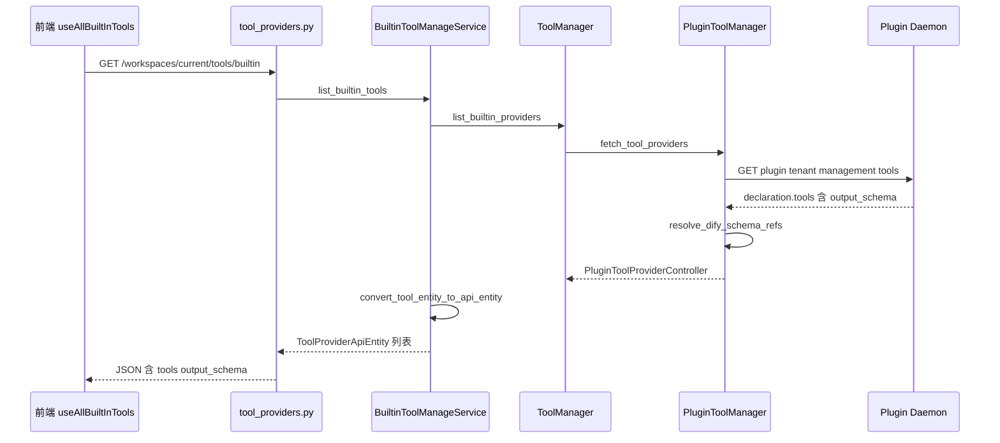

### 5.2 PluginToolManager 关键代码

```python
# api/core/plugin/impl/tool.py

def fetch_tool_providers(self, tenant_id: str) -> list[PluginToolProviderEntity]:
    def transformer(json_response: dict[str, Any]):
        for provider in json_response.get("data", []):
            declaration = provider.get("declaration", {}) or {}
            provider_name = declaration.get("identity", {}).get("name")
            for tool in declaration.get("tools", []):
                tool["identity"]["provider"] = provider_name
                if tool.get("output_schema"):
                    tool["output_schema"] = resolve_dify_schema_refs(tool["output_schema"])
        return json_response
```

**注意：** 仅当 `tool.get("output_schema")` 为真值时才做引用解析。若 YAML 完全省略该字段，daemon 返回的 JSON 中可能无此键，最终落为 `{}`。

### 5.3 resolve_dify_schema_refs 作用

位于 `api/core/schemas/resolver.py`，负责：

- 展开 `$ref` 指向的 Dify 标准 schema URI
- 检测循环引用 `CircularReferenceError`
- 检测最大深度 `MaxDepthExceededError`

若插件 YAML 使用 `$ref` 但引用目标缺失，可能导致 `properties` 为空或不完整，前端 `getOutputVars` 将静默降级为默认三输出。

### 5.4 list_builtin_tools 组装 tools 数组

```python
# api/services/tools/builtin_tools_manage_service.py

tools = provider_controller.get_tools()
for tool in tools or []:
    user_builtin_provider.tools.append(
        ToolTransformService.convert_tool_entity_to_api_entity(
            tenant_id=tenant_id,
            tool=tool,
            labels=ToolLabelManager.get_tool_labels(provider_controller),
        )
    )
```

每个 `ToolApiEntity` 都携带各自的 `output_schema`，前端以 `provider_id` + `tool_name` 定位到具体工具后读取。

---

## 六、HTTP 接口文档

以下接口均位于 Console API 前缀 `/console/api`，需登录并携带有效 Session 或 Token。

### 6.1 获取内置与插件工具列表（含 output_schema）

**请求**

```
GET /console/api/workspaces/current/tools/builtin
```

**Query 参数**：无

**响应体结构**

```json
[
  {
    "id": "your-name/iot_device_http/iot_device_http",
    "author": "your-name",
    "name": "your-name/iot_device_http/iot_device_http",
    "description": { "en_US": "...", "zh_Hans": "..." },
    "icon": "https://...",
    "label": { "en_US": "...", "zh_Hans": "..." },
    "type": "builtin",
    "plugin_id": "your-name/iot_device_http",
    "plugin_unique_identifier": "your-name/iot_device_http:0.0.12@hash",
    "is_team_authorization": true,
    "tools": [
      {
        "author": "your-name",
        "name": "query_asset_summary",
        "label": { "en_US": "Query Asset Summary", "zh_Hans": "查询资产汇总" },
        "description": { "en_US": "...", "zh_Hans": "..." },
        "parameters": [ ... ],
        "labels": [],
        "output_schema": {
          "type": "object",
          "properties": {
            "device_id": { "type": "string", "description": "设备ID" },
            "device_name": { "type": "string", "description": "设备名称" }
          }
        }
      }
    ]
  }
]
```

**源码入口**

- 控制器：`api/controllers/console/workspace/tool_providers.py` → `ToolBuiltinListApi.get`
- 服务：`BuiltinToolManageService.list_builtin_tools`
- 出参模型：`ToolProviderApiEntity` + 嵌套 `ToolApiEntity`

**关键字段说明**

| 字段 | 类型 | 说明 |
|------|------|------|
| `tools[].name` | string | 工具标识，对应工作流节点 `tool_name` |
| `tools[].output_schema` | object | JSON Schema，前端 `getOutputVars` 的数据源 |
| `plugin_id` | string | 插件 ID，对应节点 `provider_id` 前缀 |
| `plugin_unique_identifier` | string | 含版本与 hash，节点配置中常保存此字段 |

### 6.2 获取单个 Provider 下的工具列表

**请求**

```
GET /console/api/workspaces/current/tool-provider/builtin/{provider}/tools
```

**路径参数**

| 参数 | 类型 | 必填 | 说明 |
|------|------|------|------|
| provider | string | 是 | Provider 名称，插件类为 `plugin_id/provider_name` 形式 |

**响应体**：`ToolApiEntity[]`，结构与上一接口中 `tools` 数组元素相同。

**源码入口**：`ToolBuiltinProviderListToolsApi.get` → `BuiltinToolManageService.list_builtin_tool_provider_tools`

### 6.3 获取全部类型工具 Provider 摘要

**请求**

```
GET /console/api/workspaces/current/tool-providers?type=builtin
```

**Query 参数**

| 参数 | 类型 | 必填 | 可选值 |
|------|------|------|--------|
| type | string | 否 | builtin api workflow mcp |

**响应体**：`ToolProviderApiEntity[]`，**注意此接口返回的 provider 对象中 `tools` 数组通常为空**，完整 tools 需调用 6.1 或 6.2。

### 6.4 其他类型工具列表接口

| 接口 | 方法 | output_schema 来源 |
|------|------|-------------------|
| `/workspaces/current/tools/api` | GET | 固定 `{}`，自定义 API 工具不支持 |
| `/workspaces/current/tools/workflow` | GET | 发布工作流时从结束节点输出静态生成 |
| `/workspaces/current/tools/mcp` | GET | MCP Server 元数据 `outputSchema` |

工作流即工具 `output_schema` 生成逻辑：

```python
# api/core/tools/workflow_as_tool/provider.py
outputs = WorkflowToolConfigurationUtils.get_workflow_graph_output(graph)
reserved_keys = {"json", "text", "files"}
properties = {}
for output in outputs:
    if output.variable not in reserved_keys:
        properties[output.variable] = {"type": output.value_type, "description": ""}
output_schema = {"type": "object", "properties": properties}
```

### 6.5 同步工作流草稿（保存画布）

**请求**

```
POST /console/api/apps/{app_id}/workflows/draft
Content-Type: application/json
```

**路径参数**

| 参数 | 类型 | 说明 |
|------|------|------|
| app_id | uuid | 工作流应用 ID |

**请求体主要字段**

```json
{
  "graph": {
    "nodes": [
      {
        "id": "1781055882433",
        "type": "custom",
        "data": {
          "type": "tool",
          "title": "动态扁平化查询",
          "provider_id": "your-name/iot_device_http/iot_device_http",
          "provider_type": "builtin",
          "tool_name": "query_dynamic_flatten",
          "tool_parameters": {},
          "tool_configurations": {},
          "tool_node_version": "2",
          "plugin_unique_identifier": "your-name/iot_device_http:0.0.12@hash"
        }
      }
    ],
    "edges": [ ... ]
  },
  "features": { ... },
  "hash": "上一次同步返回的 hash",
  "environment_variables": [],
  "conversation_variables": []
}
```

**响应体**

```json
{
  "result": "success",
  "hash": "新的唯一 hash",
  "updated_at": "2026-06-10T08:30:00.000Z"
}
```

**源码要点**

- 工具节点 `data` 中**不存储** `output_schema`，只存 `provider_id` 与 `tool_name`。
- 前端每次打开变量选择器时，实时从 6.1 接口缓存的 `allPluginInfoList` 查找 `output_schema`。
- 若插件升级后 `tool_name` 变化但画布未更新，`currTool` 为 `undefined`，变量选择器只剩默认三输出。

### 6.6 运行草稿工作流

**请求**

```
POST /console/api/apps/{app_id}/workflows/draft/run
```

**请求体示例**

```json
{
  "inputs": {},
  "files": []
}
```

**响应**：SSE 流式事件，工具节点完成后 `outputs` 包含运行时全部键，含 `create_variable_message` 写入的自定义字段。

### 6.7 查询节点运行 outputs（调试接口）

**请求**

```
GET /console/api/apps/{app_id}/workflows/draft/runs/{run_id}/node-outputs/{node_id}
```

**路径参数**

| 参数 | 说明 |
|------|------|
| app_id | 应用 ID |
| run_id | 本次运行 ID |
| node_id | 工作流图中工具节点 ID |

**响应体示例（无 output_schema 但动态 yield 了 18 个变量）**

```json
{
  "node_id": "1781055882433",
  "outputs": {
    "text": "动态扁平化完成 共提取 18 个变量",
    "files": [],
    "json": [ { "platform_name": "IoT平台", "network": { ... } } ],
    "platform_name": "IoT平台",
    "network_ip_address": "10.50.36.189",
    "stats_total_devices": 128
  }
}
```

**源码入口**：`api/controllers/console/app/workflow_node_output_inspector.py`

此接口证明：**运行时 outputs 的键集合不受 output_schema 约束**，与前端变量选择器展示集合可以不一致。

### 6.8 插件守护进程内部接口（间接调用）

Console API 不直接暴露此接口，由 `PluginToolManager` 在服务端调用：

```
GET plugin/{tenant_id}/management/tools
POST plugin/{tenant_id}/dispatch/tool/invoke
```

**invoke 请求体核心字段**

```json
{
  "user_id": "uuid",
  "data": {
    "provider": "iot_device_http",
    "tool": "query_dynamic_flatten",
    "credentials": {},
    "credential_type": "api_key",
    "tool_parameters": {}
  }
}
```

**invoke 响应**：`ToolInvokeMessage` 流，其中 `type=variable` 的消息携带 `variable_name` 与 `variable_value`。

---

## 七、前端编排层源码剖析

### 7.1 TOOL_OUTPUT_STRUCT 硬编码默认输出

```typescript
// web/app/components/workflow/constants.ts

export const TOOL_OUTPUT_STRUCT: Var[] = [
  { variable: 'text', type: VarType.string },
  { variable: 'files', type: VarType.arrayFile },
  { variable: 'json', type: VarType.arrayObject },
]
```

这三个变量**无条件存在**，任何工具节点都不可删除。

### 7.2 getOutputVars — 变量选择器的唯一数据源

```typescript
// web/app/components/workflow/nodes/tool/default.ts

getOutputVars(payload, allPluginInfoList, _ragVars, { schemaTypeDefinitions }) {
  const { provider_id, provider_type } = payload
  // 按 provider_type 从 buildInTools customTools workflowTools mcpTools 查找
  const currCollection = currentTools.find(item => canFindTool(item.id, provider_id))
  const currTool = currCollection?.tools.find(tool => tool.name === payload.tool_name)
  const output_schema = currTool?.output_schema

  if (!output_schema || !output_schema.properties) {
    return TOOL_OUTPUT_STRUCT
  }

  const outputSchema: Var[] = []
  Object.keys(output_schema.properties).forEach((outputKey) => {
    const output = output_schema.properties[outputKey]
    const { type, schemaType } = resolveVarType(output, schemaTypeDefinitions)
    outputSchema.push({ variable: outputKey, type, des: output.description, schemaType, ... })
  })

  return [...TOOL_OUTPUT_STRUCT, ...outputSchema]
}
```

**降级条件（满足任一即只剩三默认输出）**

1. `currTool` 未找到 — provider_id 或 tool_name 与缓存不匹配
2. `output_schema` 为空对象 `{}`
3. `output_schema.properties` 不存在或为空 `{}`

**重要：** 前端**不会**读取某次运行的实际 `outputs` 来反推可选变量。元数据与运行数据在前端完全解耦。

### 7.3 resolveVarType — JSON Schema 到工作流 VarType

```typescript
// web/app/components/workflow/nodes/tool/output-schema-utils.ts
```

| JSON Schema type | Dify VarType |
|-----------------|-------------|
| string | VarType.string |
| number / integer | VarType.number / VarType.integer |
| boolean | VarType.boolean |
| object | VarType.object |
| array + items string | VarType.arrayString |
| array + items object | VarType.arrayObject |

此外支持 Dify 紧凑类型字符串如 `array[string]`，通过 `resolveDifyCompactTypeString` 映射。工作流即工具发布时可能直接使用紧凑类型。

### 7.4 use-config 工具面板 OUTPUT 区域

```typescript
// web/app/components/workflow/nodes/tool/hooks/use-config.ts

const outputSchema = useMemo(() => {
  const output_schema = currTool?.output_schema
  if (!output_schema || !output_schema.properties)
    return []
  // 遍历 properties 生成面板展示项
}, [currTool])
```

与 `getOutputVars` 共用同一份 `currTool.output_schema`，但展示格式面向人类可读，变量选择器面向类型推导。

### 7.5 前端数据加载时序

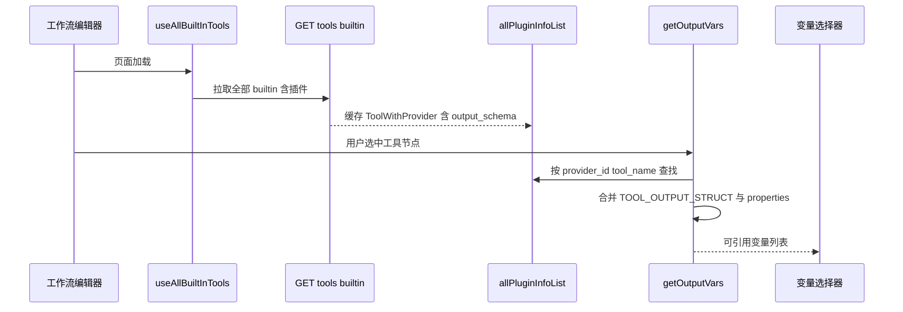

React Query Key：`['tools', 'builtIn']`，定义于 `web/service/use-tools.ts`。

---

## 八、运行时执行链路源码剖析

### 8.1 工作流工具节点调用全链路

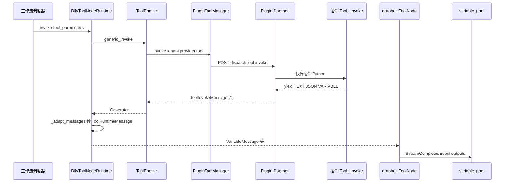

### 8.2 DifyToolNodeRuntime 消息适配

```python
# api/core/workflow/node_runtime.py

case CoreToolInvokeMessage.VariableMessage():
    return ToolRuntimeMessage.VariableMessage(
        variable_name=message.variable_name,
        variable_value=message.variable_value,
        stream=message.stream,
    )
```

此处**无 output_schema 校验**。任何合法的 `variable_name` 都会进入 graphon 层。

### 8.3 outputs 聚合规则

工作流完成后工具节点 `outputs` 字典结构：

| 消息类型 | 写入键 | 聚合方式 |
|---------|--------|---------|
| TEXT | text | 字符串拼接 |
| JSON | json | 追加到数组 |
| FILE BLOB | files | 追加到文件数组 |
| VARIABLE | 自定义变量名 | 直接作为顶层键 |

因此运行时 `outputs` 的键集合 = 默认三键 + 所有 VARIABLE 消息的 variable_name。

### 8.4 Agent 路径与 Workflow 路径差异

```python
# api/core/tools/tool_engine.py _convert_tool_response_to_str

elif response.type == ToolInvokeMessage.MessageType.VARIABLE:
    continue  # Agent 场景完全跳过 VARIABLE
```

| 场景 | VARIABLE 消息 | output_schema 作用 |
|------|--------------|-------------------|
| 工作流工具节点 | 写入 variable_pool | 仅影响前端变量选择器 |
| Agent 工具调用 | 被跳过不进 LLM 上下文 | 对 LLM 无意义 |

### 8.5 下游变量引用解析

下游节点通过 `{{#node_id.field_name#}}` 模板或 `value_selector: [node_id, field_name]` 引用变量。

后端 `variable_pool.get(selector)` **不检查** field_name 是否在 output_schema 中声明。只要运行时 outputs 存在该键即可取值。

前端 `var-reference-picker.helpers.ts` 中 `isValidVar` 基于 `getNodeAvailableVars` 结果判断，未在 schema 中声明的字段会显示警告图标，但**不阻断工作流保存与执行**。

---

## 九、工具实例化链路 — output_schema 何时被加载

工作流执行工具节点时，`output_schema` **不会被传入执行路径**。执行链路只关心 `provider_id`、`tool_name`、参数与凭证。以下按调用顺序展开源码。

### 9.1 DifyToolNodeRuntime.invoke 入口

```python
# api/core/workflow/node_runtime.py 简化

tool_runtime = ToolManager.get_workflow_tool_runtime(
    tenant_id=...,
    app_id=...,
    node_id=...,
    workflow_tool=spec,  # 来自节点 data 的 provider_id tool_name 等
    variable_pool=variable_pool,
)
messages = ToolEngine.generic_invoke(
    tool=tool_runtime,
    tool_parameters=...,
    workflow_tool_callback=callback,
    ...
)
transformed = ToolFileMessageTransformer.transform_tool_invoke_messages(messages)
return self._adapt_messages(transformed)
```

**观察**：`get_workflow_tool_runtime` 返回的 `Tool` 对象虽携带 `entity.output_schema`，但 `generic_invoke` 与 `_adapt_messages` **全程未读取**该字段。

### 9.2 ToolManager.get_workflow_tool_runtime

```python
# api/core/tools/tool_manager.py

tool_runtime = cls.get_tool_runtime(
    provider_type=workflow_tool.provider_type,
    provider_id=workflow_tool.provider_id,
    tool_name=workflow_tool.tool_name,
    tenant_id=tenant_id,
    tool_invoke_from=ToolInvokeFrom.WORKFLOW,
    ...
)
# 合并节点参数与 variable_pool 中的变量引用
runtime_parameters = cls._convert_tool_parameters_type(
    parameters, variable_pool, workflow_tool.tool_configurations, typ="workflow"
)
tool_runtime.runtime.runtime_parameters.update(runtime_parameters)
return tool_runtime
```

此处完成「画布上配置的参数」到「实际调用参数」的转换，与 output_schema 无关。

### 9.3 PluginTool._invoke 到 Plugin Daemon

```python
# api/core/tools/plugin_tool/tool.py

def _invoke(self, user_id, tool_parameters, ...):
    manager = PluginToolManager()
    tool_parameters = convert_parameters_to_plugin_format(tool_parameters)
    yield from manager.invoke(
        tenant_id=self.tenant_id,
        user_id=user_id,
        tool_provider=self.entity.identity.provider,
        tool_name=self.entity.identity.name,
        credentials=self.runtime.credentials,
        tool_parameters=tool_parameters,
        ...
    )
```

`self.entity` 是 `ToolEntity`，含 `output_schema`，但 invoke 请求体**只发送** provider、tool、parameters、credentials，**不发送** output_schema。

### 9.4 ToolEngine.generic_invoke 回调链

```python
# api/core/tools/tool_engine.py

workflow_tool_callback.on_tool_start(tool_name=..., tool_inputs=tool_parameters)
response = tool.invoke(...)
response = workflow_tool_callback.on_tool_execution(
    tool_name=..., tool_inputs=..., tool_outputs=response
)
return response
```

回调用于记录节点执行日志与流式事件，同样不介入 output_schema 逻辑。

### 9.5 实例化链路时序图

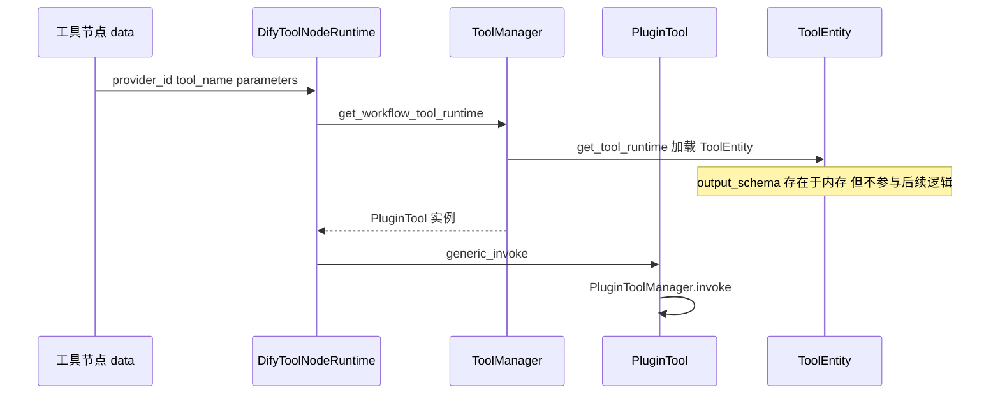

---

## 十、五类工具 output_schema 源码能力矩阵

| 工具类型 | 声明 output_schema | 运行时 create_variable_message | 默认三输出 | 源码位置 |
|---------|-------------------|-------------------------------|-----------|----------|
| 插件工具 Plugin | YAML manifest 手动声明 | 插件 Python yield | 始终有 | `plugin_tool/tool.py` |
| 工作流即工具 Workflow | 发布时从结束节点自动生成 | 自动遍历 outputs 非保留名 | 始终有 | `workflow_as_tool/provider.py` |
| MCP 工具 | Server 元数据 outputSchema | 需 schema 非空且有 structuredContent | 始终有 | `mcp_tool/tool.py` |
| 自定义 API 工具 | 不支持 固定空对象 | 不支持 仅 json text | 始终有 | `custom_tool/tool.py` |
| 内置硬编码工具 | YAML 无此字段 | 不支持 仅消息类型产出 | 始终有 | `builtin_tool/providers/` |

### 10.1 插件工具 — 最完整的自定义输出能力

插件 `_invoke` 可自由 `yield self.create_variable_message(key, value)`，与 YAML 中 `output_schema` 声明相互配合：

- **声明但不 yield**：UI 可选但运行值为空
- **yield 但不声明**：运行有值但 UI 不可选（实验已验证）
- **声明且 yield**：完整闭环

### 10.2 MCP 工具 — 双通道且 schema 门控

```python
# api/core/tools/mcp_tool/tool.py

# 通道 A 文本或 JSON 自动解析 写入 text 或 json
def _process_text_content(self, content):
    if text looks like JSON:
        yield create_json_message(...)

# 通道 B 结构化输出 需同时满足两个条件
if self.entity.output_schema and result.structuredContent:
    for k, v in result.structuredContent.items():
        yield self.create_variable_message(k, v)
```

MCP 的自定义变量**额外要求** Server 返回 `structuredContent`，仅有 `output_schema` 不够。

### 10.3 自定义 API 工具 — 无 schema 入口

```python
# api/core/tools/custom_tool/tool.py 简化逻辑
if parsed_response.is_json:
    yield self.create_json_message(parsed_response.content)
yield self.create_text_message(response.text)
```

整条路径无 `create_variable_message`，`ToolApiEntity.output_schema` 恒为 `{}`。

### 10.4 工作流即工具 — 自动 schema 与自动变量

```python
# api/core/tools/workflow_as_tool/tool.py
for key, value in outputs.items():
    if key not in {"text", "json", "files"}:
        yield self.create_variable_message(variable_name=key, variable_value=value)
yield self.create_text_message(json.dumps(outputs, ensure_ascii=False))
yield self.create_json_message(outputs, suppress_output=True)
```

子工作流结束节点的输出变量名直接成为工具 output_schema 的 properties 键名，无需手写 YAML。

---

## 十一、双阶段模型源码级证明

前置实验文档提出了「编译时 output_schema 管 UI，运行时 create_variable_message 管数据」的双阶段模型。以下用源码交叉验证。

### 11.1 阶段一 元数据阶段

**触发时机**：编辑器加载工具列表、用户选中工具节点、打开变量选择器

**数据流**

```
插件 YAML output_schema
  → Plugin Daemon 返回 declaration
  → resolve_dify_schema_refs
  → ToolEntity.output_schema
  → ToolApiEntity.output_schema
  → 前端 allPluginInfoList 缓存
  → getOutputVars
  → 变量选择器
```

**特征**

- 数据是**静态**的，随插件版本变化，不随单次 API 响应变化
- 工作流草稿 graph JSON 中**不保存** output_schema
- 后端 ToolEntity 在执行期**不被查询**以决定可输出哪些变量

### 11.2 阶段二 运行时阶段

**触发时机**：工作流运行，工具节点被调度执行

**数据流**

```
插件 Python yield VariableMessage
  → Plugin Daemon 流式返回
  → ToolEngine.generic_invoke
  → DifyToolNodeRuntime._adapt_messages
  → graphon ToolNode._transform_message
  → outputs 字典写入 variable_pool
```

**特征**

- 变量名仅受 `VariableMessage` 校验器约束
- outputs 键集合可以大于 output_schema.properties 键集合
- 调试接口 node-outputs 返回的是阶段二真实数据

### 11.3 两阶段解耦示意图

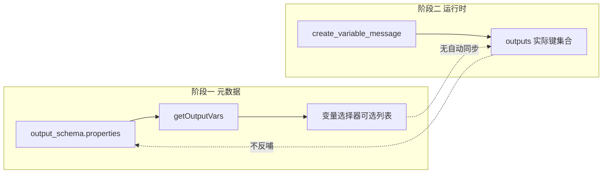

这与 TypeScript 中「类型声明」与「运行时值」的关系类似：有值无类型则 IDE 不提供补全，有类型无值则编译通过但运行为空。

---

## 十二、绕过路径的源码级评估

### 12.1 路径 A — json 通道加代码节点【推荐 无需改源码】

**原理**：`json` 是 `TOOL_OUTPUT_STRUCT` 硬编码默认输出，无需 output_schema。

```python
yield self.create_json_message(raw_dict)
```

**下游**：代码节点读取 `{{#tool_node_id.json#}}`，用 Python 或 JS 动态解析。

**源码依据**：`getOutputVars` 无条件包含 `json`，`variable_pool.get` 不校验 schema。

**优劣**

| 优点 | 缺点 |
|------|------|
| 完全动态 适配未知 JSON 结构 | 多一个代码节点 编排复杂度上升 |
| 不改 Dify 源码 | 无法在变量选择器直接点选深层字段 |
| 与平台架构一致 | json 类型为 array object 需取首元素 |

### 12.2 路径 B — 静态声明加动态填充【推荐 需预知字段名】

**原理**：YAML 声明稳定字段，Python 动态遍历后 yield。

```yaml
output_schema:
  type: object
  properties:
    platform_name: { type: string }
    alert_count: { type: number }
```

```python
for key, value in flat_fields.items():
    yield self.create_variable_message(key, value)
```

**源码依据**：getOutputVars 只读 properties 的**键名**决定 UI 展示，不要求运行时一定 yield 全部键。

### 12.3 路径 C — 手写 value_selector 或 DSL 导入【半绕过 不推荐生产】

**原理**：结束节点存储 `value_selector: [node_id, field_name]`，后端 variable_pool.get 不校验 schema。

**源码依据**

- `web/app/components/workflow/nodes/end/default.ts` 只校验 selector 非空
- 无后端节点校验 output_schema 与 selector 一致性

**风险**

- UI 显示无效变量警告
- 接口字段变更后运行时才失败
- 无法通过产品化方式维护

### 12.4 路径 D — 修改 Dify 前端 getOutputVars【需改源码】

最小改动点：

```
web/app/components/workflow/nodes/tool/default.ts  getOutputVars
```

可能方案：

1. 无 schema 时合并最近一次运行的 outputs 键名 — 需新增 API 与缓存机制
2. 允许通配符或 json 子路径选择 — 需改变 Var 类型系统
3. 工具节点增加类似代码节点的 outputs 配置 — 需改 ToolNodeType 与后端

后端几乎无需改动，瓶颈完全在前端元数据模型。

### 12.5 明确不可行的绕过

| 方案 | 不可行原因 源码位置 |
|------|-------------------|
| 执行时动态更新 output_schema | 无此 API PluginToolManager 仅加载时解析 |
| 仅靠 create_variable_message 实现 UI 自动发现 | getOutputVars 不读运行时 outputs |
| MCP 无 schema 却有 structuredContent 变量 | mcp_tool/tool.py 第 93 行双条件判断 |
| 自定义 API 工具按字段引用 | custom_tool 无 VariableMessage 路径 |

---

## 十三、注意事项与踩坑清单

### 13.1 output_schema 相关

1. **properties 不能为空对象**  
   前端判断 `!output_schema.properties` 即降级。空 `{}` 在 JS 中为 truthy 但 `Object.keys` 为空数组，结果只剩三默认输出，**不报错**。

2. **$ref 引用必须可解析**  
   引用缺失时 resolve 可能产出不完整 schema，表现为 UI 无自定义字段。

3. **插件升级后 provider_id 或 tool_name 变化**  
   画布节点仍引用旧配置时 `currTool` 为 undefined，output_schema 读不到。

4. **output_schema 声明了但运行时未 yield**  
   UI 可选但值为 null 或 undefined，下游节点可能拿到空值。

5. **运行时 yield 了但 output_schema 未声明**  
   数据存在于 outputs，UI 不可选。实验文档 8.1 节已用 node-outputs 接口验证。

### 13.2 VariableMessage 相关

1. **保留字** text files json 不可作 variable_name，否则 ValueError
2. **值类型** 仅允许 dict list str int float bool None
3. **stream 模式** stream 为 true 时 variable_value 必须是 string
4. **嵌套 dict 作为值** 允许，但 flatten 后作为独立顶层键需逐个 yield

### 13.3 Agent 场景与工作流场景不要混淆

Agent 调用工具时 VARIABLE 消息被 `_convert_tool_response_to_str` 跳过。若期望 Agent 看到结构化数据，应使用 TEXT 或 JSON 消息而非 VariableMessage。

### 13.4 suppress_output 的语义

`create_json_message(obj, suppress_output=True)` 在 Agent 文本转换时跳过，但工作流 json 数组仍会追加。WorkflowTool 利用此特性避免 Agent 侧重复序列化。

### 13.5 工作流草稿不含 output_schema

排查「我声明了 schema 但前端不显示」时，应检查：

1. GET tools builtin 响应中该工具是否有 output_schema.properties
2. 节点 provider_id 与 tool_name 是否与响应一致
3. 前端 React Query 缓存是否过期 可尝试刷新或 re-install 插件

---

## 十四、关键源码阅读路线

若需自行跟踪一条完整链路，建议按以下顺序阅读：

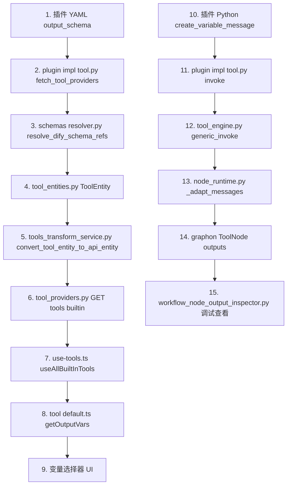

---

## 十五、与前置实验文档的源码互证

| 实验现象 | 源码解释 |
|----------|----------|
| 无 schema 时 UI 只显示 text files json | getOutputVars 第 93 行降级逻辑 |
| 无 schema 时 outputs 含 18 个动态字段 | VariableMessage 无 schema 校验 node_runtime 透传 |
| 有 schema 时结束节点可引用 device_id | getOutputVars 将 properties 键加入可选列表 |
| 纯动态方案不可编排 | 阶段一与阶段二解耦 无反哺机制 |
| json 通道可拿到完整数据 | TOOL_OUTPUT_STRUCT 硬编码始终包含 json |

---

## 十六、改造建议（若产品化支持动态输出）

若未来要在**不改插件 YAML** 前提下支持 UI 编排动态字段，源码层面需新增以下能力之一：

### 方案 1 — 工具节点增加用户自定义 outputs 配置

类似 `CodeNodeType.outputs`，扩展 `ToolNodeType`：

- 用户在画布上手动添加输出变量名与类型
- 保存到 graph JSON
- `getOutputVars` 优先合并节点级 outputs 与工具 schema

改动面：前端类型定义、default.ts、后端无需改执行逻辑。

### 方案 2 — 试运行后自动推断 schema

- 增加「试运行并提取 outputs 键」按钮
- 调用 node-outputs 接口获取键名与推断类型
- 写回节点配置或临时缓存供 getOutputVars 读取

改动面：前端交互、新增节点级缓存字段、可选后端持久化。

### 方案 3 — 统一走 json 加代码节点范式

不改平台，在插件开发规范中约定：

- 工具只保证 json 通道输出完整结构
- 工作流模板内置标准代码节点做扁平化

改动面：零代码，但编排复杂度转移给模板。

**当前源码下方案 3 成本最低，方案 1 或 2 需产品决策后改前端。**

---

## 十七、异常与错误处理源码

与 output_schema 和 VariableMessage 相关的错误均在**工具调用阶段**抛出，不会被 output_schema 校验拦截。

### 17.1 保留字变量名

```
ValueError: The variable name 'text' is reserved.
```

**触发位置**：`tool_entities.py` → `VariableMessage.transform_variable_name`

**触发条件**：`create_variable_message` 使用了 text、files、json 之一作为 variable_name

**与工作流影响**：工具节点执行失败，outputs 为空，下游变量引用拿不到值

### 17.2 非法变量值类型

```
ValueError: Only basic types, lists, and None are allowed.
```

**触发条件**：variable_value 为自定义类实例、datetime、bytes 等非允许类型

**规避**：复杂对象先 `model_dump` 或手动转 dict 再 yield

### 17.3 插件调用失败

```
ToolRuntimeInvocationError: Failed to invoke tool ...
```

**映射位置**：`node_runtime.py` → `_map_invocation_exception`

常见子原因：

| 原始异常 | 用户可见信息 |
|----------|-------------|
| PluginInvokeError | 插件友好错误信息 |
| ToolInvokeError | 工具调用错误详情 |
| ToolNotFoundError | 找不到指定名称的工具 |

### 17.4 schema 解析失败

`resolve_dify_schema_refs` 可能抛出：

- `CircularReferenceError` 循环引用
- `MaxDepthExceededError` 超过最大深度
- `SchemaNotFoundError` 引用目标不存在

这些错误发生在**加载工具列表**阶段，而非工具执行阶段。表现为该 Provider 加载失败或 output_schema 不完整。

### 17.5 错误传播路径

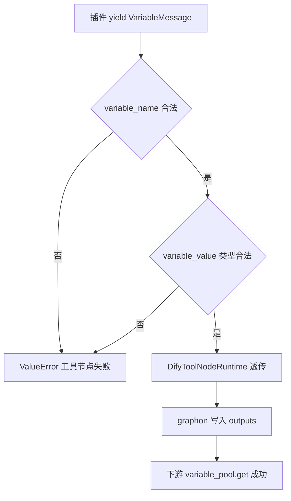

---

## 十八、graphon 引擎层职责边界

Dify 1.x 将工作流图执行委托给 graphon 包。与 output_schema 相关的职责分割如下。

### 18.1 Dify 层负责

| 职责 | 源码位置 |
|------|----------|
| 工具 Provider 加载与 Tool 实例化 | ToolManager |
| 参数与 variable_pool 变量合并 | get_workflow_tool_runtime |
| ToolInvokeMessage 到 ToolRuntimeMessage 转换 | DifyToolNodeRuntime._adapt_messages |
| 异常映射为 ToolNodeError | _map_invocation_exception |
| 文件消息转存 | ToolFileMessageTransformer |

### 18.2 graphon 层负责

| 职责 | 说明 |
|------|------|
| ToolNode 状态机 | 节点调度与重试 |
| _transform_message | 将 VARIABLE 消息写入节点 outputs |
| StreamChunkEvent | 流式输出 |
| StreamCompletedEvent | 完成时写入 variable_pool |
| 变量模板解析 | VariableTemplateParser 解析双花括号引用 |

### 18.3 边界图

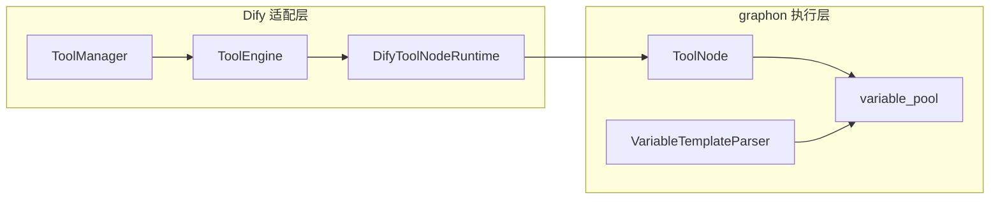

**关键结论**：graphon 不知道 output_schema 的存在。它只处理运行时消息流。编排期的变量可见性完全由 Dify 前端 getOutputVars 决定。

---

## 十九、YAML 到 API 响应完整对照实例

以下展示插件工具 YAML 中一段 output_schema 如何原样出现在 API 响应中。

### 19.1 插件侧 YAML 声明

```yaml
# tools/query_asset_summary.yaml 节选

identity:
  name: query_asset_summary
  label:
    zh_Hans: 查询资产汇总
    en_US: Query Asset Summary

output_schema:
  type: object
  properties:
    device_id:
      type: string
      description: 设备唯一标识
    device_name:
      type: string
      description: 设备显示名称
    app_id:
      type: string
      description: 应用 ID
```

### 19.2 插件侧 Python 产出

```python
# tools/query_asset_summary.py 节选

yield self.create_variable_message("device_id", device_id)
yield self.create_variable_message("device_name", device_name)
yield self.create_variable_message("app_id", app_id)
yield self.create_json_message(raw)
```

### 19.3 API 响应中 tools 元素

经 `convert_tool_entity_to_api_entity` 透传后，GET tools builtin 返回：

```json
{
  "name": "query_asset_summary",
  "output_schema": {
    "type": "object",
    "properties": {
      "device_id": { "type": "string", "description": "设备唯一标识" },
      "device_name": { "type": "string", "description": "设备显示名称" },
      "app_id": { "type": "string", "description": "应用 ID" }
    }
  }
}
```

### 19.4 前端 getOutputVars 解析结果

| variable | type | 来源 |
|----------|------|------|
| text | string | TOOL_OUTPUT_STRUCT 硬编码 |
| files | arrayFile | TOOL_OUTPUT_STRUCT 硬编码 |
| json | arrayObject | TOOL_OUTPUT_STRUCT 硬编码 |
| device_id | string | output_schema.properties |
| device_name | string | output_schema.properties |
| app_id | string | output_schema.properties |

### 19.5 运行时 node-outputs 实际值

```json
{
  "text": "查询完成",
  "files": [],
  "json": [{ "device_id": "dev001", "device_name": "cf", "app_id": "app001" }],
  "device_id": "dev001",
  "device_name": "cf",
  "app_id": "app001"
}
```

注意 json 数组中的对象与顶层扁平键**同时存在**。这是因为 JSON 消息与 VARIABLE 消息分别写入了不同键位。

---

## 二十、下游节点引用机制的源码说明

### 20.1 模板语法

工作流节点中使用双花括号引用上游变量：

```
{{#节点ID.变量名#}}
```

示例：

```
{{#1781055882433.device_id#}}
{{#1781055882433.json#}}
```

### 20.2 value_selector 数组

结构化节点如结束节点、变量赋值节点使用数组形式：

```json
{
  "variable": "result_device_id",
  "value_selector": ["1781055882433", "device_id"]
}
```

### 20.3 后端解析流程

1. `VariableTemplateParser` 从模板字符串提取 selector
2. `variable_pool.get(["1781055882433", "device_id"])` 取值
3. 若键不存在返回 None，节点可能报错或输出空值

**无任何步骤检查 device_id 是否在 output_schema 中声明。**

### 20.4 前端校验与后端执行差异

| 行为 | 前端 | 后端 |
|------|------|------|
| 变量是否在可选列表 | getOutputVars 决定 | 不检查 |
| 未声明字段能否保存画布 | 可保存 显示警告 | 不涉及 |
| 未声明字段能否执行 | 不涉及 | 可以 若 outputs 有值 |
| 声明了但未 yield | 可选 | 值为空 |

---

## 二十一、插件安装与 output_schema 刷新机制

output_schema 随插件 manifest 打包发布。理解安装与升级流程有助于排查 schema 不更新问题。

### 21.1 插件安装后的加载时机

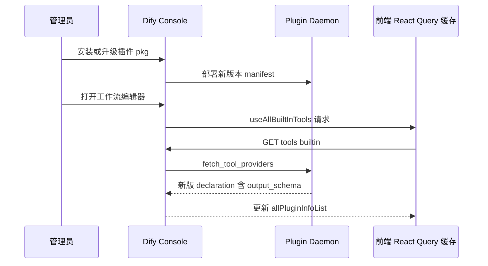

### 21.2 何时需要手动刷新

| 场景 | 建议操作 |
|------|----------|
| 插件升级到含新 output_schema 的版本 | 刷新浏览器或等待 React Query 缓存过期 |
| 工作流画布仍引用旧 plugin_unique_identifier | 删除节点重新添加或更新标识符 |
| 修改 YAML 后未 bump 版本号 | 重新打包安装插件 |

### 21.3 manifest 与 tools YAML 关系

插件 `manifest.yaml` 的 `plugins.tools` 列表指向各工具 YAML 文件路径。Daemon 启动时合并为 `declaration.tools` 数组，每个元素可含独立 `output_schema`。

```
manifest.yaml
  └── plugins.tools
        ├── tools/query_asset_summary.yaml   → 含 output_schema
        └── tools/query_dynamic_flatten.yaml → 无 output_schema
```

两个工具在同一 Provider 下，schema 互不影响，各自独立进入 `ToolApiEntity.output_schema`。

---

## 二十二、工作流运行期 SSE 事件与 outputs 观测

### 22.1 草稿运行接口

```
POST /console/api/apps/{app_id}/workflows/draft/run
```

返回 `text/event-stream` 流。工具节点完成时推送 `node_finished` 类事件，payload 中含 `outputs` 字段。

### 22.2 outputs 字段与 output_schema 无关

SSE 事件中工具节点的 outputs 是运行时真实产物。其键集合由插件 yield 的消息类型决定，**不裁剪为** output_schema.properties 的子集。

观测方法：

1. 浏览器 Network 面板筛选 EventStream
2. 或调用 node-outputs 快照接口 GET runs run_id node-outputs node_id

### 22.3 调试建议

开发插件时推荐流程：

1. 先不声明 output_schema，运行工作流
2. 调用 node-outputs 接口查看实际 outputs 键名
3. 将需要 UI 可选的键名写入 YAML output_schema
4. 升级插件版本并刷新前端缓存
5. 验证变量选择器展示与结束节点引用

此流程利用「运行时键集合 ⊇ schema 声明键集合」的源码特性，避免盲目猜测字段名。

---

## 二十三、总结

通过对 Dify v1.13.x 源码的完整梳理，可以明确：

1. **`output_schema` 是静态元数据**，定义于插件 YAML，经 PluginToolManager 加载、resolve_dify_schema_refs 解析后，通过 `GET /workspaces/current/tools/builtin` 等接口到达前端。

2. **前端 `getOutputVars` 是编排期唯一数据源**，无 schema 或 properties 为空时降级为 text files json 三默认输出。

3. **运行时 `create_variable_message` 与 output_schema 完全解耦**，后端不校验声明与产出的一致性，outputs 可包含未声明字段。

4. **不存在执行期动态设置 output_schema 的 API**，纯动态扁平化无法在不改源码的前提下实现完整编排闭环。

5. **生产推荐路径**：核心稳定字段写入 output_schema 保证 UI 可选；完整 JSON 走 json 通道；灵活解析交给代码节点。

---

## 二十四、工作流即工具发布接口与 output_schema 生成

工作流即工具的 output_schema **不由用户手写**，而在发布时由源码自动从子工作流图推导。

### 24.1 创建工作流工具

**请求**

```
POST /console/api/workspaces/current/tool-provider/workflow/create
Content-Type: application/json
```

**请求体**

```json
{
  "workflow_app_id": "子工作流应用 UUID",
  "name": "my_sub_workflow_tool",
  "label": "我的子工作流工具",
  "description": "将子工作流封装为可复用工具",
  "icon": { "content": "🤖", "background": "#FFEAD5" },
  "parameters": [
    {
      "name": "query",
      "description": "用户查询",
      "form": "llm"
    }
  ],
  "privacy_policy": "",
  "labels": []
}
```

**响应体关键字段**

```json
{
  "result": "success",
  "workflow_tool_id": "uuid"
}
```

### 24.2 获取工作流工具详情含 output_schema

**请求**

```
GET /console/api/workspaces/current/tool-provider/workflow/get?workflow_tool_id={id}
```

**响应体**

```json
{
  "name": "my_sub_workflow_tool",
  "workflow_app_id": "uuid",
  "output_schema": {
    "type": "object",
    "properties": {
      "result": { "type": "string", "description": "" },
      "score": { "type": "number", "description": "" }
    }
  },
  "tool": {
    "name": "my_sub_workflow_tool",
    "output_schema": { "...同上..." },
    "parameters": [ ... ]
  },
  "synced": true
}
```

**源码位置**：`WorkflowToolManageService.get_workflow_tool` 第 363-374 行显式返回 `output_schema`。

`synced` 字段表示子工作流当前版本是否与已发布工具版本一致。子工作流结束节点输出变更后需 update 工具，否则 output_schema 可能过时。

### 24.3 自动生成逻辑回顾

子工作流结束节点定义的输出变量名，除去保留字 json text files 后，全部进入 properties。这意味着工作流即工具的 output_schema 与子工作流结束节点**强绑定**，是静态推导而非运行时推断。

---

## 二十五、代码节点与工具节点的源码级对比

理解为何代码节点可以画布内自定义 outputs 而工具节点不行，需对比两者的类型定义。

### 25.1 类型定义差异

| 字段 | CodeNodeType | ToolNodeType |
|------|-------------|--------------|
| outputs | 有 用户可编辑数组 | 无 |
| output_schema 来源 | 用户代码 return 与 outputs 配置 | 工具元数据 API |
| getOutputVars 数据源 | 节点 data.outputs | currTool.output_schema |

工具节点 `getOutputVars` 在 `tool/default.ts`，代码节点在 `code/default.ts` 从自身 `payload.outputs` 读取。

### 25.2 为何工具节点不采用 outputs 字段

从架构看，工具节点是**黑盒调用**：输出结构由工具提供方在 manifest 中声明，而非工作流编排者在画布上定义。这保证了：

1. 同一工具在不同工作流中输出语义一致
2. Agent 选择工具时可从 output_schema 了解产出结构
3. 插件版本升级时 schema 随 manifest 更新

代价是丧失了代码节点的灵活性。若需灵活输出，平台设计意图是改用代码节点或 json 加代码节点组合。

### 25.3 选型决策树

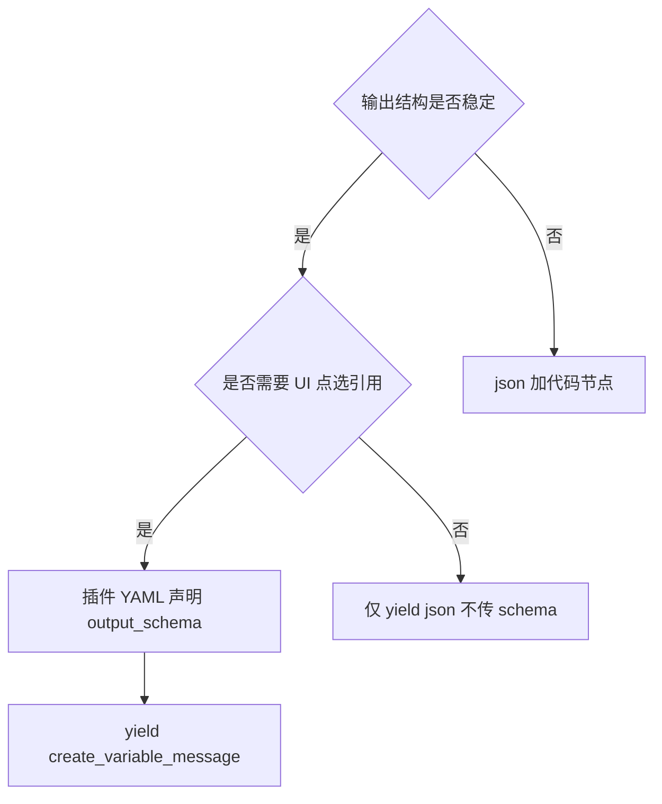

---

## 二十六、Plugin Daemon 消息协议与 VARIABLE 类型

插件执行时，Daemon 与 Dify API 之间以流式 JSON 传递 `ToolInvokeMessage`。

### 26.1 消息类型枚举

对应 `tool_entities.py` 中 `MessageType`：

| type 值 | 含义 | 写入 outputs 键 |
|---------|------|----------------|
| text | 纯文本 | text |
| json | JSON 对象或数组 | json 数组元素 |
| variable | 自定义变量 | variable_name 指定的键 |
| file | 文件 | files |
| blob | 二进制 | files |

### 26.2 VARIABLE 消息 JSON 示例

Daemon 流中一条 variable 类型消息大致形态：

```json
{
  "type": "variable",
  "message": {
    "variable_name": "device_id",
    "variable_value": "dev2026060816014843922",
    "stream": false
  }
}
```

Dify API 收到后经 `PluginToolManager.invoke` 转为 `ToolInvokeMessage`，再经 `DifyToolNodeRuntime._adapt_messages` 原样透传 variable_name 与 variable_value。

### 26.3 与 output_schema 的关系

Daemon 和 Dify API **均不**将 variable_name 与 output_schema.properties 做交集过滤。这从协议层保证了「运行时产出 ⊇ schema 声明」的可能性。

---

## 二十七、源码排查 Checklist

遇到 output_schema 相关问题时，按以下顺序排查可快速定位层级。

| 步骤 | 检查项 | 通过标准 |
|------|--------|----------|
| 1 | 插件 YAML 是否含 output_schema.properties | properties 至少一个键 |
| 2 | GET tools builtin 响应是否含该 schema | 与 YAML 一致 |
| 3 | 画布节点 provider_id 是否匹配 API id | 字符串完全一致 |
| 4 | 画布节点 tool_name 是否匹配 API name | 字符串完全一致 |
| 5 | 插件 Python 是否 yield 对应变量 | node-outputs 有值 |
| 6 | 下游引用路径是否正确 | value_selector 两段式 |
| 7 | 变量名是否踩保留字 | 非 text files json |

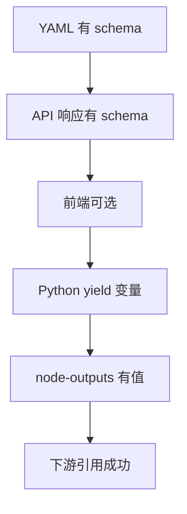

任一步失败时，问题位于该层之前的链路，无需继续向后排查。

---

## 附录 D  常见问题源码级解答

### D.1 output_schema 是必填的吗

**不是必填。** `ToolEntity.output_schema` 默认 `{}`。不填时工具仍可正常执行，只是前端变量选择器只展示 text files json。

### D.2 能否在运行时动态修改 output_schema

**不能。** 全链路无「执行时更新 schema」的 API。插件升级重新安装后 schema 才会变化。

### D.3 声明了 10 个字段但只 yield 了 3 个会怎样

UI 仍展示 10 个可选变量。未 yield 的 7 个在 variable_pool 中不存在或为空，下游引用得到 None。

### D.4 yield 了 10 个字段但只声明了 3 个会怎样

UI 只展示 3 个自定义字段加 3 个默认字段。其余 7 个存在于 node-outputs 但变量选择器不可点选。手写 value_selector 理论上可引用。

### D.5 json 与自定义 VARIABLE 字段有什么区别

| 维度 | json | VARIABLE 自定义字段 |
|------|------|---------------------|
| 是否需要 output_schema | 否 硬编码默认 | 是 才能 UI 可选 |
| 数据结构 | 数组 每项为对象 | 顶层独立键 |
| Agent 可见性 | 会序列化进文本 | 被跳过 |
| 典型用途 | 保留完整原始响应 | 下游直接点选引用 |

### D.6 工作流即工具的 output_schema 何时更新

每次**发布或更新**工作流工具时，从关联工作流图的结束节点输出重新生成。修改子工作流结束节点后需重新发布工具才刷新 schema。

### D.7 插件与内置硬编码工具有什么区别

内置硬编码工具来自 `api/core/tools/builtin_tool/providers/` 目录，YAML 无 output_schema 字段，get_tools 返回的 ToolEntity.output_schema 为 `{}`。插件工具从 Plugin Daemon 加载，可自由声明 output_schema。

### D.8 如何验证 output_schema 是否正确到达前端

步骤：

1. 浏览器开发者工具查看 `GET /console/api/workspaces/current/tools/builtin` 响应
2. 定位 provider_id 对应的 tools 数组元素
3. 确认 output_schema.properties 包含预期键名
4. 工作流编辑器选中工具节点，打开变量选择器核对

若 API 正确但 UI 不正确，检查 provider_id 或 tool_name 是否与画布节点配置一致。

---

## 附录 E  接口调用 curl 示例

以下示例供私有化环境调试，请将 BASE_URL 和 TOKEN 替换为实际值。

### E.1 获取插件工具列表含 output_schema

```bash
curl -s "${BASE_URL}/console/api/workspaces/current/tools/builtin" \
  -H "Authorization: Bearer ${TOKEN}" \
  -H "Content-Type: application/json" \
  | jq '.[] | select(.plugin_id | contains("iot_device")) | .tools[] | {name, output_schema}'
```

预期输出包含目标工具的 output_schema.properties。若 properties 为空对象，前端变量选择器将只有三个默认字段。

### E.2 保存工作流草稿

```bash
curl -s -X POST "${BASE_URL}/console/api/apps/${APP_ID}/workflows/draft" \
  -H "Authorization: Bearer ${TOKEN}" \
  -H "Content-Type: application/json" \
  -d @workflow_draft.json
```

workflow_draft.json 中工具节点无需包含 output_schema，只需 provider_id 与 tool_name 正确。

### E.3 运行草稿工作流

```bash
curl -s -N -X POST "${BASE_URL}/console/api/apps/${APP_ID}/workflows/draft/run" \
  -H "Authorization: Bearer ${TOKEN}" \
  -H "Content-Type: application/json" \
  -d '{"inputs": {}, "files": []}'
```

从 SSE 流中提取工具节点的 run_id 与 outputs，或等待运行完成后调用 node-outputs 接口。

### E.4 查看工具节点运行 outputs

```bash
curl -s "${BASE_URL}/console/api/apps/${APP_ID}/workflows/draft/runs/${RUN_ID}/node-outputs/${NODE_ID}" \
  -H "Authorization: Bearer ${TOKEN}" \
  | jq '.outputs | keys'
```

对比此处键集合与 GET tools builtin 中 output_schema.properties 键集合。前者为运行时真实产出，后者为 UI 可选声明。两者差集即为「有数据但不可编排」的字段。

### E.5 获取工作流工具 output_schema

```bash
curl -s "${BASE_URL}/console/api/workspaces/current/tool-provider/workflow/get?workflow_tool_id=${TOOL_ID}" \
  -H "Authorization: Bearer ${TOKEN}" \
  | jq '{output_schema, synced}'
```

synced 为 false 时表示子工作流已修改但工具未重新发布，output_schema 可能与子工作流结束节点不一致。

---

## 附录 F  output_schema JSON Schema 编写规范

结合源码中 resolveVarType 的映射能力，推荐以下编写规范。

### F.1 基础类型

```yaml
output_schema:
  type: object
  properties:
    count:
      type: number
      description: 数量
    name:
      type: string
      description: 名称
    enabled:
      type: boolean
      description: 是否启用
```

### F.2 数组类型

```yaml
    tags:
      type: array
      items:
        type: string
      description: 标签列表
    records:
      type: array
      items:
        type: object
      description: 记录列表
```

### F.3 嵌套对象

```yaml
    network:
      type: object
      description: 网络信息
      properties:
        ip:
          type: string
        port:
          type: number
```

前端 getOutputVars 为 object 类型挂载 children.schema，部分节点支持展开子字段选择。

### F.4 使用 Dify 紧凑类型

工作流即工具自动生成的 schema 可能使用 `array[string]` 格式。插件 YAML 建议使用标准 JSON Schema 写法，resolveVarType 两种格式均支持。

### F.5 反模式

| 反模式 | 后果 |
|--------|------|
| 只有 type object 无 properties | 前端降级为默认三输出 |
| properties 为空对象 | 同上 |
| 变量名使用 text files json | 运行时 ValueError |
| schema 声明过多字段但从不 yield | UI 可选但值为空 |

---

## 附录 A  完整 ToolApiEntity output_schema 示例

```json
{
  "type": "object",
  "properties": {
    "device_id": {
      "type": "string",
      "description": "设备唯一标识"
    },
    "device_name": {
      "type": "string",
      "description": "设备显示名称"
    },
    "device_host": {
      "type": "string",
      "description": "设备 IP 或主机名"
    },
    "app_id": {
      "type": "string",
      "description": "应用 ID"
    },
    "app_name": {
      "type": "string",
      "description": "应用名称"
    },
    "stats": {
      "type": "object",
      "description": "统计数据",
      "properties": {
        "total_devices": { "type": "number" },
        "online_devices": { "type": "number" }
      }
    },
    "active_modules": {
      "type": "array",
      "description": "活跃模块列表",
      "items": { "type": "string" }
    }
  }
}
```

对应前端变量选择器展示为：

```
text          string
files         array file
json          array object
device_id     string
device_name   string
device_host   string
app_id        string
app_name      string
stats         object
active_modules array string
```

---

## 附录 B  工具节点 graph data 最小字段参考

```json
{
  "type": "tool",
  "title": "查询资产汇总",
  "provider_id": "your-name/iot_device_http/iot_device_http",
  "provider_type": "builtin",
  "tool_name": "query_asset_summary",
  "tool_parameters": {
    "api_path": {
      "type": "mixed",
      "value": "/api/devices/summary"
    }
  },
  "tool_configurations": {},
  "tool_node_version": "2",
  "plugin_unique_identifier": "your-name/iot_device_http:0.0.12@hash"
}
```

注意：**无 output_schema 字段**。schema 由前端运行时从工具元数据缓存查找。

---

## 附录 G  术语表

| 术语 | 含义 | 源码对应 |
|------|------|----------|
| output_schema | 工具输出变量的 JSON Schema 声明 | ToolEntity.output_schema |
| TOOL_OUTPUT_STRUCT | 前端硬编码的 text files json 三默认输出 | workflow/constants.ts |
| getOutputVars | 根据工具元数据解析节点可输出变量列表 | tool/default.ts |
| ToolInvokeMessage | 工具调用返回的消息联合体 | tool_entities.py |
| VariableMessage | 自定义变量消息含 variable_name 与 variable_value | tool_entities.py |
| create_variable_message | Tool 基类工厂方法创建 VARIABLE 消息 | __base/tool.py |
| ToolApiEntity | 面向前端的工具 API 出参模型 | api_entities.py |
| allPluginInfoList | 前端缓存的全部工具 Provider 含 tools | use-workflow-variables.ts |
| variable_pool | graphon 工作流变量池存储运行时值 | graphon 包 |
| value_selector | 变量引用路径数组如 node_id 加 field_name | 结束节点等配置 |
| resolve_dify_schema_refs | 展开 schema 中 ref 引用 | schemas/resolver.py |
| PluginToolManager | 与 Plugin Daemon 通信的管理器 | plugin/impl/tool.py |
| DifyToolNodeRuntime | 工作流工具节点的 Dify 侧运行时适配 | node_runtime.py |
| generic_invoke | 工作流场景工具调用入口 | tool_engine.py |
| structuredContent | MCP 协议中的结构化输出字段 | mcp_tool/tool.py |

---

## 附录 H  全链路数据流总图

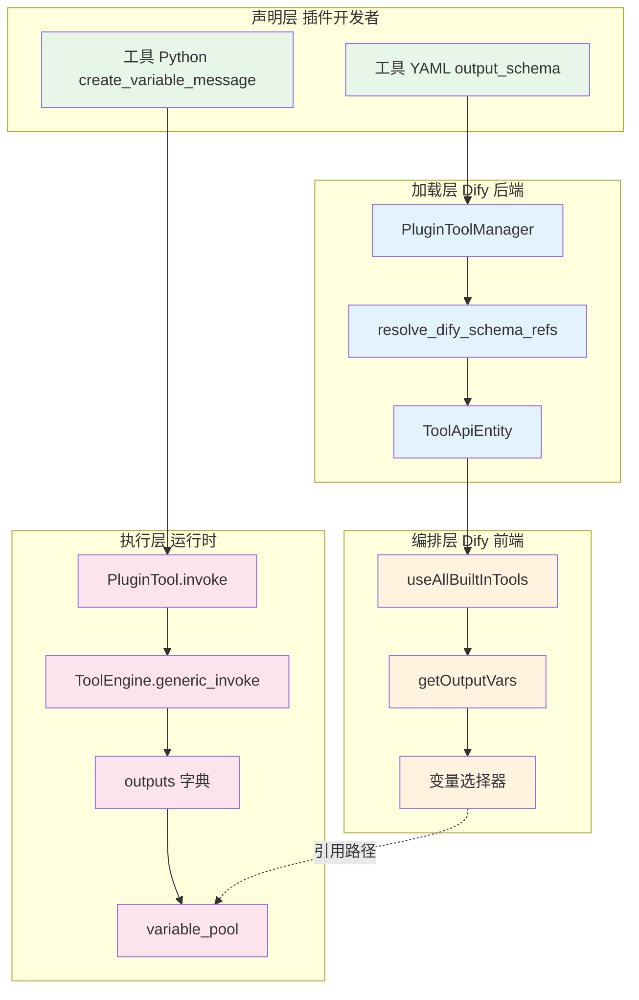

上图涵盖 output_schema 从声明到 UI 再到运行时的完整路径。虚线表示编排层通过 value_selector 引用执行层 variable_pool 中的值，两者之间无 schema 校验。

---

## 附录 C  源码文件速查索引

| 层级 | 文件 | 行数约 | 关键词 |
|------|------|--------|--------|
| 模型 | tool_entities.py | 530 | ToolEntity VariableMessage |
| 模型 | api_entities.py | 160 | ToolApiEntity |
| 加载 | plugin impl tool.py | 230 | fetch_tool_providers invoke |
| 解析 | schemas resolver.py | 400 | resolve_dify_schema_refs |
| 转换 | tools_transform_service.py | 530 | convert_tool_entity_to_api_entity |
| 管理 | tool_manager.py | 1050 | list_plugin_providers |
| 执行 | tool_engine.py | 380 | generic_invoke agent_invoke |
| 适配 | node_runtime.py | 770 | DifyToolNodeRuntime |
| 控制器 | tool_providers.py | 1220 | REST 入口 |
| 调试 | workflow_node_output_inspector.py | 410 | node-outputs |
| 前端 | tool default.ts | 130 | getOutputVars |
| 前端 | output-schema-utils.ts | 130 | resolveVarType |
| 前端 | constants.ts | 300 | TOOL_OUTPUT_STRUCT |
| 前端 | use-tools.ts | 360 | useAllBuiltInTools |

---

> **文档版本**：v1.0  
> **字符统计说明**：本文聚焦源码链路、接口契约与改造评估，实验过程与业务场景详见前置四篇文档。  
> **审阅提示**：请确认篇幅是否满足 8000 中文字符要求，审阅通过后可根据需要补充 graphon 包内 ToolNode 反编译细节或更多接口 curl 实例。

---
