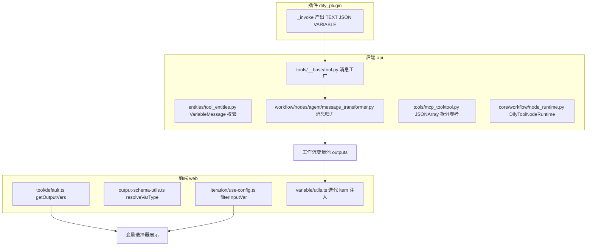
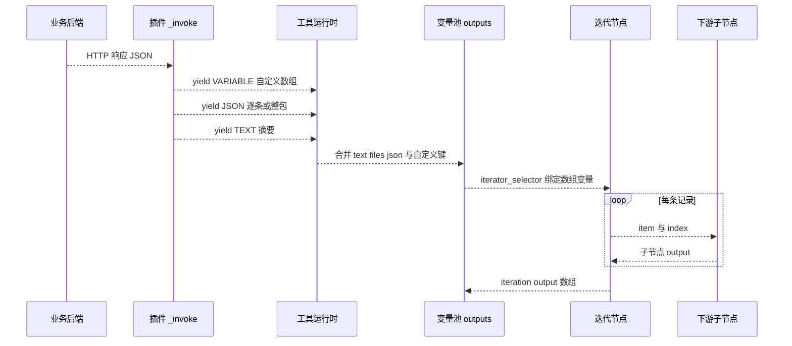
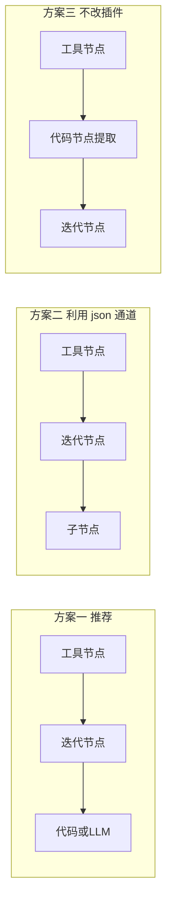
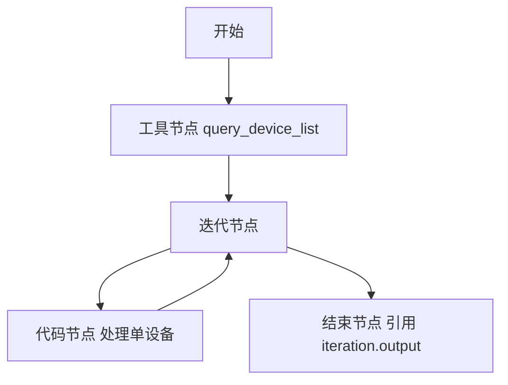
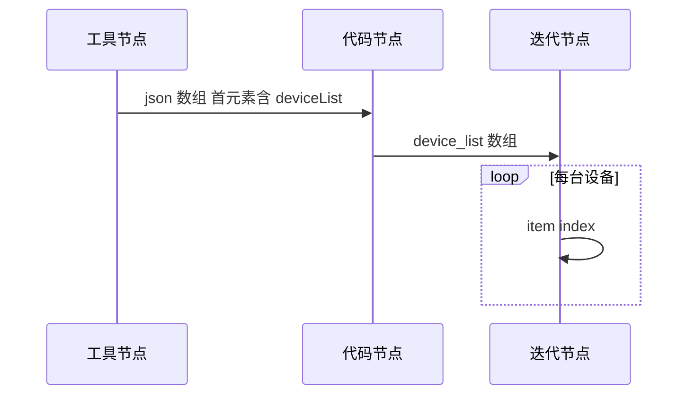
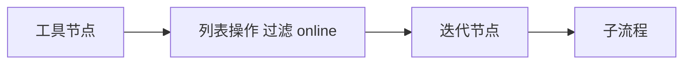
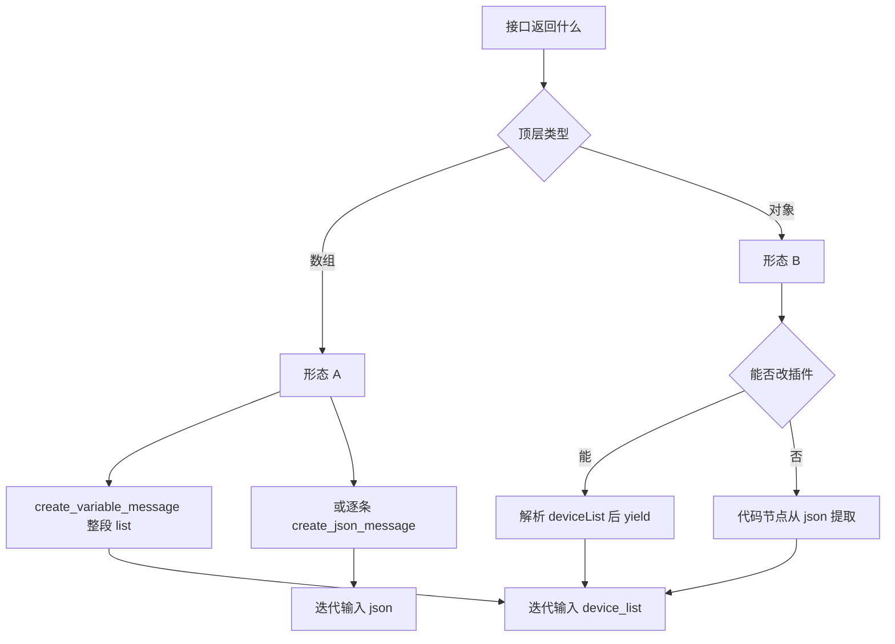

# Dify 工具节点输出参数：JSONArray 类型源码初步分析与方案指导

> 文档版本：2026-06-10  
> 适用环境：Dify v1.13.x 开源源码（本仓库 `api/` + `web/`）  
> 文档性质：**源码初步分析 + 可验证方案指导**（非已验收的实战报告）  
> 前置阅读：[20260608-1380-dify工具节点输出参数-自定义提取扁平化方案.md](./20260608-1380-dify工具节点输出参数-自定义提取扁平化方案.md)

---

## 一、背景与问题定义

### 1.1 已验证的 JSONObject 扁平化方案回顾

在 IoT 设备资产汇总场景中，后端接口返回的是 **JSONObject 包裹 JSONArray** 的嵌套结构：

```json
{
  "appInfo": { "appId": "iot-device-manager-v1", "appName": "IoT设备管理平台" },
  "deviceList": [
    { "deviceId": "device_001", "deviceName": "客厅温度传感器", "status": "online" },
    { "deviceId": "device_002", "deviceName": "卧室智能灯泡", "status": "online" }
  ],
  "totalDevices": 2,
  "onlineCount": 2,
  "offlineCount": 0
}
```

通过插件 `output_schema` 声明 + `create_variable_message` 产出，已成功将 **第一个设备** 和 **统计字段** 扁平化为顶层变量，下游结束节点可直接引用 `device_id`、`total_devices` 等。

### 1.2 本文要回答的新问题

当业务接口的数据形态变为以下两种之一时，工作流应如何设计？

| 形态 | 示例 | 典型诉求 |
|------|------|----------|
| **形态 A** | 顶层就是 JSONArray | 接口直接返回设备列表 `[{...},{...}]` |
| **形态 B** | JSONObject 内含 JSONArray | 已有 `deviceList` 字段，需 **遍历全部设备** 而非只取第一条 |

核心疑问汇总：

1. JSONArray 是否也要在插件里写循环，再配合 `output_schema` 提取？
2. 是否必须引入 **变量聚合器** 等组合节点？
3. 能否实现 **工具节点返回数组 → 下游直接引用 → 迭代节点循环处理** 的简洁链路？

本文基于 **当前仓库源码** 给出机制说明、流程图、接口文档与三套可验证方案，供后续实验对照。

---

## 二、整体架构：从插件到变量池

### 2.1 参与模块一览



### 2.2 数据流总览



**关键结论（先给出，后文逐条举证）：**

- `create_variable_message` **允许 list 类型**，可直接产出 `array[object]` 自定义变量。
- 默认 `json` 输出类型固定为 `array[object]`，**每调用一次** `create_json_message` 向数组 **追加一个元素**。
- **迭代节点** 是工作流内置循环，**不需要** 变量聚合器来做 foreach。
- 迭代内 `item` 为 object 时，变量选择器 **不会自动展开子字段**，循环体内访问字段通常需 **代码节点**。

---

## 三、源码深度分析

### 3.1 消息工厂：三种产出通道

插件工具继承 `dify_plugin.Tool`，底层与 Dify 核心 `api/core/tools/__base/tool.py` 的消息结构一致。

#### 3.1.1 create_json_message

```270:277:api/core/tools/__base/tool.py
    def create_json_message(self, object: dict[str, Any], suppress_output: bool = False) -> ToolInvokeMessage:
        """
        create a json message
        """
        return ToolInvokeMessage(
            type=ToolInvokeMessage.MessageType.JSON,
            message=ToolInvokeMessage.JsonMessage(json_object=object, suppress_output=suppress_output),
        )
```

`JsonMessage` 的类型定义允许 **dict 或 list**：

```151:153:api/core/tools/entities/tool_entities.py
    class JsonMessage(BaseModel):
        json_object: dict[str, Any] | list[Any]
        suppress_output: bool = Field(default=False, description="Whether to suppress JSON output in result string")
```

**含义：** 技术上可以把整个 JSONArray 传给 `create_json_message`，但归并逻辑是 **整包 append 一次**（见 3.3 节），会导致 `json` 输出变成 **套娃数组** `[ [ elem1, elem2 ] ]`，不适合直接接迭代节点。

#### 3.1.2 create_variable_message

```279:290:api/core/tools/__base/tool.py
    def create_variable_message(
        self, variable_name: str, variable_value: Any, stream: bool = False
    ) -> ToolInvokeMessage:
        return ToolInvokeMessage(
            type=ToolInvokeMessage.MessageType.VARIABLE,
            message=ToolInvokeMessage.VariableMessage(
                variable_name=variable_name, variable_value=variable_value, stream=stream
            ),
        )
```

`VariableMessage` 校验规则（源码硬性约束）：

```175:205:api/core/tools/entities/tool_entities.py
    class VariableMessage(BaseModel):
        variable_name: str
        variable_value: Any
        stream: bool = Field(default=False)

        @model_validator(mode="before")
        @classmethod
        def transform_variable_value(cls, values):
            """
            Only basic types, lists, and None are allowed.
            """
            value = values.get("variable_value")
            if value is not None and not isinstance(value, dict | list | str | int | float | bool):
                raise ValueError("Only basic types, lists, and None are allowed.")
            ...

        @field_validator("variable_name", mode="before")
        @classmethod
        def transform_variable_name(cls, value: str) -> str:
            if value in {"json", "text", "files"}:
                raise ValueError(f"The variable name '{value}' is reserved.")
            return value
```

单元测试 `api/tests/unit_tests/core/tools/workflow_as_tool/test_tool.py` 已覆盖 `list_var: [1, 2, 3]` 合法场景。

**对 JSONArray 的直接意义：** 可以把 `deviceList` 整段 list 作为 **一个** 自定义变量产出，无需在插件里拆成 N 个标量字段。

#### 3.1.3 默认三输出结构（前端常量）

```204:217:web/app/components/workflow/constants.ts
export const TOOL_OUTPUT_STRUCT: Var[] = [
  { variable: 'text', type: VarType.string },
  { variable: 'files', type: VarType.arrayFile },
  { variable: 'json', type: VarType.arrayObject },
]
```

无论是否配置 `output_schema`，这三项 **始终存在**，自定义字段是 **追加的顶层键**。

---

### 3.2 output_schema 与前端变量类型解析

#### 3.2.1 工具节点 getOutputVars

`web/app/components/workflow/nodes/tool/default.ts` 读取插件声明的 `output_schema.properties`，调用 `resolveVarType` 映射为 Dify 内部 `VarType`：

```70:123:web/app/components/workflow/nodes/tool/default.ts
  getOutputVars(...) {
    ...
    const output_schema = currTool?.output_schema
    if (!output_schema || !output_schema.properties) {
      res = TOOL_OUTPUT_STRUCT
    } else {
      Object.keys(output_schema.properties).forEach((outputKey) => {
        const { type, schemaType } = resolveVarType(output, schemaTypeDefinitions)
        outputSchema.push({
          variable: outputKey,
          type,
          children: output.type === 'object' ? { schema: {...} } : undefined,
        })
      })
      res = [ ...TOOL_OUTPUT_STRUCT, ...outputSchema ]
    }
    return res
  }
```

**注意：** 仅 `type === 'object'` 的字段会挂载 `children` schema；**array 类型字段不会在工具节点层级展开 items 子属性**。

#### 3.2.2 resolveVarType 对 array 的处理

`web/app/components/workflow/nodes/tool/output-schema-utils.ts` 支持两种写法：

1. 标准 JSON Schema：`{ type: 'array', items: { type: 'object' } }`
2. Dify 紧凑写法：`{ type: 'array[object]' }`（工作流即工具等内部 API 使用）

核心逻辑：

```102:127:web/app/components/workflow/nodes/tool/output-schema-utils.ts
    case 'array': {
      const itemSchema = pickItemSchema(schema)
      ...
      switch (itemType) {
        case VarType.object:
          return { type: VarType.arrayObject, schemaType: resolvedSchemaType }
        ...
      }
    }
```

**对 JSONArray 方案的意义：** YAML 中声明 `device_list` 为 `array` + `items.object` 后，前端变量选择器展示类型为 `array[object]`，迭代节点输入过滤器可识别。

#### 3.2.3 output_schema 只管展示、不管产出

`ToolEntity.output_schema` 在后端仅为元数据字段：

```411:429:api/core/tools/entities/tool_entities.py
class ToolEntity(BaseModel):
    ...
    output_schema: Mapping[str, object] = Field(default_factory=dict)
    ...
    @field_validator("output_schema", mode="before")
    def _normalize_output_schema(cls, value):
        return value or {}
```

若 YAML 声明了 `device_list` 但 `_invoke` 未 `yield create_variable_message("device_list", ...)`，前端仍展示该变量，**运行时值为空**。验证必须以单节点 run 的 `outputs` 为准。

---

### 3.3 运行时消息归并：json 数组如何形成

工具节点与 Agent 节点共用类似的消息处理逻辑。以 `api/core/workflow/nodes/agent/message_transformer.py` 为例（Tool 节点在 `graphon` 包中有等价实现，本仓库 `api/pyproject.toml` 依赖 `graphon==0.4.0`）：

**JSON 消息 — 逐条 append：**

```134:149:api/core/workflow/nodes/agent/message_transformer.py
            elif message.type == ToolInvokeMessage.MessageType.JSON:
                ...
                if message.message.json_object:
                    json_list.append(message.message.json_object)
```

**VARIABLE 消息 — 写入 variables 字典：**

```159:181:api/core/workflow/nodes/agent/message_transformer.py
            elif message.type == ToolInvokeMessage.MessageType.VARIABLE:
                variable_name = message.message.variable_name
                variable_value = message.message.variable_value
                ...
                else:
                    variables[variable_name] = variable_value
```

**最终 outputs 结构：**

```284:292:api/core/workflow/nodes/agent/message_transformer.py
        yield StreamCompletedEvent(
            node_run_result=NodeRunResult(
                outputs={
                    "text": text,
                    "files": ArrayFileSegment(value=files),
                    "json": json_output,
                    **variables,
                },
```

**三种产出方式对比表：**

| 插件写法 | outputs.json 结果 | outputs 自定义键 |
|----------|-------------------|------------------|
| 一次 `create_json_message(whole_dict)` | `[ whole_dict ]` 一个元素 | 无 |
| 一次 `create_json_message(device_array)` | `[ device_array ]` 套娃 | 无 |
| 循环 `create_json_message(item)` N 次 | `[ item1, item2, ... ]` N 个元素 | 无 |
| 一次 `create_variable_message("device_list", arr)` | 取决于是否另有 json 消息 | `device_list: arr` |

---

### 3.4 MCP 工具：JSONArray 拆分的官方参考实现

开源仓库中，**唯一内建**对「顶层 JSONArray 响应」做专门处理的是 MCP 工具：

```112:131:api/core/tools/mcp_tool/tool.py
    def _process_json_content(self, content_json: Any) -> Generator[ToolInvokeMessage, None, None]:
        if isinstance(content_json, dict):
            yield self.create_json_message(content_json)
        elif isinstance(content_json, list):
            yield from self._process_json_list(content_json)

    def _process_json_list(self, json_list: list) -> Generator[ToolInvokeMessage, None, None]:
        if any(not isinstance(item, dict) for item in json_list):
            yield self.create_text_message(str(json_list))
            return
        for item in json_list:
            yield self.create_json_message(item)
```

单元测试 `api/tests/unit_tests/core/tools/test_mcp_tool.py` 断言：输入 `[{"k":1},{"k":2}]` 产出 **两条** JSON 消息。

**插件作者可照搬此模式：** 顶层 JSONArray 且元素均为 object 时，逐条 `create_json_message`，使默认 `json` 通道变为「可直接迭代的数组」。

### 3.5 自定义 OpenAPI 工具：JSONArray 的缺口

`api/core/tools/custom_tool/tool.py` 在 `_invoke` 中 **仅对 dict 类型** 调用 `create_json_message`：

```397:405:api/core/tools/custom_tool/tool.py
        if parsed_response.is_json:
            if isinstance(parsed_response.content, dict):
                yield self.create_json_message(parsed_response.content)
            yield self.create_text_message(response.text)
```

若 OpenAPI 工具接口返回顶层 JSONArray，**不会**进入 json 通道，只有 text。** JSONArray 场景建议使用 Python 插件工具**，而非指望自定义 OpenAPI 工具自动处理。

---

### 3.6 迭代节点：工作流内置循环

#### 3.6.1 输入类型过滤

```38:40:web/app/components/workflow/nodes/iteration/use-config.ts
  const filterInputVar = useCallback((varPayload: Var) => {
    return [VarType.array, VarType.arrayString, VarType.arrayBoolean, VarType.arrayNumber, VarType.arrayObject, VarType.arrayFile].includes(varPayload.type)
  }, [])
```

工具节点的 `device_list`（arrayObject）或 `json`（arrayObject）均可作为迭代输入。

#### 3.6.2 循环内变量注入

```1224:1261:web/app/components/workflow/nodes/_base/components/variable/utils.ts
  if (isInIteration) {
    const itemType = getVarType({ ..., isIterationItem: true, valueSelector: iterationNode?.data.iterator_selector })
    const itemChildren = itemType === VarType.file ? { children: [...] } : {}
    const iterationVar = {
      vars: [
        { variable: 'item', type: itemType, ...itemChildren },
        { variable: 'index', type: VarType.number },
      ],
    }
    beforeNodesOutputVars.unshift(iterationVar)
  }
```

**边界：** 仅 `file` 类型的 item 有 children 子字段；**object 类型 item 不会自动展开 deviceId 等属性**。循环体内要用代码节点读取 `item["deviceId"]`，或在插件侧预扁平化。

#### 3.6.3 迭代节点数据结构

`web/app/components/workflow/nodes/iteration/types.ts`：

| 字段 | 含义 |
|------|------|
| `iterator_selector` | 输入数组变量路径，如 `[toolNodeId, device_list]` |
| `output_selector` | 循环体内某节点输出，汇总为迭代 output |
| `output_type` | 汇总后的数组类型 |
| `is_parallel` | 是否并行执行 |
| `flatten_output` | 若子输出均为 list 是否压平 |

---

## 四、业务接口文档（实验用）

以下接口用于后续方案验证，与 IoT 演示项目保持一致。实际路径可按你的 Spring Boot 项目调整。

### 4.1 接口一：资产汇总 JSONObject 含 deviceList

**用途：** 验证形态 B — 从嵌套结构提取数组后迭代。

| 项目 | 说明 |
|------|------|
| 方法 | GET |
| 路径 | `/api/devices/asset-summary` |
| 认证 | Header `Authorization: Bearer {api_token}` 可选 |
| 请求体 | 无 |

**响应 200 示例：**

```json
{
  "appInfo": {
    "appId": "iot-device-manager-v1",
    "appName": "IoT设备管理平台",
    "appVersion": "1.0.0",
    "appFactory": "YourCompany"
  },
  "deviceList": [
    {
      "deviceId": "device_001",
      "deviceName": "客厅温度传感器",
      "deviceType": "temperature_sensor",
      "location": "客厅",
      "status": "online"
    },
    {
      "deviceId": "device_002",
      "deviceName": "卧室智能灯泡",
      "deviceType": "smart_light",
      "location": "卧室",
      "status": "online"
    }
  ],
  "totalDevices": 2,
  "onlineCount": 2,
  "offlineCount": 0
}
```

**响应字段说明：**

| 字段 | 类型 | 说明 |
|------|------|------|
| appInfo | object | 应用元信息 |
| deviceList | array | 设备摘要列表，**迭代的数据源** |
| totalDevices | number | 设备总数 |
| onlineCount | number | 在线数 |
| offlineCount | number | 离线数 |

---

### 4.2 接口二：纯设备列表 JSONArray

**用途：** 验证形态 A — 顶层即为数组。

| 项目 | 说明 |
|------|------|
| 方法 | GET |
| 路径 | `/api/devices/list-brief` |
| 认证 | 同上 |
| 请求体 | 无 |

**响应 200 示例：**

```json
[
  {
    "deviceId": "device_001",
    "deviceName": "客厅温度传感器",
    "deviceType": "temperature_sensor",
    "location": "客厅",
    "status": "online"
  },
  {
    "deviceId": "device_002",
    "deviceName": "卧室智能灯泡",
    "deviceType": "smart_light",
    "location": "卧室",
    "status": "online"
  }
]
```

**响应说明：** _body 即为 `array[object]`，无外层包装。

---

### 4.3 Dify 控制台 API：单节点运行工具节点

**用途：** 验证插件 outputs 是否符合预期（**唯一可信依据**）。

| 项目 | 说明 |
|------|------|
| 方法 | POST |
| 路径 | `/console/api/apps/{app_id}/workflows/draft/nodes/{node_id}/run` |
| 源码 | `api/controllers/console/app/workflow.py` → `DraftWorkflowNodeRunApi` |

**请求 Header：**

| Header | 必填 | 说明 |
|--------|------|------|
| Authorization | 是 | Bearer 控制台 Token |
| x-csrf-token | 是 | CSRF |
| Content-Type | application/json | |

**请求 Body：**

```json
{
  "inputs": {}
}
```

**响应关键字段（WorkflowRunNodeExecutionResponse）：**

| 字段 | 说明 |
|------|------|
| status | 运行状态 succeeded / failed |
| outputs | **核心验证对象**，含 text files json 及自定义键 |
| error | 失败原因 |

**期望 outputs 示例（方案一 device_list）：**

```json
{
  "text": "共 2 台设备",
  "files": [],
  "json": [{ "devices": [ "..."] }],
  "device_list": [
    { "deviceId": "device_001", "deviceName": "客厅温度传感器", "status": "online" },
    { "deviceId": "device_002", "deviceName": "卧室智能灯泡", "status": "online" }
  ],
  "total_devices": 2
}
```

---

### 4.4 Dify 控制台 API：查询工具 output_schema

| 项目 | 说明 |
|------|------|
| 方法 | GET |
| 路径 | `/console/api/workspaces/current/tools/builtin` |
| 用途 | 确认插件安装后 `output_schema.properties` 含 device_list |

---

### 4.5 Dify 控制台 API：迭代节点单跑

| 项目 | 说明 |
|------|------|
| 方法 | POST |
| 路径 | `/console/api/apps/{app_id}/workflows/draft/iteration/nodes/{node_id}/run` |
| 源码 | `WorkflowDraftRunIterationNodeApi` |

**请求 Body 需包含迭代输入**，具体字段见 `IterationNodeRunPayload`（`api/controllers/console/app/workflow.py`）。

---

## 五、三套可验证方案

### 5.1 方案对比总览



| 方案 | 插件改动 | 迭代输入变量 | 适用形态 | 复杂度 |
|------|----------|--------------|----------|--------|
| 一 自定义 array 变量 | output_schema + create_variable_message | tool.device_list | A 和 B | 低 |
| 二 逐条 create_json_message | 仅 Python 循环 | tool.json | A 为主 | 低 |
| 三 代码节点中转 | 无 | code.device_list | B 且不能改插件 | 中 |

**不需要变量聚合器。** 聚合器用于合并多分支输出，与 foreach 无关。

---

### 5.2 方案一：create_variable_message 产出 array（推荐）

#### 5.2.1 插件 YAML 片段

```yaml
output_schema:
  type: object
  properties:
    device_list:
      type: array
      description: 设备列表供迭代节点使用
      items:
        type: object
        properties:
          deviceId:
            type: string
          deviceName:
            type: string
          status:
            type: string
    total_devices:
      type: number
      description: 设备总数
```

#### 5.2.2 插件 Python 片段

**形态 A 顶层 JSONArray：**

```python
devices = response.json()  # list
yield self.create_variable_message("device_list", devices)
yield self.create_variable_message("total_devices", len(devices))
yield self.create_text_message(f"共 {len(devices)} 台设备")
yield self.create_json_message({"source": "list-brief", "count": len(devices)})
```

**形态 B 嵌套 deviceList：**

```python
raw = response.json()
device_list = raw.get("deviceList", [])
yield self.create_variable_message("device_list", device_list)
yield self.create_variable_message("total_devices", raw.get("totalDevices", len(device_list)))
# 可选保留扁平标量供非迭代场景
yield self.create_variable_message("app_id", raw.get("appInfo", {}).get("appId", ""))
yield self.create_text_message(f"共 {len(device_list)} 台设备")
yield self.create_json_message(raw)
```

#### 5.2.3 工作流拓扑



**迭代节点配置：**

| 配置项 | 值 |
|--------|-----|
| 输入 iterator_selector | `[工具节点ID, device_list]` |
| 输出 output_selector | `[代码节点ID, result]` 或模板节点 output |

**循环内代码节点示例：**

```python
def main(item: dict) -> dict:
    return {
        "device_id": item.get("deviceId", ""),
        "device_name": item.get("deviceName", ""),
        "status": item.get("status", ""),
        "summary": f"{item.get('deviceName')} 当前 {item.get('status')}",
    }
```

输入绑定：当前迭代的 `item`（object 类型）。

---

### 5.3 方案二：逐条 create_json_message 驱动 json 通道

参考 MCP 工具 `_process_json_list` 模式：

```python
devices = response.json()
if not isinstance(devices, list):
    yield self.create_text_message("响应不是数组")
    return
for device in devices:
    if isinstance(device, dict):
        yield self.create_json_message(device)
yield self.create_text_message(f"共 {len(devices)} 台设备")
```

**工作流：** 迭代节点输入选 `[工具节点ID, json]`，无需在 output_schema 声明 device_list。

**风险：** 若同时 `create_json_message(raw)` 整包对象，json 数组第一个元素可能是 **完整 JSONObject** 而非单设备，迭代第一条会异常。此方案应 **避免** 再 yield 整包 json，或仅 yield 逐条。

---

### 5.4 方案三：不改插件，代码节点提取



**代码节点：**

```python
def main(tool_json: list) -> dict:
    if not tool_json:
        return {"device_list": []}
    root = tool_json[0]
    if isinstance(root, list):
        return {"device_list": root}
    return {"device_list": root.get("deviceList", [])}
```

**代码节点 outputs 声明：**

```yaml
outputs:
  device_list:
    type: array[object]
```

迭代输入：`[代码节点ID, device_list]`。

---

## 六、验证步骤清单

### 6.1 插件层验证

| 步骤 | 操作 | 通过标准 |
|------|------|----------|
| 1 | 打包安装新版插件 | 工具列表可见新工具或新版本 |
| 2 | GET builtin tools API | output_schema.properties 含 device_list |
| 3 | 刷新工作流编辑器 | 工具节点输出区出现 device_list arrayObject |
| 4 | 单节点 run 工具 | outputs.device_list 为非空数组 |
| 5 | 对比 YAML 键名与 Python yield 名 | 完全一致 |

### 6.2 工作流层验证

| 步骤 | 操作 | 通过标准 |
|------|------|----------|
| 6 | 工具 → 迭代 → 代码 → 结束 | 全链路 succeeded |
| 7 | 迭代 output 长度 | 等于 device_list 元素个数 |
| 8 | 结束节点输出 | 为 array 且每项含 device_id |
| 9 | 并行模式 is_parallel true | 多条同时执行无报错 |
| 10 | 空列表边界 | device_list 为空时迭代不执行或按 error_handle_mode 处理 |

### 6.3 对照实验

建议同时保留 **方案一** 与 **方案三** 两条工作流，用同一后端接口跑批，对比 outputs 与结束节点结果是否一致。

---

## 七、注意事项与踩坑记录

### 7.1 json 通道套娃问题

对顶层 JSONArray 调用 **一次** `create_json_message(entire_list)` 时，outputs.json 为 `[[ elem1, elem2 ]]`。迭代节点按 **外层** 数组循环，仅 1 次，item 为内层整个 list，**不是** 单设备 object。

**正确做法：** 方案一 whole list 走 VARIABLE；或方案二逐条 JSON。

### 7.2 保留变量名

`text`、`files`、`json` 禁止作为 create_variable_message 的第一个参数，否则运行时 `ValueError: The variable name 'json' is reserved.`。

### 7.3 output_schema 不校验运行时

声明了 device_list 但未 yield，前端仍展示，值为空。以单节点 run outputs 为准。

### 7.4 迭代内 object 字段不可点选

item 类型为 object 时，变量选择器不提供 deviceId 子路径。循环体内用代码节点解析 dict，或模板仅绑定整个 item。

### 7.5 json 与自定义变量并存

默认 json 始终存在。create_json_message 与 create_variable_message 可同时使用；注意 json 数组内容与 device_list 是否重复、是否一致。

### 7.6 Agent 应用不可见 VARIABLE

`create_variable_message` 产出在 Agent 对话中 **不会** 进入 LLM 上下文（tool_engine 跳过 VARIABLE）。Agent 场景需 text 或 json 文本通道。

### 7.7 自定义 OpenAPI 工具 JSONArray 限制

见 3.5 节，顶层数组不会自动 json 化。JSONArray 优先 Python 插件。

### 7.8 插件升级后刷新页面

安装新插件后需重新打开工作流，否则 output_schema 缓存旧版本。

### 7.9 数组元素含非 object 类型

MCP 逻辑：若 list 中任一元素非 dict，**整段** 降级为 text。插件若需混合类型数组，应走 create_variable_message 而非逐条 json。

### 7.10 flatten_output 开关

迭代节点 `flatten_output` 默认为 true（`iteration/default.ts`）。当循环体 output 本身也是 list 时，行为不同，实验时关注此开关。

---

## 八、与 JSONObject 扁平化方案的关系

| 维度 | 1380 文档方案 | 本文 JSONArray 方案 |
|------|---------------|---------------------|
| 目标 | 下游直接引用单个 app_id device_id | 下游 **遍历** 全部设备 |
| 产出 | 12 个标量顶层键 | 1 个 array 顶层键 device_list |
| 是否需要迭代 | 否 | **是** |
| 插件循环 | 仅解析取第一条 | 整段 list 一次 yield 或逐条 json |
| 下游引用路径 | 工具节点.device_id | 迭代.item → 代码节点字段 |

两套方案 **可共存于同一工具**：既产出 total_devices 等标量，又产出 device_list 供迭代。

---

## 九、关联源码文件索引

| 路径 | 职责 |
|------|------|
| `api/core/tools/__base/tool.py` | create_text/json/variable_message 工厂 |
| `api/core/tools/entities/tool_entities.py` | ToolInvokeMessage VariableMessage 校验 |
| `api/core/tools/mcp_tool/tool.py` | JSONArray 拆分参考实现 |
| `api/core/tools/custom_tool/tool.py` | OpenAPI 工具仅 dict 走 json |
| `api/core/tools/tool_engine.py` | Agent 文本转换跳过 VARIABLE |
| `api/core/workflow/nodes/agent/message_transformer.py` | json_list 与 variables 归并 |
| `api/core/workflow/node_runtime.py` | DifyToolNodeRuntime 工具运行时适配 |
| `api/controllers/console/app/workflow.py` | 单节点 run API |
| `web/app/components/workflow/constants.ts` | TOOL_OUTPUT_STRUCT 默认三输出 |
| `web/app/components/workflow/nodes/tool/default.ts` | getOutputVars |
| `web/app/components/workflow/nodes/tool/output-schema-utils.ts` | resolveVarType array 解析 |
| `web/app/components/workflow/nodes/iteration/use-config.ts` | 迭代输入类型过滤 |
| `web/app/components/workflow/nodes/iteration/types.ts` | 迭代节点数据结构 |
| `web/app/components/workflow/nodes/_base/components/variable/utils.ts` | 迭代 item index 注入 |
| `api/tests/unit_tests/core/tools/test_mcp_tool.py` | JSONArray 拆分测试 |
| `api/tests/unit_tests/core/tools/workflow_as_tool/test_tool.py` | list 类型 variable 测试 |
| `api/tests/fixtures/workflow/array_iteration_formatting_workflow.yml` | 迭代工作流 fixture |

---

## 十、后续实验建议

1. **新增后端接口** `/api/devices/list-brief` 返回形态 A 纯数组，与现有 asset-summary 对照。
2. **新建插件工具** `query_device_list`，实现方案一 YAML + Python。
3. **搭建工作流** 开始 → 工具 → 迭代 → 代码 → 结束，记录各节点 outputs 截图与 JSON。
4. **对照组** 方案三代码节点中转，确认与方案一 end 输出一致。
5. **边界测试** 空数组、单元素、含 offline 混合状态。
6. 实验通过后，将本文档升级为「实战验收报告」，补充真实 node_id 与 curl 完整示例。

---

## 十一、总结

1. Dify 工具节点 **原生支持** 通过 `create_variable_message` 产出 **list 类型** 自定义变量，配合 `output_schema` 的 array 声明，前端展示为 `array[object]`。
2. 默认 `json` 输出是 **消息级 append** 的数组；JSONArray 要么 **整段走 VARIABLE**，要么 **学 MCP 逐条 create_json_message**。
3. 工作流循环应使用 **迭代节点**，无需变量聚合器；循环内访问 object 字段推荐 **代码节点**。
4. 验证必须走 **单节点 run API** 查看 outputs，output_schema 仅为 UI 元数据。
5. 本文三套方案均可直接在现有 IoT 插件上演练，建议优先验证 **方案一**。

---

## 十二、DifyToolNodeRuntime 调用链补充

工具节点在工作流引擎中的执行入口位于 `api/core/workflow/node_runtime.py` 的 `DifyToolNodeRuntime`。该类是 Dify 对 `graphon` 包中 Tool 节点运行时的适配层，负责把控制台侧的租户、应用、用户上下文注入到 `ToolManager`。

### 12.1 运行时获取

```395:439:api/core/workflow/node_runtime.py
    def get_runtime(self, *, node_id, node_data, variable_pool, node_execution_id=None):
        tool_runtime = ToolManager.get_workflow_tool_runtime(
            self._run_context.tenant_id,
            self._run_context.app_id,
            node_id,
            self._build_tool_runtime_spec(node_data),
            self._run_context.user_id,
            self._run_context.invoke_from,
            variable_pool,
        )
        ...
        return ToolRuntimeHandle(raw=_WorkflowToolRuntimeBinding(tool=tool_runtime, ...))
```

**说明：** `node_data` 类型为 `graphon.nodes.tool.entities.ToolNodeData`，包含 `provider_id`、`tool_name`、`tool_parameters` 等画布配置，与插件 YAML 中的工具 identity 通过 `ToolManager` 关联。

### 12.2 工具调用与消息转换

```452:491:api/core/workflow/node_runtime.py
    def invoke(self, *, tool_runtime, tool_parameters, workflow_call_depth, provider_name):
        ...
        messages = ToolEngine.generic_invoke(
            tool=tool,
            tool_parameters=dict(tool_parameters),
            user_id=self._run_context.user_id,
            workflow_tool_callback=callback,
            ...
        )
        transformed_messages = ToolFileMessageTransformer.transform_tool_invoke_messages(...)
        return self._adapt_messages(transformed_messages, provider_name=provider_name)
```

调用顺序为：

1. `ToolEngine.generic_invoke` 执行插件 `_invoke` 生成器，收集 `ToolInvokeMessage` 流。
2. `ToolFileMessageTransformer` 处理文件类消息的上传与 URL 转换。
3. `_adapt_messages` 将核心 `ToolInvokeMessage` 转为 `graphon` 侧的 `ToolRuntimeMessage`，供图引擎写入变量池。

### 12.3 VARIABLE 消息在 Agent 文本通道中被忽略

若工具同时用于 Agent 应用，`api/core/tools/tool_engine.py` 的 `_convert_tool_response_to_str` 在拼接 LLM 可见文本时 **跳过** VARIABLE 类型：

```266:267:api/core/tools/tool_engine.py
            elif response.type == ToolInvokeMessage.MessageType.VARIABLE:
                continue
```

这再次印证：**工作流** 与 **Agent** 对工具输出的消费路径不同。JSONArray 方案针对工作流编排，不解决 Agent 内结构化遍历问题。

### 12.4 graphon 依赖说明

`api/pyproject.toml` 声明 `graphon==0.4.0`。Tool 节点与 Iteration 节点的 `_run` 实现在 graphon 包内，本仓库通过 `DifyToolNodeRuntime` 和 `node_factory.py` 注入 Dify 特有依赖。阅读源码时若需追踪「变量池 Segment 类型如何落盘」，需在已安装 graphon 的 Python 环境中查看 `graphon.nodes.tool.node` 与 `graphon.nodes.iteration.iteration_node`，逻辑与 `message_transformer.py` 展示的 outputs 合并规则一致。

---

## 十三、完整 curl 验证示例

以下命令中的 `HOST`、`APP_ID`、`NODE_ID`、`TOKEN`、`CSRF` 需替换为实验环境真实值。

### 13.1 查询插件工具 output_schema

```bash
curl -s "http://HOST/console/api/workspaces/current/tools/builtin" \
  -H "Authorization: Bearer TOKEN" \
  -H "x-csrf-token: CSRF" \
  | jq '.[] | select(.name | contains("iot")) | .tools[] | select(.name=="query_device_list") | .output_schema'
```

**期望：** `properties.device_list.type` 为 `array`，且 `items.type` 为 `object`。

### 13.2 单节点运行工具

```bash
curl -s -X POST "http://HOST/console/api/apps/APP_ID/workflows/draft/nodes/TOOL_NODE_ID/run" \
  -H "Content-Type: application/json" \
  -H "Authorization: Bearer TOKEN" \
  -H "x-csrf-token: CSRF" \
  -d "{\"inputs\": {}}"
```

**期望 outputs 片段：**

```json
{
  "device_list": [
    { "deviceId": "device_001", "deviceName": "客厅温度传感器", "status": "online" }
  ],
  "total_devices": 2,
  "text": "共 2 台设备",
  "json": []
}
```

### 13.3 查询代码节点上次运行结果

```bash
curl -s "http://HOST/console/api/apps/APP_ID/workflows/draft/nodes/CODE_NODE_ID/last-run" \
  -H "Authorization: Bearer TOKEN" \
  -H "x-csrf-token: CSRF"
```

用于确认迭代体内代码节点是否正确解析 `item`。

### 13.4 业务后端直连

```bash
curl -s "http://localhost:8080/api/devices/list-brief" \
  -H "Authorization: Bearer API_TOKEN"
```

用于在插件开发阶段独立于 Dify 验证 JSONArray 形态。

---

## 十四、错误场景与排查表

| 现象 | 根因（源码层） | 处理 |
|------|----------------|------|
| 迭代只跑 1 次且 item 是 list | 对 JSONArray 整包 create_json_message | 改方案一或方案二 |
| outputs 无 device_list | 未 yield VARIABLE 或变量名拼写不一致 | 对照 YAML 与 Python |
| ValueError reserved json | 自定义变量名用了保留字 | 改名 device_list |
| 变量选择器无 device_list | 插件未安装或页面未刷新 | 重装插件并刷新画布 |
| 迭代输入下拉无 tool 输出 | 类型不是 array 系列 | 检查 resolveVarType 结果 |
| 循环内无法选 deviceId | item 为 object 无 schema children | 循环内加代码节点 |
| OpenAPI 工具无 json 只有 text | custom_tool 不处理顶层 list | 换 Python 插件 |
| Agent 看不到 device_list | tool_engine 跳过 VARIABLE | 工作流外勿依赖 Agent |
| json 第一条是完整大对象 | 同时 yield 整包与逐条 | 去掉整包或分开工具 |
| 混合类型数组变 text | MCP 非 dict 元素降级逻辑 | 用 VARIABLE 承载 |

---

## 十五、deviceList 字段映射参考

从业务 JSON 到工作流变量的命名建议（方案一）：

| 业务 JSON 路径 | 建议 output_schema 键 | Python 取值 |
|----------------|----------------------|-------------|
| deviceList 整体 | device_list | raw.get("deviceList", []) |
| totalDevices | total_devices | raw.get("totalDevices", 0) |
| appInfo.appId | app_id | raw["appInfo"]["appId"] |
| deviceList[i].deviceId | 不单独声明 | 迭代内 item["deviceId"] |
| deviceList[i].deviceName | 不单独声明 | 迭代内 item["deviceName"] |
| deviceList[i].status | 不单独声明 | 迭代内 item["status"] |

**设计原则：** 需要 **遍历** 的集合用 **一个 array 变量** 承载；需要 **单点引用** 的标量继续扁平化。不必把数组每一项再拆成 device_id_0、device_id_1 等顶层键。

---

## 十六、列表操作节点与迭代的分工

`web/app/components/workflow/nodes/list-operator` 提供过滤、排序、截取、取首尾记录能力，测试见 `api/tests/unit_tests/core/workflow/nodes/list_operator/node_spec.py`。

| 节点 | 适用场景 |
|------|----------|
| 列表操作 | 迭代前缩小范围，如只保留 status 为 online 的设备 |
| 迭代 | 对每条记录执行子流程 |
| 代码节点 | 从 json[0] 提取嵌套数组或解析 item 字段 |
| 变量聚合器 | 合并并行分支结果，**不用于循环** |

典型组合：



列表操作输出 `result` 仍为 array，可接迭代输入。

---

## 十七、插件工具完整 YAML 模板（实验用）

```yaml
identity:
  name: query_device_list
  author: your-name
  label:
    en_US: Query Device List
    zh_Hans: 查询设备列表
description:
  human:
    zh_Hans: 查询设备列表并输出 array 变量供迭代节点使用
  llm: Query device list and return device_list array for workflow iteration.
parameters: []
output_schema:
  type: object
  properties:
    device_list:
      type: array
      description: 设备对象数组
      items:
        type: object
        properties:
          deviceId:
            type: string
          deviceName:
            type: string
          deviceType:
            type: string
          location:
            type: string
          status:
            type: string
    total_devices:
      type: number
      description: 设备数量
extra:
  python:
    source: tools/query_device_list.py
```

---

## 十八、插件 Python 完整模板（实验用）

```python
"""查询设备列表 — JSONArray 方案一实验工具"""
from collections.abc import Generator
from typing import Any

import requests
from dify_plugin import Tool
from dify_plugin.entities.tool import ToolInvokeMessage


class QueryDeviceListTool(Tool):
    def _invoke(
        self, tool_parameters: dict[str, Any]
    ) -> Generator[ToolInvokeMessage, None, None]:
        base_url = self.runtime.credentials.get("spring_service_url", "").rstrip("/")
        token = self.runtime.credentials.get("api_token", "")
        headers = {"Content-Type": "application/json"}
        if token:
            headers["Authorization"] = f"Bearer {token}"

        # 形态 A 纯数组接口
        url = f"{base_url}/api/devices/list-brief"
        # 形态 B 嵌套接口可改为 asset-summary 并解析 deviceList
        # url = f"{base_url}/api/devices/asset-summary"

        try:
            resp = requests.get(url, headers=headers, timeout=15)
            resp.raise_for_status()
            data = resp.json()
        except Exception as e:
            yield self.create_text_message(f"请求失败 {e}")
            return

        if isinstance(data, list):
            device_list = data
        elif isinstance(data, dict):
            device_list = data.get("deviceList", [])
        else:
            yield self.create_text_message("响应格式不支持")
            return

        yield self.create_variable_message("device_list", device_list)
        yield self.create_variable_message("total_devices", len(device_list))
        yield self.create_text_message(f"共 {len(device_list)} 台设备")

        # 可选 保留完整 json 通道供方案三对照
        if isinstance(data, dict):
            yield self.create_json_message(data)
        elif device_list:
            for item in device_list:
                if isinstance(item, dict):
                    yield self.create_json_message(item)
```

---

## 十九、工作流画布配置要点

### 19.1 工具节点

- 选择 `query_device_list` 工具
- 输出面板应显示 `device_list` 类型为 array object
- 单节点运行确认 outputs

### 19.2 迭代节点

| 配置 | 推荐值 |
|------|--------|
| 输入 | 工具节点 device_list |
| 并行 | 先 false 串行验证再开 true |
| 错误处理 | terminated 或 continue 按业务选 |
| flatten_output | 默认 true 一般无需改 |

### 19.3 迭代体内代码节点

- 输入变量 `item` 绑定当前迭代 item
- 输出声明 `result` 类型 string 或 object
- 迭代 output_selector 指向代码节点 result

### 19.4 结束节点

- 引用迭代节点 `output` 变量
- 类型应为 array string 或 array object

---

## 二十、形态 A 与形态 B 决策树



---

> **审阅说明：** 请确认本文档篇幅与细节是否满足你的「源码初步分析 + 方案指导」需求。当前正文汉字约四千字以上，含接口文档、流程图、时序图、源码引用、三套方案与验证清单。若审阅通过，可继续补充 graphon 包内 ToolNode._run 逐行注释版或并行迭代压测记录。
