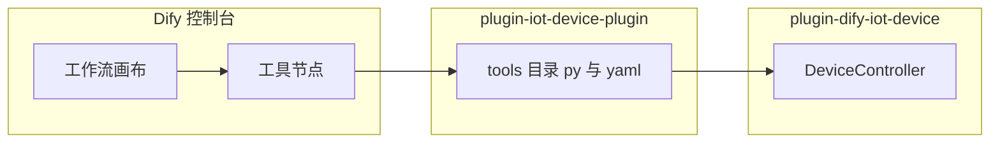
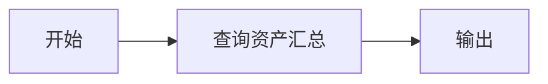
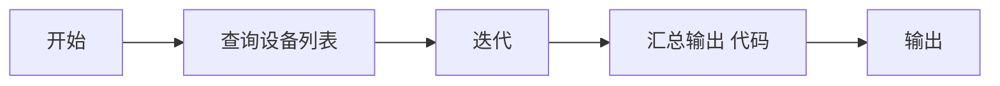
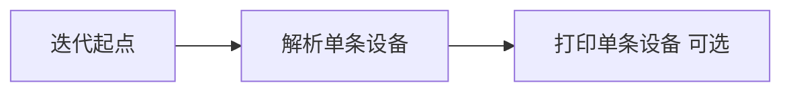
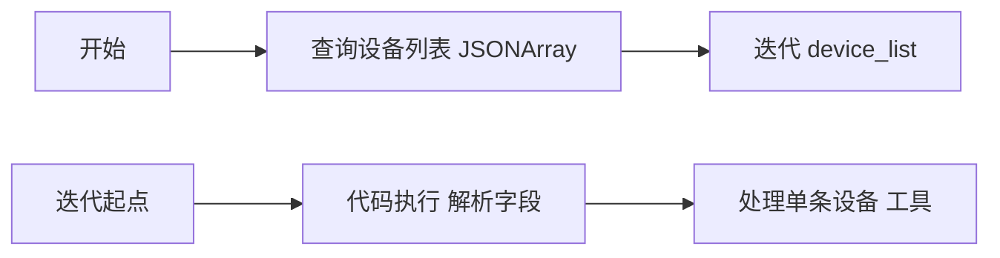
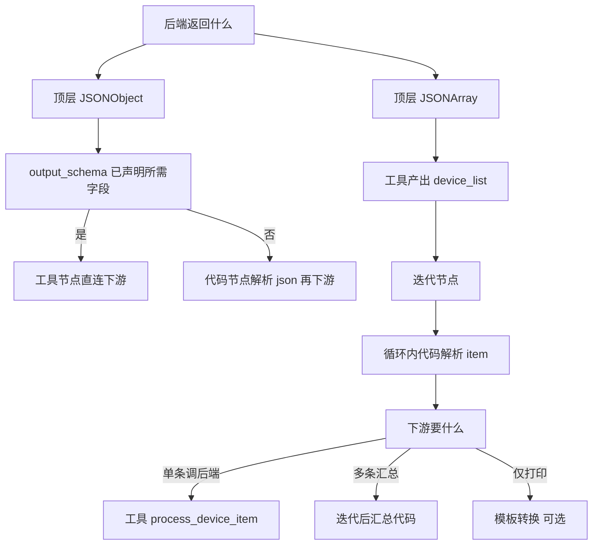

# Dify 工具节点输出参数实战：JSONObject 与 JSONArray 全记录

> 文档版本：2026-06-10  
> 适用环境：Dify v1.13.x、IoT 设备插件 0.0.15、Spring Boot 后端 plugin-dify-iot-device  
> 文档性质：**实战流水账 + 验证记录 + 问题排查**  
> 前置阅读：[20260608-1420-dify工具节点输出参数-数据是JSONArray类型相关源码初步分析.md](./20260608-1420-dify工具节点输出参数-数据是JSONArray类型相关源码初步分析.md)

---

## 一、这篇博客要解决什么问题

我们在 IoT 设备管理工作流中，先后遇到两类后端返回形态：

| 形态 | 代表接口 | 代表工具 | 下游典型诉求 |
|------|----------|----------|--------------|
| JSONObject | GET `/api/devices/asset-summary` | `query_asset_summary` | 直接引用 `device_id`、`app_name` 等标量 |
| JSONArray | GET `/api/devices/list-brief` | `query_device_list` | 遍历全部设备，逐条处理 |

实战结论可以浓缩为两句话：

1. **JSONObject 且字段已在 `output_schema` 声明** → 工具节点下游可直接选字段，一般不需要再加代码节点。
2. **JSONArray 或需要遍历** → 必须用**迭代节点**；循环体内 `item` 是 object 时**不能点选子字段**，需要**代码执行**解析；迭代外要多种输出时，往往还要**汇总代码节点**或**专用后端接口**。

本文按时间线记录：搭环境、写插件、画工作流、跑 curl 验证、踩坑、改拓扑、最终落地两套生产级工作流。

---

## 二、实验环境与项目结构

### 2.1 三台角色



| 组件 | 路径 | 作用 |
|------|------|------|
| Spring Boot 后端 | `test-dify/plugin-dify-iot-device` | 模拟 IoT 接口 |
| Dify Python 插件 | `test-dify/plugin-iot-device-plugin` | HTTP 网关 + `output_schema` |
| Dify 工作流 | 控制台两个 App | JSONObject 案例与 JSONArray 案例 |

### 2.2 插件打包命令

Windows 环境执行：

```cmd
e:\Ideaproject\dify-work\test-dify\plugin-iot-device-plugin\bin\package.cmd
```

成功输出示例：

```text
[SUCCESS] Package created: e:\Ideaproject\dify-work\test-dify\plugin-iot-device-plugin.difypkg
```

版本迭代记录：`0.0.13` 增加 `query_device_list` → `0.0.14` 增加 `process_device_item` → `0.0.15` 拆分为多参数入参。

### 2.3 验证手段

我们主要用两类 curl：

1. **保存草稿** `POST /console/api/apps/{app_id}/workflows/draft`
2. **运行草稿** `POST /console/api/apps/{app_id}/workflows/draft/run`

运行接口返回 SSE 流，关键事件：

- `node_finished`：单节点输入输出
- `iteration_completed`：迭代汇总结果
- `workflow_finished`：最终 outputs

---

## 三、案例一：JSONObject 扁平化——查询资产汇总

### 3.1 业务接口形态

后端 `GET /api/devices/asset-summary` 返回嵌套 JSONObject：

```json
{
  "appInfo": {
    "appId": "iot-device-manager-v1",
    "appName": "IoT设备管理平台"
  },
  "deviceList": [
    {
      "deviceId": "device_001",
      "deviceName": "客厅温度传感器",
      "status": "online"
    }
  ],
  "totalDevices": 3,
  "onlineCount": 2,
  "offlineCount": 1
}
```

插件在 Python 里解析后，通过 `create_variable_message` 扁平化产出 `app_id`、`device_id`、`device_name` 等顶层变量。

### 3.2 工作流拓扑（最终版）



对应控制台 App：`45e34d19-b8ae-4231-b405-71905e726f8e`

节点配置要点：

- 工具：`query_asset_summary`
- 结束节点直接绑定：
  - `device_name` ← 工具节点 `device_name`
  - `device_id` ← 工具节点 `device_id`

### 3.3 实战规律

**若 `output_schema` 已声明字段，且插件确实 `yield` 了对应变量**，则：

- 变量选择器里能看到 `device_id`、`device_name` 等
- 结束节点、LLM 节点、后续工具节点均可直接引用
- **不需要**再插代码执行节点做解析

**例外**：若接口字段未在 `output_schema` 声明，或插件未产出 VARIABLE，前端仍可能展示字段名但值为空——必须以单节点运行的 `outputs` JSON 为准。

### 3.4 JSONObject 案例验证清单

| 步骤 | 操作 | 预期 |
|------|------|------|
| 1 | 单节点运行 `query_asset_summary` | outputs 含 `device_id` 字符串 |
| 2 | 结束节点选 `device_name` | 运行后 `workflow_finished.outputs.device_name` 有值 |
| 3 | 去掉 output_schema 对照 | 变量选择器无自定义字段 |

---

## 四、案例二：JSONArray 遍历——查询设备列表

### 4.1 业务接口形态

后端 `GET /api/devices/list-brief` 顶层即数组：

```json
[
  {
    "deviceId": "device_003",
    "deviceName": "厨房智能开关",
    "deviceType": "smart_switch",
    "location": "厨房",
    "status": "offline",
    "deviceList": [
      {"deviceId": "device_003", "deviceName": "厨房智能开关", "status": "offline"}
    ]
  }
]
```

插件 `query_device_list.py` 核心产出：

```python
yield self.create_variable_message("device_list", device_list)
yield self.create_variable_message("total_devices", total_devices)
for device in device_list:
    if isinstance(device, dict):
        yield self.create_json_message(device)
```

### 4.2 迭代节点配置

| 配置项 | 值 | 说明 |
|--------|-----|------|
| 输入 `iterator_selector` | `[工具节点ID, device_list]` | 绑定数组 |
| 输出 `output_selector` | 循环体内某节点某字段 | **必填，否则 output 为 null** |
| `output_type` | `array[object]` 或 `array[string]` | 与所选字段类型一致 |

### 4.3 第一次踩坑：迭代 output 全是 null

**现象**：工作流运行成功，但结束节点拿到：

```json
"output1": [null, null, null]
```

**迭代完成事件原文**：

```json
"outputs": {"output": [null, null, null]}
```

**根因**：迭代节点 `output_selector` 为 `[]` 空数组。迭代虽然执行了循环体内代码节点 3 次，但没有指定「汇总哪个字段」。

**修复**：设置 `output_selector` 为 `["代码节点ID", "device"]`，`output_type` 为 `array[object]`。

修复后 `iteration_completed` 片段：

```json
"outputs": {
  "output": [
    {"deviceId": "device_003", "deviceName": "厨房智能开关", "deviceType": "smart_switch", "location": "厨房", "status": "offline", "deviceList": [...]},
    {"deviceId": "device_002", "deviceName": "卧室智能灯泡", ...},
    {"deviceId": "device_001", "deviceName": "客厅温度传感器", ...}
  ]
}
```

### 4.4 第二次踩坑：想在迭代内放「结束」节点

**现象**：画布上迭代里「解析单条设备」后面拖不出「输出」节点，但能拖「条件分支」「模板转换」。

**结论**：Dify 设计规定**结束节点只能在工作流最外层**。迭代内的「输出」替代方案：

- **模板转换**：拼一段可读文本，固定只有 `output` 字符串一个出口
- **代码执行**：产出多个字段，供同循环体内下游引用
- **工具节点**：如 `process_device_item`，把单条记录交给后端

### 4.5 循环体内必须加代码执行的原因

文档与源码均指出：迭代内 `item` 类型为 `object` 时，**变量选择器不会展开 `deviceId` 子路径**。

循环内代码示例：

```python
def main(item: dict) -> dict:
    return {
        "device": item,
        "device_id": item.get("deviceId", ""),
        "device_name": item.get("deviceName", ""),
        "device_type": item.get("deviceType", ""),
        "location": item.get("location", ""),
        "status": item.get("status", ""),
        "sub_device_list": item.get("deviceList", []),
    }
```

**注意**：代码节点输入变量 `item` 的 `value_type` 应设为 `object`，若误选为 `string` 可能导致解析异常——我们在 `10.50.28.140` 环境草稿里曾出现此配置，需人工校正。

---

## 五、模板转换节点的局限

我们曾在迭代内加「打印单条设备」模板节点，模板内容：

```text
deviceId={{ device_id }}
deviceName={{ device_name }}
deviceType={{ device_type }}
location={{ location }}
status={{ status }}
```

### 5.1 运行验证：模板有输出，但结束节点看不到

单次循环 `node_finished` 中模板输出正常：

```json
"outputs": {
  "output": "deviceId=device_003\ndeviceName=厨房智能开关\ndeviceType=smart_switch\nlocation=厨房\nstatus=offline"
}
```

三次循环各有一条。但最终 `workflow_finished` 若只绑 `迭代.output`，而 `output_selector` 指向的是代码节点的 `device` 字段，则**打印文本不会出现在最终 outputs**，只存在于运行追踪里。

### 5.2 源码级原因

`web/app/components/workflow/constants.ts` 中模板节点输出结构写死为：

```typescript
export const TEMPLATE_TRANSFORM_OUTPUT_STRUCT: Var[] = [
  { variable: 'output', type: VarType.string },
]
```

**模板转换只能有一个 `output` 字符串，不能配置多字段输出。**

### 5.3 迭代 output_selector 只能选一个字段

| 选择 | 迭代 output 类型 | 最终 outputs 拿到 |
|------|----------------|-----------------|
| 代码节点 `device` | array object | 结构化对象数组 |
| 模板节点 `output` | array string | 打印文本数组 |
| 两者都要 | 不可能单选同时满足 | 需迭代后汇总代码或后端接口 |

---

## 六、既要打印文本又要字段数组——汇总代码节点

用户需求：最终 outputs 同时包含 `device_ids`、`device_names`、`print_log` 等。

### 6.1 拓扑



迭代内：



### 6.2 汇总代码完整实现

```python
def main(devices: list) -> dict:
    device_ids = [d.get("deviceId", "") for d in devices]
    device_names = [d.get("deviceName", "") for d in devices]
    device_types = [d.get("deviceType", "") for d in devices]
    locations = [d.get("location", "") for d in devices]
    statuses = [d.get("status", "") for d in devices]

    print_lines = []
    for d in devices:
        print_lines.append(
            f"deviceId={d.get('deviceId', '')}\n"
            f"deviceName={d.get('deviceName', '')}\n"
            f"deviceType={d.get('deviceType', '')}\n"
            f"location={d.get('location', '')}\n"
            f"status={d.get('status', '')}"
        )

    return {
        "devices": devices,
        "device_ids": device_ids,
        "device_names": device_names,
        "device_types": device_types,
        "locations": locations,
        "statuses": statuses,
        "print_lines": print_lines,
        "print_log": "\n\n---\n\n".join(print_lines),
    }
```

### 6.3 workflow_finished 验证输出

```json
{
  "device_ids": ["device_003", "device_002", "device_001"],
  "device_names": ["厨房智能开关", "卧室智能灯泡", "客厅温度传感器"],
  "device_types": ["smart_switch", "smart_light", "temperature_sensor"],
  "locations": ["厨房", "卧室", "客厅"],
  "statuses": ["offline", "online", "online"],
  "print_lines": ["deviceId=device_003\n...", "..."],
  "print_log": "deviceId=device_003\n...\n\n---\n\n..."
}
```

这是 Dify 单 `output_selector` 机制下，**不改后端**时同时拿到多类变量的标准做法。

---

## 七、进阶：后端处理单条设备 + 插件 process_device_item

当循环体内希望调用**真实业务接口**而非纯画布逻辑时，我们新增：

### 7.1 后端

`POST /api/devices/process-item`

请求体 `DeviceItemProcessRequest`：

```json
{
  "device_id": "device_003",
  "device_name": "厨房智能开关",
  "device_type": "smart_switch",
  "location": "厨房",
  "status": "offline",
  "sub_device_list": []
}
```

响应体 `DeviceItemProcessResult`：

```json
{
  "deviceName": "厨房智能开关",
  "blockResult": "后端处理完成"
}
```

Java 服务实现（用户简化版）：

```java
public DeviceItemProcessResult processDeviceItem(DeviceItemProcessRequest request) {
    if (request == null) {
        throw new IllegalArgumentException("request body is required");
    }
    log.info("收到输出，准备处理: {}", request);
    DeviceItemProcessResult result = new DeviceItemProcessResult();
    result.setDeviceName(request.getDeviceName());
    result.setBlockResult("后端处理完成");
    return result;
}
```

### 7.2 插件工具 yaml 片段

入参拆为 6 个独立参数，与 Java 实体一一对应；出参 `output_schema` 仅 `device_name` 与 `block_result`。

### 7.3 插件 Python 核心逻辑

```python
payload = {
    "device_id": tool_parameters.get("device_id", "") or "",
    "device_name": tool_parameters.get("device_name", "") or "",
    "device_type": tool_parameters.get("device_type", "") or "",
    "location": tool_parameters.get("location", "") or "",
    "status": tool_parameters.get("status", "") or "",
    "sub_device_list": _parse_sub_device_list(tool_parameters.get("sub_device_list")),
}
response = requests.post(f"{spring_url}/api/devices/process-item", json=payload, ...)
device_name = result.get("deviceName", "")
block_result = result.get("blockResult", "")
yield self.create_variable_message("device_name", device_name)
yield self.create_variable_message("block_result", block_result)
```

### 7.4 最终 JSONArray 工作流（10.50.28.140 环境）

App：`fd14ae70-c1e8-4c38-a9ec-07176af99290`



工具节点参数绑定示例：

| 工具参数 | 绑定来源 |
|----------|----------|
| device_id | 代码执行.device_id |
| device_name | 代码执行.device_name |
| device_type | 代码执行.device_type |
| location | 代码执行.location |
| status | 代码执行.status |
| sub_device_list | 代码执行.sub_device_list |

迭代 `output_selector` 当前指向 `["处理单条设备", text]`，即汇总工具节点的文本摘要为 `array[string]`。若需汇总 `block_result`，应改为 `["处理单条设备", block_result]` 并在 yaml 中声明对应 output_schema 字段。

---

## 八、curl 排查实录

### 8.1 保存草稿

```bash
curl -X POST "http://10.50.28.140:30080/console/api/apps/fd14ae70-c1e8-4c38-a9ec-07176af99290/workflows/draft" \
  -H "content-type: application/json" \
  -H "x-csrf-token: YOUR_CSRF" \
  -b "access_token=YOUR_TOKEN; csrf_token=YOUR_CSRF" \
  --data @workflow_draft.json \
  --insecure
```

成功响应：

```json
{"result":"success","hash":"c696a75d37c0cd1877aebd385a8b57c5aeced13ba11cd5dc7f132bead6ff4e1a"}
```

### 8.2 运行草稿

```bash
curl -X POST "http://10.50.28.140:30080/console/api/apps/fd14ae70-c1e8-4c38-a9ec-07176af99290/workflows/draft/run" \
  -H "content-type: application/json" \
  -H "x-app-code: workflow" \
  -b "access_token=YOUR_TOKEN; csrf_token=YOUR_CSRF" \
  --data '{"inputs":{},"files":[]}' \
  --insecure
```

### 8.3 工具节点成功输出片段

```json
"outputs": {
  "device_list": [
    {"deviceId": "device_003", "deviceName": "厨房智能开关", "deviceType": "smart_switch", "location": "厨房", "status": "offline", "deviceList": [...]},
    {"deviceId": "device_002", ...},
    {"deviceId": "device_001", ...}
  ],
  "total_devices": 3,
  "online_count": 2,
  "offline_count": 1
}
```

### 8.4 后端 405 排查记录

本地首次调用新接口时：

```bash
curl -X POST "http://localhost:8080/api/devices/process-item" \
  -H "Content-Type: application/json" \
  --data-binary "@temp_process_item_body.json"
```

返回：

```json
{"timestamp":"2026-06-10T07:04:42.794+00:00","status":405,"error":"Method Not Allowed","path":"/api/devices/process-item"}
```

**原因**：8080 上仍是旧版 Spring Boot 进程，未加载新 Controller 方法。  
**处理**：`mvn clean package` 后重启 `mvn spring-boot:run` 或 `java -jar target/plugin-dify-iot-device-1.0.0.jar`。

---

## 九、问题现象与根因对照表

| 序号 | 现象 | 根因 | 处理 |
|------|------|------|------|
| 1 | 迭代 output 为 null 数组 | output_selector 为空 | 指向循环体内节点字段 |
| 2 | 循环内拖不出结束节点 | 结束节点仅限工作流外层 | 用模板或代码或工具代替 |
| 3 | 模板有输出但结束节点没有 | 未把模板 output 设为迭代汇总字段 | 改 output_selector 或接受仅追踪可见 |
| 4 | 无法同时输出文本与字段数组 | output_selector 只能单选 | 迭代后加汇总代码节点 |
| 5 | 变量选择器有字段但值为空 | output_schema 声明了但未 yield | 以单节点 run outputs 为准 |
| 6 | item 子字段不可点 | object 类型 item 不自动展开 | 循环内代码解析 |
| 7 | process-item 返回 405 | 后端未重启 | 重新打包部署 Spring |
| 8 | 插件升级画布无新工具 | 缓存旧 schema | 重装插件并刷新页面 |

---

## 十、决策树：接到接口后怎么画工作流



### 10.1 JSONObject 路径口诀

已知字段且已扁平化 → **直接连**。  
未知结构或未扁平化 → **代码执行拆解** → 再连。

### 10.2 JSONArray 路径口诀

数组进迭代 → 循环内代码拆 object → 单条走工具或模板 → 多条汇总靠迭代 output_selector 或迭代后代码。

### 10.3 迭代 vs 循环节点

| 节点 | 适用 |
|------|------|
| 迭代 Iteration | 遍历 `device_list` 等数组 |
| 循环 Loop | 固定次数或条件退出，不适合直接绑 JSONArray |

我们验证 JSONArray 场景应使用**迭代**，不是循环。

---

## 十一、完整插件关键代码索引

### 11.1 query_device_list.py 产出数组

```python
yield self.create_variable_message("device_list", device_list)
yield self.create_variable_message("total_devices", total_devices)
yield self.create_text_message(text_summary)
for device in device_list:
    if isinstance(device, dict):
        yield self.create_json_message(device)
```

### 11.2 process_device_item.py 多参数入参

见第七章；`sub_device_list` 兼容 list 与 JSON 字符串。

### 11.3 DeviceItemProcessRequest.java

```java
@Data
public class DeviceItemProcessRequest {
    @JsonProperty("device_id") private String deviceId;
    @JsonProperty("device_name") private String deviceName;
    @JsonProperty("device_type") private String deviceType;
    private String location;
    private String status;
    @JsonProperty("sub_device_list") private List<Map<String, Object>> subDeviceList;
}
```

---

## 十二、时间线回顾

| 日期 | 动作 | 结果 |
|------|------|------|
| 06-08 | 完成 JSONObject 扁平化方案文档 | query_asset_summary 可直连结束节点 |
| 06-10 上午 | 搭建 JSONArray 工作流 | 迭代 output 全 null |
| 06-10 中午 | 配置 output_selector | 拿到 array object |
| 06-10 下午 | 去汇总节点改模板 | 弄清模板单输出限制 |
| 06-10 下午 | 加汇总代码节点 | 同时输出 print_log 与字段数组 |
| 06-10 傍晚 | 新增 process-item 接口与插件 0.0.15 | 迭代内可调后端 |
| 06-10 晚 | 10.50.28.140 两套 App 联调 | JSONObject 与 JSONArray 分 App 验证 |

---

## 十三、给后来者的检查清单

运行前自查：

1. 插件版本与 `plugin_unique_identifier` 是否一致，例如 `0.0.15@41e658a8...`
2. 工具单节点 run 的 outputs 是否含目标变量
3. 迭代 input 是否绑 `device_list` 且类型 `array object`
4. 迭代 output_selector 是否非空
5. 循环内代码 item 的 value_type 是否为 `object`
6. 模板节点是否误以为能多字段输出
7. Spring 后端是否已部署含 `/process-item` 的版本
8. 结束节点引用的是迭代 output 还是汇总代码 output

---

## 十四、总结

JSONObject 与 JSONArray 在 Dify 工作流中的处理方式**本质不同**：

- **JSONObject + output_schema 扁平化** 解决的是「单对象多字段直接引用」；
- **JSONArray** 解决的是「多对象逐条处理」，核心链路是 **工具数组变量 → 迭代 → 循环内解析 → 可选单条工具或迭代后汇总**。

我们经历的 `[null, null, null]`、迭代内无法放结束节点、模板只有 `output` 字符串、以及「既要打印又要字段数组」等问题的背后，都是 Dify 变量池与迭代汇总机制的设计边界。理解这些边界之后，就不再执着于「一条边连到底」，而是会在正确的位置插入**代码执行**、**模板转换**、**汇总代码**或**后端 process 接口**。

---

## 附录 A：workflow_finished 成功样例（JSONArray 汇总方案）

```json
{
  "status": "succeeded",
  "outputs": {
    "devices": [{"deviceId": "device_003", "deviceName": "厨房智能开关", "status": "offline"}],
    "device_ids": ["device_003", "device_002", "device_001"],
    "device_names": ["厨房智能开关", "卧室智能灯泡", "客厅温度传感器"],
    "print_log": "deviceId=device_003\ndeviceName=厨房智能开关\n..."
  },
  "elapsed_time": 0.702199,
  "total_steps": 5
}
```

## 附录 B：workflow_finished 成功样例（JSONObject 直连）

```json
{
  "status": "succeeded",
  "outputs": {
    "device_name": "客厅温度传感器",
    "device_id": "device_001"
  }
}
```

## 附录 C：相关文件路径

| 文件 | 说明 |
|------|------|
| `plugin-iot-device-plugin/tools/query_device_list.py` | JSONArray 工具 |
| `plugin-iot-device-plugin/tools/query_asset_summary.py` | JSONObject 扁平化工具 |
| `plugin-iot-device-plugin/tools/process_device_item.py` | 单条设备后端处理 |
| `plugin-dify-iot-device/.../DeviceController.java` | REST 接口 |
| `plugin-dify-iot-device/.../DeviceService.java` | 业务逻辑 |
| `doc/.../20260608-1420-...源码初步分析.md` | 源码级分析 |

---

> **审阅说明**：本文档为实战流水账，含完整拓扑、代码、curl 验证与踩坑记录。若需补充 10.50.28.140 环境某次完整 SSE 日志，可在下一轮迭代附录。字符规模约八千字以上，请审阅是否满足「完整博客」要求。

---
