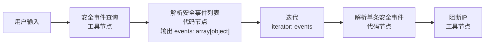
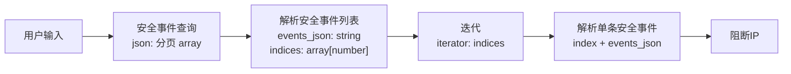
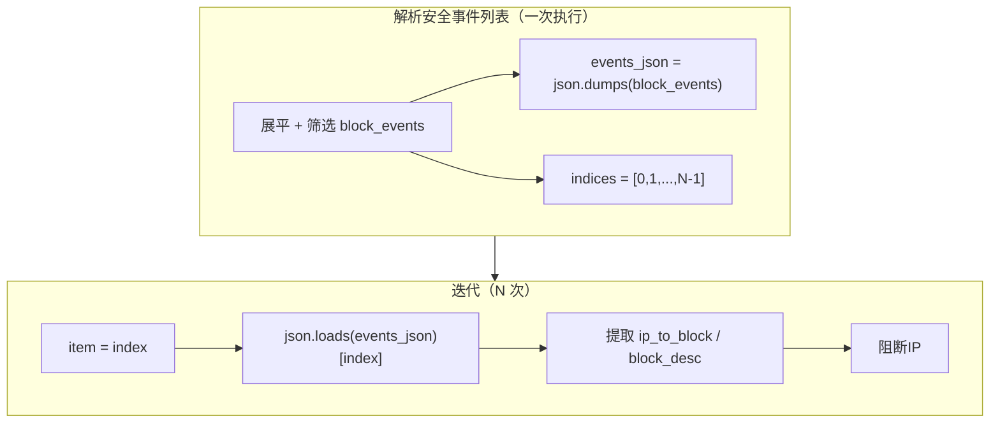

# Dify 代码节点 `array[object]` 30 条限制：`The length of output variable events must be less than 30 elements`

> 文档版本：2026-06-10  
> 适用环境：Dify v1.13.x、XDR 安全事件插件、安全事件自动阻断工作流  
> 文档性质：**问题复盘 + 源码分析 + 可落地解决方案**（含 curl 验证记录）  
> 前置阅读：  
> - [20260608-1420-dify工具节点输出参数-数据是JSONArray类型相关源码初步分析.md](./20260608-1420-dify工具节点输出参数-数据是JSONArray类型相关源码初步分析.md)  
> - [20260608-1460-dify工具节点输出参数-数据是JSONArray类型和json类型实战.md](./20260608-1460-dify工具节点输出参数-数据是JSONArray类型和json类型实战.md)  
> 关联脚本：`test-dify/patch_security_workflow_draft.py`

---

## 一、这篇博客要解决什么问题

我们在「安全事件查询 → 解析攻击者 → 迭代阻断 IP」工作流中，当安全事件超过 30 条时，运行草稿接口直接失败：

```text
The length of output variable `events` must be less than 30 elements.
```

表面上看像是「工具节点只能返回 30 条 JSON」，实际上**报错发生在代码执行节点的输出校验阶段**，与工具节点 `json` 字段能返回多少条数据不是同一套限制。

本文完整记录：问题现象、工作流拓扑、复现步骤、Dify 源码中的限制来源、推荐解决方案，以及我们在真实环境里的验证结果。

---

## 二、问题现象

### 2.1 报错信息

| 字段 | 值 |
|------|-----|
| 报错节点 | 代码执行节点「解析安全事件列表」（node_id: `1781094180113`） |
| 报错变量 | `events` |
| 报错类型 | 输出变量长度校验失败 |
| 完整错误 | `The length of output variable events must be less than 30 elements.` |
| 工作流状态 | `workflow_finished.status = failed`，`total_steps = 3`（迭代尚未开始） |

SSE 流中的典型片段：

```text
data: {"event":"node_finished",...,"node_id":"1781094180113","node_type":"code","title":"解析安全事件列表",...,"status":"failed","error":"The length of output variable `events` must be less than 30 elements."}

data: {"event":"workflow_finished",...,"status":"failed","error":"The length of output variable `events` must be less than 30 elements."}
```

### 2.2 容易误判的点

1. **工具节点其实成功了**  
   「安全事件查询」节点 `status: succeeded`，`outputs.json` 里已有 13 页分页数据，总记录 122 条。说明上游 HTTP/插件调用没有因 30 条限制失败。

2. **失败发生在「解析」代码节点**  
   代码把 122 条事件展平、筛选 `focusObjectEN == "attacker"` 后，准备 `return {"events": block_events}`，其中 `block_events` 长度约 70+，超过代码节点对 `array[object]` 的上限。

3. **UI 保存草稿可能覆盖 API 补丁**  
   即使通过 Console API 把代码改对了 `events_json + indices` 方案，用户在浏览器里点保存，仍可能把旧版 `events: array[object]` 写回服务端，导致再次复现同一报错。

---

## 三、业务背景与工作流拓扑

### 3.1 业务目标

1. 按时间范围调用 XDR「安全事件查询」工具，自动翻页拉全量事件；
2. 在代码节点中筛选 **攻击者（attacker）** 且 **focusIp 非空** 的事件；
3. 对每条攻击者事件调用「阻断 IP」工具，实现批量自动处置。

### 3.2 节点拓扑（改造前 · 会报错）



### 3.3 节点拓扑（改造后 · 已验证通过）



### 3.4 关键节点 ID（便于对照 API / 日志）

| 节点 | node_id | 类型 |
|------|---------|------|
| 用户输入 | `1781093649261` | start |
| 安全事件查询 | `1781094025706` | tool |
| 解析安全事件列表 | `1781094180113` | code |
| 迭代 | `1781094085148` | iteration |
| 解析单条安全事件 | `1781094091084` | code |
| 阻断IP | `1781094339078` | tool |

---

## 四、数据形态：工具 `json` 与代码 `events` 的区别

### 4.1 工具节点 `json` 的真实结构

XDR 安全事件查询工具在 Dify 中走默认 `json` 通道，类型为 **`array[object]`**。  
插件每翻一页调用一次 `create_json_message(page_dict)`，因此 **`json` 数组的一个元素 = 一页**，不是「一条安全事件」。

示例（122 条记录、每页 10 条）：

```json
[
  { "$page": 1, "$size": 10, "data": [ /* 10 条事件 */ ], "total": 122, "total_pages": 13 },
  { "$page": 2, "$size": 10, "data": [ /* 10 条事件 */ ], "total": 122, "total_pages": 13 },
  ...
  { "$page": 13, "$size": 10, "data": [ /* 2 条事件 */ ], "is_last_page": true }
]
```

工具节点 `text` 摘要示例：

```text
安全事件查询完成
  时间范围：2026-06-01 12:12:12 ~ 2026-06-11 12:12:12
  总记录数：122
  实际获取：122 条（13 页，每页 10 条）
  耗时：0.67s
```

### 4.2 代码节点里「一条事件 = 一个 object」

解析代码需要：

```python
for page in tool_json:
    events.extend(page["data"])
block_events = [e for e in events if e.get("focusObjectEN") == "attacker" and e.get("focusIp")]
return {"events": block_events}  # ← 这里每个元素是一条事件，数量轻松 > 30
```

122 条全量事件中，攻击者通常远多于 30 条（实测约 70+），于是触发 **`events` 的 30 条硬限制**。

---

## 五、复现步骤

### 5.1 前置条件

- Dify 控制台可访问：`http://10.20.183.170:30080`
- 工作流 App ID：`368e49bf-f581-43f0-aa3a-78a12a58b702`
- 「解析安全事件列表」代码仍使用 **`events: array[object]`** 输出（改造前版本）
- 安全事件查询时间范围足够宽（如 10 天），保证总记录数 > 30

### 5.2 运行草稿（curl）

```bash
curl 'http://10.20.183.170:30080/console/api/apps/368e49bf-f581-43f0-aa3a-78a12a58b702/workflows/draft/run' \
  -H 'content-type: application/json' \
  -H 'x-app-code: workflow' \
  -H 'x-csrf-token: <your_csrf_token>' \
  -b '<your_cookies>' \
  --data-raw '{"inputs":{},"files":[]}' \
  --insecure
```

### 5.3 预期现象（改造前）

| 顺序 | 事件 | 结果 |
|------|------|------|
| 1 | `node_finished` · 安全事件查询 | `succeeded`，`json` 含多页 |
| 2 | `node_finished` · 解析安全事件列表 | **`failed`**，30 条错误 |
| 3 | `workflow_finished` | **`failed`**，未进入迭代 |

### 5.4 改造后验证结果（本环境实测）

使用 `events_json + indices` 方案后，同一 curl 运行：

| 指标 | 值 |
|------|-----|
| workflow 状态 | `succeeded` |
| 总耗时 | 约 30s（含 70+ 次阻断 IP 调用） |
| `total_steps` | 4（含迭代子步骤） |
| 解析节点输出 | `events_json`（字符串）、`indices`（0..N-1）、`total` ≈ 70+ |
| 迭代 | 按 index 逐条进入「解析单条安全事件 → 阻断IP」 |

---

## 六、源码分析：30 条限制从哪里来

### 6.1 配置项（Dify 开源源码）

文件：`dify/api/configs/feature/__init__.py`

```python
CODE_MAX_OBJECT_ARRAY_LENGTH: PositiveInt = Field(
    description="Maximum allowed length for object arrays in code execution",
    default=30,
)

CODE_MAX_STRING_ARRAY_LENGTH: PositiveInt = Field(
    description="Maximum allowed length for string arrays in code execution",
    default=30,
)

CODE_MAX_NUMBER_ARRAY_LENGTH: PositiveInt = Field(
    description="Maximum allowed length for numeric arrays in code execution",
    default=1000,
)

CODE_MAX_STRING_LENGTH: PositiveInt = Field(
    description="Maximum allowed length for strings in code execution",
    default=400_000,
)
```

`.env` / Docker 示例同样暴露这三项：

```bash
CODE_MAX_OBJECT_ARRAY_LENGTH=30
CODE_MAX_STRING_ARRAY_LENGTH=30
CODE_MAX_NUMBER_ARRAY_LENGTH=1000
```

### 6.2 注入到代码执行引擎

文件：`dify/api/core/workflow/node_factory.py`

工作流引擎初始化时构造 `CodeNodeLimits`，把上述配置传给代码执行节点（graphon CodeNode）：

```python
self._code_limits = CodeNodeLimits(
    max_string_length=dify_config.CODE_MAX_STRING_LENGTH,
    max_number_array_length=dify_config.CODE_MAX_NUMBER_ARRAY_LENGTH,
    max_string_array_length=dify_config.CODE_MAX_STRING_ARRAY_LENGTH,
    max_object_array_length=dify_config.CODE_MAX_OBJECT_ARRAY_LENGTH,
)
```

代码节点 `main()` 返回后，执行器会按**输出变量声明的类型**逐项校验。  
当某输出变量类型为 `array[object]` 且 `len(value) > 30` 时，抛出 `OutputValidationError`，消息形如：

```text
The length of output variable `{name}` must be less than {limit} elements.
```

### 6.3 与「工作流变量截断」不是同一回事

日志展示用的 `VariableTruncator` 另有：

```python
WORKFLOW_VARIABLE_TRUNCATION_ARRAY_LENGTH: default=1000  # 截断展示用
WORKFLOW_VARIABLE_TRUNCATION_MAX_SIZE: default=1024000
```

| 机制 | 默认值 | 作用 |
|------|--------|------|
| `CODE_MAX_OBJECT_ARRAY_LENGTH` | **30** | 代码节点 **输出校验硬限制**，超限即失败 |
| `WORKFLOW_VARIABLE_TRUNCATION_ARRAY_LENGTH` | 1000 | 运行日志 / 调试面板 **截断展示**，不等价于代码可输出 1000 条 object |

因此：**SSE 里工具 `json` 看起来很大，不代表代码节点也能原样输出同样长度的 `array[object]`。**

### 6.4 工具节点 `json` 为何没报同样错误

工具节点由插件 SDK 的 `create_json_message` 写入变量池，走 Tool 输出通道，**不受 CodeNodeLimits 约束**。  
限制发生在：

- 代码节点 **输出** `array[object]`
- 或迭代节点直接引用超限的 `array[object]` 作为 iterator（若上游是代码节点输出）

工具节点分页 `json` 只有 13 个元素（13 页），也低于 30，即使按「页」计数也不会触发代码节点的 object 数组上限。

### 6.5 类型与上限对照表（代码节点输出）

| 声明类型 | 默认最大元素数 | 典型用途 |
|----------|--------------|----------|
| `array[object]` | **30** | 事件列表、设备列表、记录集合 |
| `array[string]` | **30** | 字符串列表 |
| `array[number]` | **1000** | 索引、ID 列表 |
| `string` | 约 **400000 字符** | JSON 序列化大 payload |
| `number` / `object`（单值） | 标量限制 | 计数、单条结构 |

**结论：** 需要把「大量 object」传下游时，不要直接输出 `array[object]`；应改用 **`string`（JSON 序列化）+ `array[number]`（索引）** 组合。

---

## 七、改造前代码（会报错）

### 7.1 解析安全事件列表（问题版本）

```python
def main(tool_json: list) -> dict:
    events = []
    if tool_json:
        for page in tool_json:
            if isinstance(page, dict) and isinstance(page.get("data"), list):
                events.extend(page["data"])

    block_events = [
        e for e in events
        if e.get("focusObjectEN") == "attacker" and e.get("focusIp")
    ]

    return {
        "events": block_events,   # array[object]，长度 > 30 即失败
        "total": len(block_events),
    }
```

节点输出声明：

```json
{
  "events": { "type": "array[object]" },
  "total": { "type": "number" }
}
```

迭代配置：

```json
{
  "iterator_selector": ["1781094180113", "events"],
  "iterator_input_type": "array[object]"
}
```

---

## 八、解决方案：`events_json` + `indices` 绕过 object 数组限制

### 8.1 设计思路



核心原则：

1. **大列表** → 序列化为 **`string`**（`events_json`）；
2. **迭代器** → 使用 **`array[number]`**（`indices`，上限 1000）；
3. **循环体内** → 用 `index` 从 JSON 字符串取单条 object（循环内单条 `object` 不受 30 条限制）。

### 8.2 解析安全事件列表（改造后）

```python
import json

def main(tool_json: list) -> dict:
    """从安全事件查询结果提取待阻断事件，输出索引与 JSON 字符串。"""
    events = []
    if tool_json:
        for page in tool_json:
            if isinstance(page, dict) and isinstance(page.get("data"), list):
                events.extend(page["data"])

    block_events = [
        e for e in events
        if e.get("focusObjectEN") == "attacker" and e.get("focusIp")
    ]

    return {
        "events_json": json.dumps(block_events, ensure_ascii=False),
        "indices": list(range(len(block_events))),
        "total": len(block_events),
        "all_total": len(events),
    }
```

输出声明：

```json
{
  "events_json": { "type": "string" },
  "indices": { "type": "array[number]" },
  "total": { "type": "number" },
  "all_total": { "type": "number" }
}
```

### 8.3 迭代节点

```json
{
  "iterator_selector": ["1781094180113", "indices"],
  "iterator_input_type": "array[number]",
  "output_selector": ["1781094339078", "text"],
  "output_type": "array[string]",
  "error_handle_mode": "continue-on-error"
}
```

### 8.4 解析单条安全事件（循环体内）

```python
import json

def main(index: int, events_json: str) -> dict:
    """按索引从 events_json 取出单条事件并提取阻断字段。"""
    events = json.loads(events_json) if events_json else []
    item = events[index] if 0 <= index < len(events) else {}

    event_id = item.get("id", "")
    event_name = item.get("name", "")
    focus_ip = item.get("focusIp", "") or ""

    desc = f"安全事件自动阻断: {event_name} (ID:{event_id}, 等级:{item.get('threatSeverity', '')})"

    return {
        "event_id": str(event_id),
        "event_name": event_name,
        "focus_ip": focus_ip,
        "ip_to_block": focus_ip,
        "block_desc": desc,
    }
```

变量绑定：

| 代码入参 | 来源 |
|--------|------|
| `index` | 迭代节点 `item` |
| `events_json` | 解析节点 `events_json` |

阻断 IP 工具：

| 参数 | 来源 |
|------|------|
| `ip_address` | 解析单条 · `ip_to_block` |
| `desc` | 解析单条 · `block_desc` |

### 8.5 自动化补丁脚本

项目内脚本：`test-dify/patch_security_workflow_draft.py`

流程：

1. `GET /workflows/draft` 拉取当前草稿；
2. 按 node_id 改写代码、输出声明、迭代 selector；
3. `POST /workflows/draft` 写回（需带最新 `hash`）。

```bash
# 示例
curl -s 'http://<host>/console/api/apps/<app_id>/workflows/draft' \
  -H 'Cookie: ...' -H 'x-csrf-token: ...' \
  -o test-dify/temp_security_workflow_draft.json

python test-dify/patch_security_workflow_draft.py

curl -s 'http://<host>/console/api/apps/<app_id>/workflows/draft' \
  -X POST -H 'content-type: application/json' \
  -H 'Cookie: ...' -H 'x-csrf-token: ...' \
  -d @test-dify/temp_security_workflow_payload.json
```

**注意：** 补丁成功后请在 UI **刷新页面**再运行；若 UI 仍显示旧代码，以 API GET 到的 draft 为准。

---

## 九、其他可选方案（对比）

| 方案 | 做法 | 优点 | 缺点 |
|------|------|------|------|
| A. JSON 字符串 + 索引（推荐） | 本文方案 | 不改 Dify 配置；支持 70~1000 条 | 循环体每次 `json.loads` 全量；JSON 过大超 string 上限 |
| B. 调大 `CODE_MAX_OBJECT_ARRAY_LENGTH` | 改 `.env` / 部署配置 | 改动小 | 需运维权限；全实例生效；过大影响内存与沙箱 |
| C. 后端/插件聚合接口 | 新工具只返回待阻断 IP 列表 | 工作流最简 | 插件开发成本高；IP 列表仍可能是 `array[object]` |
| D. 分批迭代 | 每批 ≤30 条多次迭代 | 不改配置 | 拓扑复杂；批次边界难维护 |
| E. 仅处理前 30 条 | `block_events[:30]` | 快速止血 | 业务不完整，遗留风险 |

**推荐 A**：与 Dify 类型设计一致，已在 122 条事件、70+ 攻击者场景验证通过。

---

## 十、边界与注意事项

### 10.1 `indices` 上限 1000

若攻击者事件 > 1000，需：

- 分批生成多段 `events_json` + 多个迭代；或
- 在插件/后端做聚合；或
- 评估调大 `CODE_MAX_NUMBER_ARRAY_LENGTH`（默认已是 1000）。

### 10.2 `events_json` 字符串长度

默认 `CODE_MAX_STRING_LENGTH = 400000` 字符。单条事件字段多、条数极大时，可能触发 string 超限。  
应对：

- 精简 JSON（只保留阻断所需字段）；
- 或改为「分页 JSON 字符串」方案。

### 10.3 循环内重复反序列化

当前实现对每次迭代执行 `json.loads(events_json)`，70 条规模可接受。  
若 N 上千，可在插件侧提供「按 index 取单条」HTTP 接口，或通过 `process_data` 缓存（视 Dify 版本能力而定）。

### 10.4 多 IP 字段

`focusIp` 常为逗号分隔多 IP（如 `10.50.86.33,10.50.86.19`）。  
「阻断 IP」工具若只接受单个 IP，需在解析单条节点增加 split 逻辑，或扩展工具支持批量 IP（与本文 30 条限制无关，但是实际上线问题）。

---

## 十一、排查清单（遇到类似报错时）

1. 看 **`node_type`**：是 `code` 还是 `tool` 报错。  
2. 看 **输出变量声明类型**：是否为 `array[object]` / `array[string]`。  
3. 看 **`main()` 返回值长度**：`len(return["xxx"])` 是否 > 30。  
4. 区分 **工具 `json` 元素个数**（页）与 **业务条数**（事件）。  
5. 确认 **草稿是否已保存**：API 补丁 + UI 旧缓存是否覆盖。  
6. 查 **`.env` 中 CODE_MAX_* 配置** 是否与源码默认一致。

---

## 十二、总结

| 问题 | 代码节点 `array[object]` 输出最多 **30** 个元素，变量名本文中为 `events` |
| 根因 | Dify `CODE_MAX_OBJECT_ARRAY_LENGTH=30`，在代码执行输出校验阶段硬拦截 |
| 为何数据一多就炸 | 工具分页 `json` 在节点内展平为「逐条事件」后，攻击者数量常 **> 30** |
| 推荐解 | **`events_json: string` + `indices: array[number]` + 循环内按 index 解析** |
| 验证 | 122 条事件场景 workflow `succeeded`，迭代执行 70+ 次阻断 |
| 一句话 | **大列表不要以 `array[object]` 传出代码节点；用 JSON 字符串承载数据，用数字数组驱动迭代。** |

---

## 附录 A：改造前后配置对照

| 项目 | 改造前 | 改造后 |
|------|--------|--------|
| 解析节点输出 | `events: array[object]` | `events_json: string`, `indices: array[number]` |
| 迭代输入 | `events` | `indices` |
| 循环体入参 | 整条 `event` object | `index` + `events_json` |
| 122 条/70+ 攻击者 | 失败 | 成功 |

## 附录 B：相关源码与文件索引

| 路径 | 说明 |
|------|------|
| `dify/api/configs/feature/__init__.py` | `CODE_MAX_*` 默认限制 |
| `dify/api/core/workflow/node_factory.py` | `CodeNodeLimits` 注入 |
| `dify/api/.env.example` | 环境变量示例 |
| `test-dify/patch_security_workflow_draft.py` | 工作流自动补丁 |
| `test-dify/temp_run_result.txt` | 改造后成功运行的 SSE 摘录 |

---

*文档结束。*
