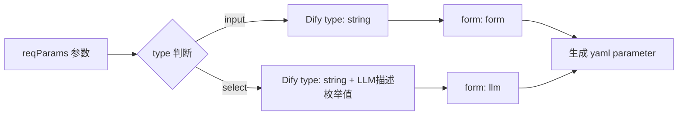
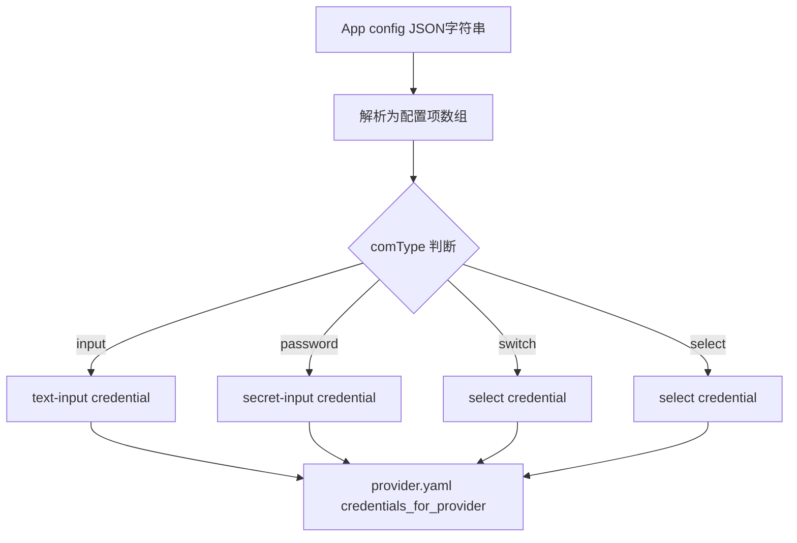
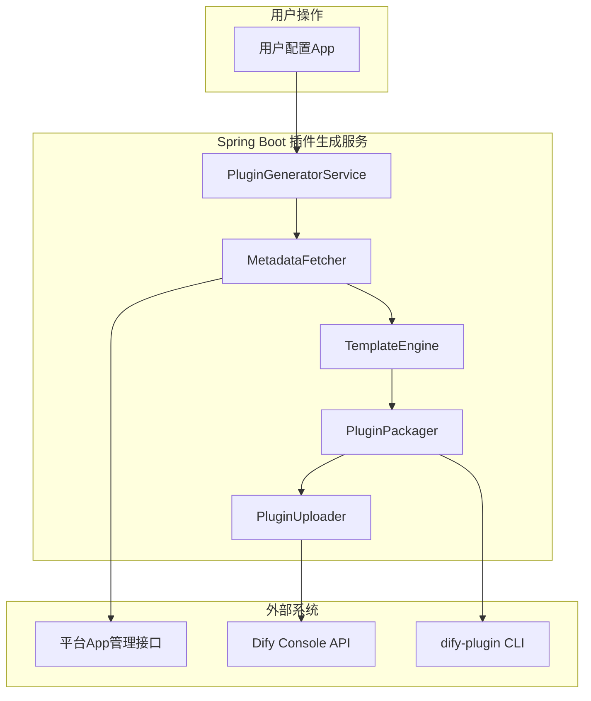
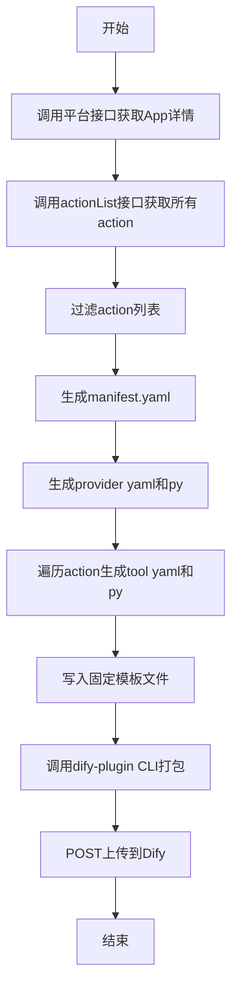

# Dify自动创建插件、自动打包、自动上传 — 概要设计文档

## 一、背景与需求

### 1.1 业务场景

我们的安全管控平台上托管了 N 个 App 服务（每个 App 本质上是一个 Spring Boot 项目），这些 App 部署上线后会对外提供一组 REST API 接口。每个 App 的接口元数据（接口路径、参数定义、返回格式等）都由平台统一管理，可以通过接口查询获取。

目前的痛点是：当我们想让 Dify 工作流调用这些 App 的接口时，需要**手动编写一个 Dify Python 插件**来桥接。这个过程包括：

1. 手动阅读 App 的接口文档
2. 手动创建 `manifest.yaml`、`provider/xxx.yaml`、`tools/yyy.yaml`、`tools/yyy.py` 等文件
3. 手动执行 `dify plugin package` 打包成 `.difypkg`
4. 手动通过 Dify 控制台上传安装

每新增一个 App 就要重复一遍这个流程，效率极低，且容易出错。

### 1.2 目标

实现一条自动化链路：

```
用户配置App → 调接口获取App元数据 → 动态生成Python插件文件 → 自动打包.difypkg → 自动调Dify上传接口安装
```

### 1.3 本文定位

本文是一篇**概要设计文档 + 可行性预研**，以流水账的形式记录我们分析、评估、验证的完整过程。不涉及最终代码实现，重点是把每个环节的可行性、技术约束、映射规则理清楚。

---

## 二、现状分析：手动开发一个 Dify 插件到底要写多少东西

为了让读者理解自动化的价值，先看一下目前手动开发一个插件的完整工作量。以我们已有的**明御防火墙 DAS-TGFW 插件**（`plugin-mingyu-das-tgfw`）为例。

### 2.1 插件标准文件清单

```
plugin-mingyu-das-tgfw/
├── .env                        # 环境变量（调试用）
├── .env.example                # 环境变量模板
├── _assets/
│   └── icon.svg                # 插件图标
├── main.py                     # 入口文件（固定模板）
├── manifest.yaml               # 插件元信息（名称、版本、运行时）
├── plugin_bootstrap.py         # SDK补丁（兼容处理）
├── requirements.txt            # Python依赖
├── provider/
│   ├── tgfw_plugin.py          # Provider凭证校验实现
│   └── tgfw_plugin.yaml        # Provider定义（凭证配置 + 工具列表）
└── tools/
    ├── block_ip_v2.py           # 阻断IP工具实现
    ├── block_ip_v2.yaml         # 阻断IP工具定义
    ├── allow_ip_v2.py           # 放行IP工具实现
    └── allow_ip_v2.yaml         # 放行IP工具定义
```

一个只有 2 个工具（tool）的插件，就需要 **10 个文件**。如果 App 有 6 个接口，那至少要 **18 个文件**（6 个 yaml + 6 个 py + 6 个公共文件）。

### 2.2 关键文件内容分析

#### manifest.yaml — 插件元信息

```yaml
version: 0.0.4
type: plugin
author: your-name
name: mingyu_das_tgfw
label:
  en_US: MingYu DAS-TGFW Firewall
  zh_Hans: 明御防火墙DAS-TGFW
description:
  en_US: MingYu DAS-TGFW firewall plugin, supports IP block and allow operations
  zh_Hans: 明御防火墙DAS-TGFW插件，支持IP阻断和放行操作
icon: icon.svg
created_at: 2025-01-01T00:00:00.000Z
resource:
  memory: 268435456
  permission:
    tool:
      enabled: true
    storage:
      enabled: true
      size: 1048576
    endpoint:
      enabled: true
plugins:
  tools:
    - provider/tgfw_plugin.yaml
meta:
  version: 0.0.4
  minimum_dify_version: "1.5.1"
  arch:
    - amd64
    - arm64
  runner:
    language: python
    version: "3.12"
    entrypoint: main
```

**自动化分析**：这个文件 90% 的内容可以从 App 元数据推导出来。`name` 用 `appId`，`label` 用 `appName`，`description` 用 `appDesc`，`version` 自增即可。唯一固定不变的是 `resource`、`permission`、`meta` 这些结构性字段。

#### provider/tgfw_plugin.yaml — Provider 定义

```yaml
identity:
  author: your-name
  name: mingyu_das_tgfw
  label:
    en_US: MingYu DAS-TGFW Firewall
    zh_Hans: 明御防火墙DAS-TGFW
  description:
    en_US: MingYu DAS-TGFW firewall plugin
    zh_Hans: 明御防火墙DAS-TGFW插件
  icon: icon.svg
  tags:
    - utilities

credentials_for_provider:
  spring_service_url:
    type: text-input
    required: true
    label:
      en_US: Spring Service URL
      zh_Hans: Spring服务地址
    placeholder:
      en_US: "e.g. http://localhost:8080"
      zh_Hans: "例如 http://localhost:8080"
    help:
      en_US: The base URL of your Spring Boot backend service
      zh_Hans: Spring Boot后端服务的基础地址
    url: ""

  api_token:
    type: secret-input
    required: false
    label:
      en_US: API Token (Optional)
      zh_Hans: API Token（可选）
    placeholder:
      en_US: "Leave empty if no authentication required"
      zh_Hans: "如无需认证则留空"
    help:
      en_US: Bearer token for authenticating with the Spring service
      zh_Hans: 用于Spring服务认证的Bearer Token

tools:
  - tools/block_ip_v2.yaml
  - tools/allow_ip_v2.yaml

extra:
  python:
    source: provider/tgfw_plugin.py
```

**自动化分析**：`identity` 部分和 manifest 一样可以从 App 元数据推导。`credentials_for_provider` 部分需要从 App 的 `config` 字段推导（下面详细分析）。`tools` 列表则是遍历所有 action 生成引用。

#### tools/block_ip_v2.yaml — 工具定义（核心映射）

```yaml
identity:
  name: block_ip_v2
  author: your-name
  label:
    en_US: Block IP v2
    zh_Hans: 阻断IP-v2
description:
  human:
    en_US: "Block IP addresses on MingYu DAS-TGFW firewall."
    zh_Hans: "在明御防火墙DAS-TGFW上阻断IP地址。"
  llm: "Block IP on MingYu DAS-TGFW firewall."
parameters:
  - name: ip_list_json
    type: string
    required: true
    label:
      en_US: IP List JSON (upstream data)
      zh_Hans: IP列表JSON(上游数据)
    human_description:
      en_US: "JSON data from upstream node output."
      zh_Hans: "来自上游节点的JSON输出数据。"
    llm_description: "Upstream JSON string."
    form: form
  - name: rule_name
    type: string
    required: true
    label:
      en_US: Rule Name
      zh_Hans: 规则名称
    human_description:
      en_US: "Name of the blocking rule."
      zh_Hans: "阻断规则名称。"
    llm_description: "The name for this IP blocking rule."
    form: form
    default: ""
  - name: priority
    type: string
    required: true
    label:
      en_US: Priority
      zh_Hans: 优先级
    human_description:
      en_US: "Rule priority level (1-100)."
      zh_Hans: "规则优先级（1-100）。"
    llm_description: "Priority of the blocking rule, 1-100."
    form: form
    default: "50"
extra:
  python:
    source: tools/block_ip_v2.py
```

**自动化分析**：这是最关键的文件。`identity` 和 `description` 可以从 action 的 `actionName`、`actionDescribe` 推导。`parameters` 需要从 action 的 `reqParams` 字段逐个映射生成。

#### tools/block_ip_v2.py — 工具实现（通用模板）

```python
import json
import sys
import traceback
from typing import Any, Generator

import requests
from dify_plugin import Tool
from dify_plugin.entities.tool import ToolInvokeMessage

class BlockIpV2Tool(Tool):
    def _spring_url(self) -> str:
        return self.runtime.credentials.get("spring_service_url", "").rstrip("/")

    def _request_headers(self) -> dict[str, str]:
        headers = {"Accept": "application/json", "Content-Type": "application/json"}
        api_token = self.runtime.credentials.get("api_token", "")
        if api_token:
            headers["Authorization"] = f"Bearer {api_token}"
        return headers

    def _invoke(self, tool_parameters: dict[str, Any]) -> Generator[ToolInvokeMessage, None, None]:
        spring_url = self._spring_url()
        # 1. 取参数
        # 2. 校验
        # 3. POST 请求到 Spring Boot 后端
        # 4. 返回结果（text + json）
```

**自动化分析**：这个文件的核心逻辑高度模式化——取参数、拼 URL、发 HTTP 请求、返回结果。完全可以做一个万能模板，只替换 URL 路径、HTTP 方法、参数列表。

### 2.3 手动开发工作量总结

| 插件规模 | 工具数 | 文件数 | 手动耗时 |
|---------|-------|-------|---------|
| 小型 | 2 个 | 10 个 | 2-3 小时 |
| 中型 | 6 个 | 18 个 | 6-8 小时 |
| 大型 | 15 个 | 36 个 | 2-3 天 |

而且每改一次接口定义，就要同步修改 yaml 和 py 文件。**自动化是刚需。**

---

## 三、平台 App 元数据结构深度分析

要实现自动生成，首先要把平台的元数据吃透。我们通过 `LinkAppServiceImpl` 调用了平台接口，拿到了完整的数据样本。

### 3.1 App 详情接口返回

```json
{
    "code": 200,
    "message": "查询成功",
    "data": [
        {
            "appId": "dasca-dbappsecurity-tgfw",
            "appName": "明御防火墙DAS-TGFW",
            "appDesc": "明御防火墙DAS-TGFW秉持安全可视、简单有效的理念...",
            "tags": "防火墙",
            "developer": "dasca@dbappsecurity.com.cn",
            "config": "[{\"comType\":\"input\",\"code\":\"device_name\",\"name\":\"设备名称\",\"require\":true,...},{\"comType\":\"input\",\"code\":\"host\",\"name\":\"主机地址\",\"require\":true,...},{\"comType\":\"input\",\"code\":\"port\",\"name\":\"设备端口\",\"require\":false,...},{\"comType\":\"switch\",\"code\":\"isSSL\",\"name\":\"是否启用HTTPS\",\"require\":false,\"default\":\"false\",...},{\"comType\":\"password\",\"code\":\"token\",\"name\":\"认证Token\",\"require\":true,...}]",
            "language": "Java",
            "appFactory": "安恒(DBAPPSecurity)",
            "linkage": "HTTP",
            "appState": true
        }
    ]
}
```

**关键字段提取**：

| 字段 | 用途 | 映射目标 |
|------|------|---------|
| `appId` | 插件唯一标识 | `manifest.yaml` 的 `name` |
| `appName` | 插件显示名称 | `manifest.yaml` 的 `label.zh_Hans` |
| `appDesc` | 插件描述 | `manifest.yaml` 的 `description` |
| `config` | 设备连接配置（JSON字符串） | `provider.yaml` 的 `credentials_for_provider` |
| `tags` | 应用分类标签 | `provider.yaml` 的 `tags`（需映射） |

### 3.2 config 字段结构分析

`config` 字段是一个 **JSON 字符串**（注意是字符串，不是 JSON 对象），解析后是一个配置项数组：

```json
[
    {"comType": "input",    "code": "device_name", "name": "设备名称",     "require": true},
    {"comType": "select",   "code": "device_tags", "name": "设备标签",     "require": true},
    {"comType": "input",    "code": "host",        "name": "主机地址",     "require": true},
    {"comType": "input",    "code": "port",        "name": "设备端口",     "require": false},
    {"comType": "switch",   "code": "isSSL",       "name": "是否启用HTTPS","require": false, "default": "false"},
    {"comType": "password", "code": "token",       "name": "认证Token",    "require": true}
]
```

这些配置项定义了连接设备需要的参数，直接映射为 Dify 插件的 `credentials_for_provider`：

| comType | Dify credential type | 示例 |
|---------|---------------------|------|
| `input` | `text-input` | host、port、device_name |
| `password` | `secret-input` | token |
| `switch` | `select`（boolean 二选一） | isSSL |
| `select` | `select` | device_tags |

### 3.3 actionList 接口返回（含参数定义）

这是最核心的数据源，每个 action 包含完整的接口定义：

```json
{
    "id": "2042509845009588225",
    "actionUri": "/send/message",
    "actionName": "发送消息",
    "actionDescribe": "发送消息",
    "reqType": "post",
    "reqParams": "[{\"type\":\"input\",\"label\":\"消息内容\",\"default\":\"\",\"dataType\":\"String\",\"paramType\":\"body\",\"key\":\"message\",\"placeholder\":\"\",\"require\":true},{\"type\":\"select\",\"label\":\"是否@人员\",\"default\":\"false\",\"dataType\":\"String\",\"paramType\":\"body\",\"key\":\"isAt\",\"options\":[{\"key\":\"true\",\"label\":\"是\"},{\"key\":\"false\",\"label\":\"否\"}],\"require\":true},{\"type\":\"input\",\"label\":\"人员号码\",\"default\":\"\",\"dataType\":\"String\",\"paramType\":\"body\",\"key\":\"phones\",\"require\":false}]",
    "reqResults": "",
    "tags": "IPDR!Respond_Recover,abilityTemplate!Message",
    "actionType": 1,
    "formatTemplate": "您发送了一条消息：${in_message}",
    "actionState": 1
}
```

**reqParams 字段结构分析**（JSON 字符串，解析后）：

```json
[
    {
        "type": "input",
        "label": "消息内容",
        "default": "",
        "dataType": "String",
        "paramType": "body",
        "key": "message",
        "placeholder": "",
        "require": true
    },
    {
        "type": "select",
        "label": "是否@人员",
        "default": "false",
        "dataType": "String",
        "paramType": "body",
        "key": "isAt",
        "options": [
            {"key": "true", "label": "是"},
            {"key": "false", "label": "否"}
        ],
        "require": true
    },
    {
        "type": "input",
        "label": "人员号码",
        "default": "",
        "dataType": "String",
        "paramType": "body",
        "key": "phones",
        "require": false
    }
]
```

### 3.4 两个 action 接口的差异

我们发现平台提供了两个查询 action 的接口，返回的数据丰富度不同：

| 字段 | "单个app接口列表" | "app接口详情(actionList)" |
|------|:-:|:-:|
| `actionUri` | 有 | 有 |
| `actionName` | 有 | 有 |
| `actionDescribe` | 有 | 有 |
| `reqType` | **无** | 有（post/get） |
| `reqParams` | **无** | 有（参数定义） |
| `reqResults` | **无** | 有（返回定义） |
| `formatTemplate` | **无** | 有 |
| `actionState` | **无** | 有 |

**结论**：自动生成插件必须使用 **actionList 接口**，因为它包含了 `reqParams`（参数定义）和 `reqType`（HTTP 方法），这两个字段是生成 tool 的核心依赖。

---

## 四、核心映射规则设计

这是整个方案最关键的部分——如何把平台的元数据映射为 Dify 插件的标准文件。

### 4.1 reqParams 到 Dify tool parameters 的映射规则



详细映射表：

| reqParams 字段 | Dify tool parameter 字段 | 映射规则 |
|---------------|------------------------|---------|
| `key` | `name` | 直接使用 |
| `label` | `label.zh_Hans` | 直接使用 |
| `label` | `label.en_US` | 翻译或使用 key |
| `require` | `required` | 直接使用（true/false） |
| `default` | `default` | 直接使用 |
| `type=input` | `type` | 固定 `string` |
| `type=input` | `form` | 固定 `form` |
| `type=select` | `type` | 固定 `string` |
| `type=select` | `form` | 固定 `llm`（Dify不支持下拉选择） |
| `type=select` 的 `options` | `llm_description` | 拼接为 "可选值：true(是), false(否)" |
| `placeholder` | `human_description.zh_Hans` | 直接使用或补充 |

### 4.2 select 类型的特殊处理

Dify tool yaml 原生不支持下拉选择（select）控件。我们验证过两种处理方案：

**方案一：`form: form`（手动填写）**
- 用户需要手动输入值，无法下拉选择
- 适合参数值域开放的场景

**方案二：`form: llm`（LLM 自动填充）**
- 在 `llm_description` 中写明可选值
- LLM 会根据上下文自动选择合适的值
- 适合枚举值固定的场景（如"是/否"、"开/关"）

我们以**方案二**作为默认策略，因为它对 LLM 更友好。

### 4.3 App config 到 credentials_for_provider 的映射



映射表：

| config.comType | Dify credential type | 备注 |
|---------------|---------------------|------|
| `input` | `text-input` | 普通文本输入 |
| `password` | `secret-input` | 密码类型，界面隐藏显示 |
| `switch` | `select` | 转为"是/否"两个选项 |
| `select` | `select` | 直接映射选项列表 |
| `config.code` | credential key | 直接使用 |
| `config.name` | credential label.zh_Hans | 直接使用 |
| `config.require` | credential required | 直接使用 |

### 4.4 tags 映射规则

平台的 tags 格式为 `abilityTemplate!Firewall,IPDR!Respond_Recover`，Dify 要求预定义枚举值。

映射策略：**能映射就映射，不能映射就用默认值 `utilities`**

| 平台 tag 关键词 | Dify tag |
|---------------|---------|
| `Firewall` / `NGFW` / `WAF` | `utilities` |
| `Message` | `utilities` |
| `Detect` / `Detection` | `search` |
| 其他未知 | `utilities` |

> **踩坑记录**：Dify 插件 `provider.yaml` 中 `tags` 字段必须为预定义枚举值，使用非枚举值会导致插件安装失败。我们之前在 `plugin-mingyu-das-tgfw` 开发中已经踩过这个坑。预定义枚举值包括：`search`、`image`、`videos`、`weather`、`finance`、`design`、`travel`、`social`、`news`、`medical`、`productivity`、`education`、`business`、`entertainment`、`utilities`、`agent` 等。

---

## 五、逐环节可行性验证

### 5.1 环节一：获取 App 接口元数据

**验证结果：可行**

通过 `LinkAppServiceImpl` 调用平台接口，已拿到完整数据样本。关键接口：

- **App 详情接口**：获取 `appId`、`appName`、`appDesc`、`config`（设备连接配置）
- **actionList 接口**：获取每个 action 的 `actionUri`、`actionName`、`actionDescribe`、`reqType`、`reqParams`、`reqResults`

两个接口配合，可以获取生成插件所需的全部元数据。

### 5.2 环节二：动态生成插件文件

**验证结果：可行**

我们对每个文件的生成可行性做了逐一分析（见第三章），总结如下：

| 文件 | 生成方式 | 复杂度 |
|------|---------|-------|
| `manifest.yaml` | 模板填充，从 App 详情推导 | 低 |
| `main.py` | 固定模板，所有插件共用 | 无 |
| `requirements.txt` | 固定内容 | 无 |
| `_assets/icon.svg` | 固定图标或使用默认 | 无 |
| `.env` / `.env.example` | 固定模板 | 无 |
| `plugin_bootstrap.py` | 固定模板（SDK兼容补丁） | 无 |
| `provider/xxx.yaml` | 模板填充，config 映射为 credentials | 中 |
| `provider/xxx.py` | 固定模板（凭证校验逻辑通用） | 无 |
| `tools/yyy.yaml` | **核心**：遍历 actions，reqParams 映射为 parameters | **高** |
| `tools/yyy.py` | 通用 HTTP 代理模板，替换 URL 和参数 | 中 |

**重点说明 `tools/yyy.py` 的通用模板设计**：

对比现有的 `block_ip_v2.py` 和 `allow_ip_v2.py`，两个文件的核心逻辑几乎一模一样：

1. 从 `tool_parameters` 取参数
2. 拼接 URL = `spring_service_url + actionUri`
3. 构建请求体
4. 发 HTTP 请求（`requests.post` 或 `requests.get`）
5. 返回结果（`create_text_message` + `create_json_message`）

唯一的差异是：URL 路径、参数名列表、HTTP 方法。这意味着可以做一个**万能 HTTP 代理模板**：

```python
class GenericActionTool(Tool):
    # 以下三个属性由代码生成时填充
    ACTION_URI = "/block/ip/v2"       # 从 actionUri 获取
    HTTP_METHOD = "post"              # 从 reqType 获取
    PARAM_KEYS = ["ip", "rule_name"]  # 从 reqParams 的 key 列表获取

    def _invoke(self, tool_parameters):
        spring_url = self.runtime.credentials.get("spring_service_url", "").rstrip("/")
        url = f"{spring_url}{self.ACTION_URI}"

        # 通用参数收集
        payload = {}
        for key in self.PARAM_KEYS:
            value = tool_parameters.get(key, "")
            if value:
                payload[key] = value

        # 通用 HTTP 请求
        if self.HTTP_METHOD == "get":
            response = requests.get(url, headers=headers, params=payload, timeout=30)
        else:
            response = requests.post(url, headers=headers, json=payload, timeout=30)

        # 通用结果返回
        yield self.create_text_message(response.text)
        yield self.create_json_message(response.json())
```

### 5.3 环节三：自动打包 .difypkg

**验证结果：可行**

打包方式有两种：

**方式一：使用 dify-plugin CLI（已验证）**

我们的 Windows 环境有 `dify-plugin-windows-amd64.exe`，命令格式：

```powershell
dify-plugin-windows-amd64.exe package <插件目录路径> -o <输出文件名>.difypkg
```

.difypkg 本质是一个 zip 格式的压缩包，CLI 会自动排除 `.env`、`__pycache__` 等文件。

**方式二：Java 端手动 zip（备选方案）**

如果不想依赖外部 CLI，也可以在 Java 端用 `java.util.zip` 库手动打包。逻辑很简单：
1. 遍历插件目录
2. 排除 `.env`、`__pycache__`、`.gitignore` 等文件
3. 压缩为 zip，改后缀为 `.difypkg`

我们优先使用方式一，因为更可靠（和官方保持一致）。

### 5.4 环节四：调用 Dify API 上传安装

**验证结果：可行**

通过浏览器抓包，我们确认了 Dify Console API 的插件上传接口：

```
POST /console/api/workspaces/current/plugin/upload/pkg
Content-Type: multipart/form-data
Cookie: <session cookies>
X-CSRF-Token: <csrf_token>

FormData:
  pkg: <difypkg文件> (application/octet-stream)
```

**抓到的完整 curl 示例**：

```bash
curl 'http://10.20.183.170:30080/console/api/workspaces/current/plugin/upload/pkg' \
  -H 'Content-Type: multipart/form-data; boundary=----WebKitFormBoundaryXXX' \
  -b 'access_token=eyJ...; csrf_token=eyJ...' \
  -H 'X-CSRF-Token: eyJ...' \
  --data-raw '------WebKitFormBoundaryXXX\r\nContent-Disposition: form-data; name="pkg"; filename="plugin.difypkg"\r\nContent-Type: application/octet-stream\r\n\r\n\r\n------WebKitFormBoundaryXXX--\r\n'
```

**前置条件**：
- Dify 实例必须设置 `FORCE_VERIFYING_SIGNATURE=false`（自打包插件没有官方签名）
- 需要同时在 `dify-api` 和 `dify-plugin-daemon` 两个服务上设置此环境变量

> **踩坑记录**：我们之前在 K8s 环境部署 Dify 时，只在一个 Deployment 上设置了签名关闭，导致插件安装仍然失败。排查后才发现必须同时在 dify-api 和 dify-plugin-daemon 两个 Deployment 上都设置 `FORCE_VERIFYING_SIGNATURE=false`。

### 5.5 环节五：插件更新策略

**验证结果：可行**

策略：**版本号自增 + 覆盖安装**

- 每次重新生成时，版本号 +1（如 `0.0.1` → `0.0.2`）
- 上传后 Dify 会自动安装新版本覆盖旧版本
- 不需要先卸载再安装

---

## 六、整体架构设计

### 6.1 系统架构图



### 6.2 执行流程



### 6.3 核心类设计

| 类名 | 职责 |
|------|------|
| `MetadataFetcher` | 调用平台接口获取 App 详情和 actionList |
| `PluginTemplateEngine` | 根据元数据生成插件文件（模板渲染） |
| `PluginPackager` | 调用 CLI 打包为 .difypkg |
| `PluginUploader` | 调用 Dify Console API 上传安装 |
| `PluginGeneratorService` | 编排以上组件的主服务 |
| `PluginVersionManager` | 管理插件版本号（自增） |

---

## 七、关键映射验证：以"发送消息"action 为例

为了验证映射规则的完整性，我们用一个实际的 action 做一次端到端的推演。

### 7.1 输入：平台 actionList 返回

```json
{
    "actionUri": "/send/message",
    "actionName": "发送消息",
    "actionDescribe": "发送消息",
    "reqType": "post",
    "reqParams": "[{\"type\":\"input\",\"label\":\"消息内容\",\"key\":\"message\",\"require\":true},{\"type\":\"select\",\"label\":\"是否@人员\",\"key\":\"isAt\",\"default\":\"false\",\"options\":[{\"key\":\"true\",\"label\":\"是\"},{\"key\":\"false\",\"label\":\"否\"}],\"require\":true},{\"type\":\"input\",\"label\":\"人员号码\",\"key\":\"phones\",\"require\":false}]"
}
```

### 7.2 输出：生成的 tool yaml

```yaml
identity:
  name: send_message
  author: auto-generator
  label:
    en_US: Send Message
    zh_Hans: 发送消息
description:
  human:
    en_US: "Send a message notification"
    zh_Hans: "发送消息"
  llm: "Send a message. Parameters: message (content), isAt (whether to @ someone, choose true or false), phones (phone numbers, optional)."
parameters:
  - name: message
    type: string
    required: true
    label:
      en_US: Message Content
      zh_Hans: 消息内容
    human_description:
      en_US: "The content of the message"
      zh_Hans: "消息内容"
    llm_description: "The message content to send."
    form: form

  - name: isAt
    type: string
    required: true
    label:
      en_US: At Someone
      zh_Hans: 是否@人员
    human_description:
      en_US: "Whether to @ someone"
      zh_Hans: "是否@人员"
    llm_description: "Whether to @ someone. Options: true (yes) or false (no)."
    form: llm
    default: "false"

  - name: phones
    type: string
    required: false
    label:
      en_US: Phone Numbers
      zh_Hans: 人员号码
    human_description:
      en_US: "Phone numbers to notify"
      zh_Hans: "人员号码"
    llm_description: "Phone numbers, optional."
    form: form
    default: ""

extra:
  python:
    source: tools/send_message.py
```

### 7.3 输出：生成的 tool py

```python
import json, sys, traceback
from typing import Any, Generator
import requests
from dify_plugin import Tool
from dify_plugin.entities.tool import ToolInvokeMessage

ACTION_URI = "/send/message"
HTTP_METHOD = "post"
PARAM_KEYS = ["message", "isAt", "phones"]

class SendMessageTool(Tool):
    def _invoke(self, tool_parameters: dict[str, Any]) -> Generator[ToolInvokeMessage, None, None]:
        spring_url = self.runtime.credentials.get("spring_service_url", "").rstrip("/")
        url = f"{spring_url}{ACTION_URI}"

        api_token = self.runtime.credentials.get("api_token", "")
        headers = {"Accept": "application/json", "Content-Type": "application/json"}
        if api_token:
            headers["Authorization"] = f"Bearer {api_token}"

        payload = {}
        for key in PARAM_KEYS:
            value = tool_parameters.get(key, "")
            if value:
                payload[key] = value

        try:
            response = requests.post(url, headers=headers, json=payload, timeout=30)
            response.raise_for_status()
            result_text = response.text
            yield self.create_text_message(result_text)
            try:
                yield self.create_json_message(response.json())
            except Exception:
                pass
        except Exception as e:
            yield self.create_text_message(f"请求失败: {str(e)}")
```

### 7.4 映射验证结论

| 检查项 | 结果 |
|-------|------|
| `actionUri` 正确映射为 `ACTION_URI` | 通过 |
| `reqType` 正确映射为 HTTP 方法 | 通过 |
| `reqParams` 3 个参数全部映射 | 通过 |
| `type=input` 映射为 `form: form` | 通过 |
| `type=select` 映射为 `form: llm` + 枚举值描述 | 通过 |
| `require` 正确映射 | 通过 |
| `default` 正确映射 | 通过 |

---

## 八、需要过滤的 action 类型

并非所有 action 都适合生成为 Dify tool。以下类型需要过滤：

| 过滤条件 | 原因 | 示例 |
|---------|------|------|
| 包含文件上传的 action | Dify tool 不直接支持 multipart 文件参数 | `/block/ip/withfile`（上传excel阻断IP） |
| `actionState = 0` 的 action | 接口处于禁用状态 | 深信服删除策略（actionState: 0） |
| `reqType` 为空的 action | 无法确定 HTTP 方法 | 数据不完整的接口 |

过滤规则伪代码：

```java
List<Action> filteredActions = actions.stream()
    .filter(a -> a.getActionState() == 1)                    // 只保留启用的
    .filter(a -> a.getReqType() != null)                     // 必须有HTTP方法
    .filter(a -> !a.getActionUri().contains("withfile"))     // 排除文件上传
    .filter(a -> a.getReqParams() != null                    // 必须有参数定义
                 && !a.getReqParams().isEmpty())
    .collect(Collectors.toList());
```

---

## 九、遗留问题与风险

### 9.1 Dify Console API 认证

Dify Console API 使用短时效的会话凭证（Cookie + CSRF Token），`access_token` 约 2 小时过期。自动化服务需要一套认证刷新机制。

**解决方案**：在调用上传接口前，先调用 Dify 登录接口获取新的 token。这个环节由运维侧处理，不在本服务范围内。

### 9.2 插件命名冲突

如果两个 App 的 `appId` 相同（虽然理论上不应该），会导致插件命名冲突。

**解决方案**：在 `name` 中加入时间戳或随机后缀作为兜底。

### 9.3 pip install 依赖安装

Dify 安装插件时会执行 `pip install`，如果环境无法访问外网 PyPI，需要配置离线镜像。

**解决方案**：在 Dify 的 `plugin-daemon` 配置中设置 `PIP_MIRROR_URL` 为内网镜像地址。这是我们之前在 K8s 离线环境中已经验证过的方案。

### 9.4 生成插件的调试困难

自动生成的插件如果出现运行时错误，排查起来比手写的更困难。

**解决方案**：
- 在生成的 tool py 中加入详细的 `_log()` 日志输出
- 保留 `plugin_bootstrap.py` 中的 SDK 补丁（解决 dynamic-select 兼容性问题）
- 在 tool py 中加入 `try-except` 全捕获，确保错误信息通过 `create_text_message` 返回

---

## 十、总结

### 10.1 可行性结论

| 环节 | 结论 |
|------|------|
| 获取 App 元数据 | **可行**，actionList 接口数据完整 |
| 动态生成插件文件 | **可行**，映射规则明确 |
| 自动打包 | **可行**，CLI 工具可用 |
| 自动上传安装 | **可行**，Console API 已确认 |
| 版本覆盖更新 | **可行**，版本号自增即可 |

**整体结论：方案完全可行，可以进入详细设计和编码阶段。**

### 10.2 下一步计划

1. 实现 `MetadataFetcher`：封装平台接口调用
2. 实现 `PluginTemplateEngine`：模板渲染引擎（建议用 FreeMarker 或字符串拼接）
3. 实现 `PluginPackager`：调用 CLI 打包
4. 实现 `PluginUploader`：调用 Dify API 上传
5. 实现 `PluginGeneratorService`：编排主流程
6. 以"明御防火墙 DAS-TGFW"为测试用例，验证端到端流程

### 10.3 技术栈选择

| 组件 | 技术 |
|------|------|
| 服务框架 | Spring Boot 3.2.5 |
| 模板引擎 | FreeMarker 或纯字符串拼接 |
| 打包工具 | dify-plugin-windows-amd64.exe |
| HTTP 客户端 | Hutool HttpRequest（与现有项目一致） |
| 文件操作 | Java NIO |
