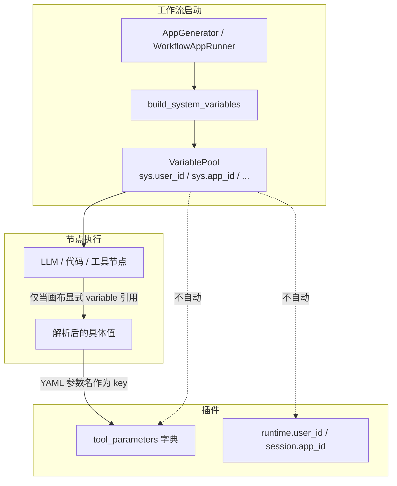
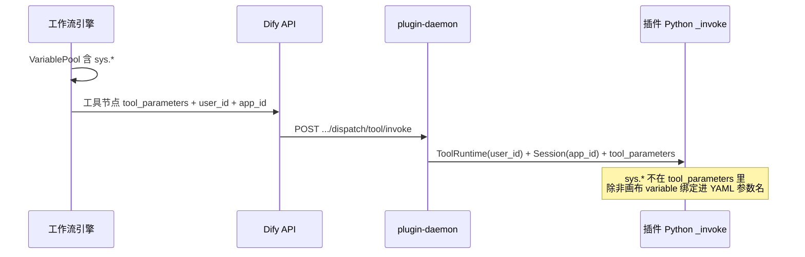
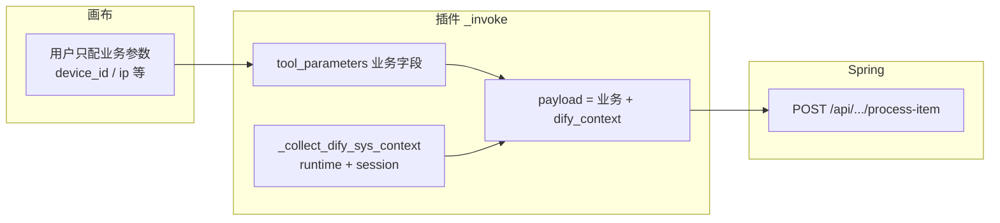

# Dify 系统参数（sys.*）使用方式与源码分析 —— 插件开发者完整指南

> **核心结论**：画布上 `/` 提示的 `sys.user_id`、`sys.app_id`、`sys.workflow_id`、`sys.workflow_run_id` 等，是**工作流 VariablePool 内的系统变量**，供节点间引用；**不会自动注入**插件的 `tool_parameters`。在插件 `_invoke` 里写 `tool_parameters.get("sys.user_id")` **必然拿不到**。**已验证可行方案**：在 `_invoke` 内从 `self.runtime` / `self.session` 收集系统上下文，以 **`dify_context` 字段**静默并入 SOAR / Spring 请求体——**无需改 YAML、无需画布配置、用户界面不可见**；已在插件 `dbapp/firewall_mingyu_das_tgfw:0.0.6` 的 `block_ip` 工具实测通过（HTTP 200）。
>
> **版本锚点**：Dify 1.12.x / dify_plugin SDK 0.9.x（对照 `api/core/workflow/system_variables.py`、`api/core/plugin/impl/tool.py`、`dify_plugin/core/plugin_executor.py`）。
>
> **实战案例**：
> - `dbapp/firewall_mingyu_das_tgfw:0.0.6` → `block_ip`（**已实测**：SOAR proxy + `dify_context`）
> - `test-dify/plugin-iot-device-plugin/tools/process_device_item.py`（同方案，Spring `process-item`）
>
> **相关阅读**：
> - [dynamic-select 配置期与运行期参数全解](./20260604-1090-dify动态参数dynamic-select接口的配置期和运行期的参数.md)
> - [插件日志打印与调用链路](20260611-1120-Dify 插件日志打印查看方式和打印流程.md)

---

## 目录

1. [这篇博客要回答什么](#1-这篇博客要回答什么)
2. [系统参数是什么](#2-系统参数是什么)
3. [源码分析：系统变量从哪来](#3-源码分析系统变量从哪来)
4. [源码分析：工作流如何引用 sys.*](#4-源码分析工作流如何引用-sys)
5. [源码分析：插件工具调用全链路](#5-源码分析插件工具调用全链路)
6. [为什么 tool_parameters.get('sys.xxx') 拿不到](#6-为什么-tool_parametersgetsysxxx-拿不到)
7. [方案全景与选型](#7-方案全景与选型)
8. [方案一：静默注入（推荐）](#8-方案一静默注入推荐)
9. [方案二：YAML + 画布变量绑定](#9-方案二yaml--画布变量绑定)
10. [方案三：封装子工作流再发布为工具](#10-方案三封装子工作流再发布为工具)
11. [方案四：改 Dify / plugin-daemon 源码](#11-方案四改-dify--plugin-daemon-源码)
12. [能否隐藏或只读系统参数](#12-能否隐藏或只读系统参数)
13. [实战复盘：block_ip 失败 vs dify_context 成功](#13-实战复盘block_ip-失败-vs-dify_context-成功)
14. [完整案例：dify_context 静默注入（block_ip + process_device_item）](#14-完整案例dify_context-静默注入block_ip--process_device_item)
15. [对照总表](#15-对照总表)
16. [常见问题 FAQ](#16-常见问题-faq)
17. [总结](#17-总结)

---

## 1. 这篇博客要回答什么

在开发 Dify 插件（如防火墙 `block_ip`、IoT `process_device_item`）时，连续遇到这些问题：

**问题一**：画布输入 `/` 能看到 `sys.user_id`、`sys.app_id` 等，能否在插件 Python 里用 `tool_parameters.get("sys.user_id")` 直接读取？

**问题二**：能否在 YAML 里「内置好」系统参数引用，拖进画布后不用每个工具节点再配 `{x}`？

**问题三**：若用 YAML 声明了系统参数，能否在界面上隐藏或设为只读，避免用户修改？

**问题四**：`self.runtime.user_id` 与 `sys.user_id`、`self.session.app_id` 与凭证里的 `app_id` 有什么区别？

本文基于 Dify 源码、plugin-daemon 请求体、dify_plugin SDK，结合 `block_ip` **改造前后对比日志**（旧方案全 N/A → `dify_context` 实测 200）与 `process_device_item` 案例，给出可落地的答案。

---

## 2. 系统参数是什么

### 2.1 前端可见的 sys.* 列表

工作流画布按场景暴露不同系统变量（`web/app/components/workflow/constants.ts` → `getGlobalVars`）：

| 变量名 | 类型 | 出现场景 |
|--------|------|----------|
| `sys.user_id` | string | 工作流 / 聊天 |
| `sys.app_id` | string | 工作流 / 聊天 |
| `sys.workflow_id` | string | 工作流 / 聊天 |
| `sys.workflow_run_id` | string | 工作流 / 聊天 |
| `sys.timestamp` | number | 仅工作流编辑页（非聊天模式） |
| `sys.conversation_id` | string | 聊天模式 |
| `sys.dialogue_count` | number | 聊天模式 |
| `sys.query` | string | 聊天模式（LLM 等节点） |
| `sys.files` | array[file] | 含文件输入时 |

用户在工具节点、LLM 节点等位置输入 `/` 或 `{x}`，选到的就是这些变量。

### 2.2 后端枚举定义

系统变量键名在后端 `SystemVariableKey` 枚举中定义（`api/core/workflow/system_variables.py`）：

```python
class SystemVariableKey(StrEnum):
    QUERY = "query"
    FILES = "files"
    CONVERSATION_ID = "conversation_id"
    USER_ID = "user_id"
    DIALOGUE_COUNT = "dialogue_count"
    APP_ID = "app_id"
    WORKFLOW_ID = "workflow_id"
    WORKFLOW_EXECUTION_ID = "workflow_run_id"  # 注意：枚举名与对外 sys 名不同
    TIMESTAMP = "timestamp"
    # ... 其他 RAG / 数据源相关
```

对外展示为 `sys.user_id`，在 VariablePool 内选择器为 `["sys", "user_id"]`（`SYSTEM_VARIABLE_NODE_ID` + 键名）。

### 2.3 与工作流 API 返回的 inputs 一致

工作流 SSE 事件 `workflow_started` 的 `inputs` 中可见完整系统字段，例如：

```json
{
  "sys.files": [],
  "sys.user_id": "f5b0ab66-fee2-4d8a-9a6b-b09930273f89",
  "sys.app_id": "368e49bf-f581-43f0-aa3a-78a12a58b702",
  "sys.workflow_id": "46944891-feb7-420f-a3ab-db540ab2c7a0",
  "sys.workflow_run_id": "32d43085-9457-4b9e-8cf0-0855be71de8e"
}
```

这说明 **sys.* 存在于工作流引擎层**，不等于 **已传入插件 Python 的 tool_parameters**。

---

## 3. 源码分析：系统变量从哪来

### 3.1 工作流启动时注入 VariablePool

`WorkflowAppRunner` 在运行前调用 `build_system_variables` 构造系统变量，并写入 VariablePool（`api/core/app/apps/workflow/app_runner.py`）：

```python
system_inputs = build_system_variables(
    files=self.application_generate_entity.files,
    user_id=self._sys_user_id,
    app_id=app_config.app_id,
    timestamp=int(naive_utc_now().timestamp()),
    workflow_id=app_config.workflow_id,
    workflow_execution_id=self.application_generate_entity.workflow_execution_id,
)
variable_pool = VariablePool()
add_variables_to_pool(
    variable_pool,
    build_bootstrap_variables(
        system_variables=system_inputs,
        environment_variables=self._workflow.environment_variables,
    ),
)
```

`build_system_variables`（`api/core/workflow/system_variables.py`）将键规范化为 `user_id`、`app_id`、`workflow_run_id` 等，并绑定选择器 `("sys", key)`。

### 3.2 数据流示意



**关键**：VariablePool 是工作流图内部的变量总线；插件在图外（plugin-daemon 进程），只通过 HTTP 请求拿到约定字段。

---

## 4. 源码分析：工作流如何引用 sys.*

### 4.1 工具节点参数分区

前端 `use-config.ts` 注释明确区分（`web/app/components/workflow/nodes/tool/hooks/use-config.ts`）：

```typescript
/*
 * tool_configurations: tool setting, not dynamic setting (form type = form)
 * tool_parameters: tool dynamic setting (form type = llm)
 */
```

| YAML `form` | 画布 UI 区域 | 典型用途 |
|-------------|-------------|----------|
| `form` | 「设置」区 | 手动填值或 `{x}` 引用变量 |
| `llm` | 「输入变量」区 | Agent / LLM 自动填参 |
| `schema` | 「设置」区 | 结构化参数 |

**标准 Dify 没有 `hidden` 或 `read_only` 的 form 类型**；YAML 里声明的参数一定会出现在上述区域之一。

### 4.2 variable 类型如何解析 sys.*

工作流执行前，`ToolManager._convert_tool_parameters_type`（`api/core/tools/tool_manager.py`）从 VariablePool 取值：

```python
if tool_input.type == "variable":
    variable_selector = tool_input.value  # 如 ["sys", "user_id"]
    variable = variable_pool.get(variable_selector)
    if variable is None:
        raise ToolParameterError(f"Variable {tool_input.value} does not exist")
    parameter_value = variable.value
# ...
runtime_parameters[parameter.name] = parameter_value  # key 是 YAML 的 name，不是 sys.user_id
```

画布保存的配置类似：

```json
"dify_user_id": { "type": "variable", "value": ["sys", "user_id"] }
```

运行时解析后进入 `tool_parameters` 的是：

```json
{ "dify_user_id": "f5b0ab66-fee2-4d8a-9a6b-b09930273f89" }
```

**不是** `{ "sys.user_id": "..." }`。

### 4.3 工具节点调用插件

`DifyToolNodeRuntime.invoke`（`api/core/workflow/node_runtime.py`）调用 `ToolEngine.generic_invoke`：

```python
messages = ToolEngine.generic_invoke(
    tool=tool,
    tool_parameters=dict(tool_parameters),
    user_id=self._run_context.user_id,
    workflow_tool_callback=callback,
    workflow_call_depth=workflow_call_depth,
    app_id=self._run_context.app_id,
    conversation_id=runtime_binding.conversation_id,
)
```

注意：`user_id`、`app_id` 与 `tool_parameters` **并列传递**，不 merge 进字典。

`ToolEngine.generic_invoke` 在调用前会合并 `runtime_parameters`（含从 VariablePool 解析的 form 参数）：

```python
if tool.runtime and tool.runtime.runtime_parameters:
    tool_parameters = {**tool.runtime.runtime_parameters, **tool_parameters}
response = tool.invoke(
    user_id=user_id,
    tool_parameters=tool_parameters,
    conversation_id=conversation_id,
    app_id=app_id,
    message_id=message_id,
)
```

---

## 5. 源码分析：插件工具调用全链路

### 5.1 Dify API → plugin-daemon

`PluginToolManager.invoke`（`api/core/plugin/impl/tool.py`）请求体结构：

```json
{
  "user_id": "用户UUID",
  "conversation_id": "会话ID或null",
  "app_id": "Dify应用UUID或null",
  "message_id": "消息ID或null",
  "data": {
    "provider": "iot_device_http",
    "tool": "process_device_item",
    "credentials": { },
    "credential_type": "api-key",
    "tool_parameters": {
      "device_id": "device_001",
      "device_name": "传感器"
    }
  }
}
```

**顶层**有 `user_id`、`app_id`；**data.tool_parameters** 仅有 YAML 声明且画布配置的业务参数。无 `workflow_id`、`workflow_run_id`、`timestamp`。

### 5.2 plugin-daemon → dify_plugin SDK

`plugin_executor.invoke_tool`（`dify_plugin/core/plugin_executor.py`）构造工具实例：

```python
tool = tool_cls(
    runtime=ToolRuntime(
        credentials=request.credentials,
        credential_type=request.credential_type,
        user_id=request.user_id,
        session_id=session.session_id,
    ),
    session=session,
)
yield from tool.invoke(request.tool_parameters)
```

`ToolRuntime` 字段（`dify_plugin/entities/tool.py`）：

```python
class ToolRuntime(BaseModel):
    credentials: dict[str, Any]
    credential_type: CredentialType = CredentialType.API_KEY
    user_id: str | None
    session_id: str | None
```

`Session` 字段（`dify_plugin/core/runtime.py`）：

```python
self.conversation_id: str | None
self.message_id: str | None
self.app_id: str | None          # Dify 工作流/应用 UUID
self.session_id: str               # 本次插件调用会话 ID
```

### 5.3 全链路时序



---

## 6. 为什么 tool_parameters.get('sys.xxx') 拿不到

### 6.1 错误写法（实测失败）

```python
sys_params = {}
for sys_key in ("sys.user_id", "sys.app_id", "sys.workflow_id", "sys.workflow_run_id", "sys.timestamp"):
    val = tool_parameters.get(sys_key)
    if val is not None and val != "":
        soar_key = sys_key.replace("sys.", "sys_")
        sys_params[soar_key] = val
```

### 6.2 真实日志（block_ip 改造前）

```
[block_ip] tool_parameters={'age': '3600', 'desc': '...', 'device_info': 'aa', 'ip_address': '5.5.5.5'}
[block_ip] 系统参数 sys_user_id: N/A
[block_ip] 系统参数 sys_app_id: N/A
[block_ip] 系统参数 sys_workflow_id: N/A
[block_ip] 系统参数 sys_workflow_run_id: N/A
[block_ip] 系统参数 sys_timestamp: N/A
[block_ip] sys_params 最终内容：{}
```

> **改造后**：改用 `dify_context` 静默注入后，同上旧日志仍可能为 N/A，但 `dify_context` 已含有效值且 SOAR 返回 200，详见 [§13](#13-实战复盘block_ip-失败-vs-dify_context-成功)。

原因归纳：

| 误区 | 事实 |
|------|------|
| sys.* 会随工具自动下发 | 不会；只在 VariablePool |
| key 是 `sys.user_id` | 即使绑定，key 也是 YAML 的 `name` |
| YAML 不写也能读 | 未声明的参数不会出现在 tool_parameters |
| `default: "{{#sys.user_id#}}"` | YAML default 不支持变量模板 |

---

## 7. 方案全景与选型

| 方案 | 画布要配吗 | 用户能改吗 | 能拿全量 sys.* | 推荐场景 | 实测状态 |
|------|-----------|-----------|---------------|----------|----------|
| **一、dify_context 静默注入** | ❌ | ❌（无 UI） | 部分 | **插件透传 SOAR/Spring 审计字段（首选）** | ✅ block_ip 0.0.6 已通过 |
| **二、YAML + `{x}` 绑定** | ✅ 每节点 | ✅ | ✅ | 必须对齐 workflow_run_id | 理论可行，未采用 |
| **三、封装子工作流发布为工具** | 封装方配一次 | 消费方不改 | ✅ | 多团队复用同一能力 | — |
| **四、改 Dify / plugin-daemon** | ❌ | ❌ | ✅（自研） | 掌控平台源码的团队 | — |

---

## 8. 方案一：dify_context 静默注入（推荐，已实测）

### 8.0 字段约定：`dify_context`

将系统上下文**单独放在请求体的一个对象字段**里，与业务 `params` 区分，便于 SOAR / Spring 统一解析：

```json
{
  "actionUri": "/block/ip/v2",
  "reqType": "post",
  "appId": "dasca-dbappsecurity-tgfw",
  "params": { "ipAddress": ["5.5.5.5"], "age": "3600" },
  "device_info": "aaa",
  "dify_context": {
    "sys_user_id": "f5b0ab66-fee2-4d8a-9a6b-b09930273f89",
    "sys_app_id": "896b3de8-d021-4451-aa81-93a0bfe4e90c",
    "sys_session_id": "d7f09616-9608-48ad-803d-e9a802ac3129",
    "sys_timestamp": "1781679810"
  }
}
```

字段名 `dify_context` 为项目约定，可改为 `audit_context` 等，但建议全插件统一。

### 8.1 原理

不修改 YAML、不修改画布，在 `_invoke` 内从 SDK 已注入对象读取，写入 `dify_context`：

| sys.* 等价信息 | 插件读取方式 | 零配置 |
|----------------|-------------|--------|
| `sys.user_id` | `self.runtime.user_id` | ✅ |
| `sys.app_id` | `self.session.app_id` | ✅ |
| `sys.conversation_id` | `self.session.conversation_id` | ✅（聊天） |
| 调用 trace | `self.runtime.session_id` | ✅ |
| `sys.timestamp` | `int(time.time())` 插件侧生成 | ✅ |
| `sys.workflow_id` | — | ❌ |
| `sys.workflow_run_id` | — | ❌ |

### 8.2 与凭证 app_id 的区别

```python
self.session.app_id                    # Dify 画布应用 UUID，如 368e49bf-f581-...
self.runtime.credentials.get("app_id") # 插件凭证里的业务实例 ID，如 dasca-dbappsecurity-tgfw
```

二者**完全不同**，SOAR / 防火墙业务接口应使用凭证 `app_id`，审计字段用 `session.app_id`。

### 8.3 优劣势

**优点**：零配置、界面不可见、用户不可改、所有使用该工具的画布自动生效；**已在生产插件 `block_ip` 验证 SOAR proxy 返回 200**。

**缺点**：拿不到 `workflow_id`、`workflow_run_id`（除非改平台或用方案二/三）；可用 `sys_session_id` 作单次调用 trace。

### 8.4 实测可拿到的字段（block_ip 0.0.6）

| dify_context 键 | 实测值示例 | 来源 |
|-----------------|-----------|------|
| `sys_user_id` | `f5b0ab66-fee2-4d8a-9a6b-b09930273f89` | `self.runtime.user_id` |
| `sys_app_id` | `896b3de8-d021-4451-aa81-93a0bfe4e90c` | `self.session.app_id` |
| `sys_session_id` | `d7f09616-9608-48ad-803d-e9a802ac3129` | `self.runtime.session_id` |
| `sys_timestamp` | `1781679810` | 插件侧 `time.time()` |
| `sys_workflow_id` | — | 未注入（协议不支持） |
| `sys_workflow_run_id` | — | 未注入（协议不支持） |

---

## 9. 方案二：YAML + 画布变量绑定

### 9.1 步骤

**步骤 1**：YAML 增加 `form: form` 参数：

```yaml
parameters:
  - name: dify_workflow_run_id
    type: string
    required: false
    form: form
    label:
      zh_Hans: 工作流运行ID（内部）
```

**步骤 2**：工具节点「设置」区，参数旁点 `{x}`，选 `sys.workflow_run_id`。

**步骤 3**：Python 按 YAML 名读取：

```python
run_id = tool_parameters.get("dify_workflow_run_id")
```

### 9.2 能否 YAML 内置引用、免画布配置？

**不能。** 变量绑定存在工作流图 JSON 的 `tool_configurations` 里，由 `ToolManager._convert_tool_parameters_type` 在运行时解析；YAML 的 `default` 仅为静态值，不支持 `{{#sys.user_id#}}`。

### 9.3 优劣势

**优点**：可拿 VariablePool 内任意 sys.*（含 workflow_run_id、timestamp）。

**缺点**：每个工具节点需手动绑定；参数会显示在设置区，**无法隐藏或只读**（标准 Dify 无此能力）。

---

## 10. 方案三：封装子工作流再发布为工具

将「业务插件工具 + 已绑好 sys.* 的中间节点」封装为一个 **Workflow as Tool**：

- **Provider 工作流**：内部工具节点一次性绑好 `sys.workflow_run_id` 等；
- **发布为工具**后，消费方画布只看到业务参数（开始节点 variables），无需再配系统参数。

适合同一能力被多个工作流复用、且必须全量 sys.* 的场景。详见 [发布为工具使用案例](20260612-1040-Dify 发布为工具的使用案例和源码解析.md)。

---

## 11. 方案四：改 Dify / plugin-daemon 源码

若要求 **全量 sys.* + 零配置 + 不可改**，需扩展协议，例如：

1. `WorkflowAppRunner` / `DifyToolNodeRuntime` 将 `workflow_id`、`workflow_run_id` 传入 `PluginToolManager.invoke`；
2. plugin-daemon 转发到 `ToolInvokeRequest` 或 `Session` 新字段；
3. dify_plugin SDK 扩展 `ToolRuntime` 或 `Session`；
4. 插件统一从 `self.runtime.workflow_run_id` 读取。

改动面涉及 `api/core/plugin/impl/tool.py`、plugin-daemon（Go）、`dify_plugin`，适合维护私有 Dify 分支的团队。

---

## 12. 能否隐藏或只读系统参数

### 12.1 标准 Dify：不能

工具参数 UI 逻辑（`use-config.ts`）：

- `form === 'llm'` → 输入变量区；
- `form !== 'llm'` → 设置区。

无 `hidden`、`read_only` 字段；`scope` 不用于隐藏。

### 12.2 实现「用户看不到、不能改」的唯一标准做法

**不要把系统参数写进 YAML**，改用方案一在 Python 静默注入。

### 12.3 折中（不推荐）

| 做法 | 效果 |
|------|------|
| 参数名写成 `_internal_run_id` | 仍会显示，仅不显眼 |
| 工作流模板预填绑定 | 复制后自带，用户仍可改 |
|  fork 前端过滤特定参数名 | 需自研 |

---

## 13. 实战复盘：block_ip 失败 vs dify_context 成功

插件：`dbapp/firewall_mingyu_das_tgfw:0.0.6`，工具：`block_ip`，后端：`POST https://192.168.31.253:443/soar/api/v1.0/soar/proxy`。

### 13.1 改造前：tool_parameters 读 sys.*（失败）

```python
# ❌ 错误写法
for sys_key in ("sys.user_id", "sys.app_id", ...):
    val = tool_parameters.get(sys_key)
```

**日志（2026-06-17，改造前）**：

```
[block_ip] tool_parameters={'age': '3600', 'device_info': 'aa', 'ip_address': '5.5.5.5', ...}
[block_ip] 系统参数 sys_user_id: N/A
[block_ip] 系统参数 sys_app_id: N/A
[block_ip] 系统参数 sys_workflow_id: N/A
[block_ip] 系统参数 sys_workflow_run_id: N/A
[block_ip] 系统参数 sys_timestamp: N/A
[block_ip] sys_params 最终内容：{}
```

SOAR 请求体**无**审计字段。

### 13.2 改造后：dify_context 静默注入（成功）

```python
# ✅ 正确写法
dify_context = _collect_dify_sys_context(self)
proxy_payload = {
    "actionUri": ACTION_BLOCK_IP,
    "reqType": "post",
    "appId": app_id,                    # 凭证业务 appId
    "params": params,
    "device_info": device_info,
    "dify_context": dify_context,       # 静默注入，画布不可见
}
```

**日志（2026-06-17 07:03:30，改造后同一次运行）**：

```
[block_ip] 已选设备：aaa
[block_ip] 系统参数 sys_user_id: N/A          ← 旧逻辑仍在打日志，可删除
[block_ip] 系统参数 sys_app_id: N/A
[block_ip] 系统参数 sys_workflow_id: N/A
[block_ip] 系统参数 sys_workflow_run_id: N/A
[block_ip] 系统参数 sys_timestamp: N/A
[block_ip] sys_params 最终内容：{}            ← 旧逻辑为空，符合预期

[block_ip] 静默注入 dify_context: {
  'sys_user_id': 'f5b0ab66-fee2-4d8a-9a6b-b09930273f89',
  'sys_app_id': '896b3de8-d021-4451-aa81-93a0bfe4e90c',
  'sys_session_id': 'd7f09616-9608-48ad-803d-e9a802ac3129',
  'sys_timestamp': '1781679810'
}

[block_ip] POST https://192.168.31.253:443/soar/api/v1.0/soar/proxy
[block_ip] payload: {
  "actionUri": "/block/ip/v2",
  "reqType": "post",
  "appId": "dasca-dbappsecurity-tgfw",
  "params": {"ipAddress": ["5.5.5.5"], "age": "3600"},
  "device_info": "aaa",
  "dify_context": {
    "sys_user_id": "f5b0ab66-fee2-4d8a-9a6b-b09930273f89",
    "sys_app_id": "896b3de8-d021-4451-aa81-93a0bfe4e90c",
    "sys_session_id": "d7f09616-9608-48ad-803d-e9a802ac3129",
    "sys_timestamp": "1781679810"
  }
}

[block_ip] 响应状态码：200
```

### 13.3 对比结论

| 维度 | tool_parameters.get("sys.xxx") | dify_context 静默注入 |
|------|-------------------------------|----------------------|
| 画布配置 | 需要 YAML + `{x}` 才可能 | **不需要** |
| 用户可见性 | 参数会出现在设置区 | **不可见** |
| 实测 sys_user_id | N/A | ✅ 有值 |
| 实测 sys_app_id | N/A | ✅ 有值 |
| 实测 workflow_run_id | N/A | N/A（协议限制） |
| SOAR 响应 | 200（但无审计字段） | **200 + 含 dify_context** |

**建议**：改造完成后删除旧的 `sys_params` 循环日志，避免误导排查。

### 13.4 根因（失败方案）

1. YAML / 画布未声明、未绑定 sys 相关参数；
2. 误以为 `/` 能看到的变量会自动进入 `tool_parameters`；
3. 未使用 `self.runtime` / `self.session`。

---

## 14. 完整案例：dify_context 静默注入（block_ip + process_device_item）

### 14.1 适用工具

| 工具 | 插件版本 | 后端 | 实测 |
|------|---------|------|------|
| `block_ip` | `firewall_mingyu_das_tgfw:0.0.6` | SOAR proxy | ✅ 200 |
| `process_device_item` | `plugin-iot-device-plugin` | Spring `POST /api/devices/process-item` | 同方案 |

路径示例：`test-dify/plugin-iot-device-plugin/tools/process_device_item.py`

### 14.2 收集函数（通用）

```python
def _collect_dify_sys_context(tool: Any) -> dict[str, str]:
    ctx: dict[str, str] = {}
    if uid := getattr(tool.runtime, "user_id", None):
        ctx["sys_user_id"] = str(uid)
    if app_id := getattr(tool.session, "app_id", None):
        ctx["sys_app_id"] = str(app_id)
    if conversation_id := getattr(tool.session, "conversation_id", None):
        ctx["sys_conversation_id"] = str(conversation_id)
    if session_id := getattr(tool.runtime, "session_id", None):
        ctx["sys_session_id"] = str(session_id)
    ctx["sys_timestamp"] = str(int(time.time()))
    return ctx
```

### 14.3 并入请求体

**Spring（process_device_item）**：

```python
dify_context = _collect_dify_sys_context(self)
self.log.info(f"静默注入 dify_context: {dify_context}")

payload = {
    "device_id": tool_parameters.get("device_id", "") or "",
    # ... 其他业务字段 ...
    "dify_context": dify_context,
}
response, err = self.run_http(ctx, "POST", url, json_body=payload)
```

**SOAR proxy（block_ip，已实测）**：

```python
dify_context = _collect_dify_sys_context(self)
self.log.info(f"静默注入 dify_context: {dify_context}")

proxy_payload = {
    "actionUri": ACTION_BLOCK_IP,
    "reqType": "post",
    "appId": self.runtime.credentials.get("app_id"),
    "params": {"ipAddress": [...], "age": age},
    "device_info": device_info,
    "dify_context": dify_context,
}
# requests.post(soar_proxy_url, json=proxy_payload)
```

### 14.4 请求 JSON 示例

```json
{
  "device_id": "device_001",
  "device_name": "传感器",
  "device_type": "smart_switch",
  "location": "机房A",
  "status": "online",
  "sub_device_list": [],
  "dify_context": {
    "sys_user_id": "f5b0ab66-fee2-4d8a-9a6b-b09930273f89",
    "sys_app_id": "368e49bf-f581-43f0-aa3a-78a12a58b702",
    "sys_session_id": "abc123...",
    "sys_timestamp": "1781095255"
  }
}
```

**Spring process-item**：

```json
{
  "device_id": "device_001",
  "device_name": "传感器",
  "dify_context": {
    "sys_user_id": "f5b0ab66-fee2-4d8a-9a6b-b09930273f89",
    "sys_app_id": "896b3de8-d021-4451-aa81-93a0bfe4e90c",
    "sys_session_id": "d7f09616-9608-48ad-803d-e9a802ac3129",
    "sys_timestamp": "1781679810"
  }
}
```

**SOAR block_ip（实测 payload，已 200）**：见 [§13.2](#132-改造后dify_context-静默注入成功)。

### 14.5 验证清单

重新打包安装插件后运行工作流，plugin-daemon 日志应出现：

```
[block_ip] 静默注入 dify_context: {'sys_user_id': '...', 'sys_app_id': '...', 'sys_session_id': '...', 'sys_timestamp': '...'}
[block_ip] payload: { ..., "dify_context": { ... } }
[block_ip] 响应状态码：200
```

画布上**不会出现**任何系统参数字段；工具 YAML **无需增加 sys 相关 parameters**。

### 14.6 复用到其他工具

将 `_collect_dify_sys_context` 抽到 `tool_logging.py` 的 `SpringToolMixin`，各工具 `_invoke` 开头调用，统一在请求体附加 `"dify_context": dify_context` 即可。

---

## 15. 对照总表

### 15.1 按「想拿什么」查表

| 想获取的内容 | tool_parameters | runtime / session | YAML+画布绑定 |
|-------------|-----------------|-------------------|---------------|
| `sys.user_id` | ❌（除非绑定） | ✅ `runtime.user_id` | ✅ |
| `sys.app_id` | ❌ | ✅ `session.app_id` | ✅ |
| `sys.workflow_id` | ❌ | ❌ | ✅ |
| `sys.workflow_run_id` | ❌ | ❌ | ✅ |
| `sys.timestamp` | ❌ | ⚠️ 插件自生成 | ✅ |
| 凭证业务 `app_id` | ❌ | ✅ `credentials` | — |
| 用户不可见 | — | ✅ 方案一 | ❌ |

### 15.2 按「错误写法」查表

| 写法 | 结果 |
|------|------|
| `tool_parameters.get("sys.user_id")` | 永远拿不到（未绑定且无此 key） |
| `self.sys_user_id` | AttributeError，属性不存在 |
| YAML `default: "{{#sys.user_id#}}"` | 不解析，原样或无效 |
| 只声明 YAML 不绑画布 | tool_parameters 无该 key |
| `self.session.app_id` 当业务 appId | 传错 ID |

---

## 16. 常见问题 FAQ

### Q1：画布 `/` 能选 sys.*，为什么插件里读不到？

`/` 列出的是 **VariablePool 变量**，供节点间引用。插件进程独立，只接收 HTTP 约定的 `tool_parameters` 与 `runtime`/`session` 字段，不会自动同步 VariablePool。

### Q2：能否在 YAML 里内置 sys 引用，拖进画布就不用配？

不能。绑定信息存在工作流图 JSON，不在插件 manifest 里。

### Q3：静默注入能拿到 workflow_run_id 吗？

标准协议不能。plugin-daemon 请求体无此字段。可用 `session_id` 作本次调用 trace，或改用方案二/三/四。

### Q4：`sys.app_id` 和凭证里的 `app_id` 一样吗？

不一样。前者是 Dify 应用 UUID；后者是插件配置的业务实例 ID。

### Q5：Agent 应用里插件工具能拿 sys.* 吗？

`runtime.user_id`、`session.app_id`、`session.conversation_id` 在 Agent 场景通常有值；`workflow_id` / `workflow_run_id` 仍视调用链而定，非工作流工具节点时可能为空。

### Q6：如何让 SOAR 收到下划线字段名 `sys_user_id`？

在收集函数里统一命名即可，与 Dify 侧 `sys.user_id` 仅为不同命名风格，值来源见上表。

### Q7：多个工具都要透传，要复制代码吗？

建议提取 `_collect_dify_sys_context` 到 `SpringToolMixin` 或公共模块，各工具一行调用，请求体统一带 `dify_context`。

### Q8：`dify_context` 方案在生产环境验证了吗？

已验证。`dbapp/firewall_mingyu_das_tgfw:0.0.6` 的 `block_ip` 在工作流中调用 SOAR proxy，`dify_context` 含 `sys_user_id`、`sys_app_id`、`sys_session_id`、`sys_timestamp`，响应 **HTTP 200**（2026-06-17 实测日志见 §13.2）。

### Q9：旧代码里同时打 `sys_params N/A` 和 `dify_context` 日志正常吗？

改造过渡期可能并存：旧 `tool_parameters.get("sys.xxx")` 逻辑仍打印 N/A，新 `dify_context` 已有值。**应以 `dify_context` 为准**；上线后删除旧 `sys_params` 循环，避免误导。

---

## 17. 总结

### 17.1 三条铁律

1. **`sys.*` 属于工作流 VariablePool**，不属于插件 `tool_parameters` 的默认内容。
2. **插件零配置能拿的是 `runtime` / `session`**，封装进 **`dify_context`** 透传后端——`block_ip` 已实测 SOAR 200。
3. **要全量 sys.* 或要对齐 workflow_run_id**，必须画布绑定、子工作流封装，或改平台协议；当前 `dify_context` 用 `sys_session_id` 作调用级 trace。

### 17.2 推荐实践（插件 + Spring 后端）



- **业务参数**：YAML + 画布，用户可见可改。
- **系统上下文**：Python 静默注入，用户无感知。
- **审计对齐**：`dify_context` 携带 `sys_user_id`、`sys_app_id`、`sys_session_id`、`sys_timestamp`（**block_ip 0.0.6 已验证**）；强依赖 `workflow_run_id` 时叠加方案二或三。

### 17.3 本文档路径

`dify/temp_data/202600617-1400-Dify 系统参数使用方式以及源码分析.md`

---

*文档基于 Dify 1.12.x 源码与 dify_plugin 0.9.x 实战整理；`dify_context` 方案于 2026-06-17 在 `firewall_mingyu_das_tgfw:0.0.6` / `block_ip` 实测通过。若升级大版本请重新核对 `PluginToolManager.invoke` 与 `ToolRuntime` 字段。*
