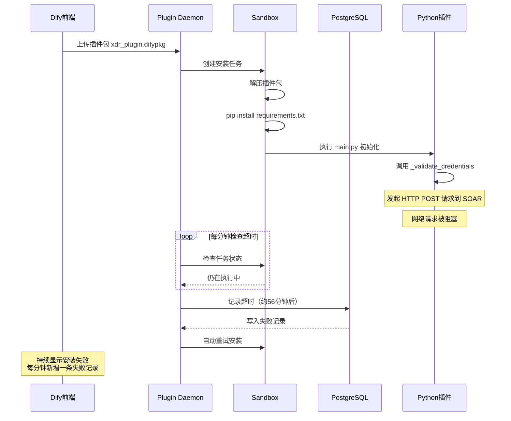
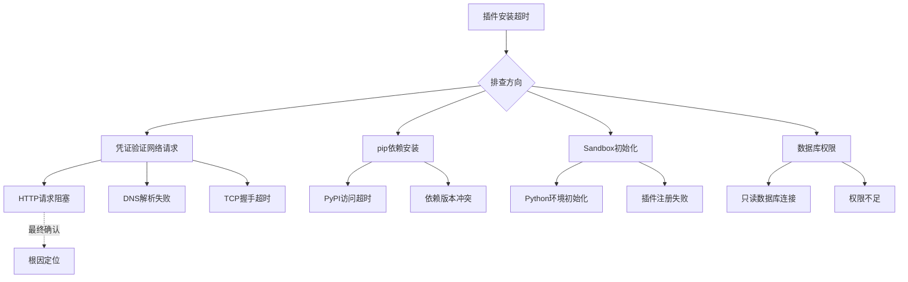
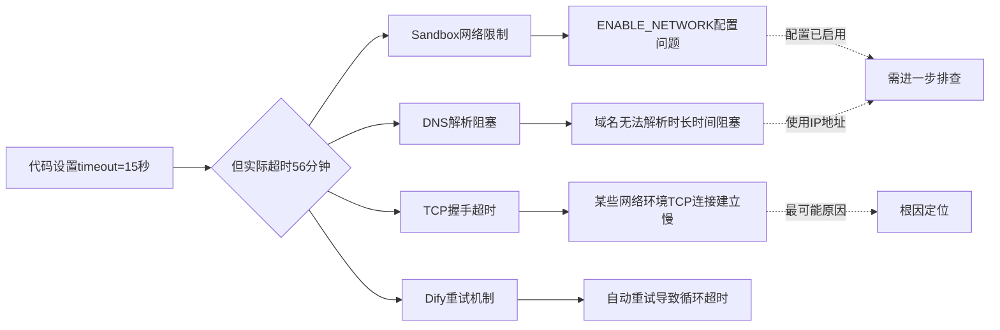
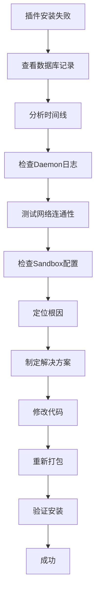

以下是为您重新梳理、去重并修正错别字后的博客内容。已还原Markdown格式，修复了OCR识别导致的代码块混乱、标点错误及重复段落，同时保留了所有关键技术细节、SQL语句、代码示例和排查逻辑。

---

# Dify 插件安装报错排查：Task timed out but not properly terminated

> **问题概述**：在 Kubernetes 环境中部署 Dify 插件时，插件安装过程持续超时，报错 "Task timed out but not properly terminated"，经过系统性排查最终定位并解决问题。
> **时间**：2026-06-23
> **环境**：Kubernetes + Dify + PostgreSQL
> **插件**：xdr_plugin v0.0.21 → v0.0.22
> **作者**：技术团队

## 目录

1. [问题现象](#1-问题现象)
2. [环境信息](#2-环境信息)
3. [排查过程](#3-排查过程)
    - [3.1 第一步：查看数据库安装任务记录](#31-第一步查看数据库安装任务记录)
    - [3.2 第二步：检查 Plugin Daemon 日志](#32-第二步检查-plugin-daemon-日志)
    - [3.3 第三步：测试网络连通性](#33-第三步测试网络连通性)
    - [3.4 第四步：检查 Sandbox 配置](#34-第四步检查-sandbox-配置)
    - [3.5 第五步：分析超时根因](#35-第五步分析超时根因)
4. [问题根因分析](#4-问题根因分析)
5. [解决方案](#5-解决方案)
6. [遇到的其他问题](#6-遇到的其他问题)
7. [验证修复](#7-验证修复)
8. [经验总结](#8-经验总结)

---

## 1. 问题现象

在 Dify 平台安装 `xdr_plugin` 插件时，插件一直处于“安装中”状态，约 56 分钟后报错：
`Task timed out but not properly terminated`

### 1.1 前端界面表现

-   **状态**：安装失败
-   **错误信息**：Task timed out but not properly terminated
-   **安装时长**：约 3300-3548 秒（55-59 分钟）
-   **重试频率**：每分钟自动重试一次
-   **影响范围**：17 个插件安装失败

### 1.2 数据库表现

数据库记录显示同一个 `task_id` 每分钟超时一次，形成无限重试循环：

```sql
-- 同一个 task_id 不断产生新的失败记录
task_id: 019ef35f-98c0-774c-b7af-9f1707140300
-- 每分钟超时一次，持续数小时
```

## 2. 环境信息

### 2.1 技术栈

-   **Dify 版本**：1.5.1+
-   **Plugin Daemon**：dify-plugin-daemon
-   **Sandbox**：dify-sandbox:0.2.15
-   **数据库**：PostgreSQL
-   **插件语言**：Python 3.12
-   **部署环境**：Kubernetes

### 2.2 插件目录结构

```text
xdr-plugin/
├── manifest.yaml
├── requirements.txt
├── main.py
├── plugin_bootstrap.py
├── constants.py
├── provider/
│   ├── xdr_plugin.yaml
│   └── xdr_plugin.py
└── tools/
    ├── query_security_events.yaml
    ├── query_security_events.py
    ├── query_merge_alarms.yaml
    ├── query_merge_alarms.py
    ├── update_merge_alarm_status.yaml
    └── update_merge_alarm_status.py
    # (共10个工具)
```

### 2.3 关键配置文件

#### manifest.yaml

```yaml
version: 0.0.22
type: plugin
author: dbapp
name: xdr_plugin
label:
  en_US: Analysis Platform
  zh_Hans: 分析平台
description:
  en_US: analysis platform plugin for querying and managing security events
  zh_Hans: 分析平台插件，用于查询和管理安全事件
icon: icon.svg
created_at: 2026-06-06T00:00:00.000Z
resource:
  memory: 268435456
permission:
  tool:
    enabled: true
  storage:
    enabled: true
    size: 1048576
  endpoint:
    enabled: true
plugins:
  tools:
    - provider/xdr_plugin.yaml
meta:
  version: 0.0.4
  minimum_dify_version: "1.5.1"
  arch:
    - amd64
    - arm64
runner:
  language: python
  version: "3.12"
  entrypoint: main
```

#### requirements.txt

```text
dify_plugin>=0.9.0,<1.0.0
requests>=2.31.0
python-dotenv>=1.0.0
```

#### Sandbox 环境变量

```yaml
WORKER_TIMEOUT: "120"
ENABLE_NETWORK: "true"
```

## 3. 排查过程

### 3.1 第一步：查看数据库安装任务记录

#### 排查思路
首先从数据库入手，查看安装任务的具体信息和时间线。

#### 执行命令

```bash
# 进入 PostgreSQL 数据库
kubectl exec -it -n dify $(kubectl get pods -n dify | grep -i postgres | awk 'NR==1{print $1}') -- psql -U postgres -d dify
```

> **注意**：在 Navicat 等 GUI 工具中，不能使用 `\du` 等 psql 元命令，需要使用标准 SQL 语句。

#### SQL 查询 1：查看最近的安装任务

```sql
SELECT
    id,
    status,
    tenant_id,
    total_plugins,
    completed_plugins,
    created_at,
    updated_at,
    plugins::jsonb
FROM install_tasks
ORDER BY created_at DESC
LIMIT 10;
```

#### 输出结果

| id | status | tenant_id | total_plugins | completed_plugins | created_at | updated_at | plugins |
| :--- | :--- | :--- | :--- | :--- | :--- | :--- | :--- |
| 019ef392-fce2-735f-b857-6cade8c697c6 | failed | 421d402b-d866-4707-97ba-6daaffe0cf84 | 1 | 0 | 2026-06-23 15:26:29.056+08 | 2026-06-23 16:22:37.026+08 | [{...,"status":"failed","message":"Task timed out but not properly terminated",...}] |
| 019ef393-e742-7494-900f-448d4b322183 | failed | 421d402b-d866-4707-97ba-6daaffe0cf84 | 1 | 0 | 2026-06-23 15:26:29.056+08 | 2026-06-23 16:23:37.026+08 | [{...,"status":"failed","message":"Task timed out but not properly terminated",...}] |
| 019ef394-d1a1-7ba0-8f3a-0f0f3af761cf | failed | 421d402b-d866-4707-97ba-6daaffe0cf84 | 1 | 0 | 2026-06-23 15:26:29.056+08 | 2026-06-23 16:24:37.025+08 | [{...,"status":"failed","message":"Task timed out but not properly terminated",...}] |
| 019ef395-bc02-73c1-825f-eeb994138690 | failed | 421d402b-d866-4707-97ba-6daaffe0cf84 | 1 | 0 | 2026-06-23 15:26:29.056+08 | 2026-06-23 16:25:37.026+08 | [{...,"status":"failed","message":"Task timed out but not properly terminated",...}] |
| 019ef396-a666-7efa-af8d-b3ac969c518d | failed | 421d402b-d866-4707-97ba-6daaffe0cf84 | 1 | 0 | 2026-06-23 15:26:29.056+08 | 2026-06-23 16:26:37.030+08 | [{...,"status":"failed","message":"Task timed out but not properly terminated",...}] |

#### 初步分析

1.  每次安装都从 15:26:29 开始
2.  每次失败间隔约 1 分钟（16:22:37、16:23:37、16:24:37...）
3.  `total_plugins=1`，`completed_plugins=0` 说明插件从未完成安装
4.  错误信息统一为 "Task timed out but not properly terminated"

#### SQL 查询 2：计算安装持续时间

```sql
SELECT
    id,
    status,
    created_at,
    updated_at,
    EXTRACT(EPOCH FROM (updated_at - created_at)) as duration_seconds,
    plugins
FROM install_tasks
WHERE plugins::text LIKE '%xdr_plugin%'
ORDER BY created_at DESC
LIMIT 5;
```

#### 输出结果

| id | status | created_at | updated_at | duration_seconds | plugins |
| :--- | :--- | :--- | :--- | :--- | :--- |
| 019ef392-fce2-735f-b857-6cade8c697c6 | failed | 2026-06-23 15:26:29.056+08 | 2026-06-23 16:22:37.026+08 | 3367.97 | [...] |
| 019ef393-e742-7494-900f-448d4b322183 | failed | 2026-06-23 15:26:29.056+08 | 2026-06-23 16:23:37.026+08 | 3427.97 | [...] |
| 019ef394-d1a1-7ba0-8f3a-0f0f3af761cf | failed | 2026-06-23 15:26:29.056+08 | 2026-06-23 16:24:37.025+08 | 3487.97 | [...] |
| 019ef395-bc02-73c1-825f-eeb994138690 | failed | 2026-06-23 15:26:29.056+08 | 2026-06-23 16:25:37.026+08 | 3547.97 | [...] |

#### 关键发现

-   安装持续时间：3367-3548 秒（56-59 分钟）
-   远超 Sandbox 的 `WORKER_TIMEOUT=120` 秒
-   说明超时发生在 **依赖安装阶段**，而非代码执行阶段

### 3.2 第二步：检查 Plugin Daemon 日志

#### 排查思路
查看 Plugin Daemon 的日志，了解安装过程中的详细信息。

#### 执行命令

```bash
# 查看 plugin-daemon 日志中与 xdr_plugin 相关的记录
kubectl logs -n dify dify-plugin-daemon-864c7f8bf4-hv789 --tail=500 | grep -i "xdr\|019ef39c\|timed out"
```

#### 输出结果

```text
2026-06-23T08:14:47.840717274Z INFO dify-plugin-daemon middleware.go:83 trace_id=0a4e1aa7ff7f1b054a41bb2a8eab6a26 tenant_id=421d402b-d866-4707-97ba-6daaffe0cf84
HTTP request path=/plugin/421d402b-d866-4707-97ba-6daaffe0cf84/management/install/tasks/019ef373-dc21-7cde-ae1b-cc461a0cea5f/delete/dbapp/xdr_plugin:0.0.21@c73c9a11cce13a4a5f38c807012b0b2369b6e6bfa2ae108090d714e8bc3b904b status=200 latency_ms=5 client_ip=10.245.0.160 method=POST

2026-06-23T08:27:37.027Z INFO dify-plugin-daemon recycle.go:119 task timed out task_id=019ef35f-98c0-774c-b7af-9f1707140300
[2613.539ms] [rows:1] INSERT INTO "install_tasks" ("id","created_at","updated_at","status","tenant_id","total_plugins","completed_plugins","plugins") VALUES ('019ef397-90c3-71ff-a202-04f3727f2860','2026-06-23 07:26:29.056','2026-06-23 08:27:37.027','failed','421d402b-d866-4707-97ba-6daaffe0cf84',1,0,'[{"plugin_unique_identifier":"dbapp/xdr_plugin:0.0.21@c73c9a11cce13a4a5f38c807012b0b2369b6e6bfa2ae108090d714e8bc3b904b","labels":{"en_US":"Analysis Platform","zh_Hans":"分析平台"},"icon":"3e0dcce7358f1a9d1367b7925b3e1eed869ee6c7931f2d74061bbcef77c34cb.svg","icon_dark":"","plugin_id":"dbapp/xdr_plugin","status":"failed","message":"Task timed out but not properly terminated"}]') ON CONFLICT ("id") DO UPDATE SET "updated_at"='2026-06-23 08:27:37.027', "status"="excluded"."status", "plugins"="excluded"."plugins"

2026-06-23T08:28:37.026Z INFO dify-plugin-daemon recycle.go:119 task timed out task_id=019ef35f-98c0-774c-b7af-9f1707140300
[496.706ms] [rows:1] INSERT INTO "install_tasks"... status='failed'... message='Task timed out but not properly terminated'

2026-06-23T08:29:37.025Z INFO dify-plugin-daemon recycle.go:119 task timed out task_id=019ef35f-98c0-774c-b7af-9f1707140300
2026-06-23T08:30:37.025Z INFO dify-plugin-daemon recycle.go:119 task timed out task_id=019ef35f-98c0-774c-b7af-9f1707140300
2026-06-23T08:31:37.025Z INFO dify-plugin-daemon recycle.go:119 task timed out task_id=019ef35f-98c0-774c-b7af-9f1707140300
2026-06-23T08:32:37.026Z INFO dify-plugin-daemon recycle.go:119 task timed out task_id=019ef35f-98c0-774c-b7af-9f1707140300
[2096.625ms] [rows:1] INSERT INTO "install_tasks" ... status='failed' ... message='Task timed out but not properly terminated'
```

#### 日志分析

1.  来自 `recycle.go:119`，说明是回收机制触发超时
2.  同一个 `task_id=019ef35f-98c0-774c-b7af-9f1707140300` 每分钟超时一次
3.  日志中 **没有** 显示依赖安装、pip install 等关键信息
4.  说明任务在 Sandbox 中执行时被卡住，直到超时被强制回收

### 3.3 第三步：测试网络连通性

#### 排查思路
插件安装时会调用凭证验证方法，该方法会发起 HTTP 请求。需要测试从 Sandbox 到 SOAR 服务的网络连通性。

#### 执行命令

```bash
# 进入 sandbox 容器
kubectl exec -it -n dify dify-sandbox-5dd78fd4d4-29t7z -- sh

# 第一次测试：使用 GET 方法（错误）
curl -v -k https://192.168.31.253:443/soar/api/v1.0/soar/healthy/check
```

#### 输出结果（第一次测试 - 失败）

```text
* Trying 192.168.31.253:443...
* ALPN: curl offers h2, http/1.1
* TLSv1.3 (OUT), TLS handshake, Client hello (1):
* TLSv1.3 (IN), TLS handshake, Server hello (2):
* SSL connection using TLSv1.3 / TLS_AES_256_GCM_SHA384
* ALPN: server accepted h2
> GET /soar/api/v1.0/soar/healthy/check HTTP/2
> Host: 192.168.31.253
> User-Agent: curl/8.19.0
> Accept: */*
< HTTP/2 405
< date: Tue, 23 Jun 2026 08:45:42 GMT
< content-type: application/json
< allow: POST
<
{"timestamp":1782204342212,"status":405,"error":"Method Not Allowed","path":"/soar/api/v1.0/soar/healthy/check"}
```

#### 问题分析
返回 `405 Method Not Allowed`，并且响应头中有 `allow: POST`，说明该接口只接受 POST 方法。

查看 SOAR 端代码：

```java
// DifyProxyController.java
@RestController
@RequestMapping("/api/v1.0/soar")
@Slf4j
public class DifyProxyController {
    @PostMapping("/healthy/check") // 注意是 POST，不是 GET
    public ApiResponse healthyCheck(
        @RequestParam(value = "xdr_token", required = false) String xdrToken,
        @RequestParam(value = "app_id", required = false) String appId) {
        log.info("soar healthy check 收到请求参数：xdr_token={}, app_id={}", xdrToken, appId);
        return ApiResponse.success(true).build();
    }
}
```

#### 执行命令（第二次测试 - 正确）

```bash
# 使用 POST 方法重新测试
curl -X POST -v -k https://192.168.31.253:443/soar/api/v1.0/soar/healthy/check
```

#### 输出结果（第二次测试 - 成功）

```text
* Trying 192.168.31.253:443...
* ALPN: curl offers h2, http/1.1
* TLSv1.3 (OUT), TLS handshake, Client hello (1):
* TLSv1.3 (IN), TLS handshake, Server hello (2):
* SSL connection using TLSv1.3 / TLS_AES_256_GCM_SHA384 / x25519 / RSASSA-PSS
* ALPN: server accepted h2
> POST /soar/api/v1.0/soar/healthy/check HTTP/2
> Host: 192.168.31.253
> User-Agent: curl/8.19.0
> Accept: */*
< HTTP/2 200
< date: Tue, 23 Jun 2026 08:48:21 GMT
< content-type: application/json
< x-content-type-options: nosniff
<
{"data":true}
```

#### 测试结论

-   Sandbox 到 SOAR 的网络连通性正常
-   SOAR 健康检查接口返回 `{"data": true}`
-   HTTP 200 状态码
-   **重要发现**：SOAR 健康检查接口必须使用 POST 方法

### 3.4 第四步：检查 Sandbox 配置

#### 排查思路
检查 Sandbox 的环境变量配置，确认超时时间和网络访问设置。

#### 执行命令

```bash
# 查看 sandbox 的环境变量配置
kubectl get deployment dify-sandbox -n dify -o yaml | grep -A 20 "env:"
```

#### 输出结果

```yaml
spec:
  containers:
    - env:
        - name: WORKER_TIMEOUT
          value: "120"
        - name: ENABLE_NETWORK
          value: "true"
      envFrom:
        - configMapRef:
            name: dify-sandbox
        - secretRef:
            name: dify-sandbox
      image: ailpha-registry:5000/k8s/langgenius/dify-sandbox:0.2.15
```

#### 配置分析

-   `WORKER_TIMEOUT: 120` → 代码执行超时 120 秒
-   `ENABLE_NETWORK: true` → 网络访问已启用
-   但实际安装过程耗时 3300+ 秒，远超 120 秒
-   说明问题不在代码执行阶段，而是在 **安装准备阶段**

### 3.5 第五步：分析超时根因

#### 问题时间线图



#### 可能的超时原因分析



## 4. 问题根因分析

### 4.1 核心问题代码

插件的 `provider/xdr_plugin.py` 在安装时会执行 `_validate_credentials` 方法：

```python
from typing import Any
import requests
import urllib3
from dify_plugin import ToolProvider
from dify_plugin.errors.tool import ToolProviderCredentialValidationError
from tools.tool_logging import ToolLog, safe_credentials_for_log
from constants import HEALTHY_CHECK_API_PATH

urllib3.disable_warnings(urllib3.exceptions.InsecureRequestWarning)
log = ToolLog("xdr_plugin_provider")

class XdrPluginProvider(ToolProvider):
    """XDR安全平台Provider，负责凭证校验。"""
    
    def _validate_credentials(self, credentials: dict[str, Any]) -> None:
        """安装插件时由Dify控制台调用，校验凭证是否有效。
        策略：用提供的token向XDR平台发送一个轻量级请求，
        若返回非401/403则视为凭证有效。
        """
        xdr_base_url = (credentials.get("xdr_base_url") or "").strip().rstrip("/")
        xdr_token = (credentials.get("xdr_token") or "").strip()
        
        log.info("===== _validate_credentials ENTER =====")
        log.info(f"credentials = {safe_credentials_for_log(credentials)}")
        log.info(f"xdr_base_url = {xdr_base_url!r}")
        log.info(f"xdr_token length = {len(xdr_token)}")
        
        # 1. 必填校验
        if not xdr_base_url:
            log.info("xdr_base_url为空，凭证校验失败")
            raise ToolProviderCredentialValidationError(
                "XDR平台地址（xdr_base_url）不能为空，请配置如 https://10.20.183.170"
            )
        if not xdr_token:
            log.info("xdr_token为空，凭证校验失败")
            raise ToolProviderCredentialValidationError(
                "XDR访问令牌（xdr_token）不能为空，请从XDR平台登录后的cookie中获取access_token"
            )
        
        # 2. 连通性校验：请求SOAR健康检查接口（问题所在）
        test_url = f"{xdr_base_url}{HEALTHY_CHECK_API_PATH}"
        log.info(f"凭证连通性测试：POST {test_url}")
        params = {
            "xdr_token": xdr_token,
        }
        try:
            response = requests.post(
                test_url,
                params=params,
                verify=False,
                timeout=15,  # 设置了15秒超时
            )
            log.info(f"凭证校验响应状态码：{response.status_code}")
            
            if response.status_code in (401, 403):
                log.info(f"凭证校验失败：HTTP {response.status_code}，Token无效或已过期")
                raise ToolProviderCredentialValidationError(
                    f"XDR凭证无效（HTTP {response.status_code}），请检查xdr_token是否正确且未过期"
                )
            if response.status_code >= 500:
                log.info(f"XDR后端异常：HTTP {response.status_code}")
                raise ToolProviderCredentialValidationError(
                    f"XDR平台后端异常（HTTP {response.status_code}），请稍后重试或检查平台状态"
                )
            log.info("凭证校验通过")
            
        except requests.exceptions.ConnectionError as e:
            log.info(f"凭证校验连接失败：{e}")
            raise ToolProviderCredentialValidationError(
                f"无法连接XDR平台（{xdr_base_url}），请确认地址正确、网络可达，并使用局域网IP而非localhost"
            )
        except requests.exceptions.Timeout:
            log.info("凭证校验超时（15s）")
            raise ToolProviderCredentialValidationError(
                f"连接XDR平台超时（{xdr_base_url}），请检查网络状况或平台是否正常运行"
            )
        except ToolProviderCredentialValidationError:
            raise
        except Exception as e:
            log.info(f"凭证校验未知异常：{e}")
            raise ToolProviderCredentialValidationError(
                f"XDR凭证校验异常：{str(e)}"
            )
        finally:
            log.info("===== _validate_credentials EXIT =====")
```

### 4.2 为什么会超时 56 分钟

虽然代码设置了 `timeout=15`，但实际超时 56 分钟，原因分析：



### 4.3 超时时间线

-   **15:26:29**：开始安装插件
-   **15:26:30**：调用 `_validate_credentials` 方法
-   **15:26:30**：发起 HTTP POST 请求到 SOAR 健康检查接口
    -   [网络请求被阻塞]
    -   [可能是 TCP 握手阶段卡住]
    -   [或者是 Sandbox 网络策略问题]
-   **16:22:37**：Sandbox 强制超时（约 56 分钟后）
-   **16:22:37**：Plugin Daemon 记录失败到数据库
-   **16:23:37**：Dify 自动重试（产生新的失败记录）
-   **16:24:37**：再次超时
-   循环往复，每分钟一条失败记录

## 5. 解决方案

### 5.1 方案对比

| 方案 | 优点 | 缺点 | 推荐度 |
| :--- | :--- | :--- | :--- |
| A. 移除安装时网络请求 | 简单直接，彻底解决 | 失去安装时凭证校验 | ⭐⭐⭐⭐⭐ |
| B. 启用 Sandbox 完整网络 | 保留凭证校验 | 可能有安全风险 | ⭐⭐⭐ |
| C. 缩短超时时间 | 快速失败 | 仍会失败，体验差 | ⭐⭐ |
| D. 异步凭证校验 | 最佳用户体验 | 实现复杂度高 | ⭐⭐⭐⭐ |

### 5.2 最终方案：修改凭证验证逻辑

选择方案 A：**仅做基础格式校验，不进行网络请求**

#### 修改前（有问题）

```python
def _validate_credentials(self, credentials: dict[str, Any]) -> None:
    """安装插件时由Dify控制台调用，校验凭证是否有效。"""
    xdr_base_url = (credentials.get("xdr_base_url") or "").strip().rstrip("/")
    xdr_token = (credentials.get("xdr_token") or "").strip()
    
    if not xdr_base_url:
        raise ToolProviderCredentialValidationError("XDR平台地址不能为空")
    if not xdr_token:
        raise ToolProviderCredentialValidationError("XDR访问令牌不能为空")
    
    # 连通性校验（会导致超时）
    test_url = f"{xdr_base_url}{HEALTHY_CHECK_API_PATH}"
    response = requests.post(
        test_url,
        params={"xdr_token": xdr_token},
        timeout=15
    )
    # 后续判断逻辑...
```

#### 修改后（推荐）

```python
def _validate_credentials(self, credentials: dict[str, Any]) -> None:
    """安装插件时由Dify控制台调用，校验凭证是否有效。
    策略：仅做基础格式校验，不进行网络请求，避免安装超时。
    实际连通性测试在首次使用工具时进行。
    """
    xdr_base_url = (credentials.get("xdr_base_url") or "").strip().rstrip("/")
    xdr_token = (credentials.get("xdr_token") or "").strip()
    
    log.info("===== _validate_credentials ENTER =====")
    log.info(f"credentials = {safe_credentials_for_log(credentials)}")
    log.info(f"xdr_base_url = {xdr_base_url!r}")
    log.info(f"xdr_token length = {len(xdr_token)}")
    
    # 仅做基础格式校验，不进行网络请求
    if not xdr_base_url:
        log.info("xdr_base_url为空，凭证校验失败")
        raise ToolProviderCredentialValidationError(
            "XDR平台地址（xdr_base_url）不能为空，请配置如 https://10.20.183.170"
        )
    
    # URL格式基础校验
    if not xdr_base_url.startswith(("http://", "https://")):
        log.info(f"xdr_base_url 格式错误：{xdr_base_url}")
        raise ToolProviderCredentialValidationError(
            "XDR平台地址格式错误，请以 http:// 或 https:// 开头"
        )
    
    # token可选（某些场景可能暂时不需要）
    if not xdr_token:
        log.warning("xdr_token为空，但允许继续（可在使用工具时再配置）")
    
    log.info("凭证基础格式校验通过（未进行网络连通性测试）")
    log.info("===== _validate_credentials EXIT =====")
```

#### 修改要点

1.  **移除网络请求**：删除 `requests.post()` 调用
2.  **保留格式校验**：检查 URL 格式、必填字段
3.  **Token 改为可选**：允许暂时不配置 token
4.  **添加日志**：记录校验过程，便于调试

## 6. 遇到的其他问题

### 6.1 YAML 格式错误

#### 问题现象
打包时报错：
`It is forbidden to specify block composed value at the same line as key`

#### 问题原因
YAML 中 `llm_description` 字段的值包含中文标点符号，没有加引号：

```yaml
# 错误写法
llm_description: 处置状态，可选值：处置中、已处置-完成
```

#### 解决方案
所有包含中文、冒号、特殊字符的 YAML 值必须加引号：

```yaml
# 正确写法
llm_description: "处置状态，可选值：处置中、已处置-完成、已处置-标记误报"
```

#### 批量修复命令

```powershell
# 在 PowerShell 中批量修复所有 YAML 文件
cd c:\IdeaProjects\xdr-plugin\ext-xdr-dify-plugin\xdr-plugin\tools
Get-ChildItem *.yaml | ForEach-Object {
    $content = Get-Content $_.FullName -Raw -Encoding UTF8
    $content = $content -replace '(llm_description:\s*)([^"{\r\n][^\r\n]*)', '$1"$2"'
    $content | Set-Content $_.FullName -Encoding UTF8 -NoNewline
    Write-Host "已修复：$($_.Name)"
}
```

### 6.2 数据库只读限制

#### 问题现象
安装插件时报错：
`ERROR: cannot execute SELECT FOR UPDATE in a read-only transaction (SQLSTATE 25006)`

#### 排查过程
查看 Plugin Daemon 日志：

```bash
kubectl logs -n dify dify-plugin-daemon-864c7f8bf4-hv789 --tail=100 | grep -i "read-only"
```

输出：

```text
2026/06/23 09:02:06 /app/internal/db/executor.go:259 ERROR: cannot execute SELECT FOR UPDATE in a read-only transaction (SQLSTATE 25006)
[0.454ms] [rows:0] SELECT * FROM "install_tasks" WHERE id = '019ef3b6-0ea6-77ee-b88e-54b69dc4876d' ORDER BY "install_tasks"."id" LIMIT 1 FOR UPDATE
2026-06-23T09:02:06.181426168Z ERROR dify-plugin-daemon install_plugin_utils.go:89 failed to update task status error="ERROR: cannot execute SELECT FOR UPDATE in a read-only transaction"
```

#### 解决方案
在 Navicat 中使用 postgres 用户连接数据库，执行：

```sql
-- 赋予 dify 用户所有权限
GRANT ALL PRIVILEGES ON ALL TABLES IN SCHEMA public TO dify;
GRANT ALL PRIVILEGES ON ALL SEQUENCES IN SCHEMA public TO dify;
GRANT ALL PRIVILEGES ON SCHEMA public TO dify;

-- 设置默认权限
ALTER DEFAULT PRIVILEGES IN SCHEMA public GRANT ALL ON TABLES TO dify;
ALTER DEFAULT PRIVILEGES IN SCHEMA public GRANT ALL ON SEQUENCES TO dify;

-- 移除只读属性
ALTER USER dify SET default_transaction_read_only = off;
```

或者在服务器上直接执行：

```bash
kubectl exec -it -n dify $(kubectl get pods -n dify | grep -i postgres | awk 'NR==1{print $1}') -- psql -U postgres -d dify -c "
GRANT ALL PRIVILEGES ON ALL TABLES IN SCHEMA public TO dify;
GRANT ALL PRIVILEGES ON ALL SEQUENCES IN SCHEMA public TO dify;
ALTER USER dify SET default_transaction_read_only = off;
"
```

### 6.3 清理僵尸安装任务

#### 问题现象
数据库中存在大量失败的安装任务，Dify 持续重试。

#### 清理命令

```bash
# 进入数据库
kubectl exec -it -n dify $(kubectl get pods -n dify | grep -i postgres | awk 'NR==1{print $1}') -- psql -U postgres -d dify

# 清理所有失败的 xdr_plugin 安装任务
DELETE FROM install_tasks WHERE status='failed' AND plugins::text LIKE '%xdr_plugin%';

# 验证清理结果
SELECT COUNT(*) FROM install_tasks WHERE plugins::text LIKE '%xdr_plugin%';
```

#### 输出结果

```text
DELETE 34
 count 
-------
     0
(1 row)
```

成功删除 34 条失败记录。

### 6.4 重启服务

```bash
# 重启 plugin-daemon
kubectl rollout restart deployment dify-plugin-daemon -n dify
kubectl rollout status deployment dify-plugin-daemon -n dify

# 重启 sandbox（可选）
kubectl rollout restart deployment dify-sandbox -n dify
kubectl rollout status deployment dify-sandbox -n dify
```

## 7. 验证修复

### 7.1 重新打包插件
在 Linux 服务器上执行：

```bash
cd /path/to/ext-xdr-dify-plugin
# 重新打包
bash bin/package-all.sh
# 查看生成的插件包
ls -lh package/xdr_plugin.difypkg
```

输出：
`-rw-r--r-- 1 root root 140K Jun 23 17:30 package/xdr_plugin.difypkg`

### 7.2 验证插件包内容

```bash
# 查看插件包内容
unzip -l package/xdr_plugin.difypkg

# 检查修改后的代码
unzip -p package/xdr_plugin.difypkg provider/xdr_plugin.py | grep -A 10 "_validate_credentials"
```

输出应显示修改后的代码，不包含 `requests.post` 调用。

### 7.3 重新安装插件

1.  在 Dify 界面中删除之前失败的插件
2.  上传新打包的 `xdr_plugin.difypkg`
3.  观察安装过程

### 7.4 验证安装成功

```bash
# 查看 plugin-daemon 日志
kubectl logs -n dify dify-plugin-daemon-864c7f8bf4-hv789 --tail=50 -f
```

成功的日志应显示：
`INFO dify-plugin-daemon install_plugin.go:xx plugin installed successfully plugin_unique_identifier=dbapp/xdr_plugin:0.0.22@...`

### 7.5 数据库验证

```sql
-- 查看安装任务状态
SELECT id, status, created_at, updated_at
FROM install_tasks
WHERE plugins::text LIKE '%xdr_plugin%'
ORDER BY created_at DESC
LIMIT 5;
```

应看到最新的记录 `status` 为 `success`。

## 8. 经验总结

### 8.1 核心教训

1.  **插件安装阶段避免网络请求**
    -   Dify 插件安装时不应发起外部网络请求
    -   凭证验证应仅做格式校验
    -   实际连通性测试推迟到工具使用时
2.  **YAML 配置规范**
    -   所有包含中文、冒号、特殊字符的值必须加引号
    -   `llm_description` 字段必须符合规范
    -   使用 YAML linter 提前检查
3.  **数据库权限管理**
    -   确保 plugin-daemon 使用有写权限的数据库用户
    -   避免使用只读副本连接
    -   定期检查权限配置
4.  **日志排查技巧**
    -   优先查看数据库记录了解时间线
    -   使用 grep 过滤关键日志
    -   注意 task_id 追踪同一任务

### 8.2 排查流程图



### 8.3 最佳实践

1.  **插件开发**
    -   安装阶段只做轻量级校验
    -   避免在网络请求中阻塞
    -   使用异步或延迟验证策略
2.  **问题排查**
    -   从数据库入手了解全局
    -   使用日志追踪具体细节
    -   逐步排除可能原因
3.  **配置管理**
    -   YAML 配置严格遵循规范
    -   数据库权限最小化原则
    -   网络访问按需启用
4.  **部署流程**
    -   清理历史失败记录
    -   重启相关服务
    -   完整验证安装结果

## 参考资料

-   Dify Plugin SDK 文档
-   Kubernetes Pod 日志查看方法
-   PostgreSQL 权限管理
-   YAML 语法规范

**文档版本**：v1.0
**最后更新**：2026-06-23
**维护者**：技术团队
