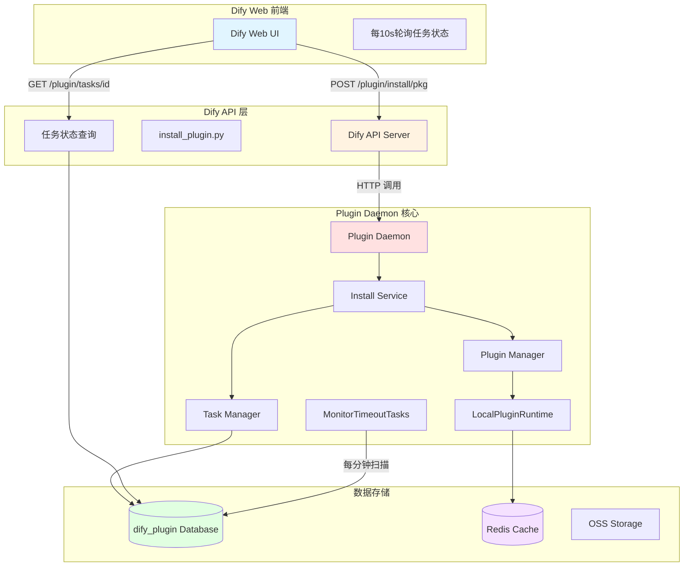
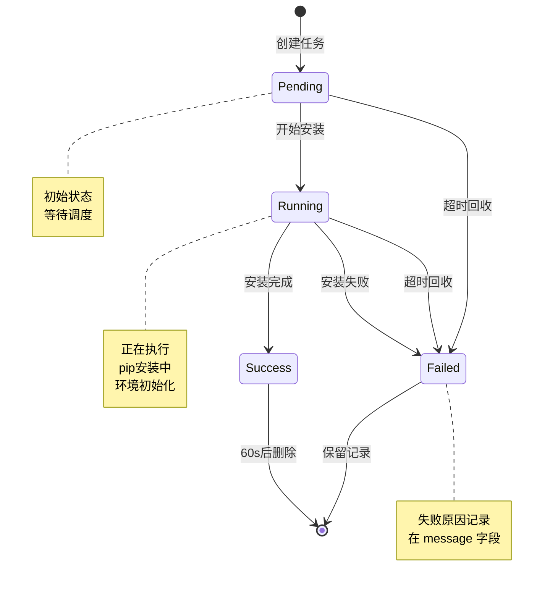
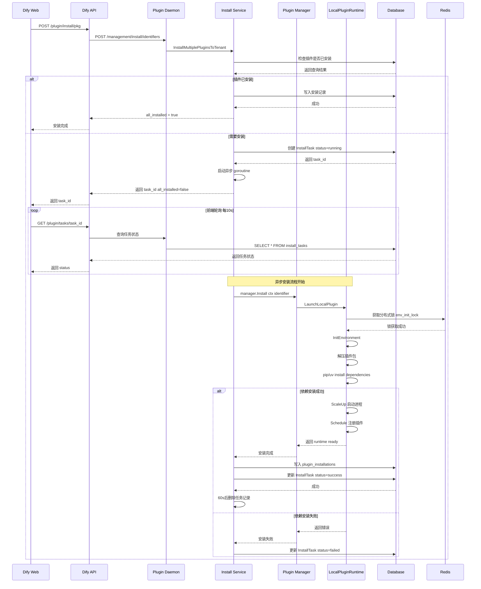
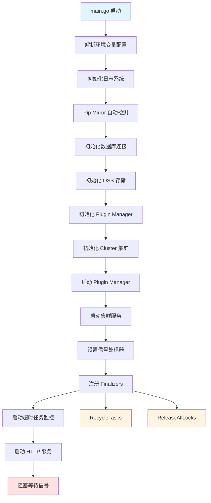
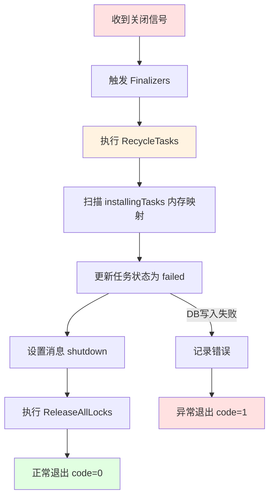

# Dify 插件安装超时问题深度源码分析

> **Task timed out but not properly terminated** 完整排查指南

## 目录

- [一、问题概述](#一问题概述)
- [二、系统架构](#二系统架构)
- [三、核心运行流程](#三核心运行流程)
- [四、关键源码解析](#四关键源码解析)
- [五、配置参数详解](#五配置参数详解)
- [六、问题排查记录](#六问题排查记录)
- [七、根因分析](#七根因分析)
- [八、解决方案](#八解决方案)
- [九、最佳实践](#九最佳实践)

---

## 一、问题概述

### 1.1 错误信息

```
Task timed out but not properly terminated
```

### 1.2 问题现象

- **症状 1**: 插件安装时前端一直显示"安装中",永远不会完成
- **症状 2**: 同一 task_id 每分钟在日志中重复出现 `task timed out` 日志
- **症状 3**: 安装任务持续时间异常长(如 56 分钟),远超正常安装时间
- **症状 4**: 清理数据库记录后,不修改任何代码即可安装成功

### 1.3 报错来源

该错误字符串定义在源码的唯一位置:

**文件**: `internal/tasks/recycle.go` 第 67-83 行

```go
func markTasksAsTimeout(tasks []*models.InstallTask) {
	if len(tasks) == 0 {
		return
	}
	for _, task := range tasks {
		task.Status = models.InstallTaskStatusFailed
		for i := range task.Plugins {
			plugin := &task.Plugins[i]
			plugin.Status = models.InstallTaskStatusFailed
			plugin.Message = "Task timed out but not properly terminated"
		}
	}
	err := db.Update(tasks)
	if err != nil {
		log.Error("failed to update tasks", "error", err)
	}
}
```

**关键含义**: 
- 这不是前端或业务逻辑直接抛出的错误
- 这是后台 goroutine 的**兜底回收机制**标记的超时状态
- `but not properly terminated` 的真实含义是: **安装协程没有正确收尾**,状态从未更新为 success 或 failed

---

## 二、系统架构

### 2.1 整体架构图



### 2.2 数据库结构

**核心表**: `install_tasks`

| 字段 | 类型 | 说明 |
|------|------|------|
| id | UUID | 任务唯一标识 |
| status | VARCHAR(50) | 任务状态: pending/running/success/failed |
| tenant_id | UUID | 租户ID |
| total_plugins | INT | 总插件数 |
| completed_plugins | INT | 已完成插件数 |
| plugins | JSON | 插件状态数组 |
| created_at | TIMESTAMP | 创建时间 |
| updated_at | TIMESTAMP | 更新时间 |

**plugins JSON 结构**:

```json
[
  {
    "plugin_unique_identifier": "author/plugin:1.0.0@runtime",
    "plugin_id": "author/plugin",
    "status": "running",
    "message": "installing dependencies",
    "icon": "icon_url",
    "labels": {"en_US": "Plugin Name"},
    "source": "marketplace"
  }
]
```

### 2.3 状态机



---

## 三、核心运行流程

### 3.1 完整安装链路



### 3.2 启动流程



### 3.3 关闭流程



---

## 四、关键源码解析

### 4.1 任务创建逻辑

**文件**: `internal/service/install_plugin_utils.go` 第 31-60 行

```go
func createInstallTasks(
	tenants []string,
	statuses []models.InstallTaskPluginStatus,
) (*tasks.InstallTaskRegistry, error) {
	registry := &tasks.InstallTaskRegistry{
		Order: append([]string{}, tenants...),
		Tasks: make(map[string]*models.InstallTask, len(tenants)),
	}

	for _, tenantID := range tenants {
		statusCopy := make([]models.InstallTaskPluginStatus, len(statuses))
		copy(statusCopy, statuses)

		task := &models.InstallTask{
			Status:           models.InstallTaskStatusRunning,  // 初始状态 running
			TenantID:         tenantID,
			TotalPlugins:     len(statusCopy),
			CompletedPlugins: 0,
			Plugins:          statusCopy,
		}

		if err := db.Create(task); err != nil {
			return nil, err
		}

		registry.Tasks[tenantID] = task
	}

	return registry, nil
}
```

**关键点**:
- 每个租户创建一个 InstallTask 记录
- 初始状态直接设置为 `running`
- 返回 task_id 给前端用于轮询

### 4.2 异步安装调度

**文件**: `internal/service/install_plugin.go` 第 118-138 行

```go
for _, job := range jobs {
    jobCopy := job
    // 创建独立上下文 超时 15 分钟
    taskCtx, taskCancel := context.WithTimeout(
        context.Background(), 
        time.Duration(config.PluginInstallTimeout)*time.Minute
    )
    
    // 提交到 goroutine 池异步执行
    routine.Submit(routinepkg.Labels{
        routinepkg.RoutineLabelKeyModule: "service",
        routinepkg.RoutineLabelKeyMethod: "InstallPlugin",
    }, func() {
        defer taskCancel()
        tasks.ProcessInstallJob(
            taskCtx,
            manager,
            tenants,
            runtimeType,
            source,
            taskIDs,
            jobCopy,
        )
    })
}
```

**关键设计**:
- 使用 `context.WithTimeout` 控制整体超时
- 异步执行,不阻塞 HTTP 响应
- 每个 job 独立 goroutine
