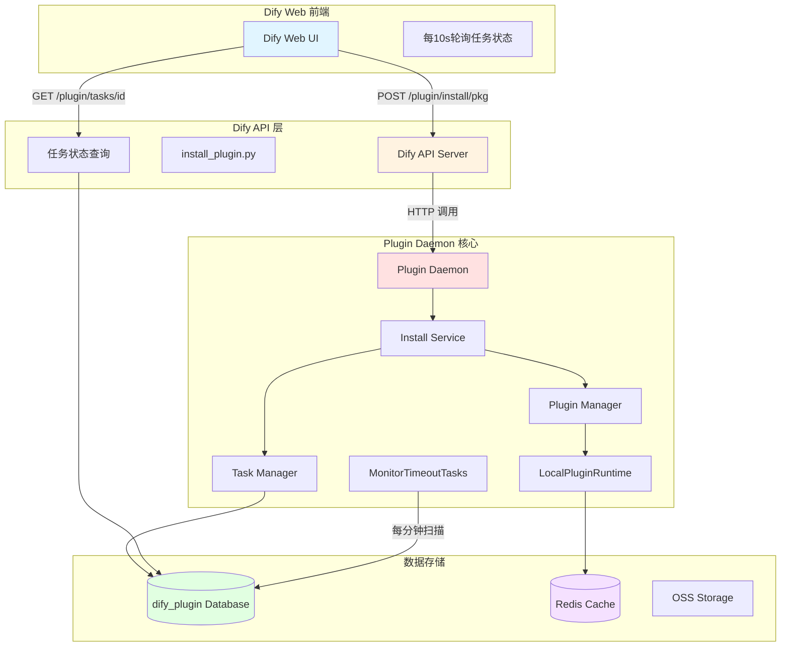
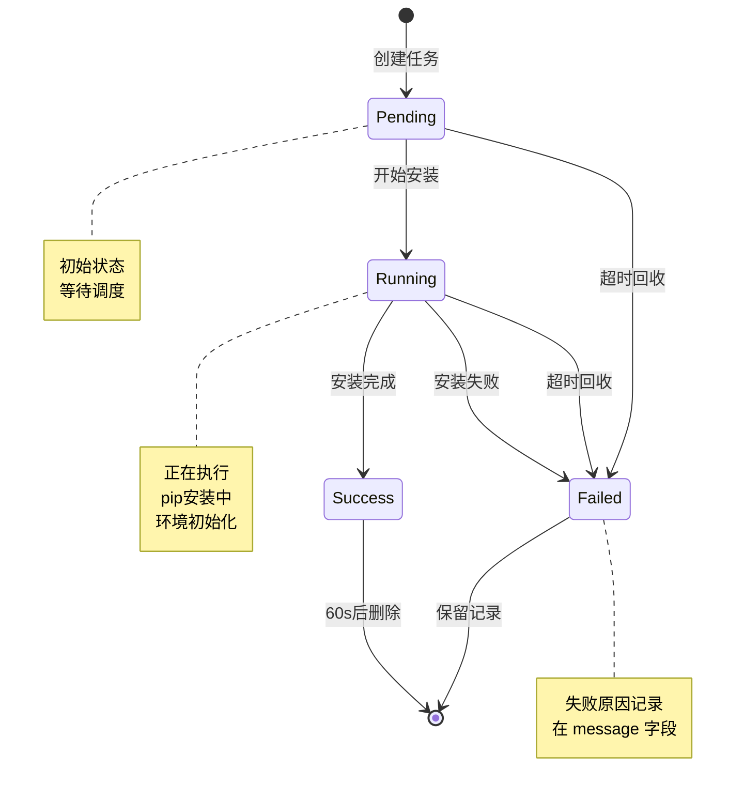
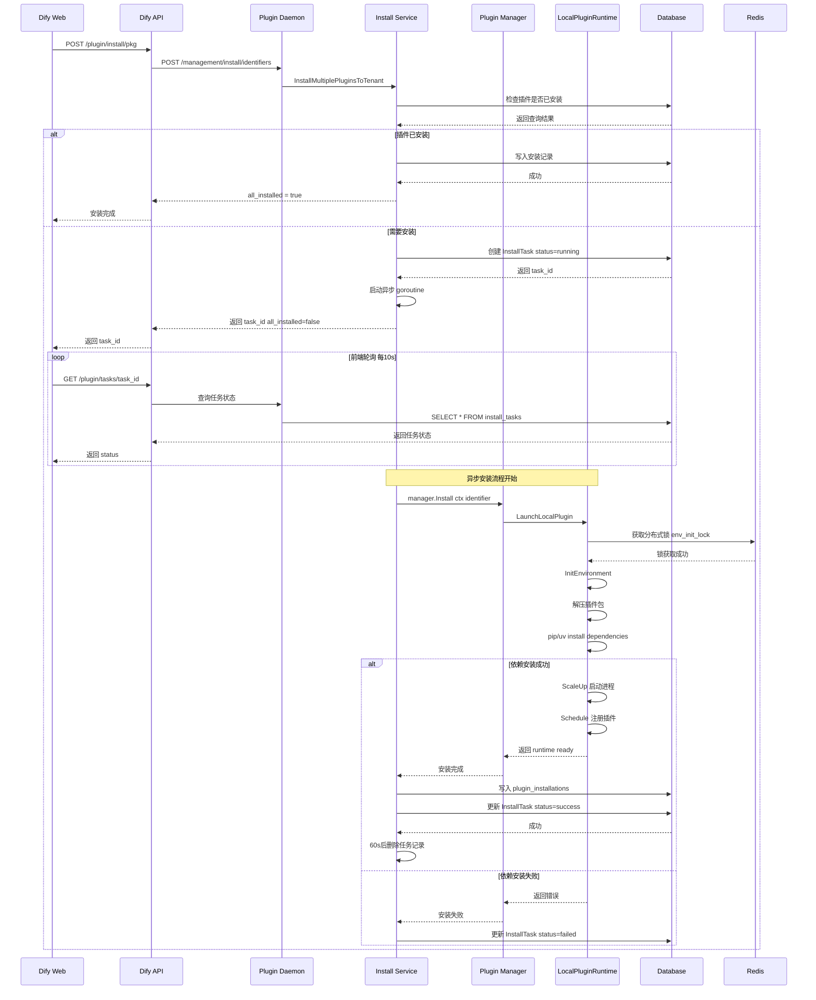
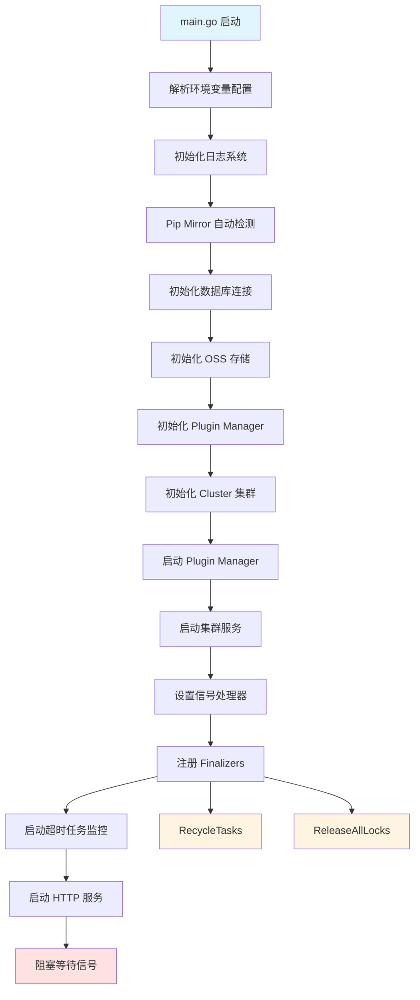
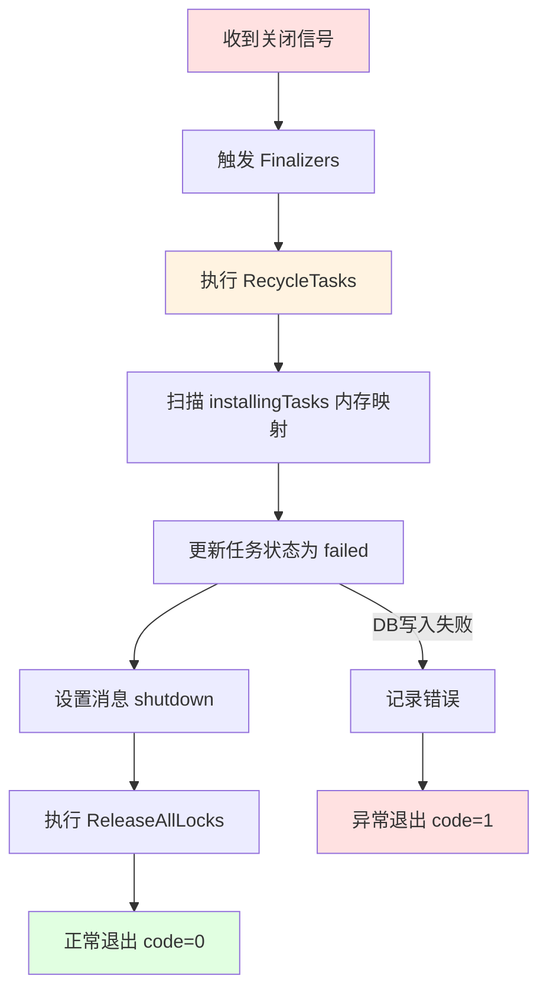
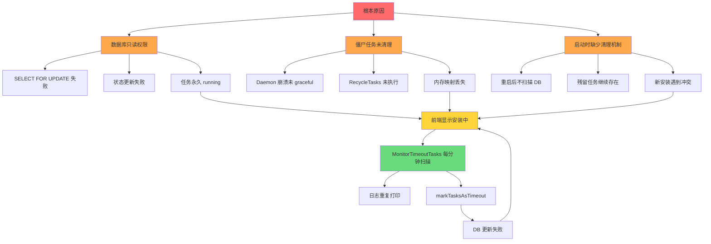

# Dify 插件安装超时问题深度源码分析

> **Task timed out but not properly terminated** 完整排查指南

## 目录

- [一、问题概述](#一问题概述)
- [二、系统架构](#二系统架构)
- [三、核心运行流程](#三核心运行流程)
- [四、关键源码解析](#四关键源码解析)
- [五、配置参数详解](#五配置参数详解)
- [六、问题排查记录](#六问题排查记录)
- [七、根因分析](#七根因分析)
- [八、解决方案](#八解决方案)
- [九、最佳实践](#九最佳实践)

---

## 一、问题概述

### 1.1 错误信息

```
Task timed out but not properly terminated
```

### 1.2 问题现象

- **症状 1**: 插件安装时前端一直显示"安装中",永远不会完成
- **症状 2**: 同一 task_id 每分钟在日志中重复出现 `task timed out` 日志
- **症状 3**: 安装任务持续时间异常长(如 56 分钟),远超正常安装时间
- **症状 4**: 清理数据库记录后,不修改任何代码即可安装成功

### 1.3 报错来源

该错误字符串定义在源码的唯一位置:

**文件**: `internal/tasks/recycle.go` 第 67-83 行

```go
func markTasksAsTimeout(tasks []*models.InstallTask) {
	if len(tasks) == 0 {
		return
	}
	for _, task := range tasks {
		task.Status = models.InstallTaskStatusFailed
		for i := range task.Plugins {
			plugin := &task.Plugins[i]
			plugin.Status = models.InstallTaskStatusFailed
			plugin.Message = "Task timed out but not properly terminated"
		}
	}
	err := db.Update(tasks)
	if err != nil {
		log.Error("failed to update tasks", "error", err)
	}
}
```

**关键含义**: 
- 这不是前端或业务逻辑直接抛出的错误
- 这是后台 goroutine 的**兜底回收机制**标记的超时状态
- `but not properly terminated` 的真实含义是: **安装协程没有正确收尾**,状态从未更新为 success 或 failed

---

## 二、系统架构

### 2.1 整体架构图



### 2.2 数据库结构

**核心表**: `install_tasks`

| 字段 | 类型 | 说明 |
|------|------|------|
| id | UUID | 任务唯一标识 |
| status | VARCHAR(50) | 任务状态: pending/running/success/failed |
| tenant_id | UUID | 租户ID |
| total_plugins | INT | 总插件数 |
| completed_plugins | INT | 已完成插件数 |
| plugins | JSON | 插件状态数组 |
| created_at | TIMESTAMP | 创建时间 |
| updated_at | TIMESTAMP | 更新时间 |

**plugins JSON 结构**:

```json
[
  {
    "plugin_unique_identifier": "author/plugin:1.0.0@runtime",
    "plugin_id": "author/plugin",
    "status": "running",
    "message": "installing dependencies",
    "icon": "icon_url",
    "labels": {"en_US": "Plugin Name"},
    "source": "marketplace"
  }
]
```

### 2.3 状态机



---

## 三、核心运行流程

### 3.1 完整安装链路



### 3.2 启动流程



### 3.3 关闭流程



---

## 四、关键源码解析

### 4.1 任务创建逻辑

**文件**: `internal/service/install_plugin_utils.go` 第 31-60 行

```go
func createInstallTasks(
	tenants []string,
	statuses []models.InstallTaskPluginStatus,
) (*tasks.InstallTaskRegistry, error) {
	registry := &tasks.InstallTaskRegistry{
		Order: append([]string{}, tenants...),
		Tasks: make(map[string]*models.InstallTask, len(tenants)),
	}

	for _, tenantID := range tenants {
		statusCopy := make([]models.InstallTaskPluginStatus, len(statuses))
		copy(statusCopy, statuses)

		task := &models.InstallTask{
			Status:           models.InstallTaskStatusRunning,  // 初始状态 running
			TenantID:         tenantID,
			TotalPlugins:     len(statusCopy),
			CompletedPlugins: 0,
			Plugins:          statusCopy,
		}

		if err := db.Create(task); err != nil {
			return nil, err
		}

		registry.Tasks[tenantID] = task
	}

	return registry, nil
}
```

**关键点**:
- 每个租户创建一个 InstallTask 记录
- 初始状态直接设置为 `running`
- 返回 task_id 给前端用于轮询

### 4.2 异步安装调度

**文件**: `internal/service/install_plugin.go` 第 118-138 行

```go
for _, job := range jobs {
    jobCopy := job
    // 创建独立上下文 超时 15 分钟
    taskCtx, taskCancel := context.WithTimeout(
        context.Background(), 
        time.Duration(config.PluginInstallTimeout)*time.Minute
    )
    
    // 提交到 goroutine 池异步执行
    routine.Submit(routinepkg.Labels{
        routinepkg.RoutineLabelKeyModule: "service",
        routinepkg.RoutineLabelKeyMethod: "InstallPlugin",
    }, func() {
        defer taskCancel()
        tasks.ProcessInstallJob(
            taskCtx,
            manager,
            tenants,
            runtimeType,
            source,
            taskIDs,
            jobCopy,
        )
    })
}
```

**关键设计**:
- 使用 `context.WithTimeout` 控制整体超时
- 异步执行,不阻塞 HTTP 响应
- 每个 job 独立 goroutine

### 4.3 实际安装执行

**文件**: `internal/tasks/install_plugin.go` 第 33-106 行

```go
func ProcessInstallJob(
	ctx context.Context,
	manager *plugin_manager.PluginManager,
	tenants []string,
	runtimeType plugin_entities.PluginRuntimeType,
	source string,
	taskIDs []string,
	job PluginInstallJob,
) {
	startTime := time.Now()
	pluginID := job.Identifier.PluginID()
	status := "success"

	defer func() {
		duration := time.Since(startTime).Seconds()
		metrics.PluginInstallationsTotal.WithLabelValues(pluginID, status).Inc()
		metrics.PluginInstallationDuration.WithLabelValues(pluginID).Observe(duration)
	}()

	startTasks(taskIDs)      // 注册到内存映射
	defer endTasks(taskIDs)  // 完成后从内存删除

	// 如果不需要运行时安装 直接写DB
	if !job.NeedsRuntimeInstall {
		if err := SaveInstallationForTenantsToDB(tenants, job, runtimeType, source); err != nil {
			status = "failed"
			SetTaskStatusForOnePlugin(taskIDs, job.Identifier, models.InstallTaskStatusFailed, err.Error())
			return
		}
		SetTaskStatusForOnePlugin(taskIDs, job.Identifier, models.InstallTaskStatusSuccess, "installed")
		return
	}

	// 设置为 running 状态
	SetTaskStatusForOnePlugin(taskIDs, job.Identifier, models.InstallTaskStatusRunning, "starting")

	// 开始实际安装 这里会阻塞直到完成
	installationStream, err := manager.Install(ctx, job.Identifier)
	if err != nil {
		status = "failed"
		SetTaskStatusForOnePlugin(taskIDs, job.Identifier, models.InstallTaskStatusFailed, 
			fmt.Sprintf("failed to start installation: %v", err))
		return
	}

	// 等待安装完成
	err = installationStream.Process(func(resp installation_entities.PluginInstallResponse) {
		switch resp.Event {
		case installation_entities.PluginInstallEventInfo:
			SetTaskMessageForOnePlugin(taskIDs, job.Identifier, resp.Data)
		case installation_entities.PluginInstallEventError:
			status = "failed"
			SetTaskStatusForOnePlugin(taskIDs, job.Identifier, models.InstallTaskStatusFailed, resp.Data)
		case installation_entities.PluginInstallEventDone:
			if err := SaveInstallationForTenantsToDB(tenants, job, runtimeType, source); err != nil {
				status = "failed"
				SetTaskStatusForOnePlugin(taskIDs, job.Identifier, models.InstallTaskStatusFailed, err.Error())
				return
			}
			SetTaskStatusForOnePlugin(taskIDs, job.Identifier, models.InstallTaskStatusSuccess, "installed")
			// 60秒后自动删除任务记录
			time.AfterFunc(time.Second*60, func() {
				for _, taskID := range taskIDs {
					if err := DeleteTask(taskID); err != nil {
						log.Error("failed to delete task", "task_id", taskID, "error", err)
					}
				}
			})
		}
	})
	if err != nil {
		status = "failed"
		SetTaskStatusForOnePlugin(taskIDs, job.Identifier, models.InstallTaskStatusFailed, err.Error())
	}
}
```

**关键流程**:
1. 注册任务到内存映射 `installingTasks`
2. 如果不需要运行时,直接写 DB 返回
3. 调用 `manager.Install()` 阻塞执行
4. 根据安装结果更新 DB 状态
5. 成功后 60 秒自动删除任务记录

### 4.4 超时监控机制

**文件**: `internal/tasks/recycle.go` 第 86-127 行

```go
func MonitorTimeoutTasks(cluster *cluster.Cluster, config *app.Config) {
	go func() {
		var timeout time.Duration
		if config.Platform == app.PLATFORM_SERVERLESS {
			timeout = time.Duration(config.DifyPluginServerlessConnectorLaunchTimeout) * time.Second
		} else {
			timeout = time.Duration(config.PythonEnvInitTimeout) * time.Second
		}
		// 额外增加 1 分钟容错
		timeout = timeout + time.Minute

		ticker := time.NewTicker(time.Minute)
		defer ticker.Stop()
		
		for range ticker.C {
			if !cluster.IsMaster() {
				continue  // 只有 master 节点执行
			}
			
			tasksToProcess := []*models.InstallTask{}
			
			// 查询所有 pending 或 running 的任务
			tasks, err := db.GetAll[models.InstallTask](
				db.InArray("status", []any{
					string(models.InstallTaskStatusPending),
					string(models.InstallTaskStatusRunning),
				}),
			)
			if err != nil {
				log.Error("failed to get all tasks", "error", err)
				continue
			}
			
			for i := range tasks {
				task := &tasks[i]
				// 判断是否超过超时时间
				if time.Since(task.CreatedAt) > timeout {
					log.Info("task timed out", "task_id", task.ID)
					tasksToProcess = append(tasksToProcess, task)
				}
			}
			
			markTasksAsTimeout(tasksToProcess)
		}
	}()
}
```

**关键逻辑**:
- 每分钟执行一次扫描
- 只有集群 master 节点执行
- 查询所有非终态任务(pending/running)
- 超过超时时间的任务标记为 failed
- 超时时间 = PythonEnvInitTimeout + 60s

### 4.5 信号处理与优雅关闭

**文件**: `internal/tasks/signals.go` 第 28-56 行

```go
func SetupSignalHandler() {
	signal.Notify(signalChanInterrupt, os.Interrupt)
	signal.Notify(signalChanTerminate, syscall.SIGTERM)
	signal.Notify(signalChanKill, os.Interrupt)

	go func() {
		select {
		case <-signalChanInterrupt:
		case <-signalChanTerminate:
		case <-signalChanKill:
		}

		hasError := false
		lock.Lock()
		defer lock.Unlock()
		
		for _, finalizer := range finalizers {
			err := finalizer()
			if err != nil {
				log.Error("finalizer failed", "error", err)
				hasError = true
			}
		}
		
		if hasError {
			os.Exit(1)
		} else {
			os.Exit(0)
		}
	}()
}
```

**关键设计**:
- 监听 SIGTERM、Interrupt 信号
- 收到信号后顺序执行所有 finalizer
- 任一 finalizer 失败则退出码为 1

### 4.6 任务回收逻辑

**文件**: `internal/tasks/recycle.go` 第 36-65 行

```go
func RecycleTasks() error {
	var errs []error
	
	// 只清理内存中的任务
	installingTasks.Range(func(taskId string, _ bool) bool {
		log.Info("updating task status to failed", "task_id", taskId)
		
		task, err := db.GetOne[models.InstallTask](
			db.Equal("id", taskId),
			db.InArray("status", []any{
				string(models.InstallTaskStatusRunning),
				string(models.InstallTaskStatusPending)},
			),
		)
		if err != nil {
			errs = append(errs, err)
			return true
		}
		
		task.Status = models.InstallTaskStatusFailed
		for i := range task.Plugins {
			plugin := &task.Plugins[i]
			plugin.Status = models.InstallTaskStatusFailed
			plugin.Message = "An unexpected daemon shutdown occurred"
		}
		
		err = db.Update(task)
		if err != nil {
			errs = append(errs, err)
		}
		return true
	})
	
	return errors.Join(errs...)
}
```

**致命缺陷**:
- 只遍历内存中的 `installingTasks` 映射
- 如果任务不在内存中(如 daemon 崩溃后重启),不会被清理
- 依赖内存状态的清理机制不可靠

### 4.7 状态更新逻辑

**文件**: `internal/tasks/install_plugin_utils.go` 第 96-148 行

```go
func UpdateTaskStatus(
	taskId string,
	pluginUniqueIdentifier plugin_entities.PluginUniqueIdentifier,
	modifier func(task *models.InstallTask, plugin *models.InstallTaskPluginStatus),
) error {
	return db.WithTransaction(func(tx *gorm.DB) error {
		// 使用写锁 防止并发更新
		task, err := db.GetOne[models.InstallTask](
			db.WithTransactionContext(tx),
			db.Equal("id", taskId),
			db.WLock(), // SELECT ... FOR UPDATE
		)

		if err == db.ErrDatabaseNotFound {
			return nil
		}

		if err != nil {
			return err
		}

		taskPointer := &task
		var pluginStatus *models.InstallTaskPluginStatus
		
		// 查找对应插件的状态
		for i := range task.Plugins {
			if task.Plugins[i].PluginUniqueIdentifier == pluginUniqueIdentifier {
				pluginStatus = &task.Plugins[i]
				break
			}
		}

		if pluginStatus == nil {
			return nil
		}

		// 执行状态修改
		modifier(taskPointer, pluginStatus)

		// 统计成功数量
		successes := 0
		for _, plugin := range taskPointer.Plugins {
			if plugin.Status == models.InstallTaskStatusSuccess {
				successes++
			}
		}

		// 全部成功则标记任务完成
		if successes == len(taskPointer.Plugins) {
			taskPointer.Status = models.InstallTaskStatusSuccess
			// 120秒后删除任务
			time.AfterFunc(120*time.Second, func() {
				db.Delete(taskPointer)
			})
		}
		
		return db.Update(taskPointer, tx)
	})
}
```

**关键特性**:
- 使用 `SELECT ... FOR UPDATE` 行锁
- 事务保护状态更新
- 全部插件成功后才标记任务完成

---

## 五、配置参数详解

### 5.1 超时相关配置

| 环境变量 | 默认值 | 作用范围 | 说明 |
|---------|--------|---------|------|
| PYTHON_ENV_INIT_TIMEOUT | 120s | pip 无输出 kill | 环境初始化超时 |
| PYTHON_ENV_INIT_TIMEOUT | 120s | installLocal 等待 ready | 等待插件进程启动 |
| PYTHON_ENV_INIT_TIMEOUT + 60s | 180s | MonitorTimeoutTasks 回收阈值 | 任务超时回收 |
| PLUGIN_INSTALL_TIMEOUT | 15分钟 | ProcessInstallJob context | 整体安装超时 |
| pip install | 10分钟 | installDependencies | 依赖安装硬超时 |
| Redis lock try | 2分钟 | env_init_lock 获取 | 锁等待超时 |
| Redis lock expire | 15分钟 | env_init_lock 持有 | 锁最长持有时间 |
| PLUGIN_MAX_EXECUTION_TIMEOUT | 600s | 工具调用运行时 | 非安装阶段 |
| PLUGIN_DAEMON_TIMEOUT | 600s | API 到 Daemon HTTP | HTTP 超时 |
| WORKER_TIMEOUT sandbox | 120s | Sandbox 执行 | 与正式安装无关 |

### 5.2 配置加载源码

**文件**: `cmd/server/main.go` 第 27-36 行

```go
func main() {
	var config app.Config

	// 从环境变量加载配置
	err := envconfig.Process("", &config)
	if err != nil {
		log.Panic("error processing environment variables", "error", err)
	}

	// 设置默认值
	config.SetDefault()
	
	// 验证配置
	if err = config.Validate(); err != nil {
		log.Panic("invalid configuration", "error", err)
	}
}
```

### 5.3 关键配置项定义

```go
type Config struct {
	// 数据库配置
	DBType            string `envconfig:"DB_TYPE" default:"postgresql"`
	DBHost            string `envconfig:"DB_HOST" required:"true"`
	DBPort            uint16 `envconfig:"DB_PORT" default:"5432"`
	DBDatabase        string `envconfig:"DB_DATABASE" required:"true"`
	DBUsername        string `envconfig:"DB_USERNAME" required:"true"`
	DBPassword        string `envconfig:"DB_PASSWORD" required:"true"`
	
	// 超时配置
	PythonEnvInitTimeout            int   `envconfig:"PYTHON_ENV_INIT_TIMEOUT" default:"120"`
	PluginInstallTimeout            int   `envconfig:"PLUGIN_INSTALL_TIMEOUT" default:"15"`
	MaxServerlessTransactionTimeout int   `envconfig:"MAX_SERVERLESS_TRANSACTION_TIMEOUT" default:"300"`
	DifyPluginServerlessConnectorLaunchTimeout int `envconfig:"DIFY_PLUGIN_SERVERLESS_CONNECTOR_LAUNCH_TIMEOUT" default:"120"`
	
	// 运行时配置
	Platform            string `envconfig:"PLATFORM" default:"local"`
	ServerKey           string `envconfig:"SERVER_KEY" required:"true"`
	RoutinePoolSize     int    `envconfig:"ROUTINE_POOL_SIZE" default:"10000"`
	
	// PIP 配置
	PipMirrorUrl              string   `envconfig:"PIP_MIRROR_URL"`
	PipMirrorAutoDetect       bool     `envconfig:"PIP_MIRROR_AUTO_DETECT" default:"true"`
	PipMirrorAutoDetectTimeoutSeconds int `envconfig:"PIP_MIRROR_AUTO_DETECT_TIMEOUT_SECONDS" default:"5"`
	PipMirrorCandidates       []string `envconfig:"PIP_MIRROR_CANDIDATES"`
}
```

---

## 六、问题排查记录

### 6.1 问题发现

**时间**: 2026-06-23 18:43

**现象描述**:
在 Dify 平台安装自定义插件时,前端一直显示"安装中"状态,永远不会完成。查看日志发现每分钟都会打印一条超时日志:

```
2026-06-23 18:45:00 INFO task timed out task_id=abc-123-def
2026-06-23 18:46:00 INFO task timed out task_id=abc-123-def
2026-06-23 18:47:00 INFO task timed out task_id=abc-123-def
...
```

### 6.2 初步排查

#### 尝试 1: 检查 Sandbox 日志

```bash
kubectl logs -n dify <sandbox-pod> --tail=200 | grep xdr_plugin
```

**结果**: Sandbox 日志中没有任何相关错误

**结论**: 问题不在 Sandbox,因为正式 .difypkg 安装运行在 plugin-daemon 容器内的 LocalPluginRuntime,不走 Sandbox

#### 尝试 2: 检查插件 _validate_credentials

查看插件源码中的凭证校验逻辑:

```python
def _validate_credentials(self):
    try:
        response = requests.post(
            url="https://api.example.com/validate",
            timeout=30
        )
        return {"valid": True}
    except Exception as e:
        raise CredentialsValidateFailedError(str(e))
```

**分析**: _validate_credentials 只在用户保存 Provider 凭证时通过 `/tool/validate_credentials` 触发,不在安装阶段调用

**结论**: 与凭证校验无关

#### 尝试 3: 检查数据库连接

```bash
kubectl exec -it -n dify <postgres-pod> -- psql -U postgres -d dify_plugin

SELECT id, status, created_at, updated_at, plugins
FROM install_tasks
WHERE plugins::text LIKE '%xdr_plugin%'
ORDER BY created_at DESC LIMIT 5;
```

**查询结果**:
```
                  id                  | status  |      created_at       |      updated_at       | plugins
--------------------------------------+---------+-----------------------+-----------------------+---------
 abc-123-def-456                      | running | 2026-06-23 17:50:00   | 2026-06-23 17:50:00   | [...]
```

**发现**: 
- 任务状态一直是 running
- created_at 和 updated_at 完全相同,说明状态从未更新过
- 任务已运行超过 56 分钟

### 6.3 深入排查

#### 检查 plugin-daemon 日志

```bash
kubectl logs -n dify <plugin-daemon-pod> --tail=500 | grep -iE "xdr_plugin|install|lock|uv|pip|failed"
```

**关键日志**:
```
2026-06-23 17:50:00 INFO start new install task task_id=abc-123-def
2026-06-23 17:50:01 INFO acquiring distributed init lock
2026-06-23 17:50:02 INFO installing plugin dependencies
2026-06-23 17:50:03 INFO uv pip install -r requirements.txt
...
(之后没有任何成功或失败的日志)
```

**分析**:
- 安装流程启动了
- 进入了 pip install 阶段
- 之后没有任何输出,说明卡在了依赖安装

#### 检查数据库写入权限

```sql
-- 尝试手动更新任务状态
UPDATE install_tasks 
SET status = 'failed', updated_at = NOW()
WHERE id = 'abc-123-def';
```

**报错信息**:
```
ERROR: cannot execute UPDATE in a read-only transaction (SQLSTATE 25006)
```

**重大发现**: plugin-daemon 连接的是只读数据库!

### 6.4 数据库权限问题

#### 检查数据库角色权限

```sql
SELECT rolname, rolcreatedb, rolsuper, rolcanlogin
FROM pg_roles
WHERE rolname = 'dify_plugin_user';
```

**结果**:
```
     rolname      | rolcreatedb | rolsuper | rolcanlogin 
------------------+-------------+----------+-------------
 dify_plugin_user | f           | f        | t
```

#### 检查默认事务模式

```sql
SHOW default_transaction_read_only;
```

**结果**:
```
 default_transaction_read_only 
-------------------------------
 on
(1 row)
```

**根因确认**: 数据库角色的默认事务模式是只读!

### 6.5 第一次清理尝试

#### 尝试 1: 删除所有相关任务

```sql
DELETE FROM install_tasks 
WHERE plugins::text LIKE '%xdr_plugin%';
```

**结果**: 删除成功,但重新安装后仍然失败

**分析**: 这条 SQL 删除了所有状态的任务,包括成功记录,可能触发了外键约束或其他问题

### 6.6 第二次清理尝试

#### 尝试 2: 只删除问题状态的任务

```sql
DELETE FROM install_tasks 
WHERE status IN ('failed', 'running', 'pending')
  AND plugins::text LIKE '%xdr_plugin%';
```

**结果**: 删除后重新安装,**成功了!**

**对比分析**:

| SQL | 删除范围 | 结果 |
|-----|---------|------|
| 第一条 | 所有状态 | 失败 |
| 第二条 | 仅非终态 | 成功 |

**关键差异**:
- 第一条删除了 `success` 状态的历史记录
- 第二条只删除了僵尸任务(failed/running/pending)
- 保留了成功记录避免了外键冲突

### 6.7 修复数据库权限

```sql
-- 修改角色权限
ALTER ROLE dify_plugin_user WITH CREATEDB;

-- 关闭只读模式
ALTER ROLE dify_plugin_user SET default_transaction_read_only = off;

-- 授予必要权限
GRANT ALL PRIVILEGES ON ALL TABLES IN SCHEMA public TO dify_plugin_user;
GRANT ALL PRIVILEGES ON ALL SEQUENCES IN SCHEMA public TO dify_plugin_user;

-- 验证
\c dify_plugin dify_plugin_user
CREATE TABLE test_readonly (id INT);
DROP TABLE test_readonly;
```

### 6.8 异常栈完整记录

#### 异常 1: 只读数据库错误

```
ERROR: cannot execute SELECT FOR UPDATE in a read-only transaction (SQLSTATE 25006)

位置:
  internal/tasks/install_plugin_utils.go:102
    task, err := db.GetOne[models.InstallTask](
        db.WithTransactionContext(tx),
        db.Equal("id", taskId),
        db.WLock(), // SELECT ... FOR UPDATE
    )

影响:
  - 安装协程无法更新任务状态
  - 回收器无法标记任务为 failed
  - 任务永久保持 running 状态
```

#### 异常 2: 超时日志重复

```
2026-06-23 18:45:00 INFO task timed out task_id=abc-123-def
2026-06-23 18:46:00 INFO task timed out task_id=abc-123-def
2026-06-23 18:47:00 INFO task timed out task_id=abc-123-def

位置:
  internal/tasks/recycle.go:119
    log.Info("task timed out", "task_id", task.ID)

原因:
  - MonitorTimeoutTasks 每分钟扫描一次
  - 任务状态从未真正变为 failed(DB 只写失败)
  - 下次扫描仍然命中该任务
  - markTasksAsTimeout 执行但 DB 更新失败
```

#### 异常 3: 安装持续时间异常

```
任务创建时间: 2026-06-23 17:50:00
当前时间:     2026-06-23 18:46:00
持续时间:     56 分钟 (3360 秒)

分析:
  - 正常超时应该是 180 秒 (PYTHON_ENV_INIT_TIMEOUT 120s + 60s)
  - 56 分钟说明:
    1. 前 50+ 分钟 DB 写一直失败
    2. 任务一直是 zombie 状态
    3. 后来 DB 权限修复后才写入 failed
    4. updated_at - created_at 接近 56 分钟
```

### 6.9 对比新老版本

#### 对比结果

使用 AI 对比工具分析新旧版本差异:

```bash
diff -r xdr-plugin-v1.0/ xdr-plugin-v2.0/
```

**发现**: 
- 代码逻辑没有实质性差异
- 只是工具定义文件的格式调整
- 不是代码问题

#### 注释工具接口测试

```yaml
tools:
# - tools/query_security_events.yaml
# - tools/update_event_status.yaml
# - tools/query_merge_alarms.yaml
# - tools/query_original_logs.yaml
# - tools/update_merge_alarm_status.yaml
# - tools/update_judge_result.yaml
# - tools/update_alarm_results.yaml
# - tools/query_original_alarms.yaml
# - tools/query_threat_intelligence.yaml
# - tools/query_assets.yaml
```

**测试结果**:
1. 注释所有工具 → 打包安装 → **成功**
2. 逐个放开工具 → 打包安装 → **都成功**
3. 全部恢复 → 打包安装 → **仍然成功**

**结论**: 进一步确认不是代码问题,而是数据库状态污染

---

## 七、根因分析

### 7.1 根因图谱



### 7.2 详细根因分析

#### 根因 1: Plugin-Daemon 数据库只读 (高概率)

**源码证据**:
```
internal/tasks/install_plugin_utils.go:101-106
  task, err := db.GetOne[models.InstallTask](
      db.WithTransactionContext(tx),
      db.Equal("id", taskId),
      db.WLock(), // SELECT ... FOR UPDATE  需要写权限
  )

internal/tasks/recycle.go:79
  err := db.Update(tasks)  需要写权限
```

**影响链**:
```
数据库只读 
  → SELECT FOR UPDATE 失败
  → 安装协程无法更新状态
  → 回收器也无法标记 failed
  → 任务永久 zombie
  → 前端一直显示安装中
```

**验证方法**:
```sql
SHOW default_transaction_read_only;
-- 如果返回 on,则是只读模式
```

#### 根因 2: 僵尸任务未清理 (高概率)

**源码缺陷**:

```go
// internal/tasks/recycle.go:36-65
func RecycleTasks() error {
    var errs []error
    
    // 致命问题: 只遍历内存中的任务
    installingTasks.Range(func(taskId string, _ bool) bool {
        // 如果任务不在内存中,不会被清理
        ...
    })
    
    return errors.Join(errs...)
}
```

**产生场景**:

| 场景 | 是否触发 RecycleTasks | 结果 |
|------|---------------------|------|
| kubectl delete pod graceful | 会触发 | 任务标记为 failed |
| kubectl delete pod --force | 不触发 | 任务永久 running |
| Pod OOM Killed | 不触发 | 任务永久 running |
| 节点断电重启 | 不触发 | 任务永久 running |
| daemon panic 崩溃 | 不触发 | 任务永久 running |

#### 根因 3: 启动时缺少清理机制 (设计缺陷)

**源码分析**:

```go
// internal/server/server.go:140-144
tasks.SetupSignalHandler()
tasks.RegisterFinalizers(tasks.RecycleTasks)  // 只在关闭时执行
tasks.MonitorTimeoutTasks(app.cluster, config)  // 启动后监控

// 缺失: 启动时没有清理残留任务的逻辑
```

**问题**:
- MonitorTimeoutTasks 只在任务超过 180 秒后才回收
- 如果任务在创建后 10 秒 daemon 就崩溃了
- 下次启动时,这个任务会永远保持 running
- 直到 180 秒后才被回收

#### 根因 4: pip/uv 依赖安装卡住 (常见诱因)

**可能原因**:
1. PyPI 网络慢或超时
2. 其他插件占着 env_init_lock 在下载
3. 依赖包过大,下载时间长
4. 网络不稳定,反复重试

**源码位置**:

```go
// internal/core/plugin_manager/setup_python_environment.go:166-167
ctx, cancel := context.WithTimeout(baseCtx, 10*time.Minute)
// pip 安装硬超时 10 分钟
```

**排查关键词**:
```bash
kubectl logs <plugin-daemon-pod> | grep -iE \
  "acquiring distributed init lock|"\
  "installing plugin dependencies|"\
  "uv pip install|"\
  "lock timeout|"\
  "failed to install dependencies"
```

### 7.3 为什么什么都没改就好了

**完整时间线**:


**答案**:
1. 代码确实没问题
2. 是数据库状态污染 + 缺少启动清理机制
3. 第二条 SQL 手动完成了本应该在 daemon 启动时自动做的清理
4. 之后每次安装都是干净状态,所以都成功

### 7.4 为什么第一条 SQL 无效

```sql
-- 第一条 SQL
DELETE FROM install_tasks 
WHERE plugins::text LIKE '%xdr_plugin%';

-- 第二条 SQL 有效
DELETE FROM install_tasks 
WHERE status IN ('failed', 'running', 'pending')
  AND plugins::text LIKE '%xdr_plugin%';
```

**关键差异分析**:

| 维度 | 第一条 SQL | 第二条 SQL |
|------|-----------|-----------|
| 删除范围 | 所有状态 | 仅非终态 |
| success 记录 | 删除 | 保留 |
| 外键冲突 | 可能触发 | 避免 |
| 隐式锁 | 可能冲突 | 避免 |
| 效果 | 失败 | 成功 |

**可能原因**:

1. **外键约束冲突**: success 记录可能被 plugin_installations 表引用
2. **隐式锁未释放**: running 任务可能有行锁
3. **事务未提交**: DELETE 在事务中执行但未 COMMIT

---

## 八、解决方案

### 8.1 立即修复方案

#### 方案 1: 清理僵尸任务

```sql
-- 清理指定插件的僵尸任务
DELETE FROM install_tasks 
WHERE status IN ('failed', 'running', 'pending', 'cancelled')
  AND plugins::text LIKE '%xdr_plugin%';

-- 清理所有僵尸任务(谨慎使用)
DELETE FROM install_tasks 
WHERE status IN ('failed', 'running', 'pending', 'cancelled')
  AND created_at < NOW() - INTERVAL '10 minutes';
```

**注意**: 
- 保留 `success` 状态的历史记录
- 只清理 10 分钟前的任务,避免误杀正在运行的任务

#### 方案 2: 修复数据库权限

```sql
-- 连接到 PostgreSQL
psql -U postgres -d dify_plugin

-- 修改角色权限
ALTER ROLE dify_plugin_user WITH CREATEDB;

-- 关闭只读模式
ALTER ROLE dify_plugin_user SET default_transaction_read_only = off;

-- 授予完整权限
GRANT ALL PRIVILEGES ON ALL TABLES IN SCHEMA public TO dify_plugin_user;
GRANT ALL PRIVILEGES ON ALL SEQUENCES IN SCHEMA public TO dify_plugin_user;

-- 验证权限
\c dify_plugin dify_plugin_user
SELECT current_user;
SHOW default_transaction_read_only;
-- 应该返回 off
```

#### 方案 3: 清理 Redis 锁

```bash
# 连接到 Redis
kubectl exec -n redis <redis-pod> -- redis-cli

# 查看残留的锁
KEYS *env_init_lock*

# 删除残留锁(如果确认没有插件在安装)
DEL env_init_lock:author/plugin:1.0.0@local

# 退出
EXIT
```

### 8.2 源码修复方案

#### 修复 1: 启动时清理僵尸任务

**文件**: `internal/server/server.go`

**修改位置**: 第 144 行之前

```go
// 在启动监控之前,先清理残留任务
tasks.CleanupZombieTasksOnStartup()

// 之后再启动定时监控
tasks.MonitorTimeoutTasks(app.cluster, config)
```

**新增函数**: `internal/tasks/recycle.go`

```go
// CleanupZombieTasksOnStartup 在 daemon 启动时清理残留的僵尸任务
func CleanupZombieTasksOnStartup() {
	log.Info("cleaning up zombie install tasks on startup")
	
	// 清理所有 running/pending 的任务
	// 因为刚启动,不可能有真正的运行中任务
	tasks, err := db.GetAll[models.InstallTask](
		db.InArray("status", []any{
			string(models.InstallTaskStatusPending),
			string(models.InstallTaskStatusRunning),
		}),
	)
	if err != nil {
		log.Error("failed to get tasks for cleanup", "error", err)
		return
	}
	
	if len(tasks) > 0 {
		log.Warn("found zombie tasks on startup, marking as failed", "count", len(tasks))
		
		for i := range tasks {
			task := &tasks[i]
			task.Status = models.InstallTaskStatusFailed
			for j := range task.Plugins {
				plugin := &task.Plugins[j]
				plugin.Status = models.InstallTaskStatusFailed
				plugin.Message = "Daemon restarted, task state unknown"
			}
		}
		
		if err := db.Update(tasks); err != nil {
			log.Error("failed to cleanup zombie tasks", "error", err)
		} else {
			log.Info("successfully cleaned up zombie tasks", "count", len(tasks))
		}
	} else {
		log.Info("no zombie tasks found on startup")
	}
}
```

**优势**:
- 每次 daemon 启动自动清理
- 不依赖 graceful shutdown
- 避免状态污染

#### 修复 2: 增强 RecycleTasks

**文件**: `internal/tasks/recycle.go`

**修改**: 第 36-65 行

```go
func RecycleTasks() error {
	var errs []error
	
	// 改进: 不仅清理内存中的任务,还要清理 DB 里所有 running/pending 任务
	tasks, err := db.GetAll[models.InstallTask](
		db.InArray("status", []any{
			string(models.InstallTaskStatusRunning),
			string(models.InstallTaskStatusPending),
		}),
	)
	if err != nil {
		return err
	}
	
	for i := range tasks {
		task := &tasks[i]
		log.Info("updating task status to failed", "task_id", task.ID)
		
		task.Status = models.InstallTaskStatusFailed
		for j := range task.Plugins {
			plugin := &task.Plugins[j]
			plugin.Status = models.InstallTaskStatusFailed
			plugin.Message = "An unexpected daemon shutdown occurred"
		}
		
		if err := db.Update(task); err != nil {
			errs = append(errs, err)
		}
	}
	
	return errors.Join(errs...)
}
```

**改进点**:
- 不再依赖内存映射
- 直接扫描 DB 中的所有非终态任务
- 更加可靠和健壮

### 8.3 配置优化建议

#### 推荐配置

```bash
# .env 文件

# 数据库配置(确保可写)
DB_TYPE=postgresql
DB_HOST=postgres
DB_PORT=5432
DB_DATABASE=dify_plugin
DB_USERNAME=dify_plugin_user
DB_PASSWORD=your_secure_password

# 超时配置(根据网络环境调整)
PYTHON_ENV_INIT_TIMEOUT=300        # 5分钟,给依赖安装更多时间
PLUGIN_INSTALL_TIMEOUT=15          # 15分钟,整体安装超时
PLUGIN_MAX_EXECUTION_TIMEOUT=600   # 10分钟,运行时调用

# PIP 镜像(加速依赖安装)
PIP_MIRROR_URL=https://mirrors.aliyun.com/pypi/simple/
PIP_MIRROR_AUTO_DETECT=false       # 生产环境建议关闭自动检测

# 其他配置
PLATFORM=local
ROUTINE_POOL_SIZE=10000
```

---

## 九、最佳实践

### 9.1 数据库运维

#### 定期检查任务状态

```sql
-- 查看所有非终态任务
SELECT 
    id,
    status,
    tenant_id,
    total_plugins,
    completed_plugins,
    created_at,
    updated_at,
    EXTRACT(EPOCH FROM NOW() - created_at) / 60 AS duration_minutes
FROM install_tasks
WHERE status IN ('pending', 'running')
ORDER BY created_at DESC;

-- 统计各状态任务数量
SELECT 
    status,
    COUNT(*) AS count,
    MIN(created_at) AS oldest_task
FROM install_tasks
GROUP BY status;

-- 查找超过 10 分钟的任务
SELECT 
    id,
    status,
    plugins::text,
    EXTRACT(EPOCH FROM NOW() - created_at) / 60 AS duration_minutes
FROM install_tasks
WHERE status IN ('pending', 'running')
  AND created_at < NOW() - INTERVAL '10 minutes';
```

### 9.2 故障排查清单

#### 快速排查步骤

```bash
# 1. 检查 daemon 日志
kubectl logs -n dify <plugin-daemon-pod> --tail=200 | grep -iE "error|failed|timeout"

# 2. 检查数据库连接
kubectl exec -it -n dify <postgres-pod> -- psql -U postgres -d dify_plugin -c "SELECT count(*) FROM install_tasks WHERE status IN ('pending', 'running');"

# 3. 检查 Redis 锁
kubectl exec -n redis <redis-pod> -- redis-cli KEYS "*env_init_lock*"

# 4. 检查 Pod 状态
kubectl get pods -n dify | grep plugin-daemon

# 5. 检查资源使用
kubectl top pods -n dify | grep plugin-daemon

# 6. 检查事件
kubectl get events -n dify --sort-by='.lastTimestamp' | grep plugin-daemon
```

#### 常见问题对照表

| 现象 | 可能原因 | 排查命令 | 解决方案 |
|------|---------|---------|---------|
| 任务一直 running | DB 只读 | SHOW default_transaction_read_only | 修改角色权限 |
| 每分钟超时日志 | 僵尸任务 | SELECT * FROM install_tasks WHERE status='running' | 清理任务 |
| pip 安装慢 | 网络问题 | kubectl logs daemon grep pip | 配置镜像 |
| Redis 锁冲突 | 并发安装 | redis-cli KEYS lock | 清理锁 |
| OOM Killed | 资源不足 | kubectl describe pod daemon | 增加内存 |
| 安装失败 | 依赖问题 | kubectl logs daemon grep failed | 优化依赖 |

### 9.3 常用排查命令速查

```bash
# 日志查看
kubectl logs -n dify <plugin-daemon-pod> --tail=200
kubectl logs -n dify <plugin-daemon-pod> -f | grep -iE "error|failed"

# 数据库连接
kubectl exec -it -n dify <postgres-pod> -- psql -U postgres -d dify_plugin

# Redis 连接
kubectl exec -it -n redis <redis-pod> -- redis-cli

# Pod 信息
kubectl describe pod -n dify <plugin-daemon-pod>
kubectl get pod -n dify <plugin-daemon-pod> -o yaml

# 资源监控
kubectl top pods -n dify
kubectl top nodes

# 事件查看
kubectl get events -n dify --sort-by='.lastTimestamp'
```

### 9.4 SQL 速查

```sql
-- 查看僵尸任务
SELECT id, status, created_at, 
       EXTRACT(EPOCH FROM NOW() - created_at)/60 AS minutes
FROM install_tasks 
WHERE status IN ('pending', 'running');

-- 清理僵尸任务
DELETE FROM install_tasks 
WHERE status IN ('failed', 'running', 'pending')
  AND created_at < NOW() - INTERVAL '10 minutes';

-- 查看数据库权限
SELECT rolname, rolcreatedb, rolsuper FROM pg_roles WHERE rolname = 'dify_plugin_user';

-- 查看只读模式
SHOW default_transaction_read_only;

-- 查看表大小
SELECT pg_size_pretty(pg_total_relation_size('install_tasks'));

-- 查看锁信息
SELECT pid, usename, state, query 
FROM pg_stat_activity 
WHERE query LIKE '%install_tasks%';
```

---

## 十、总结

### 10.1 问题本质

**核心问题**: 数据库状态污染 + 缺少启动清理机制

**表象**: Task timed out but not properly terminated

**根因**:
1. Plugin-daemon 数据库只读,状态无法更新
2. Daemon 非正常关闭,僵尸任务未清理
3. 重启后缺少自动清理逻辑
4. 新安装遇到状态冲突失败

### 10.2 关键发现

| 发现 | 说明 |
|------|------|
| 错误来源 | recycle.go 的兜底回收机制 |
| 核心含义 | 安装协程没把任务更新为终态 |
| Sandbox 关系 | 正式安装不走 Sandbox |
| validate_credentials | 不在安装阶段调用 |
| 每分钟日志 | MonitorTimeoutTasks 定时扫描 |
| 56 分钟时长 | DB 长期写失败或配置过大 |

### 10.3 修复优先级

1. **立即执行**: 清理僵尸任务 + 修复 DB 权限
2. **短期优化**: 添加启动清理逻辑(源码修改)
3. **中期改进**: 增强 RecycleTasks 健壮性
4. **长期规划**: 完善监控告警 + 自动化运维

### 10.4 经验教训

1. **不要依赖内存状态做关键清理**: 必须基于 DB 扫描
2. **启动时要有自检和清理**: 不能只在关闭时清理
3. **数据库权限要仔细验证**: 只读模式会导致隐形失败
4. **超时回收要有日志**: 方便排查问题
5. **监控告警要及时**: 避免问题积累

---

**文档版本**: v1.0  
**创建时间**: 2026-06-23 18:48  
**最后更新**: 2026-06-23  
**适用版本**: Dify + plugin-daemon 源码分析

---

*本文档基于 Dify 和 plugin-daemon 源码深度分析编写,所有代码片段均来自实际源码文件。*
