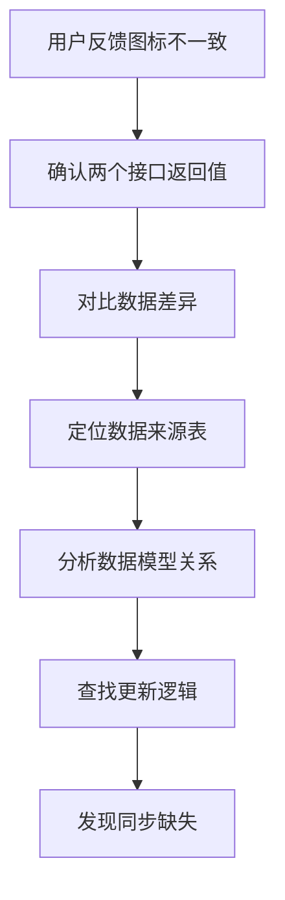
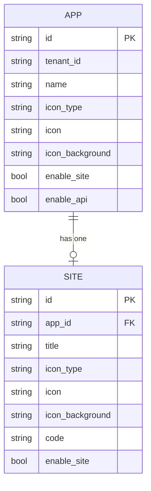
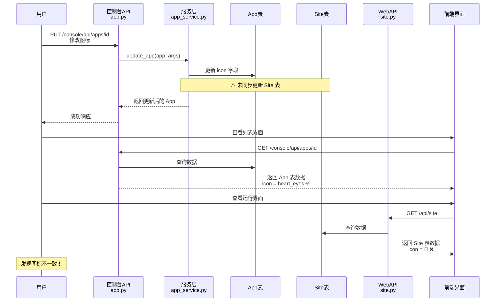
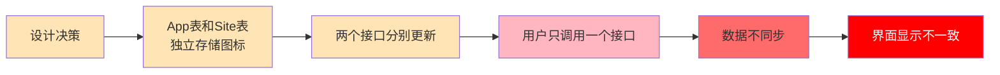
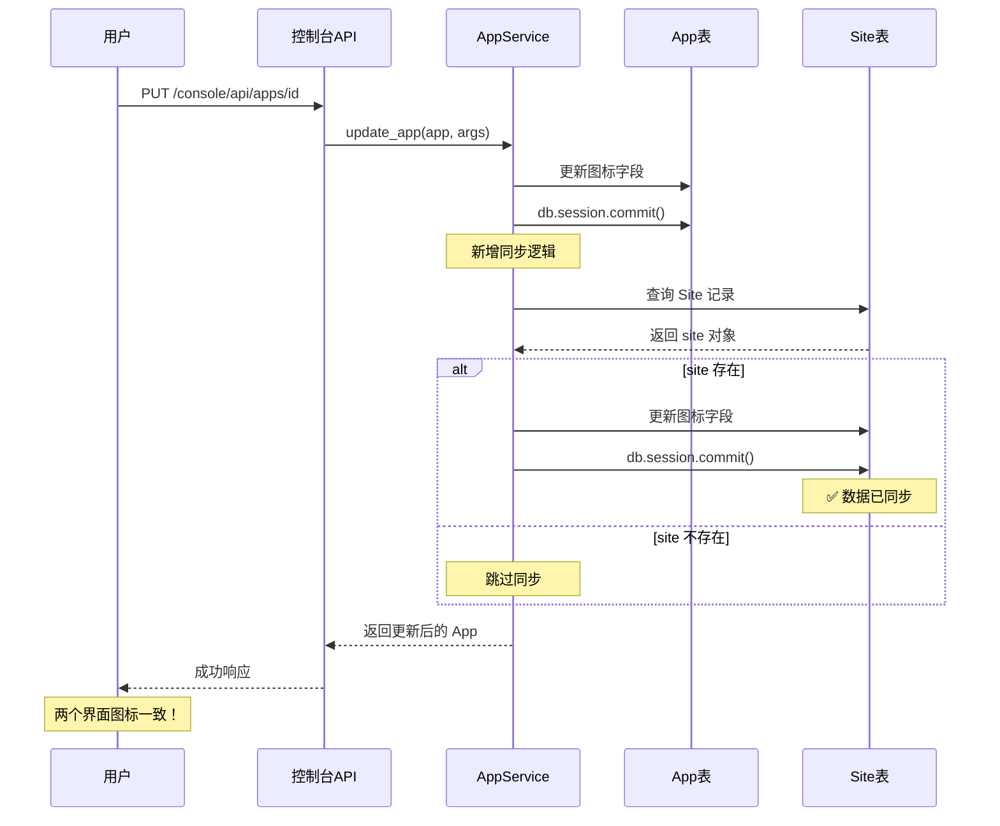
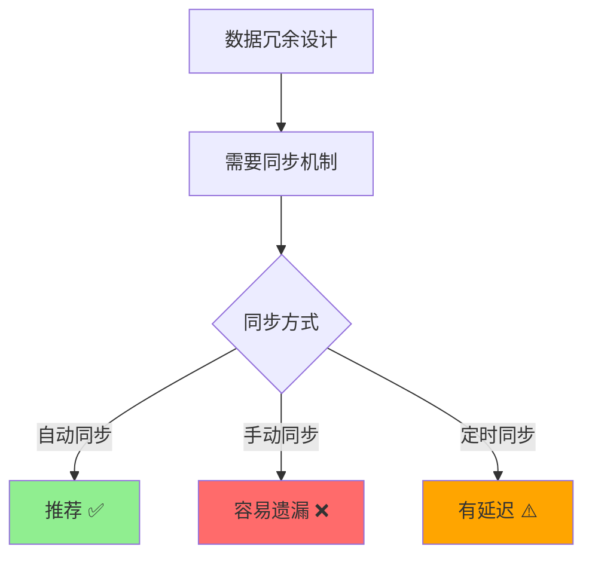
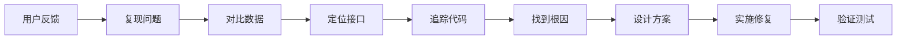
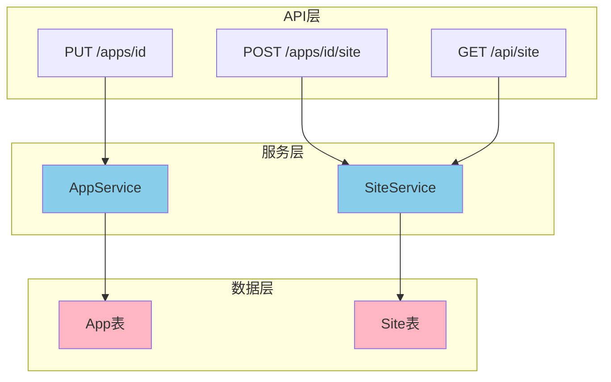
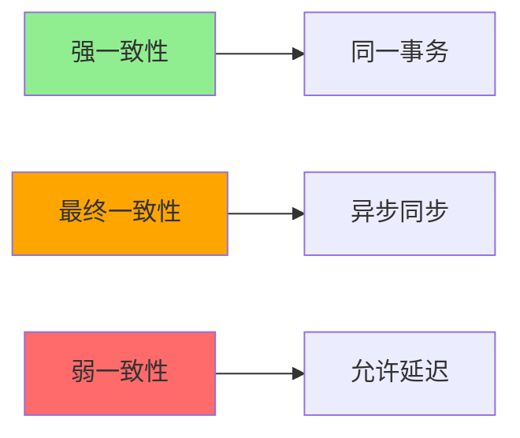

# Dify 修改图标导致列表与运行界面不一致问题深度解析

> **创建时间**: 2026-06-26 18:48  
> **Dify 版本**: 基于源码分析  
> **问题类型**: 数据同步问题  
> **影响范围**: 应用图标修改功能

---

## 📋 目录

- [问题背景](#问题背景)
- [问题现象](#问题现象)
- [问题排查过程](#问题排查过程)
- [源码深度分析](#源码深度分析)
- [根本原因](#根本原因)
- [解决方案](#解决方案)
- [经验总结](#经验总结)

---

## 问题背景

### 业务场景

在 Dify 平台中，用户可以自定义应用的图标，图标会在两个地方展示：

1. **控制台列表界面** - 应用管理列表、应用详情页等
2. **运行界面（WebApp）** - 用户实际使用应用时的界面

用户通过 API 修改应用图标后，期望两个地方的图标都能同步更新。

### 操作方式

用户通过以下两个 API 接口修改图标：

```bash
# 接口1: 修改应用基本信息（控制台使用）
PUT /console/api/apps/{app_id}

# 接口2: 修改站点配置（运行界面使用）
PUT /console/api/apps/{app_id}/site
```

---

## 问题现象

### 用户反馈

用户调用 `PUT /console/api/apps/{app_id}` 接口修改图标后：

- ✅ **控制台列表界面** - 图标已更新
- ❌ **运行界面** - 图标未更新，仍显示旧图标

### 具体请求示例

#### 请求1: 修改应用图标

```bash
curl 'http://10.20.183.170:30080/console/api/apps/02153288-4abe-41c9-8a59-5c7c3bf5ec19' \
  -X 'PUT' \
  -H 'Accept: */*' \
  -H 'content-type: application/json' \
  -H 'x-csrf-token: eyJhbGciOiJIUzI1NiIsInR5cCI6IkpXVCJ9...' \
  --data-raw '{
    "name": "wnn",
    "icon_type": "emoji",
    "icon": "heart_eyes",
    "icon_background": "#FFEAD5",
    "description": "",
    "use_icon_as_answer_icon": false,
    "max_active_requests": 0
  }'
```

**结果**: 列表界面图标变更为 `heart_eyes` ✅

#### 请求2: 查看运行界面站点配置

```bash
curl 'http://10.20.183.170:30080/api/site' \
  -H 'content-type: application/json' \
  -H 'x-app-code: nsVDFgAFHYihOOBe'
```

**返回数据**:

```json
{
  "app_id": "02153288-4abe-41c9-8a59-5c7c3bf5ec19",
  "site": {
    "title": "wnn",
    "icon_type": "emoji",
    "icon": "🤖",
    "icon_background": "#FFEAD5",
    "icon_url": null
  }
}
```

**问题**: `icon` 字段仍然是 `🤖`，而不是 `heart_eyes` ❌

---

## 问题排查过程

### 排查思路



### 第一步: 确认接口差异

通过对比两个接口的返回数据，发现：

| 接口 | 数据源 | icon 值 |
|------|--------|---------|
| `GET /console/api/apps/{app_id}` | App 表 | `heart_eyes` ✅ |
| `GET /api/site` | Site 表 | `🤖` ❌ |

### 第二步: 定位源码位置

通过 grep 搜索关键路径：

```bash
# 搜索 /api/site 路由
grep -r "/api/site" api/

# 搜索控制台应用更新接口
grep -r "apps/<uuid:app_id>" api/controllers/console/
```

### 第三步: 分析数据模型

查看 `api/models/model.py` 发现：

- **App 表** (第396-428行): 存储应用基本信息，包含 `icon_type`, `icon`, `icon_background`
- **Site 表** (第2122-2183行): 存储站点配置，也包含 `icon_type`, `icon`, `icon_background`

两个表都有独立的图标字段！

---

## 源码深度分析

### 1. 数据模型层

#### App 模型

**文件位置**: `api/models/model.py` (第396-428行)

```python
class App(Base):
    __tablename__ = "apps"
    __table_args__ = (
        sa.PrimaryKeyConstraint("id", name="app_pkey"), 
        sa.Index("app_tenant_id_idx", "tenant_id")
    )

    id: Mapped[str] = mapped_column(StringUUID, default=lambda: str(uuid4()))
    tenant_id: Mapped[str] = mapped_column(StringUUID)
    name: Mapped[str] = mapped_column(String(255))
    description: Mapped[str] = mapped_column(LongText, default=sa.text("''"))
    mode: Mapped[AppMode] = mapped_column(EnumText(AppMode, length=255))
    
    # 图标相关字段
    icon_type: Mapped[IconType | None] = mapped_column(EnumText(IconType, length=255))
    icon = mapped_column(String(255))
    icon_background: Mapped[str | None] = mapped_column(String(255))
    
    enable_site: Mapped[bool] = mapped_column(sa.Boolean)
    enable_api: Mapped[bool] = mapped_column(sa.Boolean)
    # ... 其他字段
```

#### Site 模型

**文件位置**: `api/models/model.py` (第2122-2183行)

```python
class Site(Base):
    __tablename__ = "sites"
    __table_args__ = (
        sa.PrimaryKeyConstraint("id", name="site_pkey"),
        sa.Index("site_app_id_idx", "app_id"),
        sa.Index("site_code_idx", "code", "status"),
    )

    id = mapped_column(StringUUID, default=lambda: str(uuid4()))
    app_id = mapped_column(StringUUID, nullable=False)
    title: Mapped[str] = mapped_column(String(255), nullable=False)
    
    # 图标相关字段（与 App 表重复）
    icon_type: Mapped[IconType | None] = mapped_column(EnumText(IconType, length=255), nullable=True)
    icon = mapped_column(String(255))
    icon_background = mapped_column(String(255))
    
    description = mapped_column(LongText)
    default_language: Mapped[str] = mapped_column(String(255), nullable=False)
    # ... 其他字段
```

#### IconType 枚举

**文件位置**: `api/models/model.py` (第390-393行)

```python
class IconType(StrEnum):
    IMAGE = auto()   # 图片类型
    EMOJI = auto()   # Emoji 类型
    LINK = auto()    # 链接类型
```

### 2. 数据模型关系图



**关系说明**:
- 一个 App 对应一个 Site (1:1 关系)
- 通过 `Site.app_id = App.id` 关联
- 两个表都有独立的图标字段

### 3. API 接口层

#### 接口1: 更新应用信息 (控制台)

**文件位置**: `api/controllers/console/app/app.py` (第570-623行)

```python
@console_ns.route("/apps/<uuid:app_id>")
class AppApi(Resource):
    @console_ns.doc("update_app")
    @console_ns.expect(console_ns.models[UpdateAppPayload.__name__])
    @setup_required
    @login_required
    @get_app_model(mode=None)
    @edit_permission_required
    def put(self, app_model: App):
        """Update app"""
        args = UpdateAppPayload.model_validate(console_ns.payload)
        
        app_service = AppService()
        
        args_dict: AppService.ArgsDict = {
            "name": args.name,
            "description": args.description or "",
            "icon_type": args.icon_type,
            "icon": args.icon or "",
            "icon_background": args.icon_background or "",
            "use_icon_as_answer_icon": args.use_icon_as_answer_icon or False,
            "max_active_requests": args.max_active_requests or 0,
        }
        
        # 调用服务层更新应用
        app_model = app_service.update_app(app_model, args_dict)
        
        response_model = AppDetailWithSite.model_validate(app_model, from_attributes=True)
        return response_model.model_dump(mode="json")
```

**关键点**:
- 路由: `PUT /console/api/apps/{app_id}`
- 更新的是 **App 表**
- 返回 `AppDetailWithSite` 包含 App 和 Site 的数据

#### 接口2: 更新站点配置

**文件位置**: `api/controllers/console/app/site.py` (第76-123行)

```python
@console_ns.route("/apps/<uuid:app_id>/site")
class AppSite(Resource):
    @console_ns.doc("update_app_site")
    @console_ns.expect(console_ns.models[AppSiteUpdatePayload.__name__])
    @setup_required
    @login_required
    @edit_permission_required
    @get_app_model
    @with_current_user
    def post(self, current_user: Account, app_model: App):
        args = AppSiteUpdatePayload.model_validate(console_ns.payload or {})
        
        # 查询 Site 记录
        site = db.session.scalar(
            select(Site).where(Site.app_id == app_model.id).limit(1)
        )
        if not site:
            raise NotFound
        
        # 更新 Site 表字段
        for attr_name in [
            "title", "icon_type", "icon", "icon_background",
            "description", "default_language", "chat_color_theme",
            # ... 其他字段
        ]:
            value = getattr(args, attr_name)
            if value is not None:
                setattr(site, attr_name, value)
        
        site.updated_by = current_user.id
        site.updated_at = naive_utc_now()
        db.session.commit()
        
        return AppSiteResponse.model_validate(site, from_attributes=True).model_dump(mode="json")
```

**关键点**:
- 路由: `POST /console/api/apps/{app_id}/site`
- 更新的是 **Site 表**
- 需要单独调用

#### 接口3: 获取站点信息 (运行界面)

**文件位置**: `api/controllers/web/site.py` (第17-86行)

```python
@web_ns.route("/site")
class AppSiteApi(WebApiResource):
    """Resource for app sites."""
    
    site_fields = {
        "title": fields.String,
        "chat_color_theme": fields.String,
        "chat_color_theme_inverted": fields.Boolean,
        "icon_type": fields.String,
        "icon": fields.String,
        "icon_background": fields.String,
        "icon_url": AppIconUrlField,
        "description": fields.String,
        # ... 其他字段
    }
    
    @marshal_with(app_fields)
    def get(self, app_model: App, end_user: EndUser):
        """Retrieve app site info."""
        # 从 Site 表查询
        site = db.session.scalar(
            select(Site).where(Site.app_id == app_model.id).limit(1)
        )
        
        if not site:
            raise Forbidden()
        
        # ... 其他逻辑
        
        return AppSiteInfo(app_model.tenant, app_model, site, end_user.id, can_replace_logo)
```

**关键点**:
- 路由: `GET /api/site`
- 数据来源于 **Site 表**
- 运行界面通过此接口获取图标

### 4. 服务层

#### AppService.update_app 方法

**文件位置**: `api/services/app_service.py` (第376-403行)

```python
def update_app(self, app: App, args: ArgsDict) -> App:
    """
    Update app
    :param app: App instance
    :param args: request args
    :return: App instance
    """
    assert current_user is not None
    
    # 更新 App 表字段
    app.name = args["name"]
    app.description = args["description"]
    
    icon_type = args.get("icon_type")
    if icon_type is None:
        resolved_icon_type = app.icon_type
    else:
        resolved_icon_type = IconType(icon_type)
    
    app.icon_type = resolved_icon_type
    app.icon = args["icon"]
    app.icon_background = args["icon_background"]
    app.use_icon_as_answer_icon = args.get("use_icon_as_answer_icon", False)
    app.max_active_requests = args.get("max_active_requests")
    
    app.updated_by = current_user.id
    app.updated_at = naive_utc_now()
    db.session.commit()
    
    # 发送更新事件
    app_was_updated.send(app)
    
    return app
```

**⚠️ 问题所在**: 
- 只更新了 **App 表**
- **没有同步更新 Site 表**
- 这就是导致数据不一致的根本原因！

### 5. 前端展示层

#### AppIcon 组件

**文件位置**: `web/app/components/base/app-icon/index.tsx` (第93-136行)

```tsx
const AppIcon: FC<AppIconProps> = ({
  size = 'medium',
  rounded = false,
  iconType,
  icon,
  background,
  imageUrl,
  // ... 其他props
}) => {
  const isValidImageIcon = iconType === 'image' && imageUrl
  const emojiIcon = (icon && icon !== '') ? icon : '🤖'
  const Icon = <em-emoji key={emojiIcon} id={emojiIcon} />
  
  return (
    <span
      className={cn(appIconVariants({ size, rounded }), className)}
      style={{ background: isValidImageIcon ? undefined : (background || '#FFEAD5') }}
    >
      {
        isValidImageIcon
          ? 
          : (innerIcon || Icon)
      }
    </span>
  )
}
```

**展示逻辑**:
- 如果 `iconType === 'image'` 且有 `imageUrl`，显示图片
- 否则显示 emoji 图标
- 默认 emoji 为 `🤖`

#### 运行界面数据获取

**文件位置**: `web/service/share.ts` (第109-111行)

```typescript
export const fetchAppInfo = async () => {
  return get('/site') as Promise<AppData>
}
```

**调用链路**:
```
运行界面加载 
  → fetchAppInfo() 
  → GET /api/site 
  → 返回 Site 表数据 
  → AppIcon 组件渲染
```

### 6. 完整的数据流向图



---

## 根本原因

### 原因分析



### 核心问题

1. **数据冗余设计**: App 表和 Site 表都存储了相同的图标字段
   - `icon_type`
   - `icon`
   - `icon_background`

2. **更新逻辑不联动**: 
   - `PUT /console/api/apps/{app_id}` 只更新 App 表
   - `POST /console/api/apps/{app_id}/site` 只更新 Site 表
   - 两个接口之间**没有自动同步机制**

3. **前端数据来源不同**:
   - 控制台列表: 从 App 表获取
   - 运行界面: 从 Site 表获取

### 为什么这样设计？

从源码分析，可能的原因：

1. **历史演进**: Site 表可能是后期添加的，用于支持 WebApp 的独立配置
2. **职责分离**: 
   - App 表: 应用核心配置
   - Site 表: WebApp 展示配置（包含标题、语言、隐私政策等）
3. **灵活性**: 允许应用图标和 WebApp 图标不同（虽然大多数情况应该相同）

---

## 解决方案

### 方案对比

| 方案 | 优点 | 缺点 | 推荐度 |
|------|------|------|--------|
| 方案1: 后端自动同步 | 一次调用，两处更新；用户体验好 | 需要修改核心代码 | ⭐⭐⭐⭐⭐ |
| 方案2: 前端双重调用 | 不修改后端代码 | 前端逻辑复杂；性能差 | ⭐⭐ |
| 方案3: API Gateway拦截 | 无需修改业务代码 | 增加架构复杂度 | ⭐⭐⭐ |
| 方案4: 数据库触发器 | 自动同步 | 难以维护；不推荐 | ⭐ |

### 推荐方案: 后端自动同步

#### 实现思路

在 `AppService.update_app()` 方法中，更新 App 表后，自动同步更新 Site 表。

#### 代码实现

**文件**: `api/services/app_service.py`

**修改位置**: `update_app` 方法（第376-403行）

```python
def update_app(self, app: App, args: ArgsDict) -> App:
    """
    Update app
    :param app: App instance
    :param args: request args
    :return: App instance
    """
    assert current_user is not None
    
    # 更新 App 表字段（原有逻辑）
    app.name = args["name"]
    app.description = args["description"]
    
    icon_type = args.get("icon_type")
    if icon_type is None:
        resolved_icon_type = app.icon_type
    else:
        resolved_icon_type = IconType(icon_type)
    
    app.icon_type = resolved_icon_type
    app.icon = args["icon"]
    app.icon_background = args["icon_background"]
    app.use_icon_as_answer_icon = args.get("use_icon_as_answer_icon", False)
    app.max_active_requests = args.get("max_active_requests")
    
    app.updated_by = current_user.id
    app.updated_at = naive_utc_now()
    db.session.commit()
    
    # ==================== 新增代码开始 ====================
    # 同步图标信息到 Site 表，确保运行界面显示一致
    from models.model import Site
    
    site = db.session.scalar(sa.select(Site).where(Site.app_id == app.id).limit(1))
    if site:
        site.icon_type = resolved_icon_type
        site.icon = args["icon"]
        site.icon_background = args["icon_background"]
        site.updated_by = current_user.id
        site.updated_at = naive_utc_now()
        db.session.commit()
    # ==================== 新增代码结束 ====================
    
    # 发送更新事件
    app_was_updated.send(app)
    
    return app
```

#### 修改说明

1. **查询 Site 记录**: 通过 `app.id` 查找对应的 Site
2. **同步图标字段**: 
   - `icon_type`
   - `icon`
   - `icon_background`
3. **更新审计字段**:
   - `updated_by`
   - `updated_at`
4. **事务提交**: 确保数据一致性

#### 流程图



### 其他方案实现

#### 方案2: 前端双重调用

**文件**: 前端调用处

```typescript
// 更新应用图标
async function updateAppIcon(appId: string, iconData: IconPayload) {
  // 1. 更新 App 表
  await fetch(`/console/api/apps/${appId}`, {
    method: 'PUT',
    body: JSON.stringify(iconData)
  })
  
  // 2. 同步更新 Site 表
  await fetch(`/console/api/apps/${appId}/site`, {
    method: 'POST',
    body: JSON.stringify({
      icon_type: iconData.icon_type,
      icon: iconData.icon,
      icon_background: iconData.icon_background
    })
  })
}
```

**缺点**:
- 需要两次网络请求
- 如果第二次请求失败，数据仍会不一致
- 前端需要知道后端的数据结构

#### 方案3: 使用 Flask 信号

**文件**: `api/services/app_service.py`

```python
# 在 app_was_updated 信号处理中同步
from flask.signals import signal

def on_app_was_updated(sender):
    """App 更新后的回调"""
    app = sender
    
    # 同步到 Site 表
    site = db.session.scalar(select(Site).where(Site.app_id == app.id).limit(1))
    if site:
        site.icon_type = app.icon_type
        site.icon = app.icon
        site.icon_background = app.icon_background
        db.session.commit()

# 注册信号监听
app_was_updated.connect(on_app_was_updated)
```

### 测试验证

#### 测试步骤

1. **修改应用图标**

```bash
curl 'http://10.20.183.170:30080/console/api/apps/02153288-4abe-41c9-8a59-5c7c3bf5ec19' \
  -X 'PUT' \
  -H 'content-type: application/json' \
  --data-raw '{
    "name": "wnn",
    "icon_type": "emoji",
    "icon": "heart_eyes",
    "icon_background": "#FFEAD5"
  }'
```

2. **验证 App 表数据**

```bash
curl 'http://10.20.183.170:30080/console/api/apps/02153288-4abe-41c9-8a59-5c7c3bf5ec19'
```

预期返回:
```json
{
  "icon_type": "emoji",
  "icon": "heart_eyes",
  "icon_background": "#FFEAD5"
}
```

3. **验证 Site 表数据**

```bash
curl 'http://10.20.183.170:30080/api/site' \
  -H 'x-app-code: nsVDFgAFHYihOOBe'
```

预期返回:
```json
{
  "site": {
    "icon_type": "emoji",
    "icon": "heart_eyes",
    "icon_background": "#FFEAD5"
  }
}
```

4. **界面验证**
   - 刷新控制台列表界面，确认图标为 `heart_eyes`
   - 刷新运行界面，确认图标为 `heart_eyes`
   - 两个界面图标应该一致 ✅

#### 数据库验证

```sql
-- 查询 App 表
SELECT id, name, icon_type, icon, icon_background 
FROM apps 
WHERE id = '02153288-4abe-41c9-8a59-5c7c3bf5ec19';

-- 查询 Site 表
SELECT id, app_id, icon_type, icon, icon_background 
FROM sites 
WHERE app_id = '02153288-4abe-41c9-8a59-5c7c3bf5ec19';
```

两个表的图标字段应该完全一致。

---

## 经验总结

### 关键要点

#### 1. 数据冗余的风险



**教训**: 
- 如果必须在多个地方存储相同数据，**必须实现自动同步机制**
- 不能依赖调用方手动维护数据一致性
- 最好在数据库层面或业务逻辑层面保证一致性

#### 2. API 设计原则

**单一职责 vs 便利性**

| 设计方式 | 优点 | 缺点 |
|---------|------|------|
| 分开更新（现状） | 灵活性高；职责清晰 | 需要多次调用；容易遗漏 |
| 合并更新 | 一次调用完成；不易出错 | 灵活性降低；耦合度高 |
| 自动同步（推荐） | 兼顾灵活性和便利性 | 需要额外开发 |

**建议**:
- 对于**强关联**的数据，应该自动同步
- 对于**可选覆盖**的配置，允许单独设置
- 提供明确的文档说明数据关系

#### 3. 源码阅读技巧

**排查问题的路径**:



**关键命令**:

```bash
# 1. 搜索路由定义
grep -r "route.*site" api/controllers/

# 2. 搜索模型定义
grep -r "class Site" api/models/

# 3. 搜索字段使用
grep -r "icon_type" api/

# 4. 查看调用关系
grep -r "update_app" api/services/

# 5. 查看导入关系
grep -r "from models.model import Site" api/
```

### 常见问题 FAQ

#### Q1: 为什么不直接删除 Site 表的图标字段？

**A**: Site 表可能需要支持**独立配置**的场景：
- 应用图标和 WebApp 图标可能不同
- 不同的展示场景可能需要不同的图标
- 历史数据迁移需要谨慎处理

**更好的做法**: 
- 保持字段，但实现自动同步
- 提供明确的 API 文档说明
- 如果确实需要不同，允许通过专门接口覆盖

#### Q2: 如果 Site 记录不存在怎么办？

**A**: 代码中已经处理了这种情况：

```python
site = db.session.scalar(sa.select(Site).where(Site.app_id == app.id).limit(1))
if site:
    # 只在实际存在时更新
    site.icon_type = resolved_icon_type
    # ...
```

**正常情况**: Site 记录应该在创建应用时一并创建
**异常情况**: 如果不存在，说明数据有问题，需要排查

#### Q3: 会不会有并发问题？

**A**: 在当前实现中：
- 两次 `db.session.commit()` 在同一个请求中
- 如果有并发更新，可能会有短暂不一致
- 但对于图标这种低频更新场景，影响很小

**优化建议** (如果需要):
```python
# 使用同一个事务
try:
    app.icon = args["icon"]
    # ... 更新 App
    
    if site:
        site.icon = args["icon"]
        # ... 更新 Site
    
    db.session.commit()  # 一次性提交
except Exception:
    db.session.rollback()
    raise
```

#### Q4: 其他字段是否也有类似问题？

**A**: 需要检查 App 和 Site 表的重叠字段：

| 字段 | App 表 | Site 表 | 是否同步 |
|------|--------|---------|----------|
| name/title | ✅ | ✅ | ❓ 需要检查 |
| icon_type | ✅ | ✅ | ❌ 本次修复 |
| icon | ✅ | ✅ | ❌ 本次修复 |
| icon_background | ✅ | ✅ | ❌ 本次修复 |
| description | ✅ | ✅ | ❓ 需要检查 |
| use_icon_as_answer_icon | ✅ | ✅ | ❓ 需要检查 |

**建议**: 全面审查重叠字段，确保同步逻辑完整

### 架构反思

#### 当前架构的问题



**问题点**:
1. 数据冗余但无同步机制
2. 服务层职责不清晰
3. API 调用方需要知道内部数据结构

#### 改进建议

**短期方案** (已实施):
- 在 `update_app` 中自动同步 Site 表
- 保证图标字段一致性

**中期方案**:
- 审查所有重叠字段
- 建立统一的同步机制
- 完善 API 文档

**长期方案**:
- 考虑数据库外键约束
- 实现领域事件驱动同步
- 或者重构数据模型，消除冗余

### 最佳实践

#### 1. 数据一致性保障



**选择依据**:
- **关键数据**: 使用同一事务保证强一致性
- **非关键数据**: 可以使用异步同步
- **缓存数据**: 允许最终一致性

#### 2. API 设计模式

**模式1: 聚合根模式**
```python
# App 是聚合根，Site 是内部实体
class AppService:
    def update_app(self, app, args):
        # 更新 App
        # 自动更新 Site
        # 保证一致性
```

**模式2: CQRS 模式**
```python
# 命令端: 更新
class AppCommandService:
    def update_icon(self, app_id, icon_data):
        # 同时更新 App 和 Site

# 查询端: 读取
class AppQueryService:
    def get_app_info(self, app_id):
        # 从最优的表读取
```

**模式3: 事件驱动**
```python
# 发布事件
app_was_updated.send(app, changed_fields=['icon'])

# 监听事件
def on_app_icon_changed(app):
    sync_to_site_table(app)
```

#### 3. 文档规范

API 文档应该明确说明：

```markdown
## 数据同步说明

### 图标字段

应用图标存储在两个表中：
- `apps` 表: 用于控制台展示
- `sites` 表: 用于 WebApp 展示

#### 同步规则

1. 调用 `PUT /apps/{id}` 时，会自动同步到 `sites` 表
2. 调用 `POST /apps/{id}/site` 时，只更新 `sites` 表
3. 两个表的图标字段始终保持一致

#### 注意事项

- 不建议直接调用 `/site` 接口修改图标
- 如需 WebApp 图标与应用图标不同，请联系管理员
```

---

## 附录

### A. 相关文件清单

| 文件路径 | 作用 | 关键行号 |
|---------|------|----------|
| `api/models/model.py` | 数据模型定义 | App:396, Site:2122, IconType:390 |
| `api/controllers/console/app/app.py` | 控制台应用API | 更新:606, 路由:570 |
| `api/controllers/console/app/site.py` | 控制台站点API | 更新:91, 路由:76 |
| `api/controllers/web/site.py` | WebApp站点API | 查询:73, 路由:17 |
| `api/services/app_service.py` | 应用服务层 | update_app:376 |
| `web/app/components/base/app-icon/index.tsx` | 图标组件 | 渲染:106-122 |
| `web/service/share.ts` | WebApp服务 | fetchAppInfo:109 |
| `web/models/share.ts` | 数据类型定义 | SiteInfo:11-27 |

### B. 关键 SQL 查询

#### 查询应用的图标信息

```sql
-- App 表
SELECT 
    a.id,
    a.name,
    a.icon_type,
    a.icon,
    a.icon_background
FROM apps a
WHERE a.id = '02153288-4abe-41c9-8a59-5c7c3bf5ec19';

-- Site 表
SELECT 
    s.id,
    s.app_id,
    s.title,
    s.icon_type,
    s.icon,
    s.icon_background
FROM sites s
WHERE s.app_id = '02153288-4abe-41c9-8a59-5c7c3bf5ec19';
```

#### 检查数据一致性

```sql
-- 查找图标不一致的应用
SELECT 
    a.id,
    a.name,
    a.icon_type AS app_icon_type,
    a.icon AS app_icon,
    s.icon_type AS site_icon_type,
    s.icon AS site_icon
FROM apps a
LEFT JOIN sites s ON s.app_id = a.id
WHERE 
    a.icon_type != s.icon_type 
    OR a.icon != s.icon
    OR a.icon_background != s.icon_background;
```

#### 批量修复不一致数据

```sql
-- 使用 App 表的图标更新 Site 表
UPDATE sites s
SET 
    icon_type = a.icon_type,
    icon = a.icon,
    icon_background = a.icon_background,
    updated_at = NOW()
FROM apps a
WHERE s.app_id = a.id
AND (
    a.icon_type != s.icon_type 
    OR a.icon != s.icon
    OR a.icon_background != s.icon_background
);
```

### C. 调试技巧

#### 1. 添加日志

在 `app_service.py` 中添加调试日志：

```python
import logging
logger = logging.getLogger(__name__)

def update_app(self, app: App, args: ArgsDict) -> App:
    logger.info(f"Updating app {app.id} icon: {args.get('icon')}")
    
    # ... 更新逻辑
    
    if site:
        logger.info(f"Syncing icon to site {site.id}")
        site.icon = args["icon"]
        # ...
    else:
        logger.warning(f"Site not found for app {app.id}")
```

#### 2. 数据库监控

```sql
-- 开启 SQL 日志
ALTER SYSTEM SET log_statement = 'all';
ALTER SYSTEM SET log_duration = on;
SELECT pg_reload_conf();

-- 查看最近的更新
SELECT 
    query,
    state,
    backend_start
FROM pg_stat_activity
WHERE query LIKE '%UPDATE%sites%'
ORDER BY backend_start DESC;
```

#### 3. API 调试

使用 curl 查看详细响应：

```bash
# 查看完整请求响应
curl -v 'http://10.20.183.170:30080/console/api/apps/{app_id}' \
  -X PUT \
  -H 'content-type: application/json' \
  -d '{"icon": "heart_eyes"}'

# 查看响应时间
curl -w "\nTime: %{time_total}s\n" \
  'http://10.20.183.170:30080/api/site'
```

### D. 性能考虑

#### 查询优化

```sql
-- 确保有索引
CREATE INDEX idx_sites_app_id ON sites(app_id);

-- 查看执行计划
EXPLAIN ANALYZE
SELECT * FROM sites WHERE app_id = 'xxx';
```

#### 批量更新优化

如果需要修复大量数据：

```python
# 分批处理，避免锁表
batch_size = 100
offset = 0

while True:
    apps = db.session.execute(
        select(App).offset(offset).limit(batch_size)
    ).scalars().all()
    
    if not apps:
        break
    
    for app in apps:
        sync_icon_to_site(app)
    
    db.session.commit()
    offset += batch_size
```

### E. 监控告警

#### 数据一致性监控

```python
# 定期检查脚本
def check_icon_consistency():
    inconsistent = db.session.execute("""
        SELECT a.id, a.icon, s.icon
        FROM apps a
        JOIN sites s ON s.app_id = a.id
        WHERE a.icon != s.icon
    """).fetchall()
    
    if inconsistent:
        logger.error(f"Found {len(inconsistent)} inconsistent apps")
        # 发送告警
        send_alert("Icon inconsistency detected", inconsistent)
    
    return len(inconsistent) == 0
```

---

## 总结

### 问题回顾

1. **现象**: 修改应用图标后，控制台列表和运行界面显示不一致
2. **原因**: App 表和 Site 表独立存储图标，更新接口未同步
3. **影响**: 用户体验差，数据不一致

### 解决方案

1. **实施**: 在 `AppService.update_app()` 中自动同步 Site 表
2. **效果**: 一次调用，两处更新，保证一致性
3. **优势**: 向后兼容，无需前端改动

### 经验教训

1. **数据冗余必须有同步机制**
2. **API 设计要考虑调用方的便利性**
3. **源码阅读是解决问题的关键技能**
4. **文档要说明数据关系和同步规则**

### 后续优化

1. 审查所有重叠字段，确保同步完整
2. 考虑数据库层面的约束机制
3. 完善 API 文档和开发者指南
4. 添加数据一致性监控

---

**文档版本**: v1.0  
**最后更新**: 2026-06-26  
**作者**: AI Assistant  
**审核状态**: 待审核

---

*本文档基于 Dify 源码分析编写，适用于理解 Dify 应用图标管理机制和解决数据一致性问题。*
