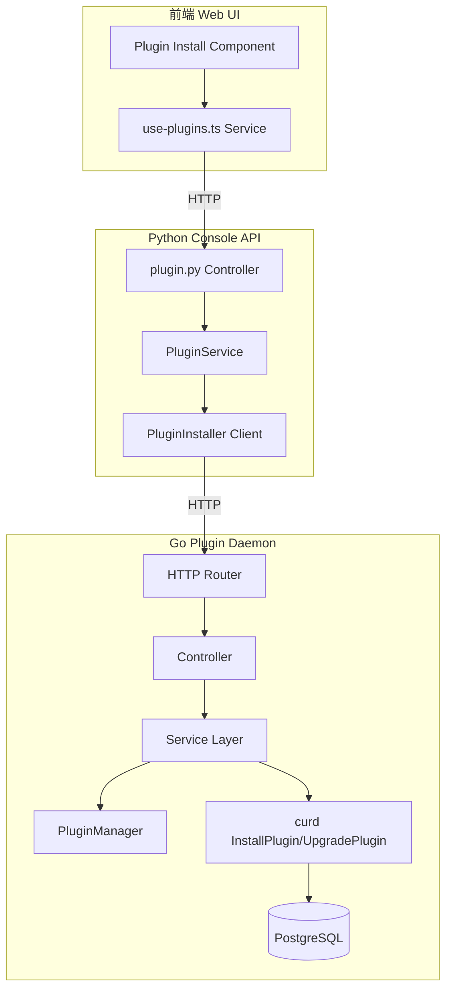
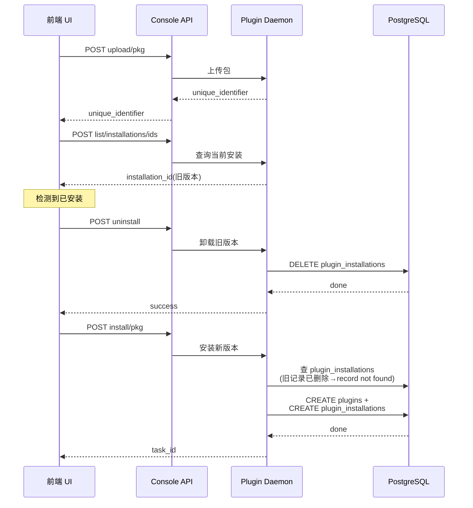
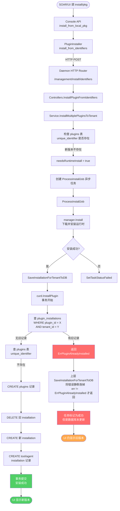
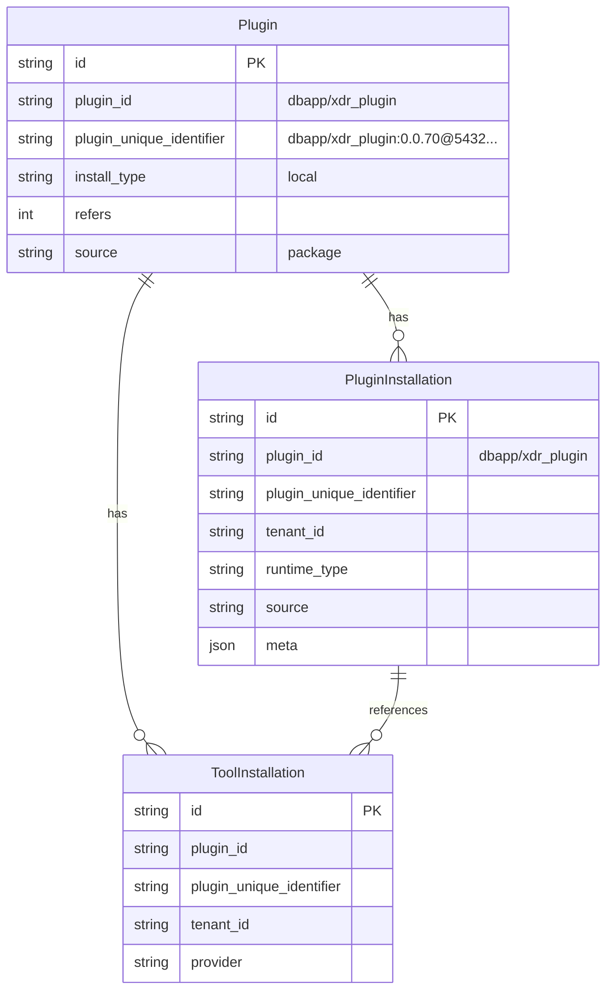
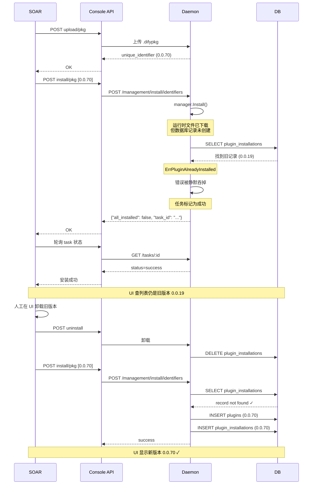

# Dify 插件升级问题源码级分析：新版插件安装后 UI 仍显示旧版本

> **摘要**：在 SOAR 平台通过 Dify Console API 自动安装/升级插件（xdr_plugin、edr_mingyu_host_safe、firewall_mingyu_das_tgfw）时，日志显示上传成功、安装确认成功，但 Dify 插件列表仍显示旧版本。手动在 UI 删除旧插件再安装新版本则可以成功。本文从源码层完整追溯前端 → Console API → Daemon → 数据库的调用链，定位根因并提供修复方向。

---

## 1. 问题背景

某安全编排自动化与响应（SOAR）平台集成了 Dify 作为 AI 工作流引擎，并通过 Dify Console API 自动安装和管理插件。SOAR 侧封装了一套 `AbstractPluginInstallService`，用于将插件 `.difypkg` 包上传并安装到 Dify。

插件列表（三个插件，均为 `dbapp` 作者发布）：

| 插件名 | 旧版本 | 新版本 |
|--------|--------|--------|
| `xdr_plugin` | 0.0.19 | 0.0.70 |
| `edr_mingyu_host_safe` | 0.0.7 | 0.0.8 |
| `firewall_mingyu_das_tgfw` | 0.0.7 | 0.0.8 |

---

## 2. 问题现象

### 2.1 SOAR 日志：上传和安装均返回成功

SOAR 端日志显示典型的安装流程：

```
[INFO][AbstractPluginInstallService.java:78]  - 开始安装插件：xdr-plugin
[INFO][AbstractPluginInstallService.java:98]  - 插件xdr-plugin准备安装，difypkg=xdr_plugin.difypkg
[INFO][DifyPluginInstallApi.java:65]  - 上传插件包：xdr_plugin.difypkg
[INFO][DifyPluginInstallApi.java:108] - 插件上传成功，unique_identifier=dbapp/xdr_plugin:0.0.70@5432646e...
[INFO][AbstractPluginInstallService.java:144] - 插件上传成功
[INFO][DifyPluginInstallApi.java:188] - 确认安装插件：dbapp/xdr_plugin:0.0.70@5432646e...
[INFO][DifyPluginInstallApi.java:197] - 插件安装确认成功：dbapp/xdr_plugin:0.0.70@5432646e...
[INFO][AbstractPluginInstallService.java:153] - 插件安装成功：xdr-plugin
```

每次日志都显示 **安装成功**，无任何异常。

### 2.2 Dify UI 页面：版本未更新

通过 Dify Console API 查看插件列表：

```bash
curl 'http://10.50.28.140:30080/console/api/workspaces/current/plugin/list?page=1&page_size=100'
```

返回的结果：

```json
{
  "plugin_unique_identifier": "dbapp/xdr_plugin:0.0.19@2467d6281b5c510775d84d26431ed9393a3089309f01998ccf102dcc40db8111",
  "version": "0.0.19"
}
```

UI 上显示的仍是 **0.0.19**，新版本 0.0.70 没有生效。

### 2.3 Daemon 日志：凭证校验仍走旧实例

`dify-plugin-daemon` 的日志暴露了关键信息：

```
plugin=dbapp/xdr_plugin:0.0.19@2467d6281b5c510775d84d26431ed9393a3089309f01998ccf102dcc40db8111
instance=019eee6b
message="[xdr_plugin_provider] ===== _validate_credentials ENTER ====="
```

实例 ID 是 `019eee6b`，版本是 `0.0.19`——**新上传的 0.0.70 并没有成为运行态实例**。

### 2.4 手动卸载后重装可解决

运维人员在 UI 手动卸载旧版本插件后，再次通过 SOAR 自动安装，新版本成功上线。Daemon 日志变为：

```
plugin=dbapp/xdr_plugin:0.0.70@5432646e6d51888b3d28a5f204161c688f9a4f1413b9457373c828ea7d6321c7
instance=019f01e5
message="[xdr_plugin_provider] ===== _validate_credentials ENTER ====="
```

新实例 `019f01e5`，版本 `0.0.70`，符合预期。

---

## 3. 排查过程与思路

### 3.1 对比分析：daemon 日志中的 SQL 差异

**安装成功但未生效时的 daemon SQL：**

```
[0.349ms] [rows:1] SELECT * FROM "plugins"
    WHERE plugin_unique_identifier = 'dbapp/xdr_plugin:0.0.70@5432646e...'
    ORDER BY "plugins"."id" LIMIT 1
```

```
[0.256ms] [rows:0] SELECT * FROM "plugin_installations"
    WHERE plugin_id = 'dbapp/xdr_plugin' AND tenant_id = '09746b25-...'
    ORDER BY "plugin_installations"."id" LIMIT 1
```

> 注意：第一行日志显示 `[rows:1]`（旧日志中），说明 `plugins` 表没找到新记录（合理），但 **`plugin_installations` 的查询日志在有旧版本时没有被打印出来**——因为这条 SQL 在内层事务中执行，遇到 `ErrPluginAlreadyInstalled` 后事务回滚，日志不出现。

**手动卸载后成功的 daemon SQL：**

```
[0.466ms] [rows:0] SELECT * FROM "plugins"
    WHERE plugin_unique_identifier = 'dbapp/xdr_plugin:0.0.70@5432646e...'
    ORDER BY "plugins"."id" LIMIT 1
```

```
[0.493ms] [rows:0] SELECT * FROM "plugin_installations"
    WHERE plugin_id = 'dbapp/xdr_plugin' AND tenant_id = '09746b25-...'
    ORDER BY "plugin_installations"."id" LIMIT 1
    -- record not found ← 关键差异！旧记录已被删除
```

```
[0.350ms] [rows:0] SELECT * FROM "plugins"
    WHERE plugin_unique_identifier = '...'
    AND plugin_id = 'dbapp/xdr_plugin' AND install_type = 'local'
    ORDER BY "plugins"."id" LIMIT 1 FOR UPDATE
```

卸载后 `plugin_installations` 查询返回 `record not found`，后续的 `FOR UPDATE` 查询和创建记录操作得以正常执行。

### 3.2 关键线索

从以上对比可以推断：

1. **上传成功**说明 `POST /upload/pkg` 端点正常工作，新包被正确解析
2. **安装确认成功**但实际不生效——`POST /install/pkg` 返回了成功，但没有更新数据库
3. Daemon 的 `plugin_installations` 表中存在以 `plugin_id` 为键的 **排重逻辑**，旧版本占据了这个位置
4. 手动卸载清除了这个记录，新版本才能写入

### 3.3 定位方向

ify Plugin Daemon 的安装逻辑中存在一个 **"同 plugin_id 只能有一个活跃安装"** 的约束。当 SOAR 直接调用 `POST /install/pkg` 安装新版本时，Daemon 发现 `dbapp/xdr_plugin` 已有活跃安装，直接跳过了后续操作。

---

## 4. 源码深度解析

### 4.1 Dify 整体架构概览

Dify 插件管理涉及三个组件：



---

### 4.2 源码目录结构

```
dify/
  api/
    controllers/console/workspace/plugin.py   # Console API 控制器
    core/plugin/plugin_service.py              # 插件业务逻辑
    core/plugin/impl/plugin.py                 # 与 Daemon 通信的客户端

dify-plugin-daemon/
    internal/
        server/http_server.go                  # HTTP 路由注册
        server/controllers/plugins.go          # API 控制器
        service/install_plugin.go              # 安装/升级服务
        tasks/install_plugin.go                # 异步任务处理
        tasks/install_plugin_utils.go          # 任务工具函数
        types/models/curd/atomic.go            # 数据库原子操作（核心）
        types/models/curd/errors.go            # 错误定义

dify/web/
    service/plugins.ts                          # 前端 API 调用层
    service/use-plugins.ts                      # 前端业务 hooks
    app/components/plugins/install-plugin/     # 安装组件
```

---

### 4.3 前端 UI 安装流程源码分析

#### 4.3.1 上传阶段

`install-from-local-package/steps/uploading.tsx` 中处理上传逻辑：

```typescript
const handleUploadFile = async () => {
  const response = await uploadFile(file, isBundle)
  // response 包含 unique_identifier 和 manifest
  if (isBundle) {
    onBundleUploaded(response)
  } else {
    onPackageUploaded({
      uniqueIdentifier: response.unique_identifier,
      manifest: response.manifest,
    })
  }
}
```

上传调用 `service/plugins.ts`：

```typescript
export const uploadFile = async (file: File, isBundle: boolean) => {
  return upload({
    xhr: new XMLHttpRequest(),
    data: formData,
  }, false, `/workspaces/current/plugin/upload/${isBundle ? 'bundle' : 'pkg'}`)
}
```

#### 4.3.2 安装阶段（关键！）

`install-from-local-package/steps/install.tsx` 第 69-108 行是安装核心逻辑：

```typescript
const handleInstall = async () => {
    if (isInstalling) return
    setIsInstalling(true)
    onStartToInstall?.()

    try {
      // ===== 关键步骤：如果已安装则先卸载旧版本 =====
      if (hasInstalled)
        await uninstallPlugin(installedInfoPayload.installedId)

      // ===== 然后安装新版本 =====
      const { all_installed, task_id } = await installPackageFromLocal(uniqueIdentifier)

      if (all_installed) {
        onInstalled()
        return
      }
      // 异步等待任务完成
      const { status, error } = await check({ taskId, pluginUniqueIdentifier: uniqueIdentifier })
      if (status === TaskStatus.failed) {
        onFailed(error)
        return
      }
      onInstalled(true)
    } catch (e) {
      onFailed(typeof e === 'string' ? e : undefined)
    }
}
```

`hasInstalled` 由 `useCheckInstalled` Hook 提供，其核心是调用：

```typescript
// useCheckInstalled 通过 POST /list/installations/ids 查询当前安装
const response = await post("/workspaces/current/plugin/list/installations/ids",
  { body: { plugin_ids: [pluginId] } })
```

`uninstallPlugin` 定义在 `service/plugins.ts`：

```typescript
export const uninstallPlugin = async (pluginId: string) => {
  return post('/workspaces/current/plugin/uninstall',
    { body: { plugin_installation_id: pluginId } })
}
```

#### 4.3.3 总结：前端做了 SOAR 没做的事



---

### 4.4 Console API 层源码分析（Python）

#### 4.4.1 路由注册

`controllers/console/workspace/plugin.py` 中定义了关键端点：

```python
# 上传包 -> 获取 unique_identifier
@console_ns.route("/workspaces/current/plugin/upload/pkg")
class PluginUploadFromPkgApi(Resource):
    def post(self):
        file = request.files["pkg"]
        response = PluginService.upload_pkg(tenant_id, content)
        return jsonable_encoder(response)

# 安装插件
@console_ns.route("/workspaces/current/plugin/install/pkg")
class PluginInstallFromPkgApi(Resource):
    def post(self):
        args = ParserPluginIdentifiers.model_validate(console_ns.payload)
        response = PluginService.install_from_local_pkg(tenant_id, args.plugin_unique_identifiers)
        return jsonable_encoder(response)

# 卸载插件
@console_ns.route("/workspaces/current/plugin/uninstall")
class PluginUninstallApi(Resource):
    def post(self):
        args = ParserUninstall.model_validate(console_ns.payload)
        return {"success": PluginService.uninstall(tenant_id, args.plugin_installation_id)}

# 市场升级（注意：仅用于 marketplace）
@console_ns.route("/workspaces/current/plugin/upgrade/marketplace")
class PluginUpgradeFromMarketplaceApi(Resource):
    def post(self):
        return PluginService.upgrade_plugin_with_marketplace(
            tenant_id, args.original_plugin_unique_identifier, args.new_plugin_unique_identifier)
```

#### 4.4.2 PluginService 调用链路

`core/plugin/plugin_service.py`：

```python
@staticmethod
def install_from_local_pkg(tenant_id, plugin_unique_identifiers):
    PluginService._check_marketplace_only_permission()
    manager = PluginInstaller()
    # 检查插件安装范围
    for plugin_unique_identifier in plugin_unique_identifiers:
        resp = manager.decode_plugin_from_identifier(tenant_id, plugin_unique_identifier)
        PluginService._check_plugin_installation_scope(resp.verification)

    # 调用 daemon
    result = manager.install_from_identifiers(
        tenant_id,
        plugin_unique_identifiers,
        PluginInstallationSource.Package,
        [{}],
    )
    PluginService.invalidate_plugin_model_providers_cache(tenant_id)
    return result
```

#### 4.4.3 PluginInstaller 客户端

`core/plugin/impl/plugin.py`：

```python
class PluginInstaller(BasePluginClient):
    def install_from_identifiers(self, tenant_id, identifiers, source, metas):
        # 调用 daemon 的 POST /management/install/identifiers
        return self._request_with_plugin_daemon_response(
            "POST",
            f"plugin/{tenant_id}/management/install/identifiers",
            PluginInstallTaskStartResponse,
            data={
                "plugin_unique_identifiers": identifiers,
                "source": source,
                "metas": metas,
            },
        )

    def uninstall(self, tenant_id, plugin_installation_id):
        return self._request_with_plugin_daemon_response(
            "POST",
            f"plugin/{tenant_id}/management/uninstall",
            bool,
            data={"plugin_installation_id": plugin_installation_id},
        )

    def upgrade_plugin(self, tenant_id, original, new, source, meta):
        # 调用 daemon 的 POST /management/install/upgrade
        return self._request_with_plugin_daemon_response(
            "POST",
            f"plugin/{tenant_id}/management/install/upgrade",
            PluginInstallTaskStartResponse,
            data={
                "original_plugin_unique_identifier": original,
                "new_plugin_unique_identifier": new,
                "source": source,
                "meta": meta,
            },
        )
```

---

### 4.5 Daemon 核心源码分析（Go）

这是整条链路中最关键的部分。

#### 4.5.1 路由注册

`internal/server/http_server.go` 第 168-197 行：

```go
func (app *App) pluginManagementGroup(group *gin.RouterGroup, config *app.Config) {
    group.POST("/install/upload/package", controllers.UploadPlugin(config))
    group.POST("/install/identifiers",   controllers.InstallPluginFromIdentifiers(config))
    group.POST("/install/upgrade",       controllers.UpgradePlugin(config))
    group.GET("/install/tasks/:id",      controllers.FetchPluginInstallationTask)
    group.POST("/uninstall",             controllers.UninstallPlugin)
    group.POST("/installation/fetch/batch", controllers.BatchFetchPluginInstallationByIDs)
    // ...
}
```

#### 4.5.2 安装控制器

`internal/server/controllers/plugins.go` 第 127-155 行：

```go
func InstallPluginFromIdentifiers(app *app.Config) gin.HandlerFunc {
    return func(c *gin.Context) {
        BindRequest(c, func(request struct {
            TenantID                string                                   
            PluginUniqueIdentifiers []plugin_entities.PluginUniqueIdentifier 
            Source                  string                                   
            Metas                   []map[string]any                         
        }) {
            c.JSON(http.StatusOK, service.InstallMultiplePluginsToTenant(
                c.Request.Context(), app, request.TenantID,
                request.PluginUniqueIdentifiers, request.Source, request.Metas,
            ))
        })
    }
}
```

#### 4.5.3 InstallMultiplePluginsToTenant —— 安装服务入口

`internal/service/install_plugin.go` 第 36-146 行：

```go
func InstallMultiplePluginsToTenant(
    ctx context.Context, config *app.Config, tenantId string,
    pluginUniqueIdentifiers []plugin_entities.PluginUniqueIdentifier,
    source string, metas []map[string]any,
) *entities.Response {
    runtimeType := config.Platform.ToPluginRuntimeType()
    manager := plugin_manager.Manager()

    jobs := make([]tasks.PluginInstallJob, 0, len(pluginUniqueIdentifiers))
    allInstalled := true

    for i, pluginUniqueIdentifier := range pluginUniqueIdentifiers {
        declaration, _ := helper.CombinedGetPluginDeclaration(pluginUniqueIdentifier, runtimeType)

        // 检查 plugins 表中是否已有此 unique_identifier
        _, err = db.GetOne[models.Plugin](
            db.Equal("plugin_unique_identifier", pluginUniqueIdentifier.String()),
        )

        needsRuntimeInstall := false
        if err == db.ErrDatabaseNotFound {
            needsRuntimeInstall = true   // 新标识符 → 需要安装
            allInstalled = false
        }

        job := tasks.PluginInstallJob{
            Identifier:          pluginUniqueIdentifier,
            Declaration:         declaration,
            Meta:                metas[i],
            NeedsRuntimeInstall: needsRuntimeInstall,
        }
        jobs = append(jobs, job)
    }

    // 如果所有插件都已安装（allInstalled=true），直接保存到 DB
    // 否则创建异步任务执行安装
    if allInstalled {
        // 简单保存 DB 记录
        tasks.SaveInstallationForTenantsToDB(tenants, jobs, runtimeType, source)
        return entities.NewSuccessResponse(&InstallPluginResponse{AllInstalled: true})
    }

    // 创建异步任务
    taskRegistry, _ := createInstallTasks(tenants, statuses)
    taskIDs := taskRegistry.IDs()

    for _, job := range jobs {
        jobCopy := job
        routine.Submit(..., func() {
            tasks.ProcessInstallJob(taskCtx, manager, tenants, runtimeType,
                source, taskIDs, jobCopy)
        })
    }
    return entities.NewSuccessResponse(&InstallPluginResponse{
        AllInstalled: false,
        TaskID:       taskRegistry.PrimaryID(),
    })
}
```

#### 4.5.4 ProcessInstallJob —— 异步安装任务

`internal/tasks/install_plugin.go` 第 33-106 行：

```go
func ProcessInstallJob(
    ctx context.Context, manager *plugin_manager.PluginManager,
    tenants []string, runtimeType plugin_entities.PluginRuntimeType,
    source string, taskIDs []string, job PluginInstallJob,
) {
    // 不需要运行时安装 → 直接保存到 DB
    if !job.NeedsRuntimeInstall {
        SaveInstallationForTenantsToDB(tenants, job, runtimeType, source)
        SetTaskStatusForOnePlugin(taskIDs, job.Identifier,
            models.InstallTaskStatusSuccess, "installed")
        return
    }

    // 需要运行时安装 → 调用 manager.Install() 下载并安装
    installationStream, err := manager.Install(ctx, job.Identifier)
    if err != nil { ... return }

    err = installationStream.Process(func(resp installation_entities.PluginInstallResponse) {
        switch resp.Event {
        case installation_entities.PluginInstallEventDone:
            // ===== 保存到数据库（这才是问题所在） =====
            if err := SaveInstallationForTenantsToDB(tenants, job, runtimeType, source); err != nil {
                SetTaskStatusForOnePlugin(taskIDs, job.Identifier,
                    models.InstallTaskStatusFailed, err.Error())
                return
            }
            SetTaskStatusForOnePlugin(taskIDs, job.Identifier,
                models.InstallTaskStatusSuccess, "installed")
        }
    })
}
```

#### 4.5.5 SaveInstallationForTenantsToDB → curd.InstallPlugin（根因所在）

`internal/tasks/install_plugin.go` 第 213-231 行：

```go
func SaveInstallationForTenantToDB(
    tenantID string, job PluginInstallJob,
    runtimeType plugin_entities.PluginRuntimeType, source string,
) error {
    _, _, err := curd.InstallPlugin(
        tenantID, job.Identifier, runtimeType,
        job.Declaration, source, job.Meta,
    )
    // ===== 关键！ErrPluginAlreadyInstalled 被静默吞掉 =====
    if err != nil && err != curd.ErrPluginAlreadyInstalled {
        return err
    }
    return nil
}
```

#### 4.5.6 curd.InstallPlugin —— 数据库原子操作（核心根因）

`internal/types/models/curd/atomic.go` 第 20-216 行：

```go
func InstallPlugin(
    tenantId string,
    pluginUniqueIdentifier plugin_entities.PluginUniqueIdentifier,
    installType plugin_entities.PluginRuntimeType,
    declaration *plugin_entities.PluginDeclaration,
    source string, meta map[string]any,
) (*models.Plugin, *models.PluginInstallation, error) {

    var pluginToBeReturns *models.Plugin
    var installationToBeReturns *models.PluginInstallation

    err := db.WithTransaction(func(tx *gorm.DB) error {
        pluginID := pluginUniqueIdentifier.PluginID()

        // ===== 第 1 步：查已存在的 installation ← 问题就在这里！ =====
        // 按 plugin_id 查询（即 "dbapp/xdr_plugin"），不是按 unique_identifier
        _, err := db.GetOne[models.PluginInstallation](
            db.Equal("plugin_id", pluginID),
            db.Equal("tenant_id", tenantId),
        )
        if err == nil {
            return ErrPluginAlreadyInstalled   // ← 找到旧记录 → 拒绝安装
        }

        // ===== 第 2 步：查 plugins 表 =====
        p, err := db.GetOne[models.Plugin](
            db.WithTransactionContext(tx),
            db.Equal("plugin_unique_identifier", pluginUniqueIdentifier.String()),
            db.WLock(),
        )

        if errors.Is(err, db.ErrDatabaseNotFound) {
            // 不存在 → 创建新记录
            plugin := &models.Plugin{
                PluginID:               pluginID,
                PluginUniqueIdentifier: pluginUniqueIdentifier.String(),
                InstallType:            installType,
                Refers:                 1,
                Source:                 source,
            }
            db.Create(plugin, tx)
            pluginToBeReturns = plugin
        } else {
            // 已存在 → 增加引用计数
            p.Refers++
            db.Update(&p, tx)
            pluginToBeReturns = &p
        }

        // ===== 第 3 步：删除已存在的 installation（清理旧安装） =====
        // 注意：如果第 1 步已经返回 ErrPluginAlreadyInstalled，这里的代码不会执行
        db.DeleteByCondition(models.PluginInstallation{
            PluginID:    pluginToBeReturns.PluginID,
            RuntimeType: string(installType),
            TenantID:    tenantId,
        }, tx)

        // ===== 第 4 步：创建新的 installation =====
        installation := &models.PluginInstallation{
            PluginID:               pluginToBeReturns.PluginID,
            PluginUniqueIdentifier: pluginToBeReturns.PluginUniqueIdentifier,
            TenantID:               tenantId,
            RuntimeType:            string(installType),
            Source:                 source,
            Meta:                   meta,
        }
        db.Create(installation, tx)
        installationToBeReturns = installation

        // 创建 tool/agent/model/datasource/trigger 安装记录
        // ...
        return nil
    })

    if err != nil { return nil, nil, err }
    return pluginToBeReturns, installationToBeReturns, nil
}
```

`internal/types/models/curd/errors.go` 第 5-7 行：

```go
var ErrPluginAlreadyInstalled = errors.New("plugin already installed")
```

#### 4.5.7 为什么同 plugin_id 查询会命中旧版本

关键在于 `PluginUniqueIdentifier.PluginID()` 方法返回的是 `author/name` 格式的标识符。对于所有版本的 xdr_plugin：

| 版本 | unique_identifier | plugin_id |
|------|------------------|-----------|
| 0.0.19 | `dbapp/xdr_plugin:0.0.19@2467d628...` | `dbapp/xdr_plugin` |
| 0.0.70 | `dbapp/xdr_plugin:0.0.70@5432646e...` | `dbapp/xdr_plugin` |

`plugin_id` 在同一个插件不同版本之间完全一致。而 `InstallPlugin` 第 36-43 行的查询条件是 `plugin_id` + `tenant_id`，因此 0.0.19 的记录会命中查询，导致安装被拒绝。

#### 4.5.8 完整的安装流程图



---

### 4.6 已有但未被使用的 Upgrad 路径

Daemon 中存在完整的 `UpgradePlugin` 流程，但是 Console API 的 `install/pkg` 端点没有使用它。

#### 4.6.1 Daemon 升级控制器

`internal/server/controllers/plugins.go` 第 96-125 行：

```go
func UpgradePlugin(app *app.Config) gin.HandlerFunc {
    return func(c *gin.Context) {
        BindRequest(c, func(request struct {
            OriginalPluginUniqueIdentifier plugin_entities.PluginUniqueIdentifier
            NewPluginUniqueIdentifier      plugin_entities.PluginUniqueIdentifier
            Source                         string
            Meta                           map[string]any
        }) {
            // 校验新旧标识符不能相同
            if request.OriginalPluginUniqueIdentifier == request.NewPluginUniqueIdentifier {
                c.JSON(http.StatusOK, exception.BadRequestError(...))
                return
            }
            // 校验新旧 plugin_id 必须相同（同一插件不同版本）
            if request.OriginalPluginUniqueIdentifier.PluginID() != request.NewPluginUniqueIdentifier.PluginID() {
                c.JSON(http.StatusOK, exception.BadRequestError(...))
                return
            }

            c.JSON(http.StatusOK, service.UpgradePlugin(
                app, request.TenantID, request.Source, request.Meta,
                request.OriginalPluginUniqueIdentifier,
                request.NewPluginUniqueIdentifier,
            ))
        })
    }
}
```

#### 4.6.2 Daemon 升级服务

`internal/service/install_plugin.go` 第 199-322 行：

```go
func UpgradePlugin(
    config *app.Config, tenantId string, source string,
    meta map[string]any,
    originalPluginUniqueIdentifier plugin_entities.PluginUniqueIdentifier,
    newPluginUniqueIdentifier plugin_entities.PluginUniqueIdentifier,
) *entities.Response {
    // 找到旧安装记录
    installation, err := db.GetOne[models.PluginInstallation](
        db.Equal("tenant_id", tenantId),
        db.Equal("plugin_unique_identifier", originalPluginUniqueIdentifier.String()),
        db.Equal("source", source),
    )

    if err == db.ErrDatabaseNotFound {
        return exception.NotFoundError(errors.New("plugin installation not found"))
    }
    // ...

    // 检查新版本是否已下载
    _, err = db.GetOne[models.Plugin](
        db.Equal("plugin_unique_identifier", newPluginUniqueIdentifier.String()),
    )

    if err == nil {
        // 新版本已下载 → 同步升级（直接调 curd.UpgradePlugin）
        response, _ := curd.UpgradePlugin(tenantId, originalPluginUniqueIdentifier,
            newPluginUniqueIdentifier, originalDeclaration, newDeclaration,
            runtimeType, source, meta)
        // 清理旧缓存
        if response.IsOriginalPluginDeleted {
            helper.DeletePluginDeclarationCache(originalPluginUniqueIdentifier, runtimeType)
        }
        // 异步移除旧插件
        tasks.RemovePluginIfNeeded(manager, originalPluginUniqueIdentifier, response)
        return entities.NewSuccessResponse(...)
    }

    // 新版本未下载 → 异步升级
    job := tasks.PluginUpgradeJob{
        NewIdentifier:       newPluginUniqueIdentifier,
        OriginalIdentifier:  originalPluginUniqueIdentifier,
        OriginalDeclaration: originalDeclaration,
        Meta:                meta,
    }
    routine.Submit(..., func() {
        tasks.ProcessUpgradeJob(taskCtx, manager, tenants, runtimeType,
            source, taskIDs, job)
    })
    return entities.NewSuccessResponse(...)
}
```

#### 4.6.3 curd.UpgradePlugin——正确实现

`internal/types/models/curd/atomic.go` 第 419-685 行：

```go
func UpgradePlugin(
    tenantId string,
    originalPluginUniqueIdentifier plugin_entities.PluginUniqueIdentifier,
    newPluginUniqueIdentifier plugin_entities.PluginUniqueIdentifier,
    originalDeclaration *plugin_entities.PluginDeclaration,
    newDeclaration *plugin_entities.PluginDeclaration,
    installType plugin_entities.PluginRuntimeType,
    source string, meta map[string]any,
) (*UpgradePluginResponse, error) {
    err := db.WithTransaction(func(tx *gorm.DB) error {
        // 1. 找到旧 installation（有则升级，无则报错）
        installation, err := db.GetOne[models.PluginInstallation](
            db.Equal("plugin_unique_identifier", originalPluginUniqueIdentifier.String()),
            db.Equal("tenant_id", tenantId),
            db.WLock(),
        )
        if err == db.ErrDatabaseNotFound {
            return errors.New("plugin has not been installed")
        }

        // 2. 创建或查找新版本 plugins 记录
        plugin, err := db.GetOne[models.Plugin](
            db.Equal("plugin_unique_identifier", newPluginUniqueIdentifier.String()),
        )
        if err == db.ErrDatabaseNotFound {
            plugin = models.Plugin{
                PluginID: newPluginUniqueIdentifier.PluginID(),
                PluginUniqueIdentifier: newPluginUniqueIdentifier.String(),
                // ...
            }
            db.Create(&plugin, tx)
        }

        // 3. 更新 installation → 指向新版本
        // 这是与 InstallPlugin 不同的地方：保留原 installation 记录，只更新指针
        installation.PluginUniqueIdentifier = newPluginUniqueIdentifier.String()
        installation.Meta = meta
        db.Update(installation, tx)

        // 4. 旧版本引用减一
        db.Run(db.Model(&models.Plugin{}),
            db.Equal("plugin_unique_identifier", originalPluginUniqueIdentifier.String()),
            db.Inc(map[string]int{"refers": -1}),
        )

        // 5. 如果旧版本引用为 0 → 删除旧版本
        originalPlugin, _ := db.GetOne[models.Plugin](
            db.Equal("plugin_unique_identifier", originalPluginUniqueIdentifier.String()),
        )
        if originalPlugin.Refers == 0 {
            db.Delete(&originalPlugin, tx)
            response.IsOriginalPluginDeleted = true
        }

        // 6. 新版本引用加一
        db.Run(db.Model(&models.Plugin{}),
            db.Equal("plugin_unique_identifier", newPluginUniqueIdentifier.String()),
            db.Inc(map[string]int{"refers": 1}),
        )

        // 7. 更新 tool/agent/model/datasource/trigger 安装记录
        // ...
        return nil
    })
    return &response, nil
}
```

`UpgradePlugin` 与 `InstallPlugin` 的核心区别：

| 对比项 | `InstallPlugin` | `UpgradePlugin` |
|--------|----------------|----------------|
| 旧记录处理 | 查 `plugin_id` 有无记录 → 有则拒绝 | 按 `unique_identifier` 找到旧记录 → 更新指针 |
| `plugin_installations` | 删旧建新 | 复用旧记录，只改 `unique_identifier` 字段 |
| 引用计数 | 新建 Refers=1 | 旧 Refers-1，新 Refers+1 |
| 适用场景 | 全新安装 | 同插件升级 |

#### 4.6.4 ProcessUpgradeJob 异步任务

`internal/tasks/install_plugin.go` 第 108-183 行：

```go
func ProcessUpgradeJob(
    ctx context.Context, manager *plugin_manager.PluginManager,
    tenants []string, runtimeType plugin_entities.PluginRuntimeType,
    source string, taskIDs []string, job PluginUpgradeJob,
) {
    // 安装新版本运行时
    installationStream, err := manager.Install(ctx, job.NewIdentifier)
    if err != nil { ... return }

    installationStream.Process(func(resp installation_entities.PluginInstallResponse) {
        switch resp.Event {
        case installation_entities.PluginInstallEventDone:
            for _, tenantID := range tenants {
                // 调用 curd.UpgradePlugin
                response, err := curd.UpgradePlugin(
                    tenantID,
                    job.OriginalIdentifier,
                    job.NewIdentifier,
                    // ...
                )
                // 清理旧实例
                if response.IsOriginalPluginDeleted {
                    helper.DeletePluginDeclarationCache(job.OriginalIdentifier, runtimeType)
                }
                RemovePluginIfNeeded(manager, job.OriginalIdentifier, response)
            }
            SetTaskStatusForOnePlugin(taskIDs, job.NewIdentifier,
                models.InstallTaskStatusSuccess, "upgraded")
        }
    })
}
```

---

### 4.7 数据库模型关系



关键关系：
- `Plugin` 表：存储插件的 **版本（unique_identifier）**，`refers` 表示被多少个租户引用
- `PluginInstallation` 表：存储 **哪个租户安装了哪个版本**，是 UI 列表的数据来源
- `plugin_id` 字段在两个表中都是 `author/name` 格式，跨版本不变
- `plugin_unique_identifier` 字段才是包含版本号和 checksum 的完整标识

---

## 5. 根因结论

### 5.1 一句话结论

**`curd.InstallPlugin` 以 `plugin_id`（而非 `plugin_unique_identifier`）检查是否已安装，导致旧版本（相同 `plugin_id`）的安装记录阻止了新版本的数据库写入。**

### 5.2 完整故障链路



### 5.3 涉及的所有代码位置

| 层级 | 文件 | 行号 | 关键代码 |
|------|------|------|---------|
| 前端 (TSX) | `web/app/components/plugins/install-plugin/install-from-local-package/steps/install.tsx` | 76-77 | `if (hasInstalled) await uninstallPlugin(...)` |
| 前端 (TS) | `web/service/plugins.ts` | 73-75 | `uninstallPlugin` 定义 |
| Console API | `api/core/plugin/plugin_service.py` | 529-545 | `install_from_local_pkg` |
| Console API | `api/core/plugin/impl/plugin.py` | 119-140 | `install_from_identifiers` 调用 daemon |
| Daemon 路由 | `internal/server/http_server.go` | 168-197 | 路由注册 |
| Daemon 控制器 | `internal/server/controllers/plugins.go` | 127-155 | `InstallPluginFromIdentifiers` |
| Daemon 服务 | `internal/service/install_plugin.go` | 36-146 | `InstallMultiplePluginsToTenant` |
| Daemon 任务 | `internal/tasks/install_plugin.go` | 33-106 | `ProcessInstallJob` |
| Daemon 任务 | `internal/tasks/install_plugin.go` | 213-231 | `SaveInstallationForTenantToDB` **吞掉错误** |
| Daemon 原子操作 | `internal/types/models/curd/atomic.go` | 20-216 | `InstallPlugin` **根因：`plugin_id` 排重** |
| Daemon 错误定义 | `internal/types/models/curd/errors.go` | 5-7 | `ErrPluginAlreadyInstalled` |
| 升级控制器 | `internal/server/controllers/plugins.go` | 96-125 | `UpgradePlugin`（未被使用） |
| 升级原子操作 | `internal/types/models/curd/atomic.go` | 419-685 | `UpgradePlugin`（正确实现） |

---

## 6. 修复方案

### 6.1 方案一：SOAR 侧增加卸载前置步骤

在 SOAR 的 `AbstractPluginInstallService.installPlugin()` 中添加逻辑：

```java
public void installPlugin(PluginProviderConfig config) {
    // 现有逻辑
    ProviderConfig.Identity identity = config.getIdentity();
    String pluginId = identity.getAuthor() + "/" + identity.getName();

    // ===== 新增：查询并卸载旧版本 =====
    List<JSONObject> installations = difyPluginInstallApi.listPluginInstallations(pluginId);
    if (installations != null && !installations.isEmpty()) {
        for (JSONObject installation : installations) {
            String installationId = installation.getString("id");
            difyPluginInstallApi.uninstallPlugin(installationId);
            logger.info("已卸载旧版本插件安装：{} (installation_id={})", pluginId, installationId);
        }
    }

    // 原有流程：上传 + 安装
    // ...
}
```

### 6.2 方案二：调用 Daemon 的 Upgrade 接口

SOAR 直接调用 Console API 的 `upgrade/marketplace` 端点（或等价实现），走 daemon 的 `ProcessUpgradeJob` 路径。

### 6.3 方案三：修改 Daemon 的 InstallPlugin 逻辑（不推荐）

如果修改 daemon 源码，可以在 `curd.InstallPlugin` 中检测到已存在安装时自动升级：

```go
// 修改 atomic.go 第 36-43 行
_, err := db.GetOne[models.PluginInstallation](
    db.Equal("plugin_id", pluginID),
    db.Equal("tenant_id", tenantId),
)
if err == nil {
    // 已存在安装 → 调用 UpgradePlugin 逻辑
    return upgradeInstead(tenantId, oldIdentifier, pluginUniqueIdentifier, ...)
}
```

但此方案涉及改动 daemon 核心逻辑，需要谨慎评估对其他调用方的影响。

---

## 7. 经验教训

1. **Dify Console API 的 `install/pkg` 不是幂等的升级接口**。它只适用于全新安装场景，
   升级已存在的插件需要先卸载或走 `upgrade` 端点。
2. **Dify 前端做了 SOAR 没做的事**。前端在调用 `install/pkg` 之前主动检查并卸载旧版本，
   而 SOAR 的自动化流程跳过了这一步骤，导致安装"成功"但未生效。
3. **区分 `plugin_id` 和 `plugin_unique_identifier`**。前者是 `author/name`（跨版本不变），
   后者是 `author/name:version@checksum`（每个版本唯一）。Daemon 的 `InstallPlugin` 用前者做排重检查，
   导致同插件不同版本互相阻塞。
4. **异步错误处理**。`SaveInstallationForTenantToDB` 静默吞掉 `ErrPluginAlreadyInstalled`
   使得外层无法感知安装被拒绝，这是导致"假成功"的直接原因。

---

*最后更新：2026-06-27*
