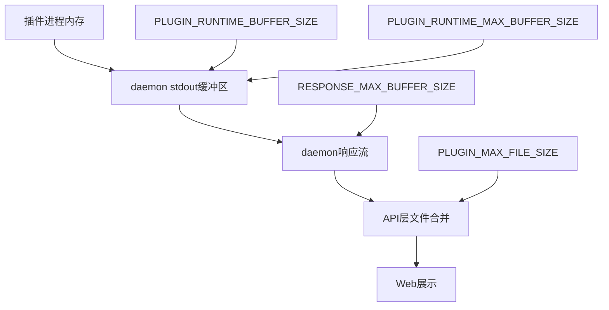

# Dify 插件内存配置源码分析与设置建议

## 前言

在 Dify 插件开发中，`manifest.yaml` 里的 `resource` 配置常常让人困惑：

- `memory` 的单位到底是什么？
- `storage.size` 是内存还是磁盘？
- 这个内存限制到底由谁来执行？
- 我的插件只是做接口转发，一次可能返回 1 万条 1KB 的数据，大约 10MB，256MB 内存够不够用？

本文结合 `dify` 主仓库与 `dify-plugin-daemon` 源码，完整梳理 `resource` 字段的定义、解析、运行时使用流程，并给出接口转发场景下的内存设置建议。

---

## 一、manifest.yaml resource 字段详解

### 1.1 典型配置示例

```yaml
resource:
  memory: 268435456
  permission:
    tool:
      enabled: true
    storage:
      enabled: true
      size: 1048576
    endpoint:
      enabled: true
```

### 1.2 字段含义与单位

| 字段 | 类型 | 单位 | 默认值约束 | 含义 |
|---|---|---|---|---|
| `memory` | int64 | 字节 bytes | 必填 | 插件运行时声明的内存需求 |
| `permission.tool.enabled` | bool | - | false | 是否允许插件反向调用 Dify 工具 |
| `permission.storage.enabled` | bool | - | false | 是否允许插件使用持久化存储 |
| `permission.storage.size` | uint64 | 字节 bytes | 最小 1024 最大 1073741824 | 持久化存储容量上限 |
| `permission.endpoint.enabled` | bool | - | false | 是否允许插件注册 HTTP Endpoint |

### 1.3 源码定义位置

在 `dify-plugin-daemon/pkg/entities/plugin_entities/plugin_declaration.go` 中定义如下：

```go
type PluginResourceRequirement struct {
    Memory int64 `json:"memory" yaml:"memory" validate:"required"`
    Permission *PluginPermissionRequirement `json:"permission,omitempty" yaml:"permission,omitempty"`
}

type PluginPermissionStorageRequirement struct {
    Enabled bool   `json:"enabled" yaml:"enabled"`
    Size    uint64 `json:"size" yaml:"size" validate:"min=1024,max=1073741824"`
}
```

其中 `PluginPermissionStorageRequirement.Size` 的校验规则明确说明：最小 1024 字节，最大 1073741824 字节即 1GB。

在 `dify/api/core/plugin/entities/plugin.py` 中也有对应的 Pydantic 模型：

```python
class PluginResourceRequirements(BaseModel):
    memory: int

    class Permission(BaseModel):
        class Storage(BaseModel):
            enabled: bool | None = Field(default=False)
            size: int = Field(ge=1024, le=1073741824, default=1048576)
```

### 1.4 数值换算

以你的配置为例：

- `memory: 268435456` = 256 MB
- `storage.size: 1048576` = 1 MB

---

## 二、源码追踪：memory 从哪里来、到哪里去

### 2.1 manifest 解析流程

当插件被安装或加载时，`dify-plugin-daemon` 会读取 `manifest.yaml` 并解析为 `PluginDeclaration` 结构体。核心函数位于 `dify-plugin-daemon/pkg/entities/plugin_entities/plugin_declaration.go`：

```go
func UnmarshalPluginDeclarationFromYaml(data []byte) (*PluginDeclaration, error) {
    obj, err := parser.UnmarshalYamlBytes[PluginDeclaration](data)
    if err != nil {
        return nil, err
    }

    if err := validators.GlobalEntitiesValidator.Struct(obj); err != nil {
        return nil, err
    }

    obj.FillInDefaultValues()
    return &obj, nil
}
```

`Resource.Memory` 在这里被校验为必填项，之后被存入 `PluginRuntime.Config`。

### 2.2 local runtime 启动流程

在 `dify-plugin-daemon/internal/core/local_runtime/constructor.go` 中构造本地运行时：

```go
func ConstructPluginRuntime(
    appConfig *app.Config,
    pluginDecoder decoder.PluginDecoder,
) (*LocalPluginRuntime, error) {
    manifest, err := pluginDecoder.Manifest()
    if err != nil {
        return nil, errors.Join(err, fmt.Errorf("get plugin manifest error"))
    }

    runtime := &LocalPluginRuntime{
        PluginRuntime: plugin_entities.PluginRuntime{
            Config: manifest,
            State: plugin_entities.PluginRuntimeState{
                Status: plugin_entities.PLUGIN_RUNTIME_STATUS_PENDING,
            },
        },
    }
    return runtime, nil
}
```

注意：`manifest.Resource.Memory` 被读入 `runtime.Config`，但**没有被用于设置进程内存限制**。

### 2.3 子进程启动：没有 cgroup 或 rlimit

在 `dify-plugin-daemon/internal/core/local_runtime/subprocess.go` 中：

```go
func (r *LocalPluginRuntime) getInstanceCmd() (*exec.Cmd, error) {
    pythonPath, err := r.getVirtualEnvironmentPythonPath()
    cmd = exec.Command(pythonPath, "-m", r.Config.Meta.Runner.Entrypoint)
    cmd.Env = cmd.Environ()
    cmd.Dir = r.State.WorkingPath
    return cmd, nil
}
```

这里直接用 `exec.Command` 启动 Python 进程，**没有**调用：

- Linux cgroup v1/v2 的 memory 控制器
- `syscall.Setrlimit(RLIMIT_AS)`
- Docker 的 `--memory` 参数
- 任何其他内存隔离机制

因此，在 **local 模式** 下，`manifest.yaml` 中的 `memory` 字段目前主要是一个**声明值**，告诉平台和用户该插件预计需要多少内存。实际占用由 Python 进程本身和操作系统 OOM 机制决定。

### 2.4 Serverless 模式

在 `dify-plugin-daemon/internal/core/serverless_connector/connector.go` 中，部署函数时只上传了 `verified` 标志和 `metadata`：

```go
serverless_connector_response, err := http_requests.PostAndParseStream(...,
    http_requests.HttpPayloadMultipart(
        map[string]string{
            "verified": ...,
            "metadata": string(metadata),
        },
        map[string]http_requests.HttpPayloadMultipartFile{
            "context": { ... },
        },
    ),
)
```

`Resource.Memory` 并没有被显式传递到 serverless 部署接口。最终是否生效取决于底层 serverless 平台自身的资源分配策略。

### 2.5 权限字段的使用

与 `memory` 不同，`permission` 下的各个 `enabled` 字段是**严格生效**的。例如工具反向调用权限检查位于 `dify-plugin-daemon/internal/core/io_tunnel/backwards_invocation/task.go`：

```go
permissionMapping = map[dify_invocation.InvokeType]map[string]any{
    dify_invocation.INVOKE_TYPE_TOOL: {
        "func": func(declaration *plugin_entities.PluginDeclaration) bool {
            return declaration.Resource.Permission.AllowInvokeTool()
        },
        "error": "permission denied, you need to enable tool access in plugin manifest",
    },
}
```

如果 `permission.tool.enabled` 为 false，插件调用 Dify 工具时会被拒绝。

---

## 三、接口文档

以下是与插件内存和数据返回相关的主要接口说明。

### 3.1 插件工具调用接口

**请求方式**：POST

**请求路径**：`/plugin/{tenant_id}/dispatch/tool/invoke`

**请求头**：

| 名称 | 类型 | 必填 | 说明 |
|---|---|---|---|
| X-Plugin-ID | string | 是 | 插件唯一标识 |
| Content-Type | string | 是 | application/json |

**请求体**：

```json
{
  "user_id": "string",
  "conversation_id": "string | null",
  "app_id": "string | null",
  "message_id": "string | null",
  "data": {
    "provider": "string",
    "tool": "string",
    "credentials": {},
    "credential_type": "string",
    "tool_parameters": {}
  }
}
```

**返回类型**：`ToolInvokeMessage` 流

| 字段 | 类型 | 说明 |
|---|---|---|
| type | string | 消息类型 如 TEXT IMAGE BLOB BLOB_CHUNK JSON |
| message | object | 具体消息内容 |
| meta | object | 元数据 |

### 3.2 反向调用 Dify 工具接口

插件内部可以通过 SDK 反向调用 Dify 工作流中的其他工具。

**触发方式**：插件通过 stdout 发送反向调用事件

**权限校验**：检查 `declaration.Resource.Permission.AllowInvokeTool()`

**处理位置**：`dify-plugin-daemon/internal/core/io_tunnel/backwards_invocation/task.go`

**返回值**：流式 `ToolInvokeMessage`

### 3.3 持久化存储接口

插件通过 SDK 调用 storage 相关能力。

**操作类型**：

- `STORAGE_OPT_GET` 读取
- `STORAGE_OPT_SET` 写入
- `STORAGE_OPT_DEL` 删除
- `STORAGE_OPT_EXIST` 检查存在

**容量限制**：受 `permission.storage.size` 约束，单位字节，默认 1MB，最大 1GB。

**处理位置**：`dify-plugin-daemon/internal/core/io_tunnel/backwards_invocation/task.go` 第 543-639 行。

---

## 四、数据流与内存占用分析

### 4.1 整体数据流


### 4.2 工具调用时序图

```mermaid
sequenceDiagram
    participant User as 用户
    participant Web as Dify Web
    participant API as Dify API
    participant Daemon as Plugin Daemon
    instance Plugin as 插件进程

    User ->> Web: 发起工作流运行
    Web ->> API: 调用工具节点
    API ->> Daemon: POST tool invoke
    Daemon ->> Plugin: 通过stdin写入请求
    Plugin ->> Plugin: 调用上游接口
    Plugin -->> Plugin: 构造响应JSON
    Plugin ->> Daemon: 通过stdout返回响应
    Daemon ->> API: HTTP流式返回
    API ->> API: 合并chunk并处理
    API ->> Web: 返回结果
    Web ->> User: 展示结果
```

### 4.3 各环节内存与大小限制



| 配置项 | 默认值 | 位置 | 作用 |
|---|---|---|---|
| `memory` | 由 manifest 声明 | `manifest.yaml` | 声明插件进程预期内存 |
| `PLUGIN_RUNTIME_BUFFER_SIZE` | 1024 bytes | `dify-plugin-daemon/internal/types/app/config.go` | stdout 初始缓冲区 |
| `PLUGIN_RUNTIME_MAX_BUFFER_SIZE` | 5242880 bytes 即 5MB | 同上 | stdout 单行最大长度 |
| `RESPONSE_MAX_BUFFER_SIZE` | 31457280 bytes 即 30MB | 同上 | 整个响应流最大缓冲 |
| `PLUGIN_MAX_FILE_SIZE` | 52428800 bytes 即 50MB | `dify/api/configs/feature/__init__.py` | API 层文件合并大小上限 |
| `max_chunk_size` | 8192 bytes | `dify/api/core/plugin/utils/chunk_merger.py` | 单块 BLOB 大小上限 |

---

## 五、10MB 数据返回场景分析

### 5.1 数据量估算

假设每条记录约 1KB，一次返回 1 万条：

```
1 KB x 10000 = 10000 KB = 9.77 MB 约 10 MB
```

如果再加上 JSON 的引号、括号、转义等开销，实际传输体积可能达到 12-15 MB。

### 5.2 关键风险点

#### 风险一：单行 stdout 超过 5MB

`dify-plugin-daemon` 使用 `bufio.Scanner` 读取插件 stdout：

```go
scanner.Buffer(
    make([]byte, s.appConfig.GetLocalRuntimeBufferSize()),
    s.appConfig.GetLocalRuntimeMaxBufferSize(),
)
```

默认最大缓冲区为 5MB。如果你的插件把 10MB 的 JSON 作为**一整行**输出，scanner 会报错，导致插件实例被 kill。

#### 风险二：响应流超过 30MB

`RESPONSE_MAX_BUFFER_SIZE` 默认 30MB。如果一次返回 10MB，单个请求不会触发。但如果并发或连续返回多段大内容，可能累积触发。

#### 风险三：API 层 50MB 文件限制

如果返回的是 BLOB 类型文件，`PLUGIN_MAX_FILE_SIZE` 默认 50MB，10MB 不会触发。

### 5.3 推荐返回方式

| 方式 | 是否推荐 | 说明 |
|---|---|---|
| 一次性返回 10MB 单行 JSON | 不推荐 | 会超过 5MB 缓冲区 |
| 分页返回 | 推荐 | 每次返回少量数据 由工作流聚合 |
| 流式 yield 返回 | 推荐 | 每段小于 5MB |
| 返回 BLOB 分片 | 视情况 | 适合文件类数据 |

---

## 六、配置建议与注意事项

### 6.1 接口转发插件的推荐配置

```yaml
resource:
  memory: 268435456
  permission:
    tool:
      enabled: true
    storage:
      enabled: false
      size: 1048576
    endpoint:
      enabled: true
```

如果你的插件不需要持久化存储，建议把 `storage.enabled` 设为 `false`。

### 6.2 是否需要调整 memory

对于只做接口转发的插件：

- 256MB 通常足够；
- 如果处理 10MB 级响应，Python 进程峰值可能在 100-200MB 之间；
- 如果频繁并发处理大响应，可以适当提升到 512MB。

### 6.3 必须调整的环境变量

如果你确实需要一次性返回 10MB 以上的大 JSON，需要调整 daemon 的环境变量：

```bash
# dify-plugin-daemon 环境变量
PLUGIN_RUNTIME_MAX_BUFFER_SIZE=20971520      # 20MB
RESPONSE_MAX_BUFFER_SIZE=52428800            # 50MB
```

注意：调大缓冲区会增加 daemon 进程的内存占用，需要同时保证 daemon 容器本身有足够内存。

### 6.4 代码层面优化建议

1. **流式读取上游响应**

```python
import requests

response = requests.get(url, stream=True)
for chunk in response.iter_content(chunk_size=8192):
    # 处理分片
    pass
```

2. **避免重复序列化**

不要多次 `json.loads` 和 `json.dumps` 同一个大对象。

3. **使用生成器分批返回**

```python
def query_devices(page_size=100):
    for page in fetch_pages(page_size):
        yield create_text_message(json.dumps(page))
```

4. **监控实际内存使用**

在插件容器或 daemon 中观察 Python 进程 RSS 内存，判断真实占用。

### 6.5 注意事项清单

- `memory` 单位是字节，不是 MB 或 GB；
- `storage.size` 不是运行时内存，是持久化存储配额；
- local 模式下 `memory` 不强制隔离， declaration 仅供参考；
- 大响应必须避免单行 stdout 超过 `PLUGIN_RUNTIME_MAX_BUFFER_SIZE`；
- 并发大响应会叠加 daemon 和 API 的内存压力；
- 插件被 kill 时优先检查 stdout 是否被关闭或缓冲区是否溢出。

---

## 七、总结

`manifest.yaml` 中的 `resource` 字段单位均为字节，其中：

- `memory` 声明插件运行时期望内存，local 模式下不强制隔离；
- `permission.storage.size` 控制插件持久化存储上限，由 daemon 严格校验；
- `permission.tool.enabled` 等权限字段在运行时会实际生效。

对于只做接口转发、一次返回约 10MB 数据的插件：

- 保持 `memory: 268435456` 即可；
- 重点关注返回方式，避免单行 stdout 超过 5MB；
- 如需大响应，调整 `PLUGIN_RUNTIME_MAX_BUFFER_SIZE` 和 `RESPONSE_MAX_BUFFER_SIZE`；
- 更优雅的做法是上游分页或插件分批 yield。

理解这些源码细节，可以帮助你在开发和运维 Dify 插件时，更准确地评估内存需求、排查 OOM 和缓冲区溢出等问题。

---

## 参考源码位置

- `dify-plugin-daemon/pkg/entities/plugin_entities/plugin_declaration.go`
- `dify-plugin-daemon/internal/core/local_runtime/constructor.go`
- `dify-plugin-daemon/internal/core/local_runtime/subprocess.go`
- `dify-plugin-daemon/internal/core/local_runtime/instance.go`
- `dify-plugin-daemon/internal/types/app/config.go`
- `dify-plugin-daemon/internal/core/io_tunnel/backwards_invocation/task.go`
- `dify-plugin-daemon/internal/core/serverless_connector/connector.go`
- `dify/api/core/plugin/entities/plugin.py`
- `dify/api/core/plugin/utils/chunk_merger.py`
- `dify/api/configs/feature/__init__.py`
